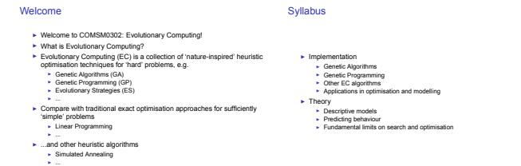
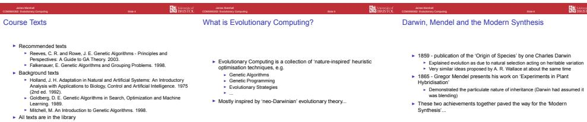
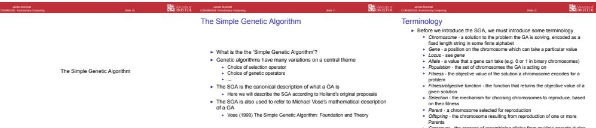
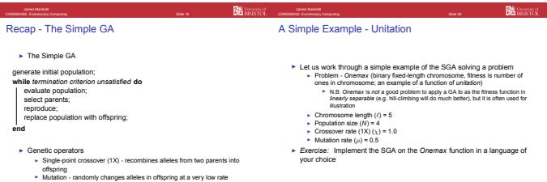

<table><tr><td>Week</td><td>Topic</td></tr><tr><td>1</td><td>Introduction / Simple Genetic Algorithm</td></tr><tr><td>1</td><td>GA: Representations &amp; Operators</td></tr><tr><td>2</td><td>GA: Populations &amp; Selection</td></tr><tr><td>2</td><td>GA: Advanced Operators &amp; Techniques</td></tr><tr><td>3</td><td>GA for Grouping Problems</td></tr><tr><td>3</td><td>Overview of Genetic Programming</td></tr><tr><td>4</td><td>GP: Case Studies</td></tr><tr><td>4</td><td>GP: Case Studies</td></tr><tr><td>5</td><td>GP: Case Studies</td></tr><tr><td>5</td><td>No Free Lunch Theorems</td></tr></table>

<table><tr><td>Week</td><td>Topic</td></tr><tr><td>6</td><td>Schema Theory</td></tr><tr><td>6</td><td>GAs as Markov Processes</td></tr><tr><td></td><td>Dynamical Systems GA Model</td></tr><tr><td></td><td>Statistical Mechanics Approximation of GA</td></tr><tr><td>8</td><td>Predicting GA Performance</td></tr><tr><td>8</td><td>Fitness Landscapes</td></tr><tr><td>9</td><td>Memetic Algorithms</td></tr><tr><td>9</td><td>Evolution Strategies</td></tr><tr><td>10</td><td>Estimation of Distribution Algorithms</td></tr><tr><td>10</td><td>Artificial Life &amp; Modelling</td></tr></table>

# The Modern Synthesis (aka neo-Darwinism)

# The Modern Synthesis (aka neo-Darwinism)

# The Emergence of Evolutionary Computing

One problem that had worried Darwin was 'regression' of traits I Darwin assumed blending of heritable material Hence the ‘value’ of any trait would tend to converge in a population as evolution progressed I The resulting lack of variation in the population would give natural selection nothing to act on, so evolution would stall

I Mendel’s results went un-noticed by evolutionists for about 30 years

I Once rediscovered, Mendel’s laws of particulate (i.e. genetic) inheritance were incorporated into Darwinian evolutionary theory   
The result was the 'modern synthetic theory of evolution', or ‘neo-Darwinism’ I Emphasises natural selection acting on genetic variation in populations I Primarily mathematical in nature, modelling gene spread in populations Population genetics I Quantitative genetics   
Subsequently, the physical basis of particulate inheritance was found I Discovery of DNA by James Watson and Francis Crick, 1962 Nobel Laureates in Medicine

In the 1970's Genetic Algorithms became a prominent research area

John Holland presented a mathematical definition of GAs, and theory explaining their performance I Holland (1975) Adaptation in Natural and Artificial Systems   
Holland was mainly interested in adaptive systems. but his student Ken De Holland was mainly interested in adaptive systems, but his student Ken DeJong catalysed reseach on for GAs for optimisation, formulating a test suite of problems I De Jong (1975) An Analysis of the Behavior of a Class of Genetic Adaptive

<table><tr><td colspan="2"> R </td><td colspan="2"> </td></tr><tr><td>The Simple Genetic Algorithm generate initial chromosome population;</td><td>Selection</td><td>Selection</td><td></td></tr><tr><td>while termination criterion not met do evaluate population fitness;</td><td>A key idea of the GA is that parents should be selected based on their fitness</td><td>The simplest way of doing this is using roulette wheel selection</td><td>Having selected a parent we then reproduce that parent according to our</td></tr><tr><td>while insufficient offspring created do select parents by fitness;</td><td></td><td>Each chromosome i in the population P is assigned a probability of selection p based on its ftness f as a proportion of total population fitness:</td><td>operators, parameters, etc. According to our parameters we may apply crossover, and/or mutation,</td></tr><tr><td>if crossover condition satisfied then perform crossover;</td><td></td><td></td><td>Often crossover rate (probability of applying crossover during reproduction) and/or any other operators</td></tr><tr><td>end</td><td></td><td>fi</td><td>is referred to as </td></tr><tr><td>if mutation condition satisfied then</td><td></td><td>i =</td><td>Similarly mutation rate (per gene probability of mutation during reproduction)</td></tr><tr><td>select chromosome for mutation;</td><td></td><td>∑′</td><td>by μ</td></tr><tr><td>perform mutation;</td><td></td><td>jP</td><td>Usually population size is held constant…</td></tr><tr><td>end</td><td></td><td>So for a given population we construct a single-pointer &#x27;roulette wheel&#x27;</td><td>eon see n ein unt ehven offrin</td></tr><tr><td>add offspring to population;</td><td></td><td>where each chromosome&#x27;s proportion of the wheel is given by the</td><td>to replace the current generation</td></tr><tr><td>end</td><td></td><td>equation above</td><td>Hence such a GA is called a &#x27;generational GA</td></tr><tr><td>select new population;</td><td></td><td>To select a parent for reproduction we uniformly sample from [0, 1)</td><td></td></tr><tr><td></td><td></td><td></td><td></td></tr><tr><td>end</td><td></td><td>i.e. we spin the roulette wheel once and see which chromosome its pointer indicates</td><td></td></tr></table>

I The simplest representations use a binary alphabet I In fact, as we’ll see later, Holland argued for the optimality of binary encoding I We shall assume binary chromosomes for the Simple GA

# Single-Point Crossover

I Holland’s initial proposal for genetic recombination in GAs was single-point crossover (1X) For a pair of parent chromosomes of length \`, we (uniformly) choose at random an integer from 1, 2, . . . , \` 1 We then exchange portions of each chromosome, combining the substring left of the cutpoint from one chromosome with the substring right of the cutpoint from the other chromosome, and vice versa I e.g. the parent chromosomes 11111 and 00000 with the randomly selected crossover point at position 3... I ...yield the offspring chromosomes 11100 and 00011   
I We now have two offpsring chromosomes, each containing alleles from both parent chromosomes Optionally we can discard one of the offspring if we only require one offspring

# Mutation

I During reproduction mutation occurs at a (usually low) rate, in addition to crossover   
I Normally mutation rate is expressed as a per-gene probability   
I If a gene is mutated, its current allele is exchanged for a different randomly selected allele I If our chromosomes are binary strings, there is only one other possible allele and the gene is simply bit-flipped   
A typical mutation rate might be on the order of 0.01 probability of mutation per gene ‘transcribed’