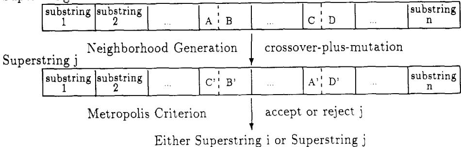
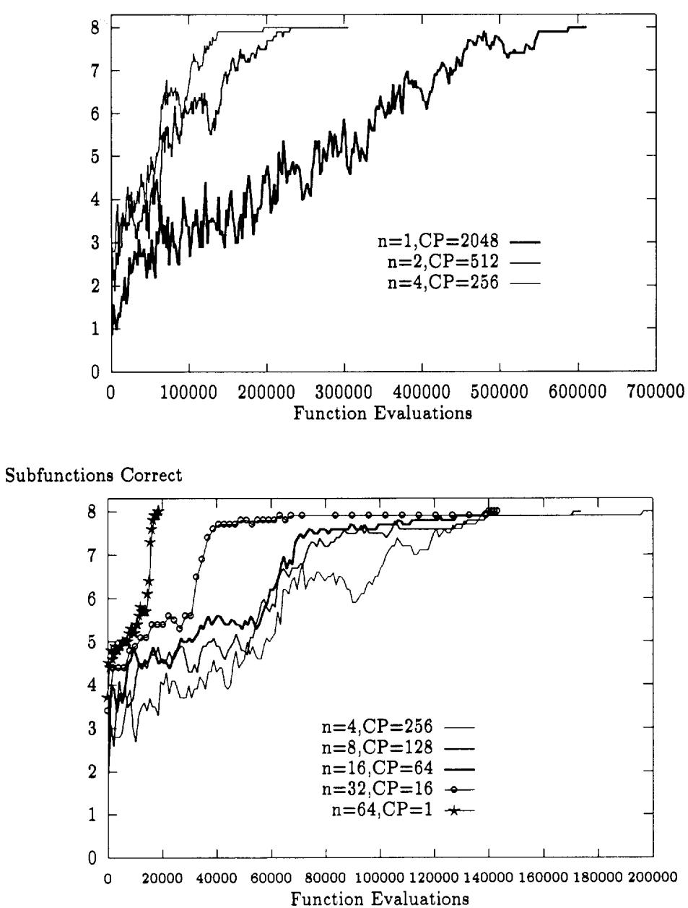
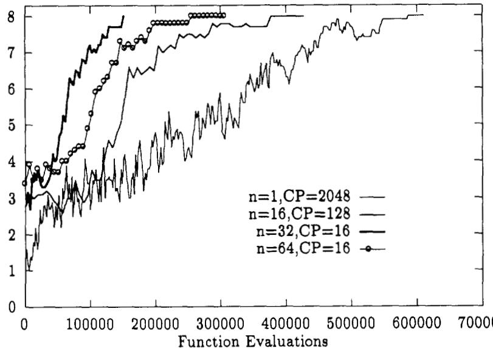
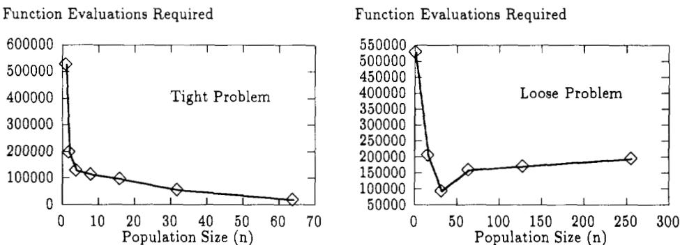

# Parallel recombinative simulated annealing: A genetic algorithm

Samir W. Mahfoud a,\*, David E. Goldberg b

a Department of Computer Science, University of Illinois at Urbana-Champaign, 1304 West Springfield Avenue, Urbana, IL 61801, USA   
l 104 South Mathews Avenue, Urbana, IL 61801, USA

Received 28 May 1992; revised 3 February 1993, 15 November 199.

# Abstract

This paper introduces and analyzes a parallel method of simulated annealing. Borrowing from genetic algorithms, an effective combination of simulated annealing and genetic algorithms, called parallel recombinative simulated annealing, is developed. This new algorithm strives to retain the desirable asymptotic convergence properties of simulated annealing, while adding the populations approach and recombinative power of genetic algorithms. The algorithm iterates a population of solutions rather than a single solution, employing a binary recombination operator as well as a unary neighborhood operator. Proofs of global convergence are given for two variations of the algorithm. Convergence behavior is examined, and empirical distributions are compared to Boltzmann distributions. Parallel recombinative simulated annealing is amenable to straightforward implementation on SIMD, MIMD, or shared-memory machines. The algorithm, implemented on the CM-5, is run repeatedly on two deceptive problems to demonstrate the added implicit parallelism and faster convergence which can result from larger population sizes.

Keywords: Simulated annealing; Genetic algorithm; Parallel recombinative simulated annealing (PRSA); Shared-memory multiprocessor; CM-5, Implementation features; Performance results

# 1. Introduction

Simulated annealing (SA) and genetic algorithms (GAs) are similar, naturally motivated, general-purpose optimization procedures [18]. Both techniques work reasonably well on a variety of problems, and require little problem-specific knowledge other than fitness or energy (cost) information. The two techniques generate new points in the search space by applying operators to current points, and move probabilistically towards more optimal regions of the search space.

SA and GAs possess some crucial but reconcilable differences. While in practice both may converge prematurely to suboptimal points, only SA currently possesses a formal proof of convergence. This proof depends on SA's cooling schedule. By manipulating the cooling schedule, the SA practitioner can exercise control over convergence; slower cooling and more iterations lead to better final solutions. GAs employ no such concept of cooling, and GA convergence is not easily controlled. The addition of temperature and cooling may help prove convergence for the GA [12,18].

Smaller contrasts have to do with loss of solutions, redundancy, and deception. Since SA maintains only one structure (solution) at a time, whenever it accepts a new structure, it must discard the old one; there is no redundancy and no history of past structures. The end result is that good structures and substructures (in the extreme case the global optimum) can be discarded, and, if cooling proceeds too quickly, may never be regained. SA compensates by increasingly sampling good solutions as temperature decreases. GAs are also prone to the loss of solutions and their substructures or bits [13], due to the disruptive effects of genetic operators. Upon disruption, the simple GA will not maintain an old, but better solution; it must accept any newly generated solution, regardless of fitness. However, the GA partially overcomes this, especially at larger population sizes, by exponentially increasing the sampling of above-average regions of the search space, known as schemata [17,27]. A schema is a subset of the solution space, whose elements are identical in certain fixed bit-positions. Schemata act as a partial history of beneficial components of past solutions. However, for each above-average schema duplicated, a competing, below-average schema must be discarded. This can lead to trouble on hard or deceptive problems, where low-order, low-fitness schemata are needed for the construction of an optimal higher-order schema [19] (Section 6.1 explains deception). SA is similarly subject to deception, as the algorithm will have a difficult time paying extended visits to the high-cost neighbors of a deceptive problem's global optimum.

A final but important difference between GAs and SA is the ease with which each algorithm can be made to run in parallel. GAs are naturally parallel  they iterate an entire population using a binary recombination operator (crossover) as well as a unary neighborhood operator (mutation). SA, on the other hand, iterates a single point (using only a neighborhood operator); it is not easily run on parallel processors. While attempts have been made to parallelize SA, a straightforward, satisfactory, general-purpose method has not yet been demonstrated. It would thus be desirable to transfer the parallel processing capabilities of GAs to SA.

The parallelism mentioned above is the traditional notion of parallelism, which we call explicit parallelism. GAs also exhibit implicit parallelism [27]. In short, implicit parallelism refers to the fact that although GAs explicitly process string representations, they implicitly process schemata. An increase in the number of strings in the population yields a disproportionately large increase in the number of schemata processed each generation. Standard methods of parallelizing SA achieve limited explicit speedup, but exhibit no implicit parallelism. With explicit parallelism alone, we would expect a speedup of less than $P$ , given $P$ processors. With the addition of implicit parallelism, assuming a constant number of population elements per processor, we can potentially achieve polynomial (superlinear) speedup, since the number of useful schemata increases polynomially [27]. Section 7 provides two examples of such speedup. Although there is currently no guarantee that this fast-convergence mode of GAs solves all problems to optimality, there are ample documented cases of its success to warrant the design of simulated annealers which exhibit implicit parallelism.

The following two sections review previous attempts at parallel SA, including genetic approaches. Section 4 presents the parallel recombinative simulated annealing algorithm, and Section 5 gives global convergence properties for three variations. Section 6 describes the test problems, along with parameters and their settings. The remaining sections present results, their analysis, extensions, and conclusions.

# 2. The quest for a parallel simulated annealing

This section reviews basic simulated annealing and previous attempts at parallelization.

# 2.1. Simulated annealing

Simulated annealing [2,29] is an optimization technique, analogous to the physical process of annealing. SA starts with a high temperature $T$ and any initial state. A neighborhood operator is applied to the current state $i$ (having energy $E _ { i } )$ to yield state $j$ (having energy $E _ { j } )$ . If $E _ { j } < E _ { i }$ , $j$ becomes the current state. Otherwise $j$ becomes the current state with probability, $e ^ { ( E _ { i } - E _ { j } ) / T }$ (if $j$ is not accepted, $i$ remains the current state). The application of the neighborhood operator and the probabilistic acceptance of the newly generated state are repeated either a fixed number of iterations or until a quasi-equilibrium is reached. The entire above-described procedure is performed repeatedly, each time starting from the current $i$ and from a lower $T$ .

Note that for any given $T$ , a sufficient number of iterations always leads to equilibrium, at which point the temporal distribution of accepted states is stationary (this stationary distribution is Boltzmann). Also note that at high $T$ , almost any change is accepted  the algorithm visits a very large neighborhood of the current state. At lower $T$ , transitions to higher energy states become less frequent and the solution stabilizes. Although the choice of an appropriate neighborhood operator is beyond the scope of this paper, some common ones swap or invert $k$ bits of the current solution.

The SA algorithm, as described above, is called the Metropolis algorithm [34]. What distinguishes the Metropolis algorithm from some other potential SA algorithms is the criterion by which the newly generated state is accepted or rejected. An alternative criterion, used in Boltzmann machines and in this paper's implementation of parallel recombinative simulated annealing, is to retain the current state with logistic probability, $1 / ( 1 + e ^ { ( E _ { i } - E _ { j } ) / T } )$ ;otherwise accept the newly generated state [5,18,35]. We call this the logistic acceptance criterion. The two criteria both lead to a Boltzmann distribution.

The key to SA's proof of convergence is that a stationary distribution must be reached at each temperature, followed by sufficiently slow cooling. A side-effect of this proof is that other algorithms which achieve a stationary Boltzmann distribution, and which perform sufficiently slow cooling, will inherit the same convergence guarantees [18].

# 2.2. Basic attempts at parallelization

Before proceeding further, one might ask the following question: if SA guarantees convergence, then why alter the algorithm? Speed is the main reason. Although the convergence guarantee applies in theory, given limited computational time and a sufficiently hard problem, SA may return an unacceptable, suboptimal solution.

An obvious approach to increasing speed is parallelism. However, because SA iterates from only one current point, it is not easily made parallel. Nevertheless, many parallel implementations have been suggested or are in use. Most suffer from the fact that they attempt to implement the inherently serial Metropolis algorithm in parallel.

One such attempt is functional decomposition  to divide the evaluation of the cost function among several processors. This may work reasonably well if the function is decomposable, but many times it is either not possible to find a suitable division of labor, or communication times between processors negate any gain. Even in the decomposable case, there is a highly function-dependent limit on the number of processors that can be used to cooperatively evaluate a function.

Another popular parallel implementation uses all available processors to simultaneously generate and evaluate neighbors of the current solution, until one of the neighbors is accepted. A good implementation can be found in [36]. This strategy is most useful late in a run, when most transitions are rejected.

Other techniques divide the variables of the structure being optimized among the available processors, allowing simultaneous move generation, evaluation, and update of the structure [6,14,24,35]. Synchronization, dependence of variables, and noisy evaluation are important issues that arise in such problem decomposition approaches. An ideal situation arises if the structure can be decomposed in such a way that all $P$ processors are allocated an equal number of variables, and each processor's set of variables contributes independently to the structure's energy. In this case, SA can make independent moves on each processor. Such a situation will present itself in Section 5.2.

A different approach [1] allows separate processors to perform overlapping computation of transitions at consecutive temperatures. Individual solutions compete against solutions produced at adjacent temperatures, using acceptance probabilities which have the net result of approximating the Boltzmann distribution at each temperature. Unfortunately, as processors are added, more overall transitions must be computed to achieve the same degree of accuracy. The authors estimate a critical number of about 30 processors, beyond which no further increase in speed is possible.

Also worth mentioning is the Boltzmann machine [2,5], a connectionist network whose units accept transitions according to the logistic acceptance criterion, so that the overall network gravitates towards a global energy minimum. Traditionally, the Boltzmann machine has been used for machine learning or pattern classification. However, combinatorial optimization problems can also be mapped onto the machine [3].

# 3. The genetic approach

A massively parallel simulated annealing would proceed from many points simultaneously and independently, and would periodically reconcile solutions. Genetic approaches attempt this, while offering the additional benefit of implicit parallelism.

# 3.1. Genetic algorithms

Genetic algorithms [17,27] are inherently parallel, general-purpose optimization procedures, which utilize a 'survival of the fittest' approach. New strings are generated by applying genetic operators to strings in the current population. A simple $G A$ employs the selection, crossover, and mutation operators.

Simple GAs have their own problems. Earlier we mentioned disruption of good subsolutions by mutation and crossover operators. Varying the amount of disruption presents a tradeoff between diversity and performance (exploration and exploitation). Maintaining diversity is a prominent consideration. GAs using selection alone can not generate solutions outside the population. As selection proceeds, alternatives dwindle. Crossover and mutation generate new solutions, but with certain limitations. Crossing nearly identical strings yields offspring similar to the parent strings. Consequently, crossover can not reintroduce diversity. Mutation, on the other hand, can generate the full solution space, but may take an excessively long time to yield a desirable solution.

In addition, it is not easy to regulate a GA's convergence. Tuning global parameters such as population size, mutation probability, and crossover probability, has been the most recommended technique for controlling premature convergence in the GA. Although some guidelines for population sizing do exist [20], and certain parameters are effective for particular test problems [13,25], a generally effective method for setting parameters has not yet been demonstrated. Ideal parameters are likely problem-dependent.

# 3.2. Genetic algorithm / simulated annealing hybrids

In implementing a parallel SA using GA principles, we seek to incorporate strengths and eliminate weaknesses of both methods. Ackley employs a Boltzmann-machine-like structure and both genetic and hillclimbing principles in an early hybrid algorithm [4]. However, the added complexity of its underlying connectionist architecture makes comparison with other hybrids difficult.

Sirag and Weisser [38] combine several genetic operators into a 'unified thermodynamic operator' to solve ordering problems such as the travelling salesman. The unified operator is applied to two selected parents to yield a single offspring. At high temperatures, the offspring differs dramatically from either parent; at low temperatures, the offspring greatly resembles one or both parents. The approach comes with no convergence guarantees. It is likely that the use of fitness-proportionate selection will heavily bias the population in favor of the best individuals, depriving it of lower-fitness points from which to search. Segrest outlines a similar method [37] which lowers temperature each time population entropy stabilizes. His method does not incorporate crossover.

Boseniuk and Ebeling introduce a variety of 'Boltzmann-Darwin' strategies for solving the travelling salesman problem. The simplest strategy [10] runs several SAs with inversion (reversing the order of cities in a sub-tour) as the neighborhood operator. Periodically, selection compares the current solutions of two processors, and probabilistically overwrites the worse with the better. A second strategy [8] performs this selection only at the end of the annealing schedule, then restarts annealing at a high temperature. Each annealing schedule is called a 'life cycle'. A third strategy [9] includes crossover at the end of each life cycle. The authors [9] compare SA and the three strategies, allowing each method identical computation time. The crossover strategy yields the shortest tours, followed closely by the life-cycle strategy. The simplest strategy, while a slight improvement over SA, is far behind.

Brown, Huntley, and Spillane present a hybrid they call SAGA [11]. Each iteration of SAGA consists of several generations of a GA, followed by a full schedule of SA on each population element. To maintain good solutions produced by the GA, SA begins at a lower temperature than it otherwise would. The authors claim better results on various quadratic assignment problems than those achieved by either method alone. Lin, Kao, and Hsu do SA first [30]. Their 'annealinggenetic' algorithm performs a series of two-stage cycles of annealing followed by evolution. The annealing stage creates an intermediate population by applying a neighborhood operator and the Metropolis criterion, to current population elements. The evolution stage then applies fitness-proportionate selection, crossover, and mutation to the intermediate population to complete the cycle.

Goldberg's paper on Boltzmann tournament selection [18], which motivated the current study, was the first to explicitly outline the close correspondence between

SA and GAs. Boltzmann tournament selection proceeds by holding three-way tournaments each generation to fill population slots. Tournament winners are selected according to logistic acceptance and anti-acceptance probabilities. Goldberg gives both empirical and analytical evidence that the distribution of population members over time is nearly Boltzmann. However, due to genetic drift [23], diverse solutions gradually disappear from the population, even at high temperatures [31]. Once crossover and mutation are added, Boltzmann tournament selection experiences the same disruption problems as the simple GA. A similar algorithm by de la Maza and Tidor [33] does Boltzmann scaling of fitnesses prior to fitness-proportionate selection. If $U$ is the unscaled utility function, and $T$ is the temperature control parameter, then Boltzmann-scaled fitness is given by the equation, $F ( x ) = e ^ { \pm U ( x ) / T }$ , where the sign determines whether maximization or minimization is performed.

Also worth mentioning is Eiben, Aarts, and Van Hee's 'abstract genetic algorithm' [15], of which GAs and SA are special cases. Their theoretical view of the two algorithms is complementary to that presented here, specifically, that SA "can be viewed as a special form of genetic algorithm characterized by populations of size 1 ... where children are produced exclusively by mutation."

None of the hybrid methods thus far examined have duplicated SA's guaranteed asymptotic convergence. A previous analysis of Boltzmann tournament selection [31] uses Markov chains and empirical simulations to show that genetic drift is a formidable problem in such selection procedures. The paper states that "traditional selection algorithms which run long enough will eventually lose . all but one class." Accordingly, new hybrid designs may benefit from closer resemblance to parallel SA than to the GA, perhaps incorporating crossover as a solution-reconciling neighborhood operator.

# 4. Parallel recombinative simulated annealing

Parallel recombinative simulated annealing (PRSA) closely follows simulated annealing, if one imagines several copies of SA running in parallel, with mutation as the neighborhood operator, and crossover recombining independent solutions. Alternative solutions in PRSA, unlike in Boltzmann tournament selection, do not come purely from the current population, but from applying both crossover and mutation. Good solutions disappear only when replaced probabilistically by new, often better solutions; disruption by crossover and mutation is not a problem. This non-destructive style is similar to those of GENITOR [43] and CHC [16].

PRSA captures the essence and spirit of SA. Suppose we simultaneously run multiple, independent SAs on a problem, but we synchronize cooling across processors. This method will approach a Boltzmann distribution for each independent application of SA. The combined distribution from all applications will also approach Boltzmann. The only thing missing is to reconcile the independent solutions. This is where crossover comes in. As demonstrated later, crossover can be viewed as an extension to the common SA neighborhood operator. The resulting population-level neighborhood operator, crossover-plus-mutation, plays a role analogous to the neighborhood operator of SA.

# 4.1. The algorithm

In the algorithm below, $T$ is temperature, $n$ is population size, and $E _ { i }$ is the energy or cost of solution i. Parameters can be set using guidelines from both SA and GAs. PRSA performs minimization by default; for maximization, traditional GA fitness values should be negated.

# Parallel recombinative simulated annealing

A) Set $T$ to a sufficiently high value   
Initialize the population (usually randomly)   
(C) Repeatedly generate each new population from the current population as follows:

(1)Do $n / 2$ times: (a) Select two parents at random from the $_ n$ population elements (b) Generate two children using a recombination operator (such as crossover), followed by a neighborhood operator (such as mutation) (c) Hold one or two Boltzmann trials between children and parents 1 (d) Overwrite the parents with the trial winners

Periodically lower $T$

Note that in PRSA, convergence is strictly regulated by a cooling schedule, and parallelism is limited only by population size. Because of its slow cooling and diversity-maintaining operators, PRSA has little problem with genetic drift. Although some GAs can function without mutation, PRSA requires mutation or a similar neighborhood operator to achieve its Boltzmann distributions. Crossover alone, even uniform crossover, would not be sufficient, since the mutationless PRSA would only be combining good solutions and not searching in their neighborhoods. Both mutation and crossover are integral parts of the algorithm and must be incorporated into any analysis.

# 4.2. Required parameters

In order to run PRSA, the user must choose the desired population size, operators, and cooling schedule. The population size can be set as it would be in a simple GA. The effects of different population sizes are demonstrated later. An appropriate recombination operator must be chosen. We assume single-point crossover throughout this paper, though other recombination operators are useful for specific problems. Although the simple GA performs crossover with probability, $p _ { c }$ , PRSA crosses at every opportunity $ { \left( p _ { c } = 1 . 0 \right) }$ . The effective $p _ { c }$ can be lowered by crossing only a portion of the population, or by crossing once every few generations. No advantages of having $p _ { c }$ less than 1.0 are immediately apparent, since PRSA is not obligated to keep low-fitness children. This is consistent with the $p _ { c }$ used in other non-destructive GAs such as GENITOR [43].

PRSA requires a neighborhood operator such as mutation, or inversion (for permutation problems). We assume mutation with bitwise probability, $p _ { m }$ , in the remainder of the paper. In general, $p _ { m }$ should approximate a good SA neighborhood size for a particular problem. This may require higher mutation rates than those to which genetic algorithmists are accustomed. It is possible to vary $p _ { m }$ and, in fact, declining mutation rates are used in this paper's simulations. Optimal neighborhood sizes are problem-specific and their discussion is beyond the scope of this paper.

Cooling schedules are thoroughly discussed in the existing SA literature [2,6,26,28,35,39,42]; many of the SA results should extend to PRSA. In the runs that follow, temperature is decremented via multiplication with a positive constant, $C C < 1 . 0$ . PRSA appears sufficiently resilient to operate under most reasonable cooling schedules and parameter settings. As demonstrated in a later section, most parameters can be set by the program itself. However, it is not the intent of this paper to outline an optimal cooling procedure or optimal parameters, but to demonstrate the effectiveness and other properties of a parallel SA/GA hybrid.

# 4.3. Parallel implementation

PRSA can be straightforwardly implemented on a variety of parallel architectures. We present two prototype parallel algorithms, one synchronous and one asynchronous. Versions of both prototypes were successfully run on the CM-5 (Connection Machine). The prototype synchronous algorithm employs barrier synchronization, where each generation's end is a barrier. It consists of a host program, and a number of node programs under control of the host. Each node program runs on a separate processor. The host program runs on a processor or other control hardware. Let $G$ be the total number of generations PRSA is to run and $P$ be the number of node processors. Assume $n / P$ is a multiple of two.

# Synchronous prototype: Host program

(A) Repeat $G \mathrm { - } 1$ times:

(1) Randomly shuffle pointers to population elements (2) Receive population (all subpopulations) from nodes (3) Send population elements to nodes (according to shuffled pointers) Receive final population from nodes

# Synchronous prototype: Node programs

A) Set $T$ to a sufficiently high value   
( Initialize the subpopulation   
Repeat $G$ times: (1) Apply crossover and mutation to all subpopulation elements (2) Evaluate children and hold Boltzmann trials (3) Periodically lower $T$ (4) Send subpopulation to host (5) Receive new subpopulation from host (except on last iteration)

The only potential serial bottlenecks in the above algorithm are the shuffling of pointers, and the transfer of population elements between host and nodes. However, shuffling can be performed by the host while the nodes are processing each generation, or by the nodes prior to commencing the above node program (both shuffling methods worked when implemented on the CM-5). The "transfer" of population elements will have minimal impact on speed, given efficient SIMD hardware or efficient MIMD message-passing. Implementation on shared-memory machines is similar, except no physical transfer is necessary (nodes access the global population structure directly via pointers).

The prototype asynchronous algorithm is shown below:

Asynchronous prototype: All processors

) Set $T$ to a sufficiently high value   
Initialize the subpopulation   
Repeat $G$ times: (1) Apply crossover and mutation to all subpopulation elements (2) Evaluate children and hold Boltzmann trials Periodically lower $T$ (4) Send/receive migrants to/from other processors

The above method can be an exact or an approximate implementation of PRSA, depending upon how step C4 is accomplished. We tried an exact implementation for this paper, on the CM-5. Processors employed identical random number generators to arrive at destination nodes for each population element, after which, a total of $n / 2$ exchanges were performed. This method produced the results in Section 6.

Approximate implementations need not be so strict. Every few generations, a portion of each subpopulation can migrate to another processor. Furthermore, a fixed topology can govern interconnections between processors, limiting to neighboring processors the possible destinations for migrants. For GAs, many such implementations have been attempted [7]; smaller migration rates and increasingly local migration led to slower overall convergence. We expect similar behavior for PRSA; however, slower convergence due to cooling may override slower convergence due to migration. The interaction and interprocessor synchronization of migration and cooling are issues that need to be addressed in any approximate implementation.

While parallel implementations of SA perform functional or problem decomposition, parallel implementations of PRSA perform population decomposition. Since GAs typically thrive on large populations [20], PRSA can be made massively parallel. The above prototype implementations should encompass most practical parallel implementations.

# 5. Global convergence properties

In this section, we prove global convergence for two variations of PRSA, and discuss convergence properties of an intermediate variation. Variations 1 and 3 of PRSA are proved to be special cases of the Metropolis algorithm. Variation 2 serves as an intermediary between Variations 1 and 3. These three variations cover a significant range of possible PRSA implementations. We also examine finite-time convergence properties in this section, and compare distributions produced under various cost functions with the corresponding Boltzmann distributions.

# 5.1. Variation 1: Proof of global convergence

Variation 1 of the PRSA algorithm of Section 4.1 employs selection with replacement in step C1a, and double acceptance/rejection in step C1c. No population element can be selected as both parents in step C1a (self-mating is not allowed).

While it has been pointed out before that SA can be viewed as a GA with population size one, the opposite claim, that a GA can be a special case of SA, would seem extraordinary at first. However, this claim is true for Variation 1 of PRSA. To see this, concatenate all strings of the PRSA population in a side-by-side fashion so as to form one superstring. Define the fitness of this superstring to be the sum of the individual fitnesses of its component substrings (the former population elements). Let cost be the negated fitness of this superstring. The cost function will reach a global minimum only when each substring is identically at a global maximum. Thus, to optimize all elements of the former population, an algorithm can search for a global minimum for the cost function assigned to its superstring. This is precisely what Variation 1 does.

Considering the superstring as our structure to be optimized, Variation 1, as displayed graphically in Fig. 1, is now a special case of the Metropolis algorithm, where the crossover-plus-mutation neighborhood operator is applied to selected portions of the superstring to generate new superstrings. Crossover-plus-mutation's net effect as a population-level neighborhood operator is to swap two blocks of the superstring, and then probabilistically flip bits of these swapped blocks and of two other blocks (the other halves of each parent).

As a special case of SA, Variation 1 inherits the convergence behavior of SA, provided the neighborhood operator meets certain conditions. According to [2], there are two conditions on the neighborhood generation mechanism sufficient to guarantee asymptotic convergence. The first condition requires that it be able to move from any state to an optimal solution in a finite number of transitions. The presence of mutation satisfies this requirement. The second condition is symmetry. It requires that the probability at any temperature of generating state $y$ from state $x$ is the same as the probability of generating state $x$ from state $y$ .

  
Fig. 1. Variation 1 of PRSA is illustrated as an instance of the Metropolis algorithm. Crossover points are shown as dashed lines, and mutated blocks as letters with primes.

T   , $x$ and $y$ $, G _ { x y } = G _ { y x }$ where $G _ { x y }$ represents the probability of generating state $y$ from state $x$ using random selection of parents (with replacement; no self-mating), followed by crossover-plus-mutation. Consider two arbitrary but fixed superstrings, $i$ and $j ,$ . each having $n$ substrings of length l. Assume a fixed, bit-wise mutation probability of $p _ { m }$ If $i$ and $j$ differ in more than two substrings, $G _ { i j } = G _ { j i } = 0$ If $i$ and $j$ do not differ in any substrings, they are identical $( i = j )$ , and $\dot { G } _ { i j } = \dot { G } _ { i i } = G _ { j j } = G _ { j i }$

Two cases remain, where $i$ and $j$ differ in either one or two substrings. If they differ in two substrings, both of these substrings must be selected as parents. This event has probability, $2 / ( n ( n - 1 ) )$ . For a given crossover operator, the number of legal crosses, $s$ , is fixed, depending only upon $l$ , not upon $i , j ,$ , or the values of any of their component substrings. Each of the $s$ crosses is equally likely, and results in the exchange of a fixed number of bits between substrings. Each exchange on the selected substrings of superstring $i$ will yield a difference between the resulting superstring, $i _ { k } ^ { \prime }$ , and $j$ of $b _ { k }$ bits $( k \in \{ 1 , 2 , \ldots , s \} )$ . The corresponding positional exchange on superstring $j$ will also yield a difference between the resulting superstring, $j _ { k } ^ { \prime }$ , and $i$ of $b _ { k }$ bits. To make $i _ { k } ^ { \prime }$ and $j$ identical requires $b _ { k }$ mutations in the differing bits, and none in the identical bits of $i _ { k } ^ { \prime }$ . To make $j _ { k } ^ { \prime }$ and $i$ identical requires $b _ { k }$ mutations in exactly the same bit positions of $j _ { k } ^ { \prime }$ . This results in overall probabilities for the case where $i$ and $j$ differ in exactly two substrings, of

$$
G _ { i j } = G _ { j i } = \frac { 2 } { n ( n - 1 ) } \frac { 1 } { s } \sum _ { k = 1 } ^ { s } ( { p } _ { m } ) ^ { b _ { k } } ( 1 - { p } _ { m } ) ^ { 2 l - b _ { k } } .
$$

Finally, assume $i$ and $j$ differ in only one substring. That substring is chosen as one of the parents with probability $2 / n$ The analysis differs from the two substring

case only in the fact that any of the $n - 1$ remaining choices for the other substring is acceptable. Assuming substring $x$ is chosen, crossover at one of the $s$ positions results in a difference between superstrings of $b _ { x , k }$ bits. Thus

$$
G _ { i j } = G _ { j i } = \frac { 2 } { n } \frac { 1 } { n - 1 } \frac { 1 } { s } \sum _ { x = 1 k = 1 } ^ { n - 1 } (  p _ { m } ) ^ { b _ { x , k } } ( 1 - { p _ { m } } ) ^ { 2 i - b _ { x , k } } ,
$$

completing the proof. Symmetry holds under single-point, multi-point, or uniform crossover.

# 5.2. Variation 2

Variation 2 of PRSA is identical to Variation 1, except it performs selection without replacement in step Cla. Each generation, each population element gets exactly one trial as a parent, allowing steps C1b-C1d to run simultaneously on up to $n / 2$ processors. We present Variation 2, without proof, as an intermediary between Variations 1 and 3, and make some observations which point to a possible convergence proof for this variation.

While Variation 1 is a special case of the serial, Metropolis algorithm, Variation 2 is a special case of the ideal, problem-decomposition, parallel SA of Section 2.2. View each substring as a variable of the structure undergoing optimization (the superstring). All variables contribute independently to superstring fitness; therefore, applying crossover-plus-mutation to a pair of variables will not affect calculations of difference in superstring cost for the other $n / 2 - 1$ pairs. This method bears resemblance to the 'massive parallelization' and 'partitioning of configurations' methods of [6], some of which have convergence proofs.

Sampling arguments may also lead towards a convergence proof. Each generation in Variation 2, the crossover-plus-mutation neighborhood operator is applied once to each substring (uniform application). In Variation 1, which was earlier proven to converge, the expected distribution (for applying the neighborhood operator to substrings) is also uniform. Since Variation 1's expected Boltzmann distribution of accepted states is a function of the expected uniform distribution for application of the neighborhood operator, applying the neighborhood operator in a truly uniform fashion should not alter the expectation of a Boltzmann distribution.

# 5.3. Variation 3: Proof of global convergence

Variation 3 of PRSA is identical to Variation 2, except it employs single acceptance/rejection in step C1c. Earlier, we proved convergence for Variation 1 by showing it to be a special case (of the Metropolis algorithm) whose populationlevel neighborhood operator met two conditions: 1. the ability to generate a path from any solution to an optimal solution, and 2. symmetry. Symmetry is sufficient, but not necessary for global convergence in SA. We will follow Hajek's proof [26] to demonstrate global convergence for Variation 3.

Hajek's proof requires that three conditions be met: (1) that SA be able to reach any state $j$ from any state $i$ in a finite number of transitions; weak reversibility  that $\forall _ { i , j , h }$ SA can reach $j$ from $i$ at height $h \Leftrightarrow \mathrm { S A }$ can reach $i$ from $j$ at height $h$ A state $j$ is reachable at height $h$ from state $i$ if there exists a path from $i$ to $j$ (via application of the neighborhood operator) such that no state along the path is of energy greater than $^ h$ ; (3) that a cooling schedule of the form, $T _ { i } = \mathbf { c } / \log ( 1 + i )$ , is used, with one iteration at each temperature, where $c$ is greater than or equal to the depth of the deepest local, non-global minimum.

The analogous proof for PRSA will this time take place at the population-element (substring) level rather than the population (superstring) level. Let us choose an arbitrary substring, $x$ , and ignore the $n - 1$ other substrings. Obviously, an optimal value for $x$ , regardless of the values of the other substrings, will be an optimal solution to the optimization problem. Recall that under single acceptance/rejection, each current solution competes against the alternative solution generated from its own right-end and the other parent's left-end, as shown in Fig. 1. From element $x$ 's perspective, the following neighborhood operator is applied each generation: a crossover point is chosen on $x$ , all bits left of the crossover point are replaced by bits from an unknown, outside source, and mutation is applied to the intermediate substring. The resulting substring competes against $x$ and is probabilistically accepted or rejected.

We once again have an instance of the Metropolis algorithm, this time acting on a single population element (actually, $_ n$ instances of the Metropolis algorithm are proceeding in parallel, but we are ignoring the other $n - 1 )$ . Hajek's proof extends if we meet condition 3 by using the required cooling schedule. Condition 1 is satisfied since the presence of mutation in the neighborhood operator allows transition between any two states. Condition 2 is also satisfied by the presence of mutation: $\forall _ { i , j , h }$ if $j$ is reachable from $i$ via a path whose states are all of energy less than or equal to $h$ , then $i$ is reachable from $j$ via the same path. Note that weak reversibility is a weaker condition than symmetry; it is a necessary and sufficient condition for Hajek's proof.

# 5.4. Finite-time convergence

The most basic SA convergence proofs (e.g. Variation 1's proof) require infinite transitions at each $T$ [2,35]. More sophisticated proofs (e.g. Variation 3's proof) require as little as one transition at each $T$ [2,26,35,42]. However, these latter proofs require infinite coolings to guarantee full convergence, and exponential coolings to guarantee approximate convergence [2,35].

In practice, both SA and GAs have solved a variety of problems in polynomial time by exploiting regularities in the energy or fitness landscape. While such desirable behavior should not be expected for arbitrary problems, it can be demonstrated for restricted classes of problems. For instance, SA globally converges in polynomial time for certain fractal problems [39]. Additionally, some SA techniques take advantage of problem-specific regularities to periodically, dynamically alter the annealing schedule [28,35] (though global convergence is currently unproven). Similarly, GAs consistently solve problems of bounded deception (deception is defined in Section 6.1); research toward proving global convergence in sub-quadratic time is in progress [20,41].

Given that practical convergence proofs for SA and GAs are currently in their early stages of development, one must typically give up theoretical convergence guarantees to solve practical problems. Having done so, we draw from the above discussion three possible approaches to accelerating PRSA's convergence. The first is to emulate faster SA techniques by using a theoretically or empirically motivated, possibly dynamic, cooling schedule. The second is to emulate fast GAs by relying primarily upon crossover and implicit parallelism for convergence, accelerating cooling as much as possible (towards quenching). The third is to do both. We choose the second method for the test problems of this study, under a somewhat arbitrary cooling schedule. The third, combined approach remains an interesting possibility.

Variation 3 is the one implemented in the remainder of this paper, but with a cooling schedule faster than that required by Section 5.3's convergence proof. Variation 3 is chosen because we expect that single acceptance/ rejection will lead to faster convergence than double acceptance/ rejection.

# 5.5. Boltzmann distributions

We ran some simple preliminary experiments to compare PRSA's distributions to the Boltzmann distribution. Each experiment, Variation 3 completed $G$ generations at temperature $T$ , using a population size of $n$ and a mutation rate of $p _ { m }$ . Structures were 3-bit integer strings. Different cost functions, $E ( i )$ , where $i$ is the decoded integer, were tried. Populations were randomly initialized. Boltzmann distributions and Boltzmann tournament selection (BTS) [18] runs are provided for comparison. Tables 1-4 give the cumulative proportion of time that population members spent at each possible value, along with the percent divergence of each experimental distribution from the Boltzmann distribution. Percent divergence is the Euclidean distance of the experimental distribution from the target (Boltzmann) distribution, divided by the maximum possible Euclidean distance from the target distribution. Assume the default parameters in Tables 1-4 unless specified otherwise.

Table 1 Distributions are compared using the linear cost function, $E ( i ) = i$ .Default parameters are $T = 1 0 0 . 0$ , $n = 2 5 6$ , $G = 5 0 0$ , and $\begin{array} { r } { p _ { m } = \frac { 2 } { 3 } } \end{array}$   

<table><tr><td>i</td><td>0</td><td>1</td><td>2</td><td>3</td><td>4</td><td>5</td><td>6</td><td>7</td><td>% Div.</td></tr><tr><td>Boltzmann distribution</td><td>0.1294</td><td>0.1281</td><td>0.1269</td><td>0.1256</td><td>0.1243</td><td>0.1231</td><td>0.1219</td><td>0.1207</td><td>0.00%</td></tr><tr><td>PRSA</td><td>0.1282</td><td>0.1299</td><td>0.1273</td><td>0.1242</td><td>0.1239</td><td>0.1244</td><td>0.1203</td><td>0.1219</td><td>0.38%</td></tr><tr><td>PRSA (G = 100)</td><td>0.1310</td><td>0.1267</td><td>0.1318</td><td>0.1251</td><td>0.1164</td><td>0.1282</td><td>0.1215</td><td>0.1193</td><td>1.16%</td></tr><tr><td>PRSA (G = 10)</td><td>0.1406</td><td>0.1160</td><td>0.1219</td><td>0.1375</td><td>0.1145</td><td>0.1160</td><td>0.1270</td><td>0.1266</td><td>2.70%</td></tr><tr><td>PRSA (n = 8, G = 100,00)</td><td>0.1307</td><td>0.1297</td><td>0.1261</td><td>0.1262</td><td>0.1244</td><td>0.1228</td><td>0.1210</td><td>0.1192</td><td>0.31%</td></tr><tr><td>PRSA (n = 8, G = 5000)</td><td>0.1311</td><td>0.1270</td><td>0.1267</td><td>0.1210</td><td>0.1235</td><td>0.1208</td><td>0.1251</td><td>0.1250</td><td>0.82%</td></tr><tr><td>PRSA (n = 8, G = 5000, m = 3 )</td><td>0.1334</td><td>0.1334</td><td>0.1284</td><td>0.1234</td><td>0.1261</td><td>0.1251</td><td>0.1162</td><td>0.1140</td><td>1.24%</td></tr><tr><td>BTS(m = 0)</td><td>0.1402</td><td>0.1484</td><td>0.1522</td><td>0.1365</td><td>0.1387</td><td>0.1444</td><td>0.0176</td><td>0.1221</td><td>12.05%</td></tr></table>

Table 2 Distributions are compared using the linear cost function, $E ( i ) = i$ . Default parameters are $T = 1 . 0$ , $n = 2 5 6$ $G = 5 0 0$ , and $\begin{array} { r } { p _ { m } = \frac { 2 } { 3 } } \end{array}$ b   

<table><tr><td>i</td><td>0</td><td>1</td><td>2</td><td>3</td><td>4</td><td>5</td><td>6</td><td>7</td><td>% Div.</td></tr><tr><td>Boltzmann distribution</td><td>0.6323</td><td>0.2326</td><td>0.0856</td><td>0.0315</td><td>0.0116</td><td>0.0043</td><td>0.0016</td><td>0.0006</td><td>0.00%</td></tr><tr><td>PRSA</td><td>0.5993</td><td>0.2260</td><td>0.1018</td><td>0.0354</td><td>0.0239</td><td>0.0080</td><td>0.0042</td><td>0.0015</td><td>3.29%</td></tr><tr><td>PRSA (G = 200)</td><td>0.5850</td><td>0.2281</td><td>0.1089</td><td>0.0418</td><td>0.0213</td><td>0.0091</td><td>0.0040</td><td>0.0019</td><td>4.55%</td></tr><tr><td>PRSA (n = 8, G = 5000)</td><td>0.6042</td><td>0.2136</td><td>0.1054</td><td>0.0376</td><td>0.0235</td><td>0.0101</td><td>0.0042</td><td>0.0014</td><td>3.47%</td></tr><tr><td>BTS ( = 0)</td><td>0.6532</td><td>0.2432</td><td>0.1004</td><td>0.0017</td><td>0.0007</td><td>0.0005</td><td>0.0002</td><td>0.0001</td><td>3.50%</td></tr></table>

Table 3 Distributions are compared using the polynomial cost function, $E ( i ) = i ^ { 3 }$ . Default parameters are $n = 2 5 6$ $G = 5 0 0$ , and $\begin{array} { r } { p _ { m } = \frac { 2 } { 3 } } \end{array}$ b   

<table><tr><td>i</td><td>0</td><td>1</td><td>2</td><td>3</td><td>4</td><td>5</td><td>6</td><td>7</td><td>% Div.</td></tr><tr><td>Boltzmann dist. (T = 100.0)</td><td>0.2156</td><td>0.2135</td><td>0.1990</td><td>0.1646</td><td>0.1137</td><td>0.0618</td><td>0.0249</td><td>0.0070</td><td>0.00%</td></tr><tr><td>PRSA (T = 100.0)</td><td>0.1910</td><td>0.1894</td><td>0.1923</td><td>0.1627</td><td>0.1434</td><td>0.0798</td><td>0.0325</td><td>0.0089</td><td>4.64%</td></tr><tr><td>Boltzmann dist. (T = 1.0)</td><td>0.7309</td><td>0.2689</td><td>0.0002</td><td>0.0000</td><td>0.0000</td><td>0.0000</td><td>0.0000</td><td>0.0000</td><td>0.00%</td></tr><tr><td>PRSA (T = 1.0)</td><td>0.7222</td><td>0.2713</td><td>0.0040</td><td>0.0013</td><td>0.0009</td><td>0.0003</td><td>0.0001</td><td>0.0000</td><td>0.78%</td></tr></table>

Variation 3 of PRSA approximates the Boltzmann distribution on the test problems, at all experimental temperatures and parameter settings. As more generations complete, experimental distributions become closer to Boltzmann. One interesting observation from Tables 1 and 2 is that larger populations can compensate for fewer generations; this phenomenon is examined more closely in Section 7.

Table 4 Distributions are compared using the negated order-3 deceptive function shown in Table 5. Default parameters are $n = 2 5 6$ , $G = 5 0 0$ , and $\begin{array} { r } { p _ { m } = \frac { 2 } { 3 } } \end{array}$   

<table><tr><td></td><td>0</td><td>1</td><td>2</td><td>3</td><td>4</td><td>5</td><td>6</td><td>7</td><td>% Div.</td></tr><tr><td>Boltzmann dist. (T = 100.0)</td><td>0.1413</td><td>0.1385</td><td>0.1330</td><td>0.1068</td><td>0.1228</td><td>0.1068</td><td>0.1068</td><td>0.1441</td><td>0.00%</td></tr><tr><td>PRSA(T = 100.0)</td><td>0.1414</td><td>0.1392</td><td>0.1291</td><td>0.1067</td><td>0.1228</td><td>0.1071</td><td>0.1078</td><td>0.1458</td><td>0.46%</td></tr><tr><td>Boltzmann dist. (T = 1.0)</td><td>0.1173</td><td>0.0159</td><td>0.0003</td><td>0.0000</td><td>0.0000</td><td>0.0000</td><td>0.0000</td><td>0.8666</td><td>0.00%</td></tr><tr><td>PRSA(T = 1.0)</td><td>0.1862</td><td>0.0286</td><td>0.0012</td><td>0.0002</td><td>0.0005</td><td>0.0001</td><td>0.0003</td><td>0.7829</td><td>8.22%</td></tr></table>

# 6. Running PRSA on the test problems

This section presents the two test problems used in this study, and outlines how PRSA parameters were set and adjusted throughout the many runs. Such methodology should work for a variety of optimization problems, and can be automated so that the program adjusts most parameters.

# 6.1. Two test problems

Deceptive problems [19,21,22] make useful test functions because they are of bounded complexity. A deceptive problem has a global optimum and another local optimum, called the deceptive optimum. To understand deception, recall from the introduction that a schema is a subset of the search space whose members contain identical bits in certain, fixed bit-positions. The fitness of a schema is the average fitness of the elements it contains. The order of a schema is the number of fixed bit-positions it contains. All schemata that have the same bit-positions fixed, comprise a scheme partition of the search space. A schema partition is deceptive if the schema containing the deceptive optimum is fitter than all other schemata in the partition. A problem is order-x deceptive if all partitions consisting of schemata of less than order $\boldsymbol { \mathbf { \mathit { \Sigma } } } \boldsymbol { \mathbf { \mathit { \Sigma } } } \boldsymbol { \mathbf { \mathit { \Sigma } } } \boldsymbol { \mathbf { \mathit { \Sigma } } }$ are deceptive.

The two test problems used in this study are 24-bit, eight-subfunction versions of Goldberg's order-3 deceptive problem [19,22]. The fitness of a 24-bit string is the sum of the fitnesses of its subfunctions. Each three-bit subfunction is defined in Table 5.

The first problem, which we call the tight problem, is a concatenation of eight such subfunctions, where the first three bits of each 24-bit string are interpreted as the first subfunction, the second three bits are interpreted as the second subfunction, and so on. The second problem, the loose problem, maximally separates the bits of each subfunction throughout the string. Bits 0, 8, and 16 are now interpreted as the first subfunction, bits 1, 9, and 17 make up the second subfunction, and bits 7, 15, and 23 make up the eighth subfunction.

Both problems have $2 ^ { 2 4 }$ or over 16 million potential solutions, along with $2 ^ { 8 }$ or 256 local optima, only one of which is global. While we can expect single-point crossover to disrupt the tight problem's building blocks on occasion, we can expect it to disrupt those of the loose problem with near certainty. Short, deceptive test problems were used so as to gain insight into how the algorithm might behave on difficult problems, while still keeping the search space tractable.

Table 5 The order-3 deceptive subfunction is defined   

<table><tr><td>x</td><td>f(x)</td><td>X</td><td>f()</td></tr><tr><td>000</td><td>28</td><td>100</td><td>14</td></tr><tr><td>001</td><td>26</td><td>101</td><td>0</td></tr><tr><td>010</td><td>22</td><td>110</td><td>0</td></tr><tr><td>011</td><td>0</td><td>111</td><td>30</td></tr></table>

# 6.2. Parameters

$n$ : population size, as in the simple GA; remains fixed   
$C P$ : cooling period; the temperature drops every $C P$ generations   
$C C _ { 1 }$ : cooling constant for stage 1; every $C P$ generations, $T _ { n e w } = C C _ { 1 } \times T _ { o l d }$   
$C C _ { 2 }$ cooling constant for stage ; every $C P$ generations, $T _ { n e w } = C C _ { 2 } \times T _ { o l d }$   
$T _ { s }$ : starting temperature, as in simulated annealing   
$T _ { x }$ . switching temperature; PRSA switches to slower cooling once $T _ { x }$ is passed   
$T _ { f }$ : final temperature; algorithm terminates when $T _ { f }$ is reached   
$p _ { m }$ : mutation probability per bit

# 6.3. Automatic parameter setting and adjustment

Different combinations of $_ n$ and $C P$ , the major control parameters, are tested. In general, the higher both are, the better the ultimate result. Higher population sizes increase parallelism, while increases in $C P$ lead to more iterations per temperature. One need only decide how much computation time can be afforded and how complex the particular problem is, and set $\pmb { n }$ and $C P$ accordingly.

Our implementation employs a two-stage cooling schedule to speed up hightemperature processing. The choice was somewhat arbitrary, and is not meant to suggest that this style of schedule is optimal. The particular schedule style used should not greatly affect this section's relative comparisons. The first cooling stage proceeds from the initial temperature, $T _ { s }$ , until temperature passes the switching point, $T _ { x }$ . The second cooling stage begins at this point, and proceeds to the final temperature, $T _ { f }$ Every $C P$ generations, temperature is lowered via multiplication by the appropriate cooling constant $( T _ { n e w } = C C \times T _ { o l d } )$ . The CC's for the two stages are $C C _ { 1 } = 0 . 9$ and $C C _ { 2 } = 0 . 9 9$ . Since we choose to regulate cooling via $C P$ , the $C C$ 's are not varied across runs.

Setting $T _ { s } , T _ { x }$ , and $T _ { f }$ requires some care but can be accomplished automatically by the program. In each of its trials, PRSA must decide between a current parent solution, $i$ , and an alternative child solution, $j .$ The probability that $i$ wins the trial is given by $k = 1 / ( 1 + e ^ { ( E _ { i } - E _ { j } ) / T } )$ . We would like $T _ { s }$ to be high enough so that $i$ and $j$ are initially accepted with nearly equal probabilities, even if $i$ is a much better solution than $j .$ Let us assume the worst case, where $E _ { i } \ll E _ { j }$ We want $k ( k > 1 / 2 )$ to be as close to $1 / 2$ as practical. Letting $\varDelta E = E _ { j } - E _ { i }$ (a positive quantity), we can solve for $T \colon T = \varDelta E / D i v i s o r$ , where $D i v i s o r \ r = \ r - \ln ( ( 1 / k ) - 1 )$ . For $k = 7 5 \%$ , $D i v i s o r = 1 . 0 9 8 6$ ; for $k = 9 9 \%$ , Divisor $= 4 . 5 9 5 1$ .

What remains is to choose good $\varDelta E$ values for setting $T _ { s }$ and $T _ { x }$ . The most conservative choice is the maximum possible energy difference between any two population elements, which could be estimated from a sample of the initial population. This maximum difference would guarantee a probability of at least $1 - k$ (higher in the average case - up to $1 / 2$ of the worse solution winning a trial. In practice, this was found to be too severe a starting criterion. More useful is to take some measure of typical difference between randomly-generated population elements as $\varDelta E$ A $\varDelta E$ of one standard deviation from the mean energy worked very well in practice, and was used to set $T _ { s }$ and $T _ { x }$ throughout this study; it was estimated from a random population sample. The initial population can serve as the random sample, provided it is reasonably large. Other $\varDelta E$ , such as average distance apart, or $v$ standard deviations from the mean to achieve some level of statistical significance, are also possible and should yield similar end results.

At $T _ { f }$ , we would like the better alternative to be selected with near certainty under all circumstances. Divisor should be computed at high $k$ , and $\varDelta E$ should be the smallest difference we wish to detect. If the smallest difference is unknown, we can substitute the minimum, nonzero, absolute energy difference in a random sample (such as the initial population, or even better, a lower-energy population after substantial convergence has taken place). For the test problems, the minimum detectable energy difference is known beforehand to be 2.

Both problems use a $\varDelta E$ of 35 to set $T _ { s }$ and $T _ { x }$ , and a $\varDelta E$ of 2 to set $T _ { f }$ . $T _ { s }$ was set to 32 using the $k _ { s } = 7 5 \%$ level, $T _ { x }$ was set to 7.6168 using $k _ { x } = 9 9 \%$ , and $T _ { f }$ was set to 0.43524 using $k _ { f } = 9 9 \%$ .

We can now calculate the number of coolings, $z$ , necessary to go from $T _ { s }$ to $T _ { f }$ ; $z = z _ { 1 } + z _ { 2 }$ , where $z _ { 1 }$ and $z _ { 2 }$ are the number of coolings required by stage 1 and stage 2 respectively:

$$
\begin{array} { r } { T _ { s } \times C C _ { 1 } ^ { z _ { 1 } } = T _ { x } } \\ { T _ { x } \times C C _ { 2 } ^ { z _ { 2 } } = T _ { f } } \end{array}
$$

In the test problems $z _ { 1 } = 1 4$ and $z _ { 2 } = 2 8 5$ for a total of $z = 2 9 9$ coolings. PRSA runs a total of $G = z \times C P$ generations and performs $( G + 1 ) \times n$ total function evaluations.

Mutation is analogous to the SA neighborhood operator. An expected neighborhood size of $N$ can be achieved by setting $p _ { m } = N / l$ , where $l$ is string length. Too large or too small a $p _ { m }$ discourages search in a beneficial neighborhood of the current solution; the advantages of progressively smaller SA neighborhoods and GA mutation rates have been demonstrated in the past. In this study, we start with $N = l / 2 + 1 \left( p _ { m } = N / l \right)$ , and decrement $N$ during the second cooling stage until it reaches 1 $( \boldsymbol { p } _ { m } = 1 / l )$ . We perform an equal number of iterations for each of the $l / 2 + 1$ mutation probabilities, $( l / 2 + 1 ) / l . . . 1 / l$ Consequently, $p _ { m }$ should be decremented $l / 2$ times, or once for every $\lvert z _ { 2 } / ( l / 2 + 1 ) \rvert$ coolings. For the test problems, this requires a decrement approximately every 21 (or [285/13]) coolings. In the implementation, $p _ { m }$ was decremented every generation number that was twenty times $C P$ .

# 7. Results

Both test problems were run multiple times, starting with $n = 1$ (simple SA with mutation), and doubling $_ n$ to get higher population sizes. At each $n$ , ten runs were performed for each value of $C P \mathrm { ~ - ~ } 1 , 2 , 4 , 8$ ,and so on - until PRSA displayed 'guaranteed convergence'. That is, $C P$ was doubled until all ten runs converged to the global optimum. This minimum $C P$ required to assure consistent convergence was recorded, along with the average number of function evaluations to convergence. The convergence point is defined as the generation in which at least one copy of a globally optimal solution appears in the population, and stays until the end of the run. Figs. 2 and 3 show the performance of these 'guaranteed convergence' runs. Fig. 4 and Table 6 utilize these results to give an estimate of the number of function evaluations required to achieve consistent convergence at a particular population size. The tight result for $n = 1$ was re-used as the loose result, since ordering of bits has no effect on SA.

All runs were performed on a 64-node partition of the CM-5, except for the $n = 1$ (SA) run, which was performed on an IBM RS/6000 workstation. PRSA can utilize at most $P = n / 2$ processors. For $n \leq 6 4$ , the extra processors in the partition were left unused; for $n \geq 1 2 8$ , each processor handled $n / 6 4$ population elements. Table 6 shows the average number of function evaluations, for various $_ n$ , required for consistent convergence on each test problem. The maximum potential serial speedup (over the $n = 1$ case) is displayed in the neighboring column. Serial runs performed on the $\mathrm { R S } / 6 0 0 0$ with $n \geq 2$ were similar in speedup to the maximum potential. Table 6 also shows, for each $_ n$ (assuming $P = n / 2$ , the number of function evaluations performed by each CM-5 processor. The maximum potential parallel speedup (over the $\textstyle { \mathcal { n } } = 1$ , $P = 1$ case) is displayed in the neighboring column. Timings for the CM-5 are not presented because at runtime, the message-passing and system software were still in the experimental stage, and because partitions of fewer than 64 processors were not available  simulating fewer processors on 64 nodes required the unused processors to participate in global communications routines, yielding inaccurate timings. Nevertheless, a very rough preliminary benchmark was obtained by running PRSA with $n = 2 5 6$ for 700 generations on both the $\mathrm { R S } / 6 0 0 0$ and the 64-processor CM-5. The CM-5 was 41 times faster 2. The CM-5's vector units were not employed.

PRSA displays nearly ideal behavior on the tight problem and good behavior on the loose problem. Convergence as a function of time appears to be a logistic curve for both problems (Figs. 2 and 3). For the tight problem (Fig. 2), as $n$ increases, the logistic curve changes from roughly linear to exponential, and PRSA realizes its potential for polynomial speedup, as shown in Fig. 4 and Table 6. We attribute this desirable behavior to a takeover, as $n$ increases, by the fast selection/crossover mode of the GA, and to the mode's associated implicit parallelism. This was verified by running a stripped version of PRSA on the tight problem, with immediate quenching and no mutation. The stripped version with $n = 6 4$ was able to converge only eight out of ten times; $n = 6 4$ hence requires a cooling schedule

# Subfunctions Correct

  
Fig. 2. The two graphs illustrate PRSA's performance on the tight problem. They show the number of optimal subfunctions in the best string of the current population (averaged over ten runs), versus the number of function evaluations PRSA progressively performs. For each $n$ , we show only the ten runs with the smallest $C P$ that allowed them all to globally converge by the end of the cooling schedule.

  
Fig. 3. This graph illustrates PRSA's performance on the loose problem. It shows the number of optimal subfunctions in the best string of the current population (averaged over ten runs), versus the number of function evaluations PRSA progressively performs. For each $n$ , we show only the ten runs with the smallest $C P$ that allowed them all to globally converge by the end of the cooling schedule.

(though a fast one with $C P = 1$ . The stripped version with $n = 1 2 8$ converged ten out of ten times, averaging under 6,000 function evaluations per run  more than 2.5 times the serial speed of $n = 6 4$ with cooling. There is, however, a limit to the speedup which results from raising $n$ Quenching runs with $n \geq 2 5 6$ converged, but failed to produce additional speedup.

  
Fig. 4. The effect of different population sizes on the convergence time of each test problem is illustrated. The number of function evaluations to convergence (averaged over ten runs) is shown as a function of population size. For each $_ n$ , we use the minimum $C P$ required to force all ten runs to converge in the amount of time allotted by the cooling schedule.

Table 6 The effects of larger populations and increased parallel processing are shown for the tight and loose problems. The number of processors, $P$ , is set to its maximum value $\left( n / 2 \right)$ for each population size, $n$ . Each row uses the minimum $C P$ required to force all ten runs to converge by the end of the cooling schedule. $F E$ is the average number of PRSA function evaluations; $F E / P$ , the average number per processor. SS is the maximum potential serial speedup over the $n = 1$ case, and $P S$ is the maximum potential parallel speedup over the $( n = 1$ , $P = 1 \rangle$ case   

<table><tr><td rowspan="2">n</td><td rowspan="2">P = n /2</td><td colspan="4">Tight problem</td><td colspan="4">Loose problem</td></tr><tr><td>FE</td><td>SS</td><td>FE/P</td><td>PS</td><td>FE</td><td>SS</td><td>FE/P</td><td>PS</td></tr><tr><td>1(SA)</td><td>1</td><td>526336</td><td>1.00</td><td>526336</td><td>1.00</td><td>526336</td><td>1.00</td><td>526336</td><td>1.00</td></tr><tr><td>2</td><td>1</td><td>195791</td><td>2.69</td><td>195791</td><td>2.69</td><td></td><td></td><td></td><td></td></tr><tr><td>4</td><td>2</td><td>127492</td><td>4.13</td><td>63746</td><td>8.26</td><td></td><td></td><td></td><td></td></tr><tr><td>8</td><td>4</td><td>112341</td><td>4.69</td><td>28085</td><td>18.74</td><td></td><td></td><td></td><td></td></tr><tr><td>16</td><td>8</td><td>94634</td><td>5.56</td><td>11829</td><td>44.49</td><td>205456</td><td>2.56</td><td>25682</td><td>20.49</td></tr><tr><td>32</td><td>16</td><td>53280</td><td>9.88</td><td>3330</td><td>158.06</td><td>92192</td><td>5.71</td><td>5762</td><td>91.35</td></tr><tr><td>64</td><td>32</td><td>16678</td><td>31.56</td><td>521</td><td>1009.85</td><td>158784</td><td>3.31</td><td>4962</td><td>106.07</td></tr><tr><td>128</td><td>64</td><td></td><td></td><td></td><td></td><td>169600</td><td>3.10</td><td>2650</td><td>198.62</td></tr><tr><td>256</td><td>128</td><td></td><td></td><td></td><td></td><td>193690</td><td>2.72</td><td>1513</td><td>347.83</td></tr><tr><td>512</td><td>256</td><td></td><td></td><td></td><td></td><td>394752</td><td>1.33</td><td>1542</td><td>341.33</td></tr></table>

PRSA converges on the loose problem, and displays some degree of implicit parallelism, despite the severe limits the problem places on the utility of single-point crossover (Figs. 3-4 and Table 6). Mutation and steady cooling partially compensate for crossover on this problem. The loose problem is very difficult for a simple GA to solve; typically, either uniform crossover [16] or the rearrangement of bits [22] has been required. Using PRSA, we were able to take $C P$ down to 16, but not further as we had done for the tight problem. The test runs showed best results at $n = 3 2$ , with higher population sizes deteriorating serial performance. The quenching version of PRSA failed to properly converge, even when $_ n$ was increased to 5000. Similarly, a simple GA using binary tournament selection and $n = 5 0 0 0$ was consistently misled to the deceptive optimum.

We have observed a limit beyond which doubling $n$ yields no further increase in serial speed. However, parallel processors allow PRSA to obtain better performance by exceeding the serial limit, up to some higher limit for $P$ processors (see Table 6). For sufficiently large applications, memory limitations will prevent $_ n$ from approaching either limit. In these cases, one should use as large a population as practical, along with a significant number of iterations at each temperature.

The behavior of PRSA resembles that of SA and the GA to varying degrees, depending upon $_ n$ . While SA and low population-size GAs rely heavily on perturbation or mutation to converge, high population-size GAs rely on recombination or crossover. Early in a GA run, crossover is the dominant operator, while later in a run, mutation takes over. We have witnessed the whole spectrum of behavior in PRSA; lower $n$ 's tended to converge late in a run, while higher n's converged long before reaching $T _ { f }$ . We can view PRSA as an algorithm which can range from pure SA to pure GA, with many intermediate mixtures.

# 8. Observations and extensions

In this section we discuss different aspects of PRSA and suggest avenues for further research. To begin, recall that PRSA has two choices regarding which parent competes against which child. The choice may result in a slight left-end or right-end bias. Suppose PRSA encounters the following situations while operating on the tight problem at low $T$ (where the effect is more pronounced):

Parents Children   
111111111111111111111000 → 111111111111111111111111 Situation 1   
111111111111111111111111 crossover 111111111111111111111000   
000111111111111111111111 000111111111111111111111 Situation 2   
111111111111111111111111 crossover 111111111111111111111111

The two tournaments between parents and children are now held. Let us temporarily neglect the effect of mutation and the possibility that the crossover point may fall between the $^ { \circ } 0 ^ { \circ }$ bits. If the first (top) parent is always matched with the first (top) child, we will lose right-end diversity but preserve left-end diversity. If matching consistently occurs the other way (like in the runs), we will preserve right-end diversity at the expense of left-end diversity. Factoring in crossover and mutation does not greatly affect the results. If crossover cuts the $\cdot _ { 0 0 0 } ,$ block, both parents will be maintained since the children will be less fit. Mutation only somewhat randomizes these results.

More sophisticated competitions are also possible. If we do random pairing between parents and children for the tournament, the strings with all '1's will soon take over, as all end bias is eliminated. Double acceptance/ rejection has a similar effect. Another possibility exists, to always match each parent with the closest child. This will encourage the maintenance of multiple optima, even at minimal temperatures [32]. The issues of diversity and convergence under these alternative competitions deserve further examination. In summary, the end biases can be ignored since PRSA maintains diversity via higher temperatures and mutation, they can be eliminated through random pairing or double acceptance/ rejection, or they can be manipulated to achieve an end result such as multimodal function optimization.

A second aspect is population sizing and mixing. The ideal $n$ for a particular problem can be estimated using existing population sizing theory [20]. Assuming minimal noise, we obtain a bound on $n$ for the test problems of $1 1 2 \cdot c$ This bound is a population size for fast convergence GAs, above which one can expect proper convergence with a degree of confidence determined by $c$ For PRSA, which uses slow-cooling to assure convergence, this should be taken as an upper bound on the degree to which population size can be increased and cooling accelerated. The quenching runs of the previous section are consistent with this bound.

Runs on the test problems for the most part converged long before reaching $T _ { f }$ . The fastest-cooling, highest population size runs, were an exception. In some cases, upon reaching $T _ { f }$ , the population had not converged, but still contained building blocks sufficient to form the optimal solution; crossover had not had enough time to mix the population. Research on crossover mixing time is currently in progress [41].

We have shown that the addition of slow cooling yields a global convergence proof for two variations of the GA. When memory is limited, the additional iterations performed by a slow-convergence GA will yield better results at low population sizes. The use of high population sizes, high selection pressure, crossover, no mutation, and bounded deception is a promising path for proving convergence for the simple GA [20,41].

A third aspect is problem difficulty and problem-specific operation. PRSA should be tried on bigger and harder problems. Candidates are higher-order deceptive problems, permutation problems, and high-length optimization problems. For instance, the travelling salesman problem could be approached using inversion in place of mutation, and order crossover [17] (a crossover operator for permutation problems) instead of single-point crossover. Problems which have primarily been the domain of SA, such as VLSI placement, are other candidates. For practical applications, one may be able to take advantage of problem-specific knowledge to cut short PRSA's running time. For instance, we could have used the constant but optimal mutation rate of $3 / l$ in our two test problems, since we knew they were order-3 deceptive. Likewise, we could have employed uniform or even six-point crossover on the loose problem, since we knew related bits were highly separated. In addition, we have assumed binary codings throughout this paper. Other codings, including Gray codes, floating point codes, and permutation codes can be added to PRSA in the same way simple GAs are extended.

The test runs used single-point crossover exclusively. However, for loosely coded problems (those in which dependent bits are far apart on the string), other operators may be useful. Consider the loose problem. Several runs produced local optima with the necessary building blocks for forming the global optimum. For example, one run contained several instances of the following strings:

# 111111101111111011111110

# 111001111110011111100111

There was no way for single-point crossover to form the global optimum without passing through some very unfit alternatives. One possible remedy is the addition of a re-ordering operator [22,27]. Another possibility is to replace single-point with either multi-point or uniform crossover [40]. We expect that PRSA with uniform crossover would perform well on the loose problem, with performance graphs more closely resembling those for the tight problem. However, for higher-order deceptive problems, uniform crossover would start to break down.

A final aspect is explicit parallelism. There remain a number of issues outside the scope of this paper concerning possible parallel implementations and their efficiency. Many of these issues are currently being addressed in the GA literature [7].

# 9. Conclusion

This study began as a search for a parallel method of simulated annealing, and culminated in the development of an algorithm called parallel recombinative simulated annealing. The new algorithm illustrates the close ties between genetic algorithms and simulated annealing, and the utility of combining populations with cooling. On test problems, the algorithm displayed two simultaneous modes of convergence, a faster mode which relied primarily upon crossover, and a slower mode which relied primarily upon mutation.

Parallel recombinative simulated annealing is a general-purpose procedure which carries forward several strengths and leaves behind several weaknesses of genetic algorithms and simulated annealing. One such strength is inherent parallelism. Like the genetic algorithm, parallel recombinative simulated annealing is straightforwardly implemented on parallel machines, and also displays implicit parallelism. As demonstrated on the test problems, both serial speedup and combined speedup (from implicit and explicit parallelism) can be polynomial. Another strength is the proof (for two variations) of asymptotic, global convergence; this is the first such extension of simulated annealing convergence proofs to variations of the genetic algorithm. On the test problems, parallel recombinative simulated annealing consistently converged to the global optimum at all population sizes, and in the case of the loose problem, despite the reduced effectiveness of the crossover operator. Additionally, parallel recombinative simulated annealing avoids genetic drift, preserves good solutions and subsolutions probabilistically, offers the user control over convergence, and can set many of its own parameters.

In conclusion, parallel recombinative simulated annealing offers a path for the evolution of simulated annealing from a stochastic hillclimber to a population-based technique. While simulated annealing and small population genetic algorithms with high mutation rates have enjoyed some success in the past, large population genetic algorithms which rely primarily on crossover are currently showing significant promise. Simulated annealing can no longer neglect the benefit of using populations.

# Acknowledgments

The authors would like to thank Bruce Hajek for his comments on convergence proofs, Gul Agha for his insight on parallel implementations, and two anonymous referees for their constructive suggestions. The authors acknowledge support provided by the National Science Foundation under Grant ECS-9022007. We also thank Lynnea Magnuson, Jeffrey Horn, and Kalyanmoy Deb for their careful proofreading of the manuscript, and NCSA for providing 'friendly user' access to the CM-5. Connection Machine is a registered trademark and CM-5 is a trademark of Thinking Machines Corporation. IBM is a registered trademark and RISC System/6000 is a trademark of International Business Machines Corporation.

# Список литературы

[1] E.H.L. Aarts, F.M.J. de Bont, J.H.A. Habers and P.J.M. van Laarhoven, A parallel statistical cooling algorithm, Lecture Notes in Computer Science: 3rd Annual Symp. on Theoretical Aspects of Computer Science 210 (1986) 8797.   
[2] E.H.L. Aarts and J.H.M. Korst, Simulated Annealing and Boltzmann Machines: A Stochastic Approach to Combinatorial Optimization and Neural Computing (John Wiley & Sons, Chichester, 1989).   
[3] E.H.L. Aarts and J.H.M. Korst, Boltzmann machines as a model for parallel annealing, Algorithmica 6 (1991) 437465.   
[4] D.H. Ackley, A Connectionist Machine for Genetic Hillclimbing (Kluwer Academic Publishers, Boston, 1987).   
[5] D.H. Ackley, G.E. Hinton and T.J. Sejnowski, A learning algorithm for Boltzmann machines, Cognitive Sci. 9 (1985) 147169.   
[6] R. Azencott, ed., Simulated Annealing: Parallelization Techniques (John Wiley & Sons, New York, 1992).   
[7] R.K. Belew and L.B. Booker, eds., Parallel genetic algorithms, in: Proc. Fourth Int. Conf. on Genetic Algorithms (Morgan Kaufmann, San Mateo, 1991) 244286.   
[8] T. Boseniuk and W. Ebeling, Optimization of NP-complete problems by Boltzmann-Darwin strategies including life cycles, Europhysics Letters 6(2) (1988) 107112.   
[9] T. Boseniuk and W. Ebeling, Boltzmann-, Darwin- and Haeckel-strategies in optimization problems, Lecture Notes in Computer Science: Parallel Problem Solving from Nature 496 (1991) 430-444.   
[10] T. Boseniuk, W. Ebeling, and A. Engel, Boltzmann and Darwin strategies in complex optimization, Physics Letters A 125(6/7) (1987) 307310.   
[11] D.E. Brown, C.L. Huntley, and A.R. Spillane, A parallel genetic heuristic for the quadratic assignment problem, in: Proc. Third Int. Conf. on Genetic Algorithms (1989) 406415.   
[12] T.E. Davis and J.C. Principe, A simulated annealing like convergence theory for the simple genetic algorithm, in: Proc. Fourth Int. Conf. on Genetic Algorithms (1991) 174181.   
[13] K.A. De Jong, An analysis of the behavior of a class of genetic adaptive systems, Dissertation Abstracts Int. 36(10) (1975), 5140B (University Microfilms No. 76-9381), Ph.D. Thesis, University of Michigan, Ann Arbor.   
[1 .D. Dura, arallel sula accuay . eein plac, IEEE Des & t of Computers 6(3) (1989) 834.   
[15] A.E. Eiben, E.H.L. Aarts, and K.M. Van Hee, Global convergence of genetic algorithms: a Markov chain analysis, Lecture Notes in Computer Science: Parallel Problem Solving from Nature 496 (1991) 4-12.   
[16] L.J. Eshelman, The CHC adaptive search algorithm: how to have safe search when engaging in nontraditional genetic recombination, in: G. Rawlins, ed., Foundations of Genetic Algorithms (Morgan Kaufmann, San Mateo, 1991) 265283.   
[17] D.E. Goldberg, Genetic Algorithms in Search, Optimization, and Machine Learning (Addison-Wesley, Reading, MA, 1989).   
[18] D.E. Goldberg, A note on Boltzmann tournament selection for genetic algorithms and population-oriented simulated annealing, Complex Syst. 4 (1990) 445460.   
[19] D.E. Goldberg, Simple genetic algorithms and the minimal deceptive problem, in: L. Davis, ed., Genetic Algorithms and Simulated Annealing (Pitman, London, 1987) 7488.   
[20] D.E. Goldberg, K. Deb, and J.H. Clark, Genetic algorithms, noise, and the sizing of populations, Complex Syst. 6 (1992) 333362.   
[21] D.E. Goldberg, K. Deb, and J. Horn, Massive multimodality, deception, and genetic algorithms, in: R. Manner and B. Manderick, eds., Parallel Problem Solving from Nature, 2 (Elsevier, Amsterdam, 1992) 3746.   
[22] D.E. Goldberg, B. Korb, and K. Deb, Messy genetic algorithms: motivation, analysis, and first results, Complex Syst. 3 (1989) 493530.   
[23] D.E. Goldberg and P. Segrest, Finite Markov chain analysis of genetic algorithms, in: Genetic Algorithms and their Applications: Proc. Second Int. Conf. on Genetic Algorithms (1987) 18.   
[24] D.R. Greening, Parallel simulated annealing techniques, Physica D 42 (1990) 293306.   
[25] J.J. Grefenstette, Optimization of control parameters for genetic algorithms, IEEE Trans. Systems Man Cybernet. 16(1) (1986) 122128.   
[26] B. Hajek, Cooling schedules for optimal annealing, Math. Operat. Res. 13(2) (1988) 311329.   
[27] J.H. Holland, Adaptation in Natural and Artificial Systems (MIT Press, Cambridge, 1992).   
[28] L. Ingber and B. Rosen, Genetic algorithms and very fast simulated re-annealing: a comparison, Math. Comput. Modelling 16(11) (1992) 87100.   
[29] S. Kirpatrick, C.D. Gelatt, and M.P. Vecchi, Optimization by simulated annealing, Science 220(4598) (1983) 671680.   
[30] F.T. Lin, C.Y. Kao, and C.C. Hsu, Incorporating genetic algorithms into simulated annealing, in: Proc. Fourth Int. Symp. on Artificial Intelligence (1991) 290297.   
[31] S.W. Mahfoud, Finite Markov chain models of an alternative selection strategy for the genetic algorithm, Complex Syst. (in press).   
[32] S.W. Mahfoud, Crowding and preselection revisited, in: R. Manner and B. Manderick, eds., Parallel Problem Solving from Nature, 2 (Elsevier, Amsterdam, 1992) 2736.   
[33] M. de la Maza and B. Tidor, Boltzmann weighted selection improves performance of genetic algorithms, A.I. Memo 1345, Artificial Intelligence Laboratory, Massachusetts Institute of Technology, Cambridge, 1991.   
[34] N. Metropolis, A.W. Rosenbluth, M.N. Rosenbluth, A.H. Teller, and E. Teller, Equation of state calculations by fast computing machines, J. Chemical Physics 21(6) (1953) 10871092.   
[35] F. Romeo and A. Sangiovanni-Vincentelli, A theoretical framework for simulated annealing, Algorithmica 6 (1991) 302345.   
[36] P. Roussel-Ragot and G. Dreyfus, A problem independent parallel implementation of simulated annealing: models and experiments, IEEE Trans. Computer-Aided Design 9(8) (1990) 827835.   
[37] P. Segrest, Genetic annealing simulation for combinatorial optimization, unpublished manuscript, University of Alabama, Tuscaloosa, 1987.   
[38] D.J. Sirag and P.T. Weisser, Toward a unified thermodynamic genetic operator, in: Genetic Algorithms and their Applications: Proc. Second Int. Conf. on Genetic Algorithms (1987) 116122.   
[39] G.B. Sorkin, Efficient simulated annealing on fractal energy landscapes, Algorithmica 6 (1991) 367418.   
[40] W.M. Spears and K.A. De Jong, On the virtues of parameterized uniform crossover, in: Proc. Fourth Int. Conf. on Genetic Algorithms (1991) 230236.   
[41] D. Thierens and D.E. Goldberg, Mixing in genetic algorithms, in: Proc. Fifth Int. Conf. on Genetic Algorithms (in press).   
[42] J.N. Tsitsiklis, Markov chains with rare transitions and simulated annealing, Math. Operat. Res. 14(1) (1989) 7090.   
[43] D. Whitley and J. Kauth, GENITOR: a different genetic algorithm, in: Proc. Rocky Mountain Conf. on Artificial Intelligence (1988) 118130.