# N. Bourgeois B. Es
oer V. Th. Pas
hos J.M.M. van Rooij S UMR 7024 and Université Pari

N. Bourgeois1 1 artment of In 1 ion and Comput en
es $^ 2$

1        ohanvr
s.uu.nl {bourgeois,escoffier,paschos}@lamsade.dauphine.fr

2      January 12, 2009 Universiteit Utrecht, The Netherlands johanvr@cs.uu.nl

radigmati
 problem

# independe

o uote the al orithm b F. V. Fomin F. Grandoni and D. Krats
h Measure and 
on uer: a sim le inde endent set al orithm Pro
. SODA'06 a es 1825 2006 that is the best ublished result about max in $O ^ { * } ( 1 . 1 8 8 9 ^ { n } )$ set. In this a er we settle max independent set in (
onne
ted) graphs with s $O ( 2 ^ { n / 4 } )$ erage degree, more re
isel with avera e de ree at most 3 4 5 and 6. Dealin with exa
t 
om utation of max independent $O ^ { * } ( 1 . 2 2 1 0 ^ { n } )$ hs of avera e de ree at most 3, the best bound known is the reent bound by ( $O ( 2 ^ { 0 . 2 8 8 n } )$ ois, B. Es
oer and V. Th. Pas
hos, An exa
t algorithm for max independent set in sparse graphs, Pro
. IWPEC'08, LNCS 5018, pages 5565, 2008). Here we improve this result down to by proposing ner and more powerful redu
tion rules. We then propose a generi
 method showing how improvement of the worst-
ase 
omplexity for max independent set in graphs of average degr $O ^ { * } ( 1 . 0 9 7 7 ^ { n } )$ mprovement of it in any graph of average degree greater th $A n \ O ^ { * } ( 1 . 0 9 7 7 ^ { n } )$ upon it, we ta
kle max independent set in graphs of average degree 4, 5 and 6. For max independent set in graphs with average degree 4, $O ^ { * } ( 1 . 0 8 5 4 ^ { n } )$ n upper 
omplexity bound of , obviously still valid for graphs of maximum degree 4, that outperforms the best known bound of by (R. Beigel, Finding maximum independent sets in $d$ parse and general graphs, Pro
. SODA'99, pages 856857, 1999). For m $d$ x independent set in graphs of average degree at most 5 and 6, we provide bounds of and , respe
tively, that improve upon the 
orresponding bounds of and $O ^ { * } ( 1 . 1 5 7 1 ^ { n } )$ aphs of maximum degree 5 and 6 by (Fomin et al., 2006). Let us remark that in the 
ases of graphs $O ^ { * } ( 1 . 1 7 1 3 ^ { n } )$ egree at most 3 and 4, our bounds outerperform the 
laimed by (Robson, 2001). DENT sET in graphs of average degree at most 5 and 6, we provide bounds of $O ^ { * } ( 1 . 1 9 6 9 ^ { n } )$ and $O ^ { * } ( 1 . 2 1 4 9 ^ { n } )$ , respectively, that improve upon the corresponding bounds of $O ^ { * } ( 1 . 2 0 2 3 ^ { n } )$ Int $O ^ { * } ( 1 . 2 1 7 2 ^ { n } )$ in graphs of maximum degree 5 and 6 by (Fomin et al., 2006). Let us remark that in the cases of graphs of average degree at most 3 and 4, our bounds outerperform a
ti $O ^ { * } ( 1 . 1 8 8 9 ^ { n } )$ has been re
ently 
ondu
t

# 1 Introduction

Very active research has been recently conducted around the development of optimal algorithms for NP-hard problems with non-trivial worst-case complexity (see the seminal paper by [9] for a su
h that for any , . For this problem the best worst-
ase omplexity bound is, to our knowledge, the bound 
laimed by [8℄ in his unpublished te
hni
al report. We also quote the

ult about max $G = ( V , E )$ , MAX INDEPENDENT SET consists of finding a maximum-size subset $V ^ { \prime } \subseteq V$ be a super-po $( v _ { i } , v _ { j } ) \in V ^ { \prime } \times V ^ { \prime }$ b $( v _ { i } , v _ { j } ) \notin E$ mial, both on integers. In what follows, using notations in [9℄, for an integer , we $O ^ { * } ( 1 . 1 8 8 9 ^ { n } )$ ing-time bounds of the form as , the star meaning that w $O ^ { * } ( 1 . 2 2 1 0 ^ { n } )$ nomial fa
tors. We denote by the worstase time required to exa
tly solve t

tan $T ( \cdot )$ size . We re
all (see, for in $p ( \cdot )$ e, [4℄) that, if it is possible to bound above by a re
urren
e expression of the type $n$ , we have $p ( n ) \cdot T ( n )$ as $O ^ { * } ( T ( n ) )$ where is the largest root of the fun
tion $T ( n )$ the worstIn this paper we settle max independent set in (
onne
ted) graphs with small average degree, more p $n$ isely with average degree at most 3, 4, 5 and 6. Let us denote $T ( n )$ ax independent set-3, -4, -5 and $\begin{array} { r } { T ( n ) \leq \sum T ( n - r _ { i } ) + O ( p ( n ) ) } \end{array}$ indepen $\begin{array} { r l } { \sum T ( n - r _ { i } ) + O ( p ( n ) ) = } & { { } } \end{array}$ $O ^ { * } ( \alpha ( r _ { 1 } , r _ { 2 } , . . . ) ^ { n } )$ 3, 4, 5 $\alpha ( r _ { 1 } , r _ { 2 } , . . . )$ tively. $f ( x ) = 1 - \textstyle \sum x ^ { - r _ { i } }$

P             For max independent set-3, several algorithms have been devised, su

essively improving its worst 
ase 
omplexity. Let us quote the algorithm by [1℄, the algorithm by [3℄, the a $- 6$ orithm by [6℄, the algorithm by [7℄ and, nally, the re
ent algorithm by [2℄. As

[2℄ down to by proposing ner and more powerful redu
tion rules (Se
tion 2). Our result remains valid also for graphs of averag $O ^ { * } ( 1 . 1 2 5 9 ^ { n } )$ unded by 3. $O ^ { * } ( 1 . 1 2 5 4 )$ We then propose $O ^ { * } ( 1 . 1 1 2 0 )$ method extending im $O ^ { * } ( 1 . 1 0 3 4 ^ { n } )$ of the worst-
ase 
omplexity for max i $O ^ { * } ( 1 . 0 9 7 7 ^ { n } )$ set in graphs of average degree to graphs of average degree greater than . This b $O ^ { * } ( 1 . 0 8 5 4 ^ { n } )$ ethod of 
arrying improvements of time-bounds for restri
tive 
ases of a problem to less restri
tive ones (the latter in
luding the former) is, as

thod that 
an be very useful for strengthening time-bounds not only for max independent set but also for other graph-problems where lo
al worst $d$ ngurations appear when maximum degre $d$ is small. For instan
e, when ta
kling max independent set in graphs of maximum degree, say, at least 10, a simple tree-sear
h based algorithm with a bran
hing rule of the form either don't take a vertex of degree 10, or take it and remove it as well as its neighbors (in this ase 11 verti
es are removed in total) guarantees an upper time-bound of dominating so the bound by [8℄. In order to informally sket
h the method, suppose that one knows how to solve the problem on graphs with average degree in time . Solving the problem on graphs with average degree is based upon two ideas: we rst look for 
omplexity expr $O ^ { * } ( 1 . 1 8 4 2 ^ { n } )$ form , where and dep

ue (see for instan
e Se
tion 3). In other words, the form of the 
omplexity we look for is parameterized by what we alrea $d$ y know o $O ^ { \ast } ( \gamma _ { d } ^ { n } )$ s with smaller average degrees. Next, a

ording to this $d ^ { \prime } \geq d$ we identify parti
ular values (not ne
essarily integer, see for instan
e Se $\alpha ^ { m } \beta ^ { n }$ ) of the $\alpha$ verag $\beta$ degree that ensure that a good bran
hing o

urs. This allows to nd a good ompl $\gamma _ { d }$ ity for in
reasing values of the average degree. Note also that a parti
ular interest of this method lies in the fa
t that any improvement on the worst-
ase 
omplexity on graphs of average degree 3 immediately yields improvements $d _ { i }$ or higher average degrees. Using this method, for max independent set in graphs with average degree 4, we provide an upper 
omplexity bound of (Se
tion 3). This bound remains valid for max method lies in the fact that any improvement on the worst-case complexity on graphs of average degree 3 immediately yields improvements for higher average degrees.

Using this method, for MAX INDEPENDENT sET in graphs with average degree 4, we provide an upper complexity bound of $O ^ { * } ( 1 . 1 5 7 1 ^ { n } )$ (Section 3). This bound remains valid for MAX the bound by [5℄. Note that for degrees 5 and 6, t $O ^ { * } ( 1 . 1 7 1 3 ^ { n } )$ obtain

pli
ation of the method, without a long 
ase by 
ase bran
hing analysis. $O ^ { * } ( 1 . 1 9 6 9 ^ { n } )$ Let us remark that in the 
ases of max independent set in graphs $O ^ { * } ( 1 . 2 0 2 3 ^ { n } )$ egree 3 and 4, our bounds outperform the 
laimed $O ^ { * } ( 1 . 2 1 4 9 ^ { n } )$ (Section 5) also improving the $O ^ { * } ( 1 . 2 1 7 2 ^ { n } )$ bound by [5]. Note that for degrees 5 and 6, the results are obtained by a direct 2 Gra hs of avera e de ree at most 3

Let us remark that in the cases of MAX INDEPENDENT sET in graphs of average degree 3 We propose a bran
h and redu
e $O ^ { * } ( 1 . 1 8 8 9 ^ { n } )$ r the maximum

# input graph are assigned to be in the 
omputed independe

de
ided to be in the independent set it is removed together with all its neighbors. Given a vertex , we denote its degree, its neighborhood ( ), and input graph are assigned to be in the computed independent set or not. When a vertex is decided to be not in the independent set it is removed from the problem instance, and when a vertex is 2.1 Simple redu
tion rules

Given a vertex $v$ , we denote $d ( v )$ its degree, $N ( v )$ its neighborhood $( v \notin N ( v ) )$ , and $N [ v ] =$ $N ( v ) \cup \{ v \}$

# This solves 
onne
ted 
ompo

Put isolated verti
es in the independent set.

•              Also put any degree 1 vertex in the independent set: any independent set 
ontaining its neighbor 
an be modied in one 
ontaining the degree 1 vertex of th   
•       If for any two adja
ent verti
es , :   
•Also put any degree 1 vertex in the independent set: any independent set containing its neighbor can be modified in one containing the degree 1 vertex of the same size.   
If for any two adjacent vertices $u$ $\boldsymbol { v }$ $N ( u ) \subseteq N ( v )$ , then we say that u dominates $\boldsymbol { v }$ and we remove $v$ . Any maximum independent set containing $v$ can be transformed into another maximum independent set by replacing $v$ by $u$   
•      of in we 
ould e $v$ ually well have put itself in $u , w$ , we remove $v$ and merge $u$ and $w$ This results in a new, possibly higher degree, vertex $x$ . We refer to this process as vertex folding. If $x$ is in the computed independent set $I$ , then return $( I \setminus \{ x \} ) \cup \{ u , w \}$ , else return $( I \setminus \{ x \} ) \cup \{ v \}$ . This rule is justified by the fact that if we put any single neighbor of $v$ in $I$ we could equally well have put $v$ itself in $I$

These reduction rules have been thoroughly described in many publications ([6, 2] for instance) and therefore need no further explanation.

# n in n n im .

Let be an arti
ulation point of and let be the verti
es of the smallest 
omponent (verti
es in only have edges to or to other verti
es in ). If the algorithm nds su
h an component is of constant size. In this case the recursive cal to the smallest component can be done in constant time.

Let $v$ be an articulation point of $G$ and let $C \subset V$ be the vertices of the smallest component (vertices in $C$ only have edges to $\boldsymbol { v }$ or to other vertices in $C$ ). If the algorithm finds such an in the independ $v$ nt set restri
ts the possibilities in $I _ { y }$ ore, while it doe $G | C |$ in
r $I _ { v }$ e the maximum i $G [ C \cup \{ v \} ]$ set in $\left| I _ { v } \right|$ And if , then th $\left| I _ { y } \right|$ gorithm omputes the maxim $v \in I _ { v }$ dependent set in and returns . This is also orre
t sin
e adding to $I$ n
r $G [ V \setminus ( C \cup \{ v \} ) ]$ he maximum $I \cup I _ { y }$ endent set in by 1, and $\boldsymbol { v }$ his 
hoi
e is left to the re
ursive 
all on . $G [ V \setminus ( C \cup \{ v \} ) ]$ more, while it does not If the algorithm nds a two separator $C \cup \{ v \}$ a 
onsta $| I _ { v } | = 1 + | I _ { y } |$ nent , then it omputes a maximum independent set in $I$ e f $G [ V \backslash C ]$ aphs indu
ed $I \cup ( I _ { v } \setminus \{ v \} )$ ombination of verti
es from the $v$ par $C$ or. Let be the 
omputed maximum independent s $G [ C ]$ by 1, and the 
omputed maximum independent set $G [ V \backslash C ]$

in , and the 
omputed ma $\{ u , v \}$ independent set in $C \subset V$ onsider the following possible 
ases: $C$ and any combination and hen $I _ { y , \mathscr { u } }$ . The al orithm now $G [ C ]$ $I _ { v , \mathcal { u } }$ the computed maximum independent set in $G [ C \cup \{ v \} ]$ $I _ { \psi , u }$ the computed maximum independent set in $G [ C \cup \{ u \} ]$ , and $I _ { v , u }$ the computed maximum independent set in $G [ C \cup \{ u , v \} ]$ . Now consider the following possible cases:

• $| I _ { v , u } | = | I _ { \psi , \psi } | + 2$ , and hence $| I _ { v , \mathcal { U } } | = | I _ { \psi , u } | = | I _ { \psi , \mathcal { U } } | + 1$ . The algorithm now computes a maximum independent set in $G [ V \setminus C ]$ and returns $I \cup J$ where $J$ is the set from $\{ I _ { \psi , \psi } , I _ { v , \psi } , I _ { \psi , u } , I _ { v , u } \}$ which agrees with $I$ on $u$ and $v$   
• $| I _ { v , \mathcal { U } } | = | I _ { \psi , u } | = | I _ { v , u } | = | I _ { \psi , \mathcal { U } } | + 1$ . Let $G ^ { \prime }$ be $G [ V \backslash C ]$ with an extra edge added between $u$ and $v$ . Similar to the previous case, the algorithm computes a maximum independent set in $G ^ { \prime }$ and returns $I \cup J$ , where $J$ is one of the four possible independent sets that agree on $u$ and $v$   
• $| I _ { v , \mathcal { U } } | = | I _ { \psi , \mathcal { U } } |$ and $| I _ { \psi , u } | = | I _ { v , u } | = | I _ { \psi , \psi } | + 1$ (and the symmetric case). $v$ can now safely be discarded since it does not help increasing the size of the independent set in $C \cup \{ v \}$ The algorithm recursively computes maximum independent set $I$ in $G [ V \setminus ( C \cup \{ v \} ]$ and returns $I \cup J$ , where $J$ is the independent set from $\{ I _ { \psi , \psi } , I _ { \psi , u } \}$ that agrees on $u$   
• $| I _ { \psi , u } | = | I _ { v , \psi } | = | I _ { \psi , \psi } |$ and $| I _ { v , u } | = | I _ { \psi , \psi } | + 1$ . Let $G ^ { \prime }$ be $G [ V \backslash C ]$ with $u$ and $v$ merged into a single vertex $w$ . The algorithm makes a recursive call on $G ^ { \prime }$ returning $I$ . If $w \in I$ then h 
ase we $9 I \setminus \{ w \} ) \cup I _ { v , u }$ dis
arding and/or is $I \cup I _ { \psi , \psi }$ l.   
• $| I _ { v , u } | = | I _ { \psi , u } | = | I _ { v , \psi } | = | I _ { \psi , \psi } |$ . Now it is safe to use $I _ { y , \mathscr { u } }$ . We make a recursive call on $G [ V \setminus ( C \cup \{ u , v \} ) ]$ resulting in $I$ and return $I \cup I _ { \psi , \psi }$

2.3 Measuring progress $u$ and/or $v$ is optimal. If they cannot be discarded, we let the recursive call on the larger component decide on their membership of the maximum independent set.

# de ree 3 ra hs. A
tuall the

have $G = ( V , E )$ onne
ted 
ompone $n$ s with a nega $m$ e value. T $k = m - n$ e result applies to any average degree at most three graph that does not have 
onne
ted 
omponents that are trees. Also noti
e tha $O ^ { * } ( \gamma ^ { m - n } )$ the redu
tion rules (e $O ^ { * } ( \gamma ^ { n / 2 } )$ oving isolated verti
es) in
rease this 
omplexity measure. have too much connected components with a negative $m - n$ value. Therefore, the result applies to any average degree at most three graph that does not have connected components that are trees. Also notice that none of the reduction rules (except removing isolated vertices) increase this complexity measure.

but that are not in themselves. In the analysis, we will refer to these last edges as external edges. Note that $G ^ { \prime } = ( V ^ { \prime } , E ^ { \prime } )$ sar $G$ the subgraph indu
ed by , i.e., external edges may be adja
ent either to one or to two verti
es in $m ^ { \prime }$ Removing results in a re $G ^ { \prime }$ t $n ^ { \prime }$ n of the omplexity measure b $G ^ { \prime }$ t leas $e$ . In the ideal 
ase $G ^ { \prime }$ but a few ex
eptions to $G ^ { \prime }$ is rule exist, whi
h h $G ^ { \prime }$ e to be 
he
ked at ea
h bran
hing. In ea
h 
ase we look at the number of external edges $G ^ { \prime }$ hat lead to an overall redu
tion of the 
omple $V ^ { \prime }$ y measure. Suppose for example that we want to take in the solution $G ^ { \prime }$ ertex wh $G ^ { \prime }$ is adja
ent to two degree 3 verti
es and . $m ^ { \prime } + f ( e ) - n ^ { \prime }$ (the $f ( e ) = e$ at we know for sure). Sin
e and have degree 3, . If is not adja
ent to then more edges are removed when deleting $e$ On the other hand, if is adja
ent to , then only more edges are removed. $v _ { 1 }$ which is adjacent to two degree 3 vertices $v _ { 2 }$ and $v _ { 3 }$ $V ^ { \prime } = \{ v _ { 1 } , v _ { 2 } , v _ { 3 } \}$ and $E ^ { \prime } = \{ ( v _ { 1 } v _ { 2 } ) , ( v _ { 1 } v _ { 3 } ) \}$ (the edges that we know for sure). Since $v _ { 2 }$ and $v _ { 3 }$ have degree 3, $e = 4$ . If $v _ { 2 }$ is not adjacent to $v _ { 3 }$ then $f ( e ) = 4$ more edges are removed when deleting $V ^ { \prime }$ . On the other hand, if $v _ { 2 }$ is adjacent to $v _ { 3 }$ , then only $f ( e ) = 3$ more edges are removed.

Some external edges are incident to two vertices in $G ^ { \prime }$ . We refer to this as an extra adjacency. This can only occur when looking at local configurations larger than a single vertex and its neighborhood (including edges). Adding these edges to $G ^ { \prime }$ results in $e$ being reduced by 2, while the complexity measure only decreases by 1. while in
reasing $G ^ { \prime }$ e 
om $G$ exity measure by only . So in the worst 
ase is de
reased by 3 and the 
omplexity mea $- 1$ e is de
reased by 2. $t$ be the number of external edges incident to such a tree ( $t \geq 3$ since reduction rules produce a graph of minimum degree at least 3). For each tree that we add to $G ^ { \prime }$ we decrease $e$ by $t$ while increasing the complexity measure by only $t - 1$ . So in the worst case $e$ is decreased by 3 and the complexity measure is decreased by 2. Indu
ed trees $G ^ { \prime }$ is the neighborhood of a vertex $v$ and there are no 4-cycles in the graph. In this case there can be no induced trees because after the removal of $G ^ { \prime }$ all vertices are of degree at least two and hence $f ( e ) = e$

# 2.4 Induced trees

independent set and dis
arding all its neighbors, several 
ases 
an arise. If is of degree more than three, these 
ases are handled with the des

at the 
ases where is of degree 3 in a maximum degree 4 graph and distinguish on the number of verti
es in an indu
ed tree. $v$ in the Let be the neighbors of and noti
e that they all have at least on $v$ edge not in
ident to or the tree (otherwise there exists a small separator). If the tree 
onsists of a number of verti
es equal to: $v$ is of degree 3 in a maximum degree 4 graph and distinguish on the number of vertices in an induced tree.

Let $a , b , c$ be the neighbors of $v$ and notice that they all have at least one edge not incident to $v$ Ther $T$ is an edge in . It is now optimal to take and $T$ in the independent set. We

$T$ is a single degree 3 vertex. We consider the following possibilities:

There is an edge in $N ( v )$ . It is now optimal to take $v$ and $T$ in the independent set. We can take only two from $a$ $b$ or $c$ from which any one causes $v$ and $T$ to be discarded, while taking $v$ and $T$ poses less restrictions on the remaining graph.

•Notice that either we take only two vertices among $a , b , c , v , t$ and in this case taking $v$ and $T$ is optimal, or we take three vertices and the only possibility is to take $a$ $b$ and $c$ . We postpone this choice, but reduce the instance by removing $v$ and $T$ and and/o $a$ $b$ s adj $c$ ent to both tree

2. $T$ consists of two adjacent degree 3 vertices. Now at least one vertex is adjacent to both and are of degre $a$ 3. Th $b$ gen $c$ alizes the 1-tree 
ase: after taking it is

• $b$ . Hen
e, $c$ we again remove and and merge , and to a single vertex. dominates the other and this reduction rule fires. • $b$ and $c$ are of degree 3. This generalizes the 1-tree case: after taking $a$ it is optimal to take $b$ and $c$ , and after discarding $a$ it is optimal to take $v$ and any one vertex of $T$ . Hence, we again remove $v$ and $T$ and merge $a$ $b$ and $c$ to a single vertex.

3. $T$ nd if we dis
ard and , it is 
lear that it is optimal to $v$ i
k $a$ nd tw $b$ verti
es from while dis
arding . Over all three 
ases, the last never gives a small $I ^ { \prime }$ in $G [ N [ v ] \cup T ]$ t in $a \in I ^ { \prime }$ , while posing the fewest restri
tions $b , c$ the rest of the graph; $T$ erefore we let our algorithm pi
k these $T$ erti
es. $I ^ { \prime }$ . The same goes with $a$ and $b$ switched. And if we discard $a$ and $b$ , it is clear that it is optimal to pick $v$ and two vertices from $T$ while discarding $c$ . Over all three cases, the last never gives a smaller independent set in $G [ N [ v ] \cup T ]$ , while posing the fewest restrictions on the rest of the graph; therefore we let our algorithm pick these vertices.

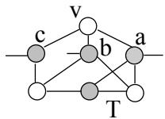  
4. 
o $T$ ists of four verti
es. Now all neighbors of are of degree $v , a$ y a s $b$ milar argument, it is

4. $T$ consists of four vertices. Now all neighbors of $v$ are of degree 4. By a similar argument, it is optimal to pick $v$ and a maximum independent set from $G [ T ]$ . Depending on the shape of $G [ T ]$ , this independent set can be of size two or three.

In a maximum degree 4 graph, the only remaining cases are when $v$ has multiple non-adjacent 2.5 Bran
hing on non-3-regular graphs trees is handled with the description of the branching.

We will later refer to a created tree components consisting of $k$ vertices as a $k$ -tree.

# oes in the maximum independent set or not. Thi

the following lemma. $G$ is 3-regular. In this section, we describe the branching of our algorithm when this is not the case. Observe that vertex folding Lemma 1 Let be the number of subproblems generated $v$ hen bran
hing on a graph $\boldsymbol { v }$ omplexity . If is not 3-regular then either: the following lemma.

Lemma 1 Let $T ( k )$ be the number of subproblems generated when branching on a graph $G$ of complexity $k$ . If $G$ is not $\mathcal { B }$ -regular then either:

1. G has a vertex of degree at least five and $T ( k ) \le T ( k - 4 ) + T ( k - 7 )$

2. $G$ has a vertex of degree 4 that is part of a triangle or $\it 4$ -cycle also containing at least one degree $\mathcal { B }$ vertex, and there are no triangles or 4-cycles containing only degree $\mathcal { B }$ vertices, then: $T ( k ) \le T ( k - 5 ) + T ( k - 6 )$ or $T ( k ) \le 2 T ( k - 8 ) + 2 T ( k - 1 2 )$

4 $G$ has a vertex of degree $\it 4$ f g 4, f fy p , and there is no constraint on the degree $\mathcal { B }$ vertices, then: $T ( k ) \le T ( k - 4 ) + T ( k - 6 )$ or $T ( k ) \le 2 T ( k - 8 ) + 2 T ( k - 1 2 )$

hen $G$ eferring to this lemma, often only the bran
hing behavior of its worst 
ase 
a $T ( k ) \leq$ $T ( k - 3 ) + T ( k - 7 )$

Before proving the lemm

our algorithm in the following way: whenever we bran
h on and dis
ard it at least two of the neighbors of should

ally well have pi
ked whi
h is done in the other bran
h. Sin
e we 
an take only one vertex form the $m \in V$ , a $v \in V$ fro $N ( v ) \ \backslash N ( m )$ must be in the independent set. Hen
e we 
an safely dis
ard also without 
hanging the size of th $v$ maximum independent set. Noti
e th $v$ t the only 4-
y
les in a maximum degree 4 graph in whi
h no degree 3 vertex has a mirror 
onsists of four $v$ degree 4 verti
es. These fa
ts are exploited when we try to limit the number of tree $N ( v ) \backslash N ( m )$ reated by bran $N ( v ) \cap N ( m )$ must be in the independent set. Hence For the proof we a $m$ o need the general observation that for any

h , a bran
h is a better bran
h as long as . The proof will be divided over several subse
tions 
orresponding to the various lo
al 
ongurations to whi
h the lemma applies.

For the proof we also need the general observation that for any $T ( k - r _ { 1 } ) + T ( k - r _ { 2 } )$ branch 2.5.1 $r _ { 1 } < r _ { 2 }$ ti $T ( k - r _ { 1 } - c ) + T ( k - r _ { 2 } + c )$ branch is a better branch as long as $r _ { 1 } + c \leq r _ { 2 } - c$

The proof will be divided over several subsections corresponding to the various local config urations to which the lemma applies.

# 2.5.1 Vertices of degree at least five

3. B $v$ domination all verti
es in have at least one neighbor outside of . Together $v$ his leads to at most two edges in $N ( v )$ and at least s $v$ ex $v$ rnal edges. If no trees are 
reated these 6 edges and the 7 edges in minus 6 verti
es lead to the required size re $k - 4$ on $v$ . And if any neighbor of $N [ v ]$ s degree 4 or more, or there are fewer edges in $v$ , then the number of external edges is l $N ( v )$ enough to guarantee this size redu
tio $N [ v ]$ . Together this leads to at most two edges in $G [ N ( v ) ]$ and at least six external edges. If no trees are created these 6 edges and the 7 edges in $G [ N [ v ] ]$ minus 6 vertices lead to the required size reduction of $k - 7$ . And if any neighbor of $v$ has degree 4 or more, or there are fewer edges in $G [ N ( v ) ]$ , then the number of external edges is large enough to guarantee this size reduction of $k - 7$

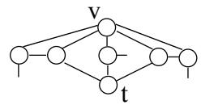  
Figure 2: Vertices of degree at least five.

ds to the removal of 8 edges and two verti
es: . In th $N ( v )$ t 
ase there again 
an be trees, but this implies that the entire 
omponent is of 
onstant size. This bran
hi $t$ g with is better than $N ( v )$ required $v$ is a mirror of $t$ . We branch on $t$ . Taking $t$ leads to the removal of 4 vertices and 9 edges: $T ( k - 5 )$ . And discarding $t$ and $v$ 2.5.2 Triangles with two degree 4 verti
es a $T ( k - 6 )$ gree 3 vertex be trees, but this implies that the entire component is of constant size. This branching with $T ( k ) \le T ( k - 5 ) + T ( k - 6 )$ is better than the required $T ( k ) \le T ( k - 4 ) + T ( k - 7 )$

# enou h bran
hin .

Let $x$ $y$ is $w$ f degree 4, dis
arding and taking lea $d ( x ) = d ( y ) = 4$ 11 e $d ( w ) = 3$ 4 verti
e $v$ . Noti
e that tre $w$ omponents 
annot be 
r $v$ ated be
ause these would have been $w$ moved by the prepro
essing sin
e there is an edge in . Taking and removing results in the removal of 3 ed

nei $v$ hbors of are of degree 3, $v$ en there are $w$ t most 6 external edges and hen
e there 
an be $T ( k - 7 )$ one tree. Otherwise any degree 4 neighbors of 
ause even more edges to be removed, ompensating for any possible tree. This resul $G [ N ( w ) ]$ . Taking $v$ with a fo $N [ v ]$ tree. If is of degree 3 (Figure 3), $w$ s
arding and taking leads to the removal of of at least 10 edges and 4 $v$ erti
es: . Now if also is not part of any triangle or has a degree 4 neighbor (
ase 2 of the lemma) taking removes 9 ed $v$ es and 4 verti
es: . And if is part of a triangle of degree 3 verti
es (
ase 3 of $T ( k - 5 )$ $k - 6$ ing re $+ 1$ ves 8 edges a

ti $\boldsymbol { v }$ is of degree 3 (Figure 3), discarding $v$ and taking $w$ leads to the removal of of at least 10 edges and 4 vertices: $T ( k - 6 )$ . Now if also $v$ is not part of any triangle or has a degree 4 neighbor (case 2 of the lemma) taking $v$ removes 9 edges and 4 vertices: $T ( k - 5 )$ . And if $v$ is part of a triangle of degree 3 vertices (case 3 of the lemma) taking $v$ removes 8 edges and 4 vertices $T ( k - 4 )$

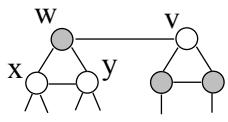  
egree 4 vertex $v$ nd two degr

# b domination. If and are ad a
ent we 
an safel dis
ard redu
in

last fa
t follows from the fa
t that if we pi
k we would also pi
k , and if we dis
a $x$ d $a$ , its $b$ irror is also dis
arded whi $d ( x ) = 4$ in $d ( a ) = d ( b ) = 3$ n both 
a $v$ es a neighbor of is in a $a$ aximum $w$ dependent set and hen
e $b$ an safely be $v$ is
ar $w$ d. So we assume tha $x$ and $v \neq w$ non-adja
ent. $v$ and $w$ are adjacent, we can safely discard $x$ reducing the graph. This If or , say , is of degree 4, taking re $v$ oves at least 11 edge $b$ and 5 verti
es, but $v$ in
e there a $b$ e 6 external edges there 
an be a $a$ ee: . And if there are more exter $x$ l edges (less edges in ) the number of e $x$ ges removed in
reases. Dis
arding and by $v$ omi $w$ tion taking leads

eg $v$ e 3 $w$ ertex $v$ ith two degree 4 neigh $v$ rs, there 
annot be any trees sin
e there is an edge there are 6 external edges there can be a tree: $T ( k - 5 )$ . And if there are more external edges (less edges in $N ( v ) )$ the number of edges removed increases. Discarding $v$ and by domination taking $a$ leads to the removal of 10 edges and 4 vertices: $T ( k - 6 )$ . Although in the last case $a$ is a degree 3 vertex with two degree 4 neighbors, there cannot be any trees since there is an edge in $G [ N ( a ) ]$ : a tree would fire a reduction rule for trees. So from now on we can assume that $v$ and $w$ are of degree 3.

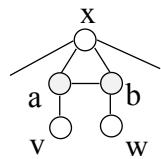  
Figure 4: Triangles with one degree 4 vertex and two degree 3 vertices.

riangle (
ase 2 of the lem $v$ a), $w$ hen t $v$ king results as before i $y$ . Dis
arding b $y$ domination results in taking $v$ whi
h again $v$ y dominating results in taking . In total $T ( k - 6 )$ s are remove $\boldsymbol { v }$ from whi
h 7 external edg $a$ s and 7 verti
es. Be
ause of the separa $T ( k - 5 )$ e 
a $y$ be at most 2 extra adja
e $\boldsymbol { v }$ ies in the wor $w$ as $w$ leaving 3 external edges and . Note that trees are bene
ial over extra adja
en
ie $w$ This leaves the 
ase $T ( k - 5 )$ has only deg $w$ e 3 neighbors with whi
h it form $b$ a triangle (
ase 3 of the lemma). In this 
ase $\boldsymbol { v }$ aking only leads to , and is enough. So we 
an assume and to be of degree 3 and have no degree 4 neighbors. $T ( k - 6 )$ . Note that trees are beneficial over extra adjacencies. This leaves the case where $w$ has only degree 3 neighbors with which it forms a triangle (case 3 of the lemma). In this case taking $w$ only leads to $T ( k - 4 )$ , and $T ( k ) \le T ( k - 4 ) + T ( k - 6 )$ is enough. So we can assume $v$ and $w$ to be of degree 3 and have no degree 4 neighbors.

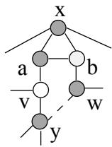  
an
h on . If we $\boldsymbol { v }$ ake the worst 
ase arise $y$

erti
es. Be
au $v$ of $w$ he sm $v$ ll separator rules, the external edges 
an form at most one extra adja
en
y or tree leading to $w$ . So at th $w$ point we 
an also assume th $w$ and are not part of any triangle. $T ( k - 4 )$ . And if we discard $w$ by domination $b$ and $\boldsymbol { v }$ are put in the independent set removing a total of at least 14 edges from which 6 external and 7 vertices. Because of the small separator rules, the external edges can form at most one extra adjacency or tree leading to $T ( k - 6 )$ . So at this point we can also assume that $v$ and $w$ are not part of any triangle.

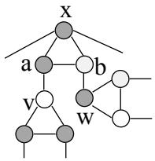  
Figure 6: Vertex $v$ is part of a triangle.

itional e $v$ e: $w$ , say $w$ The only 
ase in $u \neq a , b$ the above does not h $x$ lds is when and are bot $v$ a neighbor of . W $v$ $a$ du
e this ex
eptional 
ase by noting that a $T ( k - 5 )$ tion rule re $v$ when 
onsidering bran
hin $b$ on (without a
tually bran
hing on of 
o $x$ rse). $w$ his is the rule dealing with having one degree $x$ neigh $w$ or and a 2-tree $u$ . Hen
e, now we 
an also assume that and ha $T ( k - 6 )$ ghbors besides and that are adja
ent . $\boldsymbol { v }$ and $w$ are both a neighbor of $u$ . We reduce this exceptional case by noting that a tree reduction rule fires when considering branching on $u$ (without actually branching on $u$ of course). This is the rule dealing with $u$ having one degree 4 neighbor and a 2-tree $\{ a , b \}$ . Hence, now we can also assume that $\boldsymbol { v }$ and $w$ have no neighbors besides $a$ and $b$ that are adjacent $x$

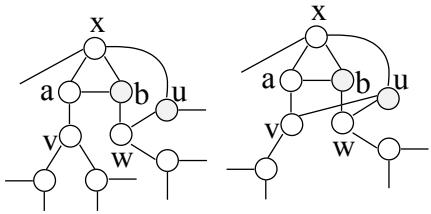  
Figure 7: Vertex $w$ , has a neighbor $u \neq a , b$ that is adjacent to $x$

e versa. Hen
e we bran
h, taking both and or dis
arding both. If we take both and , 11 edge $X = ( N ( w ) \cup N ( v ) ) \setminus \{ a , b \}$

he independent set and remove 11 edg $u$ s and $u ^ { \prime }$ verti
es: $v$ and $w$ When taking both and there 
an be not trees sin
e there ar $v$ only 4 external edges. When dis
arding both $w$ d two tree leaves and are formed, but t $v$ ey 
a $w$ ot form a tree sin
e their adja
en
y r $v$ sults $w$ a one separator, and adja
en
y to the $T ( k - 5 )$ ibly degree 2 verti
es $v$ neigh $w$ rs of ) resul $a$ in a 
onstant size 
omponent or a small separator. Also th $T ( k - 6 )$ t be any extra adja $v$ n
ies $w$ e
ause then there exists a small separator. $v$ and $w$ two tree leaves $u$ and $u ^ { \prime }$ are formed, but they cannot form a tree since their adjacency results in a one separator, and adjacency to the only possibly degree 2 vertices (neighbors of $x$ ) results in a constant size component or a small separator. Also there cannot be any extra adjacencies because then there exists a small separator.

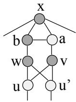  
Figure 8: Vertices $v$ and $w$ are adjacent to both of $u$ and $u ^ { \prime }$

st $| X | = 3$ l edg $u \in X$ this number of removed edges, $v$ nd h $w$ e at mos $t \in X$ ra adja
en
ies or trees we $w$ ave or . $t$ f we dis
ard $t$ , 3 edges and 1 vertex are removed $b$ and the folding of results in a new degree 4 vertex . This new vertex $t$ an be dis
arded dire
tly sin
e it is dominated by resulti $t$ g in an additional removal of 4 edges and 1 vertex. This leads most 8 external edges with this number of removed edges, and hence at most 2 extra adjacencies or trees we have $T ( k - 6 )$ or $T ( k - 5 )$ . If we discard $t$ , 3 edges and 1 vertex are removed and the folding of $w$ results in a new degree 4 vertex $[ b u ]$ . This new vertex can be discarded directly since it is dominated by $a$ resulting in an additional removal of 4 edges and 1 vertex. This leads to $T ( k - 5 )$ in total. Furthermore, there cannot be any induced trees since there can be at most one vertex of degree less than two (adjacent to $t$ and $u$ , but no to $w$ ) which cannot become an isolated vertex. Depending on whether $t$ is in a triangle we are in case 2 or 3 or the lemma and we have a good enough branching.

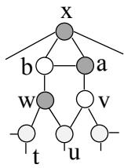  
dis
ard , we take $| X | = 3$

gh $| X | = 4$ so in a degree 4 v $v$ rtex. $w$ the rst 
ase we have $v$ . If we take $\boldsymbol { v }$ , and in the se
ond 
ase we indu
tively apply $v$ ur lemma $a$ o both generated bran
hes. This leads to Also notice that if we take $v$ $b$ in the lemma. $[ x w ]$ . And if we take $a , \ w$ emark that has a smaller solution than . However, after a bad bran
h in a 3-regular graph $T ( k ) \le T ( k - 5 ) + T ( k - 6 )$ ution when applied to one of both bran
hes. This is be
ause it is a 
omposition of three bran
hings tha $T ( k ) \le 2 T ( k - 8 ) + 2 T ( k - 1 2 )$ d 3-regular gra

Remark that $T ( k ) \le T ( k - 5 ) + T ( k - 5 )$ has a smaller solution than $T ( k ) \leq 2 T ( k - 8 ) +$ $2 T ( k - 1 2 )$ y
les in whi
h a degree 4 vertex is a mirror of a degree 3 vertex when applied to one of both branches. This is because it is a composition of three branchings that are all a lot better than the bad 3-regular graph branching.

# mirror of we remove 7 ed es and 2 verti
es: . We show t

ase $x$ we 
an always nd an extra 
omplexity redu
tion in one of both b $v$ an
h $a$ lead $b$ g to the required result. Noti
e tha $w$ f we dis
ard and , the $v$ e 
an be no trees sin
e the on $v$ possible $\boldsymbol { v }$ aves 
reated are and . These two verti
es may not be adja
ent $v$ y domina $x$ e. And if they form a tr $v$ with any vertex that used to be ad $T ( k ) \le T ( k - 5 ) + T ( k - 5 )$ d have existed a small separator or there is no tree at all. Also, any extra adja
en
y results in triangles involving degree 3 and four verti
es whi
h are handled in t $v$ e pre $x$ ous subse
tion. leaves created are $a$ and $b$ . These two vertices may not be adjacent by dominance. And if they form a tree with any vertex that used to be adjacent to $x$ or $v$ , there would have existed a small separator or there is no tree at all. Also, any extra adjacency results in triangles involving degree 3 and four vertices which are handled in the previous subsection.

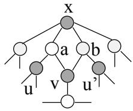  
e 
an only be trees i $x$ two or more verti
es from are of degree 4. But in this 
a $\boldsymbol { v }$

First assume that $a$ $b$ or $w$ is of degree 4, then $T ( k - 6 )$ when taking $v$ . Since $\boldsymbol { v }$ is of degree 3 there can only be trees if two or more vertices from $\{ a , b , w \}$ are of degree 4. But in this case even ) or three verti
es (hen
e $a$ ). $b$ We $w$ repla
e the subgraph indu
ed by by one vertex that we link to the other neighbors of $a$ . $b$ o we $w$ an assume that

re than $a$ wo $b$ mmon neighbors. $y \ne v$ , then the graph can be reduced without Let and be the thir $a , b , v , x , y$ rs of and , respe
tively. When dis
arding and , both $a , b )$ d are taken in the ind $v , x , y )$ nt set and and are dis
arded also. T $a , b , v , x , y$ that 13 edges form whi
h 7 external edges and 6 ver $v , x , y$ are removed. First assum $a$ that $b$ and are verti
es of degree three. The only

d . $u$ ut th $u ^ { \prime }$ e 
an be only one adja
en $a$ y be $b$ use if we take two we have a sm $v$ ll se $x$ rator. $a$ o we $b$ nd up removing 12 edges from whi
h 5 $u$ xtern $u ^ { \prime }$ edges and 6 verti
es whi
h 
annot 
reate trees: . Now suppose that or is of degree 4 and noti
e that the extra e $u$ es re $u ^ { \prime }$ ved ompensate for any possible extra adja
en
ies or 
reated tree 
omponents. $u$ and $u ^ { \prime }$ , or $u$ or $u ^ { \prime }$ and $v$ . But there can be only one adjacency because if we take two we have a small separator. 2.5.5 4-
y
les that 
ontain degree 3 and 4 verti
es, while no degree 4 vertex is a trees: $T ( k - 6 )$ r of a degree 3 ve $u$ tex $u ^ { \prime }$ is of degree 4 and notice that the extra edges removed compensate for any possible extra adjacencies or created tree components.

# these verti
es b 
ases resented in revious subse
tions. mirror of a degree 3 vertex

This can only be the case if the cycle consists of two degree 4 vertices $x$ $y$ and two degree 3 vertices $u$ $v$ with $x$ and $y$ not adjacent. There are no other adjacencies than the cycle between these vertices by cases presented in previous subsections.

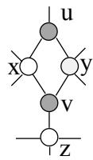  
be adja
ent to $\boldsymbol { v }$ . If we bran
h on and take $z$

onsist of at most t $u$ o ve $v$ ti
es. $v$ lso at most one tree 
an be for $z$ ed, otherwise it would be optimal to pi
k and a maximum in $x$ epe $y$ dent sets in ea
h $v$ ated tree. $v$ Consider both 
ases: and 4 vertices, and if we discard $v$ and its mirror $u$ we remove 6 edges and 2 vertices. So if no trees are created, we have: $T ( k ) \le T ( k - 8 ) + T ( k - 4 )$ . Because of the reduction rules a tree can consist of at most two vertices. Also at most one tree can be formed, otherwise it would be optimal to pick $v$ and a maximum independent sets in each created tree. Consider both cases:

removed: . And if not, degree 4 verti
es are 
reated be
ause , and are non-adja
ent. We indu
tivel $u$ apply the $v$ lemma to this $T ( k - 7 )$ obtain discarding it results in $T ( k - 4 )$ and $x , y$ and $z$ to be of degree 2. If any of these vertices are in another 4-cycle after discarding $u$ and $v$ , folding causes an additional edge to be removed: $T ( k ) \le T ( k - 5 ) + T ( k - 7 )$ . And if not, degree 4 vertices are created because $x , \ y$ and $w$ are non-adjacent. We inductively apply the lemma to this case and obtain $T ( k ) \le 2 T ( k - 7 ) + T ( k - 1 1 )$

2. Trees consisting of 2 vertices. If any vertex in the tree is of degree 4 it dominates the other. So both vertices are of degree 3. But then a vertex from $x$ $y$ and $w$ forms a triangle with this tree which was covered by branching rules in previous subsections.

are mirrors of . Sin
e the 
annot be adja
ent to or , taking results in the removal of 11 edges and 4 verti
es: . Dis
arding and le $u$ s to $v$ e removal of 6 edges and 2 verti
es: the 4-cycle.

ated $w$ egree 2 verti
es (then there $v$ ould be triangles inv $u$ ving degree 3 and four verti $x$ s), a $y$ ertex of degree $w$ t least fou $w$ s 
reated or at least o $x$ e a $y$ ditional $v$ dge is removed. This again leads to $T ( k - 7 )$ . Discarding $v$ and $u$ by applying the lemma $T ( k - 4 )$ ly. We do require here that $x$ here $y$ e no trees 
reated. But If a tree is 
reated we follow the above reasoning: this 
an only be a single tree 
onsisting of one vertex (two verti
es lead to triangles with degree and four verti
es) and there 
an be only one su
h tree. In this 
ase is adja
ent $T ( k ) \le T ( k - 5 ) + T ( k - 7 )$ refo $T ( k ) \le 2 T ( k - 7 ) + T ( k - 1 1 )$ we refer to the previous inductively. We do require here that there are no trees created. But If a tree is created we follow the above reasoning: this can only be a single tree consisting of one vertex (two vertices lead to 2.5.6 A degree 4 vertex that is not involved in any triangle or 4-
y
le with $w$ ny degree 3 vertex $v$ and therefore has $x$ and $y$ as a mirror and we refer to the previous subsection.

# least three before bran
hin and therefore must have at least two nei hbors in to be
ome But in this last 
a

ont $x$ di
ts our assumption. $T ( k ) \ \leq$ $T ( k - 7 ) + T ( k - 3 )$ 4 neighbors, the number of edges removed in
reases and there 
an still be no trees unless at least three neighbors of are of degree 4 and every tree leaf $N ( x )$ x originally was a degree 4 vertex. If has three neighbors of degree 4 there are at least 13 edges removed, in whi
h 
ase there are 7 e

uir $x$ d. If there are more external edges, there will also be more edges removed keeping this redu
tion. Finally if has four degree 4 $x$ eighbors, we remove at least 12 edges from whi
h 4 external edges again lead $x$ g to . Here any tree implies more external edges and hen
e more edges removed also keeping this redu
tion. $T ( k - 7 )$ as Putting all the above together 
ompletes the proof of Lemma 1. reduction. Finally if $x$ has four degree 4 neighbors, we remove at least 12 edges from which 4 2.6 Bran
hing on 3-regu $T ( k - 7 )$ phs with triangles or 4-
y
les more edges removed also keeping this reduction.

Putting all the above together completes the proof of Lemma 1.

# Lemma 2 Let be the number of subproblems generated when bran
hin

p y f g g 4 y , still do better than our worst case. This is settled by a second lemma.

Lemma 2 Let $T ( k )$ be the number of subproblems generated when branching on a graph $G$ of complexity $k$ .If $G$ is $\mathcal { B }$ -regular and contains a triangle or 4-cycle, then $T ( k ) \leq T ( k - 4 ) + T ( k - 5 )$ or a better branching exists.

We will now prove this lemma.

# ut in the inde endent set ed es and 4 verti
es are

Let $a$ $b$ $c$ be the triangle vertices. Assume that one of these three vertices, say $a$ , has a neighbor $\boldsymbol { v }$ not in any triangle in the graph. The algorithm branches on $v$ . If $\boldsymbol { v }$ is included in the independent set, 9 edges and 4 vertices are removed: $T ( k - 5 )$ . And if $v$ is discarded and by domination $a$ is put in the independent set, 8 edges and 4 vertices are removed: $T ( k - 4 )$

to be put in the independent set. Now a total of 18 edges from whi
h 6 external edges and 10 verti
es are removed. Adding the at most on $a$ extr $a$ adja
en
y or tree this results in $\boldsymbol { v }$ in the whi
h is more than enough. $T ( k - 4 )$ . When $a$ is included in the independent set, $b$ and $c$ are discarded which by domination results in the third neighbors of $b$ 2.6. $c$ Triangle free 3-regular graphs that 
ontain a 4-
y
le 10 vertices are removed. Adding the at most one extra adjacency or tree this results in $T ( k - 7 )$ which is more than enough.

# of ed es and 2 verti
es if has onl one mirror and ossibl more if

Let $v$ . Noti
e that two degree 1 verti
es are formed that are n $v$ t part of a tree. This is be $v$ ause their adja
en $v$ implies domination, and if they are adja
ent to degree 2 verti
es a small separa $v$ r $T ( k - 5 )$ When has more t $v$ an one mirror, single vertex trees 
an be 
reated in . These extra mirrors 
omp $v$ sate more than enough to maintain our $v$ has two or three mirrors: $T ( k - 4 )$ proof of Lemma 2 is now 
ompleted. because their adjacency implies domination, and if they are adjacent to degree 2 vertices a small 2.7 Bran
hing on $v$ -regular graphs without triangles or 4-
y
les $N ( v )$ These extra mirrors compensate more than enough to maintain our $T ( k - 4 )$

The proof of Lemma 2 is now completed.

# 2.7 Branching on 3-regular graphs without triangles or 4-cycles

Lemma 3 Let be the number of subproblems generated when bran
hing on a graph of behavior of our algorithm. Taken together, these lemmata will directly result in the claimed running time.

Lemma 3 Let $T ( k )$ be the number of subproblems generated when branching on a graph $G$ of complexity $k$ . If $G$ $\mathcal { B }$ -regular and contains no triangles or $\it 4$ -cycles, then branching on any vertex results in $T ( k ) \le T _ { 2 } ( k - 2 ) + T _ { 4 } ( k - 5 )$ , where $T _ { 2 }$ and $T _ { 4 }$ correspond to situations $\mathcal { Z }$ and 4 from lemma $\mathit { 1 }$ , respectively, or a better branching exists.

Before we 
onsider the sub
ases involved in t $T ( k ) \leq T ( k - 8 ) + 2 T ( k - 1 0 ) + T ( k - 1 2 ) +$ $2 T ( k - 1 4 )$ et , , be the neigh $O ^ { * } ( 1 . 1 7 8 0 2 ^ { k } )$

oint ne $v$ hbors; let , $T ( k - 5 )$ and $v$ . N $T ( k - 2 )$ t there 
annot be any adja
en
ies within these neighborhoods, but there 
an be adja
en
ie

en if they are neighbors of dierent verti
es in . When is dis
arded, these neighb $v$ hoods $x$ ( $y$ $z$ , and ) ar $v$ merged to single verti
es. Their degrees and relative positions in the redu
e $N ( x ) \ = \ \{ v , a , b \}$ o $N ( y ) = \{ v , c , d \}$ bet $N ( z ) ~ = ~ \{ v , e , f \}$ hese neighborhoods. Consider the dierent possible number of adja
en
ies; we number 
ases to deal with later: $a , \ldots , f$ if they are neighbors of different vertices in $N ( v )$ . When $v$ is discarded, these neighborhoods $( N ( x ) , N ( y )$ and $N ( z ) { \ ' }$ ) are merged to single vertices. Their degrees and relative positions in the reduced graph depends on the adjacencies between vertices in these neighborhoods. Consider the different possible number of adjacencies; we number cases to deal with 1.

0. If there is no adjacency between $N ( x )$ $N ( y )$ and $N ( z )$ , each neighborhood is merged to a degree 4 vertex none of which are adjacent in the reduced graph when discarding $v$ (1). 1. If there is one adjacency between $N ( x )$ $N ( y )$ and $N ( z )$ , discarding $v$ results in three degree 4 vertices only two of which are adjacent (2).

degree 4 vertex (4). In the se
ond $N ( x )$ $N ( y )$ e thr $N ( z )$ ree 4 verti
es from whi
h one is adja
ent to the other two but they do not forming a triangle. We will 
all this a path of three degree 4 verti
es (3). in their degrees to be only three, while the other neighborhood is merged to a non-adjacent degree 4 vertex (4). In the second case, we have three degree 4 vertices from which one is adjacent to the other two but they do not forming a triangle. We will call this a path of three degree 4 vertices (3).   
ad a
en
ies resultin in two additional e $N ( x )$ e $N ( y )$ move $N ( z )$ , either there are multiple adjacencies between the neighborhoods as in the previous case resulting in the removal of an extra edge (5), or a clique of three degree 4 vertices is formed (6).   
an apply 
ase 3 of Lemma 1 obtainin $N ( x )$ $N ( y )$ and $N ( z )$ , there are either two double adjacencies resulting in two additional edges being removed and $T ( k ) \leq T ( k - 4 ) + T ( k - 5 )$ If there are ve ad a
en
ies between and we have a two se arator and result in two folded degree 3 vertices forming a triangle with a degree 4 vertex. Here we can apply case 3 of Lemma 1 obtaining: $T ( k ) \leq T ( k - 5 ) + T ( k - 3 - 4 ) + T ( k - 3 - 6 ) =$ $T ( k - 5 ) + T ( k - 7 ) + T ( k - 9 )$ w   
5. If there are five adjacencies between $N ( x )$ $N ( y )$ and $N ( z )$ , we have a two separator and e that the   
degree 4 verti
es after taking . Howe $N ( x )$ f $N ( y )$ ampl $N ( z )$ nd are adja
ent, then takin ponent and are done too.

are merged resulting in nothing more than an edge between t $v$ eir other neighbors repla
ing the old edges from these neighbors to and . In the 
ase of three adja
en
ies without double adja
en
ies (6), this 
an very we $\boldsymbol { v }$ lead to a new 3-regular g $a$ ph w $f$ hout triangles or 4-
y
les. $\boldsymbol { v }$ n any other 
ase, we 
an apply Lemma 1 also to the bran
h in whi
h we take sin
e a degree 4 vertex is formed This is the term in the lemma. The six numbered 
ases are ha $a$ dled i $f$ more detail in the rest of this se
tion. We know that in ea
h 
ase the redu
ed graph after dis
arding has at most three degree 4 verti
es; all other verti
es are of degree 3. Be
ause the graph is triangle and 4-
y
le free bef $v$ e applying this lemma, a new triangle or 4-
y $T _ { 4 } ( k - 5 )$ after dis
arding m

ing. And, if any of the degree 4 verti
es form a triangle or 4-
y
le with any degree 3 vertex, we apply Lemma 1. If no degree 3 verti
es are 
reat $v$ d by folding, this results in the required bran
h of , otherwise at least one extra edge is removed and we need 
ase 3 of Lemma 1 resulting in even better bran
hes: $v$ . Therefore, we 
an assume that no triangles nor 4-
y
les involving both degree 3 and four verti
es exist. we apply Lemma 1. If no degree 3 vertices are created by folding, this results in the required 2.7.1 T $T _ { 2 } ( k - 2 )$ n-adja
ent degree 4 verti
es resulting in even better branches: $T ( k - 3 - 4 ) + T ( k - 3 - 6 )$ . Therefore, we can assume that no triangles nor 4-cycles involving both degree 3 and four vertices exist.

# whi
h is su

The bran
h follows from exploiting a little bit more information $v$ e ha $T ( k ) \le T _ { 4 } ( k - 3 ) + T ( k - 9 )$ dent set we need to 
ompute in this bran
h t $k - 2$ st the discarding $v$ , where $T _ { 4 } ( k - 3 )$ means we apply Lemma's 1 case 4 also here, leads to $T ( k ) \ \leq$ $2 T ( k - 8 ) + T ( k - 1 1 ) + 2 T ( k - 1 2 )$ which is sufficient.

The $T ( k ) \le T _ { 4 } ( k - 3 ) + T ( k - 9 )$ branch follows from exploiting a little bit more information we have about the maximum independent set we need to compute in this branch than just the is the result of folding vertex . The original vertex is taken in the independe $v$ t set if and only if is dis
arded in the redu
ed graph. So, the fa
t that we need $v$ d to pi
k at least two verti
es from results in us $v$ eing allowed to pi
k at most one vertex from the three degree 4 verti
es reated by folding the neighbors of . Hen
e, pi
king any vertex $v$ rom the three folded $x ^ { \prime }$ rti
es allows us to dis
ard the othe $x$ two. The above dis
u $x$ sion is illustrated in Figure 12. if $x ^ { \prime }$ is discarded in the reduced graph. So, the fact that we needed to pick at least two vertices from $N ( v )$ results in us being allowed to pick at most one vertex from the three degree 4 vertices created by folding the neighbors of $\boldsymbol { v }$ . Hence, picking any vertex from the three folded vertices allows us to discard the other two. The above discussion is illustrated in Figure 12.

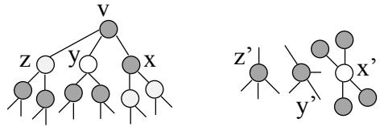  
ex. Moreo

Wh $x ^ { \prime }$ $y ^ { \prime }$ tak $z ^ { \prime }$ , whi
h has four degree 3 neighbors, we 
an $x$ s $y$ rd t $z$ se and both and result $x ^ { \prime }$ g in the removal of 20 edges from whi
h 16 external edges and $x ^ { \prime }$ verti
es. Be
ause and are non adja
ent and they 
an only $T _ { 4 } ( k - 3 )$ ent to a single neighbor of (or a 4-
y
le would exist), there $T ( k - 4 )$ ost two extra adja
en
ies. In thi

, but these 
an $x ^ { \prime }$ ly form very spe
i
 trees leading to $y ^ { \prime }$ This $z ^ { \prime }$ be
ause every tree vertex 
an only have neighbors that are distan
e 3 away from ea
h oth $y ^ { \prime }$ in $z ^ { \prime }$ be
ause of the triangle and 4-
y
le freeness. The only 1-trees that $x ^ { \prime }$ an be 
reated are adja
ent to both and and a neighbor of that is not adja
ent to either or . There an be at most one su
h trees, sin
e two 1-trees adja
ent $T ( k - 2 0 + 7 + 2 + 2 ) = T ( k - 9 )$ reate a 4-
y
le. And, it 
an only e $t$ ist if and are adja
ent to dierent neighbors of . This results in $G [ V \setminus \{ t \} ]$ g external edges that be
ause of the small separators 
an form only one larger tree. If there is no 1-tree, $y ^ { \prime }$ ger t $z ^ { \prime }$ es use more extern $x ^ { \prime }$ edges and hen
e there 
an be $y ^ { \prime }$ m $z ^ { \prime }$ t two of them also resulting in . If there is at most one extra $y ^ { \prime }$ ja
en $z ^ { \prime }$ , we remove either 19 edges from wh $x ^ { \prime }$ h 14 external edges or 20 edges from whi
h 16 external edges and 7 verti
es. Sin
e ea
h tree uses at least three external edges this results in or better. them also resulting in $T ( k - 9 )$

.2 Three degree 4 verti
es only two of whi
h are adja
ent edges or 20 edges from which 16 external edges and 7 vertices. Since each tree uses at least three external edges this results in $T ( k - 9 )$ or better.

# Combined with a bran
h or an even better

bran
h after dis
arding , this leads to a worst 
ase $x ^ { \prime }$ f $y ^ { \prime }$ and $z ^ { \prime }$ be the result of folding $x$ $y$ . $z$ If we dis
ard $v$ , we remove 4 edges and 1 vertex. Now, $x ^ { \prime }$ ther a degree $y ^ { \prime }$ vertex rem $z ^ { \prime }$ ns giving the , or an extra edge is removed by folding giving . If we take , we $v$ also dis
ard re $T ( k ) \le T _ { 4 } ( k - 3 ) + T ( k - 9 )$ edges from whi
h 13 ext $T ( k ) \leq T ( k - 4 ) + T ( k - 9 )$ In the last 
ase there $v$ n be at most one extra adj $T ( k ) \le 2 T ( k - 8 ) + T ( k - 1 1 ) + 2 T ( k - 1 2 )$

If we discard $x ^ { \prime }$ , we remove 4 edges and 1 vertex. Now, either a degree 4 vertex remains giving the $T _ { 4 } ( k - 3 )$ , or an extra edge is removed by folding giving $T ( k - 4 )$ . If we take $x ^ { \prime }$ , we can also discard $z ^ { \prime }$ resulting in the removal of 17 edges from which 13 external edges and 6 vertices. In the last case there can be at most one extra adjacency, namely between $z ^ { \prime }$ and a degree 3

4-
y
les in $x ^ { \prime }$ , but this also implies a 4-
y
le. Hen
e we have . If there is no extra adja
en
y, there 
an again be no 1-tree s $z ^ { \prime }$ e it 
an be adja
ent $x ^ { \prime }$ at most one neighbor of . Larger trees remove enough external edg $x ^ { \prime }$ to prove . there can be no tree at all since every tree leaf needs to be adjacent to $z ^ { \prime }$ in order to avoid 2.7.3 Th $N ( x ^ { \prime } )$ egree 4 verti
es on a path $T ( k - 1 7 + 6 + 1 ) = T ( k - 1 0 )$

If there is no extra adjacency, there can again be no 1-tree since it can be adjacent to at most one neighbor of $x ^ { \prime }$ . Larger trees remove enough external edges to prove $T ( k - 9 )$

# and and let and be non-ad a
ent.

If we dis
ard , we remove 4 edges and 1 vertex $v$ hile remains of degre $T ( k ) \leq T _ { 4 } ( k -$ $3 ) + T ( k - 9 )$ f we take , we 
an also dis
ard $v$ resultin $T ( k ) \le 2 T ( k - 8 ) + T ( k - 1 1 ) + 2 T ( k - 1 2 )$ h 11 $x ^ { \prime }$ t $y ^ { \prime }$ al e $z ^ { \prime }$ es and 6 verti
es. Noti $x$ e $y$ hat $z$ the last bran
h $v$ there $y ^ { \prime }$ annot be any extra $x ^ { \prime }$ ja
e $z ^ { \prime }$ ies sin
e $x ^ { \prime }$ ey im $z ^ { \prime }$ ly triangles or 4-

erti
es also be $x ^ { \prime }$ use tree leaves 
an only be adja
ent to $z ^ { \prime }$ d a degree 3 neighbor of . Any $T _ { 4 } ( k - 3 )$ e de
reases t $x ^ { \prime }$ number of external e $z ^ { \prime }$ es enough to obtain . 11 external edges and 6 vertices. Notice that in the last branch there cannot be any extra 2.7.4 Folding results in two degree 3 verti
es and a non-adja
ent a degree 4 vertex 2 vertices also because tree leaves can only be adjacent to $z ^ { \prime }$ and a degree 3 neighbor of $x ^ { \prime }$ . Any larger tree decreases the number of external edges enough to obtain $T ( k - 1 6 + 6 + 1 ) = T ( k - 9 )$

# as dis
ussed with the eneral a roa
h. Dierent from before verti
es and 
an be involved

in these lo
al stru
tures. $k - 3$ with two degree 3 vertices $y ^ { \prime } , z ^ { \prime }$ and a degree 4 vertex $x ^ { \prime }$ We bran
h on . This leads to whe $y ^ { \prime }$ dis
ar $z ^ { \prime }$ ing . Similar to the above 
ases, $x ^ { \prime }$ e an still dis
ard b $x ^ { \prime }$ th and when taking in the independent set. Therefore, taking leads to removing 17 edges from whi
h 12 external edges and 7 verti
es. If th $y ^ { \prime }$ e is a $z ^ { \prime }$ extra adja
en
y, this is between or a

together h $x ^ { \prime }$ e only 3 extern $T ( k - 3 - 3 )$ and every tree le $x ^ { \prime }$ an be adja
ent to at most one neighbor of or a 4- $y ^ { \prime }$ le wi $z ^ { \prime }$ would exis $x ^ { \prime }$ This leads to $x ^ { \prime }$ . If there is no extra adja
en
y, every tree leaf 
an still be adja
ent to no more than one neighbor of , whi
h tog $y ^ { \prime }$ her $z ^ { \prime }$ ith the 4 external e $x ^ { \prime }$ es of and lead to at most 2 trees and $y ^ { \prime }$ and $z ^ { \prime }$ gether with the bran
h for taking , this leads to neighbor of $x ^ { \prime }$ hi
h is good enou $x ^ { \prime }$ would exist. This leads to $T ( k { - } 3 - 1 7 + 7 + 1 + 1 ) = T ( k { - } 1 1 )$ If there is no extra adjacency, every tree leaf can still be adjacent to no more than one neighbor 2. $x ^ { \prime }$ 5 Folding results in two degree 3 vert $y ^ { \prime }$ es a $z ^ { \prime }$ a
ent to a degree 4 vert $T ( k - 1 1 )$

Together with the $T ( k - 5 )$ branch for taking $v$ , this leads to $T ( k ) \leq T ( k - 5 ) + T ( k - 6 ) +$ $T ( k - 1 1 )$ , which is good enough.

# a l Lemma's 1 
ase 3 as dis
ussed with the eneral a roa
h.

Similar to the previous 
ase, we $k - 3$ h on giving $y ^ { \prime }$ $z ^ { \prime }$ en dis
arding , and $x ^ { \prime }$ e allow and to be dis
arded when taking . $y ^ { \prime }$ his leads to th $x ^ { \prime }$ remo $z ^ { \prime }$ l of 14 $x ^ { \prime }$ dges $z ^ { \prime }$ nd 6 verti
es in the se
ond bran
h an $x ^ { \prime }$ we have as before unless there are trees.

Similar to the previous case, we branch on $x ^ { \prime }$ giving $T ( k - 3 - 3 )$ when discarding $x ^ { \prime }$ , and we allow $y ^ { \prime }$ and $z ^ { \prime }$ to be discarded when taking $x ^ { \prime }$ . This leads to the removal of 14 edges and 6 vertices in the second branch and we have $T ( k ) \le T ( k - 5 ) + T ( k - 6 ) + T ( k - 1 1 )$ as before unless there are trees.

ghbor of not equal to (or dominates a tree vertex). Noti
e that this implies a triangle in $x ^ { \prime }$ ving the tree and . In this 
ase we bran
h on $z ^ { \prime }$ When taking , we remove 10 edges and $y ^ { \prime }$ verti
es: . An $x ^ { \prime }$ when dis
arding , the tree for $z ^ { \prime }$ a triangle in whi
h by dominan
e is taken in the independent set. Sin
e we 
an take at most one of the folded $z ^ { \prime }$ erti
es, this also results in $x ^ { \prime }$ eing dis
arde $y ^ { \prime }$ In t $z$ al, this results in the removal of 11 edges and 4 verti
es, and in this very spe
i
 st $z ^ { \prime }$ ture no trees 
an exist: $y ^ { \prime }$ . When taking $y ^ { \prime }$ , we remove 10 edges and 4 vertices: $T ( k - 6 )$ . And when discarding $y ^ { \prime }$ , the tree forms a triangle in which by dominance $z ^ { \prime }$ 7.6 Three degree 4 verti
es that form a 
lique results in $x ^ { \prime }$ being discarded. In total, this results in the removal of 11 edges and 4 vertices, and in this very specific structure no trees can exist: $T ( k - 6 )$

# eneral a roa
h here and this looks like a ver hard

observing the following. $x ^ { \prime }$ $y ^ { \prime }$ and $z ^ { \prime }$ is superfluous information here Let , , , and be as before. Let without loss of generality be adja
ent to , be adja
ent to , b $v$ adja
ent to , and let non of the verti
es in be adja
ent to ea
h other. Noti
e that when we dis
ard this leads to the required adja
en
ies and triangle of degree 4 verti
es. This

at ov $v$ l $x$ $y$ $z$ and $a , \ldots , f$ al edges. $b$ be adjacent to $c$ $d$ If there is a v $e$ rt $f$ x with a $a$ ierent lo
al stru
ture than just $\{ a , \ldots , f \}$ , we bran
h on this vertex and are done. And, if for ever $v$ vertex this lo
al stru
ture exists, then must equal the dode
ahedron whi
h has 20 verti
es and $G [ N [ v ] \cup \{ a , \dotsc , f \} ]$ onstant time. The proof of Lemma 3 is n $v$ w 
ompleted.

If there is a vertex $u \in V$ with a different local structure than just described, we branch on 2.8 Putting it all together $u \in V$ this local structure exists, then $G$ must equal the dodecahedron which has 20 vertices and can be removed in constant time. The proof of Lemma 3 is now completed.

# in the w

Lemmata 1 and 3 and leads to a running time of . On average degree 3 graphs this regular graphs that contain triangles or 4-cycles, and Lemma 3 described branching on other 3-regular graphs. Considering all these branchings we have $T ( k ) \leq T ( k - 8 ) + 2 T ( k - 1 0 ) +$ $T ( k - 1 2 ) + 2 T ( k - 1 4 )$ endent set
an be solved in in 
onne
ted graphs of average degree at most 3. $O ^ { * } ( 1 . 1 7 8 0 2 ^ { k } )$ . On average degree 3 graphs this is $O ^ { * } ( 1 . 1 7 8 0 2 ^ { n / 2 } ) = O ^ { * } ( 1 . 0 8 5 3 7 ^ { n } )$

Theorem 1 MAX INDEPENDENT SETcan be solved in $O ^ { * } ( 1 . 0 8 5 3 7 ^ { n } )$ in connected graphs of avWe deal in this se
tion

# If , then we 
an bran
h on a vertex of degree

we use the algorithm in in the remaining graph. $m \leq 3 n / 2$ In our analysis, we seek an algorithm of 
omplexity $O ^ { * } ( \gamma ^ { n } )$ with $\gamma = 1 . 0 8 5 3 7$ s po $m > 3 n / 2$ ourse, we 
an use the previous study (in Lemma 1) on bran
hing of verti
es of algorithm is simple: we branch on vertices of degree at least four as long as $m > 3 n / 2$ , and then we use the algorithm in $O ^ { * } ( \gamma ^ { n } )$ in the remaining graph.

In ou analysis, e eek an aothm  colexity $O ^ { * } ( \gamma ^ { n } y ^ { m - 3 n / 2 } )$ , with $y$ as small as possible. Of course, we can use the previous study (in Lemma 1) on branching of vertices of or we are able to remove a lot of verti
es and edges while bran
hing; this is also good sin
e, intuitively, we will have a graph with very few vert

either $m$ decreases a lot (respect to $n$ ) and the branching is good, or we are able to remove a lot of vertices and edges while branching; this is also good since, osition 1 Assume that an algorithm 
omputes a solution to max independ $m \leq 3 n / 2$ n s of average de $O ^ { * } ( \gamma ^ { n } )$ with running time

The result is formally described and proved in the following proposition.

Proposition 1 Assume that an algorithm computes a solution to MAX INDEPENDENT SETon graphs of average degree 3, with running time $O ^ { * } ( \gamma ^ { n } )$ . Then, it is possible to compute a solution to MAX INDEPENDENT SETon any graph with running time $O ^ { * } ( \gamma ^ { n } f ( \gamma ) ^ { m - 3 n / 2 } )$ , where $f ( \gamma )$ is defined by the largest value y verifying a set of appropriate inequalities. In particular, $f ( 1 . 0 8 5 3 7 ) ~ =$ 1.13641 Proof.

Corollary 1 It is possible to compute a solution to MAX INDEPENDENT SETon graphs with maximum (or even average) degree is 4 with running time $O ^ { * } ( 1 . 1 5 7 1 ^ { n } )$

a vertex of degree at least 4. $n$ and $m$ . We seek a complexity of the form $O ^ { * } ( \gamma ^ { n } y ^ { m - 3 n / 2 } )$ t we perform a bran
h $m = 3 n / 2$ edu
es the graph by either verti
es and edges, or by verti
es and edges. Then our 
omplexity formula is valid for being the largest root $O ^ { * } ( \gamma ^ { n } )$ following equality: $m > 3 n / 2$ edges. In particular, there is a vertex of degree at least 4.

Assume that we perform a branching that reduces the graph by either $\nu _ { 1 }$ vertices and $\mu _ { 1 }$ or equivalentl $\nu _ { 2 }$ vertices and $\mu _ { 2 }$ edges. Then our complexity formula is valid for $y$ being the largest root of the following equality:

$$
\gamma ^ { n } y ^ { m - 3 n / 2 } = \gamma ^ { n - \nu _ { 1 } } y ^ { m - 3 n / 2 - \mu _ { 1 } + 3 \nu _ { 1 } / 2 } + \gamma ^ { n - \nu _ { 2 } } y ^ { m - 3 n / 2 - \mu _ { 2 } + 3 \nu _ { 2 } / 2 }
$$

or equivalently

$$
1 = \gamma ^ { - \nu _ { 1 } } y ^ { - \mu _ { 1 } + 3 \nu _ { 1 } / 2 } + \gamma ^ { - \nu _ { 2 } } y ^ { - \mu _ { 2 } + 3 \nu _ { 2 } / 2 }
$$

Then, when $m > 3 n / 2$ , one of the following two situations occurs:

•Either there is a vertex of degree at least 5: in this case we reduce the graph either by $\nu _ { 1 } = 1$ vertex and $\mu _ { 1 } = 5$ edges, or by $\nu _ { 2 } = 6$ vertices and $\mu _ { 2 } \geq 1 3$ edges, leading to $y = 1 . 1 2 2 6$ (or $\nu _ { 1 } = 4$ $\mu _ { 1 } = 9$ $\nu _ { 2 } = 2$ $\mu _ { 2 } = 8$ , which is even better), see Section 2.5.1;

In the followin we 
onsider that the ra h has maximum de ree 4 and we denote d the four neighbors of some vertex . We 
all inner edge an edge between two verti
es and outer edge an edge between a vertex in and a vertex not in . We study 4 de endin

n
hing. We deal with trees in Se
tion 4 and show that it is never problemati
. $u _ { 1 }$ $u _ { 2 }$ $u _ { 3 }$ ase 1 $u _ { 4 }$ All the neighbors of have degree $v$ . We call inner edge an edge between two vertices in $N ( v )$ ase is easy. Indeed, if there are at least $N ( v )$ dges in
ident to ver $N [ v ]$ in , by bran
hing on we get , , $N ( v )$ and . This gives . But there is only one possibility with no domination and only 12 edges in
ide

in : when i $v$ a 4-
y
le. This

This case is easy. Indeed, if there are at least 13 edges incident to vertices in $N ( v )$ , by branching on $v$ we get $\nu _ { 1 } = 1$ $\mu _ { 1 } = 4$ $\nu _ { 2 } = 5$ 19 $\mu _ { 2 } \geq 1 3$ . This gives $y = 1 . 1 3 5 8$

But there is only one possibility with no domination and only 12 edges incident to vertices in $N ( v )$ : when $u _ { 1 } , u _ { 2 } , u _ { 3 } , u _ { 4 }$ is a 4-cycle. This case reduces thanks to the following lemma.

v       
ontains onl one re la
in it b does not 
han e its size. Finall there $N ( v )$ onl three $u _ { 1 } , u _ { 2 } , u _ { 3 } , u _ { 4 }$ ibilities: keep and , keep $N ( v ) \cup \{ v \}$ r keep only , see Fi $u _ { 1 } u _ { 3 }$ 13. $u _ { 2 } u _ { 4 }$ , such that $u$ is adjacent to $u _ { 1 } u _ { 3 }$ (resp. $u _ { 2 } u _ { 4 } )$ if and only if u is adjacent to $u _ { 1 }$ or $u _ { 3 }$ (resp. $u _ { 2 }$ or $u _ { 4 }$ ).

Proof. Any optimal solution cannot contain more than two vertices from the cycle. If it contains only one, replacing it by $v$ does not change its size. Finally, there exist only three disjoint possibilities: keep $u _ { 1 }$ and $u _ { 3 }$ , keep $u _ { 2 }$ and $u _ { 4 }$ or keep only $v$ , see Figure 13. degree 2, we redu
e the grap $v$ by 2 verti
es and 2 edges (i

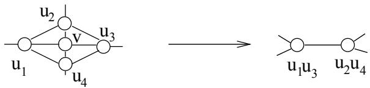  
4, then ther $G [ N ( v ) ]$ least 13 edg

s is even better). Sin
e any 2 verti
es 
annot be adja
ent to ea
h other, that means $v$ e 
an remove vert $\nu _ { 1 } = 1$ d $\mu _ { 1 } = 4$ s $\nu _ { 2 } = 5$ es by $\mu _ { 2 } \geq 1 3$

neighbors (its tw $v$ neighbors being $u _ { i }$ 2       ja
ent), we remove 3 verti
es and at least 5 edges whi
h is even better. Removing verti
es and at least edges is very interesting: it gives , , , , and $u _ { i }$ cannot be adjacent to each other, that means we can 8     8    Case 3. has degree 3 and only one outer edg $u _ { 1 } , \cdots , u _ { 4 }$ . Indeed, if for instance $u _ { 1 }$ dominates has one inner edge, say . Let be the third neighbor of . We bran
h on . 8     8       Suppose at rst that has degree 3. If we take we remove 4 verti
es and (at least) $\nu _ { 1 } = 9$ s $\mu _ { 1 } = 1 2$ s $\nu _ { 2 } = 5$ s $\mu _ { 2 } = 1 2$ ner e $y = 1 . 0 8 5 6$ )

remove g $u _ { 1 }$ ally verti
es and edges.

$u _ { 1 }$ is is obviously not su
ie $( u _ { 1 } , u _ { 2 } )$ re is a $y$ easily improvable 
ase, wh $u _ { 1 }$ a neighbor of h $y$ s degree 4 (or when $u _ { 2 }$ elf has degree 4), or when $y$ he neighbors of are not adja
ent. Indeed, in this 
ase there are at least 9 edge $N ( y )$ , and we get $y$ , , an $v$ and we 2   7 leading to . Now, we 
an

Same for the neighbor of ; furthermore, they both are part of a triangle, see Figu $y$ 14. Note that and $y$ nnot be adja
ent or there is a separator of size $y$ ( and the third neighbor or ), and and 
annot $9$ ve a 
om $N ( y )$ neighbor (eit $\nu _ { 1 } = 4$ $\mu _ { 1 } = 9$ w $\nu _ { 2 } = 2$ ave d $\mu _ { 2 } \geq 7$ t least 4, or $y = 1 . 1 3 6 4 1$ o degree 3 
ommon vertex b $y$ in this 
ase is a separator 1). At least a neighbor of $z$ y is neither $u _ { 2 }$ r . Hen
e, when dis
arding , we take , so remove and then add $z$ to th $y$ solution. Eventually, we get , , $v$ nd , leading to or $z , y )$ . $z$ and $y$ cannot have a common neighbor (either this vertex would have degree at Suppose now that has degree 4. Then, when we don't tak $v$ , sin
e we don't take , has degree 1. T $z$ n, we 
an $u _ { 3 }$ ke it $u _ { 4 }$ d remove and its in
ide $y$ t edges. T $u _ { 1 }$ n, when not $u _ { 2 }$ king , we rem $z$ ve in all verti
es and edges. In $\nu _ { 1 } = 4$ o $\mu _ { 1 } = 8$ $\nu _ { 2 } = 7$ , $\mu _ { 2 } \geq 1 3$ nd . $y = 1 . 1 1 9 5$

se 4. has degre $u _ { 2 }$ and only one outer edge. $y$ , since we don't take $v$ $u _ { 1 }$ Sin
e Case 1 does not o

ur, we 
an assum $u _ { 2 }$ hat there is a vertex (say ) of degree 3. Sin
e $y$ 4   10     ase 3 does not o

ur, has no inner edge. Hen
e, is $\nu _ { 1 } = 4$ n $\mu _ { 1 } = 8$ $\nu _ { 2 } = 4$ . Th $\mu _ { 2 } \geq 1 0$ e are only tw $y = 1 . 1 3 2 5$ t

Case 4. $u _ { 1 }$ has degree 4 and only one outer edge.

Since Case 1 does not occur, we can assue that there is a vertex (say $u _ { 4 }$ ) of degree 3. Since Case 3 does not occur, $u _ { 4 }$ has no inner edge. Hence, $u _ { 1 }$ is adjacent to $u _ { 2 }$ and $u _ { 3 }$ . Then, there are only two possibilities.

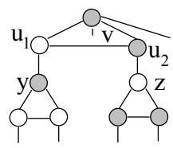  
dges. This gives on
e a $y$ ain , $u _ { 1 }$ , $z$

ges ( has degree 4 and is not adja
ent to other neighbors of $u _ { 2 }$ . If $u _ { 3 }$ dis
ard , then by domination we take , and delete verti
es an $\nu _ { 1 } = 1$ a $\mu _ { 1 } = 4$ $\nu _ { 2 } = 5$ es. It $\mu _ { 2 } \geq 1 3$

Otherwise, there is an edge between $u _ { 2 }$ and $u _ { 3 }$ . Then, $v , u _ { 1 } , u _ { 2 } , u _ { 3 }$ form a 4-clique, see Figure 15. We branch on $u _ { 4 }$ . If we take $u _ { 4 }$ , we delete $\nu _ { 1 } = 4$ vertices and (at least) $\nu _ { 2 } = 9$ edges $v$ has degree 4 and is not adjacent to other neighbors of $u _ { 4 }$ ). If we discard $u _ { 4 }$ , then by domination we take $v$ , and delete $\nu _ { 2 } = 5$ vertices and at least $\mu _ { 2 } = 1 2$ edges. It gives $y = 1 . 0 9 2 1$

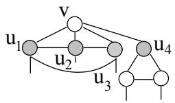  
Figure 15: $v , u _ { 1 } , u _ { 2 } , u _ { 3 }$ is a 4-clique

es and verti
es, where . To get the re $\nu _ { 1 } ^ { \prime }$ t 
laimed, w $\mu _ { 1 } ^ { \prime } \geq \nu _ { 1 } ^ { \prime }$ o verify that , or equivalently that . This is trivially true as soon as sin
e . In other words, ea
h time we remove verti
es and at least edges, we redu
e running time with a multipli
ative fa
tor where $\nu _ { 1 } + \nu _ { 1 } ^ { \prime }$ . Simila $\mu _ { 1 } + \mu _ { 1 } ^ { \prime }$ st issue we have $\mu _ { 1 } ^ { \prime } \geq \nu _ { 1 } ^ { \prime }$ with is what happens if some bran
hing dis
onne
ts $\gamma ^ { n - \nu _ { 1 } ^ { \prime } } y ^ { m - \mu _ { 1 } ^ { \prime } - 3 n / 2 + 3 \nu _ { 1 } ^ { \prime } / 2 } \leq \gamma ^ { n } y ^ { m - 3 n / 2 }$ es are 
reated are han $y ^ { - \mu _ { 1 } ^ { \prime } + 3 \nu _ { 1 } ^ { \prime } / 2 } \leq \gamma ^ { \nu _ { 1 } ^ { \prime } }$ . We now assume only 
onne
ted $y \leq \gamma ^ { 2 }$ ents $\nu _ { 1 } ^ { \prime } \leq \mu _ { 1 } ^ { \prime }$ verifying have appeared. In or $\nu _ { 1 } ^ { \prime }$ r to simplify our notat $\nu _ { 1 } ^ { \prime }$ n we 
all the 
omplexity of the 
onne
ted 
ase. Our runn $c ^ { \nu _ { 1 } ^ { \prime } }$ time n $c = ( \sqrt { y } / \gamma ) < 1$

Similarly, a last issue we have to deal with is what happens if some branching disconnects our graph. The cases when some trees are created are handled in Section 4. We now assume only connected components $\left( C _ { i } \right)$ each verifying $m _ { i } \geq n _ { i }$ have appeared. In order to simplify our notation we call $\bar { T }$ the complexity of the connected case. Our running time now verifies:

$$
\begin{array} { r c l } { { T ( m , n ) } } & { { \le } } & { { \displaystyle \sum _ { i } \bar { T } ( m _ { i } , n _ { i } ) = \sum _ { i } \bar { T } ( m - \sum _ { j \ne i } m _ { j } , n - \sum _ { j \ne i } n _ { j } ) } } \\ { { } } & { { \le } } & { { \displaystyle \sum _ { i } \bar { T } ( m - \sum _ { j \ne i } ( m _ { j } - n _ { j } ) , n ) c ^ { n - n _ { i } } \le \bar { T } ( m , n ) c ^ { n } \sum _ { i } \frac { 1 } { c ^ { n _ { i } } } } } \end{array}
$$

Since $c < 1$ (and $n _ { 1 } \geq 1$ ), for $n$ large enough we have $\begin{array} { r } { c ^ { n } \sum _ { i } { \frac { 1 } { c ^ { n _ { i } } } } \leq 1 } \end{array}$ and eventually $T ( m , n ) \leq$ $T ( m , n )$ w a

# bran
hing (see Se
tion 2.4).

We show here that creating a tree while branching is never problematic. If we branch on a vertex of degree 3 (as in Case 3), then no trees are created, or the graph can be reduced without branching (see Section 2.4).

At rst, suppose that one of the trees 
reated is a single vertex . Then, is a mirror of : when dis
arding , we 
a $\mathcal { N }$ lso dis
ard and this removes 2 verti
es and (at $N ( v )$ $I$ edges. $\Omega$ is easy to see that no tree are 
reated: indeed, this does not di $N ( v )$ e
t the graph sin
e at least 3 's are 
onne
ted to th $N ( v )$ ai

d the trees), ea
h tree is 
onne
te $l \geq 1$ t least one of these 3 's, and t $t$ e fourth $t$ has to be o $v$ ne
ted either to 2 $v$ rees or to some (o $t$ to the remainder of the graph). When taking , we remove 5 verti
es and edges (sin
e there are at least 3 edges per tree, and 3 e $u _ { i }$ es to the remainder of the graph). The redu
tion of the trees allow to delete $\boldsymbol { v }$ $N ( v )$ more verti
es (a
tually verti
es and edges, for some $u _ { i }$ ). In all, we $u _ { i }$ ve , , and , wh $u _ { i }$ is good for (it gives ). If , th $v$ we remove 5 vertices and $\mathcal { N } \geq | \Omega | \geq 4 + 3 + 3 l$ the redu
tion we get is , , and 3 edges to the remainder of the graph). The reduction of the trees allow to delete at worst $l$ Now, if and ea
h $l + k$ has at least 2 $k$ erti
es, there are $k \geq 0$ st 4 edges linking e $\nu _ { 1 } = 2$ e $\mu _ { 1 } = 7$ $\nu _ { 2 } = 5 + l$ king $\mu _ { 2 } = 7 + 3 l$ e 5 verti
es and at $l \geq 2$ (it gives $y = 1 . 1 0 7 8 ,$ en r $l = 1$ ng the $\mathcal { N } \geq | \Omega | + \lceil ( 1 2 - | \Omega | ) / 2 \rceil \geq 1 0 + 1 = 1 1$ nd edges. In all, we remove $\nu _ { 1 } = 2$ r $\mu _ { 1 } = 7$ d $\nu _ { 2 } = 6$ edge $\mu _ { 2 } = 1 1$ is of 
our $y = 1 . 1 2 9 9$ r

Now, if $l \geq 2$ and each tree has at least 2 vertices, there are at least 4 edges linking each tree to $N ( v )$ , 
onsider the $v$ al 
ase where one tree 
omposed $4 + 3 + 4 l$ t 2 verti
es is 
reated while bran
hing on . Then, we h $2 l$ e at least 4 e $l$ ges linking to , an $5 + 2 l$ ges linking $7 + 5 l$ the remainder of the graph. Then $l = 2$ , for which we have $\nu _ { 1 } = 1$ n $\mu _ { 1 } = 4$ $\nu _ { 2 } = 9$ e we $\mu _ { 2 } = 1 9$ tree $y = 1 . 1 0 3 1$ t

Now, consider the final case where one tree $T$ composed by at least 2 vertices is created while branching on $v$ . Then, we have at least 4 edges linking $N ( v )$ to $T$ , and 3 edges linking $N ( v )$ to the remainder of the graph. Then, $\mathcal { N } = | \Omega | + | I | \geq 1 1 + | I |$ . When taking $v$ , since we reduce a tree $T$ If 1 neighbor of have degree 3 (and 3 have degree 4), $\mathcal { N } + 1$ if ther

•     g , $v$ have degree 4, then $\mathcal { N } \ge 1 1 + \lceil ( 1 6 - 1 1 ) / 2 \rceil = 1 4$ , , $\nu _ { 1 } = 1$ $\mu _ { 1 } = 4$ $\nu _ { 2 } = 7$ and $\mu _ { 2 } = 1 5$ . It gives $y = 1 . 1 3 1 5$

also and get $v$ , (this does not 
reate tree). With and , it gives $| \Omega | \geq 1 3$ , the $\mathcal { N } \geq 1 4$ nly three possibilities wit $\nu _ { 1 } = 1$ i $\mu _ { 1 } = 4$ $\nu _ { 2 } = 7$ two $\mu _ { 2 } = 1 5$ ities o

ur when the two inner edges are and . If say is adja
ent $t _ { 1 } , t _ { 2 } )$ th and ( $t _ { 1 }$ en is adja
ent to and $v$ to ), it is never inte $v$ sting to take $t _ { 1 }$ e 
annot take $\nu _ { 1 } = 2$ $\mu _ { 1 } = 7$ take ). The 
ase where is adja $\nu _ { 2 } = 7$ and $\mu _ { 2 } = 1 4$ to $y = 1 . 0 9 5 2$ as follows: we 
an repla
e the whole subgraph by two adja
ent verti
es and sin
e either we take two verti
es $( u _ { 1 } , u _ { 2 } )$ , or $( u _ { 3 } , u _ { 4 } )$ e 3 ver $u _ { 3 }$ es , or $t _ { 1 }$ . If $t _ { 2 }$ he inne $t _ { 1 }$ edges are $u _ { 1 }$ and $t _ { 2 }$ to $u _ { 2 }$ , then to avoid mirror must $u _ { 3 }$ adja
ent to say , and then has $u _ { 3 }$ be adja
ent to , $t _ { 1 }$ nd to an $( u _ { 1 } , u _ { 3 } )$ But, $t _ { 2 }$ pr $( u _ { 2 } , u _ { 4 } )$ , this 
ase redu
es by repla
ing the whole graph by two adja
ent verti
es $u _ { 1 } u _ { 3 }$ . $u _ { 2 } u _ { 4 }$ since either we take two vertices $v$ and $t _ { 1 }$ , or we take 3 vertices $u _ { 1 } , u _ { 3 } , t _ { 2 }$ or $u _ { 2 } , u _ { 4 } , t _ { 1 }$ . If the inner edges are $( u _ { 1 } , u _ { 2 } )$ and $( u _ { 2 } , u _ { 3 } )$ , then to avoid mirror $u _ { 2 }$ must be adjacent to say $t _ { 1 }$ , and then $t _ { 1 }$ has to be adjacent to $u _ { 4 }$ , and $t _ { 2 }$ to $u _ { 1 }$ and $u _ { 3 }$ . But, as previously, this case reduces by replacing the whole graph by two adjacent vertices $u _ { 1 } u _ { 3 }$ and $u _ { 2 } u _ { 4 }$

•     ( ). If $v$ and have degree 3, then to avoid separators of size 2 is adja
ent edge. If there is no inner edge, then $\mathcal { N } = | \Omega | = 1 4$ and $\nu _ { 1 } = 1$ $\mu _ { 1 } = 4$ $\nu _ { 2 } = 7$ and $\mu _ { 2 } = 1 5$ If there is one inner edge $( u _ { 1 } , u _ { 2 } )$ , then if $u _ { 3 }$ or $u _ { 4 }$ has degree 3, when discarding $v$ we can fold two (non adjacent) vertices or degree 2. This gives $\nu _ { 1 } = 5$ $\mu _ { 1 } = 8$ $\nu _ { 2 } = 7$ and $\mu _ { 2 } = 1 4$ $y = 1 . 1 2 4 4 ,$ ). If $u _ { 1 }$ and $u _ { 2 }$ have degree 3, then to avoid separators of size $2 \ u _ { 1 }$ is adjacent to say $t _ { 1 }$ and $u _ { 2 }$ is not adjacent to the tree. Then, $t _ { 2 }$ is a mirror of $\boldsymbol { v }$ and we get a reduction $\nu _ { 1 } = 2$ $\mu _ { 1 } = 7$ $\nu _ { 2 } = 7$ and $\mu _ { 2 } = 1 4$

•            is one inner edge , then we do not need to bra $v$ h. Indeed, the tree has only two verti
es of degree 3 (otherwise there would be 12 edges in ). If say is adja
ent to $\mathcal { N } \geq 1 3$ and , to avoid domination and have to be adja
ent to a fourth edge. If is adja
ent to both $v$ and , $\nu _ { 1 } = 7$ t $\mu _ { 1 } = 1 0$ in $\nu _ { 2 } = 7$ ng to $\mu _ { 2 } = 1 4$ i $y = 1 . 0 9 4 6$ impossible to take plus 2 $( u _ { 1 } , u _ { 2 } )$ erti
es, and we 
an always take and . If is adja
ent to and $t _ { 1 } , t _ { 2 }$ to and , then at least 2 verti
es among $\Omega$ have $t _ { 1 }$ egree 4 sin
e 2 of th $u _ { 1 }$ mus $u _ { 2 }$ e adja
ent to the rem $u _ { 1 }$ der $u _ { 2 }$ the graph. The only remaining 
ase o

u $t _ { 1 }$ when is adja
en $u _ { 3 }$ o $u _ { 4 }$ and is adja
ent to . In th $t _ { 1 }$ ase we 
an repla
e the whole s $t _ { 1 }$ graph by two adja
ent verti
es and . $v$ ndeed $t _ { 2 }$ eithe $t _ { 1 }$ we take 2 verti $u _ { 1 }$ ( a $u _ { 3 }$ ), $t _ { 2 }$ we $u _ { 2 }$ ke 3 $u _ { 3 }$ rti
es (either , or $u _ { 1 } , u _ { 2 } , u _ { 3 }$ have degree 4 since 2 of them must be adjacent to the remainder of the graph. The only remaining case occurs when $t _ { 1 }$ is adjacent to $u _ { 1 } , u _ { 3 }$ and $t _ { 2 }$ is adjacent to $u _ { 2 } , u _ { 4 }$ . In this case we can replace the whole subgraph by two adjacent vertices $u _ { 1 } u _ { 3 }$ and $u _ { 2 } u _ { 4 }$ . Indeed, either we take 2 vertices $v$ and $t _ { 1 }$ ), or we take 3 vertices (either $u _ { 1 } , u _ { 3 } , t _ { 2 }$ , or $u _ { 2 } , u _ { 4 } , t _ { 1 } )$

•      ( ). $v$ have degree 3, since $| \Omega | \geq 1 1$ , we have $| I | = 0$ , hence $\mathcal { N } = | \Omega | = 1 2$ . In this case, when we do not take $v$ , we have 4 vertices of degree 3 pairwise non adjacent. We can fold each of them (if there is a domination this is even better) and delete 8 more vertices and edges. Finally, we get at worse $\nu _ { 1 } = 9$ $\mu _ { 1 } = 1 2$ $\nu _ { 2 } = 7$ and $\mu _ { 2 } = 1 4$ id $y = 1 . 0 3 8 6$ of

# More pre
isely, we pro
eed as follows. We rst identi

bigger the average degree, the more deleted edges when bran
hing on a (well 
hosen) vertex. With this property, we analyze the 
omplexity of our algorithm in a

we know how to solve the problem in in graph with average degree , and that when the average degree is greater than a good bran
hing o

urs, we seek a 
omplexity of the form , valid in graph with average degree greater than . Starting from , we identify four 
riti
al values for the average degree, leading to a 
omplexity of in graphs of average degree at most 5. $O ^ { * } ( \gamma ^ { n } )$ in graph with average degree $d$ , and that when the average degree is greater than $d$ a good branching occurs, we seek a complexity of the form $O ^ { * } ( \gamma ^ { n } y ^ { m - d n / 2 } )$ ume the input graph has maximum degree and av $d$ age degree or m $d = 4$ Then identify four critical values for the average degree, leading to a complexity of $O ^ { * } ( 1 . 1 9 6 9 ^ { n } )$ in graphs of average degree at most 5.

Lemma 5 Assume the input graph has maximum degree 5 and average degree 4 or more. Then

$$
T ( m , n ) \leq T ( n - 1 , m - 5 ) + T ( n - 6 , m - 1 5 )
$$

Or some even better case happens. Furthermore, if it verifies:

Proof. Fix some vertex $v _ { 0 }$ of degree 5, such that for any vertex $v$ of degree 5 in the graph:

$$
\sum _ { w \in N ( v ) } d ( w ) \leq \sum _ { w \in N ( v _ { 0 } ) } d ( w ) = \delta
$$

For $i \leq 5$ , let $m _ { i 5 }$ be the number of edges in the graph between a vertex of degree $i$ and a vertex of degree 5. For $i \leq 4$ , fix $\alpha _ { i } = m _ { i 5 } / n _ { 5 }$ and $\alpha _ { 5 } = 2 m _ { 5 5 } / n _ { 5 }$ . In other terms, $\alpha _ { i }$ (2) number of vertices of degree $i$ that are adjacent to a vertex of degree 5. However, we can always consider $\alpha _ { i } = 0$ for $i \leq 2$ . Summing up inequalities on any vertex of degree 5, we get:

$$
\begin{array} { r c l } { { \displaystyle \sum _ { i \leq 5 } i \alpha _ { i } } } & { { \le } } & { { \delta } } \\ { { \displaystyle \sum _ { i \leq 5 } \alpha _ { i } } } & { { = } } & { { 5 } } \end{array}
$$

Fix now $\epsilon = m / n - 2 \in ] 0 , 1 / 2 [$ [

$$
\epsilon = \frac { n _ { 5 } - n _ { 3 } } { 2 ( n _ { 5 } + n _ { 4 } + n _ { 3 } ) }
$$

This function is decreasing with $n _ { 3 }$ and $n _ { 4 }$ . We now use some straightforward properties

$$
\begin{array} { r c l } { { n _ { 4 } } } & { { \ge } } & { { \displaystyle \frac { m _ { 4 5 } } { 4 } } } \\ { { n _ { 3 } } } & { { \ge } } & { { \displaystyle \frac { m _ { 3 5 } } { 3 } } } \\ { { 5 n _ { 5 } } } & { { = } } & { { \displaystyle m _ { 3 5 } + m _ { 4 5 } + 2 m _ { 5 5 } } } \end{array}
$$

That leads us to:

$$
\begin{array} { r c l } { { \epsilon } } & { { \leq } } & { { \displaystyle \frac { 3 n _ { 5 } - m _ { 3 5 } } { 6 n _ { 5 } + \frac { 3 } { 2 } m _ { 4 5 } + 2 m _ { 3 5 } } } } \\ { { } } & { { \leq } } & { { \displaystyle \frac { m _ { 4 5 } + 2 m _ { 5 5 } - 2 n _ { 5 } } { 1 6 n _ { 5 } - \frac { 1 } { 2 } m _ { 4 5 } - 4 m _ { 5 5 } } } } \end{array}
$$

there are at least

$$
\epsilon \le \frac { 2 \alpha _ { 4 } + 2 \alpha _ { 5 } - 4 } { 3 2 - \alpha _ { 4 } - 4 \alpha _ { 5 } }
$$

Let $\mu _ { 2 }$ be the minimal number of edges we delete when we add $v _ { 0 }$ to the solution. Since there are at least $2 d ( v _ { 0 } )$ edges between $N ( v _ { 0 } )$ and the remaining of the graph, and thanks to inequalities (2) and (3), we get:

$$
\begin{array} { l c l } { \mu _ { 2 } } & { \geq } & { 1 0 + \displaystyle \left\lceil \frac { \delta - 1 0 } { 2 } \right\rceil } \\ & { \geq } & { 1 0 + \displaystyle \left\lceil \frac { 5 + \alpha _ { 4 } + 2 \alpha _ { 5 } } { 2 } \right\rceil } \end{array}
$$

Notice that $\epsilon > 0$ implies:

$$
\alpha _ { 4 } + \alpha _ { 5 } > 2
$$

If we run $\operatorname* { m i n } \mu _ { 2 }$ under constraints (2),(3),(5) and $\mu _ { 2 } \in \mathbb { N }$ , we find $\mu _ { 2 } = 1 4$ as a minimum.

For $1 \ \leq \ i \ \leq \ 3$ , we now consider the following programs $( P _ { i } )$ max $\epsilon$ under constraints (2),(3),(4) and $\mu _ { 2 } \leq 1 4 + i$ . In other terms, we determine the maximal value for $\epsilon$ such that it

is possible that no vertex in the graph verifies $\mu _ { 2 } = 1 5 + i$ . The following table summarizes the results:

<table><tr><td>worst case efor µ2</td><td>upper bound for €</td><td>(α5, α4)</td></tr><tr><td>14</td><td>2/29</td><td>(0, 3)</td></tr><tr><td>15</td><td>2/9</td><td>(0, 5)</td></tr><tr><td>16</td><td>2/7</td><td>(2, 3)</td></tr><tr><td>17</td><td>2/5</td><td>(4,1)</td></tr></table>

Notice also that $\mu _ { 2 } = 1 4$ implies that at least one neighbor of $v _ { 0 }$ has degree 3, so we can fold a solution to max $v$ ndependent seton a $\nu _ { 1 } = 3 , \mu _ { 1 } = 7 , \nu _ { 2 } = 6 , \mu _ { 2 } = 1 4$ , that is better than $\nu _ { 1 } = 1 , \mu _ { 1 } = 5 , \nu _ { 2 } = 6 , \mu _ { 2 } = 1 5$ I

Proposition 2 Assume that an algorithm computes a solution to MAX INDEPENDENT SETon 4    for some appropriate 
onstants . In parti
ular, $O ^ { * } ( \gamma _ { 0 } ^ { n } )$ . Then, it is possible to compute a solution to MAX INDEPENDENT SETon any graph with running time:

$$
O ^ { * } ( \gamma _ { 0 } ^ { n } \gamma _ { 1 } ^ { 2 n / 9 } \gamma _ { 2 } ^ { 4 n / 6 3 } \gamma _ { 3 } ^ { 4 n / 3 5 } \gamma _ { 4 } ^ { m - 2 n / 5 } )
$$

for some appropriate constants $( \gamma _ { i } ) _ { i \leq 4 }$ . In particular,

$$
\gamma _ { 0 } = 1 . 1 5 7 1 \Longrightarrow \left\{ \begin{array} { l } { \gamma _ { 1 } = 1 . 0 7 7 5 } \\ { \gamma _ { 2 } = 1 . 0 6 9 6 } \\ { \gamma _ { 3 } = 1 . 0 6 3 1 } \\ { \gamma _ { 4 } = 1 . 0 6 1 2 } \end{array} \right.
$$

t allows us to use $\gamma _ { i }$ , , and in the re
urren
e equation: $\mu _ { 2 } \geq 1 5 + i$ , according to Lemma 5 (the case when there is a vertex of degree at least 6 can be easily shown to lead to a better reduction).

A

ording to Lemma 5, we know that $O ^ { * } ( \gamma ^ { n } y ^ { m - ( 2 + \epsilon _ { i } ) n } )$ , where $2 + \epsilon _ { i }$ is the lowest ratio $m / n$ that allows us to use $\nu _ { 1 } = 1$ $\mu _ { 1 } = 6$ $\nu _ { 2 } = 7$ and $\mu _ { 2 } = 1 4 + i$ in the recurrence equation:

$$
1 = \gamma ^ { - \nu _ { 1 } } y ^ { - \mu _ { 1 } + ( 2 + \epsilon _ { i } ) \nu _ { 1 } } + \gamma ^ { - \nu _ { 2 } } y ^ { - \mu _ { 2 } + ( 2 + \epsilon _ { i } ) \nu _ { 2 } }
$$

Note that a redu
tion of verti
e

$$
( \epsilon _ { i } ) _ { i \le 4 } = ( 0 , 2 / 9 , 2 / 7 , 2 / 5 ) .
$$

Otherwise, trees are singletons and there is no separator of size or l , that mean $\nu _ { 1 } ^ { \prime }$ vertices and $\mu _ { 1 } ^ { \prime } \geq \nu _ { 1 } ^ { \prime }$ . Hen
e, we see that if , $y \leq \gamma _ { i } ^ { 1 / ( 1 + \epsilon _ { i } ) }$ r least 4 edges linking verti
es in to the remainder of the graph, or if our dis
onne
te $\nu$ vertex has $\nu - 1$ e at least , we are in a better situation as $y ^ { 1 . 5 \nu + 1 } \leq \gamma ^ { \nu }$ is 
reated. Even $\nu \geq 2$

2     ume and there is a separator of size , namely , and . is adja
ent to , $| \Omega | \geq 5 + 3 + 3 l$ f and a $\textstyle \mu _ { 2 } \geq 8 + 2 l + \left\lceil { \frac { \delta - 8 - 3 l } { 2 } } \right\rceil$ δ−8−3l2       l > 1    nt, then it is never interesting to take (if we take we take only in , $N ( v )$ e 
an take instead). Otherwise, no more than verti
e $t$ 4             from may belong to the optimal (otherwise that would mean for instan
e ontain $d ( t ) = 3$ 3  e, and thus dominates ), and there a $u _ { 3 } , u _ { 4 }$ y d $u _ { 5 }$ er $t$ nt ways to 
ho $u _ { 1 } , u _ { 2 }$ verti
es a $u _ { 3 }$ ng $u _ { 1 }$ and $u _ { 2 }$ o we 
an repla
e the whole subgraph by a 
lique of siz $v$ at most . $v$ heorem 2 It $t$ is $N ( v ) \cup \{ v , t \}$ m ute a solution $u _ { 1 } , u _ { 2 }$ 3x independent seton ra h whose maximum (o $N ( v )$ average) degree is with running time $N ( v ) - u _ { 1 }$ contains no edge, and thus $u _ { 1 }$ dominates $u _ { 2 }$ ), and there are only 3 different ways to choose 2 Proof. We jus $u _ { 3 } , u _ { 4 } , u _ { 5 }$ 3 rop o sit ion 2 with

Theorem 2 It is possible to compute a solution to MAX INDEPENDENT SETon graph whose maximum (or even average) degree is 5 with running time $O ^ { * } ( 1 . 1 9 6 9 ^ { n } )$

Proof. We just apply Proposition 2 with $m \leq 5 n / 2$

# Lemma 6 Assume the input graph has maximum degree

We apply here a technique similar to the case of graphs with average degree at most 6.

Lemma 6 Assume the input graph has maximum degree 6 and average degree 5 or more. Then

$$
T ( m , n ) \leq T ( n - 1 , m - 6 ) + T ( n - 7 , m - 2 0 )
$$

Furthermore, if it verifies:

For , x $v _ { 0 }$ 6        6   and . In other terms, is the average num

$$
\sum _ { w \in N ( v ) } d ( w ) \leq \sum _ { w \in N ( v _ { 0 } ) } d ( w ) = \delta
$$

For $i \leq 5$ , fix $\alpha _ { i } = m _ { i 6 } / n _ { 6 }$ and $\alpha _ { 6 } = 2 m _ { 6 6 } / n _ { 6 }$ . In other terms, $\alpha _ { i }$ is the average number of vertices of degree $i$ that are adjacent to a vertex of degree 6. However, we can always consider $\alpha _ { i } = 0$ for $i \leq 2$ . Summing up inequalities on any vertex of degree 6, we get:

$$
\begin{array} { r c l } { { \displaystyle \sum _ { i \leq 6 } i \alpha _ { i } } } & { { \le } } & { { \delta } } \\ { { \displaystyle \sum _ { i \leq 6 } \alpha _ { i } } } & { { = } } & { { 6 } } \end{array}
$$

This fun $\epsilon = m / n - 5 / 2 \in ] 0 , 1 / 2 [$ [

$$
\epsilon = \frac { n _ { 6 } - n _ { 4 } - 2 n _ { 3 } } { 2 ( n _ { 6 } + n _ { 5 } + n _ { 4 } + n _ { 3 } ) }
$$

This function is decreasing with $n _ { 3 } , n _ { 4 }$ and $n _ { 5 }$ . We now use some straightforward properties:

$$
\begin{array} { l l l } { { n _ { 5 } } } & { { \geq } } & { { \displaystyle \frac { m _ { 5 6 } } { 5 } } } \\ { { } } & { { } } & { { } } \\ { { n _ { 4 } } } & { { \geq } } & { { \displaystyle \frac { m _ { 4 6 } } { 4 } } } \\ { { } } & { { } } & { { } } \\ { { n _ { 3 } } } & { { \geq } } & { { \displaystyle \frac { m _ { 3 6 } } { 3 } } } \\ { { } } & { { } } & { { } } \\ { { 6 n _ { 6 } } } & { { = } } & { { m _ { 3 6 } + m _ { 4 6 } + m _ { 5 6 } + 2 m _ { 6 6 } } } \end{array}
$$

That leads us to:

$$
\begin{array} { r c l } { { \epsilon } } & { { \leq } } & { { \frac { 6 0 n _ { 6 } - 1 5 m _ { 4 6 } - 4 0 m _ { 3 6 } } { 1 2 0 n _ { 5 } + 2 4 m _ { 5 6 } + 3 0 m _ { 4 6 } + 4 0 m _ { 3 6 } } } } \\ { { } } & { { \leq } } & { { \frac { 2 5 m _ { 4 6 } + 4 0 m _ { 5 6 } + 8 0 m _ { 6 6 } - 1 8 0 n _ { 6 } } { 3 6 0 n _ { 6 } - 1 0 m _ { 3 6 } - 1 6 m _ { 5 6 } - 8 0 m _ { 6 6 } } } } \end{array}
$$

And, by hypothesis:

$$
\epsilon \leq \frac { 2 5 \alpha _ { 4 } + 4 0 \alpha _ { 5 } + 4 0 \alpha _ { 6 } - 1 8 0 } { 3 6 0 - 1 0 \alpha _ { 4 } - 1 6 \alpha _ { 5 } - 4 0 \alpha _ { 6 } }
$$

Once again, let $\mu _ { 2 }$ be the minimal number of edges we delete when we add $v _ { 0 }$ to the solution. Since there are at least $2 d ( v _ { 0 } )$ edges between $N ( v _ { 0 } )$ and the remaining of the graph, and thanks to inequalities (7) and (8), we get:

$$
\begin{array} { l l l } { \mu _ { 2 } } & { \geq } & { 1 2 + \displaystyle \left\lceil \frac { \delta - 1 2 } { 2 } \right\rceil } \\ & { \geq } & { 1 5 + \displaystyle \left\lceil \frac { \alpha _ { 4 } + 2 \alpha _ { 5 } + 3 \alpha _ { 6 } } { 2 } \right\rceil } \end{array}
$$

For $\epsilon > 0$ we now

$$
5 \alpha _ { 4 } + 8 \alpha _ { 5 } + 8 \alpha _ { 6 } > 3 6
$$

it is possi $\operatorname* { m i n } \mu _ { 2 }$ at no vertex of degree 6 in the gra $\mu _ { 2 } \in \mathbb { N }$ es $\mu _ { 2 } = 2 0$ The following table summarizes the results and 
on
l $\mu = 1 9$ e pro $\epsilon = 0$ the lemma. $\alpha _ { 6 } = 0$ $\alpha _ { 5 } = 2$ and $\alpha _ { 4 } = 4$ )

For $1 \leq i \leq 4$ Worst 
ase for Upper bound for $( P _ { i } )$ max $\epsilon$ under constraints (7),(8),(9) and $\mu _ { 2 } \leq 1 9 + i$ . In other terms, we determine the maximal value for $\epsilon$ such that it is possible that no vertex of degree 6 in the graph verifies $\mu _ { 2 } = 2 0 + i$ . The following table summarizes the results and concludes the proof of the lemma. I

<table><tr><td></td><td>Worst case for µ2  Upper bound for e | (α6, α5, α4)</td><td></td></tr><tr><td>20</td><td>5/46</td><td>(0, 4, 2)</td></tr><tr><td>21</td><td>5/22</td><td>(0, 6, 0)</td></tr><tr><td>22</td><td>10/37</td><td>(2, 4, 0)</td></tr><tr><td>23</td><td>5/14</td><td>(4, 2, 0)</td></tr></table>

Proposition 3 Assume that an algorithm computes a solution to MAX INDEPENDENT SETon 5    for some appropriate 
onstants . In parti
ular, $O ^ { * } ( \gamma _ { 0 } ^ { n } )$ . Then, it is possible to compute a solution to MAX INDEPENDENT SETon any graph with running time:

$$
O ^ { * } ( \gamma _ { 0 } ^ { n } \gamma _ { 1 } ^ { 5 n / 4 6 } \gamma _ { 2 } ^ { 8 5 n / 2 5 2 } \gamma _ { 3 } ^ { 3 5 n / 8 1 4 } \gamma _ { 4 } ^ { 4 5 n / 5 1 8 } \gamma _ { 5 } ^ { m - 5 n / 1 4 } )
$$

for some appropriate constants $( \gamma _ { i } ) _ { i \leq 5 }$ . In particular,

$$
\gamma _ { 0 } = 1 . 1 9 6 9 \Longrightarrow \left\{ \begin{array} { r c l } { { \gamma _ { 1 } } } & { { = } } & { { 1 . 0 3 5 6 } } \\ { { \gamma _ { 2 } } } & { { = } } & { { 1 . 0 3 2 7 } } \\ { { \gamma _ { 3 } } } & { { = } } & { { 1 . 0 3 0 1 } } \\ { { \gamma _ { 4 } } } & { { = } } & { { 1 . 0 2 7 8 } } \\ { { \gamma _ { 5 } } } & { { = } } & { { 1 . 0 2 5 8 } } \end{array} \right.
$$

To be more precise, $\gamma _ { i }$ corresponds to the case where our graph is dense enough to state that $\mu _ { 2 } \geq 1 9 + i$ , according to Lemma 6.

A

ording to Lemma 6, we know that $O ^ { * } ( \gamma ^ { n } y ^ { m - ( 5 / 2 + \epsilon _ { i } ) n } )$ , where $5 / 2 + \epsilon _ { i }$ is the lowest ratio $m / n$ that allows us to use $\nu _ { 1 } = 1$ $\mu _ { 1 } = 6$ $\nu _ { 2 } = 7$ and $\mu _ { 2 } = 1 9 + i$ in the recurrence equation:

$$
1 = \gamma ^ { - \nu _ { 1 } } y ^ { - \mu _ { 1 } + ( 5 / 2 + \epsilon _ { i } ) \nu _ { 1 } } + \gamma ^ { - \nu _ { 2 } } y ^ { - \mu _ { 2 } + ( 5 / 2 + \epsilon _ { i } ) \nu _ { 2 } }
$$

redu
tion of verti $6$ and e

$$
( \epsilon _ { i } ) _ { i \leq 5 } = ( 0 , 5 / 4 6 , 5 / 2 2 , 1 0 / 3 7 , 5 / 1 4 ) .
$$

In other words, removing a tree redu
es the global 
omplexity. reduction of $\nu _ { 1 } ^ { \prime }$ vertces and $\mu _ { 1 } ^ { \prime } \geq \nu _ { 1 } ^ { \prime }$ edges is not problematic for $y \le \gamma _ { i } ^ { 2 / ( 3 + 2 \epsilon _ { i } ) }$

In order to deal with trees, note also that removing a tree corresponds to a reduction of $\nu$ vertices and $\nu - 1$ eges. This is not problematic as soon as $y ^ { 2 . 5 \nu + 1 } \leq \gamma ^ { \nu }$ This is true for $\nu \geq 1$ In other words, removing a tree reduces the global complexity.

Theorem 3 It is possible to compute a solution to MAX INDEPENDENT SETon graph whose 6    7 Con
lusion $O ^ { * } ( 1 . 2 1 4 9 ^ { n } )$

We have ta
kled in this paper worst-
ase $m \leq 3 n$ t

# these problems. Let u

by using fairly simple 
ombinatorial arguments. An interesting point of our work is that improvement for the three last 
ases have been derived based upon a new method following whi
h any worst-
ase 
omplexity result for max independent set in graphs of average degree 
an be used for deriving worst-
ase 
omplexity bounds in any graph of average degree greate

ree's value and 
an be used for any graph-problem where the larger the degree the better the worst-
ase time-bound obtained. INDEPENDENT SET in graphs of average degree $d$ can be used for deriving worst-case complexity Referen
es $d$ . This method works for any average degree's value and can be used for any graph-problem where the larger the degree the better the [1℄ R. Beigel. Finding maximum

# 2 N. B r i

[1] R. Beigel. Finding maximum independent sets in sparse and general graphs. In Proc. Sym posium on Discrete Algorithms, SODA '99, pages 856857, 1999.   
[2] N. Bourgeois, B. Escoffier, and V. Th. Paschos. An $O ^ { * } ( 1 . 0 9 7 7 ^ { n } )$ exact algorithm for MAX INDEPENDENT SET in sparse graphs. In M. Grohe and R. Niedermeier, editors, Proc. International Workshop on Exact and Parameterized Computation, IWPEC'08, volume 5018 of Lecture Notes in Computer Science, pages 5565. Springer-Verlag, 2008.   
[3] J. Chen, I. A. Kanj, and G. Xia. Labeled search trees and amortized analysis: improved upper bounds for NP-hard problems. In T. Ibaraki, N. Katoh, and H. Ono, editors, Proc. International Symposium on Algorithms and Computation, ISAAC'03, volume 2906 of Lecture F. V. Fomin, F. Grandoni, and D. Krats
h. Measure and 
onq   
[4] D. Eppstein. Improved algorithms for 3-coloring, 3-edge-coloring, and constraint satisfaction. In Proc. Symposium on Discrete Algorithms, SODA '01, pages 329337, 2001.   
[ ℄ g g p p g $O ( 2 ^ { 0 . 2 8 8 n } )$ independent set algorithm. In Proc. Symposium on Discrete Algorithms, SODA'06, pages 1825, 2006.   
[6] M. Fürer. A faster algorithm for finding maximum independent sets in sparse graphs. In J. R. Corea, A. Hevia, and M. Kiwi, editors, Proc. Latin American Symposium on Theoretical Informatics, LATIN'06, volume 3887 of Lecture Notes in Computer Science, pages 491501. J. M. Robson. Findi   
[7] I. Razgon. A faster solving of the maximum independent set problem for graphs with maximal degree 3. In Proc. Algorithms and Complexity in Durham, ACiD'06, pages 131-142, 2006.   
[8] J. M. Robson. Finding a maximum independent set in time $O ( 2 ^ { n / 4 } )$ . Technical Report 1251-01, LaBRI, Université de Bordeaux I, 2001.