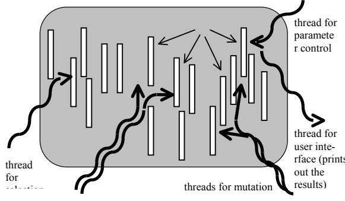

# Parallel Adaptive Genetic Algorithm

Leo Budin, Marin Golub, Domagoj Jakobovic Faculty of Electrical Engineering and Computing Unska 3, HR-10000 Zagreb, Croatia phone: $+ 3 8 5 \ 1 \ 6 1 \ 2 9 \ 9 3 5$ , fax: $+ 3 8 5$ 1 61 29 653 e-mail: {leo.budin, marin.golub, domagoj.jakobovic} $@$ fer.hr

# Abstract

In this paper we introduce an efficient implementation of asynchronously parallel genetic algorithm with adaptive genetic operators. The classic genetic algorithm paradigm is extended with parallelization on one hand and an adaptive operators method on the other. The parallelization of the algorithm is achieved through multithreading mechanism, a very effective and easy to implement technique. With parallelization we can get a better program structure and a significant decrease in computational time on a multiprocessor system. The adaptive method presented here determines the way in which the genetic operators are applied, not interfering with the operators themselves. It uses certain population characteristic values to estimate the diversity of the solutions in problem space and acts accordingly either to prevent premature convergence or to exploit the promising areas. The improvement we achieve with adaptation is twofold: the designed algorithm performs better over a range of domains and the user is also relieved of the task of defining its parameters. The described parallel adaptive genetic algorithm (PAGA) is applied to optimization of several multimodal functions with various degrees of complexity, employed earlier for comparative studies. Furthermore, a non-uniform mutation operator is introduced in this work and its influence on algorithm's performance is recognized.

# 1. Introduction

Genetic algorithm is a representative of a class of methods based on heuristic random search techniques [13]. It was proposed by John H. Holland in the early seventies and has found application in a number of practical problems since. Genetic algorithm requires a considerable amount of computational time. The parallelization of GA is an attempt primarily to speed up the algorithm without interfering with its properties. In this work, the multithreading technique is recognized as an efficient tool for transforming the genetic algorithm into parallel form. Multiple threads are reasonably simple to implement, they are supported by more and more operating systems and they require less preparation and handling than processes. The key for getting high performance in parallel computing is to reduce the communication between processes (or in our case between threads). That is why the asynchronous approach has been favored both in this paper and in similar research projects [12]. It has to be said that there is not any standard methodology for incorporating parallel ideas into genetic algorithms. Our version does not include several distinct subpopulations; there exists only a single mating pool, but a number of threads can operate on the population at the same time, each one acting independently.

The strength of GAs lies mainly in their capability to locate the global optimum in a multimodal surrounding. Unfortunately, no matter how robust and efficient a genetic algorithm may be, the solution it provides always bears a certain measure of unreliability. The genetic algorithm can only locate the global optimum with some probability of success and a considerable attention has been paid to the efforts to increase that probability. In achieving this goal, two major approaches can be recognized: the first one is to design a GA for a class of problems that we are dealing with. This includes creating data structures and genetic operators characteristic to a problem at hand, creating an evolutionary program. The method is, however, problem specific and requires a lot of modeling for each purpose. The second approach acts on the algorithm directly and tries to increase the efficiency by changing its internal structure. This method is not problem dependent and it does not restrict the applicability at all. The adaptive method presented here is an example of this approach.

The engineers utilizing GAs in everyday practice in most cases do not need the genetic algorithm to be robust and applicable to a wide range of problems. They need it to solve their specific problem, and for that purpose they usually have to create a specialized algorithm that, in general, will not perform well (or will not work at all) when used for other optimization problems. On the other hand, if the algorithm is adapted using the second approach, it can still be, in most cases, transformed into an adequate evolutionary

program. That is why every progress in internal GA structure can be reflected to a variety of applications. Another good thing we obtain from adapting the genetic algorithm is that we can bypass the task of defining its parameter values, which is in most cases left to the user. Those values are known to significantly affect the algorithm's performance; poorly chosen parameters can cause the algorithm not to produce any relevant solutions at all. Moreover, the optimal parameter configuration is often problem dependent. This can make an inexperienced user's utilization of the genetic algorithm very difficult.

# 2. Parallel genetic algorithm

Genetic algorithm is a heuristic random search method based on natural evolution which requires considerable amount of CPU time. Since the optimization problem has to be solved in given computing and time constraints, parallel genetic algorithm is an attempt to speed up the program without interfering with other properties of the algorithm.

Existing parallel implementations of genetic algorithm can be classified into following categories:

distributed GAs (parallel island models). Such algorithms assume that several subpopulations evolve in parallel. The models include a concept of migration (movement of an individual string from one subpopulation to another)[12,13]. parallel GAs. In that case several parallel processes work over one common population.

  
threads for Figure 1 Parallel genetic algorithm realised with multiple threads

The parallel genetic algorithm (PGA) can be implemented using several threads. The main benefits that arise from multithreading are: better program structure (any program in which many activities do not depend upon each other can be redesigned so that each activity is executed as a thread) and efficient use of multiple processors (numerical algorithms and applications with a high degree of parallelism, such as matrix multiplication or, in this case, genetic algorithm, can run much faster when implemented with threads on a multiprocessor) [17].

For every algorithm that we want to execute in multiple threads, first we have to identify independent parts and assign to each a thread. One or more threads can be assigned to each genetic operator (selection, crossover and mutation - Figure 1). Additionally, we can assign a thread for user interface, a thread for parameter control, a thread for results comparison with other methods (e.g. we can implement a completely random search mechanism and compare its results with the genetic algorithm), etc.

The choice of selection. The steady-state selection has one parameter $M$ - the number of new chromosomes to create. Generational replacement is the special case of steady-state selection in which parameter $M$ equals the size of the population [2]. Similarly, the tournament selection is the special case of steady-state selection too, in which parameter $M$ equals 1 (Table 1).

Table 1 Steady-state reproduction and parameter M   

<table><tr><td rowspan=1 colspan=1>Parameter M</td><td rowspan=1 colspan=1>Type ofselection</td><td rowspan=1 colspan=1>Description</td></tr><tr><td rowspan=1 colspan=1>M=POP_SIZE</td><td rowspan=1 colspan=1>Generationalselection</td><td rowspan=1 colspan=1>replaces whole population</td></tr><tr><td rowspan=1 colspan=1>1≤M≤POP_SIZE</td><td rowspan=1 colspan=1>Steady-stateselection</td><td rowspan=1 colspan=1>replaces M individuals</td></tr><tr><td rowspan=1 colspan=1>M=1</td><td rowspan=1 colspan=1>Tournamentselection</td><td rowspan=1 colspan=1>replaces only one individual(the worst of three chosen)</td></tr></table>

The steady state reproduction replaces $M$ individuals in each iteration of the evolution process. Let us divide that algorithm into three independent parts and assign to each one a thread. The first thread executes only the crossover and creates new individuals. The second thread performs the selection and deletes selected individuals. The third thread does only the mutation. In that case, without any synchronization, the population size will not be constant. If the thread for deletion is faster then the thread for creation, after some time, the population will consist of one individual (the last individual can’t be deleted because it is the best one at the same time). The crossover operator needs two individuals to create a child and it waits for the other individual creation forever, because nobody will create it. That is the deadlock. The other possibility is memory overflow if the creation thread is faster than elimination.

That problem can be solved by a simple synchronization mechanism: if the population size is too small, the elimination thread waits; if the population size is too big the creation thread waits. The change of variable POP_SIZE must be assigned to a critical section to prevent multiple threads from

simultaneously changing it. Few experiments showed that the parallel genetic algorithm described above spends more computation time for synchronization than for optimization, and the parallel program is even slower than the sequential one.

For steady-state selection with parameter $M { = } I$ the roulette-wheel bad individual selection is not a good choice. As for the each turn the selection probabilities for the whole population have to be calculated, roulettewheel selection slows down the algorithm. In that case the solution is tournament bad individual selection. The tournament bad individual selection in each step of the evolution chooses with equal probability three individuals from the mating pool. Then, it eliminates the weakest one of those three individuals. The survived two individuals are parents of a child which will replace the eliminated one.

Genetic operators as independent parts of GA. The parallel steady-state genetic algorithm with tournament bad individual selection was implemented. In this implementation, the genetic algorithm consists of two threads: one performs tournament selection and crossover and the other mutation (Fig. 2).

# SIMPLE PARALLEL GENETIC ALGORITHM{

initialize population; create thread for tournament selection and crossover; create thread for mutation; wait while termination criterion is not reached; delete all threads; }

# Thread for mutation

forever{ choose randomly one individual and mutate it;   
}

This is completely random search, i.e. the mutation probability is set to one. If the elitism is not applied, the best individual achieved in past iterations will be lost. So, in the mutation thread the elitism must be added (Figure 3).

# Thread for mutation

forever{ choose randomly one individual; if(this individual isn’t the best) mutate it;   
}

B) The thread for selection and crossover works and the mutation thread waits.

The mutation probability is set to zero. In several hundred iterations the genetic algorithm produces a uniform population (the population consists of one individual with POP_SIZE-1 copies). Even if we control the mutation probability, during the run of the genetic algorithm about half the chromosomes created are duplicates [2]. If the population is more homogenous, then the mutation probability must increase. The control of mutation probability can be easily solved with some synchronization techniques such as MUTual EXclusion locks (MUTEX), condition variables or semaphore synchronization, but, any of these synchronization mechanisms spends too much CPU time. As the goal of parallelisation is speeding up the algorithm, the synchronization must be avoided if possible.

The other possibility is the implementation of adaptive mutation probability. Before the crossover is performed, the parents have to be checked. If the parents are equal, then mutate one of them and produce their child completely randomly (Fig. 4).

# Thread for tournament selection and crossover

forever{ choose randomly three individuals; delete the worst of three chosen individuals; new individual $=$ crossover(survived parents);   
}   
forever{ choose randomly three individuals; delete the worst of three chosen individuals; if(survived individuals are equal){ mutate one of the equal individuals; create new individual randomly; }else{ new individual $=$ crossover(survived parents); }   
}

The major problem of that simple parallel implementation is that it has no control over mutation probability. The consequence is a very bad algorithm behavior. The results are slightly better than random search, but also useless.

If the threads are left to parallel execution without any control, one of two threads can waste some time on waiting for processor time. Then, one of two possibilities can happen:

A) The mutation thread works and the thread for selection and crossover waits.

These two extended threads can be parallely executed without any synchronization. Experiments have shown that $6 9 { , } 4 \%$ of the optimization time is consumed by the thread for tournament selection and crossover and the mutation thread spends the rest of optimization time $( 3 0 , 6 \% )$ . On a two processor system, the whole optimization time is about $30 \%$ shorter than on a one processor system.

The described extended parallel genetic algorithm (EPGA_1) divided into only two threads is suitable for execution on the two processor system.

Parallel genetic algorithm with equal threads. If we want to make a good use of multiprocessor system with more than two processors, the genetic algorithm has to be divided into more than two threads. The idea is in dividing the genetic algorithm into required number of equal and independent parts (Fig. 5).

This is the same algorithm like the described EPGA_1, but it is divided in a different manner. Each thread performs all genetic operators like the nonparallel genetic algorithm. One thread operates on only a part of the population, because the tournament selection works over only three chromosomes in each iteration. The other thread can work over the same chromosomes (one, two or all three) at the same time without any synchronization. This kind of parallel algorithm works the same with one or more threads.

# EXTENDED PARALLEL GENETIC ALGORITHM 2{

initialize population;   
create several equal evolution threads;   
wait while termination criterion is not reached;   
delete all threads;

# Evolution thread

forever{ perform tournament selection; delete selected individual; perform crossover; replace deleted individual; perform mutation;   
}

The parallel genetic algorithm was tested on several multidimensional problems. Table 2 shows the results of the optimization of 38 dimensional approximation problem [14]. The global minimum of that problem is equal or greater than 0 (the smaller solution value is a better solution). 100.000 iterations were made for each experiment and for each algorithm 20 experiments were done. The size of population is set to 50.

Table 2 Random search and parallel genetic algorithm comparison   

<table><tr><td rowspan=1 colspan=1></td><td rowspan=1 colspan=1>Randomsearch</td><td rowspan=1 colspan=1>SPGA</td><td rowspan=1 colspan=1>EPGA_1</td><td rowspan=1 colspan=1>EPGA_2</td></tr><tr><td rowspan=1 colspan=1>Total CPU time in seconds</td><td rowspan=1 colspan=1>135</td><td rowspan=1 colspan=1>302</td><td rowspan=1 colspan=1>350</td><td rowspan=1 colspan=1>350</td></tr><tr><td rowspan=1 colspan=1>Optimization time for Np≥2(Np - number ofprocessors)</td><td rowspan=1 colspan=1>135N p</td><td rowspan=1 colspan=1>212</td><td rowspan=1 colspan=1>245</td><td rowspan=1 colspan=1>350=NPp</td></tr><tr><td rowspan=1 colspan=1>the worst solution</td><td rowspan=1 colspan=1>25 019</td><td rowspan=1 colspan=1>19 455</td><td rowspan=1 colspan=2>109.0</td></tr><tr><td rowspan=1 colspan=1>average solution</td><td rowspan=1 colspan=1>21 798</td><td rowspan=1 colspan=1>16 881</td><td rowspan=1 colspan=2>49.1</td></tr><tr><td rowspan=1 colspan=1>the best solution</td><td rowspan=1 colspan=1>14 826</td><td rowspan=1 colspan=1>8250</td><td rowspan=1 colspan=2>16.5</td></tr></table>

The optimization time is equal to the duration of the longest thread, if the number of processors is equal or greater than the number of threads. The optimization time for SPGA and EPGA_1 on a two processor system is equal to duration of the thread for crossover and selection (that is about $70 \%$ of total CPU time). On a three or more processor system the program isn’t faster because the algorithm is divided into only two threads. The EPGA_2 is divided into $N _ { T } { = } N _ { P }$ threads. The optimization time for EPGA_2 is equal to the optimization time for the same non-parallel genetic algorithm divided by the number of processors.

# 3. Adaptive genetic operators

Two characteristics are held to be essential in genetic algorithms for optimizing multimodal functions. The first one is the capability to converge to an optimum, local or global, after locating the region containing it. The second characteristic is the capacity to explore new regions of the solution space in search of the global optimum. It is with genetic operators, crossover and mutation, that we achieve those properties. The crossover operator is mainly responsible for the first characteristic, while the latter is made possible with mutation. The balance between these characteristics can be achieved by affecting the way the genetic operators are performed.

The essence of successful multimodal search is to keep the population dispersed in the problem space. We do not need the whole population to converge to an optimum, but we need to preserve the premature convergence at a local one. At the same time we should allow the algorithm to exploit the promising areas and locate the optimum with desired accuracy. It is possible to maintain the diversity of the population by increasing the mutation rate, while the speed of the convergence can be increased by favoring better individuals to participate in crossover. Prior to applying the actual adaptation techniques, we have to be able to estimate the degree of diversity of the population.

We can get a rather good picture of the state the population is in by observing two of its characteristic values: $f _ { \mathrm { m a x } }$ - fitness value of the best member, and $\overline { { f } }$ - average fitness of the set of solutions, both assigned to a current generation. The expression $f _ { \mathrm { m a x } } - \overline { { f } }$ is likely to be less for a population that has converged than for a population scattered in the solution space. The above property has already been recognized earlier in literature [16] and it has proven itself in all experiments accompanying this work. A normalized expression has been used here in determining the degree of population diversity:

$$
( f _ { \operatorname* { m a x } } - \overline { { f } } ) / ( f _ { \operatorname* { m a x } } - f _ { \operatorname* { m i n } } )
$$

where $f _ { \mathrm { m i n } }$ represents the worst fitness value. If the value is low, the population is homogenous; if it gets higher the population is more diversed. However, in optimizing problems with a large solution space (long binary strings) this value tends to be very low in the beginning and to raise slowly over the process. This is due to the functions that have approximately average values in most of the defined search space, whereas the higher function values are located in a considerably smaller area. To effectively exploit the above expression (1), a correction technique is performed in each generation. In the beginning of the process the expression is evaluated and its value stored in a static variable. It is calculated in each generation and compared to that stored in the variable. If the new value is greater than the old one, the value of the variable is then replaced with the new one. If it is smaller, the variable is unchanged. Let us name the value of (1) in current generation with curr_val and the static variable with prev_val.

The value of the following expression is calculated and named as $w$ :

$$
w = \left( \frac { c u r r \_ { \nu a l } } { p r e \nu \_ { \nu a l } } \right) ^ { 2 }
$$

The logic behind $w$ is as follows: if the population becomes more homogenous, which we want to avoid, curr_val is smaller than prev_val and $w$ consequently decreases. The $2 ^ { \mathrm { n d } }$ power is added for increased sensitivity. Before calculating $w$ , the algorithm compares the variables and replaces prev_val with the new value if prev_val $<$ curr_val. If that is the case, the population has become more diversed, which is desirable, and $w$ equals one.

The adaptive technique affects the way the chromosomes are picked up for crossover. For every solution a characteristic value $\nu$ is calculated as follows:

$$
\nu = ( f - f _ { \operatorname* { m i n } } ) \cdot ( 2 w - 1 ) - ( f _ { \operatorname* { m a x } } - f _ { \operatorname* { m i n } } ) \cdot ( w - 1 )
$$

where $f$ stands for the fitness value of a chromosome. The roulette-wheel method is used to select the chromosomes for crossover, regarding their characteristic values. A previously selected individual is then replaced by the crossover product, while the parents are left intact. A chromosome can participate in crossover more then once, depending on its fitness value. If a population is scattered in problem space the value of $w$ will be higher, so according to (3), the solutions with better fitness values get a higher chance to mate and produce offspring. If $w$ is lower, the selection becomes more uniform, and for $w < 0 . 5$ the algorithm even favors worse solutions.

When applied to a steady-state algorithm with elimination selection, as in previous work [10], the adaptive method calculates the expression (2) in the beginning of every generation. If the algorithm uses tournament selection, as described in section 2, we have to determine when to calculate the new value of $w$ . The interval of $P O P \_ S I Z E$ (the size of the population) crossovers has proven to be efficient in this implementation as the step size.

Finally, the adaptive technique varies the number of mutations in each generation. The number of mutations is calculated as:

$$
n = P O P \_ S I Z E \cdot \left[ 2 \cdot ( 1 - w ) + 0 . 1 \right]
$$

The number of mutations increases linearly with the decrease of (1) in current generation. Again, if we employ tournament selection, the mutations are performed in each step of the adaptation process.

The adaptive strategy increases the exploitation of good solutions thus speeding up the convergence and also prevents the population, in most cases, from getting stuck at a local optimum. Each one of these techniques can be applied independently, which further increases their configurability.

We also propose a modified, non-uniform mutation operator to accompany this work. The non-uniform mutation takes into consideration the fitness value of a solution and selects the scope in which the solution will be changed. This is done in practice by restricting the number of bits which the mutation operator can affect in a single chromosome. In binary representation, only a set number of rightmost (i.e. less significant) bits can be mutated. The changeable bits form a rightmost substring of a chromosome, the length of which is defined with:

$$
b i t s = 1 + c h r o m \_ l e n g t h \cdot \left( 1 - \frac { f - \overline { { { f } } } } { f _ { \mathrm { m a x } } - \overline { { { f } } } } \right) , f > \overline { { { f } } }
$$

where chrom_length is the total number of bits in a chromosome and $f$ is the fitness value of the selected individual. This restriction is only made for solutions whose fitness value is greater than the population average. The same technique for floating-point representation is easily implemented by defining the greatest difference between the old solution and the new one after mutation. For problems where the Euclidean distance between chromosomes cannot be defined, this operator is meaningless.

The non-uniform mutation operator has significantly improved the algorithm's 'fine tuning' capabilities. However, the best results, in overall, are achieved when both types (uniform and non-uniform) of operators are included. In all of the GA implementations following this work, there is a $50 \%$ chance that either of the operators will be applied when a chromosome is mutated.

# 4. An implementation of parallel adaptive genetic algorithm

In this section we describe the implementation of a parallel genetic algorithm incorporating the adaptive techniques. The parallel model used is the parallel genetic algorithm with equal threads (EPGA_2). Each thread performs independently and operates on the whole population, though no more than three individuals at the same time. A thread performs the tournament selection and deletes the selected individual. Then it performs roulette wheel selection to determine two parents to participate in crossover. The product of the crossover replaces the deleted individual. After POP_SIZE crossovers, the algorithm calculates the population diversity (3) and updates the chromosomes' characteristic values. The mutation phase is then performed and a generational cycle is concluded. The structure of the parallel adaptive genetic algorithm (hereafter reffered to as PAGA) is shown in Fig. 6.

# PARALLEL ADAPTIVE GENETIC ALGORITHM{

initialize population;   
create several equal evolution threads;   
wait while termination criterion is not reached;   
delete all threads;

# Evolution thread

forever{ perform tournament selection; delete selected individual; perform roulette wheel parent selection perform crossover; replace deleted individual; every POP_SIZE evaluations calculate w & $V _ { \perp }$ ; perform mutation;

The PAGA can be executed on a one or multi-processor system, with one or more threads. The termination criterion used in this work is a set number of function evaluations made by the algorithm.

# 5. Experimental results

For the experiments, five test functions have been taken from a number of sources and are shown in Fig. 7. The evaluations were undertaken for 5, 10 and 30 dimensional instances of the test functions.

$$
f _ { 1 } = 0 . 5 + \frac { \sin ^ { 2 } \sqrt { \sum x _ { i } ^ { 2 } } - 0 . 5 } { \left[ 1 . 0 + 0 . 0 0 1 \cdot \sum x _ { i } ^ { 2 } \right] ^ { 2 } } , x _ { i } \in [ - 1 0 0 , 1 0 0 ]
$$

$$
f _ { 2 } = 1 + ( \sum x _ { i } ^ { 2 } ) ^ { 0 . 2 5 } \cdot [ \sin ^ { 2 } { ( 5 0 ( \sum x _ { i } ^ { 2 } ) } ^ { 0 . 1 } ) + 1 . 0 ]
$$

$$
\begin{array} { r } { f _ { 3 } = \sum \mathopen { } \mathclose \bgroup \left( x _ { i } ^ { 2 } - 1 0 \cos ( 2 \pi \cdot x _ { i } ) \aftergroup \egroup \right) , x _ { i } \in [ - 1 0 0 , 1 0 0 ] } \end{array}
$$

$$
f _ { 4 } = \sum \frac { x _ { i } ^ { 2 } } { 4 0 0 0 } - 2 0 \cdot \prod \Bigl ( \cos \Bigl ( x _ { i } \Bigl / \sqrt { i } \Bigr ) + 1 \Bigr ) , x _ { i } \in [ - 1 0 0 , 1 0 0 ]
$$

$$
\begin{array} { r } { f _ { 5 } = \sum x _ { i } \sin ( \sqrt { \left| x _ { i } \right| } ) , x _ { i } \in [ - 5 1 2 , 5 1 2 ] } \end{array}
$$

The performance of PAGA is evaluated and compared with standard roulette wheel genetic algorithm (denoted as $G A { \cdot } r w )$ ) and steady state algorithm with elimination selection (GA-eli). The fitness value of the best member at the end of a run is considered in the results. The common features of all the algorithms are binary encoding, precision of 1e-5, uniform crossover operator, both uniform and non-uniform mutation and 50 individuals as the size of the population. The parameters of $G A { \cdot } r w$ and GA-eli are shown in Table 3.

Table 3 Parameter settings   

<table><tr><td rowspan=1 colspan=1></td><td rowspan=1 colspan=1>GA-rw</td><td rowspan=1 colspan=1>GA-eli</td><td rowspan=1 colspan=1>PAGA</td></tr><tr><td rowspan=1 colspan=1>crossover rate</td><td rowspan=1 colspan=1>0.7</td><td rowspan=1 colspan=1>-</td><td rowspan=1 colspan=1>-</td></tr><tr><td rowspan=1 colspan=1>generation gap</td><td rowspan=1 colspan=1>-</td><td rowspan=1 colspan=1>0.8</td><td rowspan=1 colspan=1>-</td></tr><tr><td rowspan=1 colspan=1>mutation rate</td><td rowspan=1 colspan=1>0.01</td><td rowspan=1 colspan=1>0.01</td><td rowspan=1 colspan=1>-</td></tr><tr><td rowspan=1 colspan=1>selection method</td><td rowspan=1 colspan=1>roulette wheel</td><td rowspan=1 colspan=1>elimination</td><td rowspan=1 colspan=1>tournament</td></tr></table>

The genetic algorithms were allowed to execute 200000 evaluations for 5 and 10 dimensional problems and 500000 evaluations for 30 dimensional problems. The results are produced by averaging the results from twenty trials on each of the function instances and are presented in Table 4.

Table 4. Experimental results   

<table><tr><td rowspan=1 colspan=1></td><td rowspan=1 colspan=1>GA-rw</td><td rowspan=1 colspan=1>GA-eli</td><td rowspan=1 colspan=1>PAGA</td></tr><tr><td rowspan=1 colspan=1>5dim f1</td><td rowspan=1 colspan=1>0.01424</td><td rowspan=1 colspan=1>0.01796</td><td rowspan=1 colspan=1>0.00971</td></tr><tr><td rowspan=1 colspan=1>10dim f1</td><td rowspan=1 colspan=1>0.03172</td><td rowspan=1 colspan=1>0.14543</td><td rowspan=1 colspan=1>0.02347</td></tr><tr><td rowspan=1 colspan=1>30dim f1</td><td rowspan=1 colspan=1>0.21629</td><td rowspan=1 colspan=1>0.49963</td><td rowspan=1 colspan=1>0.17725</td></tr><tr><td rowspan=1 colspan=1>5dim f2</td><td rowspan=1 colspan=1>0.08343</td><td rowspan=1 colspan=1>0.14285</td><td rowspan=1 colspan=1>0.01288</td></tr><tr><td rowspan=1 colspan=1>10dim f2</td><td rowspan=1 colspan=1>0.66908</td><td rowspan=1 colspan=1>0.41222</td><td rowspan=1 colspan=1>0.49651</td></tr><tr><td rowspan=1 colspan=1>30dim f2</td><td rowspan=1 colspan=1>5.30848</td><td rowspan=1 colspan=1>8.78713</td><td rowspan=1 colspan=1>6.14411</td></tr><tr><td rowspan=1 colspan=1>5dim f3</td><td rowspan=1 colspan=1>0.94420</td><td rowspan=1 colspan=1>1.69862</td><td rowspan=1 colspan=1>0.01346</td></tr><tr><td rowspan=1 colspan=1>10dim f3</td><td rowspan=1 colspan=1>19.8973</td><td rowspan=1 colspan=1>2.02005</td><td rowspan=1 colspan=1>5.89022</td></tr><tr><td rowspan=1 colspan=1>30dim f3</td><td rowspan=1 colspan=1>185.182</td><td rowspan=1 colspan=1>251.085</td><td rowspan=1 colspan=1>56.0275</td></tr><tr><td rowspan=1 colspan=1>5dim f4</td><td rowspan=1 colspan=1>0.00167</td><td rowspan=1 colspan=1>0.00237</td><td rowspan=1 colspan=1>0.00146</td></tr><tr><td rowspan=1 colspan=1>10dim f4</td><td rowspan=1 colspan=1>0.00169</td><td rowspan=1 colspan=1>0.00979</td><td rowspan=1 colspan=1>0.00145</td></tr><tr><td rowspan=1 colspan=1>30dim f4</td><td rowspan=1 colspan=1>0.03358</td><td rowspan=1 colspan=1>0.02479</td><td rowspan=1 colspan=1>0.01781</td></tr><tr><td rowspan=1 colspan=1>5dim f5</td><td rowspan=1 colspan=1>48.225</td><td rowspan=1 colspan=1>109.324</td><td rowspan=1 colspan=1>2.853</td></tr><tr><td rowspan=1 colspan=1>10dim f5</td><td rowspan=1 colspan=1>159.242</td><td rowspan=1 colspan=1>300.893</td><td rowspan=1 colspan=1>152.0605</td></tr><tr><td rowspan=1 colspan=1>30dim f5</td><td rowspan=1 colspan=1>1230.44</td><td rowspan=1 colspan=1>1854.3</td><td rowspan=1 colspan=1>1142.321</td></tr></table>

The entries in the table show the average deviation from the global optimum normalized to the range from zero to one for functions $f I$ and $f 4 .$ . A smaller value indicates

better performance and the best results are in bold face. It can be perceived from the results that the PAGA managed to perform reasonably good in optimizing a number of problems, while the standard algorithms with fixed parameters were able to find the best solution only when those parameter values fit the problem at hand.

# 6. Concluding remarks

In most of the test cases, the PAGA outperformed the standard versions. The adaptive technique makes it possible for the algorithm to perform similarly to the one whose parameters are 'well tuned' for a specific problem, which is the main reason for adaptation.

By dividing the genetic algorithm into threads we achieved several benefits: the algorithm is faster (the optimization time is shorter than for the nonparallel genetic algorithm), the code can be easily adapted and extended with new genetic operators and we can simultaneously execute two or more methods and compare the results at the same time. The parts obtained by dividing the genetic algorithm are independent. The critical sections are avoided, because the synchronization mechanisms would significantly slow down the parallel program.

Some questions still remain to be answered, such as the choice for population size. That problem is dealt with in the paper [8] by Hinterding and the results shown there are promising. The choice of the type of genetic operators is also a difficult task, and it has been effectively solved in an exceptional work [9] by Houck and Kay. The mentioned adaptations are solely independent and can also be incorporated in PAGA, which further increases its usability and can lead to a significant performance enhancement.

# References:

[1] Alippi, C., Filho, J.L.R., Treleaven, P.C. (1994), "Genetic-Algorithm Programming Environments", IEEE Trans. Computer, June 1994.   
[2] Davis, L. (1991) Handbook of Genetic Algorithms, Van Nostrand Reinhold, New York.   
[3] Goldberg, D.E. (1989), Genetic Algorithms in Search, Optimization and Machine Learning, Addison-Wesley.   
[4] Golub M., “Evaluating The Use of Genetic Algorithms for Approximation Time Series”, M.S. Thesis, Zagreb, 1996. (in Croatian).   
[5] Hinterding, R. (1995), "Representation and Selfadaption in Genetic Algorithms", Proc. of the First Korea-Australia Joint Workshop on Evolutionary Computation, Sept. 1995, Taejon, Korea.   
[6] Hinterding, R. (1997), "Self-adaptation using Multi-chromosomes", Proc. 4th IEEE Int. Conference on Evolutionary Computation.   
[7] Hinterding, R., Michalewicz, Z., and Eiben, A.E. (1997), "Adaptation in Evolutioary Computation: A Survey", Proc. $\boldsymbol { 4 } ^ { t h }$ IEEE Int. Conference on Evolutionary Computation.   
[8] Hinterding, R., Michalewicz, Z., and Peachey, T.C. (1996), "Self-Adaptive Genetic Algorithm for Numeric Functions", Proc. of the Fourth Int. Conference on Parallel Problem Solving from Nature, Berlin, Sept 1996.   
[9] Houck, Ch. R., Kay, M. G. (1996), "Adapting the Order and Frequency of Genetic Operators through Co-Evolving Populations", N. Carolina State University - IE, Technical Report 96-03.   
[10] Jakobovic, D. (1997) "Adaptive Genetic Operators in Elimination Genetic Algorithm", Proc. $I 9 ^ { t h }$ International Conference ITI'97, Pula, 17-20 June 1997, pp.351-356.   
[11] Jelenkovic, L, Omrcen-Ceko, Goran (1997), “Experiments with Multithreading in Parallel Computing”, Proceedings of the $I { \boldsymbol { \mathcal { G } } } ^ { t \bar { h } }$ International. Conference ITI'97, Pula, pp. 451-456.   
[12] Munetomo, M., Takai, Y., Sato, Y. (1993), "An Efficient Migration Scheme for SubpopulationBased Asynchronously Parallel Genetic Algorithms", Hokkaido University Information Engineeering Technical Report, Sapporo, July 1993.   
[13] Michalewicz, Z. (1992), Genetic Algorithms $^ +$ Data Structures $=$ Evolutionary Programs, Springer-Verlag, Berlin.   
[14] Schoenenburg, E., Heinzmann, F., Feddersen, S. (1995) Genetische Algorithmen und Evolutionsstrategien, Addison-Wesley.   
[15] Srinivas, M., Patnaik, L. M. (1994), "Genetic Algorithms: A Survey", IEEE Trans. Computer, June 1994.   
[16] Srinivas, M., Patnaik, L. M. (1994), "Adaptive Probabilities of Crossover and Mutation in Genetic Algorithms", IEEE Trans. Systems, Man and Cybernetics, Apr. 1994.   
[17] SunSoft, (1994), Solaris 2.4: Multithreaded Programming Guide, Sun Microsystems, Mountain View, California.