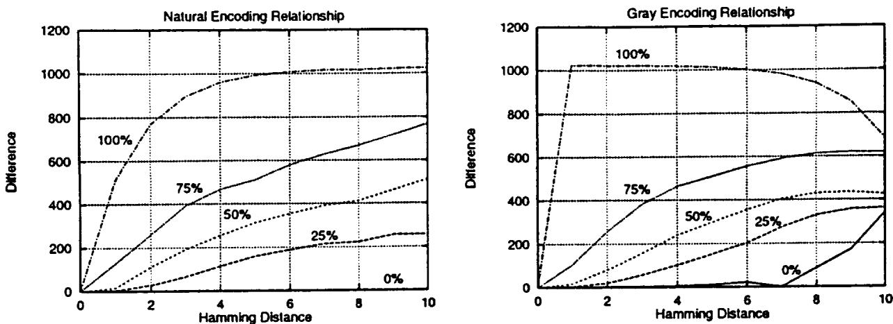
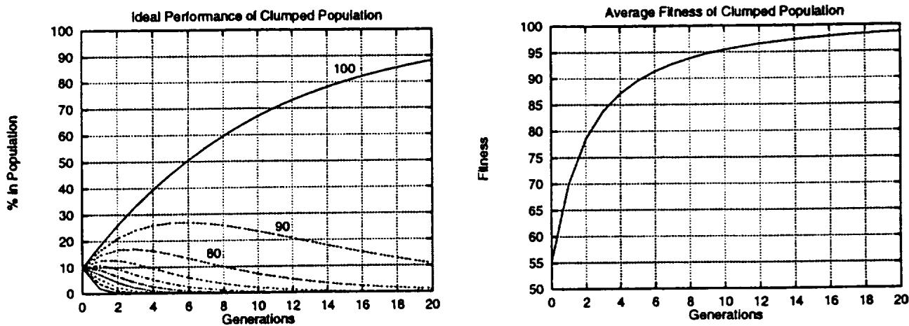
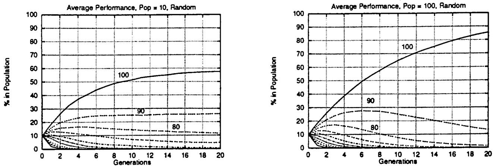
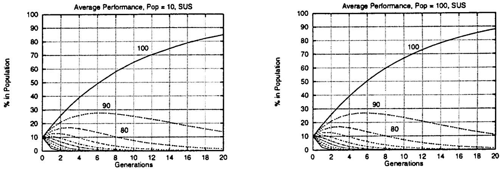
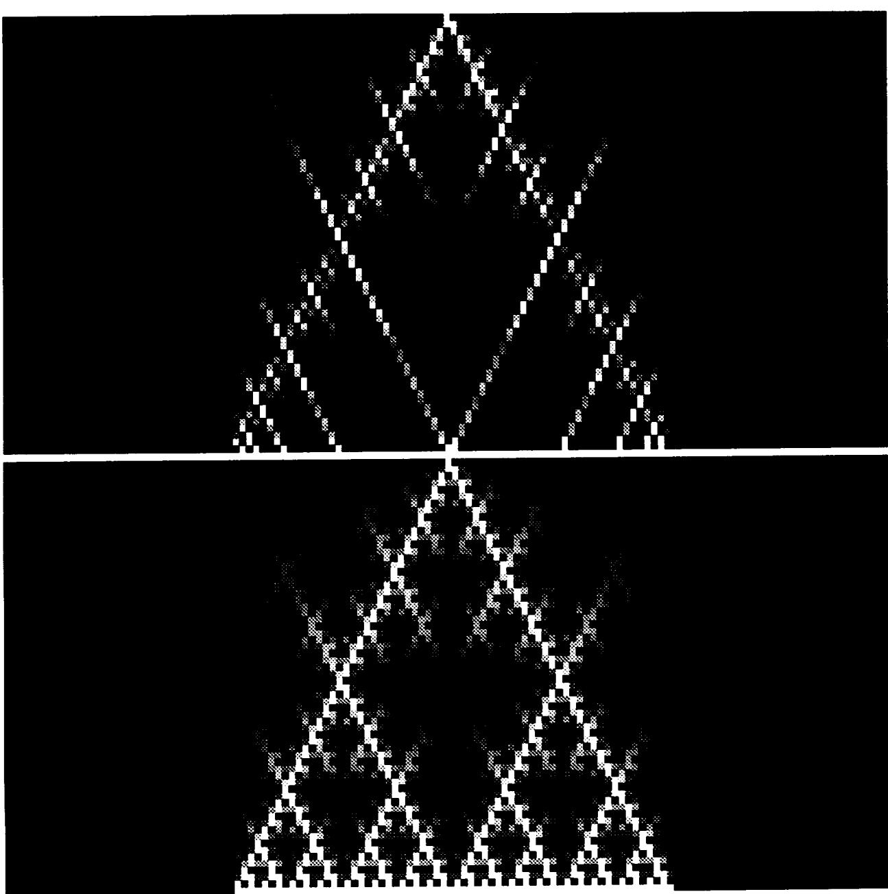
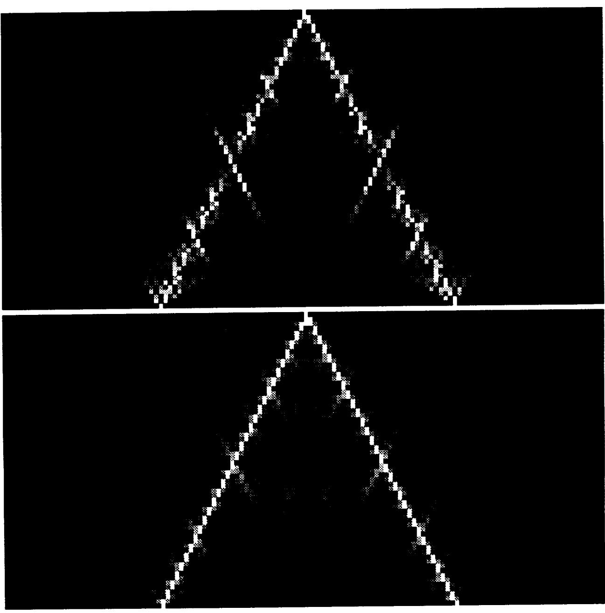
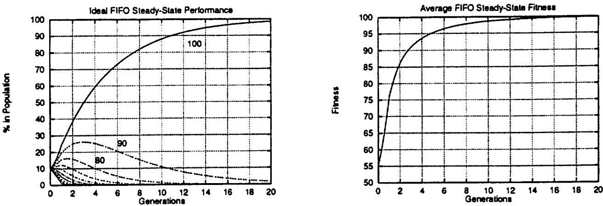
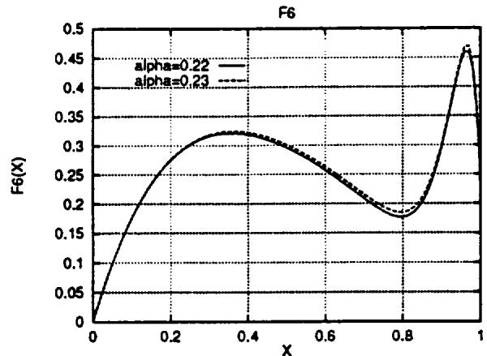
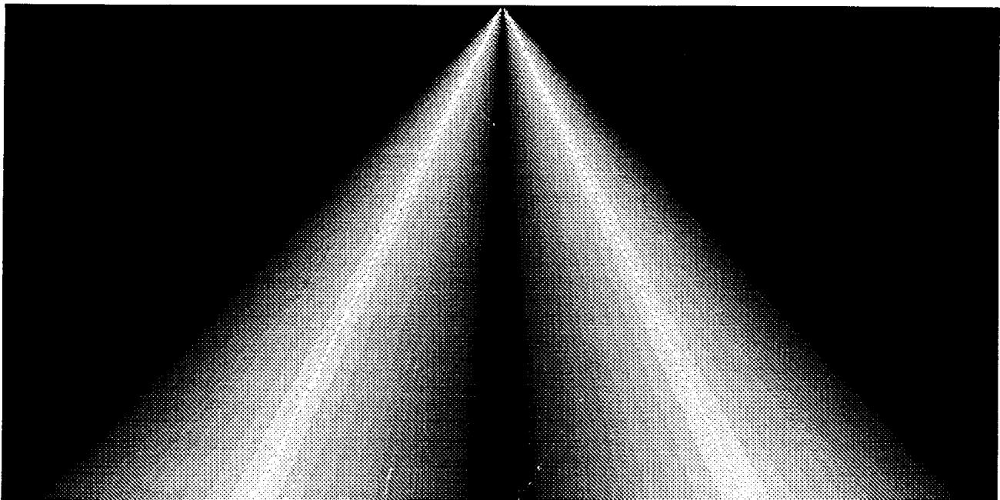
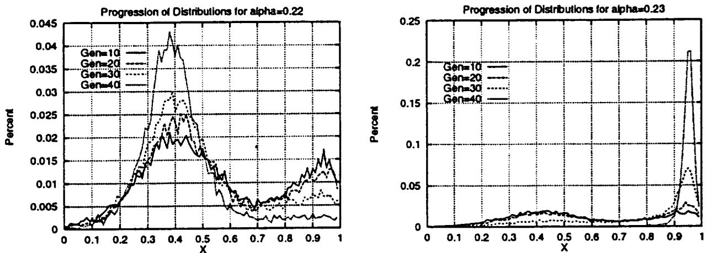

# Genetic Algorithms as Global Random Search Methods

Charles C. Peck and Atam P. Dhawan University of Cincinnati Cincinnati, Ohio

# December 1995

Prepared for   
Lewis Research Center   
Under Cooperative Agreement NCC3-308

:

# Genetic Algorithms as Global Random Search Methods

Charles C. Peck and Atam P. Dhawan Department of Electrical and Computer Engineering University of Cincinnati Cincinnati, OH 45221

This work was supported by a contract from the NASA Space Engineering Center for System Health Management Technology at the University of Cincinnati.

# Genetic Algorithms as Global Random Search Methods\*

# Charles C. Peck and Atam P. Dhawan Department of Electrical and Computer Engineering University of Cincinnati Cincinnati, OH 45221

February 21, 1995

# Abstract

Genetic algorithm behavior is described in terms of the construction and evolution of the sampling distributions over the space of candidate solutions. This novel perspective is motivated by analysis indicating that the schema theory is inadequate for completely and properly explaining genetic algorithm belavior. Based on the proposed theory, it is argued that the similarities of candidate solutions should be exploited directly, rather than encoding candidate solutions and then exploiting their similarities. Proportional selection is characterized as a global search operator, and recombination is characterized as the search process that exploits sinilarities. Sequential algorithms and many deletion methods are also analyzed. It is shown that by properly constraining the search breadth of recombination operators, convergence of genetic algorithms to a global optimum can be ensured.

# 1 Introduction

Genetic algorithins are adaptive systemns designed to emulate natural evolution. They were first proposed by John Holland in 1975 in his seminal work Adaptation in Natural and Artificial Systems (Holland, 1975). De Jong suggests that genetic algorithms should be understood from the perspectives of genotypic and phenotypic behavior, as well as their performance as global optimizers (De Jong, 1993). This paper contributes to this goal by describing genetic algorithun behavior in termns of the sampling distributions they impose on the genospace and the phenospace, and how these distributions contribute to or detract from the optimization process.

While genetic algorithmns have been shown to be effective in many problem domains, the theoretical foundation for describing, explaining, and predicting their behavior is presently inadequate. As argued in Section 2, the prevailing theory of genetic algorithm behavior, the schema theory, is not a suitable theory for describing genetic algorithm behavior. Accordingly, the primary objective of this paper is to generalize genetic algorithms and to provide an adequate basis for their understanding and analysis (Sections 3 & 4). A second objective of this paper is to explore the issues and variations of genetic algorithms permitted by their generalization in the context of the proposed explanation of genetic algorithm behavior (Section 5). The final objective of this paper is to determine the conditions under which genetic algorithms can be assured to converge to a global optimum (Section 6). Finally, conclusions and suggestions for future research are presented (Section 7).

# 2 Descriptions and Analyses of Genetic Algorithm Behavior

In this section, descriptions and analyses of genetic algorithm behavior are considered. Naturally, the most basic description of a genetic algorithm and the fundamental basis of analysis is its definition. For the purposes of this paper, the canonical genetic algorithm is defined by Procedure 1. In step 3 and throughout the paper, the recombination of parental encodings is taken to include the effects of both mutation and crossover. Common recombination operators and fitness scaling techniques are described throughout the literature (general coverage is provided in (Holland, 1975; Goldberg, $1 9 8 9 \mathfrak { a }$ ; Davis, 1991)). In subsection 2.1, where the schema theory is considered, it is assumned that no fituess scaling is used and that the entire population of chromosomes is replaced each generation.

# Procedure 1 The Canonical Genetic Algorithm

Initialize a population of chromosomes (binary strings).

2.Evaluate each chromosome in the population by applying the objective function to its corresponding candidate solution.

3. Create new chromosomes by applying a fitness scaling technique to the chromosome evaluations, choosing parent chromosomes according to their relative fitness, and recombining their encodings.

4. Delete members of the population to mnake room for the new chromosomes.

5. Evaluate each new chromosomme as in Step 2, and insert it into the population.

6. If the stopping criterion has been satisfied, then stop and return the chromosome with the best observed fitness; otherwise continue with Step 3.

While the procedural description is complete and exact, it is not adequate for conveying a suitable understanding of genetic algorithm behavior. This description is able to explain phenomena arising from the use of a genetic algorithm only at the lowest level of abstraction and understanding. Since this description operates at the experimental, practical, or phenomenal level, it does not constitute a theory. Consequently, the inadequacies of this description have given rise to the schema theory and other analyses of genetic algorithms, such as Markov chain analysis.

In the remainder of this section, the snitability of existing analyses of genetic algorithm behavior are considered on the basis of the following criteria:

1. The theory should be well grounded in the procedural elements and the generating mechanisms of genetic algorithms. These include the processes of selection, recombination, fitness evaluation, and population manageinent.

2. The theory should have explanatory and predictive power.

3. The theory should be robust with respect to algorithmic variations.

Furthermore, in consideration of Occam's razor, the preferred theory is the simplest and most closely grounded to that which is known (i.e., the procedural elements and generating mechanisms).

In this paper, an individual string is denoted A or Aj, where j = 1,2,..., N, and N is the size of the population A(t) at time t. The objective or fitness function is denoted f : A → R1 > 0. A schemna, its order, and its defining length, are denoted H, o(H), and $\delta ( H )$ , respectively. A scherna's order is the number of fixed positions or string elements common to all members of the schemna, and its defining length is the distance between the schema's first and last fixed positions.

# 2.1 The Schema Theory

According to the schema theory, genetic algorithuns work in the space of schemata as opposed to the space of strings. Therefore, it is necessary to understand the effects of reproduction and the recombination operators on the schemata contained within a population in order to understand the behavior of genetic algorithms within the context of the schema theory. When proportional selection is used, the probability of selecting $A _ { j , t }$ ,the jth individual in the population at time $t ,$ as a parent is

$$
p _ { j , t } = \frac { f ( A _ { j , t } ) } { \displaystyle \sum _ { A _ { i , t } \in { \bf A } ( t ) } f ( A _ { i , t } ) } ,
$$

and, the target sampling rate of a schema $\pmb { H }$ is

$$
\begin{array} { r } { E \{ \tau n ( H , t + 1 ) \} \ge \tau n ( H , t ) \frac { \overline { { f } } ( H , t ) } { \overline { { f } } ( \mathbf { A } ( t ) ) } \left[ 1 - p _ { c } \cdot \frac { \delta ( H ) } { \ell - 1 } - o ( H ) p _ { m } \right] , } \end{array}
$$

where $m ( H , t )$ is the number of representatives of $\pmb { H }$ in the population at timne $\pmb { t }$ (Grefenstette & Baker, 1989), $\bar { f } ( H , t )$ is the average fitness of the representatives of $\pmb { H }$ in the present population, $\bar { f } ( \mathbf { A } ( t ) )$ is the average fitness of the present population, $p _ { \pmb { c } }$ is the crossover probability, and $p _ { m }$ is the mutation probability. Based on (2), it has been concluded that small, low-order schemata with above-average perfornance are allocated exponentially increasing trials in subsequent generations (Goldberg, 1989a). An important observation in the schema theory is that each binary string inplicitly searches or samples 2' schemata. According to the theory, this implicitly acquired information is then used for trial allocation to schemata and to generate increasingly better strings. It has been argued that implicit parallelism leverages the power of genetic algorithins (Goldberg, 1989a), and allows them to avoid the obstacles of high dimensionality (Holland, 1975). Equation (2) is often referred to as the Schema Theorem or the Fundamncntal Theorem of Genetic Algorithms (Goldberg, 1989a).

The schema theory will now be evaluated according to the suitability criteria established at the beginning of this section.

1. The allocation of trials to schemata in a manner consistent with the schema theorem is certainly well grounded to the procedural elements. However, schema information is not used in the procedure for trial allocation or any other purpose. Therefore, the use of acquired schema information to guide or affect genetic algorithm behavior has no tangible basis and is not well grounded (Peck, 1993, §3.2.5).

2. The schema theory has lead to useful, verifiable predictions (e.g., see (Fitzpatrick & Grefenstette, 1988; Goldberg, Deb & Clark, 1992; Goldberg, Deb & Clark, 1993)). However, the schema theory is inexact due to the inequality in (2). Furthermore, the schema theory and the building block hypothesis are unable to explain how genetic algorithms systematically generate improved candidate solutions, since they depend on the use of implicitly acquired schema inforination (Peck, 1993, §3.2.5).

3.The schema theory, as presented in this paper, is not robust with respect to algorithmic variations (Peck, 1993, §3.2.5). Genetic algorithm variants using fitness scaling, ranking, and/or real (floating point) encodings are difficult, if not impossible, to explain within the context of the schema theory. The attempts that have been made require a new interpretation of the schema theory or higher-order abstractions (Whitley, 1989; Goldberg, 1991a; Gokdberg, 1991b). Similar algorithuns, such as evolution strategies and evolutionary programnming (Bäck & Schwefel, 1993), are beyond the scope of the schema theory.

It has also been observed that schema-based analysis of genetic algorithm behavior is greatly complicated by the difficulties in associating properties to schenata (Forrest & Mitchell, 1993; Grefenstette & Baker, 1989; Grefenstette, 1991; Grefenstette, 1993; Peck, 1993; Peck & Dhawan, 1993). Finally, since genetic algorithms do not use schema information, there is no basis to conclude that genetic algorithms realize advantages from implicit parallelism (Peck, 1993).

# 2.2 Alternative Analyses of Genetic Algorithms

While the primary basis of genetic algorithum analysis has been the schema theory, other types of analysis have been pursued as wel. The primary bases of alternative analysis have been Markov chain and simulated annealing theory. Most of the analyses in the literature have only sought to address specific issues, have made simplifying assumptions, or have not been dependent on the distinguishing characteristics of genetic algorithms (De Jong, 1975; Goldberg & Segrest, 1987; Rabinovich & Wigderson, 1991; Eiben, Aarts & Hee, 1991; Davis & Principe, 1991).

The theory presented in (Vose & Liepins, 1991a; Nix & Vose, 1992; Vose, 1993a) represents the most accurate and complete alternative theory of genetic algorithm behavior in the literature. In (Vose & Liepins, 199la), Vose and Liepins present a novel, algebraic formalization and analysis of a simple genetic algorithn. Using Markov chain analysis, with the state defined by the composition of an infinite sized population, the trajectory of the expected populations is modeled, and the conditions for convergence to the absorbing states of the transition mapping are derived. In (Nix & Vose, 1992), the formalisin of the Vose and Liepins model is applied to a simple genetic algorithm with a finite population size. It is concluded that, as the population size increases, the asymptotic behavior of the steady state distributions may be characterized in terms of the Vose and Liepins model. In (Vose, 1993a), the two preceding works are further tied together, and the GA-surface is introduced. The GA-surface, which is composed of the points corresponding to populations, may be used to provide a geometric interpretation of genetic search and to explain population trajectories.

The theory contained in (Vose & Liepins, 1991a; Nix & Vose, 1992; Vose, 1993a) will now be interpreted in the context of the criteria established at the beginning of this section:

1.The construction and operation of the population transition operators is well grounded in the procedural elements and generating mechanisms of genetic algorithms. In fact, the representations in (Nix & Vose, 1992) and (Vose & Liepins, 1991a) are exact for finite and infinite populations, respectively.

2. Since the representations are exact, any phenomena observed of genetic algorithms will be explainable within their contexts. As an example, observations of punctuated equilibrium are explainable in the context of the infinite population representation. Furthermore, many predictions regarding short and long term behavior have been derived from this analysis.

3. Markov chain representations may be generated for nearly any algorithmic variant. Derived properties must naturally be proved for each variant.

The above analysis suggests that a suitable theory for genetic algorithm analysis has been constructed. There is, however, a subtle caveat to this conclusion: the explanatory power of this work is hampered by lumping genetic algorithm behavior into a population transition operator. There are many low-level phenomena of genetic algorithms that are not adequately understood, and a high-level, unitary abstraction such as a population transition operator may have difficulty explaining them. A level of abstraction operating between the low-level abstraction of the procedure and the high-level abstraction of the transition operator is desired.

This section reviews the theory of global random search methods. This theory serves as the basis for an alternative theory of genetic algorithm behavior, which is presented in Section 4. The presentation throughout this section primarily sunmarizes and clarifies the analysis and results presented by Zhigljavsky (Zhigljavsky, 1991). A more thorough summary of these results is presented in (Peck, 1993).

This section begins with an introduction to global search methods. This is followed by a presentation of basic global random search methods. Finally, generational methods and their convergence properties are examined.

# 3.1 Introduction and Notation

In the typical global optimization problem, it is desired to optimize an objective function, which may be a mathematical expression or the output of an algorithm, process, experiment, or system. Let X denote a set referred to as the feasible region and f : X → 1 be the objective function. In the global mininization problem, it is desired to approximate either the value

$$
f ^ { * } = \operatorname* { i n f } _ { x \in \mathcal { X } } f ( x ) ,
$$

the point ${ \pmb x } ^ { \ast } \in \mathcal { X }$ at which the minimal value $f ^ { \star }$ is attained,

$$
x ^ { * } = \arg \operatorname* { m i n } _ { x \in \cdot } f ( x ) ,
$$

or both. The global minimizer, $\pmb { x } ^ { \ast }$ , is not generally unique.

Approximating and a point = arg min is usually interpreted as finding a pot in either the set

$$
A ( \delta ) = \{ x \in \mathcal { X } : | f ( x ) - f ( x ^ { \ast } ) | \leq \delta \} ,
$$

or the set

$$
B ( \varepsilon ) = B ( x ^ { * } , \varepsilon , \rho ) = \{ x \in \mathcal { X } : \rho ( x , x ^ { * } ) \leq \varepsilon \} ,
$$

where $\pmb { \rho }$ is the given metric on $\mathcal { X } , \delta$ , and $\varepsilon$ deternine the accuracy of the approxination with respect to the function and argument values (Zhigljavsky, 1991, pg. 2).

In the global maximnization problem, alternatively, the objective is to approximate either the value

$$
M = \operatorname* { s u p } _ { x \in \mathcal { X } } f ( x ) ,
$$

the global maximizer, which will also be denoted $x ^ { * }$ , where

$$
x ^ { * } = \arg \operatorname* { m a x } _ { x \in \mathcal { X } } f ( x ) ,
$$

or both. The meaning of ${ \pmb x } ^ { * }$ will be understood through context. It should also be noted that by substituting $- f$ for $\pmb { f }$ , the maxinization problem may be converted into a minimization problem, and vice versa. To avoid redundancy, only the minimization problem will be addressed for the remainder of this and the next subsection.

Generally, a global mininization method is a procedure for constructing a sequence $\{ x _ { k } \}$ of points in $\boldsymbol { \mathscr { X } }$ that converges to a point at which the global minimizer, $f ^ { * }$ , is attained or approximated (Zhigljavsky, 1991, pg. 1). The nature of convergence depends on the optimization method. For example, convergence mnay be of the values of $f ( x _ { k } )$ to $f ^ { * }$ or of the sequence $\{ \pmb { x } _ { k } \}$ to a probability measure concentrated at $\pmb { x } ^ { * }$ . This procedure may use $\pmb { a }$ priori information about $\mathcal { X }$ or $\pmb { f }$ , such as values of $\pmb { f }$ , it derivatives, or the presence and nature of random noise.

The complexity of the optinnization problem is dependent on the properties of $\pmb { \mathcal { X } }$ and $\pmb { f }$ . Furthermore, there exists a duality between the corresponding properties (Zhigljavsky, 1991, pg. 2). Specifically, if $\mathcal { X }$ is complex but $f$ is simple, then the optimization problem may be reformulated such that $\pmb { \chi }$ is simple and $f$ is complex, and vice versa.

As stated above, the nature of $\mathcal { X }$ effects the complexity of the optimization problem and should be considered in the selection of the optinization technique. In general, unlike local optimization, global optimization cannot be done if $\mathcal { X }$ is not bounded. Some techniques require that $\mathcal { X }$ possess certain properties (e.g., that $\mathcal { X }$ be closed, compact, connected, etc.).

Other important considerations include the choice of a metric on $\pmb { \chi }$ , techniques for reducing the complexities associated with problem constraints, and the dimension n of X when X C $\Re ^ { n }$ (Zhigljavsky, 1991, pg. 3)

The optimization method is typically selected, in part, based on the functional class, F, of f, which is determined by prior knowledge of f. The chosen functional class corresponds to a model of $f$ . The wider the functional class $\mathcal { F }$ is, the wider the class of allowable problems is, and the less efficient the algorithms are (Zhigljavsky, 1991, pg. 3).

# 3.2 Basic Global Random Search Methods

Global random search methods may be classified as passive or adaptive. Passive methods, such as uniform random sampling (pure random search), proceed without exploiting information learned about f on X. Consequently, these methods are typically quite simple, but they are also quite inefficient. Adaptive methods, conversely, use acquired and a priori information to improve their efficiency. For a brief survey of adaptive methods, see (Zhigljavsky, 1991, pg. 82).

# 3.2.1 Formalization of Global Random Search Methods

The following procedure represents a generalization and formalization of global random search methods. It is intended to serve as the basis of comparison and discussion of the various methods considered in this paper.

Procedure 2 Forinal Scheme of Global Random Search (Zhigljavsky, 1991, Algorithm 3.1.5, pg. 85)

1. Set $k = 1$ , choose a probability distribution $P _ { 1 }$ on $\pmb { \chi }$ .

2. Sample $N _ { k }$ timnes the distribution $P _ { k }$ to obtain the points

$$
x _ { 1 } ^ { ( k ) } , \ldots , x _ { N _ { k } } ^ { ( k ) } .
$$

At each of these points, evaluate $f$ , possibly with random noise.

3.Using a fixed, algorithm-dependent rule, construct the probability distribution $P _ { k + 1 }$ on $\pmb { \chi }$ .

4. If the stopping criterion is satisfied, then stop; otherwise, set $k = k + 1$ and continue with Step 2.

This procedure illustrates that any global random search method is iterative. Furthermore, at each iteration a suitably constructed distribution is sampled (Zhigljavsky, 1991, pg. 85). In Markovian methods, $N _ { k } = 1$ for all $k$ .

The distributions $\{ P _ { k + 1 } \}$ determine how a priori information and the information acquired during the search process is derived and exploited by the search algorithm. Without loss of generality, the distributions may be written in the form

$$
P _ { k + 1 } ( d ; x ) = \int _ { x } R _ { k } ( d z ) Q _ { k } ( z , d x ) ,
$$

where Rk is a probability distribution on X and Qt(z,.) is a Markovian transition probability (Zhigljavsky, 1991, pg. 85). The transition probability, $Q _ { k } ( z , . )$ , is a measurable, nonnegative function with respect to the first argument and a probability measure with respect to the second. Sampling this distribution is performed by sampling $R _ { { \bf k } } ( d z )$ to obtain $\pmb { z }$ , then sampling Qk(z, dx:) to obtain x, the desired sample. As shown below, Rk and Qk(z, .), serve two distinct roles in the search strategy.

The distribution $\scriptstyle { R _ { k } }$ comprises the global aspects of the search strategy. Accordingly, $\scriptstyle { \mathcal { R } } _ { k }$ is constructed using globally derived information about $f$ , and a point from all of $\pmb { \chi }$ is chosen when sampling $R _ { k }$ . The method for constructing $\scriptstyle { R _ { k } }$ largely determines the general structure of the algorithm, and it is the typical basis for algorithm classification. Common classes of algorithms include Markovian, generational, and branch and bound.

The distribution $Q _ { k } ( z , . )$ comprises the local aspects of the search strategy. When sampling Qr(z, .), a point in the neighborhood of z is selected. The term neighborhood should be interpreted to mean "with large probability near enough (Zhigljavsky, 1991, pg. 86)." The nature of $Q _ { k } ( z , . )$ largely determines the tradeoff between the accuracy of the final result and the efficiency of the search. A simple choice of $Q _ { k } ( z , . )$ is

$$
Q _ { k } ( z , d x ) = \frac { \varphi _ { k } ( x - z ) d x } { \int _ { x } \varphi _ { k } ( y - z ) d y } ,
$$

where $\varphi _ { k }$ is a chosen distribution density in $\Re ^ { n }$ . The denominator of (10) is a normalization constant. A random realization ${ \pmb x } _ { k }$ in $\pmb { \chi }$ from the distribution in (10) may be obtained by repeatedly sampling $\varphi _ { k }$ to obtain a realization $\xi _ { k }$ until $z + \xi _ { k } \in \mathcal { X }$ , then setting $x _ { k } = z + \xi _ { k }$ : The distribution described above is the method of choice when random noise is present in the evaluations of $f$ (Zhigljavsky, 1991, pg. 86). It is also useful as a component of other distributions.

When $\pmb { f }$ is evaluated without noise, the following distributions for $Q _ { k } ( z , . )$ are often preferred:

$$
Q _ { k } ( z , A ) = \int _ { \mathcal { X } } 1 _ { \{ x \in A , f ( z ) \leq f ( z ) \} } T _ { k } ( z , d x ) + 1 _ { A } ( z ) \int _ { \mathcal { X } } 1 _ { [ f ( z ) < f ( x ) ] } T _ { k } ( z , d x ) ,
$$

where $T _ { k } ( z , d x )$ is a Markovian transition probability of the form expressed in (10) and $\Im _ { A }$ is the indicator of set $A$ :

$$
\begin{array} { r } { \boldsymbol { 1 } _ { A } ( \boldsymbol { x } ) = \boldsymbol { 1 } _ { [ \boldsymbol { x } \in A ] } = \left\{ \begin{array} { l l } { 1 } & { \mathrm { i f ~ } \boldsymbol { x } \in A } \\ { 0 } & { \mathrm { i f ~ } \boldsymbol { x } \notin A . } \end{array} \right. } \end{array}
$$

The first integral represents the probability of sampling a point $x \in A$ for which $f ( x ) \leq f ( z )$ . The second integral, which only contributes to the sun if $z \in A$ , is the probability of sampling a point $x \in \mathcal { X }$ for which $f ( x ) > f ( z )$ . A realization ${ x } _ { k }$ from (11) may be obtained by sampling the distribution $T _ { k } ( z , \cdot )$ to get $\xi _ { k }$ and setting

$$
x _ { k } = { \left\{ \begin{array} { l l } { \xi _ { k } } & { { \mathrm { i f ~ } } f ( \xi _ { k } ) \leq f ( z ) } \\ { z } & { { \mathrm { o t h e r w i s e } } . } \end{array} \right. }
$$

Other methods for constructing $Q _ { k } ( z , . )$ exist. In fact, it is not necessary to know the analytical form of $Q _ { k } ( z , . )$ , it is only necessary that a method for sampling, such as an algorithm, exists (Zhigljavsky, 1991, pg. 87). Furthermore, $Q _ { k } ( z , . )$ may be constructed using a priori information or information acquired during the search.

In this section, Zhigljavsky's general results on the convergence of global random search methods will be presented without proof. For the proofs, the interested reader should refer to (Zhigljavsky, 1991, §3.2). Without loss of generality, it will be assumed that Nk = 1 for all $k = 1 , 2 ,$ ... such that a separate distribution $P _ { k }$ is constructed for each sampled point, $x _ { k } = x _ { 1 } ^ { ( k ) }$ .

Theorem 1 Let $\pmb { f }$ be continuous in the vicinity of a global minimizer $\pmb { x } ^ { \ast }$ of $f$ , and assume that

$$
\sum _ { k = 1 } ^ { \infty } \eta _ { k } = \infty
$$

for any $\pmb { x } \in \mathcal { X }$ and $\varepsilon > 0$ where

$$
\begin{array} { r } { q _ { k } = q _ { k } ( x ^ { * } , \varepsilon ) = \underset { \equiv _ { k - 1 } } { \mathrm { v r a i i n f } } P _ { k } ( B ( \varepsilon ) ) , \exists _ { k - 1 } = \{ x _ { 1 } , \ldots , x _ { k - 1 } \} , } \end{array}
$$

and vrai inf $\eta$ is the essential infirnun of a random variable $\pmb { \eta }$ :

$$
\mathrm { v r a i i n f } \eta = \operatorname* { s u p } \left\{ a : \operatorname* { P r } \{ \eta \geq a \} = 1 \right\} .
$$

Then for any $\delta > 0$ the sequence of random vectors $x _ { k }$ generated by Procedure 2 with $N _ { k } = 1$ for $k = 1 , 2 , \ldots$ falls infinitely often into the set $A ( \delta )$ urith probability one.

Theorem 1 makes use of the probabilities, for each iteration, of falling into an arbitrarily small set around a global optimizer. It shows that if the sum of these probabilities is unbounded, then infinitely many evaluations of $f$ will be arbitrarily close to the global optimum. This theoremn applies even when $f$ is evaluated with random noise. Since the location of any global optimizer is typically not known a priori, it is sufficient instead to require that Theorem 1 apply to every $x \in \mathcal { X }$ , in addition to sets around global optimizers. This stricter, yet simpler, requirement may be expressed:

$$
\sum _ { k = 1 } ^ { \infty } \mathop { \mathrm { v r a i i n f } } _ { \equiv _ { k - 1 } } P _ { k } \bigl ( B ( x , \varepsilon ) \bigr ) = \infty ,
$$

for all $\varepsilon > 0 , x \in \mathcal { X }$ .

There are many ways of selecting probability distributions P such that (4)is satised. A common approach is to select the probability distributions $P _ { k }$ according to

$$
P _ { k } = \alpha _ { k } P _ { \chi } + ( 1 - \alpha _ { k } ) G _ { k } ,
$$

where $0 \leq \alpha \leq 1 , P _ { \cdot } { \mathrm { } } _ { \cdot }$ is the uniform distribution on $\pmb { \chi }$ , and $G _ { k }$ is an arbitrary distribution on $\pmb { \chi }$ . A realization, $x _ { k }$ , from (15) may be obtained by sampling $P _ { X }$ with probability $\pmb { \alpha _ { k } }$ and $G _ { k }$ with probability $1 - \alpha _ { k }$ . To satisfy (14), it is sufficient to require

$$
\sum _ { k = 1 } ^ { \infty } \alpha _ { k } = \infty .
$$

# 3.3 Methods of Generations

Generational methods, also called methods of generations in the literature, sequentially sample probability distributions that are asymptotically concentrated in the vicinity of a global optimizer multiple times. Each of these multiple samplings is referred to as a generation. These methods, which were first proposed in the late $1 9 0 0 ^ { \prime } { \mathsf { s } }$ , are based upon the three following heuristics (Zhigljavsky, 1991, pg. 186):

i. New samples of $f$ should most often be obtained in the vicinity of previous, high-performance samples,   
ii. The number of new samples in the vicinity of a previous sample must depend on the observed value of $f$ at that sample,   
iii. The breadth of the sampling distribution around the previous samplings should decrease as the global optinizer is approached.

Generational methods have many desirable properties. In exchange for their inefficiency at solving easy global optimization problems, they are suitable for a wide range of problem domains. In particular, they may be applied to very complex problems and they are applicable when noise is present. Finally, as shown in Subsection 3.3.2, they have provable convergence properties.

In this section, it will be assumed that the feasible region, X is a compact metric space of an arbitrary type. Furthermore, it will be assumed that the maximization problem is being considered.

# 3.3.1 Presentation of Generational Methods

The following procedure satisfies the three heuristics. It is based on the supposition that the result of evaluating f at a sample point x  X and iteration k is a nonnegative random variable yk(x) = f(x) + ξr(z), where ξx(x) is also a random variable. B is the σ-algebra of the Borel subsets of $\mathcal { X }$ .

# Procedure 3 Generalized Method of Generations Algorithm with Randomization

1. Choose a distribution $P _ { 1 }$ on $( \mathcal { X } , \mathcal { B } )$ and set $k = 1$ .

2. Sample $N _ { k }$ times the distribution $P _ { k }$ to obtain the points $x _ { 1 } ^ { ( 1 ) } , \ldots , x _ { N _ { k } } ^ { ( 1 ) }$

Evaluate the random variables (x()at the points , where (x) = (x)+(x≥ 0 with probability one, and fx is an auxiliary nonnegative function constructed using the see al t  o or=

$$
\sum _ { j = 1 } ^ { N _ { k } } \mathcal { I } _ { k } \left( x _ { j } ^ { ( k ) } \right) = 0 ,
$$

then repeat the sampling by returning to Step 2.

4. Construct the next distribution according to

$$
P _ { k + 1 } ( d . x ) = \sum _ { j = 1 } ^ { N _ { k } } \jmath _ { j } ^ { ( k ) } Q _ { k } \left( x _ { j } ^ { ( k ) } , d . x \right)
$$

where

$$
\begin{array} { r c l } { p _ { k } ^ { ( k ) } } & { = } & { \displaystyle \frac { \boldsymbol { \eta } _ { k } \left( \boldsymbol { x } _ { k } ^ { ( k ) } \right) } { \displaystyle \sum _ { i = 1 } ^ { N _ { k } } \boldsymbol { y } _ { k } \left( \boldsymbol { x } _ { i } ^ { ( k ) } \right) . } } \end{array}
$$

5.If the stopping criterion is satisfied, then stop; otherwise, substitute $k + 1$ for $\pmb { k }$ and go to Step 2.

The distribution $P _ { k + 1 }$ in (16) is sampled using superposition: first the discrete distribution

$$
\varepsilon _ { k } = \left\{ \begin{array} { l } { { x _ { 1 } ^ { ( k ) } , \dots , x _ { N _ { k } } ^ { ( k ) } } } \\ { { } } \\ { { p _ { 1 } ^ { ( k ) } , \dots , p _ { N _ { k } } ^ { ( k ) } } } \end{array} \right\}
$$

is sampled, then the distribtion $Q _ { k } ( x _ { j } ^ { ( k ) } , . )$ is sampled for each realization $x _ { j } ^ { ( k ) }$ (Zhigljavsky, 1991, pg. 188). It will be assumed in the theoretical analysis of Procedure 3 that (16) will be sampled in this manner. In practice, however, variance reduction techniques are typically applied to the sanpling procedure (Zhigljavsky, 1991, pp. 188189). These techniques ensure that some of the best points are sampled with probability one.

In Procedure 3, auxiliary, nonnegative functions, $f _ { k }$ , are used to construct $P _ { k + 1 }$ . These functions should reflect the properties of $f$ . For example, $f _ { k }$ should, on the average, be greater where $f$ is great and smaller where $f$ is small. The choice of $f _ { k }$ can greatly affect the quality of the resulting algorithm. Zhigljavsky suggests that the construction of these functions should done with a technique for extracting and using information about the objective function during the search or be based upon some technique of objective function estimation (Zhigljavsky, 1991, pg. 189).

Procedure 3 may be terminated when a prescribed mumber of iterations have been executed or according to soine other criterion. Zhigljavsky suggests termination when the desired accuracy has been obtained. This may be determined using the methods for estimating $M$ described in (Zhigljavsky, 1991, Ch. 4).

There are also sequential variants of Procedure 3 (Zhigljavsky, 1991, §5.4). The distinguishing characteristics of these algorithms are that the sampling distributions $P _ { k + 1 } ( d x )$ may be constructed using points from all previous iterations, and, except for the first iteration, only one sample is obtained per iteration.

# 3.3.2 Convergence Properties

In this subsection, the convergence properties of the global random search methods described by Procedure 3 will be considered. To prove that the sampling distributions of methods of generations weakly converge to the probability measure concentrated at a global optimum, Zhigljavsky places key requirements upon the local sampling components, $Q _ { k }$ , and the global sampling components, $\scriptstyle { R _ { k } }$ . Of these requirements, two are placed on the local sampling components:

1. The breadth of the distributions $Q _ { k }$ must be reduced as the algorithm proceeds such that the sequence weakly converges to a probability mneasure concentrated at the point where it is located.

2. The distributions $Q _ { k }$ must somehow be constrained so that their expansive nature cannot overcome the convergence caused by the global sampling components, $R _ { k }$ . A fortiori, these distributions must be designed to prevent diffusion away from global optima in the absence of selective convergence; otherwise, additional assumptions about the objective function, $f$ , would be required.

Without the first requirement it would not be possible to prove convergence of the sampling distributions to a probability measure concentrated at a global optimum or any other point. Zhigljavsky satisfies the second requirement in two ways. In Corollary 3 below, a form of local elitism is used to prevent dispersion of the sampling distribution away from global optima. In Corollary 4 below, the search breadth of the distributions $Q _ { k }$ is required to be finite, and the breadth of these distributions are required to decrease rapidly enough so that the search range becoues bounded. Finally, the distributions $\scriptstyle { R _ { k } }$ are required to be in the form of proportional selection, (17) or (1). Heuristically, the sampling distributions of methods of generations converge to the global sampling distributions

$$
\frac { f ^ { k } ( \boldsymbol { x } ) \mu ( d \boldsymbol { x } ) } { \int f ^ { k } ( \boldsymbol { z } ) \mu ( d \boldsymbol { z } ) }
$$

due to the requirements placed on the local sampling distributions Qk. Furthermore, as shown in Lemma 2, these distributions converge to global optina.

Auxiliary Statements Below, two auxiliary lemmas of considerable importance and two associated corollaries are presented. Appendix B presents the assumptions upon which these results are based. The proofs for these results are presented in (Zhigljavsky, 1991, §5.2.2).

Lemma 1 If the assumnptions $( a ) , ( b ) , ( c ) , ( e ) , ( f ) , ( g )$ , and (s) are satisfied, then

1. the random variables urith the distribution $P _ { M } ( d x _ { 1 } , \dots , d x _ { M } )$ are symmetrically dependent;

2. the marginal distributions $\breve { P } _ { M } ( d x ) = P _ { M } ( d x , \mathcal { X } , \ldots , \mathcal { X } )$ are representable as

$$
\bar { P } _ { M } ( d x ) = \frac { \displaystyle \int \bar { R } _ { N } ( d z ) f ( z ) Q ( z , d x ) } { \displaystyle \int \bar { R } _ { N } ( d z ) f ( z ) } + \Delta _ { N } ( d x ) ,
$$

where $\ddot { R } _ { N } ( d z ) = R _ { N } ( d z , \mathcal { X } , \ldots , \mathcal { X } ) ; c$ nd

3. the signed measures Δn converge to zero in variation for N → ∞ uith the rate $N ^ { - 1 / 2 } , \mathrm { i . e . , } v a r \bigl ( \Delta _ { N } \bigr ) = O ( N ^ { - 1 / 2 } ) , N \to \infty .$

By substituting fk, Nk, Nk+1, P(k, Nk-1;·), P(k + 1, Nk; .), P(k + 1, Nk; dx) = P(k + $1 , N _ { k } ; d x , \mathcal { X } , . . . , \mathcal { X } )$ , and $\Delta ( k , N _ { k } , . )$ for $f , N , M , R _ { N } ( . ) , P _ { M } ( . ) , \tilde { P } _ { M } ( d x )$ , and $\Delta _ { N } ( . )$ , respectively, and applying Lemnma 1, Zhigljavsky obtains the following assertion.

Corollary 1 Let $( a ) , ( b ) , ( c )$ ,and $\left( e \right)$ be mnet. Then for any $k = 1 , 2 , \ldots$ and $N _ { k } = 1 , 2 , \ldots$ t

$$
P ( k + 1 , N _ { k } ; d x ) = \frac { \displaystyle \int P ( k , N _ { k - 1 } ; d z ) f _ { k } ( z ) R ( k , N _ { k } , z ; d x ) } { \displaystyle \int P ( k , N _ { k - 1 } ; d z ) f _ { k } ( z ) }
$$

where

$$
R ( k , N _ { k } , z ; d x ) = Q _ { k } ( z , d x ) + \Delta ( k , N _ { k } ; d x ) ,
$$

and the signed measures $\Delta ( k , N _ { k } ; . )$ converge in vuriution to zero for $N \to \infty$ writh the rate of order $N _ { k } ^ { - 1 / 2 }$ for any $k = 1 , 2 , \ldots$ .

This leads to the next corollary.

Corollary 2 Let $( a ) , ( b ) , ( c )$ , and (e) be satisfied. Then for any $k = 1 , 2 , \ldots$ . the sequence of distributions $P ( k + 1 , N _ { k } ; . )$ converges in variation for $N _ { k } \to \infty$ to the limit distributions $P _ { k } ( . )$ and

$$
P _ { k + 1 } ( d x ) = { \frac { \displaystyle \int P _ { k } ( d z ) f _ { k } ( z ) Q _ { k } ( z , d x ) } { \displaystyle \int P _ { k } ( d z ) f _ { k } ( z ) } }
$$

Loosely speaking, Lemma 1 and Corollaries 1 and 2 above concern the distributions constructed by generational methods. The following lemma concerns the distributions constructed by (17) alone. Appendix A provides a definition and three alternative characterizations of weak convergence.

Lemma 2 Let $( c ) , ( d ) , ( h ) , ( i )$ , and (j) be satisfied. Then the sequence of distributions

$$
P _ { k + 1 } ( d \boldsymbol { x } ) = \frac { f ^ { \prime \prime } ( \boldsymbol { x } ) \mu ( d \boldsymbol { x } ) } { \displaystyle \int f ^ { \prime \prime } ( \boldsymbol { z } ) \mu ( d \boldsymbol { z } ) }
$$

weakly converges to ${ \varepsilon } ^ { * } ( d x ) = { \varepsilon } _ { x ^ { * } } ( d x )$ for $m \to \infty$ .

Convergence Properties The sufficient conditions for the weak convergence of the distribution sequences (20) and (21) to ${ \varepsilon } ^ { * } ( d x )$ for $k  \infty$ will now be presented. The proofs for these results are presented in (Zhigljavsky, 1991, 5.2.3). )

Theorem 2 Let the conditions $( c ) , ( d ) , ( e ) , ( h ) , ( i )$ , and (j) be satisfied as well as $( k )$ and (m) or $( l )$ and $( n )$ . Then the distribution sequence deterrnined through (21) or, respectively, through (20) weakly converyes to ${ \varepsilon } ^ { * } ( d x )$ for $k  \infty$ .

With the exception of conditions $( \mathfrak { m } )$ and $( \mathfrak { n } )$ , all of the required conditions for Theorem 2 are natural and reasonable. As mentioned previously, it is of great interest to determine the sufficient conditions for the satisfaction of $( \mathfrak { m } )$ and (n). In (Zhigljavsky, 1991, §5.2.3), Zhigljavsky formulates the sufficient conditions for distribution convergence to ${ \pmb \varepsilon } ^ { * } ( d x )$ for the two theoretically most important ways of choosing the transition probabilities $Q _ { k } ( z , d x )$ , as follows.

Corollary 3 Let the conditions $( c ) , ( d ) , ( e ) , ( h ) , ( i ) , ( j ) , ( o ) , ( p ) , ( q )$ ,and $( t )$ be satisfied. Furthermore, let $( k )$ be satisfied for the transition probabilities $T _ { k } ( x , d z )$ of (59). Then the sequence of distributions determincd by (21) weakly converges to ${ \varepsilon } ^ { * } ( d x )$ for $k  \infty$ .

Corollary 4 Let the conditions $( e ) , ( h ) , ( i ) , ( j ) , ( q ) , ( r )$ ,and $( t )$ be satisfied. Then the sequence of distributions deternined by (21) weakly converges to ${ \pmb { \varepsilon } } ^ { * } ( d x )$ for $k \to \infty$ .

Zhigljavsky asserts that, like Theorem 2, Corollaries 3 and 4 may be reformulated to demonstrate the convergence of (20) to ${ \varepsilon } ^ { * } ( d x )$ . Corollary 4, the more non-trivial of the two, was then reformulated and proved.

Corollary 5 Let the conditions fornulated in Corollaries 1 and 4 be satisfied. Then there exists a sequence of natural numbers $N _ { k }$ $( N _ { k }  \infty$ for $k  \infty .$ ) such that the sequence of distributions $P ( k + 1 , N _ { k } ; d x )$ deternined by (20) weakly converges to ${ \varepsilon } ^ { * } ( d x )$ for $k  \infty$

# 4 Genetic Algorithms as Global Random Search Methods

Genetic algorithms are global random search methods. Accordingly, it is argued that genetic algorithm behavior is best described by the construction and evolution of the sampling distributions. Furthernore, it is preferred that these sampling distributions be described relative to the phenospace, rather than the genospace. However, genotypic sampling distributions are equally useful when the distribution of candidate solutions across the genospace is understood or known. Matching the simplicity of the genetic algorithm itself, this perspective and the theory associated with it is remarkably simple. Furthermore, it will be shown that this is a suitable theory or geneticlgorith behavior according to the critera established in Section 2.

The genotypic sampling distributions of genetic algorithms have been described previously in the literature. The sampling distributions arising from proportional selection and mutation are presented in (Davis & Principe, 1991). Those resulting from proportional selection and one-point crossover are described in (Bridges & Goldberg, 1987; Whitley, 1993). Statistical measures derived from recombination operators and their relationship to the objective function are presented in (Manderick, de Weger & Spiessens, 1991). The sampling distributions constructed using proportional selection, one-point crossover, and mutation are presented in (Vose & Liepins, 1991a). Recently, Vose independently recognized that the interpretation of the population transition operators as sampling distributions is a unifying theme that nicely connects his finite and infinite population models of genetic algorithms (Vose, 1993b).

This section applies the formalism and insights of the theory of global random search methods in Section 3 to genetic algorithms. First, the genetic algorithmn is reformulated and generalized in terms of phenotypic search. Genetic algorithm behavior is then described in terms of three heuristics related to the procedural elements of genetic algorithms. Finally, the suitability of sampling distribution theory for describing genetic algorithm behavior is considered in the context of the criteria established in Section 2.

# 4.1 Reformulating the Genetic Algorithm

The canonical genetic algorithm searches the discrete space of attainable strings $A$ , where a single string is denoted $A$ or $A _ { i }$ . In Procedure 4, the canonical genetic algorithm is expressed in the form of the nethods of generations in Subsection 3.3.1. It is assumed that if the objective function, $\tilde { f } : { \mathcal { A } } \to \Re ^ { 1 }$ , is evaluated with noise at iteration $\pmb { k }$ , then the result is a nonnegative random variable $\tilde { y } _ { k } ( . 4 ) = \bar { f } ( . 4 ) + \xi _ { k } ( A )$ , where $\xi _ { k } ( A )$ is a random variable.

Procedure 4 The canonical genetic algorithm as a generational global random search method.

1. Choose a distribution $P _ { 1 }$ on $A$ and set $k = 1$ .

2. Sample $N _ { k }$ times $P _ { k }$ to obtain the strings $A _ { 1 } ^ { ( k ) } , \ldots , A _ { N _ { k } } ^ { ( k ) }$

3.Evaluate the random variables $\tilde { y } _ { k } ( A _ { j } ^ { ( k ) } )$ at the strings $A _ { j } ^ { ( k ) }$ , where $\tilde { y } _ { k } ( A ) = \tilde { f } _ { k } ( A ) +$ $\xi _ { k } ( A ) \ge 0$ with probability one, $\tilde { f } _ { k }$ is an auxiliary nonnegative function constructed using the observed values of $\tilde { f }$ at the strings $A _ { j } ^ { ( i ) }$ for $j = 1 , \ldots , N _ { i } , i = 1 , \ldots , k ,$ and $\tilde { f } : { \cal A }  \Re ^ { 1 }$ is the fitness or objective function. If

$$
\sum _ { j = 1 } ^ { N _ { k } } \tilde { y } _ { k } \left( A _ { j } ^ { ( k ) } \right) = 0 ,
$$

repeat the sanpling by returning to Step 2.

4.Construct the next distribution according to

$$
P _ { k + 1 } ( A _ { i } ) = \sum _ { j ^ { \prime } = 1 } ^ { N _ { k } } \sum _ { j ^ { \prime \prime } = 1 } ^ { N _ { k } } p _ { j ^ { \prime } } ^ { ( k ) } p _ { j ^ { \prime \prime } } ^ { ( k ) } \bar { Q } _ { k } \left( A _ { j ^ { \prime } } ^ { ( k ) } , A _ { j ^ { \prime \prime } } ^ { ( k ) } , A _ { \mathrm { i } } \right) ,
$$

where

$$
\begin{array} { r c l } { { p _ { j } ^ { ( k ) } } } & { { = } } & { { \displaystyle \frac { \tilde { y } _ { k } \left( A _ { j } ^ { ( K ) } \right) } { \sum _ { i = 1 } ^ { N _ { k } } \tilde { y } _ { k } \left( A _ { i } ^ { ( k ) } \right) . } } } \end{array}
$$

I the stopping criterion is satisied, then stop; otherwise, substitute $k + 1$ for $\pmb { k }$ and go to Step 2.

The construction of the sampling distributions $\{ P _ { k + 1 } \}$ in (23) is consistent with Lemma 1 in (Vose $\pmb { \& }$ Liepins, 1991a) and it proceeds in two stages: a global phase and a local phase. The realizations $A _ { j ^ { \prime } }$ and $A _ { j ^ { \prime \prime } }$ are obtained using global information about $\tilde { f }$ contained in the population and (24). The local phase corresponds to recombination, which encompasses both crossover and mutation, and is performed with the transition probability $\tilde { Q } _ { k } ( A _ { j ^ { \prime } } , A _ { j ^ { \prime \prime } } , . )$ . The emphasis on the use of two samples for the construction of the transition probability distribution is the distinguishing characteristic of genetic algorithms from other global random search methods, including evolutionary programming (Fogel & Atmar, 1990; Bäck $\pmb { \& }$

Schwefel, 1993) and evolutionary strategies (Bäck & Schwefel, 1993; Bäck, Hoffmeister & Schwefel, 1991). It is on the basis of these two samples and a similarity measure that the locality of $\tilde { Q } _ { k } ( A _ { j ^ { \prime } } , A _ { j ^ { \prime \prime } } , . )$ is typically determnined. This is discussed further in Subsection 4.2.

The distribution $P _ { k + 1 }$ in (23) is sampled using superposition: first the discrete distribution

$$
{ \boldsymbol { \varepsilon } } _ { k } = \left\{ { \begin{array} { l } { { \boldsymbol { A } } _ { 1 } ^ { ( k ) } , \dots , { \boldsymbol { A } } _ { N _ { k } } ^ { ( k ) } } \\ { } \\ { p _ { 1 } ^ { ( k ) } , \dots , p _ { N _ { k } } ^ { ( k ) } } \end{array} } \right\}
$$

is sampled twice, then the distribution $\tilde { Q } _ { k } \left( A _ { j ^ { \prime } } ^ { ( k ) } , A _ { j ^ { \prime \prime } } ^ { ( k ) } , . \right)$ is sampled for each pair of realizations $A _ { j ^ { \prime } } ^ { ( k ) }$ and $A _ { j ^ { \prime \prime } } ^ { ( k ) }$ .The transition probability $\tilde { Q } _ { k } ( A _ { j ^ { \prime } } ^ { ( k ) } , A _ { j ^ { \prime \prime } } ^ { ( k ) } , A )$ describes the probability of obtaining the realization $\pmb { A }$ given the pair $A _ { j ^ { \prime } } ^ { ( k ) }$ and $A _ { j ^ { \prime \prime } } ^ { ( k ) }$ . The distribution $P _ { k + 1 }$ in (23) may also be sampled using a variance reduction technique (for examples, see (Baker, 1987; Baker, 1989; Zhigljavsky, 1991)). Finally, the distributions $\{ P _ { k + 1 } \}$ in (23) may alternatively be constructed to generate a pair of samples (Peck, 1993),

$$
P _ { k + 1 } ( A _ { i ^ { \prime } } , A _ { i ^ { \prime \prime } } ) = \sum _ { j ^ { \prime } = 1 } ^ { N _ { k } } \sum _ { j ^ { \prime \prime } = 1 } ^ { N _ { k } } p _ { j ^ { \prime } } ^ { ( k ) } p _ { j ^ { \prime \prime } } ^ { ( k ) } \tilde { Q } _ { k } \left( A _ { j ^ { \prime } } ^ { ( k ) } , A _ { j ^ { \prime \prime } } ^ { ( k ) } , A _ { i ^ { \prime } } , A _ { i ^ { \prime \prime } } \right) ,
$$

who py $\tilde { Q } _ { k } \left( A _ { j ^ { \prime } } ^ { ( k ) } , A _ { j ^ { \prime \prime } } ^ { ( k ) } , A _ { i ^ { \prime } } , A _ { i ^ { \prime \prime } } \right)$ dcbelit the pair $\left( A _ { i ^ { \prime } } , A _ { i ^ { \prime \prime } } \right)$ given the pair $\left( A _ { j ^ { \prime } } ^ { ( k ) } , A _ { j ^ { \prime \prime } } ^ { ( k ) } \right)$ .

The auxiliary functions $\tilde { f } _ { k }$ in Step 3 should reflect the properties of $\tilde { f }$ That is, they should be greater when $\tilde { f }$ is greater and smaller when $\bar { f }$ is smaller. Common choices of $\tilde { f } _ { k }$ include functions for fitness scaling and ranking. These functions may, in general, be constructed using any subset of the previous samples. Generational genetic algorithms, however, tyically nly 1ise $\mathcal { A } _ { 1 } ^ { ( k - 1 ) } , \dots , \mathcal { A } _ { N _ { k - 1 } } ^ { ( k - 1 ) }$ .

The genetic algorithm may also be described in terms of the phenospace or feasible space $\mathcal { X }$ . In genetic algorithms, each string or element $\pmb { A }$ of $A$ is an encoding of a candidate solution $\pmb { x }$ , which is an element of the feasible space $\mathcal { X }$ . Due to the mapping $M : { \mathcal { A } }  { \mathcal { X } }$ , the sampling distribution $\check { Q } _ { k } ( A _ { j ^ { \prime } } , . . 1 _ { j ^ { \prime \prime } } , . )$ on $A$ constructed by selection and recombination also imposes a sampling distribution $Q _ { k } ( z ^ { \prime } , z ^ { \prime \prime } , . )$ on $\mathcal { X }$ . In other words, the realization $\pmb { x }$ obtained from $Q _ { k } ( \mathcal { M } ( A _ { j ^ { \prime } } ) , \mathcal { M } ( . 4 _ { j ^ { \prime \prime } } ) , . )$ is identical to $M ( A _ { i } )$ , where $A _ { i }$ is the realization obtained from $\tilde { Q } _ { k } ( A _ { j ^ { \prime } } , A _ { j ^ { \prime \prime } } , . )$ . The genetic algorithm can then be generalized to search the phenospace, where the sampling distributions $\{ P _ { k + 1 } \}$ are constructed with respect to $\pmb { \chi }$ according to

$$
P _ { k + 1 } ( d x ) = \int _ { \mathcal { X } } \int _ { \mathcal { X } } R _ { k } ( d z ^ { \prime } ) R _ { k } ( d z ^ { \prime \prime } ) Q _ { k } ( z ^ { \prime } , z ^ { \prime \prime } , d x ) ,
$$

where $\scriptstyle { \mathcal { R } } _ { k }$ is a probability measure on $\pmb { \chi }$ and $Q _ { k } ( z ^ { \prime } , z ^ { \prime \prime } , . )$ is a transition probability such that it is a measurable function with respect to the first two arguments and a probability measure with respect to the third. The distributions $\{ P _ { k + 1 } \}$ are typically sampled using superposition: first realizations $z ^ { \prime }$ and ${ \pmb z } ^ { \prime \prime }$ are obtained by sampling $R _ { k }$ , then $Q _ { k } ( z ^ { \prime } , z ^ { \prime \prime } , . )$ is sampled to obtain $\pmb { x }$ . Finally, the distributions $\{ P _ { k + 1 } \}$ in (27) may alternatively be constructed to generate a pair of samples (Peck, 1993).

In analogy to (26), the distributions $\{ P _ { k + 1 } \}$ may alternatively be constructed according to

$$
P _ { k + 1 } ( d x ^ { \prime } , d x ^ { \prime \prime } ) = \int _ { x } \int _ { x } R _ { k } ( d z ^ { \prime } ) R _ { k } ( d z ^ { \prime \prime } ) Q _ { k } ( z ^ { \prime } , z ^ { \prime \prime } , d x ^ { \prime } , d x ^ { \prime \prime } ) ,
$$

where, once again, $R _ { k }$ is a probability measure on $\pmb { \mathcal { X } }$ and $Q _ { k } ( z ^ { \prime } , z ^ { \prime \prime } , d z ^ { \prime } , d z ^ { \prime \prime } )$ is a transition probability such that it is a measurable function with respect to the first two arguments and a probability measure with respect to the last two arguments. For the purposes of analysis and discussion only (27) will be considered further.

To generate distributions consistent with (27), the genetic algorithm may be generalized in the following form, where $\boldsymbol { B }$ is the $\sigma$ -algebra of the Borel subsets of $\pmb { \chi }$ :

Procedure 5 The generalized genetic algorithm as a generational global random search method.

. Choose a distribution $P _ { 1 }$ on $( \mathcal { X } , \mathfrak { B } )$ and set $k = 1$ .

2. Sample $N _ { k }$ times $P _ { k }$ to obtain the points $x _ { 1 } ^ { ( k ) } , \ldots , x _ { N _ { k } } ^ { ( k ) }$ .

Evaluate the random variables ${ \it y } _ { k } ( x _ { j } ^ { ( k ) } )$ at the points $x _ { j } ^ { ( k ) }$ , where $y _ { k } ( x _ { j } ^ { ( k ) } ) = f _ { k } ( x _ { j } ^ { ( k ) } ) +$ $\xi _ { k } ( x _ { j } ^ { ( k ) } ) \ge 0$ with probability one, $f _ { k }$ is an auxiliary nonnegative function constructed using the observed values of $f$ at the points $\boldsymbol { x } _ { j } ^ { ( i ) }$ for $j = 1 , \ldots , N _ { i } , i = 1 , \ldots , k$ and $f : \mathcal { X } \to \Re ^ { 1 }$ is the fitness or objective function. If

$$
\sum _ { j = 1 } ^ { N _ { k } } \boldsymbol { y } _ { k } \left( \boldsymbol { x } _ { j } ^ { ( k ) } \right) = 0 ,
$$

repeat the sampling by returning to Step 2.

4. Construct the next distribution according to

$$
P _ { k + 1 } ( x _ { \mathrm { i } } ) = \sum _ { j ^ { \prime } = 1 } ^ { N _ { k } } \sum _ { j ^ { \prime \prime } = 1 } ^ { N _ { k } } p _ { j ^ { \prime } } ^ { ( k ) } p _ { j ^ { \prime \prime } } ^ { ( k ) } Q _ { k } ( x _ { j ^ { \prime } } ^ { ( k ) } , x _ { j ^ { \prime \prime } } ^ { ( k ) } , x _ { \mathrm { i } } ) ,
$$

where

$$
\begin{array} { r c l } { p _ { j } ^ { ( k ) } } & { = } & { \displaystyle \frac { \mathcal { Y } _ { k } \left( x _ { j } ^ { ( k ) } \right) } { \displaystyle \sum _ { i = 1 } ^ { N _ { k } } \mathcal { Y } _ { k } \left( x _ { i } ^ { ( k ) } \right) . } } \end{array}
$$

If the stopping criterion is satisfied, then stop; otherwise, substitute $k + 1$ for $k$ and go to Step 2.

# 4.2 Genetic Algorithm Behavior

The construction and evolution of the distributions $\{ P _ { k + 1 } \}$ provide considerable insights into the interplay of the procedural elements. This level of abstraction lies between those of the procedure and the populational transition operators of Markov chain analysis. Furthermore, it is useful for understanding how genetic algorithms search the feasible space and how they generate increasingly better candidate solutions. It is also snitable for rigorous mathematical analysis and derivation of convergence properties.

Genetic algorithms can be described on the basis of the three following heuristics, which are related to the procedural elements of genetic algorithins:

i. the number of times a previous sample is chosen for constructing a transition probability, $Q _ { k }$ , is dependent on the function evaluation observed at that point,

ii. the sirnilarities between previous samples should be exploited in the construction of the transition probabilities, and   
iii. often enough, the objective or fitness function behaves similarly on sirnilar samples.

The description of genetic algorithm behavior begins with a randomly generated set of samples from the search space (the initial population). For each sample, the objective function value is evaluated. Then pairs of high performance samples are competitively selected from the set of samples. For each pair of samples, another one or two new samples are randomly generated that are simnilur to the high performance samples. Since it is assumed that the objective function behaves similarly on similar samples, the new samples are also likely to be of high performance. The search process continues with the evaluation of the objective function at the new samples. Since the new samples also compete against each other in the selection process, the set of samples becomes increasingly concentrated in the high performance regions of the search space. As the samples become increasingly concentrated, they become more sirnilar and the breadth of search dynamically decreases. Therefore, unlike most other global random search methods, genetic algorithms do not require predetermined schedules for controlling the construction of its sampling distributions.

The word similar is critical in the above description. However, there is no similarity criterion that applies to all problem domains and search spaces. While not yet properly investigated for this purpose, the fitness correlation coefficient of an operator may serve as a useful measure of similarity (Manderick, de Weger & Spiessens, 1991). The similarities exploited by an algorithm may be either genotypic or phenotypic, depending on the nature of the implementation. In the canonical genetic algorithm, it is the similarities in the candidate solution encodings that are exploited. Each of the traditional crossover operators (i.e., one-point, multi-point, uniform, and parameterized uniform crossover) preserves the portions or bits of the encodings common to both parents in the children. Searching is performed by exchanging or randomizing the remaining bits in some manner. Since the likelihood of altering bits of the candidate solution encoding through the process of mutation typically decreases exponentially with the number of altered bits, mutation also results in encodings that are similar to the original encoding. Interestingly, it is in this manner that the string similarities common to high performance samples pervade later populations. A more extensive explanation for observations of schema growth that does not appeal to the schema theory is presented in (Peck, 1993, §5.4).

In addition to considering the satisfaction of the second heuristic, we will now consider the other heuristics as well. In genetic algorithuns, the first heuristic is satisfed by the global sampling phase, which is described by (24). The third heuristic is problem dependent. As addressed in Subsection 5.1, it is also dependent on the candidate solution representation. Furthermore, it has been pointed out that the genetic algorithm will degenerate into a random search if this heuristic is not satisfied (Rawlins, 1991).

# 4.3 The Sufficiency of the Theory

The mathematical description of the theory presented in this section is an exact representation of genetic algorithms based on the procedural eleinents. Thus, any phenomena of genetic algorithms will be explainable in its context. The explanatory and predictive capabilities of the theory are drawn upon throughout the remainder of this paper. The theory is also robust with respect to algorithmic variations. Procedure 5, for example, allows for fitness scaling, ranking, non-traditional recombination operators, independence of the encoding method, and arbitrary search spaces. Consequently, this theory is sufficient according to the criteria established at the beginning of Section 2.

Since both this theory and the theory presented in (Vose & Liepins, 199la; Nix & Vose, 1992; Vose, 1993a) are exact, they are isomorphic. Since they have different theoretical bases and levels of abstraction, however, these two analytical perspectives should be complementary. These theories are distinguished from each other in two ways. The first is a change of emphasis or interpretation. In (Vose & Liepins, 1991a; Nix & Vose, 1992; Vose, 1993a), the interpretation of the mathematics is lumped into a transition between populations. In the present theory, the emphasis is on how the components of the sampling distribution affect the search. The second distinguishing characteristic is the consideration of the phenotypic sampling distribution, if possible.

# 5 Factors Affecting the Sampling Distributions

Based on the conclusions of Section 4.2, understanding the factors affecting the sampling distributions $\{ P _ { k + 1 } \}$ is particularly important for understanding, applying, and designing genetic algorithms. In pursuit of this understanding, this section addresses the issues associated with the encoding of candidate solutions, the construction of the sampling distributions $R _ { k }$ (i.e., selection), the construction of the distributions $Q _ { k }$ (i.e., recombination), and population management.

# 5.1 Candidate Solution Encoding

Genetic algorithms work by exploiting sirnilarities between previous samples and they depend on the objective function behaving similarly on sirnilar samples. A crucial design issue, therefore, is the choice of simmilarities to exploit. Ideally, these similarities should be chosen with respect to the nature of the candidate solutions and the problem under consideration.

Typically, genetic algorithms encode candidate solutions and then exploit the similarities in the encodings. As a consequence, the choice of candidate solution encoding has a tremendous impact on the performance of genetic algorithms. According to the choice of encoding, a problem may be reduced to the archtypically easy "counting 1's" problem (Vose & Liepins, 1991b), or genetic search may be rendered no more effective than a pure random search (Rawlins, 1991).

For greatest benefit, the encoding method should be matched to the candidate solutions and the problem under consideration such that similar strings will result in similar candidate solutions. Unfortunately, it is not generally possible to preserve similarities in both $\pmb { A }$ and

  
Figure 1: The relationship between the similarities of encodings and the similarities of the numbers they represent: left) when natural code is used, right) when gray code is used.

X. Typically, genetic algorithm practitioners simply rely upon the fortuitous existence of exploitable similarities. Since the use of binary encodings increases the number of opportunities for exploitable similarities, it is not surprising that such encodings are the most commonly used.

To illustrate the problems of choosing an encoding, the specific problem of encoding an integer is considered in (Peck, 1993). Both natural code and the gray code used in Genesis Version 5.0 (Grefenstette, 1990) are analyzed. Ten bit encodings were used to represent integers in the range [0,1023]. In this analysis, the Hamming distance and the absolute difference are used as similarity measures for the encodings and integer values, respectively. As shown in Figure 1, two similar encodings will not necessarily result in similar integers for either encoding method. In fact, no integer encoding longer than two bits can satisfy this objective. This is because an integer is adjacent to only two other integers, yet an integer encoded with  bits, is a Hamming distance of one from exactly & other encodings. Figure 1 also suggests why genetic algorithms using these encodings are usually effective. The region between the 25th and 75th percentiles in each case shows that, in most instances, increasingly similar encodings result in increasingly similar integers.

The above discussion illustrates that it is very difficult to design an appropriate candidate solution encoding scheme, even when the candidate solution is as simple as an integer. It is also very difficult to envision the distribution of candidate solutions across A. This difficulty, combined with trying to understand how $\pmb { A }$ is being sampled by selection and recombination, makes it very difficult to understand genetic algorithm behavior in either the genospace or the domain of the problem being considered.

The many probleins associated with encoding the candidate solutions and designing the sampling distributions to exploit string encoding similarities may very easily be eliminated by simply designing the sampling distributions to exploit similarities in the candidate solutions themselves. There is no theoretical requirement for the use of string encodings and there are many advantages to their elimination:

1. The problem specific structure of $\boldsymbol { \mathscr { X } }$ is typically much better understood than the distribution of candidate solutions across $\pmb { A }$ . 2. The recombination operators, $Q _ { k }$ , may be customized to exploit knowledge of the structure and similarities of the candidate solutions that are pertinent to the problem under consideration. 3. The behavior of the genetic algorithun will be better understood since the relationship of the sampling distributions to the structure of $\mathcal { X }$ will be better understood. 4. Only the recombination operators are problem dependent, the remainder of the algorithm (Procedure 5) is unchanged. 5. Mathematical analysis is easier due to the elimination of the mapping $\boldsymbol { \mathcal { M } }$ . Finally, it should be noted that designing genetic algorithms to search the phenospace, $\pmb { \chi }$ , as opposed to the genospace, $A$ , is already a common practice (e.g., consider order dependent problems).

Radcliffe has also considered many of these ideas (Radcliffe, 1991b; Radcliffe, 1991a; Radcliffe, 1993). Referring to subsets of the search space as equivalence classes or formae, Radcliffe argues:

The critical tasks are thus finding formae which characterise solutions in meaningful ways and developing operators which usefully manipulate these formae (Radcliffe, 1991b).

These formae are generalizations of schemata that are not necessarily defined with respect to string similarities. By considering recombination operators that characterize solutions in meaningful ways and do not necessarily exploit string similarities, the need for string encodings is effectively eliminated.

# 5.2 The $R _ { k }$ Class of Distributions: Selection

The distributions $R _ { k }$ in (27) make use of global information obtained about the objective function $f$ . Furthermore, these distributions are largely responsible for concentrating search in high performance regions of the search space. Since the realizations obtained by sampling the distributions $R _ { k }$ are previously obtained samples of $\mathcal { X }$ , these distributions do not generate new candidate solutions or expand the search domain.

To a great degree, the way of constructing the distributions Rk establishes the general structure and originality of a global random search mnethod (Zhigljavsky, 1991). In the canonical genetic algorithm, proportional selection is used, as in (1). In practice, auxiliary functions $f _ { k }$ related to the objective function $f$ are typically constructed for the purposes of fitness scaling or ranking. The distributions $R _ { k }$ are then implemented according to (30). Many other methods may be used instead of proportional selection (Goldberg & Deb, 1991; Bäck & Hoffmeister, 1991; de la Maza $\pmb { \mathrm { \ b { \mathrm { \ b { \ell } } } } } _ { \pmb { \mathrm { \ b { \mathrm { \ b { \mathcal { L } } } } } } }$ Tidor, 1993), including the methods used in evolution strategies (Bäck & Schwefel, 1993; Bäck, Hoffmeister $\&$ Schwefel, 1991) and evolutionary programnming (Fogel & Atinar, 1990; Bäck & Schwefel, 1993).

Proportional selection is very simple, is suitable for use in the presence of noise, and it has nice theoretical properties. Theorem 3 indicates that the the best string in the initial population eventually dominates the population (Peck, 1993; Peck & Dhawan, 1993). This theorem simulates the effects of an arbitrarily large population by allowing fractional numbers of individuals. Comparing (31) to (22) provides additional insights into genetic algorithm behavior. These equations are consistent with Equations (7) and (8) of (Goldberg & Deb, 1991).

Theorem 3 The observed averuge population fitness, $\bar { f } ( \mathbf { A } ( t ) )$ , at tine $\pmb { t }$ , and the number of instances of a particular string $A _ { i }$ at tine $\pmb { t }$ , $m ( A _ { i } , t )$ , resulting fromn the use of proportional selection may be expressed:

and

$$
\begin{array} { r c l } { { \displaystyle \bar { f } ( { \bf A } ( t ) ) } } & { { = } } & { { \displaystyle \frac { \sum _ { A _ { i } \in A } m ( A _ { i } , 0 ) f ^ { t + 1 } ( A _ { i } ) } { \sum _ { A _ { j } \in A } m ( A _ { j } , 0 ) f ^ { t } ( A _ { j } ) } , } } \\ { { } } & { { } } & { { } } \\ { { \displaystyle \pi n ( A _ { i } , t ) } } & { { = } } & { { \displaystyle \frac { N m ( A _ { i } , 0 ) f ^ { t } ( A _ { i } ) } { \sum _ { A _ { j } \in A } m ( A _ { j } , 0 ) f ^ { t } ( A _ { j } ) } , } } \end{array}
$$

where $N$ denotes the size of the population, and $m \big ( . 4 , 0 \big ) = 0$ if $A _ { j } \notin \mathbf { A } ( 0 )$

Proof: The following inductive proof begins with the initial steps. By definition,

and

$$
\begin{array} { r c l } { \displaystyle r n ( \boldsymbol { A _ { i } } , 0 ) } & { = } & { \displaystyle \frac { N \pi n ( \boldsymbol { A _ { i } } , 0 ) f ^ { 0 } ( \boldsymbol { A _ { i } } ) } { \displaystyle \sum _ { \boldsymbol { A _ { j } \in A } } m ( \boldsymbol { A _ { j } } , 0 ) f ^ { 0 } ( \boldsymbol { A _ { j } } ) } , } \end{array}
$$

$$
\begin{array} { r c l } { \overline { { f } } ( \mathbf { A } ( 0 ) ) } & { = } & { \displaystyle \frac { 1 } { N } \sum _ { A _ { i } \in A } m ( A _ { i } , 0 ) f ( \mathcal { A } _ { i } ) , } \\ & & { = } & { \displaystyle \sum _ { A _ { i } \in A } m ( A _ { i } , 0 ) f ^ { 1 } ( A _ { i } ) } \\ & & { = } & { \displaystyle \sum _ { A _ { j } \in A } m ( \mathcal { A } _ { j } , 0 ) f ^ { 0 } ( A _ { j } ) } \end{array}
$$

since $\begin{array} { r } { \forall t \ge 0 , N = \sum _ { A _ { i } \in A } m ( A _ { i } , t ) } \end{array}$ Furthermore,

$$
\begin{array} { l l l } { m ( A _ { i } , 1 ) } & { = } & { \displaystyle \frac { m ( A _ { i } , 0 ) f ( A _ { i } ) } { \bar { f } ( \mathbf { A } ( 0 ) ) } , } \\ & { = } & { \displaystyle \frac { \pi n ( A _ { i } , 0 ) f ^ { 1 } ( A _ { i } ) } { \frac { 1 } { N } \displaystyle \sum _ { A _ { j } \in A } m ( A _ { j } , 0 ) f ^ { 1 } ( A _ { j } ) } , } \\ & { = } & { \displaystyle \frac { N m ( A _ { i } , 0 ) f ^ { 1 } ( A _ { i } ) } { \displaystyle \sum _ { A _ { j } \in A } m ( A _ { j } , 0 ) f ^ { 1 } ( A _ { j } ) } , } \end{array}
$$

and

$$
\begin{array} { r c l } { \overline { { f } } ( { \bf A } ( 1 ) ) } & { = } & { \displaystyle \frac { 1 } { N } \sum _ { A \ne A } m ( A _ { i } , 1 ) f ( A _ { i } ) , } \\ & { = } & { \displaystyle \frac { 1 } { N } \sum _ { A \ne A } \overbrace { \sum _ { \mit A } m ( A _ { i } , 0 ) f ( A _ { i } ) f ( A _ { i } ) } ^ { A _ { i } ( A _ { i } ) f ( A _ { i } ) } , } \\ & & { \displaystyle \sum _ { A _ { j } \in { \cal A } } m ( A _ { i } , 0 ) f ^ { 1 } ( A _ { j } ) } \\ & { = } & { \displaystyle \frac { A * A } { \sum _ { \mit A } m ( A _ { j } , 0 ) f ^ { 1 } ( A _ { j } ) } . } \end{array}
$$

Let us now assume that

and

$$
\begin{array} { l l l } { { { m ( A _ { i } , k ) } } } & { { = } } & { { \displaystyle \frac { N m ( A _ { i } , 0 ) f ^ { k } ( A _ { i } ) } { \displaystyle \sum _ { A _ { j } \in A } m ( A _ { j } , 0 ) f ^ { k } ( A _ { j } ) } } } \\ { { } } & { { } } & { { } } \\ { { \displaystyle \bar { f } ( { \bf A } ( k ) ) } } & { { = } } & { { \displaystyle \frac { \sum _ { A _ { i } \in A } m ( A _ { i } , 0 ) f ^ { k + 1 } ( A _ { i } ) } { \displaystyle \sum _ { A _ { j } \in A } m ( A _ { j } , 0 ) f ^ { k } ( A _ { j } ) } . } } \end{array}
$$

Then

and

$$
\begin{array} { r l } & { \quad - \frac { \sqrt { 3 } \kappa ^ { 6 } \kappa ^ { 6 } } { 2 \kappa ^ { 4 } } \Bigg \lbrace \hat { \rho } ( \hat { \rho } _ { 4 } ^ { 1 3 } \hat { \rho } _ { 4 } ^ { 1 3 } \hat { \rho } _ { 4 } ^ { 1 3 } \hat { \rho } _ { 4 } ^ { 1 3 } ) } \\ & { = \frac { \sqrt { 3 } \kappa ^ { 6 } \kappa ^ { 4 } \kappa ^ { 3 } \rho _ { 4 } ^ { 1 3 } \rho _ { 4 } ^ { 1 3 } \rho _ { 4 } ^ { 1 3 } \hat { \rho } _ { 4 } ^ { 1 4 } \hat { \rho } _ { 4 } ^ { 1 3 } } { \sqrt { 3 } \kappa ^ { 6 } \kappa ^ { 3 } \rho _ { 4 } ^ { 1 3 } \rho _ { 4 } ^ { 1 3 } \hat { \rho } _ { 4 } ^ { 1 3 } \hat { \rho } _ { 4 } ^ { 1 3 } } \frac { \sqrt { 3 } \kappa ^ { 6 } \kappa ^ { 3 } \kappa ^ { 6 } \hat { \rho } _ { 4 } ^ { 1 3 } \hat { \rho } _ { 4 } ^ { 1 3 } } { \sqrt { 3 } \kappa ^ { 6 } \kappa ^ { 3 } \hat { \rho } _ { 4 } ^ { 1 3 } \hat { \rho } _ { 4 } ^ { 1 3 } \hat { \rho } _ { 4 } ^ { 1 3 } } } \\ & { = \frac { \sqrt { 3 } \kappa ^ { 6 } ( \kappa ^ { 4 } \kappa ^ { 3 } \rho _ { 4 } ^ { 3 } ) \kappa ^ { 6 } \kappa ^ { 4 } \hat { \rho } _ { 4 } ^ { 1 3 } \hat { \rho } _ { 4 } ^ { 1 2 } \hat { \rho } _ { 4 } ^ { 1 3 } } { \sqrt { 3 } \kappa ^ { 6 } \kappa ^ { 4 } \kappa ^ { 3 } \hat { \rho } _ { 4 } ^ { 1 3 } \hat { \rho } _ { 4 } ^ { 1 3 } \hat { \rho } _ { 4 } ^ { 1 3 } } } \\ &  \quad - \frac { \sqrt { 3 } \kappa ^ { 6 } \kappa ^ { 4 } \kappa ^ { 3 } \rho _ { 4 } ^ { 1 3 } \kappa ^ { 6 } \kappa ^ { 3 } \hat { \rho } _ { 4 } ^ { 1 3 } \hat { \rho } _ { 4 } ^ { 1 3 } }  \sqrt { 3 } \kappa ^ { 6 } \kappa ^ { 3 } \hat { \rho } _ { 4 } ^ { 1 3 } \hat { \rho } _ { 4 } ^ { 1 3 } \hat { \rho } _ { 4 } ^ { 1 3 } \hat  \end{array}
$$

Since it has been shown that the theorem is satisfied for $t = 0 , 1$ and that if the theorem is satisfied at $\mathbf { \Omega } _ { t } = k$ then it is also satisfied at $t = k + 1$ , the process of induction completes the proof.

  
Figure 2: Ideal string and population fitness growth curves, based on a clumped initial population: left) The growth of instances of the strings having the indicated fitness, right) The growth of the observed average population fitness.

In (Syswerda, 1991), the effects of proportional selection on the growth of strings are investigated. Three cases are considered: the ideal (infinite population) case, the finite population case using the standard 'roulette wheel' proportional selection method, and the finite population case using a selection variance reduction technique, Stochastic Universal Sampling (SUS) selection method (Baker, 1987). In all three cases, the population fitnesses are initially clumped at specific values: 10% of the population has a fitness of 10, 10% has a fitness of 20, and so on, up to a fitness of 100. A nunber of interesting observations can be made from the presented results. In the ideal case, the growth curves, which were obtained using difference equations, are indistinguishable from those obtained using the equations of Theorem 3. The growth curves derived from Theorem 3 are presented in Figure 2. When a finite population and standard selection are used, the growth curves are nearly ideal, but noticeably different. When the variance reduction technique is employed, the growth curves are indistinguishable froin the ideal curves.

In (Peck, 1993), an empirical study is performed to determine whether the discrepancy between the ideal growth curves and the growth curves using the finite population and standard selection is significant. Populations of 10, 20, 40, and 100 strings were investigated. Uncertainty in the results was reduced by averaging the curves from 1000 independent experiments. Both standard and SUS proportional selection methods were investigated to determine the effects of selection noise. Figures 3 and 4 present a portion of the results.

  
Figure 3: The average proportion of individuals of different fitnesses, using standard proportional selection, in clumped population distributions of left) 10 individuals, and right) 100 individuals.

  
Figure 4: The average proportion of individuals of different fitnesses, using SUS proportional selection, in clumped population distributions of left) 10 individuals, and right) 100 individuals.

The empirical results indicate that poorer performance should be expected when smaller populations are used, regardless of the selection method. Analytical proofs or explanations of this observation are presently unavailable. Using standard proportional selection, extinction of the best individuals was observed for populations of 10, 20, 40, and 100 individuals in 40%, 20%, 3%, and 0% of the trials, respectively. Extinction of the best individuals is not possible using SUS proportional selection. Extinction, therefore, can explain some of the poorer performance, but not all of it. The poorer performance does seem to be well correlated with the sampling variance, however. There is higher sampling variance for the smaller populations and the performnance is worse for smaller populations, regardless of the selection method. Furthermore, the use of the variance reduction technique results in improved performance. Unfortunately, the relationship, if any, between high sampling variance and poorer selection performance is presently not understood.

# 5.3 The $Q _ { k }$ Class of Distributions: Recombination

The distributions $Q _ { k }$ in (27) typically performn a localized search according to some similarity measure, and are referred to as recombination operators in the genetic algorithm literature. The distributions $Q _ { k } \big ( z ^ { \prime } , z ^ { \prime \prime } , \cdot \big )$ are dependent on two realizations, $\pmb { z }$ and $z ^ { \prime \prime }$ , which are likely to be of high performance since they are obtained through selection. These distributions are typically designed to exploit similarities between these two high performance realizations. These distributions can also be designed to exploit inferences about the local behavior of the objective function $f$ based on the two samples, $z ^ { \prime }$ and $z ^ { \prime \prime }$ , and their evaluations (Peck, 1993). The dependence of the distributions $Q _ { k } ( z ^ { \prime } , z ^ { \prime \prime } , . )$ on two samples combined with the use of selection' can eliminate the need for schedluling the narrowing of local search, which is required for most adaptive global random search methods (e.g., the simulated annealing and the methods of generations (Zhigljavsky, 1991)). Since this is typically done in genetic algorithms, both the distributions $R _ { k }$ and the distributions $Q _ { k }$ are typically adapted on the basis of information obtained during the search.

In Section 4, it is argued that genetic algorithm behavior can best be understood by understanding the sampling distributions induced on the phenospace. Accordingly, the sampling distributions imposed on $\Re ^ { n }$ by the traditional recombination operators will now be considered with the use of a novel visualization technique. The operators that will be characterized are one-point crossover and uniform crossover. Other traditional recombination operators are visualized in (Peck, 1993). Due to the independence of the encoded parameters it is sufficient to consider the sampling of one dimension at a time, 1. However, due to the dualism between encodings and recombination operators (Battle & Vose, 1991; Vose & Liepins, 1991b), visualizations will be presented of the recombination operators applied to both natural code and the gray code used in Genesis Version 5.0 (Grefenstette, 1990). Finally, as is typically the case, the real values will actually be encoded as integers and used as a real value by applying an affine transformation.

The objective of this visualization technique is to communicate where the realizations of the recombination operators, Qr(z', z", .), are likely to be obtained relative to the location of the parents, z' and z". To fulfil this objective, all integers are encoded using six bits, and it is assumed that all pairs of parents are equally likely. For a particular pair of parent values, it is possible to compute the likelihood of realizing particular values given the recombination operator and the encoding scheme. A suitable visualization can be constructed by accumulating the marginal sampling distributions for sets of parent values separated by a given distance. To properly accumulate these distributions, they are translated by the amount required to position the mean of the two parents on the center column of the image². Each marginal distribution is then used to construct a single row of the visualization, where the brightest pixel values correspond to the most likely realizations. The top row of the resulting image corresponds to the marginal sampling distribution of parents separated by a distance of zero (they are the same). Successive rows correspond to the marginal distributions of increasingly separated parents. Finally, the bottom row corresponds to the marginal distribution of parents separated by a distance of 63. As shown in (Peck, 1993), it is also insightful to visualize the feasible realizations by setting all locations with a positive probability of being realized to white, and all other locations to black.

Figure 5 shows the sampling distribution resulting from the application of one-point and uniform crossover to integers encoded with 6-bit natural code. Figure 6 presents the visualizations resulting from the use of 6-bit gray code. These visualizations indicate that the distributions generated by one-point crossover are more concentrated in the vicinity of the parents than those resulting from uniform crossover. The salient characteristic of the sampling distributions resulting from the use of the gray code representation is that the breadth of search decreases as the distance between the parents decreases.

In (Peck, 1993), one-point, two-point, uniform, and parameterized uniform crossover operators using both natural and gray encodings are applied to De Jong's test suite (De Jong, 1975), and their effectiveness is compared on the basis of five performance measures. It is found that those operators that tend to samnple most often near the parents result in superior performance. Therefore, it may be concluded that concentrating and constraining search in the vicinity of the parents results in superior performance. This conclusion is further bolstered by the recommended settings of the recombination control parameters, such as crossover and mutation probabilities, which serve to further localize search. Finally, this conclusion has been favorably exploited in the design of a family of recombination operators for use when $x \subset \Re ^ { \pi }$ (Peck, 1993). An example of these operators and its visualization are presented in (52) and Figure 9, respectively.

# 5.4 Management of the Population

The population is the basis for the construction of the sampling distributions. The information obtained by the genetic algorithm up to a certain iteration is entirely contained in the distribution of the population's samples and in the evaluations of the objective function obtained at those samples. In fact, this information completely determines the distributions $R _ { k }$ . For this reason, it is arguable that the management of the population should have been discussed in Subsection 5.2. However, for the sake of clarity, the many issues associated with the management of the population are considered here separately. The issues considered are those associated with the composition and creation of the population, the updating of the population, and the deletion of members from the population.

  
Figure 5: Sampling distributions of one-point and uniform crossover search in the real domain with natural code representations: top) one-point crossover, bottom) uniform crossover.

  
Figure 6: Sampling distributions of one-point and uniform crossover search in the real domain with gray code representations: top) one-point crossover, bottom) uniform crossover.

# 5.4.1 Population Issues

Of the two population issues considered in this subsection, population sizing and initialization, population sizing is certainly the most thoroughly investigated in the literature. The population provides an estinate of the objective function behavior. Obviously, a larger population results in a more dense sampling of the objective function and a better estimate. If the objective is to ensure with a certain degree of confidence that the algorithm will adequately search the objective function, then the complexity of the phenospace and the characteristics of the objective function should be considered in the sizing of the population. If the function varies significantly in small regions, then a larger population will be necessary to provide an effective estimate, whereas a slowly varying function may be adequately estimated with very few samples. Similarly, a highly complex phenospace will require mnore samples, than a very simple one. The drawback to the use of larger populations is that the rate of improvement or convergence is slower when measured by the number of evaluations performed.

The population sizing problem has been considered in the literature both empirically (De Jor 1975; Grefenstette, 1986; Schaffer, Caruana, Eshelnan & Das, 1989; Jog, Suh & Gucht, 1989) and analytically (Goldberg, 1989l; Reeves, 1993; Goldberg & Rudnick, 1988; Goldberg, Deb & Clark, 1992; Goldberg, Deb & Clark, 1993). The empirical studies have suggested populations ranging from 20-200, depending on the optimality criterion. Of the analytical approaches, information about the objective function is considered only in (Goldberg & Rudnick, 1988; Goldberg, Deb & Clark, 1992; Goldberg, Deb & Clark, 1993), albeit in the form of collateral noise. The favorable empirical results obtained with these methods might be explainable in terms of the objective function, the properties of the phenospace, and the relationship between the schemata and the phenospace. If so, they nay provide the basis for population sizing methods that are based more directly on the first two properties. Such a method would also be applicable when binary encodings of the candidate solutions are not used.

A population management issue that has received little attention in the literature is improving population initialization. This literature is reviewed in (Peck, 1993), and a novel initialization technique based on stratified sampling is proposed. This method is motivated by the facts that reducing randomness can increase efficiency, and stratified sampling has been shown to dominate independent sampling (Zhigljavsky, 1991, §4.4). Stratified sampling involves dividing the sampling region, X, into in subregions of equal volume. Then, if $N = m \ell$ samples are desired, each of the mn subregions is randomly sampled & times, using a uniform distribution. The effects of stratified initialization on genetic algorithm behavior, however, are negligible when applied to De Jong's test suite using an initial population of 50 samples. This suggests that genetic algorithm behavior is robust with respect to slight variations of the initial population, which is desirable. Problems for which X or f is highly complex, or only a small initial population is possible, may benefit from stratified initialization.

# 5.4.2 Sequentiality and Deletion

Genetic algorithms adapt their sampling distributions based on information acquired during the search. Most commonly, the sampling distributions {Pk+1} are sampled N tines before they are updated, where N is the size of the population. In sequential or steady-state variants, the sampling distributions are updated more frequently, such as after each sample. This makes it possible to exploit information sooner after it is acquired. The portion of the population that is replaced prior to updating the sampling distributions is described by the generation gap.

Increased sequentiality results in increased selection noise or variance compared to the use of generational replacement and the use of sampling variance reduction techniques, such as SUS selection (Baker, 1987). Baker's "Stochastic Universal Sampling" technique (Baker, 1987). Sampling variance reduction techniques work by establishing codependencies among the realizations of $\scriptstyle { \mathcal { R } } _ { k }$ . The more samples there are to be obtained from $\scriptstyle { R _ { k } }$ , the more effective the sampling variance reduction technique will be. Selection variance is increased with the degree of sequentiality because fewer samples from $R _ { k }$ are obtained at a time. Some of these assertions are supported in the literature. It has been concluded based on the use of uniform or randomn deletion that the potential advantages of overlapping populations are dominated by the negative effects of genetic drift or allele loss (De Jong, 1975; De Jong & Sarma, 1993). In (De Jong & Sarma, 1993), it is concluded that the higher variance associated with smaller generation gaps leads to greater variation of actual growth curves of individuals on a single genetic algorithm run, and more genetic drift or allele loss.

Aside from the negative effects of increased selection noise, the performance of sequential genetic algorithms is predominately determined by the deletion method. Consider the following strategies for removing samples from the current population to allow for the insertion of new samples. Best-in-first-out (BIFO) deletion, in which the best observed sample in the population is the first removed, would clearly result in a counterproductive influence on behavior. Conversely, worst-in-first-out (WIFO) deletion exploits observations very aggressively to concentrate samples in the highest performance regions encountered. Finally, last-in-first-out (LIFO) deletion would degenerate into a non-uniform random search with a very weak adaptive element, which is the last sample. Only WIFO deletion is in common use.

In (De Jong & Sarma, 1993), the effects of the generation gap on performance are investigated. It is concluded that the growth curves of genetic algorithm selection are independent of the generation gap, and there is no compounding effect (De Jong & Sarma, 1993). These conclusions are based on the use of uniform deletion, the comparison of the ideal growth curves for generational genetic algorithms and steady-state genetic algorithms with uniform deletion, which are presented in (Syswerda, 1991), and on mathematical analysis. Uniform deletion, however, is not an aggressive deletion method. Furthermore, it has been shown that steady-state genetic algorithuns with uniformn deletion are not actually identical to generational genetic algorithuns (Peck, 1993). Conversely, advantages can be accrued from sequentiality. These advantages, illustrated by the use of first-in-first-out (FIFO) deletion applied to a sequential genetic algorithm, may be seen by comparing Figures 2 and 7.

  
Figure 7: The ideal behavior of steady-state proportional selection with FIFO deletion, applied to the clumped population distribution: left) the average proportion of individuals of different fitnesses in the population, right) the average population fitness.

Many methods for deletion have been proposed for use in genetic algorithms (Syswerda, 1991). These methods nay be distinguished by whether the deletion strategy makes use of observed sample evaluations. Methods that do not use fitness evaluations, such as uniform and FIFO deletion, are preferred when the objective function is evaluated with noise since they will not result in a population biased by samples evaluated with favorable noise". Conversely, those methods that use fitness information, can have more aggressive exploitation, but they are not suitable for use in the presence of noise. To avoid premature convergence, however, care must be taken to ensure that Theorem 1 is not violated.

# 6 Convergence Properties

In this section, the convergence properties of genetic algorithuns will be considered. First, a property of genetic algorithms that makes global convergence proofs diffcult, if not impossible, will be discussed. Subsequently, a simplistic remedy will then be provided. This remedy

will be accompanied by proofs of convergence to global optima.

# 6.1 Why Genetic Algorithms may not Converge

While genetic algorithins satisfy Zhigljavsky's requirements on the global sampling components, they do not satisfy the requirements on the local sampling components. As discussed previously, the sampling distributions of the recombination operators are constrained locally by the similarities of the two parent samples. However, the parents are chosen by a global sampling component. Therefore, the two parents may not be very similar. As a result, the recombination sampling distributions may not be adequately constrained or localized for convergence.

The dependence of the local sampling distributions on two samples can have undesirable consequences, such as convergence to sub-optimna and divergent behavior. To illustrate these effects, consider the following function with the feasible space $\mathcal { X } = x : x \in [ 0 , 1 )$ :

$$
F 6 _ { \alpha } ( x ) = - \left( x ^ { 8 } + x - 1 \right) ^ { 4 } + \left( x ^ { 8 } + x - 1 \right) ^ { 2 } + \alpha x .
$$

This function is illustrated in Figure 8 for values of $\pmb { \cap }$ equal to 0.22 and 0.23, respectively. This function has an optimun at approximately 0.96 with a narrow peak and a sub-optimal local maximum at approximately 0.35 with a broad peak. This function was designed such that a recombination event between samples from each peak will result in a disproportionate number of realizations in the larger, sub-optinal peak, and a recombination event between samples fromn the sane peak will likely result in realizations within the same peak.

If the breadth of the sampling distributions $Q _ { k }$ is dependent on the distance between the parents, then it is expected that a sampling distribution tug-of-war will ensue between the large, sub-optimal mass and the smaller, higher performance mass. Selection will always favor the samples within the optimal peak. Thus, if recombination always resulted in a realization occurring on the peak of the parent saunple around which $Q _ { k }$ is centered, then selection would concentrate the population on the optinal peak. In this manner, samples may be stolen by the optimal peak from the sub-optimal peak. However, samples within the sub-optinal peak will also be selected with positive probability. Due to the nature of $\pmb { F 6 }$ realizations of $Q _ { k }$ centered at a sample within the optimal peak will often be obtained on the sub-optimal peak when the other parent saunple is from the sub-optimal peak. If such a realization is then recombined with another sample from the sub-optimal peak, then the resulting sample will likely also be on the sub-optimal peak. In this manner, samples may be stolen from the optimal peak by the sub-optimal peak. Loosely speaking, if the rate at which samples are stolen from one peak to the other is exactly balanced by the other peak, then a steady state distribution or eigen-measure will occur. This situation would be unstable since a perturbation in the distribution will favor one peak or the other, which would be further reinforced by selection.

  
Figure 8: An illustration of $\pmb { F 0 }$ in the feasible space $\mathcal { X } = x : x \in [ 0 , 1 )$ for $\alpha = 0 . 2 2 , 0 . 2 \mathrm { : }$ .

To test the behavior of the genetic algorithm on this function, one of the three basic recombination operators proposed in (Peck, 1993) was used. The recombination operator is applied to each dinension independently. The basic forim of its density is

$$
q ( z ^ { \prime } , z ^ { \prime \prime } , x ) = { \frac { 1 } { 2 \omega } } \varphi \left( { \frac { ( x - z ^ { \prime } ) } { \omega } } \right) + { \frac { 1 } { 2 \omega } } \varphi \left( { \frac { ( x - z ^ { \prime \prime } ) } { \omega } } \right) ,
$$

where $\varphi ( x )$ is an arbitrary symnmetric density centered at zero, $\omega = \kappa | z ^ { \prime } - z ^ { \prime \prime } |$ ,and $\pmb { \kappa }$ is a control parameter. Densities of this form are constructed directly from the candidate solutions, are centered around each parent, and the search breadth is proportional to the distance between the parents. The concentration of the density around the parents can be controlled by varying $\kappa$ . In (Peck, 1993), $\varphi ( x )$ is set to the Gaussian density, the triangular or roof density, and the uniformn density. In this case, however, $\varphi ( x ) = t ( x )$ , where $t ( x )$ is the triangular density with zero mean and a base width of $\kappa = 1 . 0$ . A realization, $\pmb { r } .$ ,of $t ( x )$ may be obtained from a realization, $\xi$ , of a uniform deviate on the range [0, 1) according to

  
Figure 9: The sampling distribution of the triangular recombination operator with a base of width 1.0.

$$
r ( \xi ) = \left\{ \begin{array} { l l } { { \frac { 1 } { 2 } \left( - 1 + \sqrt { 2 \xi } \right) } } & { { \mathrm { i f ~ } \xi < 0 . 5 } } \\ { { } } & { { } } \\ { { \frac { 1 } { 2 } \left( 1 - \sqrt { 2 - 2 \xi } \right) } } & { { \mathrm { i f ~ } \xi \geq 0 . 5 . } } \end{array} \right.
$$

The visualization of the resulting sampling distribution is provided in Figure 9.

To avoid premature convergence due to inadequate sampling and to reduce the stochastic effects, a population of 10,000 samples was used. This population was initialized by sampling a uniform distribution on the unit interval. Figure 10 shows the progression of sampling distributions for $\alpha = 0 . 2 2$ and $ (  \tau = 0 . 2 3$ . It was found that for values of $\alpha \leq 0 . 2 2$ the sampling distributions will converge to the sub-optimal peak. It was also found that the sampling distributions will converge to the optinal peak when $~ (  \tau \geq 0 . 2 3$ . Figure 8 reveals that a small perturbation of a has a very small effect on ${ \pmb F } { \pmb 6 }$ , but Figure 10 clearly indicates that the effect on the sampling distribution sequence is dramatic. These results confirm the unstable, tug-of-war behavior of genetic algorithms on this function. More importantly, however, these results confirm that genetic algorithns can be expected to converge to suboptima when applied to certain functions, even when the sampling of the objective function is adequate. Similar divergent behavior of canonical genetic algorithms has been observed on deceptive functions (Goldberg, 1987).

  
Figure 10: Sampling distributions generated by $\pmb { F } \pmb { 6 }$ :leftwhen $\alpha = 0 . 2 2$ , convergence is to the sub-optimal peak; right) when $\alpha = 0 . 2 3$ , convergence is to the optinal peak.

# 6.2 Critical Requirements

For Theorem 2 and its associated corollaries to be applicable, genetic algorithms must be representable in a form consistent with generational methods. This can be achieved by setting

$$
Q _ { k } ( z ^ { \prime } , d \cdot x ) = \int _ { \cdot } y _ { k } ( d z ^ { \prime \prime } ) Q _ { k } ( z ^ { \prime } , z ^ { \prime \prime } , d \cdot x ) ,
$$

where $\scriptstyle { p _ { k } }$ is described by (17). Thus, the genetic algorithm sampling distributions $\{ P _ { k + 1 } \}$ may be expressed according to (16).

If assumption $\left( \mathfrak { p } \right)$ of Section 3.3 were replaced with

$\boldsymbol { \mathsf { p ^ { \prime } } }$ .the transition probabilities $Q _ { k } ( x ^ { \prime } , x ^ { \prime \prime } , . )$ are defined by

$$
\begin{array} { r c l } { { Q _ { k } ( x ^ { \prime } , x ^ { \prime \prime } , 4 ) } } & { { = } } & { { \displaystyle \int _ { x } 1 _ { [ z \in A , f _ { k } ( x ^ { \prime } ) \leq f _ { k } ( z ) ] } T _ { k } ( x ^ { \prime } , x ^ { \prime \prime } , d z ) + \displaystyle } } \\ { { } } & { { } } & { { 1 _ { A } ( x ^ { \prime } ) \displaystyle \int _ { x ^ { \prime } } 1 _ { [ f _ { k } ( z ) < f _ { k } ( x ^ { \prime } ) ] } T _ { k } ( x ^ { \prime } , x ^ { \prime \prime } , d z ) , } } \end{array}
$$

where $T _ { k } ( x ^ { \prime } , x ^ { \prime \prime } , d z )$ are transition probabilities, it would only be necessary to prove that the transition probabilities, $T _ { k } ( x ^ { \prime } , x ^ { \prime \prime } , d z )$ , weakly converge to $\varepsilon _ { x ^ { \prime } } ( d z )$ for $k \to \infty$ and for all ${ \pmb x } ^ { \prime } \in \mathcal { X }$ to satisfy the requirements of Corollary 3. To prove this, however, would require additional assumptions on the objective function $\pmb { f }$ .

To meet the requirements of Corollary 4, satisfaction of the following assumption would be sufficient.

$\pmb { \mathrm { r } } ^ { \prime }$ .the transition probabilities $Q _ { k } ( x ^ { \prime } , x ^ { \prime \prime } , d z )$ are defined by

$$
Q _ { k } ( x ^ { \prime } , x ^ { \prime \prime } , d z ) = c _ { k } ( x ^ { \prime } ) \varphi ( ( z - x ^ { \prime } ) / \beta _ { k } ) \mu _ { n } ( d z ) ,
$$

where $\varphi$ is a continuous symmetrical finite density in $\Re ^ { n }$ ,

$$
\beta _ { k } > 0 , \qquad \sum _ { k = 1 } ^ { \infty } \beta _ { k } < \infty , \qquad \quad c _ { k } ( x ) = { \frac { 1 } { \displaystyle { \int _ { x } \varphi \left( ( z - x ) / \beta _ { k } \right) \mu _ { n } ( d z ) } } } ;
$$

The novel recombination operator described by (52) may be expressed in the form of (54) with $\beta _ { k } = \alpha | x ^ { \prime } - x ^ { \prime \prime } |$ . To verify the satisfaction of this assumption, it must be proved that

$$
\sum _ { k = 1 } ^ { \infty } \beta _ { k } < \infty .
$$

The reason why this is not generally possible is discussed in subsection 6.1.

# 6.3 Ensuring Convergence to a Global Optimum

In the previous subsection, the missing links in applying Zhigljavsky's convergence proofs to genetic algorithms were revealed. In both cases, the critical requirement is proving that the distributions $Q _ { k }$ weakly converge sufficiently quickly to a probability measure concentrated at a point.

Rather than proving this property, it is possible to simply redesign the sampling distributions $Q _ { k }$ to ensure this property is satisfied. Consider the following assumption:

${ \bf { r } } ^ { \prime \prime }$ the transition probabilities $Q _ { k } ( x ^ { \prime } , x ^ { \prime \prime } , d z )$ are defined by

$$
Q _ { k } ( x ^ { \prime } , x ^ { \prime \prime } , d z ) = c _ { k } ( x ^ { \prime } ) \varphi ( ( z - x ^ { \prime } ) / \beta _ { k } ) \mu _ { n } ( d z ) ,
$$

where $\varphi$ is a contimuous symmetrical finite density in $\Re ^ { n }$ ,

$$
\beta _ { k } = \operatorname* { m i n } \{ c x | x ^ { \prime } - x ^ { \prime \prime } | , \gamma _ { k } \} ,
$$

$$
x ^ { \prime } \not = x ^ { \prime \prime } , \qquad c _ { k } ( x ) = { \frac { 1 } { \displaystyle \int _ { x } \varphi ( ( z - x ) / \beta _ { k } ) \mu _ { n } ( d z ) } } ,
$$

and

$$
\gamma _ { k } > 0 , \sum _ { k = 1 } ^ { \infty } \gamma _ { k } < \infty .
$$

Selecting βx as in (56) allows the continued exploitation of sinilarities for adaptation and improved efficiency, and it forces the reduction of local search breadth at a sufficient rate to prevent diffusion of the sampling distribution away from global optina. To allow for nearly normal genetic algorithm performance, a conservative 7k schedule, which satisfies (r"), could be used.

Using the assumptions in Appendix B, the assumption that the feasible space, X, is a compact metric space of arbitrary type, and assumptions (p') and (r") above permit the following corollaries.

Corollary 6 Let the coditions (c), (d), (e), (h), (i), (j), (o), (q), (t), and (p') be satised. Furthermore, let (r") be satisficd for the trunsition probabilities Tx(x', x", dz) of (53). Then the sequence of distributions deterinincd by (21) wcakly conuerges to ε\*(da) for k → ∞.

Proof: All of the conditions of Corollary 3 are satisfied.

Collary 7 Let the coiions (e) () i, ()(q), t), an (r) be satisfdTh e sequence of distributions determnined by (21) wcakly conerges to ε\*(dx) for k → ∞.

Proof: All of the conditions of Corollary 4 are satisfied.

Corollaries 6 and 7 demonstrate that genetic algorithms can be constructed in a manner to ensure convergence to a global optimum.

Interestingly, even when very small values of  where used in (51), a genetic algorithmn using forced local search reduction (FLSR) applied to the distribution in (52) consistently converged to the global optimun. FLSR has also been applied to other novel recombination operators and shown to be highly effective when optinizing the functions in De Jong's test suite (Peck, 1993).

# 7 Conclusions

In this paper, the theory of global random search methods is applied to genetic algorithms, and genetic algorithms are generalized into a broader class of methods. This broader class includes those global random search methods with probability transition operators that are dependent on two globally obtained sanples.

A prinary tenet of this paper is that the construction and evolution of the sampling distributions $\{ P _ { k + 1 } \}$ , particularly in the context of the phenospace, is the preferred basis for understanding genetic algorithm behavior. It is the preferred basis because it operates at the level of abstraction most appropriate for understanding the interplay among the search of the objective function, the procedural elements, and generating mechanisms of the genetic algorithm. Accordingly, the genetic algorithm is reformulated in terms of sampling distributions and generalized in terms of the phenospace. Three heuristics to aid in the understanding of genetic algorithn design and behavior are also introduced.

The factors affecting these samnpling distributions are considered extensively. It is concluded that: there are many advantages to exploiting candidate solution similarities directly, selection variance can be expected to degrade perforinance, the best traditional recombination operators have localized search distributions that are increasingly constrained in breadth as the distance between the parents decreases, genetic algorithuns are robust with respect to initial populations, and FIFO deletion is more exploitative than generational replacement.

Sufficient conditions for convergence to a global optimum are also established. These conditions ensure that the transition probabilities, which are otherwise constrained primarily by the similarities of two globally obtained and possibly dissimilar samples, are adequately localized. These sufficient conditions for convergence, however, are purchased at the cost of one of the most appealing characteristics of genetic algorithms: its totally adaptive nature. To theoretically ensure weak convergence to a global optimumn, a schedule for constraining the search breadth of the recombination operator must be supplied.

There are many opportunities for further research related to this paper: deriving the relationship between high sampling variance and poorer selection performance, reducing selection sampling variance in sequential or stealy-state methods, reexamining the population sizing problem to make the dependencies on the complexity of X and f explicit, weakening the sufficient conditions for the weak convergence of genetic algorithms to a global optimum, and developing a fully adaptive method that is provably convergent, but does not depend on scheduled control of the transition probabilities.

# A Weak Convergence

In this appendix, weak convergence is defined. The presentation is adapted from (Billingsley, 1971).

Let $\boldsymbol { x }$ be a separable and complete metric space. Denote the interior, closure, and boundary of a set S as S°, S-, and ∂S, respectively, where ∂S is S- - S°. Denote the class of bounded, continuous real-valued functions on $\mathcal { X }$ as $C ( \mathcal { X } )$ . Let the $\sigma$ -algebra generated by the open sets in X be denoted B, and note that all functions in C(X) are measurable with respect to $\boldsymbol { B }$ .

Weak convergence is concerned with the nonnegative, completely additive set functions $P$ on $\boldsymbol { B }$ for which $P ( \mathcal X ) = 1$ (i.e., probability measures). A set $s$ whose boundary satisfies $P ( \partial S ) = 0$ is referred to as a $P$ -contimity set. If $P _ { k }$ and $P$ are probability measures on $( \mathcal { X } , \mathfrak { B } )$ , then $P _ { k }$ converges weakly to $P$ , denoted $\mathcal { P } _ { k } \Rightarrow \mathcal { P }$ , if

$$
\operatorname* { l i m } _ { k \to \infty } \int _ { \mathfrak { x } } f d P _ { k } = \int _ { \mathfrak { x } } f d P
$$

for all functions $f$ in $C ( \mathcal { X } )$ (Billingsley, 1971). The convergence of integrals of functions forms the basis of this definition of weak convergence. Weak convergence may also be characterized in terms of the convergence of the measures of sets.

Theorem 4 These conditions are equivalcnt:

a. $P _ { k } \Rightarrow P$ , b. $\mathrm { l i m } \operatorname* { s u p } _ { k } P _ { k } ( F ) \leq P ( F )$ for ull closed $\pmb { F }$ , c. lim inf $_ k P _ { k } \left( G \right) \geq P \left( G \right)$ for all open $\pmb { G }$ , d. $\mathrm { l i m } _ { k } { \cal P } _ { k } ( S ) = { \cal P } ( S )$ for all $\mathcal { P }$ -continuity sets $s$ .

Proof. A proof is provided in (Billingsley, 1971, Thm. 2.1).

# B Assumptions

The following list comprises the assumptions used in this paper. These assumptions and the following commentary are adapted from (Zhigljavsky, 1991, §5.2.1).

a. $\xi _ { k } ( x )$ for any $x \in \mathcal { X }$ and $k = 1 , 2 , \ldots$ are random variables having a zeromean distribution $F _ { k } ( x , d \xi )$ concentrated on $\mathfrak { a }$ finite interval $[ - d , d ]$ ; and the random variables $\xi _ { k _ { 1 } } ( x _ { 1 } ) , \xi _ { k _ { 2 } } ( x _ { 2 } ) , \ldots$ are mutually independent for any $k _ { 1 } , k _ { 2 } , \ldots$ and $x _ { 1 } , x _ { 2 } , \ldots$ from $\mathcal { X }$ ;

b. $y _ { k } ( x ) = f _ { k } ( x ) + \xi _ { k } ( x ) \geq c _ { 1 } > 0$ with probability one for all $x \in { \mathcal { X } } , k = 1 , 2 , . . . ;$

C. $0 < c _ { 1 } \leq f _ { k } ( x ) \leq M _ { k } = \operatorname* { s u p } f _ { k } ( x ) \leq C < \infty$ for all $x \in \mathcal { X } , k = 1 , 2 , . . . ;$

the sequence of functions $f _ { k } ( x )$ converges to $f ( x )$ for $k  \infty$ uniformly in $\pmb { x }$ ;

e. $Q _ { k } ( z , d x ) = q _ { k } ( z , x ) \mu ( d . x )$ ,

$$
\operatorname* { s u t } _ { z , x \in \cdot } \mathcal { I } _ { k } ( z , x ) \leq L _ { k } < \infty
$$

for all $k = 1 , 2 , \ldots$ where $\mu$ is a probability measure on $( \mathcal { X } , \mathfrak { B } )$ ;

f. the random elements X1,. ., Xn with a distribution R(dx1,..., dxn) defined on Bn = σ(X x ... x X) are symmetrically dependent4. That is, for any choice of distinct positive integers i1, . ., in, the joint distribution of

$$
\chi _ { i _ { 1 } } , \ldots , \chi _ { i _ { N } }
$$

depends only on N and is independent of the integers i1,. . ., in (Blum, Chernoff, Rosenblatt $\&$ Teicher, 1959);

the probability distribution (dx1,, don B s described in terms  the distribution $R _ { N } ( d \boldsymbol { x } _ { 1 } , \ldots , d \boldsymbol { x } _ { N } )$ through

$$
P _ { M } ( d x _ { 1 } , \ldots , d x _ { M } ) = \int _ { Z ^ { N } } \Pi ( d \Theta _ { N } ) \prod _ { j = 1 } ^ { M } \Psi ( \Theta _ { N } ) \sum _ { i = 1 } ^ { N } \Lambda ( z _ { i } , \xi _ { i } , d x _ { j } ) ,
$$

where

$$
\begin{array} { r c l } { { \Theta _ { N } } } & { { = } } & { { \displaystyle \{ z _ { 1 } , \dots , z _ { N } , \xi _ { 1 } , \dots , \xi _ { N } \} , } } \\ { { Z } } & { { = } } & { { \displaystyle \chi \times [ - d , d ] , } } \\ { { \Pi ( d \Theta _ { N } ) } } & { { = } } & { { \displaystyle R _ { N } ( d z _ { 1 } , \dots , d z _ { N } ) F ( z _ { 1 } , d \xi _ { 1 } ) \dots F ( z _ { N } , \xi _ { N } ) , } } \\ { { \Psi ( \Theta _ { N } ) } } & { { = } } & { { \displaystyle \frac { 1 } { \sum _ { j = 1 } ^ { N } ( f ( z _ { j } ) + \xi _ { j } ) } , } } \\ { { } } & { { } } & { { } } \\ { { \Delta ( z , \xi , d x ) } } & { { = } } & { { \displaystyle ( f ( z ) + \xi ) Q ( z , d x ) ; } } \end{array}
$$

h. the global maximizer x\* of f is unique, and there exists ε > 0 such that f is continuous in the set $B ( \boldsymbol { x } ^ { * } , \boldsymbol { \varepsilon } ) = B ( \boldsymbol { \varepsilon } )$ ;

i.μ is a probability measure on (χ, B) such that µ(B(ε)) > 0 for any ε > 0;

j. there exists $\epsilon _ { 0 } > 0$ such that the sets $A ( \varepsilon ) = \{ x \in \mathcal { X } : f ( x ^ { \ast } ) - f ( x ) \leq \varepsilon \}$ are connected for any ε. $, 0 < \varepsilon \le \varepsilon _ { 0 } ;$

k. the sequence of probability measures $Q _ { k } ( x , d z )$ weakly converges to $\varepsilon _ { x } ( d x )$ , for any $x \in \mathcal { X }$ as $k \to \infty$ , where $\varepsilon _ { x } ( d x )$ is the probability measure concentrated at the point $\pmb { x }$ ;

.the sequence of probability measures $R ( k , N _ { k } , x ; d z )$ weakly converges to $\pmb { \varepsilon } _ { x } ( d x )$ , for any $x \in \mathcal { X }$ as $k \to \infty$ ;

m. for any $\varepsilon > 0$ there are $\delta > 0$ and a natural $k _ { 0 }$ such that $P _ { k } ( B ( \varepsilon ) ) \geq \delta$ for all $k \geq k _ { 0 } ;$

n. for any $\varepsilon > 0$ there are $\delta > 0$ and a natural $k _ { 0 }$ such that $P ( k , N _ { k - 1 } ; B ( \varepsilon ) ) \ge \delta$ for all $k \geq k _ { 0 }$

o. the functions $f _ { k }$ , for $k = 1 , 2 , \ldots$ are evaluated without random noise;

p. the transition probabilities $Q _ { k } ( x , . )$ are defined by

$$
Q _ { k } ( x , A ) = \int _ { \mathcal { X } } 1 _ { [ \tau \in \mathcal { A } , f _ { k } ( x ) \leq f _ { k } ( z ) ] } T _ { k } ( x , d z ) + 1 _ { A } ( x ) \int _ { \mathcal { X } } 1 _ { [ f _ { k } ( z ) < f _ { k } ( x ) ] } T _ { k } ( x , d z ) ,
$$

where $\textstyle T _ { k } ( x , d z )$ are transition probabilities, weakly converging to $\varepsilon _ { x } ( d z )$ for $k $ ∞ and for all $x \in \mathcal { X }$ ;

q. $P _ { 1 } ( B ( x , \varepsilon ) ) > 0$ for all ε > 0, x  X;

r. the transition probabilities $Q _ { k } ( x , d z )$ are defined by

$$
Q _ { k } ( x , d z ) = c _ { k } ( x ) \varphi ( ( z - x ) / \beta _ { k } ) \mu _ { n } ( d z ) ,
$$

where $\varphi$ is a continuous symmetrical finite density in $\Re ^ { n }$ ,

$$
\beta _ { k } > 0 , \qquad \sum _ { k = 1 } ^ { \infty } \beta _ { k } < \infty , \qquad \quad c _ { k } ( x ) = { \frac { 1 } { \displaystyle { \int _ { x } \varphi \left( ( z - x ) / \beta _ { k } \right) \mu _ { n } ( d z ) } } } ;
$$

s. $f _ { k } ( x ) = f ( x ) , \xi _ { k } ( x ) = \xi ( x ) , Q _ { k } ( x ; d z ) = Q ( x , d z )$ for each $k = 1 , 2 , \ldots { }$ and

t. $f _ { k } ( x ) = f ( x )$ for $k = 1 , 2 , \ldots$ .

A few of Zhigljavsky's comments regarding these assumptions will now be related.

Condition (a) makes two basic requirements on the evaluation noise: it must be independent, and it must be concentrated on a finite interval. The requirement of finiteness is particularly important. If the evaluation noise at a suboptimal point is positive and very large, then all subsequent evaluations will occur in its vicinity with large probability. This holds even if the search was alreadly concentrated at the global maximizer.

The requirement of condition $( 1 )$ may be easily satisfied by constructing an auxiliary function $\tilde { f } _ { k } ( x )$ from $f _ { k } ( x )$ such that (b) is satisfied. If an ${ \pmb { n } } _ { k }$ is known such that $P \{ \operatorname { s u p } | \xi _ { k } ( x ) | \leq$ αk} is equal or almost equal to one, then a function x(x) based on fr(x) that can be made arbitrarily close to $\operatorname { t a x } \{ c _ { 1 } , f _ { k } ( x ) + \operatorname { c o n s t a n t } \}$ is presented in (Zhigljavsky, 1991).

The conditions (h), (i), and (j) are natural and non-restrictive (Zhigljavsky, 1991). The uniqueness requirement of the global maximizer x\* is imposed to simplify some formulations. Zhigljavsky notes that the results presented actually deal with distribution convergence to a distribution concentrated on the set

$$
\bigcap _ { \varepsilon > 0 } { \mathcal { A } } ( \varepsilon ) \supset \left\{ { \mathrm { a r g ~ m a x ~ } } f ( x ) \right\}
$$

instead of convergence to ${ \varepsilon } _ { x } . . \left( d x \right)$ . Therefore, the uniqueness requiremnent can be relaxed, and convergence can be understood in this sense. Condition (j), when inposed, does require that the set (61) be connected.

Necessary requirements on the parameters of Procedure 3 are formulated in conditions (e), $( \mathbf { k } )$ , and (l). Distributions satisfying these requirements, however, are very easily constructed.

The assumptions formulated in (f), (g), and (s) are not requirements. They are only auxiliary tools for formulating Lemma 1. In this formulation, $\Theta _ { N }$ is an $\pmb { N }$ -fold sampling of X and the noise process (i.c., ΘN  ZN). The probability of sampling a subregion of ZN is described by the distribution (dΘn). The sampling distribution for a particular dx is described by

$$
\Psi ( \Theta _ { N } ) \sum _ { i = 1 } ^ { N } \Lambda ( z _ { \mathrm { i } } , \xi _ { i } , d x ) = \sum _ { i = 1 } ^ { N } \frac { f ( z _ { i } ) + \xi _ { \mathrm { i } } } { \sum _ { j = 1 } ^ { N } ( f ( z _ { j } ) + \xi _ { j } ) } Q ( z _ { \mathrm { i } } , d x ) ,
$$

which is analogous to (16) in Procedure 3.

Assunptions $\bf \Pi ^ { \mathrm { ( m ) } }$ and (n) may be regarded as conditions imposed on the parameters of Procedure 3. Since these conditions are not constructive, easily verifiable conditions sufficient for the validity of (m) or (n) are of interest (Zhigljavsky, 1991). The conditions (p), (q), and (r) represent such sufficient conditions for two widely used forms of transition probabilities. A realization $y _ { k }$ fromn (59) may be obtained by sampling the distribution $T _ { k } ( \pmb { x } , \cdot )$ to get $\zeta _ { k }$ and setting

$$
y _ { k } = { \left\{ \begin{array} { l l } { \zeta _ { k } } & { { \mathrm { i f ~ } } f _ { k } ( \zeta _ { k } ) \geq f _ { k } ( x ) } \\ { x } & { { \mathrm { o t h e r w i s e } } . } \end{array} \right. }
$$

This form of transition probability is suitable only when the functions $f _ { k }$ are evaluated without noise. When noise is present, (60) is a natural way of determining transition probabilities for $\mathcal { X } \subset \Re ^ { n }$ . A random realization $y _ { k }$ in $\mathcal { X }$ from the distribution $Q _ { k } ( x , . )$ in (60) may be obtained by repeatedly sampling $\varphi$ to obtain a realization $\zeta _ { k }$ until $x + \zeta _ { k } \in \mathcal { X }$ , then setting $y _ { k } = x + \zeta _ { k }$ . When $\mathcal { X } \subset \Re ^ { n }$ , the transition probabilities of $T _ { k } ( x , \cdot )$ of (59) may be chosen using (60).

Zhigljavsky finally observes that condition $( \eta )$ places requirements on both $\boldsymbol { \mathscr { X } }$ and ${ \pmb P } _ { 1 }$ . When ${ \mathcal { X } } \subset \Re ^ { n }$ and $\mathcal { X }$ is of non-zero Lebesgue measure, then $( { \mathfrak { q } } )$ means that the $P _ { 1 }$ -measure of any non-empty ball in ${ \pmb R } ^ { \pmb n }$ with the center in $\mathcal { X }$ is larger than zero and that $\pmb { \chi }$ has no appendices 5.

# Список литературы

Bäck, T. & Hoffmeister, F. (1991). Extended selection mechanisins in genetic algorithms. In Belew, R. K. & Booker, L. B. (Eds.), Procecdings of the Fourth International Conference on Genetic Algorithns, (pp. 92-99)., San Diego, CA. Morgan Kaufinann Publishers, Inc.

Bäck, T., Hoffmeister, F., & Schwefel, H.-P. (1991). A survey of evolution strategies. In Belew, R. K. & Booker, L. B. (Eds.), Proceedings of the Fourth International Conference on Genetic Algorithns, (pp. 2-9)., San Diego, CA. Morgan Kaufmann Publishers, Inc.

Bäck, T. & Schwefel, H.-P. (1993). An overview of evolutionary algorithms for parameter optimization. Evolutionary Cornputation, 1(1), 1-23.

Baker, J. E. (1987). Reducing bias and inefficiency in the selection algorithn. In Grefenstette, J. J. (Ed.), Genetic Algorithns and Their Applications: Proceedings of the Second International Conference on Genctic Algorithuns, (pp. 14-21)., Cambridge, MA. Lawrence Erlbaum Associates, Publishers.

Baker, J. E. (1989). Analysis of the Effects of Selection in Genetic Algorithms. PhD dissertation, Vanderbilt University, Nashville, TN.

Battle, D. L. & Vose, M. D. (1991). Isomorphisms of genetic algorithms. In G. J. E. Rawlins (Ed.), Foundations of Genetic Algorithuns (pp. 242-251). San Mateo, CA: Morgan Kaufmann Publishers, Inc.

Billingsley, P. (1971). Weak Conueryence of Mcasures: Applications in Probability, volume 31 of 5. Philadelphi: Society for Industrial and Applied Mathematics.

Blum, J. R., Chernoff, H., Rosenblatt, M., & Teicher, H. (1959). Central limit theorems for interchangeable processes. Cunadian Journal of Mathernatics, 10(2), 222-229.

Bridges, C. L. & Goldberg, D. E. (1987). An analysis of reproduction and crossover in a binary-coded genetic algorithm. In Grefenstette, J. J. (Ed.), Genetic Algorithms and Their Applications: Procedings of the Second International Conference on Genetic Algorithins, (pp. 9-13)., Cambridge, MA. Lawrence Erlbaum Associates, Publishers.

Davis, L. (1991). Handbook of Genctic Algorithuns. New York: Van Nostrand Reinhold.

Davis, T. E. & Principe, J. C. (1991). A simlated annealing like convergence theory for the simple genetic algorithm. In Belew, R. K. & Booker, L. B. (Eds.), Proceedings of the Fourth International Conference on Genetic Algorithmns, (pp. 174-181)., San Diego, CA. Morgan Kaufinann Publishers, Inc.

De Jong, K. A. (1975). An Anulysis of the Beharior of a Class of Genetic Adaptive Systems. PhD dissertation, University of Michigan, Ann Arbor, MI.

De Jong, K. A. (1993). Genetic algorithms are NOT function optimizers. In L. D. Whitley (Ed.), Foundations of Genctic Alyorithuns - 2 (pp. 5-18). San Mateo, CA: Morgan Kaufmann Publishers.

De Jong, K. A. & Sarma, J. (1993). Generation gaps revisited. In L. D. Whitley (Ed.), Foundations of Genetic Algorithuns - 2 (pp. 19-28). San Mateo, CA: Morgan Kaufmann Publishers.

de la Maza, M. & Tidor, B. (1993). An analysis of selection procedures with particular attention paid to proportional and boltzmann selection. In Forrest, S. (Ed.), Proceedings of the Fifth International Conference on Genetic Algorithins, (pp. 124-131)., UrbanaChampaign, IL. Morgan Kaufimann Publishers.

Eiben, A. E., Aarts, E. H. L., & Hee, K. M. V. (1991). Global convergence of genetic algorithms: a Markov chain analysis. In Schwefel, H. P. & Männer, R. (Eds.), Parallel Problen Solving from Nature, (pp. 4-12)., Berlin. Springer-Verlag.

Fitzpatrick, J. M. & Grefenstette, J. J. (1988). Genetic algorithms in noisy environnents. Machine Lcarning, 3, 101-120.

Fogel, D. B. & Atmar, J. W. (1990). Comparing genetic operators with gaussian mutations in simulated evolutionary processes using linear systems. Biological Cybernetics, 63, 111-114.

Forrest, S. & Mitchell, M. (1993). Relative building-block fitness and the building-block hypothesis. In L. D. Whitley (Ed.), Foundutions of Genetic Algorithmns - 2 (pp. 109- 126). San Mateo, CA: Morgan Kaufinann Publishers.

Goldberg, D. E. (1987). Simple genetic algorithms and the minimal, deceptive problem. In L. Davis (Ed.), Genetic Algorithuns and Sinulated Annealing, Research Notes in Artificial Intelligence chapter 6, (pp. 74-88). Los Altos, CA: Morgan Kaufmann Publishers, Inc.

Goldberg, D. E. (1989a). Genetic Algorithuns in Search, Optinization, and Machine Learning. Reading, MA: Addison-Wesley Publishing Company, Inc.

Goldberg, D. E. (1989b). Sizing populations for serial and parallel genetic algorithms. In Schaffer, J. D. (Ed.), Proccedlings of the Third International Conference on Genetic Algorithms, (pp. 70-79)., Arlington, VA. Morgan Kaufinann Publishers, Inc.

Goldberg, D. E. (1991a). Real-coded genetic algorithms, virtual alphabets, and blocking. Comnplex Systeins, 5, 139167.

Goldberg, D. E. (1991b). The theory of virtual alphabets. In Schwefel, H. P. & Männer, R. (Eds.), Parallel Problen Solving from Nature, (pp. 13-22)., Berlin. Springer-Verlag.

Goldberg, D. E. & Deb, K. (1991). A comparative analysis of selection schemes used in genetic algorithms. In G. J. E. Rawlins (Ed.), Foundations of Genetic Algorithms (pp. 69-93). San Mateo, CA: Morgan Kaufinann Publishers, Inc.

Goldberg, D. E., Deb, K., & Clark, J. H. (1992). Genetic algorithms, noise, and the sizing of populations. Complex Systemns, 6, 333-362.

Goldberg, D. E., Deb, K., & Clark, J. H. (1993). Accounting for noise in the sizing of populations. In L. D. Whitley (Ed.), Foundations of Genetic Algorithns - 2 (pp. 127- 140). San Mateo, CA: Morgan Kaufmann Publishers.

Goldberg, D. E. & Rudnick, M. (1988). Genetic algorithms and the variance of fitness. Complex Systemns, 2, 265278.

Goldberg, D. E. & Segrest, P. (1987). Finite Markov chain analysis of genetic algorithms. In Grefenstette, J. J. (Ed.), Genetic Algorithns and Their Applications: Proceedings he Second Interational Conerencn GencicAlgoriths, (pp.8 Cambre, MA. Lawrence Erlbaum Associates, Publishers.

Grefenstette, J. J. (1986). Optimization of control parameters for genetic algorithms. IEEE Transactions on Systerns, Man, and Cybernetics, SMC-16(1), 122-128.

Grefenstette, J. J. (1990). A User's Guide to GENESIS Version 5.0.

Grefenstette, J. J. (991.Conditions or implicit parallelism. In G. J. E. Rawlns d.), Foundations of Genetic Algorithuns (pp. 252-261). San Mateo, CA: Morgan Kaufmann Publishers, Inc.

Grefenstette, J. J. (1993). Deception considered harmful. In L. D. Whitley (Ed.), Foundations of Genetic Algorithns - 2 (pp. 75-92). San Mateo, CA: Morgan Kaufmann Publishers.

Grefenstette, J. J. & Baker, J. E. (1989). How genetic algorithms work: A critical look at implicit parallelism. In Schaffer, J. D. (Ed.), Proceedings of the Third International Conference on Genetic Algorithuns, (pp. 20-27)., Arlington, VA. Morgan Kaufmann Publishers, Inc.

Holland, J. H. (1975). Adaption in Natural and Artificial Systens. Ann Arbor, MI: The University of Michigan Press.

Jo P. Su J. Y. & Guch D.V.8). The efect  puain ize euc cs and local improvement on a genetic algorithm for the traveling salesinan problem. In Schaffer, J. D. (Ed.), Procedings of the Third Internutional Conference on Genetic Algorithins, (pp. 110-115)., Arlington, VA. Morgan Kaufmann Publishers, Inc.

Love, M. (963). Probability Theory (Third ed.. Princeon, NJ: D.Van Nostrand Co, Inc.

Manderick, B., de Weger, M., & Spiessens, P. (1991). The genetic algorithm and the structure of the fitness landscape. In Belew, R. K. & Booker, L. B. (Eds.), Proceedings of the Fourth International Conference on Genetic Algorithins, (pp. 143-150)., San Diego, CA. Morgan Kaufinann Publishers, Inc.

Nix, A. & Vose, M. D. (1992). Modeling genetic algorithms with Markov chains. Annals of Mathematics and Artificial Intelligencc, 5, 79-88.

Peck, C. C. & Dhawan, A. P. (1993). A review and critique of genetic algorithm theories. Technical Report TR_153/6/93/ECE, University of Cincinnati, Departinent of Electrical and Computer Engineering, University of Cincinnati, Cincinnati, OH 45221.

Peck, III, C. C. (1993). Analysis of Genctic Algorithuns from a Global Random Search Method Perspective urith Techniques for Alyorithnic Inprovement. Ph.D. dissertation, University of Cincinnati, Cincinnati, OH 45221.

Rabinovich, Y. & Wigderson, A. (1991). An analysis of a simple genetic algorithm. In Belew, R. K. & Booker, L. B. (Eds.), Proccedings on the Fourth International Conference on Genetic Algorithns, (pp. 215-221)., San Diego, CA. Morgan Kaufmann Publishers, Inc.

Radcliffe, N. J.(1991a). Equivalence class analysis of genetic algorithms.Complex Systems, 5(2), 183205.

Radcliffe, N. J. (1991b). Forma analysis and random respectful recombination. In Belew, R. K. & Booker, L. B. (Eds.), Proceedings of the Fourth International Conference on Genetic Algorithuns, (pp. 222-229)., San Diego, CA. Morgan Kaufmann Publishers, Inc.

Radcliffe, N. J. (1993). Genetic set recombination. In L. D. Whitley (Ed.), Foundations of Genetic Algorithins - 2 (pp. 203-220). San Mateo, CA: Morgan Kaufmann Publishers.

Rawlins, G. J. E. (1991). Introduction. In G. J. E. Rawlins (Ed.), Foundations of Genetic Algorithmns (pp. 1-10). San Mateo, CA: Morgan Kaufmann Publishers, Inc.

Reeves, C. R. (1993). Using genetic algorithns with small populations. In Forrest, S. (Ed.), Proceedings of the Fifth Internutional Conference on Genetic Algorithms, (pp. 92-99)., Urbana-Champaign, IL. Morgan Kaufinann Publishers.

Schaffer, J. D., Caruana, R. A., Eshelman, L. J., & Das, R. (1989). A study of control parameters affecting online performance of genetic algorithms for function optimization. In Schaffer, J. D. (Ed.), Proccedings of thc Third International Conference on Genetic Algorithins, (pp. 51-60)., Arlington, VA. Morgan Kaufmann Publishers, Inc.

Syswerda, G. (1991). A study of reproduction in generational and steady state genetic algorithms. In G. J. E. Rawlins (Ed.), Foundations of Genetic Algorithms (pp. 94-101). San Mateo, CA: Morgan Kaufunann Publishers, Inc.

Vose, M. D. (1993a). Modeling simple genetic algorithms. In L. D. Whitley (Ed.), Foundations of Genetic Algorithuns - 2 (pp. 63-73). San Mateo, CA: Morgan Kaufmann Publishers.

Vose, M. D. (1993b). Personal communication.

Vose, M. D. & Liepins, G. E. (1991a). Punctuated equilibria in genetic search. Complex Systems, 5, 3144.

Vose, M. D. & Liepins, G. E. (1991b). Schema disruption. In Belew, R. K. & Booker, L. B. (Eds.), Proceedings of the Fourth International Conference on Genetic Algorithins, (pp. 237-242)., San Diego, CA. Morgan Kaufinann Publishers, Inc.

Whitley, D. (1989). The GENITOR algorithm and selection pressure: Why rank-based allocation of reproductive trials is best. In Schaffer, J. D. (Ed.), Proceedings of the

Third International Conference on Genetic Algorithns, (pp. 116-121)., Arlington, VA.   
Morgan Kaufinann Publishers, Inc.

Whitley, D. (1993). An executable model of a simple genetic algorithm. In L. D. Whitley (Ed.), Foundations of Genetic Algorithms - 2 (pp. 45-62). San Mateo, CA: Morgan Kaufmann Publishers.

Zhigljavsky, A. A. (1991). Theory of Global Randon Seurch, volume 65 of Mathematics and Its Applications (Soviet Series). Norwell, MA: Kluwer Academic Publishers.

<table><tr><td rowspan=1 colspan=7>any other aspect of thiscollectlon of information, including suggestions for reducing this burden, to Washington HeadquHi, S.An VA-3 O B.1. 0.</td></tr><tr><td rowspan=1 colspan=2>AGENCY USE ONLY (LeaVe blank)</td><td rowspan=1 colspan=2>. REPORT DATEDecember 1995</td><td rowspan=1 colspan=3> REPORT TYPE AND DATES COVEREDFinal Contractor Report</td></tr><tr><td rowspan=1 colspan=5>TITLE AND SUBTITLEGenetic Algorithms as Global Random Search Methods</td><td rowspan=2 colspan=2>5. FUNDING NUMBERSWU-906-21-03NCC3-308</td></tr><tr><td rowspan=1 colspan=5>6.AUTHOR(S)Charles C. Peck and Atam P. Dhawan</td></tr><tr><td rowspan=1 colspan=5>7. PERFORMING ORGANIZATION NAME(S) AND ADDRESS(ES)University of CincinnatiDepartment of Electrical and Computer EngineeringCincinnati, Ohio 45221</td><td rowspan=1 colspan=2>8. PERFORMING ORGANIZATIONREPORT NUMBERE-10046</td></tr><tr><td rowspan=1 colspan=5>9. SPONSORING/MONITORING AGENCY NAME(S) AND ADDRESS(ES)National Aeronautics and Space AdministrationLewis Research CenterCleveland, Ohio 441353191</td><td rowspan=1 colspan=2>10. SPONSORING/MONITORINGAGENCY REPORT NUMBERNASA CR-198436</td></tr><tr><td rowspan=1 colspan=7>11. SUPPLEMENTARY NOTESProject Manager, June F. Zakrajsek, Space Propulsion Technology Division, NASA Lewis Research Center,organization code 5310, (216) 9777470.</td></tr><tr><td rowspan=1 colspan=5>12a. DISTRIBUTION/AVAILABILITY STATEMENTUnclassified - UnlimitedSubject Categories 15, 16, and 20:1This publication is available from the NASA Center for Aerospace Information, (301) 6210390.</td><td rowspan=1 colspan=2>12b. DISTRIBUTION CODE</td></tr><tr><td rowspan=1 colspan=7>13. ABSTRACT (MaxImum 200 words)  t u h   o   algorithms to a global optimum can be ensured.</td></tr><tr><td rowspan=2 colspan=6>14. SUBJECT TERMSNeural networks; Function approximation</td><td rowspan=1 colspan=1>15. NUMBER OF PAGES67</td></tr><tr><td rowspan=1 colspan=1>16. PRICE CODEA04</td></tr><tr><td rowspan=1 colspan=1>17. SECURITY CLASSIFICATIONOF  REPORTUnclassified</td><td rowspan=1 colspan=2>18. SECURITY CLASSIFICATIONOF THIS PAGEUnclassified</td><td rowspan=1 colspan=3>SECURITY CLASSIFICATIONOF ABSTRACTUnclassified</td><td rowspan=1 colspan=1>20. LIMITATION OF ABSTRACT</td></tr><tr><td rowspan=1 colspan=7>NSN 7540-01-280-5500                                                                                Standard Form 298 (Rev. 2-89)Prescribed by ANSI Std. Z39-18298-102</td></tr></table>