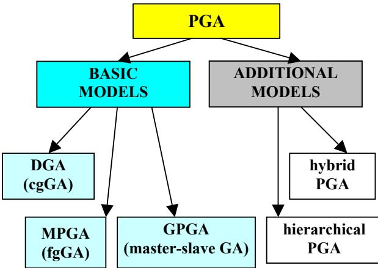
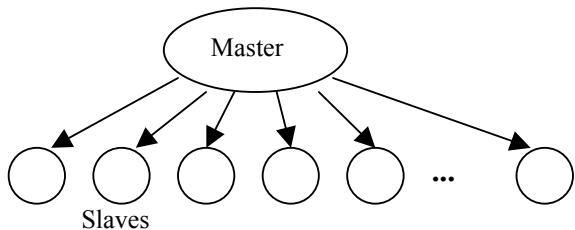
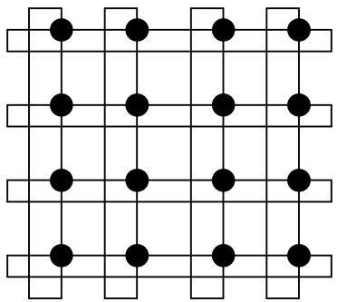
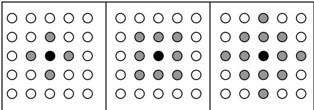
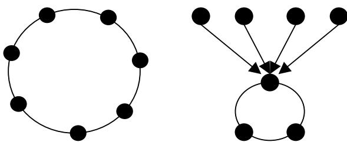
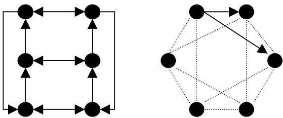
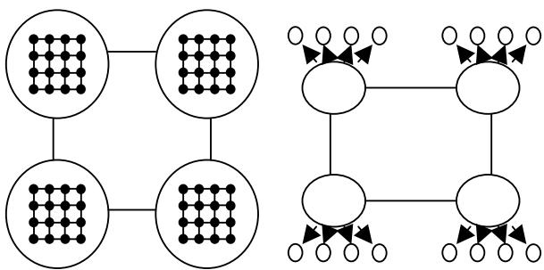
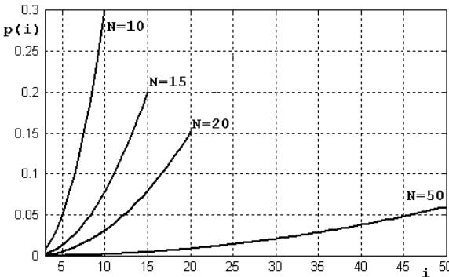
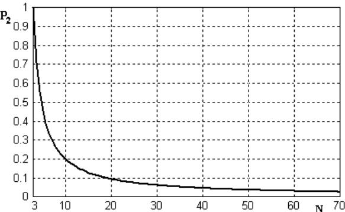
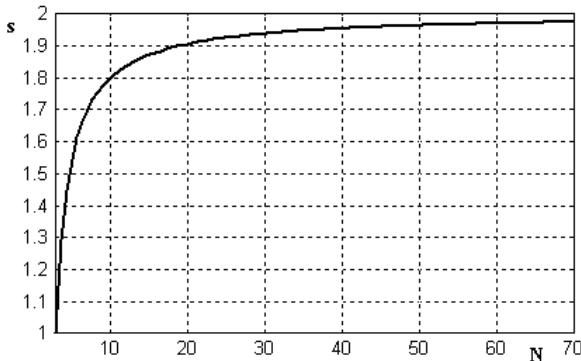

# An Asynchronous Model of Global Parallel Genetic Algorithms

Marin Golub, Leo Budin Faculty of Electrical Engineering and Computing Unska 3, HR-10000 Zagreb, Croatia phone: $+ 3 8 5 \ 1 \ 6 1 \ 2 9 \ 9 3 5$ , fax: $+ 3 8 5$ 1 61 29 653 e-mail: {marin.golub, leo.budin} $@$ fer.hr contact author: Marin Golub, e-mail: marin.golub $@$ fer.hr, fax: +385.1.61 29 653

Keywords: parallel genetic algorithm, multithreading, speed-up, tournament selection

# Abstract

Genetic algorithms usually require more computation power than other heuristic approaches do. In this paper we introduce an efficient implementation of asynchronously global parallel genetic algorithm with 3-tournament elimination selection. The parallelization of the algorithm is achieved through multithreading mechanism, a very effective and easy to implement technique. With parallelization we can get a significant decrease in computational time on a multiprocessor system. Reducing interprocess communication is a key to getting high performance in parallel computing. That is the reason why the asynchronous model is used.

Described model of global PGA is suitable for implementation on a shared memory multiprocessor.

# 1. Introduction

Genetic algorithm (GA) is a representative of a class of methods based on heuristic random search techniques [MIC92]. It was proposed by John H. Holland in the early seventies and has found application in a number of practical problems since. Genetic algorithm is a powerful optimization algorithm in a wide spectrum of applications [MUN93] and it requires a considerable amount of computational time. The basic motivation of GA parallelization is the reduction of the processing time needed to reach an acceptable solution [CAN95].

In this work, the multithreading technique is recognized as an efficient tool for transforming the genetic algorithm into parallel form. Multiple threads are relatively simple to implement and they require less preparation and handling than processes.

The parallel algorithm discussed in this paper has been designed for a shared memory multiprocessor. Several parallel threads work over one common population. From a parallel processing point of view, reducing unnecessary communication among processors is essential to avoid performance degradation [MUN93].

That is why the asynchronous approach has been favored. A number of threads can operate on the population at the same time, each one acting independently.

In the next section we give a short survey of parallel genetic algorithms. In Section 3 a model of global parallel genetic algorithm is presented. Section 4 describes the asynchronous 3-tournament elimination selection. Our approach to dealing with invalid iterations is described in Section 5.

# 2. A Classification of Parallel Genetic Algorithms

Genetic algorithm is a heuristic random search method based on natural evolution which requires considerable amount of CPU time. Since the optimization problem has to be solved in given computing and time constraints, parallel genetic algorithm is an attempt to speed-up the program. The basic idea behind most parallel programs is to divide a task into several subtasks and execute subtasks simultaneously using multiple processors.

Some parallelization methods use a single population, while others divide the population into several relatively isolated subpopulations [CAN98a]. Two approaches to parallel genetic algorithms have been considered so far [TAL91]: standard parallel approach and decomposition approach. In the standard parallel approach the evaluation and reproduction are done in parallel. This is one-population model, because genetic operators work over one population. The decomposition approach or population partitioning is the most natural way to parallelization. This approach consist in dividing the population into subpopulations. Each processor runs the genetic algorithm on its own subpopulation. Periodically some individuals migrate from one subpopulation to another.

Existing parallel implementations of genetic algorithm can be classified into three main types of PGAs [CAN98a, LIN97, MIC92](Figure 1):

global single-population master-slave genetic algorithms (GPGA), massively parallel genetic algorithms (MPGA), distributed genetic algorithms (DGA).

Furthermore, there are two additional models of PGAs which combine three main types of PGAs or combine PGA with some other optimization method:

• hierarchical parallel genetic algorithms (HPGA), • hybrid parallel genetic algorithms

  
Figure 1. Models of parallel genetic algorithm

Global parallel genetic algorithms or master-slave genetic algorithms consist of one population, but evaluation of fitness and/or the application of genetic operators are distributed among several processors (Figure 2).

  
Figure 2. Master-slave genetic algorithm

As in the serial genetic algorithm, selection and mating are global: each individual may compete and mate with any other. Global PGA are usually implemented as master slave programs, where the master stores the population and the slaves evaluate the fitness [CAN98a]. Usually the evaluation of the individuals is parallelized, because the fitness of an individual is independent from the rest of the population and there is no need to communicate during this phase. Communication occurs only as each slave receives its subset of individuals to evaluate and when the slaves return the fitness values.

The GPGA is synchronous if the algorithm stops and waits the fitness values for all the population before proceeding into the next generation. Synchronous GPGA has the same properties as sequential genetic algorithm, but it is faster if the algorithm spends most of the time for the evaluation process. Synchronous master-slave GAs have many advantages: they explore the search space exactly as a sequential GA, they are easy to implement and significant performance improvements are possible in many cases [CAN98b].

Massively parallel genetic algorithms are also called fine-grained genetic algorithms (fgGA). Fine-grained PGAs are suited for massively parallel computers (Figure 3) such as MasPar MP-1 [LOG92]. There are a variety of fine-grained PGAs which have been proposed and studied [LOG92, TAL91, SAR96].

  
Figure 3. A torus of 16 processors

MPGA has only one population, but interactions between individuals is limited. Selection and mating are restricted to a small neighborhood. The overlapping neighborhoods allow individuals to move around continuously and it provides an implicit mechanism for migration. A good solution can disseminate across the entire population.

  
Figure 4. Three different sizes and shapes of neighbourhood

New parameters are neighborhood size and shape. Figure 4. shows examples of different neighborhood sizes (4, 6 and 12) and three different neighborhood shapes.

Distributed genetic algorithms are the most popular parallel methods. Such algorithms assume that several subpopulations (demes) evolve in parallel and that is why this PGA is also called multiple-population or multiple-demes genetic algorithm. Demes are relatively isolated, so this algorithm is also known as island parallel genetic algorithm or coarse-grained genetic algorithm. Many papers and many authors describe such parallel implementation and probably that is the reason why it has so many different names.

  
Figure 5. A schematic of DGA with ring (left) and injection island topology (right)

  
Figure 6. Examples of two-neighbourhood topologies

The models include a concept of migration (movement of an individual string from one subpopulation to another). It uses multiple demes (populations) that occasionally exchange some individuals in a process called migration. A specification of an island GAs defines the size and number of demes, the topology of the connections between them (Figure 5, Figure 6), the migration rate (the fraction of the population that migrates), the frequency of migrations and the policy to select emigrants and to replace existing individuals with incoming migrants. All these seven new parameters have a great influence on the quality of the search and on the efficiency of the algorithm [CAN99b]. Because they are controlled by many parameters, the multiplepopulation PGAs are the hardest to use.

Hierarchical parallel genetic algorithms combine two of three basic models of PGA. When two methods of parallelizing genetic algorithms are combined they form a hierarchy. This class of algorithms is called hierarchical because at higher level there are multipledeme algorithms with master-slave or fine grained at the lower level (Figure 7). Also, at both levels there can be multiple-deme genetic algorithms [CAN98a].

Hierarchical implementations can reduce the execution time more than any of their components alone [CAN98a]. The speed-up of a hierarchical parallel genetic algorithm is product of speed-up of a PGA at higher and speed-up of a PGA at lower level.

  
Figure 7. Examples of hierarchical PGAs which combine multiple demes with fine-grained (left) and multiple demes with master-slave (right) GAs

Hybrid parallel genetic algorithms combine PGA with some classical optimization method, for example local hill-climbing [MUE91, MUE92].

# 3. A Model of Global Parallel Genetic Algorithm

The question that we want to answer in this section is: which one of three basic models is the most suitable for implementation on a shared memory multiprocessor system with few processors? Obviously the massively PGA is not suitable, because it needs massively parallel computers with a number of processors (several hundreds or even thousands). Two demes (if we have a two processor system) is too small number of subpopulations for the distributed genetic algorithm. Even if we have more than two processors, there is still too many new parameters that we must set: migration rate, frequency of migrations, the policy of migrants selection and the topology.

In contrast of other models of PGA the operation of global parallel genetic algorithm (master-slave genetic algorithm) is identical to a serial GA, and therefore any available knowledge about serial GAs can be applied directly to global PGA [CAN99a]. In the traditional master-slave model, the master processor stores the entire population and applies genetic operators to produce the next generation. The slave processors are used to evaluate the fitness of a fraction of the population in parallel.

The parallel genetic algorithm can be implemented using several threads. For every algorithm that we want to execute in multiple threads, first we have to identify independent parts and assign to each a thread.

Master thread{ initialize population; evaluate population; for( $\dot { 1 } = 1$ ;i<NUMBER_OF_PROCESSORS; $\dot { \beth } + +$ ){ create new Slave thread; }   
}   
Slave thread{ while(termination criterion is not reached){ select three individuals; eliminate the worst individual of three selected; child $\equiv$ crossover(survived individuals); replace deleted individual with child; perform mutation with probability ${ \tt p } _ { \mathrm { m } }$ ; evaluate new individual; }   
}

In our implementation of master-slave GA, the master creates random initial population, evaluates created individuals and starts the slaves (Figure 8). Each slave performs whole evolution process in contrast of the traditional master-slave GA where the slaves only evaluate the fitness. This is a model of global GA, because each individual may compete and mate with any other.

The tournament selection is suitable for parallel execution [CAN99a, CAN99b, YOS99]. The 3- tournament bad individual selection in each step of the evolution chooses with equal probability three individuals from the mating pool. Then, it eliminates the weakest one of those three individuals. The survived two individuals are parents of a child which will replace the eliminated one. The mutation is performed over child with probability $p _ { m }$ . New individual is evaluated before proceeding into the next iteration. The number of iterations is equal to the number of evaluations.

This model of global PGA, if it is synchronous, has exactly the same properties as the same sequential GA, with speed being the only difference. The traditional synchronous GPGA has generational selection and the algorithm stops and waits the fitness values for all the population before proceeding into the next generation [CAN98a]. In our case, the algorithm has elimination selection and two or more threads in each iteration should not eliminate the same individual. So, the elimination of individuals can be synchronized. Unfortunately, unlike we expected, such synchronous GPGA is not faster; it is slower than sequential GA, because it spends more time for synchronization than for performing genetic operators [BUD98]. As the goal of parallelization is speeding up the algorithm, the synchronization must be avoided if possible.

The asynchronous GPGA with elimination selection (Figure 8) does not have the same properties as sequential GA. Moreover, expected speed-up factor is equal to the number of processors. The worst thing that could happen when we implement asynchronous GPGA is that two or more threads select the same individual for elimination. The work of only one of them will take effect, while other threads will work in vain. The total number of iterations is smaller than given number of iterations, because some threads spend some iterations in vain. That is the reason why the algorithm does not give so good solution as the same sequential GA in given number of iterations. But if we know the probability of multiple elimination of the same individual by several threads at the same time, we can calculate the expected number of iterations when threads will perform genetic operators in vain. The asynchronous GPGA will have the same properties as sequential GA, with speed-up being the only difference, if the total number of iterations is increased.

# 4. The 3-Tournament Selection

Let the population consist of $N$ individuals. The elitism is inherently implemented, because the best individual and the second best individual can not be eliminated if the 3-tournament elimination selection is used. Let the individuals be indexed by their fitness value, i.e. the best one has the index $i { = } 1$ and the worst one $i { = } N .$ The probability $p ( i )$ (Figure 9) of selection for elimination of the $i$ -th individual, where $i { = } 3 , 4 , . . . , N ,$ with 3- tournament bad individual selection is given by:

$$
p ( i ) = { \frac { { \binom { i } { 3 } } - { \binom { i - 1 } { 3 } } } { \binom { N } { 3 } } } .
$$

  
Figure 9. Probability of elimination of the i-th individual for four sizes of population $\scriptstyle ( N = I 0 , I 5 , 2 0 , 5 0 )$

Let us assume that the described algorithm is executed on a two processor computer. The probability of double selection of the $i \cdot$ -th individual (both thread select the $i \cdot$ - th individual) in each iteration is equal to $p ( i ) ^ { 2 }$ . The probability $P _ { 2 }$ of double selection of any individual on the two processor system with two threads is the sum of probabilities of double selection of each individual:

$$
P _ { 2 } \left( N \right) { = } \sum _ { i = 3 } ^ { N } p ( i ) ^ { 2 } \ .
$$

Inserting Equation 1 into Equation 2 gives

$$
P _ { 2 } \left( N \right) = \sum _ { i = 3 } ^ { N } \left[ \frac { \binom { i } { 3 } - \binom { i - 1 } { 3 } } { \binom { N } { 3 } } \right] ^ { 2 } = \sum _ { i = 3 } ^ { N } \left[ \frac { 3 ( i - 1 ) ( i - 2 ) } { N ( N - 1 ) ( N - 2 ) } \right] ^ { 2 } .
$$

Finally, the probability that one thread of two will work in vain in each iteration is the function of the population size (Figure $I 0$ ) and it is given by

$$
P _ { 2 } \left( N \right) = \frac { 9 N ^ { 4 } - 4 5 N ^ { 3 } + 7 5 N ^ { 2 } - 4 5 N + 6 } { 5 N { ( N - 1 ) } ^ { 2 } { ( N - 2 ) } ^ { 2 } } .
$$

  
Figure 10. The probability of double selection of the same individual is a function of the population size $N$

If we have a two processor system we should expect finding the solution two times faster than on the one processor system. The speed-up factor of described asynchronous GPGA is not equal to the number of processors, because the number of iterations must be increased.

# 5. The Number of Iterations

For two processor system the probability of double elimination the same individual $P _ { 2 } ( N )$ is given by Equation (4). That means that one of two threads will work in vain with probability $P _ { 2 } ( N )$ . Let us assume that the total number of iterations $I _ { T }$ is fairly distributed among the threads: each of two threads perform $I _ { T } / 2$ iterations. Expected number of useless iterations $I _ { U }$ is given by

$$
I _ { U } = \frac { I _ { T } } { 2 } \cdot P _ { 2 } \left( N \right) .
$$

The number of iterations $I$ of sequential GA must be equal to the total number of iterations $I _ { T }$ minus useless iterations $I _ { U }$ :

$$
I = I _ { T } - \frac { I _ { T } } { 2 } \cdot P _ { 2 } \left( N \right) .
$$

The total number of iterations $I _ { T }$ is given by:

$$
I _ { T } = \frac { I } { \displaystyle 1 { - } \frac { P _ { 2 } ( N ) } { 2 } } .
$$

The consequence is that described asynchronous GPGA on a two processor system is not exactly two times faster, but two minus $P _ { 2 } ( N )$ times faster then the serial GA (Figure $I I$ ).

  
Figure 11. Speed-up of asynchronous GPGA on a two processor system

For example, let the population consists of 50 individuals and the number of iterations is 100000. The probability that both thread will select the same individual for elimination $P _ { 2 } ( 5 0 )$ is 0.0367 (Equation 4). The expected number of useless iterations $I _ { U }$ (Equation 5) is 1835. In that case, if we want to achieve the same solution with our GPGA as with sequential, the number of iterations must be 101870 (Equation 7). Each one of two thread will perform 50935 (half of 101870) iterations. The speed up is not 2, because each one of two threads will not perform 50000, but 50935 iterations. Finally, the speed-up is $s { = } 1 0 0 0 0 0 / 5 0 9 3 5 { = } 1 . 9 6 3$ .

The execution time does not depend on the population size $N ,$ if the total number of iterations is fixed. It depends on the total number of iterations $I _ { T }$ . If we want to achieve the same results as sequential GA, the total number of iterations must be increased (Equation 7). The consequence is that speed-up depends on the population size (Figure $I I$ ).

# 6. Concluding Remarks

The presented model of global parallel genetic algorithm is suitable for implementation on a shared memory computer with several processors. The difference between traditional GPGA (master-slave GA) and the described GPGA is in tasks which master and slaves perform. In the traditional GPGA slaves only evaluate individuals, while the master distributes individuals among slaves for evaluation and the master performs all genetic operators. The assumption is that the evaluation takes most of the time in the evolution process. In our case, the master only initializes the population, while slaves perform the whole evolution process including evaluation. The parts obtained by dividing the genetic algorithm are independent. The critical sections are avoided, because the synchronization mechanisms would significantly slow down the parallel program.

Advantages of our approach are: the algorithm is simple for implementation, the elitism is inherently implemented, all genetic operators and evaluation is parallelized, there is no need for any communication mechanism (the whole population is placed into shared memory), it works without any synchronization, the execution time for a given number of iterations does not depend on the population size $N$ for a constant number of iterations and speed-up factor is near the number of processors. Moreover, the algorithm can be executed by any given number of processors without any code adaptation. Disadvantages are: the number of iterations must be increased because some threads may perform invalid iterations and it is not suitable for any fitnessproportional selection [CAN99a]. Nevertheless, the number of invalid iterations is a function of the population size and it can be predicted and calculated as it was shown in this paper on an example for a two threaded GPGA.

# Acknowledgement

This work was carried out within the project 036-014 Problem-Solving Environments in Engineering, funded by Ministry of Science and Technology of the Republic of Croatia.

# Список литературы

[BUD98] Budin, L., Golub, M., Jakobović, D., Parallel Adaptive Genetic Algorithm, International ICSC/IFAC Symposium on Neural Computation NC’98, Vienna, 1998, pp. 157-163.   
[CAN95] Cantú-Paz E., A Summary of Research on Parallel Genetic Algorithms, 1995., available from: www.dai.ed.ac.uk/groups/evalg/Local_Copies_of_P apers/Cantu-Paz.A_Summary_of_Research_on_ Parallel_Genetic_Algorithms.ps.gz   
[CAN98a] Cantú-Paz, E., A Survey of Parallel Genetic Algorithms, Calculateurs Paralleles, Vol. 10, No. 2. Paris: Hermes, 1998., available via ftp from: ftp://ftp-illigal.ge.uiuc.edu/pub/papers/Publications/ cantupaz/survey.ps.Z.   
[CAN98b] Cantú-Paz, E., Designing Efficient Masterslave Parallel Genetic Algorithms, Genetic Programming: Proceedings of the Third Annual Conference. (pp. 455). San Francisco, CA, 1998.   
[CAN99a] Cantú-Paz, E., Goldberg, D.E., Parallel Genetic Algorithms with Distributed Panmictic Populations, 1999. available from: http://wwwilligal.ge.uiuc.edu/cgi-bin/orderform/orderform.cgi.   
[CAN99b] Cantú-Paz, E., Migration Policies, Selection Pressure, and Parallel Evolutionary Algorithms, 1999., available via ftp from: ftp://ftpilligal.ge.uiuc.edu/pub/papers/IlliGALs/99015.ps.Z.   
[GOO97] Goodman, E.D., Averill, R.C., Punch, W.F., Eby, D.J., Parallel Genetic Algorithms in the Optimization of Composite Structures, Second World Conference on Soft Computing (WSC2), June, 1997., available from: http://garage.cps.msu. edu/papers/GARAGe97-05-02.ps   
[LIN97] Lin, S.C., Goodman, E.D., Punch, W.F., Investigating Parallel Genetic Algorithms on Job Shop Scheduling Problems, Evolutionar Programming VI, Proc. Sixth Internat. Conf., EP97, Springer Verlag, NY, P. J. Angeline, et al., eds., Indianapolis, 383-394, June, 1997.   
[LOG92] Logar, A.M., Corwin, E.M., English, T.M., Implementation of massively parallel genetic algorithms on the MasPar MP-1, Applied computing (vol. II) technological challenges of the 1990's, page 1015, 1992.   
[MIC92] Michalewicz, Z. (1992), Genetic Algorithms $^ +$ Data Structures $=$ Evolutionary Programs, Springer-Verlag, Berlin.   
[MUE91] Muehlenbein, H., Evolution in Time and Space - The Parallel Genetic Algorithm, Foundations of Genetic Algorithms, G. Rawlins (ed.), pp. 316-337, Morgan-Kaufman, 1991., available via ftp from: ftp://borneo.gmd.de/pub/as/ ga/gmd_as_ga-91_01.ps   
[MUE92] Muehlenbein, H., Parallel Genetic Algorithms in Combinatorial Optimization, Computer Science and Operations Research O. Balci, R. Sharda and S. Zenios (eds.), pp. 441-456, Pergamon Press, New York 1992., available via ftp from: ftp://borneo.gmd.de/pub/as/ga/gmd_as_ga92_01.ps   
[MUN93] Munetomo, M., Takai, Y., Sato, Y., An Efficient Migration Scheme for SubpopulationBased Asynchronously PGA, Hokkaido University Information Engineering Technical Report HIERIS-9301, Sapporo, July, 1993.   
[SAR96] Sarma, J., De Jong, K., An Analysis of the Effects of Neighborhood Size and Shape on Local Selection Algorithms, Proceedings of the Fourth International Conference on Parallel Problem Solving from Nature (PPSN96), Sept. 22-26, Berlin, Germany, 1996.   
[TAL91] E.-G. Talbi ,P. Bessière, A parallel genetic algorithm for the graph partitioning problem, Supercomputing, 312 – 320, 1991.   
[YOS99] Yoshida, N., Yasuoka, T., Moriki, T., Parallel and Distributed Processing in VLSI Implementation of Genetic Algorithms, Proceedings of the Third International ICSC Symposia on Intelligent Industrial Autimation, IIA’99 and Soft Computnig, SOCO’99, June 1-4, Genova, Italy, pp. 450-454, 1999.