# SOLUTION OF A LARGE-SCALE TRAVELING-SALESMAN PROBLEM\*

G DANTZIG, R FULKERSON, AND S JOHNSON The Rand Corporation, Santa Monica, Calfornia (Received August 9, 1954)

It is shown that a certain tour of 49 cities, one in each of the 48 states and Washington, D C , has the shortest road distance

THE TRAVELING-SALESMAN PROBLEM might be described as follows: Find the shortest route (tour) for a salesman starting from a given city, visiting each of a specified group of cities, and then returning to the original point of departure. More generally, given an $\mathscr { n }$ by $\boldsymbol { n }$ symmetric matrix $D = \left( d _ { I J } \right)$ , where $d _ { I J }$ represents the 'distance' from $I$ to $J$ , arrange the points in a cyclic order in such a way that the sum of the $d _ { I J }$ between consecutive points is minimal. Since there are only a finite number of possibilities (at most $\beta _ { 2 } ^ { \prime } \ ( n { - } 1 ) ! )$ to consider, the problem is to devise a method of picking out the optimal arrangement which is reasonably efficient for fairly large values of $\mathscr { n }$ . Although algorithms have been devised for problems of similar nature, e.g., the optimal assignment problem,little is known about the traveling-salesman problem. We do not claim that this note alters the situation very much; what we shall do is outline a way of approaching the problem that sometimes, at least, enables one to find an optimal path and prove it so. In particular, it will be shown that a certain arrangement of 49 cities, one in each of the 48 states and Washington, D. C., is best, the $d _ { I J }$ used representing road distances as taken from an atlas.

\* HisToricAL NoTe: The origin of this problem is somewhat obscure. It appears to have been discussed informally among mathematicians at mathematics meetings for many years. Surprisingly httle in the way of results has appeared in the mathematical literature.0 It may be that the minimal-distance tour problem was stimulated by the so-called Hamiltonian game' which is concerned with finding the number of different tours possible over a specified network The latter problem is cited by some as the origin of group theory and has some connections with the famous Four-Color Conjecture ® Merrill Flood (Columbia University) should be credited with stimulating interest in the traveling-salesman problem in many quarters. As early as 1937, he tried to obtain near optimal solutions in reference to routing of school buses. Both Flood and A W. Tucker (Princeton University) recall that they heard about the problem first in a seminar talk by Hassler Whitney at Princeton in 1934 (although Whitney, recently queried, does not seem to recall the problem) The relations between the traveling-salesman problem and the transportation problem of linear programming appear to have been first explored by M. Flood, J. Robinson, T. C. Koopmans, M. Beckmann, and later by I. Heller and H. Kuhn.45.6

In order to try the method on a large problem, the following set of 49 cities, one in each state and the District of Columbia, was selected:

1. Manchester, N H.   
2. Montpelier, Vt.   
3. Detroit, Mich.   
4. Cleveland, Ohio   
5 Charleston, W Va   
6. Louisville, Ky.   
7. Indianapolis, Ind.   
8. Chicago, III   
9. Milwaukee, Wis   
10 Minneapolis, Minn.   
11. Pierre, S. D.   
12. Bismarck, N. D.   
13 Helena, Mont.   
14 Seattle, Wash.   
15. Portland, Ore.   
16. Boise, Idaho   
17. Salt Lake City, Utal   
18 Carson City, Nev.   
19 Los Angeles, Calif.   
20 Phoenix, Ariz   
21. Santa Fe, N M.   
22 Denver, Colo.   
23. Cheyenne, Wyo.   
24 Omaha, Neb   
25. Des Moines, Iowa   
26. Kansas City, Mo.   
27. Topeka, Kans.   
28 Oklahoma City, Okla   
29. Dallas, Tex.   
30. Little Rock, Ark.   
31. Memphis, Tenn.   
32 Jackson, Miss.   
33 New Orleans, La.

34 Birmingham, Ala. 35. Atlanta, Ga 36. Jacksonville, Fla. 37. Columbia, S C. 38 Raleigh, N C. 39. Richmond, Va 40. Washington, D. C. 41. Boston, Mass 42. Portland, Me. A. Baltimore, Md. B Wilmington, Del. C Philadelphia, Penn. D. Newark, N. J E New York, N. Y F Hartford, Conn. G. Providence, R. I.

The reason for picking this particular set was that most of the road distances between them were easy to get from an atlas. The triangular table of distances between these cities (Table I) is part of the original one prepared by Bernice Brown of The Rand Corporation. It gives $d _ { I J } =$ $\mathcal { Y } _ { 1 7 } ( d _ { t J } ^ { ' } - 1 1 ) , ^ { * } ( I , J = 1 , 2 , \cdot \cdot \cdot , 4 2 )$ , where $d _ { I J } ^ { ' }$ is the road distance in miles between $I$ and $J$ . The $d _ { I J }$ have been rounded to the nearest integer. Certainly such a linear transformation does not alter the ordering of the tour lengths, although, of course, rounding could cause a tour that was not optimal in terms of the original mileage to become optimal in terms of the adjusted units used in this paper.

We will show that the tour (see Fig. 16) through the cities 1, 2, · . ., 42 in this order is minimal for this subset of 42 cities. Moreover, since in driving from city 40 (Washington, D. C.) to city 41 (Boston, Massachusetts) by the shortest road distance one goes through A, B, · . ., G, successively, it follows that the tour through 49 cities 1, 2, · · ., 40, A, B, · · ., G, 41, 42 in that order is also optimal.

# PRELIMINARY NOTIONS

Whenever the road from $I$ to $J$ (in that order) is traveled, the value $x _ { I J } ^ { ' } = 1$ is entered into the $^ { I , J }$ element of a matrix; otherwise $\stackrel { \prime } { x } _ { I J } ^ { \prime } = 0$ is entered. A (directed) tour through $\pmb { n }$ cities can now be thought of as a permutation matrix of order $\pmb { n }$ which represents an $\pmb { n }$ -cycle (we assume $n > 2$ throughout). For example, for $\scriptstyle n = 5$ , the first matrix displayed below

<table><tr><td>800 8</td><td>J</td><td>20 20</td><td>8 </td><td>SRUPEE</td><td>88008PF</td><td> </td><td>11</td><td>LOI</td><td>88 888</td><td>89068B68</td><td>8A90NB00B8</td><td>8 N   ∞</td><td></td><td>388 I</td><td> </td><td></td><td></td><td></td><td>888885</td><td></td><td></td><td></td><td></td><td></td><td></td><td></td></tr></table>

$$
\| x _ { I J } ^ { ' } \| = \left| \begin{array} { c c c c c c } { 0 } & { 1 } & { 0 } & { 0 } & { 0 } \\ { 0 } & { 0 } & { 0 } & { 1 } & { 0 } \\ { 0 } & { 0 } & { 0 } & { 0 } & { 1 } \\ { 0 } & { 0 } & { 1 } & { 0 } & { 0 } \\ { 1 } & { 0 } & { 0 } & { 0 } & { 0 } \end{array} \right| , \qquad \| x _ { I J } ^ { ' } \| = \left| \begin{array} { c c c c c c } { 0 } & { 1 } & { 0 } & { 0 } & { 0 } \\ { 1 } & { 0 } & { 0 } & { 0 } & { 0 } \\ { 0 } & { 0 } & { 0 } & { 0 } & { 1 } \\ { 0 } & { 0 } & { 1 } & { 0 } & { 0 } \\ { 0 } & { 0 } & { 0 } & { 1 } & { 0 } \end{array} \right| .
$$

is a tour since it represents visiting the cities in the 5-cycle $( 1 \ 2 \ 4 \ 3 \ 5 )$ , while the other matrix is not a tour since it represents visiting the cities by means of two sub-cycles (1 2) and (3 5 4 ).

It is clear that all representations for directed tours satisfy the relations

$$
\sum _ { I } \ : x _ { I J } ^ { ^ { \prime } } = \sum _ { J } \ : x _ { I J } ^ { ^ { \prime } } = 1 , \qquad x _ { I I } ^ { ^ { \prime } } = 0 , \qquad x _ { I J } ^ { ^ { \prime } } \geq 0 .
$$

The matrix may be made into a triangular array by reflecting the numbers above the diagonal in the diagonal. The sum of corresponding elements is denoted by $\overline { { x _ { I J } } } = \overline { { x _ { I J } ^ { ' } } } + \overline { { x _ { J I } ^ { ' } } }$ . Then the matrices above become

$$
\| x _ { I J } \| = \left\| \begin{array} { l l l l l } { \cdot } & & & & \\ { \mathbf { 1 } } & { \cdot } & & & \\ { 0 } & { 0 } & { \cdot } & & \\ { 0 } & { \mathbf { 1 } } & { \mathbf { 1 } } & & \\ { \mathbf { 1 } } & { 0 } & { \mathbf { 1 } } & { 0 } & { \cdot } \end{array} \right\| , \qquad \| x _ { I J } \| = \left\| \begin{array} { l l l l l } { \cdot } & & & & \\ { 2 } & { \cdot } & & \\ { 0 } & { 0 } & { \cdot } & \\ { 0 } & { 0 } & { \mathbf { 1 } } & { \cdot } \\ { 0 } & { 0 } & { \mathbf { 1 } } & { \mathbf { 1 } } & { \cdot } \end{array} \right\| .
$$

Consequently, the sum along the Kth row plus the sum along the Kth column must now be 2. This may be written

$$
\sum _ { J < I = K } \ x _ { I J } + \sum _ { I > J = K } \ x _ { I J } = 2 , \qquad \left( K = 1 , \cdot \cdot \cdot , n ; \ x _ { I J } \geq 0 \right)
$$

This device yields a representation for undirected tours and is the one used throughout this paper. It will be noted that the second array above does not represent a tour but nevertheless satisfies the relation (1).

For undirected tours, the symbol $\boldsymbol { x } _ { t J }$ will be treated identically with $x _ { J I }$ so that we may rewrite (1) as

$$
\sum _ { J = 1 } ^ { n } x _ { I J } = 2 . \qquad ( x _ { I J } \ge 0 ; I = 1 , 2 , \cdot \cdot \cdot , n ; I \varkappa J ; x _ { I J } \equiv x _ { J I } )
$$

The problem is to find the minimum of the linear form

$$
D ( x ) = \sum _ { I > J } d _ { I J } x _ { I J } ,
$$

where the $\boldsymbol { x } _ { I J } = 0$ or 1 and the $\scriptstyle x _ { I J } = 1$ form a tour, and where the summation in (3) extends over all indices $( I , J )$ such that $I { > } J$ .

To make a linear programming problem out of this (see ref. 2) one needs, as we have observed, a way to describe tours by more linear restraints than that given by (2). This is extremely difficult to do as illustrated by work of I. Heller and H. Kuhn.6 They point out that such relations always exist. However, there seems to be no simple way to characterize them and for moderate size $\pmb { n }$ the number of such restraints appears to be astronomical. In spite of these difficulties, this paper will describe the techniques we have developed which have been successful in solving all the problems we have tried by this approach. A surprising empirical observation is the use of only a trivial number of the many possible restraints to solve any particular problem. To demonstrate the procedure, we shall attempt to use direct elementary proofs even though they were originally motivated in many places by linear programming procedures.

There are possibly four devices we have used which have greatly reduced the effort in obtaining solutions of the problems we have attempted.

First of all, we use undirected tours. This seems to simplify the characterization of the tours when $\mathscr { n }$ is small and certainly cuts down the amount of computation, even for large $\boldsymbol { n }$ Secondly, and this is decisive, we do not try to characterize the tours by the complete set of linear restraints, but rather impose, in addition to (2), just enough linear conditions on the $x _ { I J }$ to assure that the minimum of the linear form (3) is assumed by some tour. For the 49-city problem and also for all the smaller problems we have considered, such a procedure has been relatively easy to carry through by hand computation. This may be due in part to the fact that we use a simple symbolism which permits direct representation of the algebraic relationships and manipulations on a map of the cities. This third device speeds up the entire iterative process, makes it easy to follow, and sometimes suggests new linear restraints that are not likely to be obtained by less visual methods. Finally, once a tour has been obtained which is nearly optimal, a combinatorial approach, using the map and listing possible tours which have not yet been eliminated by the conditions imposed on the problem, may be advantageous. This list can be very much shorter than one would expect, due to the complex interlocking of the restraints. However, except for short discussion in the section below, "An Estimation Procedure," this method will not be described in detail although it has worked out well for all examples we have studied.

An important class of conditions that tours satisfy, which excludes many non-tour cases satisfying (2), are the 'loop conditions ' These are linear inequality restraints that exclude subcycles or loops. Consider a non-tour solution to (2) which has a subtour of $n _ { 1 } < n$ cities; we note that the sum of the $x _ { I J }$ for those links $^ { ( I , J ) }$ in the subtour is $\pmb { n _ { 1 } }$ Hence we can eliminate this type of solution by imposing the condition that the sum of ${ \pmb x } _ { I J }$ over all links $( I , J )$ connecting cities in the subset $s$ of $\pmb { n } _ { 1 }$ cities be less than ${ \boldsymbol { n } } _ { 1 } ,$ i.e.,

$$
\sum _ { s } x _ { I J } \leq n _ { 1 } - 1
$$

where the summation extends over all $^ { ( I , J ) }$ with $\boldsymbol { I }$ and $\pmb { J }$ in the $\pmb { n } _ { 1 }$ cities $\boldsymbol { s }$ . From (2) we note that two other conditions, each equivalent to (4), are

$$
\sum _ { \bar { s } } x _ { I J } \leq n - n _ { 1 } - 1 ,
$$

where $\bar { \bar { S } }$ means the summation extends over all $^ { ( I , J ) }$ such that neither $I$ nor $J$ is in $\boldsymbol { s }$ , and

$$
\sum _ { s s } x _ { I J } \ge 2 ,
$$

where $\mathit { s } \bar { s }$ means that the summation extends over all $^ { ( I , J ) }$ such that $I$ is in $\boldsymbol { s }$ and $J$ not in $s$ .

There are, however, other more complicated types of restraints which sometimes must be added to (2) in addition to an assortment of loop conditions in order to exclude solutions involving fractional weights ${ x } _ { I J }$ . In the 49-city case we needed two such conditions. However, later when we tried the combinatorial approach, after imposing a few of the loop conditions, we found we could handle the 49-city problem without the use of the special restraints and this would have led to a shorter proof of optimality. In fact, we have yet to find an example which could not be handled by using only loop conditions and combinatorial arguments.

# THE METHOD

The technique will be illustrated by a series of simple examples.

# Example 1

First consider a five-city map forming a regular pentagon of unit length per side and with length $\stackrel { \cdot } { \mathrm { ~ \mathscr ~ { ~ 2 ~ } ~ } } ( \sqrt { 5 } + 1 ) \doteq 1 . 7$ on a diagonal (Fig. 1). Suppose that the problem is to minimize (3) subject only to (2) Start with a tour which is conjectured to be optimal, obviously (1 2345). In this case the values of $x _ { I J }$ , denoted by $\scriptstyle { \overline { { x } } } _ { I J }$ ,are $\bar { x } _ { 1 2 } = \bar { x } _ { 2 3 } = \bar { x } _ { 3 4 } = \bar { x } _ { 4 5 } = \bar { x } _ { 5 1 } = 1$ and all other $\bar { \boldsymbol { x } } _ { I J } = 0$ The variables $x _ { I J }$ corresponding to links on the tour are called 'basic variables.' The length of the tour given by the linear form3for $x = \bar { x }$ is $D ( \bar { x } ) = 5$ There are five equations in (2). Multiply each by a parameter $\pmb { \pi } _ { I }$ to be determined, and then subtract the sum from (3). Thus, we are led to

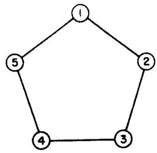  
FIGURE 1

$$
\begin{array} { l } { { \displaystyle { \cal D } ( x ) = \sum _ { I > J } d _ { I J } x _ { I J } - \sum _ { I = 1 } ^ { n } \pi _ { I } \left( \sum _ { J = 1 } ^ { n } x _ { I J } - 2 \right) \qquad \left( x _ { I J } \equiv x _ { J I } ; \ I \ne J \right) } } \\ { { \mathrm { } } } \\ { { \mathrm { } = - \sum _ { I > J } \left( \pi _ { I } + \pi _ { J } - d _ { I J } \right) x _ { I J } + 2 \sum _ { 1 } ^ { n } \pi _ { I } . } } \end{array}
$$

Denote the coefficients of $x _ { I J }$ by $\delta _ { I J }$ so that

$$
{ \cal D } ( x ) = - \sum _ { I > J } \widehat { \delta } _ { I J } x _ { I J } + 2 \sum _ { 1 } ^ { n } \pi _ { I } . \qquad \quad ( \widehat { \delta } _ { I J } = \pi _ { I } + \pi _ { J } - \mathop { d _ { I J } } )
$$

Now determine the five $\pmb { \pi } _ { I }$ values so that $\delta _ { I J }$ corresponding to basic variables vanish:

$$
\delta _ { I J } = 0 ,
$$

$$
( \mathrm { f o r } \ \tilde { x } _ { I J } = 1 )
$$

l e., if the link $( I , J )$ is on the tour in question. Note that to solve for the $\pi _ { I }$ we have five linear equations in five unknowns.

If now we set $x _ { I J } = \bar { x } _ { I J }$ in (7), then $\bar { x } _ { I J } \delta _ { I J } = 0$ for all $^ { ( I , J ) }$ and

$$
D ( \bar { x } ) = 2 \sum _ { 1 } ^ { n } \pi _ { I } = \bar { \mathcal { S } } .
$$

Subtracting (9) from (7) we have finally

$$
D ( x ) - D ( \bar { x } ) = - \sum _ { I > J } \delta _ { I J } x _ { I J } .
$$

For the regular pentagon $\pi _ { I } = \%$ for $I = 1 , 2 , 3 , 4 , 5$ solves (8), and so $\delta _ { I J } = \mathcal { Y } _ { 2 } ( 1 - \sqrt { 5 } ) < 0$ on a diagonal, i.e., $\delta _ { I J } \leq 0$ for every $( I , J )$ . Thus, the right side of (10) is always nonnegative or $D ( x ) { \geq } D ( { \bar { x } } )$ for all $x$ satisfying (2), and in particular all other tours are longer than the tour represented by $\bar { x }$ .

# Example $\mathcal { Z }$

Next, take another five-city problem whose map is not a regular pentagon (Fig. 2). We start with the tour (1 2 3 4 5) of length $D ( \bar { x } ) = 3 2$ where the basic variables take on the values $\bar { x } _ { 1 2 } = \bar { x } _ { 2 3 } = \bar { x } _ { 3 4 } = \bar { x } _ { 4 5 } = \bar { x } _ { 5 1 } = 1$ and all other $\bar { \pmb { x } } _ { I J } = \mathbf { 0 }$ Repeat the steps in the previous problem leading to (10)

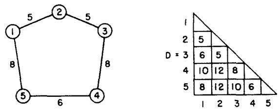  
FIGURE 2

where, as before, calculate the $\pmb { \pi } _ { I }$ by setting $\delta _ { I J } = 0$ for $\delta _ { I J }$ corresponding to basic variables $x _ { I J }$ . The five equations that the $\pmb { \pi } _ { I }$ must satisfy are

$$
\begin{array} { r } { \pi _ { 1 } + \pi _ { 2 } = 5 , \qquad \pi _ { 2 } + \pi _ { 3 } = 5 , \qquad \pi _ { 3 } + \pi _ { 4 } = 8 , \qquad \pi _ { 4 } + \pi _ { 5 } = 6 , \qquad \pi _ { 5 } + \pi _ { 1 } = 8 } \end{array}
$$

By alternately subtracting and adding these equations one obtains.

$$
\begin{array} { r l r } & { } & { 2 \pi _ { 1 } = d _ { 1 2 } - d _ { 2 3 } + d _ { 3 4 } - d _ { 4 5 } + d _ { 5 1 } = 5 - 5 + 8 - 6 + 8 = 1 0 , } \\ & { } & \\ & { } & { \pi _ { 1 } = 5 , \qquad \pi _ { 2 } = 0 , \qquad \pi _ { 3 } = 5 , \qquad \pi _ { 4 } = 3 , \qquad \pi _ { 5 } = 3 . } \end{array}
$$

or

The factors $\pmb { \pi } _ { I }$ which multiply equations (2) to form (10) are called 'potentials.\* There is one such potential associated with each city $I$ , and these are readily computed by working directly on the map of the cities (see Fig. 3).

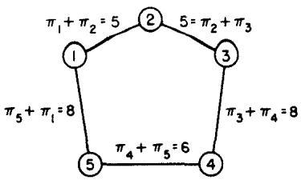  
FIGURE 3

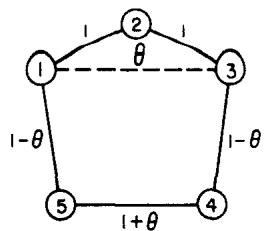  
FIGURE 4

To form other $\delta _ { I J }$ , add the $\pmb { \pi } _ { I }$ and $\pmb { \pi } _ { J }$ of city $\boldsymbol { \mathit { I } }$ and city $J$ and subtract off the distance $d _ { I J }$ between them. In this case we note that except for $\delta _ { 3 1 } = 5 + 5 - 6 = + 4$ , all the other $\delta _ { I J }$ are ${ \le } 0$ .

We see from (10) that if $\pmb { x } _ { 3 1 }$ were to take on a positive value, $x _ { 3 1 } = \pmb \theta$ , the other nonbasic variables remaining at zero, this may lead to a better solution. We let $\pmb \theta$ be the largest value consistent with (2). Thus, the weights $\boldsymbol { x } _ { t J }$ must add up to 2 on links from each city and no weight is negative. However, in setting $x _ { 3 1 } = \theta$ we adjust only the basic set of variables, leaving all other nonbasic variables at zero value. This is worked out on the map shown in Fig. 4. Here the maximum value of $\pmb \theta$ is 1, and this leads to a 3-cycle (1 2 3) and a 2-cycle (4 5) (Fig. 5).

This is not a tour, so we add a loop condition which excludes this solution but which is satisfied by all tours. In this case $x _ { 4 5 } \leq 1$ or

$$
x _ { 4 5 } + y _ { 6 } - 1 = 0 ,
$$

$$
( \boldsymbol { \jmath } _ { 6 } \ge 0 )
$$

is such a condition. Accordingly, we start over again using the five equations (2) and the sixth equation (11). This time we will need six basic variables and it will be convenient to have $x _ { 1 3 }$ (the one we set equal to $\pmb \theta$ previously) included with those associated with the tour. Thus, the starting solution is as follows: The basic variables have values $\bar { x } _ { 1 2 } =$ $\bar { x } _ { 2 3 } = \bar { x } _ { 3 4 } = \bar { x } _ { 4 5 } = \bar { x } _ { 5 1 } = 1$ , $\bar { x } _ { 1 3 } = 0$ All other $\bar { x } _ { I J } = 0$ . This solution is shown m Fig. 6. The presence of an upper bound on $x _ { 4 5 }$ or relation (11) is depicted in Fig. 6 by a block symbol on (4, 5). Now we multiply equation (11) by $\pmb { \pi _ { 6 } }$ , add it to $\sum _ { I = 1 } ^ { 5 } \pi _ { I } \left( \sum _ { J = 1 } ^ { 5 } x _ { I J } - 2 \right) ,$ subtract the sum from $\sum d _ { I J } x _ { I J }$ and collect terms in $x _ { I J }$ as before. The result is

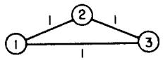

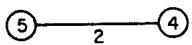  
FIGURE 5

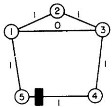  
FIGURE 6

$$
\sum _ { I > J } d _ { I J } x _ { I J } = - \sum _ { I > J } \hat { \delta } _ { I J } x _ { I J } + 2 \sum _ { I = 1 } ^ { 5 } \pi _ { I } + \pi _ { 6 } ( 1 - y _ { 6 } )
$$

where $\delta _ { I J } = \pi _ { I } + \pi _ { J } - d _ { I J }$ except $\delta _ { 4 5 } = \pi _ { 4 } + \pi _ { 5 } - ( d _ { 4 5 } - \pi _ { 6 } )$ .

Now determine the six values of $\pmb { \pi } _ { I }$ by setting $\delta _ { I J } = 0$ corresponding to basic variables $x _ { I J }$ :

$$
\delta _ { 1 2 } = \delta _ { 2 3 } = \delta _ { 3 4 } = \delta _ { 4 5 } = \delta _ { 5 1 } = \delta _ { 1 3 } = 0 ,
$$

from which it follows that

$$
D ( x ) - D ( \bar { x } ) = - \sum \hat { \delta } _ { I J } x _ { I J } - \pi _ { 6 } y _ { 6 } .
$$

To evaluate $\pmb { \pi } _ { I }$ we note that there are six equations in six unknowns. These are shown on the map below (Fig. 7). The three conditions about the triangular loop (1, 2, 3) permit us to solve for $\pi _ { 1 } , \pi _ { 2 } , \pi _ { 3 }$ Branching out from the triangle we get next $\pmb { \pi _ { 4 } }$ and $\pmb { \pi } _ { 5 }$ and finally $\pi _ { 6 }$ Thus, we determine first that $2 \pi _ { 1 } = d _ { 1 2 } - d _ { 2 3 } + d _ { 3 1 } = 5 - 5 + 6$ so that $\pmb { \pi _ { 1 } = 3 }$ , $\pi _ { 2 } = 2$ , $\pmb { \pi _ { 3 } } = 3$

Working down, $\pmb { \pi _ { 4 } } = 5$ , $\pmb { \pi } _ { 5 } = 5$ Thus, ${ \pi } _ { 4 } + { \pi } _ { 5 } = - { \pi } _ { 6 } + 6$ ,so $\pi _ { 6 } = - 4$ These values are shown adjacent to each city in Fig. 7.

With these values of $\pmb { \pi } _ { \pmb { I } }$ all remaining $\delta _ { I J } = ( \pi _ { I } + \pi _ { J } - d _ { I J } ) \leq 0$ hence, with $\pi _ { 6 } < 0$ we have the right side of (14) always positive, so the tour (1 2 3 4 5) is minimal. This illustrates the use of the simplest of the loop conditions, namely, an upper bound on the variable $x _ { 4 5 }$ .

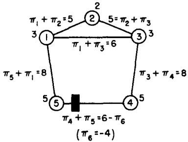  
FIGURE 7

Example 3

Here we consider a six-city case (Fig. 8) where the optimal tour is not our initial choice. Let the starting tour be $( 1 \ 2 \ 3 \ 4 \ 5 \ 6 )$ of length $D ( \bar { x } ) =$ 23. If we proceed as before, relation (8) implies that the $\pmb { \pi } _ { \pmb { l } }$ satisfy the relations shown in Fig. 8. In this case (and this is generally true for loops with an even number of links) the sum of equations on links (1, 2), (3, 4), (5, 6) is identical with the sum for (2, 3), (4, 5), (6, 1) except for different constant terms, so that the system of equations in $\pmb { \pi } _ { \pmb { I } }$ is inconsistent.

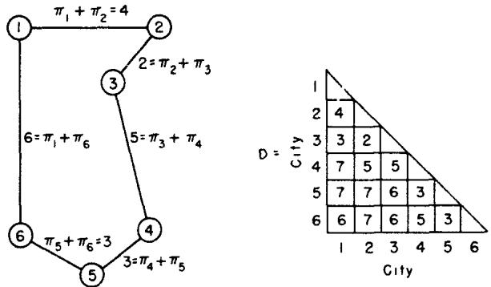  
FIguRE 8

This difficulty can be avoided if the following general rule is followed: The set of basic variables must be so selected that when the remaining $x _ { I J }$ are fixed, the values of the basic variables are uniquely determined. This means the matrix of coefficients of the basic variables is nonsingular (i.e., their determinant is nonvanishing). Snce the $\pmb { \pi } _ { I }$ satisfy a system of equations whose coefficient matrix is the transpose of this matrix, the $\pmb { \pi } _ { I }$ will be uniquely determined also. In the six-city case, one may augment system (2) with the additional upper-bound condition

$$
x _ { 4 5 } + y _ { 7 } = 1 \qquad ( y _ { 7 } \geq 0 )
$$

and select $\pmb { x } _ { 1 3 }$ as a basic variable in addition to the basic variables $x _ { I J }$ corresponding to $( I , J )$ on the tour. Then, letting $\pmb { \pi } \mathbf { 7 }$ be the weight associated with restriction (15), the $\pmb { \pi } _ { I }$ satisfy relations in Fig. 9.

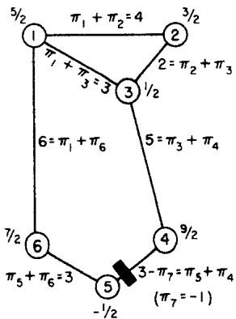  
FIGURE 9

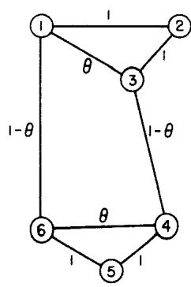  
FIgURe 10

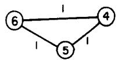  
FIGURE 11

The value of $\pi _ { 1 } = \%$ can be determined from the odd loop (123) by alternately adding and subtracting the equations around the loop. The others can then be evaluated immedately. In this case, we have, analogous to (14),

$$
D ( x ) - D ( \bar { x } ) = - \sum \delta _ { I J } x _ { I J } - \pi _ { 7 } y _ { \bar { \imath } } ,
$$

where $\delta _ { I J } = 0$ if $\boldsymbol { x } _ { I J }$ is a basic variable and $\delta _ { I J } = \pi _ { I } + \pi _ { J } - d _ { I J }$ otherwise. Since $\delta _ { 4 6 } = 3$ ,increasing the value of $x _ { 4 6 }$ to $\pmb \theta$ (while all other nonbasic variables remain zero), with corresponding adjustments in the basic variables, will yield $D ( x ) - D ( \bar { x } ) = - 3 \theta < 0$ In Fig. 10 it is seen that the largest value of $\pmb \theta = 1$ and the resulting solution is Fig. 11, which is not a new tour, but two loops. However, we can exclude this solution by imposing the additional restriction satisfied by all tour solutions

$$
\scriptstyle x _ { 1 2 } + x _ { 2 3 } + x _ { 3 1 } \leq 2 , \quad { \mathrm { o r } } \quad x _ { 1 2 } + x _ { 2 3 } + x _ { 3 1 } + y _ { 8 } = 2 ,
$$

since in Fig. 11 the inadmissible solution has ${ x _ { 1 2 } + x _ { 2 3 } + x _ { 3 1 } = 3 }$ We now start all over again augmenting relations (2) by (15) and (17). Let the basic variables be the same as before but include $x _ { 4 6 }$ (i.e., the one we set equal to $\pmb \theta$ in Fig. 10). Let $\pmb { \pi } _ { \pmb { l } }$ for $1 , 2 , \cdots 8$ be the weights assigned to these relations respectively in forming $D ( x ) - D ( { \bar { x } } )$ ; then the $\pmb { \pi } _ { I }$ satisfy the relations shown in Fig. 12, where the loop condition (17) is symbolized by the dotted loop in the figure.

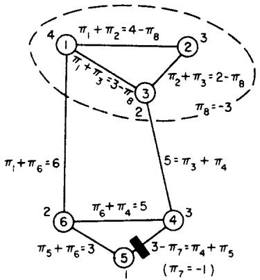  
FIGURe 12

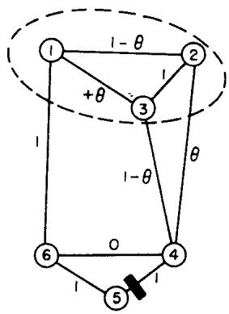  
FIGURE 13

The value of $\pi _ { 6 } = 2$ may be evaluated from the odd loop (6 4 3 2 1) by alternately adding and subtracting the equations in $\pmb { \pi } _ { t }$ shown on this loop. The other $\pmb { \pi } _ { I }$ can then be immediately determined. This time

$$
D ( x ) - D ( \bar { x } ) = - \sum \delta _ { I J } x _ { I J } - \pi _ { 7 } y _ { 7 } - \pi _ { 8 } y _ { 8 }
$$

where $\delta _ { I J } = 0$ for $x _ { I J }$ a basic variable and $\delta _ { I J } = \pi _ { I } + \pi _ { J } - d _ { I J }$ otherwise. Since $\mathfrak {delta } _ { 2 4 } = 1$ while all other $\delta _ { l } , \leq 0$ we set $x _ { 2 4 } = \theta$ ; then the adjustments in the values of the basic variables necessary to satisfy (2), (15), (17) are shown in Fig. 13 and the new solution for $\pmb \theta = 1$ is a new tour $\pmb { \bar { x } }$ with length $D ( \bar { x } ) = D ( \bar { x } ) - 1 = 2 2$ ,Fig. 14. We may now drop $x _ { 3 4 } = 0$ from the basic set of variables (or alternatively $\scriptstyle x _ { 1 2 }$ ) and replace it by $x _ { 2 4 }$ as a new basic variable. This yields the relations for $\pi _ { \ell }$ of Fig. 15. The expression for $D ( x ) - D ( { \bar { x } } )$ is similar to (18). It can now be tested that all $\delta _ { I J } \leq 0$ corresponding to non-basic $x _ { T J }$ , and the coefficients of $y _ { 7 }$ and $y _ { 8 }$ are $\pmb { \pi } \tau \leq 0$ , $\pmb { \pi _ { 8 } \leq 0 }$ , so that the new tour is established as optimal.

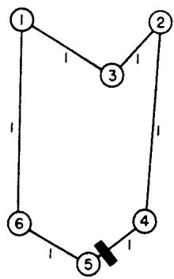  
FIGURE 14

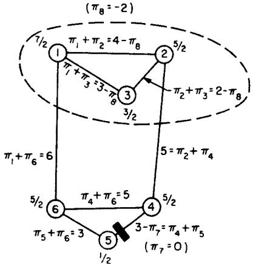  
FIGURe 15

# AN ESTIMATION PROCEDURE

In any linear programming problem with bounded variables, an estimate is available of how much a basic solution differs from an optimal solution. Let $D ( x )$ represent a linear form to be minimized and $D ( \bar { x } )$ be the value for some basic solution $\vec { x }$ where variables $( x _ { 1 } , x _ { 2 } , \cdots , x _ { n ^ { \prime } } ) _ { ; }$ , represented by the symbol $x$ , satisfy a system of equations as well as bounds $\mathbf { 0 } { \le } x _ { J } { \le } r _ { J }$ . If the equations are multiplied by weights $\pmb { \pi } _ { I }$ and substracted from $D ( x )$ , then (as we have noted earlier)

$$
D ( x ) - D ( \bar { x } ) = - \sum _ { J = 1 } ^ { n ^ { \prime } } \hat { \upsilon } _ { J } x _ { J }
$$

$$
( x _ { J } \ge 0 )
$$

where $\pmb { \pi } _ { I }$ are chosen such that $\delta _ { J } = 0$ if the correspondng $x _ { J }$ is a basic variable. We may now split the right side of (19) into positive and negative parts and obtain a lower bound for the difference by dropping the positive part, i.e.,

$$
\begin{array} { l l } { { D ( x ) - D ( \bar { x } ) = - \displaystyle \sum _ { \delta , J > 0 } \delta _ { J } x _ { J } - \displaystyle \sum _ { \delta , J \leq 0 } \delta _ { J } x _ { J } , } } & { { \quad ( x _ { J } \geq 0 ) \nonumber } } \\ { { { \cal D } ( x ) - D ( \bar { x } ) \geq - \displaystyle \sum _ { \delta , J > 0 } \delta _ { J } x _ { J } \geq - E , } } & { { \quad ( E \geq 0 ) } } \end{array}
$$

where $- E$ is some estimate for the negative part. By setting $x _ { J } = r _ { J }$ , we obtain in particular

$$
D ( x ) - D ( \bar { x } ) \geq - \sum _ { \delta , \ j > 0 } \delta _ { J } r _ { J } .
$$

For the traveling-salesman problem the variables $x _ { I J }$ must be either 0 or 1 if $_ x$ represents a tour. From (20), no link $( I , J )$ can occur in an optimal tour if

$$
\delta _ { I J } < - E ,
$$

hence all corresponding variables $\boldsymbol { \mathscr { X } } _ { I J }$ can be dropped from further consideration.

During the early stages of the computation, $E$ may be quite large and very few links can be dropped by this rule; however, in the latter stages often so many links are eliminated that one can list all possible tours that use the remaining admissible links. By extending this type of combinatorial argument to the range of values of the 'slack' variables $y _ { \kappa }$ ,it is often possible at an earlier stage of the iterative algorithm to rule out so many of the tours that direct examination of the remaining tours for minimum length is a feasible approach.

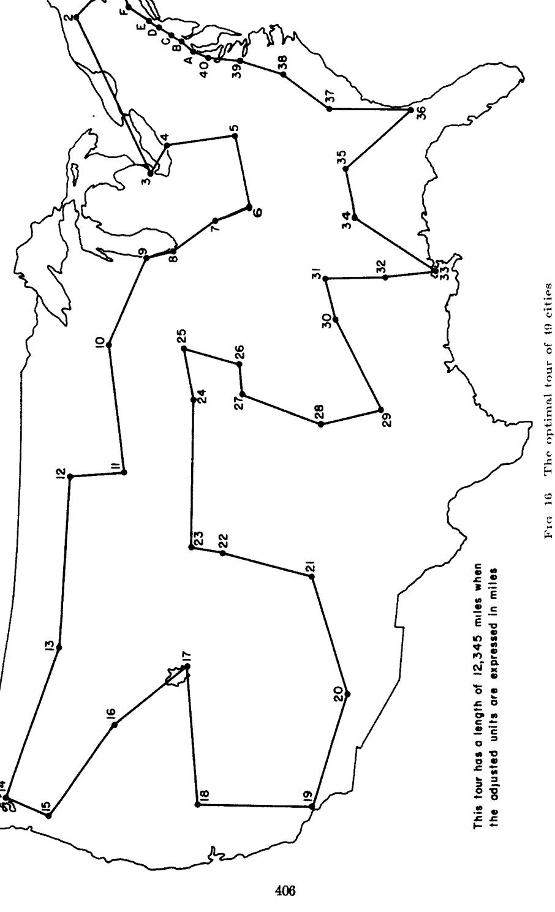

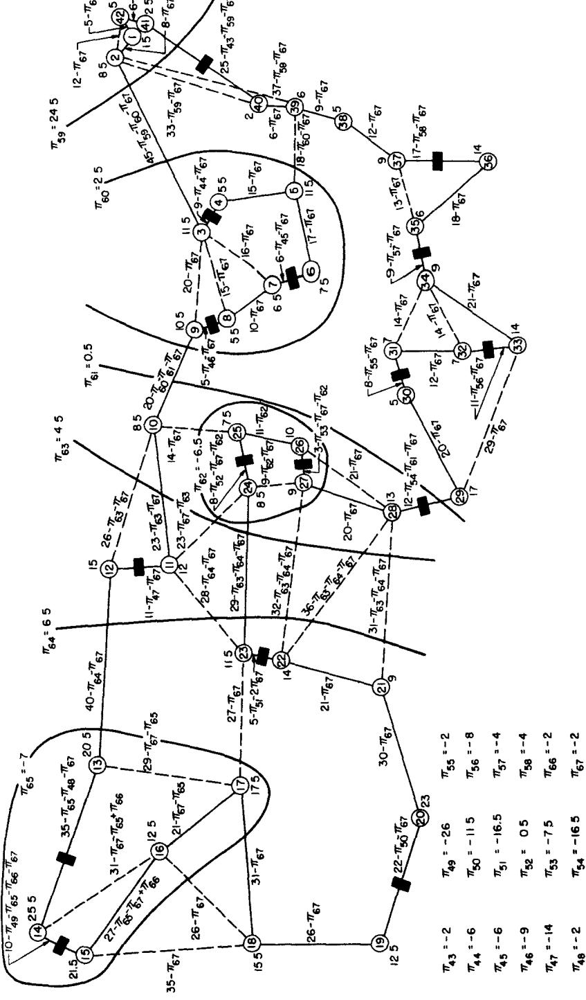

# THE 49-CITY PROBLEM\*

The optimal tour $\bar { x }$ is shown in Fig. 16. The proof that it is optimal is given in Fig. 17. To make the correspondence between the latter and its programming problem clear, we will write down in addition to 42 relations in non-negative variables (2), a set of 25 relations which suffice to prove that $D ( x )$ is a minimum for $\bar { x }$ We distinguish the following subsets of the 42 cities:

$$
\begin{array} { l l l } { { S _ { 1 } = \{ 1 , 2 , 4 1 , 4 2 \} } } & { { S _ { 5 } = \{ 1 3 , 1 4 , \cdot \cdot \cdot , 2 3 \} } } \\ { { S _ { 2 } = \{ 3 , 4 , \cdot \cdot \cdot , 9 \} } } & { { S _ { 6 } = \{ 1 3 , 1 4 , 1 5 , 1 6 , 1 7 \} } } \\ { { S _ { 3 } = \{ 1 , 2 , \cdot \cdot , 9 , 2 9 , 3 0 , \cdot \cdot , 4 2 \} } } & { { S _ { 7 } = \{ 2 4 , 2 5 , 2 6 , 2 7 \} . } } \\ { { S _ { 4 } = \{ 1 1 , 1 2 , \cdot \cdot \cdot , 2 3 \} } } & { { } } \end{array}
$$

Except for two inequalities which we will discuss in a moment, the pro gramming problem may now be written as the following 65 relations:

<table><tr><td colspan="2">∑ x1j=2 (I=1, ··.,42),</td><td>x41.1≤1,</td><td>x43≤1,</td><td>x7.6≤1,</td></tr><tr><td>x9,8≤1,</td><td>x 12.11≤1,</td><td>x14.13≤1,</td><td>x15.4≤1,</td><td>X20.19≤1,</td></tr><tr><td>x23.22≤1,</td><td>X2n.24≤1,</td><td>X27.26 ≤1,</td><td>X 29.28≤1,</td><td>X31.30≤1,</td></tr><tr><td>X33,32≤1,</td><td>X33,34≤1,</td><td>X37,36 ≤1,</td><td>∑ x1j≥2, s 1, s1$</td><td>∑ x1J≥2, S 2,82</td></tr><tr><td>∑ x1s≥2, Sa,S3</td><td>λ x1≥2, $s $$</td><td>∑ x1j≥2, $S_{$5</td><td>∑ x1J≤4, S6</td><td>∑ x1u≤3. 87</td></tr></table>

The remaining two relations ( ${ \it 6 6 }$ and $\boldsymbol { \mathit { 6 7 } }$ ) are perhaps most easily described verbally.

66: $\pmb { \mathcal { X } } _ { 1 4 , 1 5 }$ minus the sum of all other $x _ { I J }$ on links out of 15, 16, 19, except for $x _ { 1 8 } . 1 5$ , X18.16, X17.16, X19.18, and $x _ { 2 0 , 1 9 }$ , is not positive   
67: $\Sigma a _ { I J } x _ { I J } { \le } 4 2$ , where $a _ { 2 3 , 2 2 } = 2$ b $a _ { 2 8 . 2 5 } { = } 0$ ,all other $a _ { I J } = 1$ except $\mathbf { \delta } _ { a _ { I J } = 0 }$ if ${ \pmb x } _ { I J }$ is a non-basic variable and either (a) $I$ is in $\mathcal { S } _ { 3 } , J$ not in ${ \bf { S } } _ { 3 }$ , or (b) $\pmb { I }$ or $\pmb { J }$ is 10, 21, 25, 26, 27, or 28.‡

These two inequalities are satisfied by all tours. For example, if a tour were to violate the first one, it must have successively $x _ { 1 5 , 1 4 } = 1$ \* As indicated earler, it was possible to treat this as a 42-city problem.

$\dagger \Sigma _ { S , \bar { S } } \bot _ { I J }$ means the sum of all variables where only one of the subscripts $\pmb { I }$ or $J$ is in $\pmb { S }$ $\Sigma _ { s } \mathbf { \sigma } _ { x _ { I J } }$ means the sum of all variables such that $\pmb { I }$ and $\pmb { \jmath }$ are in ${ \pmb S } \mathrm { \cdot }$ -see relations (4)(5),(6).

$^ \ddagger$ We are indebted to I Glicksberg of Rand for pointing out relations of this kind to us.

$x _ { 1 8 , 1 5 } { = } 1 , x _ { 1 8 , 1 \nu } { = } 1$ , but also $x _ { 1 9 , 1 8 } = 1$ , a contradiction. The argument that each tour satisfies the second inequality is similar. If a tour $x$ exists with $\Sigma \ a _ { I J } x _ { I J } > \mathrm { 4 2 }$ , then clearly $x _ { 2 3 , 2 2 } = 1$ , and also $x _ { 1 0 , 9 } = x _ { 2 9 , 2 8 } = 1$ , since by (a) these are the only links connecting $S _ { 3 }$ and ${ \tilde { S } } _ { 3 }$ having non-zero $a _ { I J }$ . (See Fig. 17 to distinguish between basic and non-basic variables.) Moreover, since $a _ { 2 \uparrow , 2 5 } = 0$ , it follows from (b) that $x _ { 2 5 , 1 0 } = x _ { 2 5 , 2 4 } = x _ { 2 7 , 2 6 } = x _ { 2 8 , 2 ; } = 1$ . Again, $( \mathsf { h } )$ and the fact that $x _ { 2 8 } \textrm { \textmu { } } _ { 2 1 } = 0$ imply $x _ { 2 1 \ 2 0 } = x _ { 2 2 \ , 2 1 } = 1$ Now look at city 27. There are three possibilties: $x _ { 2 7 } \cdot _ { 4 } = 1$ , $x _ { 2 7 } \ y _ { 2 2 } = 1$ , or $x _ { 2 8 } \textrm { } _ { 2 7 } = 1$ But each of these contradicts the assumption that $x$ is a tour.

These relations were imposed to cut out fractional solutions which satisfy all the conditions (2) and (4). A picture of such a fractonal solution, which gives a smaller value for the minimizing form than does any tour, is shown in Fig. 18. Notice that it does not satisfy relation 67.

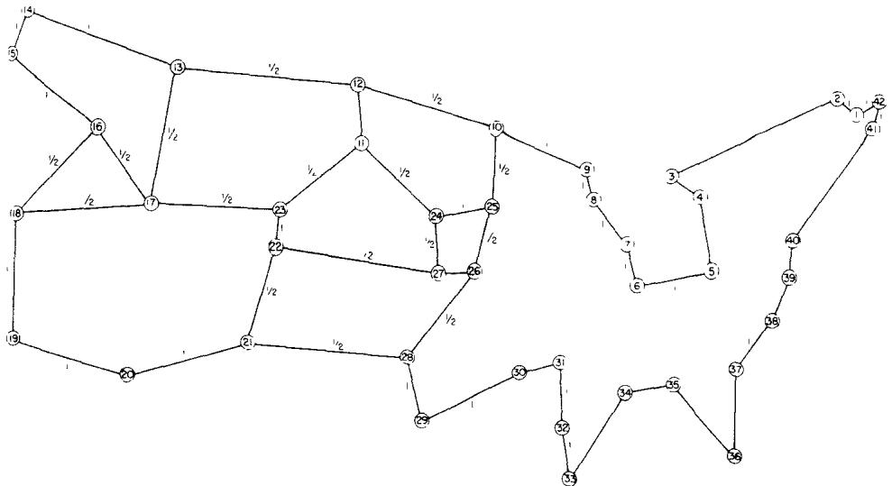  
FIG 18. A fractional solution $\boldsymbol { \mathscr { x } }$ satisfying all loop conditions with $\Sigma \ d _ { I J } \ x _ { I J } = 6 9 8$

We assert that if the weights $\pmb { \pi } _ { I }$ are assigned to these restraints in the order presented above, then the values as given in Fig. 17 satisfy $\delta _ { I J } = 0$ for all variables $x _ { I J }$ in the basis. With these values of $\pmb { \pi } _ { I }$ in the expression for $D ( x ) { - } D ( { \bar { x } } )$ ,all $\delta _ { I J } \leq 0$ corresponding to variables $x _ { I J }$ and $\pi _ { 4 3 }$ b $\pi _ { 4 4 }$ ··, $\pi _ { 6 7 }$ corresponding to variables $y _ { 4 3 } , \cdots , y _ { 6 7 }$ are appropriately positive or negative (positive if its $y$ occurs with a minus sign in the relation, negative otherwise) with the exception of $\pi _ { 5 2 } = 1 \mathrm { 2 }$ where $x _ { 2 5 , 2 4 } + y _ { 5 2 } = 1$ . This proves, since $E = \%$ and all the $d _ { I J }$ are integers, that $\bar { x }$ is minimal. The length $D ( \bar { x } )$ is 699 units, or 12,345 miles except for rounding errors.

It can be shown by introducing all links for which $\delta _ { I J } \geq - \%$ that $\bar { x }$ is the unique minimum. There are only 7 such links in addition to those shown in Fig. 17, and consequently all possible tying tours were enumerated without too much trouble. None of them proved to be as good as $\bar { \pmb x }$ .

# CONCLUDING REMARK

It is clear that we have left unanswered practically any question one might pose of a theoretical nature concerning the traveling-salesman problem; however, we hope that the feasibility of attacking problems involving a moderate number of points has been successfully demonstrated, and that perhaps some of the ideas can be used in problems of similar nature.

# Список литературы

1. W. W. R. BALL, Mathematical Recreations and Essays, as rev. by H. S. M. Coxeter, 11th ed., Macmillan, New York, 1939.   
2 G. B. DANTZIG, A. ORDEN, AND P. WoLFE, The Generalized Simplex Method for Minimizing a Linear Form under Linear Inequality Restraints, Rand Research Memorandum RM-1264 (April 5, 1954).   
3. G. B. DAnTziG, "Application of the Simplex Method to a Transportation Problem," Activity Analysis of Production and Allocation, T.C. Koopmans, Ed , Wiley, New York, 1951.   
4. I. HeLLER, "On the Problem of Shortest Path Between Points," I and II (abstract), Bull. Am. Math. Soc. 59, 6 (November, 1953).   
5. T. C. KoopMANs, "A Model of Transportation," Activrty Analysis of Production and Allocation, T. C. Koopmans, Ed., Wiley, New York, 1951.   
6. H. W. KuHN, "The Traveling-Salesman Problem," to appear in the Proc. Sixth Symposium in Applied Mathematics of the American Mathematical Society, McGraw-Hill, New York.   
7. D. F. VOTAW_ AND A. ORDEN, "Personnel Assignment Problem," Symposium on Linear Inequalities and Programming, Comptroller, Headquarters U. S. Air Force (June 14-16, 1951).   
8. J. von NeuMann, "A Certain Zero-sum Two-person Game Equivalent to the Optimal Assignment Problem," Contributions to the Theory of Games II, Princeton University Press, 1953.   
9. W. T. TuTTE, "On Hamiltonian Circuits," London Mathematical Society Journal XXI, Part 2, No. 82, 98-101 (April, 1946).   
10. S. VERBLuNsky, "On the Shortest Path Through a Number of Points," Proc. Am. Math. Soc. II, 6 (December, 1951).

Copyright of Journal of the Operations Research Society of America is the property of INFORMS: Institute for Operations Research and its content may not be copied or emailed to multiple sites or posted to a listserv without the copyright holder's express written permission. However, users may print, download, or email articles for individual use.