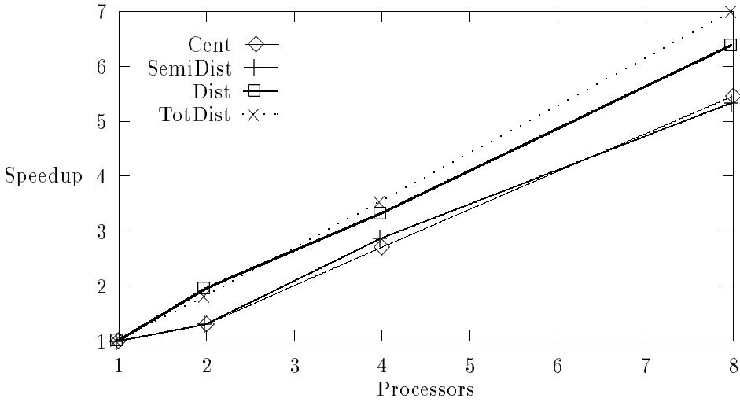
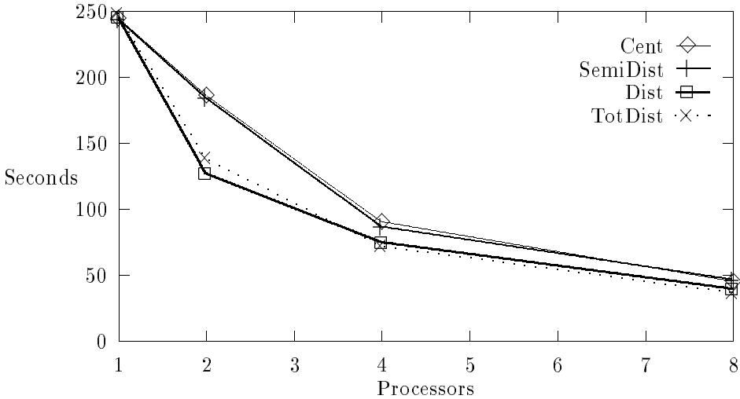
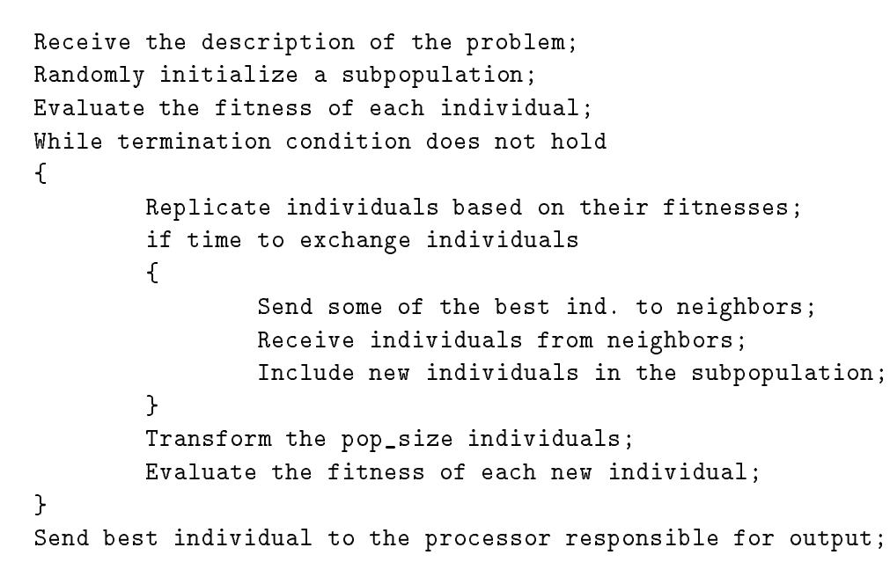
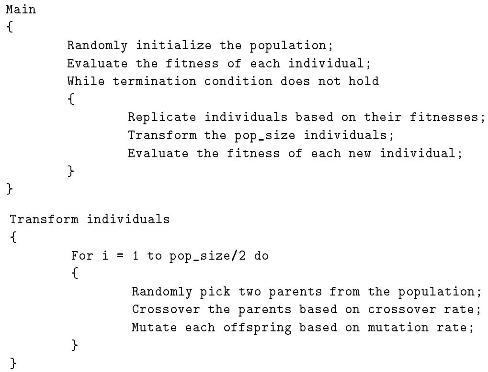

Centralized:

ga <#procs> <pop_mast> <seedp> <seeds> <prob_size> <#constr> <#gens> <pop_size> <pcross> <pmut>

Semi-Distributed:

ga <#masters> <#slaves> <pop_mast> <#exch> <exch_int> <seedp> <seeds> <prob_size> <#constr> <#gens> <pop_size> <pcross> <pmut>

Distributed:

ga <#exch> <exch_int> <seedp> <seeds> <prob_size> <#constr> <#gens> <pop_size> <pcross> <pmut>

Totally Distributed:   
ga <#procs> <seedp> <seeds> <prob_size> <#constr> <#gens> <pop_size>   
<pcross> <pmut>

where: <#procs> $=$ number of processors in the system <pop_mast> $=$ size of the population handled by each master <seedp> $=$ seed to the random problem <seeds> $=$ seed to the genetic search <prob size> $=$ number of variables in the function <#constr> $=$ number of constraints to the function <#gens> $=$ number of generations <pop_size> $=$ size of the population of individuals <pcross> $=$ probability of crossover <pmut> $=$ probability of mutation <#masters> $=$ number of masters in the system <#slaves> $=$ number of slaves per master <#exch> $=$ number of individuals to migrate <exch_int> $=$ number of generations between migrations

# A Implementations' User Manual

In this appendix we describe how to compile and execute our implementations.

# A.1 Compiling

All our implementations have three dene options: DEBUG PRINTABLE and STATISTICS. DEBUG allows for the printing of the random problem being solved and the initial random population. PRINTABLE allows for the printing of the nal solution found by the implementation. STATISTICS allows for the recording (stat<proc number> le names) of the best individual the average tness of the population and the number of valid individuals at each generation. The distributed versions also accept a dene establishing the number of processors in the system. ONE PROC species a single processor TWO PROC species two processors and so on.

A sample makele line is:

<dependencies> \$(CC) -D STATISTICS -D PRINTABLE $\$ 1$ (SOURCES) \$(CFLAGS) -o sga

The les composing each of the implementations are the following:

Centralized:

Master - sga.c, aux.c, random.c/h, comm.c/h, defs.h and types.h;   
Slaves - sgaWorker.c aux slave.c random.c/h comm.c/h defs.h and types.h.

Semi-Distributed:

Master Initiator - sga.c, aux.c, hack.c, random.c/h, comm.c/h, defs.h and types.h;   
Other Masters - sga.c, aux master.c, hack.c, random.c/h, comm.c/h, defs.h and types.h;   
Slaves - sgaWorker.c, aux slave.c, random.c/h, comm.c/h, defs.h and types.h.

Distributed:

Initiator - sga.c, aux.c, hack.c, random.c/h, comm.c/h, defs.h and types.h;   
Others - sgaWorker.c, aux slave.c, hack.c, random.c/h, comm.c/h, defs.h and types.h.

Totally Distributed:

Initiator - sga.c aux.c hack.c random.c/h comm.c/h defs.h and types.h;   
Others - sgaWorker.c, aux slave.c, hack.c, random.c/h, comm.c/h, defs.h and types.h.

# A.2 Executing

Our implementations take all of their parameters from the command line. Only the master or initiator takes parameters. The order of parameters for each implementation is the following:

[LS90] C. Lin and L. Snyder. A comparison of programming models for shared-memory multiprocessors. In Proc. of the 1990 Int. Conf. on Parallel Processing, 1990.   
[ML92] E. Markatos and T. J. LeBlanc. Shared-memory multiprocessor trends and the implications for parallel program performance. Technical Report 420, University of Rochester. Dept. of Computer Science, 1992.   
[MS89] B. Manderick and P. Spiessens. Fine-grained parallel genetic algorithms. In Proc. of the 3rd Int. Conf. on Genetic Algorithms and their Applications, pages 428{433, 1989.   
[MSB91] H. Muhlenbein, M. Schomisch, and J. Born. The parallel genetic algorithm as function optimizer. In Proc. of the 4th Int. Conf. on Genetic Algorithms and their Applications, 1991.   
[Neu91] P. Neuhaus. Solving the mapping-problem { experiences with a genetic algorithm. In Parallel Problem Solving from Nature, pages 170{175. Springer-Verlag, 1991.   
[OBB87] T. J. Olson, L. Bukys, and C. Brown. Low level image analysis on an MIMD architecture. In Proc. of the 1st Int. Conf. on Computer Vision, pages 468{475, London, June 1987.   
[PLG87] C. B. Pettey, M. R. Leuze, and J. J. Grefensette. A parallel genetic algorithm. In Proc. of the 2nd Int. Conf. on Genetic Algorithms and their Applications, 1987.   
[SG87] J. Y. Suh and D. V. Gucht. Distributed genetic algorithms. Technical Report 225, Indiana University. Computer Science Dept., 1987.   
[Tan87] R. Tanese. Parallel genetic algorithm for a hypercube. In Proc. of the 2nd Int. Conf. on Genetic Algorithms and their Applications, 1987.   
[Tan89] R. Tanese. Distributed genetic algorithms. In Proc. of the 3rd Int. Conf. on Genetic Algorithms and their Applications, 1989.   
[Tro92] The Ohio State University. Trollius Tutorial Introduction in C, 1992.

# Список литературы

[BW91] S. E. Bayer and L. Wang. A genetic algorithm programming environment: Splicer. In Proc. of the 1991 IEEE Int. Conf. on Tools for AI, 1991.   
[CMR89] J. P. Cohoon, W. N. Martin, and D. S. Richards. A multi-population genetic algorithm for solving the k-partition problem on hyper-cubes. In Proc. of the 3rd Int. Conf. on Genetic Algorithms and their Applications, 1989.   
[FH91] T. C. Fogarty and R. Huang. Implementing the genetic algorithm on transputer based parallel processing systems. In Parallel Problem Solving from Nature, pages 145{149. Springer-Verlag, 1991.   
[GBB89] C. F. Goulart, L. M. C. M. Barros, and R. Bianchini. Parallel branch and bound algorithms. 1989. In portuguese. Universidade Federal do Rio de Janeiro, Seminars on Parallel Programming Pro ject Report.   
[Gol89] D. E. Goldberg. Genetic Algorithms in search, optimization and machine learning. Addison-Wesley, 1989.   
[Gre81] J. J. Grefenstette. Parallel adaptive algorithms for function optimization. Technical Report CS-81-19, Nashville: Vanderbilt University. Computer Science Dept., 1981.   
[GS89] M. Gorges-Schleuter. Asparagos: A asynchronous parallel genetic optimization strategy. In Proc. of the 3rd Int. Conf. on Genetic Algorithms and their Applications, pages 422{427, 1989.   
[INM89] INMOS Limited. The Transputer Databook, 1989.   
[Jon75] K. A. De Jong. Analysis of the Behavior of a Class of Genetic Algorithms. PhD thesis, University of Michigan, 1975.   
[KP92] V. Kommu and I. Pomeranz. Eect of communication in a parallel genetic algorithm. In Proc. of the 1992 Int. Conf. on Parallel Processing, pages III:310{317, 1992.   
[KSV91] B. Kroger, P. Schwenderling, and O. Vornberger. Genetic packing of rectangles on transputers. In Transputing 91, 1991.   
[LeB88] T. J. LeBlanc. Problem decomposition and communication tradeos in a sharedmemory multiprocessor. In Numerical Algorithms for Modern Parallel Computer Architectures, Vol. 13, IMA Volumes in Mathematics and Its Applications. Springer-Verlag, 1988.   
[LLS+92] D. Lenoski, J. Laudon, L. Stevens, T. Joe, D. Nakahira, A. Gupta, and J. Hennessy. The dash prototype: Implementation and performance. In Proc. of the 19th Int. Symposium on Computer Architecture, May 1992.

 To explore the utility of parallel hybrid optimization approaches. More specically, we could study the eect of coupling GAs and other optimization strategies in parallel settings. For instance, we could analyze the search performance of simulated annealing and GAs working in parallel. The algorithms could work independently (maybe forming clusters of processors) and communicate periodically. At each communication point, each of the algorithms could dene if the other is closer to a good solution. If it is, the late algorithm can just step ahead and continue its search. At the end, the algorithm closest to a good solution could provide the nal answer to the problem. Such an exploration could also include other optimization strategies, like Branch and Bound. All of these methods can easily be made \compatible".

Our work has broader ramications, however. We argued that our parallel GA design alternatives should perform eciently when implemented on any type of MIMD machine, including shared-memory architectures. In addition, the results we presented indicate that designs involving some level of centralization can be eective for other types of parallel search, such as the large class of branch and bound algorithms.

# 8 Future Work Proposals

In a genetic algorithm, the eect of partitioning the population on the quality of the search is not completely understood. Some researchers have previously addressed the population distribution issue in parallel GAs ([SG87], [Tan87], [CMR89], [Tan89], [KSV91]). In all cases so far (including ours), the analyses study the eects of distributing the population in the context of a single application.

The set of implementation alternatives presented here can be used as a rst step towards a better understanding of the eect of population organization strategies and their search quality and execution performance implications. We hope to be providing the tools that will allow further research on this issue. In our opinion, the study and comparison of results of a large set of optimization problems under our dierent distribution strategies should be a reasonable next step to take. Landscape characteristics are an important issue related to search quality and execution performance, so the optimization problems should have known and diverse landscapes. (An example of a set of applications with these characteristics is De Jong's ve-function testbed ([Jon75]).)

However in order to take this next step one problem must be overcome: our current means of understanding specic genetic searches is clearly decient. The average tness of the population and its best individual for each generation are not complete descriptions of the search process. What we need is a complete set of statistics and visualization tools that could be applied to any parallel GA. Thus, we propose the development of a set of tracing routines and visualization tools that would allow for a more understandable description of the parallel genetic search. The Splicer genetic algorithm programming environment ([BW91]) provides tools similar to the ones we propose, however the system only handles sequential GAs, rendering it too restrictive for our purposes.

Other pieces of future work could be:

 To perform a larger number of experiments with the 0-1 ILP problem and our parallel GA implementations;   
 To implement our parallel implementations on shared-memory multiprocessors and study their performance. These experiments should support our claim that our implementations are ecient on any type of parallel processor. We could also show that previously proposed centralized implementations exhibit poor performance on state-of-the-art machines;   
 To compare the performance of our parallel GAs to previously developed parallel Branch and Bound implementations for the 0-1 ILP problem on Transputer networks, for instance [GBB89];

Cent and SemiDist found the -1381 solution faster than TotDist and Dist. In addition Cent and SemiDist outperform the distributed programs in terms of average running times.

Directly comparing implementations, we observe that execution performance gets worse with the increase in the level of population distribution, in the case of our experiments. Worth noting are the very good performance of the centralized implementation and the very poor performance of the totally distributed one.

Clearly the execution performance results just presented are dependent on the size of the computer in use; the overheads entailed by the centralized implementation are likely to rise on machines with more processors. In fact, this implementation may not be eective on a large multicomputer since the number of generations between communications with the master processor may have to be set very large, for reasonable performance. This setting reduces the extent and impact of the centralized reproduction. We believe, however, that the semi-distributed implementation (and the two other ones) should perform well on any machine size, particularly if the machine topology denes clusters of processors, as in DASH $\mathrm { [ L L S ^ { + } 9 2 ] }$ ).

# 7 Conclusions

We dened a taxonomy of parallel search algorithms according to the distribution of the genetic population throughout multiple processors. The most immediate impact of our work is in the area of parallel GAs on distributed-memory architectures such as Transputers. This paper showed that it is worthwhile to consider varieties of centralized approaches for parallel GAs, even on such machines. In terms of our taxonomy, the two main algorithmic contributions were: a modication of centralized designs, tailored to distributed-memory machines; and an original semi-distributed design.

As an example we quantied search quality and execution performance issues for the 0-1 ILP problem using genetic algorithm search. In summary our results indicated that some diversity of environments improves the quality of the genetic search in the case of the 0-1 ILP problem (and a very frequently used replication strategy). This diversity can either be achieved through separate subpopulations or by executing on slaves (with dierent random seeds) for a reasonable number of generations between communications with the master(s). In addition our experiments showed that some centralization of the population produces better nal solutions than distributed implementations of our example problem, when running for a xed number of generations.

In terms of execution time, also for a xed number of generations, we showed that, on average the centralized and semi-distributed implementations had performance comparable to the other implementations on large numbers of processors. The former programs did not scale as well as the latter ones, however.

Our most important result showed that implementations incurring higher communication and serialization overheads can produce as good or better solutions faster than very \ecient" implementations. More specically, utilizing more centralized parallel genetic search strategies may result in the fastest convergence towards the optimal solution therefore reducing the number of generations needed by the algorithm.

  
Figure 6: Average speedups.

Table 2: Search quality versus execution performance.   

<table><tr><td>Program</td><td>Run</td><td>Iteration</td><td>Time (secs)</td></tr><tr><td rowspan="3">Seq</td><td>1</td><td>459</td><td>229</td></tr><tr><td>2</td><td>&gt; 1000</td><td>&gt; 600</td></tr><tr><td>3</td><td>&gt; 1000</td><td>&gt; 600</td></tr><tr><td rowspan="3">Cent</td><td>1</td><td>160</td><td>12</td></tr><tr><td>2</td><td>320</td><td>30</td></tr><tr><td>3</td><td>160</td><td>14</td></tr><tr><td rowspan="3">SemiDist</td><td>1</td><td>120</td><td>10</td></tr><tr><td>2</td><td>420</td><td>41</td></tr><tr><td>3</td><td>220</td><td>20</td></tr><tr><td rowspan="3">Dist</td><td>1</td><td>236</td><td>17</td></tr><tr><td>2</td><td>255</td><td>18</td></tr><tr><td>3</td><td>634</td><td>49</td></tr><tr><td rowspan="3">Tot Dist</td><td>1</td><td>447</td><td>30</td></tr><tr><td>2</td><td>309</td><td>23</td></tr><tr><td>3</td><td>698</td><td>43</td></tr></table>

  
Figure 5: Average running times.

centralized implementation. This is due to the fact that the overhead involved in the centralized program is not unbearable, since the maximum machine conguration is of only 8 processors. On larger congurations the semi-distributed GA can be expected to easily outperform the centralized implementation.

Figure 6 displays the average speedup performance of our implementations. The curves in the gure correspond to one's intuitive expectations. On average, the totally distributed implementation achieves close to linear speedup while the distributed GA incurs a little more communication overhead.

The average speedup performance of the centralized and semi-distributed implementations is much lower than the other two parallel GAs. The centralized replication and the existence of communication bottlenecks (the masters) contribute heavily to this result, as do the communication operations provided by Trollius. (The message buering and routing account for a large overhead.)

# 6.3 Search Quality versus Execution Performance

This section presents results from experiments utilizing a dierent termination strategy: the implementations terminate when the solution -1381 is found. With this termination scheme we can evaluate the tradeo between the type of search (population distribution) and the execution overhead entailed by the corresponding implementation.

Table 2 presents the number of generations and time taken by each of the implementations, in its maximum conguration, before nding -1381. These results show that the implementations with some level of centralization of the population tended to nd solutions in fewer generations than the other programs. As a result, in two out of three experiments, into account other processors' t individuals. Small totally distributed populations often spend many generations not making any progress, due to a lack of variety of individuals.

# 6.2 Running Time and Speedup Performance Results

In general, running time and speedup comparisons of randomized implementations are very dicult to make. The amount of computation performed by an algorithm may vary from one implementation to another. In fact, even from one machine conguration to another, the amount of work performed may change. Pseudo-random number generators sometimes can be used to eliminate these diculties.

In the case of our GA implementations, however, pseudo-random numbers are not enough to keep the amount of computation constant between implementations or machine congurations, even when running for a xed number of generations. The amount of work performed diers between implementations, since the computation fraction of the execution depends heavily on the specic individuals handled (the behavior of the replication algorithm and of the validity test depend on the population). As an example, the amount of work performed by processors running TotDist and Dist is dierent, because the communication between processors causes them to work on dierent individuals. Therefore, the running time of Dist is not necessarily equal to the execution time of TotDist plus the communication time involved in transferring individuals.

The amount of computation also diers between machine congurations running the same implementation, since the pseudo-random numbers generated depend on the number of individuals in the subpopulations and ultimately determine the amount of work to be performed.

Due to these limitations we only present averages of the execution performance results of the 3 experiments done. By taking the average running times (and speedups), we can at least make loose comparisons between implementations.

Figure 5 displays the average running time performance of our implementations. The most interesting aspect of this gure is that implementations form two groups. The programs with no centralization performing better than the centralized and semi-distributed implementations. The better execution times of the distributed programs is due to three factors: smaller sequential components, lower computational overheads, and individuals more fairly distributed among the processors (recall that, even when processor congurations are the same, the centralized and semi-distributed implementations do not assign individuals evenly through the processors; the masters always have to get fewer individuals than the slaves).

The performance dierence between the two groups of implementations gets largely reduced on the maximum machine conguration, where the processors of all implementations handle about the same number of individuals. Therefore it seems that execution time is much more dependent on the number of individuals each processor gets (and on the specic parameter setting, of course) than on other costs incurred by our experiments. (The similarity between the curves for TotDist and Dist also points to this conclusion.)

Also from gure 5 we observe that the more sophisticated organization of the semidistributed implementation was not transformed in better average running times than the the search in each of the executions. The column labeled HDist lists the hamming distances between the solution -1381 and the solution found. (In all our experiments with many different parameters and seeds, -1381 was the best solution found for our problem instance, by any implementation. We assume then that -1381 is the optimal solution to our problem instance.) The Iteration column species the generation in which the nal solution was found. The column labeled PReached species the number of processors that achieved the nal solution of each experiment. In case of the centralized and semi-distributed implementations, the latter column lists the number of masters that reached the solution.

Table 1: Quality of the genetic search.   

<table><tr><td rowspan=1 colspan=1>Program</td><td rowspan=1 colspan=1>Run</td><td rowspan=1 colspan=1>Solution</td><td rowspan=1 colspan=1>HDist.</td><td rowspan=1 colspan=1>Iteration</td><td rowspan=1 colspan=1>PReached</td></tr><tr><td rowspan=1 colspan=1>Seq</td><td rowspan=1 colspan=1>123</td><td rowspan=1 colspan=1>-1381-1373-1338</td><td rowspan=1 colspan=1>066</td><td rowspan=1 colspan=1>459125262</td><td rowspan=1 colspan=1>111</td></tr><tr><td rowspan=1 colspan=1>Cent</td><td rowspan=1 colspan=1>123</td><td rowspan=1 colspan=1>-1381-1381-1381</td><td rowspan=1 colspan=1>000</td><td rowspan=1 colspan=1>160320160</td><td rowspan=1 colspan=1>111</td></tr><tr><td rowspan=1 colspan=1>SemiDist</td><td rowspan=1 colspan=1>123</td><td rowspan=1 colspan=1>-1381-1381-1381</td><td rowspan=1 colspan=1>000</td><td rowspan=1 colspan=1>120420220</td><td rowspan=1 colspan=1>222</td></tr><tr><td rowspan=1 colspan=1>Dist</td><td rowspan=1 colspan=1>123</td><td rowspan=1 colspan=1>-1381-1381-1370</td><td rowspan=1 colspan=1>005</td><td rowspan=1 colspan=1>236255250</td><td rowspan=1 colspan=1>887</td></tr><tr><td rowspan=1 colspan=1>Tot Dist</td><td rowspan=1 colspan=1>123</td><td rowspan=1 colspan=1>-1381-1381-1374</td><td rowspan=1 colspan=1>003</td><td rowspan=1 colspan=1>447309167</td><td rowspan=1 colspan=1>111</td></tr></table>

Comparing the results achieved by the sequential GA with the other implementations, we observe that some variety of population environments is helpful in our algorithms for the 0-1 ILP problem; only in two situations the solution -1381 was not reached. (Recall that the centralized version implements some environmental diversity by allowing slaves to keep their subpopulations for a number of generations before communicating with the master again.)

Comparing the parallel implementations, we observe that it seems protable to keep some population centralization in the case of our algorithms for 0-1 ILP. Notice that the centralized and semi-distributed programs performed better than the distributed implementations always nding the -1381 solution.

Another interesting observation from Table 1 is the very dierent search performance of the distributed and totally distributed programs. Although both of those implementations found the -1381 solution twice (with the same seeds), the number of processors reaching the solutions varies widely. The migration of individuals in the distributed program seems to provide a more guided search in which processors create dierent environments but also take used to generate the problem, of course). The parameters for the implementations in their maximum machine congurations (8 processors) were the following:

 Number of generations: 500;   
 Total population size: 320;   
 Probability of crossover: .4;   
 Probability of mutation: .7;   
 Number of individuals handled by masters: 33 (Cent) and 31 (SemiDist);   
 Number of generations executed without communication to the masters: 10 (Cent, SemiDist and Dist);   
 Number of masters: 2 (SemiDist);   
 Number of slaves per master: 3 (SemiDist);   
 Number of individuals to migrate: 48 (SemiDist) and 4 (Dist);   
 Number of generations between migrations: 50 (SemiDist and Dist);

The total population size determines the total number of individuals handled by the implementation. For example, in the maximum conguration, each processor works on 40 individuals in Dist and TotDist. The variation of the parameter number of individuals per master is inversely proportional to the number of masters in the system as is the variation of number of individuals to migrate for SemiDist. For Dist, number of individuals to migrate is inversely proportional to the number of processors.

The values for the parameters were chosen so that dierent implementations would have similar characteristics. For instance the values of the parameter number of individuals handled by masters (33 and 31) determine that slave processors get about the same number of individuals in Cent and SemiDist (41 and 43, respectively).

The value of the parameter probability of mutation deserves further explanation. We apply such a high value for this parameter due to the properties of the 0-1 ILP problem. Specically, an individual may become valid by simply 
ipping a bit in its conguration.

The next few sections present our experimental results. Sections 6.1 and 6.2 include results obtained from the implementations running for a xed number of generations. Section 6.3 contains the results of executing until a very good solution is found.

# 6.1 Quality of the Genetic Search

Table 1 presents the results of each of the implementations (including a sequential GA) running for 500 generations. In the table, the column labeled Program denes the GA implementation (Seq is the sequential implementation of a single large population). The column Run species the specic experiment. The column Solution lists the nal results of classication of an individual as invalid. Function values are obtained by evaluating the function being minimized with the values encoded in the individual.

Reproduction is done by replicating, in the next generation, valid individuals with the lowest function values. Our replication strategy is based on the the stochastic remainder without replacement method ([Gol89]). In this method, for each individual $i$ with tness $f _ { i }$ in a population consisting of $n$ individuals, the expected number of replicas in the new population is equal to the integer part of $f _ { i } \times n / \sum f$ . The fractional part of this number is used as a probability of including another duplicate of the corresponding individual in the new population. Non-valid individuals get a single replica whenever their function values are lower than the average function value of the population.

The genetic operators we used are crossover and mutation. Crossover is done by randomly choosing a bit index in the representation of the individuals and separating the individuals mated into left and right pieces at that index. Then, the right pieces of each of the individuals are exchanged, generating two new individuals. Mutation is accomplished by randomly chosing a bit index in the representation of an individual and 
ipping the value at the correspondent position. That is, a variable with value 1 gets a 0 and vice-versa. (As a modication to the basic GA, we do not constrain mutations to the ospring generated by a crossover operation just performed.)

We experimented with two termination strategies: termination after a certain number of generations; and termination when some specied solution is found.

As an extension to the basic GA, from one generation to the other we keep the best valid individual seen so far. This way there is no risk of nding some very t individual and then inadvertently going away from it. This extension allows for using large mutation rates and therefore keeping a reasonable level of diversity of individuals.

# 6 Experimental Results

In this section we present and analyze our results in terms of search quality, and running time and speedup performance of our parallel implementations. We will in some instances refer to our implementations as Seq (sequential) Cent (centralized) SemiDist (semi-distributed) Dist (distributed) and TotDist (totally distributed).

Before presenting our results, we describe our computing environment, and our example problem instance and parameters. As our computing environment, we used a Transputer conguration composed of 8 25 MHz T805 processors ([INM89]), connected by 20 Mbit/sec communication links. All our programs were written in the $C$ programming language and run under the Trollius operating system ([Tro92]).

As our problem instance, we generated an 0-1 ILP problem with 50 variables and 10 constraints. All the constants in the problem were chosen randomly. The constraints were set up in such a way that problems would have at least one viable solution: all variables equal to 0.

We present the results of 3 experiments with the example problem instance. Each of the experiments corresponds to a dierent random seed for the search (a single seed was than processor speeds nowadays. These observations suggest that applications written for multicomputers should perform very well on multiprocessors. We claim this is the case of our parallel GAs.

Generally, parallel centralized GAs are considered best for shared-memory multiprocessors, since the shared memory allows for a straightforward parallelization of sequential GAs. In the traditional implementation of these GAs (similar to the purely centralized GA we described in the previous section), processors are likely to have to reload their caches every generation. Since (in some cases) memory bandwidth is a scarce resource and (in most cases) memory latencies are very high compared to processor speeds, execution performance suers. Our centralized and semi-distributed implementations incur much less communication overhead due to cache misses than the previously proposed centralized approaches, since slaves can spend a large amount of time (many generations) working on data loaded to their caches once per synchronization with the master. Clearly, the performance improvement that can be achieved by these two implementations is dependent on communication being an important performance factor for the problem at hand. In cases where the amount of execution time needed to transform individuals and evaluate their tnesses is very large, the performance improvement our implementations can get becomes smaller.

# 5 GAs and the 0-1 Integer Linear Programming Problem

We used GAs to solve the 0-1 Integer Linear Programming (0-1 ILP) problem. 0-1 ILP is a very good application with which to study our design alternatives. Firstly the 0-1 ILP has a straightforward mapping to GAs; and secondly, it is conceptually simple enough so that our eort can be concentrated on the search quality and execution performance of the implementations.

Formally presented, the 0-1 ILP problem is an $N P$ -complete optimization problem where one wants to minimize a linear function of the form $f ( x _ { 1 } , \ldots , x _ { n } )$ , sub ject to a set of linear constraints. The variables $\left( x _ { 1 } , \ldots , x _ { n } \right)$ (called decision variables) can only take the values 0 or 1. The problem can be stated as the minimization of

$$
f = \sum _ { j = 1 } ^ { n } c _ { j } x _ { j }
$$

sub ject to the constraints: $\sum _ { j = 1 } ^ { n } a _ { i , j } x _ { j } \geq b _ { i }$ , where $a _ { i , j } , ~ b _ { i }$ and $c _ { j }$ are real constants; $i =$   
$1 , \ldots , m$ and $j = 1 , \dots , n$ .

In order to apply GAs to any problem, one needs to nd ways of representing a possible solution, evaluating its tness, implementing the genetic operators and deciding on a termination criterion. The possible solutions to the 0-1 ILP problem can be easily encoded as $n$ bits (or bytes), each of them with the value of each of the variables $x _ { j }$ .

The tness of an individual has two components: constraint validity and function value. Validity is determined by applying the values encoded in the individual to the constraints and then verifying their satisfaction. The violation of a single constraint is enough for the between processors is designed to reduce the problem of processors getting stuck on local minima (maxima).

  
Figure 4: The distributed parallel GA.

# Totally Distributed Implementation

Our totally distributed GA can be seen as a simple variation of the distributed implementation; one in which individuals are never transferred between processors. In our totally distributed GA, processors only communicate in the initialization and termination phases of the algorithm. All the rest of the computation proceeds independently.

The totally distributed implementation exhibits no contention and performs even less communication than the distributed GA.

# 4.2 Parallel GAs on Shared-Memory Machines

Shared-memory multiprocessors are reasonably easy to program. However, shared-memory programming styles usually lead to poor performance on multiprocessors, and are generally outperformed by a distributed-memory style of programming on these machines ([OBB87], [LeB88], [LS90], [ML92]). The main reason for this result is that the distributed-memory programming model exhibits better locality of reference properties than its shared-memory counterpart. As a consequence, the communication needs of programs written in a message passing style are lower than the communication needs of shared-memory programs. On state-of-the-art multiprocessors the eect of this dierence in communication requirements is very pronounced ([ML92]), since interconnection network speeds are generally far lower

Randomly initialize the population;   
Evaluate the fitness of each individual;   
While termination condition does not hold   
{ Replicate individuals based on their fitnesses; Send individuals to slaves; if time to exchange individuals between masters { Send some of the best ind. to neighbors; Receive individuals from neighbors; Include new individuals in the population; } For some number of generations { Replicate individuals based on their fitnesses; Transform the subpop_size individuals; Evaluate the fitness of each new individual; } Receive population back from slaves;   
}   
Send best individual to the processor responsible for output;

# MASTER

Randomly initialize the population;   
Evaluate the fitness of each individual;   
While termination condition does not hold   
{ Replicate individuals based on their fitnesses; Send individuals to slaves; For some number of generations { Replicate individuals based on their fitnesses; Transform the subpop_size individuals; Evaluate the fitness of each new individual; } Receive population back from slaves;

# SLAVES

Receive the description of the problem;   
Forever   
{ Receive part of the population; For some number of generations { Replicate individuals based on their fitnesses; Transform the subpop_size individuals; Evaluate the fitness of each new individual; } Send subpopulation back to master;

the master has to distribute the work to all slaves; this overhead can be oset by giving the master less work than the slaves. Figure 2 illustrates our centralized scheme.

# Semi-Distributed Implementation

The semi-distributed implementation is one way of achieving a compromise between global knowledge of the current population and distribution of it. This implementation is intended to tackle the problem of the bottleneck caused by having a single master processor in the centralized algorithm. The idea is to have clusters of processors that work as in the centralized implementation. Clusters can be made suciently small so that contention is relieved. The clusters' masters are connected to form a torus topology. (A torus simplies the communication since all processors have neighbors to the north south east and west.) Communication between masters can happen with some desired frequency, exchanging some of the best individuals between clusters of processors. During exchanges, the masters communicate with their master neighbors in a synchronized fashion. For instance, each master initially sends individuals to its eastern neighbor and receives individuals from its western neighbor. Figure 3 illustrates the algorithm for the masters in the semi-distributed organization. The slaves in this organization behave exactly like the slaves in the centralized implementation (refer to Figure 2).

This organization reduces the contention caused by accessing a single master. In order to achieve such a reduction, we accept another reduction in the level of population centralization. However this strategy still entails some overhead due to the semi-distributed replication and a possibly large amount of inter-processor communication.

# Distributed Implementation

Our distributed implementation is based on the organization traditionally utilized on distributed-memory architectures (e.g. [Tan87], [Tan89], [KSV91]). This organization eliminates all the shared populations. Each processor holds a piece of the total population and runs a complete sequential GA on it.

The processor interconnection topology we use in this implementation is again a torus. Communication happens periodically when processors send some of their best individuals to their neighbors. Each processor includes the individuals it receives in its population. The rounds of communication are implemented in the same way as the communication between masters in the semi-distributed implementation. Communication also takes place at the initialization phase (processors get the description of the problem to be solved) and at the termination phase (processors send their best individuals to the processor that is responsible for printing the result of the computation). Figure 4 illustrates our distributed GA.

Our distributed GA has two execution performance advantages in relation to our other implementations: It does not exhibit any contention; and the number of communication operations can be made as small as desired.

The potential problem with this approach is the one associated with partitioned populations: a lot of work may be done on not globally t individuals. The periodic communication the basic communication mechanism used by Transputers (synchronous communication). Asynchrony may not be an important feature for some implementations, since processors may do roughly the same amount of work in between communication phases. In these cases, waiting times should not be an important factor in performance. Connectivity may be a bigger problem whenever one wants to implement large neighborhoods for each processor. As we wanted to be able to exploit a wide variety of dierent interconnection strategies, we decided to use the Trollius operating system ([Tro92]) in our experiments. For our purposes, the most important feature of the operating system is its message routing, but it also provides asynchronous message passing.

The four next sections describe the dierent implementation strategies we studied. These strategies are intended to explore most of the alternatives for the implementation of parallel GAs on distributed-memory machines.

# Centralized Implementation

With respect to population distribution strategies, one of the extremes is a single large population. The centralized implementation of our parallel GA is intended to be at this extreme. The implementation is organized in a master-slave fashion. The interconnection topology is logically a star, with the master in the center.

In a purely centralized GA, the master processor collects the population, executes the replication algorithm and sends couples of individuals to the slave processors. The slave processors receive the couples, transform them using the genetic operators, test the validity and compute the tnesses of the generated individuals and nally return the new individuals (and their associated information) to the master processor.

This basic master-slave strategy is not practical, in most cases, on distributed-memory architectures for many reasons: the master processor represents a communication bottleneck in the system; a fraction of the computation is sequential (the replication phase); and the granularity of processes is too ne, generating excessive communication. We take two measures to reduce the impact of these problems while still keeping occasional centralized replications: slaves handle larger groups of individuals (group sizes are chosen in such a way that dierent slaves get about the same number of individuals); and slaves compute for a certain number of generations (in which they also perform replications on the subpopulations they get), in between communications with the master processor. The master continues to be responsible for executing the replication algorithm on the whole population, but this happens less frequently. (The replication phase could be made parallel however often this phase is not expensive enough to justify the extra communication the parallel replication would require.)

Another fundamental 
aw of the basic master-slave organization is that the master sits idle while the slaves do computation. This same characteristic can be observed in all the other previously proposed centralized GAs (e.g. [Gre81] and [SG87]). We solve this problem by having the master work on a subset of the population right after sending all individuals but this subset to the slaves. After the master's piece of the work is done, it can then receive the subpopulations from the slaves. Before starting to work on its part of the population, very large compared to the communication time or a very large number of processors is available. Due to this limitation (and the fact that processor speeds have been increasing much faster than communication medium speeds), we will not consider this type of parallel GAs any further.

# 4 Implementation of Parallel GAs

In this section, we describe our set of population distribution alternatives for parallel GAs. We consider (logically) synchronized implementations in which processors run for a certain number of generations and then communicate. Synchronized parallel GAs can easily be implemented and are particularly eective when processes perform comparable amounts of computation between communication operations. Asynchronous versions of these alternatives are simple extensions of our work and are not presented here. Our presentation is concentrated on implementations for distributed-memory machines, but we also comment on the application of our strategies on shared-memory multiprocessors.

# 4.1 Parallel GAs on Distributed-Memory Machines

Distributed-memory machines are often considered more appropriate for large-scale parallel computation than their shared-memory counterparts. In summary, distributed-memory machines scale well in very many cases since the programming models these architectures encourage entail a smaller number of execution overheads. For instance, programmers of distributed-memory machines are generally forced to implement large grain processes, reducing scheduling and synchronization overheads and improving locality of reference. In addition, data location and movement must be specied by the programmer, therefore reducing communication costs. However, this type of architecture may be inecient when applications need a high degree of information sharing between processors, since interprocessor communication latency tends to be high in the absence of shared memory.

GAs are highly parallel procedures, therefore allowing for fairly simple implementations on any kind of machine architecture. However, as we observed earlier, there is a disadvantage to using small distributed populations, as usually done on distributed-memory machines, whenever centralized organizations can deliver the best search results for the problem at hand. One way of resolving this search quality/performance tradeo is by distributing the population through the processors and performing periodic exchanges of individuals between subpopulations. In this paper, we propose another way of approaching this tradeo: a \semi-distributed" population distribution that, by organizing processors in clusters, achieves some centralization without generating much contention or excessive communication. Although this strategy may still entail some execution overheads, it has many of the benets of a centralized population and thus, for some applications, allows for nding very good solutions in fewer generations than when the population is totally distributed.

When implementing distributed algorithms on Transputer ([INM89]) networks, two other issues come into play (if we assume the common case of the absence of an operating system providing general inter-processor communication): the connectivity of each Transputer is limited to four physical links, each supporting only two logical links; and may have to consider various population organization strategies and their search quality and performance consequences. Further, search quality and execution performance are directly related in that better execution performance can aord running for more generations (and possibly nding a better search result), while conversely a high quality search strategy can oset poor execution performance. Therefore, it is important to dene a set of population distribution alternatives; strategies that could be applied and evaluated in the design of any parallel implementation of a GA. The next section presents our initiative in this direction.

# 3 Related Work

In [Gre81], Grefenstette presents the best known work on parallel GA taxonomies. He proposed a set of parallel GAs consisting of four design alternatives: synchronous masterslave; semisynchronous master-slave; asynchronous concurrent; and a network version. His two master-slave prototypes concentrated exclusively on parallelizing the evaluation of the tness of individuals. In addition, his master-slave programs had computational power loss and granularity problems. Our centralized and semi-distributed implementations address these problems, and represent interesting contributions since they apply some population centralization on distributed-memory architectures. Except for [FH91] and [Neu91], all other centralized parallel GAs have been implemented in the context of shared-memory architectures (e.g. [SG87]).

Grefenstette's third parallel prototype is composed of dierent processes performing genetic operations and tness evaluations concurrently, and accessing a shared memory where the population resides. The updates of the population are performed in a critical section; in each generation processors lock the population until they can put their set of individuals back and also calculate the selection probabilities of all individuals in the population. Such a strategy can clearly cause unacceptable performance due to serialization; it does not seem practical in any architecture. Our design alternatives do not exhibit this problem when implemented on shared-memory machines.

Grefenstette's network GA consists of processes working independently on their populations. These processes broadcast the best individuals found in each generation to the other processes through a network. The distributed GAs presented in the literature are based on this idea. Our distributed implementation is also based on network GAs but the amount and type of communication are dierent, reducing overheads.

The work on parallel GAs for distributed-memory machines concentrates on presenting single implementations of parallel GAs (e.g. [PLG87], [Tan87], [CMR89], [Tan89], [KSV91] and [MSB91]). These papers describe distributed GAs in which the frequency and number of individuals communicated between processors can be varied. These approaches are very similar to our distributed GA.

Our set of implementation strategies only includes fairly coarse-grained processes, however some ne grained parallel GAs have also been proposed (e.g. [SG87], [GS89], and [MS89]). Each of the processes in these implementations is responsible for a single individual of the population; processes have to communicate in every generation. Such a ne process granularity is only reasonable when the time spent transforming each individual is not only on the way the population is organized, but also on the problem (and problem instance) at hand ([Tan87]). This dependence is not surprising if one imagines the search space as a landscape. It seems reasonable that dierent population distribution methods could be more eective for dierent numbers and congurations of minima (maxima) in the space.

Generally, centralized parallel GAs work on a single large population, while the distributed ones work on smaller subpopulations. Thus, a centralized organization searches roughly like a sequential GA working on a single population and a distributed organization (assuming no communication between processors) searches like a number of sequential GAs working on small populations.

Other search quality issues are also involved in designing a parallel GA for a certain application. Centralization allows for global knowledge, by the processors, of the best individuals at each moment in time. In contrast, in a distributed organization processors consider individuals that are t in a local smaller population, therefore possibly spending a long time on globally not very t individuals. This isolation in a distributed organization can also cause some loss of computing cycles, whenever individual processors spend time working on non t individuals or get stuck on local minima (maxima). Nevertheless, distributed algorithms have the advantage that a larger number of environments (each of which corresponding to a separate subpopulation) composing the population may improve the search.

With respect to execution performance, centralization of the population entails potentially large amounts of communication and creates execution bottlenecks causing serialization. The lack of central bottlenecks and the reduced communication needs of distributed implementations represent a very important feature of these programs.

Therefore, the parallel GA designer may have to compromise between population centralization and distribution. A reasonable compromise between these two distribution strategies is to implement distributed populations with periodic communication of individuals (migration) between populations. In this case, policies dictating the individuals to migrate, the number of individuals to transfer and the frequency of migration also come into play.

Evaluating all these design tradeos is a hard task. In addition decisions made in the context of an application problem may not be applicable to other problems. Some papers in the literature present some specic experiences that conrm this design diculty. [SG87] presents results for the Traveling Salesman Problem in which the centralized and distributed (with communication) versions had comparable search quality. [Neu91] mentions that a centralized solution to the process mapping problem had better search quality than a distributed solution to the same problem. [Tan87] and [CMR89] present results in which distributed algorithms with migration found better solutions than a sequential GA for optimization problems. [KP92] presents the same type of results for the set covering problem. In [Tan89], Tanese concluded that a distributed algorithm without migration found better solutions than a distributed implementation with periodic communication for several function optimization problems. In these last experiments both distributed implementations found tter individuals than the sequential GA.

These results indicate that, when looking for an implementation of a parallel GA, we and locality of reference. However, implementing any search algorithm also involves considerations related to the quality of the search to be performed. In the case of GAs these considerations include the replication (also called reproduction or selection) strategy, the probability of crossovers and mutations and the distribution of the population. Here, we will concentrate on the latter, since it is directly related to the execution performance issue.

Research on parallel GAs for distributed-memory architectures has been driven by execution performance considerations. Implementations entailing fewer communication operations and fewer bottlenecks are always considered best. Thus these implementations dene independent coarse-grained processes responsible for handling distinct small subpopulations (sometimes with periodic communication of individuals between them). However, the quality of the search may be better with a single large population than with a number of smaller subpopulations; either nding a better solution or the same solution in fewer generations (even if the total number of individuals is the same in the two organizations). That is, it is protable to incur the overheads of a fairly centralized population, if as good a solution can be found in enough fewer generations.

The work we present here denes a set of genetic algorithm implementation alternatives for distributed-memory computers, in which strategies with some centralization are also considered. Each of our implementations uses a dierent level of distribution of the population: the centralized implementation uses a single large population of individuals; two other programs (semi-distributed and distributed) implement dierent compromises between centralization and distribution of the population; and the totally distributed implementation uses completely separate populations.

As an example of the application of these alternatives, we study the quality of the search and the execution performance of our strategies on the 0-1 Integer Linear Programming problem (0-1 ILP), on a Transputer network.

The remainder of the paper is organized as follows: The next section discusses search quality and execution performance issues in GAs serving as the motivation for the definition of our set of implementation alternatives. Section 3 presents an overview of the related work in the area. The fourth section describes our parallel GA design alternatives for distributed-memory machines, particularly Transputer networks. Section 5 presents the 0-1 ILP problem formally and describes our application of GAs to it. Section 6 presents our experimental results. The seventh section draws our conclusions, while the last section presents our future work proposals. The appendix describes how to use our current implementations.

# 2 Motivation

Population size and distribution (as well as the amount of time available) are very important factors for the quality of the search of a parallel GA. In general, larger populations lead to better overall quality of the nal solution because of the larger diversity of congurations of individuals in the population (assuming a reasonable replication strategy). Smaller populations exhibit better initial improvement in the average tness of the population, due to their ability to change quickly. However, the quality of a genetic search seems to depend

# 1 Introduction

A genetic algorithm (GA) is a search procedure inspired by the \survival of the ttest" principle of natural evolution. In a GA, at each point in time, a population of possible solutions to the problem at hand is maintained. The genetic search proceeds in well dened steps, called generations. At each of these steps, individuals are replicated based on some evaluation of their tness, and then transformed in order to generate a new population. Usually, these transformations involve two operators: crossover and mutation. The crossover operation swaps pieces of the representation of a pair of individuals. After crossover, mutation may be applied to the individuals by randomly changing pieces of their representation. The termination criterion of the GA can be based either on a prespecied number of generations, on the amount of variation of individuals between dierent generations, or on a prespecied level of tness achieved by some individual. Figure 1 illustrates the basic GA.

GAs have proven to be very eective approaches to solving various hard problems in state space search and optimization ([Gol89]). However, some of these algorithms may require a huge amount of time in order to nd good problem solutions. A common approach to reducing this excessive execution time is to resort to parallel GAs (e.g. [Gre81], [SG87], [Tan87], [CMR89], [Tan89] and [KSV91]).

  
Figure 1: The basic genetic algorithm.

The implementation of parallel GAs involves the same performance issues as the implementation of any other parallel algorithm such as granularity of parallelism synchronization

# Parallel Genetic Algorithms on Distributed-Memory Architectures

Ricardo Bianchini and Christopher Brown

The University of Rochester Computer Science Department Rochester New York 14627

Technical Report 436 (Revised Version)

May 1993

# Abstract

The implementation of parallel genetic algorithms raises many important issues. These issues can be divided into two main classes: genetic search quality and execution performance. In the context of parallel genetic algorithms on distributed-memory computers, performance considerations have always driven the design of implementations. Thus centralized implementations have almost always been excluded from any consideration for distributed-memory architectures.

The work we present here denes a set of genetic algorithm implementation alternatives for distributed-memory computers, in which strategies with some centralization are included. Each of our implementation alternatives uses a dierent level of distribution of the population from the single logically centralized population to a totally distributed set of subpopulations.

The design alternatives we dene can be applied to the implementation of any parallel genetic algorithm. As an example of such an implementation we study the quality of the search and the execution performance of our strategies on the 0-1 Integer Linear Programming problem, on a Transputer network.

Our results show that implementations incurring higher overheads can produce as good or better solutions faster than very \ecient" implementations, depending on the characteristics of the problem at hand. More specically, in some cases, utilizing more centralized parallel genetic search strategies results in the fastest convergence towards the optimal solution, therefore reducing the number of generations needed by the algorithm.