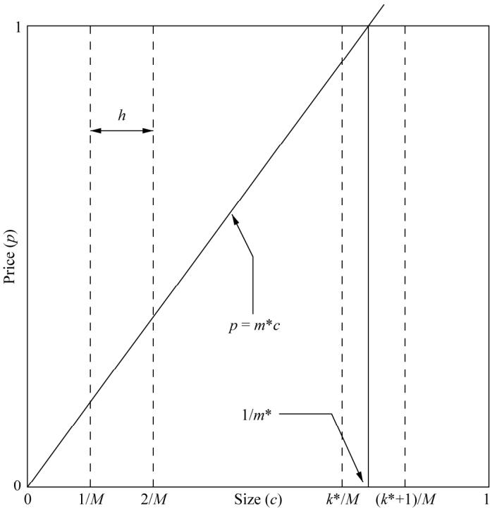
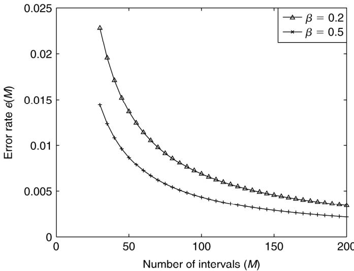
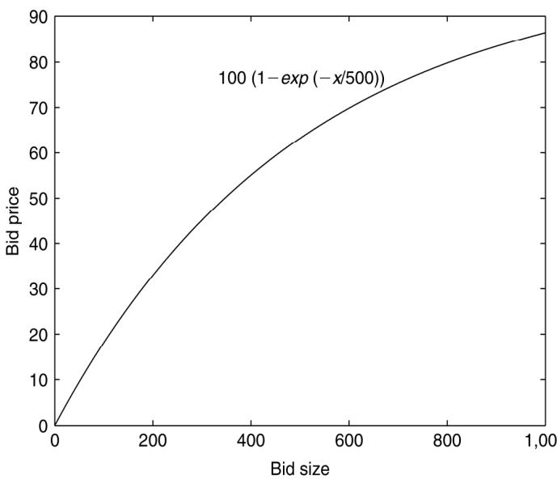
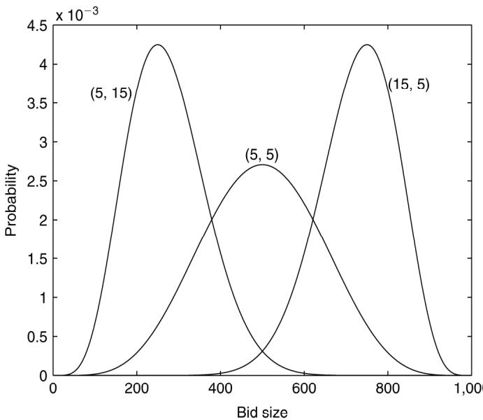

# ON UNBOUNDED ZERO-ONE KNAPSACK WITH DISCRETE-SIZED OBJECTS

K.I.-J. Ho,∗ J. Wu, $^ { * * }$ and J. Sum∗∗∗

# Abstract

This paper presents an approximated solution for an unbounded knapsack problem where the sizes of objects are discrete values:

$$
\begin{array} { l l } { \operatorname* { m a x } } & { z _ { n } ( M ) = \displaystyle \frac { 1 } { n } \sum _ { i = 1 } ^ { n } p _ { i } x _ { i } } \\ { \mathrm { s . t . } } & { \displaystyle \sum _ { i = 1 } ^ { n } c _ { i } x _ { i } \leq \beta _ { 0 } n } \\ & { x _ { i } \in \{ 0 , 1 \} \forall i = 1 , \ldots , n } \end{array}
$$

where $p _ { i } \mathrm { s }$ are the profits that are uniformly distributed random variables in [0,1]. The sizes $c _ { i } \mathbf { s }$ are discrete random variables which are distributed uniformly in $\{ 1 / M , 2 / M , \ldots , ( M - 1 ) / M , 1 \}$ . $z _ { n } ( M )$ is the total profit to be maximized. Assuming that $M$ is large, it is found that the optimal profit $z _ { n } ( M )$ is approximately equal to $\sqrt { 2 \beta _ { 0 } / 3 } ( 1 - 0 . 3 0 6 2 ( \sqrt { \beta _ { 0 } } M ) ^ { - 1 } )$ . An example from auction is used to explain and illustrate the use of the derived solution in estimating the profit.

# Key Words

Auction, E-Commerce, knapsack problems

# 1. Introduction

Suppose there are $n$ items to be packed in a knapsack with size proportional to the number of items, i.e., $\beta _ { 0 } n$ . While the $\imath$ th item (of size $0 \leq c _ { i } \leq 1$ ) has been packed, a profit $p _ { i }$ will be gained. Under such conditions, one would need to decide which items have to be packed to make the highest profit. This problem is a special case of the unbounded knapsack problem which can be stated as follows:

$$
\begin{array} { l l } { \operatorname* { m a x } } & { z _ { n } = \displaystyle \frac { 1 } { n } \sum _ { i = 1 } ^ { n } p _ { i } x _ { i } } \\ { \mathrm { s . t . } } & { \displaystyle \sum _ { i = 1 } ^ { n } c _ { i } x _ { i } \leq \beta _ { 0 } n } \\ & { x _ { i } \in \{ 0 , 1 \} \forall i = 1 , \ldots , n } \end{array}
$$

Here, the constant factor $\beta _ { 0 }$ is less than one, i.e., $0 < \beta _ { 0 } \le 1$ . $p _ { i }$ and $c _ { i }$ are respectively the profit and the length of the $_ i$ th item. It is assumed that $p _ { i }$ s and $c _ { i }$ s are random variables following a joint probability distribution defined by $f ( p , c )$ . By central limit theorem and let $n \longrightarrow \infty$ and $\beta _ { 0 } \leq 0 . 5$ , it has been shown in [1–3] that the optimal $z _ { n }$ is given by:

$$
\operatorname* { m a x } \{ z _ { n } \} = \int _ { 0 } ^ { 1 / m ^ { * } } \int _ { m ^ { * } c } ^ { 1 } p f ( p , c ) d p d c
$$

in which the value of $m ^ { * }$ is obtained by solving the following equation:

$$
\int _ { 0 } ^ { 1 / m ^ { * } } \int _ { m ^ { * } c } ^ { 1 } c f ( p , c ) d p d c = \beta _ { 0 }
$$

The essential idea is due to the relation that:

$$
\operatorname* { l i m } _ { n  \infty } { \frac { 1 } { n } } \sum _ { i = 1 } ^ { n } c _ { i } x _ { i } = \int _ { 0 } ^ { 1 / m ^ { * } } \int _ { m ^ { * } c } ^ { 1 } c f ( p , c ) d p d c
$$

where,

$$
\qquad x _ { i } ( p _ { i } , c _ { i } ) = { \left\{ \begin{array} { l l } { 1 } & { { \mathrm { i f ~ } } p _ { i } \geq m ^ { * } c _ { i } } \\ { 0 } & { { \mathrm { o t h e r w i s e } } } \end{array} \right. }
$$

The last equation is basically the decision determining the acceptance of an object in a knapsack, and it plays a crucial role in solving on-line knapsack problems [2–5].

In this short paper, we extend the work in [2] and [3] simply by considering that $c _ { i }$ s are discrete random variables uniformly distributed in $\{ 1 / M , 2 / M , \ldots , ( M - 1 ) / M , 1 \}$ . Beginning in Section 2, the motivation of the study and its relation with the multi-unit combinatorial auction will be presented. The approximated profit gain for the unbounded zero-one knapsack with discrete-sized objects will be derived in Section 3. An application of the approximated profit gain in a notebook auction problem will be illustrated in Section 4. Section 5 will discuss certain issues regarding the situation where the object size follows Beta distribution and the price function is a deterministic function. Finally, the conclusion of the paper will be presented in Section 6.

# 2. Background

Multi-units combinatorial auction (CA) [6, 7] has recently been researched within the e-commerce community for selling products [8], and has been extended to solve the problems in web services resource allocation [9, 10]. This auction mechanism is specially designed for selling a collection of products or services. In contrast with the conventional English auction in which products can only be auctioned one item or one unit at a time, CA allows bidders to bid for an entire subset of a collection.

# 2.1 A Problem in using CA

In theory, multi-units CA is an efficient mechanism since it can ensure maximum profit for a collection of products. It is more efficient because the allocation mechanism for multi-units CA is simply a combinatorial optimization problem. However, there are at least two reasons why CA has not yet commonly used in the auction industry.

The first reason is due to the fact that the expected profit being gained by using CA cannot be pre-computed. Without the estimation of profit, a seller can hardly compare from the performance of other selling mechanisms against anticipated efficient. Eventually, seller usually prefers other selling mechanism instead of CA. Also, without an estimation of profit, the auctioneer is unable to determine the management fee, by commission for instance, for organizing such an auction.

The second reason involves logistics. As it is more efficient pack and delivers multiple units at a time, restricting the bid size on discrete levels, say $\{ 2 0 , 4 0 , \dots , 1 , 0 0 0 \}$ , might reduce the total delivery cost and hence increase the net profit. Therefore, a seller would like to know the expected profit if the bid sizes are restricted to discrete levels and hence decide the allowable bid sizes. Very little extant research anticipates these concerns.

# 2.2 Profit Gain for Continuous $c _ { i }$ s [2, 3]

One useful result from [2, 3] establishes that the size of knapsack is proportional to the number of items it contains when the number of items is large. In this regard, the profits being gained by using either dynamic programming or profit-density-based greedy algorithms will be the same. The expected profit can thus be asymptotically expressed in terms of the joint probability distribution of the object size (c) and object price (p), $f ( p , c )$ , [2, 3].

Still, the expected profit can only be expressed analytically as in (2) and (3). Obtaining the exact values for $m ^ { * }$ and $z _ { n }$ , one needs to solve (2) and (3) numerically.

One special case is when both $p _ { i }$ s and $c _ { i }$ s are continuous random variables distributed uniformly in $[ 0 , 1 ]$ , i.e., $f ( p , c ) = 1$ for all $( p , c ) \in [ 0 , 1 ] ^ { 2 }$ . The optimal solution (expected profit) $\scriptstyle \operatorname* { l i m } _ { n \to \infty } { \hat { z } } _ { n }$ can be written as follows [2]:

$$
\begin{array} { r } { m ^ { * } = \sqrt { \frac { 1 } { 6 \beta _ { 0 } } } } \\ { \displaystyle \operatorname* { l i m } _ { n  \infty } \hat { z } _ { n } = \sqrt { \frac { 2 \beta _ { 0 } } { 3 } } } \end{array}
$$

for $\beta _ { 0 } \in ( 0 , 0 . 5 ]$

# 2.3 Practical Situation

The usefulness of the above result relies on the assumption that the product is divisible. However, many consumer products, like notebook and air cargo, are not divisible. Even if a product can be divided, it might be more costeffective (logistically) if only discrete sizes are allowed.

Let us have a simple example. Suppose an auctioneer has 1,000,000 units of notebook computers for auction. The auctioneer anticipates that 2,000 bidders will come. Moreover, the auctioneer also expects that their bid sizes are uniformly random in $\{ 1 , 2 , \ldots , 1 , 0 0 0 \}$ and the bid price is random variables uniformly distributed in $\{ 1 0 0 , 2 0 0 , \ldots , 1 0 0 , 0 0 0 \}$ . Accordingly, the average profit gain could be estimated as:

$$
{ \begin{array} { r l } & { 2 , 0 0 0 \times 1 0 0 , 0 0 0 \times { \hat { z } } _ { 2 0 0 0 } \approx 2 , 0 0 0 \times 1 0 0 , 0 0 0 \times { \sqrt { \frac { 2 ( 0 . 5 ) } { 3 } } } } \\ & { ~ = 1 1 5 . 4 7 \times 1 0 ^ { 6 } } \end{array} }
$$

As the quantized levels in both bid size and bid price are small, 0.001 and 0.001 respectively, the approximation is close to the actual value. However, it will be inaccurate if the quantized level is not small.

# 3. Average Profit Gain: Discrete cis

Let $M$ be the maximum size that a bidder will bid. The actual inequality constraint will be expressed as follows:

$$
{ \frac { 1 } { n } } \sum _ { i = 1 } ^ { n } c _ { i } M x _ { i } \leq \beta _ { 0 } M
$$

Here $c _ { i } M \in \{ 1 , 2 , \dots , M \}$ , is the actual bid size for the $_ i$ th bidder. Let $\scriptstyle \operatorname* { l i m } _ { n \to \infty } { \hat { z } } _ { n } ( M )$ be the optimal average profit gain,

$$
\operatorname* { l i m } _ { n \to \infty } \hat { z } _ { n } ( M ) \leq \operatorname* { l i m } _ { n \to \infty } \hat { z } _ { n }
$$

Equality holds when $M \to \infty$ . Besides, let us define the percentage error, $e ( M )$ , as follows:

$$
e ( M ) = { \frac { \operatorname* { l i m } _ { n  \infty } { \hat { z } } _ { n } - \operatorname* { l i m } _ { n  \infty } { \hat { z } } _ { n } ( M ) } { \operatorname* { l i m } _ { n  \infty } { \hat { z } } _ { n } } }
$$

We now consider the case that the probability distribution for the bid size $c$ , $P ( c )$ , is uniformly distributed in the set $\{ 1 / M , 2 / M , \ldots , 1 \}$ , i.e.,

$$
\begin{array} { r } { P ( c ) = \displaystyle \sum _ { k = 1 } ^ { M } \frac { 1 } { M } \delta ( c , k / M ) } \\ { \delta ( c , k / M ) = \left\{ \begin{array} { l l } { 1 } & { \mathrm { i f } c = k / M } \\ { 0 } & { \mathrm { o t h e r w i s e } } \end{array} \right. } \end{array}
$$

In practice, we assume that each bidder whose original bid size is in the range $[ j / M , ( j + 1 ) / M ] \ ( j = 0 , 1 , \ldots , M - 1 )$

  
Figure 1. The straight line $p { = } m ^ { * } c$ is the decision boundary for product allocation. All the bids $( p , c )$ above this line will be allocated.

will bid up to $( j + 1 ) / M$ . Therefore, the equality constraint in (3) can be written as follows:

$$
\sum _ { i = 1 } ^ { k ^ { * } } \left( 1 - i \frac { m ^ { * } } { M } \right) \left( \frac { i } { M ^ { 2 } } \right) = \beta _ { 0 }
$$

where $m ^ { * }$ is the slope of the straight line for the decision boundary (Fig. 1) and $m ^ { * }$ and $k ^ { * }$ can be related by the following inequality:

$$
\frac { k ^ { * } } { M } < \frac { 1 } { m ^ { * } } < \frac { k ^ { * } + 1 } { M }
$$

Solving (9), it is possible to obtain:

$$
\frac { k ^ { * } ( k ^ { * } + 1 ) } { 2 } - \frac { m ^ { * } } { M } \frac { k ^ { * } ( k ^ { * } + 1 ) ( 2 k ^ { * } + 1 ) } { 6 } = \beta _ { 0 } M ^ { 2 }
$$

As the number of bidders $n$ and the number of quantized intervals $M$ are large, it can be assumed that $k ^ { * } \gg 1$ and $m ^ { * } / M \approx 1 / k ^ { * }$ . Hence,

$$
k ^ { * } \approx \sqrt { 6 \beta _ { 0 } } ~ M
$$

The average profit gain $\scriptstyle \operatorname* { l i m } _ { n \to \infty } { \hat { z } } _ { n } ( M )$ can be written as follows:

$$
\begin{array} { l } { \displaystyle \operatorname* { l i m } _ { n \to \infty } \hat { z } _ { n } ( M ) = \sum _ { i = 1 } ^ { k ^ { * } } \frac { 1 } { M } \int _ { i / k ^ { * } } ^ { 1 } p d p } \\ { = \displaystyle \frac { 1 } { 2 M } k ^ { * } - \frac { 1 } { 6 M } k ^ { * } - \frac { 3 } { 1 2 M } - \frac { 1 } { 1 2 k ^ { * } M } } \\ { \approx \displaystyle \frac { 1 } { 3 M } k ^ { * } - \frac { 1 } { 4 M } } \end{array}
$$

As $k ^ { * } \approx \sqrt { 6 \beta _ { 0 } } ~ M$ ,

  
Figure 2. The error ratio $e ( M )$ against the number of intervals $M$ .

$$
\begin{array} { r } { \underset { n \longrightarrow \infty } { \underline { { \operatorname* { l i m } } } } \hat { z } _ { n } ( M ) \approx \sqrt { \frac { 2 \beta _ { 0 } } { 3 } } - \frac { 1 } { 4 M } } \\ { e ( M ) \approx \frac { 1 } { 4 M } \sqrt { \frac { 3 } { 2 \beta _ { 0 } } } } \end{array}
$$

(7) can thus be approximated by the following equation:

$$
e ( M ) \approx \sqrt { \frac { 3 } { 3 2 } } \frac { h } { \sqrt { \beta _ { 0 } } } = 0 . 3 0 6 2 \frac { 1 } { \sqrt { \beta _ { 0 } } M }
$$

Fig. 2 shows the cases where $\beta _ { 0 }$ equals 0.2 and 0.5 respectively. $M$ is taken to be greater than 40 as the approximation does not hold for small $M$ . Under these conditions, the percentage error is less than $1 \%$ even when the number of intervals is only 70.

# 4. Profit Gain for Notebook Auction

In the illustrative example mentioned earlier, we roughly estimated the average profit gain, $\scriptstyle \operatorname* { l i m } _ { n \to \infty } \operatorname* { l i m } _ { M \to \infty } { \hat { z } } ( M )$ , as $\textstyle { \sqrt { \frac { 2 ( 0 . 5 ) } { 3 } } }$ . In accordance with (12), the percentage error can thus be obtained.

$$
e ( M ) = 0 . 3 0 6 2 { \frac { 1 } { \sqrt { 0 . 5 } \ 1 0 0 0 } } = 4 . 3 3 \times 1 0 ^ { - 4 }
$$

which is less than $0 . 0 5 \%$ . A better estimation for the average profit gain can also be evaluated as follows:

$$
\begin{array} { l } { \displaystyle \operatorname* { l i m } _ { n \to \infty } \hat { z } ( M = 1 , 0 0 0 ) = ( 1 - 4 . 3 3 \times 1 0 ^ { - 4 } ) \sqrt { \frac { 2 ( 0 . 5 ) } { 3 } } } \\ { = 0 . 5 7 7 1 } \end{array}
$$

Using (12), we can determine the maximum integer of $M$ such that the percentage error is less than certain threshold $\eta$ .

$$
M \approx 0 . 3 0 6 2 \frac { 1 } { \sqrt { \beta _ { 0 } } \eta }
$$

  
Figure 3. Deterministic bid price.

For $\eta = 0 . 0 1$ and $\beta _ { 0 } = 0 . 2$ , it can readily be shown that $M \approx 6 9$ . For $\eta = 0 . 0 1$ and $\beta _ { 0 } = 0 . 5$ , $M \approx 4 4$ . For $M$ equals to 100 and $\beta _ { 0 }$ is in [0.2, 0.5], the percentage error is less than $1 \%$ .

Therefore, the profit gain of auction off 1,000,000 notebook computers by using multi-units CA can be estimated when anticipating that there are 2,000 bidders and their bid sizes are uniformly random in [1,1,000]. If the bid size is restricted to $\{ 2 0 , 4 0 , \dots , 1 , 0 0 0 \}$ , the expected profit gain will be $0 . 9 9 \times 1 1 5 . 4 7 \times 1 0 ^ { 6 }$ , i.e., $1 1 4 . 3 \times 1 0 ^ { 6 }$ . If the bid size is restricted to $\{ 5 0 , 1 0 0 , \ldots , 1 , 0 0 0 \}$ , the profit will be $0 . 9 7 8 \times 1 1 5 . 4 7 \times 1 0 ^ { 6 }$ , i.e., $1 1 3 \times 1 0 ^ { 6 }$ .

# 5. Discussion

Based on our simulated result, we have found that the profit error can be rather small for some special distributions for bid size and bid price. For example, we have addressed the situation where the bid price is a deterministic function (Fig. 3):

$$
p ( c ) = 1 0 0 \left( 1 - \exp \left( - \frac { c } { 5 0 0 } \right) \right) , \quad \forall c \in [ 1 , 1 , 0 0 0 ]
$$

This mimics the volume discount behaviour, i.e., the decreasing marginal utility behaviour [8]. The bid size is modelled as a Beta distribution defined as follows:

$$
\mathbf { P r o b } ( c ) = \frac { c ^ { a } ( 1 0 0 0 - c ) ^ { b } } { \int _ { 0 } ^ { 1 0 0 0 } c ^ { a } ( 1 0 0 0 - c ) ^ { b } d c }
$$

where the parameter $( a , b )$ are set to three cases: (5,5), (5,15), and (15,5) (Fig. 4). For $c$ is a continuous variable and the price function is deterministic, to determine the decision boundary (i.e., the value $m ^ { * }$ in the line $p { = } m ^ { * } c$ ) turns out to be a problem to determine a value $c ^ { * }$ that satisfies the following condition:

$$
\int _ { 0 } ^ { c ^ { * } } c { \bf P } { \bf r o b } ( c ) d c = \beta _ { 0 }
$$

  
Figure 4. Beta distribution for bid sizes.

Then, the decision for whether the $i$ th bid should be accepted is defined as follows:

$$
x _ { i } = { \left\{ \begin{array} { l l } { 1 } & { { \mathrm { i f ~ } } c _ { i } \leq c ^ { * } } \\ { 0 } & { { \mathrm { o t h e r w i s e } } } \end{array} \right. }
$$

We assume that there are 100,000 bidders and the range for the size to be bidded (i.e., c) is in [1, 1,000]. Two different values of $\beta _ { 0 }$ (0.2 and 0.5 respectively) and four different discrete levels where $M$ is equal to 10, 20, 50, $1 0 ^ { 3 }$ , and $1 0 ^ { 6 }$ are considered. As there is no simple close form solution for $c ^ { * }$ for which the probability density function is Beta distribution, we obtain the value by numerical method. The case where $M$ equals $1 0 ^ { 6 }$ mimics the situation when the object size $c$ is a continuous variable, instead of discrete. These results are treated as the basis for comparison. The average profit and profit ratio are depicted in Table 1.

If we assume the distribution is uniform and the percentage error is estimated by using (12), the profit error should be $6 . 8 5 \%$ , $3 . 4 2 \%$ , $1 . 3 7 \%$ , and $0 . 0 7 \%$ for $\beta = 0 . 2$ . And it should be $4 . 3 3 \%$ , 2.17%, $0 . 8 7 \%$ , and $0 . 0 4 \%$ for $\beta = 0 . 5$ . However, it is found that the profit error is smaller than that obtained using (12). Therefore, with only a small amount of information about the price distribution and the object size distribution, (12) can be used as a guideline to determine the value $M$ .

# 6. Conclusions

In this paper, we have discussed a number of practical issues regarding to the application of multi-units combinatorial auction and its relations to the unbounded knapsack problem. Extended from the work done by Lueker [2], the average profit gain for the unbounded knapsack problem with discrete-sized objects has been obtained. It has been shown that the average discrete-sized profit gain can be expressed as $\sqrt { 2 \beta _ { 0 } / 3 } ( 1 - 0 . 3 0 6 2 ( \sqrt { \beta _ { 0 } } M ) ^ { - 1 } )$ , for $0 < \beta _ { 0 } < 0 . 5$ and $M \gg 1$ . As multi-units combinatorial auction is a special case of the unbounded knapsack problem, the result is applied to determine the quantization level of the bid size in a notebook auction problem. A simulation, in which the bid price is a deterministic function of the bid size and the bid size follows Beta distribution, has been investigated and found that the actual percentage errors obtained by simulations are always smaller than the errors obtained by the derived formula.

Table 1 The Average Profit and Profit Ratio for Which the Bid Size Follows Uniform and Beta Distributions   

<table><tr><td rowspan=1 colspan=6>(Average profit for β0 = 0.2)</td></tr><tr><td rowspan=1 colspan=1>Distribution</td><td rowspan=1 colspan=1>M = 10</td><td rowspan=1 colspan=1>20</td><td rowspan=1 colspan=1>50</td><td rowspan=1 colspan=1>103</td><td rowspan=1 colspan=1>106</td></tr><tr><td rowspan=1 colspan=1>Uniform</td><td rowspan=1 colspan=1>0.0340</td><td rowspan=1 colspan=1>0.0346</td><td rowspan=1 colspan=1>0.0350</td><td rowspan=1 colspan=1>0.0353</td><td rowspan=1 colspan=1>0.0353</td></tr><tr><td rowspan=1 colspan=1>Beta(5, 15)</td><td rowspan=1 colspan=1>0.0317</td><td rowspan=1 colspan=1>0.0316</td><td rowspan=1 colspan=1>0.0317</td><td rowspan=1 colspan=1>0.0316</td><td rowspan=1 colspan=1>0.0316</td></tr><tr><td rowspan=1 colspan=1>Beta(5, 5)</td><td rowspan=1 colspan=1>0.0274</td><td rowspan=1 colspan=1>0.0276</td><td rowspan=1 colspan=1>0.0277</td><td rowspan=1 colspan=1>0.0277</td><td rowspan=1 colspan=1>0.0277</td></tr><tr><td rowspan=1 colspan=1>Beta(15, 5)</td><td rowspan=1 colspan=1>0.0223</td><td rowspan=1 colspan=1>0.0227</td><td rowspan=1 colspan=1>0.0226</td><td rowspan=1 colspan=1>0.0226</td><td rowspan=1 colspan=1>0.0226</td></tr></table>

(Average profit for $\beta _ { 0 } = 0 . 5$ )   

<table><tr><td rowspan=1 colspan=1>Distribution</td><td rowspan=1 colspan=1>M = 10</td><td rowspan=1 colspan=1>20</td><td rowspan=1 colspan=1>50</td><td rowspan=1 colspan=1>103</td><td rowspan=1 colspan=1>106</td></tr><tr><td rowspan=1 colspan=1>Uniform</td><td rowspan=1 colspan=1>0.0716</td><td rowspan=1 colspan=1>0.0727</td><td rowspan=1 colspan=1>0.0735</td><td rowspan=1 colspan=1>0.0736</td><td rowspan=1 colspan=1>0.0736</td></tr><tr><td rowspan=1 colspan=1>Beta(5, 15)</td><td rowspan=1 colspan=1>0.0768</td><td rowspan=1 colspan=1>0.0767</td><td rowspan=1 colspan=1>0.0767</td><td rowspan=1 colspan=1>0.0767</td><td rowspan=1 colspan=1>0.0767</td></tr><tr><td rowspan=1 colspan=1>Beta(5, 5)</td><td rowspan=1 colspan=1>0.0627</td><td rowspan=1 colspan=1>0.0626</td><td rowspan=1 colspan=1>0.0626</td><td rowspan=1 colspan=1>0.0625</td><td rowspan=1 colspan=1>0.0625</td></tr><tr><td rowspan=1 colspan=1>Beta(15, 5)</td><td rowspan=1 colspan=1>0.0528</td><td rowspan=1 colspan=1>0.0533</td><td rowspan=1 colspan=1>0.0533</td><td rowspan=1 colspan=1>0.0533</td><td rowspan=1 colspan=1>0.0533</td></tr></table>

(Profit ratio cf. $M = 1 0 ^ { 6 }$ for $\beta _ { 0 } = 0 . 2$ )   

<table><tr><td rowspan=1 colspan=1>Distribution</td><td rowspan=1 colspan=1>M = 10</td><td rowspan=1 colspan=1>20</td><td rowspan=1 colspan=1>50</td><td rowspan=1 colspan=1>103</td><td rowspan=1 colspan=1>106</td></tr><tr><td rowspan=1 colspan=1>Uniform</td><td rowspan=1 colspan=1>0.9627</td><td rowspan=1 colspan=1>0.9790</td><td rowspan=1 colspan=1>0.9918</td><td rowspan=1 colspan=1>1.0000</td><td rowspan=1 colspan=1>1.0000</td></tr><tr><td rowspan=1 colspan=1>Beta(5, 15)</td><td rowspan=1 colspan=1>1.0017</td><td rowspan=1 colspan=1>0.9995</td><td rowspan=1 colspan=1>1.0007</td><td rowspan=1 colspan=1>1.0000</td><td rowspan=1 colspan=1>1.0000</td></tr><tr><td rowspan=1 colspan=1>Beta(5, 5)</td><td rowspan=1 colspan=1>0.9886</td><td rowspan=1 colspan=1>0.9985</td><td rowspan=1 colspan=1>1.0005</td><td rowspan=1 colspan=1>1.0000</td><td rowspan=1 colspan=1>1.0000</td></tr><tr><td rowspan=1 colspan=1>Beta(15, 5)</td><td rowspan=1 colspan=1>0.9878</td><td rowspan=1 colspan=1>1.0049</td><td rowspan=1 colspan=1>0.9998</td><td rowspan=1 colspan=1>1.0000</td><td rowspan=1 colspan=1>1.0000</td></tr></table>

(Profit ratio cf. $M = 1 0 ^ { 6 }$ for $\beta _ { 0 } = 0 . 5$ )   

<table><tr><td rowspan=1 colspan=1>Distribution</td><td rowspan=1 colspan=1>M = 10</td><td rowspan=1 colspan=1>20</td><td rowspan=1 colspan=1>50</td><td rowspan=1 colspan=1>103</td><td rowspan=1 colspan=1>106</td></tr><tr><td rowspan=1 colspan=1>Uniform</td><td rowspan=1 colspan=1>0.9729</td><td rowspan=1 colspan=1>0.9884</td><td rowspan=1 colspan=1>0.9993</td><td rowspan=1 colspan=1>1.0000</td><td rowspan=1 colspan=1>1.0000</td></tr><tr><td rowspan=1 colspan=1>Beta(5, 15)</td><td rowspan=1 colspan=1>1.0009</td><td rowspan=1 colspan=1>0.9995</td><td rowspan=1 colspan=1>1.0002</td><td rowspan=1 colspan=1>1.0000</td><td rowspan=1 colspan=1>1.0000</td></tr><tr><td rowspan=1 colspan=1>Beta(5, 5)</td><td rowspan=1 colspan=1>1.0031</td><td rowspan=1 colspan=1>1.0010</td><td rowspan=1 colspan=1>1.0003</td><td rowspan=1 colspan=1>1.0000</td><td rowspan=1 colspan=1>1.0000</td></tr><tr><td rowspan=1 colspan=1>Beta(15, 5)</td><td rowspan=1 colspan=1>0.9908</td><td rowspan=1 colspan=1>1.0000</td><td rowspan=1 colspan=1>1.0001</td><td rowspan=1 colspan=1>1.0000</td><td rowspan=1 colspan=1>1.0000</td></tr></table>

# Список литературы

[1] T.-C. Lai, Worst-case analysis of greedy algorithms for the unbounded knapsack, subset-sum and partition problems, $O p$ - erations Research Letters, 14, 1993, 215–220.   
[2] G.S. Lueker, Average-case analysis of off-line and on-line

knapsack problems, Journal of Algorithms, 29, 1998, 277–305.

[3] A. Marchetti-Spaccamela & C. Vercellis, Stochastic on-line knapsack problems, Mathematical Programming, 68, 1995, 73–104.   
[4] D. Chakrabarty, Y. Zhou, & R. Lukose, Budget constrained bidding in keyword auctions and online knapsack problems, WWW2007, May 2007, 8–12.   
[5] A.J. Kleywegt & J.D. Papastavriou, The dynamic and stochastic knapsack problem, Operations Research, 46 (1), 1998, 17– 35.   
[6] V. Krishna, Auction theory (New York: Academic Press, 2002).   
[7] E.S. Maskin & J.G. Riley, Optimal multi-unit auctions, The Economics of Missing Markets, Information, and Games, (New York: Oxford University Press, 1989).   
[8] B. Lehmann, D. Lehmann, & N. Nisan, Combinatorial auctions with decreasing marginal utilities, Proc. 3rd ACM Conf. on Electronic Commerce, Tampa, Florida, 2001, 18–28.   
[9] J. Sum, J. Wu, & C. Leung, On profit density based greedy algorithm for a resource allocation problem in web services, International Journal of Computers and Applications, ${ \mathcal { Q } } 9 ( 2 )$ , 2007.   
[10] J. Sum, K. Ho, & G. Young, Pricing web services, in Y.-C. Chung & J.E. Moreira (Eds.), Advances in grid & pervasive computing, (Berlin, Heidelberg: Springer LNCS No.3947, 2006), 147–156.

# Appendix: MATLAB Code for the example in Section 5

$\tt M M = 2 0$ ;  
$\mathtt { R } =$ zeros(MM,100);  
$\mathtt { T } = 5 0 0$ ;  
$\mathtt { n } = 1 0 0 0 0$ ;  
$\mathtt { b } = 0 . 2$ ;  
pmax $= 1 0 0$ ;  
$\mathtt { k } = \mathtt { b } \ast \mathtt { n } \ast 1 0 0 0$ ;

for repeat $= 1 { : } 1 0 0$ , $\mathbf { r } =$ round(1000\*betarnd(15,5,n,1)); $\mathfrak { p } = \mathtt { p m a x } \ast ( \mathtt { 1 } \mathrm { - e x p } ( \mathrm { - r / T } ) )$ ;

[yr ir] = sort(p./r);   
$\mathtt { k t m p } = 0 ; \mathtt { t } = 1 ; \mathtt { z } = 0 ;$   
while $\left( \mathtt { k t m p } < \mathtt { k } \right)$ ) z = z + p(ir(t)); ktmp $=$ ktmp + r(ir(t)); $\mathtt { t } = \mathtt { t } + 1$ ;   
end   
for $\mathtt { m m } = 1 : \mathbb { M } \mathbb { M }$ , $\mathtt { M } = 5 { * } \mathtt { m m }$ ; $\mathrm { \ r d = \ r o u n d ( r / M ) * M ; }$ . $\mathrm { p d } = \mathrm { p m a x } * \left( 1 \mathrm { - e x p } \left( \mathrm { - r d / T } \right) \right) \mathrm { ; }$ ; [yd i ${ \mathrm { d } } ] = { \mathsf { s c } }$ ort $\left( \mathrm { p d . } / \mathrm { r d } \right)$ ; $\mathtt { k t m p } = 0 ; \mathtt { t } = 1 ; \mathtt { z d } = 0 ;$ while $( \mathtt { k t m p } < \mathtt { k }$ ) $\mathsf { z d } = \mathsf { z d } + \mathsf { p d } ( \mathrm { i } \mathsf { r } ( \pm ) )$ ; $\begin{array} { l } { { \mathrm { k t m p } = \mathrm { k t } \mathrm { \dot { m p } + \mathrm { r d } ( \mathrm { i } r ( t ) ) ; } } } \\ { { \mathrm { t } = \mathrm { t } + 1 ; } } \end{array}$ end $\operatorname { R } ( { \mathrm { m m } } , { \mathrm { r e p e a t } } ) = { \sf z d } / { \sf z } ;$   
end   
end

# Biographies

Kevin I.-J. Ho received his B.S. in Computer Engineering from the National Chiao Tung University (Taiwan) in 1983. From 1985 to 1987, he was an assistant engineer in the Institute of Information Industry, Taiwan. Then, he received his M.S. and Ph.D. in Computer Science from the University of Texas at Dallas in 1990 and 1992, respectively. Currently, he is an associate professor of the

Department of Computer Science & Communication Engineering, Providence University (Taiwan). His current research interests include image processing, algorithm design and analysis, neural computation, scheduling theory, and computer networks.

Jie $W u$ is a distinguished professor in the Department of Computer Science and Engineering at Florida Atlantic University and a program director at the US National Science Foundation. He has published more than 300 papers in various journals and conference proceedings. His research interests include mobile computing, routing protocols, fault-tolerant computing, and interconnection networks. He served as program vice chair for the 2000 International Conference on Parallel Processing (ICPP), program vice chair for the 2001 IEEE International Conference on Distributed Computing Systems (ICDCS), and general chair for the 2008 IEEE International Parallel and Distributed Processing Symposium (IPDPS). He is a program co-chair for the IEEE First International Conference on Mobile Ad-Hoc and Sensor Systems (MASS ’04).

He was a co-guest editor of a special issue in Computer on ad hoc networks. He was also an editor of several special issues of the Journal of Parallel and Distributing Computing (JPDC) and IEEE Transactions on Parallel and Distributed Systems (TPDS). He is the author of the text Distributed System Design (CRC, 1998) and is the editor of the text Handbook on Theoretical and Algorithmic Aspects of Sensor, Ad Hoc Wireless, and Peer-to-Peer Networks (Auerbach, 2005). He served as an associate editor of the IEEE Transactions on Parallel and Distributed Systems and is currently on the editorial board of several international journals. He is a recipient of the 1996–1997, 2001–2002, and 2006–2007 Researcher of the Year Awards at Florida Atlantic University. He served as an IEEE Computer Society distinguished visitor and is the chairman of IEEE Technical Committee on Distributed Processing (TCDP). He is a senior member of the IEEE.

John Sum received his B.E. degree in Electronics Engineering from the Hong Kong Polytechnic University in 1992, and M.Phil. and Ph.D. in Computer Science Engineering from the Chinese University of Hong Kong in 1995 and 1998, respectively. John spent 6 years teaching in several universities in Hong Kong, including the Hong Kong Baptist University, the Open University of Hong Kong, and the Hong Kong Polytechnic University. In 2005, John moved to Taiwan and started to teach in Chung Shan Medical University. Currently, he is an assistant professor in the Institute of E-Commerce, the National Chung Hsing University, Taichung ROC. His research interests include neural computation, mobile sensor networks, and scale-free network. He is a senior member of IEEE and an associate editor of the International Journal of Computers and Applications.

