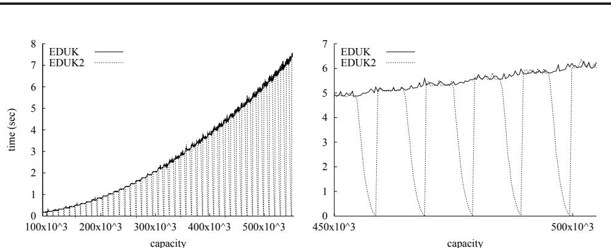
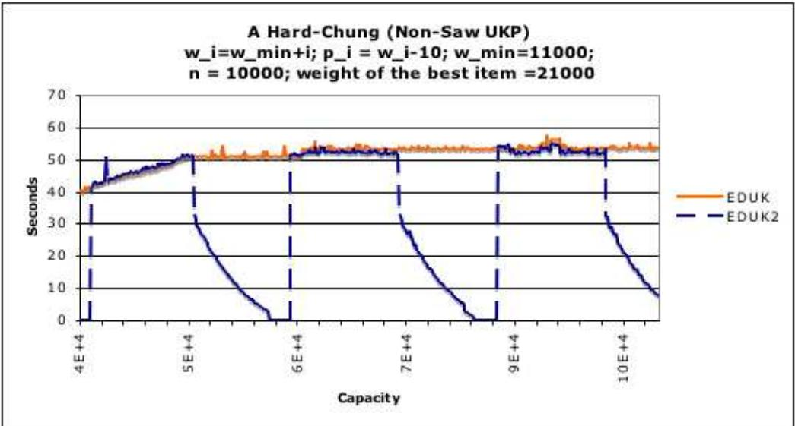
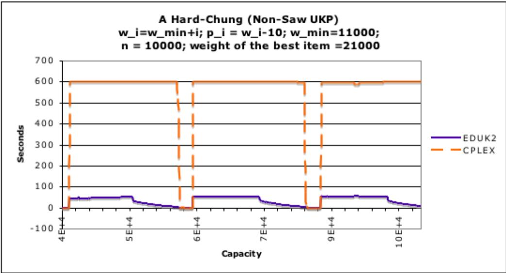
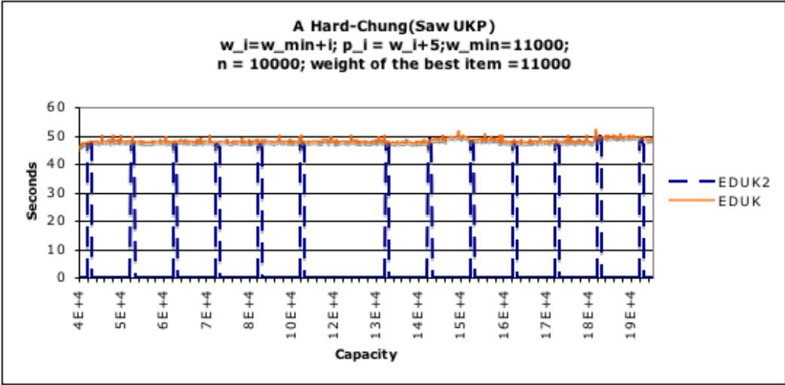
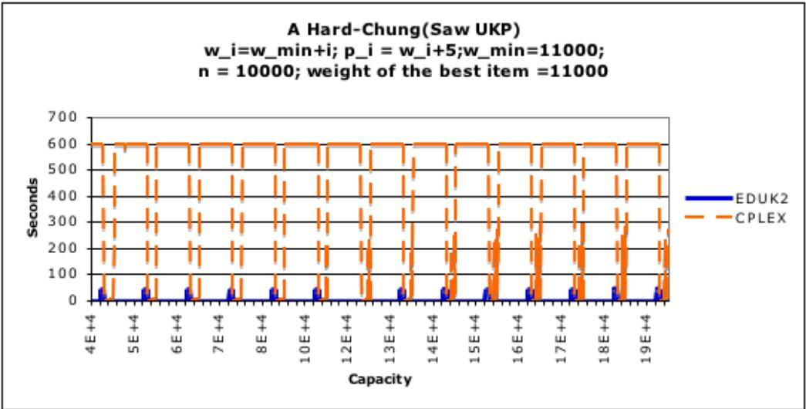
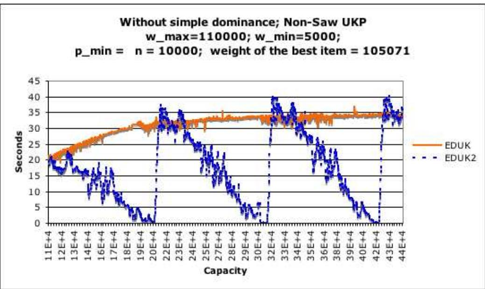
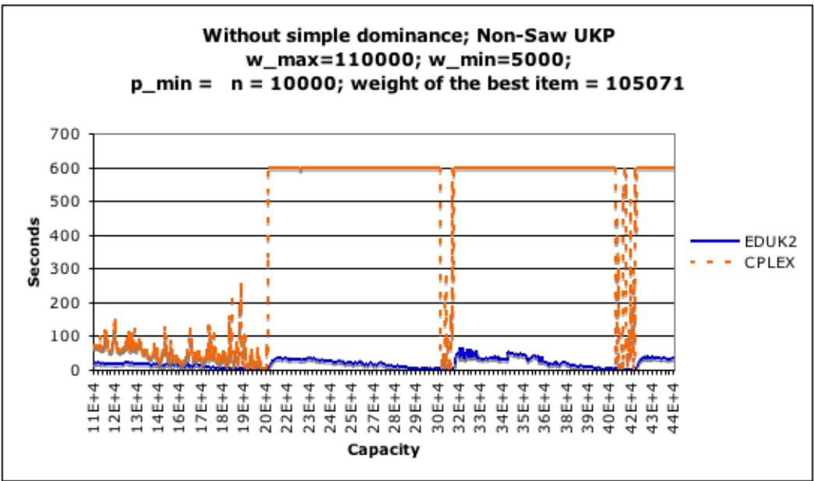
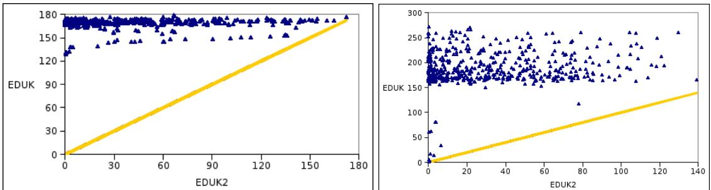

# A Hybrid Algorithm for the Unbounded Knapsack Problem

Vincent Poirriez a Nicola Yanev $^ \mathrm { b }$ Rumen Andonov c,\*

a LAMIH/ROI UMR CNRS 8530, University of Valenciennes, Le Mont Houy, 59313 Valenciennes Cedex 9, France

Facult o Mathematic and Informatic, University fSofa, 116 Sofa, 5 Jmes Bourchier Blvd., Bulgaria

cINRIA Rennes-Bretagne Atlantique and University of Rennes 1, Campus de Beaulieu, 35042 Rennes Cedex, France

# Abstract

This paper presents a new approach for exactly solving the Unbounded Knapsack Problem (UKP) and proposes a new bound that was proved to dominate the previous bounds on a special class of UKP instances. Integrating bounds within the framework of sparse dynamic programming led to the creation of an efficient and robust hybrid algorithm, called EDUK2. This algorithm takes advantage of the majority of the known properties of UKP, particularly the diverse dominance relations and the important periodicity property. Extensive computational results show that, in all but a very few cases, EDUK2 significantly outperforms both MTU2 and EDUK, the currently available UKP solvers, as well the well-known general purpose mathematical programming optimizer CPLEX of ILOG. These experimental results demonstrate that the class of hard UKP instances needs to be redefined, and the authors offer their insights into the creation of such instances.

Key words: Combinatorial Optimization, Integer Programming, Knapsack problem, Branch and Bound, Dynamic programming, Algorithm Engineering

# 1 Introduction

The knapsack problem is one of the most popular combinatorial optimization problems. Its unbounded version, UKP (also called the integer knapsack), is formulated as follows: there is a knapsack of a capacity $c > 0$ and $n$ types of items. Each

item of type $i \in I = \{ 1 , 2 , . . . n \}$ has a profit, $p _ { i } > 0$ ,and a weight, $w _ { i } > 0$ Set $N = \{ ( p _ { i } , w _ { i } ) , i \in I \}$ and let w, $\mathbf { p }$ denote vectors of size $n$ The problem, $\mathbf { U K P } _ { \mathbf { w } , \mathbf { p } } ^ { c } .$ . is to fllthe knapsack in an optimal way, which is done by solving

$$
f ( N , c ) \equiv f ( \mathbf { w } , \mathbf { p } , c ) = \operatorname* { m a x } \left\{ \mathbf { p x } { \mathrm { ~ s u b j e c t ~ t o ~ } } \mathbf { w x } \leq c , \mathbf { x } \in Z _ { + } ^ { n } \right\}
$$

where $Z _ { + } ^ { n }$ is the set of nonnegative integral $n$ -dimensional vectors.

Many of this problem's properties have been discovered over the last three decades: [1,4,6,11,10,14], but no existing solver has yet been developed that benefits from all of them. A detailed and comprehensive state-of-the art discussion the interested reader can find in the recent monograph [12].

In this paper we introduce a new upper bound and determine a UKP family for which this bound is the tightest one known. We also design a new algorithm that combines dynamic programming and branch-and-bound methods to solve UKP. To the best of our knowledge this is the first time that such an approach has been used for UKP. Extensive computational experiments demonstrate the effectiveness of embedding a branch-and-bound algorithm into a dynamic programming framework. These results also shed light on the case of really hard UKP instances.

A hybrid algorithm, combining dynamic programming and branch-and-bound approaches has been proposed in [8] for the $0 / 1$ knapsack problem, and in [9] for the case of the subset-sum problem. The adjective "hybrid" was also used for knapsack problem algorithms in [13] (0/1 knapsack problem) and [3] (0/1 multidimensional knapsack problem), but this is another kind of hybridization.

The paper is organized as follows. Section 2 briefly summarizes the basic properties of the problem. Section 3 presents a new upper bound and the associated class of instances where it is stronger than the previously known bounds. Section 4 is dedicated to the description of EDUK2, a new algorithm that takes advantage of all known dominance relations and successfully combines them with a variety of bounds 1 . In Section 5 this algorithm is compared with other available solvers. In Section 6 we conclude.

# 2 A summary of known dominance relations and bounds

The dominance relations between items and bounds allow the size of the search space to be significantly reduced. All the dominance relations, enumerated below,

could be derived by the following inequalities:

$$
\sum _ { j \in J } w _ { j } x _ { j } \le \alpha w _ { i } , \mathrm { ~ a n d ~ } \sum _ { j \in J } p _ { j } x _ { j } \ge \alpha p _ { i } \mathrm { ~ f o r ~ s o m e ~ } \mathbf { x } \in Z _ { + } ^ { n }
$$

where $\alpha \in Z _ { + }$ $J \subseteq I$ and $i \not \in J$ .

( Dominances

(a)Collective Dominance [1,17]. The $i$ -th item is collectively dominated by $J$ ,written as $i \ \ll \ J$ iff (2) hold when $\alpha = 1$ .The verification of this dominance is computationally hard, so it can be used in a dynamic programming approach only. To the best of our knowledge EDUk (Efficient Dynamic programming for UKP) [1] is the only one that makes practical use of this property.

( Threshold Dominance [1]. The $i$ -th item is threshold dominated by $J$ written as $i \prec J$ iff (2) hold when $\alpha \geq 1$ This is an obvious generalization of the previous dominance by using instead of single item $i$ a compound one, say $\alpha$ times item $i$ The smallest such $\alpha$ defines the threshold of the item $i$ ,written $t _ { i }$ ,as $t _ { i } = ( \alpha - 1 ) w _ { i }$ .

The lightest item of those with the greatest profit/weight ratio is called best item, written as $b$ One can trivially show that $t _ { i } ~ \le ~ w _ { b } w _ { i }$ or even sharper inequality $t _ { i } \le l c m ( w _ { b } , w _ { i } )$ where $l c m ( w _ { b } , w _ { i } )$ is the least common multiple of $w _ { i }$ and $w _ { b }$ .

(c) Multiple Dominance [10]. Item $i$ is multiply dominated by $j$ ,written as $i \ll _ { m } j$ iff for $J = \{ j \} , \alpha = 1$ $\begin{array} { r } { x _ { j } = \lfloor \frac { w _ { i } } { w _ { j } } \rfloor } \end{array}$ the relations (2) hold.

This dominance could be efficiently used in a preprocessing because it can be detected relatively easily.

(d) Modular Dominance [17]. Item $i$ is modularly dominated by $j$ ,written as $i \ll \equiv j$ iff for $J = \{ b , j \} , \alpha = 1 , w _ { j } = w _ { i } + t w _ { b } , t \leq 0 \mathrm { ~ }$ $x _ { b } = - t , x _ { j } =$ 1 the inequalities (2) hold.

Bounds

$U _ { 3 }$ [10] : It is assumed that the first three items are of the largest profit/weight ratio. Let us set

$$
\begin{array} { r l r } & { } & { \bar { c } = c \bmod w _ { 1 } ; c ^ { \prime } = \bar { c } \bmod w _ { 2 } ; z ^ { \prime } = \left\lfloor \frac { c } { w _ { 1 } } \right\rfloor p _ { 1 } + \left\lfloor \frac { \bar { c } } { w _ { 2 } } \right\rfloor p _ { 2 } } \\ & { } & { U ^ { 0 } = z ^ { \prime } + \left\lfloor \frac { c ^ { \prime } p _ { 3 } } { w _ { 3 } } \right\rfloor ; ~ } \\ & { } & { \bar { U } ^ { 1 } = z ^ { \prime } + \left\lfloor \left( c ^ { \prime } + \left\lceil \frac { w _ { 2 } - c ^ { \prime } } { w _ { 1 } } \right\rceil w _ { 1 } \right) \frac { p _ { 2 } } { w _ { 2 } } - \left\lceil \frac { w _ { 2 } - c ^ { \prime } } { w _ { 1 } } \right\rceil p _ { 1 } \right\rfloor . ~ } \end{array}
$$

The following bound holds

$$
U _ { 3 } = \mathrm { m a x } \{ U ^ { 0 } , \bar { U } ^ { 1 } \} .
$$

$\begin{array} { r } { U _ { s } \left[ 4 \right] : U _ { s } = c + \left\lfloor \frac { c } { w _ { 1 } } \right\rfloor \alpha , } \end{array}$ where item 1 is supposed to be the lightest one. It could be easily shown that this bound is valid (but could be very weak) for arbitrary UKP with $\alpha$ such that $p _ { i } \ \leq \ w _ { i } + \alpha .$ It is proved in [4] that this bound is stronger than $U _ { 3 }$ for the class of strongly correlated UKP (SCUKP) defined as $p _ { i } = w _ { i } + \alpha$ where $\alpha > 0$ The case $\alpha = 0$ corresponds to the so called Subset Sum Problem (SS-UKP) where $p _ { i } = w _ { i }$ .

$U _ { v }$ [15] 2: $\begin{array} { r } { U _ { v } = c + \operatorname* { m a x } \left\{ \frac { ( p _ { i } - w _ { i } ) } { \lfloor \frac { w _ { i } } { w _ { 1 } } \rfloor } , i \in I \right\} \left\lfloor \frac { c } { w _ { 1 } } \right\rfloor } \end{array}$ Here again item 1 is supposed to be the lightest one. This bound is stronger than $U _ { 3 }$ for a special class of UKP (namely SAW-UKP see Definition 1 below).

# 3 A new general upper bound for UKP

In the following paragraphs, we introduce a new upper bound for the UKP and show that it improves $U _ { v }$ and is not comparable to $U _ { 3 }$ in the general case. For the special UKP family, the SAW-UKP, which includes the SC-UKP class (with $\alpha \geq 0$ , this new bound is tighter than the previously known bounds.

Without losing generality it is assumed in this section that: $I$ is the lightest item within the set of items with $\left( p _ { i } - w _ { i } \right) > 0$ (i.e. $\forall i > 1$ , $w _ { 1 } \leq w _ { i }$ or $p _ { i } \ \leq \ w _ { i } ,$ and $p _ { 1 } ~ > ~ w _ { 1 }$ (If all $p _ { i } - w _ { i } \leq 0$ then assume 1 is the item with the best ratio and by changing $\mathbf { p }$ to $\psi \mathbf { p } , \psi > \frac { w _ { 1 } } { p _ { \perp } }$ ,we will achieve the oal. If such an equivalent transformation is done, the bound should be divided by $\psi$ ). It is also assumed that no item is multiply dominated. Let us define the following terms:

$$
\begin{array} { r l } & { \mathrm { ~ f o r ~ } k \mathrm { ~ f i x e d , ~ f o r ~ a l l ~ } i \neq k , q _ { k } ^ { i } = \frac { p _ { i } - p _ { k } \left\lfloor \frac { w _ { i } } { w _ { k } } \right\rfloor } { w _ { i } - w _ { k } \left\lfloor \frac { w _ { i } } { w _ { k } } \right\rfloor } , q _ { k } ^ { * } = \operatorname* { m a x } _ { i \neq k } \left\{ q _ { k } ^ { i } \right\} , } \\ & { \tau _ { 1 } ^ { * } = \operatorname* { m i n } \left\{ 1 , q _ { 1 } ^ { * } \right\} , \beta _ { 1 } ( \tau ) = \operatorname* { m a x } _ { i \in I } \left\{ \frac { p _ { i } - \tau w _ { i } } { \left\lfloor \frac { w _ { i } } { w _ { 1 } } \right\rfloor } \right\} , \beta _ { 1 } ^ { * } = \beta ( \tau _ { 1 } ^ { * } ) . } \end{array}
$$

Theorem 1 $U _ { \tau ^ { * } } ]$ for all $\begin{array} { r } { U K P _ { \mathbf { w } , \mathbf { p } } ^ { c } , f ( \mathbf { w } , \mathbf { p } , c ) \leq U _ { \tau ^ { * } } = \tau _ { 1 } ^ { * } c + \beta _ { 1 } ^ { * } \left\lfloor \frac { c } { w _ { 1 } } \right\rfloor \leq U _ { v } } \end{array}$

Proof: First, for any fixed $\tau \geq 0$ ,

$$
\begin{array} { r } { \operatorname* { m a x } \{ \mathbf { p x } , \mathbf { w x } \leq c , \mathbf { x } \in Z _ { + } ^ { n } \} = \operatorname* { m a x } \{ \tau \mathbf { w x } + ( \mathbf { p } - \tau \mathbf { w } ) \mathbf { x } , \mathbf { w x } \leq c , \mathbf { x } \in Z _ { + } ^ { n } \} } \\ { \leq \tau c + \operatorname* { m a x } \{ ( \mathbf { p } - \tau \mathbf { w } ) \mathbf { x } , \mathbf { w x } \leq c , \mathbf { x } \in Z _ { + } ^ { n } \} \quad } \end{array}
$$

$$
\tau _ { 1 } ^ { * } = q _ { 1 } ^ { * } \leq \tau \leq 1 \colon \mathrm { ~ i n ~ t h i s ~ c a s e , ~ } q _ { 1 } ^ { * } = \operatorname* { m a x } _ { i \neq 1 } \left\{ \frac { p _ { i } - p _ { 1 } \left\lfloor \frac { w _ { i } } { w _ { 1 } } \right\rfloor } { w _ { i } - w _ { 1 } \left\lfloor \frac { w _ { i } } { w _ { 1 } } \right\rfloor } \right\} \leq \tau
$$

and therefore

$$
{ \mathrm { f o r ~ a l l ~ } } i , p _ { i } - \tau w _ { i } \leq \left\lfloor { \frac { w _ { i } } { w _ { 1 } } } \right\rfloor ( p _ { 1 } - \tau w _ { 1 } ) .
$$

Relation (5) means that in $\mathrm { U K P } _ { \mathbf { w } , ( \mathbf { p } - \tau \mathbf { w } ) } ^ { c }$ all items $i$ are multiply dominated by the item 1, and also that $\beta _ { 1 } ( \tau ) = p _ { 1 } - \tau w _ { 1 }$ Thus, $\operatorname* { m a x } \{ ( \mathbf { p } - \tau \mathbf { w } ) \mathbf { x }$ , $\mathbf { w x } \leq c , \mathbf { x } \in$ $\begin{array} { r } { Z _ { + } ^ { n } \} = \beta _ { 1 } ( \tau ) \left\lfloor \frac { c } { w _ { 1 } } \right\rfloor } \end{array}$

The function $\begin{array} { r } { u _ { 1 } ( \tau ) = \tau c + ( p _ { 1 } - \tau w _ { 1 } ) \left\lfloor \frac { c } { w _ { 1 } } \right\rfloor } \end{array}$ is an increasing function, and its minimum is reached for $\tau = \tau _ { 1 } ^ { * }$ .This proves both inequalities of the theorem as $U _ { v } = u _ { 1 } ( 1 )$ and $U _ { \tau ^ { * } } = u _ { 1 } ( \tau _ { 1 } ^ { * } )$ .

Case $q _ { 1 } ^ { * } > 1 = \tau _ { 1 } ^ { * }$ : in this case,

$$
\Sigma _ { i = 1 } ^ { n } ( p _ { i } - w _ { i } ) x _ { i } \leq \beta _ { 1 } ^ { * } \Sigma _ { i = 1 } ^ { n } \left\lfloor { \frac { w _ { i } } { w _ { 1 } } } \right\rfloor x _ { i } \leq \beta _ { 1 } ^ { * } \left\lfloor \Sigma _ { i = 1 } ^ { n } { \frac { w _ { i } x _ { i } } { w _ { 1 } } } \right\rfloor \leq \beta _ { 1 } ^ { * } \left\lfloor { \frac { c } { w _ { 1 } } } \right\rfloor
$$

and $\begin{array} { r } { U _ { \tau ^ { * } } = U _ { v } = c + \beta _ { 1 } ^ { * } \left\lfloor \frac { c } { w _ { 1 } } \right\rfloor } \end{array}$

Let us set $u u ( \tau ) = \tau c + f ( \mathbf { w } , \mathbf { p } - \tau \mathbf { w } , c )$ (defined for $\tau \geq 0$ ). We have $f ( \mathbf { w } , \mathbf { p } , c ) =$ $u u ( 0 )$ .Furthermore, it follows from (4) that $f ( \mathbf { w } , \mathbf { p } , c )$ is upper-bounded by $u u ( \tau )$ , which is a nondecreasing piece-wise linear convex function. One known point on its graphics is at $\begin{array} { r } { \tau _ { b } \ = \ \frac { p _ { b } } { w _ { b } } } \end{array}$ p $( \tau , u u ( \tau ) )$ $\tau < \tau _ { b }$ In the first case of the proof, $q _ { 1 } ^ { * } \leq 1$ ,such a point is given by $( q _ { 1 } ^ { * } , u u ( q _ { 1 } ^ { * } ) )$ . When $q _ { 1 } ^ { * } > 1$ (far from the target $\tau = 0$ )we can overestimate $u u ( \tau )$ in a point closer to 0, (say $\tau = 1$ ). Such an estimate is done in the case 2 from above, but it is quite rough (because of overestimating the $p - \tau w$ coefficients and in the rounding operation $\begin{array} { r } { \big \lfloor \sum \frac { w _ { i } x _ { i } } { w _ { 1 } } \big \rfloor } \end{array}$ instead of $\textstyle \sum \lfloor { \frac { w _ { i } x _ { i } } { w _ { 1 } } } \rfloor .$ .

Another approach is demonstrated in the theorem below, with the main idea to "visualize" the graphics of $u u ( \tau )$ from the left of the point $\begin{array} { r } { \frac { p _ { b } } { w _ { b } } } \end{array}$ This is done by changing the role of item 1 with item $k$ where $k$ is such that $\begin{array} { r } { q _ { k } ^ { * } \ \le \ \tau \ \le \ \frac { p _ { k } } { w _ { k } } } \end{array}$ is solvable. In the following theorem this is the case $k = b$ .

Theorem 2 The bound $\begin{array} { r } { U _ { b } ^ { * } = q _ { b } ^ { * } c + \left( p _ { b } - q _ { b } ^ { * } w _ { b } \right) \lfloor \frac { c } { w _ { b } } \rfloor } \end{array}$ is stronger than the (classical) upper bound $\begin{array} { r } { U = \frac { p _ { b } c } { w _ { b } } } \end{array}$ $w _ { b }$ and $q _ { b } ^ { * } < \frac { p _ { b } } { w _ { b } } .$

Proof: The idea of the proof is quite simple: $f ( \mathbf { w } , \mathbf { p } , c ) \leq \tau c + f ( \mathbf { w } , \mathbf { p } - \tau \mathbf { w } , c )$   
holds for arbitrary $\tau \geq 0$ When $\tau \geq q _ { b } ^ { * }$ , similarly to the first case of Theorem 1,   
wp ia solution m $b$ m kliply k wias. i $\begin{array} { r } { x _ { b } = \lfloor \frac { c } { w _ { b } } \rfloor } \end{array}$ $\mathrm { U K P } _ { \mathbf { w } , ( \mathbf { p } - \tau \mathbf { w } ) } ^ { c }$ $( p _ { b } - \tau w _ { b } ) x _ { b }$   
It is easy to check that $q _ { b } ^ { * } = \operatorname* { m a x } _ { i \neq b } \left\{ q _ { b } ^ { i } \right\} \leq \frac { p _ { b } } { w _ { b } } \Leftrightarrow \frac { p _ { i } } { w _ { i } } \leq \frac { p _ { b } } { w _ { b } }$ Furthermore, $u _ { b } ( \tau ) =$   
$\begin{array} { r } { \tau c + ( p _ { b } - \tau w _ { b } ) \lfloor \frac { c } { w _ { b } } \rfloor } \end{array}$ is an increasing function, and gives a better upper bound than   
$\begin{array} { r } { U = u _ { b } ( \frac { p _ { b } } { w _ { b } } ) } \end{array}$ when $\begin{array} { r } { \dot { q } _ { b } ^ { * } \le \tau \le \frac { p _ { b } } { w _ { b } } } \end{array}$ -

The second half of the theorem follows from the observation that $u _ { b } ( \tau )$ is strictly increasing when $c$ is not a multiple of $w _ { b }$ .

Definition 1 All $U K P _ { \mathbf { w } , \mathbf { p } } ^ { c }$ instances in which $q _ { 1 } ^ { * } \leq 1$ are called SAW-UKP 3 .

Remark 1 We use the name $" S A W "$ because of the saw-like shape of the graph of the function $\begin{array} { r } { h ( w ) = w + ( p _ { 1 } - w _ { 1 } ) \left\lfloor \frac { w } { w _ { 1 } } \right\rfloor } \end{array}$ defined on $[ w _ { 1 } , w _ { m a x } ]$ and for $p _ { 1 } > w _ { 1 }$ All instances of a SAW-UKP are given by $( w _ { i } , p _ { i } )$ points from the hypograph hyp $( h )$ $( h y p ( h ) = \{ ( w , p ) ~ | ~ p \leq h ( w ) \} )$ .

Th $\mathrm { U K P } _ { \mathbf { w } , \mathbf { p } } ^ { c }$ to be a SAW-UKP.

Lemma 1 If $U K P _ { w , p } ^ { c }$ is a SAW-UKP, then the item $I$ is the best one.

Proof:

$\mathrm { U K P } _ { \mathbf { w } , \mathbf { p } } ^ { c }$ i is a SAW-UKP means that $q _ { 1 } ^ { * } \leq 1$ ,i.e. for all $\begin{array} { r } { i \in I , q _ { 1 } ^ { i } = \frac { p _ { i } - p _ { 1 } \left\lfloor \frac { w _ { i } } { w _ { 1 } } \right\rfloor } { w _ { i } - w _ { 1 } \left\lfloor \frac { w _ { i } } { w _ { 1 } } \right\rfloor } \leq 1 . } \end{array}$

Then we can derive for all $i \in I$ :

$$
\begin{array} { r l } & { \frac { p _ { i } - p _ { 1 } \left\lfloor \frac { w _ { i } } { w _ { 1 } } \right\rfloor } { w _ { i } - w _ { 1 } \left\lfloor \frac { w _ { i } } { w _ { 1 } } \right\rfloor } \leq 1 \Leftrightarrow ( p _ { i } - w _ { i } ) \leq ( p _ { 1 } - w _ { 1 } ) \left\lfloor \frac { w _ { i } } { w _ { 1 } } \right\rfloor \mathrm { ~ w h i c h ~ i m p ~ } } \\ & { ( p _ { i } - w _ { i } ) \leq ( p _ { 1 } - w _ { 1 } ) \frac { w _ { i } } { w _ { 1 } } \Leftrightarrow \frac { p _ { i } } { w _ { i } } \leq \frac { p _ { 1 } } { w _ { 1 } } . } \end{array}
$$

It can now be established that $U _ { b } ^ { * }$ is tighter than $U _ { 3 }$ for this family of UKP.

Theorem 3 If $U K P _ { \mathbf { w } , \mathbf { p } } ^ { c }$ is a SAW-UKP, then $U _ { b } ^ { * } = U _ { \tau ^ { * } } \leq U _ { v } \leq U _ { 3 }$

Proof: It is assumed that the first three items are of the largest ratio, and also that $\begin{array} { r } { { \frac { p _ { 3 } } { w _ { 3 } } } \geq 1 } \end{array}$ (as above, if it is not the case, changing $\mathbf { p }$ to $\psi \mathbf { p } , \psi \ > \ \operatorname* { m a x } \{ \frac { w _ { 1 } } { p _ { 1 } } , \frac { w _ { 3 } } { p _ { 3 } } \}$ achieves the goal).

According to lemma 1, the item 1 is the best one. It is easy to see that in this case $U _ { b } ^ { * } = U _ { \tau ^ { * } }$ .Because of theorem 1 and the relation $U _ { 3 } = \operatorname* { m a x } \{ U ^ { 0 } , U ^ { 1 } \} .$ it is enough then to prove that $U _ { v } \leq U ^ { 0 }$ .Since 1 is supposed to be the lightest item, we have $w _ { 2 } \geq w _ { 1 }$ and $\left\lfloor { \frac { c \operatorname { m o d } w _ { 1 } } { w _ { 2 } } } \right\rfloor = 0$ Thus $\begin{array} { r } { z ^ { \prime } = \left\lfloor \frac { c } { w _ { 1 } } \right\rfloor p _ { 1 } } \end{array}$ and $c ^ { \prime } = \bar { c } = c$ mod $w _ { 1 }$

$$
\begin{array} { l } { { \displaystyle { U ^ { 0 } = \left\lfloor \frac { c } { w _ { 1 } } \right\rfloor p _ { 1 } + \left\lfloor c ^ { \prime } \frac { p _ { 3 } } { w _ { 3 } } \right\rfloor = \left\lfloor \frac { c } { w _ { 1 } } \right\rfloor p _ { 1 } + \left\lfloor ( c \mathrm { m o d } w _ { 1 } ) \frac { p _ { 3 } } { w _ { 3 } } \right\rfloor } } } \\ { { \displaystyle { \phantom { \sum } \geq \left\lfloor \frac { c } { w _ { 1 } } \right\rfloor p _ { 1 } + ( c \mathrm { m o d } w _ { 1 } ) = \left\lfloor \frac { c } { w _ { 1 } } \right\rfloor p _ { 1 } + c - \left\lfloor \frac { c } { w _ { 1 } } \right\rfloor w _ { 1 } = \left\lfloor \frac { c } { w _ { 1 } } \right\rfloor ( p _ { 1 } - w _ { 1 } ) + c } } } \\ { { \displaystyle { \phantom { \sum } \geq U _ { v } } } } \end{array}
$$

We summarize here the relations between the bounds just given $( U _ { b } ^ { * } , U _ { \tau ^ { * } } )$ and the previously known bounds $U _ { s } , U _ { 3 }$ and $U _ { v }$ . These relations are to be taken into account in the computational section 5, where an experimental justification of the solver EDUK2 is presented.

$$
\begin{array} { r l } & { N \mathrm { - U K P : ~ } U _ { \tau ^ { * } } = U _ { b } ^ { * } \leq U _ { v } } \\ & { \mathrm { ~ S S \mathrm { - } U K P ~ } ( \alpha = 0 ) : U _ { b } ^ { * } = U _ { s } = U _ { 3 } = U } \\ & { \mathrm { ~ S C \mathrm { - } U K P ~ a n d ~ } \alpha > 0 : \left\{ \begin{array} { l l } { \mathrm { i f } \displaystyle \operatorname* { m i n } _ { i \in I / \{ 1 \} } \left\lfloor \frac { w _ { i } } { w _ { 1 } } \right\rfloor = 1 : U _ { b } ^ { * } = U _ { s } } \\ { \mathrm { i f } \displaystyle \operatorname* { m i n } _ { i \in I / \{ 1 \} } \left\lfloor \frac { w _ { i } } { w _ { 1 } } \right\rfloor > 1 : U _ { b } ^ { * } < U _ { s } } \end{array} \right. } \end{array}
$$

Non-SAW-UKP (SC-UKP with $\alpha < 0$ being in this class) : $U _ { b } ^ { * } \stackrel { > } { < } U _ { 3 }$ (i.e. these bounds can by in any relation)

Example 1 (A Saw UKP where $U _ { \tau ^ { * } } < U _ { v } < U _ { 3 }$ ) $n { = } 7 ,$ $c { = } 2 9 0 0 ; I { = } \{ I ; \ldots ; 7 \}$ : p=[300;580;301;601;605;322;310]; $\begin{array} { r } { \mathbf { w } { = } [ 1 2 0 ; 2 4 5 ; I 3 0 ; 2 6 0 ; 3 I 0 ; I 9 4 ; I 9 0 ] . } \end{array}$ .

We can compute that $\mathbf { q } \mathbf { - } \left[ \mathbf { \bar { \Sigma } } _ { - } ; - 4 . ; \ 0 . 1 ; \ 0 . 0 5 ; \ 0 . 0 7 1 4 2 8 5 ; \ 0 . 2 9 7 2 9 7 ; \ 0 . 1 4 2 8 5 7 \right]$ (remember that $q _ { 1 } ^ { 1 }$ is not defined). Hence $q _ { 1 } ^ { * } \approx 0 . 2 9 7$ and Example $I$ is therefore a SAW-UKP. The bounds are: $U _ { \tau ^ { * } } = U _ { b } ^ { * } = 7 2 0 5 < U _ { v } = 7 2 2 0 < U _ { 3 } = 7 2 4 6 .$ The optimal value is 7202.

Example 2 (A non-SAW-UKP with $U _ { b } ^ { * } < U _ { 3 }$ $n { = } 3$ : $c { = } 2 9 0 0$ ;p=[119;297;309]; w=[119;120;131]. The second item is the best one. We obtain $q _ { b } ^ { * } = 1 . 0 9 0 9 0 9$ and $U _ { b } ^ { * } = 7 1 4 9 < U _ { 3 } = 7 1 6 1$ The optimal value is 7140.

Example 3 (A non-SAW-UKP with $U _ { b } ^ { * } > U _ { 3 }$ ) $n { = } 3$ : $c { = } 6 3$ : $\scriptstyle \mathbf { p } = \int I 7 ; 3 0 ; 4 0 J$ : $\mathbf { q } { = }  { \left/ { \frac { 3 } { 2 } } \right. }$ $\frac { 1 7 } { 1 5 }$ $\_ 7$ and therefore $\begin{array} { r } { q _ { b } ^ { * } = \frac { 3 } { 2 } } \end{array}$ We compute that $U _ { b } ^ { * } = 9 9 > U _ { 3 } = 9 7 .$ The optimal value is 90.

# 4 Main components of the proposed algorithm

The algorithm described below is based on a convenient combination of two basic approaches used in UKP solvers, namely dynamic programming (DP) and branch and bound (B&B) methods.

# Dynamic programming (DP)

One of the recursions [6] used for solving UKP is

$$
f ( N , y ) = \operatorname* { m a x } _ { j \in J _ { y } } \{ f ( N , y - w _ { j } ) + p _ { j } \} \ \mathrm { f o r } \ J _ { y } \subseteq I \ \mathrm { a n d } \ y \in [ w _ { \operatorname* { m i n } } , c ] ,
$$

where $w _ { \operatorname* { m i n } } = \operatorname* { m i n } \{ w _ { i } , i \in I \}$ .

The eligible set $J _ { y }$ is supposed to contain at least one item $i$ s.t. $x _ { i } > 0$ in some optimal solution to $\mathrm { U K P } _ { \mathbf { w } , \mathbf { p } } ^ { y }$ .The cardinality of this set is crucially important for the efficiency of any algorithm based on formula (6). To the best of our knowledge EDUk [1] is the only solver that uses this recursion with obvious efficiency. The main components of its implementation are the computation of (6) by slices, a sparse representation of the iteration space, and the use of threshold dominance. Slices are defined as intervals of $y$ , and the sparse representation is based on the particular form of the function $f$ It is well known that $f ( N , y ) )$ is an increasing stepwise function on $y$ , and can be totally recovered when all skip-points $\{ ( y , f ( N , y ) ) \}$ are known (in the sequel, the couples $\{ ( y , f ( N , y ) ) \}$ will be called optimal states.)

The periodicity property has been described by Gilmore and Gomory [7] as the capacity $y ^ { * }$ ,called the periodicity level, such that for each $y > y ^ { * }$ , there is an optimal soluton with $x _ { b } > 0$ $\mathrm { U K P } _ { \mathbf { w } , \mathbf { p } } ^ { \infty }$ such a $y ^ { \ast }$ exists, but its value is not easily detectable. So, although the periodicity property can drastically reduce the search space, it can only be detected in a DP framework. In EDUK this is realized by discovering a capacity $y ^ { + } > y ^ { * }$ such that $y ^ { + } = \operatorname* { m i n } \{ y | \forall y ^ { \prime } \in$ [y − wmax, y] there is an optimal solution of UKPy′ with $x _ { b } > 0 \}$ .

Finally, the fact that DP algorithms compute optimal solutions for all values of $y$ below the capacity $c$ allows the recursion to be stopped when the capacity $\operatorname* { m i n } \{ \operatorname* { m a x } \{ \frac { c } { 2 } , w _ { \mathrm { m a x } } \} , y ^ { + } \}$ is reached.

Thanks to all above mentioned properties, in practice, EDUK behaves significantly better than the worst case complexity $O ( n c )$ of recurrence (6).

# Branch-and-bound (B&B)

Unlike DP, B&B algorithms compute an optimal solution only for a given capacity, and are dependent on the quality of the computed upper bounds. The MTU2 algorithm proposed by Martello and Toth [10] uses the upper bound $U _ { 3 }$ and the now well known variable reduction scheme: let $z$ be the objective function value of a known feasible solution, and let $\mathcal { U }$ be an upper bound of $f ( N , c - w _ { j } ) + p _ { j }$ if $\mathcal { U } \le z$ , then either $z$ is optimal or $x _ { j }$ can be set to zero. We say in this case that item $j$ is "fathomed by bounds".

# Hybridization of DP and B&B

There are several complementary ways to integrate a bounds knowledge into a DP.

(The first approach is to use the variable reduction scheme in a pre-processing stage to reduce the set $N$ .

The second approach consists in computing, for each optimal state $( y , f ( N , y ) )$ , an upper bound $U ( c - y )$ for a knapsack with $c - y$ capacity. If

$$
\begin{array} { r } { U ( c - y ) + f ( N , y ) \le z , } \end{array}
$$

where $z$ is the incumbent objective value, then the state can be discarded. We say in this case that the state is "fathomed by bounds in a B&B context". This states reduction scheme (called here $D P$ with states fathomed by bounds) significantly reduces the number of states during a sparse representation of the iteration space.

$\mathrm { U K P } _ { c o r e } ^ { c }$ using a $B \& B$ algorithm in which the core set is a subset of the items with the best ratios. If $f ( c o r e , c ) =$ $U ( c )$ then the problem is solved. Otherwise, $f ( c o r e , c )$ is used as a value of a known feasible solution during the $D P$ with states fathomed by bounds stage.

# 4.1 The EDUK2 algorithm outline

The algorithm EDUK2 , given below, is an hybridization of EDUK with B&B components, according the above given integrations. The basic steps of EDUK2 are:

step 1 Detect in $O ( n )$ time the best item $b$ ,and find an initial feasible solution with value $z$ Discard from $N$ all items multiply dominated by $b$ This is also done in linear time.

step 2 For the reduced set of items $N$ ,compute an upper bound $U$ by the techniques described in section 3. Apply the variable reduction scheme in $O ( | N | )$ time. Then, select a subset containing the $C$ items with the best ratios (core of size $C$ ).

step 3 To improve the lower bound, run a B&B algorithm on the core, limiting it to explore no more than $B$ nodes.

step 4 Run $D P$ with states fathomed by bounds (see section 4.1.1).

Remark 2 In the current implementation of EDUK2, we use a B&B similar to the one in MTU1 ( Martello and Toth [10]), but it is further enriched with the ability to choose the computed upper bound (currently $U _ { v } ,$ . $U _ { \tau ^ { * } }$ or $U _ { 3 } )$ . The parameters, $B$ and $C$ , were experimentally tuned and fixed to $C = \operatorname* { m i n } \{ n , \operatorname* { m a x } \{ 1 0 0 , n / 1 0 0 \} \}$ and $B = 1 0 0 0 0$ .

# 4.1.1 DP with states fathomed by bounds

An enhanced version of EDUK operates in step 4. Its pseudo code is given in listing 1. The function dp-solve (states, items, ya, yb) is a dynamic programming based on recurrence (6). It traverses the search space by slices of size $\mathrm { ~ h ~ } ^ { 4 }$ .

Starting from some initial lists of states states, and items items, dp-solve uses threshold dominance to build dominances free lists (states' , item' ) of items and states with weights in the capacity interval ]ya.yb]. This part of the program corresponds to the original EDUK.

Furthermore, and according to the second integration approach given above, the function fathoming applies the variables/states reduction schemes to eliminate all fathomed states and items, returning as result the lists $( \mathsf { s t a t e s } ^ { \prime \prime } , \mathsf { i t e m } ^ { \prime \prime } )$ . These computations may improve the incumbent objective value $z$ To take this into account, the function fathoming proceeds in the following manner: for any unfathooed state $( y , f ( N , y ) )$ $\mathrm { U K P } _ { s t a t e s ^ { \prime \prime } } ^ { c - y }$ is fofound, and completed with the solution of $( y , f ( N , y ) )$ . The value of this new feasible solution replaces the old one, if its value, say $z ^ { \prime }$ , is better than $z$ This functionality of the DP phase is new and specific for EDUK2 only.

Note that computing all optimal states $( y , f ( N , y ) )$ with $y \le \frac { c } { 2 }$ is enough 5 , since any knapsack with capacity $y \in ] { \frac { c } { 2 } } , c ]$ can be solved by completing the solution of $\mathrm { U K P } _ { \mathbf { w } , \mathbf { p } } ^ { y - c / 2 }$ with the one of $\mathrm { U K P } _ { \mathbf { w } , \mathbf { p } } ^ { c / 2 }$ .

# 5 Performance evaluation experiments

Computational experiments were run in order to: (i) test the efficiency of the B&B/DP pairing and the state discriminating capacity of the new bounds $U _ { b } ^ { * }$ ; (ii) exhibit some actual hard instances. Unfortunately, very few real-life instances of UKP have been reported in the literature. For this reason we concentrated our efforts on a set of benchmark tests using: (a) random profit and/or weight generation with some correlation formulae; (b) hard data sets that were specially designed for the B&B approach [5].

The main rules for generating interesting (fair) instances are briefly sketched below:

(1) Instances without simple dominance (wsd). These are instances with mutually non equal weights and if $w _ { i } < w _ { j }$ then $p _ { i } < p _ { j }$ for all couples $( i , j )$ .Thus for instances with integer data $n \leq w _ { m a x } - w _ { m i n } + 1$ This could cause problems with generating large size instances, due to arithmetic overflow and needs special purpose compilers (as the one used for EDUK2).   
(2) Instances without collective dominance (wcd). One can easily prove that a sufficient condition for an instance to be of type wcd is the same as above but with $p _ { i }$ and $p _ { j }$ changed to $p _ { i } / w _ { i }$ and $p _ { j } / w _ { j }$ , respectively (increasing profit/weight ratios on increasing items' weights). A special subclass is the previously mentioned SC-UKP with $\alpha < 0$ (see paragraph 5.1.1.2 and formula   
(\*Input: items: the remaining set of items; states: the list of optimal states with weights ≤y; y: the already reached capacity; c: the target capacity; z: the incumbent objective value; u: the upper bound.   
\*)   
(\*Output: an optimal solution z'   
\*)   
(\* Initialization \*) ya : $\qquad = \quad \bigtriangledown$ ; yb $\mathrm { ~  ~ \psi ~ } = \mathrm { ~  ~ y ~ } + \mathrm { ~  ~ h ~ } ,$ .   
while (litems' $| \quad > \quad \beth$ and $\tt Y a { < } \tt c / 2$ and $z < \ u$ do (states',items') : $=$ dp-solve(states,items,ya,yb); (states'',items'', $_ { z } \prime$ ) : $=$ fathoming(states',items',z) ya:=yb; yb: $= \mathrm { y b } + \mathrm { h }$ ; states: $=$ states''; items: $=$ items''; if $z { < } z { < } ^ { \prime }$ ) then $z : = z ^ { \prime }$ ;   
done; if (litems' $\begin{array} { r l r } { | } & { { } = } & { 1 } \end{array}$ ) then stop, return the optimal solution build by aggregating the single item with the appropriate element from states'. else if $\mathit { \check { y } a } \ \succ = \ \subset / 2 \ $ then stop, return an optimal solution obtained by the aggregation of the optimal state of weight yb and the one of weight (c-yb). else if $z ~ = ~ \mathrm {  ~ u ~ } ,$ then stop, return z.

(8)), the SC-UKP subclass, called hard Chung examples (figures 2 and 3) and Table 1, part 3, and also formula (9).

In all runs, the instances solved are of wsd type and those reported in figures 2 and 3, and in Table 1 part 3 are of type wcd.

Remark 3 All problems reported below are with integer data although the users of EDUK2 are not restricted to this class only.

The solver EDUK2 is based on a combination of DP approach and B&B approach to UKP. The main goal of the computational experiments is to check (experimentally) if such hybridization helps. The contestants chosen are EDUK- pure DP based solver which we believe is worthwhile to compete with, and MTU2-B&B based solver with an almost classical good reputation. Competition with CPLEX is added for completeness.

As for the bounds $U _ { 3 }$ and $U _ { b } ^ { * }$ , we did not notice statistically meaningful inclination in favor of one or the other on a large set of randomly generated instances except for the SAW-UKP class. That is why their influence is reported for this class only, while for non-SAW-UKP instances we present only the results obtained by using $U _ { b } ^ { * }$ .

Very few UKP solvers are available for comparison with EDUK2. For example, Babayev et al. have proposed an integer equivalent aggregation and consistency approach (CA) that appears to be an improvement over MTU2 [2]. However, this code is not available to us. Caccetta & Kulanoot [4] have recently described two specialized algorithms for solving two particular classes of UKP: CKU1 for Strongly Correlated UKP (SC-UKP) and CKU2 for Subset Sum Problem(SS-UKP). However, these algorithms are not applicable to the general UKP. Thus, we chose to compare EDUK2 with the only two publicly available solvers: EDUK [1], which is considered to be the most efficient DP algorithm [12], and MTU2, a well-known B&B solver [10].

We start by a comparison of the behaviors of MTU2, EDUK and EDUK2 on classic data sets, then we focus on comparing EDUK with EDUK2 on new hard instances not solvable by MTU2. In the case of SAW UKP, we study the impact on the resolution time when using the new bound $U _ { \tau ^ { * } }$ instead of $U _ { 3 }$ .We also compare EDUK2 with the general purpose solver CPLEX.

EDUK2 and EDUK were written in objective CAML 3.08. The respective codes were all run on a Pentium 4, 3.4GHZ with 4GB of RAM, and the time limit for each run was set to 300 sec. MTU2 was executed on the same machine and compiled with $9 ^ { 7 7 - 3 } \cdot 2$ . The impact of the bounds was tested by simply substituting the bound $U _ { b } ^ { * }$ in EDUK2 with $U _ { 3 }$ in a version called $\mathtt { e d u } _ { U _ { 3 } }$ .

# 5.1 Classic data sets

A complete study of the classic UKP benchmarks, where the behaviors of EDUK and MTU2 have been compared, can be found in [1]. Most of these UKP appear to be easy solvable by EDUK2, and for this reason we report only the most interesting subset of the data from our computational results.

First, we focus on the data sets found to be difficult for MTU2 or EDUK [1].

5.1.1.1 (SS-UKP) The SS-UKP instances $\mathit { w } = \mathit { p } ,$ are known to be difficult for EDUK. We built such instances by generating 10 instances for each possible combination of $w _ { \mathrm { m i n } } \in \{ 1 0 0 , 5 0 0 , 1 0 0 0 , 5 0 0 0 , 1 0 0 0 0 \}$ $w _ { \mathrm { m a x } } \in \{ 0 . 5 { \times } 1 0 ^ { 5 } ; 1 0 ^ { 5 } \}$ and $n \in \{ 1 0 0 0 ; 2 0 0 0 ; 5 0 0 0 ; 1 0 0 0 0 \}$ with $c$ randomly generated within $[ 5 \times 1 0 ^ { 5 } , 1 0 ^ { 6 } ]$ . We obtain in this manner 400 distinct instances. The average CPU time for the different algorithms was:

EDUK2:0.045s; EDUK: 0.474s; MTU2:0.136s.

According to these results, EDUK2 is 10 (resp. 3) times faster than EDUK (resp.   
MTU2). The impact of $U _ { b } ^ { * }$ with respect to that of $U _ { 3 }$ is negligible.

We also tested the sensitivity of the algorithms with respect to $w _ { \mathrm { m i n } }$ , and the results showed that EDUK2 is much less sensitive to $w _ { \mathrm { m i n } }$ than EDUK. On an average the time for EDUK increased about 80 times when $w _ { \mathrm { m i n } }$ passed from 100 to 10000, while for EDUK2 the average increase is $4 0 ^ { 6 }$ .

<table><tr><td></td><td>EDUK2 EDUK</td><td>MTU2</td></tr><tr><td>wmin = 100</td><td>0.005s. 0.025s.</td><td>0.042s.</td></tr><tr><td>wmin = 10000</td><td>0.2s. 1.82s.</td><td>0.25s.</td></tr></table>

5.1.1.2 (SC-UKP) A set of instances of a Special SC-UKP was built according to the formula

Chung et al. [5] have shown that solving this problem is difficult for B&B . We set $w _ { \mathrm { m i n } } = 1 + n ( n + 1 )$ and $n \in \{ 5 0 ; 1 0 0 ; 2 0 0 ; 3 0 0 ; 5 0 0 \}$ , and used both a negative and a positive value for $\alpha$ For each set, we generated 30 instances with a capacity taken randomly from the interval $[ 1 0 ^ { 6 } , 1 0 ^ { 7 } ]$ .

$\alpha > 0$ (SAW-UKP) The average time needed to solve the 150 instances was:

MTU2 was able to solve only 9 of the 60 instances with $\overline { { n \in \{ 5 0 ; 1 0 0 \} } }$ and none for $n > 1 0 0$ .

$\alpha < 0$ (Non-SAW-UKP) The average time for solving the 150 instances was:

MTU2 was able to solve only 10 of the 60 instances with $n \in \{ 5 0 ; 1 0 0 \}$ and none for $n > 1 0 0$ .

From these results, it appears that EDUK2 is 1.3 (resp. 1.45) times faster than EDUK when $\alpha > 0$ (resp. ${ < } 0$ ). We observe that the impact of the new upper bound $U _ { b } ^ { * }$ with respect to that of $U _ { 3 }$ is negligible. As expected, these instances were hard for MTU2.

Remark 4 Here we left the $U _ { 3 }$ versus $U _ { b } ^ { * }$ comparison just as an illustration for their statistical closeness in the case of non-SAW UKP instances.

5.1.2 Sensitivity to variations in the capacity: a comparison with EDUK

The B&B algorithms are known to be very sensitive to variations in the capacity. DP algorithms, on the other hand, are known to be robust, but their computational time increasing linearly with the capacity value. Our computational experiments show that EDUK2 inherits the good properties of both B&B and DP. Data presented in Fig. 1 were generated by formula (8) as a Special SC-UKP. We observe that EDUK2's overall computational time is upper-bounded by the minimum between the time taken by the pseudo-polynomial DP approach and the time for B&B. EDUK2 has lost the regular behavior typical of EDUK, but this is in its favor, since the time ratio $\begin{array} { r } { \frac { \mathrm { E D U K } ( i ) } { \overline { { \mathrm { E D U K } } } 2 \ ( i ) } \geq 1 } \end{array}$ is valid for any instance $i$ and s a value f 2.5 for more than $12 \%$ of the $c$ values. The local minima in EDUK2's computational time are around points where the capacity is a multiple of the best item's weight. The efficiency of the $B \& B$ increases near around such capacities (instances) due to the small deviation from 0 of the duality gap (continuous solution is feasible), whose value is known to have a direct impact on the solution time. MTU2 always requires more than 1200 sec., except for $5 \%$ of the points where it requires less than 12 seconds. These are the points where EDUK2 finds the solution with the B&B (the above mentioned local minima).

# 5.1.3 General SAW-UKP instances

This class contains SAW-UKP instances generated by the procedure described in Listing 2. Since the generated coefficients $p _ { i }$ satisfy $\begin{array} { r } { p _ { i } \le m _ { i } + p _ { 1 } a _ { i } , q _ { 1 } ^ { i } = \frac { p _ { i } - p _ { 1 } a _ { i } } { m _ { i } } } \end{array}$ and we guarantee that $q _ { 1 } ^ { * } \leq 1$ Moreover $p _ { i } > p _ { i + 1 }$ ,so there is no simple dominance. 880 instances have been generated in this way using the parameters: $c =$ $\begin{array} { r } { \frac { 1 } { 1 0 } \sum w } \end{array}$ . $w _ { \mathrm { m i n } } \in \{ 1 0 0 ; 2 0 0 ; 5 0 0 ; 1 0 0 0 \}$ , $w _ { \mathrm { m a x } } \in \{ 1 0 0 0 0 ; 1 0 0 0 0 0 ; 1 0 0 0 0 0 \}$ and $n \in \{ 1 0 0 0 ; 2 0 0 0 ; 5 0 0 0 ; 1 0 0 0 0 \}$ For each of the 44 possible parameter combinations 7 , we randomly generated 20 instances, for which we obtained the following average times:

  
Fig. 1. Capacity sensitivity of EDUK2 and EDUK

Formula (8) where $n = 1 0 0$ , $w _ { \mathrm { m i n } } = n ( n + 1 ) + 1$ $\alpha = - 3$ and $c$ is randomly and uniformly generated between [90 000, 560 000]. The whole figure is depicted on the left. On the right, a z0om on the sub-interval [450 000, 500 000] is shown. On an average, EDUK2 is more than $2 5 \%$ faster than EDUK.

# Listing 2. Procedure for generating SAW-UKP instances

$w _ { i }$ : randomly generated in strictly increasing order with the property: $w _ { i }$ mod $w _ { 1 } > 0 , \forall i > 1$ $\alpha$ : a random integer in [1..5] $p _ { 1 }$ : $p _ { 1 } = w _ { 1 } + \alpha$ for i in ]1..n] $m _ { i } : = w _ { i }$ mod $w _ { 1 }$ ; $\begin{array} { r } { a _ { i } = \lfloor \frac { w _ { i } } { w _ { 1 } } \rfloor } \end{array}$ ; $l _ { i } = 1 + \operatorname* { m a x } ( p _ { i - 1 } , p _ { 1 } \times a _ { i } )$ ; $p _ { i }$ : randomly choosen in [ $l _ { i } . . ( m _ { i } + p _ { 1 } \times a _ { i } ) ]$ ; done; then pairwise shuffle p and w;

EDUK2:0.129s, edu $U _ { 3 }$ : 0.252s; EDUK: 0.610s.

We therefore observe that for this family EDUK2 is about 5 times faster than EDUK, and using $U _ { \tau ^ { * } } = U _ { b } ^ { * }$ instead of $U _ { 3 }$ accelerates EDUK2 by a factor of 2.

Due to arithmetic overflow MTU2 was run with only 200 instances with $w _ { \mathrm { m a x } } =$ 1000. For 95 of these instances, it reached the time limit of 300 seconds.

In this section we compare EDUK2 and EDUK with one of the most popular general purpose mathematical programming optimizers CPLEX of ILOG 8 . For this purpose we focus on three types of problems, each defined by a pair $\mathbf { \Gamma } ( \mathbf { w } , \mathbf { p } )$ and a wide set of capacities. Each instance has been solved by EDUK2 , EDUK and CPLEX, and the respective required times are reported in Fig.2-Fig.7. The first two problems were generated by formula (8) with parameters as given above the graphics. As discussed in section 5.1.1, they are known to be difficult for $B \& B$ .

  
Fig. 2. EDUK2 versus EDUK on a set of 540 hard non-SAW UKP instances

For the first problem, (Fig.2-Fig.3), 540 instances were created by uniformly randomly choosing the capacity values in the interval $[ 4 \times 1 0 ^ { 4 } , 1 0 ^ { 5 } ]$ . Fig. 2 compares the behavior of EDUK2 with the one of EDUK. As in Fig. 1, EDUK behaves regularly, while the shape of EDUK2's curve permits to distinguish three different cases that alternate periodically: i) a high plateau where both algorithms need the same time since the solution was found by dynamic programming; ii) a low plateau where the solution was found by the bound provided in the B&B phase. EDUK2 computes the results instantaneously being 50 times faster than EDUK. ii) intermediate stage where the solution was found due to B&B/DP hybridization. The weight of the best item (here 21000) is a period of any of these three stages in the behavior of EDUK2.

Next experiment was dedicated to EDUK2 versus CPLEX comparison. Running time for CPLEX was bounded by 600 seconds. Fig. 3 illustrates that for this lapse of time and on the same data set CPLEX succeeds to solve about $12 \%$ of the instances. The solved instances have their capacity in a narrow neighborhood of a multiple of the best item weight. This is clearly seen on Fig. 3. These instances correspond in fact to the low plateau ii) above described. In the dominant case, $8 8 \%$ ,EDUK2 is

  
Fig. 3. EDUK2 versus CPLEX on a set of 540 hard non-saw UKP instances

more than 100 times faster than CPLEX.

  
Fig. 4. EDUK2 versus EDUK on a set of 1350 hard saw UKP instances

Figures 4 and 5 illustrate the same comparison in case of SAW UKP instances generated by procedure 2. Here the capacity value is uniformly randomly chosen from the interval $\mathrm { [ 4 \times 1 0 ^ { 4 } }$ $2 \times 1 0 ^ { 5 } ]$ and 1350 instances were generated in this way. As theoretically expected, due to the new bound, EDUK2 instantaneously finds the solution (except for few values just below a multiple of the weight of the best item). We observe similar phenomena as before: again EDUK2 is about 50 times faster than EDUK (with very few exceptions). CPLEX succeeds to solve about $2 2 \%$ of the instances for the given lapse of time. These instances correspond to a multiple of the best item weight. Outside these rare cases EDUK2 is more than 100 times faster than CPLEX.

Next experiment focusses on randomly generated instances being non-SAW UKP.

  
Fig. 5. EDUK2 versus CPLEX on a set of 1350 hard saw UKP instances

We generated 2700 such instances with parameters as described in figures 7 and 6 and a capacity uniformly randomly chosen from the interval $[ 1 1 \times 1 0 ^ { 4 } , 4 3 \times$ $1 0 ^ { 4 } ]$ . Fig. 6 compares EDUK2 versus EDUK on this data set. The behavior of both algorithms is very similar to the one observed on Fig. 2: the running time of EDUK2 has a typical saw like shape with minima around the multiples of the best item and upper-bounded by the time of EDUK. Fig. 7 illustrates EDUK2 versus CPLEX behavior. CPLEX succeeds to solve all instances with a capacity less than $2 1 \times 1 0 ^ { 4 }$ and those with a capacity close to a multiple of the best item, but fails for all other instances with a capacity larger than $2 1 \times 1 0 ^ { 4 }$ .For all these instances EDUK2 is as at least 100 times faster than CPLEX.

  
Fig. 6. EDUK2 versus EDUK on a set of 2700 randomly generated UKP instances

  
Fig. 7. EDUK2 versus CPLEX on a set of 2700 randomly generated UKP instances

5.2 Do hard UKP instances really exist?

Based on these results, one is inclined to conclude —wrongly— that UKP are easy to solve. It is important to remind that, in the above experiments, the considered instances are of moderate size only. A real-life problem of the same size would indeed be easy to solve. However, real problems may have large coefficients, which makes necessary testing the solvers' behavior on such data sets.

# 5.2.1 New hard UKP instances

In order to construct difficult instances, we considered data sets with large coefficients and/or large number of items. Because MTU2 cannot be used for such instances because of arithmetic overflow, we restricted our comparisons to EDUK, $\mathtt { e d u } _ { U _ { 3 } }$ and EDUK2. For such data sets EDUK2 and $\mathtt { e d u } _ { U _ { 3 } }$ benefit of the num ocaml library, which provides exact unlimited integer arithmetic to compute the bounds. All the runs were done on a Pentium IV Xeon , 2.8GHZ with 3GB of RAM. CPU time was limited to one hour per instance. If this time limit was reached, we reported 3600 sec. in order to compute the average 9 . We use the notation $x \pi$ to denote $x \times 1 0 ^ { u + 1 } + n .$ ,where $\textstyle 0 < \lfloor { \frac { n } { 1 0 ^ { u } } } \rfloor < 1 0$ (e.g. $n = 2 1 3 , 4 \overline { { n } } = 4 2 1 3 )$ .

# 5.2.2 Instances known to be difficult for B&B

We generated large data sets using the formula (8). It is easy to see that for such a data set, no more than $w _ { \mathrm { m i n } }$ items are not collectively dominated. For a given $n$ , the formula determines n pairs $( w _ { i } , p _ { i } )$ , and we generated 20 different values for $c$ , where $c$ takes random values from $[ 2 0 \overline { { n } } ; 1 0 0 \overline { { n } } ]$ (first part in Table 1).

The meaning of the notations used in this table is given in the associated caption. The reported value in the nmd, ncd, cpu columns is the average for the number of instances; the value in the wdp columns refers to the total number of instances; the value in the vrs 10 , rp and rst columns, reports the average for the number of instances for which the algorithm enters the DP phase.

EDUK had some trouble in solving these sets and was unable to solve the 20 problems with $\alpha = - 5 , n = 1 0 ^ { 4 }$ , and $w _ { \mathrm { m i n } } = 1 1 \times 1 0 ^ { 4 }$ in less than one hour. In one special case, where $\alpha = 5$ and $n = w _ { \mathrm { m i n } } = 1 0 0 0 0$ , the solution was always found immediately in the initial variable reduction step, using the bound $U _ { v }$ . Excluding these two special sets, EDUK2 is on an average from 1.7 to 3.7 times faster than EDUK. Note that for all these instances, the optimal solution was found by EDUK2 and $\mathtt { e d u } _ { U _ { 3 } }$ either in the variable reduction step, either in the DP phase but never in the $B \& B$ step. Note that EDUK2 was 1.01 to 1.7 times faster than $\mathtt { e d u } _ { U _ { 3 } }$ when $\alpha > 0$ (these instances belong to the SAW-UKP family). However, in the case of $\alpha < 0$ ,EDUK2 and $\mathtt { e d u } _ { U _ { 3 } }$ behave very similarly. For this reason the results of $\mathtt { e d u } _ { U _ { 3 } }$ are not presented here.

# 5.2.3 Data sets with a postponed periodicity level

For the data in the second part in Table 1, $w _ { i }$ were randomly generated between $[ w _ { \mathrm { m i n } } ; w _ { \mathrm { m a x } } ]$ ,and $p _ { i }$ values were generated using $p _ { 1 } \in [ w _ { 1 } ; w _ { 1 } + 5 0 0 ]$ . $p _ { i } \in [ p _ { ( i - 1 ) } +$ $1 ; p _ { ( i - 1 ) } + 1 2 5 ]$ . $c$ was randomly generated between $[ w _ { \mathrm { m a x } } ; 2 \times 1 0 ^ { 6 } ]$ . Clearly, for these instances, the number of non-collectively dominated items determines the efficiency of the algorithms. We observed that with this kind of data generation, where $c < 2 \times w _ { \mathrm { m a x } }$ and $n$ is large enough, the periodicity property does not help $( r p \approx 1 )$ EU outperforms significantly EDUK and behaves similarly to $\mathtt { e d u } _ { U _ { 3 } }$ . The results of EDUK2 and EDUK are only given in Table 1.

# 5.2.4 Data set without collective dominance

In order to prevent a DP based solver to benefit from the variable reduction due to the collective dominance, in this section we generate data where the ratio $\textstyle { \frac { p } { w } }$ is an increasing function of the weights. We proceeded as follows. $w$ values were

<table><tr><td colspan="5">instance description</td><td colspan="3">EDUK2</td><td colspan="4">eduU3</td><td colspan="2">EDUK</td></tr><tr><td colspan="6">20 instances per line</td><td colspan="6">Hard data sets created using formula (8). c randomly from [20n; 100n].</td><td></td><td></td></tr><tr><td>α</td><td>n Wmin</td><td></td><td>nmd</td><td></td><td>ncd</td><td>cpu</td><td></td><td>vrs wdp rst</td><td>rp cpu</td><td>vrs wdp</td><td>rst</td><td>rp cpu</td><td>rp</td></tr><tr><td>5</td><td>5</td><td>10</td><td></td><td>n</td><td>n</td><td>21.77</td><td>0(13)</td><td>13 0.29 0.047</td><td>37.81</td><td>642(3)</td><td>0.38 0.069</td><td>80.06</td><td>0.108</td></tr><tr><td></td><td></td><td>15</td><td></td><td>n</td><td>n</td><td>46.57</td><td>0(8) 8</td><td>0.34 0.099</td><td>52.29</td><td>83(7)</td><td>7 0.56 0.141</td><td>111.28</td><td>0.188</td></tr><tr><td></td><td></td><td>50</td><td></td><td>n</td><td>n</td><td>154.19</td><td>0(2)</td><td>2 0.55 0.470</td><td>156.63</td><td>0(2)2</td><td>0.68 0.555</td><td>261.29</td><td>0.661</td></tr><tr><td></td><td>5 10</td><td>10</td><td></td><td>n</td><td>n</td><td>0.03</td><td>020) 20</td><td></td><td>135.22</td><td>2420(3)</td><td>3 0.54 0.007</td><td>336.70</td><td>0.008</td></tr><tr><td></td><td></td><td>50</td><td></td><td>n</td><td>n</td><td>344.12</td><td>0(6)</td><td>6 0.26 0.037</td><td>367.94</td><td>0(6)</td><td>0.41 0.052</td><td>915.11</td><td>0.079</td></tr><tr><td></td><td></td><td>110</td><td></td><td>n</td><td>n</td><td>771.53</td><td>0(2)</td><td>2 0.20 0.112</td><td>816.90</td><td>02)2</td><td>0.26 0.139</td><td>2808.50</td><td>0.300</td></tr><tr><td>-5</td><td>5</td><td>10</td><td></td><td>n</td><td>n</td><td>64.82</td><td>44(6)</td><td>6 0.78 0.091</td><td></td><td></td><td></td><td>113.67</td><td>0.108</td></tr><tr><td></td><td></td><td>15</td><td></td><td>n</td><td>n</td><td>104.89</td><td>11(2)</td><td>2 0.61 0.091</td><td></td><td></td><td></td><td>183.31</td><td>0.188</td></tr><tr><td></td><td></td><td>50</td><td></td><td>n</td><td>n</td><td>232.26</td><td>0(8)</td><td>8 0.86 0.650</td><td></td><td></td><td></td><td>447.40</td><td>0.660</td></tr><tr><td>-5</td><td>10</td><td>10</td><td></td><td>n</td><td>n</td><td>167.26</td><td>1317(4)</td><td>0.67 0.009</td><td></td><td></td><td></td><td>317.01</td><td>0.009</td></tr><tr><td></td><td></td><td>50</td><td></td><td>n</td><td>n</td><td>508.37</td><td>0(6)</td><td>6 0.45 0.058</td><td></td><td></td><td></td><td>1539.74</td><td>0.079</td></tr><tr><td></td><td></td><td>110</td><td></td><td>n</td><td>n</td><td>1401.(3)</td><td>0(4) 4</td><td></td><td>- 0.124</td><td></td><td></td><td>(20)</td><td>-</td></tr><tr><td colspan="4">200 instances per line</td><td></td><td colspan="7">Data sets with a postponed periodicity level. c randomly from [wmax; 2 × 106]</td><td></td><td></td></tr><tr><td>n Wmin Wmax</td><td colspan="3"></td><td>nmd ncd</td><td colspan="7">cpu vrs wdp rst</td><td>cpu</td><td>rp</td></tr><tr><td>20</td><td>20</td><td>10n</td><td></td><td>19985 16851</td><td>118.65</td><td>11121</td><td>2</td><td>rp 0.25 0.989</td><td>cpu</td><td></td><td>vrs wdp rst rp</td><td>344.81</td><td>0.994</td></tr><tr><td>50</td><td>20</td><td>10n</td><td></td><td>50000 49999</td><td></td><td>1026.(1)</td><td>28881 0</td><td>0.22 1.00</td><td></td><td></td><td></td><td>2959.(8)</td><td>1.00</td></tr><tr><td>20</td><td>50</td><td>10n</td><td></td><td>19999 19924</td><td></td><td>126.(2)</td><td>9955 0</td><td>0.23</td><td>1.</td><td></td><td></td><td></td><td></td></tr><tr><td>50</td><td>50</td><td>10n</td><td></td><td>50000 49999</td><td></td><td>1553.(1) 22827</td><td>0</td><td>0.32 1.00</td><td></td><td></td><td></td><td>504. 3289.(51)</td><td>1 1.00</td></tr><tr><td colspan="4">500 instances per line</td><td></td><td></td><td colspan="7">Data set without colletive dominance (formula (9)). crandomly from [wmax..1000]</td><td></td></tr><tr><td colspan="4">n Wmin</td><td>nmd</td><td>ncd cpu</td><td colspan="7">vrs wdp rst rp cpu</td><td></td><td>cpu</td></tr><tr><td>5</td><td colspan="3">n</td><td>n</td><td>n</td><td colspan="4">7.93 3101</td><td>vrs wdp</td><td></td><td>rp</td><td>29.05</td><td>rp</td></tr><tr><td>10</td><td colspan="3">n</td><td>n</td><td>n</td><td>36.84</td><td>5660(1) 13</td><td>23</td><td>0.40 0.827 0.43 0.745</td><td></td><td></td><td></td><td>147.76</td><td>0.816 0.759</td></tr><tr><td>20</td><td colspan="3">n</td><td>n</td><td>n</td><td>184.55</td><td>12010</td><td>3</td><td>0.38 0.791</td><td></td><td></td><td></td><td>735.24</td><td>0.783</td></tr><tr><td>50</td><td colspan="3">n</td><td>n</td><td>n</td><td>808.26</td><td>25499</td><td>2 0.46</td><td>1</td><td></td><td></td><td></td><td>2764.59</td><td>1</td></tr><tr><td colspan="4"></td><td></td><td></td><td colspan="8">SAW data sets. c randomly from [wmax; 10]</td><td></td></tr><tr><td colspan="3">n Wmin cpu</td><td>nbi</td><td>nmd</td><td>ncd</td><td colspan="10">vrs wdp rst rp cpu vrs wdp rst rp</td></tr><tr><td>10</td><td>10</td><td>200</td><td></td><td>9975</td><td>1965</td><td>8.03</td><td></td><td></td><td>8015 14 0.40 0.597</td><td>11.12</td><td>5323 2</td><td>0.47 0.630</td><td>cpu 29.06</td><td>rp 0.636</td></tr><tr><td>50</td><td>5</td><td>500</td><td>49925</td><td></td><td>5568</td><td>70.78 41289(1)</td><td></td><td>17</td><td>0.05 0.51</td><td>108.97 25287(1)</td><td>11</td><td>0.53 0.517</td><td>294.30(1)</td><td>0.521</td></tr><tr><td>50</td><td>10</td><td>200</td><td></td><td></td><td>49955 8983</td><td></td><td>71.02 39779(3)</td><td>6</td><td>0.40 0.49</td><td>122.66 26510(3) 3 0.49 0.492</td></table>

Table 1

Data from n and $\mathbf { w } _ { \mathrm { m i n } }$ columns should be multiplied by $1 0 ^ { 3 }$ to get the real value. We use the following metrics: nmd: number of non-multiply dominated items (step 1 of EDUK2); ncd: number of non-collectively dominated items (as computed by EDUK); cpu: running CPU time in seconds; rp: denotes the ratio $\frac { y + } { c }$ where $y ^ { + }$ is the capacity level where the algorithm detects that the periodicity level $y ^ { * }$ is reached; vrs: number of items eliminated in the variable reduction step; wdp: number of instances for which the optimal solution was found without using DP (steps 1 to 3); rst: ratio of the number of states in the DP phase (step 4 of EDUK2) with respect to the number of states for EDUK.

uniformly and randomly generated within the interval $\left[ w _ { \mathrm { m i n } } . . w _ { \mathrm { m a x } } \right]$ (without duplicates) and were sorted in an increasing order. Then $\mathbf { p }$ was generated using

$$
p _ { i } = { \lvert w _ { i } \times ( 0 . 0 1 + { \frac { p _ { i - 1 } } { w _ { i - 1 } } } ) \rvert } + k _ { i } { \mathrm { ~ w i t h ~ } } k _ { i } { \mathrm { ~ r a n d o m l y ~ g e n e r a t e d ~ } } \leq 1 0 
$$

We set $w _ { \mathrm { m i n } } ~ = ~ p _ { \mathrm { m i n } } ~ = ~ n _ { \mathrm { . } }$ $w _ { \mathrm { m a x } } = 1 0 \overline { { n } }$ ,and $c$ was randomly generated within $[ w _ { \mathrm { m a x } } . . 1 0 0 0 \overline { { n } } ]$ . We did not observe any significant difference between EDUK2 and $\mathtt { e d u } _ { U _ { 3 } }$ , though both were about 4 times faster than EDUK (see the associated (third) part in Table 1).

# 5.2.5 SAW data sets

SAW-UKP instances were generated following procedure 2 with the parameters: $w _ { \mathrm { m a x } } = 1 \overline { { n } }$ . $p _ { \operatorname* { m a x } } = 2 \overline { { n } }$ and $c \in [ w _ { \mathrm { m a x } } ; 1 0 \overline { { n } } ]$ .For each pair $( n , w _ { \mathrm { m i n } } )$ , we generated nbi distinct instances (see the associated (last) part in Table 1).

The tight and computationally cheap upper bound for these sets gives a clear advantage to EDUK2 compared to EDUK and $\mathtt { e d u } _ { U _ { 3 } }$ . The quality of this bound has a noticeable impact on the number of instances solved in the variables reduction step or by the initial $B \& B$ (column wdp), the number of reduced variables (column vrs), and the number of states (column rst) .

# 5.2.6 Summary

EDUK2 consistently and significantly outperformed EDUK on all data sets. Once more this is illustrated on Fig. 8 where the number of points plotted on the left and the right graphics are 2500 each. Any point is an UKP instances of 20000 (left) and of 50000 (right) variables. The average statistics for the running times of EDUK2 and EDUK are: for SAW-UKP, generated according listing 2, EDUK2 is 10 times faster than EDUK, while for non-SAW-UKP - 3 times. For many instances, EDUK2 yielded the solution immediately while EDUK required several minutes (sometimes more than 1 hour). The efficiency of EDUK2 is obtained by the cumulative effect of the different ways that $B \& B$ and DP are integrated. Taking into account all the new hard instances (except those generated with formula (8)), the reduction variables step reduces the number of items to be considered on an average varying from $5 5 \%$ to $9 5 \%$ Integrating bounds during the DP phase further reduces the number of states from $4 6 \%$ to $9 5 \%$ The impact of the new bound $U _ { b } ^ { * }$ is important for all SAW-UKP instances and it affects all steps of the algorithm. For the non-SAW-UKP instances no significant difference was observed between using $U _ { b } ^ { * }$ and $U _ { 3 }$ .

The superiority of EDUK2 to the general solver CPLEX is (as expected) apparent. In the dominant case, in all tests presented in section 5.1.4 EDUK2 was more than 100 times faster than CPLEX 11 . Additionally to these tests we found useful

  
Fig. 8. Plots of two large sets of instances

Running times in seconds of EDUK2 (on the horizontal axis) and of EDUK (on the vertical axis). Each point corresponds to one instance. The line is the equal-time line. Left: data set without collective dominance generated by formula (9) with $n = 2 \times 1 0 ^ { 4 }$ Right: SAW-UKP data set with $n = 5 \times 1 0 ^ { 4 }$ .

to check the performance of EDUK2 in some recent UKP applications. One such application is described in [16] where CPLEX has been used as UKP solver, instead of a special purpose algorithm. We generated the same set of instances as in [16] for $n = 1 0 ^ { 6 }$ .EDUK2 computed 5 such instances on an average time of 0.15 seconds, while the respective running time in [16] is announced to be around 30 hours!

There are still hard instances with large values for $n$ and $w _ { \mathrm { m i n } }$ , notably those generated with formula (8), where $\alpha < 0 , w _ { \mathrm { m i n } } = 1 1 0 0 0 0 , n = 1 0 0 0 0$ They were solved by EDUK2 on an average of 25 to 30 minutes. For all these difficult instances, the number of items that are not collectively dominated is very large. Thus, it appears that for such cases, DP algorithm needs to explore a huge iteration space when B&B fails to discover the solution.

# 6 Conclusion

We have shown that a hybrid approach combining several known techniques for solving UKP performs significantly better than any one of these techniques used separately. The effectiveness of the approach is demonstrated on a rich set of instances with very large inputs. The combined algorithm inherits the best timing characteristics of the parents (DP with bounds and B&B). We also proposed a new upper bound for the UKP and demonstrated that this bound is the tightest one known for a specific family of UKP. Our EDUK2 algorithm takes advantages of most of the known UKP properties and is able to solve all but the very special hard problems in a very short time. It appears that instances, previously known to be difficult, are now solvable in less than a few minutes.

Acknowledgements Supported by Hubert Curien French-Bulgarian partnership RILA $2 0 0 6 \mathrm { N } ^ { 0 }$ 15071XF. All computations were done on the Ouest-genopole bioinformatics platform (http://genouest.org). Thanks to N. Malod-Dognin for his help in running CPLEX. The authors would like to thank the two anonymous referees for their insightful comments, corrections and suggestions that significantly improved the paper.

# Список литературы

[1] R. Andonov, V. Poirriez, and S. Rajopadhye. Unbounded knapsack problem $\boldsymbol { : }$ dynamic programming revisited. European Journal of Operational Research , 123(2):168181, 2000.   
[2] D. Babayev, F. Glover, and J. Ryan. A new knapsack solution approach by integer equivalent aggregation and consistency determination. INFORMS Journal on Computing, 9(1):4350, 1997.   
[3] V. Boyer, M. Elkihel, and D. El Baz. Efficient heuristics for the $_ { 0 / 1 }$ multidimensional knapsack. In ROADEF, pages 95106. Presses Universitaires de Valenciennes, 2006.   
[4] L. Caccetta and A. Kulanoot. Computational Aspects of Hard Knapsack Problems. Nonlinear Analysis, 47:55475558, 2001.   
[5 C-S. Chung, M. S. Hung, and W. O. Rom. A Hard Knapsack Problem. Naval Research Logistics, 35:8598, 1988.   
[6] R. Garfinkel and G. Nemhauser. Integer Programming. John Wiley and Sons, 1972.   
[7] P. C. Gilmore and R. E. Gomory. The Theory and Computation of Knapsack Functions. Operations Research, 14:10451074, 1966.   
[8 S. Martello, D. ser, and P. Tth. Dynami proami and sro bous r the 0-1 knapsack problem. Manag. Sci., 45:414424, 1999.   
[9] S. Martello and P. Toth. A mixture  dynamic programming and branch-and-bound for the subset-sum problem. Manag. Sci., 30(6):765771, 1984.   
[10] S. Martello and P. Toth. Knapsack Problems: Algorithms and Computer Implementations. John Wiley and Sons, 1990.   
[11] G. L. Nemhauser and L.A. Wolsey. Integer and Combinatorial Optimization. John Willey & Sons, 1988.   
[12] U. Pferschy, H. Kellerer, and D. Pisinger. Knapsack Problems. Springer, 2004.   
[13] G. Plateau and M. Elkihel. A hybrid algorithm for the 0-1 knapsack problem. Methods of Oper. Res., 49:277293, 1985.   
[14] V. Poirriez and R. Andonov. Unbounded Knapsack Problem: New Results. In Workshop Algorithms and Experiments (ALEX98), pages 103111, February 1998.   
[15] V. Poirriez, N. Yanev, and R. Andonov. Towards reduction of the class of intractable unbounded knapsack problem. Research report, LAMIH/ROI UMR CNRS-UVHC 8530, 2004.   
[16] C. Srisuwannapa and P. Charnsethikul. An exact algorithm for the unbounded knapsack problem with minimizing maximum processing time. Journal of Computer Science, 3(3):138143, 2007.   
[17] Nan Zhu and Kevin Broughan. On dominated terms in the general knapsack problem. Operations Research Letters, 21:3137, 1997.