# Markov Chain Models of Parallel Genetic Algorithms

Erick Cantú-Paz, Member, IEEE

Abstract—Implementations of parallel genetic algorithms (GAs) with multiple populations are common, but they introduce several parameters whose effect on the quality of the search is not well understood. Parameters such as the number of populations, their size, the topology of communications, and the migration rate have to be set carefully to reach adequate solutions. This paper presents models that predict the effects of the parallel GA’s parameters on its search quality. The paper reviews some recent results on the case where each population is connected to all the others and the migration rate is set to the maximum value possible. This bounding case is the simplest to analyze, and it introduces the methodology that is used in the remainder of the paper to analyze parallel GAs with arbitrary migration rates and communication topologies. This investigation considers that migration occurs only after each population converges; then, incoming individuals are incorporated into the populations and the algorithm restarts. The models find the probability that each population converges to the correct solution after each restart, and also calculate the long-run chance of success. The accuracy of the models is verified with experiments using one additively decomposable function.

Index Terms—Communications topology, Markov chains, migration rate, multiple populations, parallel genetic algorithms.

# I. INTRODUCTION

ENETIC algorithms (GAs) are stochastic search algorithms based on the mechanics of natural selection and sexual recombination. GAs have been used successfully to find adequate solutions to complex problems in numerous domains of science and engineering. In some cases, the domain-dependent objective function that measures the merit of each of the candidate solutions considered by the GA may be very expensive, and parallel implementations become necessary to reduce the time required to reach a suitable solution.

A frequently used method to parallelize GAs is to use multiple small populations and to allocate each to a separate processor. The motivation is that small populations converge faster to a solution than large populations. However, in general, reducing the population size also results in solutions of lower quality. To offset the decline in quality, the populations exchange occasionally a few individuals in a process analogous to migration in natural populations. This method of parallelization has received several names, such as coarse-grained parallel GAs [1], distributed GAs [2], or island-model GAs [3], and is the subject of the work presented herein. This paper does not discuss other algorithms such as master–slave or fine-grained (also called cellular) parallel GAs.

Successful implementations of parallel genetic algorithms with multiple populations are abundant [4]. However, this parallelization method introduces several domain-dependent parameters such as the number of populations (also called demes), their size, the topology of the communications, and the migration rate (i.e., the fraction of the deme that is sent to each neighbor). Setting these parameters correctly is fundamental to reach good solutions fast, but the effects of the parameters on the quality of the search are not well understood. This leaves users of parallel GAs with several inadequate alternatives to set the parameter values: guess blindly, use their intuition based on previous experiences, or perform expensive systematic experiments.

The goal of this paper is to present models that predict the effect of the parameters of a parallel GA on the quality of the solutions that it reaches. The result of this investigation is a concise set of guidelines that can help users of parallel GAs to configure their algorithms to perform satisfactorily.

The work presented here extends a previous model of the upper bound of topologies and migration rates [5]. In the upper bound, each population sends individuals to all the others (i.e., the topology is a complete or fully-connected graph) using the maximal migration rate possible. Although significant time savings are possible with the fully connected topology [6], other more scalable topologies are likely to be used in practice.

In the algorithm considered by this study, migration occurs after the populations converge (i.e., all the individuals in each deme are the same). The algorithm restarts after migration, and it is terminated when all the populations converge to the same solution. The intervals of time between migrations are called epochs. Similar algorithms were investigated empirically by Grosso [7], Braun [8], and Munetomo et al. [9].

This study of multi-deme GAs is based on Markov chains, because the success of a deme depends solely on the events of the previous epoch. The models predict the solution quality after each epoch and also in the long run. In addition, it is possible to calculate the expected number of epochs until all the populations converge to the same solution.

The remainder of the paper is organized as follows. The next section gives a brief description of the gambler’s ruin (GR) model, which predicts the solution quality of a simple GA based on its population size. The GR model will be used later to determine the probability of success for each deme in the parallel GA. The next two sections review the previous work on fully connected topologies. Section III revisits the case where the migration rate is set to the maximum value possible. This is the easiest case to analyze, and it is used to introduce the methodology that is used to model the more complex cases. Section IV briefly explains how to refine the calculations to consider lower migration rates. Then, Section V extends the calculations to arbitrary topologies and migration rates. Experiments with an additively decomposable function that verify the accuracy of the predictions are presented in Section VI. And finally, Section VII presents the conclusions of this study and briefly discusses directions of future research.

# II. SIMPLE GENETIC ALGORITHMS AND THE GAMBLER’S RUIN MODEL

Genetic algorithms attempt to find the optimal solution to a problem using a population of candidate solutions. The merit of each individual in the population is evaluated according to some domain-dependent criteria, and the best solutions are selected to reproduce and mate to form a new population. This paper considers simple generational GAs, in which the evaluation-selection-recombination sequence is executed over the entire population in each time step, and it is repeated until the termination criterion is met. Frequently used termination criteria include running the GA until: 1) a satisfactory solution is found; 2) a fixed time limit is reached; or 3) all the individuals in the population are the same and no further improvement is possible. The GAs in this paper used the latter criterion. GAs are frequently used with a mutation operator that randomly modifies portions of the individuals. However, in general, mutation is used with a low probability of occurrence, and to simplify the calculations we assume that no mutation is used.

The basic mechanism in GAs is Darwinian evolution: bad traits are eliminated from the population because they appear in individuals which do not survive the selection process. Good traits survive selection and are mixed by a recombination operator (crossover) to form new individuals. In GAs, the notion of “traits” is formalized using schemata, which are similarity templates that match portions of individuals.

It is common in GA practice to encode the variables of the problem as binary strings. Although alphabets of higher cardinalities may be used, without loss of generality, we restrict the discussion to the binary case. A schema is a string over the extended alphabet $\{ 0 , 1 , * \}$ and represents the class of individuals that have 0 or 1 in exactly the same positions as the schema. The $^ *$ is a “don’t care” symbol that matches anything. For example, in a domain that uses 10-bit strings, the class of individuals that start with 1 and have a 0 in the second position are represented by the schema $1 0 ^ { * }$ \*\*\*\*\*\*\*.

The number $k$ of fixed positions in a schema is its order. The fixed positions of a schema define a partition of the search space into mutually exclusive subsets or equivalence classes. Recognizing that each of the $k$ fixed positions can be 0 or 1, a particular schema of order $k$ denotes one of $2 ^ { k }$ possible classes in the search space. Continuing with the example from above, $1 0 ^ { * * * * * * * * * * * * * * }$ is one of the $2 ^ { 2 } = 4$ classes of individuals that can be specified by fixing the first and second positions of a schemata. The other classes in the same partition are 00\*\*\*\*\*\*\*\*\*, 01\*\*\*\*\*\*\*\*\*, and 11\*\*\*\*\*\*\*\*\*.

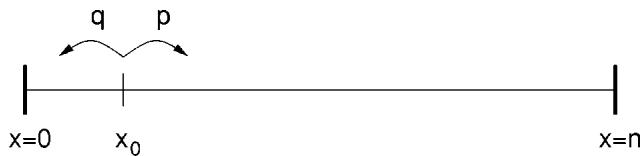  
Fig. 1. The bounded one-dimensional space of the gambler’s ruin problem.

We can represent a partition of the search space using a template where the $k$ fixed positions of the schemata in the partition are represented by a metasymbol In our example, the space is partitioned by the four schemata with fixed symbols in their first two positions: $\mathrm { F F * * * * * * * * * * * * * * * * * }$

Not all schemata in a given partition are equal. Some schemata represent classes of individuals with a higher average fitness than others, and some actually match portions of the global solution. It is possible that some schemata have a high average fitness, but do not match the global optimum. Actually, test functions that deceive the GA to converge to suboptimal schemata in a partition have been proposed [10]–[12], and are used in several studies (including this one) to test theoretical models of convergence quality.

Low-order highly-fit schemata are sometimes called building blocks (BBs) [13]. In this paper, we refer to the lowest order schema that consistently leads to the global optimum as the correct BB. In this view, the correct BB must: 1) match the global optimum and 2) have the highest average fitness of all the schemata in the same partition. All other schemata in the partition are labeled as incorrect.

Harik et al. [14], [15] modeled selection in GAs as a biased random walk to obtain a model of the quality of the solution of a GA. Their work is based on a previous population sizing model by Goldberg et al. [16]. The model concentrates on only one partition of order $k$ and it assumes that decisions are independent across partitions. The number of copies of the correct BB in a population of size $_ n$ is represented by the position $x$ of a particle on a one-dimensional space, as depicted in Fig. 1. Absorbing barriers at $x = 0$ and $x = n$ bound the space, and represent ultimate convergence to the wrong and to the right solutions, respectively. Once the particle reaches the barriers it cannot escape. The initial position of the particle $x _ { 0 }$ is the expected number of copies of the correct BB in a randomly initialized population, that is equal to $x _ { 0 } = n / 2 ^ { k }$

At each step of the random walk, there is a probability $p$ of obtaining one additional copy of the correct BB. This probability depends on the particular problem that the GA is facing, and it represents the chance of choosing correctly between individuals with the best and the second best schemata in a partition. For functions composed by adding uniformly-scaled subfunctions, $p$ was computed by Goldberg et al. [16] in their study of population sizing as

$$
p = \Phi \left( { \frac { d } { \sqrt { 2 m ^ { \prime } \sigma _ { b b } ^ { 2 } } } } \right)
$$

where $\Phi$ denotes the cumulative distribution function (CDF) of a normal distribution with a mean of zero and a standard deviation ofone, $d$ is the difference ofthe fitness contribution between the best and the second best schemata in the partition, $m ^ { \prime } = m - 1$ , $m$ is the number of subfunctions, and $\sigma _ { b b } ^ { 2 }$ is the average variance of the $k$ th order partitions.

Using a well-known result from the random walk literature, the probability that the particle will be absorbed at $x = n$ or equivalently the probability that the GA will converge to the right solution is [17]

$$
P _ { b b } ( x _ { 0 } ) = \frac { 1 - \left( \frac { q } { p } \right) ^ { x _ { 0 } } } { 1 - \left( \frac { q } { p } \right) ^ { n } }
$$

where $q = 1 - p$ is the probability of making the wrong decision between two competing BBs.1 Goldberg et al. showed how to estimate the domain-dependent parameters needed to calculate $p$ in their paper, and Cantú-Paz shows an alternate method to approximate $P _ { b b }$ using experimental data [18].

There are a number of assumptions that we need to make to use the gambler’s ruin problem to predict the quality of the solutions of the GA. First, the GR model considers that decisions in a GA occur one at a time until all the $n$ individuals in its population converge to the same value. In other words, in the model there is no explicit notion of generations, and the outcome of each decision is to win or lose one copy of the optimal BB. The model also assumes conservatively that all competitions occur between strings with the best and the second best schemata in a partition, and that the probability of deciding correctly remains constant during the run. Furthermore, Goldberg et al. calculation of $p$ implicitly assumed that the GA uses pairwise tournament selection (two strings compete), but adjustments for other selection schemes are possible, as Harik et al. showed [14], [15].

The boundaries of the random walk are absorbing; this means that once a partition contains $_ n$ copies of the correct BB it cannot lose one, and likewise, when the correct BB disappears from a partition there is no way of recovering it. This is related with another important assumption of the GR model: mutation and crossover do not create or destroy significant numbers of BBs. In the model, the only source of BBs is the random initialization of the population.

We must recognize that the GR model is a simplification, but experimental results suggest that is it a reasonable one [14], [15]. For example, consider a fitness function based on the fully deceptive trap function depicted in Fig. 2. The value of this function depends on the number of bits set to one. The fitness increases with more bits set to zero until it reaches a local (deceptive) optimum, but the global maximum is at the opposite extreme where all four bits are set to one, so an algorithm cannot use any partial information to find it. More formally, we can say that all the schemata of order $k \leq 3$ with at least one fixed position $\mathtt { F } = 0$ have a higher average fitness than schemata where the same fixed position is $\mathsf { F } = 1$ This misleads the GA to the suboptimal solution with all zeroes. The shortest schemata that leads to the global optimum is of order $k = 4$ and all its fixed positions are $\mathsf { F } = 1$ The difference between the optimal and the deceptive maxima is $d = 1$ and the fitness variance $( \sigma _ { b b } ^ { 2 } )$ is 1.215. The test function used by the GA is formed by concatenating $m = 2 0$ copies of the trap function for a total string length of 80 bits, and the fitness of an individual is computed by adding the contributions of the 20 trap functions. The probability of making the right decision between two individuals with the best and the second best schemata is $p = 0 . 5 5 8 5$ Fully deceptive trap functions are used in many studies of GAs, because their difficulty is well understood and it can be regulated easily by using more bits in the basin of the deceptive optimum, or by reducing the fitness difference between the global and the deceptive maxima [12].

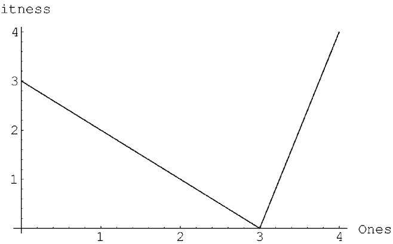  
Fig. 2. A fully deceptive 4-bit trap function. The horizontal axis is the number of bits set to 1, and the vertical axis is the fitness value.

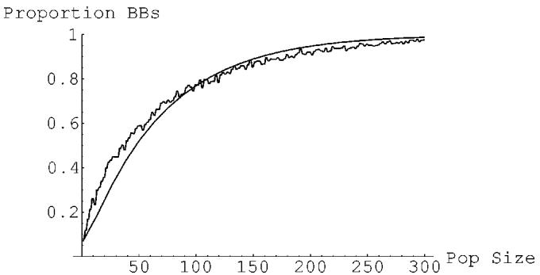  
Fig. 3. Theoretical predictions and experimental results for a 4-bit deceptive function with 20 BBs. The GR model ((2), in bold) approximates well the experimental results (dotted).

The quality of the solution is measured by counting the number of partitions that converged to the global optimum, and normalizing over the total number of partitions. Fig. 3 presents the prediction of the percentage of correct BBs along with the average from $1 0 0 \ \mathrm { G A }$ runs at each population size. The GA used pairwise tournament selection, 2-point crossover with probability one, and no mutation. The parallel GAs examined in the following sections use the same parameters and the same test function.

For space considerations, the experiments reported in this paper use only this 20-BB order-4 function. However, the accuracy of the GR model has been empirically validated using other additively decomposable functions (both separable and non-separable) of varying difficulty [14], [15]. Since the quality predictions in later sections depend on the GR model, we expect them to be accurate on other (decomposable) functions as well.

# III. FULLY CONNECTED TOPOLOGY AND MAXIMUM MIGRATION RATES

The first parallel GA that we consider is an upper bound on the connectivity and the migration rates. This case is not likely to be used in practice because of its poor scalability, but the analysis is the simplest of all the cases considered in this paper, and it introduces the methodology and notation that will be used later to examine arbitrary migration rates and topologies.

Cantú-Paz and Goldberg [19] predicted the expected quality of the solution reached by fully connected demes at the end of the second epoch when they use a maximum migration rate. The migration rate is denoted as $\rho$ and represents the fraction of the population that is exchanged between two populations. The maximum migration rate is $\rho = 1 / r$ where $r$ is the number of demes. Their approach was to approximate the starting point of the random walk after the first migration as $x _ { 1 } = n P _ { b b }$ and to use $x _ { 1 }$ instead of $x _ { 0 }$ in (2). This assumes that many demes are used, but their results suggest that the approximation works well with as few as four demes. Unfortunately, this simple method cannot be used after the second epoch, because the starting point of the random walk would increase steadily, and after a few epochs the probability of success would be one, regardless of the number of demes or their size.

# A. Modeling with Markov Chains

To predict the quality of the solutions found after an arbitrary number of epochs we need to determine accurately the starting point of the random walk. The number of correct BBs at the start of an epoch depends directly—and solely—on how many demes converged correctly in the previous iteration. In particular, if $i$ demes converged correctly and $n _ { d }$ is the deme size, each deme would start the current epoch $\chi _ { i } = ( i n _ { d } / r )$ copies of the BB, and the probability that it converges correctly is $P _ { b b } ( \chi _ { i } )$ The problem consists on computing the number $i$ of demes that have the right BB after each epoch.

The chance that a deme converges correctly after the first epoch is $P _ { b b } ( x _ { 0 } )$ where $x _ { 0 } = ( n _ { d } / 2 ^ { k } )$ is the expected number of correct BBs in a randomly initialized population. Since the demes evolved independently, at the end of the first epoch the distribution of demes with the correct BB has a binomial distribution

$$
V _ { 1 } ( i ) = \binom { r } { i } P _ { b b } ^ { i } ( x _ { 0 } ) ( 1 - P _ { b b } ( x _ { 0 } ) ) ^ { r - i }
$$

where $V _ { 1 } ( i )$ denotes the probability that exactly $i$ demes converge correctly at the end of the $\tau$ th epoch. The probability of converging correctly after the second epoch is

$$
P _ { b b _ { 2 } } = \sum _ { i = 0 } ^ { r } V _ { 1 } ( i ) \cdot P _ { b b } ( \chi _ { i } )
$$

which can be generalized and expressed as

$$
P _ { b b _ { \tau } } = V _ { \tau - 1 } U
$$

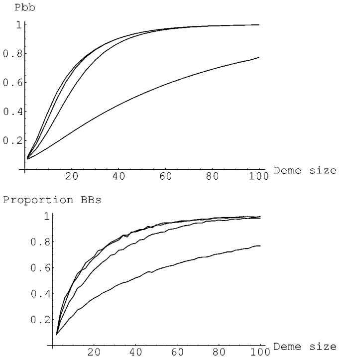  
Fig. 4. Probability of converging to the correct BB after 1, 2, 3, and 4 epochs (from bottom to top).

The challenge is to calculate the distribution of correct demes after an arbitrary number of epochs $( V _ { \tau } )$ and for this purpose we use Markov chains. The states of the chain represent the number of demes that converged to the correct BB in a given epoch. The transition matrix is defined with the probabilities of going from a state with $i$ demes correct to a state with $j$ demes correct as follows:

$$
M ( i , j ) = \binom { r } { j } ( P _ { b b } ( \chi _ { i } ) ) ^ { j } ( 1 - P _ { b b } ( \chi _ { i } ) ) ^ { r - j } .
$$

The distribution of the number of demes that converge correctly after epochs is given by

$$
V _ { \tau } = V _ { 1 } M ^ { \tau - 1 }
$$

and the probability of converging to the correct BB may be calculated with (5).

Fig. 4 presents an example of the predictions of (5) after several epochs on four fully connected demes. The function used in the example is the same 20-BB 4-bit trap problem used in the previous section. The GA uses pairwise tournament selection, two-point crossover with probability one, and no mutation. Note that the major improvement in quality comes at the second epoch, and therefore the deme-sizing equations derived by Cantú-Paz and Goldberg [19] that consider only the first two epochs are very significant for the design of parallel GAs.

# B. Parallel Demes in the Long Run

The example above also suggests that the probability of finding the correct BB converges to a fixed value after a few epochs. Another application of Markov chains is to calculate the long run distribution of the number of demes that find the BB, that is $\scriptstyle \operatorname* { l i m } _ { \tau \to \infty } V _ { \tau }$ Substituting this distribution in (5)

would give the probability that in the long run the parallel GA finds the correct BB. The remainder of this section treats this issue, and also shows how to calculate the expected number of epochs until all the demes converge to the same solution.

First, recall the assumption that crossover and mutation do not create or destroy significant numbers of correct BBs. This assumption implies that if the correct BB disappears from all the demes there is no way of recovering it. Likewise, when all the demes converge to the correct BB there is no chance of losing it. These facts are reflected in the transition matrix: the first row (corresponding to state 0, when no deme has the correct BB) is $1 , 0 , 0 , \cdots , 0$ , and the last row (state $r$ when all the demes have the correct BB) is $0 , 0 , \cdots , 1$ . The states 0 and $r$ are called absorbing or persistent states, and since there are no possible transitions between them, the chain has two closed absorbing sets. All the other states in the chain are called transient states.

The fundamental matrix method [20] is used to calculate the distribution of demes with the correct BB in the long run and the expected number of epochs until absorption. To use this method the states need to be reordered, and the transition matrix rewritten as

$$
M = \left( \begin{array} { c c c } { { P _ { 1 } } } & { { 0 } } & { { 0 } } \\ { { 0 } } & { { P _ { 2 } } } & { { 0 } } \\ { { R _ { 1 } } } & { { R _ { 2 } } } & { { Q } } \end{array} \right)
$$

where $P _ { 1 }$ and $P _ { 2 }$ are the submatrices with the transition probabilities within the two closed persistent sets, which in our case consist of a single state each (therefore, $P _ { 1 } = P _ { 2 } = 1$ ); $Q$ is a submatrix with the transition probabilities within the transient states; and $\pmb { R } _ { 1 }$ and $R _ { 2 }$ contain the probabilities of going from each transient state to each of the persistent states.

The expected absorption time from each transient state $i$ is given by the th element of

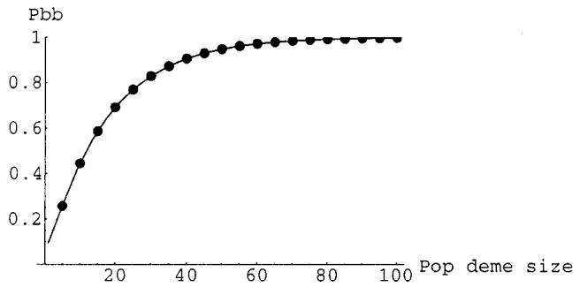  
Fig. 5. An example that suggests that in the long run a parallel GA with $r$ fully connected populations using a maximal migration rate [(11), dots] has the same chance of finding the solution than a simple GA with an aggregate population [(2), continuous line].

initial distribution of demes with the correct BB by the extended vector $( A ^ { \prime } )$

$$
P _ { b b _ { \infty } } = { \cal V } _ { 1 } { \cal A } ^ { \prime } .
$$

Fig. 5 presents plots of $P _ { b b _ { \infty } }$ using four demes with $0 \leq n _ { d } \leq$ individuals each, and a plot of $P _ { b b }$ (2) using a population size of $n = 4 n _ { d }$ The two plots overlap perfectly, and this suggests that the probability that $r$ fully connected demes of size $n _ { d }$ converge correctly in the long run is the same as the probability of success of a GA with a single population with $r n _ { d }$ individuals. This is important because it suggests that in the long run the solution’s quality does not degrade or improve when a population is partitioned into smaller fully connected demes that communicate with the maximum migration rate.

It is not immediately clear what would be the outcome if the populations communicate using a lower migration rate or a different topology. The following sections study the effects of these two parameters on the quality of the solutions.

$$
\pmb { T } = \pmb { N } \mathbf { 1 }
$$

where the matrix $N = ( I - Q ) ^ { - 1 }$ is called the fundamental matrix, $\pmb { I }$ is the identity matrix, and is a column vector of ones. Augment $_ { \pmb { T } }$ with a zero at the beginning and a zero at the end to account for the expected absorption times from state 0 and state $r$ respectively. Now the mean time until absorption may be calculated by multiplying the initial distribution of demes with the correct BB [given by (3)] by the extended $\pmb { T } ( \pmb { T } ^ { \prime } )$ as follows:

$$
\left. T \right. = V _ { 1 } T ^ { \prime } .
$$

The absorption probabilities from the transient state $i$ to the persistent state $\it l$ is given by the $( i , l )$ th entry of ${ N R }$ , where $\pmb { R }$ is the matrix formed with the elements of $\pmb { R 1 }$ and $\mathbf { \delta } _ { R 2 }$ Recall that $P _ { 2 }$ is the submatrix that contains state $r$ which represents the case where all the demes converge to the correct BB. Therefore, the distribution of probabilities, $\pmb { A }$ of being absorbed into state $r$ is given by the second column of $N R$ . Augment $\pmb { A }$ with a zero at the beginning and a one at the end, to account for the chances of being absorbed from state 0 and state $r$ respectively. To find the mean probability of being absorbed at state $r$ multiply the

# IV. ARBITRARY MIGRATION RATES

Using the maximal migration rate simplifies the calculation of the number of correct BBs present in a deme after each epoch, because the contribution from all the demes is uniform. This section extends the calculations to cases with lower migration rates. The method is very similar to the previous section, but with lower migration rates the initial number of correct BBs in a particular deme depends greatly on whether the deme converged correctly in the previous epoch. For example, consider that in a given epoch two out of three demes of a parallel GA converge correctly, and suppose that each population sends a fraction $\rho =$ of its individuals to the other two. At the start of the next epoch there are two possibilities for a particular deme. First, if the deme converged correctly in the previous epoch, then $9 5 \%$ of its individuals have the correct BB $90 \%$ were already there, and it obtained $5 \%$ from the other correct deme). On the other hand, if the deme did not converge correctly, only $10 \%$ of the population would have the correct BB, contributed by the other two demes.

To reflect this situation, the Markov chain needs twice as many states as before. For each number of demes that converged correctly, the chain needs two states: one to represent the case when the major fraction of the population contains the BB (because the population converged correctly in the previous iteration), and another state to represent when the major fraction of the population is incorrect. A convenient way to order the states is that states 0 to $r - 1$ represent the cases where the major fraction of the deme is incorrect, and states $r$ to $2 r - 1$ represent the cases where major fraction is correct. This ordering of the states is arbitrary, and any other ordering would be adequate. As before, there is one absorbing state for the case when all the demes converge incorrectly (state 0), and there is one state for when all the demes converge to the correct BB (state $2 r - 1 )$ ). The rest are transient states.

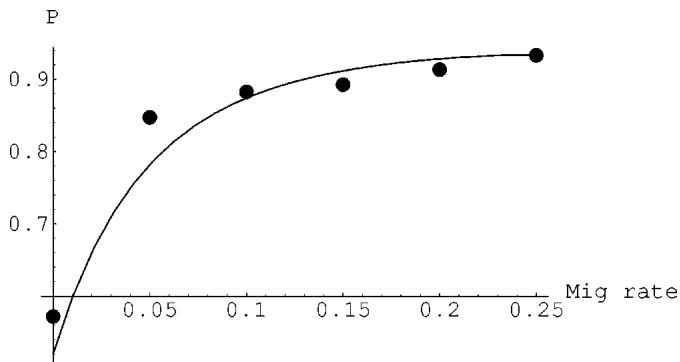  
Fig. 6. The probability of converging to the correct BB increases with higher migration rates. The theoretical predictions (continuous line) are compared against experimental results (dots).

The initial distribution is

$$
V _ { 1 } ( i ) = \left\{ \begin{array} { l l } { { \displaystyle \binom { r - 1 } { i } [ P _ { b b } ( x _ { 0 } ) ] ^ { i } [ 1 - P _ { b b } ( x _ { 0 } ) ] ^ { r - i } , } } & { { \mathrm { i f ~ } i < r } } \\ { { ~ } } \\ { { ~ \displaystyle \binom { r - 1 } { i - r } [ P _ { b b } ( x _ { 0 } ) ] ^ { i - r + 1 } } } \\ { { ~ } } \\ { { ~ [ 1 - P _ { b b } ( x _ { 0 } ) ] ^ { 2 r - i - 1 } , } } & { { \mathrm { i f ~ } i \ge r } } \end{array} \right.
$$

for $i \in [ 0 , 2 r - 1 ]$ The transition matrix becomes

$$
\begin{array} { r } { M ( i , j ) = \{ \begin{array} { l l } { ( \begin{array} { c } { r - 1 } \\ { j } \end{array} ) [ P _ { b b } ( \chi _ { i } ) ] ^ { j } [ 1 - P _ { b b } ( \chi _ { i } ) ] ^ { r - j } , } & { \mathrm { i f ~ } j < r } \\ { ( \begin{array} { c } { r - 1 } \\ { j - r } \end{array} ) [ P _ { b b } ( \chi _ { i } ) ] ^ { j - r + 1 } } \\ { [ 1 - P _ { b b } ( \chi _ { i } ) ] ^ { 2 r - j - 1 } , } & { \mathrm { i f ~ } j \ge r } \end{array}  } \end{array}
$$

where $\chi _ { i }$ is the starting point of the random walk for each state $i$ , and it depends on the migration rate $\rho$ and on how many demes converged correctly

$$
\chi _ { i } = \left\{ \begin{array} { l l } { n _ { d } i \rho , } & { \mathrm { i f ~ } i < r } \\ { n _ { d } ( ( i - r ) \rho + 1 - ( r - 1 ) \rho ) , } & { \mathrm { i f ~ } i \geq r . } \end{array} \right.
$$

The probability of converging to the correct BB after $\tau$ epochs is given by $P _ { b b _ { \tau } } = V _ { \tau - 1 } U \left( 5 \right)$ , where $U ( i ) = P b b ( \chi _ { i } )$ and $\chi _ { i }$ is defined as above.

Fig. 6 illustrates the probability of reaching the correct solution as a function of the migration rate. The probability of success increases rapidly with higher migration rates. The example uses four fully-connected demes with 50 individuals each; the test function is a 20-BB 4-bit trap problem; and only the first two epochs are considered. The demes used pairwise tournament selection, two-point crossover with probability one, and no mutation. The results are the average of 100 runs.

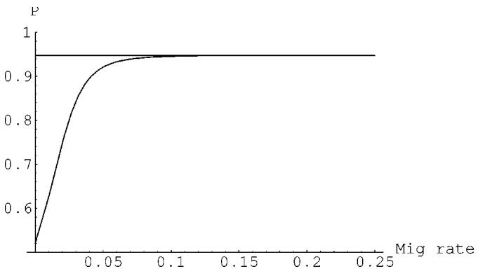  
Fig. 7. The long-run probability of converging to the correct BB increases rapidly with higher migration rates. The example considers four fully connected demes, with 50 individuals each, working on a 20-BB 4-bit trap function. The horizontal line is the probability that four fully connected demes with maximal migration (or a simple GA with 200 individuals) will eventually converge to the correct BB.

As before, the fundamental matrix method can be used to predict the long-term behavior of the parallel GA with arbitrary migration rates. The states have to be reordered as in the previous section, and the calculations are similar. Fig. 7 plots the probability that in the long run the parallel GA will converge to the correct solution as a function of the migration rate. The plot suggests that a moderate migration rate is sufficient to reach the same solution as a simple GA with a aggregate population.

Since all the individuals are the same when migration occurs, there are no cost penalties associated with higher rates. Only one individual needs to be sent and it can be replicated any number of times at the receiving deme.

# V. ARBITRARY TOPOLOGIES

The previous two sections showed how the complexity of the modeling increased when the algorithm became more flexible. In the first case, when the migration rate was maximal, the only information required to calculate the number of BBs at the start of an epoch was the number of demes that converged correctly. When the migration rate was allowed to change, additional states were required to represent whether the local deme had converged correctly or not. The nature of the information represented by each state changed from a mere count of demes correct to include limited spatial information (i.e., it became important to know which demes had the correct BB).

More spatial information is required when considering arbitrary topologies. In this case, it is not sufficient to know how many demes converged correctly in the previous epoch, but also exactly which ones. This information is represented in the states of the Markov chain, and therefore we need many additional states. Since a deme can either have the BB or not, in a setup with $r$ demes there are $2 ^ { r }$ possible states. A natural representation of these information is to use a binary string $s _ { i }$ of length $r$ for each state $i$ The th bit of the string, $s _ { i } ( k )$ corresponds to the $k$ th deme and is set to one if the deme converged correctly and to zero otherwise. The states of the Markov chain are numbered from 0 to $2 ^ { r } - 1$ and can be conveniently labeled with the integers represented by the strings. For example, in a configuration with 8 demes, state 10 corresponds to the string $s _ { 1 0 } = 0 0 0 0 1 0 1 0$ and represents the case where demes 1 and 3 converged correctly.

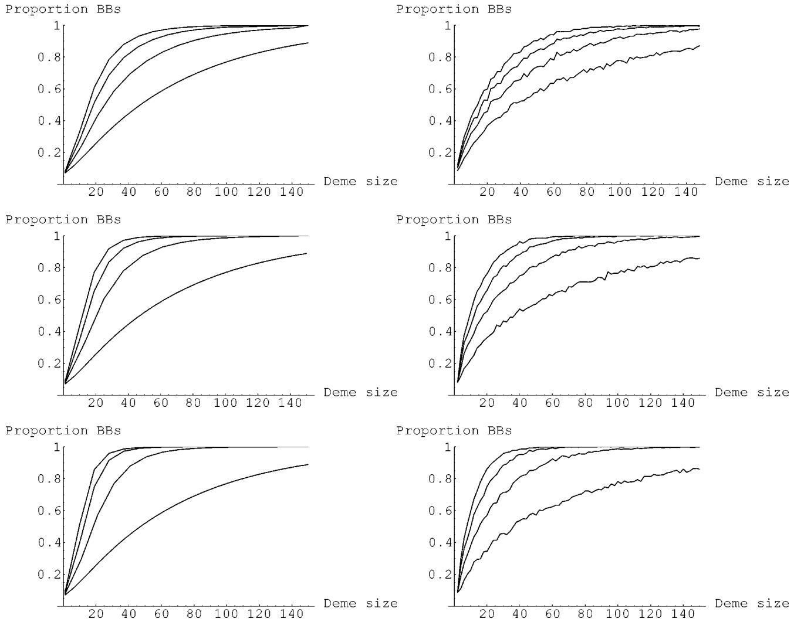  
Fig. 8. Theoretical predictions (left) and experimental results (right) for eight demes connected by three different topologies. The top two graphs correspond to a unidirectional ring, the middle two to a bidirectional ring, and the bottom two to a hypercube. Each graph shows the quality after one, two, three, and four epochs (from bottom to top in each graph). The migration rates are set to the maximal values for each topology.

The construction of the transition matrix is not as straightforward as when the demes are fully connected. As before, the core of the modeling is to determine how many copies of the BB are present in a deme just after migration. The first step is to determine how many of the neighbors have the correct BB, and for this we use a topology-dependent neighborhood function $N ( a )$ that returns a set $\textstyle { \mathcal { N } } _ { a }$ with the indices of the neighbors of deme $a$ For example, in a bidirectional ring, the neighbors of deme 1 are demes 0 and 2 [i.e, $\mathcal { N } _ { 1 } = N ( 1 ) = \{ 0 , 2 \} ]$ . Since the states contain the information about which demes have the correct BB, it is easy to determine how many neighbors of a deme $a$ converged correctly when the chain is at state $i$ as

$$
c _ { i , a } = \sum _ { k \in \mathcal { N } _ { a } } s _ { i } ( k ) .
$$

With this information, the number of BBs in deme $a$ at the beginning of the epoch may be calculated as

$$
\chi _ { i , a } = n _ { d } [ c _ { i , a } \rho + s _ { i } ( a ) \left( 1 - \delta \rho \right) ]
$$

where $\delta$ is the degree of the topology and $\rho$ is the migration rate. The first term above, $\mathcal { C } _ { i , a } \rho$ is the fraction of the deme with the correct BB that is contributed by the neighbors. The second term is about the individuals that were already present in the deme. When $s _ { i } ( a )$ equals one, deme $a$ converged correctly in the previous epoch, and the fraction $1 - \delta \rho$ of the population that remained unchanged after migration contains the correct BB. If $s _ { i } ( a ) = 0$ then the only correct BBs in the deme come from its neighbors.

The probability that deme $a$ will converge correctly is given by $P _ { b b } ( \chi _ { i , a } )$ and so the probability of going from state $i$ to state $j$ is given by

$$
{ \pmb M } ( i , j ) = \prod _ { a = 1 } ^ { r } [ s _ { j } ( a ) P _ { b b } ( \chi _ { i , a } ) + ( 1 - s _ { j } ( a ) ) ( 1 - P _ { b b } ( \chi _ { i , a } ) ] .
$$

For each value of $a$ only one term of the equation above is different than 0, depending on whether the th deme is correct or incorrect in state $j$

The distribution of states is given by $V _ { \tau } = V _ { 1 } M ^ { \tau - 1 }$ [see (7)], and the probability of converging correctly is determined by (5) $( P _ { b b _ { \tau } } = V _ { \tau - 1 } \pmb { U } )$ However, now

$$
U ( i ) = P _ { b b } ( \chi _ { i , a } )
$$

where $\chi _ { i , a }$ is defined in (16). Any choice of $a$ may be used in this equation when the demes are connected by a symmetric topology, because on average all demes will have the same outcome.

The initial distribution of states is given by

$$
V _ { 1 } ( i ) = P _ { b b } ( x _ { 0 } ) ^ { u ( s _ { i } ) } ( 1 - P _ { b b } ( x _ { 0 } ) ) ^ { r - u ( s _ { i } ) }
$$

where $u ( s )$ is a function that counts the bits set to one in the string $s$

The long-run probability of success may be found by reordering the states and using the fundamental matrix method, as was described in Section III.

# VI. EXPERIMENTS

Several experiments were conducted to assess the accuracy of the model described in the previous section. Three frequently used topologies were chosen to experiment: a uni-directional ring, a bi-directional ring, and a hypercube. In all cases, the experiments used eight demes and the test function was the same 20-BB 4-bit trap used previously. The GAs used pairwise tournament selection, 2-point crossover with probability one, and no mutation. The results presented are the average over 100 repetitions.

# A. Multiple Topologies

The first set of experiments was designed to test the accuracy of the predictions after multiple epochs using different topologies. The three topologies were tested separately varying the deme size and measuring the quality of the solutions after one, two, three, and four epochs. The migration rate was set to the maximal values for each topology: $50 \%$ for the uni-directional ring, $33 \%$ for the bidirectional ring, and $2 5 \%$ for the hypercube. The results are presented in Fig. 8, and they show that the model accurately predicts the solution quality over the range of deme sizes that was used and after several epochs.

To compare more easily the quality across different topologies, Fig. 9 shows plots of the quality versus the number of epochs for the three topologies used above plus a fully connected topology. These experiments use eight demes with 30 individuals each, and as before the migration rate was set to the maximum values possible. In all cases, the quality increases as more epochs are used, but the rate of increase depends on each topology. The uni-directional ring needs the most epochs to reach the highest quality possible—which is the same quality that simple GA with an aggregate population would reach—while the fully connected topology realizes its full potential using the fewest epochs.

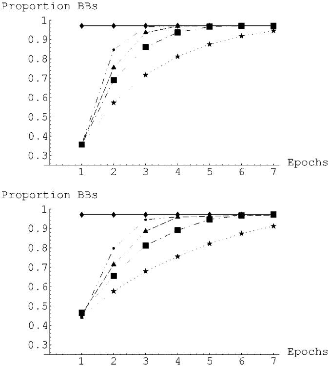  
Fig. 9. Theoretical predictions of convergence quality after several epochs. The graphs include data for a uni- and bi-directional rings, a hypercube, and a fully connected topology (from bottom to top, respectively). The horizontal line in both graphs is the prediction of the quality that would be reached by a simple GA with an aggregate population.

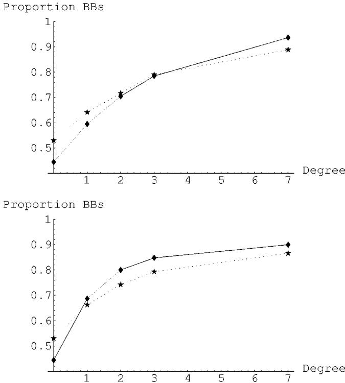  
Fig. 10. Solution quality as a function of the degree of the topology. The continuous lines are the theoretical predictions, and the dashed lines are the experimental results.

The two experiments above suggest that topologies where the demes have more neighbors reach solutions of higher quality than sparse topologies: at any given epoch the fully connected topology reached the best solutions, while the uni-directional ring reached the worst. To visualize the effect of the degree more clearly, Fig. 10 shows experiments where the degree varies while the deme size and migration rate are constant. The experiments used the four topologies used before (with degrees 1, 2, 3, and 7). The experiments considered eight demes with 40 individuals each, and the quality was measured at the end of the second epoch. In the first experiment the migration rate was set to $10 \%$ per deme (so the number of migrants received by a deme increases with the degree), and in the second experiment the total number of migrants was set to 20.

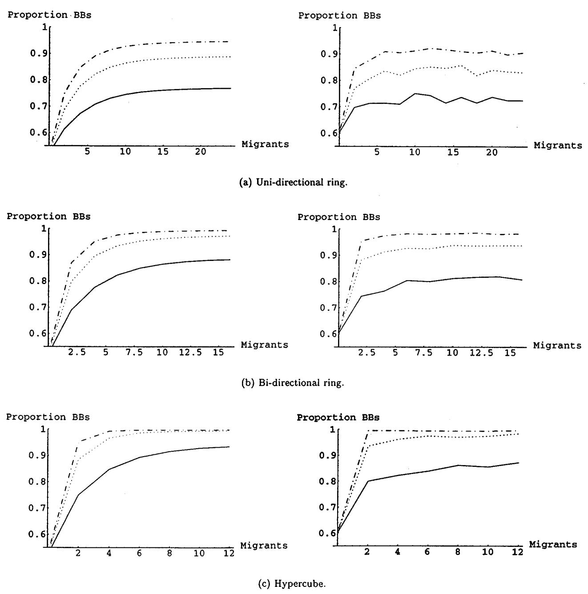  
Fig. 11. Quality versus number of migrants. The top two graphs corespond to a unidirectional ring, the middle two to a bidirectional ring, and the bottom two to a hypercube. Each graph shows the quality using multiple migration rates after two, three, and four epochs (from bottom to top in each graph).

In both experiments the quality increased quickly as the topologies became denser, but the marginal improvements got smaller. This is important because topologies with higher degrees have higher communication costs, and the marginal increase in quality may not be large enough to justify the added cost.

# B. Migration Rates and Different Topologies

The next set of experiments was designed to test the accuracy of the models varying the migration rates. The experiments used eight demes with 50 individuals each connected as uniand bi-directional rings and a hypercube. The migration rate was varied from zero to the maximum rate possible in each topology, and the quality of the solutions was recorded at the end of the second, third, and fourth epochs. (During the first epoch the demes are isolated and their performance is equivalent to a migration rate of zero.) The results shown in Fig. 11 confirm that the model accurately predicts the quality over a variety of migration rates and topologies. In addition, these experiments agree with the findings in previous sections: the quality increases with higher migration rates and network connectivity.

# VII. SUMMARY AND CONCLUSIONS

The paper presented models that predict the expected solution quality of parallel GAs with multiple populations after any number of epochs and for any choice of number of demes, deme size, topology, or migration rate. The modeling used Markov chains to determine the number of correct BBs present in the demes at the beginning of each epoch. Then, the gambler’s ruin model was used to predict the quality of the solutions. The size of the Markov chains increased progressively as more flexibility was allowed in the algorithms. The first algorithm examined was an upper bound on topologies and migration rates. This case was the simplest to examine because the contributions from all the demes are the same, and only $r$ states are required. The second case still considers a fully connected topology, but it was extended to arbitrary migration rates, and the model required additional states to represent the varying contributions from the local deme and its neighbors. Finally, the model was extended to arbitrary topologies and migration rates, and the number of states increased again.

The accuracy of the models was tested with computational experiments using one fully deceptive test function and varying all the parameters of interest. In all cases, the predictions match closely the observed quality of the solutions after any number of epochs. An important observation is that the greatest gain in quality always occurs after the second epoch. This is significant because it is possible to derive closed-form expressions for the deme sizes that are necessary to reach a determined quality after the second epoch, and these expressions may be manipulated to determine the configurations that minimize the execution time [6], [21].

The models and the experiments suggest that in the long run the parallel GAs reach solutions of the same quality as a simple GA with a population equivalent to the aggregate of the demes. Partitioning the population does not degrade or improve the solution quality as long as the migration rate is not very low. Furthermore, it appears that only a few epochs are necessary to reach the same solution as the simple GA.

Another important observation is that the quality improves with higher migration rates, regardless of the topology. In the algorithm examined here there is no reason to use low migration rates. Since migration occurs after the demes converge, the cost of communications is independent of the migration rate. Only one individual has to be sent and it can be replicated as necessary in the receiving deme.

The calculations and experiments also suggest that higher network degrees improve the quality of the search. However, higher degrees raise the cost of communications, and result in a tradeoff between increasing the quality or making the algorithm slower. In many situations, there is a minimal desired solution quality, and when the parallel GA is required to reach it, there is an optimal configuration that minimizes the total execution time (computations $+$ communications). Additional research on finding the optimal configuration is already under way.

The models and the observations contained in this paper aid practitioners to understand how different topologies and migration rates affect the outcome of the algorithm. With this improved understanding, practitioners are in a better position to choose a configuration that yields adequate solutions without having to guess blindly, to rely on unverified intuition, or to perform expensive systematic experiments. Still, some experiments are needed to calibrate the theory to the particular hardware platform and problem domain (especially when domain knowledge is scarce), but those experiments are relatively easy and inexpensive.

# ACKNOWLEDGMENT

The author wishes to thank Prof. D. E. Goldberg for his guidance during the research reported here.

# Список литературы

[1] S.-C. Lin, W. Punch, and E. Goodman, “Coarse-grain parallel genetic algorithms: Categorization and new approach,” in 6th IEEE Symp. Parallel and Distributed Processing. Los Alamitos, CA: IEEE Computer Society Press.   
[2] R. Tanese, “Distributed genetic algorithms,” in Proc. 3rd Int.l Conf. Genetic Algorithms, J. D. Schaffer, Ed. San Mateo, CA: Morgan Kaufmann, 1989, pp. 434–439.   
[3] W. N. Martin, J. Lienig, and J. P. Cohoon, “Population structures: Island (migration) models: Evolutionary algorithms based on punctuated equilibria,” in Handbook of Evolutionary Computation, T. Bäck, D. B. Fogel, and Z. Michalewicz, Eds. New York: Inst. Phys. Publ., Oxford Univ. Press, 1997, pp. C6.3:1–C6.3:16.   
[4] E. Cantú-Paz, “A survey of parallel genetic algorithms,” Calculateurs Parallèles, Reseaux et Systems Repartis, vol. 10, no. 2, pp. 141–171, 1998.   
[5] , “Designing efficient master-slave parallel genetic algorithms,” in Genetic Programming 98, J. R. Koza, W. Banzhaf, K. Chellapilla, K. Deb, M. Dorigo, D. B. Fogel, M. H. Garzon, D. E. Goldberg, H. Iba, and R. L. Riolo, Eds. San Mateo, CA: Morgan Kaufmann, 1998, p. 455.   
[6] E. Cantú-Paz and D. E. Goldberg, “Predicting speedups of idealized bounding cases of parallel genetic algorithms,” in Proc. 7th Int. Conf. Genetic Algorithms, T. Bäck, Ed. San Mateo, CA: Morgan Kaufmann, 1997, pp. 113–121.   
[7] P. B. Grosso, “Computer simulations of genetic adaptation: Parallel subcomponent interaction in a multilocus model,” Ph.D. dissertation, Univ. Michigan, Ann Arbor, 1985.   
[8] H. C. Braun, “On solving travelling salesman problems by genetic algorithms,” in Parallel Problem Solving from Nature, H.-P. Schwefel and R. Männer, Eds. Berlin, Germany: Springer-Verlag, 1990, pp. 129–133.   
[9] M. Munetomo, Y. Takai, and Y. Sato, “An efficient migration scheme for subpopulation-based asynchronously parallel genetic algorithms,” in Proc. 5th Int. Conf. Genetic Algorithms, S. Forrest, Ed. San Mateo, CA: Morgan Kaufmann, 1993, p. 649.   
[10] L. Davis, Ed., “Simple genetic algorithms and the minimal, deceptive problem,” in Genetic Algorithms and Simulated Annealing. San Mateo, CA: Morgan Kaufmann, 1987, ch. 6, pp. 74–88.   
[11] “Construction of high-order deceptive functions using low-order Walsh coefficients,” Ann. Math. Artif. Intell., vol. 5, pp. 35–48, 1992.   
[12] K. Deb and D. E. Goldberg, “Sufficient conditions for deceptive and easy binary functions,” Ann. Math. Artif. Intell., vol. 10, pp. 385–408, 1994.   
[13] D. E. Goldberg, Genetic Algorithms in Search, Optimization, and Machine Learning. Reading, MA: Addison-Wesley, 1989.   
[14] G. Harik, E. Cantú-Paz, D. E. Goldberg, and B. L. Miller, “The gambler’s ruin problem, genetic algorithms, and the sizing of populations,” in Proc 1997 IEEE Int.l Conf. Evolutionary Computation, Piscataway, NJ, 1997, pp. 7–12.   
[15] , “The gambler’s ruin problem, genetic algorithms, and the sizing of populations,” IEEE Trans. Evol. Comp., vol. 7, pp. 231–253, Sept 1999.   
[16] D. E. Goldberg, K. Deb, and J. H. Clark, “Genetic algorithms, noise, and the sizing of populations,” Complex Systems, vol. 6, pp. 333–362, 1992.   
[17] W. Feller, An Introduction to Probability Theory and its Applications, 2nd ed. New York: Wiley, 1966.   
[18] E. Cantú-Paz, “Designing Efficient and Accurate Parallel Genetic Algorithms,” Ph.D. dissertation, Univ. Illinois, Urbana-Champaign, Urbana, IL, 1999..   
[19] E. Cantú-Paz and D. E. Goldberg, “Modeling idealized bounding cases of parallel genetic algorithms,” in Genetic Programming 1997: Proc. 2nd Ann. Conf., J. Koza, K. Deb, M. Dorigo, D. Fogel, M. Garzon, H. Iba, and R. Riolo, Eds. San Mateo, CA: Morgan Kaufmann, 1997, pp. 353–361.   
[20] D. L. Isaacson and R. W. Madsen, Markov Chains Theory and Applications. New York: Wiley, 1976.   
[21] E. Cantú-Paz and D. E. Goldberg, “Parallel genetic algorithms: theory and practice,” in Computer Methods in Applied Mechanics and Engineering, to be published.

Erick Cantú-Paz $( \mathbf { S } ^ { 9 } \mathbf { 9 } \mathbf { 9 } \mathbf { - } \mathbf { M } ^ { \mathbf { 7 } } \mathbf { 9 } \mathbf { 9 } )$ ) received the B.S. degree in computer engineering from the Instituto Tecnológico Autónomo de México in 1994 and the Ph.D. in computer science from the University of Illinois in Urbana-Champaign in 1999. Currently, he is a Post-Doctoral Researcher at Lawrence Livermore National Laboratory where he conducts work on scalable data mining of large scientific databases.

His research interests include theoretical foundations and practical applications of evolutionary computation, machine learning, and data mining. He is a member of the ACM.