# May 1995

Samir W. Mahfoud 3665 E. Bay Dr. #204-429 Largo, FL 34641

IlliGAL Report No. 95001 May 1995

SAMIR W. MAHFOUD

B.S., Murray State University, 1985 M.S., University of Wisconsin-Madison, 1987

THESIS

Submitted in partial fulfillment of the requirements for the degree of Doctor of Philosophy in Computer Science in the Graduate College of the Urbana, Illinois

Urbana, Illinois

# modal function opt

Niching methods extend genetic algorithms to domains that require the location and maintenance of multiple solutions. Such domains include classification and machine learning, multimodal function optimization, multiobjective function optimization, and simulation of complex and adaptive systems.

This study presents a comprehensive treatment of niching methods and the related topic of population diversity. Its purpose is to analyze existing niching methods and to design improved hillclimbin is introduced. of niching methods, and then applies this framework to construct models of individual niching methods, specifically crowding and sharing methods.

Using a constructed model of crowding, this study determines why crowding methods over the last two decades have not made effective niching methods. A series of tests and design modifications results in the development of a highly effective form of crowding, called deterministic crowding. Further analysis of deterministic crowding focuses upon the distribution of population elements among niches, that arises from the combination of crossover and replacement selection. Interactions among niches are isolated and explained. The concept of crossover hillclimbing is introduced.

Using constructed models of fitness sharing, this study derives lower bounds on the population size required to maintain, with probability $\gamma$ , a fixed number of desired niches. It also derives expressions for the expected time to disappearance of a desired niche, and relates disappearance time to population size. Models are presented of sharing under selection, and sharing under both selection and crossover. Some models assume that all niches are equivalent with respect to fitness. Others allow niches to differ with respect to fitness.

Focusing on the differences between parallel and sequential niching methods, this study compares and further examines four niching methods — crowding, sharing, sequential niching, and parallel hilclimbing. The four niching methods undergo rigorous testing on optimization and classification problems of increasing difficulty; a new niching-based technique is introduced that extends genetic algorithms to classification problems.

# search; for motivation, guidance,

Many thanks go to the following people:

• My advisor, Dr. David Goldberg, for numerous valuable discussions concerning this research; for motivation, guidance, and financial support in the study of genetic algorithms; and for his willingness to take on a new student back in 1990.   
•The other members of my committee — Dr. Larry Rendell, for his assistance with machinelearning issues and projects; Dr. Gul Agha, for meeting with this (former) student on sevGanesh Mani for ointin me in the direction of m two most recent obs and for the free lodging over the years. thought-provoking biological analogies.   
neering Departments, for their regular and very professional assistance. study at the University of Illinois.   
variety of topics; for their assistance and moral support over several years; and especially for keeping quiet when I ne   
•Dr. Michael Faiman and the secretarial staff of the Computer Science and General EngiLynnea Ma nuson, for service above and beyond the call of duty.   
Everyone at the Illinois Genetic Algorithms Laboratory (lliGAL), for rich discussions of a variety of topics; for their assistance and moral support over several years; and especially for keeping quiet when I needed to work those last few weeks and for showing up at my final defense (regardless of the cookies and brownies).   
Lynnea Magnuson, for service above and beyond the call of duty.

This research was supported by the National Science Foundation under Grant ECS-9022007, the U.S. Army under Contract DASG60-90-C-0153, and the U.S. Air Force under AFOSR Grant F49620-94-1-0103.

# 2.2 Mechanics : : : : : : : : : : :

# 2.4 Research

# 3 Diversity : : : : : : : 0

3.1 Motivation 21   
3.2 Selection N 27   
3.3 Selection P 29   
Operator 30   
Previous Resear 30   
Noise-reduced se 31   
Adjusted co 34

# 3 Diversity 20

3.1 Motivation 21   
3.2 Selection Noise 27   
3.3 Selection Pressure 29   
3.4 Operator Disruption 30   
3.5 Previous Research 30   
Noise-reduced selection . 31   
Adjusted control parameters 34   
Direct infusion 35   
Reinitialization: Multiple sequential runs 36   
Isolation and migration: Multiple parallel runs 39   
Thermodynamic genetic algorithms 45   
Restricted mating . . 47

# Nichin Methods : : : : : 62

Frequently Asked Questions : : : : : : : 63   
Previous Research : : : : : : : : : : : : : : : : : : : : 64   
Example 3: Mauldin's uniqueness threshold 56   
Example 4: Allele frequencies 57   
Example 5: Boltzmann distribution 58   
Example 6: Chi-square difference 59   
3.7 Useful Diversity . . 60

# 4 Niching Methods 62

4.1 Frequently Asked Questions 63   
4.2 Previous Research 64   
Sequential location of niches . . 66   
Overspecification 67   
els of Niching Methods : : 95   
Previous Models : : : : 96   
Anal tical Framework : : : : : : 99   
Equivalence classes : : 99   
Representative 103   
Desirable peaks : : : : 104   
Maintenance of classes : : : : : : : : : : : : : : : 104   
Mutation removed 105

# 5 Models of Niching Methods . 95

5.1 Previous Models 96   
5.2 Analytical Framework 99   
Equivalence classes 99   
Representative fitnesses .103   
Desirable peaks .104   
Maintenance of classes .104   
Mutation removed .105   
Crossover .105   
wdin : Selection : 122   
6.1 Performance Criteria : 124   
Al orithms and Results : 125   
Al orithm 1: De Jon 's cro : 125   
M6: Shekel's Foxholes : 126   
Al orithm 3: Phenot ic com arison : : : : : : : : : : 127   
Algorithm 4: Full sampling : : : 127   
Algorithm 5: Parental rep : 129

# 6 Crowding: Selection 122

6.1 Performance Criteria . . .124

6.2 Algorithms and Results . 125

wding: Selection Plus Crossover : : : : : : : : : 139   
Two Classes : : : : : : : : : : : : : : : : : : : : : : : : : : : : : : : 140   
Multiple Classes : : : : : : : : : : : : 142   
Discussion of Properties : : : 152   
Algorithm 5: Parental replacement . 129   
Algorithm 6: Deterministic crowding . 130

6.3 Bitwise Diversity .131

6.4 Further Research . .132

# 7 Crowding: Selection Plus Crossover 139

7.1 Two Classes . .140   
7.2 Multiple Classes .142   
7.3 Discussion of Properties .152

# 8 Sharing: Selection 155

8.1 Distributional Properties . . .156   
Roulette-wheel selection 156   
Sharing with roulette-wheel selection 157   
Experimental verification .159   
8.2 Genetic Drift 162   
Loss probabilities .163   
Loss distribution .165   
rin : Selec 184   
All Classes Desirable: Ide : 188   
9.2 Desirable and Undesirable Classes: Ar : 189   
Further Research : : : : : 191   
Classes of arbitrary fitness: Derivation I 174   
allel Versus Sequential Niching : : : 195   
Methodology : : : : : : : : 198   
10.2 Results : : : : : : : : : : : : : : : : : : : : : : : : : : 201

# 9 Sharing: Selection Plus Crossover . 184

Conclusion : : : : : : : : : : : : : : : : : : 211   
11.1 Summary : : : : : : : : : : : : : : : : : : : : : : : : : 211   
11.2 Future Research : : : 217

# 10 Parallel Versus Sequential Niching 195

pendix : : : : : : 227   
10.2 Results . . .201   
ferences : : : : : : : : : : 229

# Vita : : : : : : 249

11.1 Summary .211   
11.2 Future Research .217   
11.3 Conclusions .221

Appendix 227

References . 229

Vita . 249

# 3.3 The simple GA with

3.1 The simple GA with $n = 1 6$ $p _ { c } ~ = ~ . 9$ , and $p _ { m } = . 0 1$ runs on function $E I$ . The generation number is $g$ and the average population fitness is $\bar { f }$ 22   
3.2 The simple GA with $n = 8$ $p _ { c } ~ = ~ . 9$ , and $p _ { m } = . 0 1$ runs on function $E t$ . The generation number is $g$ and the average population fitness is $\bar { f }$ 23   
3.3 The simple GA with $n = 3 2$ $p _ { c } ~ = ~ . 9$ , and $p _ { m } = . 0 1$ runs on function $E 2$ . The generation number is $g$ and the average population fitness is $\bar { f }$ 25   
3.4 The simple GA with $n = 8$ $p _ { c } ~ = ~ . 9$ , and $p _ { m } = . 0 1$ runs on function $E \mathcal { J }$ . The generation number is $g$ and the average population fitness is $\bar { f }$ 26   
4.1 Niching methods are classied along two dimensions of behavior | temporal versus spatial niching, and niching within single environments versus nichin 31   
3.6 due to multiple envi $n \ = \ 8$ nt $p _ { c } ~ = ~ . 9$ : : : : $p _ { m } ~ = ~ . 0 1$ : : : : : : : : : : : $E t$ : : : : The GA with compet $g$ ive restriction,  = :1, n = 100, pc = $\bar { f }$ a ns 33   
3.7 on function M1 . : : : : : : : : : : : : : : : : : : : : : : : : : : : : : : : : : : : The GA with competitive restriction, mating restriction, and mutation runs on function M1 . GA parameters are  = :1, n = 100, pc = 1, and pm $m$ :01. : : : : elements specified in the table. 52   
problem characteristics include numbers and types of peaks, as well as degree of deception. Problems are rated according to relative diculty. An appropriate distance measure is given for ea 108   
4.2 The GA with competitive restriction, $\theta = . 1$ $n = 1 0 0$ $p _ { c } = 1$ , and $p _ { m } = 0$ runs For various functi 83   
in each class after g generations. Population size is n. In all cases, pc = 1 and pm = 0. : : : : : : : : : : : : : : $\theta = . 1$ : $n = 1 0 0$ $p _ { c } = 1$ : : : $p _ { m } = . 0 1$ : : : : : : 148

5.1 The test problems of the empirical framework are summarized. Highlighted problem characteristics include numbers and types of peaks, as well as degree of deception. Problems are rated according to relative difficulty. An appropriate distance measure is given for each problem. . . . .108

7.1 For various functions, averages are given (over $r$ runs) of the number of elements in each class after $g$ generations. Population size is $n$ . In all cases, $p _ { c } = 1$ and pm = 0. . . .148

8.1 Mean drift times $\bar { x }$ for 5000 runs of sharing with RWS are compared to expected drift times $\mu _ { L }$ from the sharing model, for $c = 2$ , and two different fitness ratios. A $9 5 \%$ confidence interval for $\mu _ { L }$ is calculated from $\bar { x }$ . Sample standard deviation is $s$ , and the model's standard deviation is $\sigma _ { L }$ . For the actual GA, $p _ { c } = p _ { m } = 0$ = $\sigma _ { s h a r e } = . 5$ : : : : : : : : : : : : : : : : : : : : : : : : : : : .170

8.2 For fixed $n = 3 2$ $c$ varies, and the $f _ { i }$ are uniform. The estimator $\hat { \mu } _ { L }$ (computed Performances of the four algorithms, parallel hillclimbing (HC), sequential niching (SN), tn $\bar { x }$ ss sharing (SH), and deterministic cro $\begin{array} { r } { p _ { c } = p _ { m } = 0 } \end{array}$ $\sigma _ { s h a r e } = . 5$ n the six easiest test functions. Statistics are taken over 10 runs. Average subpopulation size is n; average number of gen $\gamma$ ations is g. The mean number of function evaluations (), its standard deviation (), and a 95% condence interval for the mean are given for each GA alone, and for each combination of GA and hillclimber. T $n ^ { \prime }$ best average results on each problem are shown in boldfac $g = 1 0 0$ an h

10.1 Performances of the four algorithms, parallel hillclimbing (HC), sequential niching (SN), fitness sharing (SH), and deterministic crowding (DC), are given on the six easiest test functions. Statistics are taken over 10 runs. Average subpopulation size is $\bar { n }$ ; average number of generations is $\bar { g }$ . The mean number of function evaluations $( \mu )$ , its standard deviation $( \sigma )$ , and a $9 5 \%$ confidence interval for the mean are given for each GA alone, and for each combination of GA and hillclimber. The best average results on each problem are shown in boldface. 20

10.2 Performances of the four algorithms, parallel hillclimbing (HC), sequential niching (SN), fitness sharing (SH), and deterministic crowding (DC), are given on the two functions of intermediate difficulty. Statistics are taken over 10 runs. Average subpopulation size is $\bar { n }$ ; average number of generations is $\bar { g }$ . The mean number of function evaluations $( \mu )$ , its standard deviation $( \sigma )$ , and a $9 5 \%$ confidence interval for the mean are given for each GA alone, and for each combination of GA and hillclimber. The best average results on each problem are shown in boldface. . . .205

10.3 Performances of the four algorithms, parallel hillclimbing (HC), sequential niching (SN), fitness sharing (SH), and deterministic crowding (DC), are given on the three functions of greatest difficulty. Statistics are taken over 10 runs. Average subpopulation size is $\bar { n }$ ; average number of generations is $\bar { g }$ . The mean number of function evaluations $( \mu )$ , its standard deviation $\left( \sigma \right)$ , and a $9 5 \%$ confidence interval for the mean are given in thousands (indicated by the letter $K$ ) for each GA alone, and for each combination of GA and hillclimber. The best average results on each problem are shown in boldface.

# 3.4 RWS runs on E5 , withuniform. : : : : : : : :

5.2 Function $E 2$ is displayed. : : : : : : : : : : : : 110   
5.3 Function $E \mathcal { B }$ is displayed. : : : : : : : : : : : : 110   
5.4 Function M3 $E \acute { \iota }$ isplay $n = 1 6$ : $p _ { c } = 0$ : : : : $p _ { m } = 0$ : : : : : : : : : : : : : : : : : Function 111   
5.6 Modied Him $E 5$ blau's $n = 1 6$ n $p _ { c } = 0$ s disp $p _ { m } = 0$ : : : : : : : : : : : : : : : : : Modied S 113   
5.1 Pseudocode is given for the theoretical, deterministic hillclimber of the modelling framework. .102   
5.2 Function $M \mathit { 1 }$ is displayed. 110   
5.3 Function M2 is displayed. 110   
5.4 Function M3 is displayed. .111   
5.5 Function $M _ { ☉ }$ is displayed. .111   
5.6 Modified Himmelblau's function $M 5$ is displayed. 112   
5.7 Modified Shekel's Foxholes function M 6 is displayed. .113   
5.8 $M \gamma$ is composed of five of these bimodal, deceptive subfunctions. .115   
5.9 This one-dimensional, phenotypically defined, minimum-distance function is similar in structure to $M \boldsymbol { \mathfrak { g } }$ . Two isolated global optima occur at $x = . 2 5$ and $x = . 7 5$ Almost all points in the search space lead to three local optima at $x = 0$ $x = . 5$ The $x = 1$ di .116   
algorithm, A1{A6, on func .117   
evaluations. : : : : : : : : 134   
6.2 The nal distribution of 10 .118   
algorithm, A1{A6, on func .118   
evaluatio $M 1 \%$ : : : : : : : : : 135   
5.15 This function assigns fitness to a classification rule based upon the number of positive and negative training examples that the rule covers. . 121   
6.1 The final distribution of 100 population elements is shown for one run of each algorithm, A1-A6, on function M1. Each algorithm runs for 20,000 function evaluations. .134   
6.2 The final distribution of 100 population elements is shown for one run of each algorithm, A1-A6, on function $M \mathcal { Q }$ . Each algorithm runs for 20,000 function evaluations. . . . 135   
6.3 The number of peaks maintained by each algorithm, A1-A6, is shown as a funcPseudocode is given for deterministic crowding. : : : : : : : : : : : : : : : : : : DC runs on M12 with n = 32, pc = 1, and pm = 0. The top graph shows the elem $8 0 \%$ atop the peaks they .136   
6.4 graph tracks the number of elements in each class over the course of the run. : DC runs on M13 with n = 32, pc = 1, and 137   
6.5 elements atop the peaks they have climbed after 100 generations. The bottom graph tracks the number of elements in each class over the course of the run. : DC runs on M14 with n = 32, pc = 1, and 138   
7.1 Pseudocode is given for deterministic crowding. .140   
7.2 DC runs on $M \it { 1 2 }$ with $n = 3 2$ $p _ { c } = 1$ , and $p _ { m } = 0$ . The top graph shows the elements atop the peaks they have climbed after 100 generations. The bottom graph tracks the number of elements in each class over the course of the run. . . 144   
7.3 DC runs on $M \it { 1 3 }$ with $n = 3 2$ $p _ { c } = 1$ , and $p _ { m } = 0$ . The top graph shows the elements atop the peaks they have climbed after 100 generations. The bottom graph tracks the number of elements in each class over the course of the run. . . 146   
7.4 DC runs on $M 1 \%$ with $n = 3 2$ $p _ { c } = 1$ , and $p _ { m } = 0$ . The top graph shows the elements atop the peaks they have climbed after 100 generations. The bottom The mean and standard deviation of the expected proportion of elements in a   
7.5 class after a $M \mathit { 1 }$ eratio $n = 1 0 0$ e $p _ { c } = 1$ WS a $p _ { m } = 0$ d sharing with RWS. Model parameters are c = 2 and fB = fA. The curves are calculated from Equations 8.2, 8.3, 8.5, and 8.6. : : : : : : : : : : : : : : : : : : : : : : : : : : : : : : : : : : : The mean and standard devia 150   
7.6 a class after a generation, are given for RWS alone, and sharing with RWS. $n = 1 0 0 0$ r $p _ { c } = 1$ rs are $p _ { m } = 0$ a $W$ fB = 4fA. The curves are calculated from Equations 8.2, 8.3, 8.5, a : 160

8.1 The mean and standard deviation of the expected proportion of elements in a class after a generation, are given for RWS alone, and sharing with RWS. Model parameters are $c = 2$ and $f _ { B } = f _ { A }$ . The curves are calculated from Equations 8.2, 8.3, 8.5, and 8.6. . .160

8.2 The mean and standard deviation of the expected proportion of elements in a class after a generation, are given for RWS alone, and sharing with RWS. Model parameters are $c \ = \ 2$ and $f _ { B } = 4 f _ { A }$ . The curves are calculated from Equations 8.2, 8.3, 8.5, and 8.6. . . . . . .160

8.7 The cumulative loss distribution of Equation 8.24 is shown for $c = 2$ $n = 8$ , and $f _ { B } = f _ { A }$ . . . . 166   
8.8 $\mu _ { L } \pm \sigma _ { L }$ , calculated from (8.21) and (8.22) is shown for increasing $n$ , with $c = 2$ and $r = f _ { A } / f _ { B }$ .168   
9.1 The population-size bound of (9.14) is shown as a function of c, at various disruption probabil $c$ ies p $n$ with 
 = :95, g = 100, and pc = 1, for cl .169   
tness. : : : : : : : : : : : : : : : : : : : : : : : : : : : : : : : : : $c$ : : : : : : : $r$ : Th $\gamma = . 9 5$ ation- $g = 1 0 0$ un .176   
g = 100, pd = 1, r00 = 1, b = 32, and s = 1000. : : : : : : : : : : : $r$ : : : : : : : $c$ : for $\gamma = . 9 5$ and $g = 1 0 0$   
10.1 Pseudocode is given for the phenotypic variation of parallel hillcli $\gamma$ bing. $c = 3 2$ : $r = 1$ , and $g = 1 0 0$ .177   
9.1 The population-size bound of (9.14) is shown as a function of $c$ , at various disruption probabilities $p _ { d }$ , with $\gamma = . 9 5$ $g = 1 0 0$ , and $p _ { c } = 1$ , for classes of identical fitness. . . .189   
9.2 The population-size bound of (9.22) is shown as a function of $p _ { c }$ , for $\gamma = . 9 5$ $g = 1 0 0$ $p _ { d } = 1$ $r ^ { \prime \prime } = 1$ $b = 3 2$ , and $s = 1 0 0 0$ . . .191   
10.1 Pseudocode is given for the phenotypic variation of parallel hillclimbing. . . . . . 197

# Chapter 1

# glearnin as well as in simulation

Genetic algorithms (GAs) are search methods for solving complex problems. GAs have successfully been applied to optimization of functions, schedules, and arbitrary physical and program ming structures. GAs have also shown promising initial results in classification and machine learning, as well as in simulation of biological, ecological, economic, financial, and social sysNi

Genetic algorithms are based upon principles from biological genetics and operate analogous to evolution. However, while natural evolutionary processes maintain a variety of species, each occupying a separate ecological niche, traditional GAs rapidly push an artificial population toward convergence. That is, all individuals in the population soon become nearly identical. Even when multiple solutions to a problem exist, a traditional GA locates only one of them.

Niching methods allow genetic algorithms to maintain a population of diverse individuals. GAs that incorporate niching methods are capable of locating multiple, optimal solutions within a single population. Effective niching techniques are critical to the success of GAs in framework to construct models of individual nichin As. Throu h the models we isolate exoptimization, and simulation of complex and adaptive systems.

This is a study of niching methods. The purpose of this study is to analyze existing techniques and to design improved techniques for the formation and maintenance of stable subpopulations, or niches, in GAs. To achieve these two objectives, we first develop a framework for modelling those GAs which incorporate niching methods (niching GAs). We next use this framework to construct models of individual niching GAs. Through the models, we isolate, explain, and predict (i.e., analyze) significant behavioral characteristics of niching GAs. Finally, we propose algorithmic changes that have the potential to elicit desired behavior. Modified we strive to attain is the abilit to assess both uantitativel and ualitativel the i

The cycle of modelling, analysis, and design is intended to yield several practical results. is to make si nicant strides toward the develo ment of nichin GAs which are both owerful most important control parameter is typically population size; if the user creates a sufficiently large population, a GA will likely produce desirable results. Minor control parameters include crossover probability, mutation probability, and number of generations. Another practical result we strive to attain is the ability to assess, both quantitatively and qualitatively, the impact of various design alterations on the niching GAs we examine. The ultimate aim of this research is to make significant strides toward the development of niching GAs which are both powerful and practical to use.

One can not undertake a comprehensive study of niching in genetic algorithms without encountering the broader topic of diversity, a frequently recurring issue in GA research. An nal solutions since these are the stron er nichin mechanisms. Note that the two ur oses are not mutuall exclusive | techni ues which locate multi le nal solutions should also be hi hl eective at forestallin conver ence. However techni ues which are desi ned solel to to undesirable solutions or to nonglobal optima has been dubbed premature convergence in the GA literature.) The second purpose is to locate multiple, final solutions. We will examine will examine rior techni ues for romotin diversit in a o ulation dene eneral notions final solutions, since these are the stronger niching mechanisms. Note that the two purposes are not mutually exclusive — techniques which locate multiple, final solutions should also be highly effective at forestalling convergence. However, techniques which are designed solely to delay convergence are typically not useful for locating multiple, final solutions.

We will visit the subject of diversity towards the beginning of this thesis. Specifically, we will examine prior techniques for promoting diversity in a population, define general notions and rigorous measures of population diversity, and place prior definitions of diversity within the scope of our framework. This study will thus take a preliminary step towards a comprehensive theory of diversity for genetic algorithms.

As mentioned previously, GAs are applicable to a variety of problems in general areas such as optimization, machine learning, and simulation. However, much of the GA research to date has been conducted in the domain of static function optimization, under the assumption that results achieved in optimizing static functions will extend to other problem domains. This be to locate several of the best o tima. Like rior A researchers we will o erate with the more specialization of the GA than others. The success of GAs in complex and dynamic domains very likely hinges upon their success in the arena of static function optimization, a simpler and better understood domain.

We will examine the niching GA primarily from the standpoint of multimodal function optimization. That is, given a function with multiple optima, the goal of our niching GAs will be to locate several of the best optima. Like prior GA researchers, we will operate with the understanding that niching methods which optimize multimodal functions are also applicable to other domains that require the formation or maintenance of multiple solutions. In fact, we will extend our niching methods to the solution of classification problems. We will also mention successful application of a method developed in this thesis, to delaying the GA's convergence, in order to locate a better, single solution.

 Do logical categories of niching mechanisms exist? If so, what type of behavior can be expected from niching methods within each category? study. These include the following:

• What potential niching mechanisms already exist in some form? Is it difficult to isolate them from the GAs in which they are embedded?   
• Do logical categories of niching mechanisms exist? If so, what type of behavior can be What does a given model tell us about setting contro   
•What kind of general-purpose modelling framework can we devise for niching methods?   
Given a modelling framework, what models can we construct?   
•How indicative of actual behavior are the models we construct?   
•What does a given model tell us about setting control parameters for its corresponding niching method?   
•What hints does a given model provide for improving the design of its corresponding niching method? What is the expected impact of a particular design alteration?   
Given a model, what conclusions can we draw about its corresponding niching method?   
Given a model, what experiments can we conduct to increase our understanding of its corresponding niching method?   
•How good is a given niching method?

In terms of traditional scienticmethodology, we will be testing the following underying hypotheses in this study —

•that undiscovered niching methods exist that have general applicability and that are that through m   
•that it is possible to devise a general and useful framework for modelling niching GAs.   
that it is possible to construct explanatory and predictive models from the framework.   
that constructed models will help us understand the various behaviors of niching methods.   
rch, and will need to be tested before proceeding further. e must emphasize that in the design of GAs, 
exibil   
yp y p p g g y methods.

In addition, many intermediate hypotheses will present themselves over the course of this research, and will need to be tested before proceeding further.

We must emphasize that in the design of GAs, flexibility is essential, and results match preconceived hypotheses only on occasion. Since the space of all possible GA designs is highly nonlinear, incremental design improvements often lead to dead ends. In the literature, GAs are currently undergoing a process of testing and redesign, mostly through ad hoc experimentation. "New and improved" GAs are unveiled seemingly every day, with the driving motivation often being novelty; in many cases, previously introduced GAs are simpler, and have identical or better performance. At the opposite extreme is research into precise mathematical modelling of GAs. Inevitably, exact models of GAs are more complex and analytically unwieldy than the GAs themselves. Precise mathematical modelling has not yet resulted in improved designs for GAs.

The middle ground between the two extremes of approaches — ad hoc experimentation and precise mathematical modelling — has, with a few notable exceptions, remained vacant. Much of the difficulty lies in the fact that GAs are complex systems, and successfully modifying the design of a complex system is an involved, multifaceted undertaking. What is often required is an approach that is a combination of intuition, coarse analysis, and thoughtful experimentation. Goldberg (1993a) connects the design of effective GAs to the invention of powered aircraft by the The remainder of this thesis is or anized as follows. Cha ter 2 is an overview of enetic lenge as stiff as the most diffcult that have been faced this century." In place of ad hoc design changes ("hacking"), rigorous mathematics, or "systematic application of scientific method" — the research overview in Section 2.4 to obtain a better ras of the role this thesis la s in the broader s ectrum of A research. inventing the airplane. We consider this approach in greater detail in Section 2.4.

The remainder of this thesis is organized as follows. Chapter 2 is an overview of genetic diversit . It next ex lores three otential cul rits in the loss of o ulation diversit : selection noise selection ressure and o erator disru tion. The cha ter then covers in de th revious the research overview in Section 2.4 to obtain a better grasp of the role this thesis plays in the broader spectrum of GA research.

Chapter 3 discusses diversity. It starts by motivating the need for diversity in GAs; it presents simple optimization problems on which the traditional GA fails because of a lack of diversity. It next explores three potential culprits in the loss of population diversity: selection noise, selection pressure, and operator disruption. The chapter then covers, in depth, previous diversification methods. Afterwards, it presents a formal framework for the study of diversity in GAs, and looks at prior measures of diversity within this framework. Finally, Chapter 3 defines the notion of useful diversity, and partially distinguishes between a diversity mechanism and a niching method.

Chapter 4 introduces niching methods. It begins by defining a niching method and answering common questions about niching methods. It next reviews, in depth, previous research into niching mechanisms, and describes niching methods along two dimensions of behavior; it presents several general categories of niching methods, some of which are still largely unexplored. Chapter 4 then extends our formal diversity framework to multimodal function optimization, our chosen domain of application. Finally, it chooses the specific niching methods to be examined in the remainder of the thesis.

Chapter 5 presents the framework for modelling niching methods. It builds upon the framework for diversity defined in Chapter 3 and the specialization of that framework given in Chapter 4. It starts by reviewing previous methods of modelling GAs. It next presents the modelling framework of this thesis, including definitions, abstractions, and simplifying assumptions. Finally, it describes the test functions used in subsequent chapters, and presents a new methodology for applying niching methods to classification problems.

Chapter 6 analyzes crowding, using two performance criteria to determine why the original algorithm is not an effective niching method. Through a series of tests and modifications, the introducin the conce t of crossover hillclimbin an abstraction that can be used to characterize deterministic crowding. Chapter 6 concludes by examining bitwise diversity as a potential performance criterion, and by describing both current and future research extensions.

Chapter 7 further analyzes deterministic crowding, concentrating upon the distribution of population elements among niches, that arises from the combination of crossover and replacement selection. Interactions among niches are isolated and explained. The chapter finishes by introducing the concept of crossover hillclimbing, an abstraction that can be used to characterize fitness landscapes.

Chapter 8 models fitness sharing in the absence of crossover. It first analyzes and illustrates sharing's distributional properties. It next examines the probability that sharing loses important solutions, and derives closed-form expressions for the expected time to loss. The chapter then constructs models of fitness sharing that handle cases of varying generality. The models are used to derive lower bounds on required population size. Derived properties are verified and illustrated through several experiments.

Chapter 9 extends Chapter 8's models of sharing to include crossover. It discusses how the methodology for incorporating crossover can be copied in order to incorporate mutation and other sources of noise. It also mentions the possible relaxation of modeling assumptions, and the construction of extended models.

Chapter 10 tests the parallel niching methods modelled in previous chapters, on sets of problems of increasing diffculty. It compares their performances to those of two basic algorithms sequential niching and parallel hillclimbing. The chapter especially highlights the differences between parallel and sequential niching methods, and illustrates the strengths and weaknesses of all methods considered. The terms, parallel and sequential, refer not to physical processing elements, but to conceptual parallelism within an algorithm.

Chapter 11, the final chapter, provides a summary of this thesis, and highlights its contributions to GA research. It discusses paths for future research, and draws overall conclusions from the research presented in this thesis.

# Chapter 2

# by repeatedly modifying a population of articial stoperators. GAs are typically black-box methods th

Genetic algorithms (Goldberg, 1989c; Holland, 1975, 1992) are general purpose, parallel search overview of the current state of GA research. Finall it shows how this thesis ts into the by repeatedly modifying a population of artificial structures through the application of genetic operators. GAs are typically black-box methods that use fitness information exclusively; they do not require gradient information or other internal knowledge of the problem.

This chapter first reviews the traditional genetic algorithm, also called the simple GA, in The goal in optimization is to nd the best possible solution or solutions to a problem, with respect to one or more criteria. In order to use a genetic algorithm, one must rst choose a suitable structure for repre

# solutions.

The goal in optimization is to find the best possible solution or solutions to a problem, with however are not restricted to bit-strin re resentations. ther ossibilities include vectors of suitable structure for representing those solutions. In the terminology of state-space search, an instance of this data structure represents a state or point in the search space of all possible solutions.

A genetic algorithm's data structure consists of one or more chromosomes (usually one). A chromosome is typically a string of bits, so the term string is often used instead. GAs, however, are not restricted to bit-string representations. Other possibilities include vectors of real numbers (L. Davis, 1991b; Eshelman & Schaffer, 1993; Goldberg, 1991a, 1991b), and highlevel computer programs (Koza, 1992). Although variable-length structures are appropriate for many problems, fixed-length structures are the norm. In this study, we restrict our attention to structures that are single strings of $l$ bits.

Each chromosome (string) is a concatenation of a number of subcomponents called genes. Genes occur at various positions or loci of the chromosome, and take on values called alleles. In bit-string representations, a gene is a bit, a locus is its position in the string, and an allele is its value $0$ f(x1; x2) = x1 + x2 ; (2:1) individual, and corresponds to a structure in the GA. The term phenotype refers to the outward where 0  x1  1 and 0  x2  1. A common encoding technique for real var

nsform them into binary integer strings of sucient length to provide a desired degree of precision. Assuming 8-bit encodings are sucient

$$
f ( x _ { 1 } , x _ { 2 } ) ~ = ~ x _ { 1 } + x _ { 2 } ~ ,
$$

where $0 ~ \leq ~ x _ { 1 } ~ \leq ~ 1$ and $0 ~ \leq ~ x _ { 2 } ~ \leq ~ 1$ . A common encoding technique for real variables is to transform them into binary integer strings of sufficient length to provide a desired degree of precision. Assuming 8-bit encodings are sufficient for both $x _ { 1 }$ and $x _ { 2 }$ , these encoded variables GA searches. The henot e is a oint in the two-dimensional s ace of decoded variables. by $2 ^ { 8 } - 1$ . For example, 00000000 represents $0 / 1 2 7$ or $0$ , while 11111111 represents $1 2 7 / 1 2 7$ or to each structure in the search s ace. The tness unction is res onsible for this task. In encodings for $x _ { 1 }$ and $x _ { 2 }$ . The variable $x _ { 1 }$ resides in the leftmost 8 bit-positions, while $x _ { 2 }$ resides in the rightmost. An individual's genotype is a 16-bit string, while its phenotype is an instance of the tuple, $\langle x _ { 1 } , x _ { 2 } \rangle$ . The genotype is a point in the 16-dimensional Hamming space that the GA searches. The phenotype is a point in the two-dimensional space of decoded variables.

To optimize a structure using a GA, one must be able to assign some measure of quality to each structure in the search space. The fitness function is responsible for this task. In function maximization, the objective function often acts as a fitness function; such is the case for example function (2.1), in which the goal is to find the value of $\langle x _ { 1 } , x _ { 2 } \rangle$ that maximizes $f$ . GAs perform maximization by default; for minimization problems, objective function values can be negated, then translated into positive territory to yield fitnesses.

Natural fitness functions also exist in domains of application other than mathematical function optimization. For combinatorial optimization problems such as the travelling salesman problem (Goldberg, 1989c; Homaifar, Guan, & Liepins, 1993), tour length, once negated and The mechanics of a simple genetic algorithm are as follows. The simple GA randomly generates an initial population of n structures. The GA proceeds for a xed number of generations or until it satises some stopping criterion. During each generation, the GA perfor

# proportionate selection

The mechanics of a simple genetic algorithm are as follows. The simple GA randomly generates an initial population of $n$ ps(i) = f( )n : (2:2) until it satisfies some stopping criterion. During each generation, the GA performs fitnessThen it selects (with replacement) a total of n individuals for further genetic processing, according to the distribution dened by the ps(i). The sim $i$ lest variety of tness-proportionate selection, $p _ { s } ( i )$ ette-wheel selection (Gold $i$ erg, 1989c), chooses individuals throu

$$
p _ { s } ( i ) ~ = ~ { \frac { f ( i ) } { \sum _ { j = 1 } ^ { n } f ( j ) } } ~ .
$$

Then it selects (with replacement) a total of $n$ individuals for further genetic processing, ac cording to the distribution defined by the $p _ { s } ( i )$ . The simplest variety of fitness-proportionate selection, roulette-wheel selection (Goldberg, 1989c), chooses individuals through $n$ simulated spins of a roulette wheel. The roulette wheel contains one slot for each population element. The size of each slot is directly proportional to its respective $p _ { s } ( i )$ . Note that population members with higher fitnesses are likely to be selected more often than those with lower fitnesses.

After selection, the $n$ selected individuals undergo crossover (also called recombination) each sliced at the sele $p _ { c }$ d crossin site i $n$ to two se ments a iece. A ro riate se ments f $n / 2$ couples. For each couple, crossover may or may not occur. With probability $1 - p _ { c }$ , crossover does not occur, and both individuals proceed to the mutation stage. Otherwise, the couple produces two offspring via crossover, and only the offspring continue to the mutation stage.

Single-point crossover works as follows. First, one of $l - 1$ potential crossing sites is chosen at random. (Crossing sites are between a string's neighboring bits.) Two parent strings are each sliced at the selected crossing site, into two segments apiece. Appropriate segments from different parents are then concatenated to yield two offspring. For example, suppose one parent consists of 16 zeros, while the other parent consists of 16 ones. Suppose further that site number 12 is randomly selected from the 15 possible crossing sites. The parents and their offspring are shown below.

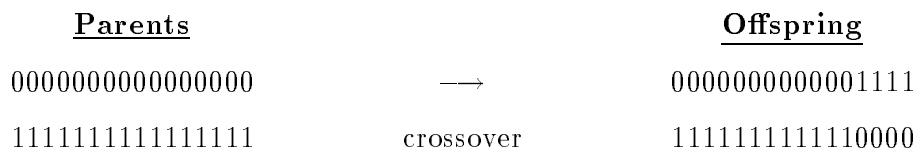

After the crossover stage has finished, the mutation stage begins. For every string that advances to the mutation stage, each of its bits is fipped with probability $p _ { m }$ . The population resulting from the mutation stage then overwrites the old population (the one prior to selection), to choose n individuals. Each tournament consists of sam lin k elements from the o ulation and mutation.

Many alternatives exist to the selection, crossover, and mutation operators presented above. We briefly mention a few that are relevant to this thesis. First of all, tournament selection (Brindle, 1981; Goldberg & Deb, 1991) is one alternative to roulette-wheel selection that is sensitive to relative rather than absolute fitnesses. Tournament selection holds $n$ tournaments to choose $n$ individuals. Each tournament consists of sampling $k$ elements from the population, and choosing the fittest one. The most common variation, binary tournament selection, uses $k = 2$

Elitist selection methods (De Jong, 1975) ensure that the best element or elements of the population survive from generation to generation. The most basic elitist strategy copies the best element from the current population to the next population, if that element has not been transferred through the normal process of selection, crossover, and mutation. Any standard selection method can be made elitist.

Two-point crossover (Cavicchio, 1970; Goldberg, 1989c) and uniform crossover (Syswerda, 1989) are alternatives to single-point crossover. In two-point crossover, two crossing sites are selected at random, and parent chromosomes exchange the segment that lies between the two crossing sites. In uniform crossover, each bit of the first parent is transferred to the first offspring with fixed probability; otherwise the bit is transferred to the second offspring. The rest of the loci on both offspring are filled in using the bits of the second parent.

# building block hypo

Newcomers to genetic algorithms often develop the impression that GAs simply improve upon populations of strings. This section examines the inner workings of a simple GA, including the mechanisms by which the GA arrives at its final solutions. The section reviews basic GA theory, including schemata, building blocks, implicit parallelism, the schema theorem, and the building block hypothesis.

# Schemata

While a GA on the surface processes strings, it implicitly processes schemata, which represent similarities between strings (Goldberg, 1989c; Holland, 1992). A GA can not, as a practical matter, visit every point in the search space. It can, however, sample a sufficient number of hyperplanes in highly fit regions of the search space. Each such hyperplane corresponds to a set of highly fit, similar substrings.

A schema is a string of total length $l$ (the same overall length as the population's strings), taken from the alphabet $\{ 0 , 1 , * \}$ , where $^ *$ ' is a wild-card or "don't care" character. Each between a schema's outermost xed bit- ositions. For ex $l$ am le the above schema is of order contain bits identical to those '0' and '1' bits of the schema. For example, the schema, $1 0 * * 1$ represents the set of five-bit strings, $\{ 1 0 0 0 1 , 1 0 0 1 1 , 1 0 1 0 1 , 1 0 1 1 1 \}$ . Schemata are also called similarity subsets because they represent subsets of strings with similarities at certain, fixed bit-positions. Two properties of schemata are their order and defining length. Order is the number of fixed bit-positions (non-wild-cards) in a schema. Defining length is the distance between a schema's outermost, fixed bit-positions. For example, the above schema is of order 3, written $o ( 1 0 * * 1 ) = 3$ , and has a defining length of 4, written $\delta ( 1 0 * * 1 ) = 4$ . Each string in the population is an element of $2 ^ { l }$ schemata.

# Building blocks

Building blocks are low-order, short defining-length, highly fit schemata (Goldberg, 1989c), where the fitness of a schema is defined as the average fitness of the elements it contains. Building blocks represent similarities (between strings) that are significant to the GA's solution of a particular problem.

Selection chooses strings with higher fitnesses for further processing. Hence strings that are members of highly fit schemata are selected a greater number of times. Crossover infrequently disrupts schemata with shorter defining lengths, and mutation infrequently disrupts lower order schemata. Therefore, highly fit, short defining-length, low-order schemata, otherwise known as building blocks, are likely to proliferate from generation to generation. From this fact comes the claim that GAs process building blocks, also known as useful schemata. Holland (1992) estimates that while a GA processes $n$ strings each generation, it processes on the order of $n ^ { 3 }$ useful schemata. He calls this phenomenon implicit parallelism. For the solution of real-world problems, the presence of implicit parallelism means that a larger population has the potential to locate a solution in polynomially faster time than a smaller population.

# Schema theorem

The simple GA, prior to significant convergence, allocates an exponentially increasing number of trials to useful schemata or building blocks. This is illustrated by the re-derivation of the following theorem. Let $m ( H , t )$ be the number of instances of schema $H$ present in the population that the cross $t$ ver oint falls within the schema's denin ositio $H$ those outermost xed or $m ( H , t + 1 )$ , in terms of $m ( H , t )$ . Recall that the simple GA assigns a string a probability of selection directly proportional to fitness. It follows from Equation 2.2 that $H$ can expect because a disr $m ( H , t ) \cdot ( f ( H ) / \bar { f } )$ re ain its com $f$ osition if it crosses with a similar s $f ( H )$ a. The average fitness of those strings in the population that are elements of $H$

small and small o H . The roduct of the ex ected number of selections and the survival that the crossover point falls within the schema's defining positions (those outermost, fixed bit-positions used to calculate the defining length). The probability that $H$ survives crossover m H t 1 m $\begin{array} { r } { \mathrm { ~ 1 ~ - ~ } p _ { c } \times \frac { \delta ( H ) } { l - 1 } } \end{array}$ 1  (H )  o H : 2: because a disrupted schema might regain its composition if it crosses with a similar schema. The probability that $H$ survives mutation is $( 1 - p _ { m } ) ^ { o ( H ) }$ , which can be approximated as $1 - o ( H ) p _ { m }$ for small $p _ { m }$ and small $o ( H )$ . The product of the expected number of selections and the survival probabilities (with the smallest multiplicative term omitted) yields what is known as the schema theorem:

$$
m ( H , t + 1 ) ~ \ge ~ m ( H , t ) \cdot { \frac { f ( H ) } { \bar { f } } } \cdot ( 1 - p _ { c } { \frac { \delta ( H ) } { l - 1 } } - o ( H ) p _ { m } ) ~ .
$$

The schema theorem states that building blocks grow exponentially over time, while belowaverage schemata decay at a similar rate. Holland (1992) connects the competing schemata of GAs to the multiarmed bandits of statistical decision theory. He states that an optimal solution to the bandit problem is to allocate greater than exponential numbers of trials to the observed best arm. The connection is that GAs perform sampling in a near optimal fashion.

Goldberg (1983, 1989c), in his detailed presentations of the schema theorem, puts forth the building block hypothesis, which states that "building blocks combine to form better strings". That is, the recombination and exponential growth of building blocks leads to the formation of better building blocks, which in turn leads to highly fit final solutions.

While the schema theorem is often predictive of schema growth, it is overly simplistic in some regards for describing a GA's behavior. First of all, $f ( H )$ and $f$ do not stay constant from generation to generation. Fitnesses of population elements shift significantly after the first few generations. Secondly, the schema theorem accounts for schema losses but not for schema gains. Schemata are often constructed by crossover and mutation. In addition, as a GA progresses, population elements look more and more alike, so that schemata which are disrupted by crossover tend to be regained immediately. Finally, the schema theorem is a theory of expectation and hence does not take variance into account; in many interesting problems, schema fitness variance can be quite high, making the detection of schemata that contain the global optimum a noisy process (Goldberg & Rudnick, 1991; Rudnick & Goldberg, 1991). Increasin either or or decreasin the selection ressure leads to increased sam

Despite its simplicity, the schema theorem describes several important aspects of a GA's behavior. Higher mutation probabilities increasingly disrupt higher order schemata, while higher crossover probabilities increasingly disrupt higher defining-length schemata. When selection is factored in, a population converges at a rate proportional to the ratio of the best individual's fitness to average population fitness; this ratio is one measure of selection pressure (Bäck, 1994). Increasing either $p _ { c }$ or $p _ { m }$ , or decreasing the selection pressure, leads to increased sampling or exploration of the search space, but does not allow as much exploitation of good schemata that the GA locates. Decreasing either $p _ { c }$ or $p _ { m }$ , or increasing the selection pressure, leads to increased use or exploitation of the better schemata, but does not allow as much exploration for good schemata. The GA must maintain an often delicate balance between what are commonly known as exploration and exploitation.

Some researchers have criticized the typically fast convergence of the GA, stating that the simultaneous testing of enormous quantities of overlapping schemata requires more sampling and The most recent International Conference on Genetic Algorithms (Forrest, 1993) showcased the work of over 200 researchers, in both the theory and application of GAs. Theoretical research covered the modelling and analysis of GAs

# genetic operators; the

The most recent International Conference on Genetic Algorithms (Forrest, 1993) showcased the work of over 200 researchers, in both the theory and application of GAs. Theoretical research covered the modelling and analysis of GAs using Markov chains and other statistical methods; the search for optimal control-parameter settings; the design of problem representations and search simulation structural o timization and trackin nonstationar environments. Current for niching and for the maintenance of population diversity; the parallel implementation of GAs; the design of hybrid GAs that incorporate ideas borrowed from neural networks, simulated annealing, fuzzy logic, hillclimbing, and tabu search; and the comparison of algorithms. Applied research covered problems in classification, combinatorial optimization, design, function optiromoted b Goldber and collea ues based u on the Wri ht Brothers analo mentioned in search, simulation, structural optimization, and tracking nonstationary environments. Current applications of GAs range from evolving drawings (E. Baker, 1993; Caldwell & Johnston, 1991; L. Davis, 1994), to composing music (Horner & Goldberg, 1991; Laine & Kuuskankare, 1994; Mc Intyre, 1994), to investing money (Bauer, 1994; Mahfoud & Mani, in press).

A line of GA research influential to this thesis is the methodology for analysis and design promoted by Goldberg and colleagues, based upon the Wright Brothers analogy mentioned in Chapter 1 (Goldberg, 1993a, 1993b, 1993c). In the remainder of the current chapter, we review this methodology, mention the possibility of fast-convergence proofs for GAs, and place this thesis into the broad spectrum of GA research.

The Wright Brothers decomposed the design of the powered aircraft into three subproblems — "lateral stability", "lift and drag", and "propulsion" (Goldberg, 1993a, 1993c). They tackled each subproblem separately, and later pieced together the results. Their approach was highly successful, despite the fact that the subproblems were not entirely separable. Goldberg recommends designing other complex systems, such as GAs, by following the Wright Brothers' for \unforeseen interactions". ble, he recommends finding an approximate and intuitive decomposition into "quasi-separable ur ose GA in which the oal is to locate a sin le lobal solution. The decom ose the desi n of using whatever tools are most effective. Tools include intuition, experimentation, and "rough mutation in the desi n this removal of mutation can be viewed as an immediate decom osition is to reassemble the full problem, using experimentation to fine-tune the design to compensate for "unforeseen interactions".

Goldberg, Deb, and Clark (1992) have put forth a decomposition for designing a generalpurpose GA in which the goal is to locate a single, global solution. They decompose the design of a "selecto-recombinative" GA in terms of building-block processing. (They do not incorporate mutation in the design; this removal of mutation can be viewed as an immediate decomposition of the simple GA.) Specifically, the authors present several subproblems, involving building blocks, whose solution should lead to the design of a better GA.

The first subproblem is to bound the difficulty of problems that the GA must solve. Much work has been done to characterize the functions that are most difficult for a GA to optimize (Bethke, 1980; Brindle, 1981; Das & Whitley, 1991; Davidor, 1991a; Deb & Goldberg, 1993, 1994; Forrest & Mitchell, 1993; Goldberg, 1987, 1989a, 1989b, 1991a, 1991b, 1992; Goldberg, Korb, & Deb, 1989; Grefenstette, 1993; Kargupta, Deb, & Goldberg, 1992; Kinnear, 1994; Liepins & Vose, 1990, 1991; Mason, 1991; Whitley, 1991). It is generally recognized that GAsin le o timum Brindle 1981 Goldber Deb & Horn 1992 Horn & Goldber in ress . Horn & Goldberg, in press): multiple optima; isolation of desired optima; misleading optima Clark 1992 . That leaves isolation and misleadin ness as the remainin sources of hardness. and noise between schema partitions. (A schema partition of the search space, given a set of the most dicult for the GA to solve. Dece tive roblems Goldber 1987 are widel studied by itself, can be ignored as a source of hardness for the GA, if one wishes to locate only a single optimum (Brindle, 1981; Goldberg, Deb, & Horn, 1992; Horn & Goldberg, in press). The problem of noise can be handled through appropriate population sizing (Goldberg, Deb, & Clark, 1992). That leaves isolation and misleadingness as the remaining sources of hardness.

Problems which have both misleading optima and isolated, desirable optima should be the most difficult for the GA to solve. Deceptive problems (Goldberg, 1987) are widely studied examples. Classic deceptive problems have a global optimum and another local optimum, called the deceptive optimum. The global optimum has a small basin of attraction, while the deceptive optimum has a large basin of attraction. To make matters worse, the deceptive optimum is similar in fitness to the global optimum.

Formally, deceptive problems are defined in terms of schema partitions. A schema partition is deceptive if the schema containing the deceptive optimum is ftter than all other schemata in the partition. A problem is order- $x$ deceptive if all partitions containing schemata of less than order $x$ are deceptive.

Deceptive problems are useful in the analysis, testing, and design of GAs because they are of bounded difficulty (order $x$ ). GAs that solve deceptive problems should also be able to solve other problems of up to the same level of difficulty. Furthermore, analysis can determine the order of deception of any objective function (Goldberg, 1989b; Homaifar, Qi, & Fost, 1991). However, one must be careful that a problem which has a certain order of deception does not have a higher level of difficulty along another dimension of problem hardness.

The second subproblem of Goldberg, Deb, and Clark's decomposition is to ensure correct decision-making in the presence of schema noise. They solve this subproblem through adequate 1 attack this sub roblem. The authors rst size their o ulations usin oldber Deb amount of signal sufficient to overcome a level of estimated noise (Goldberg, Deb, & Clark, 1992; Goldberg & Rudnick, 1991; Kargupta & Goldberg, 1994; Rudnick & Goldberg, 1991). Smith (1993) presents a method for adaptively estimating schema noise.

The third subproblem is to construct desired solutions via the beneficial mixing or exchange of building blocks. Two recent studies (Goldberg, Deb, & Thierens, 1993; Thierens & Goldberg, 1993) attack this subproblem. The authors first size their populations using Goldberg, Deb, and Clark's (1992) population-sizing formulas. They then relate mixing success and mixing failure to crossover probability and selection pressure.

An issue related to mixing is linkage. Recall that schemata with high defining lengths are likely to be disrupted by single-point crossover. If the GA is to solve problems in which the fixed bit-positions of useful schemata are highly separated, a mechanism must be introduced to bring those fixed bit-positions closer together. Holland (1992) suggests the inversion of string segments as a reordering operator. Although inversion is intuitively appealing, it must be applied sparingly in order to function properly (Holland, 1992; Goldberg & Bridges, 1990).

Goldberg, Korb, and Deb (1989) conclude that inversion is impractical for the GA, because its required time frame (to produce good results) is much greater than the time frames for other wa is to ensure that the re uired buildin blocks are resent u on initialization either Korb, & Deb, 1989; Merkle & Lamont, 1993) contains a promising approach to reordering that has solved order-5 deceptive problems of up to 150 bits, in subquadratic time with respect to the number of bits (Goldberg, Deb, Kargupta, & Harik, 1993).

A fourth subproblem is to provide the GA an "adequate supply of building blocks". One way to provide these building blocks is to introduce diversity throughout the GA run. Another way is to ensure that the required building blocks are present upon initialization, either through sufficiently high population-sizing (Goldberg, Deb, & Clark, 1992), partially enumerace of selection and conse uentl the rate of buildin block rowth. (Goldberg, Deb, Kargupta, & Harik, 1993).

vin fast lobal conver ence for the sim le GA. We em hasize ast lobal conver ence block growth via selection. Goldberg and Deb (1991) find that convergence time for most selection methods is proportional to $\log n$ , where $n$ is population size. Selection pressure determines the base of the logarithm. Therefore, by adjusting selection pressure, the user can control the pace of selection and, consequently, the rate of building block growth.

With the above decomposition in mind, we briefly examine the tantalizing possibility of 1989 Romeo & San iovanni-Vincentelli 1991 . A roof of fast lobal conver ence for the A would assume an u er bound on roblem dicult and would be as m totic in nature. space or infinite time for mutation to locate the global optimum. One of the more interesting results is the extension of simulated annealing's asymptotic convergence proofs to variations condence and relative ualit arbitraril hi h. either an infinite number of iterations or an exponential number of coolings (Aarts & Korst, selection and crossover as an absorbin Markov chain Lial & Miller 1989 Mahfoud 1993 GA would assume an upper bound on problem difficulty, and would be asymptotic in nature. An asymptotic proof ensures, with a fixed confidence, the location of a final solution within a certain qualitative distance of the global optimum; the right parameter settings can make both confidence and relative quality, arbitrarily high.

The existence of a fast-global-convergence proof is highly likely. One can model a GA with selection and crossover, as an absorbing Markov chain (Lial & Miller, 1989; Mahfoud, 1993), with all possible populations as states. This Markov chain has $2 ^ { \it l }$ absorbing states, where $l$ is the robabilit of movin from startin states with nearl uniforml distributed alleles to string. By definition, there exists a nonzero probability of ultimate transition from a variety of starting states to each absorbing state. It follows that there exists a nonzero probability of ultimate transition from a variety of starting states to an absorbing state containing all globally optimal strings. We call such an absorbing state a globally optimal state. A proof would relate parameters such as population size, probability of crossover, and selection pressure, so that be taken in GA modellin anal sis and desi n that will lead to a better understandin of how within some qualitative distance of a globally optimal state, reached a sufficiently high level. taken ste s toward increasin our understandin . under a variety of settings for the other control parameters.

Despite the likely existence of a fast-global-convergence proof, it is undoubtedly still too early in the evolution of GA research to focus attention upon one. Many small steps remain to be taken in GA modelling, analysis, and design, that will lead to a better understanding of how cult . e will se arate out and then i nore for the most art the issue of noise since rior results can be used directl Goldber Deb & C

Like the approach of Goldberg and colleagues, this thesis follows a methodology of problem decomposition, this time applied to the modelling, analysis, and design of niching GAs. Since the goal in niching is to find multiple solutions, multimodality becomes the major source of problem hardness. However, isolation and misleadingness are also significant sources of difficulty. We will separate out and then ignore, for the most part, the issue of noise, since prior results can be used directly (Goldberg, Deb, & Clark, 1992; Goldberg & Rudnick, 1991; Kargupta & Goldberg, 1994; Rudnick & Goldberg, 1991). We will make use of test functions from the literature that are both massively multimodal and deceptive (Deb, Horn, & Goldberg, 1993; Goldberg, Deb, & Horn, 1992; Horn & Goldberg, in press).

As stated in the previous chapter, the ultimate goal of this research is to make progress in the design of general-purpose niching GAs. Therefore, this thesis builds upon prior research in population diversity and niching methods. This thesis also takes prior research on the modelling of GAs, in new, more productive directions. In subsequent chapters, we review prior methods for promoting population diversity, for niching, and for modelling GAs.

# Chapter 3

# ness solutions and discaHowever, given alternati

In prior GA literature, niching methods have been the by-products of a quest for techniques to promote population diversity. The simple GA's selection mechanism replicates higher fitness solutions and discards lower fitness solutions, leading to convergence of the population. However, given alternative solutions of identical fitness, the population will still converge. The from the a lication of crossover and mutation which are ca able of directl destro in ood noise, and operator disruption. Selection pressure is the result of the expected value of the selection process: lower fitness solutions are expected to disappear from a finite population. Selection noise results from the variance of the selection process: in a finite population, random choices among identically fit, competing subsolutions add noise to the expected count for each individual, eventually forcing good solutions from the population. Operator disruption results from the application of crossover and mutation, which are capable of directly destroying good solutions.

Techniques for diversifying a population typically reduce either selection pressure, selection noise, or operator disruption (or some combination). This chapter examines prior techniques for promoting population diversity that do not qualify as niching methods. The boundary between diversification techniques and bona fide niching methods is explained at the end of this chapter and at the beginning of Chapter 4. Chapter 4 reviews prior niching methods.

The remainder of the present chapter commences by motivating the need for diversity in GAs. Next, it constructs simple optimization problems on which the traditional GA fails because of a lack of diversity. It explores the variance and the expectation of the selection scheme, as well as the disruption due to other operators, as potential culprits. Afterward, the chapter examines previous diversification methods and the approaches they take to promote Consider the eight-bit, example function below, a small \royal road" function (Forrest & how prior measures of diversity fit within this framework. Finally, this chapter explores the >>> 20 ; if x = 11111111 ; otherwise ,

# 3.1 Motivation

Consider the eight-bit, example function below, a small "royal road" function (Forrest & Mitchell, 1993):

$$
E I \left( x \right) ~ = ~ \left\{ \begin{array} { l l } { { 2 0 ~ , ~ \mathrm { i f } ~ x = 1 1 1 1 1 1 1 ~ ; ~ \mathrm { o t h e r w i s e } ~ , } } \\ { { 1 0 ~ , ~ \mathrm { i f } ~ x \in \ast \ast \ast \ast 1 1 1 1 ~ ; ~ \mathrm { o t h e r w i s e } ~ , } } \\ { { 1 0 ~ , ~ \mathrm { i f } ~ x \in 1 1 1 1 \ast \ast \ast ~ ; ~ \mathrm { o t h e r w i s e } ~ , } } \\ { { ~ 1 ~ . } } \end{array} \right.
$$

The function $E I$ has a single global optimum that occurs when all bits are set to '1'. It also has two stepping stones to the global optimum — plateaus of intermediate fitness — each containing 16 solutions. All other solutions have the lowest fitness of 1.

We run the simple GA on $E I$ , using roulette-wheel selection (RWS), population size $n = 1 6$ and typical settings for crossover probability ( $p _ { c } = . 9$ ) and mutation probability $p _ { m } = . 0 1$ ). The of these elements dier in onl one or two bits. The diversit that remains is due rimaril to the random bit-
i in of mutation. We examine mutation as a otential mechanism for Results are shown in Table 3.1.

The population locates the global optimum after only one generation, and substantially converges after only three generations. The initial population (Generation 0) consists of 16 unique elements. The final population, however, contains only 7 different elements, and many of these elements differ in only one or two bits. The diversity that remains is due primarily to the random bit-flipping of mutation. (We examine mutation as a potential mechanism for diversity, later in this chapter.)

The simple GA with $n = 1 6$ successfully locates the global optimum of $E I$ . We attribute the GA's success to its having an initial population large enough to contain building blocks that the A locates the lobal o timum at eneration 2 but loses it the next eneration are represented by one element apiece in the initial population.

2 9.13 01110000 11101111 1 $n = 1 6$ 0 $p _ { c } ~ = ~ . 9$ 1 111 $p _ { m } ~ = ~ . 0 1$ 11111 01111100 11 $E t$ 0011 1111111 $g$ 00001110 00000010 01110101 1111111 $\bar { f }$   

<table><tr><td rowspan=1 colspan=1>g</td><td rowspan=1 colspan=1>f$</td><td rowspan=1 colspan=1>The Population</td></tr><tr><td rowspan=1 colspan=1>0</td><td rowspan=1 colspan=1>2.13</td><td rowspan=1 colspan=1>10100000 11110010 11000100 11011100 10000100 10101100 11010000 0111111100000101 10001100 10001101 00100101 01000011 01010011 00000001 00100110</td></tr><tr><td rowspan=1 colspan=1>1</td><td rowspan=1 colspan=1>4.44</td><td rowspan=1 colspan=1>0000000011010101 01110101 00000010 11110000 10000110 11110011 011111001101001011110000 01111110 10101101 01111111 01111011 00001110 11111111</td></tr><tr><td rowspan=1 colspan=1>2</td><td rowspan=1 colspan=1>9.13</td><td rowspan=1 colspan=1>011100001110111111110000 1111111111110011 1111111101111100111100111111111100001110 00000010 01110101 11111111 11110000 01111111 01111100</td></tr><tr><td rowspan=1 colspan=1>3</td><td rowspan=1 colspan=1>10.75</td><td rowspan=1 colspan=1>11111011 11011111 11111111 11110011 00000011 11110010 11110111 1111101111011111 11111111 11110111 11111000 11111111 11101111 11111101 01110111</td></tr><tr><td rowspan=1 colspan=1>4</td><td rowspan=1 colspan=1>10.63</td><td rowspan=1 colspan=1>11011111 11111111 11111001 11111011 11011111 11110111 11011111 1101111111101111 11110010 11101111 11111000 11111011 11111011 11011111 11110111</td></tr><tr><td rowspan=1 colspan=1>5</td><td rowspan=1 colspan=1>8.31</td><td rowspan=1 colspan=1>11110111 11101101 11111011 11011111 11110111 11101111 11011111 111110111101111111111011 11111010 11111011 11110111 10111111 11100111 11100111</td></tr><tr><td rowspan=1 colspan=1>6</td><td rowspan=1 colspan=1>10.06</td><td rowspan=1 colspan=1>1101101111110111 11110111 11111011 11111011 11011111    11111 1111101111110111 11101111 11101111 10111111 11101111 11111011 01101111 11101111</td></tr><tr><td rowspan=1 colspan=1>7</td><td rowspan=1 colspan=1>10.19</td><td rowspan=1 colspan=1>1110111111111011 11101111 01101111 11110111 1111101111101011 1111111111111111 11101011 11101111 11111111 11101111 11101111 11101101 01101111</td></tr></table>

In many real-world problems, time or memory limitations restrict the size of the population, so that it does not contain the required building blocks upon initialization. Consider what run and never encounters either late $E t$ , using the smaller population size $n = 8$ ; all other parameter settings, including the convergence criterion, remain the same. Table 3.2 shows that the GA locates the global optimum at Generation 2, but loses it the next generation, and never recovers it. (The run ends after six generations.) The GA also manages to lose all representatives of one of the plateaus. After the final generation, five distinct elements remain. The same experiment with $n = 4$ fails to locate the global optimum at any point during the run, and never encounters either plateau.

What the smaller population GA apparently needs and what many researchers have sug gested is a mechanism to either maintain or reintroduce diversity. The maintenance of diversity has most often been the focus. The reason for emphasizing maintenance is illustrated by running the GA on example function $E 2$ , shown in Figure 3.1. An eight-bit function of unitation, $E 2$ contains two global maxima, one at 00000000 and one at 11111111; an equal number of loses it b the end of the run. A run with n = 2 is illustrated in Table . . the number of '1' bits contained in a string. For example, if $x$ is an eight-bit string, and $c o u n t ( x )$ is the number of ones that $x$ contains, $f ( c o u n t ( x ) )$ is a function of unitation.

4 8.88 11111110 11110010 1 $n = 8$ 0 $p _ { c } ~ = ~ . 9$ 10 111 $p _ { m } ~ = ~ . 0 1$ 00110 11110010 11 $E t$ 0110 5 7.75 1111011 $g$ 11010010 11110011 11110010 1110011 $\bar { f }$   

<table><tr><td rowspan=1 colspan=1>g</td><td rowspan=1 colspan=1></td><td rowspan=1 colspan=1>The Population</td></tr><tr><td rowspan=1 colspan=1>0</td><td rowspan=1 colspan=1>3.25</td><td rowspan=1 colspan=1>10100000 11110010 11000100 11011100 10000100 10101100 11010000 01111111</td></tr><tr><td rowspan=1 colspan=1>1</td><td rowspan=1 colspan=1>5.50</td><td rowspan=1 colspan=1>01110100 11001111 01110111 01111010111100101111001011110000 11010000</td></tr><tr><td rowspan=1 colspan=1>2</td><td rowspan=1 colspan=1>10.13</td><td rowspan=1 colspan=1>11111111 11000010 11110010 11110010 11110010 11110110 11110010 11110010</td></tr><tr><td rowspan=1 colspan=1>3</td><td rowspan=1 colspan=1>8.88</td><td rowspan=1 colspan=1>11110010 11100110 11110010 11110110 11110010 11110010 11110011 11111110</td></tr><tr><td rowspan=1 colspan=1>4</td><td rowspan=1 colspan=1>8.88</td><td rowspan=1 colspan=1>11111110 11110010 11110010 11110010 11110011 11100110 11110010 11110110</td></tr><tr><td rowspan=1 colspan=1>5</td><td rowspan=1 colspan=1>7.75</td><td rowspan=1 colspan=1>11110111 1101001011110011 1111001011100110111100101111001111110010</td></tr><tr><td rowspan=1 colspan=1>6</td><td rowspan=1 colspan=1>7.75</td><td rowspan=1 colspan=1>11010011111100111111001011110111110100111111011011111001111110010</td></tr></table>

the lobal o timum from the o osit $p _ { c } = . 9$ 0000 $p _ { m } = . 0 1$ ears $E 2$ the o ulation. B the sizes. Populations of size $n = 2$ $n = 4$ , and $n = 8$ fail to locate either optimum at any point during the run. A population of size $n = 1 6$ finds one global optimum early in the run, but loses it by the end of the run. A run with $n = 3 2$ is illustrated in Table 3.3.

Note that the initial population is lucky enough to contain one of the global optima, n = 128 does too after 26 enerations des ite the fact that the initial o ulation contains both lobal o tima. After 25 enerations n = 256 also conver es about 00000000 so does end of the run, most population elements converge to 00000000, and all nonglobal population elements are either one or two bits away from 00000000.

One might expect a larger population to locate and maintain both global optima. However, $n = 6 4$ , like $n = 3 2$ , converges about the global optimum, 00000000, after only 20 generations; $n \ = \ 1 2 8$ does too, after 26 generations, despite the fact that the initial population contains both global optima. After 25 generations, $n \ = \ 2 5 6$ also converges about 00000000; so does $n \ = \ 5 1 2$ , this time after 29 generations. A population of size $n \ : = \ : 1 0 2 4$ converges, after 29 generations, about the opposite global optimum, 11111111. Even $n ~ = ~ 2 0 4 8$ converges, after only 33 generations, about 1111111, performing 69,632 function evaluations in the process.

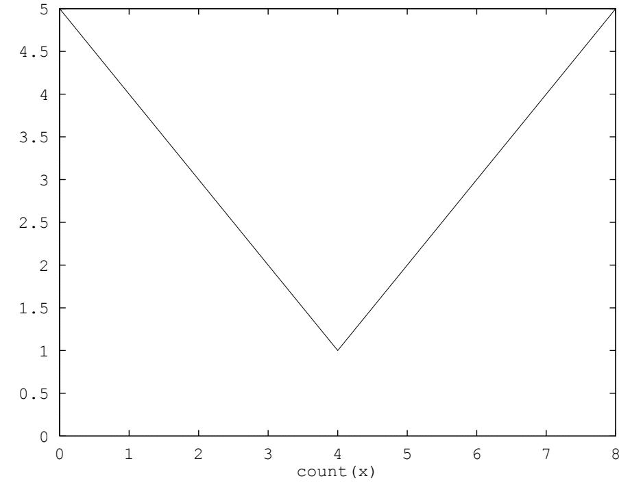  
Figure 3.1: Function $E 2$ is displayed over unitation space.

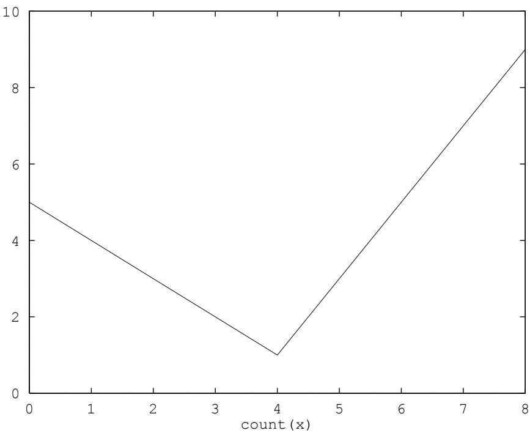  
Figure 3.2: Function $E \mathcal { J }$ is displayed over unitation space.

4 3.03 00000101 01111111 0 $n = 3 2$ 1 $p _ { c } ~ = ~ . 9$ 1 100 $p _ { m } ~ = ~ . 0 1$ 01011 00010000 11 $E 2$ 001 0110010 $g$ 01111001 10000001 00000000 0000000 $\bar { f }$   

<table><tr><td rowspan=1 colspan=1>g</td><td rowspan=1 colspan=1>\f$</td><td rowspan=1 colspan=1>The Population</td></tr><tr><td rowspan=1 colspan=1>0</td><td rowspan=1 colspan=1>2.25</td><td rowspan=1 colspan=1>10100000 11110010 11000100 11011100 10000100 10101100 11010000 0111111100000101 10001100 10001101 00100101 01000011 01010011 00000001 0010011011010011 01000001 00010101 01100111 10110011 10100101 11000001 1111111100010101 10100000 11000100 10111000 11010010 10100011 11011011 11011111</td></tr><tr><td rowspan=1 colspan=1>4</td><td rowspan=1 colspan=1>3.03</td><td rowspan=1 colspan=1>00000101 01111111 00011111 01100001 10011111 10101011 00010000 1100000101100101 01111001 10000001 00000000 00000001 00010001 01111101 0111110111111011 00010111 01100001 11011101 11000101 00000000 11011111 0111110110111111 01000000 10000000 00011111 00000000 01000000 10000011 00010100</td></tr><tr><td rowspan=1 colspan=1>8</td><td rowspan=1 colspan=1>3.50</td><td rowspan=1 colspan=1>11010000 00001111 00000101 00010100 10111111 01000000 00111000 1010111000111000 00000011 10000000 10001000 00111111 00000000 00000000 1000000010101000 10000000 00011111 11000000 00000000 00000000 01100000 0010100011000000 10000000 00000000 00000000 00000100 10000000 00000000 00000000</td></tr><tr><td rowspan=1 colspan=1>12</td><td rowspan=1 colspan=1>4.16</td><td rowspan=1 colspan=1>10000000 00001000 10000000 01000000 10000000 00001000 00110000 0000000010000000 00000000 10001000 10000000 00110000 10100000 00000000 1000010000000000 00000000 10000000 10001000 00000000 10000000 00000000 0000000000000000 00000000 10100000 00000000 10000000 11000000 00000000 00000000</td></tr><tr><td rowspan=1 colspan=1>16</td><td rowspan=1 colspan=1>4.69</td><td rowspan=1 colspan=1>00000000 10000000 00000000 00000000 00000000 00000000 00000000 0000000000000000 00000000 00000000 00000000 00000000 10000000 00000000 1000000010000000 10000000 00000000 00000000 00000000 00100000 10000000 0000000000000000 00000000 01000100 00000000 00000000 10000000 00000000 00000000</td></tr><tr><td rowspan=1 colspan=1>18</td><td rowspan=1 colspan=1>4.59</td><td rowspan=1 colspan=1>00000000 10000000 01000000 00000100 01000000 00000000 00000000 0100000000000000 00000000 01000100 00000000 00000000 00000000 00000000 0000001000000100 01010000 00000000 00000000 00000000 00000000 00000000 0000000000000000 01000000 00000000 00000000 00000010 00000000 00000000 00000000</td></tr></table>

This number of function evaluations is 272 times the size of the search space! Apparently, the population, regardless of size, is unable to maintain both global optima. We propose that this behavior, as well as the earlier loss of diversity on $E t$ , can be attributed mainly to the high variance of roulette-wheel selection, with operator disruption possibly playing a minor part. We examine the first part of this conjecture in Section 3.2, and the second part in Section 3.5.

Let us consider one more example, eight-bit unitation function $E \mathcal { J }$ , shown in Figure 3.2. $E \mathcal { B }$ differs from $E 2$ in that the 11111111 optimum is higher and has a steeper path leading up to it. Function $E \mathcal { B }$ is similar to Ackley's (1987) "two-max" function. $E \mathcal { B }$ has one global optimum, 11111111, and one nonglobal, local optimum, 0000000. Suppose we are interested in locating and maintaining both optima. Our GA must contend not only with selection noise and operator disruption, but also with selection pressure, which pushes the population toward and kee s it until th

4 4.25 01111110 11011111 1 $n = 8$ 1 $p _ { c } ~ = ~ . 9$ 11 001 $p _ { m } ~ = ~ . 0 1$ 00011 11011111 11 $L 3$ 1111 5 6.25 0011101 $g$ 11111111 00011111 11111111 1101111 $\bar { f }$   

<table><tr><td>g</td><td>f</td><td></td><td>The Population</td><td></td></tr><tr><td>0</td><td>3.00</td><td>10100000 11110010 11000100 11011100 10000100 10101100 11010000 01111111</td><td></td><td></td></tr><tr><td>1</td><td>2.38</td><td>01111100 11011111</td><td>00100111 01111000 11000100 11011100 11110000 10101100</td><td></td></tr><tr><td>2</td><td>3.25</td><td>11011100 01111111 11000101</td><td>11011110 00100111 00100011</td><td>11011110 11000100</td></tr><tr><td>3</td><td>3.63</td><td>00101110 11000011 11000101</td><td>00100011 01111110 11011111</td><td>11011111 01111110</td></tr><tr><td>4</td><td>4.25</td><td>01111110 11011111 11000011</td><td>11000011 00111111 11000011</td><td>11011111 11011111</td></tr><tr><td>5</td><td>6.25</td><td>00111011 11111111 00011111</td><td>11111111 11011111</td><td>11011111 00111111 11011111</td></tr><tr><td>6</td><td>7.00</td><td>00011111 11111111 11111111</td><td>11011111 11111111</td><td>00111011 11111111 11011111</td></tr><tr><td>7</td><td>7.75</td><td>11011111 11111111 11011011</td><td>11011111 11011111</td><td>11111111 11111111 11111111</td></tr><tr><td>8</td><td>7.75</td><td>11111111 11011011 11111111</td><td>11111111 11011111 11011111</td><td>11011111 11111111</td></tr><tr><td>9</td><td>7.75</td><td>11011111 11111101 11011111</td><td>11111111 11011111 11111111</td><td>1 11111111 11011111</td></tr><tr><td>10</td><td>6.75</td><td>11011111 11011 l11 111 111111</td><td>1110 111 1111 1 1 11 1 11111 1 10011111 1</td><td>11001111 11010111</td></tr></table>

We run the same GA on $E \mathcal { J }$ as we did for the previous two problems (with RWs, $p _ { c } = . 9$ and $p _ { m } = . 0 1$ ). At $n = 2$ and $n = 4$ , the GA never locates either optimum. At $n = 8$ , shown in Table 3.4, the GA never encounters the local optimum, but finds the global optimum in Generation 5, and maintains it through the end of the run. At $n ~ = ~ 1 6$ , the GA finds the global optimum in Generation 1, loses it the next generation, rediscovers it in Generation 5, and keeps it until the end of the run; the GA never encounters the local optimum. At $n = 3 2$ the GA briefly discovers the local optimum in Generation 2, but permanently loses it the next generation; the initial population contains the global optimum, which the GA maintains through the end of the run. For all $n \geq 8$ that we test, the population converges in the end about the 11111111 point. For $n$ of 32, 64, 128, 256, 512, 1024, and 2048, the initial population contains the global optimum, and the global optimum remains in the population through the end of the run. The local optimum is not so fortunate. At $n = 6 4$ , the local optimum is never discovered. For $n$ of 128, 256, 512, 1024, and 2048, the initial population contains between 1 and 10 copies of the local optimum, but in each case, the local optimum disappears from the hinders the formation and maintenance of non lobal o tima.

When both global and nonglobal optima are of interest, we propose that selection pressure becomes an adversary (in addition to selection noise and operator disruption). Selection pressure is also a factor when less fit subsolutions are required for constructing one or more optima. In the previous section, we conjectured that the high variance of roulette-wheel selection was the primary cause of the observed loss of solutions and subsolutions, especially in cases where solutions or subsolutions were identically t. To further exam

# We conduct the following e

In the previous section, we conjectured that the high variance of roulette-wheel selection was the primary cause of the observed loss of solutions and subsolutions, especially in cases where solutions or subsolutions were identically fit. To further examine the variance of RWS, we must first isolate RWS from the rest of the GA, namely the crossover and mutation operators.

We conduct the following experiment using RWS only ( $p _ { c } ~ = ~ 0$ $p _ { m } ~ = ~ 0$ , and $n ~ = ~ 1 6$ ). Consider the one-bit function $E _ { 4 } ^ { \prime }$ , in which $E _ { 4 } ( 0 ) = E _ { 4 } ( 1 ) = 1$ . The initial population is uniform, with eight 0s and eight 1s. Figure 3.3 tracks the population distribution over time. With RWS isolated, the essential component of the GA's behavior on $E 1$ and $E 2$ repeats itself on $E 4$ . The population soon converges to all 1s. Note that it could just as easily have converged to all Os; since the two solutions have the same fitness, the GA does not prefer one over the other. Over the course of 10 runs, the average time to full convergence is 21.9 generations. Six behavior of is analo ous in some wa s to the amb $0 \mathrm { s }$ r'

Other GA researchers have noted similar behavior on a variety of problems. While many researchers blamed the vague notion of premature convergence, a few, starting with De Jong in his 1975 dissertation, were able to identify the real culprit — the variance of selection.

One might logically ask how long it takes a population of 0s and 1s to fully converge. If selection noise is the only factor at work, as on $E _ { 4 } ^ { \prime }$ , convergence is linear in population size. The behavior of RWS is analogous in some ways to the gambler's ruin, in which a gambler with a certain amount of money places successive, fixed sized bets. The gambler plays until either going bankrupt or doubling his/her money, at which point the gambler leaves the table. Goldberg and Segrest (1987) use this analogy, along with Markov chain computations, to show that the expected time under RWS for either the $\cdot _ { 0 } \cdot$ or $1 ^ { \prime }$ allele to take over a specified percentage of the population, is linear with respect to population size. They define the takeover point as the first generation in which either allele achieves or surpasses the specified percentage. The to a lication of . This variance is 2 = n i 1  i where i is the selection They show that as mutation probability increases, takeover time grows from a linear function of population size to an exponential function.

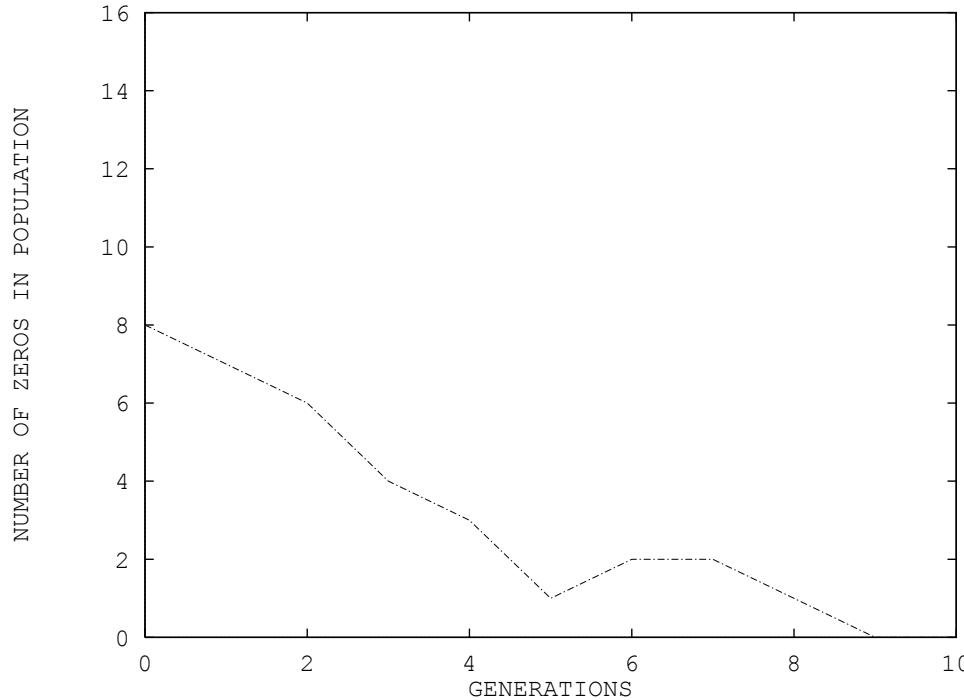  
Figure 3.3: RWS runs on $E \acute { \iota }$ , with $n = 1 6$ $p _ { c } = 0$ , and $p _ { m } = 0$ . The starting distribution is authors a

Having identified the variance of RWS as a major problem, we now quantify that variance. Brindle (1981) computes the variance in the number of instances of solution $i$ expected after application of RWS, where $i$ is any element of the search space present in the population prior to application of RWS. This variance is $\sigma _ { i } ^ { 2 } = n p _ { s } ( i ) ( 1 - p _ { s } ( i ) )$ , where $p _ { s } ( i )$ is the selection probability for $i$ . (We re-derive this variance in a later chapter, but for classes of solutions rather than single solutions.) She proves that RWS has higher variance than five other fitnessproportionate selection schemes, and demonstrates RWS's inferior performance on several test functions. Other authors (J. E. Baker, 1987; Booker, 1982; De Jong, 1975) also obtain worse empirical results with RWS than with lower variance selection schemes.

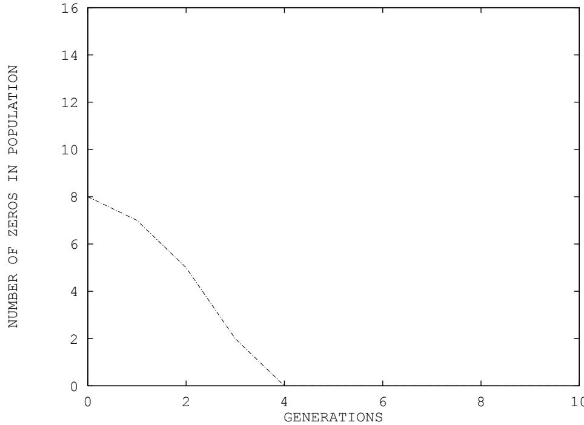  
(Goldberg & Deb, 1991). G $E 5$ berg a $n = 1 6$ e $p _ { c } = 0$ 7) sho $p _ { m } = 0$ given two unequally t alleles, uniform.

# the weaker allele wins in the long ru

Having alleles of equal fitness is the best scenario when trying to maintain diversity. When The o ulation soon conver es to the lobal o timum as it reviousl did on the more (Goldberg & Deb, 1991). Goldberg and Segrest (1987) show that given two unequally fit alleles, the higher the fitness differential, the faster the expected convergence, and the less likely that the weaker allele wins in the long run. We illustrate their result, using the one-bit problem $E 5$ in which $E 5 ( 0 ) = 1$ and $E 5 ( 1 ) = 2$ . We again use RWS only $p _ { c } = 0$ $p _ { m } = 0$ , and $n = 1 6$ ), along with uniform initialization. Figure 3.4 shows the temporal population distribution.

The population soon converges to the global optimum, as it previously did on the more complex function $L 3$ . We conduct 10 additional runs to examine whether convergence is due to the expectation or the variance of selection. Unlike on $E \acute { \iota }$ , all 10 populations converge to all 1s. The average time to full convergence is only 4.4 generations, compared with 21.9 generations on $E \acute { 4 }$ . Barring the influence of some unknown force, the stronger force of selection pressure is primarily responsible for the loss of diversity on $E 5$

In the previous section, we demonstrated that selection noise (or variance) can cause a population to converge fairly rapidly to one of a set of identically fit solutions or subsolutions. In the current section, we have shown that selection pressure (or expectation) is an obstacle Operators allow GAs to explore the search space. However, operators typically have destructive as well as constructive eects. Ideally, if the GA has located an optimal solution or subsolution, the GA's oper

# ability we have been using. Researche

Subse uent studies have redominantl veried this discover . Therefore we assume that muas well as constructive effects. Ideally, if the GA has located an optimal solution or subsolution, the GA's operators should leave that solution or subsolution intact.

The mutation operator is typically applied in small doses, such as the .01 mutation probre-derivation of the schema theorem shows that schemata with hi h denin len ths are likel found that higher rates of mutation push the GA's behavior towards that of random search. Subsequent studies have predominantly verified this discovery. Therefore, we assume that mutation occurs infrequently and hence causes negligible disruption. This assumption allows us hi hest: crossover must fre uentl mix com lementar bits. Function E2 is one such functi

Crossover disruption is minimal on some problems, but prominent on others. Chapter 2's re-derivation of the schema theorem shows that schemata with high defining lengths are likely to be disrupted by single-point crossover. However, this unary view is rather limited, since crossover is a binary operator. When a problem contains solutions or subsolutions of interest that differ greatly amongst themselves, one can expect disruption due to crossover to be at its This section reviews proposed mechanisms for promoting genetic diver $E 2$ y that, by themselves, do not qualify as niching methods. We ca $E 2$ assify previous diversication methods under three major categories:

# 3.5 Previous Research

This section reviews proposed mechanisms for promoting genetic diversity that, by themselves, do not qualify as niching methods. We can classify previous diversification methods under three major categories: those which attempt to reduce selection noise, those which attempt to reduce selection pressure, and those which attempt to reduce operator disruption. Diversification methods and their corresponding categories are summarized in Table 3.5. Some diversification schemes attempt a combination of the three approaches, and hence fall under more than one multi le l

Adjusted Control Parameters X X X Multiple Parallel Runs X X   

<table><tr><td rowspan=1 colspan=1>Category</td><td rowspan=1 colspan=1>Selection Noise</td><td rowspan=1 colspan=1>Selection Pressure</td><td rowspan=1 colspan=1>Operator Disruption</td></tr><tr><td rowspan=1 colspan=1>Direct Infusion</td><td rowspan=1 colspan=1></td><td rowspan=1 colspan=1></td><td rowspan=1 colspan=1></td></tr><tr><td rowspan=1 colspan=1>Noise-Reduced Selection</td><td rowspan=1 colspan=1>X</td><td rowspan=1 colspan=1></td><td rowspan=1 colspan=1></td></tr><tr><td rowspan=1 colspan=1>Multiple Sequential Runs</td><td rowspan=1 colspan=1>X</td><td rowspan=1 colspan=1></td><td rowspan=1 colspan=1></td></tr><tr><td rowspan=1 colspan=1>Restricted Mating</td><td rowspan=1 colspan=1></td><td rowspan=1 colspan=1></td><td rowspan=1 colspan=1>X</td></tr><tr><td rowspan=1 colspan=1>Thermodynamic GAs</td><td rowspan=1 colspan=1></td><td rowspan=1 colspan=1>X</td><td rowspan=1 colspan=1>X</td></tr><tr><td rowspan=1 colspan=1>Adjusted Control Parameters</td><td rowspan=1 colspan=1>X</td><td rowspan=1 colspan=1>X</td><td rowspan=1 colspan=1>X</td></tr><tr><td rowspan=1 colspan=1>Multiple Parallel Runs</td><td rowspan=1 colspan=1>X</td><td rowspan=1 colspan=1>X</td><td rowspan=1 colspan=1>X</td></tr></table>

The distinction between diversification and niching mechanisms is sometimes a fine one. It hinges on the utility of the diversity that the mechanism promotes. For example, many Noise-reduced selection solutions, even when those solutions are all globally optimal. Other schemes are somewhat successful at maintaining multiple global optima, but break down when trying to maintain multiple local optima. We further examine the distinction between diversification and niching methods in the final section of this chapter, and in Chapter 4.

# Noise-reduced selection

Roulette-wheel selection is highly noisy, as we have previously demonstrated. Many researchers each o ulation element its ex ected number of whole os rin the methods robabilisticall expectation (as RWS). The alternative schemes lessen variance by introducing determinism, through techniques such as sampling without replacement. We briefly review two of these methods, stochastic remainder selection with replacement (Brindle, 1981) and stochastic universal selection (J. E. Baker, 1987). We choose these two methods because they have exactly the same expectation as RWS, but lower variance. The two methods deterministically allocate to each population element, its expected number of whole offspring; the methods probabilistically allocate expected fractional offspring. For instance, an individual whose fitness is 1.5 times the utes the variance in the ex ected number of i elements selected b SRSWR. The variance is r i 1  r i Pn r . She roves that the mean s uare error over all o ulation

Stochastic remainder selection with replacement (SRSWR; originally called "remainder stochastic sampling with replacement") allocates fractional offspring by invoking RWS on the remainder probabilities. The remainder probability $r _ { s }$ for element $i$ is $r _ { s } ( i ) = n p _ { s } ( i ) - \lfloor n p _ { s } ( i ) \rfloor$ where $p _ { s } ( i )$ is the selection probability for $i$ , defined in Equation 2.2. Brindle (1981) computes the variance in the expected number of $i$ elements selected by SRSWR. The variance is $r _ { s } ( i ) ( 1 - r _ { s } ( i ) / \sum _ { i = 1 } ^ { n } r _ { i } )$ ra e tness could advance from 1 to n co ies of itself to the crossover for one generation of SRSWR is always less than or equal to the corresponding error for RWS. election scheme that is o timal with res ect to the three criteria. This selection scheme is stochastic universal selection ori inall called \stochastic universal sam lin " . of possible" offspring counts for an individual). Spread is a measure of selection noise. Baker states that although SRSWR is unbiased, its spread is "virtually unlimited", meaning that an element with above-average fitness could advance from 1 to $n$ copies of itself to the crossover stage; an element with below-average fitness could advance from 0 to $n - 1$ copies. He unveils a selection scheme that is optimal with respect to the three criteria. This selection scheme is stochastic universal selection (SUS; originally called "stochastic universal sampling").

SUS works as follows. Recall that RWS simulates a roulette wheel with $n$ slots, each of size $p _ { s } ( i )$ (for $i = 1$ to $n$ ), where the total circumference of the wheel is 1. SUS simulates the same wheel. However, instead of spinning the wheel $n$ times, with a single pointer indicating the winner of each spin, SUS spins it only once, using $n$ uniformly spaced pointers on the outside of the wheel.

SUS has zero bias, is extremely efficient, and has minimal spread. Individual $i$ will always be selected between $\lfloor n p _ { s } ( i ) \rfloor$ times and $\lceil n p _ { s } ( i ) \rceil$ times, where $n p _ { s } ( i )$ is the expected number of selections for $i$ under fitness-proportionate selection, and the lower and upper brackets respectively denote the functions of rounding down and rounding up to the nearest integer. We employ SUS throughout this paper as our lowest noise, fitness-proportionate selection scheme, and employ RWS as our highest noise, fitness-proportionate selection scheme.

We illustrate the performance of SUS through 10 runs on $E _ { 4 } ^ { \prime }$ , the one-bit function in which both solutions are of equal fitness. In all 10 runs, SUS maintains the initial distribution of eight 0s and eight 1s perpetually. (We stop each run after 100 generations.) We can prove that SUS, acting in isolation, will perpetually maintain a global optimum. Let $j$ be a global optimum that is present in the population. Since global optima are at least of average fitness, the expected offspring count for $j$ under SUS is greater than or equal to 1 $( n p _ { s } ( j ) \geq 1 )$ . Since SUS guarantees any individual at least the integer portion of its expected offspring count, $j$ is guaranteed at least $\lfloor n p _ { s } ( j ) \rfloor \ge 1$ offspring. Therefore, $j$ survives indefinitely.

4 20.00 11111111 11111111 $n \ = \ 8$ 1 $p _ { c } ~ = ~ . 9$ 11 11 $p _ { m } ~ = ~ . 0 1$ 111111 11111111 11111111 5 17.50 1111101 $g$ 11011111 11111111 11111111 1111111 $\bar { f }$   

<table><tr><td rowspan=1 colspan=1>g</td><td rowspan=1 colspan=1>f</td><td rowspan=1 colspan=1>The Population</td></tr><tr><td rowspan=1 colspan=1>0</td><td rowspan=1 colspan=1>3.25</td><td rowspan=1 colspan=1>10100000 11110010 11000100 11011100 10000100 10101100 11010000 01111111</td></tr><tr><td rowspan=1 colspan=1>1</td><td rowspan=1 colspan=1>6.75</td><td rowspan=1 colspan=1>011100101111111101110100 11011010 01111111 01111111 01111110 11110001</td></tr><tr><td rowspan=1 colspan=1>2</td><td rowspan=1 colspan=1>12.75</td><td rowspan=1 colspan=1>111100011111111111111111 01111111 11111111 01111011 01110011 11111111</td></tr><tr><td rowspan=1 colspan=1>3</td><td rowspan=1 colspan=1>17.50</td><td rowspan=1 colspan=1>11111111111011111                         111111101111111           111111111</td></tr><tr><td rowspan=1 colspan=1>4</td><td rowspan=1 colspan=1>20.00</td><td rowspan=1 colspan=1>11111</td></tr><tr><td rowspan=1 colspan=1>5</td><td rowspan=1 colspan=1>17.50</td><td rowspan=1 colspan=1>11111011</td></tr><tr><td rowspan=1 colspan=1>6</td><td rowspan=1 colspan=1>17.50</td><td rowspan=1 colspan=1>110111</td></tr><tr><td rowspan=1 colspan=1>7</td><td rowspan=1 colspan=1>17.50</td><td rowspan=1 colspan=1>110111111</td></tr></table>

s to conver e to the lobal o timum on $E t$ . This $n = 8$ a $p _ { c } ~ = ~ . 9$ ointm $p _ { m } = . 0 1$ ver since that the GA with RWS failed at $n = 8$ .) All parameters are the same as previously (under RWS); the initial population is also the same. This time, the GA successfully locates the global optimum and maintains it to convergence. The run is shown in Table 3.6.

So far, we have demonstrated that SUS successfully reduces selection noise. However, it is not a cure-all. For instance, with extremely small populations of size $n = 4$ and $n = 2$ , SUS fails to converge to the global optimum on $E t$ . This is not a disappointment, however, since such small populations are unlikely to contain very useful building blocks.

SUS also does not reduce selection pressure. On $E 5$ , with $n = 1 6$ $p _ { c } = 0$ , and $p _ { m } = 0$ , 10 out of 10 runs converge to the fitter solution, taking an average of 3.7 generations. The results for SUS are roughly equivalent to those for RWS.

Finally, SUS can be hampered by disruption due to crossover and mutation. On $E \mathcal { Q }$ , with $p _ { c } ~ = ~ . 9$ and $p _ { m } ~ = ~ . 0 1$ , SUS allows convergence to at least one of the two global optima for all $n \geq 8$ . (RWs, under the same parameter settings and using the same initial populations, required $n \geq 3 2$ to converge to a global optimum.) SUS luckily finds and maintains both global optima at $n = 3 2$ and $n = 6 4$ , because these runs terminate early, after Generations 10 and 7, respectively. However, for population sizes of 128, 256, . . . , 2048, despite the initial population's containing copies of both global optima, the GA with SUS loses one of the global optima by the end of each run. (Runs take from 33 to 38 generations.) This loss is due to the disruption caused by crossover and mutation. Crossover is the main culprit, since the mutation rate is very low. Additional runs of the GA, with SUS, $n = 2 5 6$ , and $p _ { m } = . 0 1$ , verify the disruptive Adjusted control $E 2$ ame $p _ { c } < . 2$ , the GA generally converges to both global optima. For $p _ { c } > . 2$ , the GA generally converges to only one of the two optima. Low crossover probabilities, however, are not practical for GAs, because they hinder the formation of good solutions and subsolutions, and they also allow selection to prematurely converge the GA, before crossover has performed sufficient mixing.

# Adjusted control parameters

1989 . Some of these studies are fre uentl misinter reted as $_ { n }$ alls for a sin le set of con $p _ { c }$ ol arameters to solve all ro $\left( { { p _ { m } } } \right)$ s. More careful readers have come to the conclusion that aramtrol parameter (Goldberg, Deb, & Thierens, 1993; Thierens & Goldberg, 1993). (In fitnessfunctions outside that set. O timal arameter settin s are undoubtedl roblem de endent. A number of studies seek the optimal set of control parameters for a collection of test functions (Bäck, 1992, 1993; De Jong, 1975; Grefenstette, 1986; Schaffer, Caruana, Eshelman, & Das, 1989). Some of these studies are frequently misinterpreted as calls for a single set of control This line of research does not rel on the reintroduction of diversit but makes the initial eter settings which are optimal for a particular set of test functions may hold little meaning for functions outside that set. Optimal parameter settings are undoubtedly problem dependent.

Ongoing research suggests that the proper setting of control parameters can probabilistically arameters but rather on develo in eective mechanisms for romotin nichin in GAs. (Goldberg, Deb, & Clark, 1992; Goldberg, Deb, & Thierens, 1993; Thierens & Goldberg, 1993). This line of research does not rely on the reintroduction of diversity, but makes the initial population sufficiently large (and therefore diverse) before the GA commences. Nevertheless, the adjustment of control parameters has shown no promise to date for forming and maintaining multiple solutions or subsolutions (niching). The emphasis of this study is not on fine-tuning parameters, but rather on developing effective mechanisms for promoting niching in GAs.

In terms of the three mechanisms for promoting diversity, SUS can minimize selection noise, Crossover and mutation have constructive as well $p _ { c }$ dest $p _ { m }$ tive eects. However crossover There is, however, a trade-off between convergence and diversity in the GA. If one takes diversity to the extreme, via an algorithm with $p _ { c } ~ = ~ p _ { m } ~ = ~ 0$ and no selection pressure, the GA will maintain the initial population indefinitely and perform no useful search. It is not beneficial to stunt crossover and mutation as search operators, or to slow indefinitely the speed of selection. variation and increased disru tion caused b hi her mutation rates

Crossover and mutation have constructive as well as destructive effects. However, crossover does not introduce new alleles to the population. When a population starts to converge, crossover's effects diminish, since crossing two identical solutions yields the same two solutions. Mutation, on the other hand, does introduce new alleles. Goldberg and Segrest (1987) show that higher mutation rates significantly slow the GA's convergence. However, the random variation and increased disruption caused by higher mutation rates do not usually result in useful diversity. As mentioned earlier, even slight mutation rates move a GA towards random search, a very poor search method.

# Direct infusion

Some techniques try to infuse diversity directly into the population, attacking the symptoms and revent the xation of bit- ositions. However the do not allow meanin ful conver ence. infusion is the use of higher mutation rates. Unfortunately, mutation alone, even at an optimal rate, is ineffective at maintaining useful diversity. First consider low mutation rates. Although they prevent the fixation of bit-positions, they do not slow convergence. The population still converges in the neighborhood of some optimum, then with high probability, repeatedly visits points within that neighborhood. High mutation rates, on the other hand, slow convergence and prevent the fixation of bit-positions. However, they do not allow meaningful convergence. As diversity due to mutation increases, so does the disruption of crucial building blocks. Performance worsens, as measured by the quality of final solutions.

One strategy that slightly increases diversity is duplicate elimination. Before a new element is inserted into the population, all other elements are checked to see if they match the new element. If one matches, the new element is mutated in one bit and the population is rechecked. This cycle continues until the new element is made unique. Duplicate elimination is used in

GAs such as GENITOR (Whitley & Kauth, 1988) that process only one to several population elements at a time. Although duplicate elimination ensures that population elements are at his al orithm checks whether each new strin diers in at least k bits. If a new strin diers in neighborhood of a single optimum. The additional overhead required by duplicate elimination is at least $n ^ { 2 }$ comparisons per generation, depending upon the number of mutations required to make each element unique.

A more general direct-infusion method is Mauldin's (1984) uniqueness-assurance method. Mauldin nds his uni ueness strate to be eective at romotin diverse alleles. It dis la s his algorithm checks whether each new string differs in at least $k$ bits. If a new string differs in only $i < k$ bits from some population element, it is mutated in the matching bit-positions until it is $k$ bits different. Once a newcomer is sufficiently different from all population elements, it as a nichin method because diverse alleles b th $k$ mselves are insucient to simultaneousl resemble a thermodynamic GA. (We will review thermodynamic GAs shortly.)

Mauldin finds his uniqueness strategy to be effective at promoting diverse alleles. It displays Reinitialization: Multiple sequential runs competing GAs and hillclimbers. As in thermodynamic methods, increasing the initial $k$ leads to better exploration and to better final results. However, the uniqueness strategy does not qualify as a niching method, because diverse alleles, by themselves, are insufficient to simultaneously concentrate the search upon multiple, meaningful regions of the search space.

# Reinitialization: Multiple sequential runs

Instead of slowing a GA's convergence, one could encourage it to converge quickly and then start another one. The increased sampling introduced by multiple runs would reduce selection noise. Goldberg (1989d) suggests restarting GAs that have substantially converged, by reinitializing the population using both randomly generated individuals and the best individuals from the converged population. Since simple GAs arrive at a solution, then spend the remainder of their time foundering about that solution via mutation, reinitialization enables GAs to make productive use of excess computation time.

Reinitialization techniques reintroduce diversity either throughout the run or upon convergence. Reinitialization is somewhat similar to utilizing high rates of mutation; however, GAs with reinitialization often do not employ ordinary mutation, but perform what can be viewed as periodic, mass mutation.

Given a fixed sized population, a GA with reinitialization can expect to find a better ultimate solution than the same GA without reinitialization. The reintroduction of lost alleles allows search to proceed from a wider variety of points. Since reinitialization techniques conduct search primarily within a neighborhood of the current best solution, they are not effective at forming with t ical arameter settin s n

Micro-genetic algorithms are small-population GAs with reinitialization. Krishnakumar's control roblem. Micro- $n = 5$ a $p _ { m } = 0$ been $p _ { c } ~ = ~ 1$ to the o timization of an \air-in ected that always advances the best string of the current population to the next generation. Selection solution of the k- ueens roblem Dozier Bowen Bahler 1 4 . the fitter string in each competition. Krishnakumar compares his micro-GA to a simple GA with typical parameter settings ( $n = 5 0$ $p _ { c } = . 6$ , and $p _ { m } = . 0 0 1$ ). He reports faster and better due to redundanc . The micro-GA does not ualif as a nichin method because after it nds control problem. Micro-GAs have also been applied to the optimization of an "air-injected hydrocyclone" (Karr, 1991a), to the design of fuzzy logic controllers (Karr, 1991b), and to the solution of the $k$ -queens problem (Dozier, Bowen, & Bahler, 1994).

The micro-GA can be viewed as a diversification method because it promotes diversity across runs. Over multiple runs, selection pressure rises and fals, but selection noise drops due to redundancy. The micro-GA does not qualify as a niching method, because after it finds one globally optimal solution, it perpetually passes that solution to future generations and future runs, effectively blocking the search for other optima. We will examine more promising techniques for the sequential location of optima, later in this thesis.

Mechanisms similar to the micro-GA have been proposed by Cobb and Grefenstette. Cobb's (1990) GA adaptively alternates between two modes of mutation, a standard mode with $p _ { m } = . 0 0 1$ , and a hypermutation mode with $p _ { m } = . 5$ . Cobb defines performance as the average, across all generations up to and including the current one, of the best population element of each generation. When performance increases or remains the same from one generation to the next, the standard mutation rate applies; when performance decreases, hypermutation emerges. The end effect is similar to reinitialization upon convergence, but slightly less abrupt. Grefenstette (1992) notes that hypermutation will fail to act should the environment become fitter in a region away from the location to which the GA has converged. He suggests in place of hypermutation that a percentage of the population be reinitialized each generation. He calls this percentage the replacement rate, and calls his overall method random immigrants.

Cobb and Grefenstette (1993) compare triggered hypermutation, random immigrants, and the simple GA under high mutation, using two nonstationary test problems. Employing an experimentally determined set of optimal parameters for each algorithm, they find that the simple GA under high mutation ( $p _ { m }$ ranges from .05 to .15) performs better than or equivalent to the other two strategies on functions that change incrementally over time. However, the simple GA underperforms the other two strategies on functions that oscillate drastically over time. The random immigrants method is generally best for tracking wildly changing environments. Its replacement rate ranges from .05 to .4 in the authors' experiments. Hypermutation probabilities range from .15 to .4. The three algorithms are similar to the micro-GA in terms of their selection pressure and selection noise. Due to higher than usual mutation and replacement rates, all ment the o ulation is com letel 100 randoml reinitialized. The authors set = 0 is capable of maintaining multiple, stable subpopulations within the same population.

The $\it C H C$ genetic algorithm (Eshelman, 1991; Eshelman & Schaffer, 1991), upon convergence, uses the best string in the population as a template to reinitialize the entire population. To form each element of the new population, the best string is mutated in a large portion of its relative to the revious o $3 5 \%$ ion's best solution. Re-encodin s em lo fewer bits er variable ment, the population is completely $( 1 0 0 \% )$ randomly reinitialized. The authors set $p _ { m } ~ = ~ 0$ prior to convergence.

Delta coding (Whitley, Mathias, & Fitzhorn, 1991) and canonical delta folding (Mathias & Whitley, 1993) are more sophisticated strategies that allow periodic reinitialization of the population. The strings of a reinitialized population are re-encoded as difference values (deltas), relative to the previous population's best solution. Re-encodings employ fewer bits per variable (usually one less) than the previous population's encoding. The goal is first to locate an interesting area of the search space, then to perform a reduced search about that area. In delta coding, strings decode to distances, in variable space, from the previous run's best solution; in canonical delta folding, strings are mapped directly in Hamming space. The authors compare GAs that use a delta strategy to GAs that do not. The GAs with delta strategies produce better final solutions on several test functions.

The delta strategies re-encode and reinitialize the population whenever it substantially search roceeds from the worse solution this encoura es esca e from non lobal o tima. in the population is less than or equal to 1. The re-encoding of strings shifts the encoding Isolation and migration: Multiple parallel runs Hamming cliffs.

Whenever a re-encoded run converges to the same solution as the prior run, the number of bits in the encoding is increased. When a run converges to a worse solution than the prior run, search proceeds from the worse solution; this encourages escape from nonglobal optima.

# Isolation and migration: Multiple parallel runs

Perhaps the most basic technique for locating multiple solutions is to perform multiple, independent runs of the simple GA, and to keep the best solution from each run off-line. In parallel, this technique is equivalent to Tanese's (1989a, 1989b) partitioned $G A$ , in which each processor runs an independent GA on a local subpopulation, and subpopulations never interact. Since the serial and parallel versions are equivalent, we refer to both as partitioned GAs.

The partitioned GA is highly redundant. While this redundancy helps reduce selection noise, it also causes repeated exploration, from run to run, of certain regions of the search space. In multimodal function optimization, the partitioned GA will, with high likelihood, repeatedly converge to a few prominent optima. In standard function optimization, independent runs will blindly process the same subsolutions, since no coordination will exist among processes.

Consider a problem with $b$ optima, and a GA that is guaranteed to converge to one of individuals of rior runs like the reinitialization methods we reviousl discussed . In arallel this technique models $\textstyle \sum _ { i = 1 } ^ { b } 1 / b$ ubpopulations with migration. The serial and parallel versions equally likely, the expected number of runs grows much higher, by an amount determined by the probabilities of finding individual optima.

Permitting a limited amount of communication among subpopulations improves the partitioned GA. In serial, this improved technique restarts a run using information from the best individuals of prior runs (like the reinitialization methods we previously discussed). In parallel, this technique models isolated subpopulations with migration. The serial and parallel versions are roughly equivalent.

Dependent parallel runs are similar to their independent counterparts. The $G A P E$ system (Cohoon, Hegde, Martin, & Richards, 1987; Cohoon, Martin, & Richards, 1991) runs $P$ simple GAs in parallel, each assigned to a separate processor. Each simple GA utilizes a subpopulation of size $n _ { s }$ , and runs for $g$ generations. (The authors choose $g$ sufficiently large to allow all subpopulations to converge.) Upon convergence, each processor duplicates a number of randomly chosen individuals from its subpopulation, and packages them into $k$ equally sized sets. One set GAPE's total numb $k$ of enerations. Over ve ex eriments GAPE on the avera e nds better solutions and also nds the best ove $n _ { s }$ l solution. These results are consistent with rior beginning with the simultaneous running of simple GAs, repeats for a predetermined number of epochs.

The authors compare GAPE to a simple GA, and record the best solution encountered by both algorithms. The simple GA employs a population of size $n = n _ { s }$ , and runs $P$ times GAPE's total number of generations. Over five experiments, GAPE on the average finds better solutions and also finds the best overall solution. These results are consistent with prior sequential results, in which a GA that is reinitialized upon convergence outperforms a GA that is left converged. The authors also find that GAPE locates better ultimate solutions than the equivalent partitioned GA.

As a potential niching method, GAPE is subject to many of the same objections as are previously presented techniques. Efforts toward locating multiple solutions will be reproduced across processors. After a few epochs, all subpopulations will identically converge, due to exchange of solutions. The authors, in fact, search for only the global solution in the problems they solve. They provide no evidence that alternative solutions can be maintained.

Many parallel GAs provide communication between subpopulations prior to convergence. The objective is to introduce diversity from other subpopulations throughout the run, making each GA less likely to prematurely converge. Tanese (1987) examines the experimental performance of such a parallel GA. Every few generations, specified by the exchange frequency, an exchange takes place between each processor and one of its neighbors (the neighbor whose turn it is according to a cyclic schedule). Exchanges duplicate a predetermined percentage of each subpopulation, then ship the duplicated individuals to a neighboring processor. Duplication proceeds probabilistically, with probability of duplication increasing as fitness increases. Only individuals of better than subpopulation-average fitness are eligible for exchange. After a processor receives its migrant individuals, it eliminates an equal number of individuals from its subpopulation. Only individuals of less than average fitness are eligible for elimination, with probability of elimination increasing as fitness decreases.

Tanese runs several simulations on a relatively easy problem, keeping the total population size constant but varying the number of processors. Population elements are evenly divided among the available processors. Nearly all runs converge to the global optimum, with multipleprocessor versions of the GA yielding a near-linear speedup. Unfortunately, the author's experiment tells us nothing about the effects of migration on diversity.

GENITOR II (Whitley & Starkweather, 1990) is equivalent to Tanese's parallel GA, except that GENITOR (Whitley & Kauth, 1988) runs on each processor, and migration results in additional selection pressure. The $k$ best strings from each source processor replace the $k$ worst strings on each destination processor. GENITOR II is somewhat successful at delaying convergence.

Tanese (1989a, 1989b) develops another parallel GA, with lower migration-induced selection pressure. Migrants are not duplicate elements, but are produced by the standard process of selection, crossover, and mutation. Incoming immigrants replace randomly chosen subpopulation elements. The rest of the algorithm is identical to Tanese's (1987) parallel GA. Although most of Tanese's results are concerned with population sizing (Forrest & Mitchell, 1991), she also looks at the diversity of alleles. Tanese finds that the GA with migration is more successful at preserving alelic diversity than the simple GA. Reducing migration prolongs population diversity, up to a limit.

The idea behind migration is to exchange individuals at a rate where they contribute good building blocks to the receiving subpopulation, without taking it over. Tanese defines the order of one mi rant ever two enerations | is necessar to maintain variation of an allele. migration rate as low as $1 0 \%$ every 5 to 500 generations delays but does not prevent takeover. All bit-positions in the combined population (over all processors) eventually become fixed at the same values. Tanese concludes that the migration rate has to be very low (about $1 \%$ ) for any hope of maintaining stable, but differing subpopulations. This is consistent with one of Sewall Wright's calculations (Provine, 1986), which states that strict isolation — on the order of one migrant every two generations — is necessary to maintain variation of an allele. Subsequent population biology studies, summarized by Grosso (1985), indicate that the magic re lacement is likel to have little im act on diversit since mi ration re lacement will be reach exceedingly low values, parallel GAs increasingly resemble the partitioned GA. They also increasingly inherit the partitioned GA's problems, such as redundant search.

So far we have examined techniques in which migrants replace the least fit elements, and techniques in which migrants replace randomly chosen elements. Another option is to replace the most similar elements (Pettey, Leuze, & Grefenstette, 1987). The specific type of migration replacement is likely to have little impact on diversity, since migration replacement will be sub o ulations either tem orall or eo ra hicall . We now

One study of isolation and migration (Grosso, 1985) concludes that different subpopulations can successfully converge to different optima. However, Grosso's study incorporates diploidy and heterozygote advantage in addition to isolation; it is not apparent which mechanism or combination of mechanisms is responsible for the maintenance of diversity.

The multiple-run techniques we have so far reviewed work by dividing a population into Muhlenbein's 1991 arallel distributed GA PGA laces individuals on a two-dimensional rid one individual er rid element or node. P A works b hillclimbin to local minima then processors. These geographic methods, called distributed GAs, are characterized by a small number (often one) of elements per geographic region or processor. By their nature, these techniques enforce local, geography based, mating and competitive restrictions, although the effects of such restrictions fade as diffusion occurs.

Mühlenbein's (1991) parallel, distributed GA (PGA) places individuals on a two-dimensional grid, one individual per grid element or node. PGA works by hillclimbing to local minima, then hopping to others via crossover. Each individual performs local hillclimbing for a period, then crosses with one of its neighbors. A single resulting offspring then performs hilclimbing. If the improved offspring is fitter than its parent, it replaces the parent; otherwise the parent remains. The entire cycle then repeats.

Isolation of grid elements is an important component of PGA. Mühlenbein uses a population structure called a ladder, which requires $O ( P )$ steps for a solution to propagate to all $P$ nodes. A ladder is a circular strip in which each grid element is connected to four others. Mühlenbein contrasts this with a torus, which requires only $O ( \sqrt { P } )$ steps for propagation. (Schwehm, 1992, empirically examines convergence times for various distributed-GA architectures.) Predecessors, extensions, and further empirical tests of the PGA are described in a number of papers

1989 S iessens & Manderick 1991 which also assi ns one o ulation element to each roces1988; Mühlenbein, Schomisch, & Born, 1991a, 1991b). On some problems, the authors report a solution better than all previously published solutions. Gorges-Schleuter (1989) shows that the PGA substantially slows convergence compared to the simple GA, but that populations the nei hborhood. A rocessor is considered a nei hbor of itself.

Another distributed GA is the fine grained genetic algorithm (FG) (Manderick & Spiessens, 1989; Spiessens & Manderick, 1991), which also assigns one population element to each processor. FG limits each element to selection and crossover within its neighborhood of processors. FG works as follows. After initialization, each processor replaces its population element with an element selected from one of the neighboring processors, according to the fitness distribution of the neighborhood. (A processor is considered a neighbor of itself.) Tournament selection, where $k$ is both the neighborhood size and the tournament size, is one possible selection method. Each processor crosses its selected element with an element randomly chosen from the processor's neighborhood. The processor then forms its element for the next generation by picking one of are even sli htl dierent. The authors note however that diversit

FG is a clustering algorithm, in that small clusters ofidentical individuals form, shrink, grow, and eventually merge to form bigger clusters. Edges of the clusters combine to form hybrid clusters that explore new portions of the search space. As far as diversity is concerned, "a cluster with the same fitness as its surroundings will eventually disappear" (Spiessens & Manderick, walks. All random walks are of xed len th ieldin an eective nei hborhood size. A random are even slightly different. The authors note, however, that diversity remains for a relatively long time.

Collins and Jefferson (1991) further explore the maintenance of stable subpopulations by distributed GAs. The authors employ toroidal, one and two-dimensional grids with one individual per node. Each node selects two individuals for reproduction by performing two random walks. All random walks are of fixed length, yielding an effective neighborhood size. A random walk starts at the current node, then visits a randomly chosen neighbor, then visits a randomly chosen neighbor of that neighbor, and so on. The best element encountered along a random walk is selected.

On a bimodal problem, both one and two-dimensional grid schemes locate both global optima and maintain them to the stopping point of 1000 generations. (The length of the random walk is 1.) Given sufficient numbers of processing elements, a nearly 50/50 mixture of global optima results. The optima are separated by boundaries of low-fitness hybrids or lethal solutions. Optimal clusters remain stable for thousands of generations, but use thousands of population elements to do so ( $_ { n }$ ranges from 8,192 to 524,288). The authors run a simple GA for comparison, with the usual result that it converges to one or the other optimum. Collins and Jefferson find that one-dimensional grids are more stable than two-dimensional grids. They also note that grid methods maintain good mixtures of all alleles while the simple GA becomes fixed at all positions. This latter result is likely problem specific, since the two global optima of their problem are bitwise complements.

Davidor (1991b) presents another grid scheme that maintains diversity. His ECO GA emchoose a rid element at random within the nei hborhood of their arents. Each os rin has nine neighbors, including itself. The ECO GA is implemented serially, processing a few elements at a time, with replacement. Parallel versions are also possible.

To begin, the grid is randomly initialized, one population member per node. Each iteration, a node is chosen at random, and two individuals are selected from its neighborhood, based upon fitness. These two individuals mutate and then cross. The two resulting offspring each sands. Full conver ence re uires over enerations. Davidor Yamada and Nakano 1 competes with the individual currently occupying the chosen grid element. This represents an additional selection stage (survival or replacement selection), in which the survival probability of each competitor is proportional to its relative fitness.

On a test function with peaks of differing heights, ECO GA delays, but does not prevent convergence to the global optimum. (Davidor uses an unspecified population size, in the thousands. Full convergence requires over 5000 generations.) Davidor, Yamada, and Nakano (1993) present experiments using the ECO GA for job-shop scheduling. They find solutions to seven difficult problems, which they claim are better than the best previously published solutions.

In summary, geographic GAs provide a method of slowing convergence, with effectiveness depending on the number and arrangement of processing elements. Increasing the isolation or the number of processing elements typically slows convergence, as does decreasing the neighborhood size. Although the addition of geography slows the GA's convergence from logarithmic to at best linear, the GA is not stabilized. On multimodal functions with peaks of differing fitnesses, representatives of the peak with the highest fitness are expected to eventually take over the entire population. On multimodal functions with peaks of identical fitness, representatives Thermodynamic genetic algorithms equilibrium may occur in cases where population size is hundreds to thousands of times the number of peaks. The diversity of alleles diminishes over time, although the rate of loss is slower than in the simple GA. Geographic GAs are successful at delaying convergence in the search for a single, global optimum, typically yielding better final results than the simple GA.

# Thermodynamic genetic algorithms

Several authors suggest using an analog to temperature in the simulated annealing algorithm, in order to maintain diversity and control convergence in the GA. A summary of such techniques is contained in Mahfoud and Goldberg's (1995) study. Simulated annealing (Aarts & Korst, 1989; Kirpatrick, Gelatt, & Vecchi, 1983; Metropolis, Rosenbluth, Rosenbluth, Teller, & Teller, 1953) is a one-string-at-a-time, probabilistic hillclimbing technique that allows the user to regulate the degree of convergence via a temperature parameter. At high temperature, transitions to less fit states occur with high probability. As temperature falls, transitions to less fit states become less likely. In simulated annealing, both slower cooling and more iteration yield better end-solutions.

Goldberg's (1990) paper on Boltzmann tournament selection is the first to explicitly outline the close correspondence between simulated annealing and genetic algorithms. Boltzmann tournament selection proceeds by holding three-way tournaments each generation to fill population slots. Tournament winners are selected according to logistic acceptance and anti-acceptance probabilities. Goldberg gives both empirical and analytical evidence that the distribution of population members over time is nearly Boltzmann. Although his algorithm successfully reduces selection pressure, selection noise causes diverse solutions to gradually disappear from o erator" to solve orderin roblems such as the travellin salesman. The unied o erator is in which all $n$ elements are unique, Boltzmann tournament selection, acting alone, maintains approximately $4 { \sqrt { n } }$ unique population elements to Generation 2000 (Mahfoud, 1994a). At lower temperatures, selection pressure drives additional solutions out of the population. Once crossover and mutation are added, operator disruption also becomes a problem.

Sirag and Weisser (1987) combine several genetic operators into a "unified thermodynamic operator" to solve ordering problems such as the travelling salesman. The unified operator is

Mahfoud and Goldber 1992 1995 introduce a arallel enetic version of simulated andiffers dramatically from either parent; at low temperatures, the offspring greatly resembles one ro erties and uarantees of simulated annealin while addin the im licit and ex licit araldoes nothing to reduce selection pressure or selection noise. It is likely that fitness-proportionate selection will heavily bias the population in favor of the best individuals, depriving it of lower fitness points from which to search.

Mahfoud and Goldberg (1992, 1995) introduce a parallel, genetic version of simulated anthe new o ulation and winners are selected via robabilistic Boltzmann trials. A raduall properties and guarantees of simulated annealing, while adding the implicit and explicit parallelism of genetic algorithms. Parallel recombinative simulated annealing repeatedly generates a new population from the current population as follows. First, all elements of the current Parallel recombinative simulated anne $n / 2$ handles the roblem of o erator disru tion via crossover and mutation. The two offspring compete against their parents for inclusion in the new population, and winners are selected via probabilistic Boltzmann trials. A gradually decreasing temperature parameter regulates selection pressure in the Boltzmann trials. As in simulated annealing and Boltzmann tournament selection, the temporal population distribution At low tem eratures iv

Parallel recombinative simulated annealing handles the problem of operator disruption through the use of probabilistic elitism. In short, newly generated solutions that are worse than current solutions are accepted only with a certain probability, determined by temperature. High rates of crossover and mutation can hence be used without excessive risk of losing good solutions, except at high temperatures.

At low temperatures, given a problem with multiple, identically fit solutions, simulated annealing, if successful, will fuctuate within the neighborhood of one of those solutions for long periods of time. On rare occasions, simulated annealing will transit to the neighborhood of another solution, after which it will fluctuate about the new solution for an extended period of time, until moved by the next rare transition. One might hope that parallel, genetic implementations of simulated annealing would be able to explore multiple solutions within a single population. However, even the best of these genetic methods follows the lead of simulated annealing, and at lower temperatures, explores multiple solutions temporally rather than simultaneously. It should be possible, however, to incorporate a niching method into thermodynamic GAs such as parallel recombinative simulated annealing. One candidate is a niching method developed in Chapter 6.

# Restricted mating

A species, according to the biological definition, is a class of organisms that are capable of interbreeding amongst themselves, but that typically do not breed with individuals outside their class (Cook, 1991). This notion of reproductive isolation has led some GA researchers to attempt to induce speciation by restricting mating among dissimilar individuals. Such an that match the same messa e are allowed to cross. If not enou h full matchin classiers disruption is kept to a minimum. However, biological mating restrictions may be a consequence of speciation, or a reinforcing mechanism, rather than a primary cause. The mating-restriction approach, unfortunately, does nothing to combat the pressure or the noise of selection. If selection is allowed to pit different species against each other, only one species will survive.

Booker (1982, 1985) tests a "restricted mating policy" in a classifier system; only classifiers that match the same message are allowed to cross. If not enough fully matching classifiers added to each individual. This ta must match another individual in some number of bitulations become partitioned into subpopulations, his additional use of a sharing scheme in two-wa matchin and artial matchin . More advanced methods add a tem late to each individual and matches must occur between ta s and tem lates instead of between ta s and We will examine sharing methods in detail later in this thesis.

Booker (1982) and Goldberg (1989c) explore various approaches in which a mating tag is added to each individual. This tag must match another individual in some number of bitpositions before a cross is permitted. Many variations exist, including one-way matching, two-way matching, and partial matching. More advanced methods add a template to each individual, and matches must occur between tags and templates instead of between tags and individuals. Tags and templates evolve, along with the rest of a string. Perry (1984) attempts speciation using an evolving species tag, in combination with a collage of other techniques. His results are inconclusive. Deb applies evolving species tags and templates to restrict mating in multimodal function optimization (Deb, 1989; Deb & Goldberg, 1989). Two individuals cross if their tags and templates match both ways. If they match only one way, individuals cross with probability .5.

Todd and Miller (1991) concatenate an evolving, mating-preference tag to the genotype of each individual. The tag decodes to a real number on the interval $[ 0 , 1 ]$ , that indicates an individual's "preferred mating distance". A triangular function determines the partial probability that a given individual crosses with a second individual. If the normalized, phenotypic distance between two individuals is equal to the first individual's preferred mating distance, this probability is 1; as the distance between two individuals moves away from the preferred distance, this probability shrinks. (Phenotypic distance is usually defined as the Euclidean distance between two phenotypes.) Of course, the mating preference of the second individual must also be taken into account. Once the two individuals' partial probabilities are computed, the probability that they actually cross is the product of their individual, partial probabilities.

Todd and Miller employ the following selection scheme. They select, with probabilities proportional to fitness, two parents. If the parents successfully cross, the offspring advance to the next population. If not, the second parent is replaced by another individual from the population, selected proportional to fitness. If the first parent can not find a mate after five tries, both parents are replaced. Selection proceeds until the new population is full. The authors find that trying several times to find a match for the first parent maintains more diversity than replacing both parents if they are incompatible.

Todd and Miller initialize all population elements to be within a certain radius of each other in phenotypic and in mating-preference space. They perform simulations on a flat fitness or es- chleuter 1 2 com ares the local matin strate ies of several distributed As few hundred generations, several clusters of phenotypically similar individuals with like mating preferences evolve, merge with other clusters, and split into subclusters. At times, two (or more) neighboring clusters prefer mates from the other cluster over mates from their own cluster. On nonflat fitness functions, selection pressure and noise become dominant factors, and "species [do] not generally form on the different peaks".

Gorges-Schleuter (1992) compares the local mating strategies of several distributed GAs (Collins & Jefferson, 1991; Gorges-Schleuter, 1989; Manderick & Spiessens, 1989) without selection or mutation. The GAs process an idealized genotype having one gene and two alleles. She finds that clusters of like individuals form in both one-dimensional and two-dimensional architectures, but more quickly in one-dimensional architectures, due to their added isolation. She also finds that smaller neighborhood sizes are better than larger ones at forming clusters.

Mating restrictions, by themselves, can not preserve significant population diversity. Limiting mating to like individuals may result in the formation of like offspring; however, selection forces species to compete, resulting in the elimination of less fit species and the eradication, due to noisy selection, of all but one identically fit species. This is verified by considering two idealized mating-restriction schemes.

The first scheme is developed in this thesis. If two elements that are paired for crossover are of differing species, the cross is not permitted, and the individuals proceed to the mutation stage. Our implementation uses a phenotypic distance threshold of .1 to decide whether two elements belong to the same species.

Our GA with mating restriction employs random initialization, binary tournament selection, $n ~ = ~ 1 0 0$ $p _ { c } ~ = ~ 1$ , and $p _ { m } ~ = ~ 0$ . It runs on sinusoidal function M1 of Chapter 5, which has five peaks, spaced at intervals of .2. Without mating restriction, the GA fully converges by Generation 40 to a single global optimum from the five possibilities. (All 100 individuals become identical.) With mating restriction, the GA fully converges by Generation 30 to a single global optimum; mating restriction actually accelerates convergence! This is due to the reduced number of crosses.

The second mating-restriction scheme is Spears' (1994) "simple subpopulation scheme". The algorithm employs a $k$ -bit tag for each individual, and disallows mating between individuals with differing tags. Since mating is restricted in this way, tags are never modified by crossover. Tags are also never modified by mutation. The tag bits effectively divide the population into $2 ^ { k }$ subpopulations, but with selection allowed across subpopulations. Selection is hence the only operator that can reach across subpopulations. On sinusoidal functions M1 and $M \mathcal { J }$ of Chapter 5, each having five peaks of equal height, the algorithm maintains a few of the peaks. However, given peaks of differing heights, all subpopulations converge to the highest peak. Spears' results are consistent with our own.

Since idealized mating-restriction schemes are not effective at forming and maintaining multiple solutions, no mating-restriction scheme, in isolation, will be. This includes tag based, tag/template, and similarity-based mating-restriction methods. Cross-species competition will cause the loss of all but one species, unless some sort of competitive restriction is additionally enforced. (We will examine competitive restrictions in Chapter 4.)

Mating restrictions may be useful for improving the on-line performance of GAs, by preventing the formation of lethal solutions. Lethal solutions are the low-fitness offspring resulting from crosses between elements of different species. Two studies show that restricting mating to dierent from their arents. population fitnesses (Deb, 1989; Deb & Goldberg, 1989).

The opposite approach, to restrict mating between individuals that are too similar, has also been tried. The idea is to prevent fixation within classes rather than between classes. Booker old . Hi h disru tion is revented b an elitist selection method. Throu h strivin to roduce crossed. If the strings differ in more than one bit, crossover is guaranteed to produce offspring different from their parents.

Likewise, the CHC algorithm (Eshelman, 1991; Eshelman & Schaffer, 1991) seeks to maximize exploration through the combination of uniform crossover across reduced surrogates, and mating between dissimilar individuals only (whose Hamming distance exceeds a certain threshold). High disruption is prevented by an elitist selection method. Through striving to produce children different from their parents, CHC achieves limited success in delaying convergence. CHC takes, on the average, 2.2 times longer to converge than the equivalent algorithm without restricted mating, and yields fitter end results on several test functions. However, convergence is slowed only to a certain extent. Stable subpopulations do not form within the population.

It is an open question whether crosses between species are desirable for potential jumps to higher peaks in the search space. Both interspecies and intraspecies crosses may be beneficial, The term diversity is frequently used by GA researchers, with rarely a denition, except in limited contexts. This section develops a formal framework for the study of diversity. It formally denes diversity, and examines prior m

# 3.6 A Formal Framework

The term diversity is frequently used by GA researchers, with rarely a definition, except in limited contexts. This section develops a formal framework for the study of diversity. It formally defines diversity, and examines prior measures of diversity from the perspective of the new framework. Chapter 4 later specializes this framework to apply to niching methods in the context of multimodal function optimization. Chapter 5 incorporates the specialized framework into a modelling framework for niching GAs.

Diversity is a general term that describes variation or lack of similarity among a collection of objects. The diversity of a collection of objects is defined with respect to one or more properties of the objects under consideration, such as color or size. If the collection of objects changes from time to time, then the diversity of the collection may also change.

Measures of population diversity can be useful in the analysis and design of GAs. We define a general diversity measure $Z$ for a population pop at timestep or generation $t$ with respect to three things: a descriptive relation $R$ that maps population elements to their relevant descriptive properties; a partition of $R$ 's range, designated by equivalence relation $X$ ; and a set of one or more goal distributions $\Phi$ . Note that pop is a multiset of population elements, meaning that it may contain duplicates. $R$ $X$ Z : hp $\Phi$ p; t; R; X; i ! [0; M

Diversity $Z$ ) is a function of the above five variables; $Z$ takes on real values in the range 0 to $M A X$ change $0$ n diversity of a population from time i to time j is calculated as $M A X$ indicating maximal diversity. $M A X$ depends upon $R , X$ , and $\Phi$ , but can sometimes be (p pj ; j; ; ;

$$
Z :  p o p , t , R , X , \Phi   [ 0 , M A X ] .
$$

pop t; R; X; ). $i$ to time $j$ is calculated as

$$
\Delta { \cal Z } ~ = ~ { \cal Z } \big ( p o p _ { j } , j , R , X , \Phi \big ) - { \cal Z } \big ( p o p _ { i } , i , R , X , \Phi \big ) ~ ,
$$

where $p o p _ { i }$ and $p o p _ { j }$ are the populations at timesteps $i$ and $j$ , respectively. Since $R$ $X$ , and $\Phi$ do not vary with time, diversity can be written more simply, as a function of four variables: $Z ( p o p _ { t } , R , X , \Phi )$

A descriptive element is the result of applying relation $R$ to one or more population elements. A descriptive population is the result of applying $R$ to all population elements or combinations of population elements. Both the original population $p o p$ and the descriptive population $R ( p o p )$ are multisets, since they may contain duplicates. Relation $R$ may be one to one, many to one, one to many, or many to many. Diversity is not a direct function of the population at time $t$ , but a function of the descriptive population produced by applying $R$ to $p o p _ { t }$ . Hence $Z$ can

bit f0; 1g 8i2[1; n] 8j2[1; l] sij m = ln schema all l schemata schema s m = n2l range. Each descriptive population contains the $m$ descriptive elements specified in the table.   

<table><tr><td rowspan=1 colspan=1>Descriptive Element</td><td rowspan=1 colspan=1>Range of R</td><td rowspan=1 colspan=1>Descriptive Population</td><td rowspan=1 colspan=1>m</td></tr><tr><td rowspan=1 colspan=1>genotype</td><td rowspan=1 colspan=1>all l-bit strings</td><td rowspan=1 colspan=1>∀i[1, n] si</td><td rowspan=1 colspan=1>m = n</td></tr><tr><td rowspan=1 colspan=1>phenotype</td><td rowspan=1 colspan=1>all k-tuples of variables ∀i[1, n] xi1, xi2, · . , xik</td><td rowspan=1 colspan=1>all k-tuples of variables ∀i[1, n] xi1, xi2, · . , xik</td><td rowspan=1 colspan=1>m = n</td></tr><tr><td rowspan=1 colspan=1>bit</td><td rowspan=1 colspan=1>{0, 1}</td><td rowspan=1 colspan=1>∀i[1, n] j[1, 1] Sij</td><td rowspan=1 colspan=1>m = ln</td></tr><tr><td rowspan=1 colspan=1>schema</td><td rowspan=1 colspan=1>all 3l schemata</td><td rowspan=1 colspan=1>∀[1, n] ∀j[1, 2] schemaj 2 si m = n2l</td><td rowspan=1 colspan=1>m = n2l</td></tr><tr><td rowspan=1 colspan=1>three leftmost bits</td><td rowspan=1 colspan=1>all three-bit strings</td><td rowspan=1 colspan=1>∀i[1, n] si1 , si2, si3}</td><td rowspan=1 colspan=1>m = n</td></tr><tr><td rowspan=1 colspan=1>bit and position</td><td rowspan=1 colspan=1>all bit, position tuples ∀i[1, n] ∀j[1, ] sij , ji</td><td rowspan=1 colspan=1>all bit, position tuples ∀i[1, n] ∀j[1, ] sij , ji</td><td rowspan=1 colspan=1>m = ln</td></tr><tr><td rowspan=1 colspan=1>pair of strings</td><td rowspan=1 colspan=1>all tuples of l-bit strings ∀i[1, n] ∀j[1, n] si, j</td><td rowspan=1 colspan=1>all tuples of l-bit strings ∀i[1, n] ∀j[1, n] si, j</td><td rowspan=1 colspan=1>m = n2</td></tr></table>

alternatively be written as

$$
{ \cal Z } ( R ( p o p _ { t } ) , X , \Phi ) .
$$

Let $n _ { t }$ be the number of population elements contained in $p o p _ { t }$ . Since population size does not vary from timestep to timestep in traditional GAs, $n _ { t }$ is written omitting the $t$ , as $n$ . The binar strin encodes $R ( p o p _ { t } )$ es where x re resents the th var $m _ { t }$ l $m _ { t }$ s . constant from timestep to timestep and can thus be written as $m$ ); $m$ may be greater than, equal to, or less than $n$

Table 3.7 presents examples of descriptive relations and descriptive populations. The table contain either $n$ inar strin s he $s _ { 1 } , s _ { 2 } , \ldots s _ { n }$ le bits schemata or a variet of other entities. are binary strings of length $l$ , the $j$ th bit of $s _ { i }$ is denoted as $s _ { i j }$ . The table assumes that each descri tive o ulation $k$ R o contains $\boldsymbol { x } _ { i j }$ se elements of $j$ roduced b $s _ { i }$

Recall that a mathematical relation is defined as a subset of the cross product of two sets, a domain $M$ and a range $G$ . In Table 3.7, the domain for all descriptive relations $R$ is the set of all $2 ^ { l }$ possible binary strings. The range $G$ is the set of all possible descriptive elements. $G$ may contain either binary strings, phenotypes, single bits, schemata, or a variety of other entities. Elements of $R \subseteq M \times G$ are ordered pairs of the form $( a , b )$ , where $a \in M$ and $b \in G$ . The descriptive population $R ( p o p )$ contains those elements of $G$ produced by applying $R$ to each element $s _ { i }$ of $p o p$

We have so far defined three components of a diversity measure, the population $p o p$ , the ro ortions that $t$ results from dividin all fre ue $R$ ies of occurrence b m. $G$ into $c$ equivalence classes (often simply called classes). This partition is represented by the equivalence relation $X$ . Every possible descriptive element is a member of exactly one equivalence class. Likewise, every element of the descriptive population is a member of exactly Z(pop; t; R; X; ) = Z(P = h 0 ; 1 ; : : : ; c1 i; ) ; (3:5) among classes. More specifically, we are interested in the relative frequency distribution (of where Ii is the number of elements of R(popt) that are members of equi $m$ l

quivalence classes are nu $Z$ bered from 0 to c  1. Note that distri $Z ( R ( p o p _ { t } ) , X , \Phi )$ ction of pop, t, R, and X. Also note that since Pi=0 Ii=m = 1, and $R ( p o p _ { t } )$ all i, 0 $X$

$$
Z ( p o p , t , R , X , \Phi ) = Z ( P = \langle \frac { I _ { 0 } } { m } , \frac { I _ { 1 } } { m } , . . . , \frac { I _ { c - 1 } } { m } \rangle , \Phi ) ,
$$

where $I _ { i }$ is the number of elements of $R ( p o p _ { t } )$ that are members of equivalence class $i$ , and the $c$ equivalence classes are numbered from 0 to $c - 1$ . Note that distribution $P$ is a function of den $t$ ti $R$ s tha $X$ follow are a licable $\textstyle \sum _ { i = 0 } ^ { c - 1 } I _ { i } / m = 1$ n which both P $i$ n $0 \leq I _ { i } / m \leq 1$ h $P$ ime. in many cases be treated as a probability distribution.

We have so far defined a general diversity measure as a function $Z$ over distributions $P$ and $\Phi$ $P$ is the relative frequency distribution of descriptive population elements among equivalence Let = $t$ $\Phi$ : : : be a oal distribution. Let P = : : : $\Phi$ be the actual diverse" relative frequency distributions of descriptive population elements among classes. The definitions that follow are applicable to situations in which both $P$ and $\Phi$ vary with time. X p = 1 and 8 0  p  1 ; (3:6) of a general measure of diversity, we must first define a difference measure $D$ between two distributions $P$ and $Q$

Let $Q \ = \ \langle q _ { 0 } , q _ { 1 } , . . . , q _ { c - 1 } \rangle$ be a goal distribution. Let $P = \langle p _ { 0 } , p _ { 1 } , . . . , p _ { c - 1 } \rangle$ be the actual distribution. Assume the following properties hold:

$$
\sum _ { i = 0 } ^ { c - 1 } p _ { i } = 1 \mathrm { a n d } \forall _ { i } \ 0 \leq p _ { i } \leq 1 ;
$$

$$
\sum _ { i = 0 } ^ { c - 1 } q _ { i } = 1 \mathrm { a n d } \forall _ { i } \ 0 \leq q _ { i } \leq 1 .
$$

$D ( P ; Q )$ is the directed divergence (Kapur $\&$ Kesavan, 1987) or distance, of distribution $P$ from distribution $Q$ . Where particular $p _ { i }$ and $q _ { i }$ are irrelevant, but only the absolute differences between corresponding $p _ { i }$ and $q _ { i }$ are relevant, $D$ can be rewritten as $D ( d _ { 0 } , d _ { 1 } , \dots , d _ { c - 1 } )$ , where $d _ { i } = | p _ { i } - q _ { i } |$ for all classes $i$ . We require $D$ to possess certain properties to qualify as a distance 2. Required: zero property: 8P;Q D(P; Q) = 0 () P = Q, where P = Q () p0 = q0 and p1 = q1 and : : : and pc1 = qc1 ; $D$ a better diversity measure. The required and desirable properties are listed below. Note that properties 1,2,6, and 7 qualify $D$ as a metric.

which meet the requirem $\forall _ { P , Q } D ( P ; Q ) \ge 0$ 3.7   
4. Required: strictly increas $\forall _ { P , Q } D ( P ; Q ) = 0 \iff P = Q$ d0j for s $P = Q \iff p _ { 0 } = q _ { 0 }$ D(d $p _ { 1 } = q _ { 1 }$ : ; dc1) > D( $p _ { c - 1 } = q _ { c - 1 }$ 1   
5. Required: maximum v $D$ e: Given a xed Q, D has a maximum v $P$ e of $Q$ XP [D(P; Q)], where MAXP indicates the maximum ov $p _ { i }$ all legal $q _ { i }$ stributions P ; which meet the requirements of (3.6) and (3.7)) ;   
4. Required: strictly increasing: $\forall i \in [ 0 , c - 1 ] \ d _ { i } \ \geq \ d _ { i } ^ { \prime }$ and $d _ { j } > d _ { j } ^ { \prime }$ for some $j \in [ 0 , c - 1 ] \Rightarrow$ $D ( d _ { 0 } , d _ { 1 } , . . . , d _ { c - 1 } ) > D ( d _ { 0 } ^ { \prime } , d _ { 1 } ^ { \prime } , . . . , d _ { c - 1 } ^ { \prime } ) ;$ ;   
5. Required: maximum value: Given a fixed $Q , D$ has a maximum value of $M A X _ { P } [ D ( P ; Q ) ]$ where $M A X _ { P }$ indicates the maximum over all legal distributions $P$   
6. Desirable: symmetry: $\forall _ { P , Q } D ( P ; Q ) = D ( Q ; P )$   
ll suce; Q will often be the un $\forall _ { P , Q , Y } D ( P ; Q ) + D ( Q ; Y ) \geq D ( P ; Y )$ s   
8. Desirable: positional invariance: For all $k _ { 0 } , k _ { 1 } , \ldots , k _ { c - 1 } \in \left\{ d _ { 0 } , d _ { 1 } , \ldots , d _ { c - 1 } \right\}$ such that no two $k$ map to the same $d$ $\begin{array} { r } { l , \ D ( d _ { 0 } , d _ { 1 } , . . . , d _ { c - 1 } ) = D ( k _ { 0 } , k _ { 1 } , . . . , k _ { c - 1 } ) } \end{array}$

Our general diversity measure will require the user to specify one or more goal distributions that represent "fully diverse" descriptive populations. In most cases, a single goal distribution $Q$ will suffice; $Q$ will often be the uniform distribution, in which case diversity will also be a measure of entropy.

ecial than proximity to another. In such a case, one might wish to utilize a fu $\Phi$ ction other than mini $k$ um dis $\left\{ Q _ { 0 } , Q _ { 1 } , \dots , Q _ { k - 1 } \right\}$ um w

$$
D ( P ; \Phi ) = \mathrm { m i n } [ D ( P ; Q _ { 0 } ) , D ( P ; Q _ { 1 } ) , \dots , D ( P ; Q _ { k - 1 } ) ] .
$$

One could perhaps devise scenarios in which proximity to one goal distribution would be more beneficial than proximity to another. In such a case, one might wish to utilize a function other Z(pop; t; R; X; ) = Z(P; ) = MAXP [D(P; )]  D(P; ) ; (3:9) for computing $D$ . Other forms of (3.8) are also possible. One option is to give higher credit for where P is the particular distribution whose diversity is being measured. T

d to compute D(P; ) must meet the rst ve required conditions outlined above. Valu $\Phi$ s $M A X _ { P } [ D ( P ; \Phi ) ]$ dicate little to no diversi $D ( P ; \Phi )$ values near MAXP [D(P;  $P$ indicate

$$
Z ( p o p , t , R , X , \Phi ) ~ = ~ Z ( P ^ { * } , \Phi ) ~ = ~ { \cal M } A X _ { P } [ { \cal D } ( P ; \Phi ) ] - { \cal D } ( P ^ { * } ; \Phi ) ~ ,
$$

the co $P ^ { * }$ xt of nichin methods for multimodal function o timization. used to compute $D ( P ; \Phi )$ must meet the first five required conditions outlined above. Values E $Z$ mple 1: Shannon's entropy measure $M A X _ { P } [ D ( P ; \Phi ) ]$ indicate full or nearly full diversity. The general definition of population diversity subsumes previous definitions and measures. Several examples follow that illustrate previous measures of diversity, from the perspective of our diversity framework. We revisit this diversity framework in Chapter 4, in the context of niching methods for multimodal function optimization.

# Example 1: Shannon's entropy measure

bution, in which q0 = q1 = : : : = qc1 = 1=c. Shannon's entropy measure can be derived as follows. $\Phi$ et P = hp0; p1; : : : ; pc1i . $Q$

$$
D ( P ; Q ) = \sum _ { i = 0 } ^ { c - 1 } p _ { i } \ln { \frac { p _ { i } } { q _ { i } } } . \mathrm { ( K u l l b a c k - L e i b l e r ) }
$$

All entropy measures are based on distance from uniformity. Hence, $Q$ is the uniform distribution, in which $q _ { 0 } = q _ { 1 } = . . . = q _ { c - 1 } = 1 / c$ . Shannon's entropy measure can be derived as follows. Let $P ^ { * } = \langle p _ { 0 } , p _ { 1 } , . . . , p _ { c - 1 } \rangle$

$$
\begin{array} { r c l } { { \mathcal { L } ( P ^ { * } , Q ) } } & { { = } } & { { \mathcal { A } A X ~ \varepsilon \left( | D | ~ \rho ( \rho , g ) \right) - D \left( | P ^ { * } , \langle Q \rangle \right) } } \\ { { } } & { { = } } & { { { \mathrm { l i } } \ \mathrm { ~ e } - { \displaystyle \sum _ { i = 0 } ^ { 1 } } p _ { i } { \mathrm { l i } } \frac { p _ { i } } { \frac { \nu _ { i } ^ { 2 } } { 2 } } } } \\ { { } } & { { = } } & { { { \mathrm { l i } } \ \mathrm { ~ e } \ \displaystyle \sum _ { i = 0 } ^ { i - 1 } \left( p _ { i } { \mathrm { l i } } \frac { p _ { i } + | p _ { i } - | p _ { i } | } { \varepsilon } \right) } } \\ { { } } & { { = } } & { { { \mathrm { l i } } \ \mathrm { ~ e } - { \displaystyle \sum _ { i = 0 } ^ { 1 } } p _ { i } { \mathrm { l i } } \ \mathrm { n } p _ { i } { \bigg ) } - { \mathrm { l i } } \ \mathrm { e } { \displaystyle \sum _ { i = 0 } ^ { 1 } } p _ { i } } } \\ { { } } & { { = } } & { { { \mathrm { l i } } \ \mathrm { e } - \left( { \displaystyle \sum _ { i = 0 } ^ { 1 } } p _ { i } { \mathrm { l i } } \frac { p _ { i } } { \varepsilon } \right) - { \mathrm { l i } } \ \mathrm { e } \varepsilon } } \\ { { } } & { { = } } & { { { \mathrm { l i } } \ \mathrm { e } - \displaystyle \sum _ { i = 0 } ^ { 1 } p _ { i } { \mathrm { l i } } \ p _ { i } { \bigg ) } \ - { \mathrm { l i } } \ \mathrm { e } } } \\ { { } } & { { = } } & { { { \mathrm { \varepsilon } } - { \displaystyle \sum _ { i = 0 } ^ { 1 } } p _ { i } { \mathrm { l i } } \ p _ { i } \ . } } \\ { { } } & { { = } } &  { { \mathrm { \varepsilon } } - { \displaystyle \sum _ { i = 0 } ^ { 1 } } p _ { i } { \mathrm { l i } } \ \mathrm { n } { \rho } _ { i } { \mathrm { ~ c o u t e r ~ i ~ c o n s t ~ m e a s u r e } } } \\ { { } } & { { = } } &   - \displaystyle \sum _ { i = 0 } ^ { 1 } p _ { i } { \mathrm { l i } } \ \mathrm { n } { \rho } _  i \end{array}
$$

Kullback-Leibler does not yield a general measure of diversity since it is undefined if any of the $q _ { i }$ xample 2: Distanc $Q$ metrics and associa $q _ { i }$ ed entropies zero values, Kullback-Leibler meets Conditions 1-5 and 8. (It is not symmetric and does not satisfy the triangle inequality.) In such cases, a measure of diversity such as Shannon's entropy measure can be based upon it. Other entropy measures, based on other suitable measures of directed divergence, can also function as diversity measures.

# Example 2: Distance metrics and associated entropies

The following equation defines a family of distance metrics or norms:

$$
D ( P ; Q ) ~ = ~ \sqrt [ k ] { \sum _ { i = 0 } ^ { c - 1 } | p _ { i } - q _ { i } | ^ { k } } \quad . \qquad ( 0 < k \leq \infty )
$$

Equation 3.12 with $k \ = \ 1$ is known as city-block distance; with $k \ = \ 2$ , Euclidean distance. Equation 3.12 satisfies Conditions 1-8 for all $k \in ( 0 , \infty ]$ . The corresponding diversity measure follows from Equation 3.9, given a fixed $Q$ . Uniform $Q$ with $k = 2$ produces a Euclidean entropy measure.

# Example 3: Mauldin's uniqueness threshold

To obtain Mauldin's (1984) uniqueness threshold, we let the descriptive population consist of all nonredundant pairs of genotypes: $\forall _ { i \in [ 1 , n ] , \ j \in [ 1 , n ] , \ i \neq j } \ \left. s _ { i } , s _ { j } \right. \in \ R ( p o p _ { t } )$ . The descriptive population size is $m \ : = \ : n ( n \ : - \ : 1 )$ . Mauldin defines a uniqueness threshold THRESHOLD = $\lceil { \frac { k \left( g - t \right) } { g } } \rceil$ an TH $g$ ESHOLD. Therefore, the descriptive po $t$ ulation's distribution is required to and $k$ is the uniqueness factor — the number of unique bits initially required. The partition $X$ creates two equivalence classes, $A$ and $B$ $X$ is defined as follows: $\langle s _ { i } , s _ { j } \rangle \in A$ if the Hamming distance between $s _ { i }$ and $s _ { j }$  1 ; if P = $\langle s _ { i } , s _ { j } \rangle \in B$ , otherwise. $\Phi$ contains a single goal distribution $Q = \langle 1 , 0 \rangle$ >: 0 ; otherwise : $A$ . Mauldin requires each string in the population to differ in Hamming distance from all other strings by more than THRESHOLD. Therefore, the descriptive population's distribution is required to match $Q$ exactly. There is no concept of intermediate diversity.

$$
Z ( P ^ { * } , \langle 1 , 0 \rangle ) ~ = ~ \left\{ \begin{array} { l l } { { 1 ~ , } } & { { \mathrm { i f } ~ P ^ { * } = \langle 1 , 0 \rangle ~ ; } } \\ { { 0 ~ , } } & { { \mathrm { o t h e r w i s e } ~ . } } \end{array} \right.
$$

Mauldin's uniqueness threshold is not useful as a general measure of diversity, because the distance measure upon which it is based violates the "strictly increasing" condition (Condition 4).

# Example 4: Allele frequencies

Diversity measures based on allele frequencies are common in both genetic algorithms and Z(P; Q $j$ = MAXP[D(P; Q)]  D(P; Q) $l$ = 1  2j:5  p1j : (3: $j$ 4) locus, define $R ( p o p )$ to contain the $j$ th bit of each population element ( $m = n$ $X$ partitions Another possibility is D(P; Q) = 4(:5  p1) (Collins & Jeerson $0 ^ { \dag }$ 1991), $1$ n which case notion of "fully diverse" is a single goal containing $5 0 \%$ zeros and $5 0 \%$ ones: $\Phi \ = \ \{ Q \} \ =$ $\{ \langle . 5 , . 5 ) \rangle \}$ . One possibility for $D$ is city-block distance: $D ( P ; \langle . 5 , . 5 \rangle ) = 2 | . 5 - p _ { 1 } |$ , in which case

$$
Z ( P ^ { * } , Q ) = { \cal M } A X _ { P } [ D ( P ; Q ) ] - D ( P ^ { * } ; Q ) = 1 - 2 | . 5 - p _ { 1 } | .
$$

Another possibility is $D ( P ; Q ) = 4 ( . 5 - p _ { 1 } ) ^ { 2 }$ (Collins & Jefferson, 1991), in which case

$$
Z ( P ^ { * } , Q ) = { \cal M } A X _ { P } [ D ( P ; Q ) ] - D ( P ^ { * } ; Q ) = 1 - 4 ( . 5 - p _ { 1 } ) ^ { 2 } .
$$

Bitwise diversity measures (3.14) and (3.15) are based upon difference metrics that meet all conditions (1-8) for a general measure of population diversity. Collins and Jefferson (1991) take the diversity measure (3.15) at each bit-position, and use the average over all bit-positions as a combined diversity measure for the population.

De Jong (1975) uses the number of missing alleles as a measure of lost diversity. The number of alleles remaining in the population can serve as a thresholding measure of combined diversity, using either formula (3.14) or (3.15) to compute $Z$ at each bit. This works as follows. The number of alleles remaining starts at $l$ . For each bit-position of the string, if $Z$ at that position is $0$ , the number of alleles remaining is decremented.

Louis and Rawlins (1993) employ the average Hamming distance of the population as a diversity measure. They calculate the Hamming distance between all nonredundant combinations of two strings — $m = n ( n - 1 ) / 2$ total pairs — and take an average. The descriptive population of our framework is composed of all $m$ such pairs. The partition $X$ creates $l + 1$ an a ro riate distance measure. Many maximally diverse goal distributions are possible, depending upon how the user chooses to define "maximally diverse". If random uniform populations are to be considered maximally kee them se arate lookin at o ulation diversit from a Pareto-o timalit stand oint. tion is $l / 2$ . Let the index of each equivalence class in $Q _ { i }$ correspond to the Hamming distance Example 5: $\Phi$ Boltzmann distribution $\textstyle \sum _ { j = 0 } ^ { l } j q _ { j } = l / 2$ . Euclidean distance makes an appropriate distance measure.

Combinations of diversity measures are useful if one is interested in examining the diversity of more than one aspect of the population. One can either combine the different measures, or keep them separate, looking at population diversity from a Pareto-optimality standpoint.

# Example 5: Boltzmann distribution

P is the actual distribution of population energies. D(P; Q) is any distance measure that meets $m = n$ ions 1 $Q$ . Since the Boltzmann distribution does not contain any $T$ er $X$ proporthe space of all possible energies into as many classes as there energies $( E _ { 0 } , E _ { 1 } , \dots , E _ { c - 1 }$ in the discrete case).

$$
q _ { _ { E _ { i } } } ~ = ~ { \frac { e ^ { - E _ { i } / T } } { \sum _ { j = 0 } ^ { c - 1 } e ^ { - E _ { j } / T } } } ~ .
$$

$P ^ { * }$ is the actual distribution of population energies. $D ( P ; Q )$ is any distance measure that meets Conditions 1-5. Since the Boltzmann distribution does not contain any zero proportions, Kullback-Leibler can be used as a distance measure. Often in thermodynamic GAs, distributions are measured temporally. In such cases, $t$ would not represent a single generation but a sequence of generations, and pop would actually be an enlarged population that contained X (mpi  mqi) X mpi !

# Example 6: Chi-square difference

qi (statistically speak $m$ , an expression for the difference between distributions can be based on Deb (1989) divides the population

$$
D ( P ; Q ) = \sum _ { i = 0 } ^ { c - 1 } \frac { ( m p _ { i } - m q _ { i } ) ^ { 2 } } { m q _ { i } } = \left( \sum _ { i = 0 } ^ { c - 1 } \frac { m p _ { i } ^ { 2 } } { q _ { i } } \right) - m .
$$

the above" cl $q _ { i } = 0$ n terms of the current framework R o $p _ { i }$ consists of m = n enot es.   
$q _ { i }$ (statistically speaking).

Deb (1989) divides the population into classes based on peak membership. Any individual that lies on a hill leading up to a peak, and that has a fitness within $\epsilon$ of that peak's maximal fitness, is considered a representative of that peak. No population element may represent more than one peak, and some population elements represent no peaks (are members of a "none of uuc1 mp  $R ( p o p _ { t } )$ consists of $m \ : = \ : n$ genotypes. $X$ partitions $R$ into classes based on peak membership. The goal distribution $Q$ allocates where 2 = mqi(1  qi) is the variance in the expected numb $\begin{array} { r } { q _ { i } = f _ { i } / \sum _ { j = 0 } ^ { c - 2 } f _ { j } } \end{array}$ allocate $f _ { i }$ to the ith eak. The $i$ calculation of 2 assumes the $c - 1$ ted number of individuals a $q _ { c - 1 } = 0$ to a eak is binomiall distributed. A s ecial case is 2 = Pc2 2. The corres ondin diversit measure follows fr

$$
D ( P ; Q ) = \sqrt { \sum _ { i = 0 } ^ { c - 1 } \left( \frac { m p _ { i } - m q _ { i } } { \sigma _ { i } } \right) ^ { 2 } } ,
$$

where $\sigma _ { i } ^ { 2 } = m q _ { i } ( 1 - q _ { i } )$ is the variance in the expected number of individuals allocated to the ith peak. The calculation of $\sigma _ { i } ^ { 2 }$ assumes the expected number of individuals allocated to a peak is binomially distributed. A special case is $\begin{array} { r } { \sigma _ { c - 1 } ^ { 2 } = \sum _ { i = 0 } ^ { c - 2 } \sigma _ { i } ^ { 2 } } \end{array}$ . The corresponding diversity measure follows from Equation 3.9, given a fixed $Q$

# performing little benecial searc

GAs that were uniformly randomly initialized and immediately stopped would exhibit, by most definitions, near-maximal diversity at each locus. Earlier, we presented diversification methods hel s cause or has hel ed cause ood strin s". More enerall diversit is useful if it hel s in and operator disruption — to arbitrarily low levels. Doing so, however, would result in the GA oal distributions. The set of one or more maximall diverse oal distributions ma var from mutation or mutation-like mechanisms for diversification, has mentioned the concept of useful In the GA literature diversit is reco nized as la in two otential roles: allowin ex lonot the issue. Instead we need to maintain appropriate diversity — diversity that in some way helps cause (or has helped cause) good strings". More generally, diversity is useful if it helps in achieving some purpose or goal. We have formally defined utility in terms of the prior section's maintenance of diverse solutions. The two roles are not entirel inde endent. In searchin one type of problem to the next.

In the GA literature, diversity is recognized as playing two potential roles: allowing explothe maintenance of diversit on the wa to a sin le solution. exploration for multiple solutions. These roles can be restated in terms of the formation and maintenance of diverse subsolutions on the way to a single solution, versus the formation and such as o tima at Hammin clis or such as com lementar dual o tima ma allow diversit at more of the space for a single solution, the GA may encounter multiple solutions. Likewise, an algorithm for maintaining multiple solutions will undoubtedly be applicable, in some form, to the maintenance of diversity on the way to a single solution.

Most GA researchers interested in diversity have focused on the diversity of individual alleles. However, this microscopic perspective can be misleading. Biases in the search space such as optima at Hamming clifs or such as complementary dual optima may allow diversity at all bit-positions, but typically do not maintain a variety of subsolutions. We regard mechanisms that strive to maintain allic diversity as promoters of useful diversity, if they consistently lead to better final solutions at fixed $n$ , on moderate to difficult problems, compared to their simple GA counterparts. Many of the methods of this chapter qualify as promoters of useful diversity. These methods generally fail, however, when the goal is to locate multiple, final solutions, especially when those solutions are of differing fitnesses.

In contrast, we expect a method that is capable of forming and maintaining multiple, final solutions, to also be effective at forming and maintaining multiple subsolutions on the way to a single, final solution. Even in cases where the final solutions or interim subsolutions are of differing fitnesses, we expect the method to find and maintain them. These are the ideal characteristics of a full-fledged niching method. The litmus test for a niching method, therefore, will be whether it possesses the capability to find multiple, final solutions within a have at our dis osal man of the diversication techni ues of this cha ter. method must be effective on problems in which the solutions have different fitnesses, as well as problems in which the solutions have identical fitnesses. We will assume that any niching method is capable, perhaps with slight modification, of forming and maintaining multiple, useful subsolutions, when the goal is to find only a single, final solution. For any niching method that needs slight modification to be applied to the formation and maintenance of subsolutions, we have at our disposal many of the diversification techniques of this chapter.

We focus our attention, for the remainder of this thesis, on the formation and maintenance of multiple solutions within a population. There are many possible sets of final solutions in which a GA user might be interested. Some users, for instance, might be interested in finding the $k$ best optima of a multimodal function. Others might be interested in finding any $k$ optima, as long as those optima are sufficiently dissimilar. We will define several desirable sets of final solutions in Chapter 4, using the goal distributions of the present chapter.

# Chapter 4

# of interim subsolutions on the way to a singlhowever, in the context of forming and main

Niching methods are techniques that promote the formation and maintenance of stable subpopulations in the GA. Niching methods can be applied to the formation and maintenance of interim subsolutions on the way to a single, final solution. They are traditionally viewed, however, in the context of forming and maintaining multiple, final solutions. We restrict our attention to this latter context for the remainder of this thesis.

A niching method must be able to form and maintain multiple, diverse, final solutions, whether these solutions are of identical fitness or of varying fitness. A niching method must diversit alon useful dimensions of diversit while allowin other dimensions to conver e. ith to population size. (The simple GA and the diversification techniques of Chapter 3 have logarithmic to linear maintenance times.)

ection al orithm to rovide selection ressure within but not across re ions of the search does not typically result in a niching GA. What is required is not just slower selection, noisereduced selection, or less disruptive operators, but a new type of algorithm — one that promotes diversity along useful dimensions of diversity, while allowing other dimensions to converge. With respect to the search space, convergence may occur to some degree within local regions, but diversity must prevail across the most prominent or fittest regions. Niching methods alter the selection algorithm to provide selection pressure within, but not across regions of the search space. The selection pressure within individual regions can be substantial, and still preserve niching properties.

We will restrict our attention in much of the remainder of this thesis to the general domain of application, multimodal function optimization. We will also map covering problems in classification to multimodal function optimization problems, and will briefly review niching methods in multiobjective function optimization, nonstationary function optimization, and ecological simulation. Niching methods should be applicable without modification to many useful domains, and with slight modification to many more.

Given multiple optima and a limited capacity to locate optima, the best niching GAs will ood solutions this ca abilit will transfer to nichin GAs. If this ca abilit does not transfer other, partially located optima. The best niching methods will be able to locate the highest peaks in the presence of a large number of lower peaks, as well as in the presence of deception. In addition, the best niching methods will not be overly selective; they will retain the ability to form and maintain nonglobal as well as global optima. We will focus on maintenance rather than formation of optima in our analysis; we will assume that since the simple GA can form good solutions, this capability will transfer to niching GAs. If this capability does not transfer to a particular algorithm, the algorithm will not be considered a niching method.

ltimodal function o timization our eneral domain of a lication. Finall it chooses the in genetic algorithms. It then reviews previous research into niching mechanisms, and outlines some previously unresearched niching mechanisms as well. The unresearched mechanisms are derived from ecological genetic analogy. That analogy to natural methods should yield additional mechanisms should not be surprising, when one considers that such analogy has advanced Newcomers to the world of niching methods often ask three major questions. The most basic question is \Why do niching?" We have repeatedly motivated the need for niching methods in the rst three chapters. Niching is required if one is interested in nd

# learning and classication, multiobjective function o

Newcomers to the world of niching methods often ask three major questions. The most basic question is "Why do niching?" We have repeatedly motivated the need for niching methods in the first three chapters. Niching is required if one is interested in finding multiple solutions to a problem. Broad areas of application include multimodal function optimization, machine learning and classification, multiobjective function optimization, simulation of complex systems, and tracking of nonstationary environments. Niching is also useful for finding better, single solutions to hard problems; the intermediate formation and maintenance of diverse subsolutions is often critical to the solution of hard problems. We apply niching methods later in this thesis to the optimization of multimodal functions and to the classification of data.

A second question that newcomers often ask is "Why maintain niches?" Is not the location of niches sufficient, if one keeps track of them offline? Maintenance is the critical issue in niching, because one can never be sure whether a new solution in the population represents a new niche or a previously located niche. If the best solutions are kept off-line, many are likely to be instances of the same optimum. There is no pressure, except that exerted by the niching method, to spread solutions over multiple optima. Another reason for maintaining niches is that the extended presence of one solution or subsolution in the population might be critical to the location of another.

If one is interested in intermediate subsolutions rather than entire solutions, these subsoluconver ence to the same o tima and discrimination a ainst less t o tima. e will examine without exhaustive enumeration each generation, which subsolutions are present in the population. Furthermore, in applications such as classification, one is not interested in individual population elements, but in the population as a whole, cooperatively acting as a solution.

A third question that newcomers often ask is "Why not locate multiple solutions sequentially by iterating the GA?" We have already examined the poor results of naive iteration — repeated Niching methods generally can be classied along two dimensions of behavior. The rst dimension is space versus time. We have so far discussed niching methods as spatial algorithms | ones that form and mai

# over time. In this study, spatial nich

Niching methods generally can be classified along two dimensions of behavior. The first dimension is space versus time. We have so far discussed niching methods as spatial algorithms — ones that form and maintain subpopulations within the space of a single population. However, efective temporal methods may also exist — ones that form and maintain subpopulations over time. In this study, spatial niching methods will often be called parallel niching methods, since they conceptually develop niches in parallel, within a single population. Temporal niching methods will often be called sequential niching methods, since they conceptually develop niches sequentially, over time. Note that our designation of parallel versus sequential is independent of the number of physical processors employed.

The second dimension is niching within single environments versus niching due to multiple environments. We can view the overall environment as single or multiple, either spatially or temporally. Many niching methods are able to form and maintain stable niches within a single environment. (The environment in multimodal function optimization consists of a single fitness barrier. S m atric s eciation refers to the dierentiation of s ecies that coexist eo ra hicall situations with multiple environments. Other niching methods require multiple environments, either spatially (multiple fitness functions) or temporally (nonstationary fitness functions). In course dierent eo ra hic locations in the natural world ossess di

The second dimension of behavior is roughly equivalent to the sympatric versus allopatric speciation dichotomy of population ecology, if one allows time as well as geography to act as a barrier. Sympatric speciation refers to the differentiation of species that coexist geographically, but that evolve to exploit different resources or ecological niches within the same environment. Allopatric speciation refers to the differentiation of species due to geographic isolation. Of course, different geographic locations in the natural world possess different environments. Each environment causes a different species to evolve that is well adapted to the environment.

This thesis represents the first study to exhaustively collect prior research on niching methods and to examine it in a unified setting. Table 4.1 summarizes the broad categories, developed in the remainder of this section, for niching methods. The table lists the location of each category of niching method, with respect to the two dimensions of behavior. The niching methods in each quadrant of the table are similar in the types of problems to which they are applicable. For instance, temporal, single-environment techniques should be most applicable to multimodal function optimization. Spatial, single-environment techniques should be well suited for multimodal function optimization, multiobjective function optimization, and classification. Spatial, multiple-environment techniques should be proficient at multiobjective function optimization. Finally, temporal, multiple-environment techniques should be well suited for adaptive simulation.

Table 4.1: Niching methods are classified along two dimensions of behavior — temporal versus spatial niching, and niching within single environments versus niching due to multiple environments.

<table><tr><td></td><td>Single Environments</td><td>Multiple Environments</td></tr><tr><td>Temporal</td><td>Sequential Location</td><td>Overspecification Ecological GAs</td></tr><tr><td rowspan="4">Spatial</td><td>Heterozygote Advantage</td><td>Ecological GAs</td></tr><tr><td>Crowding</td><td>Immune Systems</td></tr><tr><td>Restricted Competition</td><td></td></tr><tr><td>Fitness Sharing</td><td></td></tr></table>

# Sequential location of niches

We previously mentioned problems with the naive approach of running the GA multiple times to locate multiple niches. Beasley, Bull, and Martin (1993) present a more sophisticated strategy that they call sequential niching. Their algorithm runs a traditional GA multiple times and maintains the best solution of each run off-line. At the end of each run, their algorithm depresses the fitness function at all points within a certain radius of the best solution. This change to the fitness function discourages future runs from revisiting the same area.

Sikora and Shaw (1994) implement a sequential niching technique for generating classif. cation rules. Upon convergence of the GA, their technique retains the best rule off-line and removes, from the examples set, all examples that the rule covers. The GA then restarts on the reduced problem. This cycle continues until all examples have been covered.

Of the single-environment niching methods, sequential niching is the only temporal method se uential nichin and will use it as a base for com arin arallel nichin methods. niching is not truly niching, since it does not form subpopulations within the same population. Others would argue that in single environments, temporal niching methods have the potential to be at least as effective as spatial niching methods. We will examine in depth, in Chapter 10, the differences between temporal and spatial niching methods for single environments, and whether they both achieve the same end objectives. Specifically, we will examine and test Beasley et al.'s sequential niching, and will use it as a base for comparing parallel niching methods.

# Overspecification

A large percentage of the genome of higher organisms has no known function. This fact has prompted some GA researchers to examine the potential role of excess genetic material in diversification and niching. The resulting niching methods maintain excess genetic material in quantities sufficient to track a single optimum of an environment that changes over time. Overspecification, in combination with a changing environment, produces a temporal, multipleenvironment niching method. Some researchers hope to adapt overspecification techniques to the location of multiple optima in stationary environments, but no one has yet demonstrated a technique with this potential. Given a stationary environment and sufficient time, all diversity disappears from both the expressed and the redundant genetic material.

o timizin static functions. One exce tion is Grosso's 1985 di loid GA which successfull representations. A biologically motivated approach is the use of multiple strands for the chromosome, otherwise known as diploidy (two strands) or polyploidy (many strands). Several early studies in the field of genetic algorithms employ diploid chromosomal structures. The driving motivation of most of these studies is to simulate biological genetic systems; problem solving is secondary. These early studies, reviewed by Smith (1988), show no advantage for diploidy in optimizing static functions. One exception is Grosso's (1985) diploid GA, which successfully maintains multiple peaks of a static function. However, the additional mechanisms of isolation, migration, and heterozygote advantage are undoubtedly at least partially responsible for his GA's success.

ith 1988 Smith & Goldber 1992 . The o ulation maintains within the chromosomes of in static environments, they should have a significant advantage in changing environments. The Ex ression occurs via a dominance ma . Each locus of a di loid chromosome contains again be useful in the future. After all, GAs were originally conceived by Holland (1975) as adaptive systems. Goldberg and Smith successfully apply diploid GAs to tracking a global optimum that alternates, at regular intervals, between two values (Goldberg & Smith, 1987; Smith, 1988; Smith & Goldberg, 1992). The population maintains, within the chromosomes of its members, both locations for the optimum. However, only one location at a time is expressed.

Expression occurs via a dominance map. Each locus of a diploid chromosome contains two alleles, but only one allele at a time is expressed, meaning that it is used to compute the phenotype and subsequently the function value. If one type of allele (either $0$ ' or $1$ 'in binary encodings) is dominant at each locus, then when both types are present (the heterozygous case), the dominant one is expressed. When the locus contains two of the same allele (the homozygous reach a state similar to a revious state stored solutions ma return. Note that the o ulation of allele is dominant at each locus. The dominance map may evolve, along with the rest of the genotype. Goldberg and Smith employ a compact triallelic encoding (Holland, 1992; Hollstien, throu h evolution of the dominance ma via selection cr

When the environment is constantly changing, previously useful solutions become stored in the unexpressed bits of the population's diploid chromosomes. Should the environment later reach a state similar to a previous state, stored solutions may return. Note that the population as a whole stores away useful solutions; these solutions must be reconstructed using pieces contained within various individuals. Currently unexpressed solutions are brought forward through evolution of the dominance map (via selection, crossover, and mutation).

Goldberg and Smith restrict their attention to a function that oscillates between two optima. It is not clear whether diploid chromosomes would be sufficient for tracking more than two optima, or whether polyploid chromosomes would be required. It is also not clear whether diploidy would be of help in tracking environments that move to novel states. Perhaps some degree of similarity would have to exist between the new environment and one of the old ones. Preliminary application to novel environments appears promising, as shown by Hillis (1990). (We review Hillis's work in the next section.) Preliminary application to dual-criteria optimization problems also appears promising (Kursawe, 1991). Given a stationary, single environment, however, most evidence points to the conclusion that a diploid GA's population will fully converge, although in time slower than the haploid GA's (Goldberg & Smith, 1987; F. Greene, 1994).

It is well known that redundancy, whether in computer science or in living organisms, protects against the loss of information. We have already examined the benefits of redundancy through diploidy. An alternative to diploidy would be to keep redundant, possibly conficting information on an extra segment of the haploid chromosome. Goldberg (1989c) notes the possibility of using variable-length strings in combination with the duplication and deletion operators. To resolve conflicts, some kind of intrachromosomal dominance procedure would be necessary.

One GA that allows overspecification within haploid chromosomes is the messy GA (Deb, 1991; Goldberg, Deb, Kargupta, & Harik, 1993; Goldberg, Deb, & Korb, 1990; Goldberg, Korb, The structured GA Das u ta & McGre or 1992 redundantl encodes an individual's and handles overspecification using positional precedence. That is, if a gene resides on more than one locus, the leftmost locus takes precedence. After a chromosome is altered by genetic operators, previously hidden genes may gain precedence. Goldberg, Korb, and Deb (1989) note that other precedence schemes are possible, such as adaptive precedence. No one has yet hierarchies consistin of activation bits and enc

The structured GA (Dasgupta & McGregor, 1992) redundantly encodes an individual's entire phenotype or parts of its phenotype, a prespecified number of times. Activation bits are responsible for activating and deactivating segments of encoding bits. Activation bits may Ecological genetic algorithms are never simultaneously active. Dasgupta and McGregor restrict their attention to two-level hierarchies, consisting of activation bits and encoding bits. Using the same problem as Goldberg and Smith, the authors show that the structured GA is effective at tracking two alternating optima.

# Ecological genetic algorithms

Some mechanisms induce niching by utilizing and often creating multiple environments. We call genetic algorithms that employ such niching mechanisms ecological GAs. Unlike the overspecification GAs of the previous section, ecological GAs interact to a greater extent with their environments, and sometimes modify their environments. The category of ecological GAs inAn ecolo ical A that is similar to the di loid As of the rior section but that modies decomposition, and full-scale ecological simulation.

The multiple environments required by an ecological GA may occur over time or over space (or both). An example of multiple, temporal environments is nonstationary fitness functions. Examples of multiple, spatial environments include multiobjective fitness functions and multiple fitness functions residing in different geographic regions.

An ecological GA that is similar to the diploid GAs of the prior section, but that modifies the fitness function over time, is Hillis's (1990) model of "co-evolving parasites". Hills's GA simultaneously coevolves a population of sorters and a population of sets of test cases for the sorters. The sorters and the sets define fitness functions for each other that evolve over time. The sorters are assigned fitnesses based on how well they perform on a set of test cases. The tions. e attribute this nichin eect to the multi le tem oral environments created b the (hence the parasitism analogy). A grid is employed in which every grid element contains a sorter and a set of test cases. Both sorters and sets are represented by diploid structures, and are operated upon, in parallel, by two separate genetic algorithms.

Hillis states that increasingly complex test cases evolve in order to fool increasingly sophisticated sorters. Both populations remain diverse, even after several hundred thousand generations. We attribute this niching effect to the multiple, temporal environments created by the evolving fitness functions, in combination with the tracking ability of the diploid chromosomes. The geography is a secondary diversification mechanism. Hilis's simulation demonstrates the ability of diploid GAs to adapt to gradually changing environments. Adaptation of diploid GAs to drastically changing environments (with more than two states) remains an open area of research.

In Hillis's GA, population elements (sorters) coevolve with fitness functions (sets of test cases), but do not directly contribute to other population elements' fitnesses. A more general type of coevolution is one in which any population element can directly contribute to the fitness of any other. In some coevolutionary models, the entire fitness of an individual is determined through its interaction with others; the fitness function becomes spatially distributed, throughout the population, as well as temporally distributed, as other individuals evolve. Some coevolutionary models additionally make use of a geography.

One coevolutionary approach in which individuals derive fitness directly from each other is Game World (Adachi & Matsuo, 1991). Game World is a two-dimensional geographic system in which multiple strategies to a particular game move about and compete with their neighbors. The fitness of an individual is determined by the number, type, and location of other individuals. Adachi and Matsuo test 64 possible strategies to the multiplayer, iterated prisoner's dilemma. The Game World lattice initially contains randomly generated strategies, with some sites left blank (filled with a null strategy). The population is allowed to grow and shrink. One generation consists, to start, of each individual playing a series of games with its neighbors, and accumulating a score or fitness. Then selection, mutation, and, optionally, crossover occur within a local neighborhood. Various dynamic behaviors and quasi-steady states evolve. The authors note that both competition and cooperation develop, and often two or more species close tend to ex erience the same environment. The terrain is a 1 x toroidal rid to another, possibly much different quasi-equilibrium.

Sannier and Goodman (1987) describe the Asgard system, in which an individual's fitness is implicit in its ability to utilize the food resources of a two-dimensional terrain. Individuals that are incapable of properly utilizing resources die. The environment varies over both space (terrain) and time in its distribution of food resources, but individuals that are geographically close tend to experience the same environment. The terrain is a $1 6 0 ~ \mathrm { ~ x ~ } ~ 6 0$ , toroidal grid, divided into four quadrants of equal size. Each quadrant contains two "farms", surrounded by "desert". Food appears only within the farms. Each farm experiences two seasons — summer and winter. Seasons are timed so that it tends to be winter in one of a quadrant's farms while it is summer in the other. Food production within each farm depends upon consumption and land maintenance during the prior timestep, and also upon the current season. Consumption and land maintenance are determined solely by the number of individuals occupying a particular region. Potential food production reaches a high point during a region's summer season and a Individuals consist of lists of

Asgard works as follows. Individuals may replicate, or cross with others that are geographically close. Mutation and inversion operators apply to both types of reproduction. Offspring are initially placed near their parents on the grid. Each timestep, an individual burns one unit of its stored energy to maintain itself, and additional energy if it reproduces. Individuals with Sannier and Goodman initialize randoml chosen locations of the rid with 1000 ra

Individuals consist of lists of instructions. Only two instructions exist: Move- $x$ and Food $x$ $y$ , where $x$ is one of eight neighboring locations, and $y$ is the address of an instruction. The Move instruction moves an individual in one of eight directions. The Food instruction tests location $x$ for food, and jumps to instruction $y$ if the test is successful. An individual consumes the food at a location upon moving to that location.

Sannier and Goodman initialize randomly chosen locations of the grid with 1000 randomly generated elements. The authors describe Asgard's behavior in the initial generations as mostly random walks, and death for all individuals that do not locate and stay within a farm. After 1500 generations, eight distinct classes of individuals emerge. Some classes are all contained within the same farm and some are spread over multiple farms. Most individuals either repeatedly test for food, or move in one direction until locating food. After 3000 generations, two classes of individuals evolve, which the authors dub farmers and nomads. Farmers tend to move onl half as ecient durin the summer. In the resence of nomads however consum tion is hi hl ecient durin both seasons. Nomads in isolation do not survive because the can not sta at a farm lon enou h to increase its ecienc . the rightmost edge of the farm as its productivity wanes."

Sannier and Goodman test the farmers by removing all nomads from the terrain. In isolation, the farmers exhibit highly efficient group consumption during the winter, but consumption only half as efficient during the summer. In the presence of nomads, however, consumption is highly eficient during both seasons. Nomads in isolation do not survive, because they can not settin s and that its a lication to more \useful" d

Sannier and Goodman further report that before Generation 4000, crosses of farmers and nomads yield weak individuals. After Generation 4000, however, a "composite" genotype arises, and eventually takes over the entire population. The composite genotype's early success in locating food throws it into an infinite loop, effectively making it a farmer if it finds food soon after birth, or a nomad otherwise. The authors note that Asgard is rather sensitive to parameter settings, and that its application to more "useful" domains remains elusive.

Holland (1992) outlines a model of complex adaptive systems he calls Echo. Echo consists of a geography, divided into localities or sites. Each site produces various resources that may differ from timestep to timestep and from site to site. Individuals or agents, at each timestep, occupy a certain site, can consume the resources of that site, and can interact through combat, trading, or mating. Any interaction may result in the transfer of resources from one individual to another. For instance, the loser in a combat typically must turn over all resources to the winner. An Echo user can designate rules to regulate the system and to govern interactions between individuals. Echo does not enforce an explicit fitness function, but kills off individuals that use up all of their resources. Agents that better utilize environmental resources tend to survive.

Echo iterates the following loop at each site, and synchronizes the iteration across all sites. First, Echo randomly selects two agents at each site to interact via combat, trading, or mating. After interaction, the agents consume some of the site's resources. Agents must then pay a maintenance cost"; if an agent can not afford the cost, it dies. If an agent has accumulated enough resources of the right kinds, it replicates, possibly with mutation. (Offspring can be produced via replication or mating.) If an agent has not found any resources at the current site, the agent migrates to a neighboring site. Each site then replenishes its resources. Holland notes that complex behaviors, such as cooperative communities of specialist agents, emerge from the model.

Ecological simulations such as Sannier and Goodman's and Holland's are representative of numerous studies in the growing field of artificial life (Langton, 1989; Langton, Taylor, Farmer, & Rasmussen, 1992; Varela & Bourgine, 1992). Holland says that currently the main purpose of models such as Echo is to conduct "thought experiments".

One practical ecological GA is Husbands and Mill's (1991) parallel GA for job-shop scheduling. In job-shop scheduling, $x$ jobs, composed of sequences of steps for manufacturing a component, are scheduled for execution on $k$ machines. The jobs may each require up to $k$ of the machines. Job-shop scheduling finds the sequence of jobs, for each machine, that minimizes one or more objectives such as time. The authors obtain good results simulating 2-4 jobs on up to 11 machines.

Husbands and Mill's GA employs $x + 1$ independent subpopulations whose elements derive fitnesses both locally and from interactions with other subpopulations. Each subpopulation sub o ulations. An arbitrator is a recedence vector s ecif in which lan ets recedence. step involves one or more machines and their setups, and independent steps may execute in parallel.

Each subpopulation is assigned one of the $x$ jobs, and therefore searches for a near optimal plan for executing that job. Internal GA representations of plans may differ from subpopulation to subpopulation. A unique subpopulation of arbitrators resolves conflicts between other subpopulations. An arbitrator is a precedence vector, specifying which plan gets precedence. Since representations may differ across subpopulations, no migration is allowed between subpopulations.

The overall algorithm consists of one GA running on each subpopulation. All subpopulations synchronize their fitness assignment. To start, each individual receives a preliminary fitness based upon the local criteria of its subpopulation. Next, each subpopulation ranks its elements. An individual's final fitness is a function of its preliminary fitness and of its ability to utilize shared resources when interacting with individuals from other subpopulations. Equally ranked members across all subpopulations are tested together, with conflicts resolved by the equally ranked arbitrator. Such testing simulates the simultaneous execution of $x$ plans. Arbitrators receive fitnesses according to how well they resolve conflicts. For instance, an arbitrator that gives precedence to a resource-hungry job will receive a low fitness.

We now turn our attention to methods that partition a static fitness function into multiple, spatial environments. Preliminary insight into such a partitioning comes from ecological niche theory. In one common ecological framework, an environment is composed of multiple resources. Types of resources define axes of a multidimensional space of possible environments (Perry, 1984; Shorrocks, 1979). A niche in this framework is any subspace of the overall environmental space. one-to-one ma in a roach is the sub ectiv

Some ecologists conjecture that a one-to-one mapping exists between phenotypic variables and environmental resources (Shorrocks, 1979). For instance, the phenotypic variable, temperature tolerance, corresponds to the environmental resource, temperature. Similarly, beak depth in birds corresponds to the size of food in the environment. Phenotypic variables are thus an indication of an individual's ability to utilize an environmental resource. A problem with the one-to-one mapping approach is the subjectivity required in labelling axes. One must bias both phenotypic and environmental variables to bring them into a one-to-one correspondence.

The subspace of possible environments amenable to a particular species is called that species' fundamental niche. The portion of the real environment that the species actually occupies is called its realized niche. A species' realized niche may expand or contract, depending upon competitive forces and environmental fuctuations. The principle of competitive exclusion states that if two species occupy the same niche, one species will eventually disappear. To coexist, two species must occupy different niches. If two species occupy overlapping niches, either the two species will eventually differentiate or one will become extinct.

At first glance, the above knowledge of environments, niches, and resources does not appear to be useful in the standard GA. Environments, niches, and resources are implicitly coded into the GA's fitness function. The main dificulty is in extracting the resources from the fitness function. However, in cases where a fitness function is decomposable into independent criteria, each criterion is analogous to a separate resource.

An early incorporation of principles from ecological niche theory into the GA is Perry's (1984) dissertation. Perry responds to the lack of resources by inventing some. He introduces objects called external schemata that are arbitrary specifications of fitter portions of the search space. The external schemata represent criteria used to determine the fitnesses of strings. Utilizing such artificially constructed fitness functions and a plethora of potential diversification mechanisms, Perry tries to induce speciation. His results are inconclusive.

A more direct approach (Elo, 1994) is the dynamic division algorithm, which forms an in creasing number of subpopulations as it progresses, through splitting current subpopulations in half. Each subpopulation is independent: there is no migration or other interaction between existing subpopulations. Subpopulations that are sufficiently large and sufficiently diverse undergo division. During division, the fittest individual in the subpopulation serves as a seed for one resulting subpopulation, as does the fittest individual that is sufficiently distant from the first. The remaining individuals are assigned to the post-division subpopulation whose seed sub o ulations in addition to s littin diverse sub o ulations. fitness function, into as many categories as there are subpopulations. The algorithm requires o timization the other machine learnin . In both GAs the tness function is divided into inde endent com onents and dierent o ulation elements o timize each of the com onents. peaks increases. The author does not address problem difficulty along dimensions other than multimodality. Elketroussi and Fan (1993) define a more general algorithm that merges similar subpopulations in addition to splitting diverse subpopulations.

Two other GAs deserve mention. One performs multiobjective (or multicriteria) function optimization; the other, machine learning. In both GAs, the fitness function is divided into independent components, and different population elements optimize each of the components.

In multiobjective function optimization, the goal is to locate solutions that simultaneously The rst s stem Schaer 1984 1985 is called VEGA short for \vector evaluated efunction. The fitness of each individual is hence a vector, containing one vector element per objective function. The goal can be restated as finding individuals that are members of the Pareto-optimal set. A Pareto-optimal individual is one that is not dominated by any other individual. An individual dominates another if it is at least equally fit on all dimensions, and more fit on at least one dimension.

The first system (Schaffer, 1984, 1985) is called VEGA (short for "vector evaluated genetic algorithm"). VEGA works by dividing the population, each generation, into as many subpopulations as there are objectives, and allocating one objective to each subpopulation.

Each objective function assigns fitnesses to all of the individuals in its subpopulation. After Pareto-o timal solutions. mutation. Since VEGA randomly assigns individuals to subpopulations each generation, an individual is likely to be evaluated with respect to different objective functions from one generation to the next. This will result in an averaging effect. "Analysis of VEGA shows that [its] effect is the same as if fitness were a linear combination of the attributes" (Richardson, Palmer, of the covera e. COGIN em lo s a selection rocess called covera e-based ltration which Pareto-optimal solutions.

The second system (D. P. Greene & Smith, 1993, 1994), called COGIN (short for "coverage unselected rules die resultin in a variable sized o ulation. Since tness is based u on the that cover them, with fitter rules receiving examples covered by more than one rule. Rules b artitionin the set of trainin exam les amon survivin rules. Each rule is ada ted to a of the coverage. COGIN employs a selection process called coverage-based filtration, which trainin exam les remains static the artition boundaries var from eneration to eneration. and reranks the remaining rules. This continues until no more training examples remain. All Heterozygote advantage number of training examples a rule covers, COGIN effectively creates multiple environments by partitioning the set of training examples among surviving rules. Each rule is adapted to a unique environment — the set of training examples that the rule covers. Although the set of training examples remains static, the partition boundaries vary from generation to generation.

# Heterozygote advantage

We now focus upon spatial methods that form and maintain niches within a single, static environment. These methods are directly applicable to multimodal function optimization problems, i.e. the have an advanta e the o ulation will maintain both alleles in stable ro ortions. ecology that warrants mention is heterozygote advantage.

Recall that in diploid chromosomes, each locus contains a pair of alleles. Recall also that if the alleles do not match, an individual is said to be heterozygous at that locus. Under systems of complete dominance, the dominant allele will, in theory, eventually drive the recessive allele to extinction (Shorrocks, 1979). However, if heterozygotes are more fit than homozygotes (i.e., they have an advantage), the population will maintain both alleles in stable proportions.

Some biologists feel that heterozygote advantage is a major factor in the diversity of natural populations.

Grosso (1985) maintains diversity across separate peaks of the search space using diploidy, heterozygote advantage, subpopulations, and migration. It is not clear which combination of ha loid o ulations. Perform crossover rior to selection usin random airin s. Elevate the tnesses of the two os rin b a function of the distance between their arents this function by directly assigning different fitnesses to different combinations of alleles at a locus.

While it may seem that heterozygote advantage is not applicable to haploid populations, this is not the case. Haploid individuals become diploid at one point every generation during crossover. We therefore propose the following mechanism for heterozygote advantage in Crowding: Restricted replacement fitnesses of the two offspring by a function of the distance between their parents; this function should grow as distance increases. An alternative to directly elevating fitnesses would be to use the distance function as a secondary fitness criterion. The method of heterozygote advantage deserves further exploration in both haploid and diploid GA populations.

# Crowding: Restricted replacement

In generational GAs such as the simple GA, the entire population is replaced every generation by offspring formed through crossover and mutation (except for elements lucky enough to pass through unaltered by selection, crossover, and mutation). Steady-state GAs (Syswerda, 1989, 1991), on the other hand, process only a few individuals a time, and insert the resulting offspring into the population. Some techniques strive to preserve diversity in this replacement step. Instead of practicing wholesale generational replacement, or replacement selection (replacing the worst), they attempt to replace population members in a way that maintains diversity. We call methods that insert new elements into a population by replacing similar elements, crowding methods.

De Jong (1975) presents an algorithm he calls the "crowding factor model". De Jong's crowding is a steady-state GA, since only a fraction of the population reproduces and dies each generation. Each newly generated population member replaces an existing member, preferably the most similar one. To accomplish an approximation of most-similar replacement, a small sample is taken from the existing population, and the new member replaces the closest element of the sample.

Specifically, De Jong's crowding works as follows. A proportion of the population, specified by the generation gap ( $G G$ ), is chosen via fitness-proportionate selection to undergo crossover and mutation. After crossover and mutation, $G G \times n$ individuals from the population are chosen to die (to be replaced by the new offspring). Each offspring finds the element it replaces by taking a random sample of $\mathit { C F }$ individuals from the population, where $\mathit { C F }$ is called the crowding factor. The offspring replaces the most similar individual from the sample. Similarity is defined using bitwise matching in Hamming space, otherwise known as genotypic comparison.

Crowding is inspired by a corresponding ecological phenomenon — the competition, among similar members of a natural population, for limited resources. That is, similar individuals in does not chan e unless the environment chan es. and therefore must compete against each other for resources. Dissimilar individuals, often of differing species, tend to occupy different niches, so they typically do not compete for resources. When a niche has reached its carrying capacity, weaker members of that niche are crowded out of the population by stronger members. The end result is that new members of a particular species replace old members of that species. The overall number of members of each species does not change unless the environment changes.

Crowding does not model the method by which a population arrives at a stable mixture of species, but instead strives to maintain the diversity of the preexisting mixture. De Jong's original goal in designing crowding was to maintain the diversity of alleles in order to prevent premature convergence. The algorithm was successful to some extent at maintaining allelic diversity, but stochastic errors introduced by low $\mathit { C F }$ and by other factors forced the algorithm diversit . Like De Jon 's crowdin reselection schemes were intended to revent remature shown to be of limited use in multimodal function optimization (Deb, 1989; Deb & Goldberg, 1989), where the selective preservation of useful diversity is essential. As demonstrated in Chapter 6, however, this verdict is premature for crowding methods, in general.

Five years prior to De Jong's work, Cavicchio (1970) introduced several of what he called preselection schemes, and claimed that one of them was successful at preserving population diversity. Like De Jong's crowding, preselection schemes were intended to prevent premature convergence. Cavicchio stated that performing comparisons for each new offspring would yield selection are also resent. If one tries to o timize sim le multimodal functions usin resents, an offspring could simply replace one of its parents. The validity of this approach is demonstrated in Chapter 6.

The best preselection scheme works as follows: if a child has higher fitness than the worse parent, it replaces that parent. Unfortunately, the effect of this scheme is not evident in Cavicchio's work, since many other factors, including self-modifying parameters and up-front selection, are also present. If one tries to optimize simple multimodal functions using preselection, one will generally not be successful at preserving representatives of more than one CF candid

Prior to 1992, preselection had largely remained untouched except in passing mention in a few studies, and De Jong's crowding had seen only sporadic application, mostly in classifier o ulation was sorted in order of ascendin tness. Unfortunatel no stud had been able with additional selection pressure in the replacement step, had been implemented in two studies. Stadnyk's (1987) closest-of-the-worst replacement strategy was one. This strategy selected $\mathit { C F }$ candidates from the population inversely proportional to fitness, and replaced the candidate closest to the new element. Sedbrook, Wright, and Wright's (1991) closest-of-the-worst replacement strategy replaced the closest individual in the bottom third of the population. (The population was sorted in order of ascending fitness.) Unfortunately, no study had been able to modify crowding so that it was able to optimize multimodal functions or otherwise perform effective niching.

In 1992, through analysis of De Jong's crowding and Cavicchio's preselection, Mahfoud was able to determine why neither method was successful, and to develop design modifications that produced a successful crowding algorithm. The resulting algorithm, deterministic crowding (Mahfoud, 1992, 1994b), exhibited extensive niching capabilities when applied to both multimodal optimization problems and classification problems. Deterministic crowding has since been successfully applied to the optimization and design of statistical, chemical quality-control methods (Hatjimihail, 1993), as well as to the spin-glass problem (Pál, 1994). Chapters 6, 7, and 10 review the development of deterministic crowding, provide extensive analysis, and test the algorithm on several problems.

Deterministic crowding works as follows. First, it groups all population elements into $n / 2$ pairs. Then it crosses all pairs and optionally mutates the offspring. Each offspring competes in a tournament against one of the parents that produced it. Given a pair of parents and their two offspring, two sets of parent-child tournaments are possible: Parent 1 against Child 1 and tions. The two methods em lo worst-of-the-closest re lacement strate ies. Like deterministic tournaments that forces the closest competitions is held, where closeness is the average distance been ro osed which is not a crowdin method as it stands but which can otentiall be distance measure, preferably phenotypic distance.

Since the introduction of deterministic crowding, two new but similar crowding methods have been proposed and shown to be preliminarily successful at optimizing multimodal functions. The two methods employ worst-of-the-closest replacement strategies. Like deterministic crowding, they do no selection up front, but only upon replacement. A third method has also been proposed which is not a crowding method as it stands, but which can potentially be modified to emulate the behavior of deterministic crowding.

The first method (Cedeño & Vemuri, 1992) gives each population element exactly one trial as the first parent for crossover. The second parent is chosen from a random sample of $M S$ population elements. The sample element that is phenotypically closest to the first parent becomes the second parent. After crossover and mutation, each of the two offspring is inserted into the population as follows. First, $\mathit { C F }$ groups containing $\zeta S$ individuals apiece are randomly selected from the population. Second, the element of each group most similar to the waiting offspring advances to a selection pool. Third, the offspring replaces the worst element of the selection pool. Cedeño and Vemuri indicate that closest-of-the-worst replacement strategies a 30-bit chromosome to encode each dimension. Other arameters are = :95 = :06 how often a parent gets replaced under their method, especially given the method's up-front maintains both eaks in rou hl e ual ro ortions. On functions with ve eaks of nonuniform algorithm.

Cedeño and Vemuri test their crowding method, using population sizes of 200 and higher, on several two-dimensional, multi-peaked, function optimization problems. The authors use a 30-bit chromosome to encode each dimension. Other parameters are $p _ { c } ~ = ~ . 9 5$ $p _ { m } ~ = ~ . 0 6$ $M S = 4$ $\zeta { \cal { F } } = 5$ , and $C S = 1 0$ . On a function with two peaks of uniform height, their method maintains both peaks in roughly equal proportions. On functions with five peaks of nonuniform height, their method, after 10 generations, starts to transfer individuals from lower peaks to higher peaks (a behavior of crowding methods that we later analyze in depth). After 100-150 generations, many of the smaller peaks stabilize, but others lose all representatives.

The second crowding method (Harik, 1994) adds elitism to its replacement strategy. The crowding method starts by choosing two elements at random from the population to undergo crossover and mutation. After production of two offspring, a random sample of $\mathit { C F }$ individuals is taken from the population. Each offspring competes against the closest sample element. Winners advance to the next generation.

Harik runs his method on several multimodal functions having between 5 and 32 peaks. In each simulation, his algorithm maintains representatives at all peaks for 100 generations. for crossover. The two arents under o crossover s times ieldin s airs of os rin . The Generation 100, some peaks lose a number of elements and others gain them. Harik calculates the algorithm's expected maintenance time to be exponential with respect to $\mathit { C F }$

The third method is Culberson's (1992) GIGA (short for "gene invariant genetic algorithm"). GIGA employs any type of crossover, but no mutation. Selection occurs only upon replacement, and mating is restricted to elements with similar fitnesses. GIGA selects two appropriate parents their arents com ete in airs all alleles remain in e $s$ actl the same $s$ o ortions as were resent in the initial o ulation. GIGA's role is hence to shue bits between solutions in benecial wa s. The interestin thin about GIGA from a nichin ers ective is that it forms two competition is pairwise.) The fitness of a pair of individuals is defined as the maximum fitness over both individuals.

Note that GIGA conserves all alleles. Since there is no mutation, and since offspring and their parents compete in pairs, all alleles remain in exactly the same proportions as were present in the initial population. GIGA's role is hence to shufle bits between solutions in beneficial ways. The interesting thing about GIGA, from a niching perspective, is that it forms two subpopulations within the population. The first subpopulation is highly fit and converges about one optimal solution. The second subpopulation contains mostly complements of subsolutions from the first subpopulation: it contains all of the garbage that has been pushed out of the first subpopulation.

GIGA, as it stands, does not perform niching; it can not form more than two subpopulations, and one of these subpopulations is not very meaningful. However, with some modification, a hybrid of GIGA and deterministic crowding could potentially form and maintain multiple

subpopulations, as well as conserve all alleles. One potential hybrid is constructed as follows.   
First strip away from GIGA its mating restrictions and multiple crosses. Then invoke elitism.

# Restricted competition

without re lacement to under o binar tournament selection. To ick the second com etitor dissimilar individuals during selection. Borrowing from our earlier ecological discussion, species that coexist tend to occupy different environmental niches, so they typically do not compete for resources.

Goldberg, Deb, and Korb (1990) implement, in the messy GA, a competitive restriction that they call thresholding. Thresholding first picks a competitor at random from the population, without replacement, to undergo binary tournament selection. To pick the second competitor, thresholding draws elements at random from the population, without replacement, until it finds an element that possesses at least a prespecified threshold of genes in common with the first. (The two competitors may not be the same individual.) If no such second competitor is found after a fixed number of trials, the first competitor advances to the next stage uncrossed. Note that the alleles of the two competitors do not have to match; the corresponding loci just have to be present. (Recall that the messy GA allows underspecification of strings.) The authors Potential second com etitors are re eatedl selected at random from the o ulation also with multiple solutions.

A similar modification can be made to the standard GA under binary tournament selection. The basic idea is to disallow competition between individuals that are dissimilar, according to some dissimilarity criterion. Competition can be restricted in binary tournament selection as follows. A first competitor is randomly selected, with replacement, from the population. Potential second competitors are repeatedly selected at random from the population, also with be re ected. If the limit is reached the rst individual asses throu h without com etin as tance $\theta$ of the first competitor. The competitor with higher fitness advances.

Many optional modifications are available, either alone or in combination. The first modification is to select the first competitor without replacement, giving each individual in the population exactly one trial as the first competitor. The second modification is to select candidates for the second competitor without replacement, but to place a limit on how many can be rejected. If the limit is reached, the first individual passes through without competing, as

Table 4.2: The GA with competitive restriction, $\theta = . 1$ $n = 1 0 0$ $p _ { c } = 1$ , and $p _ { m } = 0$ runs on function $M \mathit { 1 }$

<table><tr><td rowspan=1 colspan=1>Generations</td><td rowspan=1 colspan=1>Peaks Maintained</td><td rowspan=1 colspan=1>Average Fitness</td></tr><tr><td rowspan=1 colspan=1>100</td><td rowspan=1 colspan=1>5</td><td rowspan=1 colspan=1>.89</td></tr><tr><td rowspan=1 colspan=1>200</td><td rowspan=1 colspan=1>5</td><td rowspan=1 colspan=1>.94</td></tr><tr><td rowspan=1 colspan=1>300</td><td rowspan=1 colspan=1>4</td><td rowspan=1 colspan=1>.97</td></tr><tr><td rowspan=1 colspan=1>400</td><td rowspan=1 colspan=1>3</td><td rowspan=1 colspan=1>.98</td></tr></table>

in the messy GA's thresholding technique. The third modification is to choose a fixed sized sample from the population, as many crowding techniques do, and to compete with the closest element from that sample.

We perform a test run of the GA with competitive restriction, but without the three optional modifications. The GA runs on function M 1 of Chapter 5, using a phenotypic $\theta$ of .1, $n = 1 0 0$ $\begin{array} { r l r } { p _ { c } } & { { } = } & { 1 } \end{array}$ , and $\begin{array} { l l l } { p _ { m } } & { = } & { 0 } \end{array}$ . The GA successfully locates all five peaks and maintains them to Generation 100, the stopping point. A second run maintains all five peaks to Generation 50, but loses one by Generation 100. A third run, of 400 generations, has mixed success, as displayed in Table 4.2. We hypothesize that solutions disappear from various peaks because crosses of good individuals form lethal individuals that dilute classes.

To avoid the formation of lethal individuals, we add mating restriction to the competitiverestriction GA. Basically, two elements must be within the distance $\theta$ of each other, or they are not allowed to cross. (If they do not cross, both proceed to the mutation stage.) This is the Mutation revents full and nal conver ence of the o ulation. $n = 1 0 0$ $p _ { c } = 1$ w ind $p _ { m } = 0$ s the population fully converges by Generation 24 to five different values, one corresponding to each peak. The least fit values are of fitness .8999; the most fit, .9932. Average population fitness is .9664.

The addition of mutation $p _ { m } = . 0 1$ ) produces the results outlined in Table 4.3. Average population fitness is very high, and representatives of all peaks remain, even to Generation 1000. Mutation prevents full and final convergence of the population. Note that a few individuals with extremely low fitnesses are created by the mutation of high-order bits.

The above simulations show that although restricted-competition methods have seldom been attempted, they form a category of niching methods that deserves further consideration. Note that restricted-competition methods bear strong resemblance to restricted-replacement (crowding) methods. The difference is that restricted-competition methods perform selection up front, while successful restricted-replacement methods perform selection upon replacement. In that sense, both categories of algorithms restrict their selection method. However, GAs with replacement selection, such as CHC (Eshelman, 1991; Eshelman & Schaffer, 1991), tend to be elitist in nature, and exhibit markedly different properties than GAs with up-front selection. We expect this distinction to transfer to niching GAs, thereby producing two categories of algorithms with different behaviors. However, whether the behavior of restricted-competition GAs differs significantly from the behavior of restricted-replacement GAs remains to be seen. We leave this question to future research.

1000 5 .943 1.00 0.003 function M1 . GA parameters are $\theta = . 1$ $n = 1 0 0$ $p _ { c } = 1$ , and $p _ { m } = . 0 1$   

<table><tr><td rowspan=1 colspan=1>Generations</td><td rowspan=1 colspan=1>Peaks Maintained</td><td rowspan=1 colspan=1>Average Fitness</td><td rowspan=1 colspan=1>High Fitness</td><td rowspan=1 colspan=1>Low Fitness</td></tr><tr><td rowspan=1 colspan=1>100</td><td rowspan=1 colspan=1>5</td><td rowspan=1 colspan=1>.972</td><td rowspan=1 colspan=1>1.00</td><td rowspan=1 colspan=1>0.026</td></tr><tr><td rowspan=1 colspan=1>200</td><td rowspan=1 colspan=1>5</td><td rowspan=1 colspan=1>.913</td><td rowspan=1 colspan=1>1.00</td><td rowspan=1 colspan=1>0.000</td></tr><tr><td rowspan=1 colspan=1>300</td><td rowspan=1 colspan=1>5</td><td rowspan=1 colspan=1>.950</td><td rowspan=1 colspan=1>1.00</td><td rowspan=1 colspan=1>0.000</td></tr><tr><td rowspan=1 colspan=1>400</td><td rowspan=1 colspan=1>5</td><td rowspan=1 colspan=1>.952</td><td rowspan=1 colspan=1>1.00</td><td rowspan=1 colspan=1>0.003</td></tr><tr><td rowspan=1 colspan=1>500</td><td rowspan=1 colspan=1>5</td><td rowspan=1 colspan=1>.914</td><td rowspan=1 colspan=1>1.00</td><td rowspan=1 colspan=1>0.000</td></tr><tr><td rowspan=1 colspan=1>1000</td><td rowspan=1 colspan=1>5</td><td rowspan=1 colspan=1>.943</td><td rowspan=1 colspan=1>1.00</td><td rowspan=1 colspan=1>0.003</td></tr></table>

# Fitness sharing

The use of fitness as a single, shared resource has enjoyed the most success, to date, of any niching method. In fact, prior to the commencement of this thesis, fitness sharing was the only some niches become overcrowded it is to the advanta e of individuals occu in tho

Holland (1975, 1992) discusses the concept of limiting the number of individuals occupying a niche, to the carrying capacity of that niche. He states that if a niche has associated with it a fixed payoff at every timestep, and if each individual occupying that niche is forced to equally share that payoff, then a stable situation arises when each niche contains a number of individuals proportional to its payoff. (Payoff in this context is equivalent to fitness in the GA context.) If some niches become overcrowded, it is to the advantage of individuals occupying those niches to seek out less crowded niches. Niching methods which utilize this concept of Holland's are called sharing methods. Sharing methods can be defined as algorithms that require similar the decrease of avera e classier tness in that niche \because the lose more tness than fitness of each population element based on its proximity to other population elements.

An early example of a sharing technique is in Booker's (1985) classifier system, in which similar classifiers are required to share payoff. Booker's scheme works as follows. Low-fitness classifiers are periodically deleted, supplying selection pressure. All classifiers that match a message pay tax, then share a "fixed-size tax rebate". Too many classifiers in a niche causes the decrease of average classifier fitness in that niche, "because they lose more [fitness] than they gain" in a transaction of tax followed by rebate; too few classifiers causes a gain of fitness in a transaction. Sharing the tax rebate results in a steady state in the number of classifiers each niche supports.

Horn, Goldberg, and Deb (1994) dub Booker's version of sharing, LCS implicit fitness sharing. They implement it in a simpler manner, by assigning fitness based on the number of positive examples a rule covers. For each positive example covered by more than one rule, the authors force the overlapping rules to evenly divide that example's payoff. Their simplified is a sum of sharin unction sh values between itself and ev

Explicit fitness sharing is introduced by Goldberg and Richardson (1987) as the "method of sharing functions". Their method, now known more simply as sharing, is directly applicable to f0(i) = ( )n : (4:1) to the number of similar individuals in the population. Specifically, an individual's new shared The sh $f ^ { \prime }$ ng function sh is a functi $f$ of the distance d between two population elements; it returns a \`1' if the elements $( s h )$ identical, a \`0' if they exceed some threshold of dissimilarity, and an intermediate value for intermediate levels of dissimilari $i$ y.

$$
f ^ { \prime } ( i ) ~ = ~ { \frac { f ( i ) } { \sum _ { j = 1 } ^ { n } s h ( d ( i , j ) ) } } ~ .
$$

The sharing function $s h$ is a function of the distance $d$ between two population elements; it returns a $1 ^ { \mathrm { : } }$ if the elements are identical, a $0 ^ { \prime }$ if they exceed some threshold of dissimilarity, and an intermediate value for intermediate levels of dissimilarity. The threshold of dissimilarity is specified by a constant, $\sigma _ { s h a r e }$ ; if the distance between two population elements is greater than or equal to $\sigma _ { s h a r e }$ , they do not affect each other's shared fitness. Most commonly-used

sharing functions are of the form,

$$
s h ( d ) ~ = ~ \left\{ \begin{array} { l l } { 1 - \left( \frac { d } { \sigma _ { s h a r e } } \right) ^ { \alpha } ~ , } & { \mathrm { i f ~ } ~ d < \sigma _ { s h a r e } ~ ; } \\ { 0 ~ , } & { \mathrm { o t h e r w i s e ~ . } } \end{array} \right.
$$

In the above equation, $\alpha$ is a constant (typically set to 1) used to regulate the shape of the sharing function. Both genotypic and phenotypic distance measures can be employed, the appropriate choice depending on the problem.

Goldberg and Richardson report stable clustering of population elements around the peaks of two sinusoidal functions. One function has five peaks of equal height, while the other has five peaks of differing heights. The number of individuals clustered around each peak is directly proportional to the height of the peak. Only when the expected number of individuals around The successfull reduce the number of lethal crosses between individuals from di

Further studies experiment with both genotypic and phenotypic sharing, using similar test problems (Deb, 1989; Deb & Goldberg, 1989). Genotypic sharing employs Hamming distance as its distance measure, while Phenotypic sharing employs Euclidean distance in decoded parameter space. Phenotypic sharing gives slightly better results, due to decreased noise in the decoded parameter space. Mating-restriction strategies are tested in combination with sharing. They successfully reduce the number of lethal crosses between individuals from different peaks.

Sharing can be implemented using any selection method, but the choice of method may either increase or decrease the stability of the algorithm. Stochastic remainder selection has been Yin and Germa 1993 ro ose that a clusterin al orithm be im lemented rior to sharin must be made to promote stability. Oei, Goldberg, and Chang (1991) propose a technique for combining sharing with binary tournament selection. Their technique calculates shared fitnesses with respect to the new population as it is being filled. This method, called tournament selection with continuously updated sharing is used by Goldberg, Deb, and Horn (1992), in conjunction with fitness scaling prior to sharing, to solve a massively multimodal, deceptive problem.

Yin and Germay (1993) propose that a clustering algorithm be implemented prior to sharing, in order to divide the population into niches. Each individual shares only with the individuals in its niche. Since each individual's shared fitness is not computed with respect to the entire population, the algorithm is expected to be faster than traditional sharing. Yin (1994) successfully applies sharing with clustering to several test problems and to a real-world "load flow problem in electrical power systems".

Spears (1994) suggests a "simple subpopulation scheme" (SSS1) that incorporates a form of fitness sharing. SSS1, like its predecessor with only mating restriction, employs a $k$ -bit tag for each individual, and disallows both mating between individuals with differing tags and mutation on tag bits. Sharing "divide[s] the fitness of each individual by the size of its subpopulation". Spears notes that SSS1 "maintain[s] stable subpopulations on all but the lowest one or two peaks" of functions possessing five peaks. Some subpopulations have individuals on more than one peak, creating competition within the subpopulation and encouraging migration to the n = 100 and

Spears also defines an extension, SSS2, which adds a one-dimensional ring topology, and further restricts mating to neighbors with identical tags. (Each individual on a ring has two neighbors.) Spears notes that stable subpopulations consistently form about all but the lowest peak of the previous functions, and sometimes about the lowest peak as well. Spears also runs SSS2 on a two-dimensional function with six peaks. SSS2 finds five of the six peaks, using $n = 1 0 0$ and 16 subpopulations. It is questionable how much exploration is occurring in SSS2, because of its severe mating and topological restrictions, in addition to fitness sharing. The test problems are simple enough that initial populations can rapidly hillclimb the peaks, given an appropriately defined parallel hillclimber (see Chapter 10).

Spears finally suggests performing topological sharing — defining niches based on subpop. ulations that cluster together geographically. He notes that this would lessen or even eliminate 1990 utilizes a \diversit booster mechanism" that derates the tnesses of o ulation elements would give the user less control over the number of subpopulations. Topological sharing remains an untested idea.

In machine learning, Smith and Valenzuela-Rendón (1989) try explicit fitness sharing in their stimulus-response classifier. They demonstrate, theoretically, the benefits of niching methods. Kargupta and Smith (1991) employ fitness sharing in evolving "polynomial networks". Packard (1990) utilizes a "diversity booster mechanism" that derates the fitnesses of population elements that are genotypically close to fitter population elements (effectively a sharing mechanism). Giordana, Saitta, and Zini (1994) use fitness sharing, along with isolated subpopulations and specialized operators, to learn disjunctive concepts.

In multiobjective function optimization, sharing has recently been shown to be highly effective. Fonseca and Fleming (1993) implement fitness sharing among individuals with similar objective function values. However, if one individual dominates another, the two do not share fitnesses. The authors assign a fitness to each individual based upon that individual's rank. random from the o ulation the GA selects an additional sam le of size k. If one com etitor is dominated individuals receive a rank of 1. The authors note that if a niching method is good at maintaining diversity given a fat fitness function, then it should also perform well in multiobjective function optimization.

The niched Pareto GA (Horn & Nafpliotis, 1993; Horn, Nafpliotis, & Goldberg, 1994) works via tournament selection with continuously updated sharing. After picking two competitors at random from the population, the GA selects an additional sample of size $k$ . If one competitor is dominated by any individual in the sample, but the other competitor is not, the nondominated competitor wins the tournament. If neither or both are dominated, sharing chooses a winner. The winner is the competitor with the smallest niche count, where niche counts are estimated by sampling the population. Choosing the winner with the smallest niche count spreads solutions across the Pareto-optimal front. The authors state that the sample size $k$ allows a user control over selection pressure: smaller $k$ values result in greater selection pressure.

The main drawback to using sharing is the additional time required to cycle through the population to compute shared fitnesses. Several authors have suggested calculating shared fiterform onl n function evaluations each eneration. & Chang, 1991). Sharing with sampling has subsequently been applied, with success, to solving Immune system models Horn & Nafpliotis, 1993; Horn, Nafpliotis, & Goldberg, 1994). Clustering is another potential remedy, as Yin and Germay have shown. As far as GA time complexity is concerned, in realworld problems, a function evaluation requires much more time than a comparison; most GAs perform only $O ( n )$ function evaluations each generation.

# Immune system models

Somewhere between techniques that use multiple fitness functions, crowding schemes, and fitness-sharing methods, are pattern matchers based on models of the immune system. The immune system is able to differentiate foreign objects (antigens) from those native to an organism. To do so it forms antibodies whose job it is to recognize or match the antigens. So far, immune system models have been applied only to simple simulations in which a population of bit strings, called antibodies, evolves to match or cover a set of bit-string patterns, called antigens. The antigens define multiple, spatial environments that allocate increasing fitnesses to population elements as those population elements get closer to matching one or more antigens. The pattern-matching task in immune system models is similar to that in classifier systems, except no explicit code exists in antibodies to allow them to generalize. Research into immune system models is still in its early stages. No one has yet demonstrated a technique that allows them to optimize multimodal functions.

Stadnyk (1987) introduces one of the first immune-system pattern matchers. She tries two different fitness functions that allow credit for partial matches. The first function is the average number of matching bits across a set of patterns. The second function is a less generous average: it counts each matching bit only if the adjacent two bits also match. This is designed to prevent assignment of high fitnesses to rules likely to be disrupted by single-point crossover. The author crowdin scheme tha $k$ re laces the closest of the worst o ulation elements. That is

Stadnyk's GA employs fitness-proportionate selection, crossover, mutation, and a replacethe new element is re laced. on simple problems with two complementary patterns that occur in equal proportions in the pattern set. These schemes include replacing the worst element of the population, De Jong's crowding with small $\mathit { C F }$ , and De Jong's crowding with $\mathit { C F } = \mathit { n }$ . She finally settles upon a crowding scheme that replaces the closest of the worst population elements. That is, $\mathit { C F }$ candidates are chosen from the population inversely proportional to fitness, and the one closest to the new element is replaced.

Stadnyk finds that stable subpopulations evolve around different patterns in the pattern set. Using $k = 3$ $C F = 1 0$ , and $n = 5 0$ , her GA successfully maintains subpopulations of strings that match a set of 10 patterns, in at least five bit-positions per pattern. The observed niching is not due to the crowding scheme in isolation, but to pattern sampling as well. If all patterns are used in the fitness computation, "then the entire recognizer population ends up matching only one pattern" (due to an implicit preference for generalists over specialists).

Forrest, Jarvonik, Smith, and Perelson (1993) present an extended immune system model that assigns fitnesses to the entire population through repeated application of the following procedure. (They apply the procedure $3 n$ times.) First, their algorithm randomly picks one antigen. Then it randomly chooses a sample of $\sigma$ antibodies without replacement. The bestmatching antibody wins the competition, and has its matching score added to its fitness. Ties are broken at random. The authors show that at very low $\sigma$ , their algorithm exhibits a form of generalization. They also determine experimentally that their algorithm requires at least 15 population elements for each solution it maintains. Smith, Forrest, and Perelson (1993a, 1993b) give analytical results that roughly equate Forrest et al.'s immune system model to fitness sharing, and that verify the generalization capabilities of the model at low $\sigma$

Note that Stadnyk starts to achieve successful niching by lowering the number of antigens used in computing the fitness of each population element to 3. Forrest et al. continue this trend by lowering the number all the way to 1. However, instead of sampling the antigens, they sample the antibodies.

The commonality between the two immune system models we have examined is that they both employ sampling, either of the antigens or the antibodies. Without sampling, both alob ective at a time corres ondin to an anti en is shown to a sub o ulation corres ondin surprising if we look at them from the standpoint of emphasizing exceptional rather than average behavior. Showing the population only one or a few antigens at a time effectively varies the sin le o ulation element is assi ned a artial tness and all o ulation elements in the sam le application of every antigen to every antibody produces an averaging effect.

Note that Forrest et al.'s method is analogous to Schaffer's VEGA system, in which only one objective at a time (corresponding to an antigen) is shown to a subpopulation (corresponding to a sample of antibodies). However, Schaffer's VEGA differs in that all population elements in In Chapter 3, we presented a formal framework for the study of population diversity. We now specialize that framework to multimodal landscapes, the tness terrains on which our niching are likely to be sampled several more times.

# 4.3 A Formal Framework for Multimodal Landscapes

In Chapter 3, we presented a formal framework for the study of population diversity. We now specialize that framework to multimodal landscapes, the fitness terrains on which our niching later the ossible t es are unlimited. Instead we concentrate on solvin a eneral t e of framework for niching GAs.

The optimization of multimodal landscapes or fitness functions involves issues such as the total number of optima in the search space, the quantity and quality of optima one wishes to locate, and the degree of problem difficulty due to isolated and misleading optima. We do not wish to perform all possible types of multimodal function optimization since, as explained later, the possible types are unlimited. Instead, we concentrate on solving a general type of number to each element of S : S ! < where < re resents the set of all real numbers . to which niching methods will be applied.

The general goal in multimodal function optimization is to find several solutions that are globally or locally optimal. Before we can be more specific, it is necessary to formally define optimization. Our treatment of optimization follows, to some extent, Aarts and Korst's (1989) book. Assume a search space $S$ . Also assume an objective function $f$ that assigns a real number to each element of $S$ b $f : S  \Re$ , where $\Re$ represents the set of all real numbers). Assume without loss of generality that maximization with respect to $f$ is the goal. Define a neighborhood generation function $N : S  2 ^ { S }$ that assigns each element $i$ of $S$ a set of elements in $S$ that are close to $i$ in some sense $i$ need not be in its own neighborhood).

For an arbitrary $i \in S$ $N ( i ) \subseteq S$ is called the neighborhood of $i$ $i$ is a local maximum if $f ( i ) \geq f ( j )$ all c ma $j \in N ( i ) ; i$ is a global maximum if $f ( i ) \geq f ( j )$ for all local maxima $j$ . Call the number of local maxima $c$ and the number of global maxima $z$

Several types of multimodal function optimization problems should be of interest to people 4. Find any b < z global maxima;

5. Find all z $b < c$ al maxim   
2. Find all $c$ maxima;   
3. Find at least the $b \leq c$ highest maxima;   
4. Find any $b < z$ global maxima;   
5. Find all $z$ global maxima.

As an example, Type 5 problems are important in multiobjective function optimization. In multiobjective function optimization, Pareto-optimal solutions are typically global maxima, while dominated solutions are not.

Note that solving an equivalent Type 3 problem will yield a solution to any of the other function. In eneral there is no wa to redetermine the non-tness-based cri $b$ eria a s ecic (plus maybe a few extra) on a landscape with $c$ maxima. Of course, there exist infinite types of multimodal function optimization problems — not just the five we list. There are less useful types of problems, such as locating the lowest maxima. There are problems with non-fitnessbased criteria, such as finding maxima that are maximally spread across the search space, rather than in close proximity. One way to handle secondary criteria is to embed them into the fitness function. In general, there is no way to predetermine the non-fitness-based criteria a specific application may have. These considerations must be left to the applications programmer. We restrict our attention in this study to fitness-based multimodal function optimization, and to the most general of the five types of problems, Type 3.

We will utilize a definition of diversity that is useful for studying Type 3 multimodal function optimization problems. Recall the general definition of a diversity measure from Equation 3.9. Assume c local o tima | o o : : : o | indexed in decreasin order of $R ( p o p _ { t } )$ e where $R$ is a one-to-one mapping between individuals and either genotypes (bit strings) or phenotypes $k$ -tuples of variables). The partition $X$ will divide either the genotypic or the phenotypic search space into equivalence classes, one class for every local maximum. We will use the Euclidean distance metric of Chapter 3 to measure distances between distributions. We need only specify a set of goal distributions for the Type 3 problem.

Assume $c$ local optima — $o _ { 0 } , o _ { 1 } , . . . , o _ { c - 1 }$ — indexed in decreasing order of objective function value or fitness (i.e., $o _ { 0 }$ has the highest fitness and $o _ { c - 1 }$ has the lowest fitness). Optima with identical fitnesses are given consecutive indices. Let $f ( o _ { i } )$ be the fitness of optimum $o _ { i }$

Several sets of goal distributions are possible. One could insist that each distribution $Q _ { i }$ be directly proportional to class fitness, as in fitness sharing. In this case $\Phi$ would consist of the following distributions:

$$
\begin{array} { r l r l r l r l } { Q _ { 0 } } & { { } = } &   \begin{array} { l l l l l l l l l } { ~ \frac { f ( o _ { 0 } ) } { \sum _ { i = 0 } ^ { b - 1 } f ( o _ { i } ) } } & { ~ \cdots } & { \frac { f ( o _ { b - 1 } ) } { \sum _ { i = 0 } ^ { b - 1 } f ( o _ { i } ) } , } & { 0 } & { ~ \cdots } & { ~ 0 } & { ~  ~ ; } \\ { Q _ { 1 } } & { { } = } &   \begin{array} { l l l l l l l l l } { ~ \frac { f ( o _ { 0 } ) } { \sum _ { i = 0 } ^ { b } f ( o _ { i } ) } } & { ~ \cdots } & { ~ \cdots } & { ~ \frac { f ( o _ { b } ) } { \sum _ { i = 0 } ^ { b } f ( o _ { i } ) } , } & { 0 } & { ~ \cdots } & { ~ 0 } & { ~  ~ ; } \\ { ~ \frac { f ( o _ { 0 } ) } { \sum _ { i = 0 } ^ { b } f ( o _ { i } ) } } & { ~ \cdots } & { ~ \cdots } & { ~ \frac { f ( o _ { b } ) } { \sum _ { i = 0 } ^ { b } f ( o _ { i } ) } , } & { 0 } & { ~ \cdots } & { ~ 0 } & { ~  ~ . } \end{array} \end{array} \end{array}
$$

One could insist on a uniform distribution among the located peaks:

$$
\begin{array} { r c l } { { Q _ { 0 } } } & { { = } } & { { \left. \begin{array} { c c c c c c c } { { \frac 1 b } } & { { \ldots } } & { { \frac 1 b , } } & { { 0 } } & { { \ldots } } & { { 0 } } \end{array} \right. ~ ; } } \\ { { Q _ { 1 } } } & { { = } } & { { \left. \begin{array} { c c c c c c } { { } } & { { } } & { { } } & { { } } & { { } } & { { } } \\ { { } } & { { \frac 1 { b + 1 } } } & { { \ldots } } & { { } } & { { \frac 1 { b + 1 } , } } & { { 0 } } & { { \ldots } } & { { 0 } } \end{array} \right. ~ ; } } \\ { { } } & { { } } & { { } } & { { } } & { { } } \\ { { \vdots } } & { { } } & { { } } & { { } } & { { } } & { { } } \\ { { Q _ { c - b } } } & { { = } } & { { \left. \begin{array} { c c c c c c c } { { } } & { { \frac 1 { c } } } & { { } } & { { } } & { { } } & { { } } & { { } } \\ { { } } & { { } } & { { } } & { { } } & { { \ldots } } & { { } } & { { } } \end{array} \right. ~ . } } \end{array}
$$

We would like to be as inclusive as possible. Therefore, our set of goal distributions consists of all population distributions that allocate at least one element to each of the $b$ optima of interest. This guarantees that all optima of interest will be returned by a niching method, if its population is in a maximally diverse state. Formally, we define $\Phi$ as containing, for all $q _ { i , j } \ge 1 / n$ , all legal distributions of the following forms:

$$
\begin{array} { r l r l r l r l } &  \left. \begin{array} { l l l l l l l l l l } { q _ { 0 , 0 } , } & { q _ { 0 , 1 } } & { \dots } & { q _ { 0 , b - 1 } , } & { 0 } & { \dots } & { 0 } & { } & { \right. } & { ; } & \\ & { } & & & { } & & & { } & & { } & \\ { \left. \begin{array} { l l l l l l l l l } { q _ { 1 , 0 } , } & { q _ { 1 , 1 } } & { } & { \dots } & { } & { q _ { 1 , b } , } & { 0 } & { \dots } & { } & { 0 } & { } \end{array} \right. } & { ; } & { } & & { } & & { } \end{array} \end{array}
$$

where $k$ is an arbitrary identifier.

# der of this thesis, to spatial nichi

In Chapter 3, we examined previous diversification methods that did not qualify as niching methods. In this chapter, we examined and classified various niching methods along two di mensions — space versus time, and single versus multiple environments. Since the main thrust of this thesis is multimodal function optimization, we will restrict our attention, in the remainder of this thesis, to spatial niching methods that operate within a single environment. One exception is the sequential niching technique of Beasley, Bull, and Martin (1993). We will utilize their technique as a simple benchmark for evaluating and comparing other niching methods.

Of the four categories of spatial, single-environment, niching methods — heterozygote advantage, crowding, restricted competition, and fitness sharing — we choose crowding and sharing for further analysis. We choose these categories because they are the most mature of the four categories. Although still only sparsely explored, crowding and sharing have had the most GA research devoted to them. Heterozygote advantage and restricted competition, while interesting and promising categories of methods, have had nearly zero research devoted to them.

We end this chapter by noting that there are no right or wrong choices. Had we chosen the other two categories for further examination, this thesis would have evolved along different, but still productive lines. There has been a tendency among GA researchers to seek out novel areas, rather than revisit previously researched areas, many of which have only superficially been investigated. Often, seemingly new directions, viewed from different perspectives, correspond to familiar scenery. We resist the aforementioned tendency in this study, in the hope that deep understanding of the two methods we examine will lead to a more complete understanding of niching methods for genetic algorithms.

# Chapter 5

# chapter rst reviews previous methods for modelling GAs, then presenmodelling niching methods and GAs that incorporate niching methods

The framework used throughout this study for modelling niching methods builds upon Chapter 3's framework for diversity and Chapter 4's specialization of that framework. The present chapter first reviews previous methods for modelling GAs, then presents our framework for modelling niching methods and GAs that incorporate niching methods. Our framework is partly analytical and partly empirical. The analytical portion consists of several abstractions, definitions, and simplifying assumptions. It recommends particular equivalence-class models that simplify the niching methods under consideration. The empirical portion consists primarily of test problems. The test problems cover a range of difficulty levels, and vary along three dimensions of problem difficulty — multimodality, isolation, and misleadingness.

The predominant modelling technique in prior GA research has been Markov chains (Lial & Miller, 1989). As the next section explains, Markov chain models can be quite cumbersome. This thesis demonstrates analytical and empirical alternatives to Markov chain models.

Previously, little has been known about the properties and expected behavior of many of the across niches and the ex ected time to loss of desired solutions. to uncover intrinsic properties of niching methods and to fully understand their behavior. The models resulting from our framework should assist us in deriving optimal control parameters such as population size and crossover probability, and in selecting better algorithmic design alternatives. Through modelling ideal properties and behavior, we can hope to determine expected properties and behavior, such as the expected distribution of population elements across niches and the expected time to loss of desired solutions.

# the GA itself than from analyzin

Previous models of GAs are for the most part highly complex, and are typically based on Markov chains. Several exact models exist that are equivalent in expected population trajectories to the GAs they model. Exact models of the GA typically are poorly suited for analysis, and have little predictive value. In most cases, one can derive more conclusions from analyzing the GA itself than from analyzing its exact model. Some researchers attempt to bypass the limitations of exact models by executing their models; they first pick a set of GA parameters and a test function, and then compute an expected end result for the GA. Unfortunately, such models grow at least exponentially in both execution time and memory requirements, as $n$ and $l$ increase. Therefore, even assuming that results using specific test functions can meaningfully be generalized, execution time for an exact model is typically orders of magnitude longer than size remains constant from eneration to eneration. Each ossible o ulation of n elements obtained through multiple runs of the GA. We briefly cover previous GA models in this section, before presenting a new modelling framework for niching GAs, in subsequent sections.

Several Markov chain models of the simple GA have been constructed that incorporate sible o ulations of a sim le A. The em lo the eneral formula for a transition robabilit ments are fixed sized bit-strings of length $l$ , that the population is finite, and that population size remains constant from generation to generation. Each possible population of $n$ elements forms one state of a Markov chain. The models are complete and exact: they consist of complex expressions for the transition probabilities between all possible pairs of populations.

e behavior of a sim le GA as visitin each attractor innitel often with reference for the sible populations of a simple GA. They employ the general formula for a transition probability to describe the asymptotic behavior of a simple GA as population size increases. They find that as $n$ increases, the GA converges asymptotically to the same attractor as would an infinite population-size GA (assuming a single attractor for the population). Vose (1993) reinforces this relationship between large-population and infinite-population GAs. He describes the infinitetime behavior of a simple GA as visiting each attractor infinitely often, with preference for the attractor with the largest basin of attraction. Note that the space under which the authors define attractors is not the fitness landscape, but the space of all possible populations.

ere c = 2 is the number of equivalence classes. Mahfoud (1993) gives an algorithm for enumerating all possible states of the Markov chain for a generalized, equivalence-class model, in which equivalence classes need not directly correspond to binary

$$
\frac { ( n + c - 1 ) ! } { n ! ( c - 1 ) ! } ,
$$

one wo $c ~ = ~ 2 ^ { \mathit { l } }$ ed to re resent a roximatel : 1 23 states and a roximatel 1: 1 47 enumerating all possible states of the Markov chain for a generalized, equivalence-class model, in which equivalence classes need not directly correspond to binary strings. The number of transitions in the Markov chain's transition matrix is the number of states, squared.

Nix and Vose's model tells us that finite-population combinatorics become overwhelming as $n$ and $l$ increase. For example, given a population containing only 10 strings of length 10, one would need to represent approximately $3 . 6 5 \times 1 0 ^ { 2 3 }$ states, and approximately $1 . 3 3 \times 1 0 ^ { 4 7 }$ transitions. Clearly, for any nontrivial set of GA parameters, one could not reasonably expect to calculate all transition probabilities or to process the resulting matrix.

Even if one collapses related states into equivalence classes, finite Markov chain models still require a prohibitive number of transitions for nontrivial population sizes, when $c > 2$ . Mahfoud (1993) models Boltzmann tournament selection (selection only) at the equivalence-class level, using absorbing, finite Markov chains. His model computes expected absorption time for the for the full o ulation to $c$ onver $n$ e to some attractor. The authors nd that the famil of two-bit unwieldy. Mahfoud is able to compute absorption times for population sizes of up to $n = 3 6$ with $c = 3$ , and for up to six equivalence classes ( $c = 6$ )with $n = 6$

De Jong, Spears, and Gordon (in press) employ Nix and Vose's model to determine expected convergence times for simple GAs with small populations, simple objective functions, and $l = 2$ They compute the expected time for the GA to first encounter an optimal solution, rather than for the full population to converge to some attractor. The authors find that the family of two-bit fitness functions they define (24 functions in all) can be partitioned into three categories, such that a GA is expected to exhibit identical behavior on all functions within a category. Future work will determine whether results observed at $l = 2$ extend to $l = 3$ and higher.

Infinite population-size models are also prevalent in GA research. Goldberg (1987) iterates the expected proportions of four competing order-2 schemata that form a partially deceptive partition of the search space. He identifies the schema that is expected to take over the whole population, and computes its expected takeover time. Bridges and Goldberg (1987) present exact proportion-equations for string gains and string losses due to crossover and selection in the simple GA. Whitley (1993) extends their model, allowing it to execute for arbitrary specif. cations of GA parameters and objective functions. He states that his model can accommodate functions of up to 15 bits before becoming computationally impractical. Whitley further models alternative crossover operators and parallel GAs. Srinivas and Patnaik (1993) introduce an exact model of traditional GAs for objective functions of unitation. The time complexity for execution of their model is order- $l ^ { 3 }$ , an improvement over the exponential execution time required by Whitley's model. However, their model applies only to functions of unitation.

T. E. Davis and Princi e 1993 develo a somewhat dierent GA model. The em lo a nonstationar Markov chain in an attem t to develo a theor of conver ence for As analgence time. The major shortcoming of most infinite population-size models is that by their nature, they can not simulate finite properties of the GA such as population size and genetic drift; they model only expectation. Diffusion-equation models are exceptions that approximate Markov chains (Harvey, 1993; Kargupta, 1993).

T. E. Davis and Principe (1993) develop a somewhat different GA model. They employ a nonstationary Markov chain in an attempt to develop a theory of convergence for GAs analogous to that for simulated annealing. The authors utilize a variable probability-of-mutation parameter as an analogue to simulated annealing's temperature parameter. They also experiment with limiting behavior as population size increases. Suzuki (1993) models an elitist GA using Markov chains, and analyzes convergence using the eigenvalues of the transition matrix.

Goldberg and Segrest (1987) present simplified, two-class models of fitness-proportionate selection, both with and without mutation. The authors use absorbing, finite Markov chains, and represent the two classes with the one-bit strings, '0' and '1'. We have previously discussed their results in Chapter 3. Horn (1993) extends Goldberg and Segrest's selection-only model to incorporate fitness sharing. He graphs expected absorption times for the two-class case.

In summary, models at a level of complexity similar to or higher than that of the GA typically do not provide a clearer perspective of the GA. Models must simplify the highly complex GA, and decompose it into subproblems if possible. The traditional GA has natural, quasiseparable subproblems — selection, crossover, and mutation. (Niching methods usually modify the selection phase.) We present a modelling framework in the remainder of this chapter that allows the subdivision and simplification of the niching GA. The resulting models concentrate The analytical portion of our modelling framework continues from Chapter 4's specialization (to multimodal landscapes) of Chapter 3's diversity framework. It consists of abstractions, definitions, and simplifying assumptions, from which we later c

# As demonstrated in later simulations, the

The analytical portion of our modelling framework continues from Chapter 4's specialization (to multimodal landscapes) of Chapter 3's diversity framework. It consists of abstractions, definitions, and simplifying assumptions, from which we later construct specific models. These abstractions, definitions, and assumptions allow extraction of the major behaviors of each method. As demonstrated in later simulations, the predictive value of the models is not diminished by Equivalence classes

Our analytical framework represents a new approach to the modelling of genetic algorithms. The new approach is not entirely novel, however. It is based philosophically upon the problem decomposition approach discussed in the first two chapters. In addition, it borrows some of its explicit assumptions from implicit assumptions found in previous studies of niching GAs.

# Equivalence classes

In Chapters 3 and 4, we defined a framework for the study of diversity and, more specifically, for the study of niching methods in multimodal function optimization. The framework was based on a partitioning of the search space into equivalence classes. In Chapter 4, we equated equivalence classes with maxima in the search space. We defined the ideal behavior of a niching method that performs multimodal function maximization, in terms of the maxima around which the niching method deposits population elements. Specifically, we stated that an effective niching method should locate a number of the best peaks; based upon this definition, we defined a set of goal distributions. This set of goals consisted of all population distributions that allocate at least one population element to each of $b$ best optima.

One detail we omitted in Chapter 4 is exactly how one might determine the class to which each population element corresponds. Traditional schema analysis for the GA makes use of schema partitions of the search space. That is, if one chooses an interesting set of fixed bitpositions, and is interested in how the GA assigns values to bits in those positions, then a natural partitioning is one in which every possible schema having those positions fixed, defines an equivalence class. If $k$ bits are designated as fixed, the search space subdivides into $2 ^ { k }$ schema-partitions or equivalence classes.

Several researchers, starting with Holland (1975), have suggested a more general framework in which partitions do not necessarily correspond to bit-positions. Arbitrary partitions can be considered, consisting of arbitrary equivalence classes that need not be schema based. These arbitrary equivalence classes are known as generalized schemata or formae (Radcliffe, 1991a, a corres ondi

Since we are studying multimodal function optimization, we would like our classes to correspond to local optima in the search space. For certain well defined functions, local optima will in turn correspond to schema partitions, but we will not limit our models to such functions. In many cases, optima-based partitions will not correspond one-to-one with schema-based partitions. However, significant overlap may exist between any optima-based equivalence class and a corresponding schema.

If one were to visually examine a search space of three dimensions or fewer, one would intuitively know the peak to which each element belonged. Often, however, multiple pictorial representations exist of the same search space. These include Hamming cubes, graphs with phenotypic variables as axes, unitation-based representations, and others. The simple GA operates directly in Hamming space. However, bit-based or schema-based class definitions are not always the most natural ones for a given problem. In addition, a large number of uninteresting local optima may be present. In such a case, the question arises of whether to represent all the extraneous optima as classes, or perhaps lump them together, as Deb (1989) does, into an all-encompassing "none of the above" class. Another question arises when a point is not very close to any maximum — in the worst case the point is a local minimum that is equidistant from two or more maxima: to which class should we assign such a point? Furthermore, some research studies consider a point a member of a peak only if it is within some fitness of peak fitness, or if it is within a fixed number of moves from the peak, according to some neighborhood operator.

The first definition we make in our modelling framework is to decide what constitutes an equivalence class, and to which class each point in the search space belongs. In terms of Chapter 4's framework, we define an appropriate partition $X$ of the search space, using the concepts of attractors and basins of attraction. We consider each local maximum to be an attractor, and assign to each class all points within its corresponding maximum's basin of attraction. Hence, each population element is considered a member of the class corresponding to the peak to which it is attracted, and all points in the search space are attracted to exactly one peak. We do not utilize none-of-the-above classes, and we assign degenerate points such as local minima through an appropriate tie-breaking procedure. (Local minima will, anyway, disappear rapidly in most GAs.)

We define a local maximum's basin of attraction in terms of hillclimbing under an appropri local o timization methods such as hillclimbers. In ractice a hillclimber ma be invoked on a if it would hillclimb to that maximum using a given neighborhood operator and deterministic hillclimbing algorithm. We make the hillclimbing algorithm deterministic so that it enforces a tie-breaking procedure and so that the possibility of a point hillclimbing to two different peaks, given two tries, is zero. Our hillclimbing-based definition of equivalence class is consistent with the notion that GAs are global optimization methods that operate best when combined with local optimization methods such as hillclimbers. In practice, a hillclimber may be invoked on a GA's final population in order to force population elements to the nearest local optimum. We employ such a hillclimber in many experiments of this thesis.

The best neighborhood operator for a particular problem is problem dependent. Examples of neighborhoods are epsilon neighborhoods in multidimensional, real-valued variable spaces, and one-bit Hamming neighborhoods. As an example, given a neighborhood of $\pm \epsilon$ in the phenotype, where the phenotype contains only one variable, points which lie under a peak are in the basin of attraction of that peak. We assume an appropriate neighborhood operator for each problem the GA must solve. For problems in which a user-accessible phenotype exists, we assume a neighborhood operator that adds or subtracts $\epsilon$ from one of the problem's variables, where $\epsilon$ is the smallest increment encoded by the GA. Otherwise, we assume a genotypic neighborhood operator that fips one of the bits in the encoding.

We define a theoretical, deterministic, hillclimbing algorithm for our modelling framework. The hillclimbing algorithm finds the local optimum to which any point $i$ in the search space

d IF $S e t = \{ i \}$

2. Old $S e t = \emptyset$

3. REPEAT

(a) Old Set = Old Set U Current Set   
(b) $f _ { m a x } = \mathrm { f i t n e s s }$ of fittest element in Current Set   
e 5.1: Pseudocode is iven for the theoretical determ $< f _ { m a x }$   
(d) IF Current Set contains one or more local optima • RETURN the first optimum in Current Set given a neighborhood op   
ber to be deterministic. $N$ to each element of Current Set   
e hillclimbing algorithm, shown in Figure 5.1, works as follo

is attracted, given a neighborhood operator $N$ $N$ must be deterministic in order for the hillclimber to be deterministic.

The hillclimbing algorithm, shown in Figure 5.1, works as follows. It maintains a Current Set of points, to which $N$ is repeatedly applied. It also maintains an Old Set of points that have already been visited, in order to prevent repeated visits to the same points. The algorithm initializes Current Set to contain the single element $i$ . Then it repeats the following cycle until it has found a local optimum. The cycle first discards all elements of Current Set that are not of maximal fitness. Then it applies $N$ , exhaustively and in parallel, to all elements of Current Set, overwriting the old values in Current Set with the results from applying the neighborhood operator. Exhaustive application means that for each $j \in C u r r e n t \ S e t$ , all points in $j$ 's neighborhood must be generated. Finally, the algorithm eliminates elements of Current Set that have already been visited.

Just prior to termination, if Current Set contains more than one local optimum, the algorithm returns the first optimum in Current Set. The hillclimber maintains Current Set as an ordered set, and $N$ deposits elements into Current Set in a deterministic manner. The algorithm is intended for situations in which all local optima have been identified beforehand. The purpose of the hillclimbing algorithm is not to locate optima, but to identify the single optimum to which any point in the search space is attracted. Nevertheless, one does not need to know the local optima beforehand to execute the hillclimber. One can simply iterate it until no further improvement occurs.

Our definition of local optimum, from Chapter 4, includes all points on plateaus. Therefore, the hillclimber terminates upon encountering a plateau. If one wishes not to terminate on plateaus, one can redefine a local optimum using a requirement of strict increase. However, care must be taken to define the hillclimber's behavior in flat regions of the search space. (Some and o timum are somewhat interchan ea

We index the $c$ equivalence classes, as in prior chapters, from 0 to $c - 1$ . The $c$ classes contain, of a s ace b an e uivalence relati $I _ { 0 } , \ldots , I _ { c - 1 }$ short for e uivalence class. Niche i $\textstyle \sum _ { i = 0 } ^ { c - 1 } I _ { i } = n )$ l A successful niching GA will match one of many goal distributions, as defined in the previous chapter. Relatively successful niching GAs will approximately match a goal distribution.

Note that the terms, equivalence class, class, niche, species, peak, subpopulation, maximum, and optimum are somewhat interchangeable in our framework. Of course, subtle distinctions do exist. Equivalence class is a mathematical term that refers to a component of the partitioning Representative tnesses term that refers to the environmental factors which are favorable to a particular species. In our framework, a niche corresponds to a peak in the fitness landscape, and a species corresponds to the subpopulation of individuals occupying a peak. Finally, the terms maximum and optimum come from multimodal function optimization, our primary domain of application.

# Representative fitnesses

We assume that each class $i$ has a representative fitness, $f _ { i }$ , which we define to be the height of the corresponding peak; all elements of $i$ will have identical fitness $f _ { i }$ . Our assumption becomes increasingly valid as runs progress towards equilibrium; from a maintenance standpoint, we are most interested in an algorithm's behavior at equilibrium. It would be possible to relax this assumption so that $f _ { i }$ is the mean fitness of Class $i$ i's elements, each class has a certain variance in the fitness of its elements, and fitnesses conform to some predefined distribution. This would require the modelling of an additional source of noise —internal class fitness variance. However, as demonstrated in this thesis, our assumption of identical fitnesses within each class buys a more powerful model, where power is measured by predictive rather than descriptive value.

We require that for all $i$ $f _ { i } ~ \geq ~ 0$ . This requirement of nonnegative fitnesses is already enforced by many GAs. Where objective functions can take on negative values, an appropriate scaling mechanism must transform negative objective function values into nonnegative fitnesses.

# Desirable peaks

Some of our models assume we are interested in locating all of the $c$ peaks. Such models correspond to the Type 2 optimization problem of Section 4.3. Other, more general models assume we wish to locate at least the highest $b$ of $c$ maxima. Such models correspond to the most general type of optimization problem defined in Section 4.3 — Type 3. We implement the latter models as follows. First, we assign a fitness threshold. Maxima with fitnesses below the threshold are considered undesirable or extraneous; maxima with fitnesses above the threshold, desirable. We let $b$ be the number of desirable maxima, and $c$ be the total number of maxima. The niching method's challenge is to locate the desirable peaks in the presence of possibly many Maintenance of clas

An additional challenge is deception, the combination of isolation and misleadingness. In terms of our modelling framework, deceptive problems can be equated to problems in which undesirable peaks have larger basins of attraction than desirable peaks, and also have fitnesses close to the threshold.

# Maintenance of classes

Our models operate from the standpoint of class maintenance rather than class formation — of maintaining niches in a quasi-equilibrium in the population. Therefore, we assume that all desired classes are initially represented in the population. (At time or generation $t = 0$ , for all desired classes $i$ $I _ { i } > 0$ .) Note that this is a requirement for our models and not for the actual niching GAs we will be running. If class formation is successful in a niching GA, then as that GA approaches equilibrium, the maintenance perspective becomes increasingly valid.

The process of locating a local maximum is addressed in the standard GA literature for unimodal function optimization. The population size required to locate a single peak is a signal-to-noise issue both within and across schemata (Goldberg, Deb, & Clark, 1992). The process of both locating and maintaining peaks can incorporate estimates based upon both signal-to-noise and class maintenance considerations.

We expect that for most multimodal optimization problems of interest, class maintenance requirements will override class formation (signal to noise) requirements. This has been the Mut at ion removed experimentation, and to the intuitive notion that the multimodality dimension of problem hardness will cause significantly more trouble for a niching GA than will the location of any single peak. If, as expected, class maintenance requirements subsume class formation requirements, a population size sufficient to maintain a number of classes will also be sufficient to form them.

# Mutation removed

A key simplifying assumption of our framework is the removal of mutation, the GA's local neigh borhood operator. We assume, as many authors have previously pointed out, that mutation in combination with selection has a hillclimbing effect. Since our framework incorporates a hill climber that puts equivalence classes in one-to-one correspondence with local maxima, adding small rates of mutation to a GA should keep its behavior within the scope of our models.

In this thesis, we are primarily interested in the peaks under which niched-selection and crossover deposit points. The selection-plus-crossover combination has done its job if it deposits a desirable distribution of points among the peaks. We assume that selection-plus-mutation or some other type of genetic hillclimbing can move a point to the top of a peak, once the point has successfully been deposited.

Note that we are not ignoring mutation, just separating it out. Our models can hence concentrate on more germane aspects of multimodal function optimization — locating peaks via niched-selection and crossover — and ignore the variation about local points in the search space (typically variation within each equivalence class) induced by mutation. In fact, some of our later simulations incorporate mutation, with resulting behavior still within the scope of the corresponding model. In actual implementations of niching methods, the user will typically utilize some small level of mutation to improve performance.

# Crossover

Our framework does not assume a particular variation of crossover. Instead, individual models, given a crossover operator and the class membership of both elements undergoing a cross, can assign probabilities that the offspring will be members of various classes.

One assumption that does not vary throughout this study is that crossing two elements of the same class will yield two offspring of that class. This assumption is generally accurate for the partitions of this study, and is universally accurate under standard crossover operators for certain other useful partitions, such as schema-based partitions. Radcliffe (1991a, 1991b, 1993) calls this assumption respect. He says that the presence of respect allows a GA to "converge upon good formae [equivalence classes]".

Preliminary models assume no crossover, in order to isolate selection. Such models, nevPerfect discrimination in which crossover's (and mutation's) disruptive effects are negligible. Such models also have predictive value for methods such as fitness sharing, whose restorative pressure compensates for minor disruptions. Advanced models incorporate crossover. Actual runs of GAs with crossover, unless otherwise specified, utilize single-point crossover.

# Perfect discrimination

The perfect discrimination assumption states that a niching GA is able to determine, without error, the class memberships of all points in the search space. In addition, class membership alone determines the relative proximity of all points in the search space.

The perfect discrimination assumption goes by several names and has several consequences. The names are perfect discrimination, perfect sharing (Horn, 1993) (for fitness sharing), nonoverlapping niches (the partitioning of niches into equivalence classes already ensures they do not overlap), perfect comparison, and noiseless comparison. One consequence is that an dierent classes do not contribute to each other's shared tnesses. Let A and B be arbitrar closer to every element of its own class than to any element of another class. A second consequence is that a difference measure, without error, is able to determine whether two elements are members of the same class, and which of two elements is closer to a third element.

For models of fitness sharing, perfect discrimination means that all classes are fully distin guishable via the proper setting of $\sigma _ { s h a r e }$ or via a similar technique. In addition, elements of different classes do not contribute to each other's shared fitnesses. Let $A$ and $B$ be arbitrary equivalence classes under our framework, and let $a , b , a _ { 1 }$ , and $a _ { 2 }$ be arbitrary elements of the solution space. If $a \in A$ $b \in B$ , and $A \neq B$ , then $s h ( d ( a , b ) ) = s h ( d ( b , a ) ) = 0$ . (Recall that $s h$ is the sharing function and $d$ is the distance measure.) Elements within a class contribute

$1 0 0 \%$ to each other's fitness (due to both perfect discrimination and our prior assumption that all elements of a class have identical fitness). Therefore, if $a _ { 1 } ~ \in ~ A$ and $a _ { 2 } ~ \in ~ A$ , then $s h ( d ( a _ { 1 } , a _ { 2 } ) ) = s h ( d ( a _ { 2 } , a _ { 1 } ) ) = 1$ . Note that if niches were allowed to overlap, neighboring niches would partially contribute to the fitnesses of each other's elements, and elements within a niche would not fully contribute to each other's fitnesses. Perfect discrimination is not a significant restriction, since sharing is most effective in cases of no overlap; as the amount of overlap grows, the effectiveness of sharing diminishes.

e empirical portion of our modelling framework consists of test problems in multimodal function optimization and classication, as well as default experimental parameters. The test problems allow models of niching GAs

# sponding model, in order to test the mo

The empirical portion of our modelling framework consists of test problems in multimodal function optimization and classification, as well as default experimental parameters. The test problems allow models of niching GAs to be compared to the GAs themselves. Some test problems serve the purpose of verification: they are designed to very closely match the corresponding model, in order to test the model's validity. Other test problems probe the limits of the corresponding model to determine how well it applies to difficult, artificially constructed dimension of \dece tion". Table .1 summarizes each roblem and its level of dicult . The the process of analysis and design. Finally, some test problems are included for completeness, since prior studies of GAs in multimodal function optimization have established these problems as preliminary benchmarks.

The test problems vary in difficulty along three dimensions — multimodality, isolation, and misleadingness. We consider the isolation and misleadingness dimensions together, as a single dimension of "deception". Table 5.1 summarizes each problem and its level of difficulty. The table lists the number of peaks a problem contains, broken down into desirable and undesirable peaks. It also lists whether the problem is deceptive, misleading, or nondeceptive, as well as whether the problem possesses a user-accessible phenotype.

Before examining the problems in detail, we list the default experimental parameters of our framework. Both phenotypic distance measures (Euclidean distances in variable space) and genotypic distance measures (Hamming distances) are employed. Table 5.1 lists the appropriate distance measure for each test problem. Problems marked "Either" in Table 5.1 are served instance and ti ht meanin that variables are concatenated | as o osed to loose or random tance is used by default. For simulations in which each class consists of exactly one element, phenotypic and genotypic measures have equivalent effects.

M4 5 0 None Low Phenotypic M5 4 0 None Low Phenotypic M6 25 0 None Medium Phenotypic M7   

<table><tr><td rowspan=1 colspan=1>Problem</td><td rowspan=1 colspan=1>Desirable Peaks</td><td rowspan=1 colspan=1>Extraneous Peaks</td><td rowspan=1 colspan=1>Deception</td><td rowspan=1 colspan=1>Difficulty</td><td rowspan=1 colspan=1>Distance Measure</td></tr><tr><td rowspan=1 colspan=1>M1</td><td rowspan=1 colspan=1>5</td><td rowspan=1 colspan=1>0</td><td rowspan=1 colspan=1>None</td><td rowspan=1 colspan=1>Low</td><td rowspan=1 colspan=1>Phenotypic</td></tr><tr><td rowspan=1 colspan=1>M2</td><td rowspan=1 colspan=1>5</td><td rowspan=1 colspan=1>0</td><td rowspan=1 colspan=1>None</td><td rowspan=1 colspan=1>Low</td><td rowspan=1 colspan=1>Phenotypic</td></tr><tr><td rowspan=1 colspan=1>M3</td><td rowspan=1 colspan=1>5</td><td rowspan=1 colspan=1>0</td><td rowspan=1 colspan=1>None</td><td rowspan=1 colspan=1>Low</td><td rowspan=1 colspan=1>Phenotypic</td></tr><tr><td rowspan=1 colspan=1>M4</td><td rowspan=1 colspan=1>5</td><td rowspan=1 colspan=1>0</td><td rowspan=1 colspan=1>None</td><td rowspan=1 colspan=1>Low</td><td rowspan=1 colspan=1>Phenotypic</td></tr><tr><td rowspan=1 colspan=1>M5</td><td rowspan=1 colspan=1>4</td><td rowspan=1 colspan=1>0</td><td rowspan=1 colspan=1>None</td><td rowspan=1 colspan=1>Low</td><td rowspan=1 colspan=1>Phenotypic</td></tr><tr><td rowspan=1 colspan=1>M6</td><td rowspan=1 colspan=1>25</td><td rowspan=1 colspan=1>0</td><td rowspan=1 colspan=1>None</td><td rowspan=1 colspan=1>Medium</td><td rowspan=1 colspan=1>Phenotypic</td></tr><tr><td rowspan=1 colspan=1>M7</td><td rowspan=1 colspan=1>32</td><td rowspan=1 colspan=1>5,153,600</td><td rowspan=1 colspan=1>Deceptive</td><td rowspan=1 colspan=1>High</td><td rowspan=1 colspan=1>Genotypic</td></tr><tr><td rowspan=1 colspan=1>M8</td><td rowspan=1 colspan=1>32</td><td rowspan=1 colspan=1>5,153,600</td><td rowspan=1 colspan=1>Misleading</td><td rowspan=1 colspan=1>High</td><td rowspan=1 colspan=1>Genotypic</td></tr><tr><td rowspan=1 colspan=1>M9</td><td rowspan=1 colspan=1>27</td><td rowspan=1 colspan=1>2,170</td><td rowspan=1 colspan=1>Deceptive</td><td rowspan=1 colspan=1>High</td><td rowspan=1 colspan=1>Genotypic</td></tr><tr><td rowspan=1 colspan=1>M10</td><td rowspan=1 colspan=1>2</td><td rowspan=1 colspan=1>0</td><td rowspan=1 colspan=1>None</td><td rowspan=1 colspan=1>Low</td><td rowspan=1 colspan=1>Phenotypic</td></tr><tr><td rowspan=1 colspan=1>M11</td><td rowspan=1 colspan=1>2</td><td rowspan=1 colspan=1>0</td><td rowspan=1 colspan=1>None</td><td rowspan=1 colspan=1>Low</td><td rowspan=1 colspan=1>Phenotypic</td></tr><tr><td rowspan=1 colspan=1>M12</td><td rowspan=1 colspan=1>4</td><td rowspan=1 colspan=1>0</td><td rowspan=1 colspan=1>None</td><td rowspan=1 colspan=1>Low</td><td rowspan=1 colspan=1>Phenotypic</td></tr><tr><td rowspan=1 colspan=1>M13</td><td rowspan=1 colspan=1>4</td><td rowspan=1 colspan=1>0</td><td rowspan=1 colspan=1>None</td><td rowspan=1 colspan=1>Low</td><td rowspan=1 colspan=1>Phenotypic</td></tr><tr><td rowspan=1 colspan=1>M14</td><td rowspan=1 colspan=1>4</td><td rowspan=1 colspan=1>0</td><td rowspan=1 colspan=1>None</td><td rowspan=1 colspan=1>Low</td><td rowspan=1 colspan=1>Phenotypic</td></tr><tr><td rowspan=1 colspan=1>MUX-6</td><td rowspan=1 colspan=1>4</td><td rowspan=1 colspan=1>5</td><td rowspan=1 colspan=1>None</td><td rowspan=1 colspan=1>Low</td><td rowspan=1 colspan=1>Either</td></tr><tr><td rowspan=1 colspan=1>PAR-5</td><td rowspan=1 colspan=1>16</td><td rowspan=1 colspan=1>0</td><td rowspan=1 colspan=1>None</td><td rowspan=1 colspan=1>Low</td><td rowspan=1 colspan=1>Either</td></tr><tr><td rowspan=1 colspan=1>PAR-8</td><td rowspan=1 colspan=1>128</td><td rowspan=1 colspan=1>0</td><td rowspan=1 colspan=1>None</td><td rowspan=1 colspan=1>Medium</td><td rowspan=1 colspan=1>Either</td></tr><tr><td rowspan=1 colspan=1>PAR-10</td><td rowspan=1 colspan=1>512</td><td rowspan=1 colspan=1>0</td><td rowspan=1 colspan=1>None</td><td rowspan=1 colspan=1>High</td><td rowspan=1 colspan=1>Either</td></tr></table>

Initialization of GA populations is uniformly random, unless otherwise specified. For sharare eas to und $\alpha$ stand and are des $\alpha$ ibed as the occur in the accom an in text. function.) All variable encodings are binary (as opposed to Gray [Caruana & Schaffer, 1988] for instance) and tight (meaning that variables are concatenated — as opposed to loose or random [Goldberg, Deb, & Korb, 1990]).

Note that certain trivial problems are used throughout this thesis which are not mentioned in this chapter. These include one-bit problems and example problems. These trivial problems are easy to understand, and are described as they occur, in the accompanying text.

# M1-M4: Sine functions

The first test problems $M 1 - M 4$ are one-dimensional, five-peaked, sinusoidal functions, and are shown in Figures 5.2-5.5. Similar functions were first used by Goldberg and Richardson in 1987, then in two subsequent studies (Deb, 1989; Deb & Goldberg, 1989). These four functions have subsequently been adopted as preliminary benchmarks for niching GAs (Beasley, Bull, & Martin, 1993). Despite the simplicity of these functions, most potential niching GAs have in the past had trouble locating and maintaining all five peaks. In fact, traditional GAs have been The rst function M1 consists of e uall s aced eaks of uniform hei ht. Maxima are located at the x values of .1 .3 .5 .7 and .9. All maxima are of hei ht 1.0. M1 is dened litmus test for niching methods and to compare a few of our results with those of prior studies. The single variable $x$ in $M 1 { - } M 4$ is restricted to the real-valued range $[ 0 , 1 ]$ and is encoded using M1 (x) = sin6(5x) : (5:2) through division by $2 ^ { 3 0 } - 1$

M2 consists of equa $M \mathit { 1 }$ spaced peaks of nonuniform height. Maxima are located at x values of .1, .3, .5, . $x$ and .9. Maxima are of rounded height, 1.000, .917, .707, .459, and .250, respectively. M2 is dened below

$$
M \boldsymbol { \mathit { 1 } } ( x ) = \sin ^ { 6 } ( 5 \pi x ) .
$$

M3 consists of unequally spaced peaks of uniform height. Maxima are located at $x$ values, to three decimal places, of .080, .247, .451, .681, and .934. All maxima are of height 1.0. M3 is dened be $M \boldsymbol { \mathcal { 2 } }$ and displayed in Figure 5.4.

$$
M ^ { 2 } ( x ) \ = \ e ^ { - 2 \left( \ln 2 \right) \left( { \frac { x - 0 . 1 } { 0 . 8 } } \right) ^ { 2 } } \sin ^ { 6 } ( 5 \pi x ) .
$$

M3 consists of unequally spaced peaks of uniform height. Maxima are located at $x$ values, to three decimal places, of .080, .247, .451, .681, and .934. All maxima are of height 1.0. M3 is defined below and displayed in Figure 5.4.

$$
M ^ { 9 } ( x ) ~ = ~ \sin ^ { 6 } ( 5 \pi [ x ^ { 0 . 7 5 } - . 0 5 ] ) ~ .
$$

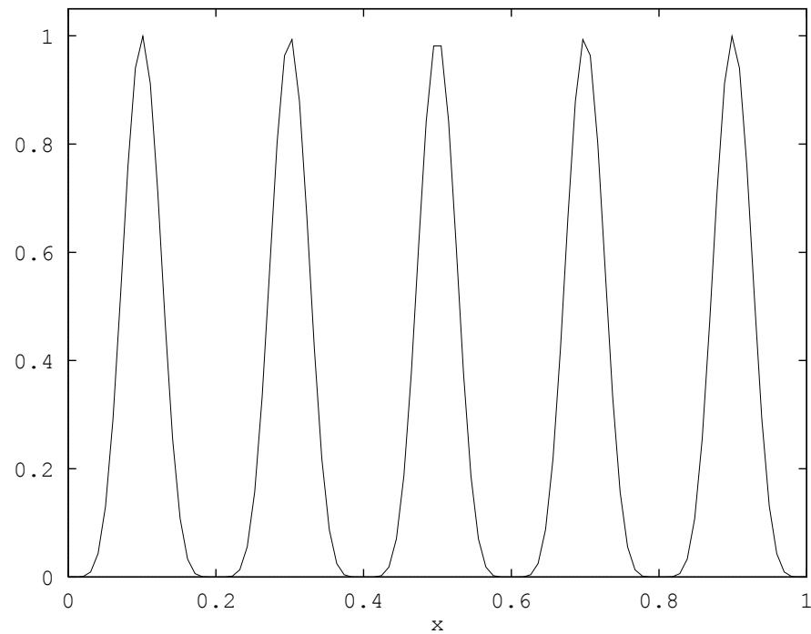  
Figure 5.2: Function $M \mathit { 1 }$ is displayed.

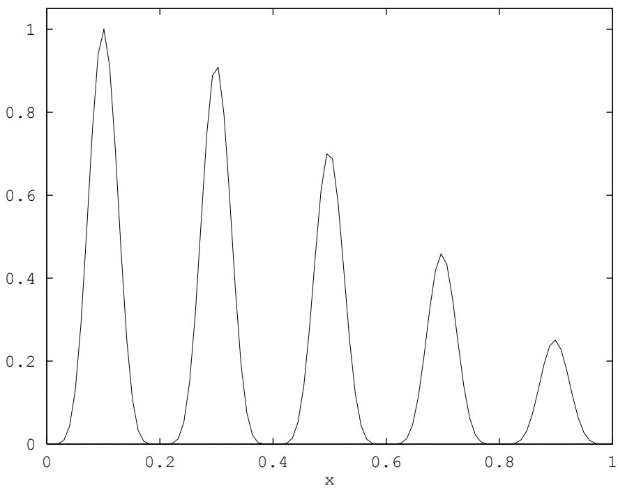  
Figure 5.3: Function $M \mathcal { Q }$ is displayed.

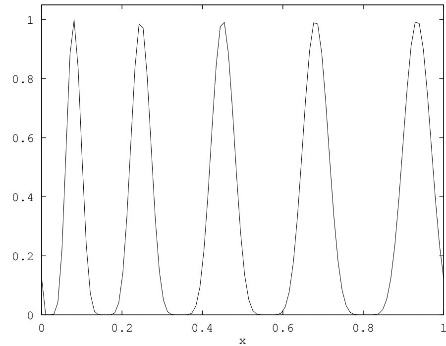  
Figure 5.4: Function $M \mathcal { B }$ is displayed.

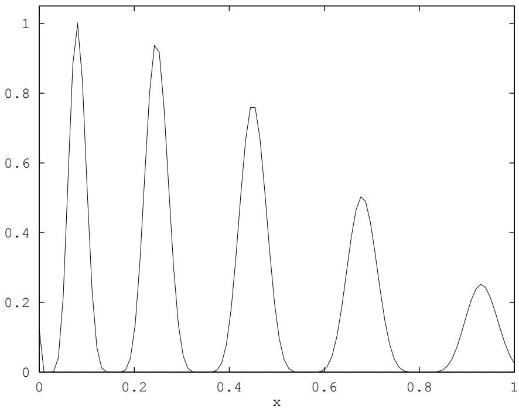  
Figure 5.5: Function $M _ { ☉ }$ is displayed.

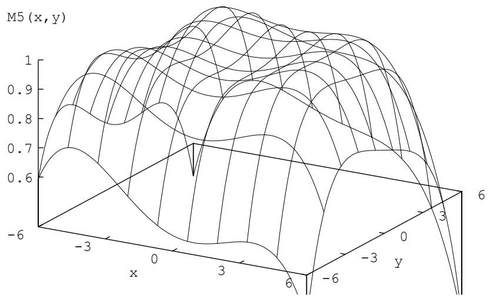  
M4 (x) = e 0:854 sin (5[x  :05]) :

5: Himmelblau's function $x$ values, to three decimal places, of .080, .247, .451, .681, and .934. Maxima are of rounded height, 1.000, .948, .770, .503, and .250, respectively. $M _ { ☉ }$ is defined below and displayed in Figure 5.5.

$$
M \langle \left( x \right) \ = \ e ^ { - 2 \left( \ln 2 \right) \left( \frac { x - 0 . 0 8 } { 0 . 8 5 4 } \right) ^ { 2 } } \sin ^ { 6 } ( 5 \pi \left[ x ^ { 0 . 7 5 } - . 0 5 \right] ) .
$$

# M5: Himmelblau's function

M5, shown in Figure 5.6, is the modified Himmelblau's function of Deb's (1989) study. Himmelblau's function is two dimensional, with four peaks of identical height. Like $M 1 { - } M 4$ , it has been used in prior studies of niching GAs. We include this function for consistency with prior studies, and as a preliminary multidimensional benchmark. The variables $x$ and $y$ of Himmelblau's function are both restricted to the real-valued range $[ - 6 , 6 ]$ and are encoded using 15 bits per variable. The GA operates upon a 30-bit string, which it decodes by first splitting into halves — into components corresponding to $x$ and $y$ — and then transforming each resulting binary integer into a real number on the interval $[ - 6 , 6 ]$

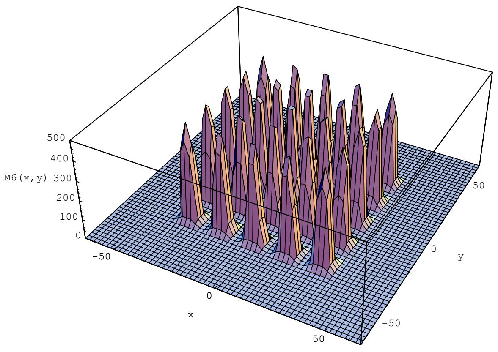  
Figure 5.7: Modified Shekel's Foxholes function M6 is displayed.

ond simple $M 5$ lems such as M1{M5 $\langle x , y \rangle$ s chapter, in most of the probl $\langle 3 . 5 8 4 , - 1 . 8 4 8 \rangle$ , $\langle - 3 . 7 7 9 , - 3 . 2 8 3 \rangle$ ry of $\langle - 2 . 8 0 5 , 3 . 1 3 1 \rangle$ | and more interesting | problems.

$$
M 5 ( x , y ) ~ = ~ \frac { 2 1 8 6 - ( x ^ { 2 } + y - 1 1 ) ^ { 2 } - ( x + y ^ { 2 } - 7 ) ^ { 2 } } { 2 1 8 6 } ~ .
$$

Most prior studies of GAs in niching and multimodal function optimization do not move beyond simple problems such as $M 1 - M 5$ . This chapter, in most of the problems that follow, enters the territory of more complex — and more interesting — problems.

# M6: Shekel's Foxholes

M6, shown in Figure 5.7, is the Shekel's Foxholes problem from De Jong's (1975) dissertation. M6 is a two-dimensional function with 25 peaks. It has been used in prior studies, but mainly for the purpose of locating the single global optimum. M6 is harder to solve than its predecessors, because of its higher modality. It is not deceptive, however. The variables $x$ and $y$ of $M \boldsymbol { \mathit { \theta } }$ are The lobal o timum occurs at  2  2 $[ - 6 5 . 5 3 6 , 6 5 . 5 3 5 ]$ ma form a staircase of s ikes to the variable. The GA operates upon a 34-bit string, which it decodes by first splitting into $x$ and $y$ components, and then transforming each resulting binary integer into a real number on the interval $[ - 6 5 . 5 3 6 , 6 5 . 5 3 5 ]$ ;

Maxima in $M \boldsymbol { \mathit { \theta } }$ are located at the $\langle x , y \rangle$ coordinates of $\langle 1 6 i , 1 6 j \rangle$ ( )) $i$ and $j$ represent all where a(i) $[ - 2 , 2 ]$ i mod 5)  2] and b(i) = 16(bi=5c  2). The global optimum occurs at $\langle - 3 2 , - 3 2 \rangle$ . The other optima form a staircase of spikes to the M7{M9: Mas $M \ell$ ely multimodal

$$
M \theta ( x , y ) ~ = ~ 5 0 0 - { \frac { 1 } { . 0 0 2 + \sum _ { i = 0 } ^ { 2 4 } { \frac { 1 } { 1 + i + ( x - a ( i ) ) ^ { 6 } + ( y - b ( i ) ) ^ { 6 } } } } } ~ ,
$$

where $a ( i ) = 1 6 [ ( i ~ { \bmod { ~ 5 } } ) - 2 ]$ and $b ( i ) = 1 6 ( \lfloor i / 5 \rfloor - 2 )$

# M7-M9: Massively multimodal / deceptive problems

M7 is the massively multimodal, deceptive function of Goldberg, Deb, and Horn (1992). Overall fitness is the sum of the fitnesses of five subfunctions. Each subfunction is a bimodal, deceptive function of unitation, as displayed in Figure 5.8. (Functions of unitation are explained in Section 3.1.) The GA operates upon a 30-bit string, formed from the concatenation of the 6-bit $x$ values of each subfunction. In $M \gamma$ , the order of difficulty or deception is 6 bits. The total number of optima is 5,153,632, of which 32 are global and hence considered desirable. Subfunction global maxima are located at $x = 0 0 0 0 0 0$ ; $x = 1 1 1 1 1 1$ (5:8) Subfunction nonglobal maxima are located at the 20 $x$ values containing exactly 3 ones, and where M7 in the equ

is still massively m $M 7$ modal and misleading, it is no longer deceptive. fitnesses of global and nonglobal optima. The scaling function used is

$$
M \vartheta \ = \ 5 \left( \frac { M \gamma } { 5 } \right) ^ { 1 5 } ,
$$

where $M \gamma$ in the equation represents the value for $M \gamma$ over the entire 30-bit function. While $M \delta$ is still massively multimodal and misleading, it is no longer deceptive.

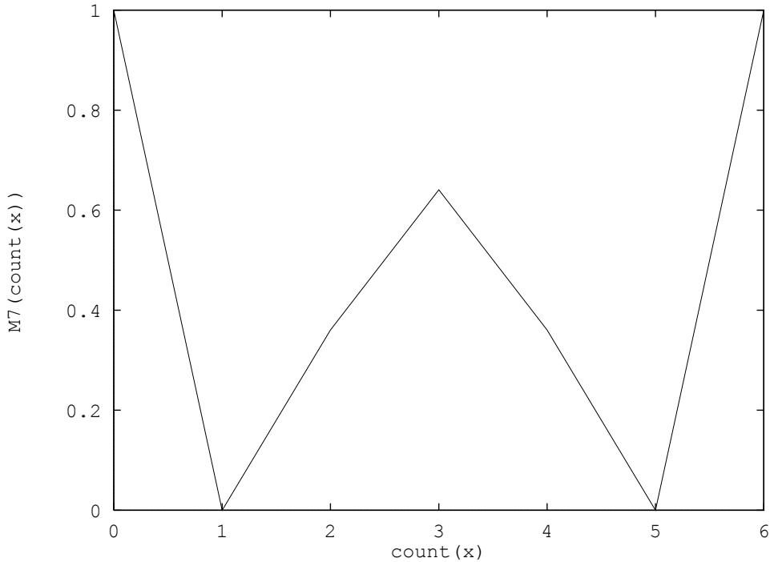  
ily chosen points, 00000000, 10001100, and 01001010. The tness of any no

M9 is a minimum distance function (Horn & Goldberg, in press). Overall fitness is the sum of the fitnesses of three 8-bit subfunctions. The GA operates upon a 24-bit string, formed from the concatenation of the 8-bit $x$ values of each subfunction. Each subfunction is maximally deceptive, and defined directly over Hamming space. Subfunction global optima occur at the arbitrarily chosen points, 00000000, 10001100, and 01001010. The fitness of any nonglobal, 8-bit substring is its Hamming distance from the nearest global substring. Global substrings receive a fitness of 10. M9 has 2197 local optima, of which 27 are global and hence considered M10{M14: Constructed problems the more fitness that substring receives, thus isolating the global optima, and placing most points in the search space on a misleading path towards a nonglobal optimum. M9 is similar in structure to the one-dimensional, phenotypically defined, minimum distance function depicted in Figure 5.9.

# M10-M14: Constructed problems

Problems M10-M14 , displayed in Figures 5.105.14, are constructed so that classes correspond to both peaks and schemata. In M10 and M11, the most significant (leftmost) bit of each population element indicates the schema or class to which it belongs. M10 has two peaks of equal height. In M11, the peak corresponding to Class $A$ is four times the height of the bits of the ei ht-bit chromos $B$ e determi $M \ o { 1 0 }$ ass membershi . lass A individuals have \` ' in and decode from binary values to single-integer phenotypes ranging from $x \ = \ 0$ to $x \ = \ 2 5 5$ Chromosomes with a $\cdot _ { 0 } \cdot$ in the leftmost position $( x ~ \in ~ [ 0 , 1 2 7 ] )$ are considered members of Class $A$ , while chromosomes with a $\mathit { \Omega } ^ { \prime } 1 \mathit { \Omega } ^ { \prime }$ in the leftmost position $^ { \prime } x \in [ 1 2 8 , 2 5 5 ] )$ are considered members of Class $B$

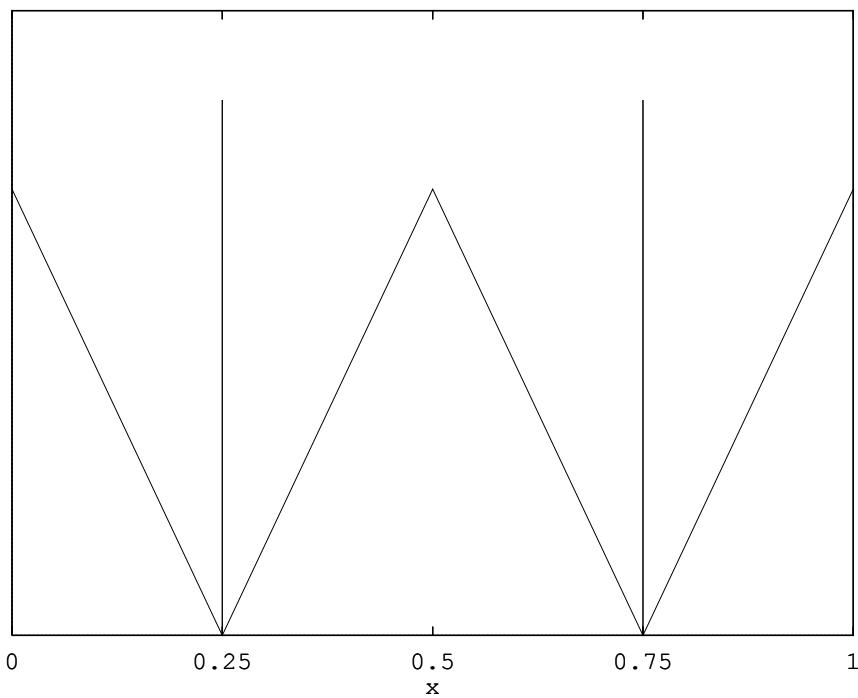  
and decode from binar values to sin le-inte er henot es ran in from x = 0 to x = 255. ilar in structure to $M \boldsymbol { \mathfrak { g } }$ . Two isolated global optima occur at $x = . 2 5$ and $x = . 7 5$ . Almost all Chromosomes with a \`0' in the leftmost position (x $x = 0$ $x = . 5$ e con $x = 1$ d

$M 1 \mathop { 2 - } M 1 _ { \ell }$ contain four peaks each. In all three problems, the two most significant (leftmost) bits of the eight-bit chromosome determine class membership. Class $A$ individuals have $\cdot _ { 0 0 } ,$ in the most significant bits $( x \in [ 0 , 6 3 ] )$ ); Class $B$ $0 1 ^ { \prime }$ (x  [64, 127]); Class $C$ $^ { \cdot } 1 0 ^ { \cdot } \left( x \in \left[ 1 2 8 , 1 9 1 \right] \right)$ ; and Class $D$ $1 1 ^ { \prime } \left( x \in \left[ 1 9 2 , 2 5 5 \right] \right)$ . In $M \it { 1 2 }$ , all four peaks are of identical height. In $M \it { 1 3 }$ , Class $A$ is twice as fit as the other three. In $M 1 \%$ , Classes $A$ and $D$ are each twice the fitness of $B$ and $C$

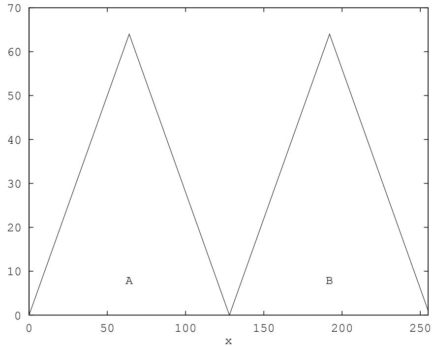  
Figure 5.10: Function M10 is displayed.

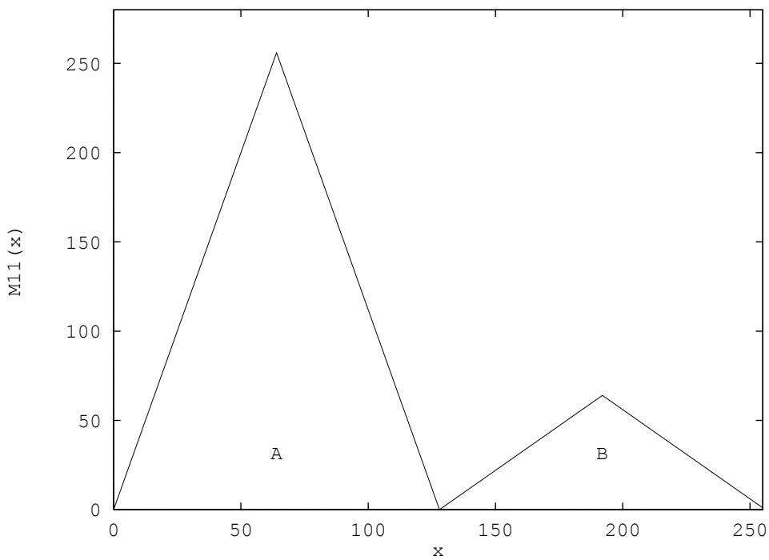  
Figure 5.11: Function $M I ~ I$ is displayed.

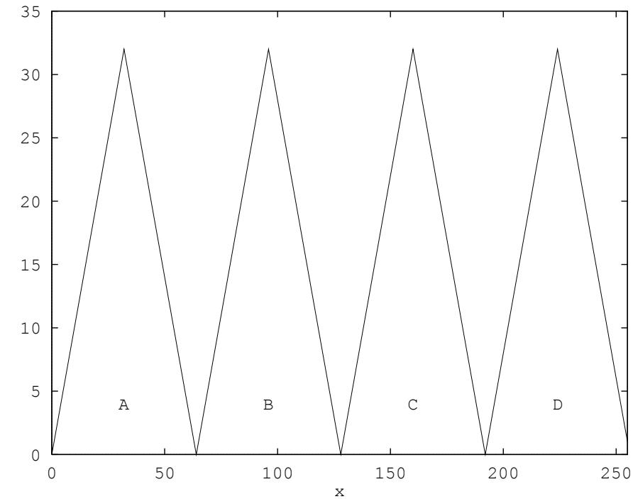  
Figure 5.12: Function M12 is displayed.

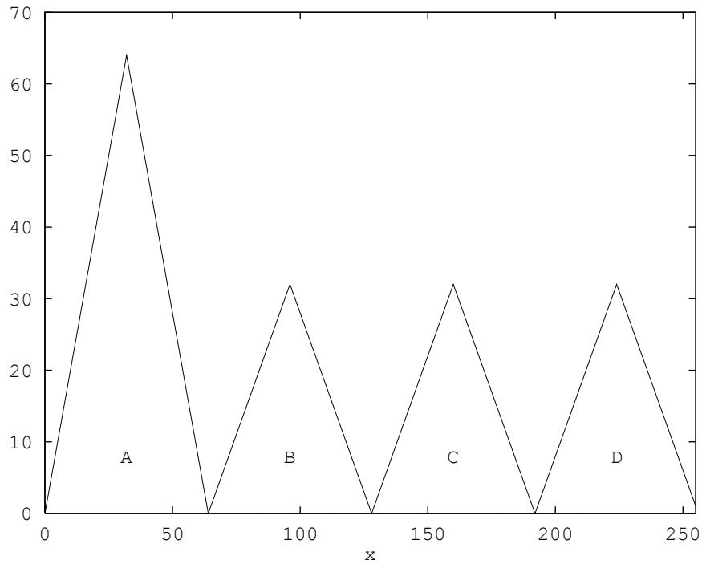  
Figure 5.13: Function $M \it { 1 3 }$ is displayed.

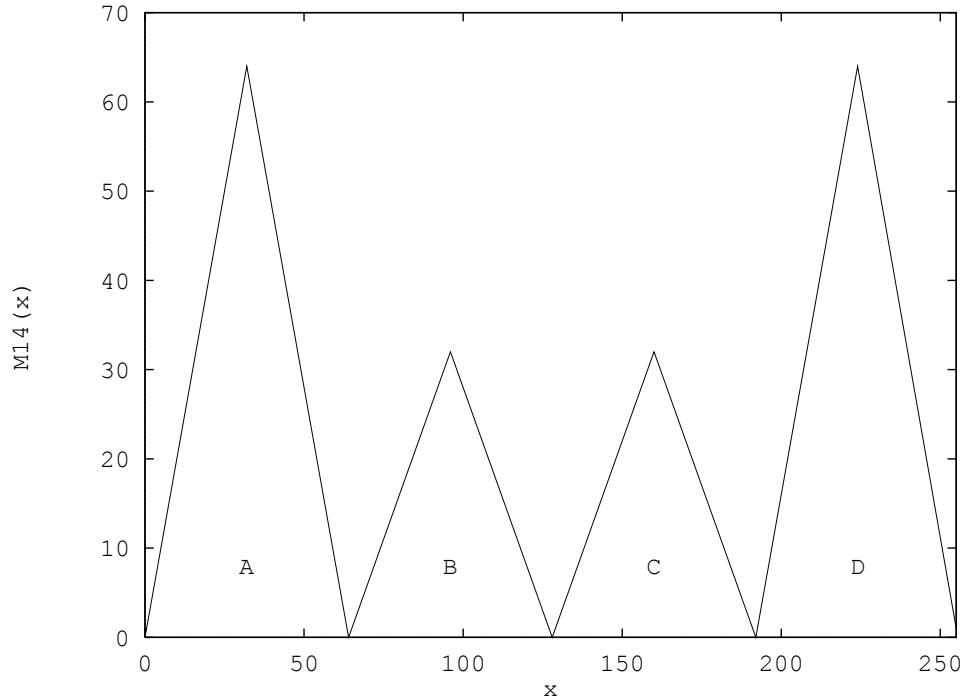  
chnique for solving class $M 1 \%$ ion problems

# Classification problems

The remaining problems are covering problems — idealized classification problems. Given a set of positive and negative training examples, the objective is to find a concept description that includes all of the positive examples, but none of the negative examples.

We present a new technique for solving classification problems, that is based upon the niching method. We willillustrate this new technique on the forthcoming boolean classifi(A1 ^ A2 ^ : : : ^ Aa) _ (B1 ^ B2 ^ : : : ^ Bb) _ : : : =) C : (5:9) and machine-learning problems. It maps classification problems to multimodal optimization In the case of boolean concepts, Ai and Bi represent boolean variables or negated boolean variables, and C is either \`0' or \`1'. is a disjunction of conjunctions, which takes the following form:

$$
\left( A _ { 1 } \wedge A _ { 2 } \wedge . . . \wedge A _ { a } \right) \vee \left( B _ { 1 } \wedge B _ { 2 } \wedge . . . \wedge B _ { b } \right) \vee . . . \Longrightarrow C .
$$

In the case of boolean concepts, $A _ { i }$ and $B _ { i }$ represent boolean variables or negated boolean variables, and $\ C$ is either $" 0 ^ { \prime }$ or $1 ^ { \prime }$

The niching GA must form and maintain a set of optimal disjuncts. (In the above example, $\left( A _ { 1 } \wedge A _ { 2 } \wedge \ldots \wedge A _ { a } \right)$ 1 + POS ; if NEG = 0 ; : 1  NTX ; otherwise : $( N E G )$ . In general, disjuncts receive higher fitnesses for covering positive examples, and lower fitnesses for covering negative examples. Given $N T X$ negative examples in the set of training examples, our fitness function is of the form,

$$
\begin{array} { r l r } { f ( P O S , N E G ) } & { = } & { \left\{ \begin{array} { l l } { 1 + P O S ~ , } & { \mathrm { i f } \ N E G = 0 ~ ; } \\ { 1 - \frac { N E G } { N T X } ~ , } & { \mathrm { o t h e r w i s e } ~ . } \end{array} \right. } \end{array}
$$

Such a fitness function is shown in Figure 5.15. Note that the fitness function in Figure 5.15 is not shown over the usual variable space (the variable space is typically of high dimensionality), but over the space defined by both the number of positive examples covered by the disjunct, and the number of negative examples covered by the disjunct.

Individuals in the population are composed of a concatenation of two-bit values that rep resent boolean variables. A '00' value corresponds to a boolean variable set to $0$ ' or off; '11', to a boolean variable set to '1' or on; '01' and '10', to a boolean variable whose value does not matter (a wild-card or "don't care" symbol). A repair mechanism (Orvosh & Davis, 1994) is employed to effectively reduce the size of the search space. The repair mechanism fips all '10' alleles, upon fitness assignment, to '01' alleles.

We consider two types of boolean covering problems that are extensively used in the machine-learning literature — parity problems and multiplexer problems. Parity problems represent a category of boolean classification problems that are maximally hard in a sense: from an optimization point of view, a $k$ -bit parity problem contains the largest number of optima of any $k$ -bit boolean concept. Multiplexer problems represent average-case problems.

Our empirical framework includes three different odd-parity problems, which we call $P A R$ -5, PAR-8, and PAR-10. The number in the problem name represents the number of boolean variables that the problem contains. In odd-parity problems, if an odd number of variables are on, the example is positive; if an even number of variables are on, the example is negative. Under our chosen DNF representation, the solution to a $k$ -bit parity problem requires the formation and maintenance of $2 ^ { k - 1 }$ disjuncts, because each positive example must be covered individually. (Any example left uncovered is considered negative.) Hence, $P A R$ -5 requires the formation and maintenance of 16 disjuncts; PAR-8, 128; and PAR-10, 512. In PAR-8 and PAR-10, the number of desirable solutions (that the GA must form and maintain) is greater than for any other problems in this thesis.

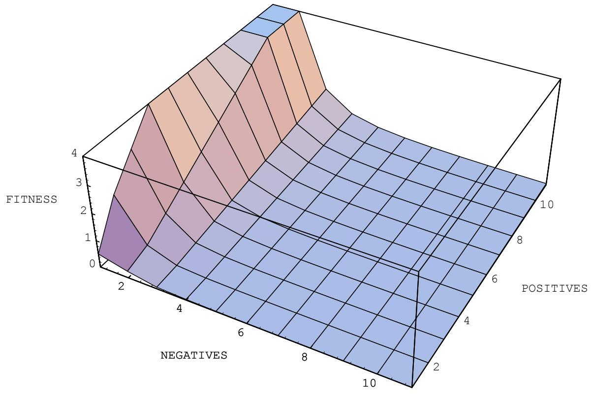  
Figure 5.15: This function assigns fitness to a classification rule based upon the number of contains a number of address bits and a number of data bits

Our empirical framework also includes a 6-bit multiplexer problem, MUX-6. A multiplexer contains a number of address bits and a number of data bits. The address bits determine the data bit that is selected. MUX- $\boldsymbol { \mathit { \sigma } } _ { \delta }$ contains two address bits that specify which of four data bits is selected. For example, if both address bits are on, they form the binary address '11', which designates data-bit number 3. Subsequently, if Data-bit 3 is on, the example is positive; if Data-bit 3 is off, the example is negative.

# Chapter 6

# p p pp , y,niching method can be built. However, 17 years after

A crowding method, according to our earlier definition, is a selection scheme that inserts a new element into the population by overwriting a similar element. This strategy of replacing similar population elements appears, intuitively, to be a solid foundation upon which an effective niching method can be built. However, 17 years after De Jong (1975) introduced crowding, no one had yet been able to get it to consistently maintain more than two peaks of a multimodal function, no matter how simple the function (Deb, 1989; Deb & Goldberg, 1989).

Prior to De Jong, Cavicchio (1970) had introduced several schemes in which children di rectly replaced the parents that produced them. Since parents are similar to their children, these so-called preselection schemes qualify as crowding methods, according to our definition. Again, intuitively it would seem that parental replacement techniques should be able to preserve representatives of multiple peaks. However, like De Jong's crowding, preselection schemes had never exhibited niching capabilities.

In this chapter, we repeat our prior analysis (Mahfoud, 1992) of De Jong's crowding and eective at maintainin se arate s ecies throu h methods similar to crowdin . design an improved crowding scheme that is an effective niching method. We seek to design an improved crowding method because it seems a plausible goal. Plausibility, as suggested earlier, is a partially intuitive notion. As additional motivation, De Jong's and Cavicchio's descriptions of crowding and preselection give the impression that these algorithms should be successful at preserving population diversity. A third motivating factor is that natural populations are effective at maintaining separate species through methods similar to crowding.

To determine why, in practice, that De Jong's crowding and Cavicchio's preselection are not successful, we postulate that one or more factors are at work, combining to create significant noise or variance in the selection process, ultimately leading to genetic drift — the loss of alternative solutions due to random fluctuation. As we saw in earlier chapters, even in the has often been that well intended desi n chan es have had unforeseen conse uences leadin noise. It turns out that the main culprit in crowding methods is the stochastic error in the replacement of population members. We can combat genetic drift in crowding methods by introducing design alternatives that reduce or eliminate the replacement error.

When introducing potential design improvements to a GA, one should keep in mind that the design space can be highly nonlinear. In prior GA research, the result of this nonlinearity underl in crowdin methods is to re lace similar elements we dene our oal in terms of to either poorer performance than the unmodified algorithm, or better behavior on one type of problem but worse behavior on others. When altering a design, it is important to pursue a sometimes it takes us sidewa s but in the end forward ro ress roduces a much im roved it may be necessary to take steps backwards (i.e., accept poorer performance after intermediate changes) if such backward steps in some way lead towards the goal. Since the major premise underlying crowding methods is to replace similar elements, we define our goal in terms of the replacement process. Our primary criterion, the reduction of replacement error, guides us in making algorithmic changes. Sometimes this criterion takes us temporarily backward, and sometimes it takes us sideways, but in the end, forward progress produces a much improved crowding method.

The remainder of this chapter starts with De Jong's crowding, and through a series of tests functions are com lex enou h to make rior crowdin methods fail Deb 1989 Deb & Goldber The resulting algorithm is named deterministic crowding. Under the modelling framework of the previous chapter, we employ an equivalence-class model for crowding that concentrates upon the replacement step. The model defines correct and incorrect replacements, allowing us to use the number of replacement errors as a performance and design criterion.

We include the test functions M1 and $M \mathcal { Q }$ in this chapter's model of crowding. These functions are complex enough to make prior crowding methods fail (Deb, 1989; Deb & Goldberg, 1989), but simple enough to allow full analysis and visualization of class distributions and stochastic errors. The functions are defined and displayed in Chapter 5.

# the average tness of all past and presen

In evaluating the performance of his genetic algorithms, De Jong (1975) operated under the assumption of unimodal function optimization. The ability to quickly adapt the population toward optimal regions of the search space was the primary goal. This resulted in the use of two performance measures: on-line and off-line performance. On-line performance is defined as and o-line erformance measures are overl concerned with s eed of conver ence rather than as the average fitness of a collection consisting of the fittest element of each past population and the fittest element of the present population. De Jong also employed a secondary performance measure for his crowding scheme, the number of bit-positions that had become fixed (i.e., were identical in each population element).

The above performance criteria are not of much use in our study of niching. Both on-line and is discussed in a later section. quality of final results. Off-line performance is actually a second type of on-line performance measure, since current results are heavily degraded by past ones. In the current study, we are more concerned with maintaining optima and minimizing noise. Speed is a secondary consideration that, as later becomes apparent, need not be sacrificed. The number of fixed bit-positions, though not used as a criterion to develop algorithms, is nonetheless measured, and is discussed in a later section.

The two related performance criteria we use in this study are the number of peaks or classes an algorithm maintains and the number of replacement errors it makes. A peak is considered maintained if at least one population element (that has a fitness of at least $8 0 \%$ of the peak's height) exists in the basin of attraction of that peak. The basins are easy to visualize for $M \mathit { 1 }$ and $M \mathcal { Q }$ . They are represented by intervals of width .2 along the $x$ axis at the base of each peak, and they are defined using a phenotypic neighborhood operator of size $\epsilon = 1 / ( 2 ^ { 3 0 } - 1 )$ the minimum increment in our representation of $x$ $M \mathit { 1 }$ and $M \mathcal { Q }$ are simple enough so that the quality of final solutions wlltend to be similar across algorithms. We are hence more interested in the quantity of diverse, but good, final solutions; this quantity corresponds to the number of peaks maintained, one of our performance criteria.

The number of replacement errors constitutes our other performance criterion. We define a replacement error as the replacement of a member of one class or peak by a member of another.

typical parameter settings. Algorithms 2{5 are cumulative attempts to eliminate unnecessary parameters and to reduce the number of replacement errors. Algorithm 6 is an impr

# demonstrate, our algorithmic changes are de

Six crowding algorithms are tested. Algorithm 1 represents De Jong's crowding algorithm, with 20 000 function evaluations. We im lement De Jon 's crowdin usin roulette-wheel selection parameters and to reduce the number of replacement errors. Algorithm 6 is an improved version of preselection that approximates the desirable properties of De Jong's crowding. As we soon and 6.2 show the distribution of o ulation elements after a sam le run of ea

All algorithms are tested 100 times on both M1 and $M \boldsymbol { \mathcal { Z } }$ , using a population size of $n = 1 0 0$ and no mutation ( $p _ { m } ~ = ~ 0$ ). Populations are randomly initialized, and then the GA runs for $2 0 , 0 0 0$ function evaluations. We implement De Jong's crowding using roulette-wheel selection, and employ sampling without replacement to choose individuals for the replacement sample.

Figures at the end of the chapter illustrate performance of the six algorithms. Figures 6.1 Algorithm 1: De Jong's crowding; Deb's parameters the test problems. Figure 6.3 shows the number of peaks each algorithm maintains over time, averaged over 100 runs. Figure 6.4 shows the cumulative number of replacement errors as each algorithm progresses, averaged over 100 runs. Figure 6.5 displays the number of diverse bit-positions each algorithm maintains over time, also averaged over 100 runs.

# Algorithm 1: De Jong's crowding; Deb's parameters

Algorithm 1 (A1) is our starting point. It represents the variation of De Jong's crowding used makes an avera e of re lacement $p _ { c } = . 9$ n M1 and an avera $G G = . 1$ re lacement errors on $\zeta { \cal F } = 3$ e Fi ure 6.4 . Since crowdin does a re lacement for each function evaluation nearl is described in Chapter 4.)

A1 maintains two peaks each run, on both test functions (see Figures 6.1-6.3). This is consistent with Deb's results, where crowding nearly always maintains exactly two peaks on every test function. Arriving at an explanation for this behavior is not overly difficult. A1 makes an average of 6600 replacement errors on $M \mathit { 1 }$ and an average of 5900 replacement errors on $M \mathcal { Q }$ (see Figure 6.4). Since crowding does a replacement for each function evaluation, nearly one out of every three replacements is in error. This is an open invitation to genetic drift, so it is apparent why A1 maintains no more than two peaks.

With such high replacement error, should A1, instead, be maintaining only one peak? Let us examine, under selection alone, the mechanism by which an element is lost from one peak and gained on another. Suppose an element from peak $A$ is awaiting insertion in the population. Crowding chooses $\mathit { C F }$ candidates from the population and replaces the closest one. Assuming crowding makes no errors in comparison (an assumption of our modeling framework), but one will eventu $A$ lose all re resentatives. $\mathit { C F }$ . If an element of $A$ is not among the $\mathit { C F }$ , an element from some other peak will be replaced. As long as all peaks other than $A$ lgorithm 2: D $\mathit { C F }$ ong's crowding; Steady state with full crossover However, when peak $A$ contains $n - 1$ of the population's elements, and peak $B$ contains the final one, peak $B$ will not lose that element, since for $\zeta { \cal F } \geq 2$ , an element of $A$ will be present among the $\mathit { C F }$ . Note that crowding with $C F = 1$ is effectively a simple GA, in which all peaks but one will eventually lose all representatives.

# Algorithm 2: De Jong's crowding; Steady state with full crossover

Algorithm 2 (A2) is a simplification of A1. The intent of A2 is to get rid of parameters whose fine-tuning detracts from the thorough analysis of crowding and its behavior. We eliminate crossover probability as a design parameter by raising $p _ { c }$ all the way to 1, the worst case (maximally disruptive) setting. An effective crowding method should be able to operate under full crossover.

Generation gaps that are too high result in the replacement of too much of the population, with behavior approaching that of a simple GA. In fact, crowding with $G G = 1$ is a simple GA. De Jong himself noted that crowding becomes less effective as $G G$ increases. On the other hand, he avoided generation gaps less than .1, probably to allow a limited amount of parallelism. It seems a better design approach, however, to first worry about achieving niching and then about secondary considerations such as parallelism. Such a design approach previously led to the successful development of fitness sharing (Goldberg & Richardson, 1987). We consider parallelism later.

A2 is identical to A1, except that $p _ { c } ~ = ~ 1$ and $G G = 1 / ( 2 n ) = . 0 2$ $G G$ is set to the lowest possible value that still allows the binary operator, crossover, to function. Note that the setting for $G G$ effectively results in a steady-state crowding method. (A steady-state GA Algorithm 3: Phenotypic comparison As expected, A2 produces results nearly identical to those produced by A1 (see Figures 6.1-6.5), except for a slightly greater number of replacement errors. The additional errors are due to the higher variance of the steady-state GA and to the increased disruption caused by additional crossover.

# Algorithm 3: Phenotypic comparison

distin uishin dierent eaks of M1 and M2. Genot ic com arison is hence tr in to detect errors. In the analysis of A1, we assumed perfect comparison. This is equivalent to the perfect discrimination assumption of our modelling framework. Perfect comparison requires that the algorithm never make an error when deciding which of the $\mathit { C F }$ elements is closest to the one being inserted. For the binary-encoded strings of this study, bitwise or genotypic comparison is far from ideal. Only the three most significant bits of each string are likely to be useful for distinguishing different peaks of $M \mathit { 1 }$ and $M \mathcal { Q }$ . Genotypic comparison is hence trying to detect roughly 3 bits of signal in the presence of approximately 27 bits of noise.

One solution is the phenotypic comparison measure outlined in the original study of fitness sharing (Goldberg & Richardson, 1987). Phenotypic comparison uses decoded variables rather than raw, binary strings. For $M \mathit { 1 }$ and $M \mathcal { Q }$ , the decoded variable is the real number $x$ . Although Deb (1989) tried phenotypic sharing, he did not attempt phenotypic crowding. Another potential solution to noisy comparison (that we will not examine in this study) is genotypic comparison in combination with Gray codes. Gray codes (Caruana & Schaffer, 1988) ensure Algorithm 4: Full sampling space.

Algorithm 3 (A3) is identical to A2, except that it employs phenotypic rather than genotypic comparison. As shown in Figures 6.1-6.3, A3 maintains two to three peaks, a marked improvement. The number of replacement errors also drops significantly (Figure 6.4).

# Algorithm 4: Full sampling

A major source of error must still be eliminated: the sampling error due to low $\mathit { C F }$ . De Jong noted that while higher crowding factors fix fewer bit-positions, they also degrade on-line and off-line performance. In addition, higher crowding factors limit parallelism. Nevertheless, we are A4 is identical to A exce t that F = n. Althou h this chan e adds an order of com lexit replacement error.

It is not difficult to calculate the $\mathit { C F }$ required to perform correct replacement with some specified probability, if one makes a few assumptions regarding the fitness function and the initial distribution of population elements. Algorithm 4 (A4) strives to perform $1 0 0 \%$ of its replacements correctly: it examines every population element to find the closest match.

A4 is identical to A3, except that $C H = n$ . Although this change adds an order of complexity to crowding (requiring $O ( n ^ { 2 } )$ rather than $O ( n )$ comparisons per generation), it produces a useful, intermediate algorithm. A4 is similar in complexity to fitness sharing (Goldberg & Richardson, 1987), which also cycles through the entire population (to compute each element's shared fitness). Goldberg and Richardson note that a version of sharing which estimates shared fitnesses using population sampling (as De Jong's crowding does) is a promising possibility. However, they first design sharing without sampling, in order to determine the ideal behavior of their algorithm in the absence of additional sources of noise. Although Deb (1989) compares genotypic crowding using sampling to phenotypic sharing without sampling, no one has yet compared equivalent versions of the two algorithms.

ulation elements. This absence of selection ressure can be ex lained as $0 . 1 \%$ s. hile A4 still made a fraction of the time, when the phenotypically closest element is near a boundary between peaks. A4 consistently maintains population elements at all five peaks of the search space (Figures 6.1-6.3). However, A4 also distributes population elements all across the search space, including inside the low-fitness valleys of $M \mathit { 1 }$ and $M \mathcal { Q }$ . It is apparent that A4 does not are more fre uentl chosen b u -front selection the are ust as often re laced resultin in a population elements. This absence of selection pressure can be explained as follows. While A4 chooses two good solutions for reproduction each generation, it also overwrites the most similar elements of the population, whether they are better, worse, or equally fit. Since A4 replaces the population element that most closely resembles the one being inserted, it is highly likely that A4 will replace a solution of nearly identical fitness. Therefore, even though highly fit elements are more frequently chosen by up-front selection, they are just as often replaced, resulting in a cancellation of the up-front selection pressure.

Runs of A4 on a one-dimensional, strictly increasing, linear function confirm that the algorithm exhibits little, if any, selection pressure: A4 maintains population elements at seemingly random positions up and down the line. A4's behavior is not surprising if one examines the method by which traditional crowding (with low $\mathit { C F }$ ) converges. Crowding selects elements for reproduction according to fitness. If the closest element in the population were consistently Algorithm 5: Parental replacement no improvement (as A4 demonstrates). Instead, if a certain percentage of the time, a dissimilar element were replaced in error, an improvement would be likely since the inserted element would probabilistically be of superior fitness. This surprising discovery leads to the conclusion that De Jong's crowding relies on replacement errors for its convergence.

# Algorithm 5: Parental replacement

A curious thing happens when we raise $\mathit { C F }$ $n$ . A high percentage of the time, one or both parents are replaced. On M1 and $M \mathcal { Q }$ , a parent is replaced $8 3 \%$ of the time. This suggests a method of approximating De Jong's crowding using a technique similar to Cavicchio's nd the henot icall closest element it sam les onl the two arents. Each air of os rin does not replace both parents. This method has the pleasant side effect of reducing algorithmic complexity to the level of the simple GA, since the previously required $O ( n ^ { 2 } )$ comparisons reduce to $O ( n )$ . In addition, the $\mathit { C F }$ parameter disappears, since a parent rather than an element of a sample is replaced.

Algorithm 5 (A5) is identical to A4, except that instead of sampling the whole population to find the phenotypically closest element, it samples only the two parents. Each pair of offspring is simultaneously inserted into the population as follows. There are two possible methods of replacing two parents with their two offspring: Offspring 1 replaces Parent 1 and Offspring 2 replaces Parent 2, or Offspring 1 replaces Parent 2 and Offspring 2 replaces Parent 1. The pair of replacements is employed that yields the smallest sum of absolute distances between an offspring and a replaced parent. Even though the end result is the same for either pair of replacements, the dichotomy allows flexibility in further modifications of crowding.

Although the number of replacement errors remains very low (0.7%), most solutions have gravitated toward the valleys rather than the peaks of the two functions. The algorithm actually exhibits very slight, reverse selection pressure, with cumulative effects. Somewhat surprising at first, this behavior can be explained as follows. Recall that De Jong's crowding chooses two elements for reproduction according to fitness. While in A4, these chosen elements might or might not be replaced by their offspring, in A5 these elements are always replaced by their Algorithm 6: Deterministic crowding elements that, although similar, are more often worse than better. This results in the slight downward selection pressure displayed. A4 does not display such downward pressure, due to the small percentage of the time (about $1 7 \%$ ) that a parent is not the closest element in the population. Neither A4 nor A5 displays any observable, upward selection pressure.

# p g p y p g y

What remains in our design process is to add selection pressure to either A4 or A5. We choose A5 because of its lower time complexity. Note that A5 resembles Cavicchio's preselection, except that parents are always replaced, regardless of offspring fitness, and a similarity measure is used to decide which of the two offspring replaces which parent. Results have shown that the com etin os rin is better as in reselection. A6 diers from reselection in that it rocesses two arents and two os rin at a time d

Since the fitness-proportionate selection of A4 and A5 results in little to no favorable selection pressure, A6 dispenses with it. Instead, A6 pairs all population elements randomly each generation, without replacement. This means that each population member undergoes crossover once each generation. To add back selection pressure, A6 only replaces a parent if the competing offspring is better, as in preselection. A6 differs from preselection in that it proredecessors since the eneration a arameter is no lon er necessar . As shown in Fi ures .1{ . A successfull clusters solutions about all ve eaks of both M1 and M . In upon replacement (rather than up front) is known as replacement selection and has previously been employed in GAs (Eshelman, 1991; Whitley & Kauth, 1988).

A6 has the additional effect of adding the capacity for true parallelism, since all population elements can proceed simultaneously each generation. The algorithm is also simpler than its predecessors, since the generation gap ( $G G$ ) parameter is no longer necessary. As shown in Figures 6.1-6.3, A6 successfully clusters solutions about all five peaks of both $M \mathit { 1 }$ and $M \mathcal { Q }$ . In Figure 6.1, it might appear that A6 is only maintaining a few elements on the central peak; however, upon closer examination we find that this is not the case: the central peak has a significant share of the 100 population elements; they have just converged to two very close values at the peak's tip. As in A4 and A5, replacement errors are almost nonexistent $( 0 . 2 \% )$ We call A6 deterministic crowding (DC for short), because it makes several of the random processes in De Jong's crowding algorithm, deterministic.

It is illustrative to summarize the properties of deterministic crowding. The algorithm incorporates a similarity measure like that of De Jong's crowding, but replaces parents like preselection. Unlike De Jong's crowing, DC may utilize either genotypic or phenotypic difference measures, with phenotypic measures being preferable when they are available. On M1 and $M \mathcal { Q }$ , DC virtually eliminates replacement error and locates and maintains all five peaks. The algorithm is simple to implement, is faster than its predecessors (since it performs replacement selection via binary tournaments and does not sample the population for either selection or The maintenance of bitwise diversity is a questionable goal. Let us examine an instance of why this is so. Figure 6.5 shows that the traditional crowding techniques, A1 and A2, converge at a few bit-positions; this is consistent with De Jong's results. A3, which uses

# space is not important, but diere

The maintenance of bitwise diversity is a questionable goal. Let us examine an instance of why current roblem. Losin bits while maintainin henot ic s read is a rime exam le. A4 re ains a lot of bitwise diversit due to its near elimination of re lacement error. A parison, loses a large majority of its bits. With phenotypic comparison, difference in Hamming space is not important, but difference in decoded parameter space is. In our prior discussion of diversity, we stated that an algorithm which promotes useful diversity will allow a population to converge along all dimensions of diversity, except those dimensions related to solving the current problem. Losing bits while maintaining phenotypic spread is a prime example.

A4 regains a lot of bitwise diversity due to its near elimination of replacement error. A5 and A6 seem to be anomalies, since they never lose a single bit. Let us take a closer look at one point to which A6 has converged. For both M1 and M 2, the central optimum (at $x = . 5$ ) resides on a Hamming cliff, with one neighboring solution containing 29 zeros, and another containing 29 ones. These neighbors are, in fact, full bitwise complements. It is not surprising that no bits are lost, since the final population contains both neighboring solutions. This form of bitwise diversity does not appear to be very useful.

The primary argument for maintaining bitwise diversity is that such diversity will somehow prevent premature convergence. However, even with full bitwise diversity, premature convergence may still occur. What one would like is a mechanism for controlling convergence. One possibility is the addition of thermodynamic controls. (See Section 3.5 for a discussion of thermodynamic GAs.) Briefly, thermodynamic controls would augment deterministic crowding to allow offspring to replace better parents on occasion. The probability of replacement would be Since the introduction of deterministic crowding, two similar crowding methods (detailed in Chapter 4) have been proposed (Cede\~no & Vemuri, 1992; Harik, 1994). These two methods have demonstrated prel

# for crowding to be eective at nich

Since the introduction of deterministic crowding, two similar crowding methods (detailed in Chapter 4) have been proposed (Cedeño & Vemuri, 1992; Harik, 1994). These two methods anal sis of crowdin al orithms is left to future research. of these new crowding methods have verified one of our design results for DC — that in order for crowding to be effective at niching, up-front selection must be eliminated, and replacement selection incorporated. We expect the distributional behaviors for members of the crowding family of niching GAs to be similar, although some crowding methods may maintain niches more stably than others. (Chapter 7 examines the distributional behavior of DC.) A comparative analysis of crowding algorithms is left to future research.

Two studies have recently employed deterministic crowding to solve applications problems. The first study (Hatjimihail, 1993) applies DC to designing and optimizing statistical, chemical quality-control procedures. Using DC, the author is able to obtain quality-control procedures equivalent to, and often better than, those procedures produced by current algorithms. The second study (Pál, 1994) applies DC and other GAs to the spin-glass problem. He shows that DC outperforms several simple GAs and that a modified version finds optimal or nearly optimal solutions. In both studies, DC is used to prolong GA convergence in order to locate better, single solutions, rather than multiple solutions. This supports our earlier conjecture, that e make one nal note re ardin arental re lacement methods. In arental re lacement multiple subsolutions, on the way to a better, single solution.

Ongoing research examines the incorporation of deterministic crowding and other niching methods in machine learning systems. We demonstrate later in this thesis the rudiments of such a system, operating on boolean covering or classification problems. The extension of such a system has yielded promising initial results on real-world, machine-learning problems.

We make one final note regarding parental replacement methods. In parental replacement, the method of competition between children and parents is a critical step, whereby a small algorithmic change typically yields an enormous change in the algorithm's capability and behavior. For this reason, most previously suggested parental replacement techniques do not qualify as niching methods. As an example, Cavicchio's preselection throws away a randomly chosen offspring of the two produced from each cross. The retained offspring competes against both parents. Due to replacement errors, his algorithm is incapable of maintaining multiple peaks. Deterministic crowding, on the other hand, maintains multiple peaks by retaining both maximum tness over both individuals in the air. The result of double acce tance re ection in of distances.

e uivalence class re resentatives however is not uaranteed. an interesting possibility, in which either both children win the competition as a pair, and are accepted into the population of the next generation, or both parents win it. Culberson (1992) employs such a scheme in his GIGA system, where the fitness of a pair of elements is the maximum fitness over both individuals in the pair. The result of double acceptance/rejection, in the absence of up-front selection and mutation, is complete conservation of alleles; conservation of equivalence class representatives, however, is not guaranteed.

In the chapter that follows, we will further analyze the behavior of deterministic crowding, emphasizing the combination of selection and crossover. We will observe and explain several interesting behaviors that are characteristic of the crowding family of niching methods and to some extent, of all GAs that employ crossover.

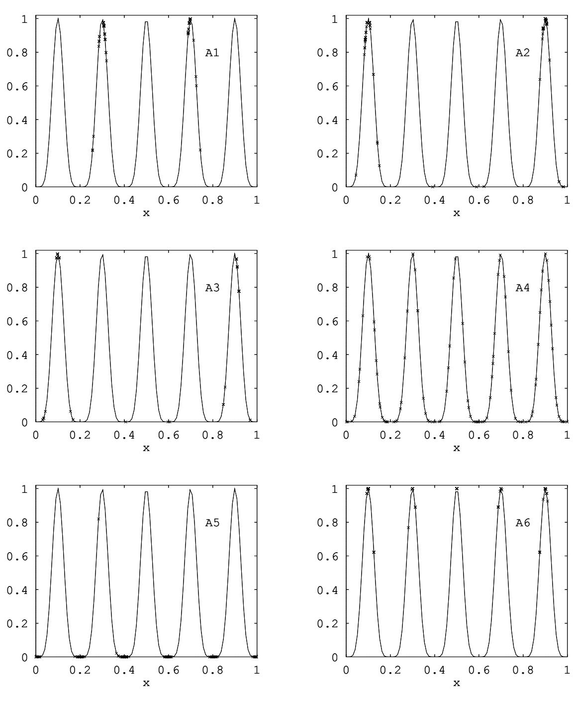  
Figure 6.1: The final distribution of 100 population elements is shown for one run of each algorithm, A1-A6, on function $M \mathit { 1 }$ . Each algorithm runs for 20,000 function evaluations.

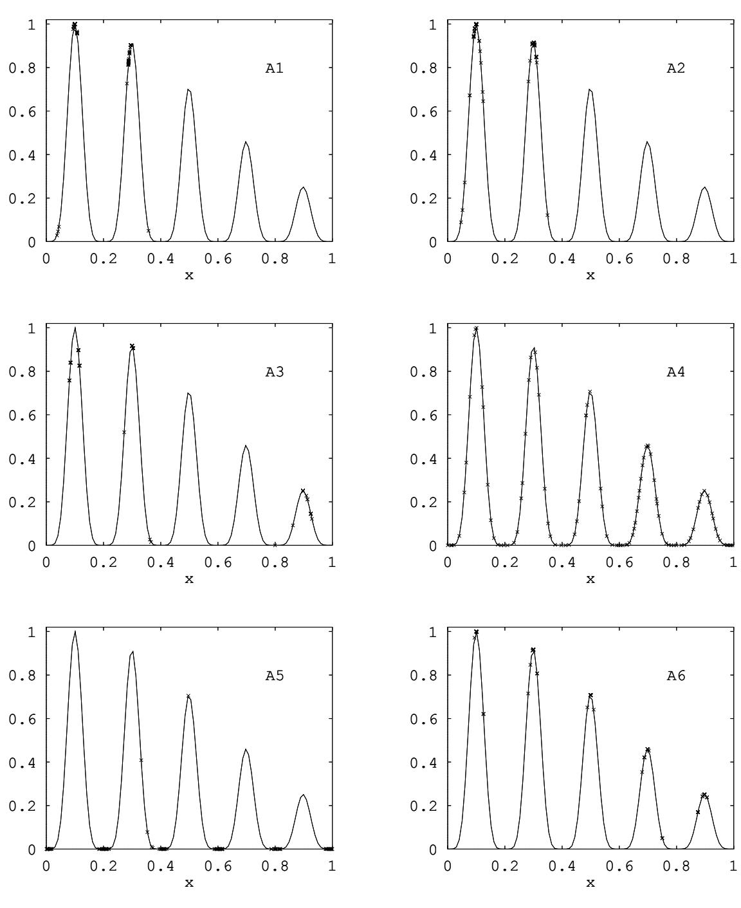  
Figure 6.2: The final distribution of 100 population elements is shown for one run of each algorithm, A1-A6, on function $M \mathcal { Q }$ . Each algorithm runs for 20,000 function evaluations.

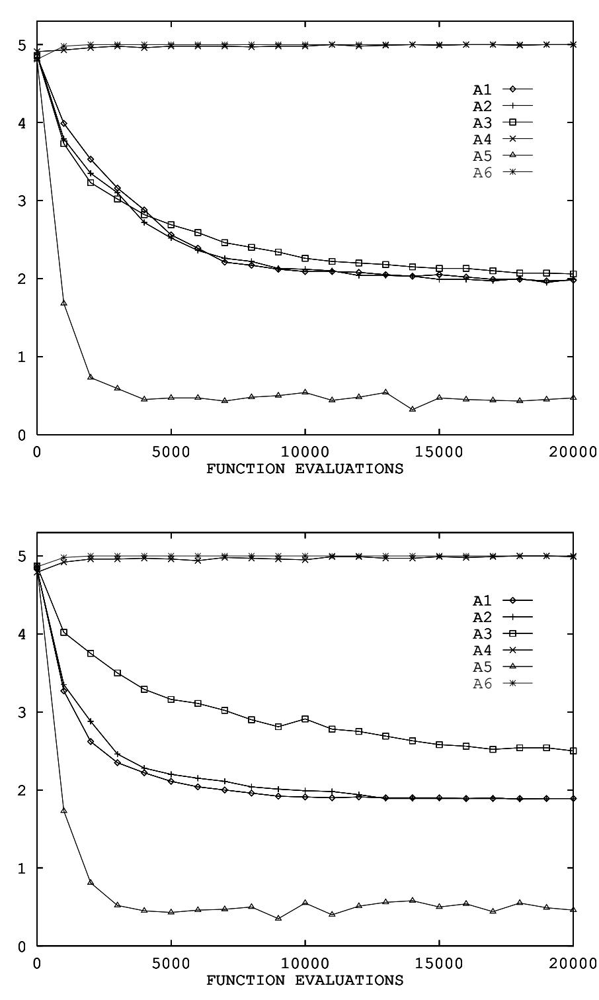  
Figure 6.3: The number of peaks maintained by each algorithm, A1-A6, is shown as a function of time, averaged over 100 runs. A peak is considered maintained if some population element exists in the peak's basin of attraction, whose fitness is at least $8 0 \%$ of the peak's height.

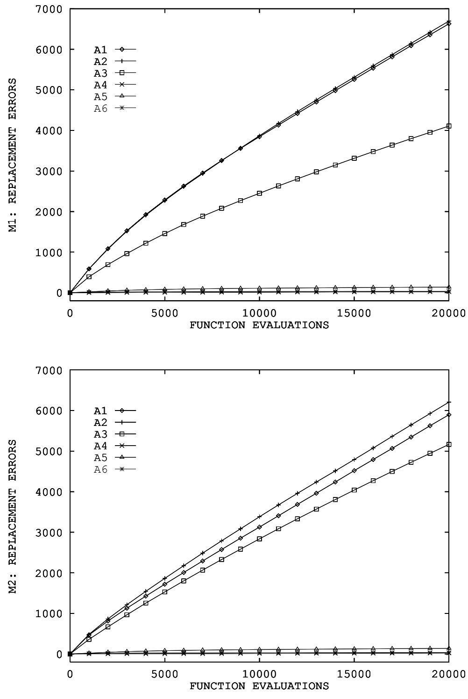  
Figure 6.4: The total number of replacement errors for each algorithm, A1-A6, is shown as a function of time, averaged over 100 runs.

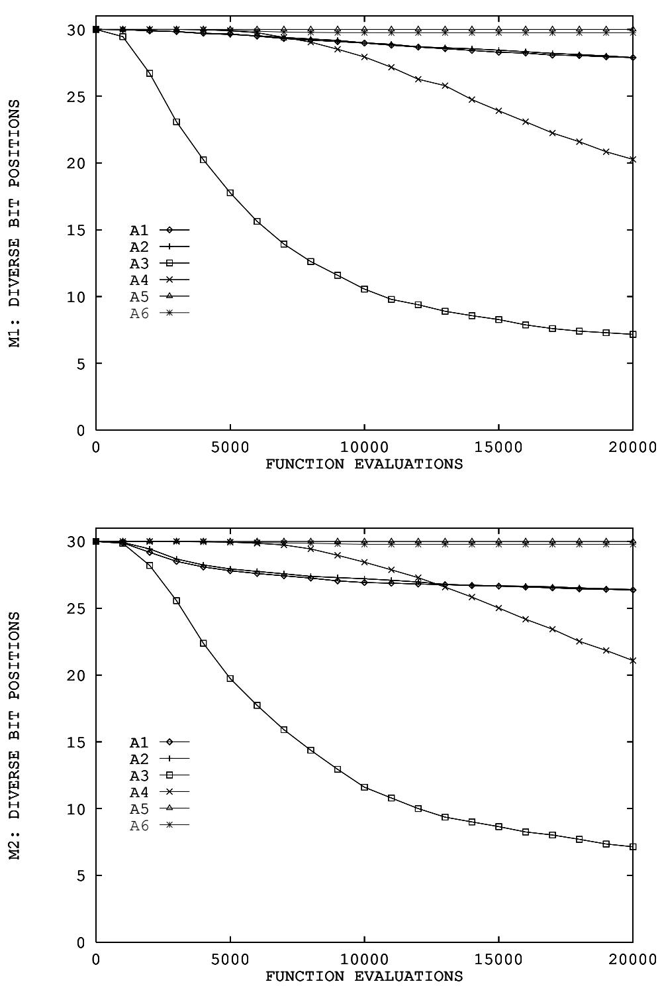  
Figure 6.5: Bitwise diversity maintained by each algorithm, A1-A6, is shown as a function of time, averaged over 100 runs. A bit-position is considered diverse if both possible values occur at least once in the population.

# Chapter 7

# classes, that arises from the combination of crossover and replacement selection. In tnesssharing, we know that the expected distribution is determined by representative class tnesses:

This chapter analyzes the deterministic crowding algorithm that was developed in the previfrom sharin distributions. classes, that arises from the combination of crossover and replacement selection. In fitness sharing, we know that the expected distribution is determined by representative class fitnesses: such air under oes crossover ossibl followed b mutation or other enetic o erators to of class fitnesses. In crowding methods, on the other hand, we currently known nothing about expected distributional properties. As we soon discover, crowding distributions are different from sharing distributions.

Recall from the previous chapter that deterministic crowding randomly pairs all population makes sense if one examines DC's $n / 2$ avior without crossover $n$ and without mutation which such pair undergoes crossover, possibly followed by mutation or other genetic operators, to yield two children. Each of the two children competes with one of the two parents, according to similarity, for inclusion in the population. The deterministic crowding algorithm is presented in pseudocode form in Figure 7.1.

It turns out that crossover largely determines the behavior of deterministic crowding. This makes sense if one examines DC's behavior without crossover (and without mutation, which is absent in all models). Without crossover, DC simply advances both parents to the next generation, and the population never changes. Under crossover, however, a variety of interesting behaviors emerge. The combination of crossover and replacement selection produces interactions among niches, that we later isolate and explain. These interactions determine the

# y p , y g

(REPEAT for $g$ generations)

wit $n / 2$ times:

1. Select two parents, $p _ { 1 }$ and $p _ { 2 }$ , randomly, without replacement

2. Cross them, yielding $c _ { 1 }$ and $c _ { 2 }$

3. Apply mutation and possibly other operators, yielding $c _ { 1 } ^ { \prime }$ and $c _ { 2 } ^ { \prime }$

$$
[ D i s t a n c e ( p _ { 1 } , c _ { 1 } ^ { \prime } ) + D i s t a n c e ( p _ { 2 } , c _ { 2 } ^ { \prime } ) ] \leq [ D i s t a n c e ( p _ { 1 } , c _ { 2 } ^ { \prime } ) + D i s t a n c e ( p _ { 2 } , c _ { 1 } ^ { \prime } ) ]
$$

• IF $f ( c _ { 1 } ^ { \prime } ) > f ( p _ { 1 } )$ Pseudo $p _ { 1 }$ de is $c _ { 1 } ^ { \prime }$ • IF $f ( c _ { 2 } ^ { \prime } ) > f ( p _ { 2 } )$ replace $p _ { 2 }$ with $c _ { 2 } ^ { \prime }$

ELSE

• IF $f ( c _ { 2 } ^ { \prime } ) > f ( p _ { 1 } )$ replace $p _ { 1 }$ with $c _ { 2 } ^ { \prime }$ • IF $f ( c _ { 1 } ^ { \prime } ) > f ( p _ { 2 } )$ replace $p _ { 2 }$ with $c _ { 1 } ^ { \prime }$

distributional properties of DC and, we expect, of other crowding methods. This chapter's characterization of crossover-induced interactions among niches may additionally be applicable to other niching methods and GAs that incorporate crossover.

To simplify matters, we assume the crossover probability $p _ { c } = 1$ throughout the models and We start by constructing the simplest possible model in which crossover can potentially chan $p _ { c }$ the existing distribution | a two-class model. We can predict the combined eect of crossover and replacement selection using this model. According to our m

# classes, however, may yiel

We start by constructing the simplest possible model in which crossover can potentially change the existing distribution — a two-class model. We can predict the combined effect of crossover and replacement selection using this model. According to our modelling framework, crossing two elements of the same class yields two offspring of that class. Crossing two elements of differing classes, however, may yield two offspring from any of the $c$ classes. We expect that most of the time, especially for $c = 2$ , crossing elements of differing classes will yield one offspring from each class involved in the cross. Hence, we predict that the two-class case with crossover, like the case of selection only, wil ideally maintain the initial class distribution perpetually. (Unlike selection only, improvement will occur within each class.)

To illustrate this model behavior, let us consider the bimodal functions, M10 and M11, displayed in Figures 5.10 and 5.11. M10 and $M \ o { 1 } { 1 }$ are constructed so that the most significant (leftmost) bit of each population element indicates the peak under which it lies, and defines the Accordin to $A$ he $B$ rfect discrimination as

We expect the following behavior under DC. If two elements of Class $A$ get randomly paired, both offspring will also be of Class $A$ , and the resulting tournament will advance two Class $A$ elements to the next generation. The pairing of two Class $B$ elements will similarly result in no net change to the distribution of the next generation. If an element of Class $A$ gets paired with an element of Class $B$ , one offspring will be from Class $A$ , and the other, from Class $B$ in A after one eneration n trials are = I and 2 = where I re resents the number same class are always closer to each other than they are to elements of other classes. Therefore, the Class $A$ offspring will compete against the Class $A$ parent; the Class $B$ offspring, against the Class $B$ parent. The end result will be that one element of each class advances to the next generation — no net change in distribution. Since each element of the population receives exactly one trial per generation, the mean and variance for the number of population elements or $A$ he other eak b the e $n$ d of a run. $\mu _ { A } = I _ { A }$ h im $\sigma _ { A } ^ { 2 } = 0$ ent occu $I _ { i }$ within classes all 1 runs maintain the in $i$ tial class distribution for 100 enerations zer $\mu _ { B } = I _ { B }$ ce . I $\sigma _ { B } ^ { 2 } = 0$

We run DC on $M \varLambda \theta$ and $M \ o { 1 } { 1 }$ for 100 generations, with $n = 3 2$ $p _ { c } = 1$ , and $p _ { m } = 0$ . We crowdin exhibits no ressure towards balance even on M11 where A is four times as t as B. atop both peaks. On each function, all 100 runs locate both global optima and maintain them to the end of the run. In fact, every population element typically moves to the top of one or the other peak by the end of a run. Although improvement occurs within classes, all 100 runs maintain the initial class distribution for 100 generations (zero variance). In some runs, random initialization gives Class $B$ many more elements than Class $A$ (or vice versa); however, crowding exhibits no pressure towards balance, even on $M \ o { 1 } { 1 }$ , where $A$ is four times as fit as $B$ Over the 100 runs, DC maintains a near uniform, average distribution of 15.79 Class $A$ elements and 16.21 Class $B$ elements, on both $M \varLambda \theta$ and $M \ o { 1 } { 1 }$ . (The same 100 initial populations are used for both $M \varLambda \theta$ and $M \ o { 1 } { 1 }$ .)

Crowding's behavior can hence be quite different from that of sharing, at least in the twoclass case. The expected distribution is identical to the prior distribution, with no variance. No restoration is present, but no drift is either. Most notably, unlike sharing, the expected distribution is independent of fitness: a highly fit class does not gain elements from a lowly fit class. While lesser-fit classes may disappear in sharing (Deb, 1989), they appear to be in no danger in DC, at least in the two-class case. Stability is guaranteed, regardless of class-fitness differential. Even when M11 is modified to have an increased peak fitness ratio of 256:1, the lesser-fit class maintains an average, over multiple runs, of roughly $5 0 \%$ of the population's elements.

One might ask what the distribution does depend upon, if not upon fitness. In the two-class hillclimbin nei hborhood o erator. ne mi ht also ask what crowdin can accom lish if it never shifts elements between classes. expect that the number of elements in a particular class $i$ is proportional to the percentage of tentl locates and $i$ aintains both o tima in M10 and M11. In addition multiclass roblems of the base of the peak corresponding to $i$ . This width corresponds to the size of the peak's basin of attraction (defined in Chapter 5's modelling framework), under an appropriately chosen hillclimbing neighborhood operator.

One might also ask what crowding can accomplish if it never shifts elements between classes. We now examine DC's behavior on problems with multiple classes, where crossover produces a variety of interactions among classes. Certai $M \ o { 1 0 }$ sses $M \ o { 1 } { 1 }$ gain an advantage over others, and ultimately take a larger share of the population. In our DC model, since all eleme

# when competing against parents

We now examine DC's behavior on problems with multiple classes, where crossover produces a variety of interactions among classes. Certain classes may gain an advantage over others, and ultimately take a larger share of the population. In our DC model, since all elements of a class have fitness identical to the corresponding peak's height, offspring from classes of higher fitness, when competing against parents from classes of lower fitness, will always win. We need only account for the possible offspring of interclass crossover.

Consider the four-peaked functions, M12M14, of Figures 5.125.14, in which class membership is determined solely by the leftmost two bits of the eight-bit chromosome. Class $A$ individuals have $0 0$ ' in these bits; Class $B$ $0 1 ^ { \prime }$ ; Class $\ C$ $1 0$ '; and Class $D$ $1 1$ . Crossing $A$ with $B$ or $\ C$ always yields one element from each class involved in the cross; after like competes against like, we obtain no net change in distribution. Likewise, crossing $D$ with $B$ or $\ C$ yields no net change. The two remaining possibilities are of the most interest. With probability $6 / 7$ single-point crossover will avoid the leftmost two bits, resulting in no net change. However, s mmetric and e $1 / 7$ ll robable so that iven a uniform startin distribution no one class can in two offspring of classes different from their parents' classes. Such a cross between elements of $A$ Consi $D$ r M12 in which all four eaks are o $B$ ual hei ht. T $\ C$ DC al orithm refers $B$ rents $C$ their os rin $A$ n case of $D$ tie. Therefore no mi ration is ex ected between eaks. In an will result in two tournaments — one between $A$ and $B$ , and one between $\ C$ and $D$ - with the fitter class winning each tournament. The two cases that produce outside offspring are s mmetr of the curves corres ondin to the number of individuals in A and B and also the s mmetr of the curves for and D. Prior to e uilibrium A can o

Consider $M \it { 1 2 }$ , in which all four peaks are of equal height. The DC algorithm prefers parents to their offspring in case of a tie. Therefore, no migration is expected between peaks. In an actual run with $n = 3 2$ $p _ { c } ~ = ~ 1$ , and $p _ { m } ~ = ~ 0$ , after a few generations the population reaches equilibrium, and no further migration occurs. This run is shown in Figure 7.2. Note the symmetry of the curves corresponding to the number of individuals in $A$ and $B$ , and also the symmetry of the curves for $C$ and $D$ . Prior to equilibrium, $A$ can only gain an individual if it takes it from $B$ , and vice versa. The combined number of individuals in $C$ and $D$ likewise remains constant.

As an example of analysis contributing to design, let us temporarily alter DC so that in case of a tie, it always advances the child over the parent. For functions with multiple global optima, such as $M \it { 1 2 }$ , the migration discussed above will occur freely, even after equilibrium. The inevitable result of such migration will be genetic drift, though crowding will drift much more slowly than the simple GA. A preliminary version of deterministic crowding was, in fact, implemented in this way, and a small amount of drift did occur on $M \it { 1 2 }$ . This observation of drift led to the slight design change requiring that offspring be strictly fitter than their parents in order to advance.

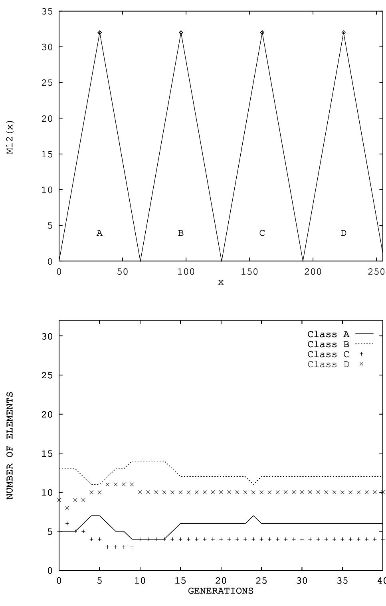  
Figure 7.2: DC runs on $M \boldsymbol { \mathit { 1 2 } }$ with $n = 3 2$ $p _ { c } ~ = ~ 1$ , and $p _ { m } ~ = ~ 0$ . The top graph shows the elements atop the peaks they have climbed after 100 generations. The bottom graph tracks the number of elements in each class over the course of the run.

In M13, Class $A$ is twice as fit as the other three classes. Our model predicts that when a cross between $B$ and $\ C$ yields one $A$ and one $D$ $A$ will win the subsequent tournament against $B$ . Since such a cross occurs with fixed, positive probability, $B$ will eventually contribute all of its elements to $A$ $\ C$ and $D$ , however, will not give each other any elements. Figure 7.3 shows a sample run of DC on $M \it { 1 3 }$ , again with $n = 3 2$ $p _ { c } = 1$ , and $p _ { m } = 0$ . In the sample run, $\ C$ and $D$ reach equilibrium after 13 generations, at which point they no longer exchange elements. A and $B$ , on the other hand, reach a quasi-equilibrium around Generation 32, when $B$ has given most but not all of its elements to $A$ . This quasi-equilibrium lasts to Generation 56, when $A$ gains the rest of $B$ 's elements. We refer to Peak $A$ as a dominating peak (or class), and to Peak $B$ as a dominated peak.

We have just uncovered two important properties of crowding. First, delayed convergence allows a user to identify dominated classes by stopping the run upon preliminary convergence, rather than waiting for full convergence. Second, crowding realizes a couple of properties of sharing, albeit via different routes. We define a dominated class as one which can, with another's assistance, cross to form a fitter class, and which, due to close proximity to the fitter class, must On M13 mi ration from B to A occurs with the assistance of C since for a sin le mi ration donate all of their elements to one or more higher peaks, if $\sigma _ { s h a r e }$ is too large to discriminate (Goldberg, Deb, & Horn, 1992). This is the first similar property. The second property is that crowding, like sharing, ultimately distributes elements to classes based partially on fitness.

One further property of crowding deserves mention — the assist — where an element of one class helps an element of another class to migrate, but does not necessarily go anywhere itself. On $M \it { 1 3 }$ , migration from $B$ to $A$ occurs with the assistance of $\ C$ , since for a single migration to occur, $B$ and $C$ must cross to produce $A$ and $D$ . We say that $A$ dominates $B$ with the assistance of $\ C$

In $M 1 \text{ textperthousand}$ , Class $D$ is also made a dominating class, so that peaks $A$ and $D$ are each twice the height of $B$ and $C$ . We might at first expect $B$ to eventually transfer all of its elements to $A$ and $\ C$ to transfer all of its elements to $D$ . However, according to our model, $B$ and $\ C$ must assist each other in migration. Whenever either $B$ or $C$ is depleted, the other becomes stable and no longer transfers any of its elements. Without the assist, the weaker class is no longer dominated. We verify this hypothesis by running DC on $M 1 \text{ textperthousand}$ , once again with $n = 3 2$ $p _ { c } = 1$ and $p _ { m } = 0$ . One of several similar runs is shown in Figure 7.4. After Class $B$ contributes all of its elements to Class $A$ , Class $C$ becomes stable, with four elements remaining. The four elements are then maintained perpetually. (We actually stop the run after 5000 generations.) In all runs that we perform on $M 1 \text{ textperthousand}$ , once either $B$ or $\ C$ is depleted, the other class remains stable to the end of the run.

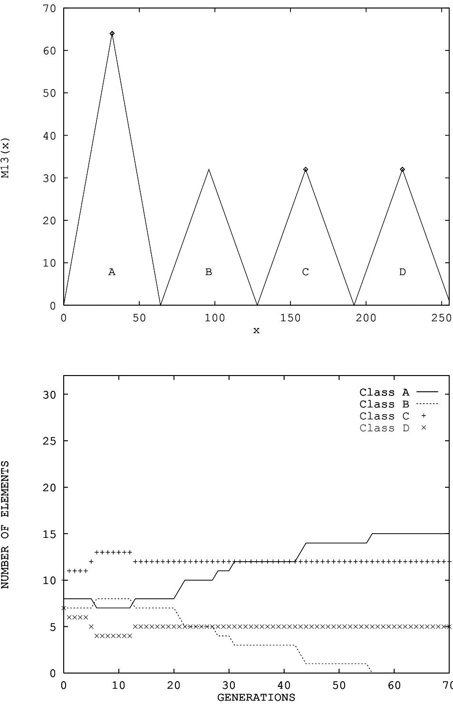  
Figure 7.3: DC runs on $M \it { 1 3 }$ with $n = 3 2$ $p _ { c } ~ = ~ 1$ , and $p _ { m } ~ = ~ 0$ . The top graph shows the elements atop the peaks they have climbed after 100 generations. The bottom graph tracks the number of elements in each class over the course of the run.

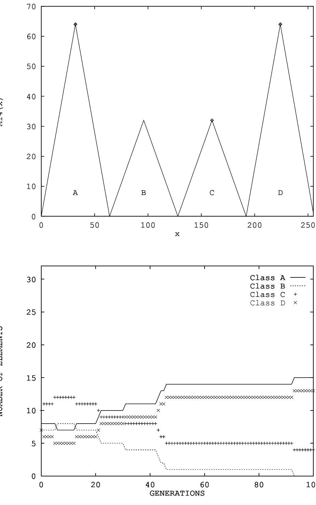  
Figure 7.4: DC runs on $M 1 \%$ with $n = 3 2$ $p _ { c } ~ = ~ 1$ , and $p _ { m } ~ = ~ 0$ . The top graph shows the elements atop the peaks they have climbed after 100 generations. The bottom graph tracks the number of elements in each class over the course of the run.

Table 7.1: For various functions, averages are given (over $r$ runs) of the number of elements in each class after $g$ generations. Population size is $n$ . In all cases, $p _ { c } = 1$ and $p _ { m } = 0$   

<table><tr><td rowspan=1 colspan=1></td><td rowspan=1 colspan=1>r</td><td rowspan=1 colspan=1>g</td><td rowspan=1 colspan=1>A</td><td rowspan=1 colspan=1>B</td><td rowspan=1 colspan=1>C</td><td rowspan=1 colspan=1>D</td><td rowspan=1 colspan=1>E</td><td rowspan=1 colspan=1>n</td></tr><tr><td rowspan=1 colspan=1>M12</td><td rowspan=1 colspan=1>100</td><td rowspan=1 colspan=1>100</td><td rowspan=1 colspan=1>7.80</td><td rowspan=1 colspan=1>7.99</td><td rowspan=1 colspan=1>7.95</td><td rowspan=1 colspan=1>8.96</td><td rowspan=1 colspan=1></td><td rowspan=1 colspan=1>32</td></tr><tr><td rowspan=1 colspan=1>M13</td><td rowspan=1 colspan=1>100</td><td rowspan=1 colspan=1>100</td><td rowspan=1 colspan=1>15.39</td><td rowspan=1 colspan=1>.40</td><td rowspan=1 colspan=1>8.90</td><td rowspan=1 colspan=1>7.31</td><td rowspan=1 colspan=1></td><td rowspan=1 colspan=1>32</td></tr><tr><td rowspan=1 colspan=1>M 14</td><td rowspan=1 colspan=1>100</td><td rowspan=1 colspan=1>100</td><td rowspan=1 colspan=1>13.58</td><td rowspan=1 colspan=1>2.21</td><td rowspan=1 colspan=1>2.32</td><td rowspan=1 colspan=1>13.89</td><td rowspan=1 colspan=1></td><td rowspan=1 colspan=1>32</td></tr><tr><td rowspan=1 colspan=1>M1</td><td rowspan=1 colspan=1>100</td><td rowspan=1 colspan=1>200</td><td rowspan=1 colspan=1>23.33</td><td rowspan=1 colspan=1>15.76</td><td rowspan=1 colspan=1>21.13</td><td rowspan=1 colspan=1>16.62</td><td rowspan=1 colspan=1>23.16</td><td rowspan=1 colspan=1>100</td></tr><tr><td rowspan=1 colspan=1>M 2</td><td rowspan=1 colspan=1>500</td><td rowspan=1 colspan=1>300</td><td rowspan=1 colspan=1>24.25</td><td rowspan=1 colspan=1>17.86</td><td rowspan=1 colspan=1>20.77</td><td rowspan=1 colspan=1>14.52</td><td rowspan=1 colspan=1>22.59</td><td rowspan=1 colspan=1>100</td></tr></table>

Recall our earlier conjecture for two classes, that the expected number of elements in a class is proportional to the width (in one dimension) of the base of its peak. For multiple classes, we revise this conjecture to the following: the expected number of elements in a class, at equilibrium, is proportional to the sum of the width of the base of its peak, and the widths of the bases of all peaks it dominates. Dominated peaks are expected to disappear, unless stabilized by the prior disappearance of their assisting peak(s). In a multidimensional search space, our revised hypothesis tells us that the expected proportion of Class $i$ elements, in the long run, is equal to the sum of the percentage of the search space contained in $i$ , and the percentage of the search space contained in all classes that $i$ dominates. According to our modelling framework, the amount of search space contained in a class is equal to the corresponding peak's basin of attraction, under an appropriate neighborhood operator.

Table 7.1illuminates the above conjecture regarding long-run class distributions. It displays, for M12M14, the average number, over 100 runs of DC, of elements in each class after 100 generations. For M12, the distribution is very close to uniform, approximately 8 elements per class. On M13, Class $A$ swallows all of $B$ 's elements, yielding an average, combined count of 15.79 elements for the two classes; Classes $C$ and $D$ are close to the expected count of 8 elements apiece. On M14, $A$ and $B$ combine for an average of 15.79 elements, while $C$ and $D$ average a combined total of 16.21; both combined totals compare favorably with the expected count of 16 per pair of classes.

Note on M13, that not all runs lose all Class $B$ elements by Generation 100. On M14, over two elements, on the average, are maintained in both $B$ and $C$ to Generation 100. These cha ter. M1 has ve eaks of uniform hei ht M nonuniform hei ht. uns em lo n = 1 migration in M14 markedly slows down as assisting peaks are depleted — some runs hold on for several hundred generations before losing all elements of either $B$ or $C$ . This is due to the decreasing probability of selecting both parents from declining classes.

We now test DC on two functions from the literature, to see whether it exhibits the same properties as on M10-M14. We examine DC on $M \mathit { 1 }$ and $M \mathcal { Q }$ , the test functions of the previous chapter. M1 has five peaks of uniform height; M2, nonuniform height. Runs employ $n = 1 0 0$ $p _ { c } = 1$ , and $p _ { m } = 0$

Note in Table 7.1 that the average distribution for $M \mathit { 1 }$ is not quite uniform, even though all peaks have the same width and are of the same height. A plausible explanation for this behavior is found by examining key hybrid crosses. Typically, interclass crosses do not produce fit offspring of outside classes. However, prior to convergence, crosses between $B$ and $\ C$ sometimes yield relatively fit elements of $A$ , and crosses between $C$ and $D$ sometimes yield relatively fit elements of $E$ . We therefore suggest that prior to full convergence, $A$ dominates $B$ n $E$ which h $D$ eaks of dierin tnesses we obse $C$ e more of the t e of behavior number of elements for $A$ and $B$ , we obtain 39.09; for $D$ and $E$ , 39.78. Both sums are very close to 40, the expected combined value under domination. The partial symmetry between dominating and dominated classes,illustrated in the sample run of Figure 7.5, provides further evidence. Dominance and its resulting migration come to a full stop after 151 generations, and the distribution remains unchanged thereafter. (We continue the run to Generation 5000.)

On $M \mathcal { Q }$ , which has peaks of differing fitnesses, we observe more of the type of behavior displayed on $M \mathit { 1 }$ , plus additional interactions, as the less fit peaks $D$ and $E$ give up a few of their collective elements to $A$ and $B$ (see Table 7.1). We start to see a sharing-like phenomenon, in which the end distribution is partially related to fitness. In most of the 500 runs we perform, the distribution no longer changes after 200-300 generations.

The main purpose of monitoring an algorithm's behavior on simple problems is to isolate components of that behavior that will transfer to difficult problems and to applications problems. We next apply DC to $M \gamma$ , a massively multimodal, deceptive function, described in

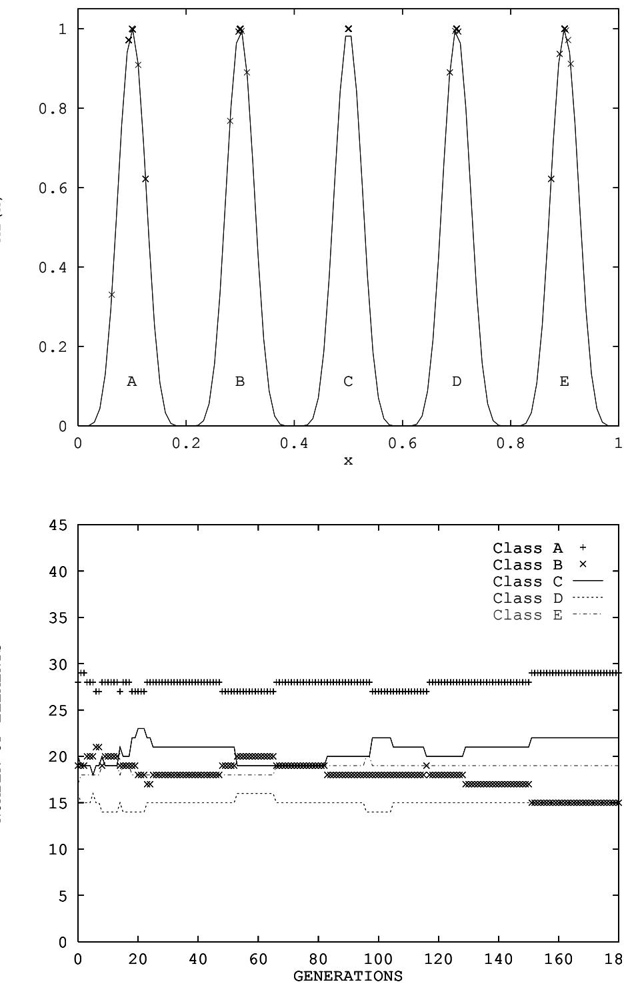  
Figure 7.5: DC runs on $M \mathit { 1 }$ with $n = 1 0 0$ $p _ { c } ~ = ~ 1$ , and $p _ { m } ~ = ~ 0$ . The top graph shows the population elements after 200 generations. The bottom graph tracks the number of elements in each class over the course of the run. After 151 generations, the distribution no longer changes.

Chapter 5. M7 has 32 global optima, which we wish to locate, and over 5.15 million nonglobal optima, which we do not care to locate.

Employing a population of 1000 individuals, genotypic comparison, $p _ { c } ~ = ~ 1$ , and $p _ { m } ~ = ~ 0$ DC successfully locates and maintains copies of all global optima, and ultimately gets rid of all nonglobal optima. Locating all global optima is not immediate, however; it first requires that nonglobal optima be found. In a sample run, by Generation 56, each global optimum gains at least one element, and one global optimum gains 53 elements. Full convergence occurs by Generation 167, at which point all elements belong to classes corresponding to global optima. Upon convergence, 2 of the 32 global classes contain only 4 elements (the smallest number), but one class contains 70 elements (the largest number). This result compares favorably with the results of Goldberg, Deb, and Horn (1992), who introduce M7 and present the only prior, eneration as additional lobal subfunctions are discovered b each o ulation element. It also along with exponential scaling and a population size of 5000, to maintain roughly $4 0 \%$ of the population at global optima. With DC, we consistently solve M7 in one fifth the function evaluations.

Figure 7.6 illustrates, for $M \gamma$ , the crossing of ordinary population elements to form local lowest avera e number of elements for an of the 32 lobal classes is 21.93 the hi hest is 38.76. generation, as additional global subfunctions are discovered by each population element. It also shows that intermediate optima disappear, as a diverse collection of global optima takes over the whole population.

Over multiple runs, no global class appears to have an overwhelming advantage over any other. For instance, over the course of 200 runs, with 200 generations per run and $n = 1 0 0 0$ , the lowest average number of elements for any of the 32 global classes is 21.93; the highest is 38.76. Nonglobal optima, however, eventually disappear. After 200 generations, the 1600 nonglobal dominate more local optima than do other global optima. Perhaps more pertinent are the a combined total of only .31 of a population element amongst them. Local optima with lower fitnesses average 0. We attribute the eventual disappearance of all nonglobal optima to their being dominated by global optima.

Why does DC slightly prefer some global optima over others, despite the fact that an equivalent amount of search space leads up to each? One possibility is that some global optima dominate more local optima than do other global optima. Perhaps more pertinent are the end biases of single-point crossover, which make the formation of certain global optima more hi hest is 34.65. A ortionin the 1000 o ulation elements uniforml amon lobal classes de facto crossover points. It is impossible to pass the central portion of a string from parent to is much closer to uniform usin two- oint crossover. does not possess any end biases.

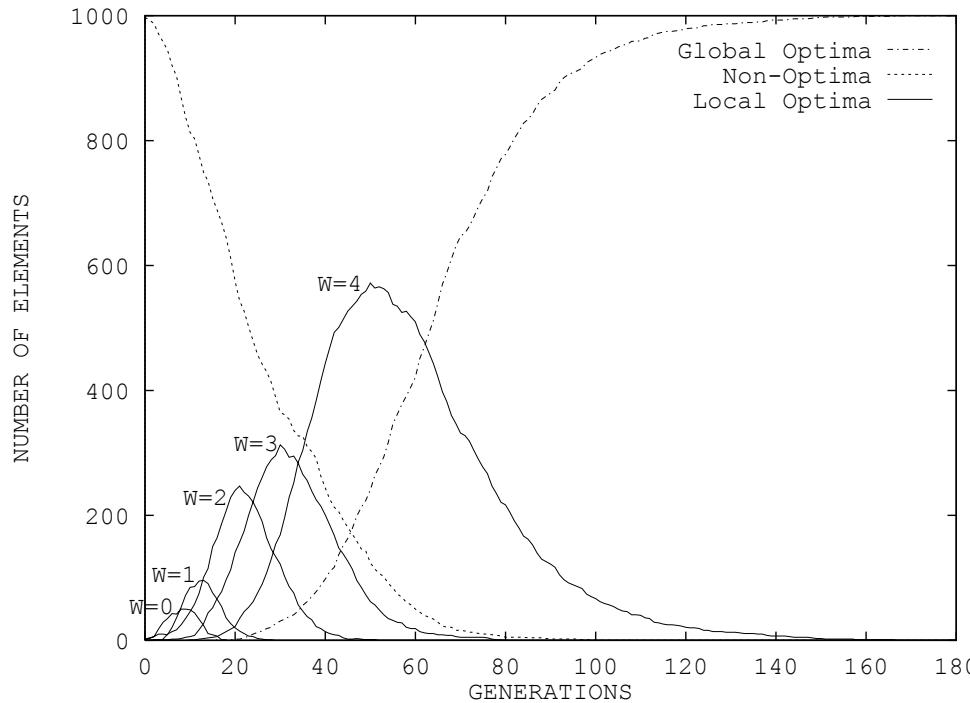  
os rin without also assin one of the end ortions. Two- oint crossover on the ot $M \gamma$ hand $n = 1 0 0 0$ $p _ { c } = 1$ , and $p _ { m } = 0$ $W$ is the number of globally converged subfunctions in a local does not

We repeat the above experiment using two-point crossover in place of single-point. Over 200 runs, the lowest average number of elements for any of the 32 global classes is 28.01; the We have formulated and tested the hypothesis that under DC, for all classes i, the expected long-run proportion of Class i elements is directly proportional to the sum of the size of i's is much closer to uniform using two-point crossover.

# 7.3 Discussion of Properties

We have formulated and tested the hypothesis that under DC, for all classes $i$ , the expected long-run proportion of Class $i$ elements is directly proportional to the sum of the size of $i$ 's basin of attraction and the size of the basins of attraction of all peaks that $i$ dominates. Basins of attraction are defined, whenever appropriate, in terms of phenotypic, epsilon-neighborhood hillclimbing. For $M \gamma$ , basins are defined in terms of single-bit hillclimbing in Hamming space. Relative peak fitnesses, proximity of peaks, and crossover biases help determine the dominance like unar

Without the power to migrate to higher peaks, DC would simply be a parallel hillclimber. However, the ability to jump from peak to peak allows DC to escape local optima, given the dened relative to the other oints in the search s ace with which it ma cross. Therefore we can attem t to redict the distribution resultin from crossover hillclimbin in much the same because it employs the binary neighborhood operator of crossover, rather than a mutationlike, unary neighborhood operator. The crossover neighborhood of a particular pair of points may bounce either point all over the search space, when viewed from the vantage point of traditional, epsilon-neighborhood hillclimbing. The crossover neighborhood of a single point is defined relative to the other points in the search space with which it may cross. Therefore, we can attempt to predict the distribution resulting from crossover hillclimbing, in much the same way we have been — by examining the potential results of crossing every two classes.

We can reformulate our prior hypothesis in terms of crossover hillclimbing and crossover basins of attraction. In this new light, the single factor that determines the eventual distribution under deterministic crowding is the number of ordered pairs in $S \times S$ that potentially lead to a peak via crossover, where $S$ is the original search space. We call this number of ordered pairs, a peak's crossover basin of attraction. Note that a point may be within more than one peak's crossover basin of attraction. However, it may be more likely to reach one peak than another. Jones (in press) provides a similar, but more detailed treatment of crossover landscapes and to nichin methods. Deb 1989 shows that matin restrictions ield a cleaner version of for future studies of crowding, as well as future studies of other niching methods, replacement selection methods, and genetic algorithms. It is of intermediate modelling complexity between the models of this study and the Markov chain models that we reviewed in Chapter 5.

The results of this chapter, in addition to shedding light on crossover interactions, crossover hillclimbing, and crowding distributions, also raise questions about adding mating restrictions to niching methods. Deb (1989) shows that mating restrictions yield a cleaner version of sharing, with better on-line performance. This is because mating restrictions prevent lethal hybrid crosses between elements of different niches. However, mating restrictions also prevent beneficial hybrids from forming, essentially creating a trade-off between on-line and off-line performance. Ironically, we have found instances in this chapter, using the same five-peaked functions as Deb, where hybrid crosses lead to better offspring than their parents. On the massively multimodal and deceptive M7, hybrid crosses of local optima were essential to the formation of global optima. Had mating restrictions been additionally enforced, migration to higher peaks would have been prevented.

# Chapter 8

# p ylucky numbers. If successful, the player rolls aga

This chapter models fitness sharing in the absence of crossover. The models are analogous to a one-player game, in which the player chooses several "lucky numbers" between 1 and 6, inclusive. The player rolls a number of dice simultaneously, trying to match all of his or her lucky numbers. If successful, the player rolls again. Otherwise the game ends.

Recall from Chapter 4 that sharing is able to work in conjunction with any GA selection scheme. We model sharing with roulette-wheel selection, with the understanding that since RWS is the noisiest of commonly used fitness-proportionate selection schemes, our models will bound the behavior of sharing under noise-reduced, fitness-proportionate selection schemes such as stochastic remainder selection and stochastic universal selection. Specifically, we expect bounds on quantities such as drift time and population size, computed using RWS, to also serve as bounds for less noisy selection schemes. RWS not only gives us bounding behavior, but also offers the advantage of simplicity, making our modelling task a more promising venture.

This chapter first analyzes and illustrates sharing's distributional properties from the perspective of our modelling framework. It examines the likelihood that sharing loses important solutions, and derives closed-form expressions for the expected time to disappearance of a class. This time to disappearance or drift time is related to the population size $n$ , number of classes $c$ and relative class fitnesses (which we designate using ratio $r$ ). We illustrate, both theoretically and empirically, the drift time of sharing.

The chapter next sets up models of fitness sharing in which all peaks in the fitness landscape are desirable. The first model assumes that all classes are of identical fitness. Subsequent models allow classes of arbitrary fitness. The models yield lower bounds on required population size. We illustrate the utility of these population-size bounds on a set of test functions of varying This section examines class distributions resulting from sharing with roulette-wheel selection. It derives distributional properties for sharing with RWS, and illustrates the derived properties with several examples.

# Roulette-wheel selection

This section examines class distributions resulting from sharing with roulette-wheel selection. It derives distributional properties for sharing with RWS, and illustrates the derived properties with several examples.

# Roulette-wheel selection

except that i now designates a class instead of an individual, and Ps is that class's selection probability, while ps is an individual's selection probability. Note also that i=0 Ps(i) $i$ = $P _ { s } ( i )$ Employing the formul

$$
P _ { s } ( i ) ~ = ~ { \frac { I _ { i } f _ { i } } { \sum _ { j = 0 } ^ { c - 1 } I _ { j } f _ { j } } } .
$$

Note that the expression in Equation 8.1 for $P _ { s } ( i )$ (i) ; $p _ { s } ( i )$ (8:2) except that $i$ now designates a class instead of an individual, and $P _ { s }$ is that class's selection with variance, $p _ { s }$ is an individual's selection probability. Note also that $\begin{array} { r } { \sum _ { i = 0 } ^ { c - 1 } P _ { s } ( i ) = 1 } \end{array}$

i = n Ps(i) (1  Ps(i)) : $I _ { i }$ (8:3) expected number of population elements in Class $i$ after one generation ( $n$ Bernoulli trials) is

$$
\mu _ { i } ~ = ~ n ~ P _ { s } ( i ) ~ ,
$$

with variance,

$$
\sigma _ { i } ^ { 2 } ~ = ~ n ~ P _ { s } ( i ) ~ ( 1 - P _ { s } ( i ) ) ~ .
$$

The above results tell us a great deal about the behavior of a GA that runs RWS. The distribution at time $t + 1$ of population elements among classes depends both upon the distribution at time $t$ and the relative fitnesses of the classes. Given multiple classes of identical fitness, where one class has become more frequent than the others, there is no restoration — the expected number of each class in a given generation is the same as the actual number of each in the previous generation. (If all $f _ { i }$ are the same, Equations 8.1 and 8.2 tell us, respectively, Sharing w $i$ t $P _ { s } ( i ) = I _ { i } / n$ whe $\mu _ { i } = I _ { i }$ .) This lack of restoration, in combination with the significant variance of RWS and finite population size, leads to the eventual disappearance of all but one class (Goldberg $\&$ Segrest, 1987). Given classes of nonuniform fitness, the most fit class is expected to take over the entire population: a rough estimate of takeover time can be P i = Ii f i = $k$ fi $\mu _ { k } \geq n$

# Sharing with roulette-wheel selection

(n Bernoulli trials) are given in the following two equations: $f ^ { \prime }$ , for an arbitrary class $i$ , is given by $f _ { \ i } ^ { \prime } = f _ { i } / I _ { i }$ $I _ { i } \neq 0$ ). Substitution into Equation 8.1 yields

$$
P _ { s } ( i ) ~ = ~ { \frac { I _ { i } { f ^ { \prime } } _ { i } } { \sum _ { j = 0 } ^ { c - 1 } I _ { j } { f ^ { \prime } } _ { j } } } ~ = ~ { \frac { f _ { i } } { \sum _ { j = 0 } ^ { c - 1 } f _ { j } } } ~ .
$$

The mean and variance for the number of population elements in Class $i$ after one generation $n$ Bernoulli trials) are given in the following two equations:

$$
\mu _ { i } ~ = ~ n ~ P _ { s } ( i ) ~ ;
$$

$$
\sigma _ { i } ^ { 2 } ~ = ~ n ~ P _ { s } ( i ) ~ ( 1 - P _ { s } ( i ) ) ~ .
$$

s( ) fA + fB r + $c$ classes of identical fitness $f _ { 0 } =$ $f _ { 1 } = \ldots = f _ { c - 1 } )$

$$
\forall _ { i } ~ P _ { s } ( i ) ~ = ~ { \frac { f _ { i } } { \sum _ { j = 0 } ^ { c - 1 } f _ { j } } } ~ = ~ { \frac { 1 } { c } } ~ .
$$

independent of $c = 2$ ar $A$ ng di $B$ r

$$
P _ { s } ( A ) = { \frac { f _ { A } } { f _ { A } + f _ { B } } } = { \frac { r } { r + 1 } } ,
$$

where $r = f _ { A } / f _ { B }$

For sharing with roulette-wheel selection, the expected distribution and its variance are independent of the starting distribution (since the $I _ { i }$ terms drop out of Equation 8.4); they depend only upon relative class fitnesses. This explains the restorative pressure inherent in sharing methods, where classes that contain other than their share of population elements can expect to be restored to the proper number in one generation. This restorative pressure keeps drift from becoming an overwhelming factor, since unlike RWS alone, RWS with sharing does not give stochastic fuctuations the opportunity to accumulate over multiple generations. A related beneficial property of sharing, uncovered by the above model, is that no greater threat exists of a class becoming extinct when it has only one representative in the population than when it has many.

In the game we earlier outlined, a successful player picks up allthe dice and rolls them again. The numbers that appear on the dice are independent of the numbers that appeared on the prior roll. In our sharing model, dice become population elements, rolls become generations, and numbers become classes. Successive generations are independent, allowing us to algebraically derive further properties of sharing such as drift time and population size. Because of this independence, sharing, unlike the simple GA, is not a Markov chain. (A Markov chain is a sequence of trials in which the outcome of a trial depends only upon the outcome of the previous trial.) Horn (1993) discovers this non-Markov property of sharing when the column entries of his transition matrix for "perfect sharing" turn out to be identical. Horn's observation, along with the results presented herein, suggest that Markov chains may be unnecessarily complex maintain the lower of

Given classes of nonuniform fitness, the least fit class will not disappear if sharing is em share  ( ) ; (8:9) Deb (1989) notes that genotypic sharing sometimes loses peaks of relatively low fitness. He where d(i; j) is the Hamming distance between the maxima of peaks i and j, $\sigma _ { s h a r e }$ ri;j = min(fi=fj ; fj=fi). In our models, the perfect discrimination assumption allows us to ignore the setting of share . $i$ and $j$ , the following $\sigma _ { s h a r e }$ is required:

$$
\sigma _ { s h a r e } \ \leq \ { \frac { d ( i , j ) } { 1 - r _ { i , j } } } ,
$$

where $d ( i , j )$ is the Hamming distance between the maxima of peaks $i$ and $j$ , and $\begin{array} { r l } { r _ { i , j } } & { { } = } \end{array}$ $\operatorname* { m i n } ( f _ { i } / f _ { j } , f _ { j } / f _ { i } )$ . In our models, the perfect discrimination assumption allows us to ignore the setting of $\sigma _ { s h a r e }$

Note that Deb's calculation does not take population size into account. This suggests that another factor might also be at work in genotypic as well as phenotypic sharing: genetic drift due to the relative insignificance of lower peaks. Examples of this type of genetic drift follow.

# Experimental verification

We now illustrate some of the previously derived distributional properties. Figures 8.1 and 8.2 show the expected distribution after one generation and its standard deviation, for RWS alone and sharing with RWS. Figure 8.1 is for two classes of equal fitness; Figure 8.2, two classes of unequal fitness. The two figures illustrate the previously stated concept, that for RWS, the expected distribution is a function of the prior distribution; with sharing added, however, the expected distribution becomes independent of the prior distribution.

Figures 8.3 and 8.4 compare sample runs of both algorithms to expected behavior. In particular, runs of RWS and sharing with RWS proceed for 100 generations, on the simple two-class optimization problems, $f _ { B } = f _ { A } = 1$ and $f _ { B } = 4 f _ { A } = 4$ . These are one-bit problems in which the $0 ^ { \prime }$ genotype corresponds to Class $A$ ; the $1 ^ { \prime }$ , to Class $B$ . The representative fitnesses of the two classes, $A$ and $B$ , are designated $f _ { A }$ and $f _ { B }$ , respectively. The initial class distribution in both sample runs is uniform. Other GA parameters are $n = 3 2$ $p _ { c } = p _ { m } = 0$ and $\sigma _ { s h a r e } = 0 . 5$

intains both classes in e ual ro ortions on the avera e for the full 1 enerations. drift allows Class $A$ to eventually take over the whole population. (Class $A$ is just as likely to disappear, allowing Class $B$ to take over the entire population.) RWS's high variance and lack of restorative pressure cause the GA to wander aimlessly in both directions, until Class $B$ loses all its elements. Sharing, since it incorporates RWS, also exhibits similar fuctuations, this time about the mean value of 16 elements per class. Sharing's restorative pressure, however, maintains both classes in equal proportions on the average, for the full 100 generations.

In Figure 8.4, selection pressure causes Class $A$ , the weaker of the two, to disappear rapidly under RWS (by Generation 3). When sharing is added, Class $A$ persists, with numbers proportional to its relative fitness, but also with some fluctuation about the expected niche size of 6.4. At times, the number of elements in Class $A$ fluctuates dangerously close to zero. This suggests that sharing with RWS, although more stable than RWS alone, is not immune from genetic drift.

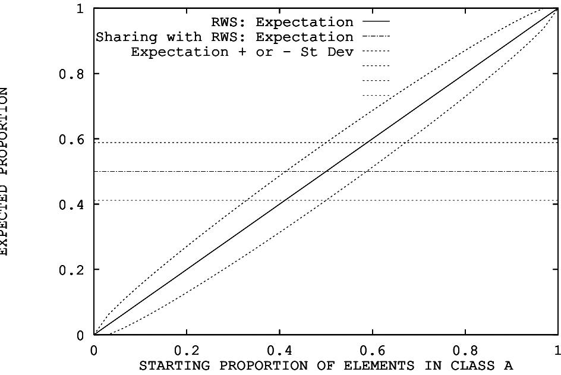  
Figure 8.1: The mean and standard deviation of the expected proportion of elements in a class after a generation, are given for RWS alone, and sharing with RWS. Model parameters are $c = 2$ and $f _ { B } = f _ { A }$ . The curves are calculated from Equations 8.2, 8.3, 8.5, and 8.6.

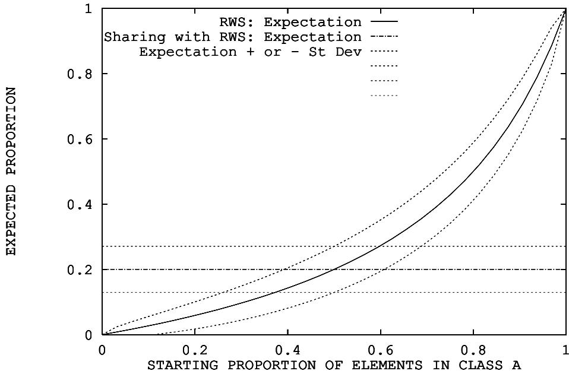  
Figure 8.2: The mean and standard deviation of the expected proportion of elements in a class after a generation, are given for RWS alone, and sharing with RWS. Model parameters are $c = 2$ and $f _ { B } = 4 f _ { A }$ . The curves are calculated from Equations 8.2, 8.3, 8.5, and 8.6.

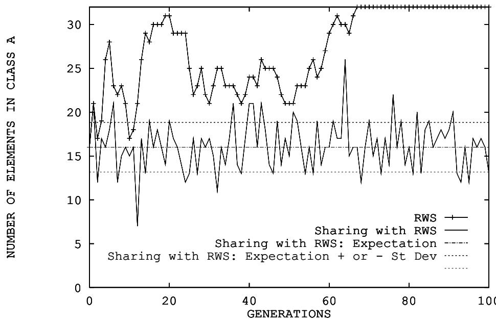  
Figure 8.3: Sample runs of RWS, and sharing with RWS, are compared to the expectation and standard deviation for sharing with RWS, computed from Equations 8.5 and 8.6. Parameters are $n = 3 2$ $c = 2$ $f _ { B } = f _ { A }$ $p _ { c } = p _ { m } = 0$ , and $\sigma _ { s h a r e } = 0 . 5$

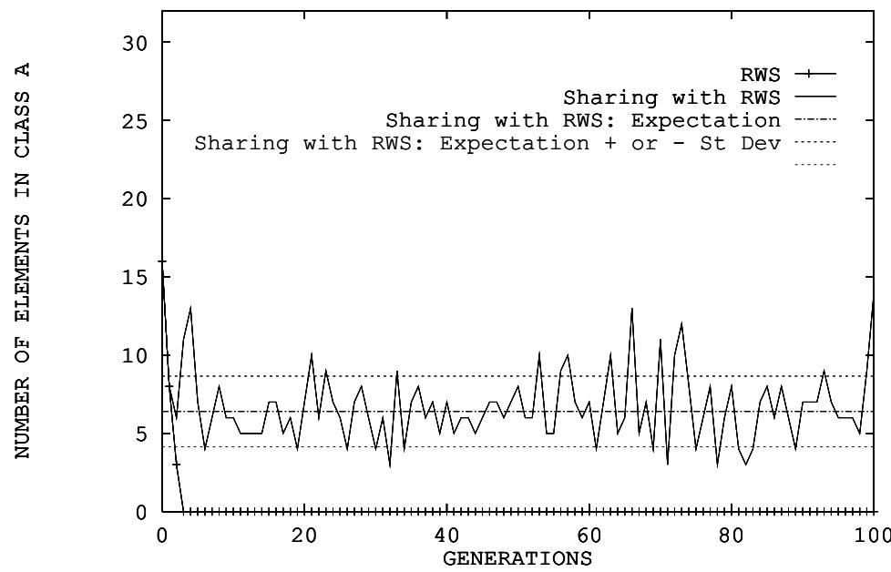  
Figure 8.4: Sample runs of RWS, and sharing with RWS, are compared to the expectation and standard deviation for sharing with RWS, computed from Equations 8.5 and 8.6. Parameters are $n = 3 2$ $c = 2$ $f _ { B } = 4 f _ { A }$ $p _ { c } = p _ { m } = 0$ , and $\sigma _ { s h a r e } = 0 . 5$

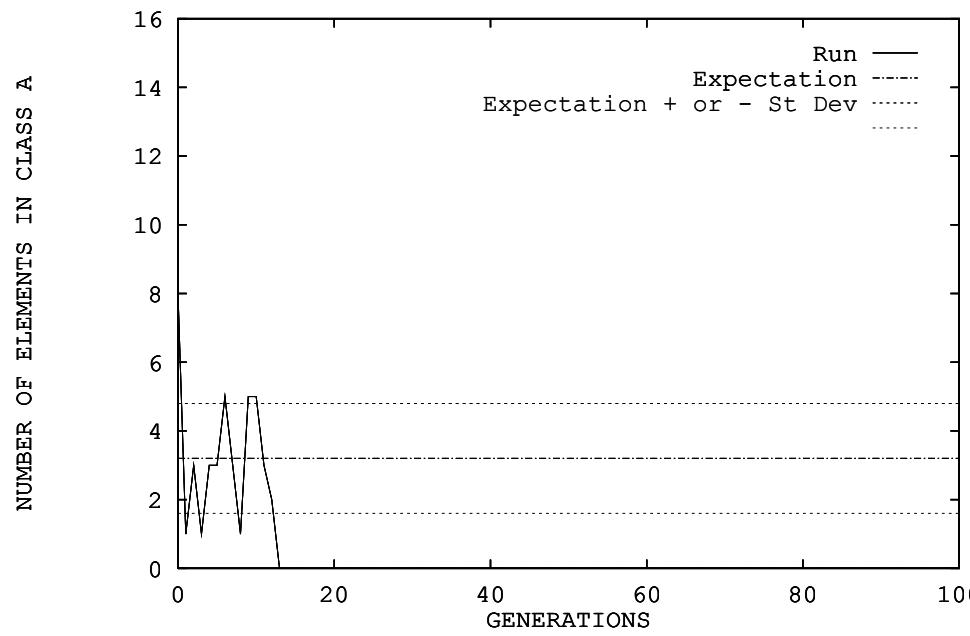  
the fatal 
uctuation in Generation 12. A ain, p = p = 0 and  = :5. This proves the deviation for sharing with RWS, computed from Equations 8.5 and 8.6. Parameters are $n = 1 6$ $c = 2$ r $f _ { B } = 4 f _ { A }$ e $p _ { c } = p _ { m } = 0$ eb's c $\sigma _ { s h a r e } = 0 . 5$ h

Figure 8.5 verifies our suspicion. On the one-bit, two-class problem $f _ { B } = 4 f _ { A } = 4$ , when population size is cut in half to $n = 1 6$ , Class $A$ 's expected niche size also drops by half, down to 3.2. Sharing with RWS allows the stronger Class $B$ to take over the entire population after the fatal fluctuation in Generation 12. (Again, $p _ { c } = p _ { m } = 0$ and $\sigma _ { s h a r e } = . 5$ .) This proves the We have set the groundwork for computing the expected time to extinction of one of the c classes. To compute this drift time, we must rst bound the probability of extinction occurring in a single generation. From this bound, since successive generations are independent in

# 8.2 Genetic Drift

We have set the groundwork for computing the expected time to extinction of one of the $c$ classes. To compute this drift time, we must first bound the probability of extinction occurring in a single generation. From this bound, since successive generations are independent in our sharing model, the calculation of expected extinction time is straightforward.

# Loss probabilities

Equation 8.4 gives the probability $P _ { s } ( i )$ of selecting some element of an arbitrary class $i$ in X X 1  P i n : 0 < X < 1 8:10 probability of selecting some element outside Class $i$ is $1 - P _ { s } ( i )$ . After a full generation, the The probability of maintaining all classes $i$ or a generation is 1  X. $n$ elements The above exp $i$ s $( 1 - P _ { s } ( i ) ) ^ { n }$ equality because $c$ e probabilities of intersection of loss events are not subtrac $X$ d o (e.g., for a three-class problem, the probability of los

$$
X \ \leq \ \sum _ { i = 0 } ^ { c - 1 } ( 1 - P _ { s } ( i ) ) ^ { n } . \ 0 < X < 1 )
$$

The probability of maintaining all classes for a generation is $1 - X$

The above expression is an inequality because the probabilities of intersection of loss events are not subtracted off (e.g., for a three-class problem, the probability of losing both Class 1 and Class 2 would be included twice in the above summation). When the distribution of class selection probabilities does not stray too far from uniform, and when $n \gg c$ , intersection terms 3n1 3n1 3 n1 ( ) Thi $c = 3$ ers in onl an ex onentiall decreasin increment from the bound derived from .1 : off intersections:

$$
X ~ = ~ 3 ( 1 - { \frac { 1 } { 3 } } ) ^ { n } - 3 ( { \frac { 1 } { 3 } } ) ^ { n } ~ .
$$

Simplification yields

$$
X ~ = ~ { \frac { 2 ^ { n } - 1 } { 3 ^ { n - 1 } } } ~ = ~ { \frac { 2 ^ { n } } { 3 ^ { n - 1 } } } - { \frac { 1 } { 3 ^ { n - 1 } } } ~ .
$$

In realistic optimization problems, we will not be interested in locating peaks that are of

$$
X ~ \leq ~ { \frac { 2 ^ { n } } { 3 ^ { n - 1 } } } .
$$

In fact, for $n \ = \ 3 2$ , the bound is indistinguishable from the exact quantity up to the 15th decimal place.

In realistic optimization problems, we will not be interested in locating peaks that are of low fitness; hence we will have near uniformity. (Extraneous, lower-fitness peaks, including deceptive peaks, will be modelled later, separate from the c desired classes.) In addition,

maintaining $c$ peaks typically requires $n$ to be some multiple of $c$ ; hence $n \gg c$ . We can tell if Note that the right-hand side of the above expression has two useful forms: 1.0, leading to a useless probability bound.

( c ) cn1 $( \forall _ { i } \ P _ { s } ( i ) = 1 / c$ ), we obtain

$$
X ~ \leq ~ c ( 1 - \frac { 1 } { c } ) ^ { n } .
$$

dition n  c. How much greater than c must n be? Starting with the inequ

$$
c ( 1 - \frac { 1 } { c } ) ^ { n } ~ = ~ \frac { ( c - 1 ) ^ { n } } { c ^ { n - 1 } } ~ .
$$

with a little manipulation we obtain $X$ . Since all classes are of identical fitness, the near-uniformity condition is satisfied. That leaves the condition $n \gg c$ . How much greater than $c$ must n be? Starting with the inequality,

$$
c ( 1 - \frac { 1 } { c } ) ^ { n } < 1 ,
$$

with a little manipulation we obtain

$$
n ~ \ln ( 1 - { \frac { 1 } { c } } ) ~ < ~ - \ln c ~ .
$$

For the special case of two classes (c = 2), A and B, the calculation of X is exact,

$$
n \ > \ c \ \ln c .
$$

Therefore, (8.14) gives a useful bound for $X$ for values of $n$ greater than $c \ln c$ , with increasing where r = fA=fB $n$ , relative to $c \ln c$

For the special case of two classes $c = 2$ ), $A$ and $B$ , the calculation of $X$ is exact, since it is not possible to lose both classes:

$$
X \ = \ { \frac { r ^ { n } + 1 } { ( r + 1 ) ^ { n } } } ,
$$

where $r = f _ { A } / f _ { B }$

# Loss distribution

Each generation, at least one class disappears from the population with probability $X$ . This probability of disappearance remains constant from generation to generation, until a loss actually occurs. Therefore, the loss of one or more classes can be treated as a binomial event, occurring with probability of "success" $X$ , with the stipulation that once a success occurs, $X$ is no longer valid. Since we are not interested in repeated successes, but only in strings of failures followed by a success, this limitation will have no effect.

We now examine the time required to lose at least one class. Recall our prior assumption that all classes are initially represented in the population. This assumption tells us that the P(L = g) = (1  X)g1X ; (1  g < 1) (8:20) of losing one or more classes after exactly one generation is $X$ ; after exactly two generations, $( 1 - X ) X$ L = g) denotes $g$ he probabilit $( 1 - X ) ^ { g - 1 } X$ neration at which a loss occurs is g. $g \mathrm { ~ - ~ } 1$ ure 8.6 shows the loss distribution for two classes of equal tness under a populat $L$ n of size n = 8. Note that the loss distribution is a geometric distribution (Freund

$$
P ( L = g ) = ( 1 - X ) ^ { g - 1 } X , ( 1 \leq g < \infty )
$$

where $P ( L = g )$ denotes the probability that the generation at which a loss occurs is $g$ . Figure 8.6 shows the loss distribution for two classes of equal fitness under a population of size $n = 8$ . Note that the loss distribution is a geometric distribution (Freund $\&$ Walpole, 1980).

ected number of generations to loss is the variance of the geometric (loss) distribution, geometric (loss) distribution,

$$
\mu _ { L } \ = \ { \frac { 1 } { X } } .
$$

The derivation of Equation 8.22 is also presented in the appendix. ability. The derivation of Equation 8.21 is presented in the appendix. The variance in the expected number of generations to loss is the variance of the geometric (loss) distribution,

$$
\sigma _ { L } ^ { 2 } \ = \ { \frac { 1 - X } { X ^ { 2 } } } \ = \ \mu _ { L } ^ { 2 } - \mu _ { L } .
$$

The derivation of Equation 8.22 is also presented in the appendix.

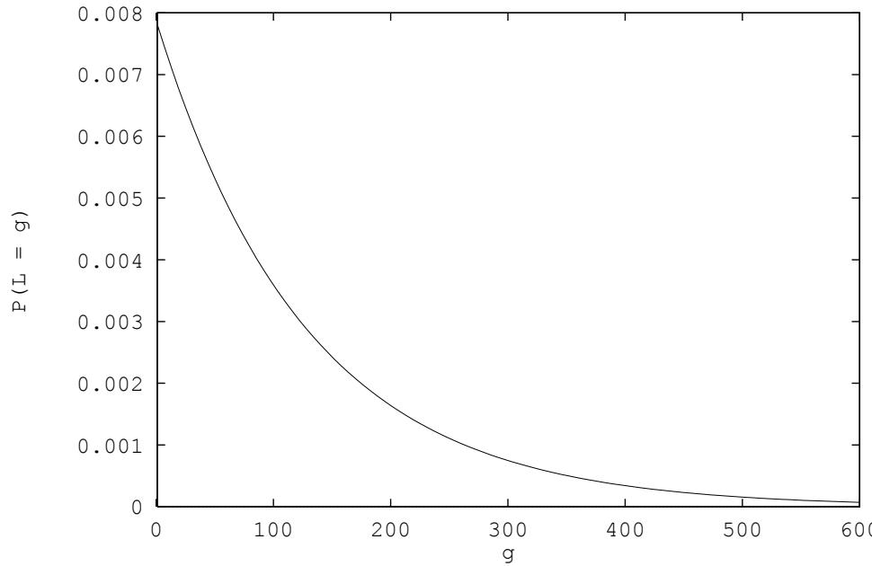  
Figure 8.6: The loss distribution of Equation 8.20 is shown for $c = 2$ $n = 8$ , and $f _ { B } = f _ { A }$

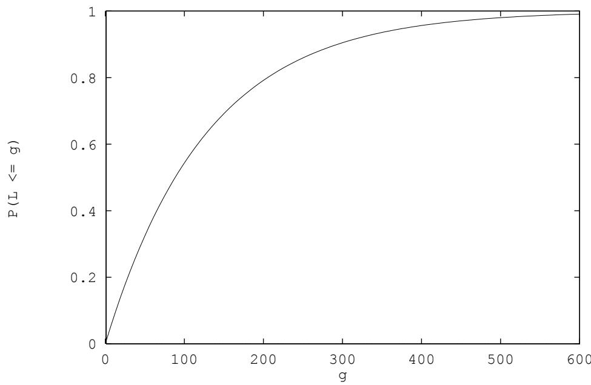  
Figure 8.7: The cumulative loss distribution of Equation 8.24 is shown for $c = 2$ $n = 8$ , and $f _ { B } = f _ { A }$

is independent of i, and 0 < X < 1. This cumulativ $1$ loss $g$ distribution is shown in $P ( L \leq g )$ 7 for the case of c = 2, n = 8, $g$ nd fB = fA. Using the formula for the partial sum of a $c$ ometric series (Equation A.5 of the appendix)

$$
P ( L \leq g ) = \sum _ { i = 1 } ^ { g } ( 1 - X ) ^ { i - 1 } X = X \sum _ { i = 0 } ^ { g - 1 } ( 1 - X ) ^ { i } .
$$

$X$ hus the probability $i$ of $0 < X < 1$ all c classes for at least g generations is given by for the case of $c = 2$ $n = 8$ , and $f _ { B } = f _ { A }$ . Using the formula for the partial sum of a geometric series (Equation A.5 of the appendix) yields

$$
P ( L \leq g ) = X { \frac { 1 - ( 1 - X ) ^ { g } } { 1 - ( 1 - X ) } } = 1 - ( 1 - X ) ^ { g } .
$$

Thus the probability $\gamma$ of maintaining all $c$ = 1  
 g : $g$ generations is given by

$$
\gamma \ = \ 1 - P ( L \leq g ) \ = \ ( 1 - X ) ^ { g } .
$$

Taking the $g$ th root of both sides allows us to solve for $X$ , resulting in a generally applicable equation for sharing:

$$
X \ = \ 1 - \gamma ^ { \frac { 1 } { g } } .
$$

# Drift time

Figure 8.8 shows, for $c = 2$ , two fitness ratios, and various population sizes, the expectation Even for very small n, L  L  :5. The fact that one standard deviation in the downward direction takes us close to zero does not mean that typical runs, regardless of population size, will lo $\mu _ { L } - \sigma _ { L }$ s immediately: the standard dev

$$
\operatorname * { l i m } _ { n  \infty } \sqrt { \mu _ { L } ^ { 2 } - \mu _ { L } } \ = \ \mu _ { L } - . 5 .
$$

Even for very small $n$ $\sigma _ { L } \approx \mu _ { L } - . 5$ . The fact that one standard deviation in the downward direction takes us close to zero does not mean that typical runs, regardless of population size, will lose a class immediately: the standard deviation does not tell us everything about the loss distribution. Because of infinite potential upward deviation in the expected number of generations to loss, and limited potential downward deviation, we can decrease the probability of a run losing a class to as close to zero as we desire. This is accomplished by raising $n$ , and will be detailed in the upcoming section on population sizing.

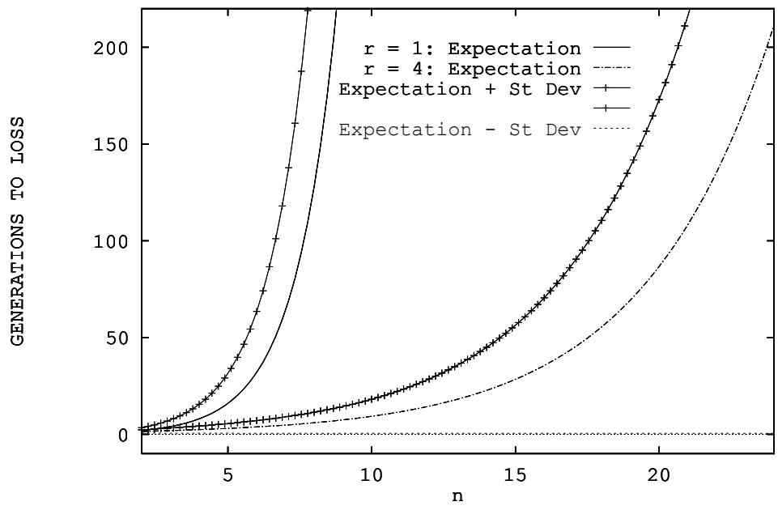  
Figure 8.8: $\mu _ { L } \pm \sigma _ { L }$ , calculated from (8.21) and (8.22) is shown for increasing $n$ , with $c = 2$ num $r = f _ { A } / f _ { B }$ e

 L =   : (8:28) number of generations to loss of at least one class, as a function of $c$ and $n$ . The bound is obtained by substituting the right-hand side of (8.14) into Equation 8.21. It shows that drift For the special case of c = 2, we can com $n$ are our drift-time expression with Horn's (1993) $c$ raph, drawn using a Markov chain m $c$ del of sharing. Horn graphs the expected numb

$$
\mu _ { L } \ = \ { \frac { 1 } { X } } \ \approx \ { \frac { 1 } { c ( 1 - { \frac { 1 } { c } } ) ^ { n } } } \ \approx \ { \frac { e ^ { n / c } } { c } } .
$$

For the special case of $c = 2$ , we can compare our drift-time expression with Horn's (1993) graph, drawn using a Markov chain model of sharing. Horn graphs the expected number of generations to loss of a class in the one-bit, two-class, "perfect sharing" case. We obtain an expression for this quantity by substituting the right-hand side of (8.19) into (8.21):

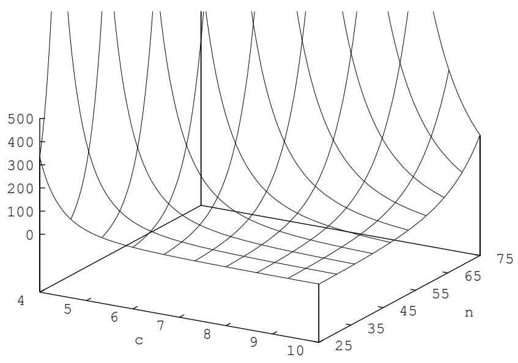  
Figure 8.9: A lower bound on expected drift time, calculated from (8.14) and (8.21), is shown function of n. T $c$ is is $n$ eried by Equation 8.29 as follows. Wit

$$
\mu _ { L } \ = \ { \frac { ( r + 1 ) ^ { n } } { r ^ { n } + 1 } } ,
$$

where $r$ (1 + )n  (r + 1)  2n1 ; $r = 1$ (8:30) tion 8.29 reduces to $\mu _ { L } = 2 ^ { n - 1 }$ . Horn concludes from his graph that drift time is an exponential where  is a $n$ innitesimal positive constant. Expression (8.30) states that growth is exponential, but $0 ~ < ~ r ~ \leq ~ 1$ degree depicted in Horn's graph. This disc $( 1 , 2 ]$ cy in Horn's graph is due to a failure to divide by the de $( r + 1 ) ^ { n }$ variable n (

$$
( 1 + \epsilon ) ^ { n } \ \leq \ { \frac { ( r + 1 ) ^ { n } } { r ^ { n } + 1 } } \ \leq \ 2 ^ { n - 1 } ,
$$

where $\epsilon$ is an infinitesimal positive constant. Expression (8.30) states that growth is exponential, but not to the degree depicted in Horn's graph. This discrepancy in Horn's graph is due to a failure to divide by the dependent variable $n$ (J. Horn, personal communication, June, 1993).

4 8.04 $x$ 8.00 (7.83, 8.25) 7.46 7.48 drift times $\mu _ { L }$ 6 32.47 32.00 (31. $c \ = \ 2$ 33.34) 32.02 31.50 $9 5 \%$ confidence interval for $\mu _ { L }$ 9.18 128.00 12 $x$ .65 132.71 125.66 127.50 $s$ , and the model's standard deviation is $O _ { L }$ 6.23 512.00 (502.05 $p _ { c } ~ = ~ p _ { m } ~ = ~ 0$ 12.43 $\sigma _ { s h a r e } ~ = ~ . 5$ . All drift-time statistics are in generations.

<table><tr><td rowspan=1 colspan=1>n</td><td rowspan=1 colspan=1>x</td><td rowspan=1 colspan=1>μL</td><td rowspan=1 colspan=1>μL: 95%C.I.</td><td rowspan=1 colspan=1>S</td><td rowspan=1 colspan=1>σL</td></tr><tr><td rowspan=1 colspan=6>fB = fA</td></tr><tr><td rowspan=1 colspan=1>2</td><td rowspan=1 colspan=1>2.00</td><td rowspan=1 colspan=1>2.00</td><td rowspan=1 colspan=1>(1.96,    2.04)</td><td rowspan=1 colspan=1>1.42</td><td rowspan=1 colspan=1>1.41</td></tr><tr><td rowspan=1 colspan=1>4</td><td rowspan=1 colspan=1>8.04</td><td rowspan=1 colspan=1>8.00</td><td rowspan=1 colspan=1>(7.83,    8.25)</td><td rowspan=1 colspan=1>7.46</td><td rowspan=1 colspan=1>7.48</td></tr><tr><td rowspan=1 colspan=1>6</td><td rowspan=1 colspan=1>32.47</td><td rowspan=1 colspan=1>32.00</td><td rowspan=1 colspan=1>(31.60,   33.34)</td><td rowspan=1 colspan=1>32.02</td><td rowspan=1 colspan=1>31.50</td></tr><tr><td rowspan=1 colspan=1>8</td><td rowspan=1 colspan=1>129.18</td><td rowspan=1 colspan=1>128.00</td><td rowspan=1 colspan=1>(125.65,  132.71)</td><td rowspan=1 colspan=1>125.66</td><td rowspan=1 colspan=1>127.50</td></tr><tr><td rowspan=1 colspan=1>10</td><td rowspan=1 colspan=1>516.23</td><td rowspan=1 colspan=1>512.00</td><td rowspan=1 colspan=1>(502.05, 530.41)</td><td rowspan=1 colspan=1>512.43</td><td rowspan=1 colspan=1>511.50</td></tr><tr><td rowspan=1 colspan=6>fB = 4fA</td></tr><tr><td rowspan=1 colspan=1>2</td><td rowspan=1 colspan=1>1.46</td><td rowspan=1 colspan=1>1.47</td><td rowspan=1 colspan=1>(1.44,    1.48)</td><td rowspan=1 colspan=1>0.82</td><td rowspan=1 colspan=1>0.83</td></tr><tr><td rowspan=1 colspan=1>4</td><td rowspan=1 colspan=1>2.41</td><td rowspan=1 colspan=1>2.43</td><td rowspan=1 colspan=1>(2.36,    2.46)</td><td rowspan=1 colspan=1>1.82</td><td rowspan=1 colspan=1>1.86</td></tr><tr><td rowspan=1 colspan=1>6</td><td rowspan=1 colspan=1>3.80</td><td rowspan=1 colspan=1>3.81</td><td rowspan=1 colspan=1>(3.71,    3.89)</td><td rowspan=1 colspan=1>3.22</td><td rowspan=1 colspan=1>3.27</td></tr><tr><td rowspan=1 colspan=1>8</td><td rowspan=1 colspan=1>6.03</td><td rowspan=1 colspan=1>5.96</td><td rowspan=1 colspan=1>(5.88,    6.18)</td><td rowspan=1 colspan=1>5.42</td><td rowspan=1 colspan=1>5.44</td></tr><tr><td rowspan=1 colspan=1>10</td><td rowspan=1 colspan=1>9.47</td><td rowspan=1 colspan=1>9.31</td><td rowspan=1 colspan=1>(9.23,    9.71)</td><td rowspan=1 colspan=1>8.85</td><td rowspan=1 colspan=1>8.80</td></tr><tr><td rowspan=1 colspan=1>12</td><td rowspan=1 colspan=1>14.50</td><td rowspan=1 colspan=1>14.55</td><td rowspan=1 colspan=1>(14.11,   14.89)</td><td rowspan=1 colspan=1>14.07</td><td rowspan=1 colspan=1>14.04</td></tr><tr><td rowspan=1 colspan=1>14</td><td rowspan=1 colspan=1>23.01</td><td rowspan=1 colspan=1>22.74</td><td rowspan=1 colspan=1>(22.39,   23.63)</td><td rowspan=1 colspan=1>22.84</td><td rowspan=1 colspan=1>22.23</td></tr><tr><td rowspan=1 colspan=1>16</td><td rowspan=1 colspan=1>35.42</td><td rowspan=1 colspan=1>35.53</td><td rowspan=1 colspan=1>(34.45,   36.39)</td><td rowspan=1 colspan=1>34.58</td><td rowspan=1 colspan=1>35.03</td></tr><tr><td rowspan=1 colspan=1>18</td><td rowspan=1 colspan=1>55.83</td><td rowspan=1 colspan=1>55.51</td><td rowspan=1 colspan=1>(54.31,   57.35)</td><td rowspan=1 colspan=1>55.80</td><td rowspan=1 colspan=1>55.01</td></tr><tr><td rowspan=1 colspan=1>20</td><td rowspan=1 colspan=1>86.17</td><td rowspan=1 colspan=1>86.74</td><td rowspan=1 colspan=1>(83.78,   88.56)</td><td rowspan=1 colspan=1>86.59</td><td rowspan=1 colspan=1>86.24</td></tr><tr><td rowspan=1 colspan=1>22</td><td rowspan=1 colspan=1>134.89</td><td rowspan=1 colspan=1>135.53</td><td rowspan=1 colspan=1>(131.15,  138.63)</td><td rowspan=1 colspan=1>135.86</td><td rowspan=1 colspan=1>135.03</td></tr><tr><td rowspan=1 colspan=1>24</td><td rowspan=1 colspan=1>215.33</td><td rowspan=1 colspan=1>211.76</td><td rowspan=1 colspan=1>(209.47, 221.19)</td><td rowspan=1 colspan=1>217.80</td><td rowspan=1 colspan=1>211.26</td></tr></table>

# Experimental verification

Table 8.1 compares the sharing-with-RWS model to statistics from 5000 runs on the one-bit, two-class functions defined earlier ( $f _ { B } = f _ { A }$ and $f _ { B } = 4 f _ { A }$ ). The table presents $9 5 \%$ confidence n = 1 on the other hand re uires onl . enerations on the avera e. uniform initialization. For both functions, experimental results at various $n$ with $p _ { c } = p _ { m } = 0$ and $\sigma _ { s h a r e } = . 5$ correspond nearly perfectly to derived results.

Compare Table 8.1's expected drift time for $f _ { B } = 4 f _ { A }$ using $n = 1 6$ , with the earlier runs from Figures 8.4 and 8.5. The table explains why the $n = 1 6$ run drifted but the $n = 3 2$ run did not: $n = 3 2$ requires an average of 1262 generations to drift, but we only ran it for 100; $n = 1 6$ , on the other hand, requires only 35.53 generations on the average.

Table 8.2: For fixed $n = 3 2$ $c$ 5.10 4.82 $f _ { i }$ 5.49% 4.61 $\hat { \mu } _ { L }$ (computed 8 9.19 8.97 2.39% 9.04 $\bar { x }$ 7 19. 75 $p _ { c } = p _ { m } = 0$ $\sigma _ { s h a r e } = . 5$ 8 .96 6 57.93 $s$ 6.

<table><tr><td rowspan=1 colspan=1>c</td><td rowspan=1 colspan=1>x</td><td rowspan=1 colspan=1>µL</td><td rowspan=1 colspan=1>% Error</td><td rowspan=1 colspan=1>s</td></tr><tr><td rowspan=1 colspan=1>12</td><td rowspan=1 colspan=1>1.74</td><td rowspan=1 colspan=1>1.35</td><td rowspan=1 colspan=1>22.41%</td><td rowspan=1 colspan=1>1.15</td></tr><tr><td rowspan=1 colspan=1>11</td><td rowspan=1 colspan=1>2.28</td><td rowspan=1 colspan=1>1.92</td><td rowspan=1 colspan=1>15.79%</td><td rowspan=1 colspan=1>1.68</td></tr><tr><td rowspan=1 colspan=1>10</td><td rowspan=1 colspan=1>3.27</td><td rowspan=1 colspan=1>2.91</td><td rowspan=1 colspan=1>11.01%</td><td rowspan=1 colspan=1>2.70</td></tr><tr><td rowspan=1 colspan=1>9</td><td rowspan=1 colspan=1>5.10</td><td rowspan=1 colspan=1>4.82</td><td rowspan=1 colspan=1>5.49%</td><td rowspan=1 colspan=1>4.61</td></tr><tr><td rowspan=1 colspan=1>8</td><td rowspan=1 colspan=1>9.19</td><td rowspan=1 colspan=1>8.97</td><td rowspan=1 colspan=1>2.39%</td><td rowspan=1 colspan=1>9.04</td></tr><tr><td rowspan=1 colspan=1>7</td><td rowspan=1 colspan=1>19.75</td><td rowspan=1 colspan=1>19.82</td><td rowspan=1 colspan=1>0.35%</td><td rowspan=1 colspan=1>18.96</td></tr><tr><td rowspan=1 colspan=1>6</td><td rowspan=1 colspan=1>57.93</td><td rowspan=1 colspan=1>56.97</td><td rowspan=1 colspan=1>1.66%</td><td rowspan=1 colspan=1>58.97</td></tr><tr><td rowspan=1 colspan=1>5</td><td rowspan=1 colspan=1>256.94</td><td rowspan=1 colspan=1>252.44</td><td rowspan=1 colspan=1>1.75%</td><td rowspan=1 colspan=1>252.90</td></tr></table>

The final simulations of this section test bounds (8.14) and (8.18). We fix $n$ at 32 and vary $c$ , employing starting distributions as close to uniform as possible. (Sometimes $n$ is not evenly c = 1 and $c$ = 2 into the ri ht hand side o $\forall _ { i , j } f _ { i } = f _ { j } )$ btain X 1: an ille all hi h employs a five-bit encoding in which each possible string is a class. However, only $c$ of the 32 possible classes are placed into the initial population. Since crossover and mutation are turned off $p _ { c } = p _ { m } = 0$ ), only those $c$ classes will be present in subsequent populations. Using (8.18) to calculate at which $c$ our bound (8.14) becomes useless, $1 3 \ln 1 3 \ = \ 3 3 . 3 4 \ > \ n$ , but $\ 1 2 \ln 1 2 \ = \ 2 9 . 8 2 \ < \ n$ : the maximum useful $c$ for $n \ = \ 3 2$ is 12. To verify, if we substitute $c = 1 3$ and $n = 3 2$ into the right hand side of (8.14), we obtain $X ~ \leq 1 . 0 0 3 6$ , an illegally high probability. Substituting $c = 1 2$ and $n = 3 2$ , on the other hand, yields $X \le . 7 4 1 2$ . We perform 5000 runs at each $c$ and employ $\sigma _ { s h a r e } = . 5$ in the GA. Results are shown in Table 8.2.

As $c$ decreases relative to $n$ , accuracy of the computed bound increases. Note that even for the maximal $c = 1 2$ , the bound is only off by approximately $2 2 . 4 1 \%$ . To solve real problems, we will be using a $c$ to $n$ ratio higher than that for even the $c = 5$ case in Table 8.2, which has only $1 . 7 5 \%$ error. Note that the computed sample mean contains slight sampling error which, as $c$ decreases (to 7 or less), begins to overshadow the bounding error. We do not give drift times for $2 \leq c \leq 4$ because of prohibitive time requirements for 5000 runs. For $c = 2$ as noted earlier, the expected drift time calculated from Equation 8.29 would be exact. For $c = 3$ , the calculated drift time would be nearly exact, indistinguishable from the exact value sucient to protect the desired niches. Hence population sizing is a central issue in tness sharing and, more generally, in the study of ni $c = 4$ methods and traditional GAs. In fact, in

# genetic drift results to derive bounds on minimum required popula

The most effective method of combating genetic drift is to raise the population size to a level sufficient to protect the desired niches. Hence population sizing is a central issue in fitness tness. The next two models allow niches to dier with res ect to tness. The models of most GAs, population size is the single, most critical parameter. This section uses the prior genetic drift results to derive bounds on minimum required population sizes for sharing, under the assumption that all classes are desirable. Specifically, this section derives, for three related disru tions. To verif the redictive value of these models we run GAs with sharin RW $\gamma$ a fixed number of niches. The first model assumes all niches are equivalent with respect to fitness. The next two models allow niches to differ with respect to fitness. The models of this chapter do not consider the effects of crossover. These models still have predictive value for GAs with sharing and crossover (and mutation), however, on problems in which crossover and mutation are minimally disruptive. (Sharing's restorative pressure compensates for minor disruptions.) To verify the predictive value of these models, we run GAs with sharing, RWS, and even crossover and mutation, on seven test problems in optimization and classification, using population sizes derived from the models.

A sufficiently large population will ensure that the GA with sharing maintains, with conFrom ( $\gamma$ 31), $c$ e can obtain bounds on n, for c classes of identical $g$ ess, and for c classes of arbitrary tness. It is important to keep in mind that n in the above equation represents the minimum population size required to maintain c classes for at least g generations

$$
1 - \gamma ^ { \frac { 1 } { g } } \ \leq \ \sum _ { i = 0 } ^ { c - 1 } ( 1 - P _ { s } ( i ) ) ^ { n } .
$$

From (8.31), we can obtain bounds on $n$ 17 $c$ classes of identical fitness, and for $c$ classes of arbitrary fitness. It is important to keep in mind that $n$ in the above equation represents the minimum population size required to maintain $c$ classes for at least $g$ generations with probability of at least $\gamma$ . If we call the actual population size that the GA employs $n ^ { \prime }$ , then any $n ^ { \prime } \geq n$ n  popul $c$ tion-size bound  $g$ : (8:32) at least $\gamma$ . We call $n$ the minimum required population size and $n ^ { \prime }$ the actual population size.

asses of identical tness $n$ except in the $c = 2$ case. However, we will be able to derive upper bounds on $n$ that also serve as lower bounds on $n ^ { \prime }$ . The relationship among $n , n ^ { \prime }$ , and the derived population-size bound is

$$
\begin{array} { r } { n ~ \le ~ p o p u l a t i o n { - s i z e } ~ b o u n d ~ \le ~ n ^ { \prime } ~ . } \end{array}
$$

# Classes of identical fitness

as f $c$ llows. Inequality (8.10) tells us that th $i$ $P _ { s } ( i ) = 1 / c$ per generation the GA performs $1 / c$ e hi $P _ { s } ( i )$ he actual o ulation size $n$ the sm

$$
n ~ \leq ~ { \frac { \ln \frac { 1 - \gamma ^ { \frac { 1 } { g } } } { c } } { \ln { \frac { c - 1 } { c } } } } ~ \leq ~ n ^ { \prime } ~ .
$$

The middle term of the above expression is our desired population-size bound. We verify this as follows. Inequality (8.10) tells us that the more trials per generation the GA performs (the higher the actual population size), the smaller the probability $X$ that one or more classes ln 1
 g 2 0 1  
 g 13 $X$ is, the higher the probability $\gamma$ that all $c$ ln c 4 @ c A $g$ generations. Therefore, a larger This simplication is useful fo $\gamma$ all but the sm $n ^ { \prime } \geq n$ c. Either bound in (8.34) can also serve as a populat $\gamma , c$ izing tool for c classes of nearly unifor $g$ tness. In p

e we empl $c$ y will be one of the bounds in (8.34), rounded up to the nearest even integer. as follows:

$$
\frac { \ln \frac { 1 - \gamma ^ { \frac { 1 } { g } } } { c } } { \ln \frac { c - 1 } { c } } \approx c \left[ - \ln \left( \frac { 1 - \gamma ^ { \frac { 1 } { g } } } { c } \right) \right] .
$$

This simplification is useful for all but the smallest $c$ . Either bound in (8.34) can also serve as a population sizing tool for $c$ classes of nearly uniform fitness. In practice, the actual population size we employ will be one of the bounds in (8.34), rounded up to the nearest even integer.

For two classes of equal fitness, we can derive an exact expression for required population size, that corresponds to the bound in (8.33) with $c = 2$

$$
n ~ = ~ 1 - \frac { \ln ( 1 - \gamma ^ { \frac { 1 } { g } } ) } { \ln 2 } ~ \approx ~ 1 - 1 . 4 4 2 7 \ln ( 1 - \gamma ^ { \frac { 1 } { g } } ) ~ .
$$

# Classes of arbitrary fitness: Derivation I

In the general case, inequality (8.31) can not be solved symbolically for $n$ . However, one can This method for modelli $n ^ { \prime }$ class tnesses allows o ulation sizin in the resence of sketc $\gamma$ to maintain $c$ classes for at least $g$ generations. The representative fitness $f _ { m i n }$ of the least fit peak is at least some percentage, specified by $r$ , of the representative fitness $f _ { m a x }$ of the globally optimal peak. The user need only specify this minimum-to-maximum fitness ratio of the desired peaks, $r = f _ { m i n } / f _ { m a x }$ $0 ~ < ~ r ~ \leq ~ 1$ i = fi = $r ~ = ~ . 8$ max 8:36 $c$ peaks, where the fitnesses of all peaks are at least $8 0 \%$ 0 fmax This method for modelling class fitnesses allows population sizing in the presence of sketchy 8i Ps(i)  Pc1 fmax ; (8:37) required population size proceeds as follows:

$$
\forall _ { i } ~ P _ { s } ( i ) ~ = ~ { \frac { f _ { i } } { \sum _ { j = 0 } ^ { c - 1 } f _ { j } } } ~ = ~ { \frac { \frac { f _ { i } } { f _ { m a x } } } { \sum _ { j = 0 } ^ { c - 1 } { \frac { f _ { j } } { f _ { m a x } } } } } ~ ;
$$

$$
\forall _ { i } P _ { s } ( i ) \ \geq \ { \frac { \frac { f _ { m i n } } { f _ { m a x } } } { \sum _ { j = 0 } ^ { c - 1 } { \frac { f _ { m a x } } { f _ { m a x } } } } } ;
$$

$$
\forall _ { i } P _ { s } ( i ) \geq \frac { r } { c } ;
$$

$$
\sum _ { i = 0 } ^ { c - 1 } ( 1 - P _ { s } ( i ) ) ^ { n } \ \leq \ \sum _ { i = 0 } ^ { c - 1 } ( 1 - { \frac { r } { c } } ) ^ { n } ;
$$

$$
\sum _ { i = 0 } ^ { c - 1 } ( 1 - P _ { s } ( i ) ) ^ { n } ~ \leq ~ c ( 1 - \frac { r } { c } ) ^ { n } ~ .
$$

Substituting the left-hand side of (8.31) into inequality (8.40) yields

$$
1 - \gamma ^ { \frac { 1 } { g } } \ \leq \ c ( 1 - { \frac { r } { c } } ) ^ { n } .
$$

Solving for $n$ ln c c 2 $n ^ { \prime }$ 1

$$
n ~ \leq ~ { \frac { \ln \frac { 1 - \gamma ^ { \frac { 1 } { g } } } { c } } { \ln { \frac { c - r } { c } } } } ~ \leq ~ n ^ { \prime } ~ .
$$

For large $c$ , the above bound can be simplified using approximation (A.9) as follows:

$$
\frac { \ln \frac { 1 - \gamma ^ { \frac { 1 } { g } } } { c } } { \ln \frac { c - r } { c } } \approx \frac { c } { r } \left[ - \ln \left( \frac { 1 - \gamma ^ { \frac { 1 } { g } } } { c } \right) \right] .
$$

Note the similarity between the derived population-size bounds in (8.34) and (8.43). In fact, substituting fitness ratio $r = 1$ into (8.43) yields (8.34).

# Classes of arbitrary fitness: Derivation II

X 1  fi n : 8:44 derived from (8.42) motivates the search for a tighter bound. We examine at which $f _ { i }$ the rightWe can prove that the maximum value of (8.44) is a tighter bound as follows. First, note that for all fi and fj in [fmin ; fmax ], $f _ { m i n }$ and $f _ { m a x }$ , under the constraints that for all classes $k \in [ 0 , c - 1 ]$ $f _ { m i n } \leq f _ { k } \leq f _ { m a x }$

$$
\sum _ { i = 0 } ^ { c - 1 } ( 1 - { \frac { f _ { i } } { \sum _ { j = 0 } ^ { c - 1 } f _ { j } } } ) ^ { n } ~ .
$$

We can prove that the maximum value of (8.44) is a tighter bound as follows. First, note that for all $f _ { i }$ and $f _ { j }$ in $[ f _ { m i n } , f _ { m a x } ]$ 0

$$
X ~ \leq ~ \sum _ { i = 0 } ^ { c - 1 } ( 1 - { \frac { \frac { f _ { i } } { f _ { m a x } } } { \sum _ { j = 0 } ^ { c - 1 } { \frac { f _ { j } } { f _ { m a x } } } } } ) ^ { n } ~ \leq ~ ( 1 - { \frac { \frac { f _ { m i n } } { f _ { m a x } } } { \sum _ { j = 0 } ^ { c - 1 } { \frac { f _ { m a x } } { f _ { m a x } } } } } ) ^ { n } ~ .
$$

Therefore,

$$
X ~ \leq ~ \sum _ { i = 0 } ^ { c - 1 } ( 1 - \frac { f _ { i } } { \sum _ { j = 0 } ^ { c - 1 } f _ { j } } ) ^ { n } ~ \leq ~ c ( 1 - \frac { r } { c } ) ^ { n } ~ ,
$$

proving that (8.44) is at least as close to $X$ as the right-hand side of (8.41). It follows that (8.44) will also yield a tighter bound on $n$

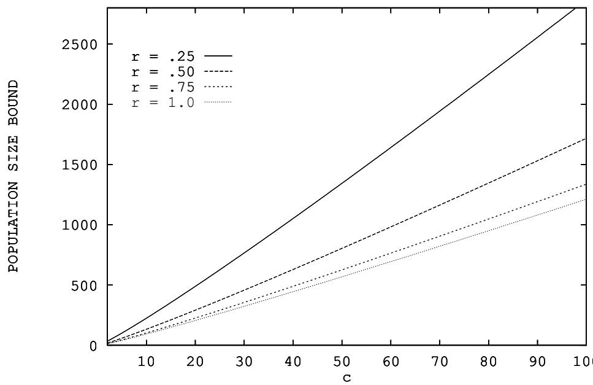  
1g c  2r n 2 n  $c$ , at various $r$ for $\gamma = . 9 5$ and $g = 1 0 0$

ile one ca $c$ not solve symbolically for n, one can easily obtain numeric solutions given 
, g, c, a $f _ { i }$ d r, via $f _ { m a x }$ ton's method. $f _ { m i n }$ ton's method is summarized in th $n$ appendix.) As in De $n ^ { \prime }$ ation I, given c classes of identica

$$
1 - \gamma ^ { \frac 1 9 } \ \leq \ \frac { c } { 2 } \left[ ( 1 - \frac { 2 r } { c ( r + 1 ) } ) ^ { n } + ( 1 - \frac { 2 } { c ( r + 1 ) } ) ^ { n } \right] .
$$

from the ri ht-hand side of 8.43 as follo $n$ , one can easily obtain numeric solutions given $\gamma$ $g , c$ , and $r$ , via Newton's method. (Newton's method is summarized in the appendix.) As in Derivation I, given $c$ 1  
 g c h $r = 1$ ), (8.47) reduces to (8.33).

Figures 8.10-8.12 show the lower bound for $n ^ { \prime }$ as a function of $c , r$ , and $\gamma$ , respectively, with other parameters fixed. Note in Figure 8.10 that with $r , \gamma$ , and $g$ fixed, the bound for $n ^ { \prime }$ is a slightly superlinear function of $c$ . We can derive the form of this relationship between $n ^ { \prime }$ and $c$ from the right-hand side of (8.43) as follows:

$$
\frac { c } { r } \left[ - \ln \left( \frac { 1 - \gamma ^ { \frac { 1 } { g } } } { c } \right) \right] \ = \ \frac { c } { r } \left[ - \ln ( 1 - \gamma ^ { \frac { 1 } { g } } ) + \ln c \right] \ = \ k _ { 1 } c [ k _ { 2 } + \ln c ] ,
$$

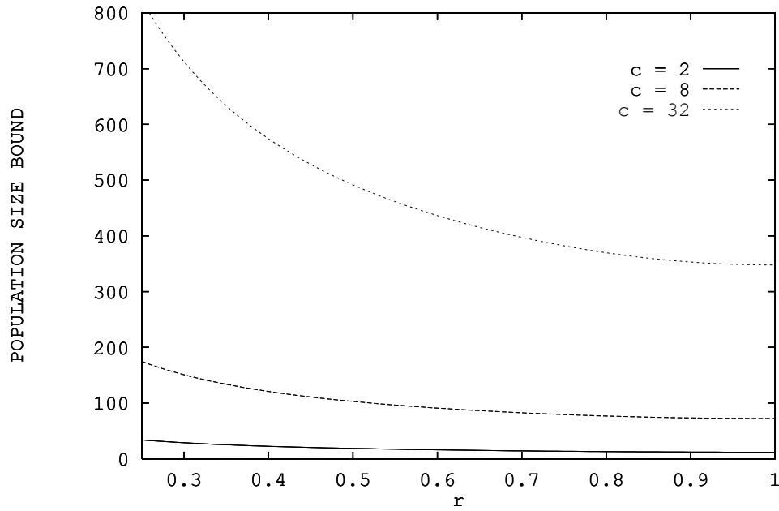  
Figure 8.11: The population-size bound from (8.47) is shown as a function of $r$ , at various $c$ for $\gamma = . 9 5$ and $g = 1 0 0$

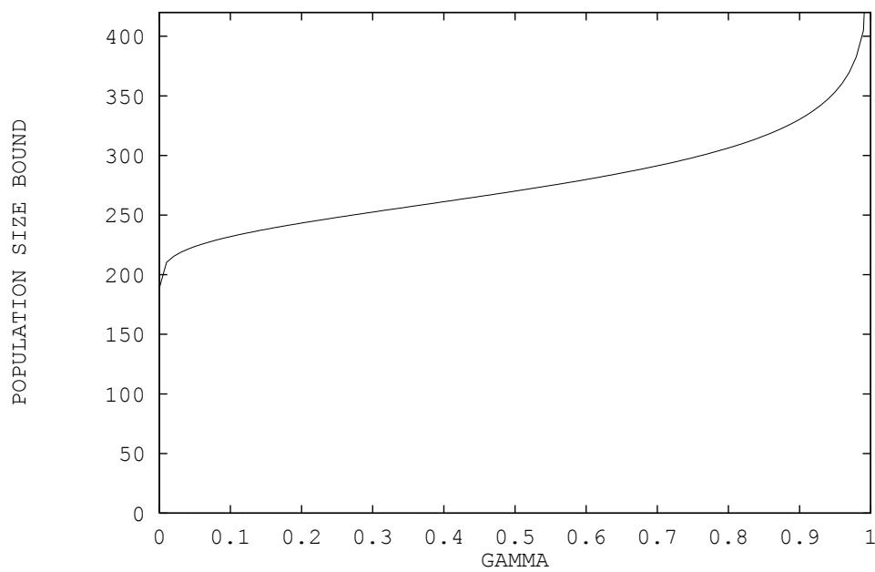  
Figure 8.12: The population-size bound from (8.47) is shown as a function of $\gamma$ , for $c = 3 2$ $r = 1$ , and $g = 1 0 0$

M2 90% 95% 5 $\gamma$ 94 100 0.9 .01 $c$ M6 95% 100% 25 266 100 1.0 .00 PAR-5 95% 99% 16 166 100 1.0 .00 $n ^ { \prime }$ comes PAR-10 95% 100% 5 $g = 1 0 0$ 4

<table><tr><td rowspan=1 colspan=1>Problem</td><td rowspan=1 colspan=1>γ</td><td rowspan=1 colspan=1>Experimental %</td><td rowspan=1 colspan=1>c</td><td rowspan=1 colspan=1>n′</td><td rowspan=1 colspan=1>Runs</td><td rowspan=1 colspan=1>pc</td><td rowspan=1 colspan=1>pm</td></tr><tr><td rowspan=1 colspan=1>C-2</td><td rowspan=1 colspan=1>95%</td><td rowspan=1 colspan=1>95%</td><td rowspan=1 colspan=1>2</td><td rowspan=1 colspan=1>12</td><td rowspan=1 colspan=1>5000</td><td rowspan=1 colspan=1>0.0</td><td rowspan=1 colspan=1>.00</td></tr><tr><td rowspan=1 colspan=1>C-32</td><td rowspan=1 colspan=1>75%</td><td rowspan=1 colspan=1>91%</td><td rowspan=1 colspan=1>32</td><td rowspan=1 colspan=1>300</td><td rowspan=1 colspan=1>100</td><td rowspan=1 colspan=1>0.0</td><td rowspan=1 colspan=1>.00</td></tr><tr><td rowspan=1 colspan=1>M1</td><td rowspan=1 colspan=1>90%</td><td rowspan=1 colspan=1>95%</td><td rowspan=1 colspan=1>5</td><td rowspan=1 colspan=1>44</td><td rowspan=1 colspan=1>100</td><td rowspan=1 colspan=1>0.9</td><td rowspan=1 colspan=1>.01</td></tr><tr><td rowspan=1 colspan=1>M2</td><td rowspan=1 colspan=1>90%</td><td rowspan=1 colspan=1>95%</td><td rowspan=1 colspan=1>5</td><td rowspan=1 colspan=1>94</td><td rowspan=1 colspan=1>100</td><td rowspan=1 colspan=1>0.9</td><td rowspan=1 colspan=1>.01</td></tr><tr><td rowspan=1 colspan=1>M6</td><td rowspan=1 colspan=1>95%</td><td rowspan=1 colspan=1>100%</td><td rowspan=1 colspan=1>25</td><td rowspan=1 colspan=1>266</td><td rowspan=1 colspan=1>100</td><td rowspan=1 colspan=1>1.0</td><td rowspan=1 colspan=1>.00</td></tr><tr><td rowspan=1 colspan=1>PAR-5</td><td rowspan=1 colspan=1>95%</td><td rowspan=1 colspan=1>99%</td><td rowspan=1 colspan=1>16</td><td rowspan=1 colspan=1>166</td><td rowspan=1 colspan=1>100</td><td rowspan=1 colspan=1>1.0</td><td rowspan=1 colspan=1>.00</td></tr><tr><td rowspan=1 colspan=1>PAR-10</td><td rowspan=1 colspan=1>95%</td><td rowspan=1 colspan=1>100%</td><td rowspan=1 colspan=1>512</td><td rowspan=1 colspan=1>7074</td><td rowspan=1 colspan=1>15</td><td rowspan=1 colspan=1>1.0</td><td rowspan=1 colspan=1>.00</td></tr></table>

where $k _ { 1 } = 1 / r$ and $k _ { 2 } = - \ln ( 1 - \gamma ^ { \frac { 1 } { g } } )$  c(k2 +

$$
n ^ { \prime } \ge k _ { 1 } c ( k _ { 2 } + \ln c ) ,
$$

where $k _ { 1 }$ and $k _ { 2 }$ are positive constants $\lvert k _ { 1 } \geq 1$ and $k _ { 2 } > 0$ ). For $r = 1$ , the form reduces to

$$
n ^ { \prime } \ge c ( k _ { 2 } + \ln c ) .
$$

# Experimental verification

in addition to sharin with RWS. The results are summarized in Table 8.3. difficulty. In all seven problems, the goal is to locate all peaks. The following parameters and conditions are enforced in all runs of sharing with RWS. Populations are randomly initialized; GAs run for a fixed number of generations $g = 1 0 0$ ; the sharing constant is $\alpha = 1$ . Population sizes are derived from an appropriate model, indicated in the accompanying text. We perform a number of runs on each test function. Where indicated, we employ crossover and mutation, in addition to sharing with RWS. The results are summarized in Table 8.3.

To begin, we run a GA with sharing and RWS, 5000 times on the one-bit, two-class problem, $f _ { 0 } = f _ { 1 } = 1$ $f _ { i }$ is the representative fitness of Class $\iota$ ). We call this problem $C \cdot { \mathcal { Z } } \ ; \ C . { \mathcal { Z } }$ is the simplest possible two-class problem. We start with this problem to verify the accuracy of the two-class population-sizing equation (8.35), in the absence of extraneous forces. We record the percentage of runs that maintain the two classes for the full 100 generations. Equation 8.35, with $\gamma = . 9 5$ and $g = 1 0 0$ , tells us to use a population size of at least 11.93. We employ $n ^ { \prime } = 1 2$ Recall that the population sizing equation for the two-class case is exact, rather than a bound. 8.34 ields a o ulatio $\sigma _ { s h a r e } ~ = ~ . 5$ d of 298.18. Runnin the GA $p _ { c } ~ = ~ p _ { m } ~ = ~ 0$ n n0 $( 9 5 \%$ ) maintain both classes for the duration of the run. This obviously compares very favorably with the expected $9 5 \%$

Next, we test the multiclass population-sizing formula (8.34) on a five-bit, 32-class problem in which each genotype is a class, and for all classes $i$ $f _ { i } ~ = ~ 1$ . We call this problem $\ C$ -32. This time we try a confidence level of $\gamma = . 7 5$ . Substitution into the large $c$ approximation of (8.34) yields a population-size bound of 298.18. Running the GA 100 times using $n ^ { \prime } = 3 0 0$ $p _ { c } = p _ { m } = 0$ , and $\sigma _ { s h a r e } = . 5$ $9 1 \%$ of the runs maintain all 32 classes to Generation 100.

Note that a significantly larger percentage (than $7 5 \%$ ) of the runs maintain all 32 classes on $\ C$ -32. The reason is that although (8.34) is exact for $c = 2$ , it is a bound for $c > 2$ , and additional confidence is purchased cheaply in terms of population size: from the right-hand side of (8.34), at least $9 0 \%$ confidence requires $n ^ { \prime } = 3 3 2$ $9 5 \%$ $n ^ { \prime } = 3 5 4$ ; and $9 9 \%$ $n ^ { \prime } = 4 0 6$ . This relationship between $\gamma$ and the population-size bound is displayed in Figure 8.12.

The third problem $M \mathit { 1 }$ , shown in Figure 5.2, is a five-peaked sine function, in which all 42. . Deb used a o ulation size of 1 . Des ite the addition of crossove $[ 0 , 1 ]$ mutation parameters similar to Deb's (1989), we run a GA with sharing, $p _ { c } = . 9$ $p _ { m } = . 0 1$ , phenotypic comparison, and $\sigma _ { s h a r e } ~ = ~ . 1 $ , for 100 runs of 100 generations each. We once again employ the res ecied condence level. and the noise introduced by slightly overlapping niches, to be minimal. Substituting $\gamma = . 9$ $g \ = \ 1 0 0$ , and $c = 5$ into the right-hand side of (8.34), we obtain a population-size bound of 42.33. (Deb used a population size of 100.) Despite the addition of crossover and mutation, and the slightly imperfect comparison resulting from slightly overlapping niches, with $n ^ { \prime } = 4 4$ $9 5 \%$ of the runs find all classes and maintain them for 100 generations. This is $5 \%$ better than the prespecified $9 0 \%$ confidence level.

The fourth problem $M \mathcal { Q }$ , displayed in Figure 5.3, is a five-peaked sine function in which peaks are of nonuniform height, but are spaced evenly throughout the interval $\lfloor 0 , 1 \rfloor$ ; the shortest peak is of height .25; the tallest, 1.0. Using the same parameters as we did on $M \mathit { 1 }$ $p _ { c } = . 9$ $p _ { m } = . 0 1$ $\sigma _ { s h a r e } = . 1 $ , phenotypic comparison; $c = 5$ $\gamma = . 9$ $g = 1 0 0$ ), but with $r = . 2 5$ , the populationsizing formula (8.47) yields a recommended population size of 94. (Formula (8.42) yields a recommended population size of 166; Deb used a population size of 100.) For 100 runs under a population of size 94, $9 5 \%$ of the runs find all classes and maintain them for 100 generations. This is once again $5 \%$ better than the prespecified $9 0 \%$ confidence level. Note that for both $M \mathit { 1 }$ and $M \mathcal { Q }$ , we are able to undercut Deb's population size of 100, with at least $9 0 \%$ confidence that our runs will converge. The population sizing formulas we employ explain Deb's success in locating and maintaining the five peaks using a population size of 100.

The fifth problem $M \boldsymbol { \mathit { \theta } }$ , displayed in Figure 5.7, is a two-dimensional problem with 25 peaks, The last two roblems PAR-5 and PAR-10 are classication $p _ { c } ~ = ~ 1$ s $p _ { m } ~ = ~ 0$ e s ecicall comparison, and $\sigma _ { s h a r e } = 1 1$ ; we perform 100 runs. Once again, we expect the disruption due to crossover and the noise due to overlapping niches to be minimal. We employ sizing formula (8.47), with $\gamma = . 9 5$ $g = 1 0 0$ $c = 2 5$ , and $r = . 9 5$ . This gives us a recommended population size of 266. (De Jong (1975) employs a population size of 50, but is searching for only one peak.) All 100 runs find and maintain the 25 peaks, once again surpassing the preset confidence level.

The last two problems, PAR-5 and PAR-10, are classification problems or, more specifically, 5- and 10-bit parity problems. We map these to multimodal optimization problems as described in Chapter 5. The solution to $P A R$ -5 requires the formation and maintenance of 16 disjuncts ( $c ~ = ~ 1 6$ ); the solution to PAR-10 requires the formation and maintenance of 512 disjuncts ( $c = 5 1 2$ ). Since all classes are of equivalent fitness and since we expect operator disruption and other sources of noise to be minimal, we employ the right-hand-side approximation of population-sizing formula (8.34) with $\gamma ~ = ~ . 9 5$ and $g ~ = ~ 1 0 0$ . According to (8.34), PAR-5 requires a population size of at least 166; PAR-10, at least 7074.

blems the number of runs c $p _ { c } = 1$ i $p _ { m } = 0$ n exceeds the reset conden $\sigma _ { s h a r e } = 3 . 5$ . To get the GA to completely converge after application of sharing, a bitclimber (with a neighborhood size of one bit) runs after the GA has completed its 100 generations. Details regarding the bitclimber are in Chapter 10. On PAR-5, 99 out of 100 runs converge to the correct final concept (a population containing the desired 16 disjuncts). On PAR-10, all 15 runs converge to the correct final concept (a population containing the desired 512 disjuncts). On both parity problems, the number of runs converging again exceeds the preset confidence level.

# peaks. Locating the highest peaks is equivalent to the Type 3 optimization problem

In many problems that one encounters, it is costly or impractical to find all peaks. In the worst to locate all maxima we are interested in locatin at least the b hi hest maxima where b c. order of complexity as enumerating the entire search space (Horn & Goldberg, in press). When one does not wish to locate all peaks, one is almost always interested in locating the highest peaks. Locating the highest peaks is equivalent to the Type 3 optimization problem that we described in Chapter 4. This section concentrates upon the solution of this general class of to c  1. We can rewrite E uation 8.4 to se arate $c$ he summation of desirable and undesirable to locate all maxima, we are interested in locating at least the $b$ highest maxima, where $b \leq c$ Assuming no tiebreaking is necessary, we call the $b$ highest maxima desirable peaks and the $c - b$ lowest maxima undesirable or extraneous peaks. (If tiebreaking is necessary, some peaks Since we do not care if any of the extraneous classes d

n (8.10) as a sum $b$ ation over just the desirab $b - 1$ sses. Hen $c - b$ he probability X of one o $b$ mo $c - 1$ sirable classes disappearing after one generation, becomes classes:

$$
P _ { s } ( i ) = { \frac { f _ { i } } { \sum _ { j = 0 } ^ { b - 1 } f _ { j } + \sum _ { j = b } ^ { c - 1 } f _ { j } } } .
$$

e loss distribution and cumulative loss distribution remain the same as previously calculated in Equations 8.20 and 8.24. Therefore, Equation 8.26 also still holds. Substitutin $X$ the righthand side of Equation 8.26 for X in (8.52) yields the following re

$$
X \ \leq \ \sum _ { i = 0 } ^ { b - 1 } ( 1 - P _ { s } ( i ) ) ^ { n } . \ 0 < X < 1 )
$$

From (8.53), we can once again obtain bounds on n. We proceed immediately to the most general case, c classes of arbitrary tness. We relate the minimum population size required to hand side of Equation 8.26 for $X$ in (8.52) yields the following relationship for sharing under RWS:

$$
1 - \gamma ^ { \frac { 1 } { g } } \ \leq \ \sum _ { i = 0 } ^ { b - 1 } ( 1 - P _ { s } ( i ) ) ^ { n } .
$$

From (8.53), we can once again obtain bounds on $n$ . We proceed immediately to the most general case, c classes of arbitrary fitness. We relate the minimum population size required to maintain at least the $b$ best classes for at least $g$ generations with probability of at least $\gamma$ , to $n$ and $n ^ { \prime }$

In order to determine the $f _ { i }$ at which the right-hand side of (8.53) is maximal, we first make a few definitions. As before, let $f _ { m a x }$  fi n : 8:54 $f _ { m i n }$ i=0 j =0 j j =b j $f _ { e x t r a }$ be the fitness of the most The above sum is maximized when the ex ression Pc1 is $f _ { e x t r a } \ \leq \ f _ { m i n } \ \leq \ f _ { m a x }$ rs when for all extraneous classes $r = f _ { m i n } / f _ { m a x }$ Lett $r ^ { \prime } = f _ { e x t r a } / f _ { m a x }$ ber of extra $r ^ { \prime } \leq r$ classes (s = c  b), the maximization of the above sum reduces to the maximization of

$$
\sum _ { i = 0 } ^ { b - 1 } ( 1 - { \frac { f _ { i } } { \sum _ { j = 0 } ^ { b - 1 } f _ { j } + \sum _ { j = b } ^ { c - 1 } f _ { j } } } ) ^ { n } ~ .
$$

Assuming b is an even number, the maximum for ( $\textstyle \sum _ { j = b } ^ { c - 1 } f _ { j }$ curs when half of the fi are at fmax and half are at fmin. $j$ $f _ { j } = f _ { e x t r a }$ half fma $s$ and half fmin yields the following ex $( s = c - b )$ r the max imum:

$$
\sum _ { i = 0 } ^ { b - 1 } ( 1 - { \frac { f _ { i } } { \sum _ { j = 0 } ^ { b - 1 } f _ { j } + s f _ { e x t r a } } } ) ^ { n } .
$$

Simplica $b$ on yields a lower bound on n0, the solution to the inequality, $f _ { i }$ are at $f _ { m a x }$ and half are at $f _ { m i n }$ . Substituting half $f _ { m a x }$ and half $f _ { m i n }$ yields the following expression for the maximum:

$$
\frac { b } { 2 } \left[  ( 1 - \frac { f _ { m i n } } { \frac { b } { 2 } \big ( f _ { m a x } + f _ { m i n } \big ) + s f _ { e x t r a } } ) ^ { n } + \big ( 1 - \frac { f _ { m a x } } { \frac { b } { 2 } \big ( f _ { m a x } + f _ { m i n } \big ) + s f _ { e x t r a } } \big ) ^ { n } \right] .
$$

that denotes a threshold between desir $n ^ { \prime }$ le tness ratios and undesirabl

$$
1 - \gamma ^ { \frac { 1 } { g } } \ \leq \ \frac { b } { 2 } \left[ ( 1 - \frac { 2 r } { b ( r + 1 ) + 2 r ^ { \prime } s } ) ^ { n } + ( 1 - \frac { 2 } { b ( r + 1 ) + 2 r ^ { \prime } s } ) ^ { n } \right] .
$$

Given $\gamma , ~ g , ~ b , ~ s , ~ r$ , and $r ^ { \prime }$ , one can easily obtain numeric bounds for $n$ and $n ^ { \prime }$ via Newton's method. To make matters simpler, one could substitute for both $r$ and $r ^ { \prime }$ an intermediate value that denotes a threshold between desirable fitness ratios and undesirable fitness ratios. When all classes are desirable $b = c , s = 0$ , and $r ^ { \prime } = r$ ), (8.57) reduces to (8.47).

We test population sizing formula (8.57) on a constructed eight-bit problem. In the problem we construct, each of the 256 individual solutions is in a separate class $c = 2 5 6$ ). We designate four solutions — 00111111, 01111111, 10111111, and 11111111 — as desirable, and assign them fitnesses of 4. We designate the other 252 solutions as undesirable and assign them fitnesses of 1. Formula (8.57), with $b = ~ 4$ $s \ = \ 2 5 2$ $r = 1$ $r ^ { \prime } = . 2 5$ $g ~ = ~ 1 0 0$ , and $\gamma = . 9 0$ recommends a population size of 550. This is a considerable savings over the population size of 7488 recommended by prior formula (8.47) that assumes we want to maintain all 256 classes. We perform 90 runs of a GA with sharing, RWS, and genotypic comparison, employing $n ^ { \prime } = 5 5 0$ $p _ { c } ~ = ~ 1$ $p _ { m } ~ = ~ 0$ $\sigma _ { s h a r e } = . 5$ , and $\alpha = 1$ $1 0 0 \%$ of the runs locate all four desired optima and maintain them to Generation 100. Population sizing according to our model of desirable and undesirable classes exceeds the prespecified confidence level of $9 0 \%$

# Chapter 9

# p p g p pa template for modelling various sources of noise, such as mutation.

The sharing models developed in the previous chapter bound the behavior of a full GA with sharing on problems in which crossover and other operators are not overly disruptive. The current chapter incorporates crossover into the modelling. The incorporation of crossover provides a template for modelling various sources of noise, such as mutation.

Recall that $P _ { s } ( i )$ is the probability of selecting some element of an arbitrary class $i$ 9:1 trial of sharing with RWS. Let $j$ be an arbitrary class. In two consecutive trials of sharing with G y , p y p $i$ , followed by some element of $j$ (in that order) is $P _ { s } ( i ) P _ { s } ( j )$ ( p ) j ( p ) Class $k$ and one Class $l$ element by crossing a Class $i$ element (the first parent) with a Class $j$ element (the second parent):

$$
p ( i \times j \Rightarrow \{ k , l \} ) .
$$

Given an arbitrary class $A$ , the probability of producing either one or two Class $A$ elements Y(i; j $i$ A) = 1  p(i - j ) fA; Ag)  $j$ p(i - j ) fA; kg) :

$$
p ( i \times j \Rightarrow \{ A , A \} ) + \sum _ { k = 0 , k \neq A } ^ { c - 1 } p ( i \times j \Rightarrow \{ A , k \} ) .
$$

The probability of not producing any Class $A$ elements in such a cross is

$$
Y ( i , j , A ) ~ = ~ 1 - p ( i \times j \Rightarrow \{ A , A \} ) - \sum _ { k = 0 , k \neq A } ^ { c - 1 } p ( i \times j \Rightarrow \{ A , k \} ) ~ .
$$

p y pc , p y p $i$ followed by an element of Class $j$ (in that order), and after applying crossover with probability $p _ { c }$ , obtaining two elements from outside Class $A$ , is

$$
P _ { s } ( i ) P _ { s } ( j ) \Big [ p _ { c } Y ( i , j , A ) + ( 1 - p _ { c } ) ( 1 - P _ { s } ( A ) ) ^ { 2 } \Big ] .
$$

After the combined operation of selecting two elements (via sharing with RWS) and crossing them with probability $p _ { c }$ pc)(1  Ps(A))2 + pc X X Ps(i)Ps(j) Y(i; j; $A$ ) :

$$
\sum _ { i = 0 } ^ { c - 1 } \sum _ { j = 0 } ^ { c - 1 } \biggl [ \ p _ { c } \ P _ { s } ( i ) P _ { s } ( j ) \ Y ( i , j , A ) + ( 1 - p _ { c } ) P _ { s } ( i ) P _ { s } ( j ) ( 1 - P _ { s } ( A ) ) ^ { 2 } \biggr ] .
$$

Simplification yields

$$
( 1 - p _ { c } ) ( 1 - P _ { s } ( A ) ) ^ { 2 } + p _ { c } \sum _ { i = 0 } ^ { c - 1 } \sum _ { j = 0 } ^ { c - 1 } P _ { s } ( i ) P _ { s } ( j ) \ Y ( i , j , A ) .
$$

c1 c1 $Y ( i , j , A )$ , the probability of not having any Class $A$ i=0 j=0 k=0;k $n / 2$ of the operations in (9.6)) is

$$
\begin{array} { r c l } { { } } & { { } } & { { \Bigl [ \qquad ( 1 - p _ { c } ) ( 1 - P _ { s } ( A ) ) ^ { 2 } + p _ { c } } } \\ { { } } & { { } } & { { - } } & { { p _ { c } \displaystyle \sum _ { i = 0 } ^ { c - 1 } \displaystyle \sum _ { j = 0 } ^ { c - 1 } P _ { s } ( i ) P _ { s } ( j ) p ( i \times j \Rightarrow \{ A , A \} ) } } \\ { { } } & { { } } & { { - } } & { { p _ { c } \displaystyle \sum _ { i = 0 } ^ { c - 1 } \displaystyle \sum _ { j = 0 } ^ { c - 1 } P _ { s } ( i ) P _ { s } ( j ) \displaystyle \sum _ { k = 0 , k \neq A } ^ { c - 1 } p ( i \times j \Rightarrow \{ A , k \} ) \quad \Bigr ] ^ { n / 2 } . } } \end{array}
$$

Since any of the $c$ c1 c1 c1 n=2 $X$ of one or  p c Ps

$$
\begin{array} { r c l } { { X } } & { { \le } } & { { \displaystyle \sum _ { m = 0 } ^ { c - 1 } \biggm [ \qquad ( 1 - p _ { c } ) ( 1 - P _ { s } ( m ) ) ^ { 2 } + p _ { c } } } \\ { { } } & { { } } & { { } } \\ { { } } & { { - } } & { { \displaystyle p _ { c } \sum _ { i = 0 } ^ { c - 1 } \sum _ { j = 0 } ^ { c - 1 } P _ { s } ( i ) P _ { s } ( j ) \ p ( i \times j \Rightarrow \{ m , m \} ) } } \\ { { } } & { { } } & { { } } \\ { { } } & { { - } } & { { \displaystyle p _ { c } \sum _ { i = 0 } ^ { c - 1 } \sum _ { j = 0 } ^ { c - 1 } \sum _ { k = 0 , k \neq m } ^ { c - 1 } P _ { s } ( i ) P _ { s } ( j ) \ p ( i \times j \Rightarrow \{ m , k \} ) \quad \bigg ] ^ { n / 2 } . } } \end{array}
$$

The probability of maintaining all classes for a generation is $1 - X$ . The above inequality takes into account gains as well as losses of class elements, yielding an extremely detailed model of 2. A - non-A ) fA,Ag ,

Expression (9.8) can be specialized and simplified to produce models of greater utility. Consider all possible crosses from the perspective of an arbitrary class $A$ . We partition all such 4. A - A ) fA,non-Ag ,

5. $A \times A \Rightarrow \{ A , A \}$ , 6. $A \times n o n { - } A \Rightarrow \{ A , A \}$ , 7. A - $A \times n o n { - } A \Rightarrow \{ A , A \}$ , 8. $A \times A \Rightarrow \{ A , n o n { - } A \}$ , 9. $A \times n o n  – A \Rightarrow \left\{ A , n o n – A \right\}$ , We wil $A \times n o n  – A \Rightarrow \left\{ A , n o n – A \right\}$ a $A \times A \Rightarrow \left\{ n o n { - } A , n o n { - } A \right\}$ ht- $A \times n o n  – A \Rightarrow \left\{ n o n – A , n o n – A \right\}$ ility 1, 9. non-A $\ \times \ n o n { - } A \Rightarrow \ \{ n o n { - } A , n o n { - } A \}$

We will now eliminate less significant terms from expression (9.8). Note that the inequality still holds after elimination of these terms. Our modelling framework tells us that crossing two elements from the same class always produces two elements of that class. Therefore, the X X  1  1  P m 2  P m 2 of Cases 4 and 7 have probability $0$ , given the left-hand sides. Cases 2, 3, and 6 involve gaining elements of Class $A$  2pc X X Ps(m)Ps(j) p(cross(m; j) ) fm; kg)  : (9.9) the only remaining cases of interest). Therefore, $p ( i \times j \Rightarrow \{ m , m \} ) = 1$ if $i = m$ and $j = m$ $0$ , otherwise. In addition, $p ( i \times j \Rightarrow \{ m , k \} ) = 0$ if $i \neq m$ and $j \neq m$ . We rewrite (9.8) as

$$
\begin{array} { r c l } { { X } } & { { \le } } & { { \displaystyle \sum _ { m = 0 } ^ { c - 1 } \biggl [ \mathrm { \small ~ \displaystyle ~ \left( 1 - \it \ / p _ { c } \right) ( 1 - \it ~ P _ { s } ( m ) ) ^ { 2 } + \mit p _ { c } - \mit p _ { c } ( \mit P _ { s } ( m ) ) ^ { 2 } \mit } } } \\ { { } } & { { } } & { { } } \\ { { } } & { { - } } & { { \displaystyle 2 \it { p _ { c } \sum _ { j \in 0 , j \neq m } ^ { c - 1 } \sum _ { k = 0 , k \neq m } ^ { c - 1 } \mit P _ { s } ( m ) } { \cal P } _ { s } ( j ) \mit p \left( \it { c r o s s ( m , j ) \Rightarrow \{ m , k \} } \right) \quad \biggr ] ^ { n / 2 } . } }  \end{array}
$$

We use the notation $c r o s s ( m , j )$ in place of $m \times j$ to indicate that order does not matter; our crossover operator is symmetric.

We now examine the probability of losing an element of Class $m$ via crossover with an 8 X cross m a ) $a \neq m$  1  m $a$ 9:10 $m$ k=0;k6=m $m$ element is greater than or equal to the probability where m is the robabilit $m$ at crossover disru ts m. The above bound ields a further sim pli cation: a loss. (A class may be regained after a disruptive cross.)

$$
\forall _ { a \neq m } \sum _ { k = 0 , k \neq m } ^ { c - 1 } p ( c r o s s ( m , a ) \Rightarrow \{ m , k \} ) \ \geq \ ( 1 - p _ { d } ( m ) ) ,
$$

where $p _ { d } ( m )$ is the probability that crossover disrupts $m$ . The above bound yields a further simplification:

$$
\begin{array} { r } { X \ \le \ \displaystyle \sum _ { m = 0 } ^ { c - 1 } \Big [ \qquad ( 1 - p _ { c } ) ( 1 - P _ { s } ( m ) ) ^ { 2 } + p _ { c } ( 1 - ( P _ { s } ( m ) ) ^ { 2 } ) } \\ { - \quad 2 p _ { c } ( 1 - p _ { d } ( m ) ) P _ { s } ( m ) ( 1 - P _ { s } ( m ) ) \Big ] ^ { n / 2 } . \qquad } \end{array}
$$

With $p _ { c } = 0$ (no crossover) or $\forall _ { m } \ p _ { d } ( m ) = 0$ (disruptionless crossover), (9.11) simplifies to the len th and o is the order of a schema as dened in Cha ter 2. ${ p _ { c } = 1 }$ ), The reviousl derived E uation .2 X = 1  1g also holds for sha $( \forall _ { m } p _ { d } ( m ) = 1 )$ over. third term drops out; consequently, in order for a class to survive to the next generation, either at least one cross must occur involving only elements of that class, or the class must pass through 1  
 g  X  1  p 1  P m 2 + p 1  $p _ { d } ( m ) = \delta ( m ) / ( l - 1 )$ for single-point crossover, and $p _ { d } ( m ) = 1 - . 5 ^ { o ( m ) }$ for uniform crossover, where $\delta$ is the defining length and $o$  2pc(1  pd(m))Ps(m)(1 

The previously derived Equation 8.26, $X = 1 - \gamma ^ { \frac { 1 } { g } }$ , also holds for sharing with crossover. Therefore,

$$
\begin{array} { r l r } { 1 - \gamma ^ { \frac { 1 } { g } } \ \le \ \displaystyle \sum _ { m = 0 } ^ { c - 1 } \Big [ \ } & { ( 1 - p _ { c } ) ( 1 - P _ { s } ( m ) ) ^ { 2 } + p _ { c } ( 1 - ( P _ { s } ( m ) ) ^ { 2 } ) } & \\ & { } & \\ & { - } & { 2 p _ { c } ( 1 - p _ { d } ( m ) ) P _ { s } ( m ) ( 1 - P _ { s } ( m ) ) \Big ] ^ { n / 2 } . } \end{array}
$$

From (9.12), we can once again obtain bounds on $n$ and $n ^ { \prime }$ . We give the derivations in the following sections for two cases. In the first case, we assume that all classes are desirable and that we have $c$ classes of identical fitness. The second, more general case, models both desirable For c classes of identical tness, disruption probabilities for all classes can be bounded by a maximal disruption probability $p _ { d }$  ( pc)( c ) pc( $p _ { d }$ pc( $p _ { d } ( m )$ )

# 9.1 All Classes Desirable: Identical Fitnesses

For $c$ classes of identical fitness,

$$
1 - \gamma ^ { \frac { 1 } { g } } ~ \le ~ c \left[ ~ ( 1 - p _ { c } ) ( 1 - \frac { 1 } { c } ) ^ { 2 } + p _ { c } ( 1 - \frac { 1 } { c ^ { 2 } } ) - 2 p _ { c } ( 1 - p _ { d } ) \frac { 1 } { c } ( 1 - \frac { 1 } { c } ) \right] ^ { n / 2 } ~ .
$$

Fi ure $n$ .1 shows bounded o ulation size as a function of c at various with other arameters $\gamma$ x $c$ d = :95 = 100 = 1 . Note t $g$ at even with

$$
n \ \leq \ { \frac { 2 \ln { \frac { 1 - \gamma ^ { \frac { 1 } { g } } } { c } } } { \ln { \Big [ } ( 1 - p _ { c } ) ( 1 - { \frac { 1 } { c } } ) ^ { 2 } + p _ { c } ( 1 - { \frac { 1 } { c ^ { 2 } } } ) - 2 p _ { c } ( 1 - p _ { d } ) { \frac { 1 } { c } } ( 1 - { \frac { 1 } { c } } ) { \Big ] } } } \ \leq \ n ^ { \prime } .
$$

Figure 9.1 shows bounded population size as a function of $c$ , at various $p _ { d }$ , with other parameters fixed ( $\gamma = . 9 5$ $g \ = \ 1 0 0$ $p _ { c } ~ = ~ 1$ c 1  1 n : 9:15 superlinear relationship is maintained between the population-size bound and $c$ . Note also that population size at first increases slowly as the probability of disruption increases. However, the rate of increase quickens as $p _ { d }$ approaches 1. It is illuminating to compare the bounds on $X$ (calculated from (9.11)) at two extremes, $p _ { d } = 0$ and $p _ { d } = 1$ , for $c$ classes of identical fitness, with $p _ { c } = 1$ . At $p _ { d } = 0$

$$
X ~ \leq ~ c ( 1 - \frac { 1 } { c } ) ^ { n } .
$$

At $p _ { d } = 1$

$$
X ~ \leq ~ c ( 1 - { \frac { 1 } { c ^ { 2 } } } ) ^ { n / 2 } ~ .
$$

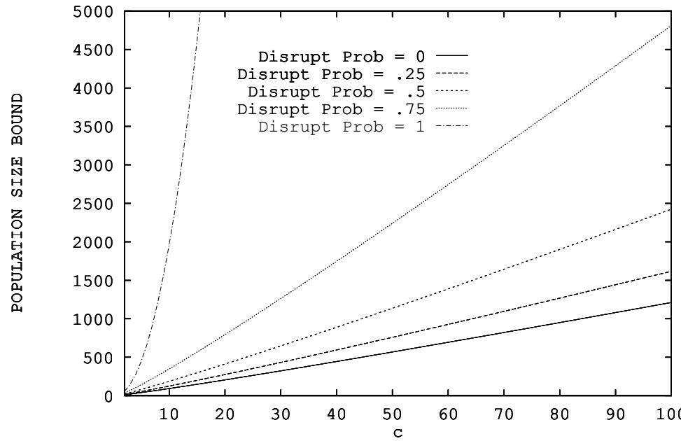  
Figure 9.1: The population-size bound of (9.14) is shown as a function of $c$ , at various disruption probabilities $p _ { d }$ , with $\gamma = . 9 5$ $g = 1 0 0$ , and $p _ { c } = 1$ , for classes of identical fitness.

# 9.2 Desirable and Undesirable Classes: Arbitrary Fitnesses

Our starting point is the summation in (9.12), over $b$ desirable classes, with $p _ { d }$ substituted for $p _ { d } ( m )$ ,

$$
\begin{array} { r l r } { 1 - \gamma ^ { \frac { 1 } { g } } \ \le \ \displaystyle \sum _ { m = 0 } ^ { b - 1 } \Big [ \ } & { ( 1 - p _ { c } ) ( 1 - P _ { s } ( m ) ) ^ { 2 } + p _ { c } ( 1 - ( P _ { s } ( m ) ) ^ { 2 } ) } & \\ & { } & \\ & { - \ } & { 2 p _ { c } ( 1 - p _ { d } ) P _ { s } ( m ) ( 1 - P _ { s } ( m ) ) \Big ] ^ { n / 2 } , } \end{array}
$$

We maximize the right-hand si

$$
P _ { s } ( m ) ~ = ~ { \frac { f _ { m } } { \sum _ { j = 0 } ^ { b - 1 } f _ { j } + \sum _ { j = b } ^ { c - 1 } f _ { j } } } ~ .
$$

As before, the $b$ desirable classes are indexed from $0$ to $b - 1$ ; the $c - b$ undesirable classes, from $b$ to $c - 1$

We maximize the right-hand side of (9.17) over the $P _ { s } ( m )$ , as we did in the previous chapter. The maximal value occurs when all $P _ { s } ( m )$ are minimal. Like last time, maximization of the

are at fmax . For the half at fmin , $m$ , of

$$
\frac { f _ { m } } { \sum _ { j = 0 } ^ { b - 1 } f _ { j } + s f _ { e x t r a } } \quad ,
$$

where $s$ = fmin =fmax , and r = fextra =fmax , as in $f _ { e x t r a }$ revious chapter. For the half at fmax , peak. This minimum occurs when half of the $f _ { m }$ for the $b$ desired peaks are at $f _ { m i n }$ and half are at $f _ { m a x }$ V = Ps(max $f _ { m i n }$

$$
U ~ = ~ P _ { s } ( m i n ) ~ = ~ { \frac { f _ { m i n } } { { \frac { b } { 2 } } \big ( f _ { m a x } + f _ { m i n } \big ) + s f _ { e x t r a } } } ~ = ~ { \frac { 2 r } { b ( r + 1 ) + 2 r ^ { \prime } s } } ~ ,
$$

where $r = f _ { m i n } / f _ { m a x }$ 2 (1 $r ^ { \prime } = f _ { e x t r a } / f _ { m a x }$ pc(1  U )  2pc(1  pd)U(1  U) + $f _ { m a x }$

$$
V ~ = ~ P _ { s } ( m a x ) ~ = ~ { \frac { f _ { m a x } } { { \frac { b } { 2 } } \big ( f _ { m a x } + f _ { m i n } \big ) + s f _ { e x t r a } } } ~ = ~ { \frac { 2 } { b ( r + 1 ) + 2 r ^ { \prime } s } } ~ .
$$

thod. Again, one c $n ^ { \prime }$ ld substitute an intermediate threshold r00

$$
\begin{array} { r l r } { 1 - \gamma ^ { \frac { 1 } { g } } } & { \le } & { \displaystyle \frac { b } { 2 } \left[ ( 1 - p _ { c } ) ( 1 - U ) ^ { 2 } + p _ { c } ( 1 - U ^ { 2 } ) - 2 p _ { c } ( 1 - p _ { d } ) U ( 1 - U ) \right] ^ { n / 2 } + } \\ & { } & { \displaystyle \frac { b } { 2 } \left[ ( 1 - p _ { c } ) ( 1 - V ) ^ { 2 } + p _ { c } ( 1 - V ^ { 2 } ) - 2 p _ { c } ( 1 - p _ { d } ) V ( 1 - V ) \right] ^ { n / 2 } . } \end{array}
$$

Given $\gamma , g , b , s , p _ { c } , p _ { d } , r$ , and $r ^ { \prime }$ , one can obtain numeric bounds for $n$ and $n ^ { \prime }$ via Newton's method. Again, one could substitute an intermediate threshold $r ^ { \prime \prime }$ for both $r$ and $r ^ { \prime }$

Figure 9.2 illustrates the effect of varying $p _ { c }$ when disruption is maximal ( $p _ { d } = 1$ ). In this worst case scenario, crossover is always destructive, never constructing any desirable solutions. Population-size bounds are derived from expression (9.22), using $\gamma = . 9 5$ $g ~ = ~ 1 0 0$ $r ^ { \prime \prime } = 1$ $b \ = \ 3 2$ , and $s ~ = ~ 1 0 0 0$ . As the figure shows, given high disruption, required population size increases exponentially as $p _ { c }$ approaches 1. A crossover probability of $p _ { c } ~ = ~ . 6$ requires a population size of roughly 28, 500; $p _ { c } ~ = ~ . 7$ , 38,000; pc = .8, 57,000; $p _ { c } ~ = ~ . 9$ , 113,000; and $p _ { c } = 1 , 2 3 , 5 0 0 , 0 0 0$ . The model tells us to steer away from crossover probabilities close to 1. Of course, one should not make $p _ { c }$ too low, to avoid stifling exploration and the location of niches.

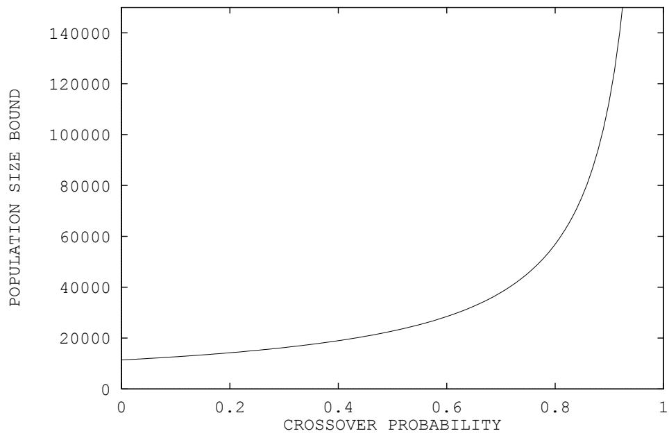  
We have modelled the major forces in GAs that incorporate tness sharing: $p _ { c }$ electi $\gamma = . 9 5$ - $g = 1 0 0$ $p _ { d } = 1$ $r ^ { \prime \prime } = 1$ $b = 3 2$ , and $s = 1 0 0 0$

# method of setting that model's p

There are numerous promising extensions to the research presented in this chapter. We briefly mention some of the possibilities.

We have modelled the major forces in GAs that incorporate fitness sharing: selection, sharset. GA theor tells us that the minimum number of enerations should be of the order of some multi le of lo n or alternativel lo l where l is the strin len th where selection ressure a few parameters, the most general model from the current chapter, corresponding to expresthe number of enerations the GA will $\gamma , g , b , s , p _ { c } , p _ { d } , r$ usin $r ^ { \prime }$ = 100. As shown $\gamma$ n the next set: the user merely specifies a minimum level of confidence, such as $9 5 \%$ , that he/she would like to have in the values produced by the model. The number of generations $g$ is also easy to set. GA theory tells us that the minimum number of generations should be of the order of some multiple of $\log n$ (or alternatively, $\log l$ , where $l$ is the string length), where selection pressure determines the base of the logarithm. The user can set $g$ to some arbitrary value greater than the number of generations the GA will run. We have been using $g = 1 0 0$ . As shown in the next chapter's empirical results, GAs with sharing typically require nowhere near 100 generations to finish running. Furthermore, our models are not sensitive to increases in $g$

A user can set the parameter $b$ by specifying the minimum number of sufficiently diverse solutions the GA is to return. Of course, if the fitness landscape does not contain $b$ peaks, sharing will be unable to find $b$ peaks. A user can set $r$ and $r ^ { \prime }$ by substituting a parameter $r ^ { \prime \prime }$ for both $r$ and $r ^ { \prime }$ , where $r ^ { \prime } \leq r ^ { \prime \prime } \leq r \colon r ^ { \prime \prime }$ indicates a desired quality of solution. The user can specify that the GA return at least $b$ diverse solutions, all of which are within $1 0 0 \times r ^ { \prime \prime }$ percent of the quality or fitness of the global optimum or optima.

The modelling parameter $p _ { d }$ can be set in several ways. One can assume minimal disruption and set it to zero, as we did in the models of Chapter 8. Alternatively, one can assume the worst and set it to 1, in which case $p _ { c }$ should be set to a value less than 1 to allow at least some solutions to pass through from generation to generation, undisrupted. The effect of intermediate values of $p _ { d }$ is shown in Figure 9.1.

The user should set $p _ { c }$ to whatever value of $p _ { c }$ is to be used in the GA. We recommend a value of less than 1 for real-world problems, because if good solutions and subsolutions are susceptible to disruption, we would like many of them to be passed through untouched from generation to generation. Values of $p _ { c }$ between .6 and .9 are most common in the GA literature. Figure 9.2 gives some insight into why these are popular values.

The modelling parameter that might give a user the most trouble is $s$ , the number of extraneous peaks in the landscape. One approach to setting this parameter, given an unknown could form a rou h estimate of the modalit of the search s ace. Methods for estimatin the for $s$ . Problem-specific information can be applied whenever available. If none is immediately available, one approach to obtaining some is dynamic estimation. From prior runs or from early model crossover | as otential disru ters or sources of noise. Mutation for instance can be Another approach would be to run hillclimbers from every point within several small, randomly chosen regions, and to count the number of unique optima returned. From this sample, one could form a rough estimate of the modality of the search space. Methods for estimating the number of peaks in the fitness landscape deserve further research.

One can model minor forces in GAs that incorporate sharing, in much the same way we model crossover — as potential disrupters or sources of noise. Mutation, for instance, can be modelled similar to the way it is incorporated in the schema theorem: the probability that mutation disrupts schema $H$ $( 1 - p _ { m } ) ^ { o ( H ) }$ . Whether or not class definitions correspond to schema definitions, we expect that mutation will disrupt a class very rarely, assuming that the usual low rates of mutation are employed. Higher mutation rates can be incorporated into a model if one can estimate the probability of mutation disrupting each individual class.

If sampling is employed in the computation of shared fitnesses, it would be useful to model the additional noise introduced by sampling, in order to determine the minimum required sample size. Goldberg and Richardson (1987) suggest that to compute an individual's niche count (sum of sharing function values between it and all population elements), $k$ samples of the population be taken, where $k \ \ll \ n$ . They call the mean sharing function value for the sample $\mu _ { i }$ , and set niche count equal to $( n - 1 ) \mu _ { i } + 1$ . The '1' subtracted and added is for the individual itself, since all individuals share fully with themselves. We do not employ sampling in this thesis.

Another useful extension of this study would be to model class formation as well as maintenance. We have already modelled the effects of higher crossover rates. Considering the constructive as well as the destructive effects of crossover would perhaps yield an expression for the optimal crossover probability in a GA with sharing. As mentioned earlier, niche formation is an issue of signal-to-noise within each niche (Goldberg, Deb, & Clark, 1992). It has been the case in practice that interniche population sizing considerations (niche maintenance) override intraniche considerations (niche formation). This has allowed a population that is sized to maintain niches, more than enough elements to form the niches. However, this may not be the case for some problems. A potential combined method is to size populations using both approaches, and to employ the maximum recommended population size, perhaps adjusted upwards by a constant to account for interactions.

We have so far used only RWS in our models of sharing, with the understanding that computed bounds will also apply to sharing under any of the more stable, fitness-proportionate selection schemes. (We in fact employ SUS rather than RWS in Chapter 10's runs of a GA with sharing.) One could attempt to locate tighter bounds by modelling individual fitnessproportionate selection schemes that are less noisy than RWS. It is not clear how well our models apply to sharing under ranking and tournament selection schemes. Selection methods such as tournament selection have not usually been combined with sharing, to avoid stability successive enerations are still inde endent but class tnesses are fuzz rather than denite scheme that is more stable than the naive combination.

It is possible to allow flexibility in the definition of a class's representative fitness. Deb (1989), for instance, represents the mean and the variance of fitnesses, among the individuals clustered atop each peak. We have chosen an alternative approach in order to preserve the independence of successive generations. However, a hybrid model may be possible in which successive generations are still independent, but class fitnesses are fuzzy rather than definite, and are modelled as sources of disruption or noise.

One final possibility is to model overlapping niches. Horn (1993) did this in his Markov chain model, but limited his attention to one-bit problems. We have chosen not to model overlapping niches because our models are already predictive in cases of minor overlap, because the effectiveness of sharing diminishes as overlap increases, and to preserve the independence of successive generations. Again, we could attempt to model overlap as a source of disruption, in order to preserve independence.

# Chapter 10

# p g g p y g g g pniching methods, since they conceptually form and maintain niches simultaneously withi

We have analyzed crowding and sharing methods in depth in the previous four chapters, and their behaviors to those of both a arallel hillclimbin method we develo and a se uential improved algorithmic designs. We previously designated crowding and sharing to be parallel niching methods, since they conceptually form and maintain niches simultaneously within a single population (regardless of the number of processors employed). Earlier, we also discussed sequential niching (SN) methods — techniques that locate multiple niches temporally. In this chapter, we test crowding and sharing on several problems of increasing difficulty. We compare some nei hborhood o erator that is a ro riate to the roblem bein solved. The nei hborhood niching method. Parallel hillclimbing and sequential niching serve as benchmarks for examining the power of parallel niching methods. We illustrate the strengths and the limitations of all four niching methods.

Our parallel hillclimber starts with a randomly generated initial population, and ideally forces each element to converge to its nearest attractor. Attractors are defined with respect to some neighborhood operator that is appropriate to the problem being solved. The neighborhood operator may be either phenotypic (operating over variable space) or genotypic (operating over Hamming or bit space).

The parallel hillclimbing algorithm is similar in functionality to binary search. When operating in phenotypic space, the hillclimber starts with a large neighborhood size. Each population element hillclimbs until it can no longer improve. The hillclimber then cuts its neighborhood size in half, and each population element again hillclimbs until it can not further improve. The hillclimber repeats the previous step until it has hillclimbed using a neighborhood size of $\epsilon$ where $\epsilon$ is the smallest increment encoded by the GA. The phenotypic neighborhood operator simply consists of either an addition or a subtraction of the neighborhood size from one of the problem's variables. Figure 10.1 gives an algorithmic description of the phenotypic hillclimber.

The initial neighborhood size requires some care in setting. Too small a neighborhood will delay the hillclimber's convergence. For example, given a unimodal function of a single binaryencoded variable, a random starting point, and an initial neighborhood size of $\epsilon$ , convergence time is, on the average, exponential in encoding length. Too large a neighborhood, on the other hand, will cause points to leave their local neighborhoods and skip from local optimum to local optimum. Unfortunately, parallel hillclimbing has no mechanism for allocating individuals to optima. Therefore, to locate multiple optima it is preferable that each point remain within the basin of attraction (of the optimum) in which it currently resides. This strategy prevents a erturbation is the 
i in of a bit-variable. The hillclimbers take each im rovement the we set all neighborhood sizes to one bit.

Both genotypic and phenotypic hillclimbers implement versions of next-ascent hillclimbing (Mühlenbein, 1991, 1992). Starting with a randomly chosen variable, they cycle through the variables, trying perturbations on each one. For the phenotypic hillclimber, a perturbation is that nichin method | arallel hillclimbin is su erior. e instead seek nichin methods that a perturbation is the fipping of a bit-variable. The hillclimbers take each improvement they find. They terminate, for each neighborhood size, after they have completed a full cycle through the variables without improvement.

The parallel hillclimber is an important base for comparison, because if a niching method is to the nearest local o timum in whose basin of attraction it currentl lies a desirable ro ert that niching method — parallel hillclimbing is superior. We instead seek niching methods that intelligently decide which maxima to pursue, and that tend to prefer higher maxima over lower maxima. Note that the hillclimbing method we have chosen may not be the most efficient of all possible hillclimbers. However, it has predictable behavior, very close to that of the theoretical, deterministic hillclimber of our modelling framework. The parallel hillclimber will tend to climb to the nearest local optimum in whose basin of attraction it currently lies, a desirable property for a hillclimber that strives to locate multiple optima. Also to its merit, our hillclimber is general purpose, requiring exactly the same problem information as the GA.

1. Initialize Neighborhood Size  IF add $S i z e \ge \epsilon$

(a) FOR each population element Randomly pick a starting variable • $C h a n g e = \mathrm { T R U E }$ WHILE Change Change $=$ FALSE - FOR each variable $^ *$ IF adding neighborhood size to current variable yields improved fitness . Perform the addition u $C h a n g e = \mathrm { T R U E }$ $^ *$ ELSE IF subtracting neighborhood size from current variable yields im iching method . Perform the subtraction . Change $=$ TRUE   
(b) Neighborhood Size $=$ Neighborhood Size /2

The sequential niching method we consider is that of Beasley, Bull, and Martin (1993). This is the most promising sequential niching method proposed to date. It works by iterating a simple GA, and maintaining the best solution of each run off-line. The authors call the multiple methods can be com ared. If a arallel nichin method can oer no advanta e there is no to the same area of the search space multiple times, whenever their algorithm locates a solution, it depresses the fitness landscape at all points within some radius of that solution. This niche radius plays a role in SN similar to that of $\sigma _ { s h a r e }$ in sharing. In fact, Beasley et al. suggest that SN is a sequentialization of fitness sharing. We examine this possibility later in the chapter.

Like the parallel hillclimber, sequential niching is an important base to which parallel niching methods can be compared. If a parallel niching method can offer no advantage, there is no point in wasting time with it — one would be better off locating solutions sequentially. As we soon demonstrate, the advantages of parallel niching methods go beyond mere aesthetics or consistency with biological parallelism: there are many things parallel niching can accomplish that sequential niching can not. Beasley et al. mention three potential advantages of sequential niching. The first is simplicity: SN is conceptually a simple add-on to existing optimization  Repeated search of depressed portions of the space; run of a sequence is to locate only one peak. The third and most important is speed, and is partially a by-product of the second. We find that the latter two potential advantages never  Loss of cooperative population properties, including cooperative problem

•Loss, through deration, of optimal solutions and their building blocks;   
Repeated search of depressed portions of the space;   
Repeated convergence to the same solutions;   
•Loss of cooperative population properties, including cooperative problem solving and niche maintenance along the way to a single solution;   
SN and sharing run under stochastic univ

# parallel hillclimbing have buil

We attempt to keep corresponding parameters the same across algorithms whenever possible.   
Our secondary emphasis is choosing parameters that are best for each of the four algorithms.

SN and sharing run under stochastic universal selection. We employ SUS because it is the least noisy of commonly used, unbiased, fitness-proportionate selection methods. DC and parallel hillclimbing have built-in selection mechanisms. None of the selection methods utilize A hillclimber

As our modelling framework suggests, GAs are global optimization methods that operate best when combined with local optimization methods such as hillclimbers. Therefore, after each GA terminates, including GAs internal to SN sequences, hillclimbing is invoked upon that GA's final population. This allows the three GA-based niching methods to always locate actual optima rather than near optima. We use the parallel hillclimbing algorithm as our postGA hillclimber. (There is no need, of course, to call the parallel hillclimber to optimize its own final population.) For sequential niching (and for the other three niching methods as well), hillclimbing occurs on the original, non-derated, fitness landscape. This is one of Beasley et al.'s suggested improvements to their algorithm.

All four nichin al orith $p _ { c } = 1$ urn all \uni ue" e $p _ { m } = 0$ in the nal o ulation ostWithout mutation, runs converge faster. Hillclimbing upon termination, using the parall hillclimbing algorithm, substitutes for mutation. This substitution of hillclimbing for mutation highlights better the merits and drawbacks of the four algorithms as well as the differences between algorithms. The absence of mutation also gives more consistent (less noisy) results from run to run of a GA.

All four niching algorithms return all "unique" elements in the final population (posthillclimbing) as solutions. Uniqueness is determined by applying the same distance measure as the niching method uses. If a new solution is greater than some threshold (a distance of .001 in this study) from all previously located solutions, the new solution is added to the list of final solutions. This allows dual solutions that occur on Hamming cliffs to be treated as a single solution. The final population for SN consists of the combination of final populations (post-hillclimbing) of all runs in a sequence.

The problems we consider are M1-M9, MUX-6, and PAR-8, of Chapter 5. We run each algorithm — parallel hillclimbing, SN, sharing, and DC — 10 times on each problem, employing the same 10 random number seeds (and initial populations) for each algorithm. The runs internal to an SN sequence all use the same random number seed (and initial population). This guarantees that the discovery of a new solution is due to the deration of the fitness landscape and not to random factors. This also provides a convenient stopping point for the SN algorithm at all desired solutions or exceeds a total function-evaluations limit. This alternative would brin it will do so perpetually. (We derate the area about each returned solution only once.) There is no need to do more runs in a sequence than there are peaks; if no new solution is returned during a particular run, the sequence is stopped.

We could alternatively restart the runs of an SN sequence with new, randomly generated populations each time. This would require that SN perform additional runs until either it finds all desired solutions or exceeds a total function-evaluations limit. This alternative would bring into question whether the lowest population size that succeeds is optimal. One could imagine a population of size $n = 2$ restarting thousands of times, until it begins with a population element close enough to a desired optimum to converge to that optimum. A higher population size, on the other hand, might more easily find the same solution in much faster time. Our methodology implies that the lowest $n$ to locate all peaks is most likely the optimal population size for the particular algorithm and problem under consideration (because the number of generations a GA runs tends to increase with population size).

We terminate each run after it effectively stops improving. This stopping criterion applies to full runs of parallel niching methods as well as to internal runs of SN sequences. (Parallel hillclimbing is an exception; it runs until no further improvement occurs.) We determine the point of little further improvement in a fashion similar to Beasley et al., by employing a halting o ulation sta nates. Sharin and DC terminate when $t _ { 0 }$ e avera e raw tness sta nates. $t _ { - 1 }$ $t \sb { - 2 } , t \sb { - 3 }$ , and $t _ { - 4 }$ . If the average fitness of the population at $t _ { 0 }$ is not more than some increment inc greater than the average fitness of the population at $t _ { - 4 }$ , the run halts. We use $i n c = . 0 0 1$ on all problems except $M \boldsymbol { \mathit { \theta } }$ , where we use $i n c = . 1$ . (Although Beasley et al. use $i n c = 0$ , we employ nonzero inc parameters because the hillclimber is responsible for the end convergence of our algorithms.) Runs of an SN sequence terminate when the average derated fitness of the ho e that an al orithm will be able to solve a roblem at reasonable o ulation sizes.

The stopping criterion for the overall SN algorithm is not easy to set, at least when the algorithm is successful. We give SN ideal behavior by stopping successful sequences immediately after they have located all desirable peaks. Unsuccessful sequences are stopped after some run fails to yield a new solution, or after they exceed a maximum number of function evaluations.

For all four algorithms, we set a number of function evaluations, above which we give up hope that an algorithm will be able to solve a problem at reasonable population sizes. This number is 1.5 million GA function evaluations or, alternatively, 2 million combined function evaluations for the GA plus the parallel hillclimber.

We employ the following niche radius for each problem. This value serves as the niche than  = 1 in order to ro $\sigma _ { s h a r e }$ lower false o tima in the derated tness landsca e. Like the nearest power of two) for parallel hillclimbing, both on its own and when tacked on to the end of a GA. M1-M4 use a phenotypic niche radius of .1; M5, 4.24 (phenotypic); M6, 8.0 (phenotypic); M7 and M8, 5.5 (genotypic); M9, 2.5 (genotypic); MUX-6 and PAR-8, 3.5 (genotypic). We choose these values to allow discrimination among desired peaks.

We utilize sharing function (4.2), but with $\alpha = 2$ . Beasley et al. recommend $\alpha = 2$ rather than $\alpha \ = \ 1$ , in order to produce lower false optima in the derated fitness landscape. Like Beasley et al., we set SN's derating function to 1 minus the equivalent sharing function.

For SN, we make an additional modification, to its benefit. For consistency with the other niching methods, SN returns all unique, previously unlocated elements of each final population (post-hillclimbing) as solutions. In case SUS successfully locates and maintains multiple solutions, we allow SN to use them all. We then derate about each solution, as if multiple runs had been performed. Note that Beasley et al. return only the single best solution of the population. We have found that returning only the best solution yields worse results.

We employ a single performance criterion that is common to all algorithms. Assume that all algorithms, given a suffciently large population, will be able to solve all problems that we consider. This is not an unrealistic assumption, since the probability of all desired solutions appearing in the initial population approaches one as population size approaches infinity. Our current cha ter we instead com ute em irical bounds. size at which an algorithm returns all desired solutions. (We do not penalize or reward an algorithm for returning extraneous solutions.) Over multiple trials, the fewer the average numtermination all desired eaks. That is we redo all al orithmic trials at hi her and hi her n u performance criterion is consistent with our previous, theoretical, population-sizing models, in which we bound the minimum population size required for a run to converge properly. In the current chapter, we instead compute empirical bounds.

We start with the minimum population size that is both a power of two and large enough to locate all peaks $n = 2$ for SN). We double $n$ until the algorithm locates and maintains to However we ex ect that dierent al orithms would have dierent o timal o ulation siz $n$ s. to the limit on the number of function evaluations, until one trial correctly converges. We use only population sizes that are powers of two, in order to avoid massive numbers of trials and fine-grained distinctions between nearly optimal population sizes. For SN, like Beasley et al., Tables 10.1{10.3 summarize all results and allow comparison of the four algorithms on problems of varying diculty. The tables compare the number of GA function evaluations (without However, we expect that different algorithms would have different optimal population sizes.

# 10.2 Results

Tables 10.110.3 summarize all results and allow comparison of the four algorithms on problems of varying difficulty. The tables compare the number of GA function evaluations (without hillclimbing function evaluations added) for the three GAs. They then compare the total number of function evaluations (GAs plus hillclimbers) for all four algorithms. The best average results on each problem are shown in boldface.

We group test problems based on difficulty. The first of three groups, shown in Table 10.1, consists of the easiest problems, M1-M5 and MUX-6. Each of these problems has fewer than 10 peaks and has negligible isolation or misleadingness (hence no deception). The second group, shown in Table 10.2, consists of two problems of intermediate difficulty, M6 and PAR-8. These problems have a moderate number of peaks — M6 has 25 and PAR-8 has 128 — and have negligible isolation or misleadingness (hence no deception). The third group of problems, shown in Table 10.3, consists of the three hardest problems, M7-M9. Each of these problems has between several thousand and several million peaks, and also displays both isolation and misleadingness. (M7 and M9 are deceptive.)

In Tables 10.1-10.3, average subpopulation size is computed by dividing average population size by the number of desirable peaks (subpopulations). For sequential niching, average population size is first computed across all sequences and all runs within a sequence. This average eas test functions and DC is fastest on the other two. Second lace oes twice to hillclimbin size. For SN, $g$ indicates the average, across all sequences, of the combined number of generations for all runs within a sequence. $9 5 \%$ confidence intervals for the mean number of function evaluations are computed according to the $t$ -distribution.

Table 10.1 shows that on the easiest problems, parallel hillclimbing is the overall winner, with deterministic crowding a close second. Parallel hillclimbing is fastest on four of the six easy test functions, and DC is fastest on the other two. Second place goes twice to hillclimbing, twice to DC, and twice to sharing. Third place goes four times to sharing, once to DC, and once to SN. SN takes last place all but one time: it edges out DC on $M 5$

These results confirm prior results of GA researchers who show that hillclimbing algorithms can outperform GAs on easy test functions, such as the five functions of De Jong's (1975) test suite. (Note that DC, a crossover hillclimber, is a close second and sometimes defeats the parallel hillclimber.) There is hence no point in doing performance comparisons involving GAs, exclusively using easy problems. We are more interested in how performance scales up to harder problems. Doing comparisons on a range of problems from very easy to very hard tells a lot about the merits of an algorithm and the scalability of its performance.

Table 10.1: Performances of the four algorithms, parallel hillclimbing (HC), sequential niching HC 2.72 1017 284 (813, 1220) SN 3.68 46.40 738 359 (481, 994) 4112 1478 (305 $n$ , 5169) generations is $\bar { g }$ 5.76 8.00 264 147 (159, 369) $( \mu )$ 1 1262 (1529, 3333) $O$ ), and a $9 5 \%$ DC 2.40 28.00 380 270 (187, 573) 1246 536 (863, 1629) of GA and hillclimber. The best average results on each problem are shown in boldface.

<table><tr><td></td><td></td><td></td><td></td><td colspan="3">GA Function Evaluations</td><td colspan="4">Total Function Evaluations</td></tr><tr><td>Method</td><td>¯n$</td><td> j</td><td>μ</td><td>σ</td><td>μ: 95% C.I.</td><td></td><td>µ</td><td>σ</td><td>μ: 95% C.I.</td><td></td></tr><tr><td colspan="9"></td><td></td></tr><tr><td>HC</td><td>2.72</td><td></td><td></td><td></td><td>M1</td><td></td><td>1017</td><td>284</td><td>(813,</td><td>1220)</td></tr><tr><td>SN</td><td>3.68</td><td>46.40</td><td>738</td><td>359</td><td>(481,</td><td>994)</td><td>4112</td><td>1478</td><td>(3055,</td><td>5169)</td></tr><tr><td>SH</td><td>5.76</td><td>8.00</td><td>264</td><td>147</td><td>(159,</td><td>369)</td><td>2431</td><td>1262</td><td>(1529,</td><td>3333)</td></tr><tr><td>DC</td><td>2.40</td><td>28.00</td><td>380</td><td>270</td><td>(187,</td><td>573)</td><td>1246</td><td>536</td><td>(863,</td><td>1629)</td></tr><tr><td colspan="9"></td></tr><tr><td>HC</td><td>2.72</td><td></td><td></td><td></td><td>M2</td><td></td><td>1021</td><td>292</td><td>(812,</td><td>1230)</td></tr><tr><td>SN</td><td>4.64</td><td>75.60</td><td>1770</td><td>1047</td><td>(1022,</td><td>2519)</td><td>8632</td><td>4216</td><td>(5618,</td><td>11647)</td></tr><tr><td>SH</td><td>8.96</td><td>8.70</td><td>442</td><td>203</td><td>(297,</td><td>587)</td><td>3827</td><td>1436</td><td>(2801,</td><td>4854)</td></tr><tr><td>DC</td><td>2.40</td><td>27.40</td><td>372</td><td>239</td><td>(201,</td><td>543)</td><td>1264</td><td>537</td><td>(879,</td><td>1648)</td></tr><tr><td colspan="10">M3</td></tr><tr><td>HC</td><td>3.04</td><td></td><td></td><td></td><td></td><td></td><td>1150</td><td>728</td><td>(629,</td><td>1671)</td></tr><tr><td>SN</td><td>5.92</td><td>26.80</td><td>719</td><td>435</td><td>(408,</td><td>1030)</td><td>4375</td><td>1709</td><td>(3153,</td><td>5598)</td></tr><tr><td>SH</td><td>6.08</td><td>8.70</td><td>294</td><td>133</td><td>(199,</td><td>390)</td><td>2579</td><td>1182</td><td>(1733,</td><td>3424)</td></tr><tr><td>DC</td><td>2.08</td><td>20.30</td><td>262</td><td>290</td><td>(55,</td><td>470)</td><td>1013</td><td>529</td><td>(635,</td><td>1391)</td></tr><tr><td colspan="9">M4</td><td></td></tr><tr><td>HC</td><td>3.04</td><td></td><td></td><td></td><td></td><td></td><td>1140</td><td>713</td><td>(630,</td><td>1649)</td></tr><tr><td>SN</td><td>5.12</td><td>72.40</td><td>2445</td><td>2572</td><td>(606,</td><td>4284)</td><td>[10231</td><td>8789</td><td>(3947,</td><td>16515)</td></tr><tr><td>SH</td><td>6.72</td><td>9.20</td><td>352</td><td>201</td><td>(209,</td><td>495)</td><td>2892</td><td>1047</td><td>(2143,</td><td>3640)</td></tr><tr><td>DC</td><td>2.08</td><td>17.00</td><td>210</td><td>185</td><td>(77,</td><td>342)</td><td>975</td><td>447</td><td>(655,</td><td>1295)</td></tr><tr><td colspan="9">M5</td><td></td></tr><tr><td>HC</td><td>2.50</td><td></td><td></td><td></td><td></td><td></td><td>901</td><td>479</td><td>(558,</td><td>1243)</td></tr><tr><td>SN</td><td>1.30</td><td>32.30</td><td>180</td><td>77</td><td>(125,</td><td>235)</td><td>1456</td><td>433</td><td>(1146,</td><td>1766)</td></tr><tr><td>SH</td><td>2.80</td><td>8.00</td><td>103</td><td>57</td><td>(62,</td><td>144</td><td>1111</td><td>411</td><td>(817,</td><td>1405)</td></tr><tr><td>DC</td><td>5.60</td><td>25.60</td><td>603</td><td>275</td><td>(406,</td><td>800)</td><td>2459</td><td>941</td><td>(1787,</td><td>3132)</td></tr><tr><td colspan="9">MUX-6</td><td></td></tr><tr><td>HC</td><td>10.40</td><td></td><td></td><td></td><td></td><td></td><td>1257</td><td>998</td><td>(544,</td><td>1971)</td></tr><tr><td>SN</td><td>6.40</td><td>140.70</td><td>4423</td><td>3879</td><td>(1650,</td><td>7197)</td><td>9439</td><td>7367</td><td>(4172,</td><td>14706)</td></tr><tr><td>SH</td><td>13.60</td><td>8.90</td><td>534</td><td>186</td><td>(401,</td><td>667)</td><td>1931</td><td>555</td><td>(1537,</td><td>2328)</td></tr><tr><td>DC</td><td>12.00</td><td>44.30</td><td>[2816]</td><td>3287</td><td>(466,</td><td>5166)</td><td>3654</td><td>3750</td><td>(972,</td><td>6335)</td></tr></table>

We give results without hillclimbing to show how long it takes a GA to get close to the final desired solutions (anywhere within their hillclimbing basins of attraction), without actually having to pinpoint them. When hillclimbing function evaluations are not counted, sharing and deterministic crowding share three victories apiece, with sharing having the lowest overall number of function evaluations. Second place goes to sharing three times, crowding twice, and SN once. Third and final place goes to SN five times and crowding once. (There is no fourth place, since we do not compare the hillclimber to the GAs in terms of GA function evaluations.)

It is somewhat surprising that SN performs so poorly in comparison with the other algorithms on the six easiest test functions, especially since Beasley et al. employ $M 1 - M 5$ in their study. In addition, our SN results without hillclimbing are in all cases faster than Beasley et al.'s on $M 1 - M 5$ . (This comparison is valid, because their convergence results are approxithe tness landsca e $7 6 \%$ tin $1 0 0 \%$ nal eak is harder because that eak is isolated. ne roughly 3-8 times as many function evaluations as sharing, on five of the six easy test functions, and roughly 1.7 times as many on the other. With hillclimbing, SN requires roughly 4-9 times as many function evaluations as parallel hillimbing on five out of six functions, and roughly 1.6 times as many on the other.

A plausible explanation for SN's behavior is that once it has squashed several peaks in the fitness landscape, locating the final peak is harder because that peak is isolated. One observation about SN on the five-peaked functions $M 1 { - } M 4$ is that once its population grows large enough to locate one peak, it has grown large enough to locate multiple peaks. Many of the runs on $M 1 - M 4$ locate no peaks with $n = 8$ , but 2-3 peaks at a time with $n = 1 6$

All of the algorithms, including SN, find all desired optima on all six test functions in under 11,000 function evaluations. Therefore, all four algorithms are general-purpose enough to handle the easiest problems. We already know that the GA, although a capable optimizer of easy functions, may not be the optimal algorithm for any particular easy test function. A good algorithm, however, must scale up to solving harder problems.

We now examine the performances of the four algorithms on two functions of intermediate complexity, M6 and PAR-8. Table 10.2 tells us that sharing is the clear winner on both functions, with or without hillclimbing. Sharing performs only $1 4 \%$ to $4 4 \%$ of the function evaluations of its closest competitor. On M6, hillclimbing comes in second and SN comes in third. DC fails to locate and maintain the 25 optima, even given 1.5 million GA function

Method n g   : 95% C.I.   : 95% C.I. (SN), fitness sharing (SH), and deterministic crowding (DC), are given on the two functions HC 12.29 29017 10221 (21709, 36326) $\bar { n }$ SN 3.58 146.30 122 $\bar { g }$ 2 10755 (4512, 19892) 46657 28680 ( $( \mu )$ 50, 67163) SH $\left( \sigma \right)$ 12 11. $9 5 \%$ 1638 329 (1403, 1874) 12910 340 (12667, 13153) each combination of GA and hillclimber. The best average results on each problem are shown in boldface.

<table><tr><td rowspan=1 colspan=1></td><td rowspan=1 colspan=1></td><td rowspan=1 colspan=1></td><td rowspan=1 colspan=3>GA Function Evaluations</td><td rowspan=1 colspan=3>Total Function Evaluations</td></tr><tr><td rowspan=1 colspan=1>M ethod</td><td rowspan=1 colspan=1>n}$</td><td rowspan=1 colspan=1> j</td><td rowspan=1 colspan=1>µ</td><td rowspan=1 colspan=1>σ</td><td rowspan=1 colspan=1>μ: 95% C.I.</td><td rowspan=1 colspan=1>µ</td><td rowspan=1 colspan=1>σ</td><td rowspan=1 colspan=1>μ: 95% C.I.</td></tr><tr><td rowspan=1 colspan=9>M6</td></tr><tr><td rowspan=1 colspan=1>HC</td><td rowspan=1 colspan=1>12.29</td><td rowspan=1 colspan=1></td><td rowspan=1 colspan=1></td><td rowspan=1 colspan=1></td><td rowspan=1 colspan=1></td><td rowspan=1 colspan=1>29017</td><td rowspan=1 colspan=1>10221</td><td rowspan=1 colspan=1>(21709,36326)</td></tr><tr><td rowspan=1 colspan=1>SN</td><td rowspan=1 colspan=1>3.58</td><td rowspan=1 colspan=1>146.30</td><td rowspan=1 colspan=1>12202</td><td rowspan=1 colspan=1>10755</td><td rowspan=1 colspan=1>(4512,19892)</td><td rowspan=1 colspan=1>46657</td><td rowspan=1 colspan=1>28680</td><td rowspan=1 colspan=1>(26150,67163)</td></tr><tr><td rowspan=1 colspan=1>SH</td><td rowspan=1 colspan=1>5.12</td><td rowspan=1 colspan=1>11.80</td><td rowspan=1 colspan=1>1638</td><td rowspan=1 colspan=1>329</td><td rowspan=1 colspan=1>(1403,  1874</td><td rowspan=1 colspan=1>12910</td><td rowspan=1 colspan=1>340</td><td rowspan=1 colspan=1>(12667,13153)</td></tr><tr><td rowspan=1 colspan=1>DC</td><td rowspan=1 colspan=1></td><td rowspan=1 colspan=1></td><td rowspan=1 colspan=1>&gt; 1.5 × 106</td><td rowspan=1 colspan=1></td><td rowspan=1 colspan=1></td><td rowspan=1 colspan=1></td><td rowspan=1 colspan=1></td><td rowspan=1 colspan=1></td></tr><tr><td rowspan=1 colspan=9>PAR-8</td></tr><tr><td rowspan=1 colspan=1>HC</td><td rowspan=1 colspan=1>48.08</td><td rowspan=1 colspan=1></td><td rowspan=1 colspan=1></td><td rowspan=1 colspan=1></td><td rowspan=1 colspan=1></td><td rowspan=1 colspan=1>202387</td><td rowspan=1 colspan=1>71122</td><td rowspan=1 colspan=1>(151535,253239)</td></tr><tr><td rowspan=1 colspan=1>SN</td><td rowspan=1 colspan=1>19.20</td><td rowspan=1 colspan=1>36.40</td><td rowspan=1 colspan=1>100557</td><td rowspan=1 colspan=1>72359</td><td rowspan=1 colspan=1>(48820,152294)</td><td rowspan=1 colspan=1>[263666</td><td rowspan=1 colspan=1>139844</td><td rowspan=1 colspan=1>(163677,363654)</td></tr><tr><td rowspan=1 colspan=1>SH</td><td rowspan=1 colspan=1>9.60</td><td rowspan=1 colspan=1>12.60</td><td rowspan=1 colspan=1>17203</td><td rowspan=1 colspan=1>8400</td><td rowspan=1 colspan=1>(11197,23209)</td><td rowspan=1 colspan=1>54402</td><td rowspan=1 colspan=1>21280</td><td rowspan=1 colspan=1>(39187,69617)</td></tr><tr><td rowspan=1 colspan=1>DC</td><td rowspan=1 colspan=1>11.20</td><td rowspan=1 colspan=1>87.40</td><td rowspan=1 colspan=1>125850</td><td rowspan=1 colspan=1>44106</td><td rowspan=1 colspan=1>(94314,157385)</td><td rowspan=1 colspan=1>149022</td><td rowspan=1 colspan=1>52635</td><td rowspan=1 colspan=1>(111388,186657)</td></tr></table>

evaluations. However, it consistently locates and maintains the single global optimum. On $P A R$ e lobal o timum: the are all on the crossover ath to the lobal o timum. However sharing. Hillclimbing comes in third, taking about four times as many as sharing. SN comes in fourth, taking about five times as many as sharing. Without hillclimbing, SN edges out DC for second, using $8 0 \%$ of DC's function evaluations.

The reason for DC's peculiar performance on $M \boldsymbol { \mathit { \theta } }$ is that the function is not multimodal in crossover-hillclimbing space. In other words, DC uses the nonglobal optima as stepping stones to the global optimum: they are all on the crossover path to the global optimum. However, The method b which SN solves PAR-8 is of interest: SN locates all 128 dis uncts in a sin le nonglobal optima along the way to the global optimum. This raises the possibility that one could locate some or all of the 24 nonglobal optima by stopping the run early. It is interesting that the crossover interactions we observed in Chapter 7 on constructed problems, now emerge on a test problem. Specifically, the global optimum is dominating nearby local optima that are in turn dominating other local optima, and so on, creating a cascading effect.

The method by which SN solves $P A R$ $\boldsymbol { \delta }$ is of interest: SN locates all 128 disjuncts in a single run. Its success is therefore due to SUS's stability and not to iterating the GA. Again, once

Method n g   : 95% C.I.   : 95% C.I. (SN), fitness sharing (SH), and deterministic crowding (DC), are given on the three functions of greatest difficulty. Statistics are taken over 10 runs. Average subpopulation size is $\bar { n }$ ; average number of generations is $\bar { g }$ . The mean number of function evaluations $( \mu )$ , its standard deviation $\left( \sigma \right)$ SH $9 5 \%$ confidence interval for the mean are given in thousands (indicated by the letter $K$ DC 20.80 119.80 81K 31K (58K, 103K) 101K 39K (73K, 129K) on each problem are shown in boldface.

<table><tr><td rowspan=1 colspan=1></td><td rowspan=1 colspan=1></td><td rowspan=1 colspan=1></td><td rowspan=1 colspan=3>GA Function Evaluations</td><td rowspan=1 colspan=3>Total Function Evaluations</td></tr><tr><td rowspan=1 colspan=1>Method</td><td rowspan=1 colspan=1>n</td><td rowspan=1 colspan=1> g</td><td rowspan=1 colspan=1>µ</td><td rowspan=1 colspan=1>σ</td><td rowspan=1 colspan=1>μ: 95% C.I.</td><td rowspan=1 colspan=1>μ</td><td rowspan=1 colspan=1>σ</td><td rowspan=1 colspan=1>μ: 95% C.I.</td></tr><tr><td rowspan=1 colspan=9>M7</td></tr><tr><td rowspan=1 colspan=1>HC</td><td rowspan=1 colspan=1></td><td rowspan=1 colspan=1></td><td rowspan=1 colspan=1></td><td rowspan=1 colspan=1></td><td rowspan=1 colspan=1></td><td rowspan=1 colspan=1>&gt; 2000K</td><td rowspan=1 colspan=1></td><td rowspan=1 colspan=1></td></tr><tr><td rowspan=1 colspan=1>SN</td><td rowspan=1 colspan=1></td><td rowspan=1 colspan=1></td><td rowspan=1 colspan=1>&gt; 1500K</td><td rowspan=1 colspan=1></td><td rowspan=1 colspan=1></td><td rowspan=1 colspan=1></td><td rowspan=1 colspan=1></td><td rowspan=1 colspan=1></td></tr><tr><td rowspan=1 colspan=1>SH</td><td rowspan=1 colspan=1></td><td rowspan=1 colspan=1></td><td rowspan=1 colspan=1>&gt; 1500K</td><td rowspan=1 colspan=1></td><td rowspan=1 colspan=1></td><td rowspan=1 colspan=1></td><td rowspan=1 colspan=1></td><td rowspan=1 colspan=1></td></tr><tr><td rowspan=1 colspan=1>DC</td><td rowspan=1 colspan=1>20.80</td><td rowspan=1 colspan=1>119.80</td><td rowspan=1 colspan=1>81K</td><td rowspan=1 colspan=1>31K</td><td rowspan=1 colspan=1>(58K,103K)</td><td rowspan=1 colspan=1>101K</td><td rowspan=1 colspan=1>39K</td><td rowspan=1 colspan=1>(73K, 129K)</td></tr><tr><td rowspan=1 colspan=9>M8</td></tr><tr><td rowspan=1 colspan=1>HC</td><td rowspan=1 colspan=1></td><td rowspan=1 colspan=1></td><td rowspan=1 colspan=1></td><td rowspan=1 colspan=1></td><td rowspan=1 colspan=1></td><td rowspan=1 colspan=1>&gt; 2000K</td><td rowspan=1 colspan=1></td><td rowspan=1 colspan=1></td></tr><tr><td rowspan=1 colspan=1>SN</td><td rowspan=1 colspan=1></td><td rowspan=1 colspan=1></td><td rowspan=1 colspan=1>&gt; 1500K</td><td rowspan=1 colspan=1></td><td rowspan=1 colspan=1></td><td rowspan=1 colspan=1></td><td rowspan=1 colspan=1></td><td rowspan=1 colspan=1></td></tr><tr><td rowspan=1 colspan=1>SH</td><td rowspan=1 colspan=1>19.20</td><td rowspan=1 colspan=1>19.20</td><td rowspan=1 colspan=1>13K</td><td rowspan=1 colspan=1>5K</td><td rowspan=1 colspan=1>(9K,  16K)</td><td rowspan=1 colspan=1>38K</td><td rowspan=1 colspan=1>14K</td><td rowspan=1 colspan=1>(28K,  49 K)</td></tr><tr><td rowspan=1 colspan=1>DC</td><td rowspan=1 colspan=1>22.40</td><td rowspan=1 colspan=1>134.40</td><td rowspan=1 colspan=1>98K</td><td rowspan=1 colspan=1>39K</td><td rowspan=1 colspan=1>(70K,126K)</td><td rowspan=1 colspan=1>119 K</td><td rowspan=1 colspan=1>47K</td><td rowspan=1 colspan=1>(86K,153K</td></tr><tr><td rowspan=1 colspan=9>M9</td></tr><tr><td rowspan=1 colspan=1>HC</td><td rowspan=1 colspan=1></td><td rowspan=1 colspan=1></td><td rowspan=1 colspan=1></td><td rowspan=1 colspan=1></td><td rowspan=1 colspan=1></td><td rowspan=1 colspan=1>&gt; 2000K</td><td rowspan=1 colspan=1></td><td rowspan=1 colspan=1></td></tr><tr><td rowspan=1 colspan=1>SN</td><td rowspan=1 colspan=1></td><td rowspan=1 colspan=1></td><td rowspan=1 colspan=1>&gt; 1500K</td><td rowspan=1 colspan=1></td><td rowspan=1 colspan=1></td><td rowspan=1 colspan=1></td><td rowspan=1 colspan=1></td><td rowspan=1 colspan=1></td></tr><tr><td rowspan=1 colspan=1>SH</td><td rowspan=1 colspan=1></td><td rowspan=1 colspan=1></td><td rowspan=1 colspan=1></td><td rowspan=1 colspan=1></td><td rowspan=1 colspan=1></td><td rowspan=1 colspan=1>&gt; 2000K</td><td rowspan=1 colspan=1></td><td rowspan=1 colspan=1></td></tr><tr><td rowspan=1 colspan=1>DC</td><td rowspan=1 colspan=1>136.53</td><td rowspan=1 colspan=1>337.80</td><td rowspan=1 colspan=1>1253K</td><td rowspan=1 colspan=1>646 K</td><td rowspan=1 colspan=1>646K (791K, 1715K)</td><td rowspan=1 colspan=1>1342K</td><td rowspan=1 colspan=1>691K</td><td rowspan=1 colspan=1>(847K, 1836K)</td></tr></table>

$n$ is high enough to find all desired solutions, it is high enough to find them in one run of a parallel niching method. Unfortunately, we have seen in Chapter 3 that this ability of SUS to maintain multiple solutions of identical fitness is not consistent from problem to problem, and On the three hardest roblems see Table 10.3 D

SN's location of multiple peaks in a single run points to a potential, small improvement in its design. Instead of SUS, one could employ a faster selection scheme such as tournament selection, which is virtually guaranteed to return only one solution per run. This would make SN's actual behavior more like its expected behavior, but would not correct its fundamental problems.

On the three hardest problems (see Table 10.3), DC is the only method to solve all three in the allotted number of function evaluations. Sharing solves M8 in fewer evaluations than DC, but reaches the function-evaluations limit on $M \gamma$ and $M 9$ . Sequential niching and parallel hillclimbing fail on all three problems to find the required optima in 1.5 million GA function evaluations and 2 million overall function evaluations, respectively.

The results for sharing on $M \gamma$ and $M \delta$ are consistent with those reported by Goldberg, Deb, and Horn (1992), where sharing is unable to solve the unscaled, massively multimodal, deceptive problem, but is able to solve the scaled version. The trouble is that sharing without scaling is too generous in allocating individuals to the millions of extraneous peaks, while sharing with scaling can minimize the heights of those peaks. The authors estimate that a population size erformin 655 360 GA function evaluations and 2 227 120 total function evaluations in the the number of extraneous peaks and other appropriate parameters ( $\gamma = . 9$ $g \ : = \ : 2 0 0$ $b = 3 2$ $s = 5 , 1 5 3 , 6 0 0$ c $p _ { c } ~ = ~ . 9$ $p _ { d } ~ = ~ . 5$ a $r ~ = ~ 1$ e $r ^ { \prime } = \ . 9 2 8$ for obvious reasons: the roblems have equation (9.22) gives a higher required population size of over 95 million. Sharing encounters problems with $M 9$ for the same reasons it has trouble with M7 — too many extraneous peaks of too high a fitness. For instance, with $n = 3 2 , 7 6 8$ , sharing converges after 19 generations, performing 655, 360 GA function evaluations and $2 , 2 2 7 , 1 2 0$ total function evaluations in the process. It returns 2009 total optima, of which 5 are global.

Parallel hillclimbing fails on all three problems for obvious reasons: the problems have a ealin o tion. ith sucientl lar e o ulations N's rst few runs locate several lobal to extraneous peaks, draw most population elements that are not exact instances of global optima.

On M7 and M8, SN has the choice of trying to squash millions of extraneous peaks and then trying to converge to 32 remaining needles (in a huge haystack), or trying to locate the global optima one or a few at a time. Derating millions of undesirable optima is not a very appealing option. With sufficiently large populations, SN's first few runs locate several global optima. However, after SN derates these and other local optima, it has a harder time locating any more global optima. This problem becomes progressively worse until the algorithm fails. SN runs into similar problems on $M 9$

We make some final observations from Tables 10.1-10.3. Sharing shows the greatest stability of the tested algorithms, typically exhibiting lower standard deviation in the average number of function evaluations to convergence. Sharing also typically runs the fewest generations. Deterministic crowding succeeds with the smallest subpopulations on the average.

# 10.3 Discussion of Results

 Sequential niching is weak on easy problems, and is unable to solve harder problems. In general, parallel hillclimbing is a bette

•Parallel hillclimbing is best for the easiest problems. It may also work in a reasonable time frame on problems of intermediate complexity. However, it fails on problems of high Sharing ge   
Sequential niching is weak on easy problems, and is unable to solve harder problems. In general, parallel hillclimbing is a better method that is also parallel. Parallel hillclimbing outperforms sequential niching because the parallel hillclimber does not destroy the fitness Determinis   
Sharing generally works on problems of all levels of complexity. However, it runs into trouble on problems in which many extraneous peaks exist that are of similar fitness to the desired peaks. It may be able to overcome this difficulty, however, through the intelligent application of fitness scaling.   
•Deterministic crowding is generally good for problems of all levels of complexity. However, it may ultimately lose lower optima that lie on a crossover path to higher optima. Nevertheless, it only loses lower optima in favor of higher optima. Deterministic crowding tells us that crossover hillclimbing can solve problems that are much more difficult than Parallel niching methods can easily be implemented on

We have found that parallel niching methods outperform sequential niching methods. Fur Parallel nichin methods should be faster than SN methods and ive better results contrary to Beasley et al.'s assertions and analysis), even when run on a single processor. advantages over sequential niching methods:

•Parallel niching methods can easily be implemented on parallel machines. Sequential niching methods, by their nature, can not. •Parallel niching methods should be faster than SN methods and give better results (contrary to Beasley et al.'s assertions and analysis), even when run on a single processor.

deration. Beasley et al. suggest hillclimbing in the original tness landscape to overcome both roblems. However in

SN is likely to locate the same solutions repeatedly, despite its deration of peaks.

SN creates false optima in the derated fitness landscape that are in close proximity to peaks that were previously located. SN can also offset an optimum's location as a consequence of deration. Beasley et al. suggest hillclimbing in the original fitness landscape to overcome both problems. However, in both cases, hillclimbing stands a good chance of rediscovering a previously derated peak.

•For classification and machine-learning problems as well as simulation problems, parallel niching allows the whole population to cooperatively act as a solution. Sequential niching does not. For instance, one might not be interested in global optima at any point in time but in the state of the population as a whole — the optimal population rather than the optimal population element. SN achieves no cooperation within the population, except, arguably, for a weak form of temporal cooperation. However, such temporal cooperation is static — the size of reserved niches can never grow or shrink.

•SN's deration of optima may delete other optima of interest within the deration neighborhood. This is to some extent also a problem in sharing. However, deration neighborhoods are dynamic in sharing, while they irreparably alter the fitness landscape in SN. Even g , g y p g , py g g or near optima — might take with them important building blocks for locating other solutions. On hard problems such as $M \uparrow - M \vartheta$ , eliminating one global optimum hinders q p g ,

In SN, as optima are derated, the remaining optima become increasingly difficult to locate. Derated regions, containing mostly plateaus and small ridges, occupy a greater and greater percentage of the space — and SN must repeatedly search through these derated portions of the space. One can observe this repeated search, even on simple functions. As a sequence progresses, the remaining optima become like multiple needles in a haystack. After only a few optima have been derated, the required population size for SN can easily exceed that for a parallel niching method capable of locating all niches within its single population. Beasley et al.'s claim that SN requires a population of only $1 / c$ of the size p p , p g p y g first peak. In contrast to SN, parallel niching methods spread the population out across the entire search space, allowing cooperative subpopulations to locate the niches.

We have also found that parallel niching GAs outperform parallel hillclimbers, on all but the easiest functions. When many extraneous attractors are present or extraneous attractors with large basins are present in the search space, parallel hillclimbing will in probability converge to several of these peaks. Parallel niching GAs, on the other hand, have the power to escape these attractors and to converge to the desired solutions.

# Chapter 11

# pexperimentation conducted h

To conclude this study of niching methods for genetic algorithms, we first summarize its contents This section presents a summary of the thesis, and highlights its contributions to research in genetic algorithms. The thesis began by motivating both the study of niching methods and our adopted methodology for mode

# system, and the study o

This section presents a summary of the thesis, and highlights its contributions to research in genetic algorithms. The thesis began by motivating both the study of niching methods and our adopted methodology for modelling niching methods. Our models embody a decomposition perspective. They emphasize the extraction of the most important components of a complex system, and the study of those components in order of importance. Decomposition is effective whether the components of a system are truly separable or only quasi-separable. Our specific approach has been to first study, in isolation, the most important component of niching genetic algorithms — selection with niching. Afterward, we have added the second most important component, crossover, in order to study the combination of niched selection and crossover. Minor factors such as mutation have been abstracted out of the models, but could have been modelled as sources of noise.

This study has reviewed genetic algorithms, and has illustrated the significance of its research within the overall spectrum of genetic algorithm research. This thesis is most related to prior work on modelling, analyzing, and designing genetic algorithms, through use of an algorithmic decomposition approach. It is also related to prior genetic algorithm research on problem hardness, convergence proofs, and methods for niching and population diversification.

Since niching methods have historically been related to methods for promoting population diversity, this thesis has presented a comprehensive treatment of the topic of diversity. The thesis first describes the motivation for studying population diversity in genetic algorithms. It next illustrates simple problems on which traditional genetic algorithms fail because of a lack al orithms and matin restrictions. selection pressure, and operator disruption. It then reviews previous research into the maintenance of diversity, bringing together and categorizing prior diversification mechanisms that, by themselves, do not qualify as niching methods. Such mechanisms include noise-reduced selection; control parameter adjustment; direct infusion of diversity; reinitialization and multiple cialization of the diversit framework to nichin methods that erform multimodal function algorithms; and mating restrictions.

Prior to this study, diversity was a term used very loosely by GA researchers. It was resultin oal distributions are more eneral than the oal distributions of rior studies which have presented a formal framework for the study of population diversity and have examined include tness- ro ortionate distributions uniform distributions and Boltzmann distributions. cialization of the diversity framework to niching methods that perform multimodal function optimization. A very general type of multimodal function optimization problem emerges from the specialization of the diversity framework — to find at least the $b$ highest maxima. The future research into diversit and nichin methods. typically are biased to conform to the algorithm under consideration. Biased goal distributions include fitness-proportionate distributions, uniform distributions, and Boltzmann distributions. In contrast, our goal distributions cover any population that is likely to be a good solution to a problem. This thesis goes one step further, incorporating the specialized diversity framework into a framework for modelling niching methods. The frameworks of this thesis should benefit future research into diversity and niching methods.

An important contribution of this study has been the unification of prior genetic algorithm research on diversification methods and niching methods. Previous research is spread over more than 100 studies, and often does not distinguish between mechanisms for diversity and niching. We have made a distinction between the two types of algorithms, based upon the concept of useful diversity. We have required bona fide niching methods to be able to form and maintain stable subpopulations of differing quality or fitness as well as stable subpopulations of identical quality or fitness.

Insights that were previously not apparent from analyzing diversification and niching meth ods individually or in small groups, have become clear through analysis of prior methods en masse. Through the collection and interrelation of prior niching methods, we have gained a substantial amount of knowledge about broad categories of niching genetic algorithms. This thesis provides a foundation for the further study of niching methods, and a first reference for researchers to consult when studying mechanisms for diversity and niching in genetic algorithms.

Niching methods can be classified along two dimensions of behavior: spatial versus temporal restricted re lacement restricted com etition tness sharin and immune s stem models. We have chosen crowdin and sharin for detailed examination both of which re resent s atial allows insight into niching method design space, enabling the identification of unexplored regions Prior to this stud of all otential nichin methods crowdin and sharin were the best known et were still onl s arsel ex lored. f the remainin nichin methods we have hi hli hted cate ories that are the most romisin and others that are likel to be less fruitful. restricted replacement; restricted competition; fitness sharing; and immune system models. We have chosen crowding and sharing for detailed examination, both of which represent spatial, single-environment methods. We have also examined, to a lesser extent, sequential niching. e uivalence classes into a one-to-one corres ondence with eaks in the tness landsca e where eaks are dened b a hillclimber o eratin under an a ro riate nei hborhood o erator. categories that are the most promising, and others that are likely to be less fruitful.

This thesis has presented a comprehensive framework for the modelling of niching methods, and has used this framework throughout to build models of specific niching methods — primarily models of niched selection alone and niched selection with crossover. The framework places equivalence classes into a one-to-one correspondence with peaks in the fitness landscape, where peaks are defined by a hillclimber operating under an appropriate neighborhood operator. Individual models typically emerge directly from the modelling framework, requiring little to no specialization for the particular niching method being modelled. Other researchers should be able to use the theoretical and empirical aspects of our modelling framework to construct further models for the analysis and design of niching methods. In connection with introducing al orithms to solve classication roblems without the addition of com lex machiner . Our they are inadequate for our purposes.

Our modelling framework contains a number of test problems of varying difficulty, that are intended for use in analysis, design, and empirical testing. One type of problem that was previously difficult for genetic algorithms, but can now be attacked in a straightforward fashion through use of a niching method, is the classification problem. Niching methods allow genetic algorithms to solve classification problems without the addition of complex machinery. Our mapping of classification problems to multimodal optimization problems demonstrates how niching methods can extend from optimization to classification. Our classification methodology framework and have determined in terms of re lacement errors wh these schemes fail to erform eective nichin . Pro osed desi n modications tar eted the reduction of re lacement case boolean classification problems. The methodology extends to real-world problems with a few modifications.

ve demonstrated the benet of ursuin a sin le desi n oal whether it takes us backward or methods. We have analyzed several crowding and preselection schemes under our modelling framework, and have determined, in terms of replacement errors, why these schemes fail to perform effective niching. Proposed design modifications targeted the reduction of replacement error. Through a series of modifications, tests, and analyses, we succeeded in designing a new crowding mechanism, deterministic crowding, that successfully met our design criteria. We have demonstrated the benefit of pursuing a single design goal, whether it takes us backward or trolled testin we have found that deterministic crowdin allocates to a class or eak a number to the maintenance of additional peaks. An alternative goal, maintaining bitwise diversity, does not typically lead to the maintenance of more peaks.

Our extensive analysis of the combination of replacement selection and crossover in deterministic crowding has led to the discovery of meaningful interactions among dominating, dominated, and assisting classes, that help determine algorithmic behavior. Through controlled testing, we have found that deterministic crowding allocates to a class or peak a number of elements that is proportional to the sum of the size of that peak's basin of attraction, and the sizes of the basins of attraction of all peaks it dominates. (Basins are defined, in this case, from the vantage point of traditional hillclimbing.) Factors determining the dominance of peaks include relative peak fitnesses, proximity of peaks, and crossover biases.

Alternatively, the distribution of population elements among classes in deterministic crowding can be viewed as depending solely upon the sizes of the basins of attraction of individual peaks in a transformed crossover space. This abstraction yields two new concepts — crossover hillclimbing and crossover basins of attraction — that are useful both for the analysis of algo rithms and the characterization of fitness landscapes. Crossover hillclimbing allows migration to higher peaks in traditional hillclimbing space, thus yielding an algorithm more powerful than hillclimbing. The use of mating restrictions becomes questionable, since they potentially limit functions. Modelled c

The second category of niching methods that this thesis investigates in depth is sharing This stud has derived lower bounds on re uired o ulation sizes for sharin with roulettelation size, crossover disruption, and crossover probability. Less important properties, such as mutation, can be modelled as sources of noise. Closed-form expressions are derived for the time to disappearance of a class, and for population size. Derivations are verified using several test functions. Modelled cases include those in which the goal is to locate all peaks, and those in which a boundary exists between peaks of interest and extraneous peaks.

This study has derived lower bounds on required population sizes for sharing with roulettewheel selection, both with and without crossover. Specifically, it has derived several expressions, under various assumptions, for the minimum population size required to maintain a number of classes, with a certain confidence, for at least a given number of generations. Because roulettewheel selection has the highest variance among commonly used fitness-proportionate selection methods, the derived bounds also apply to sharing under more stable, fitness-proportionate selection schemes such as stochastic remainder selection and stochastic universal selection.

We have demonstrated, on several test problems, that the number of runs of sharing that form and maintain al classes, consistently surpasses the confidence level provided to the sharing model. Models have been predictive, even on problems with small disruptive forces or low levels of noise, introduced by crossover, mutation, and overlapping niches. We have developed a technique for providing to a sharing model, a practical assessment of the significant characteristics of a problem. This assessment includes a relative fitness threshold that estimates the boundary between desirable and undesirable classes. It also includes the minimum number of peaks that the user is interested in locating, plus an estimate of the number of extraneous peaks in the fitness landscape.

Besides yielding lower bounds on disappearance time and required population size, the sharing models also allow insight into the setting of parameters such as crossover probability. crowdin and sharin to the more sim listic nichin methods se uential nichin and arallel tially be emulated to incorporate mutation and other sources of disruption or noise. We have derived from one of the models a general formula that interrelates crossover probability and population size.

This study has examined the behaviors of the methods it has modelled, on three sets of test problems of increasing difficulty. It has compared the parallel niching genetic algorithms, crowding and sharing, to the more simplistic niching methods, sequential niching and parallel hillclimbing. (The term, parallel niching, describes methods that conceptually form multiple niches simultaneously within a single population — regardless of the number of physical processors employed.) The parallel niching genetic algorithms are significantly more powerful than the more elementary methods. This additional power is especially evident on harder problems.

Through empirical testing, we have been able to determine the strengths and the weaknesses two niches. We also understand better the behavior of sharin on the massivel multimodal genetic algorithms, is an effective local optimizer. When tacked onto the end of a parall niching genetic algorithm, it allows the genetic algorithm to converge from anywhere within the basin of attraction of a local optimum, to the actual local optimum.

Overall, modelling and analysis has led to a better understanding of results from prior studies. For instance, we now understand why De Jong's crowding consistently maintains exactly two niches. We also understand better the behavior of sharing on the massively multimodal and deceptive functions of a previous study (Goldberg, Deb, & Horn, 1992).

Most importantly, modelling and analysis has led to improved algorithmic designs in our study. The first such case is deterministic crowding, developed via a model of crowding constructed from our framework. Deterministic crowding is the first crowding algorithm to successfully perform niching. Its design comes 20 years after the first crowding method was introduced. A second case is the derivation of optimal population sizes, and insight into optimal crossover probabilities, for fitness sharing. A third design improvement, for sequential niching, is the utilization of a fast convergence scheme such as tournament selection. Finally, a general design improvement for all niching genetic algorithms is the running of a hillclimber on the niching genetic algorithm's final population.

# procient in general-purpose classi

Future research on niching methods for genetic algorithms promises extended genetic algorithms The research foundation resented in this thesis alon with extensions of this research previously enjoyed preliminary success in multimodal function optimization and multiobjective function optimization. Niching genetic algorithms should emerge in the near future that are also We hi hli ht several of the ossibilities below. algorithms should ultimately enjoy a variety of applications to the simulation of complex and adaptive systems.

The research foundation presented in this thesis, along with extensions of this research, should facilitate the application of niching genetic algorithms to the aforementioned areas of interest. Many logical and promising extensions exist to the research presented in this thesis. We highlight several of the possibilities below.

First of all, the separation of diversification mechanisms from niching methods, and the further categorization of niching methods, have pointed out yet unexplored regions of nichingmethod design space. Just within the quadrant of spatial, single-environment techniques lie two categories of niching methods that await exploration — heterozygote advantage and restricted from elsewhe

Within the crowding category of niching methods are several alternatives to and extensions of deterministic crowding. A comparative analysis of successful crowding techniques would be a beneficial area of future research. One aim of such a study could be to verify that distributional behaviors are similar for members of the crowding family.

Further extensions of crowding methods are possible that incorporate techniques borrowed from elsewhere. We have previously mentioned the possibility of adding a convergence control parameter similar to that of simulated annealing (Mahfoud & Goldberg, 1995). We have also mentioned a potential hybrid of deterministic crowding and GIGA (Culberson, 1992), which would assure complete conservation of alleles. Ultimately, one could strive to design a generalized crowding algorithm that encompassed all successful crowding methods. A further generalized algorithm might also subsume algorithms such as immune system models. Whether or not generalized algorithms proved useful in actual runs, they would most probably be beneficial for modelling the niching methods they encompassed.

The concept of crossover hillclimbing should be a useful abstraction for future studies of crowding, as well as future studies of crossover, replacement selection methods, niching methods in general, and genetic algorithms. Models based on crossover hillclimbing will be of intermediate complexity between the models of this study and the Markov chain models reviewed in Chapter 5. Since deterministic crowding is a crossover hillclimber, it could be used to detect the crossover-hillclimbing landscape. The further study of deterministic crowding should lead to a better understanding of crossover in any genetic algorithm.

Mating restrictions offer a trade-off between on-line and off-line performance. In this study, we have primarily been concerned with the off-line performance of niching methods. Therefore, For sharin the most useful research ath would be to develo ractical methods for estimatin some of the modellin arameters es eciall the disru tion robabilit and the number restrictions. The most straightforward modification is to employ a mating-restriction threshold and to disallow mating between population elements that differ by more than the threshold. Adding mating restrictions to deterministic crowding may help preserve dominated peaks on problems such as Shekel's Foxholes.

For sharing, the most useful research path would be to develop practical methods for estia com letel unknown tness landsca e one could estimate the number of eaks usin rior runs or from earl enerations. Another a roach would be to run hillclimbers from ever for setting all modelling parameters. The disruption probability can be set to either $0$ or $1$ if one wishes to assume either minimal disruption or worst case disruption. Alternatively, it can be set to some intermediate, estimated bounding value. The most difficult parameter to set, the number of extraneous peaks in the fitness landscape, can be set via overestimation. Given a completely unknown fitness landscape, one could estimate the number of peaks using prior also be modelled as sources of disru tion. Po ulation sam lin to com ute shared tnesses is point within several small, randomly chosen regions, and to count the number of unique optima returned. From this sample, one could roughly estimate the modality of the search space.

A second potential research path for sharing would be to model additional sources of noise in the same way we modelled crossover. High levels of mutation could be modelled as they are in the schema theorem — as sources of disruption. Fuzzy boundaries between niches could also be modelled as sources of disruption. Population sampling to compute shared fitnesses is another potential source of noise that could be modelled in the same way. Modelling sampling would hopefully tell us the minimum sample size required to emulate sharing's behavior when it samples the full population. A final source of noise that may also be beneficial to model, perhaps as another source of disruption, is internal class fitness variance.

A third research path for sharing would be to investigate alternative algorithmic designs. rameter could be made a ermanent art of the sharin al orithm the arameter's ad ustment would determine the number of eaks that sharin located. Althou h scalin is ca able of sharing. Our empirical simulations also verified a prior result of Goldberg, Deb, and Horn (1992). The authors found that exponential scaling can be a useful addition to sharing. Exponential scaling enables sharing to overcome its tendency to overallocate population elements to extraneous peaks that sit in close proximity to desirable peaks. An exponential scaling parameter could be made a permanent part of the sharing algorithm; the parameter's adjustment thresholdin arameter must be set for the clusterin method. Ada tive niche-sizin techni ues adjusting the fitness threshold between desirable and undesirable peaks to arbitrary levels, care However these future ada tive techni ues should be desi ned to be relativel insensiti

Several researchers have complained about the rigidity of sharing's thresholding parameter which sets the boundaries between niches. Clustering is one alternative to thresholding that has been suggested (Yin, 1994; Yin & Germay, 1993). However, parameters similar to sharing's thresholding parameter must be set for the clustering method. Adaptive niche-sizing techniques are a critical area of research for the extension of sharing methods and other niching schemes. However, these future, adaptive techniques should be designed to be relatively insensitive to changes in their own parameters.

A final possibility for sharing would be to locate tighter bounds on drift time and popucould include test functions that more strin entl isolated individual dimensions of roblem than roulette-wheel selection. Furthermore, sharing under non-fitness-proportionate selection schemes such as ranking and tournament selection has received only a little attention (Oei, Goldberg, & Chang, 1991), and deserves additional research.

From the modelling perspective, extending individual models or portions of the modelling framework offers a wide array of opportunities. For instance, an enhanced modelling framework could include test functions that more stringently isolated individual dimensions of problem hardness. In addition, the search for good test functions of varying complexity is an area of research that deserves further consideration.

Another possibility on the modelling side would be to model niche formation as well as main sized to maintain niches more than enou h elements to form the niches. However assumin and maintenance-based population sizing would help determine how the two types of population sizing could be integrated. A simple formula for the combination might be sufficient, such as the maximum of the two recommended population sizes, perhaps times a constant. As mentioned earlier, we have found that interniche population sizing considerations (niche maintenance) consistently override intraniche considerations (niche formation), allowing a population that is al orithms in eneral. We su est extensive future ex eriments with sharin on constructed the existence of practical problems in which the opposite is the case (intraniche population sizing overrides interniche population sizing), an integrated methodology would be useful.

Since our models are of niche maintenance, we have concentrated upon the destructive rather than the constructive effects of crossover. Considering constructive effects as well would potentially lead to expressions for optimal crossover probabilities for sharing and for genetic algorithms in general. We suggest extensive future experiments with sharing, on constructed problems, using crossover probabilities between .5 and 1, to determine the trade-offs between crossover probability, population size, and desired performance.

In certain applications such as the simulation of ecologies or economies, one may be interested in maintaining multiple individuals within each niche. Our models have assumed that one individual within each desired niche is sufficient. Our models could be extended, however, starting with the goal distributions of Chapter 4, to require a minimum number of elements in each desired niche.

Our models and experiments have demonstrated the benefit of running local optimization methods (hillclimbers) on the final populations produced by global optimization methods (niching genetic algorithms). Local methods faster than our parallel hillclimber are undoubtedly possible, and would not even need to be hillclimbers. Several numerical methods exist (Press, Teukolsky, Vetterling, & Flannery, 1992) that do not require the computation of derivatives. One must be careful, however, that the local optimization method employed does not exhibit global optimization properties, which can lead to the loss of lower maxima that the niching method has located.

Most niching methods would benefit from additional research into appropriate distance measures. Where possible, we have employed phenotypic distances in our niching methods.

The use of Gray codes (Caruana & Schaffer, 1988) in combination with genotypic distances is this thesis has alread ielded romisin initial results on real-world roblems. ne dierence stick to naive phenotypic or genotypic comparison. One could instead base distances upon the number of common training examples covered.

From the applications perspective, niching methods are ready to be utilized in a variety of settings. Future research should extend our classification methodology to real-world classification and machine learning problems. In fact, extension of the classification system presented in this thesis has already yielded promising initial results on real-world problems. One difference between solving real-world problems and boolean covering problems is that the fitness function in real-world problems must be more tolerant of covering negative examples. A second difference is that the genetic algorithm will most probably have to learn multiple rather than single concepts, with some form of conflict resolution required when different classifications overlap. A third difference is the problem representation; an appropriate representation must be chosen for each problem's variables. Finally, available data must typically be divided into training and A third romisin area of a lication is standard function o t

A second promising area of application for niching methods is multiobjective function optimization. When viewed from the perspective of multimodal function optimization, the task of multiobjective function optimization is similar to the formation and maintenance of multiple solutions that lie on a plateau. Therefore, the study of individual niching methods on fat fitness functions will point to their applicability to multiobjective function optimization.

A third promising area of application is standard function optimization under difficult fitness We can draw multiple conclusions from this study of niching methods for genetic algorithms. Starting with the subject of population diversity, three factors play a part in the loss of diversity | selection pressure, selection noise, and operator disruption. While me

# 11.3 Conclusions

We can draw multiple conclusions from this study of niching methods for genetic algorithms. Starting with the subject of population diversity, three factors play a part in the loss of diversity — selection pressure, selection noise, and operator disruption. While methods exist that will mitigate the loss of diversity due to all three factors, the result will not necessarily be a niching nichin mechanisms several distinct cate ories exist all of which can be described alon two do not qualify as niching methods under our definition: they are incapable of maintaining solutions about multiple peaks of the fitness landscape, especially when those peaks are of methods from all cate ories await further ex loration most likel a few romisin nichin methods is parallel, geographic genetic algorithms.

An organized categorization is possible for both diversification and niching mechanisms. For niching mechanisms, several distinct categories exist, all of which can be described along two dimensions of behavior — space versus time, and single versus multiple environments. Within each category, expected behaviors of member niching methods are similar. Promising niching methods from all categories await further exploration; most likely, a few promising niching methods remain undiscovered.

lication rst and then roceed to more com lex domains. uch an a roach ields addisystem under study is not truly decomposable. We recommend that the designer first study resent in other domains. For exam le the lessons we learned in multimodal function o tiAfterward, the designer can combine primary pieces or combine primary and secondary pieces, and so on. If the major pieces to a great extent determine the behavior of the system, minor pieces may never have to be studied. In design, it is important to study a simple domain of application first, and then proceed to more complex domains. Such an approach yields additional benefit when the chosen, first domain of application contains fundamental characteristics present in other domains. For example, the lessons we learned in multimodal function optimization extended to tasks such as classification and maintaining diversity in standard function optimization.

The definitions, abstractions, and simplifying assumptions of our modelling framework form a general, yet effective set of tools for modelling niching methods. In many cases, models follow directly from the framework, with little additional setup required. Constructed models are useful for designing experiments; understanding, explaining, and predicting algorithmic behavior; bounding control parameters; improving algorithmic designs; assessing the impact of design alterations; and even discovering better niching methods. We expect that ours or a similar framework could effectively be applied not only to niching methods, but to the modelling of other genetic algorithms and complex systems.

Previous studies have assumed ideal distributions that are fitness based, uniform, or even Boltzmann, in order to coincide with the distributions produced by the particular method under examination. It is better, however, to let ideal distributions be a function of the solutions one is trying to obtain rather than a function of the algorithm. A very general set of goal distributions, from our modelling framework, is the set of all distributions in which every solution of interest is allocated at least one population element.

One of the underlying hypotheses of this research has been that through modelling an individual alterations ro resses or re resses. The desi n s ace for com lex s stems is rarel discover ways to improve the algorithm. In this thesis, our goal has been to model, analyze, and improve the designs of niching genetic algorithms. We have verified our underlying hypothesis maintenance of multi le eaks while maintainin bitwise diversit t ical

It is extremely important to have a well motivated goal in mind when making design changes, and to pursue that goal single-mindedly, whether the algorithmic performance resulting from of an eective crowdin mechanism is the substitution of re lacement selection for u -front linear.) For crowding, the reduction of replacement error is a well motivated goal, while the maintenance of bitwise diversity is not. Reducing replacement error ultimately leads to the maintenance of multiple peaks, while maintaining bitwise diversity typically does not.

We have found that crowding methods can make highly effective nichers, in some cases solving problems that elude other niching methods. One of the critical ingredients in the design of an effective crowding mechanism is the substitution of replacement selection for up-front selection. One should be aware that minor algorithmic changes can have dramatic effects on the proficiency of not only crowding methods, but other genetic algorithms. For instance, in parental replacement techniques, the method of competition between children and parents is critical: most design choices will result in an algorithm that is not a niching method.

In crowding methods, the distribution of population elements among peaks depends upon each peak's crossover basin of attraction. Alternatively, the number of elements ultimately expected at a peak is directly proportional to the sum of the size of that peak's hillclimbing basin of attraction and the size of the hilclimbing basins of attraction of all peaks that it dominates. Deterministic crowding is a useful tool not only for performing niching, but also for analyzing the crossover landscape.

Through analysis of crossover interactions, we have determined that rigid mating restrictions would in most cases be a detrimental addition to deterministic crowding. While mating restrictions limit migration from peak to peak in deterministic crowding and other genetic algorithms, they potentially present a trade-off between on-line and off-line performance.

In fitness sharing, practical lower bounds exist for population sizes and drift times. It should time to extinction or drift time of a class is an ex onential function of o ulation size with that we have developed are ready for immediate use in sizing populations. They should also be able to provide some guidance in setting crossover probabilities for sharing and possibly other genetic algorithms.

In sharing, the minimum population size required to solve a problem with fixed certainty is in most cases a slightly superlinear function of the number of desired classes. The expected methods that have ex onential to innite drift times with res ect to o ulation size. rossover relative class fitnesses determining the base of the exponential. However, drift time decreases rapidly as the number of classes increases. The drift time for a class is a useful value that tells a user how long desired subpopulations are expected to persist within the population. A Dicult roblems rovide a testin latform for distin uishin between nichin methods such as selection, crossover, and mutation, to perform their tasks. In general, we prefer niching methods that have exponential to infinite drift times with respect to population size. Crossover probabilities less than 1 are better for sharing, with lower probabilities required for increasingly disruptive problems. However, some minimum crossover probability is necessary to maintain sufficient exploration of the search space.

Difficult problems provide a testing platform for distinguishing between niching methods that are only proficient when faced with easy problems, and niching methods that are more likely to thrive in real-world situations. The parallel niching methods we have designed and the models we have constructed fare well not only on simple problems, but on difficult problems. The behavior of niching genetic algorithms on test functions of varying difficulty corresponds well to their prior modelled behavior. When moving from constructed problems to difficult test problems, the same underlying forces are at work.

For empirical testing, it is important to choose test problems across a range of difficulty levels. Furthermore, it is vital to include functions that are difficult for the methods under consideration to solve. Many of the widely studied functions in the genetic algorithm literature on optimization have been found easy to solve using standard optimization methods and simple hillclimbers (L. Davis, 1991a). Likewise, many of the widely studied functions in the machine learning literature have been found relatively easy to learn with simple classification rules (Holte, 1993). With rare exception, studies of niching methods have used only a few of the simpler functions of this thesis.

We have been able to differentiate the behavior of parallel niching genetic algorithms from sequential niching genetic algorithms and parallel hillclimbers. While all four niching methods are applicable to simple problems, only the parallel niching genetic algorithms — crowding and sharing — perform well on the harder problems. Parallel niching genetic algorithms add value because they can solve problems that parallel hilclimbing and sequential niching can not, given a reasonable time frame.

Although parallel hillclimbing, by itself, can not solve the hardest problems, it makes a good local optimizer for use in conjunction with other niching methods. Fast local optimization techniques (that are not themselves capable of global optimization) are beneficial augmentations to parallel niching genetic algorithms, that force those genetic algorithms to converge to exact cult consistentl under erformin arallel hillclimbin . Sharin and deterministic crowdin good local optima, and the local optimization technique will do the rest.

The four algorithms we tested exhibit the following overall performances when faced with problems at various levels of difficulty. Parallel hillimbing is best for the easiest problems and has some success on problems of intermediate diffculty, before failing on problems of high difficulty. Sequential niching is generally the weakest algorithm at all levels of problem diffculty, consistently underperforming parallel hillclimbing. Sharing and deterministic crowding generally fare well on problems at all levels of difficulty. However, sharing reaches its limit on problems containing many extraneous peaks that are of fitness similar to the desirable peaks. Deterministic crowding experiences problems maintaining lower optima that lie on a crossover path to higher optima.

Parallel niching methods consistently outperform sequential niching methods, offering many advantages such as faster runtime, ability to run on parallel processors, cooperative problemsolving capacity, and sufficient fexibility to maintain internal diversity along the way to a single solution. Sequential niching, on the other hand, destroys critical building blocks and solutions in the fitness landscape, leading to duplication of effort both in rediscovering previous solutions and in re-searching derated portions of the fitness landscape. Parallel niching genetic algorithms also outperform parallel hillclimbers, on all but the easiest test problems. When and machine learnin based u on the nichin method. Previous im lementations of classier are present in the search space, parall hillclimbing, in probability, will converge to several of these attractors. Parallel niching genetic algorithms, on the other hand, will have the power to escape these attractors and to converge to the desired solutions.

We recommend that niching methods be applied, with only minor augmentations, to classif. cation problems. We have demonstrated the beginnings of a full-fledged system for classification and machine learning, based upon the niching method. Previous implementations of classifier systems have glossed over the niching method, often making it either a minor or an implicit player. However, poor performance of the classifier system could often be at least partially course s ecic a lications of nichin methods ma nd it useful to tailor certain al orithmic fication systems make the niching method the central player.

Those who wish to solve problems using niching methods now have a choice between two the framework we have resented for modellin nichin methods should be of benet. Nichin presented in detail. The other option is to venture into less travelled territory to attempt to develop a niching method from one of the other promising categories we have outlined. Of course, specific applications of niching methods may find it useful to tailor certain algorithmic design parameters to the problems under consideration. Whether one is exploring an entire category of niching methods, or tailoring the design of a niching method to a particular problem, the framework we have presented for modelling niching methods should be of benefit. Niching methods await extensive application in broad areas such as multimodal function optimization, classification and machine learning, multiobjective function optimization, and simulation of complex and adaptive systems.

# of the geometric (loss) dis

# Mean of the Loss Distribution

Let $L$  L = 2 = : (A $\mu _ { L }$ of the geometric (loss) distribution is the expected value of $L$ , given by

$$
\mu _ { L } \ = \ \sum _ { L } L \cdot P ( L ) \ = \ \sum _ { i = 1 } ^ { \infty } i X ( 1 - X ) ^ { i - 1 } \ = \ \frac { X } { 1 - X } \sum _ { i = 1 } ^ { \infty } i ( 1 - X ) ^ { i } .
$$

the random varia

$$
\mu _ { L } \ = \ \frac { X } { 1 - X } \frac { 1 - X } { ( 1 - ( 1 - X ) ) ^ { 2 } } \ = \ \frac { 1 } { X } .
$$

# X1 1 2 i1

The variance $\sigma _ { L } ^ { 2 }$ X 1 2 2i 1 i 1  X $L$ i

$$
\begin{array} { r c l } { \displaystyle \sigma _ { L } ^ { 2 } } & { = } & { \displaystyle \sum _ { L } ( L - \mu _ { L } ) ^ { 2 } \cdot P ( L ) } \\ & { = } & { \displaystyle \sum _ { i = 1 } ^ { \infty } ( i - \frac { 1 } { X } ) ^ { 2 } \cdot X ( 1 - X ) ^ { i - 1 } } \\ & { = } & { \displaystyle \frac { X } { 1 - X } \sum _ { i = 1 } ^ { \infty } ( i ^ { 2 } - \frac { 2 i } { X } + \frac { 1 } { X ^ { 2 } } ) ( 1 - X ) ^ { i } } \\ & { = } & { \displaystyle \frac { X } { 1 - X } \left[ \left( \sum _ { i = 1 } ^ { \infty } i ^ { 2 } ( 1 - X ) ^ { i } \right) - \frac { 2 } { X } \left( \sum _ { i = 1 } ^ { \infty } i ( 1 - X ) ^ { i } \right) + \frac { 1 } { X ^ { 2 } } \left( \sum _ { i = 1 } ^ { \infty } ( 1 - X ) ^ { i } \right) \right] ~ . } \end{array}
$$

Summing the three infinite series, according to Equations A.6-A.8, yields

$$
\begin{array} { r c l } { { \sigma _ { L } ^ { 2 } } } & { { = } } & { { \displaystyle \frac { X } { 1 - X } \left[ \displaystyle \frac { ( 1 - X ) ( 1 + 1 - X ) } { ( 1 - ( 1 - X ) ) ^ { 3 } } - \frac { 2 } { X } \displaystyle \frac { 1 - X } { ( 1 - ( 1 - X ) ) ^ { 2 } } + \frac { 1 } { X ^ { 2 } } \left( \displaystyle \frac { 1 } { 1 - ( 1 - X ) } - 1 \right) \right] } } \\ { { } } & { { } } & { { } } \\ { { } } & { { = } } & { { \displaystyle \frac { 1 - X } { X ^ { 2 } } ~ . } } \end{array}
$$

Sums of Series

$$
\sum _ { i = 0 } ^ { k } x ^ { i } \ = \ { \frac { 1 - x ^ { k + 1 } } { 1 - x } } \qquad ( 0 < x < 1 )
$$

$$
\sum _ { i = 0 } ^ { \infty } x ^ { i } ~ = ~ { \frac { 1 } { 1 - x } } \qquad ( 0 < x < 1 )
$$

$$
\begin{array} { l l l } { { \displaystyle \sum _ { i = 0 } ^ { \infty } i x ^ { i } ~ = ~ { \frac { x } { ( 1 - x ) ^ { 2 } } } } } & { { ~ } } & { { ( 0 \leq x < 1 ) } } \\ { { { } } } & { { { } } } & { { { } } } \\ { { \displaystyle \sum _ { i = 0 } ^ { \infty } i ^ { 2 } x ^ { i } ~ = ~ { \frac { x \left( 1 + x \right) } { ( 1 - x ) ^ { 3 } } } } } & { { ~ } } & { { ( 0 \leq x < 1 ) } } \end{array}
$$

# Approximations

$$
\operatorname * { l i m } _ { \epsilon  0 } ~ \ln ( 1 - \epsilon ) ~ = ~ - \epsilon ~ \qquad ( - \ln ( 1 - \epsilon ) > \epsilon )
$$

$$
\operatorname * { l i m } _ { b  \infty } ( 1 - { \frac { a } { b } } ) ^ { c } ~ = ~ e ^ { - { \frac { a c } { b } } }
$$

# Newton's Method

To find an $x$ such that $f ( x ) = 0$

1. Choose an initial estimate $x _ { 0 }$

2. Iterate the equation, $x _ { i + 1 } = x _ { i } - f ( x _ { i } ) / f ^ { \prime } ( x _ { i } )$

# References

Adachi, N., & Matsuo, K. (1991). Ecological dynamics under dierent selection rules in distributed and iterated prisoner's dilemma game. Lecture Notes in Computer Science: Parall

Back, T. (1992). The interaction of mutation rate, selection, and self-adaptation within a genetic algorithm. In R. Manner & B. Manderick (Eds.), Parallel problem solving

Adachi, N., & Matsuo, K. (1991). Ecological dynamics under different selection rules in ck, T. (1993). Optimal mutation rates in genetic search. Proceedings of the Fifth International Conference on Genetic Algorithms, 2{8.

Back, T. (1994). Selective pressure in evolutionary algorithms: A characterization of selection mechanisms. Proceedings of the First IEEE Conference on Evolutionary Computation, IEEE World Congress on Computational Int

Baker, E. (1993). Evolving line drawings. Proceedings of the Fifth International Conference on Genetic Algorithms, 627.

Baker, J. E. (1987). Reducing bias and ineciency in the selection algorithm. Genetic algorithms and their applications: Proceedings of the Second International Conference on Genetic Algorithms, 14{21.

Baker, E. (1993). Evolving line drawings. Proceedings of the Fifth International Conference on Genetic Algorithms, 627.

Baker, J. E. (1987). Reducing bias and inefficiency in the selection algorithm. Genetic algorithms and their applications: Proceedings of the Second International Conference on Genetic Algorithms, 1421.

versity of Michigan). Dissertation Abstracts International, 41(9), 3503B. (University Microlms No. 8   
Booker, L. B. (1982). Intelligent behavior as an adaptation to the task environment (Doctoral dissertation, University of Michigan). Dissertation Abstracts Int   
Bethke, A. D. (1980). Genetic algorithms as function optimizers (Doctoral dissertation, Unioker, L. B. (1985). Improving the performance of genetic algorithms in classier systems. Proceedings of an Inter   
Booker, L. B. (1982). Intelligent behavior as an adaptation to the task environment (Doctoral oker, L. B. (1987). Improving search in genetic algorithms. In L. Davis (Ed.), Genetic algorithms and simulated annealing (   
Bridges, C. L., & Goldberg, D. E. (1987). An analysis of reproduction and crossover in a binary-coded genetic algorithm. Genetic algorithms and their applications: Proceedings of the Sec   
Brindle, A. (1981). Genetic algorithms for function optimization. Unpublished doctoral dissertation, University of Alberta, Edmonton.   
Caldwell, C., & Johnston, V. S. (1991). Tracking a criminal suspect through \face-space" with a genetic algorithm. Proceedings of the Fourth International Conference on Genetic Algorithms, 416{421.   
Caruana, R. A., & Schaer, J. D. (1988). Representation and hidden bias: Gray vs. binary coding for genetic algorithms. Proceed   
Caldwell, C., & Johnston, V. S. (1991). Tracking a criminal suspect through "face-space" with a genetic algorithm. Procedings of the Fourth International Conference on Genetic Algorithms, 416421.   
Caruana, R. A., & Schaffer, J. D. (1988). Representation and hidden bias: Gray vs. binary coding for genetic algorithms. Proceedings of the Fifth International Conference on Machine Learning, 153161.

genetic algorithms having continuous, time-dependent nonstationary environments (NRL Memorandum Report No. 6760). Washington, D

Cobb, H. G., & Grefenstette, J. J. 1993 . Genetic algorithms for tracking changing environments. Proceedings of the Fifth International Conference on Genetic Algorithms, 523{53

Cohoon, J. P., Hegde, S. U., Martin, W. N., & Richards, D. (1987). Punctuated equilibria: A parallel genetic algorithm. Genetic algorithms and their applications: Proceedings of the Second International Conference on Genetic Algorithms, 148{154.

Cohoon, J. P., Martin, W. N., & Richards, D. S. 1991 . A multi-population genetic algorithm for solving the K-partition problem on hyper-cubes. Proceedings of the Fourth International

Cohoon, J. P., Hegde, S. U., Martin, W. N., & Richards, D. (1987). Punctuated equilibria: A llins, R. J., & Jeerson, D. R. (1991). Selection in massively parallel genetic algorithms. Proceedin s o the Fourth International Con erence on Genetic Al

Cook, L. M. 1991 . Genetic and ecological diversity: The sport of nature. London: Chapman for solving the K-partition problem on hyper-cubes. Proceedings of the Fourth International Conference on Genetic Algorithms, 244-248.

(Technical Report No. TR92-02). Edmonton: University of Alberta, Department of Computing Science.

Das, R., & Whitley, D. (1991). The only challenging problems are deceptive: Global search by solv

Culberson, J. C. (1992). Genetic invariance: A new paradigm for genetic algorithm design (Technical Report No. TR92-02). Edmonton: University of Alberta, Department of Computing Science.

Das, R., & Whitley, D. (1991). The only challenging problems are deceptive: Global search by solving order-1 hyperplanes. Proceedings of the Fourth International Conference on Genetic Algorithms, 166-173.

Davidor, Y. (1991b). A naturally occurring niche & species phenomenon: The model and rst results. Proceedings of the Fourth International Conference on Genetic Algorithms, solving from nature, 2 (pp. 145-154). Amsterdam: Elsevier.

Davidor, Y., Yamada, T., & Nakano, R. 1993 . The ECOlo ical framework II: Improvin GA performance at virtually zero cost. Proceedings of the Fifth International Conference

Genetic Algorithms, 171{176. vis, L. (1991a). Bit-climbing, representational bias, and test suite design. Proceedings of the Fourt

Davis, L. (Ed.). (1991b). Handbook of genetic algorithms. New York: Van Nostrand Reinhold. performance at virtually zero cost. Proceedings of the Fifth International Conference on Genetic Algorithms, 171176.

416{426). New York: IEEE Press. the Fourth International Conference on Genetic Algorithms, 18-23.

al orithm. Evolutionar Com utation 1 3 269{288.

Deb, K. (1989). Genetic algorithms in multimodal function optimization (Masters thesis and TCGA Report No. 89002). Tuscaloosa: University of Alabama, The Clearinghouse for Genetic Algorithms.

Deb, K. (1991). Binary and 
oating-point function optimization using messy genetic algorithms (Doctoral dissertation, University of Alabam

Deb, K. (1989). Genetic algorithms in multimodal function optimization (Masters thesis and TCGA Report No. 89002). Tuscaloosa: University of Alabama, The Clearinghouse for Genetic Algorithms.

Deb, K. (1991). Binary and floating-point function optimization using messy genetic algorithms (Doctoral dissertation, University of Alabama). Dissertation Abstracts International, 52(5), 2658B.

Deb, K., & Goldberg, D. E. (1994). Sucient conditions for deceptive and easy binary functions. Annals of Mathematics and Articial Intelligence, 10(4), 385{408. Algorithms, 4250.   
Systems, 7(2), 131{153. (Ed.), Foundations of genetic algorithms, 2 (pp. 93-108). San Mateo: Morgan Kaufmann.   
toral dissertation, University of Michigan). Dissertation Abstracts International, 36(10), 5140B. (University Microlms No. 76-9381)   
De Jong, K. A., Spears, W. M., & Gordon, D. F. (in press). Using Markov chains to analyze GAFOs. In L. D. Whitle   
De Jong, K. A. (1975). An analysis of the behavior of a class of genetic adaptive systems (Doczier, G., Bowen, J., & Bahler, D. (1994). Solving small and large scale constraint satisfaction problems using a heuristic-based mi   
De Jong, K. A., Spears, W. M., & Gordon, D. F. (in press). Using Markov chains to analyze GAFOs. In L. D. Whitley (Ed.), Foundations of genetic algorithms, 3. San Mateo: Morgan etroussi, M.   
Dozier, G., Bowen, J., & Bahler, D. (1994). Solving small and large scale constraint satisfaction problems using a heuristic-based microgenetic algorithm. Proceedings of the First o, S. (1994). A parallel genetic algorithm on the CM-2 for multi-modal optimization. Proceedings of the Fi   
Elketroussi, M., & Fan. D. (1993). GADELO: A multi-population genetic algorithm based on helman, L. J. (1991). The CHC adaptive search algorithm: How to have safe search when engaging in nontraditiona   
Elo, S. (1994). A parallel genetic algorithm on the CM-2 for multi-modal optimization. Proceedings of the First IEEE Conference on Evolutionary Computation, IEEE World Congress on Computational Intelligence, 818822.   
Eshelman, L. J. (1991). The CHC adaptive search algorithm: How to have safe search when engaging in nontraditional genetic recombination. In G. J. E. Rawlins (Ed.), Foundations of genetic algorithms (pp. 265-283). San Mateo: Morgan Kaufmann.   
Eshelman, L. J., & Schaffer, J. D. (1991). Preventing premature convergence in genetic nseca, C. M., & Fleming, P. J. (1993). Genetic algorithms for multiobjective optimization: Formulation, discussion   
Eshelman, L. J., & Schaffer, J. D. (1993). Real-coded genetic algorithms and intervalrrest, S. (Ed.). (1993). Proceedings of the Fifth International Conference on Genetic Algorithms. San Mateo: Morgan Ka   
Forrest, S., Jarvonik, B., Smith, R. E., & Perelson, A. S. (1993). Using genetic algorithms to explore pattern recognition in the immune system. Evolutionary Computation, 1(3), 191{211.   
Forrest, S., & Mitchell, M. (1991). The performance of genetic algorithms on Walsh polynomials: Some anomalous results and their ex   
Forrest, S., Jarvonik, B., Smith, R. E., & Perelson, A. S. (1993). Using genetic algorithms rrest, S., & Mitchell, M. (1993). Relative building-block tness and the building-block hypothesi   
Forrest, S., & Mitchell, M. (1991). The performance of genetic algorithms on Walsh polynomiund, J. E., & Walpole, R. E. (1980). Mathematical statistics (3rd ed.). Englewood Clis, NJ: Prentice-Hall.   
Giordana, A., Saitta, L., & Zini, F. (1994). Learning disjunctive concepts with distributed genetic algorithms. Proceedings of the First IEEE Conference on Evolutionary Computation, IEEE World Congress on Comp   
Goldberg, D. E. (1983). Computer-aided gas pipeline operation using genetic algorithms and rule learning   
Giordana, A., Saitta, L., & Zini, F. (1994). Learning disjunctive concepts with distributed genetic algorithms. Proceedings of the First IEEE Conference on Evolutionary Computation, IEEE World Congress on Computational Intelligence, 115-119.   
Goldberg, D. E. (1983). Computer-aided gas pipeline operation using genetic algorithms and rule learning (Doctoral dissertation, University of Michigan). Dissertation Abstracts International, 44(10), 3174B. (University Microfilms No. 8402282)   
analysis. Complex Systems, 3, 153{171. Davis (Ed.), Genetic algorithms and simulated annealing (pp. 74-88). London: Pitman.   
Reading, MA: Addison-Wesley. tion. Complex Systems, 3, 129152.   
ceedings of the Third International Conference on Genetic Algorithms, 70{79. analysis. Complex Systems, 3, 153-171.   
and population-oriented simulated annealing. Complex Systems, 4, 445{460. Reading, MA: Addison-Wesley.   
Complex Systems, 5, 139{167. ceedings of the Third International Conference on Genetic Algorithms, 70-79.   
Parallel Problem Solving from Nature, 496, 13{22. and population-oriented simulated annealing. Complex Systems, 4, 445-460.   
coecients. Annals of Mathematics and Articial Intelligence, 5(1), 35{48. Complex Systems, 5, 139167.   
Advanced Technology for Developers, 2, 1{8. Parallel Problem Solving from Nature, 496, 1322.   
systems. Proceedings of the Symposium on Neural-Networks; Alliances and Perspectives in coefficients. Annals of Mathematics and Artificial Intelligence, 5(1), 3548.   
Goldberg, D. E. (1993c). A Wright-Brothers theory of genetic-algorithm 
ight. Journal of the Institute of Systems, Control, and Informatio   
Goldberg, D. E. (1993b). The Wright Brothers, genetic algorithms, and the design of complex systems. Proceedings of the Symposium on Neural-Networks; Alliances and Perspectives in Senri, 17.   
Goldberg, D. E. (1993c). A Wright-Brothers theory of genetic-algorithm fight. Journal of the Institute of Systems, Control, and Information Engineers, 37(8), 450458.   
Goldberg, D. E., Deb, K., & Clark, J. H. (1992). Genetic algorithms, noise, and the sizing of populations. Complex Systems, 6, 333{362.   
Goldberg, D. E., Deb, K., & Horn, J. (1992). Massive multimodality, deception, and genetic algorithms. In R. Manner & B. Manderick (Eds.), Parallel problem solving from nature, 2 (pp. 37{46). Amsterdam: Elsevier.   
Goldberg, D. E., Deb, K., Kargupta, H., & Harik, G. (1993). Rapid, accurate optimization of dicult problems using fast messy geneti   
Goldberg, D. E., Deb, K., & Horn, J. (1992). Massive multimodality, deception, and genetic ldberg, D. E., Deb, K., & Korb, B. (1990). Messy genetic algorithms revisited: Studies in mixed size and scale. Complex Syst   
Goldberg, D. E., Deb, K., & Thierens, D. (1993). Toward a better understanding of mixing in genetic algorithms. Journal of the Society of Instrument and Control Engineers, 32(1), tional Conference on Genetic Algorithms, 56-64.   
Goldberg, D. E., Korb, B., & Deb, K. (1989). Messy genetic algorithms: Motivation, analysis, and rst results. Complex Systems, 3, 493{530.   
Goldberg, D. E., & Richardson, J. (1987). Genetic algorithms with sharing for multimodal function optimization. Genetic algorithms and their applications: Proceedings of the $\mathcal { B } \mathcal { Q } ( 1 )$ d Interna   
Goldberg, D. E., & Rudnick, M. (1991). Genetic algorithms and the variance of tness. Complex Systems, 5, 265{278.   
Goldberg, D. E., & Richardson, J. (1987). Genetic algorithms with sharing for multimodal function optimization. Genetic algorithms and their applications: Proceedings of the Second International Conference on Genetic Algorithms, 41-49.   
Goldberg, D. E., & Rudnick, M. (1991). Genetic algorithms and the variance of fitness. Complex Systems, 5, 265278.   
Goldberg, D. E., & Segrest, P. (1987). Finite Markov chain analysis of genetic algorithms. Gerges-Schleuter, M. (1989). ASPARAGOS an asynchronous parallel genetic optimization strategy. Proceedings of the   
Goldberg, D. E., & Smith, R. E. (1987). Nonstationary function optimization using genetic rges-Schleuter, M. (1991). Explicit parallelism of genetic algorithms through population structures. Lecture Notes in Computer Science: Parallel Problem Solving fro   
Gorges-Schleuter, M. (1989). ASPARAGOS an asynchronous parallel genetic optimization rges-Schleuter, M. (1992). Comparison of local mating strategies in massively parallel gene   
Gorges-Schleuter, M. (1991). Explicit parallelism of genetic algorithms through population eene, D. P., & Smith, S. F. (1993). Competition-based induction of decision models from exam les. Ma   
Greene, D. P., & Smith, S. F. (1994). Using coverage as a model building constraint in learning classier systems. Evolutionary Computation, 2(1), 67{91. nature, 2 (pp. 553562). Amsterdam: Elsevier.   
of the First IEEE Conference on Evolutionary Computation, IEEE World Congress on Computational Intelligence, 439{444.   
Grefenstette, J. J. (1986). Optimization of control parameters for genetic algorithms. IEEE Transactions on Systems, Man, and Cybernetics, 16(1), 12   
Grefenstette, J. J. (1992). Genetic algorithms for changing environments. In R. Manner & B. Manderick (Eds.), Parallel problem solving from nature, 2 (pp. 137{144). Amsterdam: Elsevier.   
Grefenstette, J. J. (1986). Optimization of control parameters for genetic algorithms. IEEE Transactions on Systems, Man, and Cybernetics, 16(1), 122128.   
Grefenstette, J. J. (1992). Genetic algorithms for changing environments. In R. Männer & B. Manderick (Eds.), Parallel problem solving from nature, 2 (pp. 137-144). Amsterdam: Elsevier.

Harik, G. (1994). Finding multiple solutions in problems of bounded diculty (IlliGAL Report No. 94002). Urbana: University of Illinois, Illinois Genetic Algorithm

Harvey, I. 1993 . The puzzle of the persistent question marks: A case study of genetic drift. Proceedings of the Fifth International Conference on Genetic Algorithms, 15{22. Microfilms No. 8520908)

quality-control procedures. Clinical Chemistry, 39(9), 1972{1978. No. 94002). Urbana: University of Ilinois, llinois Genetic Algorithms Laboratory.

procedure. Physica D, 42, 228{234. Proceedings of the Fifth International Conference on Genetic Algorithms, 15-22.

Michigan Press. quality-control procedures. Clinical Chemistry, 39(9), 19721978.

Hills, W. D. (1990). Co-evolving parasites improve simulated evolution as an optimization procedure. Physica D, 42, 228234.

D. A. Waterman & F. Hayes-Roth (Eds.), Pattern-directed inference systems (pp. 313{ 329). New York:

Hollstien, R. B. 1971 . Articial genetic adaptation in computer control systems Doctoral dissert

Holland, J. H., & Reitman, J. S. (1978). Cognitive systems based on adaptive algorithms. In lte, R. C. (1993). Very simple classication rules perform well on most commonly used datasets. Machine Learnin 11 6

Hollstien, R. B. (1971). Artificial genetic adaptation in computer control systems (Doctoral dissertation, University of Michigan). Dissertation Abstracts International, 32(3), 1510B. (University Microfilms No. 71-23773)

Holte, R. C. (1993). Very simple classification rules perform well on most commonly used datasets. Machine Learning, 11, 6390.

Homaifar, A., Guan, S., & Liepins, G. E. (1993). A new approach on the traveling salesrn, J. (1993). Finite Markov chain analysis of genetic algorithms with niching. Proceedings o the Fi th International Con

Horn, J., & Goldberg, D. E. (in press). Genetic algorithm diculty and the modality of tness landscapes. In L. D. Whitley (Ed.), Foundations of genetic algorithms, 3. San Mat

Horn, J., Goldberg, D. E., & Deb, K. (1994). Implicit niching in a learning classier system: Nature's way. Evolutionary Computation, 2(1), 37{66.

Horn, J., & Nafpliotis, N. (1993). Multiobjective optimization using the niched Pareto genetic algorithm IlliGAL Report No. 93005 . Urbana: University of Illinois, Illinois Genetic Algorithms Laboratory.

Horn, J., Nafpliotis, N., & Goldberg, D. E. 1994 . A niched Pareto genetic algorithm for multiobjective optimization. Proceedings of the First

C p , W C g C p g , 8 87 rner, A., & Goldberg, D. E. (1991). Genetic algorithms and computer-assisted music composition. Proceedings of

Horn, J., Nafpliotis, N., & Goldberg, D. E. (1994). A niched Pareto genetic algorithm for sbands, P., & Mill, F. (1991). Simulated co-evolution as the mechanism for emergent planning and scheduling. Proceedings of the Fourth International Conferen

Horner, A., & Goldberg, D. E. (1991). Genetic algorithms and computer-assisted music comnes, T. (in press). Crossover, macromutation, and population-based search. Proceedings of the S

Husbands, P., & Mil, F. (1991). Simulated co-evolution as the mechanism for emergent planning and scheduling. Proceedings of the Fourth International Conference on Genetic Algorithms, 264270.

Jones, T. (in press). Crossover, macromutation, and population-based search. Proceedings of the Sixth International Conference on Genetic Algorithms

Kargupta, H., Deb, K., & Goldberg, D. E. (1992). Ordering genetic algorithms and deception. In R. Manner & B. Manderick (Eds.), Paral   
Kargupta, H. (1993). Drift, diffusion and Boltzmann distribution in simple genetic algorithm. rgupta, H., & Goldberg, D. E. (1994). Decision making in genetic algorithms: A signalto-noise perspective (IlliGAL R   
Kargupta, H., Deb, K., & Goldberg, D. E. (1992). Ordering genetic algorithms and deception. rgupta, H., & Smith, R. E. (1991). System identication with evolving polynomial networks. Proceedings of the Fou   
Karr, C. L. (1991a). Air-injected hydrocyclone optimization via genetic algorithm. In L. Davis (Ed.), Handbook of genetic algorithms (pp. 222{236). New York: Van Nostrand Reinhold. Genetic Algorithms Laboratory.   
Proceedings of the Fourth International Conference on Genetic Algorithms, 450{457. Proceedings of the Fourth International Conference on Genetic Algorithms, 370-376.   
ings of the First IEEE Conference on Evolutionary Computation, IEEE World Congress on Computational Intelligence, 142{147.   
Kirpatrick, S., Gelatt, C. D., Jr., & Vecchi, M. P. (1983). Optimization by simulated annealing. Science, 220(4598), 671{680.   
Koza, J. R. (1992). Genetic programming: On the programming of computers by means of natural selection. Cambridge, MA: MIT Press. on Computational Intelligence, 142147.   
optimization. SPIE Proceedings: Intelligent Control and Adaptive Systems, 1196, 289{296. Science, 220(4598), 671680.   
Koza, J. R. (1992). Genetic programming: On the programming of computers by means of natural selection. Cambridge, MA: MIT Press.   
Krishnakumar, K. (1989). Micro-genetic algorithms for stationary and non-stationary function optimization. SPIE Proceedings: Intelligent Control and Adaptive Systems, 1196, 289296.

Langton, C. G. (Ed.). (1989). Articial life. Redwood City, CA: Addison-Wesley. in Computer Science: Parallel Problem Solving from Nature, 496, 193197.

Redwood City, CA: Addison-Wesley. Proceedings of the First IEEE Conference on Evolutionary Computation, IEEE World Congress on Computational Intelligence, 858862.

Langton, C. G. (Ed.). (1989). Artificial life. Redwood City, CA: Addison-Wesley.

of Experimental and Theoretical Articial Intelligence, 2, 101{115. Redwood City, CA: Addison-Wesley.

J. E. Rawlins Ed. , Foundations of genetic algorithms pp. 36{50 . San Mateo: Mor an Kauf

Louis, S. J., & Rawlins, G. J. E. (1993). Syntactic analysis of convergence in genetic algorithms. In L. D. Whitley (Ed.), Foundations of genetic algorithms,

Liepins, G. E., & Vose, M. D. (1991). Deceptiveness and genetic algorithm dynamics. In G. ahfoud, S. W. (1992). Crowding and preselection revisited. In R. Manner & B. Manderick (Eds.), Par

Mahfoud, S. W. (1993). Finite Markov chain models of an alternative selection strategy for the genetic algorithm. Complex Systems, 7(2), 155{170. Mateo: Morgan Kaufmann.

mental analysis of Boltzmann tournament selection IlliGAL Report No. 94007 . Urbana: University of Illinois, Illinois Genetic Algorithms Laboratory.

Mahfoud, S. W. (1993). Finite Markov chain models of an alternative selection strategy for the genetic algorithm. Complex Systems, 7(2), 155170.

Mahfoud, S. W. (1994a). An analysis of Boltzmann tournament selection: Part II: An experimental analysis of Boltzmann tournament selection (IliGAL Report No. 94007). Urbana: University of Illinois, Illinois Genetic Algorithms Laboratory.

Mahfoud, S. W. (1994b). Crossover interactions among niches. Proceedings of the First IEEE hfoud, S. W., & Goldberg, D. E. (1995). Parallel recombinative simulated annealing: A genetic algorithm

Mahfoud, S. W., & Mani, G. in press . Genetic al orithms for predictin individual stock performance. Proceedings of the Third International Conference on Articial Intelligence A lications on Wall Street.

Manderick, B., & Spiessens, P. (1989). Fine-grained parallel genetic algorithms. Proceedings of the Third International Conference on Genetic

Mason, A. J. (1991). Partition coecients, static deception and deceptive problems for nonbinary alphabets. Proceedings of the Fourth International Conference on Genetic Algorithms, 210{214.

Mathias, K., & Whitley, D. (1993). Remapping hyperspace during genetic search: Canonical delta folding. In L. D. Whitley Ed. , Foundations of genetic algorithms

Mason, A. J. (1991). Partition coefficients, static deception and deceptive problems for nonuldin, M. L. (1984) Maintaining diversity in genetic search. Proceedings of the National Con erence on A

Mc Intyre, R. A. (1994). Bach in a box: The evolution of four part baroque harmony using the genetic algorithm. Proceedings of the First IEEE Conference on Evol $\mathcal { Z }$ ionary Computation, IEEE World Congress on

Merkle, L. D., & Lamont, G. B. (1993). Comparison of parallel messy genetic algorithm data distribution strate ies. Proceedin s o the

Mc Intyre, R. A. (1994). Bach in a box: The evolution of four part baroque harmony using the genetic algorithm. Proceedings of the First IEEE Conference on Evolutionary Computation, IEEE World Congress on Computational Intelligence, 852-857.

Merkle, L. D., & Lamont, G. B. (1993). Comparison of parallel messy genetic algorithm data distribution strategies. Proceedings of the Fifth International Conference on Genetic Algorithms, 191198.

Metropolis, N., Rosenbluth, A. W., Rosenbluth, M. N., Teller, A. H., & Teller, E. (1953). hlenbein, H. (1991). Evolution in time and space | The parallel genetic algorithm. In G. J. E. Rawlins (Ed.), Fo

Mühlenbein, H. (1989). Parallel genetic algorithms, population genetics and combinatorial hlenbein, H. (1992). How genetic algorithms really work I: Mutation and hillclimbing. In R. Mann

Mühlenbein, H. (1991). Evolution in time and space — The parallel genetic algorithm. In hlenbein, H., Gorges-Schleuter, M., & Kramer, O. (1988). Evolution algorithms in combinatorial optimizatio

Muhlenbein, H., Schomisch, M., & Born, J. 1991a . The parallel genetic algorithm as function optimizer. Parallel Computing, 17, 619{632. Amsterdam: Elsevier.

optimizer. Proceedings of the Fourth International Conference on Genetic Algorithms, 271{ natorial optimization. Parallel Computing, 7, 6585.

Nix, A. E., & Vose, M. D. (1992). Modeling genetic algorithms with Markov chains. Annals of Mathematics and Articial Intelligence, 5

Oei, C. K., Goldberg, D. E., & Chang, S. J. (1991). Tournament selection, niching, and the preservation of diversity (IlliGAL Report No. 91011). Urbana: University of Illinois, Illino

Orvosh, D., & Davis, L. (1994). Using a genetic algorithm to optimize problems with feasibility constraints. Proceedings of the First IEEE Confere

Oei, C. K., Goldberg, D. E., & Chang, S. J. (1991). Tournament selection, niching, and the preservation of diversity (IlliGAL Report No. 91011). Urbana: University of Illinois, Illinois Genetic Algorithms Laboratory.

Orvosh, D., & Davis, L. (1994). Using a genetic algorithm to optimize problems with feasibility constraints. Proceedings of the First IEEE Conference on Evolutionary Computation, IEEE World Congress on Computational Intelligence, 548553.

Perry, Z. A. (1984). Experimental study of speciation in ecological niche theory using genetic algorithms (Docto

International, 45 (12), 3870B. (University Microlms No. 8502912) ttey, C. B., Leuze, M. R., & Grefenstette, J. J. (1987). A parallel genetic algorithm. Genetic algorithm

Perry, Z. A. (1984). Experimental study of speciation in ecological niche theory using ge ss, W. H., Teukolsky, S. A., Vetterling, W. T., & Flannery, B. P. (1992). Numerical recipes in C: The art of scientic computing (2nd ed.). Port Chester, NY:

Pettey, C. B., Leuze, M. R., & Grefenstette, J. J. (1987). A parallel genetic algorithm. Genetic vine, W. P. 1986 . Sewall Wright and evolutionary biology. Chicago: University of Chicago Press.

Radclie, N. J. (1991a). Equivalence class analysis of genetic algorithms. Complex Systems, 5(2), 183{205. Press.

the Fourth International Conference on Genetic Algorithms, 222{229. Press.

genetic algorithms, 2 (pp. 203{219). San Mateo: Morgan Kaufmann. 5(2), 183205.

netic algorithms with penalty functions. Proceedings of the Third International Conference on Genetic Algorithms, 191{197.

Romeo, F., & Sangiovanni-Vincentelli, A. (1991). A theoretical framework for simulated annealing. Algorithmica, 6, 302{345.

Richardson, J. T., Palmer, M. R., Liepins, G., & Hilliard, M. (1989). Some guidelines for ge netic algorithms with penalty functions. Proceedings of the Third International Conference on Genetic Algorithms, 191-197.

Romeo, F., & Sangiovanni-Vincentelli, A. (1991). A theoretical framework for simulated annealing. Algorithmica, 6, 302345.

Schaer, J. D. (1984). Some experiments in machine learning using vector evaluated genetic algorithms. Unpublished doctoral dissertation, Vanderbilt University, Nashville.

Schaer, J. D. 1985 . Multiple objective optimization with vector evaluated genetic algorithms. Proceedings of an International Conference on Genetic Algorithms and Their Applications, 93{100.

Schaer, J. D., Caruana, R. A., Eshelman, L. J., & Das, R. (1989). A study of control parameters aecting online performance of genetic algorithms for function opt

g f C f G g , 5 6 0 wehm, M. (1992). Implementation of genetic algorithms on various interconnection networks. In M. Val

computing and transputer applications (pp. 195{203). Barcelona: IOS Press. dbrook, T. A., Wright, H., & Wright, R. 1991 . Application of a genetic classier for patient triage. Proceedings of the Fourth International Conference on Genetic Alg

Schwehm, M. (1992). Implementation of genetic algorithms on various interconnection netorrocks, B. (1979). The genesis of diversity. Baltimore: University Park Press. computing and transputer applications (pp. 195-203). Barcelona: IOS Press.

for classication: Integrating genetic algorithms with similarity-based learning. ORSA Journal on Computing, 6(2), 174{187. 334338.

netic algorithms and their applications: Proceedings of the Second International

Sikora, R., & Shaw, M. J. (1994). A double-layered learning approach to acquiring rules for classification: Integrating genetic algorithms with similarity-based learning. ORSA Journal on Computing, 6(2), 174187.

Sirag, D. J., & Weisser, P. T. (1987). Toward a unified thermodynamic genetic operator. Genetic algorithms and their applications: Proceedings of the Second International Conference on Genetic Algorithms, 116122.

Smith, R. E., Forrest, S., & Perelson, A. S. (1993a). Population diversity in an immune system model: Implications for genetic search. In L. D. Whitley (Ed.), Foundations of genetic algorithms, 2 (pp. 153{165). San Mateo: Morgan Kauf   
Smith, R. E., Forrest, S., & Perelson, A. S. (1993b). Searching for diverse, cooperative populations with genetic algorithms. Evolutionary Computation, 1(2),   
Smith, R. E., & Goldberg, D. E. (1992). Diploidy and dominance in articial genetic search. Complex Systems, 6, 251{285. genetic algorithms, 2 (pp. 153-165). San Mateo: Morgan Kaufmann.   
classier system. Proceedings of the Third International Conference on Genetic Algorithms, lations with genetic algorithms. Evolutionary Computation, 1(2), 127-149.   
Spears, W. M. (1994). Simple subpopulation schemes. Proceedings of the Third Annual Conference on Evolutionary P   
Spiessens, P., & Manderick, B. (1991). A massively parallel genetic algorithm. Proceedings of the Fourth International Conference on Genetic Algorithms, 279{286. 340346.   
Proceedings of the Fifth International Conference on Genetic Algorithms, 138{145. Conference on Evolutionary Programming, 296-307.   
gorithms and their applications: Proceedings of the Second International Conference on Genetic Algorithms, 27{35.   
Suzuki, J. (1993). A Markov chain analysis on a genetic algorithm. Proceedings of the Fifth International Conference on Genetic Algorithms, 146{153.   
Stadnyk, I. (1987). Schema recombination in a pattern recognition problem. Genetic algorithms and their applications: Proceedings of the Second International Conference on Genetic Algorithms, 2735.   
Suzuki, J. (1993). A Markov chain analysis on a genetic algorithm. Procedings of the Fifth International Conference on Genetic Algorithms, 146153.

Tanese, R. (1987). Parallel genetic algorithm for a hypercube. Genetic algorithms and their applications: Proceedings of the Second International

Syswerda, G. (1991). A study of reproduction in generational and steady-state genetic algonese, R. (1989a). Distributed genetic algorithms. Proceedings of the Third International Conference on Genetic Algo

Tanese, R. (1989b). Distributed genetic algorithms for function optimization. Unpublished doctoral dissertation, University of Michigan, Ann Arbor. 177183.

Fifth International Conference on Genetic Algorithms, 38{45. Conference on Genetic Algorithms, 434439.

in the quicksilver model. Proceedings of the Fourth International Conference on Genetic Algorithms, 547{554.

Varela F. J., & Bourgine, P. (Eds.). (1992). Toward a practice of autonomous systems: Proceedings of the First European Conference on Articial L

Todd, P. M., & Miller, G. F. (1991). On the sympatric origin of species: Mercurial mating se, M. D. (1993). Modeling simple genetic algorithms. In L. D. Whitley (Ed.), Foundations of genetic algorithms,

Whitley, L. D. (1991). Fundamental principles of deception in genetic search. In G. J. E. Rawlins (Ed.), Foundations of genetic algorithms (pp. 221{241). San Mateo: Morgan Kaufm

Whitley, D. (1993). An executable model of a simple genetic algorithm. In L. D. Whitley (Ed.), Foundations of genetic algorithms, 2 (pp. 45{62). San Mateo:

Whitley, L. D. (1991). Fundamental principles of deception in genetic search. In G. J. E. Rawlins (Ed.), Foundations of genetic algorithms (pp. 221-241). San Mateo: Morgan Kaufmann.

Whitley, D. (1993). An executable model of a simple genetic algorithm. In L. D. Whitley (Ed.), Foundations of genetic algorithms, 2 (pp. 45-62). San Mateo: Morgan Kaufmann.

Whitley, D., Mathias, K., & Fitzhorn, P. (1991). Delta coding: An iterative search strategy for genetic algorithms. Proceedings of the Fourth International Conference on Genetic Algorithm   
Whitley, D., & Starkweather, T. (1990). GENITOR II: A distributed genetic algorithm. Journal o Ex erimental and Theoretical Arti cial Intelli ence 2 1   
Whitley, D., Starkweather, T., & Bogart, C. (1990). Genetic Algorithms and neural networks: Optimizing connections and connectivity. Parallel Computing, 14, 347{361. Algorithms, 7784.   
in electrical power systems. Unpublished doctoral dissertation, Universite Catholique de Louvain, Belgium.   
Yin, X., & Germay, N. (1993). A fast genetic algorithm with sharing scheme using cluster analysis methods in multimodal function optimization. In R. F. Albrecht,   
Yin, X. (1994). Investigations on the application of genetic algorithms to the load flow problem in electrical power systems. Unpublished doctoral dissertation, Université Catholique de Louvain, Belgium.   
Yin, X., & Germay, N. (1993). A fast genetic algorithm with sharing scheme using cluster analysis methods in multimodal function optimization. In R. F. Albrecht, C. R. Reeves, & N. C. Steele (Eds.), Artificial neural nets and genetic algorithms: Proceedings of the international conference in Innsbruck (pp. 450-457). Berlin: Springer-Verlag.

# Vita

# B.S. Mathem

Ph.D. Computer Science: University of Illinois at Urbana-Champaign May 1995 GPA: 4.9/5.0

M.S. Computer Science: University of Wisconsin-Madison May 1987 GPA: 3.7/4.0

B.S. Mathematics: Murray State University, Murray, KY   
May 1985 GPA: 3.9/4.0 Graduated Summa Cum Laude   
Board of Regents Scholarship, Math Department Scholarships, Dean's List 6/6 Semesters

# machines ever built. This machine w

11/94 - Present: Computer Research Scientist, LBS Capital Management, Clearwater, FL. In charge of designing and building an investment system that integrates genetic algorithms, neural networks, and other artificial-intelligence and computer technologies.

$7 / 8 7 - 7 / 8 9$ : Software Engineer, Xerox Corporation, Rochester, NY. In charge of software in digital imaging, control, and parallel processing for one of the first multifunctional office machines ever built. This machine was a copier, a laser printer, a fax machine, a scanner, and a networked image-editing workstation, combined into a single product. The project commenced in early 1987; by July, 1989, 30 prototype machines had been built.

# English-language data

$8 / 9 1 - 1 1 / 9 4$ Madison. Assisted in an introductory articial intelligence course. Also helped students at oce hours and as a site consultant, with Pascal, Fortran, assembly language, the Unix system, and the Macintosh. Graded pro

$8 / 8 9 - 5 / 9 0$ : Research Assistant, Construction Engineering Research Lab, U.S. Army Corps of Engineers, Champaign, IL. Worked on a project to develop an expert system and English-language database interface for managing construction projects.

$8 / 8 5 - 5 / 8 7$ arallel problem solving from nature, 2 (pp. 27{36). Amsterdam: Elsevier. Mahfoud, S. W. (1993). Finite Markov chain models of an alternative selection strategy for the genetic algorithm. Complex Systems, 7(2), 155{170. Mahfoud S. W. 1993 . Sim le anal tical models of enetic al orithms for multimodal function

# Mahfoud, S. W. (1

ligence, 188{193. (Eds.), Parallel problem solving from nature, 2 (pp. 27-36). Amsterdam: Elsevier.

Mahfoud, S. W. (1993). Finite Markov chain models of an alternative selection strategy for the genetic algorithm. Complex Systems, 7(2), 155170.

Mahfoud, S. W. in press . A comparison of parallel and sequential nichin methods. Proceedin s o the Sixth International Con erence on Genetic Al orithms.

Mahfoud S. W. in ress . Nichin methods for enetic al orithms Doctoral dissertation University of Illinois at Urbana-Champaign . Dissertation Abstracts International. ligence, 188193.

Ed. Foundations o enetic al orithms 3. San Mateo: Mor an Kaufmann. ference on Evolutionary Computation, IEEE World Congress on Computational Intelligence 6772.

methods or lar e-scale structural anal sis and desi n. S m osium held in Norfolk VA. ings of the Sixth International Conference on Genetic Algorithms.

In R. Manner & B. Manderick Eds. , Parallel problem solving from nature, 2 pp. 301{310 . Amsterdam: Elsevier.

Mahfoud S. W. & Goldber D. E. 1995 . Parallel recombinative simulated annealin : A genetic algorithm. Parallel Computing, 21, 1{28.

Mahfoud, S. W., & Deb K. (1993, February). Structural design by parallel recombinative simulated annealing. In O. O. Storaasli (Chair), Second symposium on parallel computational methods for large-scale structural analysis and design. Symposium held in Norfolk, VA.

Mahfoud, S. W., & Goldberg, D.E. (1992). A genetic algorithm for parallel simulated annealing. In R. Männer & B. Manderick (Eds.), Parallel problem solving from nature, 2 (pp. 301310). Amsterdam: Elsevier.

Mahfoud, S. W., & Goldberg, D. E. (1995). Parallel recombinative simulated annealing: A genetic algorithm. Parallel Computing, 21, 128.

Other Activities performance. Proceedings of the Third International Conference on Artificial Intelligence Applications on Wall Street.

Mani, G., Quah, K. K., Mahfoud, S., & Barr, D. (1995). An analysis of neural-network forecasts from a large-scale, real-world stock selection system. Proceedings of the IEEE/IAFE 1995 Conference on Computational Intelligence for Financial Engineering (CIFEr), 72-78. ganizer and Co-chair, Worksh

# 60 participants.

Review Board, Applied Intelligence journal.

chess playing, parallel image processing, time-series forecasting, database

Organizer and Co-chair, Workshop on Niching Methods, held July 20, 1993, during the Fifth International Conference on Genetic Algorithms, in Urbana, Illinois. The workshop attracted 60 participants.

Member, Association for Computing Machinery (ACM).

Have designed and implemented large-scale intelligent systems in areas such as machine learning, chess playing, parallel image processing, time-series forecasting, database management, and optimization.