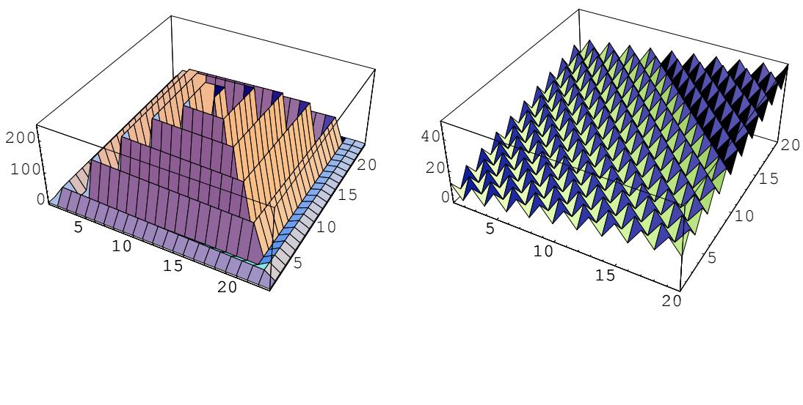
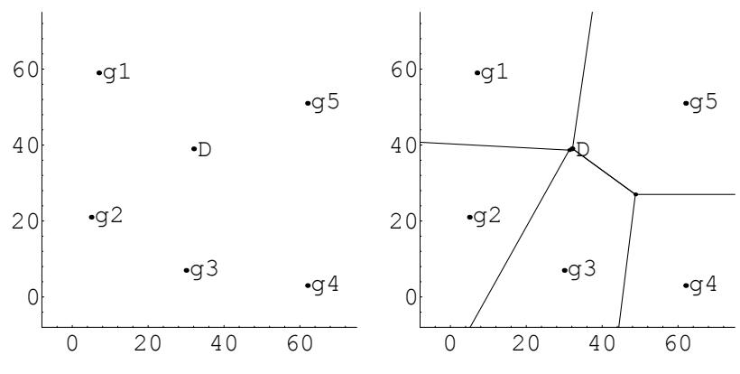
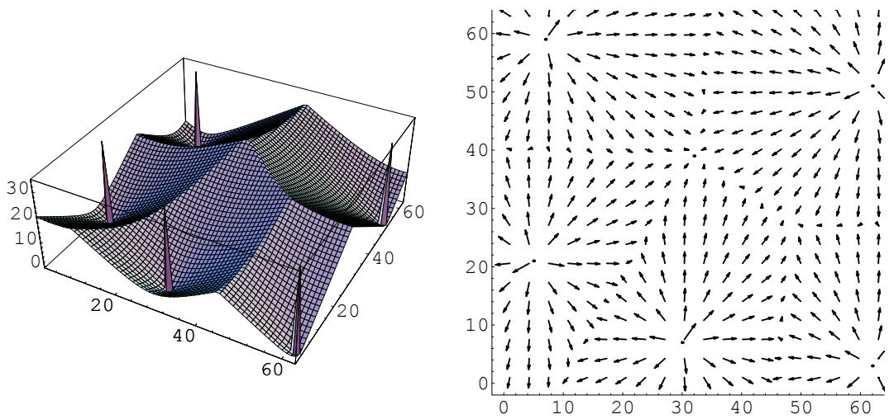

Urbana, IL 61801-2996 and the Modality of Fitness Landscapes

Jeffrey Horn and David E. Goldberg Illinois Genetic Algorithms Laboratory University of Illinois at Urbana-Champaign Urbana, IL 61801-2996

Genetic Algorithms (FOG , 1994 in Est

To appear in the proceedings of the Illinois Genetic Al orithms Laborator IlliGAL De artment of eneral En ineerin

# 104 South Mathews Avenue Phone: 217/333-2346

Jeffrey Horn   
Department of Computer Science   
University of Illinois at Urbana-Champaign   
117 Transportation Building   
104 South Mathews Avenue   
Urbana, IL 61801-2996   
Phone: 217/333-2346   
jeffhorn@uiuc.edu   
David E. Goldberg   
Department of General Engineering   
University of Illinois at Urbana-Champaign   
117 Transportation Building   
(i.e., number of local optima) of a   
Urbana, IL 61801-2996   
At such extremes our int   
the global opti

# . Most wor

erator. We extend the latter results by dening and implementing maximal partial deception in problems with k arbitrarily placed global optima. This allows us to create functions with multiple local optima attractive to crossover. The resulting maximally deceptive function has several local optima, in addition to the global optima, each with various size basins of attraction for hillclimbers as well as attraction for GA crossover. This minimum distance function seems to be a powerful new tool for generalizing deception and relating hillclimbers (and Hamming space) to GAs and crossover. search space are local optima, can be easy for both hillclimbers and GAs. Exploring the more realistic intermediate range between the extremes of modality, we construct local optima with varying degrees of "attraction" to our evolutionary algorithms. Most work on optima and their basins of attraction has focused on hills and hillclimbers, while some research has explored attraction for the GA's crossover tic algorithms (GAs) are robust adaptive systems that have been applied successfully to hard tion problems, $k$ oth articial and real world. Yet GAs do fail. When and why? The question of optima attractive to crossover. The resulting maximally deceptive function has several local optima, in addition to the global optima, each with various size basins of attraction for hillclimbers as well as attraction for GA crossover. This minimum distance function seems to be a powerful new tool for generalizing deception and relating hillclimbers (and Hamming space) to GAs and crossover.

# 1 Introduction

Genetic algorithms (GAs) are robust adaptive systems that have been applied successfully to hard optimization problems, both artificial and real world. Yet GAs do fail. When and why? The question of what makes a problem hard for a GA has received a good deal of attention  and some controversy  as of late. The controversy is largely a tempest in a teapot. If we are ever to understand how hard a problem GAs multimodalit and crosstalk but a si nicant amount of work remains. (1993a) suggests several quasi-separable dimensions of GA problem difficulty:

- Isolation - Misleadingness - Noise - Multimodality - Crosstalk

Important progress has been made (Goldberg, 1993b) in understanding the role of deception (the combination of solution isolation and suboptimum misleadingness), noise (both deterministic and stochastic), multimodality, and crosstalk, but a significant amount of work remains.

Some have suggested that we first create a fullfledged description of problem difficulty, with all the 2 Preliminaries: Landscapes and Optima route (Goldberg, 1993a, 1993b). The more usual method is to design or prescribe problems that maximally We make use of the paradigm of a tness landscape (Wright, 1988), which we dene here as a search space S, a metric, and scalar tness function dened over elements of S. Assuming the goal is to maximize tness, we can imagine the globally best solutions (the global optima, or \globals") as \peaks" in the search space. For the purposes of this paper, we dene local optimality as follows. We rst assume a non-negative-real valued, scalar tness function f(s) over xed length \`-bit binary string

# we mean a set of interconnected points of equal tness. That is,

We make use of the paradigm of a fitness landscape (Wright, 1988), which we define here as a search space $S$ tness function as havin no local o tima. The \nearest nei h $S$ r" relation assumes a metric on the search we cage the gobally best soutions the gobalptim, r globals"s peaks" i thesear s For the purposes of this paper, we define local optimality as follows. We first assume a non-negative-real valued, scalar fitness function $f ( s )$ over fixed length $\ell$ -bit binary strings $s$ $f ( s ) \in \Re \geq 0$ . Without loss of as the metric2 and as $f$ me k = 1. Thus a oint s with tness s reater than that of a $S$ its immediate region, with fitness function value strictly greater than those of all of its nearest neighbors. By region" we mean a set of interconnected points of equal ftness. That is, we treat as a single optimum the set of points related by the transitive closure of the nearest-neighbor relation such that a points are of equal 3 Minimum Modality Can Be Hard ftne function as having nolocaloptima. The "nearest neighbor" relation assume a metric n the search At one extre $d$ e of th $d ( s _ { 1 } , s _ { 2 } ) \in \Re \geq 0$ um we have unimodality. Unimodal fu $s _ { 1 }$ tion $s _ { 2 }$ ave only one local optimum, which is t $s ^ { \prime }$ refore the glob $s \in S , s \neq s ^ { \prime }$ It is well- $d ( s ^ { \prime } , s ) \leq k$ such problems can be hard wh $k$ n the optimum is isolated, with little or no information available elsewhere in the search space. Such isolated peaks on otherwise 
at tn $k = 1$ dscapes have $s$ en called nee $f ( s )$ n-a-haystack (NIAH) problems (Goldberg, 1989a), and are clearly sol $s$ able only by enumeration of the space. But i

# The requirement for equality could be relaxed to allow for tn2

At one extreme of the modality spectrum we have unimodality. Unimodal functions have only one local optimum, which is therefore the global optimum. It is well-known that such problems can be hard when the optimum issolate, with littlo oormation availabl esewherein thesearc spaceSucilae peaks on otherwise fat fitness landscapes have been called needle-in-a-haystack (NIAH) problems (Goldberg, 199a), and are clearly solvable only by enumeration of the space. But if we decrease the isolation of the single optimum, increase the size o its basin o attraction, and add information tolarger portions of the search space, intuition tells us that the search should become easier and shorter than enumeration. In particular,  we make he eni sear spaca sigle hi, where evey point  n a pat to thegoal must be exactl k = 1 bit dierent from the oint behind it and the oint ahead of it on the ath while function. But we showed otherwise in (Horn, Goldberg, and Deb, 1994).

In (Horn, Goldberg, and Deb, 1994), we constructed two different functions of $\ell$ -bit strings in which all points are on the path to the only optimum, but in which path length grows exponentially in $\ell$ . Thus even a 1-bit hillclimber is guaranteed not only to find the global optimum but to make constant progress toward it. However, for reasonably large $\ell$ $> 9 0$ , for example), the hillclimber, and many other local searchers, effectively will never converge to the global. Below we summarize one of the two constructions from the 1994 paper, namely the Root2path.

We choose a stepsize $k = 1$ to illustrate the construction of the Root2path. Each point on the path must be exactly $k = 1$ bit different from the point behind it and the point ahead of it on the path, while also being at least $k + 1 = 2$ bits away from any other point on the path.

The construction of the path is intuitive. If we have a Root2path $P _ { \ell }$ of dimension $\ell$ $=$ number of bits), we can basically double it by moving up two dimensions to $( \ell + 2 )$ as follows. Let $P _ { \ell }$ be a list of binary strings representing consecutive steps on the path (e.g., $P _ { 4 } = \left\{ 0 0 0 0 , 0 0 0 1 , 0 0 1 1 , . . . \right\} )$ . Make two copies of $P _ { \ell }$ , say copy00 and copy11. Add $^ { 6 } 0 0 ^ { \dprime }$ 2 j = 2 jP\` j + 1 (1) "11" to each point in copy $1 1 ^ { 3 }$ . Now each point in copy00 is at least two bits different from all points in For the dimensions in between the doublings, P\`+1; we can simply use the path P\` by $\ell + 2$ g a \0" to each point in P\`. If jP\`j is exponentional in \`, then jP\`+1j is exponential in \` + 1. $^ { 6 6 } 0 0 ^ { 9 }$ versus For the base case, we use the rst dimension \` = 1. Here we have only two points in t $^ { 6 6 } 0 1 ^ { 9 }$ arch space: 0 and 1. We put them both on the Root2path for \` = 1. Thus, P1 = f0; $1 1 ^ { 4 }$ , where 0 is the beginning and 1 is the end (i.e., the global optimum). $P _ { \ell + 2 }$ of dimension $\ell + 2$ o with every other incremental incre $P _ { \ell }$

$$
| P _ { \ell + 2 } | = 2 | P _ { \ell } | + 1
$$

For the dimensions in between the doublings, $P _ { \ell + 1 }$ , we can simply use the path $P _ { \ell }$ by adding a $" 0 "$ to each point in $P _ { \ell }$ . If $| P _ { \ell } |$ is exponentional in $\ell$ , then $| P _ { \ell + 1 } |$ is exponential in $\ell + 1$

For the base case, we use the first dimension $\ell = 1$ . Here we have only two points in the search space: 0 and 1. We put them both on the Root2path for $\ell = 1$ . Thus, $P _ { 1 } = \{ 0 , 1 \}$ , where 0 is the beginning and 1 is the end (i.e., the global optimum).

So with every other incremental increase in dimension $\ell$ , we have an effective doubling of the path length.We can solve the recurrence relation in Equation 1 exactly, but it is clear that the path length increases in proportion to $2 ^ { \ell / 2 }$ or $( { \sqrt { 2 } } ) ^ { \ell }$ . Thus the path length grows exponentially in $\ell$ with base $\approx 1 . 4 1 4$ although it is an ever-decreasing fraction of the space5.

We make one end of the path the global optimum, and adjust the fitnesses of the rest of the path so 3Thus the point \1001" in P\` would become the point \001001" in copy00 and \111001" in copy11.4 Alternatively, we can connect the beginning of copy00 to the beginning of copy11.5 an wh ere on or near the ath. 6In (Horn, Goldberg, & Deb, 1994), we call the opath points with their nilness function the nilness slope. Together the path plus the slope form $f ( s ) = f ( 0 0 0 0 . . . 0 ) - u ( s )$ tire sear $f ( 0 0 0 0 . . . 0 )$ is the fitness at the beginning of the path6 and $u ( s )$ is the unitation (number of ones) of string $s$

In (Horn, Goldberg, and Deb, 1994) we also showed how to extend this construction to create paths of stepsize $k > 1$ , where nonconsecutive points on the path are separated by at least $k + 1$ bits. Paths constructed this way are of order $O ( 2 ^ { \ell / ( k + 1 ) } )$ p , g ( $\ell$ for fixed $k$ ) then showed empirically that various types of one-bit hillclimbers do indeed take exponential time, in expectation, to climb such paths7.

  
the inte ers x and : x for the \lon ath" function. As $f _ { l p } \left( x , y \right)$ e Root2 ath and Fibonacci aths on an exponentially long path to the global optimum. Right: A maximally multimodal function, $f _ { m m , e a s y } ( x , y )$ that is easy for a GA to optimize.

We try to visualize a long path in two dimensions in Figure 1, left. Here the fitness is a function of the center. $x$ hus t $y$ $f _ { l p } ( x , y )$ tion of the two dimensional s iral ath has the same inductive form as those constructed in (Horn, Goldberg, and Deb, 1994), the two dimensional spiral path is generated by induction s iralin ath to achieve ath len ths of O $s ^ { 2 }$ earch s $s$ ace . A ain we can se arate n $x$ n-ad $y$ cent oints on the two dimens $s = 1$ s iral ath b an number k of ste s8 b sim l addin rin s to the s iral ever the path. Informally, the inductive step is to take a path of dimension $s$ , add a ring (or rather, square) of points around the outside, each with fitness 0, then add another ring of points and add them to the path, incrementing the fitness of every point on the $s$ -dimensional path by the number of new path points The problem of nding a maximally long path with $s + 2$ separation has some history, and is known as the \s $s$ ake-inthe-box" problem, or the design of distance preserving codes, in the literature on combinatorics (Preparata, 1974). Maximizing gthat are < O 2\` . Thus the longest paths we can ever nd will be O 2\`=c for some constant c  1. For the Root2path, c = 2 for k = 1. In (Horn, Goldberg, and Deb, 1994) we suggested the Fibonacci path, which yields a c = 1=Log2  1:44042 when k = 1, where  is the golden ratio. $O ( | \mathrm { s e a r c h ~ s p a c e } | )$ . Again, we can separate non-adjacent points We assume the metropolitan or city-block metric for this $k$ D spac e. $k$ increments of $s$ instead of every other increment.

The long path problem is clearly and demonstrably difficult for local searchers (that is, algorithms that search small neighborhoods with high probability, and larger neighborhoods with vanishingly small alo ithms e. . random mutation hillclimbin RMHC b reachin the lobal o timum usin several such long path problems are amenable to GA crossover. It is obvious from their inductive construction that these paths have structure. The same basic subsequences of steps are used over and over again on larcalultngaa elaryu rueguildiblockplta crossover (Holland, 1992). In particular, patterns such as $^ { 6 6 } 0 0 ^ { 9 }$ and $^ { 6 6 } 1 1 ^ { 9 }$ are common to all points on the (y-spa ph,an arevenvgaithei the pa.Alhueav measured solel as the number of local o tima is at best a rst order estimate of the amenabilit of the results (Horn, Goldberg, & Deb, 1994). These early results indicate that a GA with crossover alone $p _ { m } \ = \ 0 $ )outperforms $k = ~ 1$ step hillclimbers (e.g., steepest ascent, next ascent) and several mutation alogithms (e.g., random mutation hillclimbing (RMHC)) by reaching the global optimum using several 4 Maximum Modality Can Be Easy superior to hillimbing (i.e., finds the global in $< \ O ( 2 ^ { \ell / c k } )$ time, then we have found a problem that At the other extreme of the modality spectrum, what is the maximum number of local optima possible in a binary problem of size \`-bits? We assume minimum radius (1-bit) peaks, so that our requirem

imality is minimal. That is, a point is a local optimum if and only if all adjacent points have inferior tness values. We can calculate an upper bound on the number of such optima. Let p be the number of local \peaks". In an \`-bit problem, each peak must have exac

# pairings of optima and adjacent nonoptima. There are ex

At the other extreme of the modality spectrum, what is the maximum number of local optima possible in a binary problem of size $\ell$ -bits? We assume minimum radius (1-bit) peaks, so that our requirement for local otimality is minimal.That is, a point is a localoptimum f and only  all adjacent points haveieio fitness values. We can calculate an upper bound on the number of such optima.

Let $p$ be the number of local "peaks". In an $\ell$ -bit problem, each peak must have exactly $\ell$ immediate neighbors that are not local optima (call them "nonoptima"). Thus the number of adjacent pairs of optimum-nonoptimum is $p * \ell$ . That is, for a problem to have $p$ local optima it must have $p * \ell$ different pairings of optima and adjacent nonoptima. There are exactly $2 ^ { \ell } - p$ nonoptima. Each of these nonoptima can have at most $\ell$ fmm(s) = ( otherwise (2) $( 2 ^ { \ell } - p ) * \ell$ . We can increase $p$ until the number of optimum-nonoptimum pairs equals the maximum: $p * \ell = ( 2 ^ { \ell } - p ) * \ell$ f odd unitat $p = 2 ^ { \ell - 1 }$ eparated from each other by strings of even unitation, odd unitation strings are indeed local optima.

9We assume familiarit with fundamental conce ts of GA theor such as buil $2 ^ { \ell - 1 }$ blocks and schema anal sis at least to the extent presented in (Goldberg, 1989a). $f _ { m m } ( s )$ ther words, the number of optima cannot exceed the numbe $s$ of nonoptima. It is interesting to note that max

$$
f _ { m m } ( s ) = { \left\{ \begin{array} { l l } { 1 } & { { \mathrm { i f ~ } } \mathrm { O d d } ( u ( s ) ) } \\ { 0 } & { { \mathrm { o t h e r w i s e } } } \end{array} \right. }
$$

Sinceal strings of odd unitation are separated from each other by strings of even unitation, odd unitation strings are indeed local optima. Strings of odd unitation occupy exactly half the search space11.

up2 steps13. For any pup2 that decreases no faster than linearly in \`, and in particular for a constant pup2, the hillclimber will climb the hill in expected O(\`) steps14. A GA is also unlikely to have diculty in quickly optimizing this function15. In addition to being amenable to search by the GA's mutation operator, the function appears easy for crossover when we

$$
f _ { m m , e a s y } ( s ) = u ( s ) + 2 * f _ { m m } ( s )
$$

for an schem $f _ { m m , e a s y } ( s )$ ion of the schema's unitation number of ones in the dened bits . In a artition probability $p _ { u p 2 }$ of taking a step of size two or more bits uphill will climb to the global optimum in at most $\ell / p _ { u p 2 } \ \mathrm { s t e p s } ^ { 1 3 }$ he \`  o u $p _ { u p 2 }$ ned bit ositions = \`  o 2 lus twice $\ell$ ( ( )) ghe avera e contribution of s $p _ { u p 2 }$ ( ) p ( (arit of unitation function which will be 2  1 $O ( \ell )$ = ), p

A GA is also unlikely to have diffculty in quickly optimizing this function15. In addition to being fmm;easy (^s) = u(^s) + (\`  o)=2 + 1 (4) apply a static analysis of schema partitions. In every schema partition, the schema containing the global So the schemata with highest unitation will always be the winners of their partition competitions. Figure 1, right, is a visualization of a maximally multimodal function in two dimensions. Here the decision variables are the positive integers x and y, and the tness function is of order $o$ , the fitness of a schema $\hat { s }$ is equal to the unitation of the schema $\mathbf { \Psi } ( = \mathbf { \Psi } u ( \hat { s } ) )$ plus the average unitation of the $( \ell - o )$ undefined bit positions $( = ( \ell - o ) / 2 )$ 0 if Even(x + y) $f _ { m m } ( s )$ the parity of unitation function, which will be $2 * 1 / 2$

$$
\bar { f } _ { m m , e a s y } ( \hat { s } ) = u ( \hat { s } ) + ( \ell - o ) / 2 + 1
$$

of schema information for crossover (at least for binary coded integers).

The maximally multimodal function is interesting only because it points out that the modality of a search space, if measured solely as the nu $x$ mber $y$ f local optima, is at best a

$$
f _ { m m , e a s y } ( x , y ) = ( x + y ) + \left\{ \begin{array} { l l } { 1 0 } & { \mathrm { i f ~ } \mathrm { E v e n } ( x + y ) } \\ { 0 } & { \mathrm { o t h e r w i s e } } \end{array} \right.
$$

Just as in the case of binary strings, our 2-D formulation makes half the search space local optima while providing a constant gradient pointed straight at the global (for any $\geq 2$ -bit hillclimber) as well as plenty 14A hillclimber with a signicant pup2 is also expected to climb the Root2path in l

dberg, and Deb (1994) also showed how to construct the CubeRoot2path, a long path for hillclimbers of step size 2. A g p up2 p u p3 (p y g p ) p the maximally multimodal (easy) problem, (for hillclimbers of stepsize k) both sc

# MacWilliams and Sloane, 1977). We can calculate an upper bound by simply dividing the search s

, , y yp pp g g p , r =0 r that challenge the GA in a realistic and general manner) have intermediate modality. But it is not clear how to add modality to the long path problem, or to reduce the modality of the maximally multimodal function. For example, we might be tempted to generalize the work on maximum modality by maximizing 5.1 Background $k$ or more bits apart (i.e., each optimum has a local neighborhood of radius $\ge ( k - 1 )$ maximizing the number of local optima with neighborhoods of radius k is an open problem, work has $k$ roceeded alon the lines of measurin and controllin the number of o tima and their basins of attraassu $2 ^ { \ell }$ ion (or the \attractiveness" of the optima). Such work can be divis hillclimbing attraction and that which assumes GA crossover at to twoon. Th $\scriptstyle \sum _ { r = 0 } ^ { \lceil k / 2 \rceil - 1 } { \binom { \ell } { r } }$ whichapers analyzing local optima assume one type of algorithm or the other. We $k = 2$ ome background on both approaches, $2 ^ { \ell }$ t focus on GA crossover.

# 5.1.1 Hillclimbing

A number of recent papers dene peaks (i.e., local optima together with their $k$ sins of attraction) in terms of hillclimbing. Goldberg (1991) formally denes basins of attraction to a point x as all points x such that a given hillclimber has a non-zero probability of climbing to within some  of x if started within some -neighborhood of x. Jones and Rawlins (1993) introduce reverse hillclimbing and probabilistic ascent as techniques for dening the basin of attraction of a particular local optimum in a tness landscape for hillclimbers with known probabilitie

# basin of attraction dened by the

A number of recent papers define peaks (i.e., local optima together with their basins of attraction) in terms of hillclimbing. Goldberg (1991) formally defines basins of attraction to a point $x ^ { * }$ as all points $x$ such that a given hillclimber has a non-zero probability of climbing to within some $\epsilon$ of $x ^ { * }$ if started The literatu $\delta$ e on the attracti $x$ of peaks and regions in the landscape to the GA's crossover operator is largely based on Holland's schema theorem (Holland, 1992) and schema average tness calculations (Bethke, 1981). Goldberg (1987, 1989a, 1989b, 1989c) and later others (Whitley, 1991; Homaifar, Qi, and Frost, 1991; Deb, Horn, and Goldberg, 1993) dened and constructed deceptive landscapes, in which the GA should be attracted to suboptimal local optima and led away from the global optimum. Schema analysis h

# the GA-easy conditions

It is interesting to note that sphere packing with radius dk=2e  1 also provides an upper bound (within a factor of two) on the path length of (k  1)-step long path problems, since nonconsecutive steps on the path must be at least k bits apart. 18Like our maximally multimodal function, previous GA-easy functions contain local optima that can make the problem dicult for hillclimbing. It is interesting to note that according to our denition of local optimum, the Royal Road functions are unimodal. analysis has also been used to construct "GA-easy" functions (Wilson, 1991) which have large basins of attraction for the global optimum 18. More recently, Mitchell and Holland (1993) have begun to weaken the GA-easy conditions by limiting the number and order of schema partitions leading toward the global9.

A deceptive attractor (Whitley, 1991) is the suboptimal point D toward which a GA is (mis)led. In a particular schema partition, the schema containing the deceptive attractor is called the deceptive schema, while the schemata containing the globa

# the global schemata have low tness

One must be careful in defining partial deception. It is easy to weaken the requirements for full deception such that a GA can easily find the global optimum of some functions meeting those requirements. We briefly present the definitions we use in this paper.

 Type I deceptive { global schemata lose to all other sche $D$ ta (Bethke, 1981). particular schema partition, the schema containing the deceptive attractor is called the deceptive schema,  Type II deceptive { deceptive schema wins over all other schemata (Goldberg, 1987). partition is a partition in which the deceptive schema has a high (schema average) fitness and/or all of the global schemata have low fitness. The rather vague concept of deceptive schemata "beating" global schemata, in terms of schema average fitness, has been interpreted in several different ways by different reIt is not yet clear which, if any, of these denitions implies more diculty for the GA on partially deceptive landscapes

•Type I deceptive - global schemata lose to all other schemata (Bethke, 1981). In the design of maximally misleading functions, our goal is to choose D and dene the lan their locations and perhaps their tness value). In the case of a single global optimum g, the above itions a

It is not yet cear which, iany, f thesedetins mpls moe diffcuy for the GA on partially deiv landscapes21. For fully deceptive functions, all partitions of order $< \ell$ are type II and III deceptive22. But in general (i.e., partial deception), deceptive and global schemata can be placed anywhere in the fitness ordering of a partition's schemata.

In the design of maximally misleading functions, our goal is to choose $D$ and define the landscape such that the GA converges to $D$ with high probability. We assume that we are given one or more globals (that is, their locations and perhaps their fitness value). In the case of a single global optimum $g$ , the above accordin to some scalar measure of dece tion is roblematic. $D$ Goldber reco nized the need t $g$ eneralize 1991). We can then construct fully deceptive functions in which the schema containing $D$ is the winner of 1991 call such limited dece tion reduced order k dece tion. Althou h it has one b $\ell$ other names this 199b, 1990). Full deception is clearly maximally misleading to a GA. It is also clearly bimodal, with local optima $2 3$ at $D$ and at $g$ . To add more optima, and basins of GA attraction, we need to define partial A functi

inct global optima must dier in at least one bit position. The order one schema partitions dened at each of those 21We do note, however, that types I and II deception conditions imply type III. 22Such partitions can also be considered type I deceptive (at least for some of the fully deceptive functions constructed in the literature) if we discount the global optimum from schema average tness calculations, a modication suggested and justied later in this paper.23 (1991) call such limited deception reduced order k deception. Although it has gone by other names, this kind of partial deception is most widely known as bounded deception. A problem has bounded deception of order $k$ if and only if all partitions of order $( k - 1 )$ or less are deceptive 24. Partitions of order $\geq k$ might or might not be deceptive. Thus for $k = \ell$ , bounded deception is full deception. Goldberg, Deb, and Korb (1991) construct examples of boundedly deceptive problems by concatenating some number $m$ of fully deceptive subfunctions of length $\ell _ { s }$ to get an $( m * \ell _ { s } )$ -bit function of order $\ell _ { s }$ bounded deception. Such functions have $2 ^ { m }$ local optima, one of which is global.

The order $k$ of bounded deception establishes a partial order over functions. We can safely say that a function of order $k$ bounded deception is at least as difficult for a GA as a function of order $k ^ { \prime } < k$ bounded deception, all other problem dimensions (e.g., noise, crosstalk) being roughly equal.

Otherattempts todefine, quantify, o order thedegreeof partialdeception have resulted inunnecessarily remains undiminished. A function of low order k bounded dece tion is robabl more dicu $\ell \ = \ 2 0$ GA functin which all partitons dened over therst ten bit lead towar the eceptivettractor ( ye II deception) and all partitions defined over the last ten bits lead toward the global optimum. Despite this The above example points out the importance of both number and order of deceptive partitions. As discussed above, order k bounded deception only allows comparisons between functions with the same 1991), we do not want to call such problems highly deceptive. Any function with low order partitions that lead toward the global optimum (i.e., any function with building blocks) is amenable to GA search. Adding additional misleading bits does not necessarily make the problem any more deceptive, let alone p g g ( g, , , ; , , remains undiminished. A function of low order $k$ bounded deception is probably more difficult for a GA than is Grefenstette's function with some arbitrarily large number of misleading bits, even though the 2 u(s)  \`. This leads to a symmetric function of unitation, fbip(ufld(s)).

p fbip f ld , y p g ( ) unitation space, and \`= $k$ deceptive attractors (all points consisting of half ones and half zeros, for even \`). They also showed that the full d $\binom { \ell } { o }$ tion enforced o $o \mathrm { ~ < ~ } \operatorname* { m i n } ( k _ { 1 } , k _ { 2 } )$ ation fu $k _ { i }$ tion led to partitions in the unfolded function in which the schemata containing the most deceptive attractors won (type II deception). This occurred in all partitions where the schemata containing the globals (t $\&$ global schemata) could be distinguished from the schemata containing the deceptive attractors. Thus, at order one, where the two $u _ { f l d } ( s )$ ta ...#1#... and ...#0#... compete, there was no possible distinctio $u _ { f l d } ( s ) = u ( s ) - ( \ell - u ( s ) ) =$ d $u ( s ) - \ell$ optima, and thus no preference between the schema $f _ { b i p } ( u _ { f l d } ( s ) )$ had equal tness). But at order two, and above, the de $f _ { b i p } \circ u _ { f l d }$ ttractors could be distinguished, hence ...#01#... and ...#10#... beat unitation space, and $\left( { \ell \atop \ell / 2 } \right)$ deceptive attractors (all points consisting of half ones and half zeros, for even $\ell$ ). They also showed that the ful deception enforced on the folded unitation function led to partitions in the unfolded function in which the schemata containing the most deceptive attractors won (type II deception). This occurred in all partitions where the schemata containing the globals (the global schemata) could be distinguished from the schemata containing the deceptive attractors. Thus, at order one, where the two schemata ..#1#... and . $\# 0 \# \ldots$ compete, there was no possible distinction between the globals and the deceptive optima, and thus no preference between the schemata (i.e., they had equal fitness). But at order two, and above, the deceptive attractors could be distinguished, hence .#01#.…. and .…#10#…. beat Deceptive partition here means that the winner of a partit

It is interesting to note that Grefenstette's (1992) function is not only unimodal by our denitions, but is also, like the partial deception at best (or worst!). By constraining the function to be of folded unitation, Goldberg, Deb, and Horn were able to make the overall function maximally deceptive by enforcing full deception in the folded function. They were then able to examine its implications in the unfolded space. The result was a function that had deceptive attractors located maximally far from both globals, and in which the deceptive schemata won in all partitions (type II), up to order $\ell$ , in which it was possible to distinguish globals from deceptives.

# them be dG bits. How do we choose a d

We first generalize the work of Goldberg, Deb, and Horn on bipolar deceptive functions to the case of bi-global deceptive functions. We do not assume a function of unitation, folded or not, nor do we assume bipolarity (i.e., where the two globals are full complements of each other). We only assume two globals arbitrarily placed in the space.Rather than first hoosing the deceptive attractor, as is usually done, we will instead try to maximize deception and see what deceptive attractor emerges. We use such terms as "maximal deception" loosely at first, and define them rigorously later.

Let the two arbitrarily chosen globals in an $\ell$ bit problem be $G = \{ g _ { 1 } , g _ { 2 } \}$ , and let the distance between them be $d _ { G }$ bits. How do we choose a deceptive attractor $D$ that maximizes deceptive partitions? An com lementar bit settin s for the \`  d bit ositions of D in which and a ree and next consider distinguish $D$ from the $G$ . We shall call these simply resolvable partitions. We now try to place $D$ so as to maximize the number of resolvable partitions at every order $o$

We first note that there are $( \ell - d _ { G } )$ bits in which the two globals agree. Intuitively, our deceptive order o schema partition there are o partitions . For exactly o of these partitions, we cannot distinguish D from g2, sinc $( \ell - d _ { G } )$ ned bits are chosen from the dD1 bits that distinguish D from g1 and position in $D$ to be the complement of the globals' bit setting gives one more bit position in which deceptive schemata can be distinguished from global schemata. Thus giving $D$ the complement of the $( \ell - d _ { G } )$ global in which we cannot distinguish D from g1. So the total number of resolvable partitions, Nrp(o) at order o complementary bit settings for the $( \ell - d _ { G } )$ bit positions of $D$ (in which $g _ { 1 }$ and $g _ { 2 }$ agree) and next consider only how to set the $d _ { G }$ Nrp(o) = dGo    1o  +  Go

Let $d _ { 1 } ^ { D }$ be the Hamming distance from $D$ to $g _ { 1 }$ . Then $d _ { G } - d _ { 1 } ^ { D }$ is the distance from $D$ $g _ { 2 }$ . At any To ma $o$ imize Nrp we must minimizedD $\scriptstyle { \binom { d _ { G } } { o } }$ um of the two binomial coedGdD $\left( { \begin{array} { l } { d _ { 1 } ^ { D } } \\ { o } \end{array} } \right)$ ts in the square brackets above. distinguish $D$ from $g _ { 2 }$ , since all $o$ defined bits are chosen from the $d _ { 1 } ^ { D }$ bits that distinguish $D$ from $g _ { 1 }$ and of their sum will occur when $D$ D = d $g _ { 2 }$  dD1 ) dD1 = dG=2, for even dG, and dD1 = bd $\left( { \begin{array} { l } { d _ { G } - d _ { 1 } ^ { D } } \\ { o } \end{array} } \right)$ dG=2e, for attractor lies equally distant fro $D$ g1 an $g _ { 1 }$ g2, which means it is maximally minimally dist $N _ { r p } ( o )$ m G. Her $o$ w

$$
\begin{array} { r } { N _ { r p } ( o ) = \binom { d _ { G } } { o } - \left[ \binom { d _ { 1 } ^ { D } } { o } + \binom { d _ { G } - d _ { 1 } ^ { D } } { o } \right] . } \end{array}
$$

Note that $N _ { r p }$ have maximized the resolvable artitions in the sense that we have the maximum number of res $\left( { \begin{array} { l } { d _ { 1 } ^ { D } } \\ { o } \end{array} } \right)$ e partitions at every order. Assu $d _ { 1 } ^ { D }$ that $\left( { \begin{array} { l } { d _ { G } - d _ { 1 } ^ { D } } \\ { o } \end{array} } \right)$ ake all resolvable partit $d _ { 1 } ^ { D }$ s deceptive, in of their sum will occur when $d _ { 1 } ^ { D } = d _ { G } - d _ { 1 } ^ { D } \Rightarrow d _ { 1 } ^ { D } = d _ { G } / 2$ , for even $d _ { G }$ , and $d _ { 1 } ^ { D } = \lfloor d _ { G } / 2 \rfloor$ $\lceil d _ { G } / 2 \rceil$ , for odd $d _ { G }$ . That is, we will have the maximum possible number of resolvable partitions when we our deceptive attractor lies equally distant from $g _ { 1 }$ and $g _ { 2 }$ , which means it is maximally minimally distant from $G$ . Here We assume throughout this paper that (m) $D$ 0 for m > $G$ of $k$ points as the minimum of the distances from $D$ 27In the bi-gl $g _ { i } \in G$ e $1 \leq i \leq k$ lways be dGdG=2 such points for even dG, and 2  dGbdG=2c s $G$ h points for odd dG. For the purposes of this paper, we assume that when the maxi $G$ al

itrarily choose a single deceptive attractor from that set. We could also choose the entire set or some subset to be the of resolvable partitions at every order. Assume that we can make all resolvable partitions deceptive, in of this p ap er. that a function $f _ { 1 }$ with more deceptive partitions at every order $o < \ell$ than another function $f _ { 2 }$ is more misleading to a GA, all other problem dimensions being roughly equal. Thus we are suggesting another

In the section above we showed that to maximize the number of resolvable partitions at every order in a bi-global problem, we should choose the deceptive attractor to be the point that is maximally minimally distant from the two globals. Such a result is meaningless if we cannot dene a function that is actually misleading to a GA in those resolvable partitions. In other words, is it possible to make all the resolvable partitions deceptive? Or does this lead to too many constraints? In this section we construct a function that satises our deceptiv

# a function as the tness function itself. That is, let the tness of a point/str

In the section above we showed that to maximize the number of resolvable partitions at every order in a bi-global problem, we should choose the deceptive attractor to be the point that is maximally minimally distant from the two globals. Such a result is meaningless if we cannot define a function that is actually misleading to a GA in those resolvable partitions. In other words, is it possible to makeal the resolvable partitions deceptive? Or does this lead to too many constraints? In this section we construct a function that satisfies our deceptive conditions in all of the resolvable partitions.

The use of maximal minimal distance to $G$ in choosing our deceptive attractor suggests the use of such fmdG (s) = ( s otherwise (8) to the nearest global. Let us call such a minimum distance function simply $f _ { m d } ( s )$

$$
f _ { m d } ( s ) = \operatorname* { m i n } _ { \forall g \in G } H ( s , g )
$$

optim $H ( s , g )$ mdG(s) and indeed must be the global $s$ ptimum of fm $g$ (s). This is true by denition of D as the point of maximal min-dist. $f _ { m a x }$ to get a function of minimum distance "plus globals":

$$
f _ { m d G } ( s ) = { \left\{ \begin{array} { l l } { f _ { m a x } } & { { \mathrm { i f ~ } } s \in G } \\ { f _ { m d } ( s ) } & { { \mathrm { o t h e r w i s e } } } \end{array} \right. }
$$

The min-dist function, with globals, $f _ { m d G } ( s )$ , has some very interesting properties. Like trap and unitation functions, it is easy to define, is readily visualized has mostly lnear gradients, and is amenable to schema analysis2. Our first observation is that the max-min-dist deceptive attractor is clearly a local optimum of $f _ { m d G } ( s )$ and indeed must be the global optimum of $f _ { m d } ( s )$ . This is true by definition of $D$ as the point of maximal min-dist.

Next we perform a modified schema analysis of $f _ { m d G } ( s )$ looking for deceptive partitions. Our modification to regular shema analysisis this: we ignore the global ptima.That is, weassume the ftness  0 rankin of schemata $f _ { m d } ( s )$ a com etitio $f _ { m d G } ( s )$ ion. To see wh this is so remember $f _ { m a x }$ the tness of a schema s^ of s is the avera e distance to the nearest lobal over all strin s instantiatin s^. Thus the $f _ { m a x }$ in order to meet deception conditions on schema average fitnesses. We are not very interested in such 28We note that the bipolar deceptive function (Goldberg, $f _ { m a x }$ & Horn, 1992; Deb, Horn, & Goldberg, 1993) is also a maximally deceptive function by our denition above. And a maximally deceptive function for two (k = 2) bipolar globals, and Deb Horn and Goldber 1993 . 29The function fmdG(s) can be seen as a special case of trap functions (Deb and Goldberg, 1991) or as a generali

itley's fully deceptive function (Whitley, 1991) to multiple global $g _ { 1 }$ and $g _ { 2 }$ . As before, we ignore the bit positions in which $g _ { 1 }$ and $g _ { 2 }$ agree, since considering the fitness contributions of these bits does not change the ranking of schemata within a competition partition. To see why this is so, remember that the fitness of a schema $\hat { s }$ of $f _ { m d } ( s )$ is the average distance to the nearest global over all strings instantiating $\hat { s }$ . Thus the bit positions at which $g _ { 1 }$ and $g _ { 2 }$ agree always add the same amount to the average fitness of each schema within a particular partition, regardless of the schema.

We assume $\ell$ bit positions in which $g _ { 1 }$ g $g _ { 2 }$ differ. We now calculate exact schema average fitnesses for any schema in an order $o$ partition. Let $\hat { s }$ be a schema in the given order $o$ partition, and let $d _ { 1 } ^ { s }$ be the distance from $\hat { s }$ to global $g _ { 1 }$ , making $( o - d _ { 1 } ^ { \hat { s } } )$ the distance from $\hat { s }$ to $g _ { 2 }$ . Note that $0 \leq d _ { 1 } ^ { s } \leq o$ . To calculate the average fitness of $\hat { s }$ in $f _ { m d } ( s )$ , we add up the fitnesses of all strings contained in $\hat { s }$ and divide by the number of such strings:

$$
\bar { f } _ { m d } ( \hat { s } ) = \frac { \sum _ { s \in \hat { s } } f _ { m d } ( s ) } { 2 ^ { \ell - o } }
$$

We concentrate now on the sum in the numerator, since that is what wll order the average fitnesses of schemata in the partition. The $2 ^ { \ell - o }$ X s^ \`o  are closest to $g _ { 1 }$ and those that are closest to $g _ { 2 }$ . Let $d$ be the number of bit positions from the $\ell - o$ undefined bit positions at which a particular string $s$ disagrees with $g _ { 1 }$ . That is, the total distance from $s$ to $g _ { 1 }$ $d + d _ { 1 } ^ { s }$ . When this total distance is less than half of $\ell$ , then $s$ 2s^ $g _ { 1 }$ than to $g _ { 2 }$ , and the these two $s$ sums together, we $g _ { 1 } \colon d + d _ { 1 } ^ { s }$ act schema average $\scriptstyle { \binom { \ell - o } { d } }$ ss of any s $\hat { s }$ ema s^ in $d$ n order o partition $g _ { 1 }$ fmd(s) $\ell - o$ undefined bits of the partition. Furthermore, $g _ { 1 }$ will be the closest global to $s$ for $d = 0$ up to $d + d _ { 1 } ^ { \hat { s } } = \lfloor \ell / 2 \rfloor \Rightarrow d \leq \lfloor \ell / 2 \rfloor - d _ { 1 } ^ { \hat { s } }$ . Thus the total contribution of strings near $g _ { 1 }$ to the average fitness of $\hat { s }$ is

$$
\sum _ { d = 0 } ^ { \lfloor \ell / 2 \rfloor - d _ { 1 } ^ { \hat { s } } } ( d + d _ { 1 } ^ { \hat { s } } ) \binom { \ell - o } { d }
$$

We can show that this sum increases as d1 approaches d1 = bo=2c froms^ s^ $g _ { 2 }$ = 0 and as it approaches $\left( \ell - \left( d + d _ { 1 } ^ { s } \right) \right)$ rom d1 = o. Thus the mo $g _ { 2 }$ maximally minimally d $\left( \lfloor \ell / 2 \rfloor - d _ { 1 } ^ { s } + 1 \right) \leq d \leq \left( \ell - o \right)$ schemata containing the globals, the higher its average tness. In particular, the maxim $\hat { s }$ um of fmd(^s) $o$ occurs at d1 $f _ { m d } ( s )$ 2e

$$
2 ^ { \ell - o } { \bar { f } } _ { m d } { \bigl ( } { \hat { s } } { \bigr ) } = \sum _ { d = 0 } ^ { \lfloor l / 2 \rfloor - d _ { 1 } ^ { \hat { s } } } { \bigl ( } d + d _ { 1 } ^ { \hat { s } } { \bigr ) } { \Bigl ( } _ { d } ^ { \ell - o } { \Bigr ) } + \sum _ { d = \lfloor \ell / 2 \rfloor - d _ { 1 } ^ { \hat { s } } + 1 } ^ { \ell - o } { \bigl ( } \ell - d - d _ { 1 } ^ { \hat { s } } { \bigr ) } { \Bigl ( } _ { d } ^ { \ell - o } { \Bigr ) }
$$

We can show that this sum increases as $d _ { 1 } ^ { s }$ approaches $d _ { 1 } ^ { s } ~ = ~ \lfloor o / 2 \rfloor$ from $d _ { 1 } ^ { s } ~ = ~ 0$ and as it approaches $d _ { 1 } ^ { s } ~ = ~ \lceil o / 2 \rceil$ from $d _ { 1 } ^ { \hat { s } } ~ = ~ o$ . Thus the more maximally minimally distant a schema is from the schemata containing the globals, the higher its average fitness. In particular, the maximum of ${ \bar { f } } _ { m d } ( { \boldsymbol { \hat { s } } } )$ occurs at $d _ { 1 } ^ { s } = \lceil o / 2 \rceil$ ive a $d _ { 1 } ^ { s } = \lfloor o / 2 \rfloor$ t

e tive attractor ossibl have at a iven order o? The $f _ { m d } ( s )$ sis is similar to our revious anal sis. Let dD be the distance from a dece tive attractor D to lobal $D$ timum with \`-bits of se aration between containing the globals. Since $f _ { m d } ( s )$ maximizes the number of resolvable partitions at every order, it also therefore maximizes the number of partitions where the global schemata lose to the deceptive schema (type 1 p g 1 , y o=2 y W $\ell$ partitions, the global schemata lose to all other schemata30. Thus $f _ { m d } ( s )$ \`dD1  dD1 \`

Third, the boveresult mplie that the winnig shema (i, superior toal thers)in every partii s the schema that is maximally minimally different from the global schemata. If the winning schema contains the deceptive attractor $D$ , the partition is type II deceptive. How many type $\mathrm { I I }$ deceptive partitions can a deceptive attractor possibly have, at a given order $o$ ? The analysis is similar to our previous analysis. Let $d _ { 1 } ^ { D }$ tomi $D$ to global optimum $g _ { 1 }$ with $\ell$ bits of separation between $g _ { 1 }$ and $g _ { 2 }$ . Assume an even partition order $o$ . We can choose half the order $o$ bit positions, from among the $d _ { 1 } ^ { D }$ bit positions in which $D$ $g _ { 1 }$ differ, in exactly $\binom { d _ { 1 } ^ { D } } { o / 2 }$ ways. We can choose the other $o / 2$ bits, from among the $\ell - d _ { 1 } ^ { D }$ bit positions that differ from $g _ { 2 }$ , in exactly $\scriptstyle { \binom { \ell - d _ { 1 } ^ { D } } { o / 2 } }$ ways. So there are $\binom { d _ { 1 } ^ { D } } { o / 2 } \left( \begin{array} { l } { \ell - d _ { 1 } ^ { D } } \\ { o / 2 } \end{array} \right)$

  
The function s is therefore maximall d $k = 5$ ive accord $G = \left\{ ( 7 , 5 9 ) , ( 5 , 2 1 ) , ( 3 0 , 7 ) , ( 6 2 , 3 ) , ( 6 2 , 5 1 ) \right\}$ tion a maximally minimally distant point at $D = ( 3 2 , 3 9 )$ . Right: The Voronoi diagram of the set $G$

partitions of even order $o$ in which the deceptive schema wins. Similarly, for odd order $o$ partitions this number is $\binom { d _ { 1 } ^ { D } } { \lfloor o / 2 \rfloor } \binom { \ell - d _ { 1 } ^ { D } } { \lceil o / 2 \rceil } + \binom { d _ { 1 } ^ { D } } { \lceil o / 2 \rceil } \binom { \ell - d _ { 1 } ^ { D } } { \lfloor o / 2 \rfloor }$ It is clear that the number of type II deceptive partitions is maximally minim $d _ { 1 } ^ { D } = \ell - d _ { 1 } ^ { D } , \Rightarrow d _ { 1 } ^ { D } = \ell / 2$ e set G i $\ell$ order to maxim $\lfloor \ell / 2 \rfloor$ misl $\lceil \ell / 2 \rceil$ he GA. U $\ell$ fortunately the anal $D$ s used above becomes much more complicated when applied to k globals. With more than two globals w $f _ { m d } ( s )$ the symmetry of bit position agreement/disagreement (where agreement with g1 at a position me

# While we are continuing $k$ o explore

We would like to immediately generalize our results to the case of $k$ globals placed arbitrarily. That is, given any set $G$ of $k$ globals in an $\ell$ -bit problem, we should place the deceptive attractor(s) at those points maximally minimally distant from the entire set $G$ in order to maximally mislead the GA. Unfortunately the analysis used above becomes much more complicated when applied to $k$ globals. With more than two globals we lose the symmetry of bit position agreement/disagreement (where agreement with $g _ { 1 }$ at a Voronoi dia ram of G shown on $g _ { 2 }$ e ri ht of Fi ure 2. Since the line $d _ { 1 } ^ { D }$ a Voronoi dia $g _ { 1 }$ m divide the $\ell - d _ { 1 } ^ { D }$ bits away from $g _ { 2 }$ ).

m the nearest two lobals D must lie at an intersection of $k$ least three Voronoi lines. results so far. It is instructive to visualize the spatial relationship of the deceptive attractor $D$ (the maxmin-dist point) to the set $G$ of $k$ globals. We therefore return to our use of two dimensional analogues of our binary search spaces and functions. In Figure 2 we show $k = 5$ global optima located at grid positions $G = \{ ( 7 , 5 9 ) , ( 5 , 2 1 ) , ( 3 0 , 7 ) , ( 6 2 , 3 ) , ( 6 2 , 5 1 ) \}$ min q x  x 2  2 $\{ x , y \}$ each taking values in the range $\left( 0 . . 6 3 \right)$ 8(xg;yg )2G $G$ $D = \left( 3 2 , 3 9 \right)$ as shown on the let of Figure 2. Interestingly, this point lies at the intersection of Voronoi lines in the Noting that the max $G$ mum value is fmd(D)  32:0156, we choose fmax to be 34. space into neighborhoods of elements of $G$ and their nearest neighbors, and thus lie on points equidistant from the nearest two globals, $D$ must lie at an intersection of at least three Voronoi lines.

To better illustrate the relationship between the Voronoi diagram and our maximum minimum distance criterion, we redefine $f _ { m d }$ to be a function of integers $x$ and $y$ rather than of binary strings:

$$
f _ { m d } ( x , y ) = \operatorname* { m i n } _ { \forall ( x _ { g } , y _ { g } ) \in G } \sqrt { ( x _ { g } - x ) ^ { 2 } + ( y _ { g } - y ) ^ { 2 } }
$$

Noting that the maximum value is $f _ { m d } ( D ) \approx 3 2 . 0 1 5 6$ , we choose $f _ { m a x }$ to be 34.

  
the lines of the Voronoi diagra $f _ { m d G } ( x , y )$ w each local optimum (except the globals) occurs at intersections of such lines. By denition of fmd(x; y) and Voronoi diagrams, this must be the case. Thus $f _ { m d G } ( x , y )$ i

$$
f _ { m d G } ( x , y ) = \left\{ \begin{array} { l l } { 3 4 } & { \mathrm { i f ~ } ( x , y ) \in G } \\ { f _ { m d } ( x , y ) } & { \mathrm { o t h e r w i s e } } \end{array} \right.
$$

But a a $f _ { m d G } ( x , y )$ f interest in the stud of GA dicult and multimodalit the min-dist function the lines of the Voronoi diagram, and how each local optimum (except the globals) occurs at intersections schema anal sis of s is $f _ { m d } ( x , y )$ ted b the interactions of the multi le lobals. e can however function $f _ { m d } ( x , y )$ leads to an interesting, rugged, multimodal landscape with apparent basins of attraction for hillclimbers. To see that there are indeed basins of attraction for the local optima, we plot the local gradients of $f _ { m d } ( x , y )$ on the right of Figure 3. As expected, these gradients point away from the nearest dece tive attractor. Let s^ be the schema containin the dece tive attractor and let s^ be the schema up to the nearest ridge and thence to a local optimum. Finally we note that the max-min-point $D$ seems to have the largest basin of attraction (of all optima shown) for a simple hillclimber.

p D g i i , ( i ), g $f _ { m d G } ( s )$ with $k$ globals must be misleading to the GA's crossover operator as well as to mutation. The schema analysis of $f _ { m d G } ( s )$ i f 1; 2; ; kg, ( ) j g (0  dj  o) between s^i and s^j. Finally, for each possible setting s of the (\`  o) bits undened in this partition, we associate anoth

Assume any order $o$ resolvable partition in an $\ell$ -bit problem with $k$ globals. Let $D$ be our choice of deceptive attractor. Let $\hat { s } _ { D }$ be the schema containing the deceptive attractor and let $\hat { s } _ { i }$ be the schema containing31 global $g _ { i }$ $1 \leq i \leq k$ . We define $d ^ { \vec { D } } = \{ d _ { 1 } ^ { \bar { D } } , d _ { 2 } ^ { D } , . . . , d _ { k } ^ { D } \}$ to be the vector of distances from the deceptive schema $\hat { s } _ { D }$ to each of the global schemata $\hat { s } _ { i }$ .Thus $d _ { i } ^ { D }$ , where $0 \leq d _ { i } ^ { D } \leq o \}$ ), is the Hamming distance from $\hat { s } _ { D }$ to $\hat { s } _ { i }$ , defined only over the $o$ fixed bit positions. We also define similar distance vectors for each of the global schemata $\hat { s } _ { i }$ $\vec { d ^ { i } } = \{ d _ { 1 } ^ { i } , d _ { 2 } ^ { i } , . . . , d _ { k } ^ { i } \}$ , for $( i \in 1 . . k )$ where $d _ { j } ^ { i }$ is the Hamming distance $( 0 \leq d _ { j } ^ { i } \leq o )$ between $\hat { s } _ { i }$ and $\hat { s } _ { j }$ . Finally, for each possible setting $s$ of the $( \ell - o )$ bits undefined in this partition, we associate another vector of distances to the globals: $\vec { d _ { s } } = \{ d _ { 1 } ^ { s } , d _ { 2 } ^ { s } , . . . , d _ { k } ^ { s } \}$ , where $d _ { i } ^ { s }$ is the

Now if d  $0 \leq d _ { i } ^ { s } \leq \ell - o )$ nents (that $s$ s dj  dj , 8j 2 1:: $g _ { i }$ , for a pa $( \ell - o )$ global gi, then clearly fmd(^sD) > fmd(^si), and $s$ he

ater in all k components) to all k of the \~di, then t $\hat { s } _ { i }$ deceptive schem $2 ^ { \ell - o }$ ill be super $s$ r to all the global schemata i $\hat { s } _ { i }$ that partiti $s$ n. Such a partition would thus b $\vec { d } _ { s }$ ype III deceptive. To maximize th $\vec { d } ^ { i }$ num $\hat { s } _ { i }$ r of such partitions, we should try to increase the number of partitions in which the deceptive schema is as dierent as possible $s$ from all of the global schemata. Note that \~dD  \~di is only a sucient conditi $s \in \hat { s } _ { i }$ type III deceptio $2 ^ { \ell - o }$ a partition. Thus the number of p ${ \bar { f } } _ { m d } ( { \hat { s } } _ { i } )$ s satisfying \~dD $\bar { f } _ { m d } ( \hat { s } _ { D } )$ only a lower bou $\vec { d } _ { s }$ on t $d ^ { \vec { D } }$ n

more p $d ^ { \vec { D } } \geq \vec { d ^ { i } }$ at every order) by the ma $d _ { j } ^ { D } \geq d _ { j } ^ { i }$ st $\forall j \in 1 . . k )$ than by any other strin $g _ { i }$ This in turn $\bar { f } _ { m d } ( \hat { s } _ { D } ) > \bar { f } _ { m d } ( \hat { s } _ { i } )$ max-min-dist point D will turn out to be $i$ he most attractive loc $d ^ { \vec { D } }$ optimum for GA crossover on $k$ e min-dist function $k$ ith k g $\vec { d ^ { i } }$ , then the deceptive schema will be superior to all the global fmdG ( ) , g g p p g , of such partitions, we should try to increase the number of partitions in which the deceptive schema is as different as possible from all of the global schemata. Note that $d ^ { \vec { D } } \geq \vec { d ^ { i } }$ is only a sufficient condition for type III deception in a partition. Thus the number of partitions satisfying $d ^ { \vec { D } } \geq \vec { d ^ { i } }$ is only a lower bound ield km lobal o tima for the full function. Goldber Deb and Horn 1992 used such a construction to at more partitions at every order) by the max-min-dist point $D$ than by any other string. This in turn suggests that the max-min-dist point $D$ will turn out to be the most attractive local optimum for GA crossover on the min-dist function with $k$ globals.

The $f _ { m d G } ( s )$ function, although general with respect to the number and placement of globals, can be a sim le GA33 this concatenation of subfunctions enerated a sur risin l lar e number of o $r _ { g , i }$ a34. global $g _ { i }$ . Thus $f _ { m d } ( s )$ would be defined as before outside of the $r _ { g , i }$ -bit neighborhoods of each global. Within each neighborhood, however, the $f _ { m d G } ( s )$ could be a plateau of optimal fitness, or a hill leading to 6 Conclusions $m$ copies of $f _ { m d G } ( s )$ , each with $k$ globals. This would yield $k ^ { m }$ global optima for the full function. Goldberg, Deb, and Horn (1992) used such a construction to Modality by itself, if dened solely as the number of local optima, actually tells us little about the diculty of searching a space. Similarly, full deception and GA-easiness on uni- or bimodal landscapes tell us only $1 / 2 \%$ the ex $2 ^ { 3 0 }$ me boundaries of GA success and failure. But maximally deceptive multimodal functions allow us to embed deception in mu $( 5 0 \% )$ re rugged and general landscapes, and to dene arbitrarily sized and spac $\mathrm { G A ^ { 3 3 } }$ cal optima and their basins of attraction to a GA. However, generalizing the denition

# partially orders proble

Moaly ee leyltituallyeut y of searching a space. Similarly, full deception and GA-easiness on uni- or bimodal landscapes tell us only Note that we again use fmd(s) for schema tness calculations, rather than fmdG(s), eectively ignoring the globals. A GA with suciently large population could nd a global, but with smaller populations converged to a local suboptimum.34 concatenated to form an \` = 50 bit problem whose tness is the sum of the ve subfunction tnesses, similar to (Goldberg, Deb, & Horn, 1992), indicate that the problem is indeed misleading for a simple GA, with most runs converging to deceptive attractors (local optima) unless suciently large populations are used to overcome the deception (Goldberg, Deb, & Clark, 1992). These results will be reported in detail in a future publication. between crossover's search of hyperplanes and the population's movement over the fitness landscape. For example, in the past we have generally chosen the deceptive attractor $D$ first, and then defined deceptive partitions in terms of $D$ . Here we saw how maximizing the number of deceptive partitions of all orders We thank Georges Harik, Kaitlin Sherwood, Joseph C. Culberson, Terry Jones, and two anonymous (FOGA 3) referees for their comments and suggestions. The rst author acknowledges support provided by NASA under Contract NGT-50873. The second author acknowledges support provided by AFOSR under Grant F49620-94-1-0103 and by the US Army under Contract DASG60-90-C-0153. and the landscape's gradient field. We must define landscape characteristics important to crossover or we will continue to look at fitness surfaces from a hillclimber's rather limited point of view.

# Bethke A. D. 1981

Michigan at Ann Arbor. 3) referees for their comments and suggestions. The first author acknowledges support provided by NASA under Contract NGT-50873. The second author acknowledges support provided by AFOSR under Grant F49620-94-1-0103 and by the US Army under Contract DASG60-90-C-0153.

# Genetic Alg

Bethke, A. D. (1981). Genetic Algorithms as Function Optimizers. Doctoral dissertation, University of Michigan at Ann Arbor.   
S stems. 3 1989 129{152. (1993), 131153.   
Com lex S stems. 3 1989 153{171. Genetic Algorithms and Simulated Annealing. London: Pitman Publishing, 74-88.   
Annals o Mathematics and Arti cial Intelli ence 5. 35{48. MA: Addison-Wesley.   
Technolo or Develo ers. Vol. 2 Februar . 1{8. Systems. 3 (1989), 129152.   
Goldberg, D. E. (1989c). Genetic algorithms and Walsh functions: part II, deception and its analysis. Complex Systems. 3 (1989), 153171.   
Goldberg, D.E. (1991). Construction of high-order deceptive functions using low-order Walsh coefficients. Annals of Mathematics and Artificial Intelligence, 5. 3548.   
Goldberg, D. E. (1993a). Making genetic algorithms fy: a lesson from the Wright brothers. Advanced Technology for Developers. Vol. 2, February. 1-8.   
Goldberg, D. E. (1993b). Genetic and evolutionary algorithms come of age. Communications of the 24{30.   
Goldberg, D. E., Deb, K., & Clark, J. H. (1992). Genetic algorithms, noise, and the sizing of populations. Complex Systems. 6, 333362.   
Goldberg, D. E., Deb, K., & Horn, J. (1992). Massive multimodality, deception, and genetic algorithms. In R. Maenner, B. Manderick, ed.s, Parall Problem Solving From Nature, 2. North-Holland, 3746.   
Goldberg, D. E., Deb, K., & Korb, B. (1991). Don't worry, be messy. Proceedings of the Fourth International Conference on Genetic Algorithms. Belew, R. K., & Booker, L. B., (ed.s), Morgan Kaufmann, 2430.   
Proceedin s o the Fourth International Con erence on Genetic Al orithms. Belew R. K. & Booker L. B. ed.s Mor an Kaufmann 1 {2   
Harary, F., Hayes, J. P., & Wu, H-J. (1988). A survey of the theory of hypercube graphs. Computational rom Nature rin er- erla Lecture N   
Jones T. & Rawlins G. J. E. 1993 . Reverse hillclimbin enetic al orithms and the bus beaver roble   
Forrest, S. (ed.), Morgan Kaufmann, 70{75. acWilliams, F. J., & Sloane, N. J. A. 1977 . The Theory of Error Correcting Codes. Amsterdam, New York: North-Holland.   
Mahfoud, S. W. (1993). Simple analytical models for genetic algorithms for multimodal function optimization. Proceedin s o the Fi th International Con erence on Genet   
Morgan Kaufmann, 643. problem. In S. Forrest, ed., Proceedings of the Fifth International Conference on Genetic Algorithms. Forrest, S. (ed.), Morgan Kaufmann, 70-75.   
Conference on Articial Life. Varela, J., & Bourgine, P. (ed.s), The MIT Press, 245{254. York: North-Holland.   
ings of the Fifth International Conference on Genetic Algorithms. Forrest, S. (ed.), Morgan Kaufmann, mization. Proceedings of the Fifth International Conference on Genetic Algorithms. Forrest, S. (ed.), arata F. P. 1 4 . Di   
September, 1974, 643{649. hitle D. L. 1991 . Fundamental rinci les of dece tion in enetic search. Foundations o Genetic Al orithms. Rawlins G. J. E. ed. Mor an Kaufmann 221{241.   
Mitchel, M., & Holland, J. H. (1993). When will a genetic algorithm outperform a hill climbing? ProceedInternational Conference on Genetic Algorithms. Belew, R. K., & Booker, L. B. (ed.s), Morgan 647.   
Wri ht S. 1988 . Surfaces of selective value revisited. American Naturalist 131 115{123. September, 1974, 643649.   
Whitley, D. L. (1991). Fundamental principles of deception in genetic search. Foundations of Genetic Algorithms. Rawlins, G. J. E. (ed.), Morgan Kaufmann, 221-241.   
Wilson, S. W. (1991). GA-easy does not imply steepest-ascent optimizable. Proceedings of the Fourth International Conference on Genetic Algorithms. Belew, R. K., & Booker, L. B. (ed.s), Morgan Kaufmann, 8589.   
Wright, S. (1988). Surfaces of selective value revisited. American Naturalist 131, 115-123.