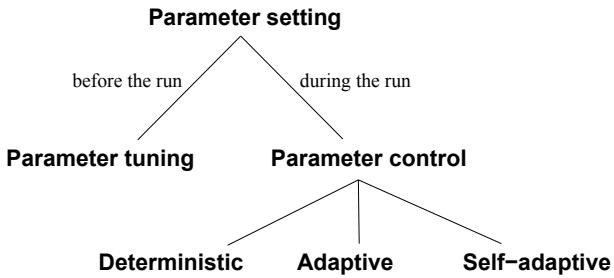
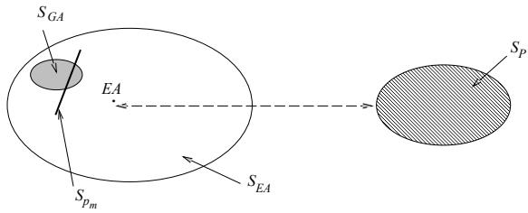

# ssue of 
ontrolling values of variousevolutionary algorithm is one of the uments that an stati
 set of ara

p j ghe problem while solving the problem. priate. Parameter 
ontrol forms an

ear and 
onfusing, thereby providing a 
lassi
ation of su
h 
ontrol me
hanisms and (2) survey various forms of 
ontrol whi
h have been studied by the evolutionary omputation 
ommunity in re
ent years. Our 
lassi- ation 
overs the major forms of parameter 
ontrol in evolutionary 
omputation and suggests some dire
tions for further resear
h. such control mechanisms and (2) survey various forms of control which have been studied by the evolutionary I. Introdu
tion cation covers the major forms of parameter control in evolutionary computation and suggests some directions algorithm to a parti

# ems form the bridge

ork. When dening an evolutionary algorithm (EA) one needs to 
hoose its 
om onents su
h as variation operators (mutation and re
ombination) that suit the representation, sele
tion me
hanisms for sele
ting parents and survivors, and an initial population. Ea
h of these 
omponents may have parameters, for instan
e: the robabilit of mutation the tournament size of sele
tion or the o ulation size. The values of these arameters greatly determine whether the algorithm will nd a near-o timum solution and whether it will nd su
h a solution eÆ
iently. Choosin the ri ht parameter values however is a time-
onsumin task and 
onsiderable eort has gone into developing good heuristi
s rameters greatly determine whether the algorithm will Globally, we distinguish two major forms of setting arameter values: arameter tunin and arameter ontrol. By parameter tuning we mean the 
ommonly ra
tised a roa
h that amounts to ndin ood values for th

en running the algorithm using these values, whi
h remain xed during the run. In Se
tion II we give arcontrol. By parameter tuning we mean the commonly Leiden Institute of Advan
ed Computer S
ien
e, Leiden University, Niels Bohrweg 1, 2333 CA Leiden, The Netherlands, e94079, 1090 GB Amsterdam, e-mail: gusz
wi.nl. Department of Computer and Mathemati
al S
ien
es, Vi
to

This a er has a two-fold ob e
tive. First we rovide a 
om rehensive dis
ussion of arameter 
ontrol priate. Parameter control forms an alternative, as it amounts to starting a run with initial parameter valthe me
hanism of 
han e works and

the EA is ee
ted by the me
hanism. Su
h a 
lassiation 
an be useful to the evolutionary 
omputation ommunity, sin
e many resear
hers interpret terms like \adaptation" or \self-adaptation" dierently, whi
h an be 
onfusin . The framework we ro ose here is intended to eliminate ambi uities in the terminolo . Se
ond we rovide a surve of 
ontrol te
hni ues whi
h 
an be found in the literature. This is intended as a uide to lo
ate relevant work in the area and as a olle
tion of options one 
an use when applying an EA with 
han in arameters. We are aware of other 
lassi
ation s
hemes e. . 2 11 that use other division 
riteria resultin in dierent 
lassi
ation s
hemes. The 
lassi
ation of An eline 2 is based on levels of ada tation and type of update rules.

s of adaptation: population-level, individual-level, and 
omponent-level1 are 
onsidered, together with two t es of u date me
hanisms: absolute and em iri
al rules. Absolute rules are redetermined and s e
- ify how modi
ations should be made. On the other hand, empiri
al update rules modify parameter values b 
om etition amon them self-ada tation . An eline's framework 
onsiders an EA as a whole without dividin attention to its dierent 
om onents e. . mutation, re
ombination, sele
tion, et
). The 
lassi
ation proposed by Hinterding, Mi
halewi
z, and Eiben [65℄ extends that of [2℄ by 
onsidering an additional level of ada tation environment-level and makes a more detailed division of types of update me
hanisms, dividing them into deterministi
, adaptive, and selfada tive 
ate ories. Here a ain no attention is a ed to what parts of an EA are adapted. The 
lassi
ation of Smith and Fo arty 119 , 116 is probably the more detailed division of types of update mechanisms, 1Noti
e, that we use the term \`
omponent' dierently from [2℄ where Angeline denotes subindividual stru
tures with it, while to what parts of an EA are adapted. The classification of Smith and Fogarty [119], [116] is probably the exe
utes the 
hange. Moreover, there are two types of rule/algorithm: un
oupled/absolute and tightlyoupled/empiri
al, the latter one 
oin
iding with selfada tation. The 
lassi
ation s
heme ro osed in this a er is based on the type of update me
hanisms and the EA om onent that is ada ted as basi
 division 
riteria. coupled/empirical, the latter one coinciding with selfadaptation.

s
ussed in more detail in se
tion IV . based on the type of update mechanisms and the EA component that is adapted, as basic division criteria. This classification addresses the key issues of parameter basi
 intuitions on arameter 
ontrol. e
tion I develops a 
lassi
ation of 
ontrol te
hniques

gorithms, whereas Se
tion V surveys the te
hniques proposed so far. Se
tion VI dis
usses some 
ombinations of various te
hni ues and Se
tion VII 
on
ludes basic intuitions on parameter control. Section IV develops a classification of control techniques in evolutionary II. Parameter tuning vs. parameter 
ontrol proposed so far. Section VI discusses some combinations of various techniques and Section VII concludes the paper.

# II. PARAMETER TUNING VS. PARAMETER CONTROL

ol parameters, or strategy parameters2, su
h as mutation rate 
rossover rate and o ulation size. Man resear
hers based their 
hoi
es on tuning the 
ontrol parameters \by hand", that is experimenting with different values and sele
ting the ones that gave the best results. Later, they reported their results of applying a parti
ular EA to a parti
ular problem, paraphrasing researchers based their choices on tuning the control ...f r h x rim n h h f ll in ferent values and selecting the ones that gave the best rossover e ual to 0:85 et
. a particular EA to a particular problem, paraphrasing here:

si n in the ast. First De Jon 29 ut a 
onsiderparameters: population size of 100, probability of crossover equal to 0.85, etc.

test roblems. He determined ex erimenta

mmended values for the robabilities of sin le- oint rossover and bit mutation. His 
on
lusions were that the followin arameters ive reasonable erforman
e tional GA), which were good for a number of numeric 2By \`
ontrol parameters' or \`strategy parameters' we mean the parameters of the EA, not those of the problem. crossover and bit mutation. His conclusions were that the following parameters give reasonable performance for his test functions (for new problems these values may not be very good):

sele
tion strate : eli   
probability of crossover equal to 0.6 probability of mutation equal to 0.001 generation gap of $1 0 0 \%$   
scaling window: $n = \infty$   
selection strategy: elitist.

ues to o timize the o-line erforman
e are iven in parenthesis : eters for both on-line and off-line performance3 of the algorithm. The best set of parameters to optimize the on-line (off-line) performance of the GA were (the values to optimize the off-line performance are given in parenthesis):

sele
tion strategy: elitist probability of crossover equal to 0.95 (0.45) probability of mutation equal to 0.01 (0.01) generation gap of $1 0 0 \%$ $( 9 0 \% )$ scaling window: $n = 1$ $\mathbf { \Phi } _ { n } = 1$ ) selection strategy: elitist (non-elitist).

ere seen as robust roblem solvers that exhibit a - proximately the same performan
e over a wide range of roblems 50 . 6. The 
ontem orar view on EAs however a
knowled es that s e
i
 roblems roblem t es re uire s e
i
 EA setu s for satisfa
tor erforman
e 13 . Thus the s
o e of \`o timal' arameter settin s is ne
essaril narrow. An uest for enerall near- optimal parameter settings is lost a priori 140 . This stresses the need for eÆ
ient te
hniques that help nding good parameter settings for a given problem, in other words, the need for good parameter tuning settings is necessarily narrow. Any quest for generally As an alternative to tunin arameters before runnin the al orithm 
ontrollin them durin a run was realised uite earl e. . mutation ste sizes in the evolution strate ES 
ommunit . Anal sis of the simmethods.

d to Re
henberg's 1/5 su

ess rule (see se
tion IIIA), where feedba
k was used to 
ontrol the mutation step size [100℄. Later, self-adaptation of mutation was used where the mutation ste size and the referred dire
tion of mutation were 
ontrolled without an dire
t feedba
k. For 
ertai $1 / 5$ pes of problems, self-adaptive A), where feedback was used to control the mutation 3These measures were dened originally by De Jong [29℄; the intuition is that on-line performan
e is based on monitoring the rection of mutation were controlled without any direct feedback. For certain types of problems, self-adaptive some sub-optimal 
hoi
es, sin
e parameters often intera
t in a 
omplex way. Simultaneous tunin

rameters, however, leads to an enormous amount of experiments. The te
hni
al drawba
ks to parameter tuning based on experimentation 
an be summarized as follows:  Parameters are not independent, but trying all dierent 
ombinations s stemati
all is ra
ti
all im ossiexperiments. The technical drawbacks to parameter  The ro
ess of arameter tunin is time 
onsumin even if ar

to their intera
tions.  For a iven roblem the sele
ted arameter values are   
setting them was signi
ant. Other options for designing a good set of stati
 parameters for an evolu   
ular problem in
lude \parameter setting by analogy" and the use of theoreti
al anal sis. Parameter settin b analo amounts to the

at have been proved su

essful for \similar" problems. However it is not 
lear whether similarit between problems as per
eived by the user implies that the optimal set of EA parameters is also similar. As for the theoreti
al approa
h, the 
omplexities of evolutionary pro
esses and 
hara
teristi
s of interesting roblems allow theoreti
al anal sis onl after si ni- ant sim li
ations in either the al orithm or the roblem model. Therefore, the pra
ti
al value of the 
urrent theoreti
al results on parameter settings is un
lear.4 There are some theoreti
al investigations on the optimal population size [50℄, [132℄, [60℄, [52℄ or optimal o erator robabilities 54 131 10 108 however these results were based on sim le fun
tion o timization roblems and their a li
abilit for other t es of problems is limited. A general drawba
k of the parameter tuning approa
h, regardless of how the parameters are tuned, is based on the observation that a run of an EA is an intrinsi
ally dynami
, adaptive pro
ess. The use of ri id arameters tha

ontrast to this spirit. Additionally, it is intuitively obvious that dierent values of parameters might be is based on the observation that a run of an EA is During the Workshop on Evolutionary Algorithms, organized rigid parameters that do not change their values is thus Davis made a 
laim that the best thing a pra
titioner of EAs 
an do is to stay away from theoreti
al results. Although this might to help ne tuning the sub-optimal 
hromosomes. This implies that the use of stati
 parameters itself 
an lead to inferior algorithm performan
e. The straightforward way to treat this problem is by using parameters that ma 
han e over time that is b re la
in a arameter b a fun
tion t where t is the eneration 
ounter. However, as indi
ated earlier, the problem of ndin optimal stati
 parameters for a parti
ular problem 
an be quite diÆ
ult, and the optimal values may depend on many other fa
tors (like the applied re
ombination $p$ perator, the se $p ( t )$ on me $t$ anism, et
). Hen
e designing an optimal fun
tion p(t) may be even more diÆ
ult. Another possible drawba
k to this approa
h is that the parameter value p t 
hanges are 
aused by a deterministi
 rule triggered by the progress of time t, without taking any notion of the a
tual progress in solving the problem, i.e., witho $p ( t )$ aking into a

ount the 
urrent state of the sear
h. Yet resear
hers (see Se
tion V) have improve $p ( t )$ eir evolutionary algorithms, i.e., they improved the quality of results returned $t$ y their algorithms while working on parti
ular problems, by usin su
h simple deterministi
 rules. This 
an be explained simply by superiority of 
hanging parameter values: suboptimal 
hoi
e of p(t) often leads to better results than a suboptimal 
hoi
e of p. To this end, re
all that nding good parameter values for an evolutionar al orithm is a oorl stru
- tured, ill-dened, 
omplex problem. But on this kind of roblem EAs are often 
on $p ( t )$ red to erform better than other methods! It is thus seemi $p$

n evolutionary algorithm not only for nding solutions to a problem, but also for tunin the same al orithm to the parti
ular problem. Te
hni
ally speaking, this amounts to modifying the values of parameters during the run of the algorithm by taking the a
tual sear
h pro
ess into a

ount. Basi
ally, there are two ways to do this. Either one 
an use some heuristi
 rule whi
h takes feedba
k from the 
urrent state of the sear
h and modies the parameter values a

ordingly, or in
orporate parameters into the 
hromosomes, thereby making them subje
t to evolution. The rst option, usin a heuristi
 feedba
k me
hanism allows one to base han es on tri ers dierent from ela sin time su
h as population diversity measures, relative improvements, absolute solution ualit et
. The se
ond o tion inorporating parameters into the 
hromosomes, leaves han es entirely based on the evolution me
hanism. In parti
ular, natural sele
tion a
ting on solutions (
hromosomes) will drive 
hanges in parameter values assoabsolute solution quality, etc. The second option, incorporating parameters into the chromosomes, leaves changes entirely based on the evolution mechanism. In particular, natural selection acting on solutions (chromosomes) will drive changes in parameter values associated with these solutions. In the following we discuss these options illustrated by an example.

# nequality and equal

Let us assume we deal with a numerical optimization problem: domain o $f ( { \vec { x } } ) = f ( x _ { 1 } , . ~ . ~ . ~ , x _ { n } )$ For su
h a numeri
al o timization roblem we m $g _ { i } ( \vec { x } ) ~ \leq ~ 0 ~ ( i ~ = ~ 1 , . ~ . ~ . ~ , q )$ lgorit $h _ { j } \left( \vec { x } \right) ~ = ~ 0$ $( j ~ = ~ q ~ +$ $1 , \ldots , m )$ , population i $l _ { i } \le x _ { i } \le u _ { i }$ as a $1 \leq i \leq n$ oating-point numbers

= x : : : x : consider an evolutionary algorithm based on a floatingA. Changing the mutation step size $\vec { x }$ in the population is represented as a vector of floating-point numbers ${ \vec { x } } = \langle x _ { 1 } , \ldots , x _ { n } \rangle$

# $A$ . Changing the mutation step size

terpreted as the mutation step size. Mutations then are realized by repla
ing 
omponents of the ve
tor \~x by for the next generation. A Gaussian mutation operator requires two parameters: the mean, which is often set to zero, and the standard deviation $\sigma$ , which can be if h m i n m h ni m i h m  for all ve
tors in the o ulation for all variabl $\vec { x }$ of $x _ { i } ^ { \prime } = x _ { i } + N ( 0 , \sigma )$ o

instan $N ( 0 , \sigma )$ x + N 0; 1 . As indi
ated in Se
tion II, it mi ht be bene
ial to var $\sigma$ he mutation ste size.5 We shall dis
uss several ossibilities in turn. $\sigma$ First we 
an re la
e the stati
 arameter  b a d nami
 arameter i.e. a fun
tion  t . This fun
tion an be de $x _ { i } ^ { \prime } = x _ { i } + N ( 0 , 1 )$ risti
 rule assi nin dierent values de endin on the number of enerations. For example, the mutation step size may be de

t = 1  0:9  t $\sigma$ by a dynamic parameter, i.e., a function $\sigma ( t )$ . This function to T whi
h is the maximum eneration number. Here the mutation ste size  t used for all for ve
tors in the population and for all variables of ea
h ve
tor

0) to $t$ 1 as the number of generations t approa
hes T. Su $T$ de
reases may assist the ne-tuning 
apabilities of the algorithm. In this $\sigma ( t )$ oa
h, the value of the given arameter 
han es a

ordin to a full deterministi decrease slowly from 1 at the beginning of the run ( $t =$ There are even formal arguments supporti $t$ g this view in s $T$ - i
 
ases, e.g., [8℄, [9℄, [10℄, [62℄. the algorithm. In this approach, the value of the given parameter changes according to a fully deterministic ve
tors in the population and for all variables of ea
h ve
tor. A well-known exam $t$ e of this t e of arameter ada tation is Re

olution strategies [100℄. This rule states that the ratio of su

essful mutations6 to all mut $\sigma$ ions should be 1 hen
e if the ratio is reater than 1 then the step size should be in
reased, and if the ratio is less than 1 5, the step size shou $^ { \cdot 1 / 5 }$ e de
reased: evolution strategies [100]. This rule states that the if (t mod n = 0) then be $1 / 5$ (t  n)=
; if ps $1 / 5$ =5 (t) := (t  n)  
; if ps < 1=5 than $1 / 5$ : (t  n); if ps =

$$
\begin{array} { r l } & { \mathbf { n o d } \ n = 0 ) \ \mathbf { t h e n } } \\ & { \sigma ( t ) : = \left\{ \begin{array} { l l } { \sigma ( t - n ) / c , \quad } & { \mathrm { i f } \ p _ { s } > 1 / 5 } \\ { \sigma ( t - n ) \cdot c , \quad } & { \mathrm { i f } \ p _ { s } < 1 / 5 } \\ { \sigma ( t - n ) , \quad } & { \mathrm { i f } \ p _ { s } = 1 / 5 } \end{array} \right. } \\ & { \sigma ( t ) : = \sigma ( t - 1 ) ; } \end{array}
$$

ons,

e

ations. $p _ { s }$ The in
uen
e of the user on the arameter values is mu
h less dire
t here than in the determin$0 . 8 1 7 \leq c \leq 1$ above. Of 
ourse, the me
hanism that embodies the link between the sear
h ro
ess and arameter values i $\sigma$ still a heuristi
 rule indi
a $n$ ng how the 
hanges should be made, but the values of  t are not deterministi
. Third it is ossible to assi n an \`individual' mutation step size to ea
h solution: extend the representation to individuals of len th n + 1 as hx1; : : : ; xn; i, $\sigma ( t )$ are and apply some va

tion and arithmeti
al 
rossover) to xi's as well as to the  value of an individual. In this way, not only the solution ve
tor values ( $n + 1$ bu $\langle x _ { 1 } , \ldots , x _ { n } , \sigma \rangle$ o t i
al variation would be: 0 =   eN(0;0) and $x _ { i }$ 's as well as to x0 = $\sigma$ xi + N(0; 0), where 0 is a parameter o $( x _ { i } \mathrm { ^ { \circ } s } )$ method. This me
hanism is 
ommonly 
alled self-adapting the mutation step sizes. Observe tha $\overrightharpoon { \boldsymbol { \sigma ^ { \prime } } } ^ { \prime } = \boldsymbol { \sigma } \cdot \boldsymbol { e } ^ { N ( 0 , \tau _ { 0 } ) }$ uristi $x _ { i } ^ { \prime } = x _ { i } + N ( 0 , \sigma ^ { \prime } )$ e where $\tau _ { 0 }$ is a parameter of the method. This mechA mutation is 
onsidered su

essful if it produ
es an ospring 7It 
an be ar ued that the heuristi
 
hara
ter of the me
hanism resetting the parameter values is not eliminated, but rather setting the parameter values is eliminated.7

ep size to ea
h x . If an individual is represented as tion of a certain value of $\sigma$ was restricted to a single individual. However, it can be applied to all variables of the individual: it is possible to change the granularity of such applications and use a separate mutation 0 N(0;0) $x _ { i }$ . If an individual is represented as $\langle x _ { 1 } , \ldots , x _ { n } , \sigma _ { 1 } , \ldots , \sigma _ { n } \rangle$

then mutations can be realized by replacing the above vector according to a similar formula as discussed above:

ness l $\tau _ { 0 }$ ds 
ap e. posed to the previous case, each component $x _ { i }$ has its B. Changing the penal $\sigma _ { i }$ oeÆ
ients This mechanism implies a larger degree of freedom for adapting the search strategy to the topology of the fity y

# eters, and these parameters are trad

onents su
h as the evaluation fun
tion and 
onseuentl the tness fun
tion 
an also be arameterized and thus tuned. While this is a less 
ommon option than tunin mutation althou h it is ra
ti
ized in the evolution of variable-length stu
tures for parsimony pressure 144 ), it may provide a useful me
hanism for in
reasing the performan
e of an evolutionary algorithm. When dealing with 
onstrained optimization problems enalt fun
tions are often used. A 
ommon te
hni ue is the method of stati
 enalties 92 whi
h requires xed user-supplied penalty parameters. The main reaso

mplest te
hnique to implement: It requires onl the strai htforward modi
ation of the evaluation fun
tion eval as follows: eval \~x = \~x W  enalt \~x main reason for its wide spread use is that it is the simplest technique to implement: It requires only the straightforward modification of the evaluation function eval as follows:

re ion. $f$ n man methods a set of fun
tio $p e n a l t y ( \vec { x } )$  m is used to 
onstru
t the penalty, where the fun
tion Usually, the penalty function is based on the distance repla
ed by a metaheuristi
 of evolution itself. However, the method is very robust w.r.t. the setting of 0 and a good rule is 0 =8For minimization roblems. $f _ { j }$ $\left[ 1 \leq j \leq \right]$ $m$ ) is used to construct the penalty, where the function $f _ { j }$ measures the violation of the $j$ -th constraint in the W is a user-d

$$
f _ { j } ( \vec { x } ) = \left\{ \begin{array} { l l } { \operatorname* { m a x } \{ 0 , g _ { j } ( \vec { x } ) \} , } & { i f 1 \leq j \leq q } \\ { | h _ { j } ( \vec { x } ) | , } & { i f q + 1 \leq j \leq m . } \end{array} \right.
$$

$W$ First, we 
an repla
e the stati
 parameter W by a d nami
 arameter e. . a fun
tion W t . Just as for the mutation parameter , we 
an $W$ velop a heuristi whi
h modies the weight W over time. For example, in the method ro osed b Joine $W$ n

dividuals are evaluated at the iteration t $W$ a formula, where $W ( t )$ . Just as for eval \~x = \~x + C  t $\sigma$ enalt \~x where C and  are 
onsta $W$ . Clearly, W(t) = (C  t), the penalty pressure grows with the evolut $t$ n time. Se
ond, le   
$e v a l ( \vec { x } ) = f ( \vec { x } ) + ( C \cdot t ) ^ { \alpha } \cdot p e n a l t y ( \vec { x } )$ s   
of su $C$ an ap $\alpha$ oa
h was developed by   
$W ( t ) = ( C \cdot t ) ^ { \alpha }$ h   
same formula as before, but W(t) is updated in eve

neration t in the followin wa : lizes feedback from the search process. One example 8> (1=1)  W(t); if \~bi 2 F >> for all t  k + 1  i  t W(t+1) = < 2  W(t); $W \left( t \right)$ 2 S  F generation $t$ in the following way:

$$
W ( t + 1 ) = \left\{ \begin{array} { l l } { ( 1 / \beta _ { 1 } ) \cdot W ( t ) , } & { \mathrm { i f } \vec { b } ^ { i } \in \mathcal { F } } \\ & { \mathrm { f o r ~ a l l } \ t - k + 1 \le i \le t } \\ { \beta _ { 2 } \cdot W ( t ) , } & { \mathrm { i f } \vec { b } ^ { i } \in S - \mathcal { F } } \\ & { \mathrm { f o r ~ a l l } \ t - k + 1 \le i \le t } \\ { W ( t ) , } & { \mathrm { o t h e r w i s e . } } \end{array} \right.
$$

nent W t 1 fo $\mathcal { S }$ he eneration t 1 if all best individuals in ${ \mathcal { F } } \subseteq S$ st k enerations were feasible $\vec { b ^ { \imath } }$ . in F and in
reases penalties if all best individuals in the last k gener $i$ t $\beta _ { 1 } , \beta _ { 2 } > 1$ nfeas $\beta _ { 1 } \neq \beta _ { 2 }$ there are some feasible and infeasible individuals as best individuals in the last k e $W ( t + 1 )$ W t + 1 remain $t + 1$ hout 
han e. Third we 
o $k$ d allow self-ada tation of the we $\mathcal { F }$ ht arameter similarl to the mutation ste sizes in the $k$ revious se
tion. For exam le it is ossible to extend the re resentation of individuals into $k$ generations, $W ( t + 1 )$ remains without change.

Of 
ourse, instead of W it is possible to 
onsider a ve
tor of parameter, similarly to the mutation step sizes in the previous section. For example, it is possible to extend extended to this 
ase.

$\langle x _ { 1 } , \ldots , x _ { n } , W \rangle$ a

W th $W$ etter an infeasible individual is so it $W$ unfair to apply dierent weights to dierent ind $x _ { i }$ iduals within the same eneration. It mi ht be that a new wei ht 
an be dened e. . arithmeti
al avera e of all wei hts present in the population and used for evalu$W$ ion purpose; however, to our best knowledge, no one has experimented with su
h self-adaptive weights. To this end, it is important to note the 
ru
ial differen
e between self-ada tin mutation ste sizes and onstraint wei hts. Even if the mutation ste sizes are en
oded in the 
hromosomes, the evaluation of a 
hromosome is independent from the a
tual value of

To this end, it is important to note the crucial difeval \~x \~ = \~x constraint weights. Even if the mutation step sizes are o a y 
 o oso e hx; i 
o t ast, 
o st a t weights are en
oded in the 
hromosomes, then we $\sigma \mathrm { ^ s }$ e That is,

$$
e v a l ( \langle \vec { x } , \vec { \sigma } \rangle ) = f ( \vec { x } )
$$

for any 
hromosome $\langle \vec { x } , \vec { \sigma } \rangle$ i. This enables the evolution to \`
heat' in the sense of making improvements by

$$
e v a l ( \langle \vec { x } , W \rangle ) = f _ { W } ( \vec { x } )
$$

C. Summary $\langle { \vec { x } } , W \rangle$ . This enables the evoluIn the previous subse
tions we illustrated how the mutation o erator and $W$ e evaluation fun
tion $f$ n be ontrolled ada ted duri

# The latter 
a

mbination sele
tion et
. 
an be 
ontrolled b arameters but so 
an other 
om onents of an evolutionary algorithm. Obviously, there are many 
omponents and parameters that 
an be 
hanged and tuned for optimal algorithm performan
e. In general, the three options we sket
hed for the mutation operator and the evaluation fun
tion are valid for any parameter of an evolutionary algorithm, whether it is population size, mutation step, the penalty 
oeÆ
ient, sele
tion pressure, and so forth. The mutation exam le of Se
tion III-A also illustrates the phenomenon of the s
ope of a parameter. Namely, the mutation step size parameter 
an have different domains of in
uen
e, whi
h we 
all s
ope. Usin the x : : : x 

on step size applies only to one variable of a sin le individual. Thus, the parameter  a
ts on a subindividual level. In the x : : : x  re resentation the ferent domains of influence, which we call scope. Using the $\langle x _ { 1 } , . ~ . ~ . ~ , x _ { n } , \sigma _ { 1 } , . ~ . ~ . ~ , \sigma _ { n } \rangle$ model, a particular mutation step size applies only to one variable of a single individual. Thus, the parameter $\sigma _ { i }$ acts on a subindividual level. In the $\langle x _ { 1 } , \ldots , x _ { n } , \sigma \rangle$ representation the ation of $\sigma$ arameter 
ontrol te
hniques for parameters rameter $\sigma ( t )$ was defined to affect all individuals and thus has the whole population as its scope.

IV. Classifi
ation of Control Te
hniques of this section; we are now ready to attempt a classification of parameter control techniques for parameters of an evolutionary algorithm.

# What is 
hanged? (e.g., representation, evaluati

In classifying parameter control techniques of an evolutionary algorithm, many aspects can be taken into account. For example:   
3. The s
o e level of 
han e e. . o ulation-level individual-level, et
.). 4. Th   
(e.g., monitoring performan
e of operators, diversity of the population, et
.).   
In the followin we dis
uss these items in more detail. individual-level, etc.).   
4. The evidence upon which the change is carried out (e.g., monitoring performance of operators, diversity of the population, etc.).   
ur ose assume the followin 
om onents of an EA:

To classify parameter control techniques from the perspective of what is changed, it is necessary to agree on a list of all major components of an evolutionary algorithm (which is a difficult task in itself). For that purpose, assume the following components of an EA:

 Re la
ement o erator surviv   
mental sele
tion .   
 Po ulation size to olo et
. .   
Note that ea
h 
om onent 
an be arameterized and tion).   
Replacement operator (survival selection or environmental selection).   
followin formula   
Note that each component can be parameterized, and the number of parameters is not clearly defined. For example, an offspring produced by an arithmetical crossover of $k$ parents $\vec { x } _ { 1 } , \ldots , \vec { x } _ { k }$ can be defined by the following formula   
$\vec { v } = a _ { 1 } \vec { x } _ { 1 } + \ldots + a _ { k } \vec { x } _ { k } ,$   
what a $a _ { 1 } , \ldots , a _ { k }$ hara $k$ r of this list of 
omponents and of the list of arameters of ea
h 
om onent we will maintain the \what-aspe
t" as one of the main 
lassi
ation features. The reason for this is that it allows us to lo
ate where a s e
i
 me
hanism has its ee
t. Also this is wa we would ex e
t eo le to of the list of parameters of each component, we will maintain the "what-aspect" as one of the main classification features. The reason for this is that it allows us to locate where a specific mechanism has its effect. Also, this is way we would expect people to  Deterministi
 arameter 
ontrol.   
ing mutation rates, let me see how others did it".

As discussed and illustrated in Section III, methods for changing the value of a parameter (i.e., the "howan feedba
k from the sear
h. Usuall a time-var in s
hedule is used, i.e., the rule will number of enerations have elapsed sin
e the last time the rule was a
tivated.  Adaptive parameter 
ontrol. This takes pla
e when there is some form of feedba
k from the sear
h that is used to determine the dire
tion and or ma nitude of the 
han e to the strate arameter. The assi nment

rameter may involve 
redit as of the EA ma determine whether or not the new value ersists or ro a ates throu hout the o ulation.  Self-adaptive parameter 
ontrol. The idea of the evolution of evolution 
an be used to im lement the self-ada tation of arameters. Here the parameters to be adapted are en
oded into the 
hromosomes and under o mutation and re
ombination.

better values of these en
oded par ter individuals whi
h in turn are more likel to survive and rodu
e os rin and hen
e ro a ate these better parameter values. somes and undergo mutation and recombination. The better values of these encoded parameters lead to better individuals, which in turn are more likely to survive and produce offspring and hence propagate these better parameter values.

This terminology leads to the taxonomy illustrated in Figure 1.

  
led me
hanisms of S ears 124 . Let us

terministi
 and ada tive 
ontrol whereas the tightly-
oupled empiri
al 
ategory 
orresponds to selfadaptation. We feel that the distin
tion between deterministi
 and adaptive parameter 
ontrol is essential, as that the uncoupled/absolute category encompasses deterministic and adaptive control, whereas the tightly-coupled/empirical category corresponds to selfadaptation. We feel that the distinction between deterministic and adaptive parameter control is essential, as the arameter-alterin transformations take no in ut variables related to the ro ress of the sear
h ro
ess. For exam le one mi ht randoml 
han e the mutation probability after every 100 generations, whi
h is not a deterministi
 ro
ess. The name \xed" arameter 
ontrol mi ht form an alternative that also 
overs this latter example. Also, the terms \adaptive" and \self-adaptive" 
ould be repla
ed by the equally meaningful \expli
itly adaptive" and \impli
itly adaptive" ontrols, respe
tively. We have 
hosen to use \adaptive" and \self-ada tive" for the widel a

e ted usa e of the latter term. As dis
ussed earlier, any 
hange within any 
omponent of an EA ma ae
t a ene arameter whole hromosomes individuals the entire o ulation another 
omponent (e.g., sele
tion), or even the evaluation fun
tion. Th

ada tation 2 65 119 116 . Note however that the s
ope level usually depends on the 
omponent of the EA where the 
hange takes pla
e. For example, a 
hange of the mutation step size may ae
t a gene, a 
hromosome, or the entire population, depending on the parti
ular implementation (i.e., s
heme used), but a 
han e in the enalt 
oeÆ
ients alwa s ae
ts the whole o ulation. So the s
o e level feature is a se
- ondary one, usually depending on the given 
omponent and its a
tual implementation. The issue of the s
o e of the arameter mi ht be more 
ompli
ated than indi
ated in Se
tion III-C, however. First of all, the s
ope depends on the interpretation me
hanism of the given parameters. For example, and its actual implementation.

The issue of the scope of the parameter might be hx1; : : : ; xn; 1; : : : ; n; 1; : : : ;  i; ever. First of all, the scope depends on the interpretawhere the ve
tor \~ denotes the 
ovarian
es between the variables 1; : : : ; n. In this 
ase

$$
\langle x _ { 1 } , \ldots , x _ { n } , \sigma _ { 1 } , \ldots , \sigma _ { n } , \alpha _ { 1 } , \ldots , \alpha _ { n ( n - 1 ) / 2 } \rangle ,
$$

The next exam $\vec { \alpha }$ e illustrates that the same arameter en
oded $\sigma _ { 1 } , \ldots , \sigma _ { n }$ romosomes 
an be inter reted strategy parameters in $\vec { \alpha }$ is the whole individual, alants with dierent s
o es of this arameter. S ears 124 f ll in 4 x

ntainin an extra bit to determine whether oneoint 
rossover or uniform 
rossover is to be used bit 1 0 standing for one-point uniform 
rossover, respe
- tivel . Two inter retations were 
onsidered. The rst [124], following [46], experimented with individuals containing an extra bit to determine whether onepoint crossover or uniform crossover is to be used (bit $1 / 0$ standing for one-point/uniform crossover, respectively). Two interpretations were considered. The first on the bit-distribution over the whole population: If, for example 73% of the population had bit 1, then the robabilit of one- oint 
rossover was 0.73. Thus this arameter under this inter retation a
ts on the o ulation level. Note that these two inter retations 
an be easil 
ombined. For instan
e similar to the rst interretation if $7 3 \%$ arental bits are the same the 
orres ondin o erator is used. However if the dier the operator is sele
ted a

ording to the bit-distribution, ust as in the se
ond inter retation. The s
o e level of this arameter in this inter retation is neither individual, nor population, but rather both. This example shows that the notion of s
o e 
an be ill-dened and very 
omplex. These examples, and the arguments that the s
o e level entit is rimaril a feature of the iven parameter and only se
ondarily a feature of adaptation itself motivate our de
ision to ex
lude it as a ma or lassi
ation 
riterion. Another ossible 
riterion for 
lassi
ation is the eviden
e used for determinin the 
han e of parameter value 119 116 . Most 
ommonl the ro ress of the sear
h is monitored, e.g., the performan
e of operators. It is also ossible to lo

rsit of the o ulation. The information athered b su
h a monitorin ro
ess is used as feedba
k for adjusting the parameters. Although this is a meaningful distin
tion, it appears onl in adaptive parameter 
ontrol. A similar distin
tion 
ould be made in deterministi
 
ontrol, whi
h mi ht be based on any 
ounter not related to sear
h progress. One option is the number of tness evaluations (as the des
ription of deterministi
 
ontrol above indi
ates . There are however other ossibilities for instan
e 
han in the robabilit of mutation on the basis of the number of exe
uted mutations. We feel, however, that these distin
tions are of a more spe
i
 level than other 
riteria and for that reason we have not in
luded it as a major 
lassi
ation possibilities, for instance, changing the probability of So the main 
riteria for 
lassif in methods that han e the values of the strate arameters of an alorithm durin its exe
ution are: reason we have not included it as a major classification 2. H i

ur 
lassi
ation is thus two-dimensional: the t e of n r l n h m n n f h l i n r l - rithm whi
h in
or orates the ar

omponent entries ar al forms of parameter 
ontr parameters' 
hange 
onsists of three 
ategories: detercontrol and the component of the evolutionary algorithm which incorporates the parameter. The type and component entries are orthogonal and encompass typical forms of parameter control within EAs. The type of parameters' change consists of three categories: deterministic, adaptive, and self-adaptive mechanisms. The V. Survey of related work To dis
uss and surve the ex erimental eorts of many resear
hers to 
ontrol the parameters of their evolutionar al orithms we sel

# V. SURVEY OF RELATED WORK

e earlier list of six 
om onents of an EA with one exeption, and we just brie
y indi
ate what the s
ope of the 
hange is. Purely by the amount of work 
on
erning the 
ontrol of mutation and re
ombination (variation operators), we de
ided to treat them in two separate su bse
tions. ception, and we just briefly indicate what the scope of A. Representation Re resentation forms an im ortant distin uishin feature between dierent streams of evolutionary 
omputin . G

# A. Representation

st as modern evolutionary programming (EP) 11 , 45 . Tradtional EP was based on nite state ma
hines as 
hromosomes and in eneti
 ro rammin GP individuals are trees or ra hs 18 79 . It is interestin to note that for the latter two bran
hes of evolutionary algorithms it is an inherent feature that the shape and size of individuals is 
hanging during the evolutionary sear
h pro
ess. It 
ould be argued that this implies an intrin

resentation in tradtional EP and GP. On the other hand the main stru
ture of the nite state ma
hines is not 
han in durin the sear
h in tradtional EP nor do the fun
tion and terminal sets in GP without automati
ally dened fun
tions, ADFs . If one identies \re resentation" with the basi
 s ntax lus the en
odin me
hanism then the dierentl sized and sha ed nite state ma
hines, respe
tively trees or graphs are onl dierent ex ressions in this un
han in s ntax. This view im lies that the re resentations in tradtional EP and GP are not intrinsi
ally adaptive. Most on the work into adaptation of representation has been done by resear
hers from the geneti
 algorithms area. This is probably due to premature 
onvergen
e and \Hamming 
li" problems whi
h o

urred when GAs were rst a lied to numeri
 o

he most 
omprehensive was the adaptive representation used by Shaefer 114 in his ARGOT strate y. Simler s
hemes where later used b Mathias and Whitle 139 delta 
odin and b S
hraudol h and Belew when GAs were first applied to numeric optimization. The most comprehensive was the adaptive representation used by Shaefer [114] in his ARGOT strategy. Simpler schemes where later used by Mathias and Whitley [139] (delta coding), and by Schraudolph and Belew variable , whi
h allows not onl the number of bits used to represent the gene (resolution) to be adapted, but also

nd 
enter point of the range (shift left/right) of the values the genes are mapped into. Adaptation of the re resentation and ma in is based on the de ree of onver en
e of the enes, the varian
e of the ene values, and how 
losely the ene values approa
h the 
urrent range boundaries. Delta 
oding also modies the representation of the fun
tion parameters, but in a dierent way. It uses a GA with multiple restarts, the rst run is used to nd an interim solution, subsequent runs de
ode the enes as distan
es del

lution. This wa ea
h restart forms a new h er
ube with the interim solution at its ori in, the resolution of the delta values 
an also be altered at the restarts to expand or 
ontra
t the sear
h spa
e. The restarts are tri ered when the Hammin distan
e between the best and worst strin s of the 
ontinuin o ulation are not reater than one. This te
hni ue was further rened in 87 to 
o e with de
e tive roblems. The d nami
 arameter en
odin te
hni ue is not based on modif in the a
tual number of bits used to re resent a fun
tion arameter but rather it alters the ma in of the ene to its henot i
 value. After ea
h generation, population 
ounts of the

ree overlapping target intervals for the 
urrent sear
h interval for that ene are taken. If the lar est 
ount is greater than a given trigger threshold, the sear
h interval is halved, and all values for that gene in the population are adjusted. Note that in this te
hnique the resolutions of enes 
an be in
reased but not de
reased. Messy GAs (mGAs) [53℄ use a very dierent approa
h. This te
hnique is targeted to xed-length binary representations but allows the representation to be under or over s e
ied. Ea
h ene in the 
hromosome 
ontains its value (a bit) and its position. The

romosomes are of variable length and may 
ontain too few or too many bits for the representation. If more than one gene spe
ies a bit position the rst one en
ountered is used if bit ositions are not s e
ied b the 
hromosome, they are lled in from so-
alled 
ometitive tem lates. Mess GAs do not use mutation and use 
ut and s li
e o erators in la
e of 
rossover. A run of an mGA is in two phases: 1 a primordial phase whi
h enri
hes the proportion of ood buildin blo
ks and redu
es the o ulation size usin onl sele
tion and 2 a uxta ositional hase whi
h uses all and use cut and splice operators in place of crossover. A run of an $\mathrm { m G A }$ is in two phases: (1) a primordial phase which enriches the proportion of good building blocks and reduces the population size using only selection, and (2) a juxtapositional phase which uses all dominan
e me
hanism of diploid 
hromosomes. Here there are two 
o ies of ea
h 
hromosome. The extra 
hromosomes en
ode alternate solutions and dominan
e de
ides whi
h o

a le 17 added an evolvable dominan
e value to ea
h ene and the ene with the hi hest dominan
e value was dominant while Rosenber 102 used a biolo i
all -oriented model and the dominan
e ee
t was due to arti
ular enz mes bein ex ressed. Other early work (on stationary optimization problems and mixed results was b Hollstein 67 and Brindle 23 . Goldber and Smith 55 used di loid re resentation with Hollsteins trialleli
 dominan
e ma for a nonstationar problem, and showed that it was better than usin a ha loid re resentation. Greene 56 57 used a dierent approa
h that evaluates both the 
hromosomes and uses the 
hromosome with the highest tness as the dominant one. In ea
h of the 
ases above the method of dominan
e 
ontrol is self-ada tive as there is no ex li
it feedba
k to 
ontrol dominan
e and dominan
e is onl altered b the normal re rodu
tion o - somes and uses the chromosome with the highest fitness Additional issue 
onne
ted with ada tive re resentations 
on
erns non
odin se ments of a enot e. Wu is no explicit feedback to control dominance, and domex li
itl dene introns in the enot es. erators.

Evaluation fun
tion In 76 and 90 me
hanisms for var in enalties a
- ordin to a redened deterministi
 s
hedule are reported. In Se
tion III-B we dis
ussed brie

# anism presented in [76

al has an additional arameter : eval(\~x; ) = f(\~x) + 1 P f2(\~x), whi
h is de
reased every time the evolutionary algorithm 
onverges (usually,  := =10). Copies of the best solution found are taken as the initial o ulation of the next iteration with the new $\tau$ .: $\begin{array} { r } { { e v a l } \big ( \vec { x } , \tau \big ) = f ( \vec { x } ) + \frac { 1 } { 2 \tau } \sum _ { J } f _ { j } ^ { 2 } \big ( \vec { x } \big ) } \end{array}$ ,

of the system: For ea
h parti
ular 
y
le the evaluation fun
tion is xed J 1 : $\tau : = \tau / 1 0$ set of a
tive 
onstraints at the end of a 
 
le and the enalt ressure in
reases 
han in the evaluation fun
tion onl when $\tau$ e swit
h from one 
y
le to another. The method of Eiben and Ruttka 36 falls somewhere between t $( J \subseteq \{ 1 , \dots , m \}$ tive 
ontrol of the tness fun
tion. They apply a method for solving 
onstraint satisfa
tion problems that 
hanges the evaluawe switch from one cycle to another.

The method of Eiben and Ruttkay [36] falls somewhere between tuning and adaptive control of the fitness function. They apply a method for solving constraint satisfaction problems that changes the evaluaam le on ada tive tness fun
tions for 
onstraint satisfa
tion where enalties of 
onstraints in a 
onstrained o timization roblem are ada ted durin a run see Se
tion III-B). Adaptive penalties were further inves

gated by Smith and Tate [115℄, where the penalty measure de ends on the number of violated 
onstraints the best feasible ob e
tive fun
tion found and the best ob e
tive fun
tion value found. The breakout me
hanism of 93 is a lied in 31 32 b re-evaluatin the weights of 
onstraints when the algorithm gets stu
k in a lo
al optimum. This amounts to adaptively 
hangin the enalties durin the evolution. Eiben and van der Hauw [39℄, [38℄ introdu
ed the so-
alled SAW-ing (stepwise adaptation of weights) me
hanism for solvin 
onstraint satisfa
tion problems with EAs. SAWing 
hanges the evaluation fun
tion adaptively in an EA by periodi
ally 
he
king the best individual in the population and raising the penalties (weights) of those onstraints this individual violates. Then the run 
ontinues with the new evaluation fun
tion. This me
hanism has been applied in EAs with very good results for raph 
olorin , satisabilit , and random CSPs 40 , [16℄, [41℄. A re
ent a er 82 des
ribes a de
oder-based a - roa
h for solvin 
onstrained numeri
al o timization problems the method denes a homomorphous mapping between n-dimensional 
ube and a feasible sear
h spa
e). It

e system by introdu
ing additional 
on
epts, one of them bein ada tive lo
ation of the referen
e oint of the mapping [81℄, where the best individual in the 
urrent populati $n$ serves as the next referen
e point. A hange in a referen
e point results in 
hanges in evaluation fun
tion for all individuals. It is interesting to note that an analogy 
an be drawn between EAs a lied to 
onstrained roblems and EAs o eratin on variable-len th re resentation in li ht of arsimon for instan
e in GP. In both 
ases the definition of the evaluation fun
tio

rm. For 
onstrained problems this term is to supress 
onstraint violations 91 89 92 in 
ase of GP it represents a bias against growing tree size and depth [101℄, [122℄, [123℄, [144℄. Obviously, the amount of penalty 
an be dierent for dierent individuals, but if the penalty term itself is not varied along the evolution then we do not see these 
ases as examples of ontrollin the evaluation fun
tion. Nevertheless, the me
hanisms for 
ontrolling the evaluation fun
tion for onstrained roblems 
ould be im orted into GP. So if the penalty term itself is not varied along the evolution then we do not see these cases as examples of controlling the evaluation function. Nevertheless, the mechanisms for controlling the evaluation function for constrained problems could be imported into GP. So termined adaptively 130 . tion [33]. One real case of controlling the evaluation function in GP is the so-called rational allocation of anism here lies in the intera
tion of the two sub o ucases that determine the quality of an individual is deness of the members of th

hnique has been applied to 
onstraint satisfa
tion, data mining, and many other tasks. anism here lies in the interaction of the two subpopuC. Mutation o erators and their robabilities ness of the members of the other subpopulation. This There has been quite signi
ant eort in nding optimal values for mutation rates. Be
a

# attempts for 
ontrol them.

There has been quite significant effort in finding optimal values for mutation rates. Because of that, we discuss also their tuned 'optimal' rates before discussing attempts for control them.

ated = 0:01 while S
haer et al. 
ame u with 2 0:005 0:01 106 . Followin earlier work of Bremermann 22 Muhlenbein derived a formula for whi
h de ends on the len th of the b $p _ { m } ~ = ~ 0 . 0 0 1$ namely pm = 1=L should be a generally \`optimal' stati value fo $p _ { m } ~ = ~ 0 . 0 1$ This rate was 
ompared with several $p _ { m } ~ \in ~ [ 0 . 0 0 5 , 0 . 0 1 ]$ h and Fogarty who found that = 1 L out erformed other values for in their $p _ { m }$ mparison [117℄. Ba
k also found 1=L to be a $( L )$ value fo $p _ { m } = 1 / L$ ther with Gray 
oding [11℄, p.229. value for $p _ { m }$ [94]. This rate was compared with several fixed rates by Smith and Fogarty who found that $p _ { m } = 1 / L$ l nn r ri fr m h $p _ { m }$ r h an be found in 12 . The observed $1 / L$ rovement with this s
he $p _ { m }$ makes it an im ortant 
ontribution a

as rst time to our best knowled e where the mutation rate $p _ { m }$ s 
hanged during the run of a GA (however, the improvement was a
hieved for an initial population of all zero bits . Hesser and Manner 62 derived theoreti
all optimal s
hedules for deterministi
all 
han - ing p for the 
ounting-ones fun
tion. They suggest: tion rate was changed during the run of a GA (however, exp  
 t  pm (t) = r - p retically optimal schedules for deterministically changing $p _ { m }$ for the counting-ones function. They suggest:

$$
p _ { m } ( t ) = \sqrt { \frac { \alpha } { \beta } } \times \frac { \exp { \left( \frac { - \gamma t } { 2 } \right) } } { \lambda \sqrt { L } }
$$

where $\alpha , \beta , \gamma$ are constants, $\lambda$ is the population size and $t$ is the time (generation counter).

Bäck [8] also presents an optimal mutation rate decrease schedule as a function of the distance to the

The fun
tion to 
ontrol the de
rease of pm by B

$$
p _ { m } ( f ( \vec { x } ) ) \approx \frac { 1 } { 2 ( f ( \vec { x } ) + 1 ) - L }
$$

 L  2  $p _ { m }$ by Bäck and Schütz [14] constrains $p _ { m } ( t )$ so that $p _ { m } ( 0 ) = 0 . 5$ and $\begin{array} { r } { p _ { m } ( T ) \stackrel { \cdot } { = } \frac { 1 } { L } } \end{array}$ if a maximum of $T$ evaluations are Janik

$$
p _ { m } ( t ) = { \bigg ( } 2 + { \frac { L - 2 } { T } } \cdot t { \bigg ) } ^ { - 1 } { \mathrm { ~ i f ~ } } 0 \leq t \leq T .
$$

k > xtk  4(t; xk  l(k)) if a random nonuniform mutation, where

$$
\boldsymbol { x } _ { k } ^ { t + 1 } = \left\{ \begin{array} { l l } { \boldsymbol { x } _ { k } ^ { t } + \Delta ( t , r ( k ) - \boldsymbol { x } _ { k } ) } & { \mathrm { ~ i f ~ a ~ r a n d o m } } \\ & { \mathrm { ~ b i n a r y ~ d i g i t ~ i s ~ 0 ~ } } \\ { \boldsymbol { x } _ { k } ^ { t } - \Delta ( t , \boldsymbol { x } _ { k } - l ( k ) ) } & { \mathrm { ~ i f ~ a ~ r a n d o m } } \\ & { \mathrm { ~ b i n a r y ~ d i g i t ~ i s ~ 1 ~ } } \end{array} \right.
$$

lo $k = 1 , \dots , n$ stages. In exp $\triangle ( t , y )$ s reported in [74℄, the follow $[ 0 , y ]$ un
tion was used: $\triangle ( t , y )$ being close to 0 increases as $t$ increases $t$ is the generation number). This property causes this operator to search the space uniformly initially (when $t$ is small), and very locally at later stages. In experiments reported in [74], the following function was used:

$$
\triangle ( t , y ) = y \cdot r \cdot ( 1 - \frac { t } { T } ) ^ { b } ,
$$

metho $r$ for setting the mutation step siz $T$ in ES [100℄. The standard deviation  is in $b$ eased, de
reased, or left without 
hange and the de
ision is made on

e 
urrent i.e. most re
ent fre uen
 o $1 / 5$ essful mutations. Julstrom's ada tive me
hanism re ulates the ratio between 
rossovers and mutations based on their erforman
e 77 . $\sigma$ Both o erators are used se - aratel to 
reate an os rin the al orithm kee s a tree of their re
ent 
ontributions to new osprin and rewards them a

ordingly. Lis 83 adapts mutation rates in a arallel GA with a farmin model while Lis and Lis [84℄ adapt p , p and the population size in an algorithm of a parallel farming model. They use arallel o ulations and ea
h of them has one value out of a possible three dierent values, for pm, p
 and the population size. After a 
ertain period of time the populations are 
o $p _ { m }$ r $p _ { c }$ Then the values for p , p and the population size are shifted one level towards the values of the most su

essful o ulation. out of a possible three different values, for $p _ { m } , p _ { c }$ and the population size. After a certain period of time the populations are compared. Then the values for $p _ { m }$ $p _ { c }$ and the population size are shifted one level towards the values of the most successful population.

Self-adaptive control of mutation step sizes is traand the mean step sizes are modied lognormally: object variable $x _ { i }$ happens by

$$
{ x _ { i } } ^ { \prime } = x _ { i } + \sigma _ { i } \cdot N ( 0 , 1 )
$$

temporary EP 
oating point representation is used

$$
\begin{array} { r } { \sigma _ { i } { ' } = \sigma _ { i } \cdot e x p ( \tau ^ { \prime } \cdot N ( 0 , 1 ) + \tau \cdot N _ { i } ( 0 , 1 ) ) , } \end{array}
$$

where $\tau$ and $\tau ^ { \prime }$ i0 = i +   i  N(0; 1) temporary EP foating point representation is used too, where  is a s
aling 
onstant, [45℄. There seems to be $\sigma$ mpiri
al evid

$$
{ \boldsymbol { \sigma _ { i } } } ^ { \prime } = { \boldsymbol { \sigma _ { i } } } + \zeta \cdot { \boldsymbol { \sigma _ { i } } } \cdot N ( 0 , 1 )
$$

sian $\zeta$ turbations over lo normal u dates when selfadaptively evolving nite state ma
hines. Hinterding et al. 63 apply self-adaptation of the mutation ste size for o timizin numeri
 fun
tions in a real valued GA. Srinivas and Patnaik [125℄ repla
e an individual b its 
hild. Ea
h 
hromosome has its own robabilities and added to their bi

e ada ted in ro ortion to the o ulation maximum and mean tness. Ba
k 9 , 8 self-adapts the mutation rate of a GA b addin a rate for the 
oded in bits to ever individual. This value is the rate whi
h is used to mu $p _ { m }$ e th $p _ { c }$ itself. Then this new is used to mutate the individuals' obje
t variables. The idea is that better rates will rodu
e better o- spring and then hit
hhike on their impr $p _ { m }$ d 
hildren to new enerations while bad rates will die out. Fo - art and Smith 117 u $p _ { m }$ Ba
k's idea, implemen $p _ { m }$ it on a stead -state GA and added an im lementation of the 1 5 su

ess rule $p _ { m }$ mutation. Self-adaptation of mutation has also been used for non-numeri
 problems. Fogel et al. [47℄ used selfada tation to 
ontrol the relative robabilities of the ve mutation operators for the 
omponents of a - nite $1 / 5$ ate ma
hine. Hinterding

romosome GA to im lement the self-ada tation in the 
uttin sto
k roblem with 
onti uit . One 
hromosome is used to re resent the roblem solution usin a rou in re resentation while the other re resents the ada tive arameters usin xed oint real nre resentation. Here self-adaptation is used to adapt the probability of usin one of the two available mutation operators, and the strength of the group mutation opa grouping representation, while the other represents the adaptive parameters using fixed point real nrepresentation. Here self-adaptation is used to adapt the probability of using one of the two available mutation operators, and the strength of the group mutation operator.

In [128] an new adaptive operator (so-called inverD. Crossover operators and their probabilities erator applies a variable number of inversions to a single individual. Moreover, the segment to be inverted is determined by another (randomly selected) individual.

# $D$ As opposed to the mutation rate pm that

romosomes ivin the robabilit that the sele
ted air under oes 
rossover. Some 
ommon settin s for obtained b tunin traditional GAs are =

= 0:95 [58℄ and p 2 [0:75; 0:95℄ $p _ { m }$ 6℄ [11℄, p.114. Currently, it is 
ommonly a

epte $p _ { c }$ that the 
rossover rate should not be too low and values below 0.6 are rarely used. $p _ { c }$ In the followin we will se aratel trea $p _ { c } = 0 . 6$ isms $p _ { c } ~ = ~ 0 . 9 5$ the 
ont $p _ { c } \in \mathsf { \Gamma } [ 0 . 7 5 , 0 . 9 5 ]$ robabilities and Currently, it is commonly accepted that the crossover self. Let us start with an overview of 
ontrollin the robabilit

Davis's \`ada tive o erator tness' ada ts the rate regarding the control of crossover probabilities and reatin better os rin . This reward is diminishin l ro a ated ba
k to o erators of a few enerations ba
k who hel ed settin it al

probability at the 
ost of other operators 28 . This, a
tuall is ver 
lose in s irit to the 
redit assi nement prin
iple used in 
lassier systems [50℄. Julstrom's ada tive me
hanism 77 re ulates the ratio between rossovers and mutations based on their performan
e, as already mentioned in Se
tion V-C. An extensive study of 
ost based operator rate adaptation COBRA on adaptive 
rossover rates is done by Tuson and Ross 133 . Lis and Lis 84 ada t and the o ulation size in an algorithm of a parallel farming model. Th r ll l l i n n h f h m h n value, out of a possible three dierent values, for p , p and the population size. After a 
ertain period of time the populations are 
om $p _ { m }$ e $p _ { c }$ Then the values for and the o ulation size are shifted one level towards the values of the most su

essful population. Adapting probabilities for allele ex
hange of $p _ { m }$ - $p _ { c }$ and the population size. After a certain period of a
her in 138 . In arti
ular the assi ned a dis
rete for $p _ { m } , p _ { c }$ 2 : : : 1 to ea
h bit in ea
h 
hromosome towards the values of the most successful population.

Adapting probabilities for allele exchange of unip(parent1)
  p(parent2)
  rnd(0; 1). Besides, the ospring inherits bit xi and p
 from its parents. The $p _ { c } \ \in \ [ 0 , \frac { 1 } { N } , \frac { 2 } { N } \cdot \cdot \cdot , 1 ]$ a they used amounts to updating and exchange bits by crossover at position $i$ if $\sqrt { p ( p a r e n t _ { 1 } ) _ { c } ^ { \ i } \cdot p ( p a r e n t _ { 2 } ) _ { c } ^ { \ i } } \ge r n d ( 0 , 1 )$ .Besides, the offspring inherits bit $x _ { i }$ and ${ p _ { c } } ^ { i }$ from its parents. The finite state automata they used amounts to updating

else modif rando ${ { p } _ { c } } ^ { i }$ in the offspring as follows:   
w $f ( c h i l d ) > f ( p a r e n t )$ 1; parent2g. ${ p _ { c } } ^ { i }$ in child for $i$ 's   
The me
ha   
be $f ( c h i l d ) < f ( p a r e n t )$ rossovers 2- ${ p _ { c } } ^ { i }$ t 
rossover a $i$ d   
uniform 
ros   
dividual see Se
tion I   
type o $p a r e n t \in \{ p a r e n t _ { 1 } , p a r e n t _ { 2 } \}$

ll inherit the 
hoi
e for its t e of 
rossover from its arents. Srinivas and Patnaik 125 re la
e an individual b its os rin . Ea
h 
hromosome has its own robabilities and added to their bitstrin . Both are adapted in proportion to the population maximum and mean tness. In S
haer and Morishima 108 the number and lo
ations of 
rossover points was selfada ted. This was done b introdu
in s e
ial marks into strin re $p _ { m }$ sent $p _ { c }$ on these marks kee tra
k of the sites in the string where 
rossover o

urred. Experiments indi
ated 108 that adaptive 
rossover performed as well or better than a 
lassi
al GA for a set of test problems. When using multi-parent operators [34℄ a new parameter is introdu
ed: the number of arents a lied in re
ombination. In [37℄ an adaptive me
hanism to adust the arit of re
ombination is used based on 
ometin sub o ula

tion is divided into disjoint subpopulations, ea
h using a dierent 
rossover (arity). Subpopulations develo inde endentl for a 
ertain eriod of time and ex
hange information by allowing migration after ea
h period. Quite naturally, migration is arranged in su
h a wa that o ulations showin reater ro ress in the given period grow in size, while populations with small ro ress be
ome smaller. Additionall there is a me
hanism kee in sub o ulations and thus 
rossover operators) from 
omplete extin
tion. This method yielded a GA showing 
omparable performan
e with the traditional (one population, one 
rossover) version using a high quality six-parent 
rossover variant. In the meanwhile, the me
hanism failed to 
learly identify the better operators by making the 
orresponding subpopulations larger. This is, in fa
t, in a

ordan
e with the ndings of Spears [124℄ in a self-adaptive framework. In GP a few methods were ro osed whi
h allow ada tation of 
rossover o erators b ada tin the robabilit that a arti
ular osition is 
hosen as a 
rossin oint 3 68 69 . Note also that in GP there is also impli
it adaptation of all variation operators be
ause

riation of the genotype: e.g., introns, whi
h appear in genotypes during the evolutionary pro
ess, 
hange ability that a particular position is chosen as a crossing point [3], [68], [69]. Note also, that in GP there is also implicit adaptation of all variation operators because of variation of the genotype: e.g., introns, which appear in genotypes during the evolutionary process, change population of graph programs. Programs on the rst level (so-
alled ba

hereas ro rams on hi her levels are 
onsidered as re
ombination operators. tem consists of several levels; each level consists of a E. Parent sele
tion The family of the so-
alled Boltzmann sele
tion me
hanisms embodies a method that varies the sele
- tion ressure alon the

# ing to a pre-dened

atter h si
s where a minimal ener level is sou ht b state transitions. Bein in a state i the 
han
e of a

epting state j is ing to a pre-defined 'cooling schedule' [85]. The name P a

ept j = exp  Ei  Ej  ; matter physics, where a minimal energy level is sought where E ; E are the energy levels, K $i$ is a parameter alled the Bolt $j$ ma

$$
P [ { \mathrm { a c c e p t ~ } } j ] = \exp \left( { \frac { E _ { i } - E _ { j } } { K _ { b } \cdot T } } \right) ,
$$

the ev $E _ { i } , E _ { j }$ n of a 
hromosome. Th $K _ { b }$ rand deluge EA of Rudolph and Sprave 103 
han es $\mathrm { T }$ e sele
tion pressure b 
han in the a

e tation threshold over time in a multi-population GA framework. It is interesting to note that the parent sele
tion 
omponent of an EA has not been 
ommonly used in an adaptive manner. However, there are sele
tion methods whose arameters 
an be easil ada ted. For exam le linear rankin whi
h assi ns

bilit to ea
h individual that is ro ortional to the individual's rank i:10 adaptive manner. However, there are selection methods whose parameters can be easily adapted. For example, linear ranking, which assigns a selection probwhere the parameter b represents the expe
ted number of ospring to be $i$ allo

$$
p ( i ) = \frac { 2 - b + 2 i ( b - 1 ) / ( p o p \_ s i z e - 1 ) } { p o p \_ s i z e } ,
$$

and tournament sele $b$ represents the expected number of offspring to be allocated to the best individual. By F. Repla
ement operator: survivor sele
tion Simulated annealin SA is a enerate-and-test sear
h te
hnique based on a physi
al, rather than a biolo i
al analo 1 . Form

# 10Rank of the worst individual is zero, whereas the

Simulated annealing (SA) is a generate-and-test search technique based on a physical, rather than a biological analogy [1]. Formally, SA can be envisioned as main 
y
le in SA is as follows. defined (problem dependent) representation and mutation mechanism, and a specific survivor selection mechgenerate(j 2 Si); if < i then i := main cycle in SA is as follows.

begin $g e n e r a t e ( j \in S _ { i } ) ,$ if $f \left( j \right) < f \left( i \right)$ then $i : = j$ ; else ha $\begin{array} { r l } & { \mathbf { f } \exp \left( \frac { f ( i ) - f ( j ) } { c _ { k } } \right) > r a n d o m [ 0 , 1 ) } \\ & { \mathbf { h e n } i : = j ; } \end{array}$ i   
end

ave here a (1+1) EA with in
reasi $c _ { k }$ sele
tion pressure. Similarly to parent sele
tion me
hanisms, survivor sele
tion is not 
ommonl used in an ada tive fashion. $f$ is being minimized). From an evolutionary point of view, we G. Populati $( 1 + 1 )$ EA with increasing selection pressure. Similarly to parent selection mechanisms, survivor selection is not commonly used in an adaptive for gene

# optimal popula

opulation size empiri
ally. As mentioned in the Introdu
tion, De Jon 29 experimented with population sizes from 50 to 100, whereas Grefenstette 58 applied a meta-GA to 
ontrol parameters of another GA (inluding populations size); the population size range was [30::80℄. Additional empiri
al eort was made by S
haffer et al. 106 the re
ommended ran e for o ulation size was [20::30℄. Additional experiments with population size were reported in 75 and 24 . Re
ently Smith 120 proposed an al orithm whi
h ad usts the o ulation size with res e
t to the robabilit of sele
tion error. In 66 the authors ex e

nsisted of three subpopulations, and at regular intervals the sizes of these populations were adjusted on the basis of the 
urrent state of the sear
h; see Se
tion VI for a further dis
ussion of this method. S
hlierkam -Voosen and Muhlenbein 109 use a ompetition s
heme that 
han es the sizes of subpopulations while kee in the total number of individuals basis of the current state of the search; see Section VI for a further discussion of this method.

Schlierkamp-Voosen and Mühlenbein [109] use a competition scheme that changes the sizes of subpopulations, while keeping the total number of individuals fixed - an idea which was also applied in [37]. In a me
hanism 
onsidered earlier but rather introdu
es the on
ept of the \age" of a 
hromosome, whi
h is equivalent to

live". Thus the age of the 
hromosome repla
es the on
e t of sele
tion and sin
e it de ends on the tness of the individual in
uen
es the size of the o ulation at ever sta e of the ro
ess. lent to the number of generations the chromosome stays VI. Combining forms of 
ontrol concept of selection and, since it depends on the fitness of the individual, influences the size of the population at every stage of the process.

# by a deterministi
 rule, feedba
k-based11

the revious se
tions of this a er it is ossible to ontrol the various arameters of an evolutionar alorithm durin its run. However most studies 
onsidered 
ontrol of one parameter only or a few parameters whi
h relate to a sin le 
omponent of EA . This is robabl be
ause 1 the ex loration of 
a abilities of ada tation was done ex erimentall and 2 it is easier to re ort ositive results in su
h sim ler 
ases. Combinin forms of 
ontrol is mu
h more diÆ
ult as the intera
tions of even stati
 parameter settin s for dierent 
omponents of EA's are not well understood, as they often depend on the obje
tive fun
tion [61℄ and re resentation used 129 . Several em iri
al studies have been performed to investigate the intera
tions between various arameters of an EA 43 106 142 . Some sto
hasti
 models based on Markov 
hains were develo ed and anal sed to understand these intera
- tions 25 , 95 , 126 , 137 . ies have been performed to investigate the interactions method is related to mutation. With Gaussian muSome stochastic models based on Markov chains were trol its o eration. e 
an distin uish the settin of the standard deviation of th

ze at a lobal level for ea
h individual or for enes arameters within an individual. We 
an also 
ontrol h r f rr ir i n f m i n. In evolution strate ies 112 the self-ada tation of the 
ombination of the mutation ste -size with the dire
tion of mutation is uite 
ommon. Also the ada ta(parameters) within an individual. We can also control the preferred direction of mutation.

sed in EP as well 104 . Other exam les of 
ombinthe combination of the mutation step-size with the di11Note that in many papers, the term \`
ontrol' is referred to as \`adaptation'. vidual and the gene level. This combination has been used in EP as well [104]. Other examples of combinthe step size is used to generate two new individuals from one parent: one using Cau
hy mutation and the other using Gaussian mutation; the \worse" individual in terms of tness is dis
arded. The results indi
ate that the method is enerall better or e ual to usin either ust Gaussian or Cau
h mutations even thou h the population size was halved to 
ompensate for enerating two individuals from ea
h parent. Ghozeil and Fo el 
om are the use of olar 
oordinates for the mutation step size and dire
tion over the generally used artesian representation. While their results are preliminary, they indi
ate that superior results 
an be obtained when a lo normal distribution is used to mutate the self-adaptive polar parameters on some problems. Combinin forms of 
ontrol where the ada ted arameters are taken from dierent 
om onents of the EA are mu
h rarer. Hinterdin et al. 66 
ombined selfada tation of the mutation ste size with the feedba
kbased ada tation of the o ulation size. Here feedba

om a 
luster of three EAs with dierent population rameters are taken from different components of the EA more of the EAs at 1 000 evaluation e o
hs and selfada tive Gaussian mutation was used in ea
h of the EAs. The EA ada ted dierent strate ies for dierent type of test fun
tions: for unimodal fun
tions it adapted to small population sizes for all the EAs; while for multimodal fun
tions it ada ted one of the EAs to a lar e but os
illatin o ulation size to hel it es
a e from lo
al o tima. Smith and Fo art 118 self-ada t both the mutation ste size and referred 
rossover points in a EA. Ea
h gene in the 
hromosome in
ludes: the roblem en
odin 
om onent a mutation rate for the gene; and two linkage 
ags, one at ea
h end of the ene whi
h are used to link enes into lar er blo
ks when two adja
ent genes have their adja
ent linkage a s set. Crossover is a multi arent 
rossover and o
- urs at blo
k boundaries, whereas the mutation 
an ae
t all the 
omponents of a blo
k and the rate is the average of the mutation rates in a blo
k. Their method was tested against a similar EA on a variety of NK roblems and rodu
ed better results on the more om lex roblems. The most 
om rehensive 
ombination of forms of the average of the mutation rates in a block. Their ada tation of mutation robabilit 
rossover rate and population size, usin adaptive 
ontrol. A parallel GA was used, over a n

arameter settings for the individual GAs was determined by using the Latin Squares experiment design. adaptation of mutation probability, crossover rate and population size, using adaptive control. A parallel GA was used, over a number of epochs; in each epoch the parameter settings for the individual GAs was determined by using the Latin Squares experiment design.

las t ep o 
h. It is interestin to note that all but one of the EAs whi
h 
ombine various forms of 
ontrol use selfada tation. In Hinterdin et al. 66 the reason that feedba
k-based rather than self-ada tation was used to ontrol the

er of se arate o ulations. This leads us to believe that while the intera
tions of stati
 arameters setting for the various 
omponents of an EA are 
omlex the intera
tions of the d nami
s of ada tin arameters usin either deterministi
 or feedba
k-based ada tation will be even more 
om lex and hen
e mu
h more diÆ
ult to work out. Hen
e it is likel that usin self-adaptation is the most promisin way of 
ombining forms of 
ontrol, as we leave it to evolution itself to determine the bene
ial intera
tions amon various om onents while ndin a near-o timal solution to the problem). However, it should be pointed out that any 
ombination of various forms of 
ontrol ma tri er additional problems related to \transitory" behavior of EAs. Assume, for eaxmple, that a population is arranged in a number of dis

t 
rossover e. . as des
ribed in Se
tion V-D . If the 
urrent size of sub o ulation de ends on the merit of its 
rossover the o erator whi
h erforms oorl at some sta e of the ro
ess would have diÆ
ulties \to re
over" as the size of its subpopulation shrinked in the meantime and smaller populations usually perform worse than lar er ones . This would redu
e the han
es for utilizing \good" operators at later stages of the ro
ess. "to recover" as the size of its subpopulation shrinked VII. Dis
ussion The ee
tiveness of an evolutionar al orithm depends on many of its 
omponents, e.g., representation, o erators e

# VII. DIscussion

an e? , and the 
omplexit of the intera
tions between various 
omponents and parameters make the sele
tion of a \perfe
t" evolutionary algorithm for a given problem very diÆ
ult, if not impossible. So, how 
an we nd the \best" EA for a given problem? As dis
ussed earlier in the paper, we 
an perform some amount of parameter tuning, trying to nd ood values for all parameters before the run of the algorithm. However, even if we assume for a

hat there is a perfe
t 
onguration, nding it is an lem? As discussed earlier in the paper, we can perform some amount of parameter tuning, trying to find good values for all parameters before the run of the algorithm. However, even if we assume for a moment that there is a perfect configuration, finding it is an slim e. ., mu
h smaller than the 
han
es of uessin the optimum per $S _ { E A }$ ation of 
ities for a large instan
e of the traveling salesman problem). Even if we rest $S _ { P }$ our attention to a rel $P$ ively narrow sub
lass, say S of 
lassi
al GAs the number of ossibilities is still rohibitive.12 Note, that within this (relatively small) lass there are many possible al orithms with dierent population sizes, dierent frequen
ies of the two basi
 operators (whether stati
 or dynami
), et
. $S _ { G A }$ sides, guessing the right values of parameters might be of limited value anyway: in this paper we have argued that an set of stati
 arameters seems to be ina ropriate, as any run of an EA is an intrinsi
ally dynami
, adaptive pro
ess. So the use of ri id parameters that do not 
hange their values may not be optimal, sin
e dierent values of parameters may work better worse at dierent stages of the evolutionary pro
ess. priate, as any run of an EA is an intrinsically dynamic, adaptive process. So the use of rigid parameters that do not change their values may not be optimal, since different values of parameters may work better/worse at different stages of the evolutionary process.

  
rate pm. $E A$ for problem $P$ as a single point in the search space $S _ { E A }$ of all possible evolutionary algorithms. $E A$ searches (broken line) the solution space $S _ { P }$ of the problem $P$ $S _ { G A }$ represents a subspace of classical rtunity to 
u $S _ { p _ { m } }$ ize the evolutionary algorithm to problem and to modify the 
onguration and the ate $p _ { m }$

rporate domain information and multiple reprodu
- tion o erators into the EA more easil but as indiated earlier, allows the al orithm itself to sele
t those values and operators whi
h provide better results. Of ourse, these values 
an be modied during the run of the EA to suit the situation during that part of the tion operators into the EA more easily, but, as indi12A subspa
e of 
lassi
al geneti
 algorithms, SGA  SEA, 
onsists of evolutionary algorithms where individuals are represented oint 
rossover and a bit-
i mutation and it uses a ro ortional sel e
tion.

the best evolutionary algorithm EA for some stage of the sear
h of S . However in all ex eriments re orted by various resear
hers (see se
tion V) only a tiny part of the se $P$ h spa
e S was 
onsidered. For exa $S _ { P }$ le, b ada tin the mutation $S _ { E A }$ we 
onsider onl a subs a
e S see Fi ure 2 whi $E A$ onsists of all evolutionar al or $S _ { P }$ ms with all arameters xed ex
e t the mutation rate. Similarly, early experiments of Grefenstette 58 were rest $S _ { E A }$ d to the subspa
e S only. An important obje
tive of th $p _ { m }$ paper is to draw attention t $S _ { p _ { m } }$ e potentials of EAs adjusting their own parameters on-line. Given the present state of the art in evolutionar 
om utation what 
ould be said about the feasibility and the limitations of this a $S _ { G A }$ a
h?

One of the main obsta
les of o timizin arameter settin s of EAs is formed b the e istasi
 intera
tions between these arameters. The mutual in
uen
e of dierent arameters on ea
h other and the 
ombined in
uen
e of arameters to ether on EA behaviour

ry 
omplex. A pessimisti
 
on
lusion would be that su
h an a roa
h is not a ro riate sin
e the abilit of EAs to 
o e with e istasis is limited. On the other hand, parameter optimization falls in the 
ate or of ill-dened, not well-stru
tured at least not well understood roblems reventin an anal ti
al a roa
h | a problem 
lass for whi
h EAs usually provide a reasonable alternative to other methods. Rou hl s eakin we might not have a better way to do it than letting the EA  urin it out. To this end note that the selfadaptive approa
h represents the highest level of relian
e on the EA itself in settin the parameters. With a high 
onden
e in the 
apability of EAs to solve the problem of parameter setting this is the best option. A more s
e ti
al a roa
h would rovide some assistan
e in the form of heuristi
s on how to adjust parameters, amountin to ada tive arameter 
ontrol. At this moment there are not enough experimental or theoreti
al results available to make an reasonable 
on
lusions on the (dis)advantages of dierent options. A theoreti
al boundar on self-ad ustin al orithms in eneral is formed b the no free lun
h theorem 140 . However while the theorem 
ertainl a lies to a selfad ustin EA it re resents a statement about the erforman
e of the self-ad ustin features

arameters 
ompared to other algorithms for the same task. Therefore, the theorem is not relevant in the ra
ti
al sense be
ause these other al orithms hardl exist in pra
ti
e. Furthermore, the 
omparison should be drawn between the self-adjusting features and the parameters compared to other algorithms for the same task. Therefore, the theorem is not relevant in the practical sense, because these other algorithms hardly exist in practice. Furthermore, the comparison should be drawn between the self-adjusting features and the li en
e" of an EA would alwa s be limited b the small fra
tion of the redened

uring the sear
h, while human designers may have global insight of the problem to be solved. This, however does not im l that the human insi ht leads to better aremeter settin s see our dis
ussion of the a - roa
hes 
alled arameter tunin and arameter settin by analo y in Se
tion II . Furthermore, human experitse is 
ostly and might not be easily available for the given problem at hand, so relying on 
omputer power is often the most pra
ti
able option. The domain of appli
ability of the evolutionary problem solving te
hnology as a whole 
ould be signi
antly extended by EAs that are able to 
on urate themselves, at least partially. At this sta e of resear
h it is un
lear ust \how mu
h parameter 
ontrol" might be useful. Is it feasible to onsider the whole sear
h spa
e S of evolutionary alorithms and allow the al orithm to sele
t and 
han e the repre

rs? At the same time should the al orithm 
ontrol robabilities of the o erators used to ether with o - ulation size and sele
tion meth $S _ { E A }$ It seems that more resear
h on the 
ombination of the types and levels of parameter 
ontrol needs to be done. Clearly, this 
ould lead to si ni
ant im rovements to ndin ood solutions and to the speed of nding them. Another as e
t of the same issue is \how mu
h arameter 
ontrol is worthwhile"? In other words what om utational 
osts are a

e table? Some resear
hers have oered that adaptive 
ontrol substantially 
ompli
ates the task of EA and that the r

on quality are not signi
ant to justify the 
ost 20 . Clearly, there is some learning 
ost involved in adaptive and self-ada tive 
ontrol me
hanisms. Either some statisti
s are 
olle
ted durin the run or additional o - erations are erformed on extended individuals. Comparing the eÆ
ien
y of algorithms with and without self- adaptive me
hanisms might be misleading, sin
e it disre ards the time needed for the tunin ro
ess. A more fair 
om arison 
ould be based on a model whi
h in
ludes the time needed to set u to tune and to run the al orithm. We are not aware of an su
h 
om arisons at the moment. On-line arameter 
ontrol me
hanisms ma have a arti
ular si ni
an
e in nonstationar environments. In su
h environments often it is ne
essary to modify the urrent solution due to various 
hanges in the environment e. . ma
hine b

On-line parameter control mechanisms may have a particular significance in nonstationary environments. In such environments often it is necessary to modify the current solution due to various changes in the environment (e.g., machine breakdowns, sickness of employees, anisms were based on maintenan
e of geneti
 diversity and on redundan
y of geneti
 material. These me
hanisms often involved their own adaptive s
hemes, e.g., ada tive dominan
e fun
tion. It seems that there are several ex
itin resear
h issues 
onne
ted with parameter 
ontrol of EAs. These and on redundancy of genetic material. These mecha Developing models for 
omparison of algorithms with and without self- ada tive m

ould in
lude stationar and d nami
 environments.  Understandin the merit of arameter 
han es and intera
t

ti
 
ontrols. For example, one may 
onsider an EA with a 
onstant population-size versus an EA where population-size de
reases, or in
reases, at a predened rate su
h that the total number of fun
tion evaluations in both al orithms remain the same it is relativel eas tic controls. For example, one may consider an EA  Justifyin popular heuristi
s for adaptive 
ontrol. For instan
e, why and how to modify mutation rates when the allele distribution of the population 
hanges?  Trying to nd the general 
onditions under whi
h ada tive 
ontrol works. For self-adative mutation

sizes there are some universal guidelines (e.g., surplus of ospring, extin
tive sele
tion), but so far we do not know of an results re ardin ada tation.  Understandin the intera
tions amon adaptively ontrolled parameters. Usually feedba
k from the sear
h triggers 
hanges in one of the parameters of the algorithm. However, the same trigger 
an be used to hange the values of other parameters. Th

an also dire
tly in
uen
e ea
h other.  Investi atin the merits and drawba
ks of selfada tation of several ossibl all arameters of an algorithm. However, the same trigger can be used to  Developing a formal mathemati
al basis for the proosed taxonom for arameter 
ontro

al orithms in terms of fun
tionals whi
h transform the o erators and variables the re uire. In t

• Developing a formal mathematical basis for the proposed taxonomy for parameter control in evolutionary A
knowledgments The authors would like to thank

In the next few years we expect new results in these areas.

# AcknowLedgments

The authors would like to thank Thomas Bäck and the anonymous reviewers for their valuable comments on the earlier draft of this paper. This material was partially supported by the the ESPRIT Project 20288 Cooperation Research in Information Technology (CRIT-2): "Evolutionary Real-time Optimisation [2℄ P.J. Angeline. Adaptive and self-ada

#

ami
 System Pe   
[1] IEEE Press, 1995. mann Machines. Wiley and Sons, 1989.   
[2] geneti
 programming. In P.J. Angeline and K.E. Kinnear, computation. In Palaniswami M., Attikiouzel Y., Marks R.J., Fogel D., and Fukuda T., editors, Computational Intelligence: A Dynamic System Perspective, pages 152161. IEEE Press, 1995.   
[ ℄ g , g , g p genetic programming. In P.J. Angeline and K.E. Kinnear, T. Ba
k editors Pro
eedin s o the 5th Annual Con er1996.   
[4] en
e on Evolutionary Programming. MIT Press, 1996. g , y ,R. Eberhart editors. Pro
eedin s o   
[5] P.J Angeline, D.B. Fogel, and L.J. Fogel. A comparison of self-adaptation methods for finite state machines in dynamic environments. In L.J. Fogel, P.J. Angeline, and J. Arabas, Z. Mi
halewi
z, and J. Mulawka. GAVaPS | g g y g p p   
[6] P.J. Angeline, R.G. Reynolds, J.R. McDonnel, and R. Eberhart, editors. Proceedings of the 6th Annual Conp g gManderi
k 86 a es 85{94. Lecture Notes in Computer Science. Springer, Berlin, 1997.   
[ ℄ T. Ba
k. Self-adaption in geneti
 algorithms. In F. a genetic algorithm with varying population size. In IEEE tonomous Systems   
10 T. Bäck. The interaction of mutation rate, selection, and self-adaptation within a genetic algorithm. In Männer and [ ℄, p g   
[ T. Ba
k. Evolutionary Algorithms in Theory and Pra
ti
e. Varela and P. Bourgine, editors, Toward a Practice of Aup [ ℄, p g E1. 2.1:7.   
[13℄ T. Ba
k, D. Fogel, and Z. Mi
halewi
z, editors. Handbook of Evolutionary C   
[11] T. Bäck. Evolutionary Algorithms in Theory and Practice. Oxford University Press, New York, 1996.   
[ ℄ T. Ba
k and M. S
hutz. Intelligent mutation rate 
onE1.2.1:7.   
[13] T. Bäck, D. Fogel, and Z. Michalewicz, editors. Handbook of Evolutionary Computation. Institute of Physics Publishing Ltd, Bristol and Oxford University Press, New York, 1997.   
[14] T. Bäck and M. Schütz. Intelligent mutation rate conf y p , p g M. Michalewicz, editors, Foundations of Intelligent Systems, number 1079 in Lecture Notes in Artificial Intellitionary algorithm for 3-SAT. In V. William P   
[15] Th. Bäck. On the behavior of evolutionary algorithms in dynamic environments. In Proceedings of the 5th IEEE g, , p g p g , IEEE Press, 1998.   
[ 7℄ Th. Bäck, A.E. Eiben, and M.E. Vink. A superior evolutionary algorithm for 3-SAT. In V. William Porto, N. Saraversity of Mi
higan, 1967. Dissertation Abstra
ts Interna-tional 28 12 5106B. Universit Mi
rolms No. 68-7556 . , ( ), ( y ) ming, number 1477 in LNCS, pages 125136. Springer, Berlin, 1998.   
[17] J.D. Bagley. The behavior of adaptive systems which employ genetic and correlation algorithms. PhD thesis, University of Michigan, 1967. Dissertation Abstracts International, 28(12), 5106B. (University Microfilms No. 68-7556).   
[18] W. Banzhaf, P. Nordin, R.E. Keller, and F.D. Francone. Genetic Porgramming: An Introduction. Morgan Kaufmann, 1998.   
[19] J.C. Bean and A.B. Hadj-Alouane. A dual genetic algorithm for bounded integer programs. Tr 92-53, Department of Industrial and Operations Engineering, The University of Michigan, 1992.   
[ ℄ D. Beasley, D.R. Bull, and R.R. Martin. An overview of erties of evolution pro
esses. In H.H. Pattee, E.A. Edlsa
k,L. Fein and A.B. Callahan editors Natural Automata and Computing, 15(4):170181, 1993.   
[21] Useful Simulations, pages 3{41. Spartan Books, Washing4th International Conference on Genetic Algorithms. Morgan Kaufmann, 1991.   
[22] Unpublished do
toral dissertation, University of Alberta, erties of evolution processes. In H.H. Pattee, E.A. Edlsack, L. Fein, and A.B. Callahan, editors, Natural Automata and ing 
lues from the data spa
e to guide geneti
 algorithmsear
hes. In Belew and Booker 21 a es 108{114. ton DC, 1966.   
[25℄ A. Brindle. Genetic algorithms for function optimization. Unpublished doctoral dissertation, University of Alberta, Edmonton, 1981.   
[ ℄ H.M. Cartwright and G.F. Mott. Looking around: Using clues from the data space to guide genetic algorithm from Nature, number 866 in Le
ture Notes in ComS
ien
e. S rin er-Verla 1994.   
27 U. Chakraborty, K. Deb, and M. Chakraborty. Analysis of selection algorithms: A markov chain approach. Evolug , ,1st International Con eren
e on Geneti   
[26] Y. Davidor, H.-P. Schwefel, and R. Männer, editors. Proceedings of the 3rd Conference on Parallel Problem Solving from Nature, number 866 in Lecture Notes in Computer L. Davis. Handbook of Geneti   
29 L. Davis. Adapting operator probabilities in genetic alK. De Jong. The Analysis of the Behavior of a Classo Geneti
 Ada tive S stems. PhD thesis De artment 1st International Conference on Genetic Algorithms and of Computer S
ien
e, University of Mi
higan, Ann Arbor, ciates, 1989.   
[30℄ de a a a a d do a a ys s o se e
t o Reinhold, 1991.   
[29] sele
tion. In Forrest [48℄, pages 124{131. of Genetic Adaptive Systems." PhD thesis, Department of Computer Science, University of Michigan, Ann Arbor, Michigan, 1975.   
[30] M. de la Maza and B. Tidor. An analysis of selection procedures with particular attention payed to Boltzmann selection. In Forrest [48], pages 124131.   
[31] G. Dozier, J. Bowen, and D. Bahler. Solving small and large constraint satisfaction problems using a heuristicgg , , p g the   
[32] and R. Poli, editors, Pro
eedings of Se
ond European p g g, p g , evolutionary hybrid that evolves a population of hillclimbers. In IEEE [71], pages 614619.   
[33] D. Fogel, and M. Mi
halewi
z, editors, Handbook of Evolu-tionar Com utation a es C3.3.7:1{C3.3.7:8. IOP Pubthe fitness function in GP for data mining. In P. Nordin and R. Poli, editors, Proceedings of Second European in the 1st supplement. Berlin, 1999. in press.   
[34] A.E. Eiben. Multi-parent recombination. In T. Bäck, D. Fogel, and M. Michalewicz, editors, Handbook of Evolutionary Computation, pages C3.3.7:1-C3.3.7:8. IOP Puby p ysatisfa
tion: Learnin enalt fun
tions. In IEEE 72 in the 1st supplement.   
[35] A.E. Eiben, Th. Bäck, M. Schoenauer, and H.-P. SchweA.E. Eiben, I.G. Sprinkhuizen-Kuyper, and B.A. Thijssen. lel Problem Solving from Nature, number 1498 in Lecture Notes in Computer Science. Springer, Berlin, 1998.   
[36] A.E. Eiben and Zs. Ruttkay. Self-adaptivity for constraint A.E. Eiben and J.K. van der Hauw. Adaptive penaltiesfor evolutionar ra h-
olorin . In J.-K. Hao E. Lutton pages 258261.   
[37] A.E. Eiben, I.G. Sprinkhuizen-Kuyper, and B.A. Thijssen. Competing crossovers in an adaptive GA framework. In Springer, Berlin, 1997. Computation, pages 787792. IEEE Press, 1998.   
[38] A.E. Eiben and J.K. van der Hauw. Adaptive penalties for evolutionary graph-coloring. In J.-K. Hao, E. Lutton, E. Ronald, M. Schoenauer, and D. Snyers, editors, Artificial Evolution'97, number 1363 in LNCS, pages 95106. Springer, Berlin, 1997.   
[39] A.E. Eiben and J.K. van der Hauw. Solving 3-SAT with evolutionary algorithms with an adaptive tness fun
tion.   
[40] A.E. Eiben, J.K. van der Hauw, and J.I. van Hemert. L. Eshelman, editor. Pro
eedings of the 6th International Journal of Heuristics, 4(1):2546, 1998.   
[41] A.E. Eiben, J.I. van Hemert, E. Marchiori, and A.G. SteenL.J. Eshelman and J.D. S
haer. Crossover ni
he. In For-rest 48 , pa es 9{14. evolutionary algorithms with an adaptive fitness function. g y y g p   
[42] g g [ ℄, p g D.B. Fogel. Evolutionary Computation. IEEE Press, 1995. 1995.   
[43] with Gaussian mutations in simulated evolutionary prorest [48], pages 914.   
[44] T. Fogarty. Varying the probability of mutation in the L.J. Fogel, P.J. Angeline, and D.B. Fogel. An evol   
[45] y p g g pp p   
[46] ma
hines. In M
Donnell et al. [88℄, pages 355{365.S. Forrest editor. Pro
eedin s o the 5th International with Gaussian mutations in simulated evolutionary processes using linear systems. Biological Cybernetics, 63:111- 114, 1990.   
[ ℄ into dire
ted mutations in evolutionar al orithms. In ary programming approach to self-adaption on finite state g [ ℄, p g   
[ ℄ S. Forrest, editor. Proceedings of the 5th International Conference on Genetic Algorithms. Morgan Kaufmann, 1993.   
[49] A. Ghozeil and D.B. Fogel. A preliminary investigation into directed mutations in evolutionary algorithms. In Voigt et al. [136], pages 329335.   
[52℄ D.E. Goldberg. Genetic Algorithms in Search, Optimiza, , g p p p   
[51] D.E. Goldberg, K. Deb, and J.H. Clark. Accounting for noise in the sizing of populations. In L.D. Whitley, edimessy. In Belew and Booker [21℄, pages 24{30. D.E. Goldberg, K. Deb, an   
[52] understanding of mixing in geneti
 algorithms. In Belew rithms, noise, and the sizing of populations. Complex SysD.E. Goldberg and   
[53] D.E. Goldberg, K. Deb, and B. Korb. Do not worry, be and diploidy. In J.J. Grefenstette, editor, Pro   
[54] D.E. Goldberg, K. Deb, and D. Theirens. Toward a better understanding of mixing in genetic algorithms. In Belew and Booker [21], pages 190195.   
[55] in geneti
 sear
h. In Pro
eedings of the First IEEE Contion optimization using genetic algorithms with dominance pp. 439{444. the 2nd International Conference on Genetic Algorithms. a y sy t es ed s g a p o
ess g etwo s   
[56] F. Greene. A method for utilizing diploid and dominance in genetic search. In Proceedings of the First IEEE Conference on Evolutionary Computation. IEEE Press, 1994. pp. 439444.   
[57] geneti
 algorithms. IEEE Transa
tions on Systems, Man, ically synthesized signal processing networks. In T. Bäck, editor, Proceedings of the Seventh International Confertional Conferen
e on Geneti
 Algorithms and Their Ap-pli
ations. Lawren
e Erlbaum Asso
iates, 1987. 615622.   
[ ℄ J.J. Grefenstette. Optimization of control parameters for g p , g g , and Cybernetics, 16(1):122128, 1986.   
[ ℄ J.J. Grefenstette, editor. Proceedings of the 2nd Internation is hard for the geneti
 algorithms. In Belew and plications. Lawrence Erlbaum Associates, 1987.   
[62℄ G. Harik, E. Cantu-Paz, D.E. Goldberg, and B.L. Miller. The gambler's ruin problem, genetic algorithms, and the sizing of populations. In IEEE [73], pages 7-12.   
[61] W.E. Hart and R.K. Belew. Optimizing an arbitrary function is hard for the genetic algorithms. In Belew and Booker [21], pages 190195.   
[62] J. Hesser and R. Männer. Towards an optimal mutation In IEEE [73℄, pages 87{91. R. Hinterding, Z. Mi
halewi
z, and A.E. Eiben. Adaptation in evoluti   
[63] pages 65{69. R. Hinterding, Z. Mi
halewi
z, and T.C. Pea
hey. Self  
[64] adaptive geneti
 algorithm for numeri
 fun
tions. In Voigt [ ℄, p g   
[67℄ R. Hinterding, Z. Michalewicz, and A.E. Eiben. AdaptaControl Systems. PhD thesis, Department of Computer and Commun   
[66] R. Hinterding, Z. Michalewicz, and T.C. Peachey. SelfH. Iba and H. de Garis. Extended geneti
 programming with re
ombinative guidan   
[67] R. B Hollstein. Artificial Genetic Adaption in Computer Control Systems. PhD thesis, Department of Computer ba, de Ga s, a d Sato Re
o b at o gu da 
e for numeri
al geneti
 pr   
[70℄ Pro
eedings of the 1st IEEE Conferen
e on Evolutionary Computation. IEEE Press, 1994. Pro
eedings of the 2nd IEEE Conferen
e on Evolutionary Computation. IEE   
[72℄ Pro
eedings of the 3rd IEEE Conferen
e on Evolutionary Computation. IEEE Press, 1996.   
[73℄ Pro
eedings of the 4th IEEE Conferen
e on Evolutionary Computation. IEEE Press, 1997.   
[74℄ C. Janikow and Z. Mi
halewi
z. An experimental 
omparison of binary and 
oating point   
[72] algorithms. In Belew and Booker [21℄, pages 151{157. P. Jog, J.Y. Suh, and D.V. Gu
h   
[73] tion size, heuristi
 
rossover, and lo
al improvement on a geneti
 algorithm for the travelin   
[74] C. Janikow and Z. Michalewicz. An experimental comparison of binary and floating point representations in genetic penalty fun
tions to solve nonlinear 
onstrained optim   
[75] tion problems with GAs. In IEEE [70℄, pages 579{584. tion size, heuristic crossover, and local improvement on a ing operator probabilities in a steady-state geneti
 algot s e a [ ℄, page   
[78℄ W. Kants
hik, P.D.M. Brameier, and W. Banzhaf. Empiri
al analysis of dierent levels of meta-evolution. Te
hni
al report, Department of Computer S
ien
e, Dortmund U   
[77] B.A. Julstrom. What have you done for me lately? AdaptJ.R. Koza. Geneti
 Programming. MIT Press, 1992. J.R. Koza, K. Deb, M. Dorigo, D.B.   
[78] W. Kantschik, P.D.M. Brameier, and W. Banzhaf. Empirnnual Conferen
e on Geneti
 rogramming ess, report, Department of Computer Science, Dortmund UniS. Kozie l and   
[79] tionary algorithm for 
onstrained parameter optimiz   
[80] p [ ℄, p g H. Iba, and R.L. Riolo, editors. Proceedings of the 2nd p p p g , p p timiza   
[83℄ J. Lis. Parallel geneti
 algorithm with dynami
 
ontrol p [ ℄, p g J. Lis and M. Lis. Self-adapting parallel g   
[82] rithm with the dynami
 mutation probability, 
rossover homomorphous mappings, and constrained parameter opings of the 1st Polish National Conferen
e on Evolution   
[83] y p , p g y parameter. In IEEE [72], pages 324329.   
[85℄ [ ℄,a es C2.5:1{4. rithm with the dynamic mutation probability, crossover R. Manner and B. Manderi
k, editors. Pro
eedings of the ings of the 1st Polish National Conference on Evolutionary Computation, pages 324-329. Oficina Wydawnica Politechniki Warszawskiej, 1996.   
[85] S.W. Mahfoud. Boltzmann selection. In Bäck et al. [13], pages C2.5:14.   
[86] R. Männer and B. Manderick, editors. Proceedings of the 2nd Conference on Parallel Problem Solving from Nature. North-Holland, 1992.   
[87] Programming. MIT Press, 1995. g , ption and 
onstraints. In Eshelman 42 a es 151{158. , [ ℄ , p g Z. Mi
halewi
z and N. Attia. Evolutio   
[88] p g [ ℄, p g Proceedings of the 4th Annual Conference on Evolutionary Programming. MIT Press, 1995.   
[89] Z. Michalewicz. Genetic algorithms, numerical optimiza, , , gand Fukuda T. editors Com utational Intelli en
e:   
[90] D nami
 S stem Pers e
tive a es 137{151. IEEE Press y y p , p g ,1995. 98108.   
[ ℄ Z. Michalewicz and M. Michalewicz. Pro-life versus prochoice strategies in evolutionary computation techniques. In Palaniswami M., Attikiouzel Y., Marks R.J., Fogel D., and Fukuda T., editors, Computational Intelligence: A on Arti 
ial Intelli en
e AAAI-93 a es 40{45. AAAI 1995.   
94 Z. Michalewicz and M. Schoenauer. Evolutionary algoH. Muhlenbein. How geneti
 algorithms really work: I. Evolutionary Computation, 4:132, 1996.   
[93] pages 15{25. minima. In Proceedings of the 11th National Conference with markov 
hains. Annals of Mathemati
s and Arti
ial Intelligen
e, 5:79{88, 1992.   
[ ℄ L. Pagie and P. Hogeweg. Evolutionary 
onsequen
es of g g y p , ( ) pages 1525.   
[97℄ J. Paredis. Co-evolutionary 
onstraint satisfa
tion. InDavidor et al. 26 a es 46{56. with markov chains. Annals of Mathematics and Artificial Intelligence, 5:7988, 1992.   
[96] L. Pagie and P. Hogeweg. Evolutionary consequences of J. Paredis. The symbioti
 evolution of solutions and their ep ese tat   
[100 R. Re
henberg. Evolutionsstrategie: Optimierung te
hnisDavidor et al. [26], pages 4656.   
[98] J. Paredis. Coevolutionary computation. Artificial Life, 2(4):355375, 1995.   
[99] gramming. In Koza et al. [80℄, pages 286{294. g f g p p   
bio
hemi
al properties. PhD thesis, University of Mi
hicher Syseme nach Prinzipien der biologischen Evolution. Frommann-Holzboog, Stuttgart, 1973.   
[103℄ G. Rudolph and J. Sprave. A 
ellular geneti
 algorithm with self{adjusting a

eptan
e threshold. In Pr   
/ fAl orithms in En ineerin S stems: Innovations and A - biochemical properties. PhD thesis, University of Michipli
ations, pages 365{372. IEE, London, 1995.N. Saravanan and D.B. Fo el. Learnin strate arame2732B. (University Microfilms No. 67-17, 836).   
y p g g p y Sebald and Fogel [113℄. the First IEE/IEEE International Conference on Genetic of methods for self-adaptation in evolutionary algorithms.BioS stems 36:157{166 1995. plications, pages 365372. IEE, London, 1995.   
[106℄ J. S
haer, R. Caruana, L. Eshelman, and R. Das. A ters in evolutionary programming: An empirical study. In of geneti
 algorithms for   
[107℄, pages 51{60. of methods for self-adaptation in evolutionary algorithms. BioSystems, 36:157166, 1995.   
[106] J. Schaffer, R. Caruana, L. Eshelman, and R. Das. A study of control parameters affecting online performance of genetic algorithms for function optimization. In Schaffer [ ℄, p g   
[107] J.D. Schaffer, editor. Proceedings of the 3rd International Conference on Genetic Algorithms. Morgan Kaufmann, 1989.   
[108] J.D. Schaffer and A. Morishima. An adaptive crossover distribution mechanism for genetic algorithms. In Grefenstette [59], pages 3640.   
[111℄ N. S
hraudolph and R. Belew. Dynami
 parame ter en
oding for geneti
 algorithms. Ma
hine Learning, vol. 9(1):9{ 21, 1992.   
[112℄ H.-P. S
hwefel. Evolution and Optimum Seeking. Wiley, New York, 995. A.V. Sebald and L.J.   
Annual Conferen
e on Evolutionary Programming. World S
ienti
, 1994. C.G. Sha   
tation geneti
 optimizer te
hnique. In Grefenstette [59℄, pages 50{55.   
[115℄ A.E. Smith and D.M. Tate. Geneti
 optimization using a p y [ ℄, p g Scientific, 1994.   
PhD thesis, University of the West of England, Bristol, tation genetic optimizer technique. In Grefenstette [59], J. Smith and   
in a steady-state geneti
 algorithm. In IEEE [72℄, pages 318{323.   
[118℄ J.E. Smith and T.C. Fogarty. Adaptively parameterised PhD thesis, University of the West of England, Bristol, tation   
44 1{450 . J.E. Smith and T.C Fogarty. Operator and parameteri n in n i l ri hm . 1 2 : 1{ 318323.   
[118] J.E. Smith and T.C. Fogarty. Adaptively parameterised R. Smith. Adaptively resizing populations: An algorithm and analysis. In Forrest [48℄, page 653. R. Smith.   
[119] J.E. Smith and T.C Fogarty. Operator and parameter T. Soule and J.A. Foster. Code size and depthe 
ows in geneti
 progra   
[123℄ T. Soule, J.A. Foster, and J. Di
kinson. Using geneti programming to approximate maximu   
Koza, D.E. Goldberg, D.B. Fogel, and R.L. Riolo, editors, 5.   
gramming, pages 400{405. MIT Press, 1996. genetic programming. In Koza et al. [80], pages 313320.   
rithms. In M
Donnell et al. [88℄. 367{384. M. Srinivas and L.M. Patnaik. Adaptive probabilities of rossover and mutation in geneti
 algorithms. IEEE Transa
tions on Systems, Man, and Cyberneti
s, vol. 24(4):17{ 26, 1994.   
[126℄ J. Suzuki. A markov 
hain analysis on a geneti
 algorithm. [ ℄, p g   
[127℄ G. Syswerda. S
hedule optimization using geneti
 algorithms. In Handbook of Geneti
 Algorithms [28℄, pages 33 2{349 . G. Tao a   
tsp. In Eiben et al. [35℄, pages 803{812. D.M. Tate and E.A. Smith. E   
the role of mutation in geneti
 algorithms. In Forrest [48℄, pages 31{37. A. Teller   
ber of tness 
ases: The rational allo
ation of trials. In Koza et al. [80℄, pages 321{328.   
[131℄ D. Theirens and D.E. Goldberg. Mixing in geneti
 algothe role of mutation in genetic algorithms. In Forrest [48], D. Thierens.   
revisited. In Voigt et al. [136℄, pages 255{265. A. Tuson and P. Ross. Cost based operator rate adaptation: An investigation. In Voigt   
[134℄ F. Vavak, T.C. Fogarty, and K. Jukes. A geneti
 algorithm with variable range of lo
al sear
h for tra
king   
environments. In Voigt et al. [136℄, pages 376{385. revisited. In Voigt et al. [136], pages 255265.   
[133] A. Tuson and P. Ross. Cost based operator rate adaptation: An investigation. In Voigt et al. [136], pages 461−469.   
[134] F. Vavak, T.C. Fogarty, and K. Jukes. A genetic algorithm with varable range  local search for tracking changng environments. In Voigt et al. [136], pages 376385.   
[135] F. Vavak, K. Jukes, and T.C. Fogarty. Learning the local search range for genetic optimisation in nonstationary environments. In IEEE [73], pages 355360.   
[136] H.-M. Voigt, W. Ebeling, I. Rechenberg, and H.-P. Schw efel, editors. Proceedings of the 4th Conference on Parallel Problem Solving from Nature, number 1141 in Lecture Notes in Computer Science. Springer, Berlin, 1996.   
[137] M.D. Vose. Modeling simple genetic algorithms. In Whitrems for o timization. IEEE Tran   
[138] p 1 1 : { 2 1 . tomata. In Davidor et al. [26], pages 229238.   
[ ℄ L.D. Whitley, K. Mathias, and P. Fitzhorn. Delta coding: An iterative strategy for genetic algorithms. In Belew and p , ( ),   
tion on the roles of 
rossover and mutation. In T. Ba
k rems for optimization. IEEE Transactions on Evolutionary Computation, 1(1):6782, 1997.   
[141] A. Wu and R.K. Lindsay. Empirical studies of the genetic algorithm with non-coding segments. Evolutionary Computation, 3(2), 1995.   
[142] A. Wu, R.K. Lindsay, and R.L. Riolo. Empirical observag [ ℄, p g editor, Proceedings of the 7th International Conference on Genetic Algorithms, pages 362369. Morgan Kaufmann, 1997.   
[143] X. Yao, G. Lin, and Y. Liu. An analysis of evolutionary algorithms based on neighbourhood and step sizes. In Angeline et al. [6], pages 297307.   
[144] B. Zhang and H. Mühlenbein. Balancing accuracy and parsimony in genetic programming. Evolutionary Computation, 3(3):1738, 1995.