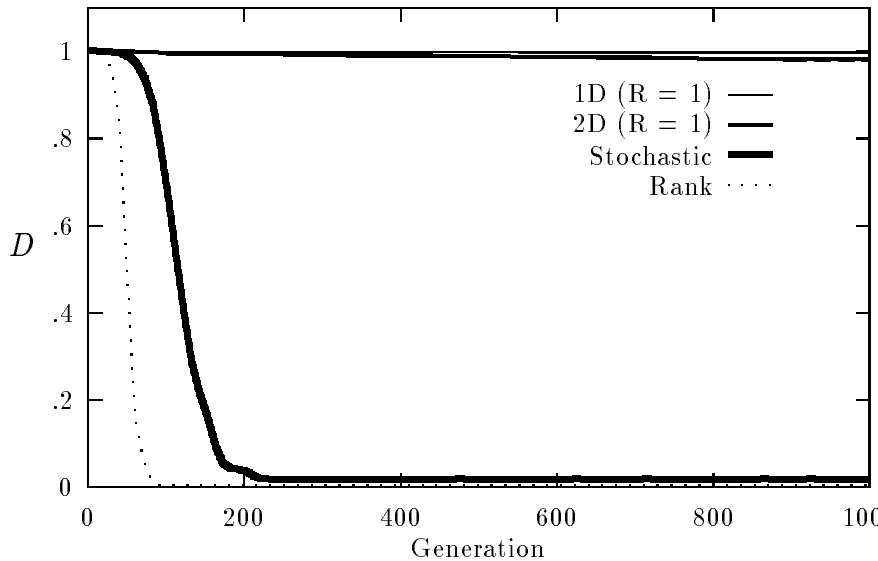
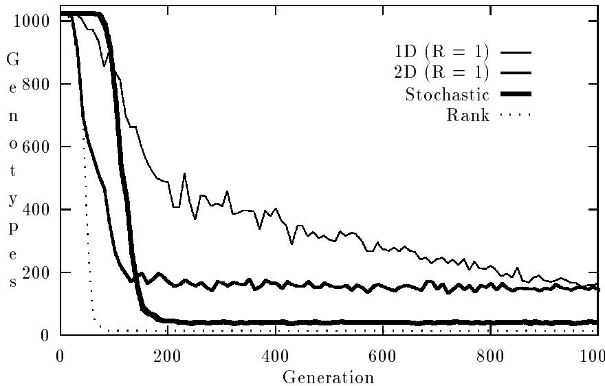
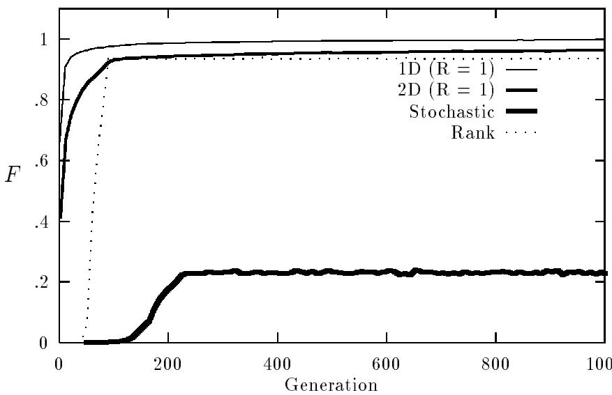
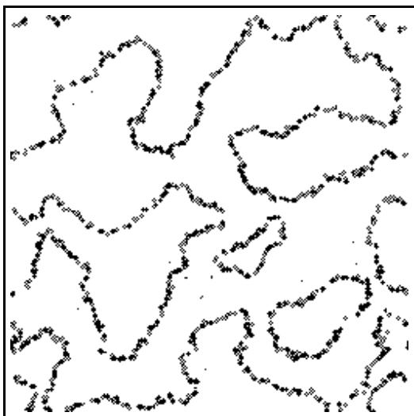

# Selection in Massively Parallel Genetic Algorithms

Robert J. Collins   
David R. Jeerson   
Articial Life Laboratory   
Department of Computer Science   
University of California Los Angeles   
Los Angeles CA 90024

# Abstract

The availability of massively parallel computers makes it possible to apply genetic algorithms to large populations and very complex applications. Among these applications are studies of natural evolution in the emerging eld of articial life, which place special demands on the genetic algorithm. In this paper, we characterize the dierence between panmictic and local selection/mating schemes in terms of diversity of alleles, diversity of genotypes, the inbreeding coecient, and the speed and robustness of the genetic algorithm. Based on these metrics, local mating appears to not only be superior to panmictic for articial evolutionary simulations, but also for more traditional applications of genetic algorithms.

# 1 Introduction

The availability of powerful supercomputers such as the Connection Machine (Hillis 1985) means that genetic algorithms are now applied to larger and more dicult optimization problems (e.g. (Collins and Jeerson 1991a), where the search space consists of $2 ^ { 2 5 5 9 0 }$ points). Some of our recent articial life work (Jeerson et al. 1991; Collins and Jeerson 1991b; Collins and Jeerson 1991c; Collins and Jeerson 1991a) has involved massively parallel genetic algorithms characterized by large populations, enormous search spaces, and tness functions that change through time.

These simulated evolution applications place special demands on the genetic algorithm. The simulations generally attempt to model the evolution of populations of tens of thousands of articial organisms in a simulated environment over a period of thousands of generations. The ecosystem in which the tness of each individual is evaluated can potentially include both direct and indirect interactions with other members of the population, members of coevolving populations, the background environment, etc. In addition, the environment and selection criteria may change both during a generation and over a period of many generations (and may be dierent in dierent parts of the simulated world). Such applications require a genetic algorithm that is able to simultaneously explore a wide range of genotypes and can maintain enough genetic diversity to respond to changing conditions.

Genetic algorithms that use panmictic selection and mating (where any individual can potentially mate with any other) typically converge on a single peak of multimodal functions, even when several solutions of equal quality exist (Deb and Goldberg 1989). Genetic convergence is a serious problem when the adaptive landscape is constantly changing as it does in both natural and articial ecosystems. Crowding, sharing, and restrictive mating are modications to panmictic selection schemes that have been proposed to deal with the problem of convergence, and thus allow the population to simultaneously contain individuals on more than one peak in the adaptive landscape (De Jong 1975; Goldberg and Richardson 1987; Deb and Goldberg 1989). These modications are motivated by the natural phenomena of niches, species, and assortative mating, but they make use of global knowledge of the population, phenotypic distance measures, and global selection and mating, and thus are not well suited for parallel implementation. Rather than attempting to directly implement these natural phenomena, we exploit the fact that they are emergent properties of local mating.

In this paper, we introduce several metrics for evolving populations, and use them to characterize the dierences between local and panmictic selection/mating schemes. Although our target applications involve the evolution of articial organisms, for computational convenience we have performed this study using the optimization of graph partitions as the evolutionary task.

The results of this empirical study indicate that local mating is more appropriate for articial evolution than the panmictic mating schemes that are usually used in genetic algorithms. In addition, local mating appears to be superior to panmictic mating, even when considering traditional applications. Local mating (a) nds optimal solutions in faster; (b) typically nds multiple optimal solutions in the same run; and (c) is much more robust. These results are encouraging, but are based on a single optimization problem, a single recombination rate, a single mutation rate, one local mating algorithm and large populations. Further investigation seems both appropriate and necessary.

# 2 Graph Partitioning

The graph partitioning problem (Ackley 1987) is to nd two subsets $V _ { 0 }$ and $V _ { 1 }$ of the set $V$ of vertices of a xed graph $G$ such that $V = V _ { 0 } \cup V _ { 1 }$ , $V _ { 0 } \cap V _ { 1 } = \emptyset$ , $| V _ { 0 } | = | V _ { 1 } |$ (which assumes that $| V |$ is even) and the cut size (the number of edges with one endpoint in $V _ { 0 }$ and the other in $V _ { 1 }$ ) is minimized. We represent a partition of $G$ by a string $S$ of $| V |$ bits, such that vertex $i \in V _ { S [ i ] }$ (the value of each bit indicates to which subset the corresponding vertex belongs).

In order to incorporate this problem statement into a genetic algorithm, we use the tness function dened by Ackley (Ackley 1987) which has a penalty that is quadratic in the imbalance of a partition:

$$
f ( x ) = - c u t s i z e ( x ) - 0 . 1 ( Z ( x ) - O ( x ) ) ^ { 2 }
$$

where $x$ is an arbitrary bit string, $Z ( x )$ is the number of $0$ 's in $x$ , and $O ( x )$ is the number of 1's in $x$ . The cutsize and penalty term are given negative signs to make this a function maximization problem (with maximum value of 0).

There is little structure in small random graphs, so good partitions are relatively easy to nd by simple hill climbing methods (Ackley 1987). To make the problem harder, a \clumpy" or multilevel graph is used (a clump is a strongly connected group of vertices). We adopt Ackley's multilevel graphs, where a clump consists of four fully connected vertices, and each graph consists of two identical, disconnected pieces (so the optimal partition has tness 0). Each of the connected components of the graph connects its clumps in a hypercube. For example, a 64 vertex multilevel graph consists of 16 clumps. Each of the two connected components is cube with a clump in each of the 8 corners.

We place the vertices within each clump and each connected component consecutively on the string $S$ . This means that there are two optimal solutions to the multilevel graph partitioning problem: $\frac { | V | } { 2 }$ 0's followed by $\mathrm { ~ \bf ~ \underline { { \tilde { | } { \cal V } } | } ~ } _ { 1 } \mathrm { \boldsymbol { \cdot } _ { s } }$ , and the bitwise complement.

To the genetic algorithm, the clumps act as short, low{order and highly t schemata, thus the search is quickly focused on partitions that do not cut clumps. In order to continue the search for an optimal partition, it is necessary to move clumps across the partition via recombination. Recombination is necessary because moving a clump across the cut one vertex at a time (i.e. by point mutations) results in a dramatic decrease in tness. The result is that the multilevel graph partitioning problem is dicult for genetic algorithms, unless convergence can be avoided (recombination requires diversity in order to have an impact, and convergence implies little diversity).

# 3 Evolution Metrics

In this section, we introduce four metrics that we use to characterize evolving populations. These particular metrics were chosen in order to measure and highlight the dierences in the evolutionary dynamics of structured (locally mating) and panmictic (globally mating) populations.

# 3.1 Diversity of Alleles

We measure the allele diversity of a population by comparing the observed allele frequencies to the expected allele frequencies of a maximally diverse population. In this paper, we consider loci with exactly 2 alleles, so the maximum diversity occurs when each allele frequency is 0.5. We dene the diversity of alleles of a population at locus (bit position) $i$ as

$$
D _ { i } = 1 - 4 ( 0 . 5 - o b s e r v e d _ { - } f r e q _ { i } ) ^ { 2 }
$$

where observed f reqi is the frequency of the 0 allele at locus $i$ . $D _ { i }$ can range from 0, which indicates complete xation (convergence), to 1 which indicates the maximum possible genetic diversity. $D$ , the genetic diversity of the population for the entire genome $S$ , is

$$
D = \frac { \sum D _ { i } } { | S | }
$$

which also ranges from 0 (xation) to 1 (maximal diversity).

# 3.2 Diversity of Genotypes

We measure genotypic diversity by choosing a random sample (without replacement) of 10 loci and count the number of unique genotypes (with respect to these loci) represented in the population. A new set of loci is sampled each generation. This provides a measure of the breadth of the genetic search.

# 3.3 Inbreeding Coecient

We dene inbreeding to be the mating of two individuals who are more similar to each other than would be expected if mates were chosen randomly. The primary eect of inbreeding is to decrease the frequency of heterozygous genotypes (Hartl and Clark 1989). A (diploid) genotype is heterozygous at a locus if the two haplotypes contain dierent alleles at that locus. The inbreeding coecient $F$ is calculated by comparing the actual proportion of heterozygous genotypes in the population with the proportion that would occur under random mating. Heterozygosity (and thus the inbreeding coecient) is dened in terms of diploid organisms, but with few exceptions genetic algorithms use haploid strings. Only during sexual reproduction are our individuals diploid so this is when we measure $F$ .

Let $H$ be the observed proportion of heterozygous genotypes, and $H _ { 0 }$ be the expected heterozygosity in a randomly mating population with the same allele frequencies. The standard form for $F$ is

$$
F = \frac { H _ { 0 } - H } { H _ { 0 } }
$$

In this paper, there are two alleles (0 and 1) at each locus, so (from the Hardy{ Weinberg principle) $H _ { 0 } = 2 p ( 1 - p )$ , where $p$ is the frequency of the 0 allele.

# 3.4 Speed and Robustness

We measure the speed of evolution achieved by a genetic algorithm in two ways.

 Number of generations required to discover an acceptable solution. This measure allows implementation independent comparisons.   
 Computational time required to discover an acceptable solution. This measure takes into account the varying computational costs of the reproduction portion of the genetic algorithm.

We dene the robustness to be the fraction of runs that nd at least one acceptable solution. In this paper, we dene an acceptable solution as either of the two optimal graph partitions. Since we do not always discover acceptable solutions, we stop such runs at 1000 generations. We report speed in terms of the median run (of all runs, including those that do not nd optimal partitions).

# 4 Selection Schemes

# 4.1 Local Selection

One of the basic assumptions of Wright's shifting balance theory of evolution is that spatial structure exists in large populations (Wright 1969; Crow 1986). The structure is in the form of demes , or semi{isolated subpopulations, with relatively thorough gene mixing within a deme, but restricted gene 
ow between demes. One way that demes can form in a continuous population and environment is isolation by distance : the probability that a given parent will produce an ospring at a given location is a fast{declining function of the geographical distance between the parent and ospring locations. Wright's theory of evolution has played a role in the design of several parallel genetic algorithms (Muhlenbein 1989; Gorges-Schleuter 1989; Manderick and Spiessens 1989; Collins and Jeerson 1991a).

To simulate isolation by distance in the selection and mating process, we place the individuals on a toroidal, 1 or 2 dimensional grid, with one organism per grid location. Selection and mating take place locally on this grid, with each individual competing and mating with its nearby neighbors. In our local mating scheme, the two parents of each ospring are the highest scoring individual encountered during two random walks that begin at the ospring location, one parent per walk. The parents are chosen with replacement, so it possible for the same high{scoring individual to be encountered during both random walks, in which case it would act as both parents for the ospring. Deme size (and thus the rate of gene 
ow) is a function of $R$ , the length of the random walks.

# 4.2 Stochastic Selection

The most typical panmictic selection strategy that is used in genetic algorithms is known as stochastic selection with replacement (or roulette wheel selection) (Goldberg 1989). We dene the probability that individual $x$ is chosen as a parent as

$$
P ( x ) = { \frac { f _ { x } } { \sum f _ { i } } }
$$

The stochastic selection algorithm assumes that all tness values are non{negative. Because $f _ { x } \leq 0$ for the graph partitioning problem, we adjust the tness scores for the stochastic selection algorithm

$$
f _ { x } ^ { \prime } = f _ { x } + | \operatorname* { m i n } f _ { i } |
$$

where $f _ { x }$ is the tness of partition $x$ .

# 4.3 Linear Rank Selection

Another panmictic selection algorithm is the linear rank method (Grefenstette and Baker 1989). The linear rank selection algorithm denes the target sampling rate (TSR) of an individual $x$ as

$$
T S R ( x ) = M i n + ( M a x - M i n ) \frac { r a n k ( x ) } { N - 1 }
$$

where $r a n k ( x )$ is the index of $x$ when the population is sorted in increasing order based on tness, and $N$ is the population size. Also, the constraints that $0 \leq T S R ( x )$ , $\Sigma T S R ( x ) = N$ , $1 \leq M a x \leq 2$ , and $M i n + M a x = 2$ are imposed. The TSR is the number of times an individual should be chosen as a parent for every $N$ sampling operations.

# 5 Empirical Results

We have compared various genetic algorithms on the multilevel graph partitioning problem. The selection algorithms that we used were local mating in both 1 and 2 dimensional geometries (for $R = \{ 1 , 2 , 3 , 5 , 1 0 , 2 0 , 3 0 \}$ ), linear rank selection (with $M i n = 0 . 0$ and $M a x = 2 . 0$ ), and stochastic selection with replacement. The optimization problem is the partitioning of the 64{vertex multilevel graph. The population size $N$ varies over a range from $2 ^ { 1 3 } = 8 , 1 9 2$ to $2 ^ { 1 9 } = 5 2 4 , 2 8 8$ individuals in each generation. In this section, we present only a representative sample of our results, because space constraints prevent us from presenting all of our data here.

The genetic operators include both recombination and mutation. During recombination, crossovers occur with a constant probability of 0.02 between each pair of consecutive bits, so most matings $( 6 4 \% )$ will result in zero or one crossovers, but some matings may result in many crossovers. In a similar way, point mutations (bit 
ips) occur with a constant probability of 0.001 per bit, with only $6 \%$ of the individuals experiencing one or more mutations.

# 5.1 Diversity of Alleles

The diversity of alleles over time that is maintained by the four selection algorithms is plotted in Figure 1. Both of the panmictic selection algorithms quickly lose diversity, while both of the local selection schemes maintain a high degree of variation. Although the 1 dimensional local scheme maintains nearly perfect variation, the 2 dimensional algorithm loses a small amount over time. Of the two panmictic selection algorithms, linear ranking loses diversity sooner and stabilizes at a lower level.

  
Figure 1: The diversity of alleles $D$ maintained by the four selection algorithms. $N = 2 ^ { 1 6 } = 6 5 , 5 3 6$ and the task is the 64 vertex multilevel graph. Each curve is the average of 7 runs.

# 5.2 Diversity of Genotypes

The genotypic diversity for the four selection algorithms is plotted in Figure 2. This data is based on a random sample (with a new sample each generation) of 10 of the 64 loci in the genome. In all four cases, the genotypic diversity begins to fall after only a few generations. Both of the local mating schemes maintain a count of about 150 genotypes (out of a possible 1024), while stochastic selection remains around 40, and linear rank selection around 15. With the exception of 1 dimensional local mating, all of the algorithms quickly reach their stable values.

  
Figure 2: The genotypic diversity for the four selection algorithms, based on sampling 10 loci per generation. $N = 2 ^ { 1 6 } = 6 5 , 5 3 6$ and the task is the 64 vertex multilevel graph. Each curve is the average of 7 runs.

# 5.3 Inbreeding Coecient

The inbreeding coecient for the four selection algorithms is plotted in Figure 3. In the early generations, both of the panmictic selection algorithms show no excess homozygosity ( $F$ near 0), while both local algorithms immediately show signicant and increasing excess homozygosity. A signicant degree of inbreeding is observed in later generations with both panmictic algorithms, and throughout the experiments for both local selection schemes. In later generations stochastic selection is characterized by a much lower inbreeding coecient than the others.

# 5.4 Speed and Robustness

The rst speed comparison is based on the number of generations to the rst appearance of an optimal partitioning of the 64 vertex graph (Table 1). Of the two panmictic selection algorithms, linear rank selection nds solutions nearly twice as fast as stochastic selection. We also note that both panmictic algorithms do not reliably nd optimal solutions when applied to the smaller populations. For both local mating algorithms, longer random walks result in faster evolution, and for the same $R$ value 2 dimensional local mating is faster than 1 dimensional local mating. With the exception of the most constrained local mating (1 dimensional with $R = 1$ ) local mating always beats panmictic, and in some cases by about a factor of 7.

  
Figure 3: The inbreeding coecient $F$ for the four selection algorithms. $N = 2 ^ { 1 6 } = 6 5 , 5 3 6$ and the task is the 64 vertex multilevel graph. Each curve is the average of 7 runs.

<table><tr><td rowspan=2 colspan=1>Algorithm</td><td rowspan=1 colspan=7>log2 PopulationSize</td></tr><tr><td rowspan=1 colspan=1>13</td><td rowspan=1 colspan=1>14</td><td rowspan=1 colspan=1>15</td><td rowspan=1 colspan=1>16</td><td rowspan=1 colspan=1>17</td><td rowspan=1 colspan=1>18</td><td rowspan=1 colspan=1>19</td></tr><tr><td rowspan=1 colspan=1>Stochastic</td><td rowspan=1 colspan=1>$</td><td rowspan=1 colspan=1>$</td><td rowspan=1 colspan=1>151</td><td rowspan=1 colspan=1>137</td><td rowspan=1 colspan=1>119</td><td rowspan=1 colspan=1>†</td><td rowspan=1 colspan=1>136</td></tr><tr><td rowspan=1 colspan=1>Linear Rank</td><td rowspan=1 colspan=1>1</td><td rowspan=1 colspan=1>57</td><td rowspan=1 colspan=1>66</td><td rowspan=1 colspan=1>52</td><td rowspan=1 colspan=1>35</td><td rowspan=1 colspan=1>32</td><td rowspan=1 colspan=1>31</td></tr><tr><td rowspan=1 colspan=1>1D(R = 1)</td><td rowspan=1 colspan=1>156</td><td rowspan=1 colspan=1>148</td><td rowspan=1 colspan=1>142</td><td rowspan=1 colspan=1>124</td><td rowspan=1 colspan=1>126</td><td rowspan=1 colspan=1>108</td><td rowspan=1 colspan=1>114</td></tr><tr><td rowspan=1 colspan=1>1D(R=5)</td><td rowspan=1 colspan=1>85</td><td rowspan=1 colspan=1>79</td><td rowspan=1 colspan=1>59</td><td rowspan=1 colspan=1>63</td><td rowspan=1 colspan=1>57</td><td rowspan=1 colspan=1>49</td><td rowspan=1 colspan=1>50</td></tr><tr><td rowspan=1 colspan=1>1D(R = 10)</td><td rowspan=1 colspan=1>56</td><td rowspan=1 colspan=1>50</td><td rowspan=1 colspan=1>47</td><td rowspan=1 colspan=1>50</td><td rowspan=1 colspan=1>43</td><td rowspan=1 colspan=1>40</td><td rowspan=1 colspan=1>41</td></tr><tr><td rowspan=1 colspan=1>1D(R = 20)</td><td rowspan=1 colspan=1>42</td><td rowspan=1 colspan=1>40</td><td rowspan=1 colspan=1>37</td><td rowspan=1 colspan=1>37</td><td rowspan=1 colspan=1>34</td><td rowspan=1 colspan=1>30</td><td rowspan=1 colspan=1>27</td></tr><tr><td rowspan=1 colspan=1>1D(R = 30)</td><td rowspan=1 colspan=1>41</td><td rowspan=1 colspan=1>39</td><td rowspan=1 colspan=1>32</td><td rowspan=1 colspan=1>32</td><td rowspan=1 colspan=1>29</td><td rowspan=1 colspan=1>26</td><td rowspan=1 colspan=1>24</td></tr><tr><td rowspan=1 colspan=1>2D(R = 1)</td><td rowspan=1 colspan=1>48</td><td rowspan=1 colspan=1>43</td><td rowspan=1 colspan=1>41</td><td rowspan=1 colspan=1>42</td><td rowspan=1 colspan=1>40</td><td rowspan=1 colspan=1>40</td><td rowspan=1 colspan=1>38</td></tr><tr><td rowspan=1 colspan=1>2D(R=5)</td><td rowspan=1 colspan=1>23</td><td rowspan=1 colspan=1>20</td><td rowspan=1 colspan=1>16</td><td rowspan=1 colspan=1>17</td><td rowspan=1 colspan=1>16</td><td rowspan=1 colspan=1>16</td><td rowspan=1 colspan=1>15</td></tr><tr><td rowspan=1 colspan=1>2D(R = 10)</td><td rowspan=1 colspan=1>14</td><td rowspan=1 colspan=1>13</td><td rowspan=1 colspan=1>13</td><td rowspan=1 colspan=1>12</td><td rowspan=1 colspan=1>12</td><td rowspan=1 colspan=1>11</td><td rowspan=1 colspan=1>11</td></tr><tr><td rowspan=1 colspan=1>2D(R = 20)</td><td rowspan=1 colspan=1>13</td><td rowspan=1 colspan=1>11</td><td rowspan=1 colspan=1>10</td><td rowspan=1 colspan=1>11</td><td rowspan=1 colspan=1>9</td><td rowspan=1 colspan=1>9</td><td rowspan=1 colspan=1>9</td></tr><tr><td rowspan=1 colspan=1>2D(R = 30)</td><td rowspan=1 colspan=1>11</td><td rowspan=1 colspan=1>8</td><td rowspan=1 colspan=1>9</td><td rowspan=1 colspan=1>9</td><td rowspan=1 colspan=1>8</td><td rowspan=1 colspan=1>8</td><td rowspan=1 colspan=1>8</td></tr></table>

Table 1: Generation of rst appearance of an optimal partition (median of 11 runs) on the 64 vertex multilevel graph problem. $\dagger$ indicates that the median run did not nd an optimal solution within 1000 generations.

<table><tr><td rowspan=2 colspan=1>Algorithm</td><td rowspan=1 colspan=8>log2 Population Size</td></tr><tr><td rowspan=1 colspan=2>14</td><td rowspan=1 colspan=1>15</td><td rowspan=1 colspan=1>16</td><td rowspan=1 colspan=1>17</td><td rowspan=1 colspan=1>18</td><td rowspan=1 colspan=2>19</td></tr><tr><td rowspan=1 colspan=1>Stochastic</td><td rowspan=1 colspan=2>0.57</td><td rowspan=1 colspan=1>165 (1.09)</td><td rowspan=1 colspan=1>285(2.08)</td><td rowspan=1 colspan=1>552(4.64)</td><td rowspan=1 colspan=1>(9.47</td><td rowspan=1 colspan=2>2652(19.50)</td></tr><tr><td rowspan=1 colspan=1>Linear Rank</td><td rowspan=1 colspan=2>40 (0.70)</td><td rowspan=1 colspan=1>83(1.26)</td><td rowspan=1 colspan=1>132(2.54)</td><td rowspan=1 colspan=1>200(5.72)</td><td rowspan=1 colspan=1>379 (11.84)</td><td rowspan=1 colspan=2>755 (24.34)</td></tr><tr><td rowspan=1 colspan=1>1D (R = 1)</td><td rowspan=1 colspan=2>24 (0.16)</td><td rowspan=1 colspan=1>41 (0.29)</td><td rowspan=1 colspan=1>70(0.56)</td><td rowspan=1 colspan=1>139(1.10)</td><td rowspan=1 colspan=1>264(2.44)</td><td rowspan=1 colspan=2>540(4.74)</td></tr><tr><td rowspan=1 colspan=1>1D(R= 5)</td><td rowspan=1 colspan=2>15 (0.19)</td><td rowspan=1 colspan=1>21 (0.35)</td><td rowspan=1 colspan=1>42(0.67)</td><td rowspan=1 colspan=1>81(1.42)</td><td rowspan=1 colspan=1>133(2.72)</td><td rowspan=1 colspan=2>265(5.29)</td></tr><tr><td rowspan=1 colspan=1>1D(R = 10)</td><td rowspan=1 colspan=2>13 (0.25)</td><td rowspan=1 colspan=1>20 (0.42)</td><td rowspan=1 colspan=1>37(0.74)</td><td rowspan=1 colspan=1>65 (1.50)</td><td rowspan=1 colspan=1>122(3.06)</td><td rowspan=1 colspan=2>252(6.15)</td></tr><tr><td rowspan=1 colspan=1>1D(R = 20)</td><td rowspan=1 colspan=2>16 (0.39)</td><td rowspan=1 colspan=1>20 (0.54)</td><td rowspan=1 colspan=1>35(0.95)</td><td rowspan=1 colspan=1>72 (2.13)</td><td rowspan=1 colspan=1>116(3.85)</td><td rowspan=1 colspan=2>199(7.38)</td></tr><tr><td rowspan=1 colspan=1>1D(R = 30)</td><td rowspan=1 colspan=2>16 (0.42)</td><td rowspan=1 colspan=1>22 (0.69)</td><td rowspan=1 colspan=1>38(1.18)</td><td rowspan=1 colspan=1>71 (2.44</td><td rowspan=1 colspan=1>120(4.61)</td><td rowspan=1 colspan=2>216(9.00)</td></tr><tr><td rowspan=1 colspan=1>2D(R= 1)</td><td rowspan=1 colspan=2>7 (0.16)</td><td rowspan=1 colspan=1>12 (0.29)</td><td rowspan=1 colspan=1>25(0.59)</td><td rowspan=1 colspan=1>51(1.28)</td><td rowspan=1 colspan=1>98 (2.46)</td><td rowspan=1 colspan=2>185(4.87)</td></tr><tr><td rowspan=1 colspan=1>2D(R = 5)</td><td rowspan=1 colspan=2>4(0.22)</td><td rowspan=1 colspan=1>6 (0.38)</td><td rowspan=1 colspan=1>12(0.73)</td><td rowspan=1 colspan=1>26 (1.62)</td><td rowspan=1 colspan=1>48 (3.01)</td><td rowspan=1 colspan=2>86(5.72)</td></tr><tr><td rowspan=1 colspan=1>2D(R = 10)</td><td rowspan=1 colspan=2>3 (0.26)</td><td rowspan=1 colspan=1>6 (0.47)</td><td rowspan=1 colspan=1>10 (0.87)</td><td rowspan=1 colspan=1>22 (1.86)</td><td rowspan=1 colspan=1>39 (3.54)</td><td rowspan=1 colspan=2>75 (6.86)</td></tr><tr><td rowspan=1 colspan=1>2D(R = 20)</td><td rowspan=1 colspan=2>4 (0.39)</td><td rowspan=1 colspan=1>7 (0.67)</td><td rowspan=1 colspan=1>13 (1.22)</td><td rowspan=1 colspan=1>23 (2.58)</td><td rowspan=1 colspan=1>43 (4.82)</td><td rowspan=1 colspan=2>83(9.27)</td></tr><tr><td rowspan=1 colspan=1>2D(R = 30)</td><td rowspan=1 colspan=1>4(0.53)</td><td rowspan=1 colspan=1>−</td><td rowspan=1 colspan=1>8 (0.91)</td><td rowspan=1 colspan=1>14 (1.60)</td><td rowspan=1 colspan=1>26 (3.29)</td><td rowspan=1 colspan=1>49 (6.14)</td><td rowspan=1 colspan=1>93 (11.67)</td><td rowspan=1 colspan=1>−</td></tr></table>

Table 2: Computation time (seconds) to the rst appearance of an optimal partition (median of 11 runs) on the 64 vertex multilevel graph problem. The time (seconds) per generation is shown in parentheses. $\dagger$ indicates that the median run did not nd an optimal solution within 1000 generations.

Across all of the genetic algorithms, increasing the population size causes only slight speed improvements (in terms of number of generations to an optimal solution). In addition, we found that an optimal solution is either found within a couple hundred generations, or the run times out (across all selection algorithms). We never observed a run that rst discovered an optimal solution between generation 200 and 1000.

The second speed comparison is based on the actual time required to nd an optimal solution (Table 2). The run{time measurements reported here are based on implementations in $\mathrm { C + + / C M + + }$ (Collins 1990) that dier only in the selection/mate choice code. The data was gathered on an 16K processor Connection Machine{2 equipped with 64K bits of memory per processor and 32-bit 
oating point accelerators, with a Sun $4 / 3 3 0$ front end running SunOS 4.1.1 and Connection Machine software version 6 0

Although the run time per generation for stochastic selection is less than linear rank selection it still requires more than twice as much time to nd optimal solutions. For local mating, although long random walks require signicant computation, the fastest evolution occurs when $R$ is in the range $5 < R < 2 0$ . Even with long random walks, the local mating algorithms run signicantly faster (per generation) than the panmictic algorithms, which accentuates the fact that local mating optimizes in fewer generations.

When we compare the fastest panmictic algorithm that we implemented (linear rank) to our slowest local mating algorithm (1 dimensional with $R = 1$ ), we nd that local mating is faster by about a factor of 2. When compared to the fastest local mating algorithm (2 dimensional with $R = 1 0$ ), linear rank is slower by more than an order of magnitude and stochastic selection is slower by about a factor of 25.

We measure the robustness of the various genetic algorithms in terms of the fraction of runs that nd one of the two optimal solutions within 1000 generations. None of the local mating runs, across all population sizes and $R$ values, failed to nd an optimal solution. Unlike the local algorithms, the panmictic algorithms are not $1 0 0 \%$ robust (Table 3). Of the two panmictic algorithms, linear rank selection is more

<table><tr><td rowspan=1 colspan=1>log2 N</td><td rowspan=1 colspan=1>Linear Rank</td><td rowspan=1 colspan=1>Stochastic</td></tr><tr><td rowspan=1 colspan=1>13</td><td rowspan=1 colspan=1>0.45</td><td rowspan=1 colspan=1>0.27</td></tr><tr><td rowspan=1 colspan=1>14</td><td rowspan=1 colspan=1>0.55</td><td rowspan=1 colspan=1>0.36</td></tr><tr><td rowspan=1 colspan=1>15</td><td rowspan=1 colspan=1>0.64</td><td rowspan=1 colspan=1>0.64</td></tr><tr><td rowspan=1 colspan=1>16</td><td rowspan=1 colspan=1>0.82</td><td rowspan=1 colspan=1>0.55</td></tr><tr><td rowspan=1 colspan=1>17</td><td rowspan=1 colspan=1>1.0</td><td rowspan=1 colspan=1>0.55</td></tr><tr><td rowspan=1 colspan=1>18</td><td rowspan=1 colspan=1>1.0</td><td rowspan=1 colspan=1>0.27</td></tr><tr><td rowspan=1 colspan=1>19</td><td rowspan=1 colspan=1>1.0</td><td rowspan=1 colspan=1>0.73</td></tr><tr><td rowspan=1 colspan=1>overall</td><td rowspan=1 colspan=1>0.78</td><td rowspan=1 colspan=1>0.48</td></tr></table>

robust.

# 6 Discussion

Simulations of the evolution of articial organisms operate on large populations in complex and changing ecosystems. The adaptive landscapes are generally enormous (hundreds or thousands of orders of magnitude larger than the population size) and constantly changing. Articial life simulations require a genetic algorithm that is resistant to convergence and can simultaneously explore dierent parts of the adaptive landscape.

Local mating should be resistant to convergence, because each deme can explore dierent peaks in the adaptive landscape. Small demes allow eective exploration of the adaptive landscape, because temporary reductions in tness are possible, due to random genetic drift (selection would prevent this in a large population) (Provine 1986). When a deme discovers a higher adaptive peak, the new genotype will spread and deliver more genes to the nearby demes. This results in the gradual spread of the favorable alleles and allele combinations throughout the population, by means of interdeme selection.

In our empirical experiments, we have observed that the panmictic selection algorithms become focused towards one of the two optimal solutions in the very early generations, and eventually converge on or near that solution. In fact, we have not observed a single run in which a panmictic selection algorithm discovered both optimal solutions. In sharp contrast, the local mating algorithms consistently discover both optimal solutions. For all but the smallest population sizes both optimal solutions are usually discovered many times in any one run by geographically separated demes. Every run with a large, locally mating population resulted in a nearly even mixture of both optimal solutions, and formed genetically homogeneous regions that are separated by boundaries (composed of low{tness hybrids) that are stable for thousands of generations (Figure 4).

The genetic diversity data (Figure 1) demonstrates quite dramatically how panmictic selection converges towards only one of the solutions, while local selection contains a nearly equal mix of both. (Remember that the two solutions are bitwise complements of each other.) Local selection also maintains much greater diversity of genotypes than panmictic selection (Figure 2). What we expect to see is a cloud of mutants surrounding (in the adaptive landscape) an optimal solution. Because local mating nds and maintains both optimal solutions but panmictic mating nds only one, we would expect local mating to have something like twice the genotypic diversity of panmictic selection. This is clearly not the case|we observe a factor of 4 dierence from stochastic selection and a factor of 10 from linear rank selection. We nd this dierence to be particularly important, because it demonstrates that at equilibrium, local selection explores many more genotypes in each generation.

  
Figure 4: The geographical distribution of tness scores in generation 150 a run using the 2 dimensional local mating algorithm $( R = 1 )$ with a population size of $2 ^ { 1 6 } = 6 5 , 5 3 6$ on the 64{vertex multilevel graph partitioning problem. Individuals scoring less than $- 3$ are represented by black pixels.

The inbreeding coecient results (Figure 3) are quite interesting, because they show two dierent sources of inbreeding. As we expected, local mating is characterized by a high degree of inbreeding throughout the experiment. The inbreeding is a result of xation on a particular genotype within each deme due to selection pressure and random genetic drift. The xation is local|diversity is maintained because each deme xes on a dierent genotype.

On the other hand, panmictic selection results in almost no inbreeding until the population begins to converge on a particular solution. When this occurs, we start to observe excess homozygosity, which is due to selection for the optimal genotype. Linear rank selection shows a very high degree of inbreeding, indicating that very few sub{optimal genotypes are chosen as parents for the next generation. In contrast, stochastic selection shows a much lower degree of inbreeding. This shows that the stochastic selection algorithm allows sub{optimal genotypes to be sampled with a higher frequency (which is consistent with the greater allele and genotype diversity).

The diversity and inbreeding data demonstrate the dramatic dynamical dierences between local and panmictic mating. It is clear that local mating is more appropriate for articial evolution, because it maintains a broad genetic search for thousands of generations. If the adaptive landscape or tness function were changing over time, this diversity would allow the population to exploit the genotypes which suddenly have higher relative tness values. Local mating would be more appropriate than panmictic mating for articial life applications, even if local mating results in slower evolution. Fortunately this is not the case.

The data on the speed of evolution shows that the dynamics of local mating results in a faster and more robust genetic algorithm. Local mating is characterized by faster evolution both in terms of the number of tness function evaluations and time required to nd an optimal solution. The robustness of local mating is rather surprising: across all population sizes both 1 and 2 dimensional geometries and all $R$ values, local mating never failed to nd an optimal solution, while both of the panmictic algorithms had a signicant fraction of their runs \time out" (no optimal solution found within 1000 generations).

The fact genetic algorithms that use local mating can be signicantly faster and more robust than traditional genetic algorithms is an important result, and suggests that further investigation is in order. While many important theoretical results have been developed for panmictic mating algorithms, it is not clear that any of these results can be applied directly to local mating. Also, it is not at all clear how local mating will perform with small populations, although the dierence in robustness between local and panmictic mating is greatest for the smaller population sizes that we examined. In addition, we have only examined one very simple local mating algorithm, and it is almost certainly not the best that can be (or has been) found.

# Список литературы

We would like to thank Ernst Mayr Joe Pemberton Chuck Taylor Greg Werner and Alexis Wieland for their valuable input. We also acknowledge the three anonymous reviewers for their helpful comments. This work is supported in part by W. M. Keck Foundation grant number W880615 University of California Los Alamos National Laboratory award number CNLS/89{427, and University of California Los Alamos National Laboratory award number UC{90{4{A{88. The empirical data was gathered in part on a CM-2 computer at UCLA under the auspices of National Science Foundation Biological Facilities, grant number BBS 87 14206, and a CM-2 computer at the Advanced Computing Laboratory of Los Alamos National Laboratory under the auspices of the U.S. Department of Energy, contract W{7405{ENG{36.

# References

Ackley, David H. (1987). Stochastic Iterated Genetic Hillclimbing. PhD thesis, Carnegie Mellon Univeristy.

Collins Robert J. (1990). CM++: A C++ interface to the Connection Machine. In Proceedings of the Symposium on Object Oriented Programming Emphasizing Practical Applications. Marist College.

Collins Robert J. and David R. Jeerson (1991a). AntFarm: Towards simulated evolution. In Langton, Christopher G., Charles Taylor, J. Doyne Farmer, and Steen Rasmussen editors Articial Life II volume 10 of Santa Fe Institute Studies in the Sciences of Complexity, pages 579{601. Santa Fe Institute, Addison{Wesley.

Collins Robert J. and David R. Jeerson (1991b). An articial neural network representation for articial organisms. In Schwefel, Hans-Paul and Reinhard Manner, editors, Proceedings of the First Workshop on Parallel Problem Solving, number 496 in Lecture Notes in Computer Science, pages 259{263, Berlin. Springer{ Verlag.

Collins Robert J. and David R. Jeerson (1991c). Representations for articial organisms. In Meyer, Jean-Arcady and Stewart W. Wilson, editors, Proceedings of the First International Conference on Simulation of Adaptive Behavior: From Animals to Animats pages 382{390. The MIT Press/Bradford Books.

Crow, James F. (1986). Basic Concepts in Population, Quantitative, and Evolutionary Genetics. W. H. Freeman and Company, New York.

De Jong, Kenneth A. (1975). An Analysis of the Behavior of a Class of Genetic Adaptive Systems. PhD thesis, University of Michigan.

Deb, Kalyanmoy and David E. Goldberg (1989). An investigation of niche and species formation in genetic function optimization. In Proceedings of the Third International Conference on Genetic Algorithms, pages 42{50. Morgan Kaufmann.

Goldberg, David E. (1989). Genetic Algorithms in Search, Optimization and Machine Learning. Addison{Wesley Publishing Company, Inc.

Goldberg, David E. and Jon T. Richardson (1987). Genetic algorithms with sharing for multimodal function optimization. In Genetic Algorithms and Their Applications: Proceedings of the Second International Conference on Genetic Algorithms, pages 41{49. Lawrence Erlbaum Associates.

Gorges-Schleuter, Martina (1989). ASPARAGOS an asynchronous parallel genetic optimization strategy. In Proceedings of the Third International Conference on Genetic Algorithms, pages 422{427. Morgan Kaufmann.

Grefenstette, John J. and James E. Baker (1989). How genetic algorithms work: A critical look at implicit parallelism. In Proceedings of the Third International Conference on Genetic Algorithms, pages 20{27. Morgan Kaufmann.

Hartl, Daniel L. and Andrew G. Clark (1989). Principles of Population Genetics. Sinauer Associates, Inc., Sunderland, Massachusetts.

Hillis, W. Daniel (1985). The Connection Machine. The MIT Press, Cambridge, Massachusetts.

Jeerson, David, Robert Collins, Claus Cooper, Michael Dyer, Margot Flowers, Richard Korf, Charles Taylor, and Alan Wang (1991). The Genesys System: Evolution as a theme in articial life. In Langton, Christopher G., Charles Taylor J. Doyne Farmer and Steen Rasmussen editors Articial Life II volume 10 of Santa Fe Institute Studies in the Sciences of Complexity pages 549{578. Santa Fe Institute, Addison{Wesley.

Manderick, Bernard and Piet Spiessens (1989). Fine{grained parallel genetic algorithms. In Proceedings of the Third International Conference on Genetic Algorithms, pages 428{433. Morgan Kaufmann.

Muhlenbein, Heinz (1989). Parallel genetic algorithms, population genetics and combinatorial optimization. In Proceedings of the Third International Conference on Genetic Algorithms, pages 416{421. Morgan Kaufmann.

Provine, William B. (1986). Sewall Wright and Evolutionary Biology. University of Chicago Press.

Wright, Sewall (1969). Evolution and the Genetics of Populations. Volume 2: The Theory of Gene Frequencies. University of Chicago Press.