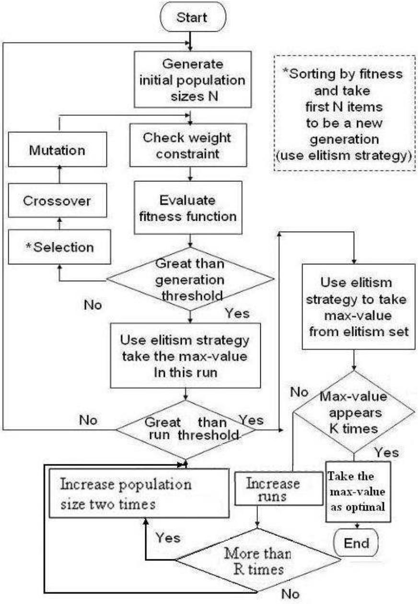
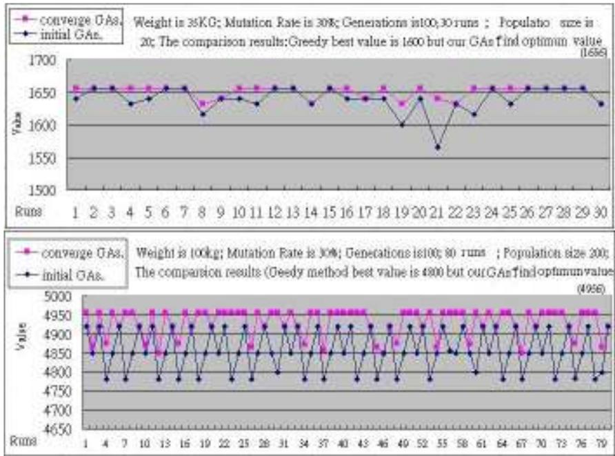
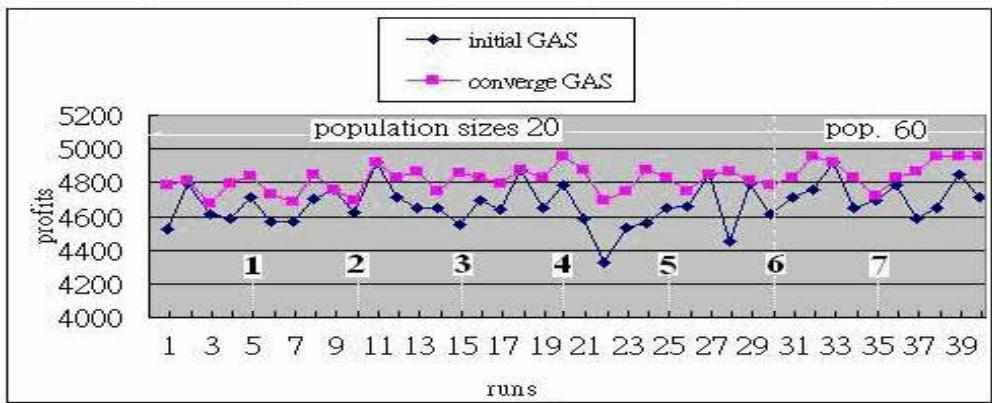
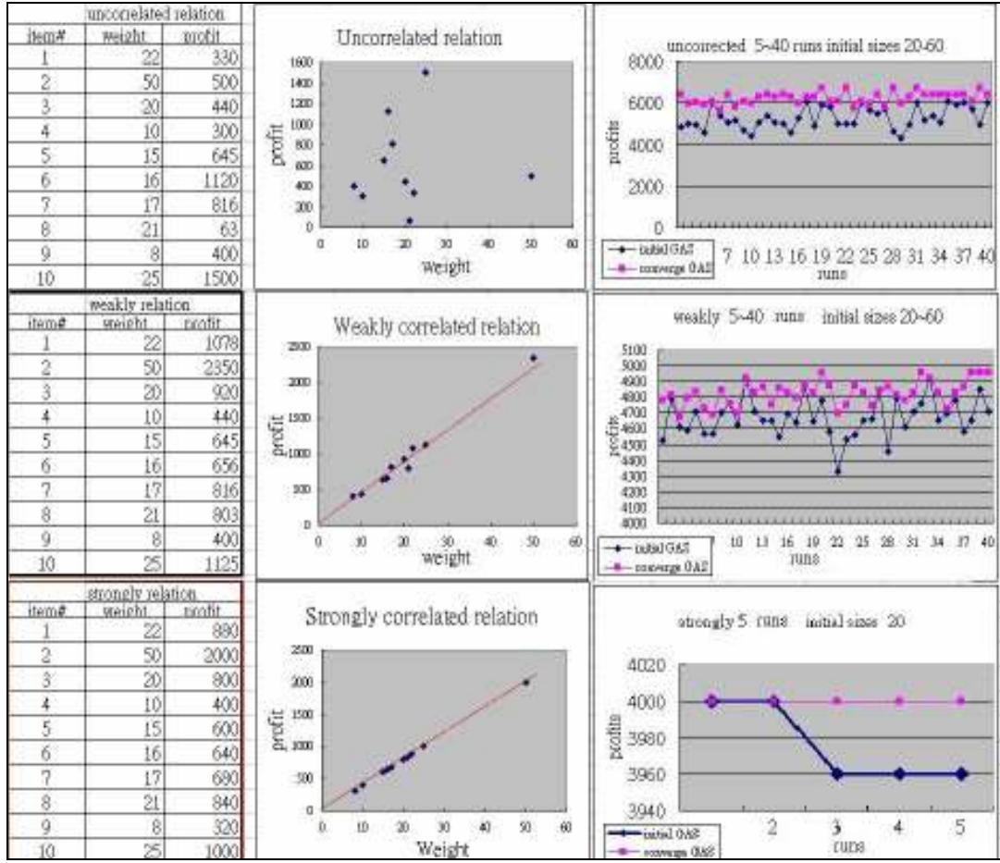

# Solving Unbounded Knapsack Problem Using an Adaptive Genetic Algorithm with Elitism Strategy

\*Rung-Ching Chen, \*Cheng-Huei Jian, +Yung-Fa Huang \*Department of Information Management, +Graduate Institute of of Networking and Communication Engineering, Chaoyang University of Technology 168, Jifong E. Rd., Wufong Township, Taichung County 41349 Taiwan, Republic of China crching@mail.cyut.edu.tw

# Abstract

With the popularity of sensor networks, solving the knapsack problem has become important in selecting the best combination of sensor nodes. Many methods have been proposed to solve the Knapsack problem, but few of them have used the genetic algorithm, especially in unbounded Knapsack problems. In this paper, we use the genetic algorithm to solve the unbounded Knapsack problem. We combine an elite strategy and a self adapting system into the genetic algorithm. Using the elite strategy overcomes the problem of the slow convergence rate of the general genetic algorithm. The elite strategy retains good chromosomes and ensures that they are not eliminated through the mechanism of crossover and mutation, ensuring that the features of the offspring chromosomes are at least as good as their parents. The system automatically adapts the number of the initial population of chromosomes and the number of runs to be executed in the genetic algorithm. It will obtain the best value from the chromosomes of each run executed, and retain the values in an elite group. The optimal value is then taken from the elite group and adopted as the real solution. Experimental results have shown that our method rapidly discovers the best solution of the problem.

# 1. Introduction

The Knapsack problem is used in many practical situations, such as cargo-loading, capital-budgeting, project scheduling, and selection of portfolio investment. For example, in portfolio investment selection, there are many kinds of investment programs. Each program offers differing returns. In this case, the investor wants to find the sum of the selected values that is maximized under the constraint of limited funds for investment.

In a wireless sensor network, many nodes are distributed across a space. Each sensor node will detect and collect information and transfer the information to head nodes, cluster heads, or sink nodes. Selection of suit for nodes that offer the greatest benefit is an important research goal.

The Knapsack problem concerns the choice of items to be placed in a mountaineer’s knapsack: though each item benefits the climber, capacity is limited. It consists of finding the best trade-off of benefit against capacity. Fundamentally, the knapsack problem is a version of the problem of placement of wireless sensor systems: trading off capacity against space.

The Knapsack problem is a well-known NP-complete problem[12]. Many methods have been used to find the optimum solution. Several strategies for solving NP hard optimization problems are known, one of which is the Branch and bound approach, which finds the exact solution. An approximation algorithm is another method, which finds a near optimal solution.

Metaheuristic methods find near optimal solutions as well. Such methods are iterative generation processes that guide a subordinate heuristic by intelligently combining different concepts for exploring and exploiting. Search space learning strategies are used to structure information to efficiently find near-optimal solutions.

Metaheuristic methods consist of several different approaches, such as the trajectory method or the population base method. Genetic algorithms represent one type of population base method. In this paper, we use a metaheuristic method, an adaptive genetic approach, to solve the unbounded Knapsack problem.

The unbounded Knapsack problem is formally defined as follows: there are different items which have different values and weights. The number of each item is unbounded, and there are no restrictions on the choice of items. The problem lies in determining what combination of items yields the greatest benefit for the mountaineer under the capacity constraint. The equation is shown in (1.1). The condition of $\mathbf { X _ { i } }$ is different in the Knapsack problem: its value is a positive integer, including zero.

$$
\begin{array} { l } { { \displaystyle M a x i m i z e \sum _ { i = 1 } ^ { n } x _ { i } p _ { i } } } \\ { { \phantom { \displaystyle M a x i m i z e \sum _ { i = 1 } ^ { n } x _ { i } w _ { i } \leq C } S t \sum _ { i = 1 } ^ { n } x _ { i } ) } } \\ { { \phantom { \displaystyle M a x i m i z e \sum _ { i = 1 } ^ { n } x _ { i } p _ { i } } 0 \leq x _ { i } , x _ { i } \in \mathrm { ~ i n t e g e r ~ } , i = 1 . . . . n } } \end{array}
$$

Mathematically, the unbounded Knapsack problem is defined thusly: We have $n$ kinds of items, $x _ { 1 }$ through $x _ { n }$ . Each item $x _ { \mathrm { i } }$ has a profit value $p _ { \mathrm { i } }$ and a weight $w _ { \mathrm { i } }$ . The maximum weight that we can carry in the bag is $C _ { \mathrm { { ; } } }$ , and each item has many copies. Formulated this way, the unbounded Knapsack problem is an NP-hard optimization problem of combination. Thus, the optimal solution cannot be found in short time when the number of selection items is large[14].

Many papers have suggested using different kinds of heuristic method to evaluate the solutions, including genetic algorithms and simulated annealing [2,7,10,13]. More computing time is required to find solutions for heuristic evaluations, but the most feasible solution can usually be located. The method of randomly researching the optimal solution has been widely applied to different kinds of problems as well. In this research we describe the character of the unbounded Knapsack problem and search for an optimal solution using an adaptive genetic algorithm.

Pisinger[5] gave an overview of all recent exact solution approaches for the Knapsack problem, and showed that the Knapsack problem is still difficult for these algorithms to solve [3]. However, Pisinger’s book does not offer any genetic algorithms for solving the Knapsack problem. Genetic algorithms, originally proposed by Holland, have been applied to many different areas. Li[7] used genetic algorithms to solve the unbounded knapsack problem, using problem-specific knowledge and incorporating a preprocessing procedure, but it was affected by knowledge.

One stumbling block to wider application of the genetic algorithm is that it cannot obtain good results when the search space is large. To improve genetic algorithms, Last [9] proposed a Fuzzy Logic Controller (FLC) that treats the crossover probability as a function of the chromosomes’ age in order to reduce their rate of premature convergence. Javadi[1] presented a hybrid optimization algorithm based on a combination of the neural network and the genetic algorithm which used a back-propagation neural network to improve the convergence of the genetic algorithm in large search spaces for the global optimum solution. The system has to be trained in advance. Haupt[11] has shown that a small population size and a relatively high mutation rate are superior to large population sizes and low mutation rates. Zhiming[17] proposed an improved adaptive genetic algorithm that used a selection probability based on the ranking of fitness values, and adaptively varied the probabilities of crossover and mutation to improve the search capacity. Zhou[8] developed a self-adaptive genetic algorithm (SAGA) that made certain key parameters variable over the evolution of the solution. Yun[15, 16] used a hybrid genetic algorithm with an adaptive local scheme to enhance efficiency.

In this paper we will propose a novel method for finding the optimal solution for the unbounded Knapsack problem based on an adaptive genetic algorithm with an elite selection strategy. The adaptive method can dynamically adjust the scale of population sizes and the number of runs of execution. For small-scale problems it is thus able to rapidly locate optimal solutions, while still able to find the best solutions for large scale problems. We make use of an elite selection strategy that enables rapid convergence and reduced processing time. The experimental results also consider uncorrelated, weakly correlated and strongly correlated data distributions. These experiments showed that our method is not affected by the data relations. The results indicate that our method is not only superior to the greedy method or the general genetic algorithm, but is also capable of finding the optimal solution in a larger search space.

The remainder of the paper is organized as follows. We give a system workflow in section 2. Section 3 introduces the adaptive strategy. In Section 4, we propose a genetic algorithm using the elite strategy. Experimental results are given in section 5. Conclusions and future work are presented in section 6.

# 2. The System Workflow

Let the constraint of the knapsack’s capacity be $\mathrm { ~ C ~ k g ~ }$ . The number of the items is N. The weight of each item is equal to $\mathrm { W } _ { 1 } ,$ $\mathrm { W } _ { 2 } ,$ …, $\mathrm { W _ { N } }$ . Each item has a different profit, given by $\mathrm { { P } } _ { 1 } ,$ $\mathrm { P } _ { 2 } , \ldots , \mathrm { P } _ { \mathrm { N } }$ . The knapsack restriction, its total capacity, is C.

We then use a genetic algorithm to find the optimal solution, under which each item has a profit value and a weight value. Figure 1 shows the workflow of the novel method. First, each initial possible combination has to be encoded into a chromosome, a set of possible combination of items. Next, the system generates a number of chromosomes N. Then, it will check each chromosome’s weight and filter the chromosomes out using the constraint of capacity C. In addition, it evaluates the fitness value of each chromosome. It then checks the number of generations against a threshold. If the number of generations is less than the threshold, the system will process its selection operation using the elite strategy, performing conventional genetic operations: crossover and mutation. After the genetic algorithm is finished, the system takes up the chromosome with the maximum fitness value into the elite set. We take the chromosome with maximum fitness value from the elite set to be the optimal solution, after many runs of the genetic algorithm have been executed. Furthermore, we set an adaptive mechanism that guarantees the best value must appear at least K times. If the number of times the best value appears is less than K times, we increase the number of runs until the threshold is reached. Thus, the system gradually approaches the optimal solution by using the elite strategy.

A case study was used to test the genetic algorithm. To obtain the optimal solution, we observe phenomena associated with the elite strategy, such as the population size, and the number of runs executed, in order to create an adaptive solution. The system is follows the genetic algorithm proposed by John Holland (1975). Generally speaking, processing the genetic algorithm requires 10 steps (Negnevitsky, 2004), but we reduce these steps to 4 parts: gene coding, crossover and mutation mechanism, fitness function, and selection mechanism. In addition, we added an adaptive mechanism to the system. The adaptive mechanism and elite strategy will be specified in the next two sections.

  
Figure 1. The workflow of the adaptive genetic algorithm with Elite Strategy.

# 3. Genetic Algorithm With Adaptive Mechanism

Basing on the rule of natural selection and genetic variation specified by the modern Neo-Darwinian synthesis[10], the genetic algorithm was first proposed by Holland in 1975. It uses the principles of survival of the fittest and natural selection to find the optimal solution in a wide solution space. Holland argued that just as in nature animals exchange genetic information with fit partners, to produce fitter offspring, researchers could select good ancestors, and exchange bits of information randomly to reproduce better offspring, until the optimal offspring (from the view point of researcher) are obtained. Genetic algorithms (GAs) exploit the mode of gene change; encode the parameter of problem into the code of gene; and apply evolution based on the genetic procedure, to search for the optimal solution. The basic operations involved in GA are selection, crossover, and mutation. Due to its concurrent parallel and multiple search directions, GAs are able to systematize selecting possible regions for multiple searches in a wide search space, in a way that is different from other search methods. This variety of lines of attack is the reason GAs are one of the most efficient search methods. However, genetic algorithms face certain problems, including difficult convergence, local optimality, and consumption of time. We use an adaptive genetic algorithm and elite strategy to overcome these problems.

In this paper, we consider the mechanisms of adaptive genetic algorithm using two parameters: runs executed, and population size. The mutation rate is not considered in our system. Smaller mutation rates make for shorter running times, but the search space will be smaller. When the mutation rate is higher, the convergence speed will slow, meaning that the mutation rate has to be set higher to find better results. In our tests, we found the best mutation rate to be between $30 \%$ and $50 \%$ . We observed that there is no relationship between finding the best automatically adaptive trend and the mutation rate.

The number of executed runs was selected to ensure that the final value is the best. The system attempts to make the best solution appear at least K times. If this threshold is not reached, the number of runs executed is automatically increased. The system also attempts to avoid executing too many runs, while ensuring that the value obtained is optimum.

The procedure of the adaptive mechanism is given in a algorithm. First, it sorts the values generated by GAs (genetic algorithms) into an elite set. It then checks whether the first K items of value are identical. If identical, the system finds the best solution. Otherwise, the system will increase the number of runs by the number of runs initially set, until the threshold is reached. If the number of runs reaches R times the number of initial runs, the system will double the population (from the initial size) to enlarge the search space. The algorithm is listed as follows.

Algorithm: An adaptive mechanism operating procedures   
Input: An elite set; an initial set of runs times $\mathrm { S _ { i } ^ { \mathrm { \cdot } } }$ a population size $\mathrm { P _ { s } }$   
Output: Decide whether increase population size   
Step 1: Sort the array of elite set by descending   
Step 2: If the first item in the array of elite set has been appeared K times Output the first item as solution and Go to Step 5 Else Increase the times of runs depended on the initial set $\mathrm { S _ { i } }$ .

Step 3: If the times of runs greater than R times of the initial set $\mathrm { S _ { i } }$ Add population twofold.

Step 4: Go to Step 2

Step 5: End

The second parameter is population size [6]. The system automatically increases runs to R times, and then adds the parameter of population size to accelerate the convergence procedure. It increases the population size twofold when the number of runs increases to R times (Formulas 3.1, 3.2 and 3.3). If the number of runs does not reach R times in the initial run, the population size remains the same as the initial state. If the numbers of runs reaches $\mathrm { R } _ { : }$ , the population size is updated by Formulas 3.1 and 3.2.

For example, let the population size is 20 and runs are set to 5, R is set to 6, and K is set to 5. This triggers at least 5 runs, until the best solution appears 5 times. If the number of runs exceeds 30, the population size would be 60. Execution of runs would continue until the threshold is reached.

We use this adaptive method to find the best solution. The value of $\boldsymbol { \eta }$ is a positive integer, determined by Formula 3.2. If current runs are less than R times the number of initial runs, $\boldsymbol { \eta }$ is zero. If $\boldsymbol { \eta }$ is a positive integer, $\boldsymbol { \eta }$ determines the value of the population size.

$$
\eta = \left\{ \begin{array} { l l } { o \ \mathrm { ~ , ~ \ i f ~ r u n s ~ l e s s ~ t h a n ~ ( i n i t i a l ~ r u n s ) \times R ~ } } & \\ { \displaystyle u p p e r \_ b o u n d \_ \operatorname* { i n t } ( \frac { c u r r e n t \ r u n s - ( R \times i n i t i a l r u n s ) } { 2 \times i n i t i a l r u n s } ) , } & { o t h e r s } \end{array} \right.
$$

The number of runs $=$ Initial runs , if the best value s appear greater than K times Times of initial runs, if best value s appear less than K times (3.3)

# 4. Genetic Algorithm Using Elite Strategy

The purpose of this paper is to find the solution of the unbounded Knapsack problem that yields the maximum benefit. In this section we offer a step by step description of the algorithm. First, the algorithm encodes the unbounded Knapsack problem into a suitable representation chromosome. Next, it measures the domain quantity of problem to set the size of the initial population and the number of runs to be executed. The system then solves the problem based on the genetic algorithm using the elite strategy.

# (1) Gene coding with reducing bits

The system represents the unbounded Knapsack problem genetically. It begins by considering the weight of items, the capacity constraint, and the restriction on the quantity of each item under the limitation of maximum weight that is less than or equal to a threshold $C$ .

(a) Individual definition: Assume the weight of first item is $W _ { \mathrm { 1 } } \mathrm { k g }$ and the combination is $l _ { 1 }$ (the low bound integer of $( C / W _ { 1 } ) )$ . The number of options range from 0 to $l _ { 1 } ,$ giving $l _ { 1 } { + } 1$

objects. The remaining option numbers for the other items are $( l _ { 2 } + 1 ) , ( l _ { 3 } + 1 ) , . . . , ( l _ { \mathrm { k } } { + } 1 )$ . The mathematical model is depicted in equation (4.1).

$$
\begin{array} { c } { S _ { i } = \displaystyle \{ x \middle | x \in I n t e g e r ; 0 \leq x \leq 1 _ { i } + 1 \} } \\ { S = \displaystyle \prod _ { i = 1 } ^ { k } ( l _ { i } + 1 ) } \end{array}
$$

$S _ { i }$ is the set of selection options of item $i , x$ is the value of the number of items selected of the same item. Assume the maximum capacity is $1 0 0 \mathrm { k g }$ and ten items are given in Table 1. So, there are 94,594,500 options.

(b) Transfer the definition to binary codes: The system transfers the combination of candidate items to binary codes.

(c) Reduce the bits of binary code: With the exceptions of items 4 and 9, the representations of the item do not require 4 bits. Item 2 has 0, 1, or 2, a total of three options, so only 2 bits are required to represent it. Three bits are necessary for items 1, 3, 5, 6, 7, 8, 10, based on the number of possible combinations of each item. Each item is represented by the fewest possible bits, to promote the performance of the algorithm (Table 2).

(d) Chromosome representation: We combine each item for representation as a chromosome. For example: a code for a chromosome might be 010,00,000,0000,000,000, 010,000,0011,000. The string means there are 2 of the first item, 2 of the seventh item, and 3 of the ninth item.

Table 1. Unbounded Knapsack problem with ten items.   

<table><tr><td rowspan=1 colspan=1>item#</td><td rowspan=1 colspan=1></td><td rowspan=1 colspan=1>2</td><td rowspan=1 colspan=1>3</td><td rowspan=1 colspan=1>4</td><td rowspan=1 colspan=1>5</td><td rowspan=1 colspan=1>6</td><td rowspan=1 colspan=1>7</td><td rowspan=1 colspan=1>8</td><td rowspan=1 colspan=1>9</td><td rowspan=1 colspan=1>10</td></tr><tr><td rowspan=1 colspan=1>Weight</td><td rowspan=1 colspan=1>22</td><td rowspan=1 colspan=1>50</td><td rowspan=1 colspan=1>20</td><td rowspan=1 colspan=1>10</td><td rowspan=1 colspan=1>15</td><td rowspan=1 colspan=1>16</td><td rowspan=1 colspan=1>17</td><td rowspan=1 colspan=1>21</td><td rowspan=1 colspan=1>8</td><td rowspan=1 colspan=1>25</td></tr><tr><td rowspan=1 colspan=1>Cost</td><td rowspan=1 colspan=1>1078</td><td rowspan=1 colspan=1>2350</td><td rowspan=1 colspan=1>920</td><td rowspan=1 colspan=1>440</td><td rowspan=1 colspan=1>645</td><td rowspan=1 colspan=1>656</td><td rowspan=1 colspan=1>816</td><td rowspan=1 colspan=1>903</td><td rowspan=1 colspan=1>400</td><td rowspan=1 colspan=1>1125</td></tr></table>

Table 2. Representation of each item in binary form.   

<table><tr><td rowspan=1 colspan=1>item</td><td rowspan=1 colspan=13>possible combinations in binary form</td></tr><tr><td rowspan=1 colspan=1>1</td><td rowspan=1 colspan=1>000</td><td rowspan=1 colspan=1>001</td><td rowspan=1 colspan=1>010</td><td rowspan=1 colspan=1>011</td><td rowspan=1 colspan=1>100</td><td rowspan=1 colspan=1></td><td rowspan=1 colspan=1></td><td rowspan=1 colspan=1></td><td rowspan=1 colspan=1></td><td rowspan=1 colspan=1></td><td rowspan=1 colspan=1></td><td rowspan=1 colspan=1></td><td rowspan=1 colspan=1></td></tr><tr><td rowspan=1 colspan=1>2</td><td rowspan=1 colspan=1>00</td><td rowspan=1 colspan=1>01</td><td rowspan=1 colspan=1>10</td><td rowspan=1 colspan=1></td><td rowspan=1 colspan=1></td><td rowspan=1 colspan=1></td><td rowspan=1 colspan=1></td><td rowspan=1 colspan=1></td><td rowspan=1 colspan=1></td><td rowspan=1 colspan=1></td><td rowspan=1 colspan=1></td><td rowspan=1 colspan=1></td><td rowspan=1 colspan=1></td></tr><tr><td rowspan=1 colspan=1>3</td><td rowspan=1 colspan=1>000</td><td rowspan=1 colspan=1>001</td><td rowspan=1 colspan=1>010</td><td rowspan=1 colspan=1>011</td><td rowspan=1 colspan=1>100</td><td rowspan=1 colspan=1></td><td rowspan=1 colspan=1></td><td rowspan=1 colspan=1></td><td rowspan=1 colspan=1></td><td rowspan=1 colspan=1></td><td rowspan=1 colspan=1></td><td rowspan=1 colspan=1></td><td rowspan=1 colspan=1></td></tr><tr><td rowspan=1 colspan=1>4</td><td rowspan=1 colspan=1>0000</td><td rowspan=1 colspan=1>0001</td><td rowspan=1 colspan=1>0010</td><td rowspan=1 colspan=1>0011</td><td rowspan=1 colspan=1>0100</td><td rowspan=1 colspan=1>0101</td><td rowspan=1 colspan=1>0110</td><td rowspan=1 colspan=1>0111</td><td rowspan=1 colspan=1>1000</td><td rowspan=1 colspan=1>1001</td><td rowspan=1 colspan=1>1010</td><td rowspan=1 colspan=1></td><td rowspan=1 colspan=1></td></tr><tr><td rowspan=1 colspan=1>5</td><td rowspan=1 colspan=1>000</td><td rowspan=1 colspan=1>001</td><td rowspan=1 colspan=1>010</td><td rowspan=1 colspan=1>011</td><td rowspan=1 colspan=1>100</td><td rowspan=1 colspan=1>101</td><td rowspan=1 colspan=1>110</td><td rowspan=1 colspan=1></td><td rowspan=1 colspan=1></td><td rowspan=1 colspan=1></td><td rowspan=1 colspan=1></td><td rowspan=1 colspan=1></td><td rowspan=1 colspan=1></td></tr><tr><td rowspan=1 colspan=1>6</td><td rowspan=1 colspan=1>000</td><td rowspan=1 colspan=1>001</td><td rowspan=1 colspan=1>010</td><td rowspan=1 colspan=1>011</td><td rowspan=1 colspan=1>100</td><td rowspan=1 colspan=1>101</td><td rowspan=1 colspan=1>110</td><td rowspan=1 colspan=1></td><td rowspan=1 colspan=1></td><td rowspan=1 colspan=1></td><td rowspan=1 colspan=1></td><td rowspan=1 colspan=1></td><td rowspan=1 colspan=1></td></tr><tr><td rowspan=1 colspan=1>7</td><td rowspan=1 colspan=1>000</td><td rowspan=1 colspan=1>001</td><td rowspan=1 colspan=1>010</td><td rowspan=1 colspan=1>011</td><td rowspan=1 colspan=1>100</td><td rowspan=1 colspan=1>101</td><td rowspan=1 colspan=1></td><td rowspan=1 colspan=1></td><td rowspan=1 colspan=1></td><td rowspan=1 colspan=1></td><td rowspan=1 colspan=1></td><td rowspan=1 colspan=1></td><td rowspan=1 colspan=1></td></tr><tr><td rowspan=1 colspan=1>8</td><td rowspan=1 colspan=1>000</td><td rowspan=1 colspan=1>001</td><td rowspan=1 colspan=1>010</td><td rowspan=1 colspan=1>011</td><td rowspan=1 colspan=1>100</td><td rowspan=1 colspan=1></td><td rowspan=1 colspan=1></td><td rowspan=1 colspan=1></td><td rowspan=1 colspan=1></td><td rowspan=1 colspan=1></td><td rowspan=1 colspan=1></td><td rowspan=1 colspan=1></td><td rowspan=1 colspan=1></td></tr><tr><td rowspan=1 colspan=1>9</td><td rowspan=1 colspan=1>0000</td><td rowspan=1 colspan=1>0001</td><td rowspan=1 colspan=1>0010</td><td rowspan=1 colspan=1>0011</td><td rowspan=1 colspan=1>0100</td><td rowspan=1 colspan=1>0101</td><td rowspan=1 colspan=1>0110</td><td rowspan=1 colspan=1>0111</td><td rowspan=1 colspan=1>1000</td><td rowspan=1 colspan=1>1001</td><td rowspan=1 colspan=1>1010</td><td rowspan=1 colspan=1>1011</td><td rowspan=1 colspan=1>1100</td></tr><tr><td rowspan=1 colspan=1>10</td><td rowspan=1 colspan=1>000</td><td rowspan=1 colspan=1>001</td><td rowspan=1 colspan=1>010</td><td rowspan=1 colspan=1>011</td><td rowspan=1 colspan=1>100</td><td rowspan=1 colspan=1></td><td rowspan=1 colspan=1></td><td rowspan=1 colspan=1></td><td rowspan=1 colspan=1></td><td rowspan=1 colspan=1></td><td rowspan=1 colspan=1></td><td rowspan=1 colspan=1></td><td rowspan=1 colspan=1></td></tr></table>

(2) Crossover and mutation mechanisms

Generally speaking, there are three crossover methods: one-point crossover, two-point crossover and uniform crossover. (a) One-Point Crossover: One crossover point between the two strings is taken, and all bits from that point to the end of the two strings are changed. (b) Two-Point Crossover: Two crossover points are taken and all bits between the two points on the two strings are changed. (c) Uniform Crossover: A bit indicator that has the same length of the chromosome is generated. The uniform mask is found by random oscillation between 0 and 1. The location of the changed bit occurs when the masked bit is 1.

The one-point crossover method is used in this research. In our system, it generates a random number between 0 and $_ \mathrm { N }$ and is mated by a crossover rate. The value of N is the length of the chromosome. The random number adds 1 to count out the exchange location, and we change bits from the right side to the exchange location between the two chromosomes.

The mutation method follows the options of each item. For example, the sixth item has the combination 0, 1, 2, 3, 4, 5 and 6. It has 3 bits and should have the combination 111. It does not have the probability of 111 in this example. Thus, the number 111 cannot be an option for the mutation choices.

(3)The definition of the fitness function:

The definition of fitness function for each individual chromosome is listed in equation (4.2). The constraint definition is shown in equation (4.3). There are n kinds of item i. Each item i has the benefit $P _ { \mathrm { i } }$ and the weight $W _ { \mathrm { i } }$ .

$$
\operatorname* { m a x } { i m i z e \sum _ { i = 1 } ^ { n } p _ { i } x _ { i } }
$$

$$
f ( s ) = \sum _ { i = 1 } ^ { n } w _ { i } x _ { i } \leq c = 1 0 0
$$

$$
0 \leq x _ { i } , x _ { i } \in \mathrm { i n t e g e r , ~ i = 1 \ldots n }
$$

(4) The Elite Selection Strategy:

The selection mechanism of this system is the “elite method” (or “tournament selection method”). If a new offspring cannot fit the capacity constraint, it is eliminated. New offspring can become the new population if their weight is less than the constraint. The goal is to obtain the maximum benefit. Based on the complexity of the search space, the system will choose a different number of initial chromosomes of population scale N. A small $_ \mathrm { N }$ maps to fewer options of a given problem, while a larger N maps to a larger number of options of a given problem. The system will then sort the chromosomes by benefit and select the top $70 \%$ of chromosomes, then perform the process of selection, crossover and mutation to produce new populations. Fitness and objective functions are then evaluated again. The system keeps recycling until the first generation threshold is met. Then the system picks the best chromosome and puts it in the elite pool. When all the runs have been executed, the optimal chromosome is chosen as the solution from the elite pool.

# 5. Experimental Results and Analysis

# 5.1 Experimental arrangement and analysis

The system was implemented on PC with Intel Pentium(R) processor 1.6GHZ using VB language. The system is capable of altering the benefit, weight, and maximum capacity, depending on the problem. The parameters of the genetic algorithm, including the population sizes, generations, crossover rate, and mutation rate, may also be controlled.

In general, the genetic algorithm modifies the crossover rate and mutation rate to search for optimal solutions. However, in this research we focus on the initial population size and run executed, unlike approaches used in previous research [2,3,4]. In the first part of experiment, we focus on static parameter settings and observe the result. As discussed in the previous section, the population size and runs executed is updated depending on the number of options of the problem. The more options the problem has, the greater the population sizes and runs executed. We spread the net widely in the search space at each random initial population, and use the local convergence of the genetic algorithm to find the maximum value through the elite strategy. There is a very high probability of finding the real solution under such conditions.

Assume the maximum capacity is $5 5 ~ \mathrm { k g } , 8 2 ~ \mathrm { k g }$ and $1 0 0 ~ \mathrm { k g }$ . The options are 435456, 11404800, 94594500, and the optimal results can be found less than 40 seconds. We previously calculated the options of the constraint of maximum capacity; set the mutation rate to $3 \%$ and $90 \%$ ; and population sizes to 20, 50 and 100. Thirty runs were executed. The larger the maximum capacity, the more options we obtain and the lower the possibility of obtaining the optimal solution. If the optimal solution with highest possibility is desired, we should increase the population size and the number of runs executed.

The method enumerated above is capable of obtaining the optimal solution within acceptable time limits with fewer options, though the genetic algorithm is superior if the number of options is great. A feature of the genetic algorithm is that it converges to local optimum. When the number of options is large, we increase the size of the population and the number of executed runs.

The mutation rate represents a change in the chromosome. Its role is to provide a guarantee that the genetic algorithm does not become trapped on a local optimal. Mutations provide more variability than the parent genes, resulting in a greater search space. That is to say; search space and mutation are in direct proportion. Traditional genetic algorithms suffer from the problem of loss of the pioneer’s best chromosomes under high mutation rates. This system uses the elite strategy to overcome this problem and retain the useful genes in subsequent generations. With a large number of options, high mutation rates would become trapped in a random search and converge only with great difficulty. The process of search optimization takes place in a situation of oscillation. Though elite selection and high mutation rates are used, fewer optimal values are obtained than with low mutation rates.

We use elite selection to enlarge the field of the search space when mutation rates increase. By contrast, if we reduce the mutation rate more, the search space will decrease. To optimize searches, a balance between convergences and enlarged search space should be found.

The number of options depends on the size of the capacity constraint. The more weight the knapsack can take, the more options there are. The search space thus has a strong cubic of weight. When the search space becomes too large, it becomes too great for the enumeration method to calculate, though our method can handle it. The experiments also show that our method is better than the greedy method solution (Figure 2) as well.

What population sizes should be set, and how many runs executed, are important issues that we looked at in light of the portfolio investments, a variant of the Knapsack problem. After observing the static parameters in experiments, we updated the program to let the system automatically self-adapt the parameters of runs executed and population size. The trend diagram is shown in Figure 3 where the capacity constraint is $1 0 0 \mathrm { k g }$ , initial population size is 20, and the number of initial runs is set to 5. The self-adaptive mechanism finds the optimal value five times in 40 runs, and the final population size adjusts to 60 automatically. After 30 runs the population size is 20 and only one optimal value appears. Between 31-40 runs, the population size increases to 60 and four optimal values are obtained. The real optimal value can thus be found by our method

# 5.2 Data distributions

In order to detect whether the self-adaptive mechanism easily becomes trapped in certain input data relations, the system was applied to three cases: the uncorrelated, weakly correlated, and strongly correlated data relations. The comparison diagram is shown in Figure 4. In the uncorrelated case we found that the number of runs shifted from 5 to 40 and the population size shifted from 20 to 60. It then reached our pre-determined level, obtaining 5 instances of the optimal value. There was a large variation between the benefits and the weight. The weakly correlated case showed the same result as the uncorrelated case in reaching the set level. The example we investigated in the previous section was weakly correlated. In that case the benefit differs from the weight by only a few percent. However, in the strongly correlated case, we found that only 5 runs had been executed and the population size was 20 when the set level was reached. The benefit depends on the weight. In determining an investment portfolio, the results are analogical to the investment plus a fixed charge.

Our results show that this approach is useful in instances of different relations between benefit and weight. Using this approach, when the search space has less than ${ 1 0 } ^ { 9 }$ options in our experiments, discovery of the real optimal solution is ensured. We also tested a large search space with $1 0 ^ { 1 5 }$ options. Our system can find the answer better than greedy method and does so within 100 seconds.

  
Figure 2. Comparison of Greedy method and the genetic algorithm.

  
Figure 3. The capacity is 100kg which automatically adaptive population sizes from 20 to 60 and runs executed from 5 to 40.

  
Figure 4. The relationship between benefit and weight.

# 6. Conclusions and Future Work

The unbounded Knapsack problem is more complex than the general Knapsack problem. In this paper we proposed an adaptive genetic algorithm to solve the unbounded Knapsack problem. The elite strategy improves the genetic algorithm for solving unbounded Knapsack problem, overcoming the problem of slow convergence in traditional genetic algorithms. The elite strategy guarantees each offspring is at least as good as its parent. The system automatically adjusts the population size and runs executed based on the complexity of the search space. The algorithm picks the best value and retains it in the elite set after each run. After the runs are completed, the best values are taken from the elite set. Our approach is able to find the optimal solution using the multiple selection strategy in a wide search space. Experimental results have shown that this method is capable of finding the optimal solution of a problem when tested with search spaces of $1 0 ^ { 1 5 }$ options.

In the future we look forward to further improvement of the effectiveness of the search, using dynamic gene allocation. We found during our experiments that the greedy method has some interesting features that could be incorporated into the genetic algorithm. The spirit of greedy method, in which the best choice is taken in every step, could be used to rearrange the chromosomes. We will also explore the relationship between runs and population size in order to improve the efficiency of the system.

# Список литературы

[1] A.A. Javadi, R. Farmani, T.P. Tan, “A hybrid intelligent genetic algorithm.”, Advanced Engineering Informatics, 2005, Vol.19, pp.255–262.   
[2] C. Zhao, W.Zhang, “Using genetic algorithm optimizing stack filters based on MMSE criterion.” in image and vision Computing, College of Information and Communication Engineering, 2005, pp. 853–860.   
[3] D. Pisinger, “Where are the hard Knapsack problems? ” Computers and Operations Research, 2005, Vol. 32, Issue 9,pp. 2271-2284.   
[4] Holland, J. H, “Adaptive in Natural and Artificial Systems”, Ann Arbor, MI: Univ. Michigan Press, 1975.   
[5] Hans Kellerer, Ulrich Pferschy, and David Pisinger, “Knapsack problems.” Springer, Berlin, ISBN 3-540- 40286-1,2004.   
[6] J. Costa, R. Tavares, A.C. Rosa, “An experimental study on dynamic random variation of population size”, in Proc. of the1999 IEEE Internat. Conf. on Systems, Man, and Cybernetics, 1999, pp. 607–612   
[7] Ken-Li Li, Guang-Mingdai, Qing-HuaA Li1, “A genetic algorithm for the unbounded Knapsack problem.” Computer School, Huazhong University of Science and Technology, Wuhan, 430074, China, Department of Computer, China University of Geo Science, 2003.   
[8] Lan Zhou, Sun Shi-Xin, “A Self-Adaptive Genetic Algorithm for Tasks Scheduling in Multiprocessor System.” Communications, Circuits and Systems Proceedings, International Conference, 2006.   
[9] Mark Last, Shay Eyal, “A fuzzy-based lifetime extension of genetic algorithms.” Fuzzy Sets and Systems,2005,Vol.149,pp. 131–147   
[10]M. Negnevitsky, “Artificial Intelligence: A Guide to Intelligent Systems” 2nd ed. Essex: Addison Wesley, 2004.   
[11]Randy L. Haupt, “Optimum Population Size and Mutation Rate for a Simple Real Genetic Algorithm that Optimizes Array Factors.” Antennas and Propagation Society International Symposium, IEEE, 2000.   
[12]Silvano Martello, Paolo Toth, “Knapsack problems: Algorithms and Computer Implementations.” John Wiley &Sons Ltd., ISBN 0-471-92420-2, 1990.   
[13]W. P. Su, “Simulated annealing as a tool for Ab initio phasing in $\mathrm { X }$ -ray crystallography.” Acta Cryst. A51, 1995 ,pp. 845-849   
[14]WiKipedia . “Knapsack problem.” http://en.wikipedia.org/wiki/Knapsack problem   
[15]Young Su Yun, Minoru Mukuda, Mitsuo Gen, “Reliability Optimization Problems Using Adaptive Hybrid Genetic Algorithms.” Advanced Computational Intelligence and Intelligent Informatics, 2004,Vol.8,No.4 pp. 437-441   
[16]Young Su Yun, “Hybrid genetic algorithm with adaptive local search scheme.” Computers & Industrial Engineering, 2006,Vol.51, pp. 128–141   
[17]Zhiming Liu, “New adaptive genetic algorithm based on ranking.” Proceedings of the Second International Conference on Machine Learning and Cybernetics, X.'an, 2-5 November, 2003.