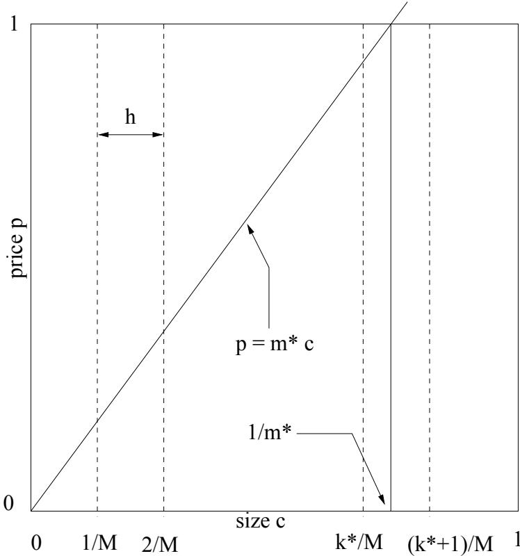
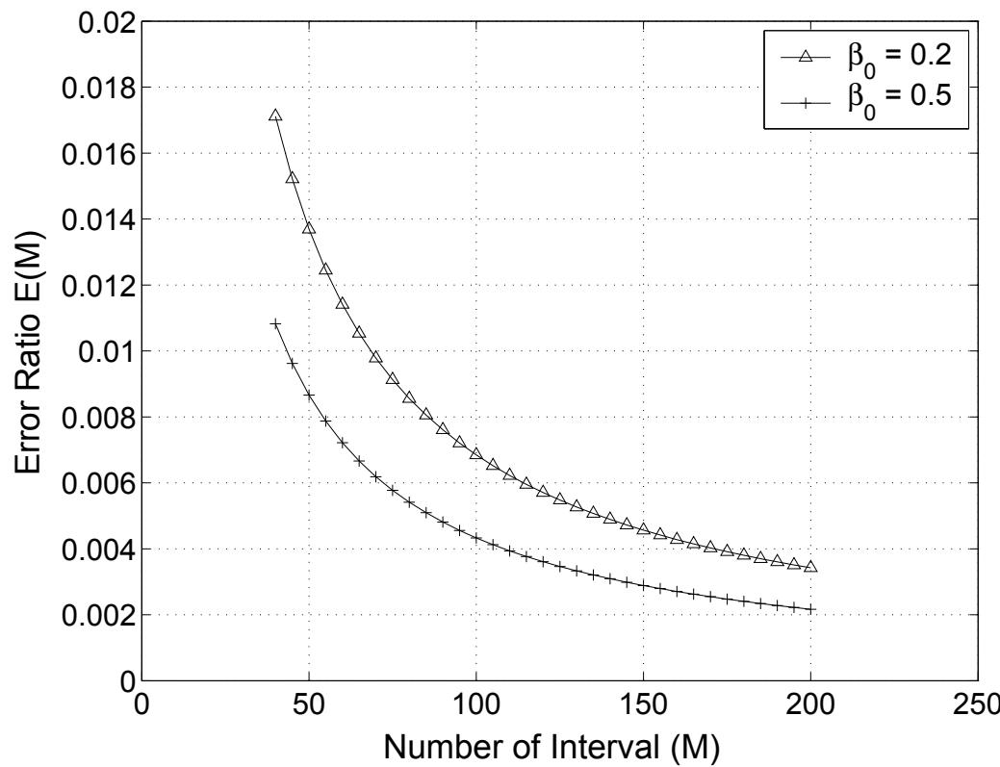
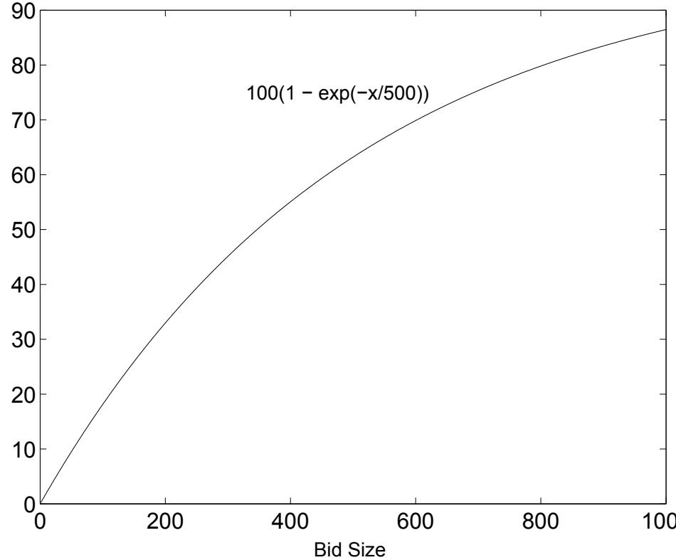
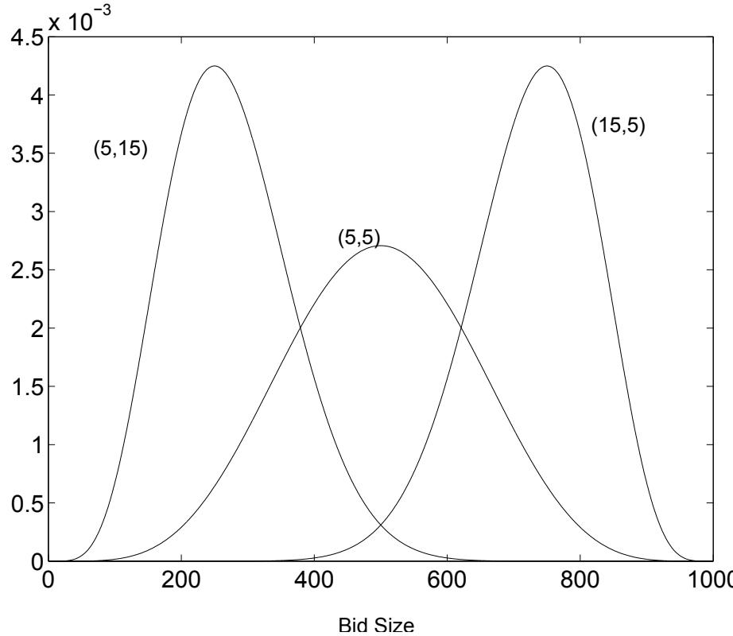

# On Unbounded Zero-One Knapsack with Discrete-Sized Objects

John Sum1, Jie Wu $^ 2$ and Kevin Ho $^ 3$ $^ { 1 }$ Department of Information Management, Chung Shan Medical University Taichung 402, Taiwan $^ 2$ Department of Computer Science and Engineering, Florida Atlantic University Boca Raton, Florida 33431, USA $^ 3$ Department of Computer Science and Communication Engineering Providence University, Sha Lu, Taiwan

# Abstract

The problem being discussed in this paper is a special case of the unbounded knapsack problem :

$$
\begin{array} { r l } { \operatorname* { m a x } } & { z _ { n } ( M ) = \frac { 1 } { n } \sum _ { i = 1 } ^ { n } p _ { i } x _ { i } } \\ { \mathrm { s . t . } } & { \sum _ { i = 1 } ^ { n } c _ { i } x _ { i } \leq \beta _ { 0 } n } \\ & { x _ { i } \in \{ 0 , 1 \} \forall i = 1 , \ldots , n ; } \end{array}
$$

where $p _ { i }$ ’s are uniformly distributed random variables in $[ 0 , 1 ]$ , $c _ { i }$ s are discrete random variables distributed uniformly in $\{ 1 / M , 2 / M , \ldots , ( M - 1 ) / M , 1 \}$ and $z _ { n } ( M )$ is the optimal objective function value.

Assuming that $M$ is large, $z _ { n } ( M )$ approximately equals to $\sqrt { \frac { 2 \beta _ { 0 } } { 3 } ( 1 - 0 . 3 0 6 2 ( \sqrt { \beta _ { 0 } } M ) ^ { - 1 } ) }$ . An application of this formula is exemplified by an auction problem.

# 1 Introduction

The unbounded knapsack problem can be stated as the following combinatorial optimization problem :

$$
\begin{array} { l l } { \operatorname* { m a x } } & { z _ { n } = \frac { 1 } { n } \sum _ { i = 1 } ^ { n } p _ { i } x _ { i } } \\ { \mathrm { s . t . } } & { \sum _ { i = 1 } ^ { n } c _ { i } x _ { i } \leq \beta _ { 0 } n } \\ & { x _ { i } \in \{ 0 , 1 \} \forall i = 1 , \ldots , n . } \end{array}
$$

By making assumptions on the statistical distribution for $p _ { i } \mathrm { s }$ and $c _ { i }$ s as $f ( p , c )$ and using Central Limit Theorem $^ { 1 }$ , it has been shown in [1, 3, 4] that the optimal $z _ { n }$ (when $n \longrightarrow \infty$ ) is given by

$$
\int _ { 0 } ^ { 1 / m ^ { * } } \int _ { m ^ { * } c } ^ { 1 } p f ( p , c ) d p d c
$$

where $m ^ { * }$ is obtained by the following equation :

$$
\int _ { 0 } ^ { 1 / m ^ { * } } \int _ { m ^ { * } c } ^ { 1 } c f ( p , c ) d p d c = \beta _ { 0 } ,
$$

for $n \longrightarrow \infty$ and $\beta _ { 0 } \leq 0 . 5$

1The essential idea is due to the relation that

$$
\operatorname* { l i m } _ { n \to \infty } { \frac { 1 } { n } } \sum _ { i = 1 } ^ { n } c _ { i } x _ { i } = \int _ { 0 } ^ { 1 / m ^ { * } } \int _ { m ^ { * } c } ^ { 1 } c f ( p , c ) d p d c ,
$$

where

$$
x _ { i } ( p _ { i } , c _ { i } ) = { \left\{ \begin{array} { l l } { 1 } & { { \mathrm { ~ i f ~ } } p _ { i } \geq m ^ { * } c _ { i } } \\ { 0 } & { { \mathrm { ~ o t h e r w i s e . } } } \end{array} \right. }
$$

In this short paper, we extend the work in [4] and [3] simply by considering $c _ { i }$ s are discrete random variables uniformly distributed in $\{ 1 / M , 2 / M , \ldots , ( M - 1 ) / M , 1 \}$ . In the next section, the motivation of the study and its relation with the multi-unit combinatorial auction will be presented. The approximated profit gain for the unbounded zero-one knapsack with discrete-sized objects will be derived in Section 3. An application of the approximated profit gain in a notebook auction problem will be illustrated in Section 4. Section 5 will discuss certain issues regarding the situation where the object size follows Beta distribution and the price function is a deterministic function. Finally, the conclusion of the paper will be presented in Section 6.

# 2 Background

Multi-units combinatorial auction (CA) has recently been researched within the e-commerce community for selling products [2], and extended to the solve problems in web services resource allocation [6, 7]. This auction mechanism is especially designed for selling a collection of products or services. In contrast with the conventional English auction in which products can only be auction off one item or one unit at a time, CA allows bidder to bid for a subset of collection.

# 2.1 A problem in using CA

In theory, Multi-units CA is an efficient mechanism since it can ensure the profit of a collection of products being sold is maximum. It is because the allocation mechanism for multi-units CA is simply a combinatorial optimization problem. However, there are at least two reasons leading CA not yet commonly used in the auction industry.

The first reason is due to the fact that the expected profit being gained by using CA cannot be pre-computed in advance. Without the estimation on the profit return, seller can hardly compare from their anticipated profit the efficient of different selling mechanisms. Eventually, seller usually prefers other selling mechanism instead of CA. Nevertheless, without the estimation on the profit return, auctioneer is unlikely to determine the management fee, by commission for instance, for organizing such an auction.

The second reason is due to a logistic consideration. Since it is more efficient if products are packed and delivered in a size of multiple units at a time, restricting the bid size on discrete levels, say $\{ 2 0 , 4 0 , \cdots , 1 0 0 0 \}$ , might reduce the total delivery cost and hence increase the net profit. Therefore, a seller would like to know the expected profit if the bid sizes are restricted to discrete levels and hence decide the allowable bid sizes for the bidders. However, there is not much information being provided for such anticipation.

# 2.2 Profit gain for continuous $c _ { i }$ ’s [3, 4]

One useful result is from [3, 4] regarding the size of knapsack is proportion to the number of items and the number of items is large. In this regard, the profits being gained by using either dynamic programming or profit-density based greedy algorithm will be the same. And the expected profit can thus be asymptotically expressed in terms of the joint probability distribution of the object size ( $^ { c ) }$ and object price $( p )$ , $f ( p , c )$ , [3, 4].

Still, the expected profit gain can only be expressed analytically, Equation (3) and Equation (2). Obtaining the exact values for $m ^ { * }$ and $z _ { n }$ , one needs to solve Equation (3) and Equation (2) numerically.

One special case is when both $p _ { i }$ s and $c _ { i }$ ’s are continuous random variables distributed uniformly in $[ 0 , 1 ]$ , i.e. $f ( p , c ) = 1 \forall ( p , c ) \in [ 0 , 1 ] ^ { \cdot 2 }$ , the optimal solution (expected profit) $\scriptstyle \operatorname* { l i m } _ { n \to \infty } { \hat { z } } _ { n }$ can be written as follows [3] :

$$
\begin{array} { r c l } { { m ^ { * } } } & { { = } } & { { \displaystyle \sqrt { \frac { 1 } { 6 \beta _ { 0 } } } } } \\ { { \displaystyle \operatorname* { l i m } _ { n \to \infty } \hat { z } _ { n } } } & { { = } } & { { \displaystyle \sqrt { \frac { 2 \beta _ { 0 } } { 3 } } } } \end{array}
$$

for $\beta _ { 0 } \in ( 0 , 0 . 5 ]$

# 2.3 Practical situation

The usefulness of the above result relies on the assumption that the size of the object can be in any precision, i.e. product is divisible. As it is commonly known that many consumer products, like notebook and air cargo, are not divisible. Even a product can be divisible, it might be more cost effective (due to logistic consideration) if only discrete sizes are allowed.

Let us have a simple example. Suppose an auctioneer has 1 000 000 units of notebook computers for auction off. The auctioneer anticipates that $2 0 0 0$ bidders will come. Moreover, the auctioneer also expects that their bid sizes are uniformly random in $\{ 1 , 2 , 1 0 0 0 \}$ and the bid price is random variables uniformly in $\{ 1 0 0 , 2 0 0 , \cdots , 1 0 0 0 0 0 \}$ . Accordingly, the average profit gain is estimated as follows :

$$
\begin{array} { l c l } { { 2 0 0 0 \times 1 0 0 0 0 0 \times \hat { z } _ { 2 0 0 0 } } } & { { \approx } } & { { 2 0 0 0 \times 1 0 0 0 0 0 \times \sqrt { \frac { 2 ( 0 . 5 ) } { 3 } } } } \\ { { } } & { { } } & { { } } \\ { { } } & { { = } } & { { 1 1 5 . 4 7 \times 1 0 ^ { 6 } . } } \end{array}
$$

Since the quantized levels in both bid size and bid price are small, 0.001 and 0.001 respectively, the approximation is close to the actual value. However, it will be inaccurate if the quantized level is not small.

# 3 Average profit gain : Discrete $c _ { i }$ ’s

Let $M$ be the maximum size that a bidder will bid. The actual inequality constraint will be expressed as follows :

$$
{ \frac { 1 } { n } } \sum _ { i = 1 } ^ { n } c _ { i } M x _ { i } \leq \beta _ { 0 } M .
$$

Here $c _ { i } M \in \{ 1 , 2 , \dots , M \}$ , is the actual bid size for the $i ^ { t h }$ bidder. Let $\scriptstyle \operatorname* { l i m } _ { n \to \infty } { \hat { z } } _ { n } ( M )$ be the optimal average profit gain,

$$
\operatorname* { l i m } _ { n \to \infty } \hat { z } _ { n } ( M ) \leq \operatorname* { l i m } _ { n \to \infty } \hat { z } _ { n } .
$$

Equality holds when $M  \infty$ . Besides, let us define the percentage error, $E ( M )$ , as follows :

$$
E ( M ) = \frac { \operatorname* { l i m } _ { n  \infty } \hat { z } _ { n } - \operatorname* { l i m } _ { n  \infty } \hat { z } _ { n } ( M ) } { \operatorname* { l i m } _ { n  \infty } \hat { z } _ { n } } .
$$

We now consider the case that the probability distribution for the bid size $c$ , $P ( c )$ , is uniformly distributed in the set $\{ 1 / M , 2 / M , \ldots , 1 \}$ , that is,

$$
\begin{array} { r c l } { { P ( c ) } } & { { = } } & { { \displaystyle \sum _ { k = 1 } ^ { M } \frac { 1 } { M } \delta ( c , k / M ) } } \\ { { \delta ( c , k / M ) } } & { { = } } & { { \left\{ \begin{array} { l l } { { 1 } } & { { \mathrm { i f ~ } c = k / M } } \\ { { 0 } } & { { \mathrm { o t h e r w i s e . } } } \end{array} \right. } } \end{array}
$$

In practice, we assume that each bidder whose original bid size is in the range $[ j / M , ( j + 1 ) / M ]$ $( j ~ =$ $0 , 1 , \ldots , M - 1 )$ will bid up to $( j + 1 ) / M$ . Therefore, the equality constraint in Equation (3) can be written as follows :

$$
\sum _ { i = 1 } ^ { k ^ { * } } \left( 1 - i \frac { m ^ { * } } { M } \right) \left( \frac { i } { M ^ { 2 } } \right) = \beta _ { 0 }
$$

where $m ^ { * }$ is the slope of the straight line for the decision boundary, see Figure $^ { 1 }$ , and $m ^ { * }$ and $k ^ { * }$ can be related by the following inequality.

$$
\frac { k ^ { * } } { M } < \frac { 1 } { m ^ { * } } < \frac { k ^ { * } + 1 } { M } .
$$

Solving Equation (9), it is able to obtain

$$
\frac { k ^ { * } ( k ^ { * } + 1 ) } { 2 } - \frac { m ^ { * } } { M } \frac { k ^ { * } ( k ^ { * } + 1 ) ( 2 k ^ { * } + 1 ) } { 6 } = \beta _ { 0 } M ^ { 2 } .
$$

  
Figure 1: The straight line $p = m ^ { * } c$ is the decision boundary for product allocation. All the bids $( p , c )$ above this line will be allocated.

Since the number of bidders $n$ and the number of quantized intervals $M$ are large, it can be assumed that $k ^ { * } \gg 1$ and $m ^ { * } / M \approx 1 / k ^ { * }$ . Hence,

$$
k ^ { * } \approx \sqrt { 6 \beta _ { 0 } } ~ M .
$$

The average profit gain $\scriptstyle \operatorname* { l i m } _ { n \to \infty } { \hat { z } } _ { n } ( M )$ can be written as follows :

$$
\begin{array} { l l l } { \displaystyle \operatorname* { l i m } _ { n \to \infty } \hat { z } _ { n } ( M ) } & { = } & { \displaystyle \sum _ { i = 1 } ^ { k ^ { * } } \frac { 1 } { M } \int _ { i / k ^ { * } } ^ { 1 } p d p } \\ & { = } & { \displaystyle \frac { 1 } { 2 M } k ^ { * } - \frac { 1 } { 6 M } k ^ { * } - \frac { 3 } { 1 2 M } - \frac { 1 } { 1 2 k ^ { * } M } } \\ & { \approx } & { \displaystyle \frac { 1 } { 3 M } k ^ { * } - \frac { 1 } { 4 M } . } \end{array}
$$

Since $k ^ { * } \approx \sqrt { 6 \beta _ { 0 } } ~ M$ ,

$$
\begin{array} { r c l } { { \displaystyle \operatorname* { l i m } _ { n \to \infty } \hat { z } _ { n } ( M ) } } & { { \approx } } & { { \displaystyle \sqrt { \frac { 2 \beta _ { 0 } } { 3 } } - \frac { 1 } { 4 M } ; } } \\ { { E ( M ) } } & { { \approx } } & { { \displaystyle \frac { 1 } { 4 M } \sqrt { \frac { 3 } { 2 \beta _ { 0 } } } . } } \end{array}
$$

Equation (7) can thus be approximated by the following equation.

$$
E ( M ) \approx \sqrt { \frac { 3 } { 3 2 } } \frac { h } { \sqrt { \beta _ { 0 } } } = 0 . 3 0 6 2 \frac { 1 } { \sqrt { \beta _ { 0 } } M } .
$$

Figure 2 shows the cases when $\beta _ { 0 }$ equals to 0.2 and 0.5 respectively. $M$ is taken from 40 up since the approximation does not hold for small $M$ . It is found that the percentage error is less than $1 \%$ even when the number of intervals is only 70.

  
Figure 2: The error ratio $E ( M )$ against the number of interval $M$ .

# 4 Profit gain for notebook auction

In the illustrative example mentioned before, we roughly estimated the average profit gain, $\begin{array} { r } { \operatorname* { l i m } _ { n \to \infty } \operatorname* { l i m } _ { M \to \infty } \hat { z } ( M ) } \end{array}$ , as q $\textstyle { \sqrt { \frac { 2 ( 0 . 5 ) } { 3 } } }$ . In accordance with Equation (12), the percentage error can thus be obtained.

$$
E ( M ) = 0 . 3 0 6 2 { \frac { 1 } { \sqrt { 0 . 5 } \ 1 0 0 0 } } = 4 . 3 3 \times 1 0 ^ { - 4 }
$$

which is less than $0 . 0 5 \%$ . A better estimation for the average profit gain can also be evaluated as follows :

$$
\begin{array} { l c l } { { \displaystyle \operatorname* { l i m } _ { n \to \infty } \hat { z } ( M = 1 0 0 0 ) } } & { { = } } & { { \left( 1 - 4 . 3 3 \times 1 0 ^ { - 4 } \right) \sqrt { \frac { 2 ( 0 . 5 ) } { 3 } } } } \\ { { } } & { { = } } & { { 0 . 5 7 7 1 } } \end{array}
$$

Using Equation (12), we can determine the maximum integer of $M$ such that the percentage error is less than certain threshold $\eta$ .

$$
M \approx 0 . 3 0 6 2 \frac { 1 } { \sqrt { \beta _ { 0 } } \eta } .
$$

For $\eta = 0 . 0 1$ and $\beta _ { 0 } = 0 . 2$ , it can readily be shown that $M \approx 6 9$ . For $\eta = 0 . 0 1$ and $\beta _ { 0 } = 0 . 5$ , $M \approx 4 4$ . For $M$ equals to 100 and $\beta _ { 0 }$ is in [0.2, 0.5], the percentage error is less than $1 \%$ .

Therefore, the profit gain of auction off 1 000 000 notebook computers by using multi-units CA can be estimated. Anticipating that there are 2000 bidders and their bid sizes are uniformly random in $[ 1 , 1 0 0 0 ]$ . If the bid size is restricted to be $\{ 2 0 , 4 0 , \cdots , 1 0 0 0 \}$ , the expected profit gain will be $0 . 9 9 \times 1 1 5 . 4 7 \times 1 0 ^ { \mathrm { { o } } }$ , i.e. $1 1 4 . 3 \times 1 0 ^ { 6 }$ . If the bid size is restricted to $\{ 5 0 , 1 0 0 , \cdots , 1 0 0 0 \}$ , the profit will be $0 . 9 7 8 \times 1 1 5 . 4 7 \times 1 0 ^ { 6 }$ , i.e. $1 1 3 \times 1 0 ^ { 6 }$ .

  
Figure 3: Deterministic bid price.

# 5 Discussion

Interesting enough, based on simulation result, we have found that the profit error can be rather small for some special distributions for bid size and bid price. For example, we have attempted the situation when the bid price is a deterministic function (Figure 3) :

$$
p ( c ) = 1 0 0 \times ( 1 - \exp ( - c / 5 0 0 ) ) ,
$$

for $c \in [ 1 , 1 0 0 0 ]$ . This mimics the volume discount behavior, i.e. the decreasing marginal utility behavior [2]. The bid size is modeled as a Beta distribution defined as follows :

$$
P r o b ( c ) = \frac { c ^ { a } ( 1 0 0 0 - c ) ^ { b } } { \int _ { 0 } ^ { 1 0 0 0 } c ^ { a } ( 1 0 0 0 - c ) ^ { b } d c } ,
$$

where the parameter $( a , b )$ are set to three cases: $( 5 , 5 )$ , $( 5 , 1 5 )$ and $( 1 5 , 5 )$ , Figure 4. We assume that there are 10000 bidders and the range for $c$ is [1, 1000]. $\beta _ { 0 }$ is set to be 0.2. It is found that no matter the discrete level $M$ is set to $1 0 , 2 0$ and 50, the profit error is still less than $1 \%$ . If we assume the distribution is uniform and the percentage error is estimated by using Equation (12), the profit error are 6.8%, $3 . 4 \%$ and 1.4% respectively. Therefore, without much information about the price distribution and the object size distribution, Equation (12) can be used to determine the value $M$ .

# 6 Conclusion

While combinatorial auction has been claimed to be an efficient algorithm for selling products, many sellers are still reluctant to adopt it as an alternative selling mechanism. In this paper, we have discussed a number of practical issues regarding to the application of this new type of auction and the profit gain estimation is one of them. Extended from the work done by Lueker [3], the average profit gain for the unbounded knapsack problem with discrete-sized objects has been obtained. It has been shown that the average discretesized profit gain can be expressed in term of $\beta _ { 0 }$ and $M$ as q 2β03 (1 − 0.3062(√β0M)−1). Since multi-units combinatorial auction is essentially the same as a knapsack problem, we applied the formula to determine the number of allowable bid sizes for a notebook auction problem. Noted that the bid price and the bid size distributions are normally not uniform, a situation where the bid price is a deterministic function of the bid size and the bid size follows Beta distribution has been investigated. Though, no close formula has been obtained to estimate the profit gain, the factor q 2β03 (1 − 0.3062(√β0M)−1) can still be used as an upper error bound. For the bid size and bid price following other distributions, numerical algorithm would be needed for obtaining the expected profit and/or the profit error term. Research along this line is valuable for future work.

  
Figure 4: Beta distribution for bid sizes.

# Список литературы

[1] Lai T-C, Worst-case analysis of greedy algorithms for the unbounded knapsack, subset-sum and partition problems, Operations Research Letters, Vol.14:215-220, 1993.   
[2] Lehmann B., D. Lehmann and N. Nisan, Combinatorial auctions with decreasing marginal utilities, EC’01, Tampa, Florida, 2001.   
[3] Lueker G.S., Average-case analysis of off-line and on-line knapsack problems, Journal of Algorithms, Vol.29, 277-305, 1998.   
[4] Marchetti-Spaccamela A. and C. Vercellis, Stochastic on-line knapsack problems, Mathematical Programming, Vol.68:73-104, 1995.   
[5] Maskin E.S. and J.G. Riley, Optimal multi-unit auctions, The Economics of Missing Markets, Information, and Games, Oxford University Press, 1989.   
[6] John Sum et al, On Profit Density Based Greedy Algorithm for a Resource Allocation Problem in Web Services, accepted for publication in International Journal of Computers and Applications.   
[7] John Sum, Kevin Ho, G. Young, Pricing Web Services, in Y.-C. Chung and J.E. Moreira (Eds.) Advances in Grid & Pervasive Computing, p.147-156, 2006. Spring-Verlag Berlin Heidelberg.