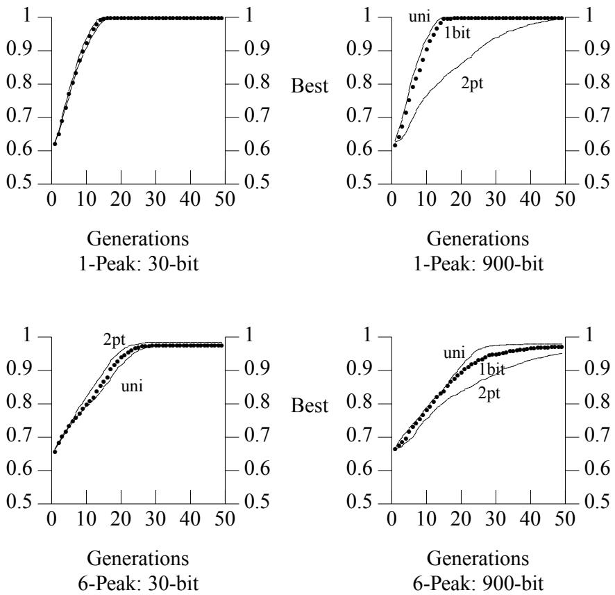
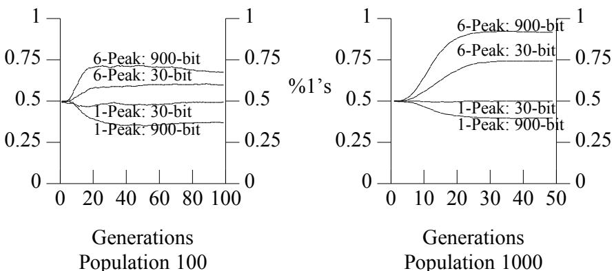
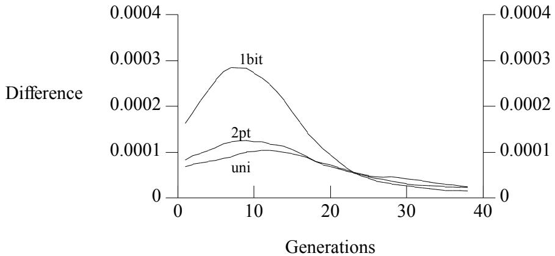
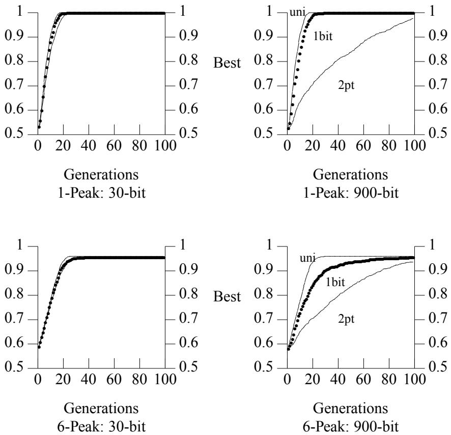

# Adapting Crossover in Evolutionary Algorithms

William M. Spears

# Abstract

One of the issues in evolutionary algorithms (EAs) is the relative importance of two search operators: mutation and crossover. Genetic algorithms (GAs) and genetic programming (GP) stress the role of crossover, while evolutionary programming (EP) and evolution strategies (ESs) stress the role of mutation. The existence of many different forms of crossover further complicates the issue. Despite theoretical analysis, it appears difficult to decide a priori which form of crossover to use, or even if crossover should be used at all. One possible solution to this difficulty is to have the EA be self-adaptive, i.e., to have the EA dynamically modify which forms of crossover to use and how often to use them, as it solves a problem. This paper describes an adaptive mechanism for controlling the use of crossover in an EA and explores the behavior of this mechanism in a number of different situations. An improvement to the adaptive mechanism is then presented. Surprisingly this improvement can also be used to enhance performance in a non-adaptive EA.

# 1 INTRODUCTION

One of the issues in evolutionary algorithms (EAs) is the relative importance of two operators: mutation and crossover.1 Two types of EAs, evolutionary programming (EP) and evolution strategies (ESs), stress the role of mutation. In the 1960s, Fogel et al. (1966) illustrated how mutation and selection (EP) can be used to evolve finite state automata for a variety of tasks. Simultaneously, in Europe, Rechenberg (1973) investigated a similar algorithm (ESs) that again concentrates on mutation as the key search operator. Sophisticated versions of these algorithms, with adaptive mutation rates, have proven quite useful for function optimization tasks (Ba ck et al. 1991; Schwefel 1981). Recent studies confirm this view, illustrating the effectiveness of mutation (Ba ck and Schwefel 1993; Schaffer et al. 1989).

In contrast, practitioners of genetic algorithms (GAs) and genetic programming (GP) stress the role of crossover. In support of this, experimental results have been presented that illustrate the effectiveness of crossover (e.g., De Jong, 1975). More recently, Schaffer and Eshelman (1991) empirically compare mutation and crossover, and conclude that crossover can exploit epistasis that mutation alone cannot.

To further complicate the issue, many different forms of crossover exist. Traditionally, GAs have relied upon one- and two-point crossover operators. But there are many situations in which having a higher number of crossover points is beneficial (Syswerda 1989; Eshelman 1989). Perhaps the most surprising result (from a traditional schema-based perspective) is the effectiveness of uniform crossover, an operator that produces on the average $L / 2$ crossings on strings of length $L$ (Syswerda 1989; Spears and De Jong 1991).

In addition to the empirical investigations, considerable effort has been directed toward theoretical comparisons between different crossover operators (e.g., De Jong and Spears 1992) and between mutation and crossover (e.g., Spears 1992). But these theories are not sufficiently general to predict when to use crossover, or what form of crossover to use. For example, the theories do not consider population size, yet population size can affect the relative utility of crossover operators (e.g., see De Jong and Spears 1990).

Similarly, there is evidence to suggest that the relative utility of mutation may be affected by population size. Mutation appears to be more useful than crossover when the population size is small (Eshelman 1995; Mathias 1995), while there is evidence that crossover can be more useful than mutation when the population size is large (e.g., see Spears and Anand 1991). Other factors, such as the representation, selection scheme, and the fitness function itself may all have an effect on the relative utility of crossover and mutation.

Current EA theory is inadequate for selecting which operators to use before the EA is initiated. There are at least two possible approaches to this problem. The first is to extend the current theories to take into account all facets of the EA. There is preliminary work in this area (e.g., Nix and Vose 1990; De Jong et al. 1994), but the resulting mathematical frameworks are computationally expensive to evaluate. The second approach is to have an adaptive mechanism in which the EA selects the operators it will use. This paper concentrates on self-adaptive approaches, in which the EA itself selects search operators. Selfadaptation is not without precedent; similar methods and concepts are applied within the EP and ES algorithms to select optimal mutation mechanisms (e.g., see Ba ck et al. 1991; Saravanan and Fogel 1994).

This paper focuses on an adaptive mechanism for controlling the use of crossover in an EA, while the EA is simultaneously solving a problem. This mechanism chooses between two different forms of crossover (twopoint and uniform). Mutation is assumed to be used at some set rate and is not adapted by the EA.

There have been two approaches to coupling adaptive mechanisms with EAs, referred to as non-self-adaptive and self-adaptive. The non-selfadaptive approach adapts the EA over the course of many runs (e.g., see Grefenstette 1986). In contrast, the self-adaptive approach adapts the EA as it solves a single specific problem once. This approach allows for the simultaneous exploration of both the problem space and some space of different EAs.

Both ES and EP incorporate self-adaptive mechanisms for selecting optimal forms of mutation. Much less work has concentrated on the selfadaptation of crossover; however, Schaffer and Morishima (1987) used a self-adaptive approach that adjusted the points at which crossover is allowed to cut and splice material. They accomplished this by appending an additional $L$ bits to $L$ -bit individuals. These appended bits were used to determine crossover points at each locus — a $^ { \mathfrak { c } } 1 ^ { \mathfrak { d } }$ denoted a crossover point, while a $^ \circ$ indicated the lack of a crossover point. If two individuals had $n$ distinct crossover points, this was analogous to using a particular instantiation of $n$ -point crossover. Because their technique was selfadaptive, the GA searched both the problem space and the space of $n$ - point crossover distributions.

Although Schaffer and Morishima reported superior online average performance, their baseline comparison was a standard GA with one-point crossover. Thus it is not clear whether the improvement stemmed from the adaptive selection of crossover points, or the simple fact that (on the average) their GA was using $n$ -point crossover, where $n > 1$ . As mentioned above, there are many situations in which having a higher number of crossover points is beneficial, and this alone may explain the improved results.

This work re-explores the use of extra bits to self-adapt crossover, but instead of searching the large space of $n$ -point crossover distributions, it considers only two forms of crossover, two-point and uniform. Interestingly, although these two forms are very commonly used, they represent extremes. Two-point crossover is the least disruptive of material, while uniform crossover is the most disruptive (De Jong and Spears 1992). Also, Booker (1992) has noted that, in terms of positional and distributional bias, both two-point and uniform crossover are considerably different. Thus, it is natural to allow the GA to explore a relative mixture of these two operators, the motivation being that different mixtures will represent different intermediate search characteristics between the two extremes.

# 3 IMPLEMENTATION

One obvious way for the GA to self-adapt its use of two-point and uniform crossover is to append one bit to the end of every individual in the population. Suppose a $^ \circ$ refers to uniform crossover, and a $^ { \mathfrak { c } } 1 ^ { \mathfrak { d } }$ to twopoint crossover. Then the last column of the population (i.e., the last bit of every individual) is used to sample the space of operators. If it is better to use uniform crossover, more ‘0’s should appear in the last column as the GA evolves. If it is better to use two-point crossover, more ‘1’s should appear. Because the approach is self-adaptive, crossover and mutation are allowed to manipulate this extra column of bits.

There are two possible techniques for using these extra bits, referred to as local and global adaptation. In local adaptation the last bit of each individual is used to choose which crossover operator is performed on that individual. For example, suppose two individuals are chosen for crossover. The last bit of each individual is then examined. If the two bits are $^ { \circ } 0 ^ { \circ } \mathrm { s }$ , uniform crossover is performed. If the two bits are $^ { \circ } 1 \mathrm { { } ^ { \circ } s } .$ , two-point crossover is performed. If the two bits are different, the crossover operator is randomly chosen.

With local adaptation the choice of crossover operator is tied to a particular individual. With global adaptation the choice of crossover operator is not tied to a particular individual, but to the population as a whole. For example, suppose the last column has $7 5 \% ~ \mathrm { { ^ \circ } s _ { 0 } }$ , and $2 5 \%$ ‘1’s. Then, when crossover is performed on the population, uniform crossover will be called $7 5 \%$ of the time, and two-point crossover will be called $2 5 \%$ of the time.

Note that from a probabilistic viewpoint, local and global adaptation are roughly equivalent because the odds of firing a particular operator are the same for a given generation. But they are not fully equivalent because local adaptation ties operators to individuals, while global adaptation stresses the population as a whole. One motivation for using local adaptation is that it is reasonable to assume that different individuals are following different trajectories through the search space, requiring different operators for each trajectory. Given the success of EP and ES using local adaptation, and based on preliminary experiments not reported here (showing superior results with local adaptation), local adaptation is used in this paper.2

For the sake of brevity, the term 1bit adaptation will be used to refer to the above mechanism where one "operator" bit is appended to every individual. Pseudo-code of the implementation is as follows:

if (parent1 $[ L + 1 ] = = \mathrm { p a r e n t } 2 [ L + 1 ] = = 1 )$ then two_point_crossover(parent1, parent2); else if (parent1 $[ L + 1 ] = \mathrm { p a r e n t } 2 [ L + 1 ] = = 0 )$ then uniform_crossover(parent1, parent2); else if $( \mathrm { r a n d } ( ) < 0 . 5 )$ then two_point_crossover(parent1, parent2); else uniform_crossover(parent1, parent2);

Parent1 and parent2 are two individuals of length $L + 1$ chosen from the population for crossover. The function rand() uniformly produces a real number from 0.0 to 1.0, so that portion of the code randomly chooses between two-point and uniform crossover.

Since the extra bit is used to determine which crossover to apply, this mechanism should give greater reward to the crossover operator that produces superior offspring. Note that this mechanism allows the GA to adjust the relative mixture of its use of the two crossover operators. For example, the adaptive GA can use two-point crossover primarily, uniform crossover primarily, or any mixture in between those extremes. But it cannot reward a sequence of operators that cooperate to produce a good offspring. Also, this mechanism cannot adjust the total number of crossover events, because either two-point crossover or uniform crossover is always fired. It is possible to allow a variation of 1bit adaptation, which allows the GA to apply one, both, or neither crossover operator to one individual. This allows both crossover operators to be rewarded for cooperating with each other, which is not allowed in 1bit adaptation. The details appear in Spears (1994).

# 4 EXPERIMENTS

De Jong and Spears (1990) define a class of problems called the $N .$ -Peak problems, in which each problem has one optimal solution and $N { - } 1$ suboptimal solutions. $N$ ranges from one to six, which suffices to demonstrate that the effectiveness of uniform and two-point crossover depend both on the problem being solved, and the population size. The experiments described here focus on the two extremes, the 1-Peak and 6-Peak problems. The GA is run with population sizes of 100 and 1000.3

The 1-Peak and 6-Peak problems are 30-bit problems. Interestingly, appending dummy bits to a problem can also change the effectiveness of crossover operators (see Syswerda 1989; Spears and De Jong 1991). The added bits do not affect the fitness of an individual, but they do affect the performance of length dependent crossover operators (such as two-point crossover). For this reason the GA was also run on the 1-Peak and 6-Peak problems where the number of dummy bits is 870, thus yielding 900-bit problems. Each experiment is averaged over 100 independent runs and GA performance is measured by the fitness of the best individual found so far, at each generation (referred to as best-so-far curves in this paper).

For all the experiments, one operator bit is appended to each individual, yielding 31- and 901-bit problems. When the GA is run with only twopoint or uniform crossover the operator bit is not used, although it is still appended to each individual and subject to crossover and mutation. When 1bit adaptation is used, the operator bit controls (two-point and uniform) crossover.

It is important to understand why the additional operator bit is included on each individual, for all experiments. One motivation is to minimize the differences between the algorithms, providing for better controlled comparisons. But the more important motivation is that it allows for a basis of comparison with the adaptive mechanism. After all, when the GA is executed without self-adaptation, the column of operator bits will still change because of various stochastic effects. The obvious solution is to use the non-adaptive case as a control. Therefore, monitoring the column of operator bits (when adaptation is not used) will act as a control that can be used to determine whether the adaptive process is in fact changing operator probabilities in some fashion that is different from the nonadaptive case.

Before the results are presented, a note on the style of presentation is in order. For every run of every experiment, information pertaining to the performance of the GA and the percentage of ‘1’s and ${ } ^ { \mathfrak { c } } 0 ^ { \mathfrak { s } }$ in the operator column at every generation was monitored and saved. To compress this information, the data were averaged and graphed. Due to space constraints it is impossible to present all of the results. As many graphs as possible are included, along with accompanying tables of information in which the data interpretation has already been performed. The complete set of graphs is available in Spears (1994).

# 5 RESULTS

Figures 1 and 2 present the performance of each GA on each problem. The fitness of the $N .$ -Peak problems ranges from 0.0 to 1.0, and maximization is assumed. The $x$ -axis represents the number of generations that have elapsed, and the $y$ -axis represents fitness. The monotonically increasing performance curve represents the fitness $y$ of the best individual that has been seen by generation $x$ . Table 1 summarizes the performance of uniform and two-point crossover on each problem. Uniform crossover is very effective with small population size, simpler problems, and appended dummy bits, while two-point crossover is more effective when the population size is larger and the problem is more difficult. 1bit adaptation appears to perform very well, yielding results that are always close to the best choice of crossover operator.

Although Figures 1 and 2 provide useful information about the performance of the GA, they do not indicate that any form of self-adaptation has occurred. To see evidence of self-adaptation it is necessary to consider the column of operator bits. In all of the experiments, the GA population is randomly initialized, including the operator bits. When the GA is not run in a self-adaptive mode (i.e., the GA runs with two-point or uniform crossover in traditional fashion), the bits in the operator column will still be perturbed by stochastic effects. But averaged over a large number of runs, the column will have approximately $50 \%$ ‘1’s (and $^ { \circ } 0 ^ { \circ } \mathrm { s } )$ ) at any given time (this was confirmed experimentally). When the GA is selfadaptive, evidence of adaptation can be seen if the percentages of ‘1’s and ‘0’s consistently differ from $50 \%$ .4

Figure 3 provides graphs of the percentage of $1 \mathrm { { } ^ { \circ } s }$ in the operator column of the GA population, for each generation, averaged over 100 runs. If a curve stays near $50 \%$ it indicates no preference for either crossover operator. Curves above $50 \%$ indicate a preference for two-point crossover, while curves below $50 \%$ indicate a preference for uniform crossover. For example, Figure 3 indicates that two-point crossover is highly favored by the 900-bit 6-Peak problem, when the population is 1000. Table 2 provides a summary that indicates which crossover operator the adaptive mechanism chose to favor on each problem.

  
Figure 1. Best-so-far curves for all problems when the GA population is 100. The $y .$ -axis represents fitness, ranging from 0.0 to 1.0. The $x$ -axis represents the number of elapsed generations. The GA with 1bit adaptation performs well in comparison with the GA using uniform crossover and the GA using two-point crossover.

On the whole, 1bit adaptation favored the better crossover operator (see Table 1). But on the 900-bit 6-Peak problem, 1bit adaptation favored the less effective crossover operator. What is not clear is why the adaptive mechanism was misled. Since, in general, adaptive mechanisms can be misled by large stochastic effects, the variance in percentages of ‘1’s and ‘0’s in the column of operator bits was computed (these results are not shown in this paper, but are available in Spears 1994). One striking feature of these results was the large variance of the column of operator bits when the non-adaptive GA with two-point crossover is run on the 900-bit problems. In retrospect, this appears reasonable, since for these particular problems the important information is in the first 30 bits. Under such conditions two-point crossover is unlikely to modify the first 30 bits, providing poor sampling for testing the effectiveness of the operator. If the important 30 bits had in fact been scattered relative uniformly throughout the 900-bit string, this effect would be much less likely to occur (for a discussion of this phenomenon, see Spears and De Jong 1991).

  
Figure 2. Best-so-far curves for all problems when the GA population is 1000. The $y .$ -axis represents fitness, ranging from 0.0 to 1.0. The $x$ -axis represents the number of elapsed generations. The GA with 1bit adaptation performs well in comparison with the GA using uniform crossover and the GA using two-point crossover.

Table 1. The operator that yielded the better best-so-far curves. This is determined by noting which crossover (two-point or uniform) produced better performance curves in Figures 1 and 2.   

<table><tr><td rowspan=1 colspan=1></td><td rowspan=1 colspan=1>Population 100</td><td rowspan=1 colspan=1>Population 1000</td></tr><tr><td rowspan=1 colspan=1>1-Peak: 30-bit1-Peak:900-bit</td><td rowspan=1 colspan=1>NeitherUniform</td><td rowspan=1 colspan=1>NeitherUniform</td></tr><tr><td rowspan=1 colspan=1>6-Peak:30-bit6-Peak:900-bit</td><td rowspan=1 colspan=1>NeitherUniform</td><td rowspan=1 colspan=1>Two-pointUniform</td></tr></table>

  
Figure 3. The average percentage of 1’s in the operator column for all problems. 0.50 represents a 50/50 split in the use of uniform and two-point crossover. 1.0 represents sole use of two-point, while 0.0 represents sole use of uniform.

Table 2. The operator 1bit adaptation chose. This was determined by noting whether the percentage of ‘1’s in Figure 3 was greater (indicating two-point) or less (indicating uniform) than 0.50.   

<table><tr><td></td><td>Population 100</td><td>Population 1000</td></tr><tr><td>1-Peak: 30-bit 1-Peak: 900-bit</td><td>Neither Uniform</td><td>Neither Uniform</td></tr><tr><td>6-Peak: 30-bit 6-Peak: 900-bit</td><td>Two-point Two-point</td><td>Two-point Two-point</td></tr></table>

# A Control Study

One of the problems with the results from Schaffer and Morishima (1987) is that it is difficult to determine whether any performance improvements were due to the adaptive mechanism, or due to the fact that their adaptive GA simply used more crossover points. A similar problem is apparent in the above results as well. This problem arises because there are really (at least) two ways to view the adaptive mechanism. The first is from the point of view of performance, which is the traditional view that produced Table 1. The second view is quite different in that it ignores performance and concentrates more on the adaptive mechanism itself. Table 2 stems from the second point of view. Once given these two points of view, it is natural to question how they causally relate to each other. There may be signs of performance improvement and there may be signs of interesting adaptive behavior, but it is difficult to know if the adaptive behavior was responsible for the performance improvement.

To address this, a further control study was run. Since 1bit adaptation always performs the same number of crossover events for every generation, a reasonable control study was to also run the GA with both twopoint and uniform crossover, where the choice of operator was decided by a 50/50 coin flip. This control GA fixed the average mixture of its use of the two crossover operators to a 50/50 split. As mentioned before, 1bit adaptation can adjust this mixture. By comparing the performance of this control GA to the 1bit adaptive GA, the effect that the adaptive mechanism had on performance can be determined.

The control GA was run on all the problems defined earlier in this paper. Interestingly, the control GA performance was extremely close to the performance of 1bit adaptation! Thus, for the problems addressed in this paper, although 1bit adaptation does in fact adapt, much of the robust performance stems from the simple fact that two crossover operators are available to the GA. This raises the possibility that it is better to run an EA with a larger set of search operators than is customary, even if the EA is not self-adaptive.

# 6 OTHER MEASURES OF ADAPTATION

Given these results, it is perhaps tempting to discount the adaptive mechanism in favor of simply adding more search operators to a standard EA. This temptation (stemming from a performance point of view) may be premature because this study has only addressed a small number of problems. Furthermore, it is still interesting to temporarily drop the performance perspective and to continue examining the adaptive mechanism in more detail. This examination yields insights into how to improve the adaptive mechanism and the EAs themselves.

The previous discussions have centered around the average percentage of ‘1’s and $^ { \circ } \mathrm { s }$ in the column of operator bits. Unfortunately, this does not necessarily describe the time evolution of the random process very well because an infinite number of very different random processes may yield the same average percentages. It is important to examine other statistical measures that stress the time evolution of the random process. For example, consider one run of the GA, where the percentages of ‘1’s in an operator column is monitored and the difference in the percentage of ‘1’s from generation to generation is calculated. One might naturally expect an adaptive mechanism to change the percentage of ‘1’s either more or less quickly than the non-adaptive GA (on average).5

The difference measure, averaged over a sliding window of size 10 (generations), was computed for each run, in order to determine how the measure changed over time. This was then averaged over the 100 runs. Figure 4 illustrates the difference measure for one particular problem. Note that 1bit adaptation produced greater changes in the percentage of ‘1’s in the early generations. Table 3 summarizes the results for all the test problems. The difference measure was applied to each problem to see whether or not it provided confirmation that adaptation occurred. The difference measure provides confirmation if the measure is substantially different for the adaptive and non-adaptive GAs (as in Figure 4).

  
Figure 4. The difference measure on the 30-bit 6-Peak problem, when the population was 1000. Larger differences indicate that the column of operator bits changed more rapidly. Note that 1bit adaptation made greater changes than the GA without self-adaptation (using two-point or uniform alone).

Table 3. Table 2 indicated whether adaptation occurred. If adaptation occurred and the difference measure indicated greater changes in the operator column for 1bit adaptation (compared with the GA using two-point or uniform alone), confirmation was obtained.   

<table><tr><td rowspan="2"></td><td colspan="2">Population 100</td><td colspan="2">Population 1000</td></tr><tr><td>Adapted</td><td>Confirmed</td><td>Adapted</td><td>Confirmed</td></tr><tr><td>1-Peak: 30-bit</td><td>No</td><td>No</td><td>No</td><td>No</td></tr><tr><td rowspan="2">1-Peak: 900-bit 6-Peak: 30-bit</td><td>Yes</td><td>No</td><td>Yes</td><td>No</td></tr><tr><td>Yes</td><td>Yes</td><td>Yes</td><td>Yes</td></tr><tr><td>6-Peak: 900-bit</td><td>Yes</td><td>Yes</td><td>Yes</td><td>Yes</td></tr></table>

On the 30-bit 1-Peak problem, there was no sign of adaptation (see Table 2) and the difference measure also did not show any signs of adaptation (see Table 3). On the 6-Peak problems the difference measure did confirm that adaptation occurred. A lack of confirmation occurred with the 900-bit 1-Peak problem. Again, the high variance of two-point crossover on the 900-bit problems may explain this effect. If the graphs from which Table 3 was generated are examined, one interesting feature is that when adaptation is occurring, the differences are greater in the early generations, relative to the non-adaptive GAs (see Figure 4). This is a reasonable result, indicating that the adaptive GA is making large changes to the operator column during the early generations due to feedback about the relative worth of the two crossover operators. In general, the cases where this behavior is not as noticeable are on the 900-bit problems.

The previous section indicated that the difference measure can provide useful confirmation of when adaptation occurs. This raises the intriguing idea that if even more radical changes in the difference measure could be produced, this might in fact reflect faster adaptation. One way to possibly make more radical changes is to reward both crossover operators in a more explicit fashion.

One feature of the current adaptive mechanism is that it rewards operators that produce good offspring in a rather implicit fashion. For example, there is no explicit fitness reward for generating an offspring that is much better than a parent. Under the current mechanism, if both uniform and two-point crossover generate offspring of fitness $g _ { \mathrm { : } }$ , then fitness selection will reward equally both operators because both offspring (with the attached operator bits) are equally likely to survive. But the fitness of the parents is totally ignored. Thus, if in fact one crossover produced a bigger change in fitness, perhaps the fitness reward should be based on that fact. There is some hope that such a mechanism would help the adaptive process, since the adaptive mechanism could increase the use of the operator that produces the greatest increase in fitness.

A simple modification to the fitness function can alleviate this drawback. Suppose the fitness of a parent is $f$ while the fitness of its offspring is $g$ . If we wish to reward a crossover operator for producing both a good offspring and an offspring that is better than its parent, one obvious fitness function is $g + ( g - f )$ , which rewards children that are both good and better than their parents.6 The non-adaptive and adaptive mechanisms with this modification to the fitness function were tested on the same problems as before. The population was fixed at 100 and the results are averaged over 100 runs. Figure 5 gives the best-so-far curves.

Although the results were similar to the earlier results, there are some important differences. First, the modified fitness function helped the adaptive mechanism on the performance (best-so-far) curves. Second, the column percentage results (not shown here) indicate that when the adaptive mechanism was choosing the better (from a performance point of view) crossover operator, it did so more quickly than in the earlier results. It still chose the worse operator on the 900-bit 6-Peak problem, but in this case the choice was more tentative (i.e., the percentage of ‘1’s deviated less from the $50 \%$ baseline). Once again, however, a comparison with the control GA indicated that much of the performance gains occur because the GA has the use of both crossover operators.

What is most surprising, however, is the change in best-so-far performance of the non-adaptive GAs. Although the modification to the fitness function was inspired from the work with the adaptive mechanisms, both the (non-adaptive) GA with two-point crossover and the (non-adaptive) GA with uniform crossover show dramatically improved results (compare Figures 1 and 5) on every problem. This result indicates that it may very well be beneficial to reward individuals in an EA based on both their fitness and their improvement.

  
Figure 5. Best-so-far curves for all problems when the GA population is 100 and the fitness function is $g + ( g - f )$ . The $y$ -axis represents fitness, ranging from 0.0 to 1.0. The $x$ -axis represents the number of elapsed generations. The modified fitness function improved all of the performance curves.

# 8 DISCUSSION

This paper presents a simple adaptive mechanism that allows the GA to choose between uniform and two-point crossover, as a problem is being solved. With 1bit adaptation, one bit is appended to every individual, and this bit controls which operator fires. This mechanism is simple, elegant, and will work with almost any conceivable style of evolutionary algorithm.

The results in this paper indicate, in general, that 1bit adaptation appears to generate good performance results. But much of the performance stems from simply having two crossover operators at the GA’s disposal. This raises the intriguing notion that it may often be beneficial for an EA to have a larger set of search operators than is customarily used.

One difficulty with investigating adaptive mechanisms is in how to compare them. Clearly performance measurements (such as best-so-far curves) provide a useful measure, yet do not indicate much about the underlying process. This paper introduced a measure that indicated more about the underlying process, namely the difference measure. This led to an attempt to reward good crossover operators more explicitly, by making a modification to the fitness function. This modification rewarded individuals that were both good and that were better than their parents. Although this modification was inspired by the study of the adaptive mechanism, it also resulted in superior performance for the non-adaptive GAs, and suggested that it may often be beneficial to reward individuals in an EA based on both their fitness and their improvement.

Despite the interesting (and possibly quite valuable) insights that have risen from the study of 1bit adaptation, it is clear that this particular adaptive method has not shown itself to be extremely useful from a performance point of view. It is not clear whether this is due to the mechanism itself, or due to the test problems investigated in this paper. Clearly the 900-bit problems posed some sampling difficulties, since two-point crossover was unlikely to modify the important 30 bits of an individual. But in some sense these problems seem pathological and clearly it is necessary to test this adaptive mechanism on many other problems of interest. Finally, it is necessary to compare this adaptive mechanism to the relatively recent fuzzy logic adaptive technique of Lee and Takagi (1993), as well as the method by White and Oppacher (1994) that uses automata.

# Footnotes

1. There are conflicting definitions for the term evolutionary algorithm. The use here is consistent with Spears et al. (1993).   
2. It should be noted, however, that Syswerda (1992) reports good results using a global technique, where he uses mutation to simulate crossover. 3. This is a standard generational GA (called GAC), with stochastic universal selection, a mutation rate of $0 . 1 \%$ , and a crossover rate of $60 \%$ . GAC is available from {www,ftp}.aic.nrl.navy.mil.   
4. At this time this determination is made from the graphs. A statistical determination will be made in the near future.   
5. Other measures are considered in Spears (1994) but the difference measure was the most useful.   
6. A good individual is one that has a higher chance for survival, relative to the rest of the population. Under EA fitness schemes this is generally an individual with higher than average fitness (if maximizing). Also, it would be interesting to weight the two components of this modified fitness function (which could also be subject to self-adaptation).

# Acknowledgments

I would like to thank Diana Gordon, David Fogel, and the INFT910 class at George Mason University for many helpful comments.

# Список литературы

Ba.. ck, T., F. Hoffmeister and H.-P. Schwefel (1991). A Survey of Evolution Strategies. Proceedings of the Fourth International Conference on Genetic Algorithms, San Mateo, CA: Morgan Kaufmann, 2-9.

Ba ck, T., F. Hoffmeister and H.-P. Schwefel (1993). An Overview of Evolutionary Algorithms for Parameter Optimization. Journal of Evolutionary Computation, ed. K. De Jong, Cambridge, MA: MIT Press, Vol. 1 No. 1: 1-24.

Booker, L. B. (1992). Recombination Distributions for Genetic Algorithms. Proceedings of the Second Foundations of Genetic Algorithms Workshop, ed. D. Whitley, San Mateo, CA: Morgan Kaufmann, 29-44.

De Jong, K. A., W. M. Spears and D. F. Gordon (1994). Using Markov Chains to Analyze GAFOs. To appear in the Proceedings of the Third Foundations of Genetic Algorithms Workshop, eds. D. Whitley and M. Vose, Cambridge, MA: MIT Press.

De Jong, K. A., and W. M. Spears (1992). A Formal Analysis of the Role of Multi-point Crossover in Genetic Algorithms. Annals of Mathematics and Artificial Intelligence Journal, Switzerland, J. C. Baltzer A. G. Scientific Publishing Company, Vol. 5 No. 1: 1-26.

De Jong, K. A., and W. M. Spears (1990). An Analysis of of the Interacting Roles of Population Size and Crossover in Genetic Algorithms. Proceedings of the International Conference on Parallel Problem Solving from Nature, eds. H.-P. Schwefel and R. Ma.. nner, Berlin: SpringerVerlag, 38-47.

De Jong, K. A. (1975). An Analysis of the Behavior of a Class of Genetic Adaptive Systems. Doctoral thesis, Dept. Computer and Communication Sciences, University of Michigan, Ann Arbor.

Eshelman, L., R. Caruana, and D. Schaffer (1989). Biases in the Crossover Landscape. Proceedings of the Third International Conference on Genetic Algorithms, ed. J. D. Schaffer, San Mateo, CA: Morgan Kaufmann, 10-19.

Eshelman, L. (1995). Personal communication, Philips Laboratories, Briarcliff Manor, NY.

Fogel, L. J., A. J. Owens, and M. J. Walsh (1966). Artificial Intelligence Through Simulated Evolution. New York: Wiley Publishing.

Fogel, D. B., and J. W. Atmar (1990). Comparing Genetic Operators with Gaussian Mutations in Simulated Evolutionary Processes using Linear Systems. Biological Cybernetics, Vol. 63 No. 2: 111-114.

Goldberg, D. E. (1989). Genetic Algorithms in Search, Optimization and Machine Learning, Addison-Wesley Publishing Company, Inc.

Grefenstette, J. J. (1986). Optimization of Control Parameters for Genetic Algorithms. IEEE Transactions on Systems, Man, and Cybernetics, Vol. SMC-16 No. 1: 1.

Holland, J. H. (1975). Adaptation in Natural and Artificial Systems. Ann Arbor, MI: The University of Michigan Press.

Lee, M., and H. Takagi (1993). Dynamic Control of Genetic Algorithms using Fuzzy Logic Techniques. Proceedings of the Fifth International Conference on Genetic Algorithms, ed. S. Forrest, San Mateo, CA: Morgan Kaufmann, 77-83.

Mathias, K. (1995). Personal communication, Colorado State University, Fort Collins, Colorado.

Nix, A. E., and M. D. Vose (1992). Modelling Genetic Algorithms with Markov Chains. Annals of Mathematics and Artificial Intelligence, Switzerland, J. C. Baltzer A. G. Scientific Publishing Company, Vol. 5 No. 1: 79-88.

Rechenberg, I. (1973). Evolutionsstrategie: Optimierung Technischer Systeme nach Prinzipien der Biologischen Evolution. FrommannHolzboog, Stuttgart.

Saravanan, N., and D. Fogel (1994). Learning Strategy Parameters in Evolutionary Programming: an Empirical Study. Proceedings of the Third Annual Conference on Evolutionary Programming, eds. A. V. Sebald and L. J. Fogel, River Edge, NJ: World Scientific, 269-280.

Schaffer, J. D., R. A. Caruana, L. J. Eshelman, and R. Das (1989). A Study of Control Parameters Affecting Online Performance of Genetic Algorithms for Function Optimization. Proceedings of the Third

International Conference on Genetic Algorithms, ed. J. D. Schaffer, San Mateo, CA: Morgan Kaufmann, 51-60.

Schaffer, J. D., and L. J. Eshelman (1991). On Crossover as an Evolutionarily Viable Strategy. Proceedings of the Fourth International Conference on Genetic Algorithms, eds. R. Belew and L. Booker, San Mateo, CA: Morgan Kaufmann, 61-68.

Schaffer, J. D., and A. Morishima (1987). An Adaptive Crossover Distribution Mechanism for Genetic Algorithms. Proceedings of the Second International Conference on Genetic Algorithms, ed. J. Grefenstette, Hillsdale, NJ: Lawrence Erlbaum, 36-40.

Schwefel, H.-P. (1981). Numerical Optimization of Computer Models.   
Chichester: Wiley.

Spears, W. M., and V. A. Anand (1991). A Study of Crossover Operators in Genetic Programming. Proceedings of the International Symposium on Methodologies for Intelligent Systems, Methodologies for Intelligent Systems, eds. Z. W. Ras and M. Zemankova, Berlin: Springer-Verlag, 542: 409-418.

Spears, W. M., and K. A. De Jong (1991). On the Virtues of Parameterized Uniform Crossover. Proceedings ofthe Fourth International Conference on Genetic Algorithms, eds. R. Belew and L. Booker, San Mateo, CA: Morgan Kaufmann, 230-236.

Spears, W. M. (1992). Crossover or Mutation? Proceedings of the Second Foundations of Genetic Algorithms Workshop, ed. D. Whitley, San Mateo, CA: Morgan Kaufmann, 221-237.

Spears, W. M., K. A. De Jong, T. Ba ck, D. Fogel, and H. de Garis (1993). An Overview of Evolutionary Computation. European Conference on Machine Learning, ed. P. Brazdil, Berlin: Springer Verlag, 667: 442-459.

Spears, W. M. (1994). Adapting Crossover in Genetic Algorithms. Artificial Intelligence Center Internal Report #AIC-94-019, Naval Research Laboratory, Washington, DC 20375.

Syswerda, G. (1989). Uniform Crossover in Genetic Algorithms. Proceedings of the Third International Conference on Genetic Algorithms, ed. J. D. Schaffer, San Mateo, CA: Morgan Kaufmann, 2-8.

Syswerda, G. (1992). Simulated Crossover in Genetic Algorithms. Proceedings of the Second Foundations of Genetic Algorithms Workshop, ed. D. Whitley, San Mateo, CA: Morgan Kaufmann, 239-255.

Vose, M. D., and G. E. Liepins (1991). Schema Disruption. Proceedings of the Fourth International Conference on Genetic Algorithms, eds. R. Belew and L. Booker, San Mateo, CA: Morgan Kaufmann, 237-242.

White T., and F. Oppacher (1994). Adaptive Crossover Using Automata. Proceedings of the Parallel Problem Solving from Nature Conference, eds. Y. Davidor, H.-P. Schwefel, and R. Ma nner, New York: Springer Verlag.