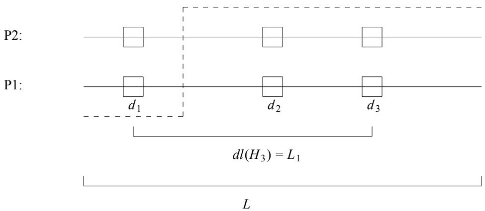
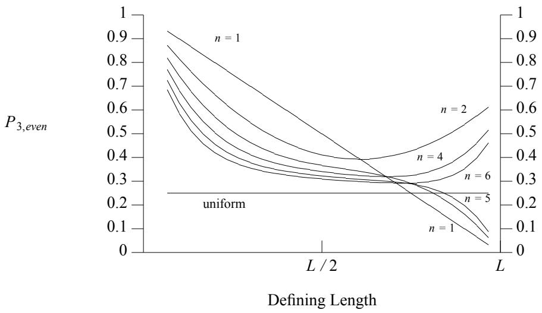
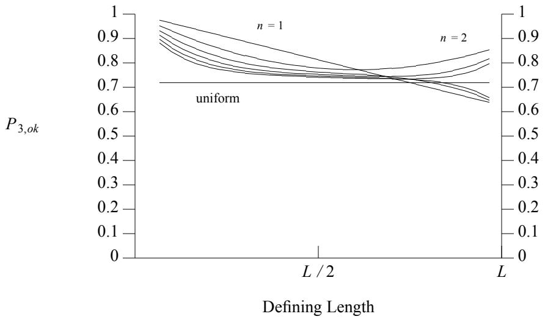
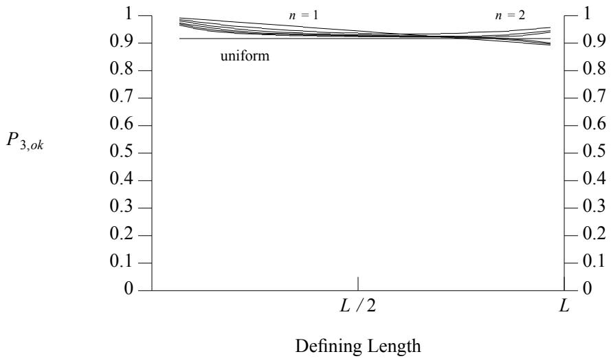
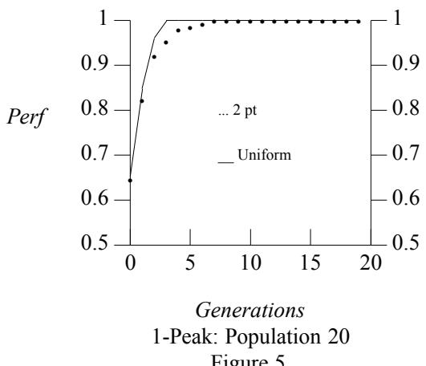
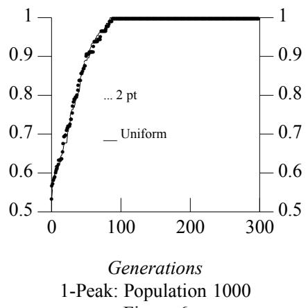
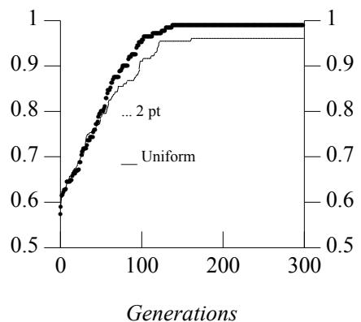
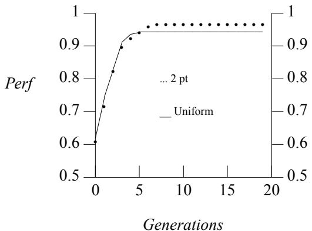
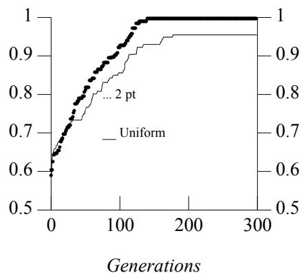

# An Analysis of the Interacting Roles of Population Size and Crossover in Genetic Algorithms

Kenneth A. De Jong kdejong@aic.gmu.edu Computer Science Dept. George Mason University Fairfax, VA 22030, USA

William M. Spears spears@aic.nrl.navy.mil AI Center - Code 5510 Naval Research Laboratory Washington, D.C., USA

# Abstract

In this paper we present some theoretical and empirical results on the interacting roles of population size and crossover in genetic algorithms. We summarize recent theoretical results on the disruptive effect of two forms of multi-point crossover: npoint crossover and uniform crossover. We then show empirically that disruption analysis alone is not sufficient for selecting appropriate forms of crossover. However, by taking into account the interacting effects of population size and crossover, a general picture begins to emerge. The implications of these results on implementation issues and performance are discussed, and several directions for further research are suggested.

# 1. Introduction

One of the unique aspects of the work involving genetic algorithms (GAs) is the important role that recombination plays in the design and implementation of robust adaptive systems. In most GAs, individuals are represented by fixed-length strings and recombination is implemented by means of a crossover operator which operates on pairs of individuals (parents) to produce new strings (offspring) by exchanging segments from the parents’ strings. Traditionally, the number of crossover points (which determines how many segments are exchanged) has been fixed at a very low constant value of 1 or 2. Support for this decision came from early work of both a theoretical and empirical nature [Holland75, DeJong75].

However, there continue to be indications of an empirical nature that there are situations in which having a higher number of crossover points is beneficial [Syswerda89, Eschelman89]. Perhaps the most surprising result (from a traditional perspective) is the effectiveness on some problems of uniform crossover, an operator which produces on the average $\left( L \ / \ 2 \right)$ crossings on strings of length $L$ [Syswerda89].

Recent work by Spears and De Jong [Spears90] has extended the theoretical analysis of multi-point crossover with respect to disruption of sampling distributions. However, they pointed out that disruption analysis alone is not sufficient in general to predict and/or select optimal forms of multi-point crossover. This paper extends their analysis by showing that a much more consistent view of the role of multi-point crossover begins to emerge if the interacting effects of population size and crossover are taken into account.

The paper begins with a brief summary of the theoretical results on crossover disruption, together with some examples of how disruption theory alone is not sufficient to select optimal crossover forms. An empirical study is then presented which systematically analyzes the interacting effects of population size and crossover on performance. The implications of these results on selecting appropriate forms of multi-point crossover are discussed.

# 2. Disruption Analysis

Holland provided the initial formal analysis of the behavior of GAs by characterizing how they biased the makeup of new offspring in response to feedback on the fitness of previously generated individuals. By focusing on a particular class of subspaces of $L$ -dimensional spaces, namely, kth order hyperplanes characterized by schemata of the form $^ { " * * * } d _ { 1 } { } ^ { * * * * } d _ { 2 } { } ^ { * * * } \cdot \cdot \ast * * 4 _ { k } { } ^ { * * * } d _ { k } { } ^ { * * * }$ (where $k$ represents the number of defining positions $d _ { i }$ in the schema string), Holland showed that the expected number of samples (individuals) allocated to a particular kth order hyperplane $H _ { k }$ at time $t + 1$ is given by:

$$
m \left( H _ { k } , t + 1 \right) \geq m \left( H _ { k } , t \right) \ast \frac { f \left( H _ { k } \right) } { \overline { { f } } } \ast \left( 1 - P _ { m } k - P _ { c } P _ { d } ( H _ { k } ) \right)
$$

In this expression, $f ( H _ { k } )$ is the average fitness of the current samples allocated to $H _ { k } , { \overline { { f } } }$ is the average fitness of the current population, $P _ { m }$ is the probability of using the mutation operator, $P _ { c }$ is the probability of using the crossover operator, and $P _ { d } ( H _ { k } )$ is the probability that the crossover operator will be "disruptive" in the sense that the children produced will not be members of the same subspace as their parents.

The usual interpretation of this result is that subspaces with higher than average payoffs will be allocated exponentially more trials over time, while those subspaces with below average payoffs will be allocated exponentially less trials. This assumes that there are enough samples to provide reliable estimates of hyperplane fitness, and that the effects of crossover and mutation are not too disruptive. Since mutation is typically run at a very low rate (e.g., $P _ { m } = 0 . 0 0 1 \mathrm { \Omega }$ ), it is generally ignored as a significant source of disruption. However, crossover is usually applied at a very high rate (e.g., $P _ { c } \ge 0 . 6 )$ . So, considerable attention has been given to estimating $P _ { d }$ , the probability that a particular application of crossover will be disruptive.

To simplify and clarify the analysis, it is typically assumed that individuals are represented by fixed-length binary strings of length $L$ , and that crossover points can occur with equal probability between any two adjacent bits. For ease of presentation these same assumptions will be made for the remainder of this paper. Generalizing the results to nonbinary fixed-length strings is quite straightforward. Relaxing the other assumptions is more difficult.

Under these assumptions, Holland provided a simple and intuitive analysis of the disruption of 1-point crossover: as long as the crossover point does not occur within the defining boundaries of $H _ { k }$ (i.e., in between any of the $k$ fixed defining positions), the children produced from parents in $H _ { k }$ will also reside in $H _ { k }$ [Holland75]. Figure 1 represents this graphically for a 3rd order hyperplane schema of the form $" " * * d _ { 1 } " * * * d _ { 2 } " * * * d _ { 3 } * * *$ Note that $d _ { 1 } , d _ { 2 }$ , and $d _ { 3 }$ represent the 3 defining positions of the 3rd order hyperplane, while P1 and P2 indicate the two parents.

  
Figure 1: A 3rd Order Hyperplane Schema

If crossover does occur inside the defining boundaries, disruption may or may not result. Disruption will depend on where the crossover point occurs inside the defining boundaries and on the allele values that the parents have in common on the $k$ defining positions. Hence, $P _ { d }$ can be bounded by the probability that the crossover point will fall within the defining boundaries of $H _ { k }$ . Under the assumption of uniformly distributed crossover points, this yields:

$$
P _ { d } ( H _ { k } ) \leq { \frac { d l ( H _ { k } ) } { L - 1 } }
$$

where $d l ( H _ { k } )$ is the "defining length" of $H _ { k }$ , namely the distance between the first and last of the $k$ fixed defining positions of hyperplane $H _ { k }$ .

This analysis has lead to considerable discussion of the "representational bias" built into 1-point crossover, namely that crossover is much more disruptive to hyperplanes whose defining positions happen to be far apart. It also suggests a plausible role for inversion operators capable of effecting a change of representation in which the defining lengths of key hyperplanes are shortened.

De Jong and Spears [DeJong75, Spears90] have extended this analysis to two classes of multi-point crossover operators: traditional $n$ -point crossover and uniform crossover. Their results take two forms: a conservative lower bound on the disruption and a tighter (nonbounding) estimate based on probabilistic estimates of the similarity of the parents involved in the crossover operations.

The conservative lower bound is obtained by noting that no disruption can occur if there are an even number of crossover points (including 0) between each of the defining positions of a hyperplane. Hence, we have a bound for the disruption of $n$ -point crossover:

$$
P _ { d } ( n , H _ { k } ) \leq 1 - P _ { k , e v e n } ( n , H _ { k } )
$$

where $P _ { k , e v e n }$ is defined to be the probability that an even number of crossover points will fall between each of the defining positions of hyperplane $H _ { k }$ .

The precise form that $P _ { k , e v e n }$ takes is given in [Spears90]. For our purposes here, plotting $P _ { k , e v e n }$ for various forms of multi-point crossover provides a clear visual indication of the relative disruption caused by these operators. Figure 2 is a typical example of such a plot generated for hyperplanes of order 3. If we interpret the area above a particular curve as a measure of the cumulative disruption potential of its associated crossover operator, then these curves suggest that 2-point crossover is the best as far as minimizing disruption. At the same time notice that, unlike the traditional $n$ -point crossover, there is no representational bias with uniform crossover in the sense that all hyperplanes of order $k$ are equally disrupted (but at a higher rate) regardless of how long or short their defining lengths are.

  
Figure 2. Disruption of Uniform Crossover

These bounds are extremely conservative since it can be shown that there are many "odd" crossovers which are not disruptive because both parents share common allele values on some or all of the defining positions of $H _ { k }$ . Deriving an expression for the probability that both parents will share common allele values on the defining positions of a particular hyperplane is difficult in general because of the complexity of the population dynamics. We can, however, get a feeling for the effects of shared allele values on disruption by making the following simplifying assumption: the probability $P _ { e q }$ of two parents sharing an allele value is constant across all loci.

With this assumption we can generalize $P _ { k , e v e n }$ to $P _ { k , o k }$ by including "odd" crossovers which are not disruptive, yielding a tighter (non-bound) estimate of disruption:

$$
P _ { d } ( n , H _ { k } ) \approx 1 - P _ { k , o k } ( n , H _ { k } )
$$

Again, the actual form of $P _ { k , o k }$ for the various crossover operators is not important here. The interested reader can see [Spears90] for a more detailed derivation. However, the disruption curves generated by these forms give a clear view of the effects of counting nondisruptive "odd" crossovers. Figures 3 and 4 illustrate this for 3rd order hyperplanes. Figure 3 assumes a value of $P _ { e q } = 0 . 5$ , which is likely to hold in the early generations, when matches are least likely. Figure 4 assumes a value of $P _ { e q } = 0 . 7 5$ , to get a feeling of the effect as the population becomes more homogeneous. Note that in both cases, the amount of expected disruption has been significantly reduced and the relative difference in disruption among different crossover operators is reduced as well. At the same time, note that the curves for the various crossover operators have held their relative position with respect to one another.

  
Figure 3. $P _ { k , o k }$ on 3rd Order Hyperplanes with $P _ { e q } = 0 . 5$

# 3. An Improved View of Crossover Disruption

The crossover disruption analysis in the previous section strongly suggests that crossover operators with only a small number of crossover points (1 or 2) minimize disruption. Yet there are many empirical studies which show situations in which more disruptive crossover operators such as 16-point crossover and uniform crossover actually outperform less disruptive ones (see, for example, [Eschelman89] or [Syswerda89]). This leaves us in the uncomfortable position that the theory is not too helpful in selecting appropriate crossover operators. It is possible that the theoretical results are themselves incorrect because of some of the simplifying assumptions that were made to obtain some of the closed-form expressions for the disruption probabilities. However, we feel that it is more likely the case that attempting to minimize disruption is not the best way to select appropriate crossover operators.

The disruption analysis implicitly assumes that disruption of the sampling distributions is a bad thing and to be avoided. However, it is possible that there are situations in which disruption helps rather than hinders the adaptive search process. As we analyzed a variety of empirical studies in which different crossover operators produced "the best" performance, we became increasing convinced that this is in fact the case. We believe now that there are at least two important situations in which disruption is advantageous: 1) late in the evolutionary search process when the population is quite homogeneous, and 2) when the population size is too small to provide the necessary sampling accuracy for complex search spaces.

  
Figure 4. $P _ { k , o k }$ on 3rd Order Hyperplanes with $P _ { e q } = 0 . 7 5$

# 3.1. Homogeneity and Crossover Productivity

Sampling disruption is important for understanding the effects of crossover when populations are diverse (typically, early in the evolutionary process). However, when a population becomes quite homogeneous, another factor becomes important: whether the offspring produced by crossover will be different than their parents in some way (thus generating a new sample) or just clones.

If we try to formally compute the probability that the offspring will be different than their parents, the computation is precisely the same as the previous disruption computations. To see this, consider two parents whose allele values differ on only 4 loci. In order for crossover to produce new offspring, some but not all of those allele values must be exchanged. The probability of this occurring is just $P _ { d } ( H _ { 4 } )$ . In other words, those operators that are more disruptive are also more likely to create new individuals from parents with nearly identical genetic material.

This property of crossover has been dubbed "crossover productivity" and has been discussed elsewhere [Booker87, Spears90]. It is easy to show that long term performance can frequently be improved at the expense of short term performance by selecting more disruptive crossover operators. There is some evidence that one can have "the best of both worlds" by modifying crossover operators to be less likely to produce clones without increasing disruption in the early stages. This can be achieved in a brute force manner by repeated calls to crossover until non-clones are produced, or in a more sophisticated fashion, such as Booker’s reduced surrogate approach [Booker87].

Having an "adaptive" crossover operator which increases its disruptive potential as homogeneity increases is an attractive, but under-appreciated, feature that should be analyzed further and included in GA implementations.

# 3.2. Population Size Interactions

As we looked more closely at the situations in which more disruptive crossover operators improved performance, it became clear that the choice of population size had a strong interacting effect on the results. Part of this effect is due to the crossover productivity issues discussed in the previous section, since smaller population sizes tend to become homogeneous more quickly. With larger population sizes the crossover productivity effects are much less dramatic.

However, even after augmenting the crossover operators (as discussed in the previous section) to improve productivity, there is still a strong interaction with population size. Our feeling is that these situations occur when the population size is too small for the complexity of a particular search space because it lacks the information capacity to provide accurate sampling (see [Goldberg89] for a discussion of population size requirements). This is quite a different phenomenon than crossover productivity. In terms of Holland’s original analysis, it suggests that, in the face of inadequate information capacity, noisy sub-optimal sampling distributions are more robust. To test these ideas, we developed an experimental setting in which we could systematically vary the problem complexity and population size.

# 4. Experimental Design and Initial Results

In order to test the relationship between search space complexity and population size, we needed a test suite which allowed us to control problem complexity in a systematic manner. The test suite selected was based on a class of boolean satisfiability problems studied in [Spears90], which we refer to here as $n$ -Peak problems. An $n$ -Peak problem has only one global optimum, but $n - 1$ local optima. These local optima are hills on which the GA can prematurely converge. By increasing $n$ we can increase the complexity of the search space in a controlled manner. The problems are:

$$
{ \begin{array} { r l } & { { 1 } { \mathrm { - P e a k : ~ } } \left( A N D X _ { 1 } \cdot \cdots \ X _ { 3 0 } \right) } \\ & { { \mathrm { 2 } } { \mathrm { - P e a k : ~ } } 1 { \mathrm { - P e a k ~ } } O R \ \left( A N D X _ { 1 } { \overline { { X _ { 1 } } } } \ \cdots \ { \overline { { X _ { 3 0 } } } } \right) } \\ & { { \mathrm { 3 } } { \mathrm { - P e a k : ~ } } 2 { \mathrm { - P e a k ~ } } O R \ \left( A N D X _ { 1 } { \overline { { X _ { 1 } } } } \ \cdots \ { \overline { { X _ { 1 5 } } } } \ X _ { 1 6 } \ \cdots \ X _ { 3 0 } \right) } \\ & { { \mathrm { 4 } } { \mathrm { - P e a k : ~ } } 3 { \mathrm { - P e a k ~ } } O R \ \left( A N D X _ { 1 } { \overline { { X _ { 1 } } } } \ X _ { 2 } \ \cdots \ X _ { 1 5 } { \overline { { X _ { 1 6 } } } } \ \cdots \ { \overline { { X _ { 3 0 } } } } \right) } \\ & { { \mathrm { 5 } } { \mathrm { - P e a k : ~ } } 4 { \mathrm { - P e a k ~ } } O R \ \left( A N D X _ { 1 } { \overline { { X _ { 1 } } } } \ X _ { 2 } { \overline { { X _ { 3 } } } } \ X _ { 4 } { \overline { { X _ { 5 } } } } \ \cdots \ { \overline { { X _ { 2 9 } } } } \ X _ { 3 0 } \right) } \\ & { { \mathrm { 6 } } { \mathrm { - P e a k : ~ } } 5 { \mathrm { - P e a k ~ } } O R \ \left( A N D X _ { 1 } { \overline { { X _ { 1 } } } } \ { \overline { { X _ { 2 } } } } \ X _ { 3 } { \overline { { X _ { 4 } } } } \ X _ { 5 } \ \cdots \ { \overline { { X _ { 2 9 } } } } \ X _ { 3 0 } \right) } \end{array} }
$$

A boolean satisfiability problem consists of finding an assignment to the boolean variables such that the boolean expression is true. For the $n$ -Peak problems, the boolean expression will be true if and only if each of the 30 boolean variables is true. Note that we systematically increase the complexity of the $n$ -peak family by generating the next member from the previous one by ORing in an additional conjunction. Each new conjunction added is not quite__ satisfiable since each contains both $X _ { 1 }$ and $\overline { { { X } _ { 1 } } }$ , resulting in the addition of another false peak.

Each boolean satisfiability problem is mapped into an equivalent function optimization problem for the GA to solve. The mapping is done in such a fashion that any truth assignment to the boolean variables has a corresponding function value between 0.0 and 1.0. Solutions have a function value of 1.0. Partial solutions (i.e., local optima) will have function values less than 1.0 (see [Spears90] for more details). For the above problems, each of the $n - 1$ local optima have equivalent function values less than 1.0. Thus each local optimum is equally attractive to the GA.

We constructed a set of 20 experiments for each $n$ -Peak problem. This was accomplished by allowing the GA to solve each problem using four different population sizes (20, 50, 100, and 1000) and five different crossover operators (2-point, 4-point, 8-point, 16-point, and uniform). Each of the 20 experiments were averaged over 10 independent runs. Although there is inadequate space to include the data from all the experiments, we present representative results to provide a clear picture of the interactive effects of multi-point crossover and population size.

Table 1 compares the relative performance of 2-point crossover with uniform crossover, by indicating which operator resulted in better performance. A ’?’ indicates that neither operator performed substantially better than the other. Uniform and 2-point crossover represent the two extremes with respect to disruption. Notice the very clear effect as one moves to the right and up, namely, the dominance of 2-point crossover. Similarly, note the dominance of uniform crossover as one moves to the lower left-hand corner. Other pair-wise comparisons of crossover operators (e.g., 2-point with 16-point) have similar but less dramatic results, since the disruption differentials are smaller.

Table 1: Relative Performance of 2-point and Uniform Crossover   

<table><tr><td rowspan=1 colspan=5>2-point vs. Uniform</td></tr><tr><td rowspan=2 colspan=1>Problem</td><td rowspan=1 colspan=4>Population Size</td></tr><tr><td rowspan=1 colspan=1>20</td><td rowspan=1 colspan=1>50</td><td rowspan=1 colspan=1>100</td><td rowspan=1 colspan=1>1000</td></tr><tr><td rowspan=1 colspan=1>6-Peak5-Peak4-Peak3-Peak2-Peak1-Peak</td><td rowspan=1 colspan=1>Uniform2-pointb?UniformUniformUniform</td><td rowspan=1 colspan=1>Uniform2-point2-point?2-pointUniform</td><td rowspan=1 colspan=1>2-point2-point?2-point??</td><td rowspan=1 colspan=1>2-point2-point2-point2-point2-point?</td></tr></table>

To get a better feeling for these results, we have included a representative set of performance graphs which illustrate this interaction nicely. Figures 5-10 show how uniform crossover dominates 2-point crossover on the simpler problems with smaller populations, but just the opposite is true for larger population sizes and more complex problems. For each figure, the horizontal axis represents the number of generations that the GA has run. The vertical axis indicates the performance of the GA. Since the GA is maximizing, a higher curve represents better performance. Again, recall that the maximum value is 1.0 indicating that the solution to the corresponding satisfiability problem has been found. Note that although a larger population results in better solutions, the GA must be run for a greater number of generations. This behavior is quite typical for a GA.

This suggests a way to better understand the role of multi-point crossover. With smaller populations, more disruptive crossover operators such as uniform or $n$ -point $( n > > 2$ ) are likely to yield better results because they help overcome the limited information capacity of smaller populations and the tendency for more homogeneity. However, with larger populations providing sufficient sampling accuracy, less disruptive crossover operators (2-point) are more likely to work better, as suggested by the theoretical analysis.

  
Figure 6

  
3-Peak: Population 20 Figure 7

  
3-Peak: Population 1000 Figure 8

  
5-Peak: Population 20 Figure 9

  
5-Peak: Population 1000 Figure 10

# 5. Conclusions and Further Work

The extensions to the analysis of $n$ -point and uniform crossover presented in this paper provide additional insight into the role and effective use of these operators. In particular, it opens up an interesting new view of uniform crossover as being an effective operator for situations in which there are contraints on the size of the population that can be supported.

At the same time, it should be emphasized that the empirical studies presented are limited to a carefully controlled experimental setting. The authors are currently involved in extending this analysis to a much broader class of search problems. The view we are taking is that there is very little likelihood of finding globally correct answers to questions such as the choice of population size and crossover operators. Our goal is to understand these interactions well enough so that GAs can be designed to be self-selecting with respect to such decisions.

# Список литературы

Booker, Lashon B. (1987). Improving Search in Genetic Algorithms, Genetic Algorithms and Simulated Annealing, Morgan Kaufmann Publishing.

De Jong, Kenneth A. (1975). An Analysis of the Behavior of a Class of Genetic Adaptive Systems, Doctoral Thesis, Department of Computer and Communication Sciences, University of Michigan, Ann Arbor.

Eschelman, L., Caruana, R. & Schaffer, D. (1989). Biases in the Crossover Landscape, Proc. 3rd Int’l Conference on Genetic Algorithms, Morgan Kaufman Publishing.

Goldberg, David E. (1989). Sizing Populations for Serial and Parallel Genetic Algorithms, Proc. 3rd Int’l Conference on Genetic Algorithms, Morgan Kaufman Publishing.

Holland, John H. (1975). Adaptation in Natural and Artificial Systems, The University of Michigan Press.

Spears, William M. (1990). Using Neural Networks and Genetic Algorithms as Heuristics for NP-Complete Problems, Masters Thesis, Department of Computer Science, George Mason University, Fairfax, Virginia, 1990.

Spears, W. & De Jong, K. A. (1990). An Analysis of Multi-point Crossover, Proceedings of the Foundations of Genetic Algorithms Workshop, Bloomington, Indiana, 1990.

Syswerda, Gilbert. (1989). Uniform Crossover in Genetic Algorithms, Proc. 3rd Int’l Conference on Genetic Algorithms, Morgan Kaufman Publishing.