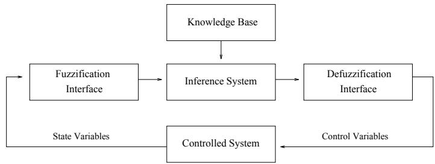
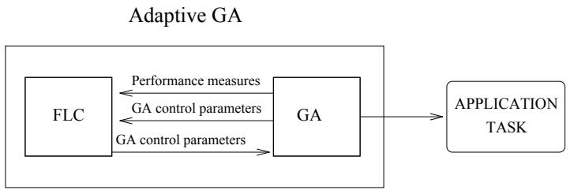
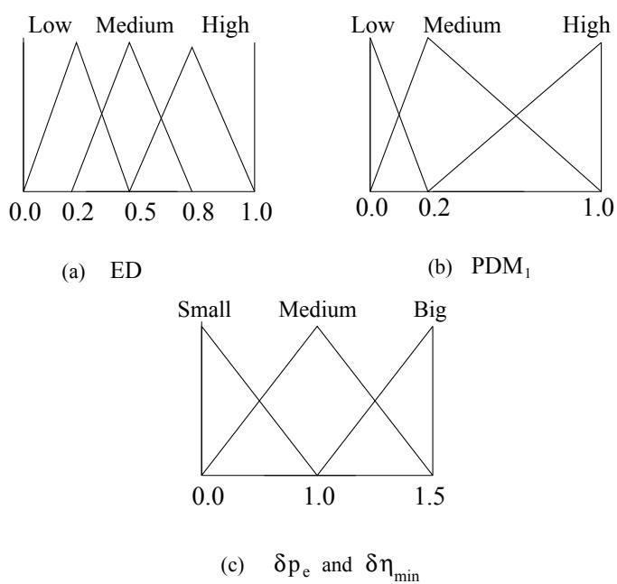

# Adaptation of Genetic Algorithm Parameters Based on Fuzzy Logic Controllers \*

p p p g

avoid the premature convergence problem and improve   
the most widely stud   
techniques. In this pa

Abstract. The genetic algorithm behaviour is determined by the exploitation and exploration relationship kept throughout the run. Adaptive genetic algoKeywords. Exploitation/exploration relationship, adaptive genetic algorithms, fuzzy logic controllers. the most widely studied adaptive approaches are the adaptive parameter setting 1 Intro ducti on of fuzzy logic controllers. Furthermore, we design and discuss an adaptive realGA behaviour is stron l determined b the balance between ex loitin what alread works best and ex lorin ossibilities that mi ht eventuall evolve into something even better. The loss of critical alleles due to se

parameter setting may make this exploitation/exploration relationship (EER) disproportionate and

# Some tools for m

modied selection and crossover operators (see [43] and [40]) and optimization of parameter settings ([24, 49]). However, nding robust genetic operators or arameter settin s that allow the remature conver ence roblem to be avoided in an roblem is not a trivial task since their interaction with GA erformance parameter setting may make this exploitation/exploration relationship (EER) This research has been supported by DGICYT PB92-0933 40]). Under these circumstances a preeminent problem appears: the premature convergence problem.

Some tools for monitoring the EER were proposed in order to avoid the premature convergence problem and improve GA performance. These tools include modified selection and crossover operators (see [43] and [40]) and optimization of parameter settings ([24, 49]). However, finding robust genetic operators or parameter settings that allow the premature convergence problem to be avoided in any problem is not a trivial task, since their interaction with GA performance presented in the literature, in Section 3, we tackle the study of adaptive GAs based on fuzzy logic controllers, in Section 4, we present dierent diversity measures that may be used by these FLCs, in Section 5, we review the applications of the FLCs for controlling GAs, in Section 6, we design an adaptive real-coded GA, in Section 7, open problems that still remain about the topic are discussed, nally some conclusions are presented in Section 8. of fuzzy logic controllers for adjusting the control parameter of GAs. The goal of this paper is to report on an extensive study of the parameter setting adap2 Adaptive Genetic Algorithms follows: in Section 2, we review different parameter setting adaptive techniques presented in the literature, in Section 3, we tackle the study of adaptive GAs proposed in the literature and we go into the parameter setting adaptation in sures that may be used by these FLCs, in Section 5, we review the applications of the FLCs for controlling GAs, in Section 6, we design an adaptive real-coded 2.1 Classications of Adaptive Genetic Algorithms finally some conclusions are presented in Section 8.

# 2 Adaptive Genetic Algorithms

In this section we briefly study the classification of the different adaptive methods { adaptive genetic operators ([42, 30, 31, 44]), { ad

# 2.1 Classifications of Adaptive Genetic Algorithms

, gg y p ([ ]), takes into account the GA issues that are adapted throughout the GA run:

− adaptive parameter settings ([32, 41, 7, 63, 11, 20, 14, 59, 60, 12, 3, 5, 38, 53, 1, 55, 34]),   
− adaptive genetic operators ([42, 30, 31, 44]),   
adaptive genetic operator selection ([48, 54, 52, 62, 51]),   
− adaptive representation ([46, 61, 50]) and   
adaptive fitness function ([22, 42, 35, 45]).

straightforward, since no new adaptive mechanism is needed, however, two possible problems may arise ([54]):

- Tightly Coupled. The adaptation is driven by the internal forces of evolution itself. There are three levels where the adaptation may be carried out ([51]): the level of individuals, the level of subpopulations and the level of population. The level implicitly defines the time interval when the adaptation takes place. If, for instance, populations are used for adaptation, then a minimum number of generations is needed for evaluating the population. In contrast, individuals are evaluated after each generation. This approach is elegant and straightforward, since no new adaptive mechanism is needed, however, two possible problems may arise ([54]):

The coupling of the two search spaces could hinder the adaptive mechanism. As the population evolves, diversity will be lost in both spaces. If diversity has been lost, adaptation may be difficult to accomplish. • This mechanism may only work well with large population sizes, since the population is being used to sample the space of GAs.

Uncoupled. A totally separate adaptive mechanism adjusts the GA. An uncoupled approach does not rely upon the GA for the adaptive mechanism. While this may alleviate the problems associated with coupling, such mechanisms appear to be difficult to construct, and involve a lot of separate bookkeeping. In [23], Goldberg wrote:

"Nature acts in a distributed fashion without central coordination t, we review the adaptive GAs based on adaptive parameter setti pe of adaptive GAs have been widely studied. different solutions to be explored in parallel".

Parameter Settin Ada tation anisms, since they break the original GA philosophy. Moreover, he suggested e GA control parameter settings such as mutation probability (pm), crossover bability (pc) and population size (N) are key factors in exploitation versus exploration tradeo. It has long been acknowledged that y have a signicant impact on GA performance [24]. If poor settings are u

severely aected [14]. Next, we report on some adaptive approaches that are described in the literature for ad ustin these arame

# 2.2 Parameter Setting Adaptation

The GA control parameter settings such as mutation probability $\left( p _ { m } \right)$ , crossover At rst $\left( p _ { c } \right)$ ce it would seem tha $( N )$ remature conver ence is best treated b the exploitation versus exploration tradeoff. It has long been acknowledged that there are some roblems associated with this solution : 1 the hi h in
ux of material would disru t the on oin enetic search and 2 this task attem ts to recover from conver ence rather than to avoid it and hence ma suer from the loss of otentiall valuable enetic combinations. Mo

# 2.2.1. Adapting the Mutation Probability

At first glance, it would seem that premature convergence is best treated by an increase in the mutation probability to restore the lost alleles ([11]). However, there are some problems associated with this solution ([8]): 1) the high influx of material would disrupt the ongoing genetic search and 2) this task attempts to recover from convergence rather than to avoid it, and hence, may suffer from the loss of potentially valuable, genetic combinations. More suitable proposals for enforcing diversity through $p _ { m }$ have been proposed. Next, we review these.

A direction followed by GA research for the variation of $p _ { m }$ lies in the specification of an externally specified schedule which modifies it depending on the is achieved. This implicitly represents an increase in the mutation $p _ { m }$ obability. To ensure that the GA is allowed to conver e the uni ueness value is decreased as the search proceeds from a value of k to 1. $p _ { m }$ . Later on, in [20] and The idea of susta $p _ { m }$ g genetic diversity through mutation is presented in [59, 60 as well. Mutation is invoked in res onse to increasin enetic homo eneit $p _ { m }$ the population. Pop

Hamming distance between the two parents during reproduction. The more similar the two arents the more likel that mutation would be a lied to bits in the os rin created b recombination. In 3 5 a cou led ada tive method for mutation robabilities was ado ted. The rinci al features of this model are 1 each osition of each chromosome has associated a mutation robabilit 2 these robabilities are incor orated as the search proceeds from a value of $k$ to 1.

are also sub ect to mutation and selection i.e. the under o evolution as well as the chromosomes. in the population. Population homogeneity is indirectly monitored by measuring the Hamming distance between the two parents during reproduction. The more 2.2.2 Adapting the Population Size in the offspring created by recombination.

In [3, 5], a coupled adaptive method for mutation probabilities was adopted. The principal features of this model are 1) each position of each chromosome the A ma conver e too uickl whereas if it is too lar e the A ma waste com utational resources. Next we resent some a roaches for the ada tation they are also subject to mutation and selection, i.e., they undergo evolution as well as the chromosomes.

# 2.2.2 Adapting the Population Size

some means fewer os rin for the rest of the o ulation. When too man chromosomes have no ospring at all, the result is a rapid loss of diversity and premature convergence. In order to recognize rapid convergence before the genetic material is lost Baker resented a measure called ercent involvement as th $N$ e

eration. Baker proposed a dynamic pop $N$ ation size method that enforces a lower bound on the percent involvement. This is done by adding chromosomes ing from it. He observed that rapid convergence often occurs after a chromosome or small group of chromosomes contributes a large number of offspring through selection. Since population is finite, a large number of offspring for one chromosome means fewer offspring for the rest of the population. When too many chromosomes have no offspring at all, the result is a rapid loss of diversity and premature convergence. In order to recognize rapid convergence before the genetic material is lost, Baker presented a measure, called percent involvement, as the percentage of the current population which contributes offspring for the next generation. Baker proposed a dynamic population size method that enforces a lower bound on the percent involvement. This is done by adding chromosomes the average, maximal and minimal tness values in the current population and the maximal and minimal found so far. Any lifetime calculation strategy sh

ign the higher lifetime values to chromosomes having above-average tness values. Dierent proposals were implemented and compared. None of them stood out as the best with regards to the results and its computational cost. Hence, it was pointed out that the choice of the optimal strategy of lifetime calculation is still an open problem and it deserves further investigation. Finall we oint out that in 53 an al orithm was resented which ad usts the population size with respect to the probability of selection error. current state of the GA is taken into consideration. This state is described by the average, maximal and minimal fitness values in the current population and 2.2.3 Adapting the Crossover Probability assign the higher lifetime values to chromosomes having above-average fitness values. Different proposals were implemented and compared. None of them stood d namicall var in the crossover robabilit ma be benecial. His a roach was pointed out that the choice of the optimal strategy of lifetime calculation is abilit is ad usted u sli htl if entro is fallin and dow

n . Another attem t for ada tin the crossover robabilit is resented b the population size with respect to the probability of selection error.

# 2.2.3 Adapting the Crossover Probability

crossover probability. Experiments carried out showed that oine and online measures were improved with this model. is based on the use of an entropy measure over the population. Crossover probability is adjusted up slightly if entropy is falling and down if entropy is flat or 2.2.4 Adapting both the Crossover and Mutation Probabilities Booker in [11]. He pointed out that the crossover operator is the key point for In 38 two diversit functions were dened for describin GA behaviour and were used for handlin the and arameters in order to induce an ideal EER. One of these diversit functions measures the diversit between chromosomes BC in the o ulation and the other measures the diversit between the alleles the crossover probability. Experiments carried out showed that offline and online measures were improved with this model.

# 2.2.4 Adapting both the Crossover and Mutation Probabilities

In [38], two diversity functions were defined for describing GA behaviour and were used for handling the $p _ { \mathcal { C } }$ and $p _ { m }$ parameters in order to induce an ideal EER. One of these diversity functions measures the diversity between chromosomes (BC) in the population and the other measures the diversity between the alleles (BA) in all the chromosomes. The former is concerned with the efficiency of genetic operators and the latter expresses the state of convergence. Li et al. ([38]) proposed a dynamic $G A$ that can approximate an ideal genetic procedure,

BA value, the pm was varied from 0.001 to 0.2 to have sucient alleles in the o ulation. This sta e was desi nated as the main art of the GA i.e half of the generation time. Finally, in the last stage, renement, the balance must be desi ned towards exploitation and the search is forced in the local re ions where there are hi her probabilities of ndin the optimum solutions. To do so, p decreases from the current value to a minimum value of 0:001 and p is help at a constant value of 0:6. The experiments showed that dynamic GA was near an ideal behaviour dened by Li et al. with respect to the level of diversity generated. $p _ { c }$ is adjusted upwards slightly and if the BC value is larger than a maximum critical limit, the $p _ { c }$ is forced downwards slightly. According to the ommended to $p _ { m }$ ieve the twin oals of maintainin diversit in the o ulation and sustainin the conver ence ca acit of the GA. AGA was ro osed an the generation time. Finally, in the last stage, refinement, the balance must be solutions. Each chromosome has its own and . Both are ro ortional to f f f  f , where f is the chromosome's tness, f is the populat $p _ { m }$ maximum tness and  is the mean tness. In this wa hi h-tness so $p _ { c }$ ions are at a constant value of 0.6. The experiments showed that dynamic GA was near increases and when the o ulation tends to et stuck at a local o timum generated.

tor fbest  f is used by AGA as a measure for detecting convergence. In 14 a real-coded GA is im lemented b usin two t es of crossover o erators uaranteed uniform crossover and uaranteed avera e and three t es of mutation o erators $p _ { c }$ uaran $p _ { m }$ d mutation uaranteed bi cree and uaranteed little cree . These o erators oer a wide $p _ { c }$ n e o $p _ { m }$ x loration and ex loitation $( f _ { b e s t } - f ) / ( f _ { b e s t } - \bar { f } )$ r is ive $f$ an initial a lication roba $f _ { b e s t }$ . For each re roduction event a sin $\bar { f }$ o erator is selected robabilisticall accordin to the set of o erator robabilities as o osed to the techni ue used more commonl in which $p _ { c }$ th cr $p _ { m }$ over and mutation could be a lied to the same individual durin re roduction. An ada tive rocess rovides for the alteration of o erator r $f _ { b e s t } - \bar { f }$ s in ro ortion to the tnesses of chromosomes created

erators during the course of a run. Operators which create and cause the generation of better chromosomes are allotted higher probabilities, i.e., they should be used more frequently. On the other hand, operators producing ospring with a tness which is lower than that of the parents should be used less frequently. In [34], a similar model is presented for a steady-state GA. This method adjusts the operators' probabilities after the generation of each ospring, rather than at set of operator probabilities, as opposed to the technique used more commonly, in which both crossover and mutation could be applied to the same individual during reproduction. An adaptive process provides for the alteration of operator probabilities in proportion to the fitnesses of chromosomes created by the operators during the course of a run. Operators which create and cause the generation of better chromosomes are allotted higher probabilities, i.e., they should be used more frequently. On the other hand, operators producing offspring with a fitness which is lower than that of the parents should be used less frequently. In [34], a similar model is presented for a steady-state GA. This method adjusts the operators' probabilities after the generation of each offspring, rather than at

# dealing with this type of knowledge. One application of fuzzy logic (

expert operator's approximate reasoning process in the selection of a control action. An FLC allows one to ualitativel ex ress the control strate ies based on experience as well as intuition. These control strategies may be expressed in a form that permits both computers and humans to share them eciently. Next we stud the a lication of the FLCs for controllin GAs before brie describin the eneric structure of FL s. rarely applied. This latter feature suggests the use of fuzzy logic-based tools for dealing with this type of knowledge. One application of fuzzy logic (FL) that is 3.1 Description of the FLCs expertise and knowledge are fuzzy logic controllers (FLCs). FLCs implement an An FLC is com osed b a knowled e base that includes the information iven by the expert in the form of linguistic control rules, a fuzzication interface, which has the eect of transforming crisp data into fuzzy sets, an Inference System, that uses them to ether with the knowled e base to make inferenc

ans of a reasoning method, and a defuzzication interface, that translates the fuzzy control action thus obtained to a rea

# 3.1 Description of the FLCs

An FLC is composed by a knowledge base, that includes the information given by the expert in the form of linguistic control rules, a fuzzification interface, which has the effect of transforming crisp data into fuzzy sets, an Inference System, that uses them together with the knowledge base to make inference by means of a reasoning method, and a defuzzification interface, that translates the fuzzy control action thus obtained to a real control action using a defuzzification method. The generic structure of an FLC is shown in Figure 1 ([36]).

  
Fig.1. Generic structure of an FLC.

ule base, constituted by the collection of fuzzy control rules representing the ex ert knowled e.

"if a set of conditions are satisfied then a set of consequences can be inferred" in which the antecedent is a condition in its application domain, the consequent is a control action to be applied in the controlled system (notion of control rule) Applications of FLCs for controlling GAs are to be found in [37, 64, 65, 2, 27, 10, 56]. The main idea is to use an F

performance measures or current control parameters and whose outputs are GA control parameters. Current performance measures of the GA are sent to the FLC, which computes new control parameters values that will be used by the GA. Figure 2 shows this process. Clearly, under Spears' classication, this adaptive techniqu

# 3.2 Application of the FLCs for Controlling GAs

Applications of FLCs for controlling GAs are to be found in [37, 64, 65, 2, 27, 10, 56]. The main idea is to use an FLC whose inputs are any combination of GA performance measures or current control parameters and whose outputs are GA control parameters. Current performance measures of the GA are sent to the FLC, which computes new control parameters values that will be used by the GA. Figure 2 shows this process. Clearly, under Spears' classification, this adaptive technique is uncoupled.

  
also be considered as inputs. Since an adapti

For designing a FLC that controls a GA, the following steps are needed:

# 1. Define the inputs and outputs

Inputs should be robust measures that describe GA behaviour and the effects of the genetic setting parameters and genetic operators. In [56], some possible inputs were cited : diversity indices, maximum, average and minimum fitness, etc. In [37] and [64, 65], it is suggested that current control parameters may also be considered as inputs. Since an adaptive GA based on FLCs should maintain an adequate EER for avoiding premature convergence, we think that diversity measures stand out as important input candidates due to the sets. So, it is necessary that every input and output have a bounded range of values in order to dene these membershi functions

Obtain the rule base After selecting the inputs and outputs and dening the $p _ { m }$ a $p _ { c }$ a $N$ the fuzzy rules describin the relations between them should be dened. There are dierent ways to do so: obtained, etc.

2. Define the data base

Each input and output should have an associated set of linguistic labels. The meaning of these labels is specified through membership functions of fuzzy [ ], y g q g of values in order to define these membership functions over it.

3. Obtain the rule base

After selecting the inputs and outputs and defining the data base, the fuzzy rules describing the relations between them should be defined. There are different ways to do so:

(a) using the experience and the knowledge of the GA experts or

Diversity Measures or expertise are not available.

ere are two types of diversity measures that describe the state of the popuon: genotypic diversity measures (GDMs) and phenotypic diversity measures DMs). GDMs involve the genetic material held in the population whereas Ms concern the tness of the chromosomes. Next, we review each one of se measure types. parameters and GA performance.

# 4 Diversity Measures

There are two types of diversity measures that describe the state of the population: genotypic diversity measures (GDMs) and phenotypic diversity measures (PDMs). GDMs involve the genetic material held in the population whereas PDMs concern the fitness of the chromosomes. Next, we review each one of these measure types.

# 4.1 Genotypic Diversity Measures

GDMs describe variation or lack of similarity between the genetic material, e.g., alleles, chromosomes, etc. Different ways have been followed for defining them, such as using allele frequency measures, statistical dispersion measures, histograms over the action interval of the genes, Hamming distance, Euclidean distance, entropy measures, etc. Next, we summarize some of these.

# 4.1.1 GDMs Based on Allele Frecuencies

%, 95%, 50%, and 70%, respectively, then the commitment is 100+80+95+50+70. Collins et al. [13] measure the allele diversity of a BCGA population by comparing the current allele frequencies with the expected allele frequencies of a maximally diverse population. Maximum diversity occurs when each allele freuenc is 0.5 since each ene osition has two ossible alleles. The diversit of alleles at po $9 5 \%$ n i is dened as $9 5 \%$ of the population has the same allele. Baker ([8]) claimed that these measures do Di = 1  4(0:5  freci) mitme nt, which is the average convergence of each gene position. For example, if where freci is the current frequency of the 0 allele at position i. Di can $1 0 0 \%$ e $8 0 \%$ $9 5 \%$ $5 0 \%$ indic $7 0 \%$ complete convergence, to 1, which in $\frac { 1 0 0 + 8 0 + 9 5 + 5 0 + 7 0 } { 5 }$ - mum possible genetic diversity. The diversity of the population is calculated as the average value of the Di. Mauhfoud ([40]) presented a general model of diversity measures based on the idea of comparing a frequency distribution associated with a particular feature of the elements of the population and a distribution representing the f $i$ ll diversity w

$$
D _ { i } = 1 - 4 ( 0 . 5 - f r e c _ { i } )
$$

of De $f r e c _ { i }$ and Collins et al. are instances o $0$ his model. $i$ $D _ { i }$ can range from $0$ , which indicates complete convergence, to 1, which indicates the maximum possible genetic diversity. The diversity of the population is calculated as 4.1.2 GDMs Based o $D _ { i }$ Histograms sity measures based on the idea of comparing a frequency distribution associated with a particular feature of the elements of the population and a distribution representing the full diversity with respect to this feature. The diversity measures of Mauhfoud take on real values in the range from 0 to $M A X$ , with 0 indicating no diversity, higher values indicating higher levels of diversity, and $M A X$ osomes and each interval I hist i stores the number of alleles at oof De Jong and Collins et al. are instances of his model.

# 4.1.2 GDMs Based on Histograms

In [33], a measure of diversity, called total allele lost, for a population with integer-coded chromosomes, was presented. The action interval of each gene, $[ - 1 0 , 1 0 ]$ , was divided into seven subintervals, $I _ { 1 } = [ - 1 0 , - 8 ] , I _ { 2 } = [ - 7 , - 5 ] , . . . , I _ { 7 } =$ [8, 10]. A histogram, $h i s t ( \cdot , \cdot )$ , was computed such as for each position $i$ of the chromosomes and each interval $I _ { j }$ $h i s t ( i , j )$ stores the number of alleles at position $i$ that belong to the subinterval $I _ { j }$ . For each position $i$ , a measure, $A L ( \cdot )$ called allele lost, was defined as

$$
A L ( i ) = \sum _ { j = 1 } ^ { 7 } { \mathrm { n u m b e r ~ o f ~ z e r o s ~ i n ~ h i s t ( j , ~ i ) } } .
$$

such an interval is assumed. $A L ( \cdot )$ measures. This measure has a bounded range of values, therefore it is adequate as the input for an FLC. A similar measure is defined in [50] for detecting convergence of binary4.1.3 GDMs Based on Hamming Distance each coded parameter in the chromosomes is divided into four zones, which Other a roaches for measurin the diversit of BCGAs are based on the Hammin distance. Louis et al. calculated the Hammin distance between all non-redundant combinations of two strin s and take an avera e. Whitle et al. 1 ro osed measurin the Hammin distance between the worst and the best chromosomes in the o ulation for monitorin o ulation diversit . in such an interval is assumed.

# 4.1.3 GDMs Based on Hamming Distance

clidean distance between chromosomes. We ro ose one of these measures which is based on the Euclidean distances of the chromosomes in the o ulation from the best one. It is denoted as ED. al. ([61]) proposed measuring the Hamming distance between the worst and the E D = d  d min

# 4.1.4 GDMs Based on Euclidean Distance

concentrated around the best chromosome and so convergence is achieved. If DE is high most chromosomes are not biased toward the current best element. which is based on the Euclidean distances of the chromosomes in the population from the best one. It is denoted as $E D$

$$
E D = \frac { \bar { d } - d _ { m i n } } { d _ { m a x } - d _ { m i n } }
$$

Divbeen c $\begin{array} { r } { \bar { d } = \frac { 1 } { N } \sum _ { i = 1 } ^ { N } d \big ( C _ { b e s t } , C _ { i } \big ) } \end{array}$ s $d _ { m a x } = \operatorname* { m a x } \{ d ( C _ { b e s t } , C _ { i } ) | C _ { i } \in P \}$ easupropo $d _ { m i n } =$ $\operatorname* { m i n } \{ d ( C _ { b e s t } , C _ { i } ) | C _ { i } \in P \}$ v $P$ sit between the chromosomes BC and the diversit between the a $E D$ s B $[ 0 , 1 ]$ If it $E D$ onsidered that the o ulation is a matrix in are concentrated around the best chromosome and so convergence is achieved. If $\mathit { D E }$ is high most chromosomes are not biased toward the current best element.

# 4.1.5 GDMs Based on Dispersion Statistical Measures

Diversity measures for BCGAs based on dispersion statistical measures have been considered as well. This is the case of Li et al ([38]), which proposed two diversity measures: the diversity between the chromosomes (BC) and the diversity between the alleles (BA). If it is considered that the population is a matrix, in which a row expresses a chromosome and a column an allele, then BC and BA are defined as follows:

$\star$ BA holds a constant value that i $B C = \frac { \sum _ { i } s _ { i } ^ { 2 } } { N - 1 } - \frac { s ^ { 2 } } { L * N }$   
$\star$ diversity between the alleles $B A = \frac { \sum _ { j } s _ { j } ^ { 2 } } { { \cal R } } - \frac { s ^ { 2 } } { { \cal L } \ast { \cal N } }$   
where $N$ is the population size, $L$ N L , p y $S$ is the sum of genes $^ { \circ } 1 ^ { : }$ $S _ { i }$ expresses the sum over a row $i$ and $S _ { j }$ expresses the sum over a The $j$ measures show clear limits and their ideal behaviour throughou   
1. If the population is homogeneous in either 0 or 1, BC and BA are zero.   
2. When all the chromosomes in the population are identical, BC is zero and ) g f ( )N 2 he variance a   
3. BA is independent from the crossover operator.   
? The average variances alleles AVA $\textstyle { \frac { L } { N } }$ and $\textstyle { \frac { N } { L } }$ LN

tor of genes with position j in the population, Sij, denotes the gene with position j in the chromosome i, and

In [27], other instances of diversity measures of the same type were considered  j=1 Sij  i=1 j=1 Sij  Pi=1 Sij (VAC) and the average variances of the alleles (AVA): $\star$ The properties of these diverent to mutual exchange of tw $\begin{array} { r } { V A C = \frac { \sum _ { i = 1 } ^ { N } ( \overline { { S } } _ { i } - \overline { { S } } ) ^ { 2 } } { N } } \end{array}$ $\star$ $A V A = { \frac { \sum _ { j = 1 } ^ { N } \sum _ { i = 1 } ^ { L } ( S _ { i j } - { \bar { S } } _ { j } ) ^ { 2 } } { L N } }$ where $S _ { i }$ $\mathrm { i } = 1$ , .., N, denotes the chromosome $i$ $S _ { j } , \mathrm { { j } = 1 , \ . . . , \mathrm { { L } } }$ , denotes the vector of genes with position $j$ in the population, $\mathit { S _ { i j } }$ , denotes the gene with position $j$ in the chromosome $i$ , and

$$
\bar { S } _ { i } = \frac { \sum _ { j = 1 } ^ { L } S _ { i j } } { L } ~ , \bar { S } = \frac { \sum _ { i = 1 } ^ { L } \sum _ { j = 1 } ^ { N } S _ { i j } } { L N } \mathrm { ~ a n d ~ } \bar { S } _ { j } = \frac { \sum _ { i = 1 } ^ { N } S _ { i j } } { N } .
$$

The properties of these diversity measures are the following: they are indif4.1.6 GDMs Based on Entropy Measures chromosomes in a population are almost identical, the VAC and AVA measures take low values.

In [9], four diversity measures were defined in a similar fashion for real coding as well. They were called: the within-individual diversity $( W _ { b } )$ , the betweenindividual diversity $\left( B _ { b } \right)$ , the within-gene diversity $( W _ { g }$ ) and the between-gene diversity $( B _ { g } )$ . A total diversity measure was defined as the sum of the previous four measures.

# 4.1.6 GDMs Based on Entropy Measures

Finally, we point out that some authors used entropy measures for describing the convergence state of the population ([63, 25]).

# 4.2 Phenotypic Diversity Measures

a o ulation scattered across the solution s ace. Lee et al. 37 ro ose two erformance measures that ma be considered as henot ic diversit measures: 2.2.2) and the reproduction rate ([8]) (defined in the same way). The principal feature of this type of measures is that they allow premature convergence to be PDM1 = best

Other phenotypic diversity measures have been proposed. Most of them are defined through the combinations of some of the following measures: average PDM1 $\left( \hat f \right)$ d PDM2 belong to $\left( f _ { b e s t } \right)$ terval [0; 1]. If they are n $\left( f _ { w o r s t } \right)$ convergence has been reac $f _ { b e s t } - \bar { f }$ eas if they are near to 0, the population shows a high level of diversity. In [2], a measure called tness range was dened as the dierence between the tness values of the best and worst chromosomes.

$$
P D M _ { 1 } = \frac { f _ { b e s t } } { \bar { f } } \ \mathrm { a n d } \ P D M _ { 2 } = \frac { \bar { f } } { f _ { w o r s t } } .
$$

$P D M _ { 1 }$ and $P D M _ { 2 }$ belong to the interval $[ 0 , 1 ]$ . If they are near to 1, convergence has been reached, whereas if they are near to $0$ , the population shows a high y, [ ]

In [2], a measure called fitness range was defined as the difference between the fitness values of the best and worst chromosomes.

N 1 i=1 (fi  f) the average fitness of all the chromosomes tested during the search. This measure would be appropriate in situations where the testing of every chromosome must be paid for and penalizes GAs that must test many poor chromosomes before The maximum value of span is N  1. span was used in [42] as a measure of the diculty of the tness function.

Finally, in [42], another phenotypic diversity measure called span was defined as follows:

$$
s p a n = { \frac { \sqrt { { \frac { 1 } { N - 1 } } \sum _ { i = 1 } ^ { N } ( f _ { i } - { \bar { f } } ) ^ { 2 } } } { { \frac { 1 } { n } } \sum _ { i = 1 } ^ { N } f _ { i } } } .
$$

The maximum value of span is $\sqrt { N - 1 }$ . span was used in [42] as a measure of the difficulty of the fitness function.

# 5 FLC Applications for Controlling GAs

Next, we review different models of application of FLC to the control of GAs described in the literature.

# the last control action as inputs.

and population size, respectively. For example, such output for the control of the population size, represents the degree to which the current population size should var . The new o ulation size is com uted b multi l in the out ut value b the current o ulation size. The automatic fuzz desi n mechanism was executed for learnin both the data base and the rule base for this example. A DPGA based on the resultant FLCs were used in a particular problem: the inverted pendulum control task. $P D M _ { 1 } , \ P D M _ { 2 }$ ained exhibited better erformance than a sim le static GA. the last control action as inputs. The outputs of the three FLCs are variables that control variations in the current mutation probability, crossover probability 5. 2 Fuz zy G As the population size, represents the degree to which the current population size should vary. The new population size is computed by multiplying the output value by the current population size.

The automatic fuzzy design mechanism was executed for learning both the data base and the rule base for this example. A DPGA based on the resultant FLCs were used in a particular problem: the inverted pendulum control task. The results obtained exhibited better performance than a simple, static GA.

# GAs integrated w

tions and 3) assist the user in accessing, designing, implementing and validating the GA for a given task. Experiments were carried out with an FGA, in which the adaptation of the arameters was erformed b two FLCs. Both of them had the same in uts: generation and population size. The outputs were pc and pm. They proposed usin the rule bases shown in Table 1. The FGA stood out as the most ecient algorithm against a standar GA in solving the travelling salesman and other optimization problems. GAs integrated with FLCs. FGAs may 1) choose control parameters before GA's run, 2) adjust the control parameters on-line to dynamically adapt to new situa5.3 Fuzzy Government the GA for a given task.

Experiments were carried out with an FGA, in which the adaptation of the parameters was performed by two FLCs. Both of them had the same inputs: generation and population size. The outputs were $p _ { c }$ and $p _ { m }$ . They proposed using the rule bases shown in Table 1.

The FGA stood out as the most efficient algorithm against a standar $\mathrm { G A }$ in solving the travelling salesman and other optimization problems.

# 5.3 Fuzzy Government

In [2], it is claimed that evolutionary algorithms require human supervision during their routine use as practical tools for the following reasons: 1) for detecting emergence of a solution and stopped the process. The results showed that the erformance of the fuzz overned GA was almost im ossible to distin uish from the performance of the same algorithm operated directly with human superviartificial intelligence tools based on evolutionary algorithms should take these issues into account . They proposed using FLCs for this task. They called the collection of fuzzy rules and routines in charge of controlling the evolution of the GA population fuzzy government. In [2], fuzzy government was applied to In [27], the use of FLCst was propose for monitoring the population diversity and the EER of a real-coded GA usin the GDMs based on dis ersion statistical measures, VAC and AVA. It was proposed to build two FLCs that control pc and p , dependin on VAC and AVA, respectively. The ran e for the diversity measures, VAC and AVA, was established as follows: VACmin = 0 and VACmax as the maximun value obtained at the rst stage, for some value higher than it, we a

Table 1. Rule Bases for the Control of $p _ { c }$ and $p _ { m }$ , respectively   

<table><tr><td rowspan=1 colspan=1></td><td rowspan=1 colspan=3>Population Size</td><td rowspan=1 colspan=1></td><td rowspan=1 colspan=3>Population Size</td></tr><tr><td rowspan=1 colspan=1>Generation</td><td rowspan=1 colspan=1>Small</td><td rowspan=1 colspan=1>Medium</td><td rowspan=1 colspan=1>Big</td><td rowspan=1 colspan=1>Generation</td><td rowspan=1 colspan=1>Small</td><td rowspan=1 colspan=1>Medium</td><td rowspan=1 colspan=1>Big</td></tr><tr><td rowspan=1 colspan=1>Short</td><td rowspan=1 colspan=1>Medium</td><td rowspan=1 colspan=1>S mall</td><td rowspan=1 colspan=1>[S mall</td><td rowspan=1 colspan=1>Short</td><td rowspan=1 colspan=1>Large</td><td rowspan=1 colspan=1>Medium</td><td rowspan=1 colspan=1>S m all</td></tr><tr><td rowspan=1 colspan=1>Medium</td><td rowspan=1 colspan=1>Large</td><td rowspan=1 colspan=1>Large</td><td rowspan=1 colspan=1>Medium</td><td rowspan=1 colspan=1>Medium</td><td rowspan=1 colspan=1>Medium</td><td rowspan=1 colspan=1>Small</td><td rowspan=1 colspan=1>Very Small</td></tr><tr><td rowspan=1 colspan=1>Long</td><td rowspan=1 colspan=1>Very Large</td><td rowspan=1 colspan=1>Very Large</td><td rowspan=1 colspan=1>Large</td><td rowspan=1 colspan=1>Long</td><td rowspan=1 colspan=1>S mall</td><td rowspan=1 colspan=1>Very Small</td><td rowspan=1 colspan=1>Very Small</td></tr></table>

# If VAC is low then

In [27], the use of FLCst was propose for monitoring the population diversity If AVA is low then p should be be adjusted upwards slightly. If AVA is high then pm should be forced downwards slightly. $p _ { c }$ and $p _ { m }$ ther attempt to apply FLCs for improving GA behaviour is to be found in [10]. $V A C _ { m i n } = 0$ and $V A C _ { m a x }$ as the maximun value obtained at the first stage, for some value higher than it, we automatically interchange the maximun value; and similarly for AVA, with $A V A _ { m i n } = 0$ aptive Real-Coded GA Based on F

If VAC is low then $p _ { c }$ should be adjusted upwards slightly

this Section, we propo $p _ { c }$ and study an adaptive real-coded GA call

If AVA is low then $p _ { m }$ should be be adjusted upwards slightly.

If AVA is high then $p _ { m }$ should be forced downwards slightly.

Another attempt to apply FLCs for improving GA behaviour is to be found in [10].

# 6 An Adaptive Real-Coded GA Based on FLCs

In this Section, we propose and study an adaptive real-coded GA based on FLCs, called ARGAF. Its principal features are the following:

1. It applies two different crossover operators; one with exploitation properties Next, we describe the conceptual foundations of ARGAF in grea $p _ { e }$ r detail, n, we formulate the FLCs used in ARGAF and nally   
empirical study.   
3. The $p _ { e }$ parameter and the $\eta _ { m i n }$ parameter of the linear ranking mechanism that determines the selective pressure produced by the selection, are adjusted using two FLCs. The inputs of the FLCs are a genotypic diversity his subsection, we describe the types of crossover operators that are used by GAF. Furthermore, we justify the adaptation of the p and  parameters nally, w

Next, we describe the conceptual foundations of ARGAF in greater detail, 6.1.1 Crossover O erators Used b ARGAF empirical study.

# erature (see [28]). We have built dierent versi

In this subsection, we describe the types of crossover operators that are used by { fuzzy connectives-based crossovers (FCB-crossovers) $p _ { e }$ [27, 2 $\eta _ { m i n }$ parameters { dynamic FCB-crossovers ([31, 30]),

# 6.1.1 Crossover Operators Used by ARGAF

Different proposals of crossover operators for RCGAs are available in the literature (see [28]). We have built different versions of ARGAF with the following FCB

− fuzzy connectives-based crossovers (FCB-crossovers) ([27, 29]) - dynamic FCB-crossovers ([31, 30]),   
− heuristic FCB-crossovers ([30]) and   
dynamic heuristic FCB-crossovers ([30]).

Next, we comment on some of the main features of these crossover operators and describe how ARGAF uses them.

FCB-crossovers These crossovers include explorative and exploitative crossovers The first ones are the $F$ -crossover and $S$ -crossover operators, whereas the second ones are the $M$ -crossover operators. Different familes of $F$ $S ^ { \th }$ and $M$ -crossover operators were presented in [27, 29]: the Logical, Hamacher, Algebraic and Einstein ones. Logical $F$ - and $S$ -crossover operators show the lowest degree of exploration. The crossover strategy for ARGAF using FCB-crossovers is the following:

For each pair of chromosomes from a total of $p _ { c } \cdot N$ Do If a random number $r \in [ 0 , 1 ]$ is lower than $p _ { e }$ Then avoidin the remature conver ence roblem and $M$ im rovin cy [42] the GA run: rstly, high diversity is induced, later $F ^ { \prime }$ n, their behaviour $S$ the one i

aused. The M-crossovers vary the exploitation degree throu diversity. The crossover strategy for ARGAF using dynamic FCB-crossovers, ST2, is similar to ST1, but now F-, S- and M-crossover operators are applied. exploration in the initial stages and the exploitation later". This sequence is suitable for avoiding the premature convergence problem and for improving GA Heuristic FCB-c $\mathcal { F }$ ssovers Heuristic $s$ CB-crossover operators use the tness parents for leading the search process towards the most promising zones. Two types were presented in [30]: one wi $F$ heuri $S$ c exploration properties, called dominated heu $\mathcal { M }$ ic FCB-crossovers, that attempts to introduce a useful diversity into the GA population; another with heuristic exploitation properties, called biased heuristic FCB-crossovers, that induces a biased convergence led toward the best elements. The crossover strategy for ARGAF using heuristic $S T _ { 2 }$ B-crossovers, $S T _ { 1 }$ is the foll ${ \mathcal { F } } .$ in $s .$ - and $\mathcal { M }$ -crossover operators are applied.

Heuristic FCB-crossovers Heuristic FCB-crossover operators use the fitness Repeat pc  N times Choose a pair of parents If a random number r 2 [0; 1] is lower than pe Then Generate an ospring, the result of applying a biased heuristic FCBcalled biased heuristic FCB-crossovers, that induces a biased convergence led toward the best elements. The crossover strategy for ARGAF using heuristic Gene $S T _ { 3 }$ a ospring, the r

$\star$ Strategy $S T _ { 3 }$

sidered $p _ { c } \cdot N$ rent. Choose a pair of parents If a random number $r \in [ 0 , 1 ]$ is lower than $p _ { e }$ Then Generate an offspring, the result of applying a biased heuristic FCBcrossover. Else Generate a offspring, the result of applying an dominated heuristic FCB-crossover.

The offspring generated substitute one of its parents. It shall never be considered as a parent.

Dynamic Heuristic FCB-crossovers Dynamic heuristic FCB-crossovers put together the heuristic properties and the features of the dynamic FCB-crossover operators. Again, two types were presented in [30]: the dynamic dominated heuristic FCB-crossovers and the dynamic biased heuristic FCB-crossovers. The crossover strategy for ARGAF using dynamic heuristic FCB-crossovers, $S T _ { 4 }$ , is 19 58 29 $S T _ { 3 }$ .

ssover; if p is low, ARGAF shall generate diversity and so explor $p _ { e }$ i

# 6.1.2 Adaptation of the $p _ { e }$ parameter

aptation mechani $p _ { e }$ ([48, 14, 54, 52, 62, 30, 31]). The idea of an adaptive selection between crossover operators with dierent explorative or exploitation properties appears in [54] and [14]. In the rst pap

GA was dened that considers only two forms of crossover: the two-point and uniform ones. It was claimed $p _ { e }$ at the use of these operators is reasonable since the re $p _ { e }$ esent two extremes re ardin their associated disru tion level: the lower one is for two-point crossover whilst the higher one is for uniform crossover ([16]). Thus, it is natural to allow the GA to explore a relative mixture of th $p _ { e }$ e two o era tor s.

The model in the second reference was described in Subsection 2.2.4; an uncoupled adaptive RCGA adjusted parameters similar to pe. These parameters dened the frequency of crossover and mutation operators with dierent exploitation and exploration properties. We should point out that although the adaptation of pe may be considered as an instance of adaptive parameter settin s, it may also be considered to be an instance of adaptive enetic operator selection. Now, we explain the reasons for tuning the selective pressure  along ([16]). Thus, it is natural to allow the GA to explore a relative mixture of these two operators.

The model in the second reference was described in Subsection 2.2.4; an 6.1.3 Adaptation of the min parameter $p _ { e }$ . These parameters defined the frequency of crossover and mutation operators with different The nal results for GAs de end o

nents enetic o erators arameter settin s etc . If $p _ { e }$ want to control a as an instance of adaptive parameter settings, it may also be considered to be an instance of adaptive genetic operator selection.

Now, we explain the reasons for tuning the selective pressure $\left( \eta _ { m i n } \right)$ along with $p _ { e }$

# 6.1.3 Adaptation of the $\eta _ { m i n }$ parameter

The final results for GAs depend on the interactions between their components (genetic operators, parameter settings, etc). If we want to control a particular GA element, these interactions should be taken into account, and so severely aected by the exploration-exploitation $p _ { e }$ adeo. The amount of exploration performed by crossover is limited by the amount of exploitation

Although the amount of exploration provided by crossover will be affected These words highlight the important relations between the crossover oper the selection mechanism. These relations have been considered for imp the GA search by some authors; in [18], for example, it is advised th uptive crossover operator accompanied by a conservative selection strat vides an eective search. So, a feedback between crossover and selection must be established, allow itable balance between their actions to be reached through the GA doing so, in ARGAF, the selective pressure of the linear ranking selec hanism is adjusted along with pe. I

trol the characteristics of the search process by means of varyin the control parameters of selection mechanisms: ing the GA search by some authors; in [18], for example, it is advised that a 1. The impact of the control parameters on selective pressure should be simple and predictable.

One single control parameter for selective pressure is preferable. 3. The range of selective pressure that can be made by varying the control parameter should be as large as possible. mechanism is adjusted along with $p _ { e }$ . In [6], the following properties of selection Linear ranking mechanism matches these requeriments well. In this selection mechanism the selective pressure is determined by the parameter min 2 [0; 1]. If min is low, high pressure is achiev

he proposed switching between two selection mechanisms with dierent properwhen a rapid co   
2. One single control parameter for selective pressure is preferable.   
3. The range of selective pressure that can be made by varying the control .4 An Integrated Frame

sin the arameter A AF controls the eects of crossovers i.e. either eneratin diversit or usin diversit whereas usin the ara $\eta _ { m i n } \in [ 0 , 1 ]$ - tr $\eta _ { m i n }$ e eects of selection i.e. either kee in diversit or eliminatin diversit .

Finally, we point out that Baker suggested, in [7], adapting selection as well; he proposed switching between two selection mechanisms with different properties when a rapid convergence is predicted.

# 6.1.4 An Integrated Frame

Using the $p _ { e }$ parameter, ARGAF controls the effects of crossovers, i.e., either generating diversity or using diversity, whereas using the $\eta _ { m i n }$ parameter, it controls the effects of selection, i.e., either keeping diversity or eliminating diversity.

In this subsection, we discuss the dierent steps in the design of the FLCs used b ARGAF. First we consider the in uts and out uts b establishin their associated ran es and lin uistic labels, then we dene the data base and the rule level of diversity is high and its quality is not good, then ARGAF increases the selective pression and tries to obtain better elements by increasing exploitation by means of crossover. In the rule base presented below, all these considerations 6.2.1 Inputs

# Two diversity measures are considered as inp

In this subsection, we discuss the different steps in the design of the FLCs used sents the uantit of diversit of the enetic material in the o ulation and the associated ranges and linguistic labels, then we define the data base and the rule meas

# 6.2.1 Inputs

ersity. In [21] it is stated that maintaining diversity for its own sake is not the issue; by itsel $E D$ doesn't guarantee the improvement of GA behaviour. Instead, we need to mainta $P D M _ { 1 }$ o riate diversit i.e. diversit that in some wa hel s cause good chromosomes, i.e., useful diversity ([40]). Using a genotypic diversity measure and a henot ic diversit measure we ma measure the uantit and quality of the diversity. In this way, useful diversity may be rst detected and late r handled. The range of ED and PDM1 is [0; 1]. The linguistic label set of these inputs is Low; Medium; High . Table 2. shows the correspondences between the ED measure and the level of genotypic diversity and the PDM1 measure and the level of phenotypic diversity. issue; by itself, it doesn't guarantee the improvement of GA behaviour. Instead, we need to maintain appropriate diversity, i.e., diversity that in some way helps cause good chromosomes, i.e., useful diversity ([40]). Using a genotypic diversity measure and a phenotypic diversity measure we may measure the quantity and quality of the diversity. In this way, useful diversity may be first detected and later handled.

ed as  and $E D$ and $P D M _ { 1 }$ nt $[ 0 , 1 ]$ e ree to which the current and is $\{ L o w , M e d i u m , H i g h \}$ . Table 2. shows the correspondences between the $E D$ measure and the level of genotypic diversity and the $P D M _ { 1 }$ measure and the level of phenotypic diversity.

# 6.2.2 Outputs

The outputs are variables that control the variation on the current $p _ { e }$ and $\eta _ { m i n }$ parameters, which are kept within the range [0.25, 0.75]. These variables, noted as $\delta p _ { e }$ and $\delta \eta _ { m i n }$ , represent the degree to which the current $p _ { e }$ and $\eta _ { m i n }$ associated with inputs ED is depicted in (a), the ones for PDM1 in (b) and $\delta p _ { e }$ ally, t $\delta \eta _ { m i n }$ es for pe and min in (c). For each linguis $p _ { e }$ c ter $\eta _ { m i n }$ ere is a triangular fuzzy set that denes its $\delta p _ { e }$ anti $\delta \eta _ { m i n }$ its meaning. linguistic labels shall be $\{ S m a l l , M e d i u m , B i g \}$ as well.

respectively. The action interval of pe and min is [0:5; 1:5] and its associa   

<table><tr><td>ED</td><td>Genotypic Diversity</td><td>P D M1</td><td>Phenotypic Diversity</td></tr><tr><td>Low</td><td>Low</td><td>Low</td><td>High</td></tr><tr><td>Medium</td><td>Medium</td><td>Medium</td><td>Medium</td></tr><tr><td>High</td><td>High</td><td>High</td><td>Low</td></tr></table>

# 6.2.3 Data Base

The data base is shown in Figure 3. The meaning of the linguistic terms associated with inputs $E D$ is depicted in (a), the ones for $P D M _ { 1 }$ in (b)and finally, the ones for $\delta p _ { e }$ and $\delta \eta _ { m i n }$ in (c). For each linguistic term, there is a triangular fuzzy set that defines its semantic, i.e, its meaning.

  
Fig.3. Meaning of the linguistic terms associated with the inputs and the outputs

# 6.2.4 Rule Bases

gh Big Big Medium High Small Small Big shows the rule bases used by the FLCs of ARGAF.

Table 3. Rule Bases for the Control of $p _ { e }$ and $\eta _ { m i n }$ , respectively   

<table><tr><td rowspan=1 colspan=1></td><td rowspan=1 colspan=3>P D M1</td></tr><tr><td rowspan=1 colspan=1>ED</td><td rowspan=1 colspan=1>Low</td><td rowspan=1 colspan=1>Medium</td><td rowspan=1 colspan=1>High</td></tr><tr><td rowspan=1 colspan=1>Low</td><td rowspan=1 colspan=1>Small</td><td rowspan=1 colspan=1>Small</td><td rowspan=1 colspan=1>Medium</td></tr><tr><td rowspan=1 colspan=1>Medium</td><td rowspan=1 colspan=1>Big</td><td rowspan=1 colspan=1>Big</td><td rowspan=1 colspan=1>Medium</td></tr><tr><td rowspan=1 colspan=1>High</td><td rowspan=1 colspan=1>Big</td><td rowspan=1 colspan=1>Big</td><td rowspan=1 colspan=1>Medium</td></tr></table>

<table><tr><td rowspan=1 colspan=1></td><td rowspan=1 colspan=3>P D M1</td></tr><tr><td rowspan=1 colspan=1>ED</td><td rowspan=1 colspan=1>Small</td><td rowspan=1 colspan=1>Medium</td><td rowspan=1 colspan=1>Large</td></tr><tr><td rowspan=1 colspan=1>Low</td><td rowspan=1 colspan=1>Small</td><td rowspan=1 colspan=1>Medium</td><td rowspan=1 colspan=1>Big</td></tr><tr><td rowspan=1 colspan=1>Medium</td><td rowspan=1 colspan=1>S mall</td><td rowspan=1 colspan=1>Big</td><td rowspan=1 colspan=1>Big</td></tr><tr><td rowspan=1 colspan=1>High</td><td rowspan=1 colspan=1>Small</td><td rowspan=1 colspan=1>S mall</td><td rowspan=1 colspan=1>Big</td></tr></table>

# by modulating it wi

Minimization experiments on four functions shown in Table 4., were carried out in order to study the efficiency of ARGAF. The number of variables, $n$ , is 25. $f _ { 1 }$ Table 4. Test functions $f _ { 2 }$ is a continuous and  Sphere model ([15, 47])  Generalized Rosenbrock's function ([15]) flat bottom. This feature will probably cause slow progress in many algorithms, f1(x) = Pn x2i f2(x) = Pn1(100  (xi+1  x2i )2 + (xi  1)2) $f _ { 3 }$ 5:12  xi  5:12 5:12  xi  5:12 $f _ { 1 }$ f1 = f1(0; : : : ; $a \cdot c o s ( \omega \cdot x _ { i } )$ $f _ { 4 }$ f2 = f2(1; : : : ; 1) = 0 This function is very difficult to optimize because it is non-separable.

f3(x) = a  n + Pi=1 x2i   

<table><tr><td>• Sphere model ([15, 47])</td><td>• Generalized Rosenbrock&#x27;s function ([15])</td></tr><tr><td>-5.12 ≤ xi ≤ 5.12</td><td>f2(x) = ∑ =1 (100 (xi+1 = x )2 + (xi2) -5.12 ≤ xi ≤ 5.12</td></tr><tr><td>f1 = f1(0, . . . , 0) = 0</td><td>f 2 = f2 (1, . . . , 1) = 0</td></tr><tr><td>Generalized Rastringin&#x27;s function ([57, 5])</td><td>• Griewangk&#x27;s function ([26])</td></tr><tr><td>f3 (x) = a· n + ∑=1 x2 − a · cs(ω · xi) f4(x) = 1 ∑ i=1 x2 − In=1 cs n</td><td></td></tr><tr><td>a = 10, ω = 2π</td><td>+ 1</td></tr><tr><td>-5.12 ≤ xi ≤ 5.12 f3 = f3(0, . . . , 0) = 0</td><td>d = 4000 -600.0 ≤ xi ≤ 600.0 f  = f4 (0, . . . , 0) = 0</td></tr></table>

# ARGAFDu2 S

RGAF3 ST3 LogicalHa

Table 5. ARGAF variations   

<table><tr><td>ARGAFs</td><td>Crossover Strategy Operator Families</td></tr><tr><td>ARGAF L</td><td>ST1</td></tr><tr><td>ARGAF Hα</td><td>Logical Hamacher</td></tr><tr><td>ARGAF D u</td><td>Dubois</td></tr><tr><td>ARGAF D</td><td>Dombi</td></tr><tr><td>ARGAF L</td><td>Logical</td></tr><tr><td></td><td>Hamacher</td></tr><tr><td>ARGAF p u</td><td>Dubois</td></tr><tr><td></td><td></td></tr></table>

For studying the adaptive behaviour of ARGAF, we have executed some algorithms like ARGAF, but with fixed $p _ { e }$ and $\eta _ { m i n }$ values. Different combinations of these parameters were considered. For denoting these algorithms, we add to each ARGAF name a suffix such as those shown in Table 6.

([ ]) p g $p _ { e }$ and $\eta _ { m i n }$   

<table><tr><td>Suffix</td><td></td><td>ηmin</td></tr><tr><td>a</td><td>0.25</td><td>0.75</td></tr><tr><td>b</td><td>0.5</td><td>0.75</td></tr><tr><td>c</td><td>0.25</td><td>0.25</td></tr><tr><td>d</td><td>0.75</td><td>0.25</td></tr></table>

The mutation operator used by all the algorithms is the non-uniform mutation ([42]). We carried out the experiments using the following parameters: the Table . shows the avera e values of the results obtaine $p _ { c } = 0 . 6$ ch function the Best from $p _ { m } = 0 . 0 0 5$ ons is shown and the nal nline measure see ecsampling ([8]). The FLCs of ARGAF are fired every 5 generations. The initial values for $p _ { e }$ and $\eta _ { m i n }$ are 0.25 and 0.75, respectively. We executed all the algorithms 5 times, each one with 5000 generations, and presented their average value.

# 6.3.2 Results

Table 7. shows the average values of the results obtained. For each function the Best from 5000 generations is shown and the final Online measure (see Sec

adapts the pe and min parameters to the setting that returns the best results. ARGAFs based on c

# example). These operators supply

t es since the diversit roduced b them is ver low the reactions of ARGAF don't produce any positive eects. For example, let's suppose that the population shows

ou h crossover b means of the decrease in . However this reaction does not have a preeminent eect, due to probability the diversity produced by crossover shall not b $p _ { e }$ suci $\eta _ { m i n }$ On the other hand, with crossover operators with high

ociated diversity levels, ARGAF produces sucient diversity for subsequent treatment. So, we conclude that the ARGAF operation is better $A R G A F _ { 2 } ^ { D o }$ over operators with high associated diversity levels. The Online measure associated with the ARGAFs show avera e values. This is reasonable, since ARGAF chan es settin s frequentely. don't produce any positive effects. For example, let's suppose that the population shows a low level of diversity, then ARGAF will try to produce more diversity 7 Open Problems and Extension $p _ { e }$ . However, this reaction does not have a preeminent effect, due to probability the diversity produced by crossover Although ARGAF has shown a good behaviour and other applications of FLCs to the control of GAs have achieved suitable results, we think that there are still many open problems. Next, we discuss some of them. operators with high associated diversity levels.

The Online measure associated with the ARGAFs show average values. This is reasonable, since ARGAF changes settings frequentely.

# 2. Automatic learning mechanisms for obtain

kind of automatic learning technique was proposed for obtaining suitable rule bases (and the data bases as well). This technique is very similar to the metaGA of Grefenstette, ([24]). This implies that the r

measures used by the technique. Therefore, the rule base denition is still a challen in feature in the fuzz control of the GAs Tettamanzi in 56 quoted an interesting re
exion on this theme: bases is not an easy task".   
2. Automatic learning mechanisms for obtaining the rule bases may be used for avoiding the previous problem. As we reported in Subsection 3.2, in [37], this kind of automatic learning technique was proposed for obtaining suitable rule bases (and the data bases as well). This technique is very similar to the metaGA of Grefenstette, ([24]). This implies that the robustness of the returned rule bases depends strongly on the test function set and the performance measures used by the technique. Therefore, the rule base definition is still a challenging feature in the fuzzy control of the GAs; Tettamanzi, in [56], quoted an interesting reflexion on this theme:

Table 7. Results   

<table><tr><td rowspan=1 colspan=1>Algorithms</td><td rowspan=1 colspan=2>$\f$5000  Online</td><td rowspan=1 colspan=2>$f5000   Online</td><td rowspan=1 colspan=2>f5000   Online</td><td rowspan=1 colspan=2>$f$5000   Online</td></tr><tr><td rowspan=1 colspan=1>ARGAF L</td><td rowspan=1 colspan=1>7.98e-16</td><td rowspan=1 colspan=1>8.77e-01</td><td rowspan=1 colspan=1>2.10e+01</td><td rowspan=1 colspan=1>7.54e+02</td><td rowspan=1 colspan=1>3.98e-01</td><td rowspan=1 colspan=1>1.86e+01</td><td rowspan=1 colspan=1>2.84e-02</td><td rowspan=1 colspan=1>3.74e+00</td></tr><tr><td rowspan=1 colspan=1>ARGAF La</td><td rowspan=1 colspan=1>3.20e-11</td><td rowspan=1 colspan=1>1.13e+00</td><td rowspan=1 colspan=1>2.20e+01</td><td rowspan=1 colspan=1>1.07e+03</td><td rowspan=1 colspan=1>3.98e-01</td><td rowspan=1 colspan=1>2.00e+01</td><td rowspan=1 colspan=1>5.91e-03</td><td rowspan=1 colspan=1>4.44e+00</td></tr><tr><td rowspan=1 colspan=1>ARG AF Lb</td><td rowspan=1 colspan=1>1.90e-11</td><td rowspan=1 colspan=1>8.91e-01</td><td rowspan=1 colspan=1>2.21e+01</td><td rowspan=1 colspan=1>8.18e+02</td><td rowspan=1 colspan=1>1.59e+00</td><td rowspan=1 colspan=1>2.22e+01</td><td rowspan=1 colspan=1>1.33e-02</td><td rowspan=1 colspan=1>3.67e+00</td></tr><tr><td rowspan=1 colspan=1>ARGAF Lc</td><td rowspan=1 colspan=1>6.46e-17</td><td rowspan=1 colspan=1>6.45e-01</td><td rowspan=1 colspan=1>[2.84e+01</td><td rowspan=1 colspan=1>6.71e+02</td><td rowspan=1 colspan=1>3.98e-14</td><td rowspan=1 colspan=1>5.57e+00</td><td rowspan=1 colspan=1>3.04e-02</td><td rowspan=1 colspan=1>2.56e+00</td></tr><tr><td rowspan=1 colspan=1>ARGAF Ld</td><td rowspan=1 colspan=1>8.55e-16</td><td rowspan=1 colspan=1>5.15e-01</td><td rowspan=1 colspan=1>[2.10e+01</td><td rowspan=1 colspan=1>5.45e+02</td><td rowspan=1 colspan=1>6.03e-13</td><td rowspan=1 colspan=1>8.92e+00</td><td rowspan=1 colspan=1>2.60e-02</td><td rowspan=1 colspan=1>2.12e+00</td></tr><tr><td rowspan=1 colspan=1>ARGAF FH a</td><td rowspan=1 colspan=1>1.75e-09</td><td rowspan=1 colspan=1>2.34e+01</td><td rowspan=1 colspan=1>8.29e+00</td><td rowspan=1 colspan=1>8.38e+03</td><td rowspan=1 colspan=1>[2.23e+01</td><td rowspan=1 colspan=1>3.08e+02</td><td rowspan=1 colspan=1>4.48e-02</td><td rowspan=1 colspan=1>8.56e+01</td></tr><tr><td rowspan=1 colspan=1>ARGAF FHa</td><td rowspan=1 colspan=1>2.36e-02</td><td rowspan=1 colspan=1>1.15e+02</td><td rowspan=1 colspan=1>1.01e+01</td><td rowspan=1 colspan=1>1.01e+05</td><td rowspan=1 colspan=1>3.32e+01</td><td rowspan=1 colspan=1>3.87e+02</td><td rowspan=1 colspan=1>1.12e+00</td><td rowspan=1 colspan=1>3.97e+02</td></tr><tr><td rowspan=1 colspan=1>ARGAF H ab</td><td rowspan=1 colspan=1>2.79e-02</td><td rowspan=1 colspan=1>7.56e+01</td><td rowspan=1 colspan=1>1.53e+01</td><td rowspan=1 colspan=1>5.05e+04</td><td rowspan=1 colspan=1>3.72e+01</td><td rowspan=1 colspan=1>3.51e+02</td><td rowspan=1 colspan=1>1.09e+00</td><td rowspan=1 colspan=1>2.61e+02</td></tr><tr><td rowspan=1 colspan=1>ARGAF Hac</td><td rowspan=1 colspan=1>8.78e-03</td><td rowspan=1 colspan=1>7.33e+01</td><td rowspan=1 colspan=1>6.73e+00</td><td rowspan=1 colspan=1>3.55e+04</td><td rowspan=1 colspan=1>2.24e+01</td><td rowspan=1 colspan=1>3.46e+02</td><td rowspan=1 colspan=1>9.50e-01</td><td rowspan=1 colspan=1>2.53e+02</td></tr><tr><td rowspan=1 colspan=1>ARGAF FH αd</td><td rowspan=1 colspan=1>1.12e-09</td><td rowspan=1 colspan=1>2.16e+01</td><td rowspan=1 colspan=1>1.24e+01</td><td rowspan=1 colspan=1>7.81e+03</td><td rowspan=1 colspan=1>7.76e+00</td><td rowspan=1 colspan=1>1.87e+02</td><td rowspan=1 colspan=1>4.63e-02</td><td rowspan=1 colspan=1>7.51e+01</td></tr><tr><td rowspan=1 colspan=1>ARGAF Du</td><td rowspan=1 colspan=1>7.70e-16</td><td rowspan=1 colspan=1>[1.30e+00</td><td rowspan=1 colspan=1>3.68e+01</td><td rowspan=1 colspan=1>[1.23e+03]</td><td rowspan=1 colspan=1>7.96e-01</td><td rowspan=1 colspan=1>2.04e+01</td><td rowspan=1 colspan=1>3.29e-02</td><td rowspan=1 colspan=1>5.54e+00</td></tr><tr><td rowspan=1 colspan=1>ARGAF D ua</td><td rowspan=1 colspan=1>2.57e-11</td><td rowspan=1 colspan=1>1.56e+00</td><td rowspan=1 colspan=1>2.07e+01</td><td rowspan=1 colspan=1>1.59e+03</td><td rowspan=1 colspan=1>5.97e-01</td><td rowspan=1 colspan=1>2.13e+01</td><td rowspan=1 colspan=1>1.97e-02</td><td rowspan=1 colspan=1>5.93e+00</td></tr><tr><td rowspan=1 colspan=1>ARGAF D ub</td><td rowspan=1 colspan=1>2.88e-11</td><td rowspan=1 colspan=1>1.22e+00</td><td rowspan=1 colspan=1>2.19e+01</td><td rowspan=1 colspan=1>1.21e+03</td><td rowspan=1 colspan=1>3.38e+00</td><td rowspan=1 colspan=1>2.86e+01</td><td rowspan=1 colspan=1>1.53e-02</td><td rowspan=1 colspan=1>4.85e+00</td></tr><tr><td rowspan=1 colspan=1>ARGAF Duc</td><td rowspan=1 colspan=1>6.37e-16</td><td rowspan=1 colspan=1>8.44e-01</td><td rowspan=1 colspan=1>2.43e+01</td><td rowspan=1 colspan=1>9.01e+02</td><td rowspan=1 colspan=1>3.41e-14</td><td rowspan=1 colspan=1>7.06e+00</td><td rowspan=1 colspan=1>5.05e-02</td><td rowspan=1 colspan=1>3.27e+00</td></tr><tr><td rowspan=1 colspan=1>ARGAF D ud</td><td rowspan=1 colspan=1>4.03e-15</td><td rowspan=1 colspan=1>6.77e-01</td><td rowspan=1 colspan=1>7.06e+00</td><td rowspan=1 colspan=1>6.70e+02</td><td rowspan=1 colspan=1>2.57e-12</td><td rowspan=1 colspan=1>8.95e+00</td><td rowspan=1 colspan=1>2.85e-02</td><td rowspan=1 colspan=1>2.71e+00</td></tr><tr><td rowspan=1 colspan=1>ARGAF D</td><td rowspan=1 colspan=1>[2.46e-09</td><td rowspan=1 colspan=1>2.80e+01</td><td rowspan=1 colspan=1>9.04e-04</td><td rowspan=1 colspan=1>[2.93e+04</td><td rowspan=1 colspan=1>[1.59e+00</td><td rowspan=1 colspan=1>1.94e+02</td><td rowspan=1 colspan=1>1.78e-02</td><td rowspan=1 colspan=1>1.02e+02</td></tr><tr><td rowspan=1 colspan=1>ARGAF a</td><td rowspan=1 colspan=1>1.01e-04</td><td rowspan=1 colspan=1>1.06e+02</td><td rowspan=1 colspan=1>2.66e-02</td><td rowspan=1 colspan=1>1.41e+05</td><td rowspan=1 colspan=1>4.53e+00</td><td rowspan=1 colspan=1>3.41e+02</td><td rowspan=1 colspan=1>5.35e-01</td><td rowspan=1 colspan=1>3.65e+02</td></tr><tr><td rowspan=1 colspan=1>ARGAF D ob</td><td rowspan=1 colspan=1>1.15e-04</td><td rowspan=1 colspan=1>7.36e+01</td><td rowspan=1 colspan=1>1.61e-02</td><td rowspan=1 colspan=1>8.85e+04</td><td rowspan=1 colspan=1>1.51e+00</td><td rowspan=1 colspan=1>3.01e+02</td><td rowspan=1 colspan=1>1.77e-01</td><td rowspan=1 colspan=1>2.54e+02</td></tr><tr><td rowspan=1 colspan=1>ARGAF Dc</td><td rowspan=1 colspan=1>7.31e-04</td><td rowspan=1 colspan=1>8.19e+01</td><td rowspan=1 colspan=1>1.36e-01</td><td rowspan=1 colspan=1>9.20e+04</td><td rowspan=1 colspan=1>6.58e+00</td><td rowspan=1 colspan=1>3.18e+02</td><td rowspan=1 colspan=1>5.69e-01</td><td rowspan=1 colspan=1>2.82e+02</td></tr><tr><td rowspan=1 colspan=1>ARGAF Dd</td><td rowspan=1 colspan=1>6.60e-10</td><td rowspan=1 colspan=1>2.68e+01</td><td rowspan=1 colspan=1>1.29e-03</td><td rowspan=1 colspan=1>2.74e+04</td><td rowspan=1 colspan=1>4.18e+00</td><td rowspan=1 colspan=1>1.58e+02</td><td rowspan=1 colspan=1>4.72e-02</td><td rowspan=1 colspan=1>9.29e+01</td></tr><tr><td rowspan=1 colspan=1>ARGAF LO</td><td rowspan=1 colspan=1>2.06e-18</td><td rowspan=1 colspan=1>3.87e-01</td><td rowspan=1 colspan=1>3.23e+01</td><td rowspan=1 colspan=1>4.24e+02</td><td rowspan=1 colspan=1>2.27e-14</td><td rowspan=1 colspan=1>4.85e+00</td><td rowspan=1 colspan=1>3.10e-02</td><td rowspan=1 colspan=1>1.56e+00</td></tr><tr><td rowspan=1 colspan=1>ARGAF Za</td><td rowspan=1 colspan=1>6.79e-16</td><td rowspan=1 colspan=1>3.88e-01</td><td rowspan=1 colspan=1>3.21e+01</td><td rowspan=1 colspan=1>4.28e+02</td><td rowspan=1 colspan=1>1.19e-13</td><td rowspan=1 colspan=1>4.69e+00</td><td rowspan=1 colspan=1>2.21e-02</td><td rowspan=1 colspan=1>1.55e+00</td></tr><tr><td rowspan=1 colspan=1>ARGAF 2b</td><td rowspan=1 colspan=1>2.11e-15</td><td rowspan=1 colspan=1>3.30e-01</td><td rowspan=1 colspan=1>2.13e+01</td><td rowspan=1 colspan=1>3.71e+02</td><td rowspan=1 colspan=1>3.69e-13</td><td rowspan=1 colspan=1>4.86e+00</td><td rowspan=1 colspan=1>7.89e-03</td><td rowspan=1 colspan=1>1.31e+00</td></tr><tr><td rowspan=1 colspan=1>ARGAF Z</td><td rowspan=1 colspan=1>1.04e-17</td><td rowspan=1 colspan=1>3.75e-01</td><td rowspan=1 colspan=1>1.98e+01</td><td rowspan=1 colspan=1>3.91e+02</td><td rowspan=1 colspan=1>2.27e-14</td><td rowspan=1 colspan=1>4.69e+00</td><td rowspan=1 colspan=1>4.51e-02</td><td rowspan=1 colspan=1>1.57e+00</td></tr><tr><td rowspan=1 colspan=1>ARGAF Zd</td><td rowspan=1 colspan=1>1.40e-15</td><td rowspan=1 colspan=1>2.92e-01</td><td rowspan=1 colspan=1>2.15e+01</td><td rowspan=1 colspan=1>3.36e+02</td><td rowspan=1 colspan=1>5.97e-01</td><td rowspan=1 colspan=1>6.60e+00</td><td rowspan=1 colspan=1>1.33e-02</td><td rowspan=1 colspan=1>1.17e+00</td></tr><tr><td rowspan=1 colspan=1>ARGAF H a</td><td rowspan=1 colspan=1>2.00e-14</td><td rowspan=1 colspan=1>1.94e+01</td><td rowspan=1 colspan=1>2.05e+01</td><td rowspan=1 colspan=1>7.37e+03</td><td rowspan=1 colspan=1>[1.95e+02</td><td rowspan=1 colspan=1>4.02e+02</td><td rowspan=1 colspan=1>1.08e-02</td><td rowspan=1 colspan=1>6.78e+01</td></tr><tr><td rowspan=1 colspan=1>ARGAF Ha</td><td rowspan=1 colspan=1>1.26e-02</td><td rowspan=1 colspan=1>7.59e+01</td><td rowspan=1 colspan=1>2.32e+01</td><td rowspan=1 colspan=1>4.93e+04</td><td rowspan=1 colspan=1>2.27e+02</td><td rowspan=1 colspan=1>4.21e+02</td><td rowspan=1 colspan=1>8.62e-01</td><td rowspan=1 colspan=1>2.63e+02</td></tr><tr><td rowspan=1 colspan=1>ARGAF Hab</td><td rowspan=1 colspan=1>1.85e-11</td><td rowspan=1 colspan=1>3.51e+01</td><td rowspan=1 colspan=1>5.59e+00</td><td rowspan=1 colspan=1>1.25e+04</td><td rowspan=1 colspan=1>1.76e+02</td><td rowspan=1 colspan=1>3.87e+02</td><td rowspan=1 colspan=1>2.60e-01</td><td rowspan=1 colspan=1>1.22e+02</td></tr><tr><td rowspan=1 colspan=1>ARGAF Hac</td><td rowspan=1 colspan=1>5.43e-05</td><td rowspan=1 colspan=1>5.62e+01</td><td rowspan=1 colspan=1>8.97e+00</td><td rowspan=1 colspan=1>2.48e+04</td><td rowspan=1 colspan=1>1.95e+02</td><td rowspan=1 colspan=1>3.98e+02</td><td rowspan=1 colspan=1>5.19e-01</td><td rowspan=1 colspan=1>1.94e+02</td></tr><tr><td rowspan=1 colspan=1>ARGAF Hd</td><td rowspan=1 colspan=1>1.29e-14</td><td rowspan=1 colspan=1>1.72e+01</td><td rowspan=1 colspan=1>1.70e+01</td><td rowspan=1 colspan=1>7.21e+03</td><td rowspan=1 colspan=1>2.07e+01</td><td rowspan=1 colspan=1>1.92e+02</td><td rowspan=1 colspan=1>1.28e-02</td><td rowspan=1 colspan=1>5.95e+01</td></tr><tr><td rowspan=1 colspan=1>ARGAF pu</td><td rowspan=1 colspan=1>1.37e-17</td><td rowspan=1 colspan=1>4.83e-01</td><td rowspan=1 colspan=1>3.22e+01</td><td rowspan=1 colspan=1>5.14e+02</td><td rowspan=1 colspan=1>3.41e-14</td><td rowspan=1 colspan=1>5.54e+00</td><td rowspan=1 colspan=1>3.78e-02</td><td rowspan=1 colspan=1>1.98e+00</td></tr><tr><td rowspan=1 colspan=1>ARGAF ba</td><td rowspan=1 colspan=1>3.47e-19</td><td rowspan=1 colspan=1>4.90e-01</td><td rowspan=1 colspan=1>2.07e+01</td><td rowspan=1 colspan=1>5.16e+02</td><td rowspan=1 colspan=1>5.68e-15</td><td rowspan=1 colspan=1>5.06e+00</td><td rowspan=1 colspan=1>2.55e-02</td><td rowspan=1 colspan=1>11.99e+00</td></tr><tr><td rowspan=1 colspan=1>ARGAF D ub</td><td rowspan=1 colspan=1>2.53e-22</td><td rowspan=1 colspan=1>4.06e-01</td><td rowspan=1 colspan=1>2.14e+01</td><td rowspan=1 colspan=1>4.30e+02</td><td rowspan=1 colspan=1>0.00e+00</td><td rowspan=1 colspan=1>5.93e+00</td><td rowspan=1 colspan=1>2.11e-02</td><td rowspan=1 colspan=1>1.68e+00</td></tr><tr><td rowspan=1 colspan=1>ARGAF puc</td><td rowspan=1 colspan=1>2.94e-18</td><td rowspan=1 colspan=1>4.71e-01</td><td rowspan=1 colspan=1>3.14e+01</td><td rowspan=1 colspan=1>4.94e+02</td><td rowspan=1 colspan=1>1.14e-14</td><td rowspan=1 colspan=1>4.81e+00</td><td rowspan=1 colspan=1>2.41e-02</td><td rowspan=1 colspan=1>1.93e+00</td></tr><tr><td rowspan=1 colspan=1>ARGAF p ud</td><td rowspan=1 colspan=1>5.43e-21</td><td rowspan=1 colspan=1>3.26e-01</td><td rowspan=1 colspan=1>2.15e+01</td><td rowspan=1 colspan=1>3.55e+02</td><td rowspan=1 colspan=1>0.00e+00</td><td rowspan=1 colspan=1>5.15e+00</td><td rowspan=1 colspan=1>2.75e-02</td><td rowspan=1 colspan=1>1.38e+00</td></tr><tr><td rowspan=1 colspan=1>ARGAF D</td><td rowspan=1 colspan=1>[1.65e-13</td><td rowspan=1 colspan=1>2.44e+01</td><td rowspan=1 colspan=1>[1.33e+01</td><td rowspan=1 colspan=1>2.51e+04</td><td rowspan=1 colspan=1>1.48e+01</td><td rowspan=1 colspan=1>2.62e+02</td><td rowspan=1 colspan=1>8.97e-03</td><td rowspan=1 colspan=1>8.48e+01</td></tr><tr><td rowspan=1 colspan=1>ARGAF Da</td><td rowspan=1 colspan=1>3.18e-05</td><td rowspan=1 colspan=1>7.54e+01</td><td rowspan=1 colspan=1>2.28e+01</td><td rowspan=1 colspan=1>9.32e+04</td><td rowspan=1 colspan=1>1.02e+01</td><td rowspan=1 colspan=1>3.14e+02</td><td rowspan=1 colspan=1>3.03e-01</td><td rowspan=1 colspan=1>2.60e+02</td></tr><tr><td rowspan=1 colspan=1>ARGAF D b</td><td rowspan=1 colspan=1>1.44e-06</td><td rowspan=1 colspan=1>4.80e+01</td><td rowspan=1 colspan=1>[2.35e+01</td><td rowspan=1 colspan=1>5.07e+04</td><td rowspan=1 colspan=1>1.18e+01</td><td rowspan=1 colspan=1>2.78e+02</td><td rowspan=1 colspan=1>1.71e-01</td><td rowspan=1 colspan=1>1.66e+02</td></tr><tr><td rowspan=1 colspan=1>ARGAF D c</td><td rowspan=1 colspan=1>9.53e-06</td><td rowspan=1 colspan=1>6.80e+01</td><td rowspan=1 colspan=1>4.92e+00</td><td rowspan=1 colspan=1>7.90e+04</td><td rowspan=1 colspan=1>1.30e+01</td><td rowspan=1 colspan=1>3.08e+02</td><td rowspan=1 colspan=1>1.93e-01</td><td rowspan=1 colspan=1>2.34e+02</td></tr><tr><td rowspan=1 colspan=1>ARGAF Dd</td><td rowspan=1 colspan=1>2.21e-13</td><td rowspan=1 colspan=1>2.36e+01</td><td rowspan=1 colspan=1>9.02e+00</td><td rowspan=1 colspan=1>2.34e+04</td><td rowspan=1 colspan=1>8.76e+00</td><td rowspan=1 colspan=1>1.91e+02</td><td rowspan=1 colspan=1>2.67e-02</td><td rowspan=1 colspan=1>8.19e+01</td></tr></table>

cts of revious controls ma not be achieved whereas if the controlle algorithm and in part specific to a particular application. Therefore it is hard to state general rules to control the evolutionary process. These are to be discovered by the implementer by means of experiments and empirical observations.

Next, we set out some possible extensions that may improve the behaviour daptive GAs based on FLCs. Desi n FLCs takin into account the action of each enetic o erator in relation to the behaviour of each one of the remainin ones. The future action of an o erator ma be tuned de endin on the re ercussions of the actions of other operators even itself . In this way, a feedback between operators must be established allowin a suitable balance between their actions to be reached throu hout the GA run. Tr a distributed a lication of FLCs. In Subsection 2.1 it wa

uncoupled adaptive GAs show certain problems due to their central coordination or control.

model where p and p are computed for each chromosome depending on the conver ence state of the o ulation and the erformance of such chromosome see Subsection 2.2.4 . Sim le ideas were used for im lementin this model such as hi h-tness chromosomes should be rotected i.e. the for them must be established, allowing a suitable balance between their actions to be for them should be hi h. These i

of fuzz y rules. For RCGAs for exam le it would be interestin to control which chan es roduced b mut

genes belonging to 'not good' c $p _ { c }$ omos $p _ { m }$ es should receive large changes, whereas thes $p _ { c }$ han $p _ { m }$ should be small for genes belonging to good chromosomes. This issue may be easily tackled by an FLC. These examples show that a distributed application of FLC to the control of GAs is possible. Inputs to the FLC may be central measure $p _ { m }$ long with measures associated with particular chromosomes or sets of chromosom $p _ { m }$ The outputs would be control parameters associated with genetic operators that are appli

Build adaptive representation and adaptive tness function models based on FLCs. In this paper, we have seen that FLCs are used for adaptive parameter genes belonging to 'not good' chromosomes should receive large changes, whereas these changes should be small for genes belonging to good chromosomes. This issue may be easily tackled by an FLC.

These examples show that a distributed application of FLC to the control of GAs is possible. Inputs to the FLC may be central measures along with measures associated with particular chromosomes or sets of chromosomes. The outputs would be control parameters associated with genetic operators that are applied on those chromosomes.

3. Build adaptive representation and adaptive fitness function models based on FLCs. In this paper, we have seen that FLCs are used for adaptive parameter uts for them. Moreover, we presented ARGAF, an adaptive RCGA based on use of FLC. An important feature of ARGAF is that it applies two types rossover operators, one with exploration properties and the othe

# associated diversit

or controllin GAs is not an eas task". This is due to the reat com lexit of GA behaviour and the interelations between the enetic o erators. Therefore we have ex lained that man o en roblems still remain and that some extensions ma be taken into account for im rovin the techni ue studied. the use of FLC. An important feature of ARGAF is that it applies two types of crossover operators, one with exploration properties and the other with exploitation properties. The results of the experiment carried out with ARGAF showed that the ARGAF operation is better using crossover operators with high [1] J. Arabas, Z. Michalewi

varying population size, in: Proc. of The First IEEE Conference on Evolutionary Computation (1994) 73-78. [2] S. Arnone, M. Dell'Orto, A. Tettamanzi, Toward a fuzzy government of genetic populations, in: Proc. of the 6th IEEE Conference on Tools with Articial Intelligence (IEEE Computer Socity Press, Los Alamitos, CA, 1994).

# from Natur

Universit of Dortmund German 1992 . varying population size, in: Proc. of The First IEEE Conference on Evolutionary Computation (1994) 73-78.   
[2] S. Arnone, M. Dell'Orto, A. Tettamanzi, Toward a fuzzy government of genetic populations, in: Proc. of the 6th IEEE Conference on Tools with Artificial Intelligence (IEEE Computer Socity Press, Los Alamitos, CA, 1994).   
[3] T. Bäck, The interaction of mutation rate, selection, and self-adaptation within J.E. Baker Ada tive selection methods for enetic al orithms in: Proc. First from Nature 2 (Elsevier Science Publishers, Amsterdam, 1992) 85-94.   
[4] T. Bäck, F. Hoffmeister, Genetic algorithms and evolution strategies: similarities and differences, Technical Report No. SYS-1/92. Dept. of Computer Science, U niversity of Dortmund, Germany (1992).   
[5] T. Bäck, Self-adaptation in genetic algorithms, in: F.J. Varela, P. Bourgine, Eds., Proc. of the First European Conference on Artificial Life (The MIT Press, Cambridge, MA, 1992) 263-271.   
[6] T. Bäck. Selective pressure in evolutionary algorithms: a characterization of selection mechanisms, in: Proc. of The First IEEE Conference on Evolutionary Computation (1994) 57-62.   
[7] J.E. Baker, Adaptive selection methods for genetic algorithms, in: Proc. First Int. Conf. on Genetic Algorithms (L. Erlbaum Associates, Hillsdale, MA, 1985) 101-111.   
[8] J.E. Baker, An analysis of the effects of selection in genetic algorithms, Doctoral Dissertation, University of Vanderbilt (1989).   
[9] Fourth Int. Conf. on Genetic Algorithms (Morgan Kaufmmann, San Mateo, 1991) lation, in: R. Männer, B. Manderick, Eds., Parallel Problem Solving from Nature R.J. Collins, D.R. Jeerson, Selection in massively parallel   
R. Belew, L.B. Booker, Eds., Proc. of the Fourth Int. Conf. on Genetic Algorithms (Morgan Kaufmmann, San Mateo, 1991) 7249-256. L. Davis Ada tin o erator robabilities in enetic al orithms in: J. David Sc   
fer, Ed., Proc. of the Third Int. Conf. on Genetic Al orithms Mor an Kaufmann Publishers, San Mateo, 1989) 61-69. K.A. De Jon   
Doctoral Dissertation Universit of Michi an 1975 . K.A. De Jong, W.M. Spears, A formal analysis of the role of multi-point crossover in genetic algorithms, Annals of Mathematics and Articial Intelligence Journal 100-107.   
[17] L.J. Eshelman, R.A. Caruana, J.D. Schaer, Biases in the crossover landscape, in: J. David Schaer, Ed., Proc. of the Third Int. Conf. on Genetic Algorithms Morgan Kaufmann Publishers, San Mateo, 1989   
[18] L.J. Eshelman, The CHC adaptive search algorithm: how to have safe search when engaging in nontraditional genetic recombination, in: G.J.E Rawlin, Ed., Publishers, San Mateo, 1989) 61-69.   
[19] L.J. Eshelman, J.D. Schaer J.D., Real-coded genetic algorithms and intervalschemata in: L.Darrell Whitle Ed. Foundation of Ge   
Kaufmann Publishers San Mateo 1993 187-202. T.C. Fogarty, Varying the probability of mutation in the genetic algorithm, in: J. David Schaer E   
Kaufmann Publishers, San Mateo, 1989) 104-109. D.E. Goldber J. Richardson Genetic al orithms with sharin for multimodal function optimization, in: Genetic Algorithms and their A   
Second Int. Conf. on Genetic Al orithms L. Erlbaum Associates Hillsdale MA 1987) 41-49. D.E. Goldberg, Genetic Algorithms in Search, Optimization, and Machine Learn   
ing, Addison-Wesley, New York, 1989 . D.E. Goldberg, Zen and the art of genetic algorithms, in: J. David Schaer, Ed., Proc. of the Third Int. Conf. on Genetic Al orithm   
[20] ers, San Mateo, 1989 61-69. J.J. Grefenstette, Optimization of control parameters for genetic algorithms, IEEE Kaufmann Publishers, San Mateo, 1989) 104-109.   
25 J.J. Grefenstette Incor oratin roblem s ecic knowled e into enetic al orithms in: L. Davis Ed. Genetic Al orithms and Simulated Annealin Mor an Kaufmann Publishers Los Altos 1987 42-60. 1987) 41-49.   
[22] D.E. Goldberg, Genetic Algorithms in Search, Optimization, and Machine Learning, (Addison-Wesley, New York, 1989).   
[23] D.E. Goldberg, Zen and the art of genetic algorithms, in: J. David Schaffer, Ed., Proc. of the Third Int. Conf. on Genetic Algorithms (Morgan Kaufmann Publishers, San Mateo, 1989) 61-69.   
[24] J.J. Grefenstette, Optimization of control parameters for genetic algorithms, IEEE Trans. on Systems, Man, and Cybernetics 16 (1986) 122-128.   
[25] J.J. Grefenstette, Incorporating problem specific knowledge into genetic algorithms, in: L. Davis, Ed., Genetic Algorithms and Simulated Annealing (Morgan Kaufmann Publishers, Los Altos, 1987) 42-60.   
, p p , y ( p ) ( )30 F. Herrera M. Lozano J.L. Verde a D namic and heuristic fuzz connectives 39.   
[27] F. Herrera, E. Herrera-Viedma, M. Lozano, J.L. Verdegay, Fuzzy tools to improve genetic algorithms, in: Proc. of the Second European Congress on Intelligent Techniques and Soft Computing (1994) 1532-1539.   
[ ] , , g y, y greal-coded enetic al orithms Mathware & Soft Com utin 1 3 1995 239-251. operators and tools for the behavioural analysis, Artificial Intelligence Reviews J.H. Holland, Ada   
g , ) ( , , )33 Y. Ichikawa Y. Ishiiolland Retaini diversit of enetic al orithms for multivarito model genetic algorithms population diversity, Technical Report #DECSAIable optimization and neural network learning, in: Proc. IEEE Int. Conf. on Neural   
[30] F. Herrera, M. Lozano, J.L. Verdegay, Dynamic and heuristic fuzzy connectives based crossover operators for controlling the diversity and convergence of realcoded genetic algorithms. International Journal of Intelligent Systems (1996). To appear.   
[31] F. Herrera, M. Lozano, J.L. Verdegay, The use of fuzzy connectives to design , , , p g y g g   
[32] J.H. Holland, Adaptation in Natural and Artificial Systems, (The University of Michigan Press, 1975). (The MIT Press, London, 1992).   
[33] Y. Ichikawa, Y. Ishiiolland, Retainig diversity of genetic algorithms for multivariable optimization and neural network learning, in: Proc. IEEE Int. Conf. on Neural Networks (San Francisco, California, 1993) 1110-1114.   
[ ] , g , y g g g y g in a steady-state genetic algorithm, in: L. Eshelman, Ed., Proc. of the Sixth Int. Conf. on Genetic Algorithms (Morgan Kaufmann Publishers, San Francisco, 1995) 81-87.   
[35] Y. Kakazu, H. Sakanashi, K. Suzuki, Adaptive search strategy for genetic algorithms with additional genetic algorithms, in: R. Männer, B. Manderick, Ed., in: L.Darrell Whitley, Ed., Foundations of Genetic Algorithms-2 (Morgan Kauf1992) 311-320.   
[ ] , g g g , p , Urbana: University of Illinois, Illinois Genetic Algorithms Laboratory (1995)   
[41] M.L. Mauldin, Maintaining diversity in genetic search, in: Proc. of the Nat. Conf. on Art. Int. (Austin, TX, 1984) 247-250. Z. Michalewicz, Genetic Algorithms + Data St   
[38] T-H. Li, C.B. Lucasius, G. Kateman, Optimization of calibration data with the J.C. Potts, T.D. Giddens, S.B. Yadav, The development and evaluation of   
[39] S.J. Louis, G.J.E Rawlins. Syntactic analysis of convergence in genetic algorithms, in: L.Darrell Whitley, Ed., Foundations of Genetic Algorithms-2 (Morgan Kaufmann Publishers, San Mateo, 1993) 141-151.   
[40] S.W. Mahfoud, Niching methods for genetic algorithms, IliGAL Report No. 95001, Urbana: University of Illinois, Illinois Genetic Algorithms Laboratory (1995).   
[41] M.L. Mauldin, Maintaining diversity in genetic search, in: Proc. of the Nat. Conf. on Art. Int. (Austin, TX, 1984) 247-250.   
[42] Z. Michalewicz, Genetic Algorithms $+$ Data Structures $=$ Evolution Programs, (Springer-Verlag, New York, 1992).   
[43] J.C. Potts, T.D. Giddens, S.B. Yadav, The development and evaluation of an improved genetic algorithm based on migration and artificial selection. IEEE Trans. on Systems, Man, and Cybernetics 24 (1994) 73-86.   
[44] X. Qi. Analysis and applications of darwinian optimization algorithms in multiJ.D. Schaer A. Morishima. An ada tive crossover distribution mechanis   
enetic al orithms in: Proc. Second Int. Conf. on Genetic Al orithms L. Erlbaum Associates, Hillsdale, MA, 1987 36-40. J.D. Schaer, R.A Caruana, L.J. Eshelman, R. Das, A study of control parameters aectin online erformance of enetic al orithms for function o timization in: J. David Schaer Ed. Proc. of the Third Int. Conf. o   
Kaufmann Publishers, San Mateo, 1989 51-60. N.N. Schraudolph, R.K Belew, Dynamic parameter encodin for enetic al oLawrence Erlbaum Associates, 1987).   
[51] D. Schlierkamp-Voosen, H. Muhlenbein, Strategy adaptation by competing subo ula   
Solving from Nature{PPSN III, International Conf. on Evolutionary Computation, Proceedings, volume 866 of Lecture Notes in Computer Science (Berlin, Germany, S rin er-Verla 1994 199-208.   
[52] M. Sebag, M. Schownauer, Controlling crossover through inductive learning, in: Y. affecting online performance of genetic algorithms for function optimization, in: J. PPSN III, International Conf. on Evolutionary Computation, Proceedings, volume 866 of Lecture Notes in Com uter Science B   
1994) 209-218. rithms. Machine Learning 9 (1992) 9-21.   
Forrest Ed. Proc. of the Fifth Int. Conf. on Genetic Al orithms Mor an Kaufmmann San Mateo 1993 653-653. W.M. Spears, Adapting crossover in a genetic algorithm, Laboratory Report, #AIC-92-025, Navy Center for Applied Research in Articial Intelligence, USA 1992 .   
[55] M. Srinivas L.M. Patnaik Ada tive robabilities of crossover and mutation in enetic al orithms. IEEE Trans. on S stems Man and C bernetics 24 4 1994 PPSN III, International Conf. on Evolutionary Computation, Proceedings, volume A.G. Tettamanzi, Evolutionary algorithms and fuzzy logic: a two-way integration, 1994) 209-218.   
[57] A. Torn, Z An tanas, Global Optimization, (Lecture Notes in Computer Science, Vol 350 S rin er Berlin 1989 . Voi t H.M. Muhlenbein H. Cv   
enetic al orithm in: L. Eshelman Ed. Proc. of the Sixth Int. Conf. on Genetic Al orithms Mor an Kaufmann Publishers San Francisco 1995 104-111. D. Whi   
[55] genetic search. Proc. of the Third Int. Conf. on Genetic Algorithms, J. David Schaer Ed. , Mor an Kaufmann Publishers, San Mateo, 1989 391-396. 656-667.   
[56] A.G. Tettamanzi, Evolutionary algorithms and fuzzy logic: a two-way integration, in: 2nd Joint Conference on Information Sciences (Wrightsville Beach, NC, 1995).   
[57] A. Törn, Z Antanas, Global Optimization, (Lecture Notes in Computer Science, Vol 350, Springer, Berlin, 1989).   
[58] Voigt, H.M., Mühlenbein, H., Cvetkovi, Fuzzy recombination for the breeder genetic algorithm, in: L. Eshelman, Ed., Proc. of the Sixth Int. Conf. on Genetic Algorithms (Morgan Kaufmann Publishers, San Francisco, 1995) 104-111.   
[59] D. Whitley, T. Hanson, Optimizing neural networks using faster, more accurate genetic search. Proc. of the Third Int. Conf. on Genetic Algorithms, J. David Schaffer (Ed.), (Morgan Kaufmann Publishers, San Mateo, 1989) 391-396.   
64 H.Y. Xu G. Vukovich A fuzz enetic al orithm with eective search and o - Theor. Artif Int. 2 (1990) 189-214.   
1993 2967-2970. H.Y. Xu G. Vukovich Y. Ichikawa Y. Ishii Fuzz evolutionar al orithms and automatic robot tra ector eneration in: Proc. of The First IEEE Conferenc   
Evolutionary Computation 1994 595-600. Maenner, Eds., Parallel Problem Solving from Nature-PPSN III, International Conf. on Evolutionary Computation, Proceedings, volume 866 of Lecture Notes in Computer Science (Berlin, Germany, Springer-Verlag, 1994) 228-237.   
[63] S. W. Wilson, Classifier system learning of a boolean function. Research Memo RIS-27r, Rowland Institute for Science, Cambridge Mass (1986).   
[64] H.Y. Xu, G. Vukovich, A fuzzy genetic algorithm with effective search and optimization, in: Proc. of 1993 International Joint Conference on Neural Networks (1993) 2967-2970.   
[65] H.Y. Xu, G. Vukovich, Y. Ichikawa, Y. Ishii, Fuzzy evolutionary algorithms and automatic robot trajectory generation, in: Proc. of The First IEEE Conference on Evolutionary Computation (1994) 595-600.