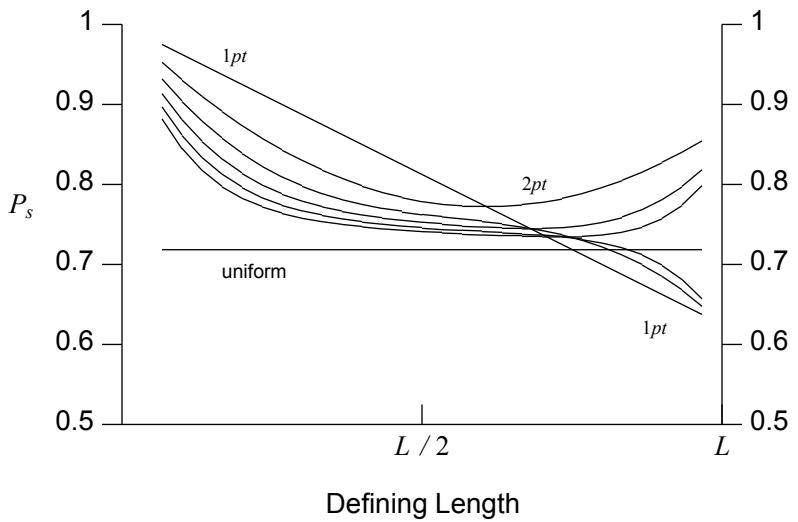
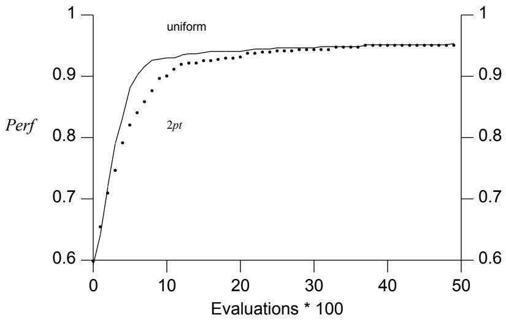
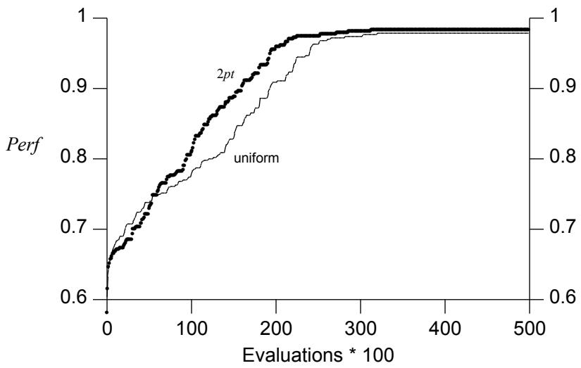
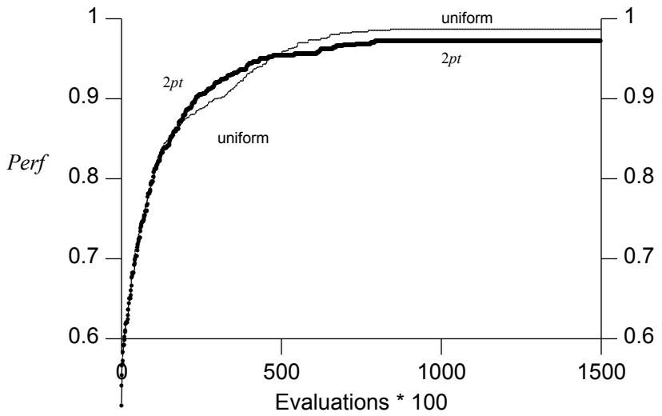
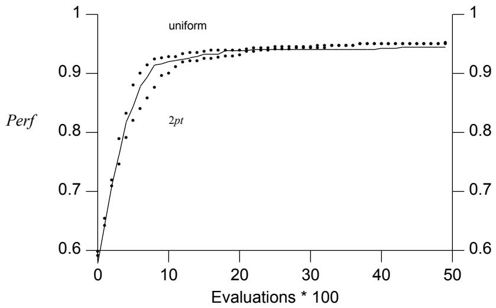
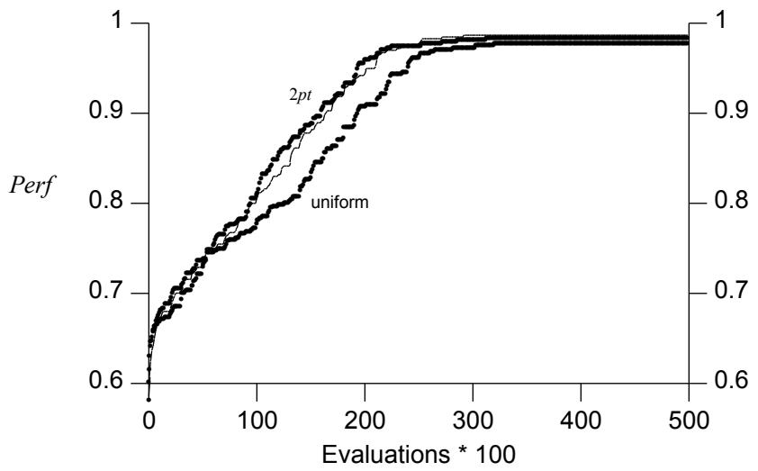
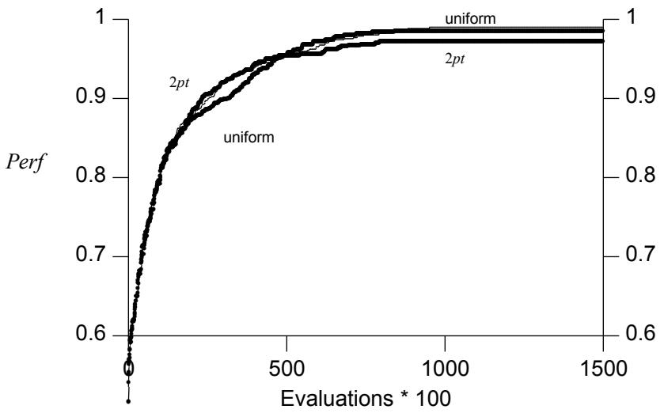
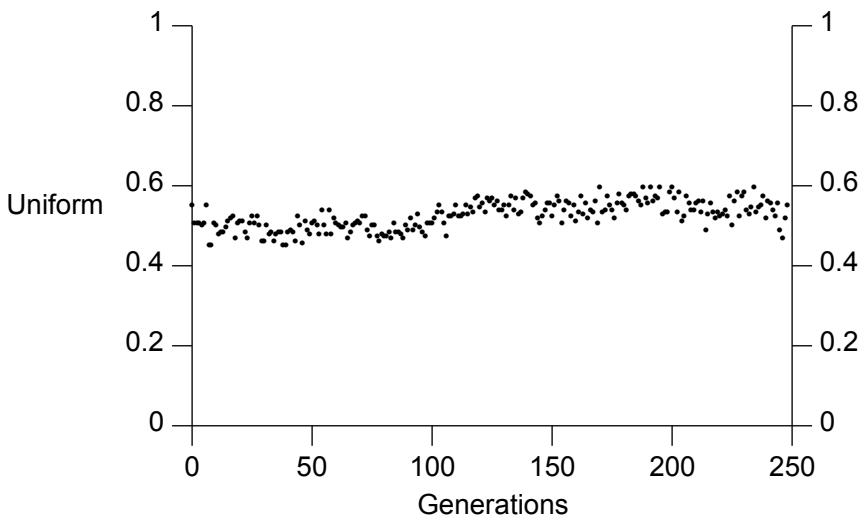
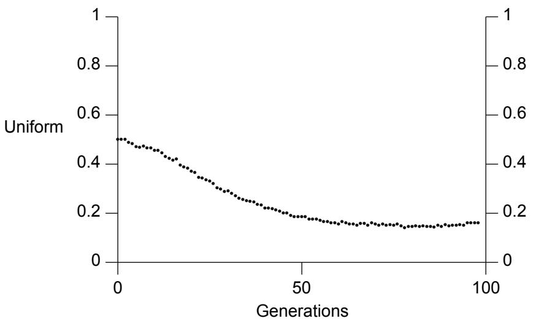

# Адаптация кроссовера в генетическом алгоритме

Уильям М. Спирс (William M. Spears)
Naval Research Laboratory, Вашингтон, округ Колумбия 20375, США
spears@aic.nrl.navy.mil

# Аннотация

Традиционно генетические алгоритмы опирались на операторы одно- и двухточечного кроссовера. Однако многие недавние эмпирические исследования показали преимущества использования большего числа точек кроссовера. Некоторые из самых интригующих недавних работ были сосредоточены на равномерном кроссовере, который в среднем предполагает $L / 2$ точек кроссовера для строк длиной $L$. Несмотря на теоретический анализ, представляется затруднительным предсказать, когда конкретная форма кроссовера будет оптимальной для данной задачи. В данной статье описывается адаптивный генетический алгоритм, который в процессе работы определяет, какая форма является оптимальной.

Ключевые слова: теория генетических алгоритмов, операторы рекомбинации, адаптация

# 1 Введение

Одной из уникальных особенностей работ, связанных с генетическими алгоритмами (ГА), является важная роль, которую играет рекомбинация. В большинстве ГА рекомбинация реализуется посредством оператора кроссовера, который действует на пары особей (родителей) для создания нового потомства путем обмена сегментами генетического материала родителей. Традиционно количество точек кроссовера (которое определяет, сколько сегментов обменивается) фиксировалось на очень низкой постоянной величине — 1 или 2. Подтверждение этому решению было получено из ранних работ как теоретического, так и эмпирического характера [Holland, 1975; De Jong, 1975]. Однако продолжают поступать свидетельства того, что существуют ситуации, в которых наличие большего числа точек кроссовера является выгодным [Syswerda, 1989; Eschelman, 1989]. Пожалуй, самым удивительным результатом (с традиционной точки зрения) является эффективность равномерного кроссовера на некоторых задачах — оператора, который создает в среднем $L / 2$ точек пересечения на строках длиной $L$ [Syswerda, 1989].

В недавней работе [Spears and De Jong, 1990] был расширен теоретический анализ $n$-точечного и равномерного кроссовера в отношении разрушения распределений выборки. Однако они указали, что одного анализа разрушения в общем случае недостаточно для предсказания и/или выбора оптимальных форм кроссовера. В частности, они показали, что также необходимо учитывать размер популяции [De Jong and Spears, 1990].

Поскольку теория неадекватна для выбора оптимальных форм кроссовера (до запуска генетического алгоритма), разумно спросить, может ли этот выбор быть осуществлен другими средствами во время работы генетического алгоритма. Ранние работы Шаффера и Дэвиса предполагают, что генетический алгоритм способен самостоятельно выбирать оптимальные формы кроссовера в процессе работы. В данной статье также исследуется эта возможность в довольно ограниченной форме путем проверки того, может ли генетический алгоритм выбирать между двухточечным кроссовером и равномерным кроссовером по мере решения задачи.

Статья организована следующим образом. Во-первых, мы рассматриваем текущую теорию анализа разрушения, делая акцент на различиях между двухточечным и равномерным кроссовером. Во-вторых, мы приводим некоторые мотивы и историческую справку об адаптивных механизмах, манипулирующих генетическими операторами. В-третьих, мы вводим простой адаптивный механизм, за которым следуют экспериментальные результаты и их анализ. Наконец, мы завершаем статью обсуждением и направлениями будущих исследований в этой области.

# 2 Анализ разрушения

Холланд предоставил первоначальный формальный анализ поведения ГА, показав, как они распределяют пробы почти оптимальным образом между конкурирующими гиперплоскостями низкого порядка, если деструктивные эффекты используемых генетических операторов не слишком велики [Holland, 1975]. Поскольку мутация обычно запускается с очень низкой частотой, ее как значительный источник разрушения обычно игнорируют. Однако кроссовер обычно применяется с очень высокой частотой. Поэтому значительное внимание было уделено оценке $P _ { d }$ — вероятности того, что конкретное применение кроссовера будет деструктивным.

Первоначальный анализ Холланда разрушения выборки при одноточечном кроссовере [Holland, 1975] был расширен на $n$-точечный и равномерный кроссовер [De Jong, 1975; Spears and De Jong, 1990]. Эти результаты представлены в виде оценок вероятности того, что выборка из гиперплоскости $k$-го порядка $( H _ { k } )$ будет разрушена конкретной формой кроссовера. Математически легче оценить дополнение к разрушению: вероятность выживания выборки при кроссовере (которую мы обозначим как $P _ { s }$). Как и можно было ожидать, результаты являются функцией как порядка $k$ гиперплоскости, так и ее определяющей длины (более точные детали см. в [Spears and De Jong, 1990]).

На Рисунке 1 мы приводим графическое резюме типичного примера этих результатов для случая гиперплоскостей 3-го порядка. Негоризонтальные кривые представляют выживаемость гиперплоскостей 3-го порядка при $n$-точечном кроссовере $( n = 1 . . . 6 )$. Горизонтальная линия представляет вероятность выживания при равномерном кроссовере. Рисунок 1 подчеркивает два важных момента. Во-первых, если мы интерпретируем площадь над конкретной кривой как меру кумулятивного потенциала разрушения связанного с ней оператора кроссовера, то эти кривые предполагают, что двухточечный кроссовер является наименее разрушительным из операторов кроссовера, в то время как равномерный кроссовер — наиболее разрушительным. Наконец, в отличие от $n$-точечного кроссовера, равномерный кроссовер разрушает все гиперплоскости порядка $k$ с равной вероятностью, независимо от того, насколько длинной или короткой является их определяющая длина.

  
Рисунок 1: Выживаемость гиперплоскостей 3-го порядка

# 3 Позитивный взгляд на разрушение при кроссовере

Повторяющейся темой в работах Холланда является важность правильного баланса между исследованием и эксплуатацией при адаптивном поиске в неизвестном пространстве высокопроизводительных решений [Holland, 1975]. Анализ разрушения в предыдущем разделе неявно предполагает, что разрушение распределений выборки — это плохо и его следует избегать (например, высокое разрушение может стимулировать исследование в ущерб эксплуатации). Однако это не всегда так. Существуют важные ситуации, когда минимизация разрушения препятствует процессу адаптивного поиска из-за чрезмерного акцентирования на эксплуатации в ущерб необходимому исследованию. Одним из самых ясных примеров этого является случай, когда размер популяции слишком мал для обеспечения необходимой точности выборки в сложных пространствах поиска [De Jong and Spears, 1990].

Чтобы проиллюстрировать это, мы выбрали 30-битную задачу с 6 пиками из [De Jong and Spears, 1990]. Мерием эффективности является просто лучшая особь, найденная генетическим алгоритмом. Этот показатель строится каждые 100 оценок. Поскольку мы проводим максимизацию, более высокие кривые соответствуют лучшей производительности. На Рисунках 2 и 3 показано влияние размера популяции на эффективность ГА. Обратите внимание, как равномерный кроссовер доминирует над двухточечным на задаче "6 пиков" с малой популяцией, но при большой популяции наблюдается прямо противоположная ситуация.†

Существует еще одна ситуация, в которой минимизация разрушения препятствует процессу адаптивного поиска, а именно: когда популяция теряет разнообразие. По мере того как популяция генетического алгоритма эволюционирует с течением времени, она обычно теряет генетическое разнообразие и сходится к общей области пространства поиска. Именно в эти моменты необходимо исследование, и низкий уровень разрушения будет препятствовать поиску.

  
Рисунок 2: 6 пиков (30 бит) - Популяция 20

  
Рисунок 3: 6 пиков (30 бит) - Популяция 1000

Чтобы проиллюстрировать этот эффект, мы выбрали 45-битную задачу о гамильтоновом цикле из [Spears, 1990]. Снова мерой эффективности является лучшая особь, найденная генетическим алгоритмом, которая строится каждые 100 оценок. На Рисунке 4 показано поведение двухточечного и равномерного кроссовера на этой конкретной задаче. Интересно отметить, что хотя двухточечный кроссовер превосходит равномерный в начале поиска (что ожидаемо, поскольку популяция велика), в конце концов его обгоняет равномерный кроссовер. Для этой конкретной задачи добавленное разрушение равномерного кроссовера оказывается полезным ближе к концу запусков.

  
Рисунок 4: HC10 (45 бит) - Популяция 1000

Из этих результатов очевидно, что трудно предсказать заранее, какая форма кроссовера будет оптимальной для данной задачи. Более того, трудно утверждать, что какая-либо одна форма является оптимальной на протяжении всего одного запуска. Это побудило нас рассмотреть возможность адаптивного выбора между формами кроссовера во время запуска. В данной статье конкретно рассматривается ограниченная проблема выбора только между двумя формами кроссовера: двухточечным и равномерным. Однако, прежде чем мы сможем описать наш метод, необходимо привести некоторые справочные сведения о том, как адаптивные механизмы могут использоваться в генетических алгоритмах.

# 4 Предпосылки

Как указывалось ранее, напряжение между эксплуатацией и исследованием — это повторяющаяся тема в генетических алгоритмах. Существует ряд факторов, влияющих на это напряжение. К ним относятся: размер популяции, механизмы отбора и вероятности операторов. Большой размер популяции может улучшить исследование. Сильный алгоритм отбора может сделать упор на эксплуатацию. Наконец, как указывалось в предыдущих разделах, выбор оператора кроссовера также влияет на баланс между эксплуатацией и исследованием. Хотя все эти факторы представляют интерес, в данной статье рассматривается в основном выбор (и адаптация) операторов кроссовера.

Было предпринято множество попыток связать адаптивные механизмы с генетическими алгоритмами. Удобно разделить эти механизмы на две категории, которые мы называем офлайн-подходом и онлайн-подходом. Офлайн-подход пытается адаптировать генетический алгоритм в течение множества запусков. В отличие от него, онлайн-подход адаптирует ГА при решении одной задачи.

Хорошим примером офлайн-подхода служит работа [Grefenstette, 1986]. В этой статье отдельный мета-ГА используется для адаптации генетического алгоритма при решении набора задач. К сожалению, это не отвечает нашим целям, поскольку наша цель — адаптировать ГА во время решения задачи. По этой причине мы сосредотачиваемся на онлайн-подходах.

Онлайн-подходы, в свою очередь, можно разделить на три категории, которые мы называем: с тесной связью (tightly coupled), со слабой связью (loosely coupled) и без связи (uncoupled). Любой адаптивный механизм требует некоторой информации, на которой будут основываться адаптации. Часто эта информация имеет форму исторических данных или треков статистики (то есть ведения учета). Генетический алгоритм — это адаптивный механизм, который использует популяцию для поддержания статистики об исследуемом пространстве. Эта популяция используется генетическим алгоритмом для адаптивного направления поиска в пространстве (через генетические операторы). Тогда кажется разумным рассмотреть использование ГА в качестве адаптивного механизма для саморегулирования при решении задачи. Мы называем этот подход подходом с тесной связью. При подходе без связи полностью отдельный адаптивный механизм настраивает ГА. При подходе со слабой связью ГА частично используется для адаптивного механизма (то есть популяция или генетические операторы используются тем или иным образом).

Следует подчеркнуть, что любой из этих подходов связан с поиском в двух пространствах. Одно пространство — это исходное пространство, которое ищет ГА. Другое — это пространство ГА, которое исследуется адаптивным механизмом. При подходе с тесной связью ГА одновременно ищет в обоих пространствах. Этот подход элегантен и прост, поскольку не требуется никакого нового адаптивного механизма (пример этого подхода см. в [Schaffer, 1987]). Подход, описываемый в этой статье, относится к подходам с тесной связью. Одна из возможных проблем тесной связи заключается в том, что объединение двух пространств поиска может затруднить работу адаптивного механизма. По мере эволюции популяции разнообразие будет теряться в обоих пространствах! Именно в эти моменты адаптивный механизм может быть наиболее полезен. Если разнообразие утрачено, адаптация может быть затруднена. Этот вопрос будет снова обсуждаться в данной статье.

Другая проблема заключается в том, что этот механизм может хорошо работать только с большими размерами популяции, поскольку популяция используется для выборки пространства ГА. Как и в любом другом приложении ГА (или статистической выборки), малые популяции (выборки) могут быть обманчивыми и приводить к неверным выводам. Эта проблема также будет дополнительно обсуждаться в статье.

Подход без связи не опирается на ГА для адаптивного механизма (пример этого подхода см. в [Davis, 1989]). Хотя это может облегчить проблемы, связанные с связью, такие механизмы представляются сложными в конструировании и требуют множества отдельных учетных записей. Результатом является неэлегантная система, лишенная общности. Возможным компромиссом был бы адаптивный механизм, который использует ГА для поддержания статистики, но имеет отдельный набор операторов. Такой механизм мог бы быть довольно элегантным, надежным и универсальным, избегая при этом проблем, связанных с связью. Это тема будущих статей.

# 5 Реализация

Как упоминалось ранее, мы заинтересованы в том, чтобы ГА самостоятельно выбирал оператор кроссовера. Поскольку двухточечный кроссовер наименее разрушителен, а равномерный — наиболее разрушителен, разумно заставить ГА выбирать только из этих двух возможностей.

Поскольку подход с тесной связью является самым простым, мы выбрали его для наших начальных экспериментов. Напомним, что при подходе с тесной связью ГА одновременно ищет как в исходном пространстве задач, так и в пространстве ГА. Поскольку нас интересует только выбор между двухточечным и равномерным кроссовером, как мы позволим ГА решать, какой оператор кроссовера применять?

Одно очевидное решение — добавить один бит в конец каждой особи в популяции ГА. Предположим, что '1' относится к равномерному кроссоверу, а '0' — к двухточечному. Тогда последний столбец популяции (то есть последний бит каждой особи) используется для выборки пространства ГА. Если лучше использовать равномерный кроссовер, по мере эволюции ГА в последнем столбце будет появляться больше '1'. Если лучше использовать двухточечный кроссовер, будет появляться больше '0'. Кроме того, поскольку подход предполагает тесную связь, всем генетическим операторам разрешается манипулировать этим дополнительным столбцом битов (включая кроссовер!).

Как используются эти дополнительные биты, когда кроссовер вот-вот будет применен к особям? Очевидно, что дополнительные биты как-то должны влиять на то, какой оператор будет выполнен. Существует две возможные методики, которые мы называем локальной и глобальной адаптацией. При локальной адаптации последний бит каждой особи важен для выбора того, какой оператор кроссовера будет применен к этой особи. Например, предположим, что две особи выбраны для кроссовера. Тогда мы examine проверяем последний бит каждой особи. Если оба бита равны '1', мы выполняем равномерный кроссовер. Если оба бита равны '0', мы выполняем двухточечный кроссовер. Если биты разные, мы случайным образом выбираем, какой оператор кроссовера выполнять.

При глобальной адаптации последние биты популяции вероятностно определяют, какой оператор кроссовера применять к каждой особи. В первом случае выбор оператора кроссовера привязан к конкретной особи. Во втором случае выбор оператора кроссовера не привязан к конкретной особи, а к популяции в целом. Например, предположим, что последний столбец содержит 75% '1' и 25% '0'. Тогда, когда кроссовер применяется к популяции, равномерный кроссовер будет вызываться в 75% случаев, а двухточечный кроссовер — в 25% случаев.

Обратите внимание, что с вероятностной точки зрения локальная и глобальная адаптация примерно эквивалентны, поскольку шансы на применение конкретного оператора одинаковы для данного поколения. Однако они не эквивалентны в смысле связи, поскольку локальная адаптация акцентирует внимание на особях, в то время как глобальная адаптация акцентирует внимание на популяции в целом. В экспериментах, описанных ниже, используется метод локальной адаптации. Однако различие между локальной и глобальной адаптацией важно и будет повторно рассмотрено позже в этой статье.

# 6 Результаты

Чтобы протестировать нашу систему, мы исследовали набор задач "$n$ пиков" (n-Peak) и задач о гамильтоновом цикле $( \mathrm { H C } n )$ из [Spears, 1990]. В целях краткости мы представим результаты только для задач, упоминавшихся ранее в статье: "6 пиков" и HC10. Результаты для всех задач были схожими.

На Рисунке 5 показан успех адаптивного механизма на задаче "6 пиков" при размере популяции 20. Сплошная линия представляет запуски с использованием адаптивного оператора. Пунктирные линии представляют запуски с фиксированными операторами (двухточечным и равномерным). Обратите внимание, что, хотя адаптивный оператор работает умеренно хорошо в начале, в конце запусков он проигрывает обоим фиксированным операторам.

На Рисунке 6 показана работа адаптивного оператора на задаче "6 пиков" при размере популяции 1000. Тонкая сплошная линия представляет запуски с адаптивным оператором. В этом случае адаптивный оператор работает примерно так же хорошо, как и двухточечный оператор.

На Рисунке 7 показан успех адаптивного механизма на задаче HC10 при размере популяции 1000. Тонкая сплошная линия представляет запуски с адаптивным оператором. Обратите внимание, что адаптивный оператор работает так же хорошо, как двухточечный в начале запусков, а затем работает так же хорошо, как равномерный кроссовер в конце запусков.

  
Рисунок 5: 6 пиков (30 бит) - Популяция 20

  
Рисунок 6: 6 пиков (30 бит) - Популяция 1000

На Рисунке 8 показана вероятность использования каждого оператора во время типичного эксперимента (Гамильтонов цикл) с использованием адаптивного механизма. Вертикальная ось представляет вероятность того, что будет использоваться равномерный кроссовер (и единица минус вероятность того, что будет использоваться двухточечный кроссовер). Поскольку популяция инициализируется случайным образом, начальная вероятность использования равномерного кроссовера составляет 50%. Обратите внимание, что когда размер популяции равен 20, вероятность использования равномерного кроссовера остается на уровне 50% в среднем за 30 запусков. При анализе отдельных запусков очевидно, что вероятность использования равномерного кроссовера быстро приближается к 1 или 0 в ходе запуска. Однако при усреднении по 30 запускам ясно, что последовательной адаптации не происходит.

  
Рисунок 7: HC10 (45 бит) - Популяция 1000

  
Рисунок 8: Адаптация оператора - Популяция 20

На Рисунке 9, однако, показан типичный эксперимент (Гамильтонов цикл) работы адаптивного механизма, когда размер популяции составляет 1000. В этом случае система постепенно начинает отдавать предпочтение двухточечному кроссоверу, и равномерный кроссовер используется менее чем в 20% случаев к концу запусков. Отдельные запуски также подтверждают, что такая адаптация происходит последовательно.

  
Рисунок 9: Адаптация оператора - Популяция 1000

Какие выводы можно сделать из этих экспериментов? Во-первых, Рисунок 8 указывает на то, что адаптивный механизм плохо работает с малыми размерами популяции. Однако это не удивительно, если вспомнить, что малые популяции могут приводить к обманчивым результатам выборки. Во-вторых, Рисунок 9 указывает на то, что адаптивный механизм работает, когда популяция больше. Это подтверждается экспериментальными результатами, в которых адаптивный оператор работал так же хорошо, как и лучший из фиксированных операторов (см. Рисунки 6 и 7).

# 7 Обсуждение

Поскольку адаптация плохо работает с малыми размерами популяции, как мы объясним довольно хорошие экспериментальные результаты (с малыми размерами популяции)? Мы перезапустили систему с отключенной адаптацией (тем самым поддерживая равные вероятности использования любого оператора кроссовера), и результаты оказались похожими. Это указывает на то, что уже само наличие двух операторов в системе является полезным. Однако неадаптивная система работает не так хорошо, как адаптивный оператор, когда размер популяции больше (составляет 1000). Для больших популяций, таким образом, очевидно, что адаптация вносит вклад в экспериментальный успех.

Как упоминалось ранее, вызывает беспокойство вопрос о том, может ли тесно связанная адаптивная система адаптироваться ближе к концу запусков, поскольку популяция теряет разнообразие. Рисунок 9 показывает, что адаптация происходит в течение первых 50 поколений (то есть вероятности операторов все еще меняются). Однако нет признаков адаптации к концу запусков. К сожалению, отсутствие адаптации не обязательно доказывает, что адаптация не может происходить. Кроме того, нет и доказательств того, что адаптация была необходима для этих задач (в конце запусков).

Описанный выше механизм использует локальную адаптацию. Является ли это необходимым? Если рассматривать генетический алгоритм как источник статистики об исследуемом пространстве (то есть акцент делается на популяции в целом), кажется, что между локальным и глобальным подходами должна быть небольшая разница. Чтобы проверить это, мы перезапустили наши эксперименты, используя описанный ранее механизм глобальной адаптации. Мы обнаружили, что механизм локальной адаптации последовательно превосходит глобальный механизм. Более пристальное изучение показало, что адаптации не происходило, в том смысле, что кривые вероятностей операторов выглядели как на Рисунке 8, независимо от размера популяции! Это указывает на то, что важно привязывать адаптацию непосредственно к особям, а также дает некоторую поддержку альтернативному взгляду на генетический алгоритм как на процедуру поиска, которая поддерживает множество траекторий по всему пространству поиска. В этом представлении каждая траектория может иметь разные требования (например, уровень разрушения).

# 8 Заключение и будущие исследования

В этой статье мы исследовали один из возможных адаптивных механизмов для выбора оптимальных форм кроссовера для генетического алгоритма. Мы показали, что адаптивный механизм с тесной связью, по-видимому, хорошо работает, особенно с большими размерами популяции. Кроме того, у нас есть доказательства, подтверждающие точку зрения, что адаптация должна быть локальной (то есть привязанной к конкретным особям).

В будущей работе потребуется более подробно рассмотреть преимущества и недостатки адаптивных механизмов с тесной связью, особенно в сравнении с механизмами со слабой связью. Должно быть разрешено различие между локальной и глобальной адаптацией. Наконец, мы хотели бы, чтобы ГА обладал способностью к самостоятельному выбору в отношении других факторов, влияющих на баланс между исследованием и эксплуатацией.

# Благодарности

Мы хотели бы поблагодарить Диану Гордон и класс INFT910 за множество полезных комментариев.

# Список литературы

Davis, Lawrence (1989). Adapting Operator Probabilities in Genetic Algorithms (Адаптация вероятностей операторов в генетических алгоритмах), Proc. 3rd Int'l Conference on Genetic Algorithms, Morgan Kaufman Publishing.   
De Jong, K. A. & Spears, W. (1990). An Analysis of the Interacting Roles of Population Size and Crossover in Genetic Algorithms (Анализ взаимодействующих ролей размера популяции и кроссовера в генетических алгоритмах), Proceedings of the First Int'l Conf. on Parallel Problem Solving from Nature, Dortmund, Germany, October 1990.   
De Jong, Kenneth A. (1975). An Analysis of the Behavior of a Class of Genetic Adaptive Systems (Анализ поведения класса генетических адаптивных систем), Doctoral thesis, Dept. Computer and Communication Sciences, University of Michigan, Ann Arbor.   
Eschelman, L., Caruana, R. & Schaffer, D. (1989). Biases in the Crossover Landscape (Смещения в ландшафте кроссовера), Proc. 3rd Int'l Conference on Genetic Algorithms, Morgan Kaufman Publishing.   
Goldberg, David E. (1989). Genetic Algorithms in Search, Optimization & Machine Learning (Генетические алгоритмы в поиске, оптимизации и машинном обучении), Addison-Wesley Publishing Company, Inc.
Grefenstette, John J. (1986). Optimization of Control Parameters for Genetic Algorithms (Оптимизация управляющих параметров для генетических алгоритмов), IEEE Transactions on Systems, Man, and Cybernetics, Vol. SMC-16, No. 1, Jan/Feb 1986.
Holland, John H. (1975). Adaptation in Natural and Artificial Systems (Адаптация в естественных и искусственных системах), The University of Michigan Press.
Schaffer, J. David & Amy Morishima (1987). An Adaptive Crossover Distribution Mechanism for Genetic Algorithms (Механизм адаптивного распределения кроссовера для генетических алгоритмов), Proc. 2nd Int'l Conference on Genetic Algorithms, Morgan Kaufman Publishing.
Spears, William M. & De Jong, K. A. (1990). An Analysis of Multi-point Crossover (Анализ многоточечного кроссовера), Proceedings of the Foundations of Genetic Algorithms Workshop, Indiana, July 1990.
Spears, William M. (1990). Using Neural Networks and Genetic Algorithms as Heuristics for NP-Complete Problems (Использование нейронных сетей и генетических алгоритмов в качестве эвристик для NP-полных задач), Masters Thesis, Department of Computer Science, George Mason University, Fairfax, Virginia, 1990.
Syswerda, Gilbert. (1989). Uniform Crossover in Genetic Algorithms (Равномерный кроссовер в генетических алгоритмах), Proc. 3rd Int'l Conference on Genetic Algorithms, Morgan Kaufman Publishing.
