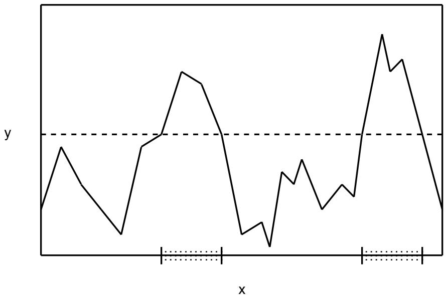
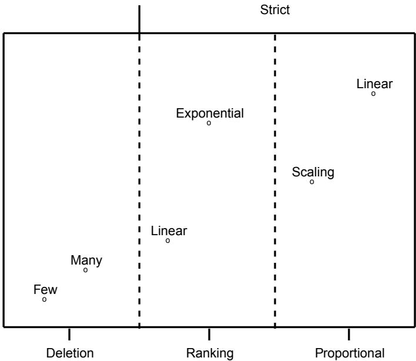

# Conditions for Implicit Parallelism

John J. Grefenstette Navy Center for Applied Research in Artificial Intelligence Code 5514 Naval Research Laboratory Washington, DC 20375-5000 E-mail: GREF@AIC.NRL.NAVY.MIL

# Abstract

Many interesting varieties of genetic algorithms have been designed and implemented in the last fifteen years. One way to improve our understanding of genetic algorithms is to identify properties that are invariant across these seemingly different versions. This paper focuses on invariants among genetic algorithms that differ along two dimensions: (1) the way user-defined objective function is mapped to a fitness measure, and (2) the way the fitness measure is used to assign offspring to parents. A genetic algorithm is called admissible if it meets what seem to be the weakest reasonable requirements along these dimensions. It is shown that any admissible genetic algorithm exhibits a form of implicit parallelism.

Keywords: Implicit parallelism, invariants, k-armed bandits

# 1 Introduction

Whenever a new variation of genetic algorithm is proposed, it is reasonable to expect that the designer will provide an analysis of how the new algorithm compares with previous algorithms. Often this takes the form of empirical studies, but such studies are usually difficult to perform, and the generality of the results is often difficult to assess. Theoretical comparisons offer more robust insights, but our existing theory is sparse. The seminal result used in the analysis of genetic algorithms is of course the Schema Theorem (Holland, 1975), which has also provided the foundation for a number of attempts to characterize problems thought to be especially difficult for genetic algorithms (Bethke, 1981; Goldberg, 1987). We take a slightly different approach to understanding genetic algorithms. This paper offers an extension to the analysis begun in James Baker’s dissertation (Baker, 1989) and carried forward in (Grefenstette and

Baker, 1989). This approach aims to identify properties that are invariant across different versions of the genetic algorithm. Such results provide a sense of coherence to the field, in that commonalities are exposed among superficially different versions of the genetic algorithm. These results can also serve to spotlight the features which distinguish broad classes of genetic algorithms from one another.

As in (Grefenstette and Baker, 1989), this paper focuses on invariants among genetic algorithms that differ along two dimensions: (1) the way user-defined objective function is mapped to a fitness measure, and (2) the way the fitness measure is used to assign offspring to parents. A genetic algorithm is called admissible if it meets what seem to be the weakest reasonable requirements along these dimensions. It is shown that any admissible genetic algorithm exhibits a form of implicit parallelism, in the sense that trials are allocated in an exponentially differentiated way to a large number of subsets based on implicit competitions.

The remainder of the paper is organized as follows: Section 2 summarizes previous developments in this approach, and discusses two important genetic algorithm design parameters: the fitness function and the selection algorithm. Section 3 offers a new definition of admissible genetic algorithms and describes a form of implicit parallelism that is invariant for this class. Section 4 presents some observations on the prevailing views of implicit parallelism, based on the $\mathrm { k }$ -armed bandit analogy. Section 5 offers some ideas for extensions to this approach, and the final section summarizes the paper.

# 2 Background

Throughout this paper, we will adopt the generational model of genetic algorithms, shown in Figure 1.

procedure $G A$   
begin $\mathbf { t } = \mathbf { 0 }$ ; initialize $P ( t )$ ; evaluate structures in $P ( t )$ ; while termination condition not satisfied do begin $\mathbf { t } = \mathbf { t } + \mathbf { 1 }$ ; select $P ( t )$ from $P ( t { - } 1 )$ ; apply genetic operators to structures in $P ( t )$ ; evaluate structures in $P ( t )$ ; end   
end.

Although the model considered here is a full scale genetic algorithm, with all the usual genetic operators including crossover and mutation, we focus the discussion on the effects of the selection algorithm and defer consideration of the effects of operators such as crossover and mutation. There are two reasons for this approach. First, the effects of the genetic operators can be viewed as orthogonal to the effects of selection. That is, the choice of recombination and mutation operators represents another dimension along which genetic algorithms differ. The analysis of genetic operators is usually stated in terms of the disruption to the effects of selection, so it seems natural to characterize the effects of selection first, and then to factor in how crossover and mutation impact those effects. Second, by restricting the analysis to selection at this stage, we can temporarily ignore representation issues, since a structure’s internal representation has no direct effect on how many times that structure is selected for reproduction. Consequently, our results can be stated more generally, in terms of arbitrary subsets of the search space, rather than being restricted to hyperplanes induced by a particular binary representation.

The most useful results will be those that relate the behavior of the genetic algorithm, in terms of how much effort is allocated to various regions of the search space, to the measure of interest to the end user, that is, the objective function. A few definitions will help clarify the discussion. We define the growth rate $( g r )$ (expected number of offspring) for an individual $x$ as a composition of three functions:

$$
g r ( x ) \equiv s e l e c t ( u ( f ( x ) ) )
$$

The objective function $f$ is normally determined by the intended application of the algorithm. We assume that the objective function captures some figure of merit, such as cost or payoff, that a user is interested in optimizing.1 In general, we assume that the definition of the objective function is not under the control of the GA programmer. In contrast, the next two functions in the composition leading to $g r ( x )$ are design parameters of the genetic algorithm. The fitness function $u$ is defined by the GA programmer to map the range of the objective function into a non-negative interval, say [0,1]. The fitness function might be a simple linear transformation, or may be more exotic (logarithmic, exponential, polynomial) and might also be time-varying in order to scale the problem (Grefenstette, 1986; Goldberg, 1989). The selection algorithm is also chosen by the GA programmer to map fitness values into (an expected) number of offspring. A wide variety of selection algorithms have been studied, including proportional methods, ranking methods, and threshold methods, among others (see (Baker, 1989) for an exhaustive survey).2

The aim of this work is to identify aspects of the dynamic behavior of genetic algorithms that are invariant across classes of fitness functions and selection algorithms. Let $A$ be an arbitrary subset of the search space. We focus on the growth rate of subsets, where the growth rate of a subset $A$ at time $\xi , g r ( A , t )$ , is defined as:

$$
g r ( A , t ) \equiv \frac { 1 } { n } \sum _ { i = 1 } ^ { n } g r ( x _ { i } )
$$

where $\{ x _ { 1 } \ , x _ { 2 } \ , \ \cdot \cdot \cdot \ , x _ { n } \ \}$ are the representatives of $A$ in the population at time $t$ . 3

As an example of the kind of results of interest to us, we first consider a common class of genetic algorithms. A dynamic linear fitness function has the form $\bar { u } ( x ) = c ( t ) \bar { f } ( x ) + d ( t ) .$ , for some (perhaps, time-varying) coefficients $c$ and $d _ { \ast }$ , where_ $c ( t ) { > } 0$ . A proportional selection algorithm computes the function _ $g r ( x ) = u ( x ) / \overline { { u } } ( t ) .$ , where $\overline { { u } } ( t )$ is the population mean fitness at time $t$ . The following characterization of an invariant in the growth rate appeared in (Grefenstette and Baker, 1989).

Theorem 1. In any genetic algorithm using a dynamic linear fitness function and proportional selection algorithm, for any pair of subsets $< A , B >$ represented in $P ( t )$ ,

$$
\mathsf { \xi } \operatorname { f } ( A , t ) \leq f ( B , t ) \quad \mathrm { t h e n } \quad g r ( A , t ) \leq g r ( B , t ) .
$$

The theorem has the following interpretation. Suppose one is given any arbitrary, fixed population of structures from the search space. Imagine enumerating all subsets of the search space that are represented in the population, and then obtaining a list $\mathbf { L }$ by sorting these subsets by decreasing observed mean value under the objective function. Theorem 1 says that, for any genetic algorithm with a dynamic linear fitness function and proportional selection algorithm, any subset in the list $\mathbf { L }$ grows at least as fast (during this generation) as any subset occurring later in the list. If we change the genetic algorithm by choosing a different dynamic linear fitness function (that is, by choosing different transformation coefficients $c \left( t \right)$ and $d ( t ) )$ , we will change the relative magnitudes of the of the growth rate of the subsets in L, but not the relative order within L. The order within $\mathbf { L }$ is invariant for all genetic algorithms in this class.

As shown in (Grefenstette and Baker, 1989), there are many classes of genetic algorithms of practical interest, such as genetic algorithms that use a rank-based selection, to which Theorem 1 does not apply. It would be interesting to partition the space of genetic algorithms into interesting classes and find invariants for theses classes like the one in Theorem 1. The remainder of this paper develops this idea further, starting with the class of all ‘‘reasonable’’ genetic algorithms.

# 3 Implicit Parallelism in Admissible Genetic Algorithms

How can we approach the task of characterizing common features of all genetic algorithms? We begin by trying to identify the weakest acceptable conditions for genetic algorithms. Certainly, the notion of survival of the fittest is central to genetic algorithms. That is, a genetic algorithm should assign a fitness value to individuals that is consistent with the objective function, but consistency can be defined in a variety of ways. The following definitions try to capture the weakest reasonable form of consistency. We say a fitness function is monotonic iff

$$
u ( x _ { i } ) \leq u ( x _ { j } ) \ i f \ f ( x _ { i } ) \leq f ( x _ { j } )
$$

That is, a monotonic fitness function does not reverse the sense of any pairwise ranking provide by the objective function. A slightly stronger form of consistency with the objective function is reflected in the following definition: A fitness function is strictly monotonic iffit is monotonic and

$$
i f f ( x _ { i } ) < f ( x _ { j } ) t h e n u ( x _ { i } ) < u ( x _ { j } )
$$

A strictly monotonic fitness function preserves the relative ranking of any two points in the search space with distinct objective function values.

Exactly analogous definitions can be applied to selection algorithms. A selection algorithm is monotonic iff

$$
g r ( x _ { i } ) \leq g r ( x _ { j } ) i f f u ( x _ { i } ) \leq u ( x _ { j } )
$$

A selection algorithm is strictly monotonic iff it is monotonic and

$$
i f u ( x _ { i } ) < u ( x _ { j } ) t h e n g r ( x _ { i } ) < g r ( x _ { j } )
$$

We say that a genetic algorithm is admissible if its fitness function and selection algorithm are both monotonic. A genetic algorithm is strict if its fitness function and selection algorithm are both strictly monotonic.4

These definitions give us some new tools for classifying genetic algorithms. For example, a genetic algorithm that uses a dynamic linear fitness function and a proportional selection algorithm is strictly monotonic, since a better individual always has a higher growth rate than a worse individual. Similarly, a genetic algorithm that uses a ranking selection scheme in which the growth rate varies linearly from, say, 2 for the best individual to 0 for the worst, would also be strictly monotonic. On the other hand, consider a genetic algorithm with a threshold selection algorithm, such as

All individuals with less than average fitness are eliminated, and all remaining individuals have equal growth rate.

This selection algorithm is monotonic (since a better individual is never eliminated in favor of a worse one), but not strictly monotonic (since better individual may have the same growth rate as a worse one, as long as they both survive the cut). The interesting question is whether these classes of genetic algorithms have any common behaviors. We begin be considering the most general class, the admissible genetic algorithms.

In order to characterize the implicit parallelism of the admissible genetic algorithms, we need to borrow some terminology from the field of multi-objective decision making (Schaffer, 1984), specifically, the notion of one set partially dominating another. Consider two arbitrary subsets of the solution space, $A$ and $B$ . Let the representatives of subset $A$ at time $t$ be

$$
A \left( t \right) = < a _ { 1 } \ , a _ { 2 } \ , \ \cdot \cdot \cdot , a _ { n } > ,
$$

sorted such that $f ( a _ { i } ) \geq f ( a _ { i + 1 } )$ for $1 \leq i < n$ . Let the representatives of subset $B$ at time $t$ be

$$
B \left( t \right) = < b _ { 1 } , b _ { 2 } , \cdots , b _ { m } > ,
$$

also sorted in order of decreasing $f .$ Since $A \left( t \right)$ and $B ( t )$ may have different cardinalities, we define two auxiliary lists, $\hat { \boldsymbol A }$ and $\hat { B } .$ , of size $k = \operatorname* { m a x } ( n , m )$ , as follows:

Case 1: $n \leq m$ . Let $\hat { B } = B ( t )$ and let

$$
\hat { \boldsymbol { A } } = < \hat { \boldsymbol { a } } _ { 1 } , \hat { \boldsymbol { a } } _ { 2 } , \cdots , \hat { \boldsymbol { a } } _ { k } > ,
$$

where $\hat { a } _ { i } = a _ { 1 }$ for $1 \leq i < m - n$ , and $\hat { a } _ { i } = a _ { m - n + i }$ for $m - n + 1 \leq i \leq k$ .

Case 2: $m < n$ . Let $\hat { \boldsymbol { A } } = \boldsymbol { A } \left( t \right)$ and let

$$
\hat { B } = < \hat { b } _ { 1 } , \hat { b } _ { 2 } , \cdots , \hat { b } _ { k } > ,
$$

where $\hat { b } _ { i } = b _ { i }$ for $1 \leq i \leq m$ , and $\hat { b } _ { i } = b _ { m }$ for $m + 1 \leq i \leq k .$ .

That is, if $A \left( t \right)$ is smaller than $B \left( t \right)$ , we augment $\hat { \boldsymbol A }$ by adding copies of the best representative of $A$ . If $B ( t )$ is smaller than $A \left( t \right)$ , we augment $\hat { B }$ by adding copies of the worst representative of $B$ . Finally, we say $B$ partially dominates $A$ $1 ( A < _ { p } B )$ at time $t$ iff

$$
f ( \hat { a } _ { i } ) \leq f ( \hat { b } _ { i } ) \mathrm { ~ f o r ~ } 1 \leq i \leq k
$$

and at least one inequality is strict. Intuitively, if $A < _ { p } B$ , then $B$ is ‘‘better’’ than $A$ in

the sense that each representative of $B$ is at least as good as the corresponding representative of $A$ . This gives a preference criterion that all admissible genetic algorithms can agree on, as shown by the following:

Theorem 2. In any admissible genetic algorithm, for any pair of subsets $< A , B >$ represented in $P ( t )$ ,

$$
{ \mathrm { i f } } \ A \ < _ { p } \ B \quad { \mathrm { t h e n } } \ g r ( A , t ) \leq g r ( B , t ) .
$$

Proof. Consider an admissible genetic algorithm $\mathrm { G }$ and a pair of subsets $< A , B >$ that each have at least one representative in $P ( t )$ . Let $\hat { \boldsymbol A } , \hat { \boldsymbol B }$ , and $k$ be defined as above. If $A < _ { p } B$ at time $t$ then

$$
f ( \hat { a } _ { i } ) \leq f ( \hat { b } _ { i } ) \mathrm { ~ f o r ~ } 1 \leq i \leq k .
$$

Since $\mathrm { G }$ is admissible, the fitness function is monotonic, so

$$
u \left( { \hat { a } } _ { i } \right) \leq u ( { \hat { b } } _ { i } ) { \mathrm { ~ f o r ~ } } 1 \leq i \leq k .
$$

Since the selection algorithm is monotonic,

$$
g r ( \hat { a } _ { i } ) \leq g r ( \hat { b } _ { i } ) \mathrm { f o r } 1 \leq i \leq k .
$$

So,

$$
\frac { 1 } { k } \sum _ { i = 1 } ^ { k } g r ( \hat { a } _ { i } ) \leq \frac { 1 } { k } \sum _ { i = 1 } ^ { k } g r ( \hat { b } _ { i } )
$$

By the construction of $\hat { \boldsymbol A }$ and $\hat { B } .$ ,

$$
g r \left( \boldsymbol { A } , t \right) \leq \frac { 1 } { k } \sum _ { i = 1 } ^ { k } g r ( \hat { a } _ { i } ) \mathrm { ~ a n d ~ } \frac { 1 } { k } \sum _ { i = 1 } ^ { k } g r ( \hat { b } _ { i } ) \leq g r ( \boldsymbol { B } , t ) ,
$$

so the result follows.

A slightly stronger result can be obtained for strict genetic algorithms:

Theorem 3. In any strict genetic algorithm, for any pair of subsets $< A , B >$ represented in $P ( t )$ ,

$$
{ \mathrm { i f } } \ A < _ { p } B \quad { \mathrm { t h e n } } \ g r ( A , t ) < g r ( B , t ) .
$$

Proof. Similar to the previous proof.

To help illustrate this result, consider again an enumeration $\mathbf { L }$ of all subsets of a search space represented in a given population. The relation $< _ { p }$ induces a partial order over this list of subsets. Consider any two subsets $A$ and $B$ in $\mathbf { L }$ such that $A < _ { p } B$ . Theorem 3 says that in any strict genetic algorithm the dominating subset $B$ grows at least as fast as the dominated subset $A$ . The effect of changing the selection algorithm from, say, a proportional selection algorithm to a rank-based selection algorithm, is to alter the magnitudes of the growth rates of the two subsets, but the relative order is invariant for all strict genetic algorithms.

The following corollary makes some contact between the previous result and the exponential allocation of trials heuristic advocated in (Holland, 1975).

Corollary 3.1. If $B$ completely dominates $A$ in the strict sense that every representative of $B$ is strictly better than every representative of $A$ , then $B$ grows exponentially faster than $A$ in any strict genetic algorithm (ignoring the effects of recombination and mutation).

Proof. Since $B$ completely dominates $A , B$ has a higher growth rate than $A$ in any population in which each subset is represented. The compounding effect of continually higher growth rate gives $B$ an exponentially larger allocation of trials than $A$ (modulo the effects of crossover and mutation).

The following figure offers an intuitive illustration of this result. Consider an arbitrary fitness function, as shown in Figure 2. Draw a horizontal line at any height $y$ . The corollary says that, for any strict genetic algorithm, the number of representatives in the population from the set $\mathbf { B } \ = \ \left\{ \begin{array} { l }  x \ | \ f ( x ) > y \ \right\} \end{array}$ (the shaded region in Figure 2) grows exponentially faster than the number of representatives from the complement of B.

  
Figure 2: Shaded Region is $\mathrm { B } = \{ x \mid f ( x ) > y \}$

This provides an intuitive explanation of the power of genetic algorithms, and it has the advantage that it is expressed in the terms most meaningful to the end user, that is, in terms of the objective function, rather than in terms that are properly internal to the genetic algorithm, such as fitness.

# 4 The K-Armed Bandit Paradox

Much of our current understanding of implicit parallelism in genetic algorithms derives from Holland’s analysis of the $\mathrm { k }$ -armed bandit problem. Holland (1975) shows that, given a $\mathrm { k \Omega }$ -armed bandit problem with unknown payoff distribution (of a certain class), a nearly optimal adaptive strategy is to allocate trials to the best arm at an exponentially increasing rate. Holland draws an analogy between this strategy and the behavior of genetic algorithms: an $\mathbf { n }$ -order hyperplane partition defines a k-armed bandit problem, with $k { = } 2 ^ { n }$ . However, there are some subtleties about the correspondence between the payoff in the $\mathrm { k \Omega }$ -armed bandit sense and the performance of the corresponding hyperplane. In order to take the analogy seriously, it must be recognized that the payoff associated with a given $ { \mathrm { \Delta } }  { \mathrm { a r m } } ^ {  { \mathrm { \Delta } } }$ is not an estimate of the mean value of the objective function for that hyperplane. In fact, there are simple examples that show that the genetic algorithm does not solve the $\mathrm { k \Omega }$ -armed bandit problem in the sense of choosing the hyperplane with the best mean objective function value within a given hyperplane partition (Grefenstette and Baker, 1989). Rather, the payoff on an $\because \mathrm { a r m } ^ { \mathrm { 3 } } \AA$ is the mean of the observed fitness, which is of course a highly biased estimate of the mean fitness after the first generation. A possible source of confusion is that, unlike the player of a $\mathrm { k \Omega }$ -armed bandit, additional trials by the genetic algorithm (after the very first generation) are not unbiased samples from the hyperplanes within a given hyperplane partition. Instead, the samples are highly biased toward the most promising regions within each hyperplane.

According to Holland [private communication], the proper interpretation of the $\mathrm { k }$ -armed bandit analysis is to think of $k$ as specifying the size of the finest grain hyperplane partition for which the current distribution of payoffs in the competing hyperplanes is reasonably uniform. Additional samples, taken uniformly from a given hyperplane, will then reduce the variance in performance associated with that hyperplane, and the variance of coarse (low-order) hyperplanes will be reduced at rates that are exponentially higher the than higher-order hyperplanes. By this argument, low-order hyperplanes are typically confirmed early on, and the solution proceeds toward increasing $k$ as more samples are accumulated.

But this involves a paradox: The exponential allocation strategy is most useful when competing arms have relatively high variance; if the variance is low, a few samples from each arm gives a reliable indication of the best arm. However, in the case of competing hyperplanes having relatively high variance, the genetic algorithm rapidly shifts its focus of attention to more specific hyperplane competitions involving hyperplanes with lower performance variance. That is, the genetic algorithm abandons the near-optimal allocation of trials just when it seems to be most appropriate. This strategy does indeed reduce the variance in the observed payoff of the hyperplane, but the observed payoff may be arbitrarily far from the true average payoff. This is where the analogy with the $\mathrm { k }$ -armed bandit problem breaks down. Because of biased sampling within a hyperplane, the genetic algorithm’s view of a given hyperplane competition may bear little relation to the mean objective function value of the corresponding hyperplanes. This rather subtle point is often obscured in discussions of the ‘‘building block’’ hypothesis that imply genetic algorithms proceed by solving 2-armed bandit problems, followed by $k = 4 , \ k = 8$ , and so on (Goldberg, 1989). This statement of the building-block hypothesis, which underlies much of the work on ‘‘deceptive problems’’ (Bethke, 1981; Goldberg, 1987), needs to be re-examined in light of the discussion above.

It also follows from these considerations that the notion that implicit parallelism can be quantified by counting the number of hyperplane partitions in a random population (Goldberg, 1985; Fitzpatrick and Grefenstette, 1988) is probably misguided. It is always necessary to consider the dynamic distribution of samples within the population in order to accurately assess how many hyperplanes are being processed by the genetic algorithm. It is not clear how this can be done without explicitly considering the objective function, the fitness function, and the selection algorithm as part of the analysis.

# 5 Directions for Further Work

There are many promising directions for continuing this line of work. One direction is to try to characterize the implicit parallelism in genetic algorithms with various degrees of sensitivity to the selection algorithm. Intuitively, genetic algorithms with linear fitness functions and proportional selection are highly sensitive to the objective function. That is, large differences in objective function values are reflected as large differences in growth rates. The use of dynamic scaling fitness functions reducing sensitivity. Rankbased selection schemes reduce sensitivity to the objective function even more. Figure 3 sketches out the genetic algorithm landscape with respect to sensitivity. The vertical axis represents a subjective set of expectations about the speed of convergence of various types of genetic algorithms. The horizontal axis represents a rough measure of how sensitive the algorithms are to the objective function. The point is that there seems to be some correlation between convergence and sensitivity that should be explored in more formal detail.

Convergence

  
Figure 3: Convergence Rate as a Function of Sensitivity to Objective Function

It is not clear that more sensitivity is necessarily better. For example, consider the effects of the user’s decision to change the objective function from $f ( x ) = x ^ { 2 }$ to $f ( x ) = x ^ { 1 0 }$ . With a proportional selection algorithm, a genetic algorithm is likely to suffer premature convergence with the new objective function. With a ranking selection algorithm, the genetic algorithm explores the identical sequence of points in either case. Given that genetic algorithms will often be used to optimize a surface with unknown properties, the genetic algorithm designer should be prepared to use algorithms with the appropriate sensitivity for the application at hand. We conjecture that, given appropriate formal definitions of sensitivity, theorems similar to Theorem 2 and 3 could be developed for various sub-classes of admissible genetic algorithms distinguished by the sensitivity of the selection algorithm.

# 6 Summary

It is unlikely that a single version of the genetic algorithm will be equally useful for all applications, so it is important to try to understand the similarities and differences among various classes of genetic algorithms. This paper aims to improve our understanding of genetic algorithms by identifying properties that are invariant across different fitness functions and selection algorithms. A genetic algorithm is called admissible if it meets what seem to be the weakest reasonable requirements along these dimensions. It is shown that any admissible genetic algorithm exhibits a form of implicit parallelism.

The results presented here illustrate some invariants based on one way to partition the class of genetic algorithms. Other partitions could be explored using similar methods. For example, classifying selection algorithms by sensitivity to the objective function seems to be a promising direction for further research along these lines.

We hope this work is seen as making at least two very positive statement about genetic algorithms: that the desirable results we often obtain in the simulations are less dependent than we thought on particular selection or recombination operators, and that there are many unexplored directions for extending the theory of genetic algorithms.

# Список литературы

Baker, J. E. (1987). Reducing bias and inefficiency in the selection algorithm. Proceedings of the Second International Conference Genetic Algorithms and Their Applications (pp. 14-21). Cambridge, MA: Erlbaum.   
Baker, J. E. (1989). Analysis of the effects of selection in genetic algorithms, Doctoral dissertation, Department of Computer Science, Vanderbilt University, Nashville.   
Bethke, A. D. (1981). Genetic algorithms as function optimizers, Doctoral dissertation, Department Computer and Communication Sciences, University of Michigan, Ann Arbor.   
Fitzpatrick, J. M. and J. J. Grefenstette (1988) Genetic algorithms in noisy environments. Machine Learning, 3(2/3), (pp. 101-120).   
Goldberg, D. E. (1985). Optimal initial population size for binary-encorded genetic algorithms. TCGA Report No. 85001, Tuscaloosa: University of Alabama.   
Goldberg, D. E. (1987). Simple genetic algorithms and the minimal, deceptive problem. In Genetic algorithms and simulated annealing. D. Davis (ed.), London: Pitman Press.   
Goldberg, D. E. (1989). Genetic algorithms in search, optimization, and machine learning. Reading: Addison-Wesley.   
Grefenstette, J. J. (1986). Optimization of control parameters for genetic algorithms. IEEE Transactions on Systems, Man, and Cybernetics, SMC-16(1), 122-128.   
Grefenstette, J. J. and J. E. Baker (1989). How genetic algorithms work: A critical look at implicit parallelism. Proceedings of the Third International Conference Genetic Algorithms (pp. 20-27). Fairfax, VA: Morgan Kaufmann.   
Holland, J. H. (1975). Adaptation in natural and artificial systems. Ann Arbor: University Michigan Press.   
Schaffer, J. D. (1984). Some experiments in machine learning using vector evaluated genetic algorithms Doctoral dissertation, Department of Electrical Engineering Vanderbilt University, Nashville.