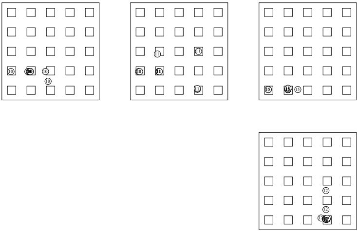

# Evolution in Time and Space - The Parallel Genetic Algorithm

Heinz Mühlenbein with maximal ecienc o e of the PGA is based o

# Abstract

The parallel genetic algorithm (PGA) uses two major modifications compared to the genetic algorithm. Firstly, selection for mating is distributed. Individuals live in a 2-D world. Selection of a mate is done by each indiminima b usin the crossover o erator. This um is robabilisticall improve its fitness during its lifetime by e.g. local hill-climbing. The PGA correlation for the travelin salesman roblem b a con uration s ace lel computers. The search strategy of the PGA is based on a small number of active and intelligent individuals, whereas a GA uses a large population of passive individuals. We will investigate the PGA with deceptive problems and the traveling salesman problem. We outline why and when the PGA is succesful. Abstractly, a PGA is a parallel search with information exchange between the individuals. If we represent the optimization problem as a fitness landscape in a certain configuration space, we see, that a PGA tries to jump from two local minima to a third, still better local dom search methods based on evolutionary principles have been propose 60's. They did not have a major in
uence on mainstream optimization. correlation for the traveling salesman problem by a configuration space analysis. The PGA explores implicitly the above correlation.

Keywords: parallel optimization, parallel genetic algorithm, deceptive problems, traveling salesman

# 1 Introduction

Random search methods based on evolutionary principles have been proposed in the 60's. They did not have a major influence on mainstream optimization. We results for the traveling salesman problem TSP, the quadratic assignment problem and the graph partitioning problem can be found in [GS89], [Muh89] and [vLM91]. In all these a lications we have used the same al orithm with onl sli ht modi- cations. e have taken the lar est ublished roblem instances known to us. The between the searches are often better than a single search. Thus the PGA is a truly parallel algorithm which combines the hardware speed of parallel processors and ture researchers will start where we have left o.

dicult combinatorial optimization problems has to be done with large problems. The results on small toy problems cannot be extrapolated to large problems. plain the search strategy of the PGA in discrete optimization problems. Numerical results for the traveling salesman problem TSP, the quadratic assignment problem and the graph partitioning problem can be found in [GS89], [Müh89] and [vLM91].

In all these applications we have used the same algorithm with only slight modifications. We have taken the largest published problem instances known to us. The PGA found solutions, which are comparable or even better than any other solution found by other heuristics. This is proof by experimental result. We hope that fuThe outline of the paper is as follows. In section 2 the problem of a parallel search with linkage is introduced. Evolutionary algorithms and genetic algorithms are reviewed in section 3. The importance of a spatial population structure on evol

The most difficult part of a random search method is to explain why and when it will work. We will do this analysis for the PGA with the deceptive problems and the TSP.

shown, then crossing-over is discussed by a conguration space analysis. of inspiration and helps to understand the PGA intuitively. We do not claim that modelling natural evolution will automatically lead to a good optimization method.

The outline of the paper is as follows. In section 2 the problem of a parallel search with linkage is introduced. Evolutionary algorithms and genetic algorithms are reviewed in section 3. The importance of a spatial population structure on evolution is discussed in section 4. The next four sections show the influence of hill-climbing and crossing-over on the PGA. Analytical and numerical results are presented for deceptive problems proposed by Goldberg [Gol89b]. The more difficult TSP is discussed in sections 9 and 10. First the influence of the hill-climbing strategy is shown, then crossing-over is discussed by a configuration space analysis.

# We will investigate parallel optimization method

In this paper we consider the following problem:

OPT 1 P: Given a function $F : X \mapsto R$ , where $X$ is some metric space. Let $S$ be a subspace of $X$ . We seek a point x in $S$ which optimizes $F$ o n $S$ or at least yields an acceptable approximation of the supren um of $F$ o n $S$

Many optimization methods have been proposed for the solution of this problem. We will investigate parallel optimization methods. A parallel optimization method

of parallelism $N$ is characterized by $N$ different search trajectories, which are perA parallel search method which combines the info

$$
\boldsymbol { x } _ { i } ^ { t + 1 } = G _ { i } ( \boldsymbol { x } _ { 1 } ^ { t } , . . . , \boldsymbol { x } _ { N } ^ { t } , \boldsymbol { F } ( \boldsymbol { x } _ { 1 } ^ { t } ) , . . . \boldsymbol { F } ( \boldsymbol { x } _ { N } ^ { t } ) ) \boldsymbol { i } = 1 , . . . , N
$$

The mapping $G = ( G _ { 1 } , . . . G _ { N } )$ describes the linkage or information exchange beThe basic questions of parallel sea $N$ h methods can now be stated have

$$
\boldsymbol { x } _ { i } ^ { t + 1 } = G ( \boldsymbol { x } _ { i } ^ { t } , \boldsymbol { F } ( \boldsymbol { x } _ { i } ^ { t } ) )
$$

 How should the linkage be done? described as follows

$$
\boldsymbol { x } _ { i } ^ { t + 1 } = G _ { i } ( \boldsymbol { x } _ { i - 1 } ^ { t } , \boldsymbol { x } _ { i } ^ { t } , F ( \boldsymbol { x } _ { i - 1 } ^ { t } ) , F ( \boldsymbol { x } _ { i } ^ { t } ) ) { \boldsymbol { i } } = 1 , . . . , N
$$

The basic questions of parallel search methods can now be stated

dividu $N$ , x describes the position of individual i and F x its current value, esentin the hei $N * t$ a   
dividuals search the unknown landscape?   
an dierent models are ossible. T

In order to understand these questions intuitively, we leave the abstract mathematical description and turn to a natural search metaphor. The advantage of using a metaphor is that it leads to a qualitative understanding of the problem and the algorithm.

In this paper we use the following simple metaphor: The search is done by $N$ active individuals, $x _ { i }$ describes the position of individual $i$ and $F ( x _ { i } )$ its current value, representing the height in an unknown landscape. How should the population of individuals search the unknown landscape?

Many different models are possible. The individuals could be geographers who want to find the highest mountain. There is fog all over the place. The geographers can communicate with each other by broadcasting their information. How should they A survey of search strategies based on evolution has been done in [MGSK88]. We would then try to mimic their behavior.

In this paper, we will investigate search algorithms which mimic evolutionary adaptation found in nature. Each individual is identifi ed with an animal, which searches for food and produces offspring. In evolutionary algorithms, $F ( x _ { i } )$ is called the fitness of individual i, $\boldsymbol { x } _ { i } ^ { t + 1 }$ is an offspring of $\boldsymbol { x } _ { i } ^ { t }$ , and $G$ is called the selection schedule.

# 3 Evolutionary algorithms and genetic algorithms

A survey of search strategies based on evolution has been done in [MGSK88]. We recall only the most important ones. A generic evolutionary algorithm can be described as follows

# onary algorithm is a random

schedule. Searches with bad results so far $M = N * O$   
started in the neighborhood of $F ( x _ { i } ) i = 1 , . . . , M$   
In biological ter $N$ s, evolutionary algorithms model natural evolut   
re roduction are $O$ lled enetic al orithms. $N$ he were invented b Holland H   
Recent surveys can be found in [Gol89a] a

Genetic Algorithm [Rec73], [Sch81]. An evolutionary algorithm is a random search which uses selection STEP0: Dene a genetic representation of the problem schedule. Searches with bad results so far are abandoned and new searches are started in the neighborhood of more promising searches.

In biological terms, evolutionary algorithms model natural evolution by asexual reproduction with mutation and selection. Search algorithms which model sexual STEP3: Assign each xi a probability p(xj; t) proportional to its normalized tness. Using this distribution, select N vectors fro

# Genetic Algorithm

STEP0: Define a genetic representation of the problem   
STEP1: Create an initial population $P ( 0 ) = x _ { 1 } ^ { 0 } , . . x _ { N } ^ { 0 }$   
In the simplest case the genetic repres $\begin{array} { l } { \overline { { F } } = \displaystyle \sum _ { i } F ( x _ { i } ) / N } \\ { F ( x _ { i } ^ { t } ) / \overline { { F } } } \end{array}$ bitstring of length n, the ome". The positions of the s   
called the \genotype"" $x _ { i }$ which denes $p ( x _ { j } , t )$ otype" (the individual) with a certain e will later show with example $N$ why and when $P ( t )$ sover guides the se $S ( t )$   
A genetic algorithm is a parallel ran $S ( t )$ search with centralize $N / 2$ ntrol. The cenart is the selection schedul $p _ { \it c r o s s }$ e selection needs the avera e tness of duals. The result is a hi hl s nchronized al orit $P ( t + 1 )$

implement e $t = t + 1$ n parallel compute

achieved as follows. Each individual does the selection by itself. It looks for a partner in its neighborhood only. The set of neigborhoods denes a spatial population The variable at a locus is called "gene", its value "allele". The set of chromosomes is called the "genotype" which defines a "phenotype" (the individual) with a certain fitness. We will later show with examples why and when crossover guides the search.

A genetic algorithm is a parallel random search with centralized control. The centralized part is the selection schedule. The selection needs the average fitness of all individuals. The result is a highly synchronized algorithm, which is difficult to implement efficiently on parallel computers.

In our parallel genetic algorithm, we use a distributed selection scheme. This is achieved as follows. Each individual does the selection by itself. It looks for a partner in its neighborhood only. The set of neigborhoods defines a spatial population structure.

Our second major change can now easily be understood. Each individual is active STEP3: Each individual selects a partner for mating in its neighborhood STEP4: A

A generic parallel algorithm can be described as follows

# Parallel genetic algorithm

STEP0: Define a genetic representation of the problem   
STEP1: Create an initial population and its population structure   
particular hill climbing method depends on the p   
In the terminology of section 2, we can describe the PGA as a parallel sea   
a linkage of two searches. The linkage is done probabilistically constr   
rocess because the nei hborhoods of the individuals overla . than some criterion (acceptance)

STEP6: If not finished, return to STEP3.

There have been several other attempts to implement a parallel genetic algorithm. Most of the algorithms run k identical standard genetic algorithms in parallel, one run per processor. They dier in the linkage of the runs. Tanese [T

In the terminology of section 2, we can describe the PGA as a parallel search with a linkage of two searches. The linkage is done probabilistically constrained by the neighborhood. The information exchange within the whole population is a diffusion process because the neighborhoods of the individuals overlap.

algorithm from Manderick et al. [MS89] has been derived from our PGA. In this algorithm the individuals of the population are placed on a planar grid and selectio

There have been several other attempts to implement a parallel genetic algorithm. All but Manderick's algorit $k$ m use subpopulations that are densely connected. We will show in the next section why restricted connections like a ring are much better for the genetic algorithm. All the above parallel algorithms do not use hill-climbing, which is one of the most important parts of our PGA. for migration. The subpopulations are configured as a binary n-cube. A similar approach is done by Pettey et al. [PS89]. In the implementation of Cohoon et al. b far in the case of function o timization. It is also a better search method than algorithm from Manderick et al. [MS89] has been derived from our PGA. In this algorithm the individuals of the population are placed on a planar grid and selection and crossing-over are restricted to small neighborhoods on that grid.

All but Manderick's algorithm use subpopulations that are densely connected. We will show in the next section why restricted connections like a ring are much better for the genetic algorithm. All the above parallel algorithms do not use hill-climbing, which is one of the most important parts of our PGA.

An extension of the PGA, where subpopulations are used instead of single individuals, has been described in [MSB91]. This algorithm out-performs the standard GA by far in the case of function optimization. It is also a better search method than most of the standard mathematical methods.

The PGA tries to introduce diversication more naturally by a spatial population structure. Fitness and mating is restricted to neighborhoods called demes.

# The importance of this fact on evolution has been however highly co

Genetic algorithms suffer from the problem of premature convergence. In order to solve this problem, many genetic algorithms enforce diversification explicitly, violating the biological metaphor. A popular method is to accept an offspring only if it is more than a certain factor different from all the members of the population.

drift into a set of gene frequencies that correspond to a higher peak. Then the second phase sets in. This subgroup now has a higher tness than other subgroups and will tend to displace them until eventually the whole population has the new, favorable gene combination. Then the whole process starts again. The importance of this fact on evolution has been however highly controversially discussed.

by fairly high ridges, always shifting because of environmental changes. According to Fisher, the analogy is closer to waves and troughs in an ocean than in a static landscape. Alleles are selected because of their average eects, and a population is unlikely to ever be in such a situation that it can never be improved by direct selection based on additive variance. The dierence between these two views is not urel mathematical but h siolo iand will tend to displace them until eventually the whole population has the new, favorable gene combination. Then the whole process starts again.

typically proceeded in a succession of small steps, leading eventually to large dierences by the accumulation of small ones. According to this view, the most eective population is a large panmictic one in which statistical 
uctuations are slight and each allele can be fairly tested in combination with many others alleles. According to Wright's view, a more favorable structure is a large population broken up into subgroups, with migration suciently restricted (less than one migrant per generation) and size suciently sma

Three dierent mathematical models for spatially structured populations have been cal. Does going from one favored combination of alleles to another often necessitate passing through genotypes that are of lower fitness? Fisher argued that evolution  the island model ences by the accumulation of small ones. According to this view, the most effective population is a large panmictic one in which statistical fluctuations are slight and each allele can be fairly tested in combination with many others alleles. According to Wright's view, a more favorable structure is a large population broken up into subgroups, with migration sufficiently restricted (less than one migrant per generation) and size sufficiently small to permit appreciable local differentiation.

Three different mathematical models for spatially structured populations have been proposed

• the island model • the stepping stone model • the isolating by distance model

Felsenstein [Fel75] has shown that in many cases the above models lead to unrealistic clumping of individuals and concluded, that they are biologi

The stepping-stone model deals with discrete demes, separated into distinct subpopulations. Migration takes place between neighboring demes only.

The isolation by distance model treats the case of continuous distribution where g p y y , p p g their members. For mathematical convenience it is asssumed that the position of a parent at the time it gives birth relative to that of its offspring when the latter The PGA implements Wright's mo

Felsenstein [Fel75] has shown that in many cases the above models lead to unrealistic clumping of individuals and concluded, that they are biologically irrelevant. There have been many attempts to investigate spatial population structures by computer simulations, but they did not have a major influence.

The issue raised by Wright and Fisher is still not settled. Because of the difficulty of solving the problem by mathematical analysis, population genetics has unfortunately lost interest in the problem. A good survey of the different population The above described phases can be easily

The PGA implements Wright's model. The two phases of Wright's theory can ac2 local minima. The values of the minima are in the bottom row 1 2 4 in the of the population occur at the time after migration between the subpopulations. Recombinations between immigrants and native individuals will occasionally lead to higher peaks which were not found by any of the subpopulations during isolation.

connections ( because it is a minimization problem the valleys take over the role of the peaks in maximization). subpopulations does not capture the essential facts.

tion takes place after 10 generations. In gure 1 the progress of two subpopulations is shown. The number denotes the generation number. After generation ten subpopulation one is concentrated in four valleys, subpopulation two in two valleys. Subpopulation one has the y value of the optimum, subpopulation 2 the x value. After migration and recombination, subpopulation one expands into ve valleys, subpopulation two into four valleys. Subpopulation one has now the genetic material to discover the lowest valley by recombination. At generation 12 subpopulation 1 has discovered the second lowest valley and it nds the global minimum at generathe peaks in maximization).

We try to solve this problem with four subpopulations of 10 individuals each. Migration takes place after 10 generations. In figure 1 the progress of two subpopulations is shown. The number denotes the generation number. After generation ten subpopulation one is concentrated in four valleys, subpopulation two in two valleys. Subpopulation one has the y value of the optimum, subpopulation 2 the x value. After migration and recombination, subpopulation one expands into five valleys, subpopulation two into four valleys. Subpopulation one has now the genetic material to discover the lowest valley by recombination. At generation 12 subpopulation 1 has discovered the second lowest valley and it finds the global minimum at generan\*n it takes O(n) steps for an item of information to propagate to all places, in a ladder of the same size it takes O(n2) steps.

  
oth ends are closed. Why not use a more o

We now turn to the analysis of crossing-over.

Subpopulations isolated for a certain time keep the diversity of the population high.   
After migration new promising areas can be discovered by crossing-over.

In most of our applications we have used a population structure called ladder. Our ladder is circular, both ends are closed. Why not use a more obvious structure like to ex lain the search strate of enetic al orithms. For this reason it is also called the \Fundamental Theorem of Genetic Al orithms" Gol89a . The usual $\mathrm { n ^ { * } n }$ rpretatio $O ( n )$ the fundamental theorem claims that a genetic algorithm with binary representation makes an $O ( n ^ { 2 } )$ al all

information at hand. We believe that it is no

# We will use the same deceptive problem in t

Many researchers in the genetic algorithm community refer to the schema theorem to explain the search strategy of genetic algorithms. For this reason it is also called the "Fundamental Theorem of Genetic Algorithms" [Gol89a]. The usual interpretation of the fundamental theorem claims that a genetic algorithm with binary representation makes an optimal allocation of the sample points given the information at hand. We believe that it is not worthwhile to discuss all the diffuse interpretations in detail. Instead, we will use a "deceptive" problem to show in this specific case what is wrong with these interpretations of the schema theorem. We will use the same deceptive problem in the next section to explain the search strategy of the PGA in simple terms.

The theory of deceptive problems has been developed by Goldberg et al. [Gol89b]. fs(0  ) > fs(1  ); fs(0) > fs(1); fs  0 > fs(  1)

<table><tr><td rowspan=1 colspan=1>bit</td><td rowspan=1 colspan=1>value</td><td rowspan=1 colspan=1>bit</td><td rowspan=1 colspan=1>value</td></tr><tr><td rowspan=1 colspan=1>111</td><td rowspan=1 colspan=1>30</td><td rowspan=1 colspan=1>100</td><td rowspan=1 colspan=1>14</td></tr><tr><td rowspan=1 colspan=1>101</td><td rowspan=1 colspan=1>0</td><td rowspan=1 colspan=1>010</td><td rowspan=1 colspan=1>22</td></tr><tr><td rowspan=1 colspan=1>110</td><td rowspan=1 colspan=1>0</td><td rowspan=1 colspan=1>001</td><td rowspan=1 colspan=1>26</td></tr><tr><td rowspan=1 colspan=1>011</td><td rowspan=1 colspan=1>0</td><td rowspan=1 colspan=1>000</td><td rowspan=1 colspan=1>28</td></tr></table>

The function is called order-3 deceptive because we have

$$
f _ { s } ( 0 * * ) > f _ { s } ( 1 * * ) ; f _ { s } ( * 0 * ) > f _ { s } ( * 1 * ) ; f _ { s } * * 0 > f _ { s } ( * * 1 )
$$

$$
f _ { s } ( 0 0 * ) > f _ { s } ( 1 1 * ) , f _ { s } ( 1 0 * ) , f _ { s } ( 0 1 * )
$$

$$
f _ { s } ( 0 * 0 ) > f _ { s } ( 1 * 1 ) , f _ { s } ( 0 * 1 ) , f _ { s } ( 1 * 0 )
$$

$$
f _ { s } ( * 0 0 ) > f _ { s } ( * 1 1 ) , f _ { s } ( * 1 0 ) , f _ { s } ( * 0 1 )
$$

from

$$
\mathbf { f } \left( \mathbf { 0 0 0 } \right) \prec \mathbf { f } \left( \mathbf { 1 1 1 } \right)
$$

$f _ { s }$ ree-bit subfunctions reside far apart at locations i,i + 10,i + 20 for i = 1 to 10. In points belonging to that schema, for example

$$
\begin{array} { c } { f _ { s } \left( 0 * * \right) = 1 / 4 ( f ( 0 1 1 ) + f ( 0 1 0 ) + f ( 0 0 1 ) + f ( 0 0 0 ) ) } \\ { f _ { s } \left( 0 * * \right) = 1 9 > f _ { s } \left( 1 * * \right) = 1 1 } \end{array}
$$

The small number of 211 points will be used by the genetic algorithm to estimate the tness of the above schema. Holland [Hol89] correctly uses the notion of fs(t) to show that the tness of the schema s depends on the population at generation t. tions, where the three bits are grouped together. In the "ugly" function U10 the three-bit subfunctions reside far apart at locations $\mathrm { i } , i + 1 0 , i + 2 0$ for $i = 1$ to 10. In both functions the fitness is defined as the sum of the subfunctions.

Functions E10 and U10 are defined on $2 ^ { 3 0 }$ points. The schema $( 1 * \ldots * )$ is defi ned pin $2 ^ { 2 9 }$ y f p g  ppnection with the schema theorem. But i the estimated tness is used $2 ^ { 2 9 }$ function values. In a real genetic algorithm we have a much smaller population size, say $2 ^ { 1 2 }$ points. Let us assume that half of the points will be members of our schema. proportional selection. $2 ^ { 1 1 }$ points will be used by the genetic algorithm to estimate This objection is similar in spirit to that of Grefenstette et al.[GB89]. $f _ { s } \left( t \right)$ to show that the fitness of the schema s depends on the population at generation t.

This observation leads to our main objection to the mainstream interpretation of the schema theorem.

The estimate of the fitness of a schema is equal to the exact fitness in very simple applications only. Therefore interpretations using the exact fitness cannot be applied in connection with the schema theorem. But if the estimated fitness is used in the interpretation, then the schema theorem is almost a tautology, only describing proportional selecti on.

This objection is similar in spirit to that of Grefenstette et al.[GB89].

Without any additional comment, we just state our second major objection against using the schema theorem to explain the search strategy of genetic algorithms. The schema theorem estimates only the disruption, i.e. the possibility of losing good substrings. The question of why the genetic algorithm builds better and better substrings by crossing-over is ignored.

The search strategy of a genetic algorithm and the PGA especially can be explained much more easily. The introduction of schemata only creates artificial confusion.

of very simple search methods. Later we will compare the results with the parallel genetic algorithm. abilistically chosen parent points. Because of the selection operator, the points get closer and closer. The closer the parent points are to each other, the smaller is the 6 Statistical analysis of the deceptive problems two parent points will be transfered to the offspring. Selection and crossing-over One of the simplest random search methods is multistart hill-climbing. An initial cong

We will investigate the main components of a PGA - crossing-over and hill-climbing - with the deceptive problems E10,U10,E20 and U20. First we will make an analysis of very simple search methods. Later we will compare the results with the parallel genetic algorithm.

# mization.

nahc and steepest ascent sahc. In next ascent hill-climbing, the rst bit of a sequence of bits is 
ipped if it gives an improvement. In steepest ascent hill-climbing, the bit giving the best improvement is 
ipped. In both cases, the iteration is stopped if no improvement can be obtained. The best-ascent hill-climbing strategy tests more congurations than the next ascent strategy. But in our ugly deceptive problem only one of the three two bit congurations leads to the optimal substring (111) with next ascent, whereas all three two bit congurations lead to the optimal string with steepest ascent. The region of attraction is larger for steepest ascent than for next asce

The statistical analysis of multistart hill-climbing is very simple. We dene nahc and steepest ascent sahc. In next ascent hill-climbing, the first bit of a sequence of bits is fipped if it gives an improvement. In steepest ascent hill-climbing, the bit pr ob(success) = no improvement can be obtained. The best-ascent hill-climbing strategy tests more configurations than the next ascent strategy. But in our ugly deceptive problem only one of the three two bit configurations leads to the optimal substring (111) with next ascent, whereas all three two bit configurations lead to the optimal string with steepest ascent. The region of attraction is larger for steepest ascent than for next ascent.

The statistical analysis of multistart hill-climbing is very simple. We define

$$
p r o b ( s u c c e s s ) = { \frac { h i l l . c o n f } { t o t a l . c o n f } }
$$

Theorem:Multistart with steepest ascent hill-climbing nds the optimum with probability 2m. The amount ofcomputation to nd the optimum with proba $n = 3 m$ ost one

$$
\begin{array} { l } { { h i l l . c o n f ( n a h c ) = 2 ^ { m } } } \\ { { } } \\ { { h i l l . c o n f ( s a h c ) = 2 ^ { 2 m } } } \end{array}
$$

The statistical analysis of stochastic iter $3 m$ d hill-climbin $3 m ( m + 1 )$ mplex. In order to show the basic idea of the analysis, we start wit

Theorem: Multistart with steepest ascent hill-climbing finds the optimum with probability $2 ^ { - m }$ . The amount of computation to find the optimum with probability almost one is $3 m ( m + 1 ) * 2 ^ { m }$ . Multistart with next ascent hill-climbing needs $3 \dot { m } * 2 ^ { 2 m }$ we ob

A good hill-climbing strategy pays off the larger the problem is. We will later show that the same observation is true for the PGA.

The statistical analysis of stochastic iterated hill-climbing is more complex. In order The same analysis can also be done for the deceptive problems. We will rst analyse steepest ascent hill-climbing. We start our analysis with the observation, that after hill-climbing the st $\mathrm { k }$ ng will only consists of the substrings of the two local minima (000) and (111). Two bits at least have to be 
ipped together to jump from (000) to (111) a $n - k$ ce versa. One bit 
ips in a substring will not lead to an $\mathrm { k }$ changes. The probability of at least two bits 
ipped in three trial

$$
p r o b _ { n } ( k , b e t t e r ) = ( 1 - p ) ^ { n - k } * ( 1 - ( 1 - p ) ^ { k } )
$$

The same analysis can also be done for the deceptive problems. We will first analyse p y j p g

We start our analysis with the observation, that after hill-climbing the string will rob l better = 1  (ml) 1  1  x l m ( ) ( ) ( ( ) ) ( ) For next ascent hill-climbing we have x = p2 and y = 2pp2. The above probability is independent of the position $x = 3 p ^ { 2 } ( 1 - p ) + \overset { \cdot } { p ^ { 3 } }$ the global string. In iterative hillclimbing there is n

In the general case, let $\mathrm { X }$ be the probability of jumping into the attraction region of the local minima (111) from (000), given the hill-climbing method. Let y be the probability of jumping into the attraction area of (000) from (111). Ignoring higher order terms we approximately obtain for $l = 1 , 2 , \ldots$ substrings wrong

$$
p r o b _ { m } ( l , b e t t e r ) = ( 1 - y ) ^ { ( m - l ) } ( 1 - ( 1 - x ) ^ { l } )
$$

For next ascent hill-climbing we have $x = p ^ { 2 }$ and $y = 2 p - p ^ { 2 }$ . The above probability is independent of the position of the substring in the global string. In iterative hillclimbing there is no difference between a deceptive problem and an ugly deceptive problem.

Table 1: Iterated hill-climbing (128 runs each)   

<table><tr><td>Strategy</td><td>p</td><td>ET</td><td>sd</td><td>ET(6)</td><td>Conf.</td><td>sd</td><td>Nor.Conf</td></tr><tr><td>it-nahc-U10</td><td>0.1</td><td>1250</td><td>663</td><td>1300</td><td>37480</td><td>20010</td><td>4875</td></tr><tr><td>it-sahc-U10</td><td>0.1</td><td>98</td><td>54</td><td>104</td><td>11144</td><td>5989</td><td>1203</td></tr><tr><td>it-sahc-U10</td><td>0.18</td><td>47</td><td>24</td><td>55</td><td>7932</td><td>3995</td><td>835</td></tr><tr><td>it-nahc-U20</td><td>0.04</td><td>7504</td><td>3365</td><td>7703</td><td>450340</td><td>201900</td><td>51754</td></tr><tr><td>it-sahc-U20</td><td>0.04</td><td>684</td><td>347</td><td>681</td><td>136325</td><td>68542</td><td>14259</td></tr><tr><td>it-sahc-U20</td><td>0.12</td><td>144</td><td>71</td><td>152</td><td>64374</td><td>31294</td><td>6567</td></tr><tr><td>it-sahc-U20</td><td>0.3</td><td>953</td><td>474</td><td>1052</td><td>525267</td><td>286433</td><td>53103</td></tr></table>

$E T _ { m } ( l ) = 1 / p r o b _ { m } ( l )$ e values ETm(l) should be minimized. The optimal mutation rate for a given l can easily be computed from (5). However, this procedure is unfair, because the number of wrong substrings has to be known. The largest number of trials is always needed for the last $\operatorname { E T } ( \operatorname { m } )$ Tm(1). Therefore a good estimate of as

$$
E T ( m ) = E T _ { m } ( 1 ) + E T _ { m } ( 2 ) + . . + E T _ { m } ( i n i t i a l )
$$

Initial denotes the number of suboptimal subfunctions after the first hill-climbing. For the mutation $i n i t i a l = m$ b $\operatorname { E T } ( \operatorname { m } )$ proximately minimize $\operatorname { E T } ( \operatorname { m } )$ all the values $E T _ { m } ( l )$ should be minimized. The optimal mutation rate for a given 1 can easily be computed from (5). However, this procedure is unfair, because the number of wrong substrings has to be known. The largest number of trials is always needed for the last step $E T _ { m } ( 1 )$ . Therefore a good estimate of In table 1 numerical experiments with dierent muta $E T _ { m } ( 1 )$ s are summarized for m = 10 and m = 20.

$$
x = { \frac { 1 } { m } }
$$

For the mutation rate p we obtain approximately

$$
p = \sqrt { \frac { 1 } { 3 m } }
$$

In table 1 numerical experiments with different mutation rates are summarized for $m = 1 0$ and $m = 2 0$

Conf denotes the total number of configurations evaluated, Nor.Conf are normalized configuration evaluations. These are derived as follows: During hill-climbing we need only a small number of table look-ups to evaluate a configuration, whereas m table look-ups are normally needed. In Nor.Conf we count m hill-climbing configuration evaluations as one normal configuration.

ET denotes the average number of trials to reach the optimum. It agrees quite well with the number computed by formula (6). The results confirm our statistical analysis. A mutation rate too high or too low gives an increase of the number of trials. Formula (7) gives a good estimate for the optimal mutation rate.

We will explain the search strategy of the PGA and its major components by solving the easy deceptive problems E10 and E20 and the \ugly" deceptive problems U10 and U20. The follow

 no hill-climbing ley's order-4 deceptive problem [WS90]. We will not do this here, but turn to the  n

#  2-point cyclic crossing-over

We will explain the search strategy of the PGA and its major components by solving Our 2-point cyclic crossing-over is implemented as follows. First the starting point of the crossing-over section is randomly drawn. The

ver, each bit of the sults of our numerical expe steepest ascent hill-climbing sults: uniform crossing-over

climbing, especially if normalized congurations are considered  The performance of 2-point crossing-over depends on the coding. The dependency is not $2 0 \%$ trong $6 0 \%$ steepest ascent hill-climbing. over, each bit of the parent strings is chosen with probability 0.5. Table 2 shows the  The performance of uniform crossing-over is independent $p = 0 . 1$ odin $m = 1 0$  $p = 0 . 0 4$ hill- $m = 2 0$ g

The table can be used for many individual comparisons. We summarize the major These r

e also make a short comparison with other simulations of deceptive problems. In PGA simulations we used a very small population size ( 16 or duce the amount of computation. Goldberg [Gol89b] investigated the deceptive blems E10 and U10 with a standard GA of population siz rithm mGA, both for the function E10. The simple GA could not solve th nction U10, because it was run with a m

These results are in agreement with our results on difficult combinatorial optimization problems [Müh89] and function optimization [MSB91].

We also make a short comparison with other simulations of deceptive problems. In our PGA simulations we used a very small population size ( 16 or 32) in order to reduce the amount of computation. Goldberg [Gol89b] investigated the deceptive problems E10 and U10 with a standard GA of population size 2000. He reported 40000 function evaluations for the simple GA and 40600 for his messy genetic algorithm mGA, both for the function E10. The simple GA could not solve the ugly function U10, because it was run with a mutation rate of 0.

Table 2: PGA results (10 runs each)   

<table><tr><td rowspan=1 colspan=1>Strategy</td><td rowspan=1 colspan=1>Pop</td><td rowspan=1 colspan=1>Gen.</td><td rowspan=1 colspan=1>sd</td><td rowspan=1 colspan=1>Conf.</td><td rowspan=1 colspan=1>sd</td><td rowspan=1 colspan=1>Nor.Conf</td></tr><tr><td rowspan=16 colspan=1>2pc-wohc-E102pc-wohc-U102pc-nahc-E102pc-nahc-U102pc-sahc-E102pc-sahc-U102pc-nahc-E202pc-sahc-E202pc-sahc-U20uc-wohc-E10uc-wohc-U10uc-nahc-E10uc-nahc-U10uc-sahc-E10uc-sahc-E20uc-sahc-E20</td><td rowspan=2 colspan=1>3232</td><td rowspan=2 colspan=1>6679979</td><td rowspan=1 colspan=1>62</td><td rowspan=2 colspan=1>21398319379</td><td rowspan=2 colspan=1>1970112918</td><td rowspan=5 colspan=1>5245216002890</td></tr><tr><td rowspan=1 colspan=1>3528</td></tr><tr><td rowspan=1 colspan=1>16</td><td rowspan=1 colspan=1>83</td><td rowspan=1 colspan=1>18</td><td rowspan=1 colspan=1>40500</td><td rowspan=2 colspan=1>860025900</td></tr><tr><td rowspan=1 colspan=1>16</td><td rowspan=1 colspan=1>346</td><td rowspan=1 colspan=1>53</td><td rowspan=1 colspan=1>167400</td></tr><tr><td rowspan=1 colspan=1>16</td><td rowspan=1 colspan=1>11</td><td rowspan=1 colspan=1>2</td><td rowspan=1 colspan=1>27273</td><td rowspan=1 colspan=1>4086</td></tr><tr><td rowspan=1 colspan=1>16</td><td rowspan=1 colspan=1>11</td><td rowspan=1 colspan=1>3</td><td rowspan=1 colspan=1>36066</td><td rowspan=1 colspan=1>8431</td><td rowspan=1 colspan=1>3771</td></tr><tr><td rowspan=1 colspan=1>32</td><td rowspan=1 colspan=1>168</td><td rowspan=1 colspan=1>45</td><td rowspan=1 colspan=1>325632</td><td rowspan=1 colspan=1>85900</td><td rowspan=1 colspan=1>34990</td></tr><tr><td rowspan=1 colspan=1>32</td><td rowspan=1 colspan=1>23</td><td rowspan=1 colspan=1>4</td><td rowspan=1 colspan=1>198678</td><td rowspan=1 colspan=1>24093</td><td rowspan=1 colspan=1>20558</td></tr><tr><td rowspan=1 colspan=1>32</td><td rowspan=1 colspan=1>31</td><td rowspan=1 colspan=1>5</td><td rowspan=1 colspan=1>450138</td><td rowspan=1 colspan=1>66690</td><td rowspan=3 colspan=1>45010</td></tr><tr><td rowspan=1 colspan=1>32</td><td rowspan=1 colspan=1>2957</td><td rowspan=1 colspan=1>739</td><td rowspan=1 colspan=1>94669</td><td rowspan=1 colspan=1>23649</td></tr><tr><td rowspan=1 colspan=1>32</td><td rowspan=1 colspan=1>2788</td><td rowspan=1 colspan=1>567</td><td rowspan=1 colspan=1>89260</td><td rowspan=1 colspan=1>18135</td></tr><tr><td rowspan=1 colspan=1>16</td><td rowspan=1 colspan=1>148</td><td rowspan=1 colspan=1>27</td><td rowspan=1 colspan=1>71150</td><td rowspan=1 colspan=1>13200</td><td rowspan=2 colspan=1>74207480</td></tr><tr><td rowspan=1 colspan=1>16</td><td rowspan=1 colspan=1>151</td><td rowspan=1 colspan=1>37</td><td rowspan=1 colspan=1>73152</td><td rowspan=1 colspan=1>17700</td></tr><tr><td rowspan=1 colspan=1>16</td><td rowspan=1 colspan=1>7</td><td rowspan=1 colspan=1>4</td><td rowspan=1 colspan=1>22830</td><td rowspan=1 colspan=1>9804</td><td rowspan=1 colspan=1>2380</td></tr><tr><td rowspan=1 colspan=1>32</td><td rowspan=1 colspan=1>437</td><td rowspan=1 colspan=1>41</td><td rowspan=1 colspan=1>842112</td><td rowspan=1 colspan=1>86200</td><td rowspan=2 colspan=1>9049027850</td></tr><tr><td rowspan=1 colspan=1>32</td><td rowspan=1 colspan=1>22</td><td rowspan=1 colspan=1>5</td><td rowspan=1 colspan=1>272292</td><td rowspan=1 colspan=1>32976</td></tr></table>

a common mistake to believe that mutation is not important because the mutation rate is so sma ll. comparisons can be made to our work. Moreover the non-distributed GENITOR was run with a mutation rate of 0. In this case it was not able to solve the "ugly" 8 Iterated hill-climbing vs. the PGA The algorithm now solved the problem. We conjecture that the main reason for this success is the mutation, not the population structure.

climbing only generates new initial congurations for hill-climbing. There is no linkage between the searches. Iterated hill-climbing generates a new conguration in the neighborhood of the old one. If by chance an improvement is obtained, the new conguration is accepted. Iterated hill-climbing can be considered as a more restricted

# recombination of the components is done randomly.

The three analysed search strategies can ce described as follows. Multistart hillclimbing only generates new initial configurations for hill-climbing. There is no linkage between the searches. Iterated hill-climbing generates a new configuration in the neighborhood of the old one. If by chance an improvement is obtained, the new configuration is accepted. Iterated hill-climbing can be considered as a more restricted form of multistart hill-climbing. In the PGA new configurations are mainly generated by crossing-over. In this search strategy new configurations are built out of the components of the population of existing configurations. The recombination of the components is done randomly. How do these search strategies compare?

search method. But we would like to mention that in the problem domain optimization of dicult functions we could report instances of a superlinear speedup [MSB91]. This does not happen here because our deceptive problems are not di- cult enough. In such

Let us discuss the results of the experiments it-nahc-U10 and it-sahc-U20 with the PGA experiments uc-nahc-U10 and uc-sahc-U20. In both cases the PGA needs Furthermore the comparison is a little unfair. Iterated hill-climbing strongly de$1 6 ( U 1 0 )$ n the $3 2 ( U 2 0 )$ n rate. The PGA is very robust with respect to the mutation rate. We always use as mutation rate just the inverse of the length of the chromosome. In contrast the computation of a reasonable mutation rate for iterated hill-climbing needs information about the problem. mization of difficult functions we could report instances of a superlinear speedup [MSB91]. This does not happen here because our deceptive problems are not diffcult enough. In such problems the PGA simply does the same evaluations but in parallel. At the termination of the PGA most of the strings of the population have just one or two subfunctions incorrect.

tions and one order-6 deceptive function. In this case the optimal mutation rate cannot be computed. rate. We always use as mutation rate just the inverse of the length of the chromosome. In contrast the computation of a reasonable mutation rate for iterated hill-climbing needs information about the problem.

The reason is that the local minima are too regularly spread in the tness landscape. A mutation of just two bits leads from each of the local maxima to a better one. In our opinion it is not very useful to make the deceptive functions in small steps more and more complex and then to develop algorithms which solve these problems. A better method is to investigate the search strategies with more classical dicult benchmark optimization problems. We will do this in the next sections with the traveling salesman pr

Our analysis has shown that deceptive problems can be nicely used to explain the search strategies of the different algorithms. But the original deceptive problems are not difficult enough to serve as good benchmarks for real optimization problems. The reason is that the local minima are too regularly spread in the fitness landscape. The famous traveling salesman problem (TSP) can be easily stated. In our opinion it is not very useful to make the deceptive functions in small steps more and more complex and then to develop algorithms which solve these problems. A better method is to investigate the search strategies with more classical difficult benchmark optimization problems. We will do this in the next sections with the traveling salesman problem.

# 9 The traveling salesman problem

The famous traveling salesman problem (TSP) can be easily stated.

OPT 2 (TSP) Given are n cities. The task of the salesman is to visit all cities once so that the overall tourlength is minimal.

part of chromosome A into the corresponding location at chromosome B, so that the resulting chromosome is the most similar to A and B. A genetic repair operator then creates a valid tour. independent from each other. Each edge may appear on the chromosome only once, otherwise the chromosome would code an invalid tour. A simple crossing-over will also give an invalid tour. This is the reason why this simple genetic representation has not been used in genetic algorithms. The researchers tried to find a more tricky PROC crossover (receiver, donor, ospring)

Choose position 0 <= i < nodes and length blow <= k <= bup randomly. Extract the string of edges from position i to position j = (i + k) MOD nodes from the mate (donor). This is the crossover string. Copy the crossover string to the ospring. Add successively fu

We call our crossover operator MPX, the maximal preservative crossover operator.   
It preserves subtours contained in the two parents. The pseudocode is given below.

# ELSE IF an edge from the dono

THEN $0 ~ < = ~ i < ~ n o d e s$ rom the don $b _ { l o w } < = k < = b u p$ randomly.

ELSE add that city from the re $i$ eiver which $j = ( i + k )$ in the string, this adds a new edge, which we will mark as an

Copy the crossover string to the offspring.

Add successively further edges until the offspring represents a valid tour.

to recall, that in the PGA the

IF an edge from the receiver parent starting at the last city in the offspring is possible (does not violate a valid tour)   
are exchanged randomly. If the result   
. Then the next two edges are exchanged until no exchange of two edge tour. THEN add this edge from the donor ELSE add that city from the receiver which comes next in the string, rmance evaluation for the TSP

rst measure is to compare the best solution for very large problems which each of the heuristics was able to get. The second measure is to compare the quality of the solutions after a xed amount of time. A detailed study of the performance of the PGA based on the rst measure has been done in [GS91]. In this study the is accepted. Then the next two edges are exchanged until no exchange of two edges gives a better tour.

# 10 Performance evaluation for the TSP

Two different performance measures at least are used for comparing heuristics. The first measure is to compare the best solution for very large problems which each of the heuristics was able to get. The second measure is to compare the quality of the solutions after a fixed amount of time. A detailed study of the performance of the PGA based on the first measure has been done in [GS91]. In this study the

Table 3: Relative deviation from optimal tour length $( \mathrm { i n ~ \% }$ )   

<table><tr><td>Instance</td><td>t</td><td>SA</td><td>Mult2Opt</td><td>MultLk</td><td>Gen2Opt</td><td>GenL K</td></tr><tr><td>EUR100</td><td>60</td><td>2.59</td><td>3.23</td><td>0.0</td><td>1.15</td><td>0.0</td></tr><tr><td>GRO442</td><td>4100</td><td>2.60</td><td>9.29</td><td>0.27</td><td>3.02</td><td>0.19</td></tr><tr><td>GRO532</td><td>8600</td><td>2.77</td><td>8.34</td><td>0.37</td><td>2.99</td><td>0.17</td></tr><tr><td>GRO666</td><td>17000</td><td>2.19</td><td>8.67</td><td>1.18</td><td>3.45</td><td>0.36</td></tr></table>

be very small. The experiment was done on a sequential computer.   
shown.

[LK73] neighborhood. In the latter case they used a pair of improvement operators, the dyn $[ \mathrm { U P v L ^ { + } 9 1 } ]$ wap and the additional 4-swap as described in [LK73]. The results are shown in table 3. or to use a sophisticated local search for a small number of generations. In their experimental setup, the genetic algorithm had to converge within a certain time limit. Convergence is achieved when all tours in the current population have the same length or the length of the best tour did not improve within five successive generations. This condition forced the population sizes of the genetic algorithm to be very small. The experiment was done on a sequential computer.

constraint. Moreover, GenLK is superior to the other algorithms. This shows the advantage of using a sophisticated local search method in the PGA. the dynamical k-swap and the additional 4-swap as described in [LK73]. The results are shown in table 3.

required a convergence within the time limit given by simulated annealing. In combinin these results on local search and our results on o ulation structure lated annealing SA according to the cooling schedule of Aarts et al. [AK89]. The results demonstrate the advantage of the MPX crossing-over. The genetic versions Gen2Opt and GenLK of 2-Opt and Lin-Kernighan, respectively, perform clearly better than their multistart companions, despite the penalty of the convergence constraint. Moreover, GenLK is superior to the other algorithms. This shows the advantage of using a sophisticated local search method in the PGA.

The absolute quality of the above solutions is worse than the solutions we obtained with the PGA [GS91]. This can be explained by the experimental setup, which required a convergence within the time limit given by simulated annealing.

In combining these results on local search and our results on population structure in the PGA, it seems obvious that a good PGA implementation should use at least two different local search methods. Most of the population should use a simple but fast local search. But one or more processors should perform a very good local search like the Lin-Kernighan heuristic. Each time a new best-so-far solution has been found, one of the processors with the sophisticated local search method should be initialized with that solution.

We have not yet done this implementation for the TSP, because we believe that highly sophisticated implementations of an iterated Lin-Kernigham algorithm will yield semi-optimal solutions faster than even our PGA. The reason is that the Lin

Kernigham heuristic is very good for Euclidean TSP-problems. The situation is different with other combinatorial problems like e.g. the graph partitioning problem, where the Lin-Kernigham heuristic performs much worse.

 How many dierent edges take part in 2-opt local minima?  How bi is the overla

# 11 Configuration space analysis of the TSP

space analysis can only be done by computation. We have chosen TSP problems of order 40,60,80 and 100 as problem instances. The cities ha $n - 1$ n placed randomly. It is outside the scope of this paper to discuss whether TSP problems with random drawn cities are representative for the class of all TSP probl

a grid or on a circle. On a circle, there exists only one 2-op •How big is the overlap between two 2-opt local minima similar conguration space analysis has been done by Kirkpatr

This is a non geometric TSP problem. space analysis can only be done by computation. We have chosen TSP problems of order 40,60,80 and 100 as problem instances. The cities have been placed randomly. It is outside the scope of this paper to discuss whether TSP problems with random drawn cities are representative for the class of all TSP problems. We have to mention that our conjectures are not valid for degenerate TSP instances like cities arranged on a grid or on a circle. On a circle, there exists only one 2-opt tour. On a grid, the 2-opt tours have a special structure.

40 140 13.2 7.1 9.0 60 234 20.0 11.4 13.9 This is a non geometric TSP problem.

Our analysis is based on 800 different 2-opt tours, which have been generated from Table 4: Dierent edges and average distance in 2-opt solutions distance between two tours. The difference is defined as the Hamming distance i.e The data of the table suggest a conjecture. distance of the best 10 tours, HD50 the average distance of the best 50 tours.

<table><tr><td>n</td><td>no edges</td><td>AHD</td><td>HD10</td><td>HD50</td></tr><tr><td>40</td><td>140</td><td>13.2</td><td>7.1</td><td>9.0</td></tr><tr><td>60</td><td>234</td><td>20.0</td><td>11.4</td><td>13.9</td></tr><tr><td>80</td><td>340</td><td>28.0</td><td>17.5</td><td>21.4</td></tr><tr><td>100</td><td>417</td><td>38.0</td><td>24.8</td><td>30.2</td></tr></table>

Table 4: Different edges and average distance in 2-opt solutions

The data of the table suggest a conjecture.

Conjecture 1 The number of edges of 2-opt local minima of random TSP problems is bound approximately by $4 . 3 * n$ The average distance between two 2-opt tours is approximately $1 / 3 * n$

We are well aware, that the above conjectures can only be proved by exhaustive search. But we have so much evidence, that we firmly belive that the conjecture Conjecture 2 The edges of the best 2-opt tours of rand $3 * n$ SP problems are most likely contained in other 2- $1 / 3 * n$ . In addition, our table shows that the better the tours are, the more similar they are.

The bound on the number of edges implies the following. If we combine all 2-opt tours into a single supergraph, then on the average $2 * 4 . 3 = 8 . 6$ edges are only connected to a given city. This result is interesting in itself and deserves further fre ue

tours are equal. The following table shows the result The answer is surprisingly simple. It is based on the following observation.

40 0.62 0.69 0.53 -0.78   
60 0.67 0.7

100 0.62 0.67 0.55 -0.79 of a tour. It is defined as follows. For each of the given 2-opt tours we compute Table 5: Frequency and correlation r of pathlength to frequency the sum by the product of the total number of tours and the number of cities. The The average frequency of $1 / n$ urence is approximately 2=3n. This result can be interpreted as each edge being contained on the ave

<table><tr><td rowspan=1 colspan=1>n</td><td rowspan=1 colspan=1>aver</td><td rowspan=1 colspan=1>max</td><td rowspan=1 colspan=1>min</td><td rowspan=1 colspan=1>r</td></tr><tr><td rowspan=1 colspan=1>40</td><td rowspan=1 colspan=1>0.62</td><td rowspan=1 colspan=1>0.69</td><td rowspan=1 colspan=1>0.53</td><td rowspan=1 colspan=1>-0.78</td></tr><tr><td rowspan=1 colspan=1>60</td><td rowspan=1 colspan=1>0.67</td><td rowspan=1 colspan=1>0.73</td><td rowspan=1 colspan=1>0.56</td><td rowspan=1 colspan=1>-0.78</td></tr><tr><td rowspan=1 colspan=1>80</td><td rowspan=1 colspan=1>0.64</td><td rowspan=1 colspan=1>0.70</td><td rowspan=1 colspan=1>0.56</td><td rowspan=1 colspan=1>-0.85</td></tr><tr><td rowspan=1 colspan=1>100</td><td rowspan=1 colspan=1>0.62</td><td rowspan=1 colspan=1>0.67</td><td rowspan=1 colspan=1>0.55</td><td rowspan=1 colspan=1>-0.79</td></tr></table>

N aver100 aver 80 aver60 aver40

100 0.69 0.72 0.74 $2 / 3 n$ . This result can be   
200 0.67 0.70 0.72 0. $2 / 3$ of the other 2-opt   
400 0.65 0.68 0.70 0.67   
800 0.62 0.64 0.67 0.62   
pathlength have a higher frequency of occurence in the pool.

This fact is also shown in the next table. Here the pool of edges is restricted to the The table shows that the better the solutions,

Table 6: Frequency of occurrence for the best N tours   

<table><tr><td rowspan=1 colspan=1>N</td><td rowspan=1 colspan=1>aver100</td><td rowspan=1 colspan=1>aver 80</td><td rowspan=1 colspan=1>aver60</td><td rowspan=1 colspan=1>aver40</td></tr><tr><td rowspan=1 colspan=1>10</td><td rowspan=1 colspan=1>0.78</td><td rowspan=1 colspan=1>0.80</td><td rowspan=1 colspan=1>0.83</td><td rowspan=1 colspan=1>0.84</td></tr><tr><td rowspan=2 colspan=1>100200400</td><td rowspan=2 colspan=1>0.690.670.65</td><td rowspan=1 colspan=1>0.72</td><td rowspan=2 colspan=1>0.740.720.70</td><td rowspan=2 colspan=1>0.740.700.67</td></tr><tr><td rowspan=1 colspan=1>0.700.68</td></tr><tr><td rowspan=1 colspan=1>800</td><td rowspan=1 colspan=1>0.62</td><td rowspan=1 colspan=1>0.64</td><td rowspan=1 colspan=1>0.67</td><td rowspan=1 colspan=1>0.62</td></tr></table>

The table shows that the better the solutions, the more similar they are. This observation does not imply, that crossing-over of just two strings is the best way individuals. By selection of the better individuals decrease the genetic variety of the population, so that the chance of producing a better individual remains high. But take care that the genetic material of the best individual remains in the gene pool of future research.

eliminates some of the genetic material of the best individ

The combined power of selection and crossover Better 2-opt tours are more similar. By combining two good tours, the probability of obtaining a still better tour is higher than by combining two arbitrary 2-opt tours.

The ideal PGA Combine the genetic material of two individuals to produce better individuals. By selection of the better individuals decrease the genetic variety of the This paper has described the clean parallel genetic algorithm PGA, clean in the sense that it relies on a single strategy only. The clean algorithm has been suc cessfully applied in a number of dicult optimization problems. In the paper we eliminates some of the genetic material of the best individual, it will converge to suboptimal solutions.

#  some individuals

This paper has described the clean parallel genetic algorithm PGA, clean in the A computational optimal PGA would start with very simple and fast local search methods. The search space is broadly explored mainly by crossing-over. In the middle of the search, the PGA should also use individuals with very good search methods. At the end of the algorithm, similar individuals should die out. which will make the PGA still more effective. The most important ones are

•some individuals do a different local search he PGA is also a contribution to evolutionary theory.

A computational optimal PGA would start with very simple and fast local search methods. The search space is broadly explored mainly by crossing-over. In the middle of the search, the PGA should also use individuals with very good search methods. At the end of the algorithm, similar individuals should die out.

It is very easy to extend the PGA to real life optimization problems with conflicting goals. Here a group of species can be used for solving problems in cooperation or in competition.

The PGA is also a contribution to evolutionary theory. It has shown the importance of a spatial population structure for the evolution of a species in a rough fitness landscape. The success of the PGA suggest exploring other problem solving metaphors also. Why not use the market economy as a parallel search metaphor? A comparison of problem solving by a market framework and by biological evolution on the same set of artificial problems would give further insight into economy and biology.

# Fel75 J.

[Ack87] isolation by distance. Amer. Natur., 109:359{368, 1975. J. Felsenstein. The theoretical pop   
[AK89] E. Aarts and J. Korts. Simulated Annealing and Boltzmann Machines. R. A. Fisher. The Genetical   
Yor k, 1958. J.J. Grefenstette and J.E. Baker. How genetic algorithms work: A critical look at implicit parallelism. In H. Schaer, editor, 3rd Int. Conf. on Genetic Algorithms, pages 20{27. Morg   
[GDK9 D.E. Goldberg, K. Deb, and B. Korb. Messy genetic algorithms revisited: Studies in mixed size and scale. Complex Syste   
[Fel76] J. Felsenstein. The theoretical population genetics of variable selection M. Grotschel and O. Holland. Solution of large-scale   
[Fis58] ing salesman problems. Technical report, Institut f. Okonometrie und Operations   
[Glo77] F. Glover. Heuristics for integer programming using surrogate constraints. Decision Sciences, 8:156{166, 1977. D.E. Goldberg. Genetic Algorithms in Search, Optimization and Ma   
[GDK90] chine Learning. Addison-Wesley, Reading, 1989. D.E. Goldberg. Messy genetic algorithms: Motivation, analysis, and rst r   
[GS89] M. Gorges-Schleuter. Asparagos: An asynchronous parallel genetic optimization strategy. In H. Schaer, editor, 3rd Int. Conf. on Genetic Algorithms, pages 422{427. Morgan-Kaufmann, 1989.   
[GS91] M. Gorges-Schleuter. Genetic Algorithms and Population Structures - A Massively Parallel Algorithm. PhD thesis,   
[Gol89a] D.E. Goldberg. Genetic Algorithms in Search, Optimization and MaJ.H. Holland. Adaptation in Natural and Arti   
[Gol89b] Michigan Press, Ann Arbor, 1975. J.H. Holland. Searching nonlinear functions for h   
[GS89] M. Gorges-Schleuter. Asparagos: An asynchronous parallel genetic opS. Kirkpatrick and G. Toulouse. Conguration space analysis of travelling salesman problems. J.Physique, 46:1277{1292,   
[GS91] M. Gorges-Schleuter. Genetic Algorithms and Population Structures - A Massively Parallel Algorithm. PhD thesis, University of Dortmund, 1991.   
[Hol75] J.H. Holland. Adaptation in Natural and Artificial Systems. Univ. of Michigan Press, Ann Arbor, 1975.   
[Hol89] J.H. Holland. Searching nonlinear functions for high values. Appl. Math. and Comp., 32:255274, 1989.   
[KT85] S. Kirkpatrick and G. Toulouse. Configuration space analysis of travelling salesman problems. J.Physique, 46:1277-1292, 1985.   
[Lin65] S. Lin. Computer solutions of the traveling salesman problem. Bell. B. Manderick and P. Spiessens. Fine-grain   
[LK73] 433. Morgan-Kaufmann, 1989. salesman problem. Operations Research, 21:298516, 1973.   
rithm as function optimizer. Parallel Computing, 17:619{632, 1991. to the mapping problem of parallel systems - the evolution approach. Parallel Computing, 6:269279, 1987.   
Genetic Algorithms, pages 416{421, San Mateo, 1989. Morgan Kaufgorithms in combinatorial optimization. Parallel Computing, 7:65-88, 1988.   
[MS89] problems onto neural networks. Int. J. Neural Syst., 1:995{1019, 1989. In H. Schaffer, editor, 3rd Int. Conf. on Genetic Algorithms, pages 428- 433. Morgan-Kaufmann, 1989.   
[MSB91] Freiburg, 1973. rithm as function optimizer. Parallel Computing, 17:619632, 1991.   
[Müh89] Chichester, 1981. combinatorial optimization. In H. Schaffer, editor, 3rd Int. Conf. on Genetic Algorithms, pages 416-421, San Mateo, 1989. Morgan Kaufmann.   
[Tan89] R. Tanese. Distributed genetic algorithm. In H. Schaer, editor, 3rd Int. Conf. on Genetic Algorithms, pages 434{440. Morgan-Kaufmann,   
[Rec73] I. Rechenberg. Evolutionsstrategie - Optimierung technischer SysN.L.J. Ulder, E. Pesch, P.J.M. van Laarhoven, H.-J. Bandelt, and Freiburg, 1973.   
[Sch81] Solving from Nature, pages 109{116. Springer-Verlag, 1991. Chichester, 1981.   
[Sch89] the graph partitioning problem. In R. Maenner and H.-P. Schwefel, editors, Parallel Problem Solving from Nature, Lecture Notes in C   
[Tan89] Science 496, pages 165{169. Springer-Verlag, 1991. S. Wright. The roles of mutation, inbreeding, crossbreeding and selection in   
[UPvL+91] N.L.J. Ulder, E. Pesch, P.J.M. van Laarhoven, H.-J. Bandelt, and D. Whitley and T. Starkweather. Genitor ii: a distributed genetic al orithm. J. Ex t. Theor. Arti . Intell. 2:189{214 1990. Solving from Nature, pages 109-116. Springer-Verlag, 1991.   
[vLM91] G. von Laszewski and H. Mühlenbein. A parallel genetic algorithm for the graph partitioning problem. In R. Maenner and H.-P. Schwefel, editors, Parallel Problem Solving from Nature, Lecture Notes in Computer Science 496, pages 165-169. Springer-Verlag, 1991.   
[Wri32] S. Wright. The roles of mutation, inbreeding, crossbreeding and selection in evolution. In Proc. 6th Int. Congr. on Genetics, pages 356-366, 1932.   
[WS90] D. Whitley and T. Starkweather. Genitor ii: a distributed genetic algorithm. J. Expt. Theor. Artif. Intell., 2:189-214, 1990.