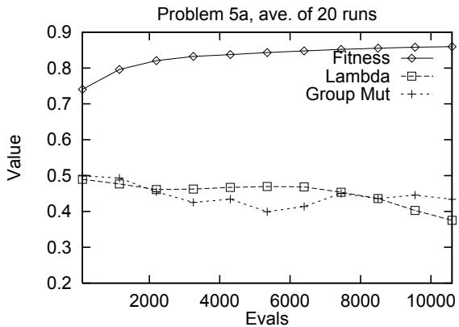
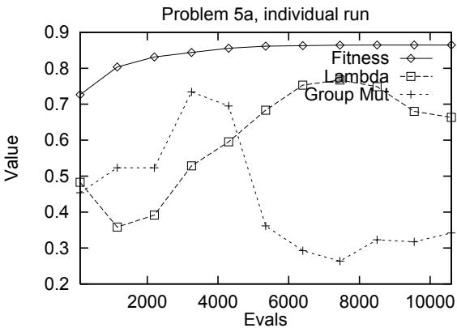

# omising areas of research in evolutionarymputation as it adapts the al orithm to eters.The results show that the method is successful

n to non- hand-tuni

orks uite well. promising areas of research in evolutionary computation as it adapts the algorithm to the problem while solving the problem. In Self-adaptation is an important area of research in Evolutionary Computation as we use it to adapt an evolutionary algorithm to the problem as it is solving the problem. Self-adaptation, where the strategy parameters being self-adapted form part of the representation of the individual, and undergo mutation and or recomb

the GA and Section 5 presents the results and conclusio

The results show that the method is successful as II. Self-adaptation The idea of the evolution of evolution can be used

implement the self-adaptation of parameters in evolutionary algorithms. Here the parameters to be ada ted are encoded onto the chromosome s of the individual and under o mutation and recombination. These encoded arameters do not aect the tness of individuals directl but \better" values will lea

# vanan & Fogel, 19

# ore likely to survive an

adaptation has been to optimise of mainly numeric functions. Multi-chromosome re resentations have been used in Genetic Al orithms GAs to encode dierent asects of the re resentation of a roblem solution onto separate chromosomes. This gives us a way of separating out the dierent representational components of an encoded problem solution, and applying dierent and a ro riate o erators Surr & Radclie, 1996 to them. We combine the technologies of self-adaptation and multi

strate arameters in a GA for a non-numeric problem. The problem is the Cutting Stock Problem (CSP), and the GA uses a single group based chromosome to encode the roblem solutions. We add an extra chromosome using a numeric represennents of an encoded problem solution, and applying Department of Computer and Mathematical Sciences, Victoria University of Technology,

ail: rhh@matilda.vut.edu.au and multi-chromosomes to implement the self-adapta of strategy parameters in a GA for a non-numeric problem. The problem is the Cutting Stock Problem (CSP), and the GA uses a single group based chromosome to encode the problem solutions. We add an extra chromosome using a numeric representer values. Schwefel 1977; 1995 pioneered this method to self-ada t the mutation ste size and the mutation rotation an les in Evolution Strate ies. Self-ada tion was extended to Evolutionar Pro rammin b nation. These encoded parameters do not affect the Back 1992 and Hinterdin 1995 . The arameters to self ada t can be arameter values or robabilities of usin alternative rocesses and as these are numeric quantities this type of selfter values.

umeric functions. This has been the case when sin le chromosome re resentations are used which is the overwhelming case), as otherwise numerical and non-numerical representations would need to be combined on the same chromosome. Bäck (1992) and Hinterding (1995).

. Self-adaptation for Non-numeric Problems When self-adaptation in Evolution Strategies is used in the general form, each individual contains representations of the following components: the object qumeric functions. This has been the case when single chromosome representations are used (which is the overwhelming case), as otherwise numerical and non-numerical representations would need to be combined on the same chromosome.

# A. Self-adaptation for Non-numeric Problems

When self-adaptation in Evolution Strategies is used in the general form, each individual contains representations of the following components: the object should u $\vec { x }$ the same set of o erators we ca $\vec { \sigma }$ then view the individuals as bein c $\vec { \alpha }$ m osed as three chromosomes where one chromosome contains the object variables, one contains the standard devia

ons and the last contains the rotation an les. In this view all three chromosomes share the same re - resentation all have dierent mutation o erators and some ma share the same recombination o erator. This view ives us a more concise un

of the rocesses involved in re roduction and enables us to view the re resentation and o erators of the roblem solution as bein se arate and ossibl dierent to the re resentation and o erators object variables, one contains the standard deviations and the last contains the rotation angles. In numeric problems is clear, we make explicit the multi chromosome re resentation and choose whatever re resentation is appropriate for the problem solution representation. This has been done implicitly in EP b Fo el et. al. 1995 when the used selfada tation to modif the relative mutation rates of the components of a nite state machine. Multi-chromosome re resentations have been used to partition a problem solution into a num

rent re resentations and then encode each re resentation onto a dierent chromosome. Juli 1993 used this method in her Pallet Loadin GA here resentation is appropriate for the problem solution which each chromosome using a dierent representation and dierent re roduction o erators. For the roblem we are considerin the Cuttin the components of a finite state machine.

e roblem solution usin a rou in re resentato partition a problem solution into a number of difis used to re resent the self-ada tive strate arameters usin a numeric re resentation. Each chromosome will have its own crossover and mutation o erators but the numeric chromosome holdin the parameters to be adapted will have have no direct in
uence on the tness function.

For the problem we are considering, the Cutting III. The Cutting Stock Problem the problem solution using a grouping representation (Falkenauer, 1991), and the other chromosome number of items of dierent length from lengths of rameters using a numeric representation. Each chromosome will have its own crossover and mutation operators, but the numeric chromosome holding the parameters to be adapted will have have no direct influence on the fitness function.

# III. THe Cutting Stock Problem

The Cutting Stock Problem consists of cutting a set number of items of different length from lengths of stock such that the wastage is minimised. The total number if items of any size is called an order, and a The roblem used was the multi le stock len th CSP with conti uit see below . In the multi le stock len th CSP not onl must the atterns be found to minimise wasta e but also the stock len ths the attern will use must be determined. T

m has been solved in Hinterdin & Khan 1995 and we use the same re resentation and the same roblem instances so that a clear com arison can be made. Readers are referred to that a er for full det

scri tions of the rou in o erators used. CSP with contiguity (see below). In the multiple A. Contiguity found to minimise wastage, but also the stock lengths the pattern will use must be determined. This problem has been solved in Hinterding & Khan (1995), and we use the same representation and the same problem instances so that a clear comparison can be made. Readers are referred to that paper for full details of the problem, problem instances and descriptions of the grouping operators used.

# patterns until

well-researched. In practice, the sequencin is done in the 2nd ste of a two-ste rocess where in the 1st ste the atterns and their runs are determined. One exam le of 2-dimensional se uencin in this manner is iven in Yuen 1991 . Our a roach to deal with conti uit re uirements is to include a measure of contiguity in the objective function of the cuttin stock roblem. The maximum number of artl -nished orders at an

a production run can serve as such a measure { the lower the number, the more contiguous the solution is. 1st step, the patterns and their runs are determined. B. Representing the CSP Problem manner is given in Yuen (1991).

Our approach to deal with contiguity requirements is to include a measure of contiguity in the objective function of the cutting stock problem. The maximum number of partly-finished orders at any instant of a production run can serve as such a measure - the lower the number, the more contiguous the solution is.

# B. Representing the CSP Problem

The representation used for the cutting stock problem is based on the grouping representation developed for the bin packing problem (Falkenauer & Delchambre, 1992). Here the emphasis is changed from the traditional GA where genes represent a single value, and its position or order in relation to other genes is significant, to the situation where from which stock length the groups were to be cut. The second chromosome turns out to be unnecessar as a valid rou of items im lies the stock len th it should be cut from. This is the

t stock len th from which the rou of items can successfull be cut. In the Cuttin Stock Problem with conti uit the order of the genes becomes signicant. The mapping does not need to chan e but dierent crossover and where a second chromosome was used to encode cance of the order of the enes. The second chromosome turns out to be unnecesB.1. The reproduction operators Crossover The crossover operator is a modication of Falkenauer's Grouping crossover (Falkenauer & Delchambre, 199

signicance to the order of the genes in the parents, so a new crossover the Uniform Grouping crossover (UGCX) was developed to give signicance to the order of the genes for the CSP with contiguity (see Hinterding & Khan (1995)

# B.1. The reproduction operators

Mutation There are two mutation operators, the Group mutation operator and the Remove and Re$\&$ sert (RAR) mutation operator. The Group mutation operator is based on Falkenauer's group mutation operator, this deletes a number of groups (genes) and then rebuilds some genes from the items released and inserts them at a randomly chosen site (see Hinterding & Khan

enes in se uence and re-inserts them at a randoml Group mutation operator and the Remove and Reenes and is used to alter the se

r conti uit maximisation. In the ori inal roblem the rou mutation o - erator and RAR mutation operator were each used ft ercent of the time. When mutation is to be used the specic mutation operator was chosen randoml .

The RAR mutation operator removes a number of C. The Fitness Function The evaluation function for the stock cuttin roblem with contiguity is calculated as the result of the for contiguity maximisation.

In the original problem the group mutation operator and RAR mutation operator were each used fifty percent of the time. When mutation is to be used the specific mutation operator was chosen randomly.

# C. The Fitness Function

The evaluation function for the stock cutting problem with contiguity is calculated as the result of the

Table 1: Self-adaptive Parameters   

<table><tr><td>Param.</td><td>Range</td><td>Init. Values</td></tr><tr><td>Grp. mut %</td><td>0.0 - 1.0</td><td>uniform random</td></tr><tr><td>λ1</td><td>0.0 - 10.0</td><td>uniform random</td></tr></table>

following cost function subtracted from the fitness ceiling of 1.0.

$$
\begin{array} { r c l } { \mathrm { c o s t } } & { = } & { \displaystyle \frac { 1 } { 1 0 + n } \left( \sum _ { 1 , n } \sqrt { \frac { \mathrm { w a s t e } _ { i } } { \mathrm { s t o c k \mathrm { \textmu } \mathrm { e n g t h } _ { i } } } } \right. } \\ & { \displaystyle \left. + 1 0 \left( \frac { \mathrm { n o } _ { - } \mathrm { o p e n } _ { - } \mathrm { i t e m s } } { \mathrm { n o } _ { - } \mathrm { d i f f e r e n t } _ { - } \mathrm { i t e m } _ { - } \mathrm { l e n g t h s } } \right) ^ { 2 } \right) } \end{array}
$$

wastage.

$n =$ e second term in t   
maximise the $ \} =$ ntiguity by minimising $\mathrm { g r o u p } _ { i }$ mbe f open items.   
n the $_ i =$ ddle of the range (0-1) extra wei $\mathrm { g r o u p } _ { i }$ h

erimentall . the wastage, we take the square root of this term to IV. Self-adaptive Parameters and the GA For the CSP problem there are two mutation operators.

meter 1 that controls the number of genes that are destroyed and rebuilt and the RAR mutation operator with a parameter 2 which controls the number of genes to be removed as a group and reinserted somewhere else. The parameters chosen for self-adaptation

# IV. SELF-ADAPTIVE PARAMETERS AND THE GA

rebuild. The parameter  was set to 3. These parameters were chosen as they were though to be im $\lambda _ { 1 }$ rtant to the eectiveness of the GA  to the eectiveness of Group mutation, and Group mutation robabilit for the $\lambda _ { 2 }$ alance of rou and order based rocessin . The ran es and initial values for these arameters it iven in table 1. self-adaptation are the probability that Group muA. Representation in the Numeric Chromosome $\lambda _ { 1 }$ e chromosome to hold the self-adaptive parameters uses a numeric repr $\lambda _ { 2 }$ ntation so th

These parameters were chosen as they were thought to be important to the effectiveness of the GA, $\lambda _ { 1 }$ to the effectiveness of Group mutation, and Group mutation probability for the balance of group and order based processing. The ranges and initial values for these parameters it given in table 1.

# A. Representation in the Numeric Chromosome

The chromosome to hold the self-adaptive parameters uses a numeric representation so that standard of two. Crossover and mutation are used as independent reproduction operators; that is a new individual is produced by either crossover or mutation and never by both. The crossover/mutation rate determines the proportion of new individuals produced by crossover or mutation.

  
Figure 1: Self-adaption:ave. 20 runs

  
Hence there is a cost for using self-adapt

# B. The GA

scarded and still counted as an evaluation. The other ma or arameter is the re lacement rate which is the ercenta e of the o ulation to be re laced in one eneration. For the GA usin self-ada tation the o ulation size was 100 a re lacement rate of 70% and a crossover rate of 50% was used. The GA in Hinterdin & Khan used a crossover rat

rameters were the same. cates an individual already in the population, it is V. Results and Conclusion other major parameter is the replacement rate, which is the percentage of the population to be replaced one where there a

For the GA using self-adaptation, the population size was 100, a replacement rate of $7 0 \%$ and a crossa e maxim $5 0 \%$ tness and standard deviation from twent runs on each of the $7 0 \%$ ms. The hi her parameters were the same.

# oblems are run for a higher numb

The GA was run on all the problems from Hinterding $\&$ Khan (1995), each problem has two variants: one where there are multiple stock lengths; and the other (problem suffix 'a') where there is only one stock length. The results in Table 2 give the average maximum fitness and standard deviation from twenty runs on each of the problems. The higher numbered problems are generally harder and the harder problems are run for a higher number of evaluations. The results in the columns headed 'Fixed

Figures 1 & 2 show the average variation of the

lf-ada tive arameters and the avera e maximum tness for all runs in Fi . 1 and for one run in Fi . 2 on Problem 5a. Lambda in these  ures has been divided b 10. These  ures show that while the avera e behaviour of these self-ada tive arameters over all runs does not var much in individual runs the situation is very dierent. Inspection of the individual runs shows that one of the arameters will tend to be small nea

her tend $1 \And 2$ e lar er. We have develo ed a eneral method for usin self-adaptation for non-numeric problems, and have iven an exam le of this b self-ada tin two strate arameters for the Cuttin Stock Problem with conti uit . We used a two chromosome re resentation where one chromosome is used to re resent to the situation is very different. Inspection of the into re resent the self-ada tive arameters. Dierent representations and reproduction operators are used for each chromosome.

The results for the GA where self-adaptation is used are better that when these parameters had xed values, hence as well as removing the need to hand tune these parameters and improvement in the GAs results has been obtained. This research shows the utilit of self-ada tation for non-numeric roblems and the usefulness of multi chromosome re resentations for im lementin difrepresentations and reproduction operators are used for each chromosome.

The results for the GA where self-adaptation is used are better that when these parameters had fixed values, hence as well as removing the need to hand tune these parameters and improvement in the GAs results has been obtained.

This research shows the utility of self-adaptation for non-numeric problems and the usefulness of multichromosome representations for implementing different representations within the EA.

k Zbigniew Michale- netic Algorithm   

<table><tr><td rowspan="2">Problem</td><td rowspan="2">Evals.</td><td colspan="2">Fixed Params</td><td colspan="2">Self-adaptive</td></tr><tr><td>ave. fit.</td><td>std. dev.</td><td>ave. fit.</td><td>std. dev.</td></tr><tr><td>1</td><td>2200</td><td>0.9860</td><td>0.0031</td><td>0.9849</td><td>0.0044</td></tr><tr><td>1a</td><td>2200</td><td>0.956</td><td>0.0</td><td>0.956</td><td>0.0002</td></tr><tr><td>2</td><td>5700</td><td>0.9796</td><td>0.013</td><td>0.9856</td><td>0.0054</td></tr><tr><td>2a</td><td>5700</td><td>0.9212</td><td>0.0171</td><td>0.9276</td><td>0.0056</td></tr><tr><td>3</td><td>4300</td><td>0.9828</td><td>0.0041</td><td>0.9816</td><td>0.0053</td></tr><tr><td>3a</td><td>4300</td><td>0.9387</td><td>0.0318</td><td>0.9492</td><td>0.0177</td></tr><tr><td>4</td><td>5700</td><td>0.9610</td><td>0.014</td><td>0.9720</td><td>0.0081</td></tr><tr><td>4a</td><td>5700</td><td>0.9335</td><td>0.0103</td><td>0.9376</td><td>0.0085</td></tr><tr><td>5</td><td>10600</td><td>0.9889</td><td>0.0073</td><td>0.9955</td><td>0.0018</td></tr><tr><td>5a</td><td>10600</td><td>0.8469</td><td>0.0118</td><td>0.8596</td><td>0.0128</td></tr></table>

Further research need to be done to extend selfBack, T. 1992. Self-adaption in Genetic Algorithms. In: Proceedings of the First European Conference on

# . 1991. Handbook of

The author would like to thank Zbigniew Michaley , yp gy g

# 44, pp. 145{

Grouping. In: Proceedings of the Fifth International S m osium on A lied Stochastic Models and Data Analysis. pp. 199{206. enauer E. A.   
netic Al orithm for Bin Packin and Line Balancin . In: Proceedin s o 1   
national Con erence on Robotics and Automation RA92 . pp. 1186{1193. l, D.B., Fo el, L.J., & Atma   
Meta-Evolutionary Pro rammin . In: Chen, R.R. (ed), Proc. of the 25th Asilomar Conf. on Signals, Systems, and Computers. San Jose: Ma le Press. . 540{545.   
Fo el, L.J., An eline, P.J., & Fo el, D.B. 1995. An Evolutionary Programming Approach to SelfAda tion on Finite State Machines. In: McDonnell J.R. Re nolds R.G. & Fo el D.B. eds , Proceedings of the F   
Fogel, D.B., Fogel, L.J., & Atmar, J.W. 1991. Meta-Evolutionary Programming. In: Chen, R.R. (ed), Proc. of the 25th Asilomar Conf. on Signals, Systems, and Computers. San Jose: Maple Press. pp. 540545.   
Fogel, L.J., Angeline, P.J., & Fogel, D.B. 1995. An Evolutionary Programming Approach to SelfAdaption on Finite State Machines. In: McDonnell, J.R., Reynolds, R.G., & Fogel, D.B. (eds), Proceedings of the Forth Annual ConMathematical Sciences, Victoria University of sachusetts: MIT Press. pp. 355365.   
Hinterdin R. & Khan L. 1995. Genetic Alorithms for Cuttin Stock Problems: with and without Contiguity. In: Yao, X (ed), Progress in Evolutionary Computation. Lect   
Notes in Articial Intelli ence, vol. 956. Berlin: Springer. , K. 1993. A multi-chromosome enetic al orithm for pallet loadin . In: Proceedings of the Fifth International Conference on Genetic Algorithms. pp. 476{73.   
Saravanan, N., & Fogel, D.B. 1994. Learning Strategy Parameters in Evolutionary Programming: An Empirical Study. In: Sebald, A.V., & Fogel, L.J. (eds), Proceedings of the Third Annual Conference on Evolutionary Programming. Wo   
Schwefel, H-P. 1977. Numerische Optimierung von Computer-Modellen mittels der Evolutionsstrate ie. Interdisci linar s stems research vol. 26. Basel: Birhau   
Schwefel, H-P. 1995. Evolution and Optimum Seeking. Sixth-Generation Computer Technology Series. Wiley. P.D. & Radclie N.J. 1996. Formal Algorithms + Formal Representations = Search Strategies. In:   
Rechenberg, I., & Schwefel, H-P. (eds), Parvon Computer-Modellen mittels der Evolutionsstrategie. Interdisciplinary systems research, vol. 26. Basel: Birhäuser.   
Schwefel, H-P. 1995. Evolution and Optimum Seeking. Sixth-Generation Computer Technology Series. Wiley.   
Surry, P.D., & Radcliffe, N.J. 1996. Formal Algorithms $^ +$ Formal Representations $=$ Search Strategies. In: Voigt, H-M., Ebeling, W., Rechenberg, I., & Schwefel, H-P. (eds), Par

ellel Problem Solving from Nature - PPSV IV. Lecture Notes in Computer Science, vol. 1141. Berlin: Springer. pp. 366375. Yuen, B. J. 1991. Heuristics for Sequencing Cutting Patterns. European Journal of Operational Research, vol. 55. pp. 183190.