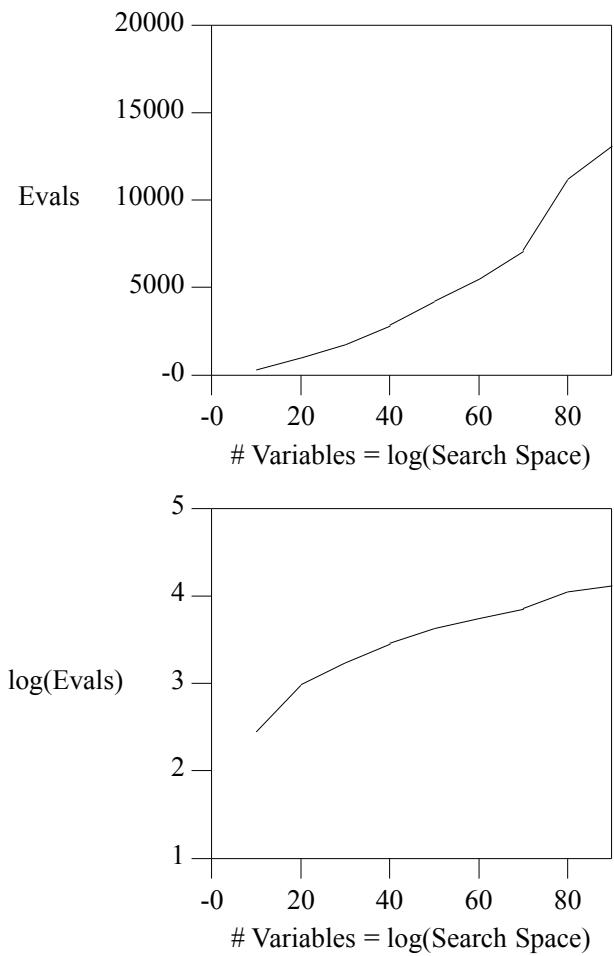
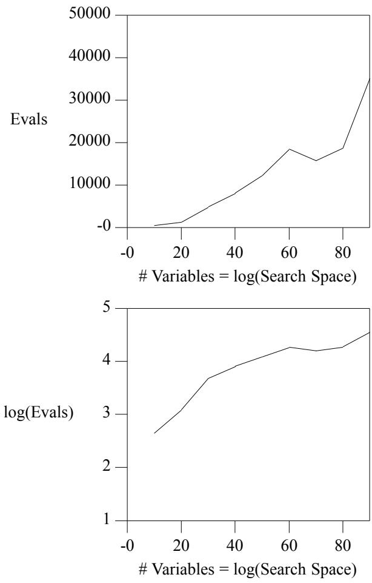
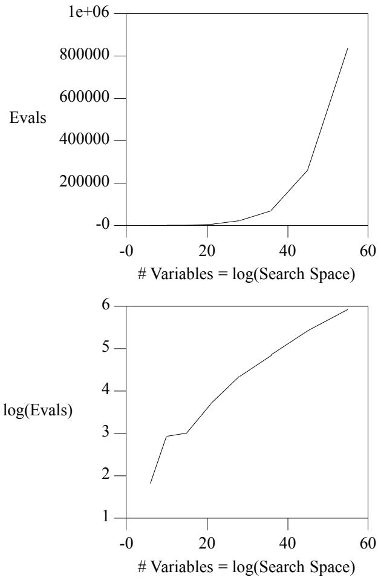
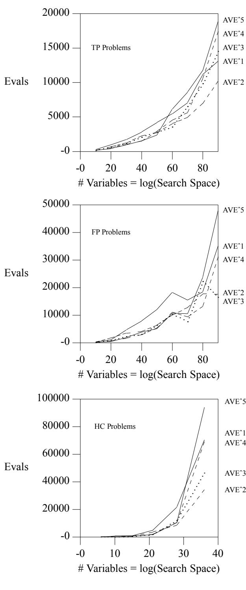
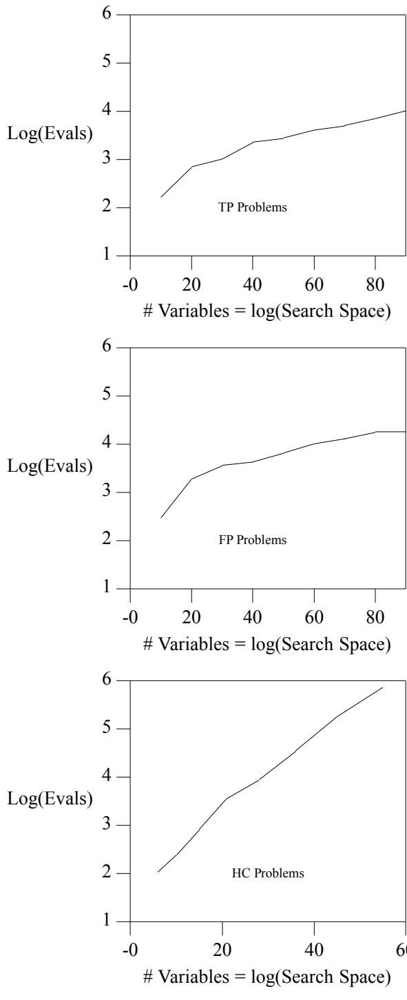
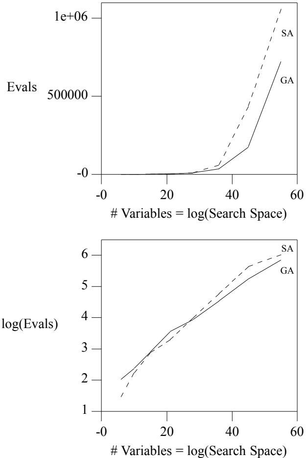

# Using Genetic Algorithms to Solve NP-Complete Problems

Kenneth A. De Jong George Mason University KDEJONG@GMUVAX2.GMU.EDU

William M. Spears Navy Center for Applied Research in AI SPEARS@AIC.NRL.NAVY.MIL

# Abstract

A strategy for using Genetic Algorithms (GAs) to solve NP-complete problems is presented. The key aspect of the approach taken is to exploit the observation that, although all NP-complete problems are equally difficult in a general computational sense, some have much better GA representations than others, leading to much more successful use of GAs on some NP-complete problems than on others. Since any NP-complete problem can be mapped into any other one in polynomial time, the strategy described here consists of identifying a canonical NP-complete problem on which GAs work well, and solving other NP-complete problems indirectly by mapping them onto the canonical problem. Initial empirical results are presented which support the claim that the Boolean Satisfiability Problem (SAT) is a GAeffective canonical problem, and that other NPcomplete problems with poor GA representations can be solved efficiently by mapping them first onto SAT problems.

# 1. Introduction

One approach to discussing and comparing AI problem solving strategies is to categorize them using the terms ‘‘strong’’ and ‘‘weak’’ methods. Generally, a weak method is one which has the property of wide applicability but, because it makes few assumptions about the problem domain, can suffer from combinatorially explosive solution costs when scaling up to larger problems. State space search algorithms and random search are familiar examples of weak methods.

Frequently, scaling up problems can be avoided by making sufficiently strong assumptions about the problem domain and exploiting these assumptions in the problem solving method. Many expert systems fall into this category in that they require and use large amounts of domain- and problem-specific knowledge in order to efficiently find solutions in enormously complex spaces. The difficulty with strong methods, of course, is their limited domain of applicability leading, generally, to significant redesign even when applying them to related problems.

These characterizations tend to make one feel trapped in the sense that one has to give up significant performance to achieve generality, and vice versa. However, it is becoming increasingly clear that there are at least two methodologies which fall in between these two extremes and offer in similar ways the possibility of powerful, yet general problem solving methods.

The two approaches we have in mind are Genetic Algorithms (GAs) and Neural Networks (NNs). They are similar in the sense that they achieve both power and generality by demanding that problems be mapped into their own particular representation in order to be solved. If a fairly natural mapping exists, impressive robust performance results. On the other hand, if the mapping is awkward and strained, both approaches behave much like the more traditional weak methods yielding mediocre, unsatisfying results when scaling up.

These observations suggest two general issues which deserve further study. First, we need to understand how severe the mapping problem is. Are there large classes of problems for which effective mappings exist? Clearly, if we have to spend large amounts of time and effort in constructing a mapping for each new problem, we aren’t any better off than the more traditional strong methods. The second major issue involves achieving a better understanding of the relationship between GAs and NNs. Are the representation issues and/or performance characteristics significantly different? Are there classes of problems handled much more effectively by one approach than the other?

This paper is a first step in exploring these issues. It focuses on GAs and how they can be applied to a large, well-known class of combinatorially explosive problems: NP-complete problems. A parallel effort is underway using NNs to solve NP-complete problems. Although a conclusive study is not yet completed, We will describe some preliminary results which compare the performance of GAs and NNs on a family of very difficult NP-complete problems.

# 2. NP-Complete Problems

In complexity theory, NP denotes the set of all (decision) problems solvable by a non-deterministic polynomial time algorithm. P denotes the set of all (decision) problems solvable by a deterministic polynomial time algorithm. NP problems are considered "hard" in the sense that they are not currently solvable in deterministic polynomial time. It is an open question whether $\mathrm { N P } = \mathrm { P }$ .

The canonical example of a problem in NP is the boolean satisfiability problem (SAT): Given an arbitrary boolean expression of n variables, does there exist an assignment to those variables such that the expression is true? Other familiar examples include job shop scheduling, bin packing, and traveling salesman problems.

The concept of NP-completeness comes from the observation that, although every problem L in NP can be transformed into an equivalent SAT problem in polynomial time (Cooke’s theorem), the reverse polynomial-time transformation may not exist. Those problems in NP which do have 2-way transformations form an equivalence class of "equally hard" problems and have been called NP-complete problems [Garey79].

Although NP-complete problems are computationally equivalent in this complexity theoretic sense, they do not appear to be equivalent at all with respect to how well they map onto GA (or NN) representations. For example, in the case of GAs, the SAT problem has a very natural representation while finding effective representations for bin packing, job shop scheduling, and traveling salesman problems seems to to be quite difficult [DeJong85, Goldberg85, Grefenstette85, Smith85, Davis85, Oliver87, Goldberg89].

These observations suggest the following intriguing strategy. Suppose we are able to identify an NP-complete problem which has an effective representation in the methodology of interest (GAs or NNs) and develop an efficient problem solver for that particular case. Other NP-complete problems which don’t have effective representations can then be solved by transforming them into the canonical problem, solving it, and transforming the solution back to the original one.

We have explored this strategy in detail for GAs using SAT as the canonical NP-complete problem. A similar effort is underway using NNs and will be presented at a later date.

# 3. Genetic Algorithms and Boolean Satisfiability Problems

In order to apply GAs to a particular problem, we need to select an internal string representation for the solution space and define an external evaluation function which assigns utility to candidate solutions. Both components are critical to the success/failure of the GAs on the problem of interest. We have selected SAT as the choice for our canonical NP-complete problem because it appears to have a highly desirable string representation, namely, binary strings of length $_ \mathrm { N }$ in which the i-th bit represents the truth value of the i-th boolean variable of the N boolean variables present in the boolean expression. It is hard to imagine a representation much better suited for use with GAs: it is fixed length, binary, and context independent in the sense that the meaning of one bit is unaffected by changing the value of other bits [DeJong85].

# 3.1. Choosing a Payoff Function

Somewhat more thought must be given to selecting an evaluation function. The simplest and most natural function assigns a payoff of 1 to a candidate solution (string) if the values specified by that string result in the boolean expression evaluating to TRUE, and 0 otherwise. A moment’s thought, however, suggests that for problems of interest the payoff function would be 0 almost everywhere and would not support the formation of useful intermediate building blocks. Even though in the real problem domain, partial solutions to SAT are not of much interest, they are critical components of a GA approach.

One approach to providing intermediate feedback would be to transform a given boolean expression into conjunctive normal form (CNF) and define the payoff to be the total number of top level conjuncts which evaluate to true. While this makes some intuitive sense, one cannot in general perform such transformations in polynomial time without introducing a large number of additional boolean variables which, in turn, combinatorially increase the size of the search space.

An alternative would be to assign payoff to individual clauses in the original expression and combine them in some way to generate a total payoff value. In this context the most natural approach is to define the value of $T R U E$ to be 1, the value of $F A L S E$ to be 0, and to define the value of simple expressions as follows:

$$
\nu a l ( N O T e ) = 1 - \nu a l ( e )
$$

$$
\begin{array} { c } { { \nu a l \left( A N D e _ { 1 } \ \cdots \ e _ { n } \right) = M I N \left( \nu a l \left( e _ { 1 } \right) \ \cdots \ \nu a l \left( e _ { n } \right) \right) } } \\ { { } } \\ { { \nu a l \left( O R e _ { 1 } \ \cdots \ e _ { n } \right) = M A X \left( \nu a l \left( e _ { 1 } \right) \ \cdots \ \nu a l \left( e _ { n } \right) \right) } } \end{array}
$$

Since any boolean expression can be broken down (parsed) into these basic elements, one has a systematic mechanism for assigning payoff. Unfortunately, as the astute reader has probably already noticed, this mechanism is no better than the original one since it still only assigns payoff values of 0 and 1 to both individual clauses and and the entire expression.

However, a minor change to this mechanism can generate differential payoffs, namely:

$$
\nu a l ( A N D \ e _ { 1 } \ \cdot \ \cdot \cdot \ e _ { n } ) = A V E ( \nu a l ( e _ { 1 } ) \ \cdot \cdot \cdot \ \nu a l ( e _ { n } ) )
$$

This suggestion was made first by Smith [Smith79] and intuitively justified by arguing that this would reward

‘‘more nearly true’’ AND clauses. So, for example, solutions to the boolean expression

$$
X _ { 1 } A N D \left( X _ { 1 } O R \overline { { { X _ { 2 } } } } \right)
$$

would be assigned payoffs as follows:

<table><tr><td>X1 X2</td><td>PAYOFF</td></tr><tr><td>0 0</td><td>(AVE 0 (MAX (0 (1 - 0))) = 0.5</td></tr><tr><td>0 1</td><td>(AVE 0 (MAX (0 (1 - 1))) = 0.0</td></tr><tr><td>1 0</td><td>(AVE 1 (MAX (1 (1 - 0))) = 1.0</td></tr><tr><td>1 1</td><td>(AVE 1 (MAX (1 (1 - 1))) = 1.0</td></tr></table>

Notice that both of the correct solutions (lines 3 and 4) are assigned a payoff of 1 and, of the incorrect solutions (lines 1 and 2), line 1 gets higher payoff because it got half of the AND right.

This approach was used successfully by Smith and was initially adopted in our experiments. However, there were a number of features of this payoff function that left us uncomfortable and which led to a more careful examination of it.

The first and fairly obvious property of using AVE to evaluate AND clauses is that the payoff function is not invariant under standard boolean equivalency transformations. For example, it violates the associativity law:

va $l \left( \left( X _ { 1 } \ A N D \ X _ { 2 } \right) A N D \ X _ { 3 } \right) \neq \nu a l \left( X _ { 1 } \ A N D \left( X _ { 2 } \ A N D \ X _ { 3 } \right) \right)$ since

$$
\left( A V E \left( A V E X _ { 1 } X _ { 2 } \right) X _ { 3 } \right) \neq \left( A V E X _ { 1 } \left( A V E X _ { 2 } X _ { 3 } \right) \right)
$$

We have attempted to construct alternative differential payoff functions which have this ideal property of payoff invariance and have had no success. However, one could argue that a weaker form of invariance might be adequate for use with GAs, namely, truth invariance. By that we mean that the payoff function should assign the same value (typically 1, but could even be a set of values) to all correct solutions of the given boolean expression, and should map all incorrect solutions into a set of values (typically $0 \leq$ value $< 1$ ) which is distinct and lower than the correct ones. Since boolean transformations do not occur while the GAs are searching for solutions, the actual values assigned non-solutions would seem to be of much less importance than the fact that they are useful as a differential payoff to support the construction of partial solutions.

Unfortunately, the proposed payoff function does not even guarantee this second and weaker property of truth invariance as the following example shows:

$$
X _ { 1 } ~ O R ~ X _ { 2 } = \overline { { { ( \overline { { { X _ { 1 } } } } } ~ A N D ~ \overline { { { X _ { 2 } } } } ) } } ~ b y ~ D e ~ M o r g a n
$$

However,

$$
( M A X X _ { 1 } X _ { 2 } ) \neq 1 - \frac { ( ( 1 - X _ { 1 } ) + ( 1 - X _ { 2 } ) ) } { 2 }
$$

as we see in the following table:

<table><tr><td>X1 X2</td><td>Left side</td><td>Right side</td></tr><tr><td>0 0</td><td>0</td><td>0</td></tr><tr><td>0 1</td><td>1</td><td>1/2</td></tr><tr><td>1 0</td><td>1</td><td>1/2</td></tr><tr><td>1 1</td><td>1</td><td>1</td></tr></table>

Notice that lines 2-4 are all solutions, but lines 2 and 3 are assigned a payoff of 1/2 after De Morgan’s law has been applied.

In general, it can be shown that, although the payoff does not assign the value of 1 to non-solutions, it frequently assigns values $< 1$ to perfectly good solutions and can potentially give higher payoff to non-solutions!

A careful analysis, however, indicates that these problems only arise when De Morgan’s laws are involved__________ in introducing terms of the form $\overline { { ( A N D \cdot \cdot \cdot ) } }$ . This suggests a simple fix: preprocess each boolean expression by systematically applying De Morgan’s laws to remove such constructs. It also suggests another interesting opportun-_________ ity. Constructs of the form $\overline { { ( O R \cdot \cdot \cdot ) } }$ are computed correctly, but only take on $_ { 0 / 1 }$ values. By using De Morgan’s laws to convert these to AND constructs, we introduce additional differential payoff. Converting both forms is equivalent to reducing the scope of all NOTS to simple variables. Fortunately, unlike the conversion to CNF, this process has only linear complexity and can be done quickly and efficiently.

In summary, we feel that, with the addition of this preprocessing step, we now have an effective payoff function for applying GAs to boolean satisfiability problems. This payoff function has the following properties: 1) it assigns a payoff value of 1 if and only if the candidate solution is an actual solution; 2) it assigns values in the range $0 ~ \leq$ value $< 1$ to all non-solutions; and 3) nonsolutions receive differential payoff on the basis of how near their AND clauses are to being satisfied.

# 3.2. Possible Improvements to the Payoff Function

One way to view the problems discussed in the previous section is to note that many of the undesirable effects are due to the fact that, by choosing to evaluate AND /OR clauses with $A V E / M A X ,$ , we have broken the natural symmetry between $A N D$ and $O R$ in the sense that AND clauses will have differential payoffs assigned to them while $O R$ clauses will only be assigned $_ { 0 / 1 }$ . An interesting observation is that evaluating AND nodes by raising $A V E$ to some integer power $p$ is still truth preserving (assuming the preprocessing step described above) and has several additional beneficial effects. First, it has the effect of reducing the AND /OR asymmetry by reducing the average score assigned to a false AND clause. In addition, it increases the differential between the payoff for AND clauses with only a few 1s and those which are nearly true.

On the other hand, as $\mathfrak { p }$ approaches infinity, the function $A V E ^ { p }$ behaves more and more like MIN which means we have again lost the differential payoff property. This suggests an interesting optimization experiment to determine a useful value for $p$ . We will present our initial results on this in the next section.

# 4. Experimental Results

# 4.1. Implementation Details

All of our experiments have been performed using a Lucid Common Lisp implementation of the GAs. In all cases the population size has been held fixed at 100, the standard 2-point crossover operator has been applied at a $60 \%$ rate, the mutation rate is $0 . 1 \%$ , and selection is performed via Baker’s SUS algorithm [Baker87].

Having formulated SAT as an optimization problem, there are some interesting issues concerning convergence to a solution. First of all, whenever a candidate evaluates to 1, we know that a solution has been found and the search can be terminated. Conversely, there is strong motivation to continue the search until a solution is found (since nearly true expressions are not generally of much interest to the person formulating the problem). The difficulty, of course, is that on any particular run there is no guarantee that a solution will be found in a reasonable amount of time due to the increasing homogeneity of the population as the search proceeds.

One approach would be to take extra measures to guarantee continuing diversity (such as increasing mutation, selection by ranking, introducing crowding factors, etc.). Unfortunately, these all have additional side effects which would need to be studied and controlled as well. We have chosen a simpler approach. We use De Jong’s measure of population homogeneity based on allele ‘‘convergence’’ [DeJong75], and when that measure exceeds $90 \%$ , the GA is restarted with a new random population. Consequently, in the experimental data presented in the subsequent sections, the evaluation counts reflect all of the GA restarts. Although this technique might seem a bit drastic, it appears to work quite well in practice.

Since the number of evaluations (trials) required to find a solution can vary quite a bit from one run to the next due to stochastic effects, all of the results presented here represent data averaged over at least 10 independent runs.

control the size and the difficulty of the problem. The first family selected consists of two-peak (TP) expressions of the form:

$$
( A N D X _ { 1 } \ \cdot \cdot \cdot \ X _ { n } ) \ O R \ ( A N D \overline { { { X _ { 1 } } } } \ \cdot \cdot \cdot \ \overline { { { X _ { n } } } } )
$$

which have exactly two solutions (all 0s and all 1s). By varying the number $n$ of boolean variables, one can observe how the GAs perform as the size of the search space increases exponentially while the number of solutions remains fixed.

Figure 1 presents the results of varying $n$ between 10 and 90 (i.e., for search spaces ranging in size from $2 ^ { 1 0 }$ to $2 ^ { 9 0 }$ ). It is clear that the differential payoff function is working as intended, and that the GAs can locate solutions to TP problems without much difficulty.

To make things a bit more difficult, we changed the problem slightly by turning one of the solutions into a false peak (FP) as follows:

$$
( A N D X _ { 1 } \ \cdot \cdot \cdot \ X _ { n } ) \ O R \ ( A N D X _ { 1 } \overline { { X _ { 1 } } } \ \cdot \cdot \cdot \ \overline { { X _ { n } } } )
$$

so that the previous all 0s solution is now almost correct and the only correct solution is that of all 1s.

  
Figure 1: Performance of GAs on the TP Problems

# 4.2. Initial SAT Experiments

Our first set of experiments involves constructing several families of boolean expressions for which we can

Figure 2 presents the results of applying GAs to the FP family with $n$ ranging from 10 to 90. As before, we see that the GAs have no difficulty in finding the correct solution even in the presence of false peaks.

Since we are dealing with problems for which there are no known polynomial-time algorithms, we have been particularly interested in the log-log graphs. Notice that, for both the TP and FP problems, a sub-linear curve is generated, indicating (as expected) a substantial improvement over systematic search. The form that these sublinear curves take give some indication of the speedup (over systematic search) obtained by using GAs. If, for example, these curves are all logarithmic in form, we have a polynomial-time algorithm for SAT! Additional discussion of these curves will occur in a later section after more data has been presented.

With these initial encouraging results, we were eager to apply GAs to more naturally arising boolean expressions. However, we have found it difficult to find good examples of hard SAT problems (including those used by Smith [Smith79]). So, we have chosen instead to look at other NP-complete problems as possible sources. The first one we have selected is the family of hamiltonian circuit problems.

# 4.3. Solving Hamiltonian Circuit Problems

The hamiltonian circuit (HC) problem consists of finding a tour through a directed graph that touches all nodes exactly once. Clearly, if a graph is fully connected, this is an easy task. However, as edges are removed the problem becomes much more difficult, and the general problem is known to be NP-Complete.

Attempting to solve this problem directly with GAs raises many of the same representation issues as in the case of traveling salesman problems [DeJong85, Grefenstette85]. However, it is not difficult to construct a polynomial-time transformation from HC problems to SAT problems.

An example of the transformation we are using is given in Figure 3. The definition of the HC problem implies that, for any solution, each node must have exactly one input edge and one output edge. If any tour violates this constraint, it cannot be a solution. Therefore, an equivalent boolean expression is simply the conjunction of terms indicating valid edge combinations for each node. As an example, consider node $d .$ . Node $d$ has two output edges and one input edge. The output edge constraints are__ given by the exclusive-or,__ (( $d b$ and $\overline { { d e } }$ ) or ( $\overline { { d b } }$ and de )). The input edge is described simply by cd. The assignments to the edge variables indicate which edges make up a tour, with a value of 1 indicating an edge is included and a value of 0 if it is not. This transformation is computed in polynomial time, and a solution to the HC problem exists if and only if the boolean expression is satisfiable.

  
Figure 2: Performance of GAs on the FP Problems   
Figure 3: Transforming HC Problems to SAT Problems

As before, we wish to systematically study the performance of GAs on a series of increasingly difficult HC problems. Clearly, the complexity in this case is a function of both the number of nodes and the number of directed edges. For a given number N of nodes, problems with only a small number of edges $( \leq \Nu )$ or nearly fully connected (approximately $N ^ { 2 }$ edges) are not very interesting. We feel that problems with approximately $\frac { N ^ { 2 } } { 2 }$ edges would, in general, present the most difficult problems. In addition, to achieve some degree of uniform difficulty and to allow for a direct comparison with some of the results in the previous section, we wanted the problems to have exactly one solution. Consequently, we have defined the following family of HC problems for our experiments.

Consider a graph of $n$ nodes, which are labeled using consecutive integers. Suppose the first node has directed edges to all nodes with larger labels (except for the last node). The next $n { - } 2$ nodes have directed edges to all nodes with larger labels (including the last one). The last node has a directed edge back to the first node. A complete tour consists of following the node labels in increasing order, until you reach the last node. From the last node you travel back to the first. Because the edges are directed, it is clear that this is also the only legal tour.

Intuitively, such instances of HC problems should be difficult. Only one tour exists in each instance. In addition, there are a large number of solutions that are almost complete tours scattered throughout the search space. Figure 4 illustrates what the corresponding SAT payoff function looks like for an HC problem of this type with 7 nodes.

In summary, our experimental framework consists of varying the number N of nodes in the range $4 \leq \mathrm { N } \leq 1 0$ and, for each value of N, generating a directed graph of the form described above containing approximately $\frac { N ^ { 2 } } { 2 }$ edges and exactly one solution. Each of these HC problems is transformed into its equivalent SAT problem using the transformation described above, generating search space sizes ranging from $2 ^ { 6 }$ to $2 ^ { 4 5 }$ . GAs are then used to solve each of the corresponding SAT problems which, in turn, describes a legal HC tour.

Figure 5 presents the results of these experiments. Notice that we have succeeded in generating significantly more difficult SAT problems in that the number of evaluations required to find a solution is an order of magnitude higher that the earlier TP and FP problems. However, even with these difficult problems, the log-log plot is still sub-linear.

# 4.4. Improvements to the SAT Payoff Function

Although we were pleased with the results so far, we were very curious as to the effects of using $A V E ^ { p }$ in the payoff function for integer values of $p > 1$ for the reasons discussed in section 3.2. Our hypothesis was that initial increases in the value of $p$ would improve performance, but that beyond a certain point performance would actually drop off as $A V E ^ { p }$ began to more closely approximate MIN.

  
Figure 4: SAT Payoff function for a 7-node HC Problem   
Figure 5: Performance of GAs on the HC Problems

  
Figure 6: Performance of GAs using $A V E ^ { p }$

We tested this hypothesis by re-running the GAs on the three families of problems (TP, FP, and HC) varying $p$ from 2 to 5, and compared their performance with the original results with $p = 1$ . Figure 6 presents the results of our experiments. Somewhat surprisingly, an optimum appeared already at $p = 2$ . Accordingly, we have adopted that value for the remaining experimental work we have performed.

# 4.5. Some Empirical Evidence of Implicit Parallelism

One of the nice theoretical results in Holland’s original analysis of the power of GAs is the ‘‘implicit parallelism’’ theorem which sets a lower bound of an $N ^ { 3 }$ speedup over systematic sequential search [Holland75]. This suggests that, in the worst case, GAs should not have to search more than the cube root of the search space in order to find a solution and, in general, should do much better.

One of the unexpected benefits of the experimental results presented here is substantial empirical evidence of just such speedups on SAT problems.

Figure 7 summarizes the performance of the GAs on the 3 families of SAT problems using $A V E ^ { 2 }$ in the payoff function. As we noted earlier, the log-log curves appear to be sub-linear. To get a better feeling for the form of these curves, we have tried to fit both linear and quadratic curves to the data. For each of the families of SAT problems, a quadratic form produces a better fit and, by using the coefficients of the quadratic form, we can calculate the observed speedup. The results are as follows:

TP speedup: $\begin{array} { c } { { N ^ { 7 . 2 8 } } } \\ { { N ^ { 6 . 2 5 } } } \\ { { N ^ { 2 . 9 4 } } } \end{array}$   
FP speedup:   
HC speedup:

Clearly, on the easier problems (TP and FP) we are performing better than the predicted lower bound. What is particularly intriguing, however, is how well the empirical results match the theoretical results for the HC family which we have deliberately constructed to be a class of very difficult single-solution problems.

# 5. Current Activities

# 5.1. C and Parallelization

The experiments reported here have been constrained by our use of Lucid Common Lisp. While Lisp makes it easy to automate the process of generating Lisp code for the various SAT families of problems, the Lucid Lisp compiler imposes internal limits on the size and complexity of the functions it can compile. We hit these limits when attempting to generate payoff functions for HC problems with more than 10-11 nodes. We are in the process of switching over to the Genesis system, a C implementation of GAs [Grefenstette84], to avoid these limitations. A side benefit of this conversion is that the experiments also run a order of magnitude faster! Since many GA sites already use Genesis, this step has the added advantage of creating an additional GA testbed for the GA community.

  
Figure 7: Summary Performance of GAs using $A V E ^ { 2 }$

More exciting perhaps is the use of parallelism. Genesis is being converted for use on the Butterfly machine at NRL. The Butterfly is a MIMD machine with

128 68020-based nodes. Preliminary results suggests that the use of this machine could result in a two order of magnitude speedup in execution time.

# 5.2. An NP-Complete Factorization Problem

Although the GA’s have performed well on TP, FP, and HC problems, one can argue that the problems are simply not interesting, since the TP and FP problems are somewhat artificial and there already exists specialized algorithms for HC problems which can out perform the GAs on the examples shown. What is perhaps needed at this point to evaluate the robustness of this approach is a problem which is known to be NP-complete, but for which few (if any) specialized algorithms have been developed.

An example of such a problem has come to us from the cryptography community. Most cryptography systems make use of prime numbers and factorization [Rivest78]. Hoey [Hoey89] has devised an algorithm for converting a factorization decision problem into an equivalent SAT problem. For example, a problem of the form:

"Does 689 have a 4 bit factor?"

can be converted to a boolean expression with 22 variables, 105 clauses, and 295 literals.

Such problems are of interest to both the cryptographic and complexity theory communities because they are generally highly intractable. We plan a set of extensive experiments when we have completed the conversions described in the previous section.

# 5.3. A Comparison with Simulated Annealing

As mentioned earlier, we are also examining the use of neural networks (NNs) to solve NP-Complete problems. In particular, we have developed a method for using simulated annealing (a class of NNs [McClelland88]) to solve SAT problems. Although the details of the methodology will not be presented here, some experimental highlights are worth mentioning.

First, SA’s work remarkably well on the TP problem, producing correct solutions in almost constant time (regardless of the size of the TP problem). In this case, SA’s are essentially greedy algorithms, and the results are not surprising. Secondly, SA’s appear to be reasonably competitive with GA’s on HC problems, although they are consistently outperformed on the examples we have run so far (see Figure 8).

If we again use quadratic fits to the HC data seen so far, the NN speedup is approximately $N ^ { 2 . 2 2 }$ while the GA speedup (reported earlier) is $N ^ { 2 . 9 4 }$ . We will have a more comprehensive report on these experiments in the near future.

  
Figure 8: GAs and SAs on the HC Problems

# 6. Conclusions

This paper presents a series of initial results regarding a strategy for using GAs to solve NP-complete problems. This strategy avoids many of the GA representation difficulties associated with various NP-complete problems by mapping them into SAT problems for which an effective GA representation exists.

These initial results support the view that GAs are an effective, robust search procedure for NP-complete problems in the sense that, although they may not outperform highly tuned, problem-specific algorithms, GAs can be easily applied to a broad range of NP-complete problems with performance characteristics no worse than the theoretical lower bound of an $N ^ { 3 }$ speedup.

This paper also sets the stage for a direct comparison between GAs and NNs on NP-complete problems. We feel that such comparisons are important and encourage the research community to develop additional results on these and other problems of interest.

# Список литературы

Baker, James E. (1987). Reducing Bias and Inefficiency in the Selection Algorithm, Proc. Int’l Conference on Genetic Algorithms and their Applications.

Davis, Lawrence (1985). Job Shop Scheduling with Genetic Algorithms, Proc. Int’l Conference on Genetic Algorithms and their Applications.

De Jong, K. A. (1975). An Analysis of the Behavior of a Class of Genetic Adaptive Systems, Doctoral dissertation, Dept. Computer and Communication Sciences, University of Michigan, Ann Arbor.

De Jong, K. A. (1985). Genetic Algorithms: a 10 Year Perspective, Proc. Int’l Conference on Genetic Algorithms and their Applications.

Garey, Michael R. & David S. Johnson (1979). Computers and Intractability: A Guide to the Theory of NPCompleteness, W. H. Freeman and Company, San Francisco, CA.

Goldberg, David E. and Robert Lingle, Jr. (1985). Alleles, Loci, and the Traveling Salesman Problem, Proc. Int’l Conference on Genetic Algorithms and their Applications.

Goldberg, David E. (1989). Genetic Algorithms in Search, Optimization & Machine Learning, AddisonWesley Publishing Company, Inc.

Grefenstette, John J. (1984). GENESIS: A system for using genetic search procedures. Proceedings of the 1984 Conference on Intelligent Systems and Machines, 161- 165.

Grefenstette, John J., et. al. (1985). Genetic Algorithms for the Traveling Salesman Problem, Proc. Int’l Conference on Genetic Algorithms and their Applications.

Hoey, Dan Navy Center for Applied Research in Artificial Intelligence. Private Communication.

Holland, John H. (1975). Adaptation in Natural and Artificial Systems, The University of Michigan Press.

McClelland, James L. and David E. Rumelhart (1988). Explorations in Parallel Distributed Processing, The MIT Press, Cambridge, MA.

Oliver, I. M., Smith, D. J. and J. R. C. Holland (1987). A Study of Permutation Crossover Operators on the Traveling Salesman Problem, Proc. Int’l Conference on Genetic Algorithms and their Applications.

Rivest, R. L., et al (1978). A Method for Obtaining Digital Signatures and Public-key Cryptosystems, CACM, 21,

Smith, Gerald H. (1979). Adaptive Genetic Algorithms and the Boolean Satisfiability Problem, Unpublished Work.

Smith, Derek (1985). Bin Packing with Adaptive Search, Proc. Int’l Conference on Genetic Algorithms and their Applications.