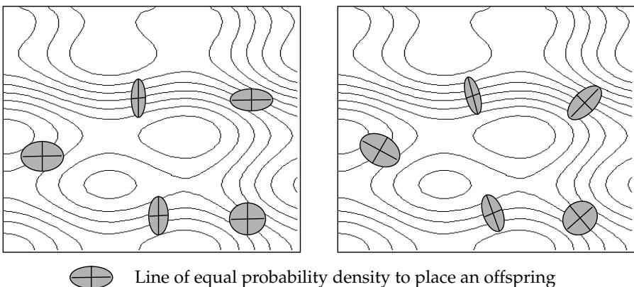

# Подход на основе эволюционного программирования к самоадаптации в конечных автоматах

Лоуренс Дж. Фогел (Lawrence J. Fogel), Питер Дж. Анджлайн (Peter J. Angeline) и Дэвид Б. Фогел (David B. Fogel)

# Аннотация

Эволюционное программирование было впервые предложено как альтернативный метод создания искусственного интеллекта. Были проведены эксперименты, в которых конечные автоматы использовались для предсказания временных рядов в соответствии с произвольной функцией выигрыша. На эволюционирующие автоматы накладывались мутации таким образом, что каждому из возможных режимов изменения давалась равная вероятность. В данном исследовании изучается использование самоадаптивных методов эволюционного программирования для конечных автоматов. Каждый автомат включает в себя кодировку своей структуры и дополнительный набор параметров, которые частично определяют, как он будет распределять новые пробы. Реализованы и протестированы на двух простых задачах предсказания два метода для достижения этой самоадаптации. Результаты, по-видимому, свидетельствуют в пользу использования таких самоадаптивных методов.

# 1. ВВЕДЕНИЕ

Эволюционные вычисления имеют долгую историю (Фогел, 1995, гл. 3). Некоторые из первых работ моделировали эволюцию как генетический процесс (Фрейзер, 1957; Бремерманн, 1962; Холланд, 19нологода). В этих симуляциях популяция абстрактных хромосом модифицируется с помощью операций кроссовера, инверсии и простой точечной мутации. Внешний критерий отбора (целевая функция) используется для определения того, какие хромосомы сохранять в качестве родителей для последующих поколений. Эти процедуры получили название генетических алгоритмов. Альтернативно, Рехенберг (1965) и Швефель (1965), а также Фогел (1962, 1964) предложили методы моделирования эволюции как фенотипического процесса, то есть процесса, подчеркивающего поведенческую связь между родителями и потомством, а не их генетическую связь. Эти симуляции также поддерживают популяцию абстрактных организмов (как в виде особей, так и видов), но основное внимание уделяется использованию операций мутации, которые генерируют непрерывный диапазон поведенческого разнообразия, но при этом сохраняют сильную корреляцию между поведением родителя и его потомка. Эти методы известны как эволюционные стратегии и эволюционное программирование соответственно.

Данная статья посвящена экспериментам с эволюционным программированием. В частности, в эволюционирующие решения включаются самоадаптивные параметры, предоставляющие информацию о генерации потомства, представленного в виде конечных автоматов, которые одновременно подвергаются мутации и отбору. Подобные операции применялись к задачам оптимизации функций действительных значений, но могут быть расширены на задачи дискретной комбинаторной optimizations (оптимизации). Статья начинается с предпосылок об использовании самоадаптации в эволюционных вычислениях. Описываются результаты экспериментов, сравнивающих эффективность двух методов самоадаптации на конечных автоматах для предсказания временных рядов. Наконец, обсуждаются потенциальные направления для дальнейшего исследования.

# 2. САМОАДАПТИВНЫЕ ЭВОЛЮЦИОННЫЕ ВЫЧИСЛЕНИЯ

Конечная эффективность любого алгоритма эволюционной оптимизации определяется соотношением формы поверхности отклика (ландшафта), в которой проводится поиск, и операций мутации, используемых для генерации новых пробных решений. Скорость оптимизации может быть значительно выше, если распределение мутаций может быть настроено на следование борозд и впадин на поверхности, а не просто распределение новых проб с равными средними размерами шагов в каждом измерении. Идея заключается в том, чтобы позволить эволюционному алгоритму самостоятельно адаптировать способ, которым он распределяет новые пробы, и восходит как минимум к И. Рехенбергу в 1967 году (Рехенберг, 1994), но был более подробно описан Швефелем (1981).

Например, рассмотрим задачу нахождения n-мерного вектора действительных значений $\mathbf{x}$, минимизирующего $F(\mathbf{x})$. Каждое пробное решение рассматривается как пара векторов $(\mathbf{x}, \boldsymbol{\sigma})$, где $\mathbf{x}$ — вектор оптимизируемых переменных, оцениваемых с помощью $F(\mathbf{x})$, а $\boldsymbol{\sigma}$ — вектор стандартных отклонений (часто описываемый как стратегические параметры), соответствующий размерам шагов многомерной гауссовской случайной величины с нулевым средним. Потомки создаются из каждого родителя по следующим правилам:

$$
x_i' = x_i + \mathrm{N}(0, \sigma_i)
$$

$$
\sigma_i' = \sigma_i \cdot \exp(\tau \cdot \mathrm{N}(0,1) + \tau' \cdot \mathrm{N}_i(0,1))
$$
где $\tau$ и $\tau'$ — параметры набора операторов, $\mathrm{N}(\mu, \sigma)$ — нормально распределенная случайная величина с математическим ожиданием $\mu$ и стандартным отклонением $\sigma$, а $\mathrm{N}_i(0,1)$ описывает стандартное гауссовское распределение, заново сгенерированное для $i$-й компоненты $\sigma$. На Рисунке 1 показан потенциал такого метода для распределения проб в зависимости от контуров адаптивного ландшафта. Метод распределяет решения в направлениях, которые в прошлом обеспечивали улучшение решений. Швефель (1981) расширил этот метод, чтобы учесть произвольные корреляции между возмущениями.

Фогел и др. (1991) независимо предложили аналогичную самоадаптивную процедуру для эволюционного программирования, в которой стандартные отклонения изменяются с использованием гауссовской случайной величины. В частности, метод выглядит следующим образом:

$$
x_i' = x_i + \mathrm{N}(0, \sigma_i)
$$

$$
{\boldsymbol{\sigma}}_i' = {\boldsymbol{\sigma}}_i + {\boldsymbol{\alpha}} \cdot {\bf N}(0,1)
$$
где $\alpha$ — масштабный коэффициент. Если какое-либо значение ${\boldsymbol{\sigma}}_i'$ становится неположительным, оно сбрасывается до небольшого произвольного значения $\varepsilon$. Фогел и др. (1992), по предложению Себальда (1991), включили дополнительную процедуру, позволяющую учитывать произвольные корреляции между стратегическими параметрами. Сравнения в работах Сараванана и Фогела (1994) показывают, что метод Швефеля (1981) в целом превосходит метод Фогела и др. (1991), если ограничиться некоррелированными возмущениями стратегических параметров. Сравнения между методами, включающими полные ковариационные матрицы, не проводилось.

Идея самоадаптации распределения новых проб также независимо возникла в генетических алгоритмах и генетическом программировании. Шаффер и Моришима (1987) предложили метод самоадаптации точек кроссовера. Каждая двоичная строка кодировала не только $n$-битный вектор решения, но и дополнительную $n$-битную двоичную маску, которая определяла точки кроссовера на векторе решения и сама подвергалась мутации. Анджлайн и Поллак (1992) добавили операторы мутации в генетическую программу (Коза, 1992), которые защищали целые поддеревья как от кроссовера, так и от мутации. Анджлайн и Поллак (1994) утверждали, что защищенные поддеревья повышают уровень представления примитивного языка специфичным для задачи образом.

Недавно Анджлайн и Поллак (1993) предложили иную форму самоадаптации в эволюционном программировании применительно к конечным автоматам, в которой отдельные связи и выходные символы могли быть случайным образом «заморожены», что фактически аннулирует любую вероятность мутации. Данное исследование изучает потенциал более плавного влияния на вероятность мутации связей и выходных символов в конечных автоматах, используемых для предсказания временных рядов.

Базовый метод эволюционного программирования, который исследовался, был похож на метод Фогела и др. (1966) и усовершенствован в Фогеле (1991). Каждая машина в популяции оценивалась с помощью функции приспособленности, которая отражала стоимость или выгоду от каждой возможной ошибки или правильного предсказания. Каждая машина получала очки турнира на основе своей приспособленности по сравнению с $q$ другими машинами, случайным образом выбранными из популяции (Фогел, 1991); в каждом соревновании, если ее приспособленность была равна или превышала приспособленность противника, она получала «победу». Родители следующего поколения выбирались путем ранжирования популяции по количеству побед (вместо исходной приспособленности) и отбора тех особей, набравших наибольшее количество очков. Каждый родитель создавал одного потомка в соответствии с конкретными операциями мутации.

Для создания потомков использовалось пять режимов мутации: добавление состояния, удаление состояния, изменение начального состояния, изменение выходного символа и изменение перехода в следующее состояние. Операция мутации выбирала конкретный режим для любого единичного изменения машины равновероятно из всех режимов. Конкретный компонент для изменения выбирался в соответствии с равномерным распределением из множества таких компонентов в автомате (например, если должен быть изменен выходной символ, каждый выходной символ имел равные шансы быть выбранным). Количество мутаций на каждого родителя задавалось случайной величиной Пуассона с интенсивностью 3.0. Максимальное количество состояний для любого автомата было установлено равным 25, а минимальное количество состояний — трем.

Были исследованы две самоадаптивные программы для конечных автоматов: селективная самоадаптация и многомутационная самоадаптация.

## Селективная самоадаптация

В этом методе самоадаптации с каждым компонентом конечного автомата был связан параметр изменчивости. Для каждой мутации компонент выбирался на основе относительного значения его параметров изменчивости. В частности, вероятность выбора $i$-го компонента задавалась как:

$$
\frac{P(i)}{\sum P(k)}
$$
где $P(i)$ — параметр изменчивости для $i$-го компонента, а суммирование берется по индексу $k$ по всем компонентам. Отдельные параметры изменчивости поддерживались для каждого состояния (т. е. вероятность удаления состояния), каждого выходного символа при переходе по входному символу и каждого перехода в следующее состояние. Например, если выбранная мутация заключалась в удалении состояния, параметры изменчивости, связанные с каждым состоянием автомата, использовались для определения относительной вероятности удаления каждого состояния. Аналогично, когда выбранная мутация указывала на изменение выходного символа, связанного с переходом в автомате, конкретный переход выбирался с использованием параметров изменчивости, связанных с выходными символами переходов автомата.

Все параметры изменчивости для каждого автомата изначально были установлены на минимальное значение 0,001. Таким образом, каждый компонент любой начальной машины имел равные шансы быть выбранным для мутации в начале любого прогона. Параметры изменчивости для компонентов состояний, впоследствии добавленных в результате мутации добавления состояния, также устанавливались на минимальное значение. Мутация самих параметров изменчивости осуществлялась аналогично методу Фогела и др. (1991), а именно:

$$
{\boldsymbol{\sigma}}_i' = {\boldsymbol{\sigma}}_i + {\boldsymbol{\alpha}} \cdot \mathrm{N}(0,1)
$$
где $\sigma_i$ — параметр изменчивости родителя для $i$-го компонента, ${\boldsymbol{\sigma}}_i'$ — параметр изменчивости потомка для $i$-го компонента, а $\alpha$ — масштабный коэффициент, равный 0,01 в следующих экспериментах. Любой параметр изменчивости, опустившийся ниже минимального значения $\varepsilon = 0,001, сбрасывался до минимального; верхний предел не устанавливался.

## Многомутационная самоадаптация

Аналогично селективной самоадаптации, многомутационная самоадаптация связывала параметр изменчивости с каждым компонентом каждой машины. Но в отличие от нее, каждый параметр изменчивости обозначал абсолютную вероятность модификации для этого конкретного компонента. Таким образом, вероятность модификации каждого компонента не зависела от вероятностей модификации других компонентов, что обеспечивало большее разнообразие в типах машин-потомков, которые могли быть сгенерированы из родителя.

Для каждого потомка каждый параметр изменчивости сравнивался с результатом равномерной случайной величины из U(0,1). Если случайное число было меньше параметра изменчивости, выполнялась соответствующая мутация. Например, мутация удаляла каждое состояние, если результат U(0,1) оказывался ниже параметра изменчив этого состояния. Аналогично, каждый выходной символ и переход в следующее состояние мутировались, когда повторно сгенерированная U(0,1) оказывалась ниже соответствующего параметра изменчивости. Многомутационная самоадаптация также модифицировала параметры изменчивости, используя ту же технику и стандартное отклонение, что и селективная самоадаптация. В отличие от селективной самоадаптации, где выбранное стандартное отклонение не имеет большого значения, поскольку вероятности конкретных мутаций все равны по отношению к другим мутациям, стандартное отклонение гауссоваового шума крайне важно при многомутационном подходе. При слишком большой дисперсии параметры изменчивости могут снизить стабильность и потенциальную эволюционируемость получаемого потомка. В данном исследовании минимальное значение параметра изменчивости при многомутационной самоадаптации было установлено на 0,005. Таким образом, ни один компонент не имел менее 1 шанса из 200 быть модифицированным в любой момент времени. Если добавление гауссова шума к параметру приводило к значению меньше этого минимума, оно сбрасывалось до 0,005. Максимальное значение для параметра было установлено на 0,999. Начальные значения параметров машин в начальной популяции были установлены на 0,005.

Чтобы компенсировать потенциальное увеличение частоты удаления состояний в эволюционируемых машинах, вероятность добавления состояния в потомка была увеличена до 0,3. Вероятность изменения начального состояния машины при многомутационной самоадаптации оставалась на уровне 0,2.

# Описание эксперимента

Вышеописанные методы были протестированы на двух простых задачах предсказания. Первая задача была предложена в работе Фогела и др. (1966). Строка символов служила начальным наблюдением из окружающей среды. Предполагалось, что среда представляет собой строку (101110011101)*. Приспособленность оценивалась как доля правильных предсказаний по всем наблюдаемым символам. Новые символы вводились в среду каждые пять поколений (т. е. полную итерацию мутации, соревнования и отбора). Десять символов были предоставлены в качестве начального набора наблюдений. Вторая среда представляла собой строку $(10110011100011001010)^*$. Для каждой среды размер популяции составлял 100 машин, и испытания проводились в течение 750 поколений. Каждый эксперимент состоял из 50 прогонов с базовым эволюционным программированием (т. е. все режимы мутации имеют равную вероятность, все конкретные компоненты имеют равную вероятность), методом селективной самоадаптации и методом многомутационной самоадаптации.

# Результаты

На Рисунке 2 показан счет лучшей машины в популяции в каждом поколении, усредненный по всем 50 прогонам для каждого из трех методов для среды $(101110011101)^*$. Кривые демонстрируют асимптотическое приближение к 100% правильных ответов, по мере того как циклический паттерн в среде постигается последовательно улучшающимися конечными автоматами. Но скорость улучшения для трех методов, по-видимому, отдает предпочтение самоадаптивным методам. Рисунок 3 показывает t-статистику, сравнивающую оба самоадаптивных метода с базовым эволюционным программированием. Серые области под графиками обозначают разницу в средних значениях, для которой было получено P-значение меньше 0,05. Хотя, по-видимому, имеются значимые доказательства улучшения при использовании самоадаптивных методов, при интерпретации этих данных следует соблюдать осторожность, поскольку они представляют собой последовательность зависимых испытаний. Рисунок 4 указывает счет лучшей машины в популяции в каждом поколении, усредненный по всем прогонам каждым методом для среды $(10110011100011001010)^*$. Результаты аналогичны изображенным на Рисунке 2. Рисунок 5 показывает соответствующие t-оценки, сравнивающие самоадаптивные методы с базовым методом для этой более сложной среды.

  
Рисунок 1: Контурные графики поверхности отклика, спроецированные на два переменных измерения (по Бэку и др., 1991). При независимых гауссовских возмущений каждой компоненты каждого родителя новые пробы распределяются так, что контуры равной вероятности совпадают с осями координат (левый рисунок). В общем случае это не будет оптимальным, поскольку контуры поверхности отклика редко бывают так же выровнены. Швефель (1981) предложил механизм включения самоадаптивных ковариационных членов. В соответствии с этой процедурой новые пробы могут распределяться в любом направлении (правый рисунок). Эволюционный процесс адаптируется к контурам поверхности отклика, распределяя пробы так, чтобы максимизировать вероятность обнаружения улучшенных решений.

  
Рисунок 2: Оценка лучшей машины в популяции для каждой среды (101110011101)*

  
Рисунок 3: Сравнение t-оценок для среды (101110011101)*

  
Рисунок 4: Оценка лучшей машины в популяции для каждой среды (10110011100011001010)*

  
Рисунок 5: Сравнение t-оценок для среды (10110011100011001010)*

# 4. ОБСУЖДЕНИЕ

Практическая применимость алгоритмов эволюционной оптимизации может быть значительно увеличена за счет включения самоадаптивных параметров, определяющих, как каждый родитель будет распределять будущие пробы (Бэк и Швефель, 1993). Включение таких параметров освобождает человека-оператора от необходимости выбирать распределения мутаций (или генетических операторов в генетических алгоритмах) произвольным образом. Большинство усилий в области самоадаптации относились к задачам оптимизации функций действительных значений (Швефель, 1981; Бэк и Швель, 1993; Фогел и др., 1991; Сараванан и Фогел, 1994), но они могут быть расширены на дискретные задачи комбинаторной оптимизации, такие как эволюция конечных автоматов для предсказания временных рядов.

Самоадаптация на непрерывных представлениях позволяет родителям продолжать генерировать потомков в направлениях на адаптивном ландшафте (поверхности ошибок), которые доказали свою эффективность в прошлом. По сути, это служит памятью предыдущих траекторий; те, которые хорошо сработали в недавнем, усиливаются, а те, которые не привели к полезным пробным решениям, исключаются из популяции. Однако «направление» трудно применить к дискретным представлениям. Хотя в некоторых конкретных задачах оптимизации функций действительных значений может быть полезно итеративно увеличивать значение определенного параметра (например, двигаться в сторону все больших значений $x$ при поиске минимума $f(x)$), по аналогии этого не будет полезно продолжать изменять выходной символ или переход в следующее состояние, если такие изменения в прошлом приносили пользу (ср. Ленат, 1983).

Самоадаптация доказала свою полезность на дискретных структурах (например, конечные автоматы), когда была включена возможность замораживания параметров (Анджлайн и Поллак, 1993), запрещающей мутацию определенных компонентов и тем самым сохраняющий информационные выигрыши, заключенные в структуре кодирования. Вместо того, чтобы навязывать либо крайность полного замораживания параметров, либо крайность мутации всех параметров с равной вероятностью, исследованные в данном исследовании методы позволяют переходить между этими крайностями. По сути, методы позволяют осуществлять постепенное замораживание полезных входных-выходных переходов.

Эффективность любого алгоритма эволюционной оптимизации напрямую зависит от формы адаптивного ландшафта, в котором ведется поиск, и используемых операций мутации для поиска в пространстве состояний. Крайне важно, чтобы существовала сильная функциональная связь между каждым родителем и его потомком, одновременно обеспечивая потенциал для почти непрерывного функционального разнообразия (Фогел, 1988 и др.). Это часто может быть достигнуто путем использования многомерных гауссовских мутаций с нулевым средним в задачах оптимизации функций действительных значений (Фогел и Атмар, 1990; Бэк и Швель, 1993; Фогел и Стейтон, 1994 и др.). Поддержание функциональной связи между родителями и потомками при использовании дискретных представлений сложнее. Предложенные самоадаптивные методы могут предоставить общий механизм для достижения этой цели. Предварительные результаты, похоже, указывают на улучшенные скорости сходимости при использовании любого из методов самоадаптации по сравнению с отказом от использования каких-либо подобных методов. Более тщательная оценка статистической значимости этих результатов, расширение на более сложные среды и сравнение реализованной дисперсии мутации (т. е. среднего количества наложенных мутаций на одну машину) остаются предметом дальнейших исследований.

# Сноски

1 Результаты для многомутационного и неадаптивного методов в этом эксперименте были некорректно представлены в статье Фогела и др. (1994). Текущие изображения на Рисунках 4 и 5 исправляют любые расхождения.

# Список литературы

Анджлайн, П.Дж. и Дж.Б. Поллак (1992). Эволюционный вывод подпрограмм. В Proceedings 14-й ежегодной конференции Когнитивного научного общества, 236-241. Хиллсдейл, Нью-Джерси: Lawrence Erlbaum Associates.

Анджлайн, П.Дж. и Дж.Б. Поллак (1993). Эволюционное приобретение модулей. В Proceedings Второй ежегодной конференции по эволюционному программированию, под ред. Д.Б. Фогела и У. Атмара, 154-163. Ла-Хойя, Калифорния: Общество эволюционного программирования.

Анджлайн, П.Дж. и Дж.Б. Поллак (1994). Коэволюция высокоуровневых представлений. В Искусственная жизнь III, под ред. К.Г. Лэнгтона, 55-71. Ридинг, Массачусетс: Addison-Wesley.

Бэк, Т. и Х.-П. Швефель (1993). Обзор эволюционных алгоритмов для оптимизации параметров. Evolutionary Computation 1: 1-24.

Бэк, Т., Ф. Хоффмайстер и Х.-П. Швефель (1991). Обзор эволюционных стратегий. В Proceedings Четвертой международной конференции по генетическим алгоритмам, под ред. Р.К. Бьюлева и Л.Б. Букера, 2-9. Сан-Матео, Калифорния: Morgan Kaufmann.

Бремерманн, Х.Дж. (1962). Оптимизация через эволюцию и рекомбинацию. В Самоорганизующиеся системы, под ред. М.К. Йовитса, Г.Т. Джакоби и Г.Д. Гольдстайна, 93-106. Вашингтон, округ Колумбия: Spartan Books.

Фогел, Д.Б. (1988). Эволюционный подход к задаче коммивояжера. Biological Cybernetics 60: 139-144.

Фогел, Д.Б. (1991). Идентификация систем путем моделирования эволюции: машинное обучение для моделирования. Нидем, Массачусетс: Ginn Press.

Фогел, Д.Б. (1994). Асимптотическая сходимость генетических алгоритмов и эволюционного программирования: анализ и эксперименты. Cybernetics and Systems 25: 389-407.

Фогел, Д.Б. (1995). Эволюционные вычисления: к новой философии машинного интеллекта. Пискатауэй, Нью-Джерси: IEEE Press.

Фогел, Д.Б. и Дж.У. Атмар (1990). Сравнение генетических операторов с гауссовскими мутациями в моделировании эволюционных процессов с использованием линейных систем. Biological Cybernetics 63: 111-114.

Фогел, Д.Б., Л.Дж. Фогел, Дж.У. Атмар и Г.Б. Фогел (1991). Мета-эволюционное программирование. В Proceedings 25-й конференции в Асиломаре по сигналам, системам и компьютерам, под ред. Р.Р. Чена, 540-545. Сан-Хосе, Калифорния: Maple Press.

Фогел, Д.Б., Л.Дж. Фогел и Г.Б. Фогел (1992). Иерархические методы эволюционного программирования. В Proceedings Первой ежегодной конференции по эволюционному программированию, под ред. Д.Б. Фогела и У. Атмара, 175-182. Ла-Хойя, Калифорния: Общество эволюционного программирования.

Фогел, Д.Б. и Л.С. Стейтон (1994). Об эффективности кроссовера в моделировании эволюционной оптимизации. Биосистемы 32: 171-182.

Фогел, Л.Дж. (1962). Автономные автоматы. Industrial Research 4: 14-19.

Фогел, Л.Дж. (1964). Об организации интеллекта. Кандидатская диссертация, UCLA.

Фогел, Л.Дж., А.Дж. Оуэнс и М.Дж. Уолш (1966). Искусственный интеллект путем смоделированной эволюции, Нью-Йорк: John Wiley.

Фогел, Л.Дж., Д.Б. Фогел и П.Дж. Анджлайн (1994). Предварительное исследование расширения эволюционного программирования для включения самоадаптации на конечные автоматы. Informatica 18: 387-398.

Фрейзер, А.С. (1957). Моделирование генетических систем с помощью автоматических цифровых компьютеров. I. Введение. Australian Journal of Biological Sciences 10: 484-491.

Холланд, Дж.Х. (1975). Адаптация в естественных и искусственных системах, Анн-Арбор, Мичиган: Издательство Мичиганского университета.

Коза, Дж.Р. (1992). Генетическое программирование: о программировании компьютеров средствами естественного отбора, Кембридж, Массачусетс: MIT Press.

Ленат, Д.Б. (1983). Роль эвристик в обучении путем открытия: три примера. В Машинное обучение, под ред. Р.С. Михальски, Дж.Г. Карбонелл, Т.М. Митчелл, 243-306. Пало-Альто, Калифорния: Tioga Publishing.

Рехенберг, И. (1965). Путь к решению экспериментальной проблемы с помощью кибернетики. Библиотечный перевод 1122, Фарнборо, Хампшир, Великобритания.

Рехенберг, И. (1994). личное сообщение, Технический университет Берлина, Германия.

Сараванан, Н. и Д.Б. Фогел (1994). Обучение стратегическим параметрам в эволюционном программировании: эмпирическое исследование. В Proceedings Третьей ежегодной конференции по эволюционному программированию, под ред. А.В. Себальда и Л.Дж. Фогела, 269-280. Ривер-Эдж, Нью-Джерси: World Scientific Publishing.

Шаффер, Дж.Д. и А. Моришима (1987). Адаптивный механизм распределения кроссовера для генетических алгоритмов. Во Втором международном конгрессе по генетическим алгоритмам, под ред. Дж.Дж. Грефенштетта, 36-40. Хиллсдейл, Нью-Джерси: Lawrence Erlbaum.

Швефель, Х.-П. (1965). Кибернетическая эволюция как стратегия экспериментальных исследований в теории потоковых системах. Дипломная работа, Технический университет Берлина.

Швефель, Х.-П. (1981). Численная оптимизация компьютерных моделей, Чичестер, Великобритания: John Wiley.

А.В. Себальд (1991) личное сообщение, UCSD.
