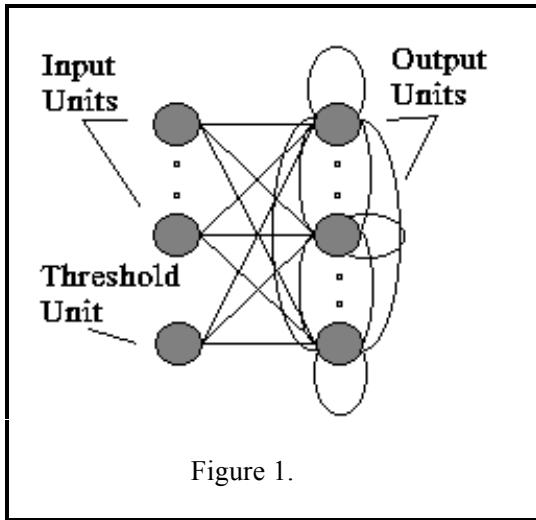
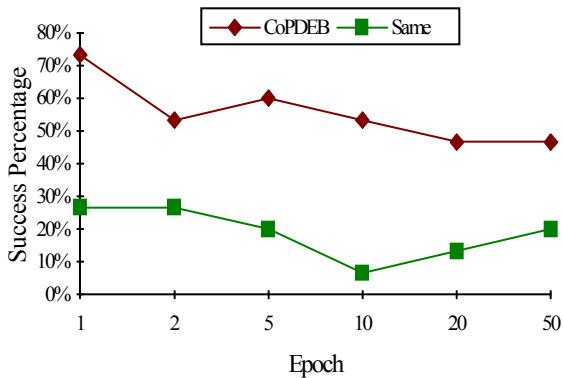
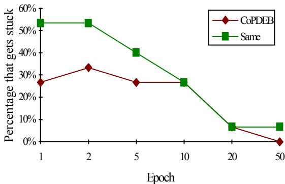
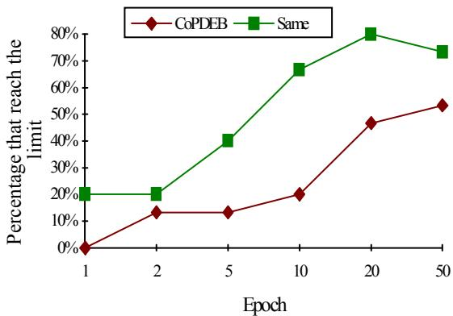
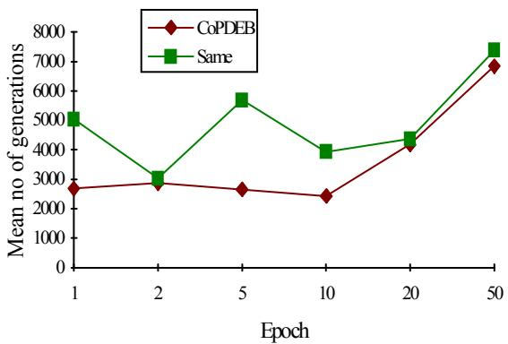

# Co-operating populations with different evolution behaviours

P. Adamidis

Dept. of Electrical & Computer Engineering Aristotle University of Thessaloniki Thessaloniki, Greece adamidis@amphipolis.ee.auth.gr

V. Petridis Dept. of Electrical & Computer Engineering Aristotle University of Thessaloniki Thessaloniki, Greece petridis@vergina.eng.auth.gr

Abstract— Parallel Genetic Algorithms (PGA) offer a natural and productive way to solve a problem better than a single population. Up to now the different PGA paradigms use the same evolution behaviour on each population. This paper proposes a method, called Co-operating Populations with Different Evolution Behaviours (CoPDEB) where the populations are allowed to exhibit different evolution behaviours. This is achieved by using a variety of selection mechanisms, operators, communication methods, and parameters as it is explained in the sequel. This method has been tested on the problem of training a Recurrent Artificial Neural Network (RANN).

# I. INTRODUCTION

Evolutionary optimization methods such as Genetic Algorithms, maintain a population of individuals that evolve according to a set of rules regarding selection, recombination (crossover) and mutation. The population is evolved towards the optimum, concentrating search in those areas of higher fitness (exploitation). Recombination and mutation perturb these individuals providing general heuristics for exploration.

A lot of variations of the basic operators and selection schemes have been proposed, along with other heuristic extensions without leading to a clear statement on how the GA in general should be parameterized and configured. The selection of the appropriate operators and rates, still depends on the demands of the problem and on the user's experience and aesthetic preferences [2], [6], [7]. The method proposed here tries to overcome this problem by using a variety of selection mechanisms, operators, communication methods, and parameters.

The PGA paradigms use the same evolution behaviours on each population [1], whereas the method we propose uses different evolution behaviours to overcome the problem of operator selection. It also tries to improve the exploration and exploitation of the search space. We use a coarsegrained PGA, where a number of populations co-evolve on different processors, each one running a GA with different evolution behaviour. The proposed method is called CoPDEB.

The method is used to train a fully connected RANN as a pattern generator.

# II. CO-OPERATING DIFFERENT EVOLUTIONBEHAVIOURS

Genetic evolution takes place according to a set of rules regarding selection, recombination and mutation. Different evolution behaviour depends on:

a. selection mechanisms such as proportionate selection, tournament selection, ranking selection, and steady state selection.   
b. operators such as crossover and mutation, along with their variations, inversion, hill-climbing, or other problem specific devised operators.   
c. selection mechanisms parameters, such as selection probabilities, tournament size, binary tournament probability, number of reproductive trials, etc.   
d. operator parameters such as mutation rates, crossover probabilities, crossover points, frequency of probability adaptation, etc.   
e. general mechanisms such as elitism, replacement method (e.g. generational, steady state), fitness scaling, fitness windowing, fitness ranking, evolving operators. etc.   
f. general parameters such as population size, string size, etc.

The main idea of CoPDEB is to maintain a number of populations exhibiting different evolution behaviours. Difference in evolution behaviour results by varying characteristics a through f regarding each population.

The exchange of information between the populations allows them to co-operate and exploit promising areas of the search space, found by the other populations, and also reintroduce in the population previously lost genetic material.

When using PGAs, apart from the characteristics defined previously, we have to define the communication methods and parameters.

The CoPDEB is completely specified by defining, apart from the characteristics a through f for each population, the following communication characteristics:

i. Communication methods and techniques, such as processor interconne-ction topology, allocation of populations, migration strategy, etc.   
ii. Communication parameters, such as number of individuals to migrate, and number of generations to exchange individuals (epoch).

We have to point out that the term “epoch”, apart from characterizing an updating process, in the literature of PGAs has a different meaning than that in the literature of Neural Networks.

The algorithm run by each population is as follows: { Initialization Repeat $\{$ Repeat { Elitism (Best survives always) Reproduction of m-1 offsprings } until an_epoch_is_not_completed Send best individual to all other populations Receive best individuals from all other populations } until end_criterion }

In the specific implementation of CoPDEB used in this paper we chose:

a. Roulette wheel parent selection

b. Adaptive multi-point crossover, standard and adaptive mutation, and uniform crossover. In addition an operator called “phenotype mutation” tries to find a better point in the neighborhood of the best genotype only. This operator increases to a great extent the convergence speed of the GA [4]. We also introduce two other operators that handle weights(genes) and not whole strings. They both use one point crossover for each gene separating it into two parts. One of them creates the offspring taking the most significant part from the better parent and the least significant part from the worse. This technique gives new weights with small perturbations of their values in the proximity of the weight value of the better parent. (MSP_LSP operator). The other operator is the reverse of the previous one. It creates the offspring with the least significant part of the best parent and the most significant part of the worse, allowing for small perturbations of the weight values in the proximity of the weight value of the worse parent. (LSP_MSP operator). Different populations use different operators

c. $100 \%$ roulette wheel parent selection d. Different operator parameters for different populations as discussed in section 3. e. Elitism, generational replacement, and adaptive fitness scaling f. 200 individuals for each population with every weight encoded in a 16 bit string. If N is the total number of the trainable weights, then the weight matrix W is encoded to Nx16 bit string.

Therefore in essence different evolution behaviour is the result of different operators and operator parameters for each population.

Each epoch, the populations are allowed to communicate and exchange their best individual. Each population receives only the best individual from all the other populations. These new individuals are accepted in the local population replacing random individuals.

# III. NEURAL NETWORK TRAINING PROBLEM

The model of the fully connected RANN has been presented in [4]. The topology of the RANN is shown in figure 1.

The overall network error at time t is:

$$
\mathrm { J ( t ) = 1 / 2 \sum _ { k } ^ { M } [ d _ { k } ( t ) - y _ { k } ( t ) ] ^ { 2 } }
$$

where $\mathbf { M }$ is the number of units for which there exists a desired target value $\mathrm { d } _ { \mathrm { k } } ( \mathrm { t } )$ for every time step, and $\mathrm { y } _ { \mathrm { k } } ( \mathrm { t } )$ is the output of the $\mathbf { k }$ -th unit at the same time.

The target is to adjust the weight values so that the

total network error

$$
\mathrm { J _ { T } } = \sum _ { \mathrm { t = 1 } } ^ { \mathrm { T } } \mathrm { J ( t ) }
$$

becomes less than a predefined quantity. T is the largest period of the M desired output signals (period of the desired output signal or the presentation time of a temporal sequence)

The CoPDEB was used to train the fully connected RANN to generate two limit cycles, in the form of two sinusoidal functions of different amplitudes and frequencies. The RANN has had 5 neurons (35 trainable weights), two of which were the output units. Different input levels (0.2 and 0.8) had to lead the two output units to different oscillations. The desired outputs were: $\mathrm { y l } { = } 0 . 2 { * } \mathrm { s i n } ( 2 \pi \mathrm { t } / \mathrm { T } )$ and $\mathrm { y } 2 { = } 0 . 8 { * } \mathrm { s i n } ( { \pmb { \pi } } \mathrm { t } / \mathrm { T } )$ respectively

The RANN was trained until its total network error reached a negligible error of 0.003. More on RANN as pattern generators can be found in [5].

# IV. IMPLEMENTATION AND EXPERIMENTAL RESULTS

The training algorithm tries to find the optimum weight vector for the given problem. In order to test the performance of CoPDEB, we have chosen to use some of the characteristics that influence the performance of a PGA.

Eight populations with different evolution behaviours were used. For convenience of reference, the populations are numbered from 1 to 8. For all populations the characteristics a, c, e, f are the same. Their different characteristics are described below:

Population 1: Adaptive crossover probability and mutation rate. Number of crossover points (CP) is equal to the number of trainable weights.   
Population 2: Adaptive mutation rate and probability of MSP_LSP operator.   
Population 3: Adaptive mutation rate and probability of LSP_MSP operator.   
Population 4: Adaptive crossover probability and mutation rate. Two point crossover.   
Population 5: Adaptive crossover probability and mutation rate. CP is equal to half the number of trainable weights.   
Population 6: Adaptive mutation rate and probability of uniform crossover.   
Population 7: Like population 1, but with adaptive parameter probabilities in favour of mutation.   
Population 8: Constant smaller crossover and larger

mutation rates.

The last two populations are used mainly in order to increase exploration of the search space, and also mitigate the problem of premature convergence.

When an epoch is completed each population sends its best individual to the other seven populations, and receives their best (one only).

CoPDEB was implemented on a transputer board. Each population was assigned to one of the available transputers.

The results of CoPDEB method were compared with results of a PGA with populations evolved using identical evolution behaviours and training the same RANN on the same problem. Each identical population evolved using the characteristics of population 1. Communication between populations took place, every time an epoch was completed.

We have performed two sets of experiments for comparison purposes. The first set concerns CoPDEB, and the second concerns a PGA with the same evolution behaviour. Each set comprises 90 experiments, that is 15 experiments for six different epoch values. The epoch values used were: 1, 2, 5, 10, 20, and 50 generations.

The experiments showed an improved performance of CoPDEB over the experiments performed when the same evolution scheme was used by all the populations. The success rate of CoPDEB was, in the worst case, doubled (Fig. 2), that is for epoch value equal to 2 the success percentage for CoPDEB was $5 3 . 3 \%$ , which means that the number of successful experiments was $0 . 5 3 3 \mathrm { x } 1 5 \mathrm { = } 8$ , whereas for the PGA with the same evolution behaviour it was $2 6 . 7 \%$ , which means that the number of successful experiments was $0 . 2 6 7 \mathrm { x } 1 5 { = } 4$ .

Apart from the improvement in the success rate, we’ve also observed that the percentage of the experiments that was stuck at local optima was decreased when using CoPDEB and it was also decreasing as the Epoch value was increasing. Most of the experiments that failed using CoPDEB, was because the generation limit (10000 generations) was reached. In the case of the PGA with the same evolution behaviours, most of the failures were due to getting stuck at local optima. (Figures 3 and 4). Thus we can assume that CoPDEB improves the exploration of the search space.

The number of generations that were required for the RANN to be trained in the case of CoPDEB was also smaller (Fig. 5).

The results from our initial work with CoPDEB have shown it to be capable of improving the performance of the PGA model, achieving speedup and providing better exploration and exploitation of the search space. Many features can still be investigated, such as different selection mechanisms, migration strategy and parameters, population size etc.

# Список литературы

[1] Adamidis P. “Review of Parallel Genetic Algorithms Bibliography”, Internal Tech. Report, Nov. 1994, Automation and Robotics Lab., Dept. of Electrical and Computer Eng., Aristotle University of Thessaloniki, Greece.   
[2] Davis L. “Adapting operator probabilities in genetic algorithms”, in J.D. Schaffer(Ed.), Proceedings of the 3rd Int’l Conf. on Genetic Algorithms, George Mason Univ., June 89, pp.61-69, Morgan Kaufmann Pub., California   
[3] Davis L. (Ed.) “Handbook of genetic algorithms”, Van Norstrand, N York, 1991.   
[4] Petridis V., Kazarlis S., Papaikonomou A., “A Genetic Algorithm for Training Recurrent Neural Networks”, Proc of IJCNN’93, Oct. 1993, Nagoya Japan   
[5] Petridis V., Papaikonomou, “A. Recurrent Neural Networks as Pattern Generators”, Proc. of IEEE Conf. on Computational Intelligence, June 1994, Orlando, USA   
[6] Schaffer J., David R.A., Caruana L.J., Das R., “A study of control parameters affecting online performance of genetic algorithms for function optimization”, in J.D. Schaffer(Ed.), Procs of the 3rd ICGA, June 89, pp.61-69, Morgan Kaufmann Pub.   
[7] Srinivas M., Patnaik L.M. “Adaptive Probabili-ties of Crossover and Mutation in Genetic Algorithms”, IEEE Trans on Systems, Man and Cybernetics, 24 (4), April 1994

  
Fig. 2 Successful experiments

  
Fig. 3 Experiments that were stuck at local optima

  
Fig. 4 Experiments that were stopped by the generation limit

  
Fig. 5 Average number of generations for successful experiments