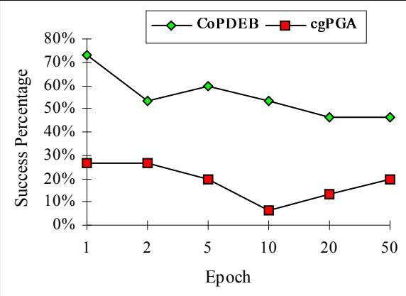
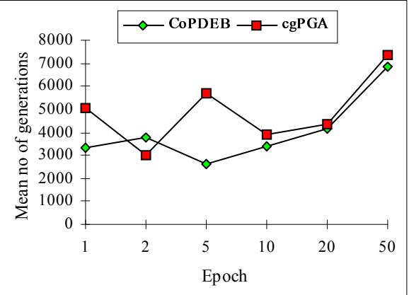
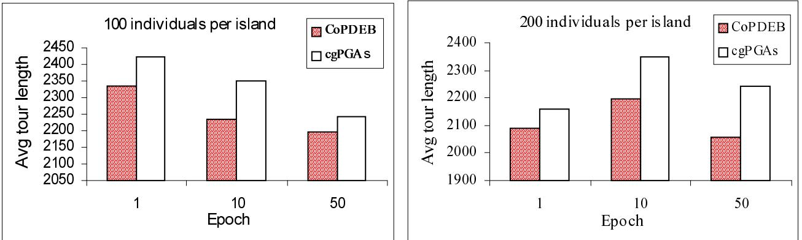
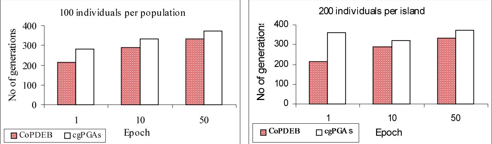
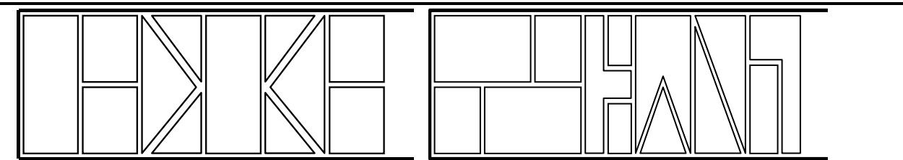

# Advanced Methods for Evolutionary Optimisation

P. Adamidis S. Kazarlis V. Petridis {adamidis,kazarlis}@egnatia.ee.auth.gr petridis@vergina.eng.auth.gr Automation and Robotics Lab., Dept. of Electrical & Computer Eng., Aristotle University of Thessaloniki, Greece

# Abstract

In this paper we present two advanced methods for evolutionary optimisation. One method is based on Parallel Genetic Algorithms. It is called Co-operating Populations with Different Evolution Behaviours (CoPDEB), and allows each population to exhibit a different evolution behaviour. Results from two problems show the advantage of using different evolution behaviour on each population. The other method concerns application of GAs on constrained optimisation problems. It is called the Varying Fitness Function (VFF) method and implements a fitness function with varying penalty terms, added to the objective function for penalising infeasible solutions, in order to assist the GA to easily locate the area of the global optimum. Simulation results on two real world problems show that the VFF method outperforms the classic static fitness function implementations.

# 1. Introduction

Using a serial Genetic Algorithm with a static quality function is a wise decision in a great number of optimisation problems and especially when the problem is not GA-hard, optimisation is off-line and convergence time is not critical. In many cases however, the effectiveness of Genetic Algorithms (GAs), is limited by their ability to balance the need for a diverse set of sampling points with the desire to quickly focus search upon potential solutions. Also, in many problems, there is a number of constraints to be satisfied. Since GAs do not incorporate a mechanism for handling such constraints, one must seek a suitable method for handling these constraints effectively.

Parallel Genetic Algorithms (PGAs) offer a natural and productive way to solve a problem better than a single population. PGAs is the basis of the first method presented in this paper. Up to now the different PGA paradigms use the same evolution behaviour on each population. Here we present a method, called Co-operating Populations with Different Evolution Behaviours (CoPDEB) where the populations are allowed to exhibit different evolution behaviours. This is achieved by using a variety of selection mechanisms, operators, communication methods, and parameters as it is explained in the sequel. Thus, we can integrate a variety of tools, in the same evolutionary engine, which match well the properties of different parts of the search space, improving the exploration and exploitation of the search space, and overcoming the problem of determining the initial configuration of the GA for each subpopulation. CoPDEB was tested on two problems (the problem of training a Recurrent Artificial Neural Network, and the TSP problem), and exhibits significantly increased problem-solving capabilities over PGAs with the same evolution behaviour on each population.

The second method presents an enhancement of GAs applied on constrained optimisation problems and is called the Varying Fitness Function (VFF) method. It is based on the Penalty Assignment method that adds penalty terms to the problem’s objective function for penalising infeasible solutions [8]. According to the VFF method the penalty terms are kept low at the first stages of the search and are increased gradually during the GA evolution. Near the end of the run they rise to appropriately large values in order to separate feasible and infeasible solutions. The varying penalty terms produce a varying fitness function and thus a varying search hypersurface, more simple at the beginning and more complicated at the later stages of the search. This facilitates the GA to locate the area of the global optimum at the first stages of the search and guarantees the convergence on feasible solutions at the end of the evolution. The VFF method is applied on two real world optimisation problems (the Cutting Stock problem and the Unit Commitment problem), and is compared to a GA with a classic static fitness function.

# 2. Co-Operating Populations

# 2.1. Parallel Genetic Algorithms

It is important to distinguish between two approaches to PGAs. The standard or global parallelization, using the PGA as a means of implementing a (sequential or parallel) GA, and the decomposition approach with the PGA as a particular model of a GA [1].

In the first approach, the sequential GA model is implemented on a parallel computer with explicit parallelization of application of genetic operators and evaluation of individuals of a panmictic population. A simple way to do this is to parallelize the loop that creates the next generation from the previous one. Using a distributed memory computer, the communication overhead associated with distributing data structures to processors, and synchronising and collecting the results, grows at the square of population's size. This can minimise any performance improvements due to multiple processors, unless function evaluation (or local search) is a time-consuming process. This type of parallelism can be efficiently implemented on sharedmemory machines.

In a PGA model (decomposition approach), the full population exists in distributed form. There are either multiple independent or interacting subpopulations (coarse-grained), or there is one population with each population member interacting only with a limited set of neighbours (fine-grained). Generally, the processors send each other their best solutions. These communications take place with respect to a spatial structure of the population. According to their spatial structure, the granularity of the distributed population and the manner in which the GA operators are applied, they can be classified in three models: coarse-grained, fine-grained and hybrid models [4][7][12][13][19].

In a coarse-grained PGA (cgPGA), multiple processors run a sequential GA on their population. Processors exchange individuals from their subpopulation with other processors. Isolated subpopulations help maintain genetic diversity. Occasionally, fit individuals migrate randomly from one subpopulation to another (island model). In some implementations migrant individuals may move only to geographically nearby subpopulations (islands), rather than to any arbitrary subpopulation (stepping-stone model).

In a fine-grained PGA (fgPGA) usually one individual is assigned to each processor. Individuals select from, crossover with, and replace only individuals in a bounded region (neighbourhood/deme) , as opposed to global ones. Since neighbourhoods overlap, fit individuals will propagate through the whole population (Diffusion or isolation-by-distance or neighbourhood model).

The hybrid model is a combination of the other models, with some added complexity in some cases.

The coarse-grained model (cgPGA) is actually the most popular model used. PGAs generally, improve the performance of Genetic Algorithms both in terms of speedup and in terms of improving the search quality. These models maintain more diverse subpopulations mitigating the problem of premature convergence. They also naturally fit the model of the way evolution is viewed as occurring, with a large degree of independence in the global population.

# 2.2. Co-operating Populations with Different Evolution Behaviours

Genetic evolution takes place according to a set of rules regarding selection, recombination and mutation. Different evolution behaviour depends on:

a. selection mechanisms such as proportionate selection, tournament selection, ranking selection, and steady state selection   
b. operators such as crossover and mutation, along with their variations, inversion, hill-climbing, or other problem specific devised operators   
c. selection mechanisms parameters, such as selection probabilities, tournament size, binary tournament probability, number of reproductive trials, etc.   
d. operator parameters such as mutation rates, crossover probabilities, crossover points, frequency of probability adaptation, etc.   
e. general mechanisms such as elitism, replacement method (e.g. generational, steady state), fitness scaling, fitness windowing, fitness ranking, evolving operators. etc.

f. general parameters such as population size, string size, etc.

The main idea of CoPDEB is to maintain a number of populations exhibiting different evolution behaviours [2]. Differen in evolution behaviour results by varying characteristics a through f regarding each population.

The exchange of information between the populations allows them to co-operate and exploit promising areas of the search space, found by the other populations, and also reintroduce in the population previously lost genetic material.

When using cgPGAs, apart from the characteristics defined previously, we have to define the communication methods and parameters.

The CoPDEB is completely specified by defining, apart from the characteristics a through f for each population, th following communication characteristics:

i. Communication methods and techniques (processor topology, allocation of populations, migration strategy, etc.)

In order to implement CoPDEB we have chosen:

a. Roulette wheel parent selection on all populations.

b. Adaptive multi-point crossover, standard and adaptive mutation, and uniform crossover. In addition an operator called «phenotype mutation» tries to find a better point in the neighbourhood of the best genotype only. We also introduce two other operators that handle genes and not whole chromosomes. They both use one point crossover for each gene separating it into two parts. One of them creates the offspring taking the most significant part from the better parent and the least significant part from the worse. This technique gives new chromosomes with small perturbations of their values in the proximity of the chromosome value of the better parent. (MSP_LSP operator). The other operator is the reverse of the previous one. It creates the offspring with the least significant part of the best parent and the most significant part of the worse, allowing for small perturbations of the chromosome values in the proximity of the chromosome value of the worse parent. (LSP_MSP operator).

c. $100 \%$ roulette wheel parent selection   
d. Different operator parameters for different populations   
e. Elitism, generational replacement, and adaptive fitness scaling   
f. 50-200 individuals per population. Every chromosome is encoded in a 16 bit string.

Therefore in essence different evolution behaviour is the result of different operators and operator parameters for eac population. In order to test the performance of CoPDEB, we have chosen to use some of the characteristics that influence the performance of a cgPGA. Eight populations with different evolution behaviours were used.

Each epoch, the populations are allowed to communicate and exchange their best individual. Each population receives only the best individual from all the other populations. These new individuals are accepted in the local population replacing random individuals. Even though CoPDEB is based on PGAs, it does not need to be implemented on parallel hardware.

# 2.3. Optimisation Problems - Results

We have performed two sets of experiments for comparison purposes. The first set concerns CoPDEB, and the second concerns a cgPGA with the same evolution behaviour on each population. The following problems were used to test the performance of CoPDEB over cgPGAs.

In the first problem, CoPDEB was used to train a fully connected Recurrent Artificial Neural Network (RANN) to generate two limit cycles, in the form of two sinusoidal functions of different amplitudes and frequencies. The RANN has had 5 neurons (35 trainable weights), two of which were the output units. Different input levels (0.2 and 0.8) had to lead the two output units in different oscillations. The desired outputs were: $\mathrm { y } 1 { = } 0 . 2 ^ { * } \mathrm { s i n } ( 2 \eth \mathrm { t / T } )$ and $\mathrm { y } 2 { = } 0 . 8 ^ { * } \mathrm { s i n } ( \eth \mathrm { t / T } )$ respectively. The RANN was trained until its total network error reached a negligible error of 0.003. More on RANN as pattern generators can be found in [18].

The second problem is the well-known combinatorial Travelling Salesperson Problem (TSP), which involves choosing the optimal tour among a set of cities, visiting each city exactly once and then returning to the start city, where the object is typically to minimise the total distance overall. Data is a set of routes (population); a route might implicitly contain one or more best subroute. The problem is to find an optimum complete route. We have taken a symmetric TSP problem from the TSPLIB, a library of travelling salesperson and related problem instances. We chose a moderate size problem with 29 cities in Bavaria, in order to conduct many experiments for statistical reasons.

In the case of RANN, each set comprises 90 experiments, that is 15 experiments for six different epoch values. The epoch values used were: 1,2,5,10, 20, and 50 generations. The population of each island was 100 individuals. The experiments showed an improved performance of CoPDEB over cgPGAs, both in the success rate (Fig. 1), and in the convergence speed (Fig. 2)

  
Figure 1. Successful experiments (RANN)

  
Figure 2. Average number of generations (RANN).

The second problem (TSP) was used in order to check the superiority of CoPDEB over cgPGAs in combinatorial problems. Epoch values 1, 10 and 50 were tested. The population values used were: 100 and 200 individuals per island. The results are the mean values from 50 runs.

  
Figure 3. Performance of CoPDEB and cgPGAs on the TSP problem

Better performance of CoPDEB over cgPGAs is observed in this problem too. (Figures 3 and 4). We can see that the mean error improves in both paradigms, as the epoch value increases. We’ve also observed that the rate of improvement is faster for smaller populations. On the other hand, it is easier for smaller populations to stuck in local optima. Apart from the improvement in the success rate and the convergence speed, we’ve also observed that the percentage of the experiments that were stuck at local optima was decreased when using CoPDEB and it was also decreasing as the Epoch value was increasing. Most of the experiments that failed using CoPDEB, was because the generation limit was reached. In the case of the cgPGA with the same evolution behaviours, most of the failures were due to getting stuck at local optima. Thus we can assume that CoPDEB improves the exploration of the search space.

  
Figure 4. Average number of generations (TSP)

# 3. The Varying Fitness Function Method

# 3.1. Constrained Optimisation Problems and Genetic Algorithms.

Genetic Algorithms, although they have proven to be powerful global optimisation techniques, they don’t incorporate a mechanism for handling constraints that are encountered in many real world optimisation problems. This deficiency is alleviated by a number of methods proposed in the literature [8] [9][10][11][14][15][16][20][21]. The most important of these methods is the Penalty Assignment method [8].

According to the Penalty Assignment method penalty terms are added to the fitness function that depend on the constraint violation of the specific solution. In this way the invalid solutions are considered as valid but they are penalised according to the degree of violation of the constraints. For a minimisation problem the resulting fitness function is of the form:

$$
{ \mathrm { Q } } ( { \mathrm { S } } ) = { \mathrm { O } } ( { \mathrm { S } } ) + { \mathrm { P } } ( { \mathrm { S } } )
$$

where O(S) is the objective function to be minimised and P(S) is the penalty function that depends on the degree of constraint violation introduced by solution S.

This method is probably the most commonly used method for handling problem constraints with GAs and is implemented in many variations [3][8][9][10][15][16][20][21]. However, it imposes the problem of building a suitable penalty function for the specific problem, based on the violation of the problem’s constraints, that will help the GA to avoid infeasible solutions and converge to a feasible (and hopefully the optimal) one. This problem arises from the fact that high penalty values generally increase the complexity of the fitness function and the resulting search hypersurface, while low penalty values increase the possibility for the GA to converge on an infeasible solution.

# 3.2. The Varying Fitness Function Method.

In order to alleviate the problem of finding a suitable penalty function for every problem, to guarantee the feasibility of the produced solution and make the problem for the GA no harder than it already is, we have introduced a new method : the Varying Fitness Function (VFF) method [10][15][16].

According to this method the penalty terms are kept low at the beginning of the GA evolution in order to simplify the search and give the GA the opportunity to explore the search space more efficiently. As the evolution proceeds the penalty terms increase with the generation index, so that at the end of the run they reach appropriately large values, which result in the separation of feasible and infeasible solutions. This technique makes it easier for the GA to locate the general area of the global optimum, at the early stages of the search. As the search proceeds, the penalty terms increase and the GA adapts to the changing search hypersurface. Near the end of the run, when the penalty terms reach their appropriately large values, the final search hypersurface is formed, preventing thus the GA from converging to infeasible solutions. A VFF could be of the form :

$$
\mathrm { Q _ { v } ( S , g ) = O ( S ) + P _ { v } ( S , g ) }
$$

where $\mathbf { g }$ is the generation index, O(S) is the objective function to be minimised and $\mathrm { P _ { v } } ( \mathrm { S } , \mathrm { g } )$ is the penalty function that depends on the degree of constraint violation introduced by solution S and the generation index $\mathbf { g }$ .

For a problem with a number of nc constraints the penalty term $\mathrm { P _ { v } } ( \mathrm { S } , \mathrm { g } )$ could be of the form :

$$
\mathrm { P _ { v } ( S , g ) = V ( g ) \cdot ( \stackrel { \cdot } { A } \cdot \stackrel { \overleftarrow { \big O } } ( \ddot { a } _ { i } \cdot w _ { i } \cdot \ddot { O } _ { i } ( d _ { i } ( S ) \big ) ) + \hat { A } ) \cdot \ddot { a } s } 
$$

where $\mathrm { V } ( { \bf g } )$ is a monotonically increasing function of $\mathbf { g } ,$ , A is a «severity» factor, nc is the number of the problem constraints, $\ddot { \bf { a } } _ { \mathrm { { i } } }$ is a binary factor $\ddot { \mathsf { a } } _ { \mathrm { i } } = 1$ if constraint i is violated and ${ \ddot { \mathsf { a } } } _ { \mathrm { i } } = 0$ otherwise), $\mathbf { W } _ { \mathrm { i } }$ is a «weight» factor for constraint i, $\mathrm { d _ { i } } ( \mathrm { S } )$ is a measure of the degree of violation of constraint i introduced by S, $\ddot { \mathrm { { O } _ { \mathrm { i } } ( . ) } }$ is a function of this measure, $\mathrm { B }$ is a penalty threshold factor and ${ \ddot { \mathsf { a } } } _ { \mathrm { S } }$ is a binary factor $\mathrm { \ddot { a } s } = 1$ if S is infeasible and ${ \ddot { \mathsf { a } } } _ { \mathrm { S } } = 0$ otherwise).

A simple form for $\mathrm { V } ( { \bf g } )$ is the linear function : $\mathrm { V } ( \mathbf { g } ) = \mathbf { g } / \mathrm { G }$ , where $\mathrm { G }$ is the generation limit.

# 3.3. Applications of GAs with the VFF method.

In order to examine the efficiency of the VFF method we have applied it on a number of real world GA-hard optimisation problems. Two of them (the Cutting Stock and the Unit Commitment problems) are presented in this paper in the following paragraphs :

The Cutting Stock problem [5][15] consists in cutting a number of given shapes (to be referred to in the sequel as shapes) out of a large piece of material (the stock material), with standard dimensions, so as to minimise the material waste. In this paper we consider two two-dimensional cutting stock problems with 12 and 13 shapes respectively and a stock material of width W and infinite length. An optimum solution of each problem is shown in Figure 5. For simplicity reasons, rotation of the shapes, in any angle, is not allowed. As "material waste" we define the area of material not covered by the shapes, within the bounds of the smallest rectangle that contains the shapes (bounding rectangle). The constraint imposed on these problems is that no overlapping of shapes is allowed.

  
Figure 5. Optimum solutions of the 12-shape and the 13-shape Cutting Stock Problems.

A solution can be generally described by $_ \mathrm { N }$ pairs of shape coordinates $( \mathrm { X } _ { \mathrm { i } } , \ \mathrm { Y } _ { \mathrm { i } } ) \ \mathrm { i } { = } 1 . . \mathrm { N }$ which represent a specific cutting pattern. A 10-bit integer is used to encode a single coordinate, resulting in a genotype string of 2⋅10⋅N bits in length. For example, for the 13 shape problem the resulting search space contains $2 ^ { 2 6 0 }$ or $1 . 8 5 2 { \cdot } 1 0 ^ { 7 8 }$ different solutions.

The VFF used on this problem is of the form :

$$
\mathrm { { Q } ( S , g ) = \mathrm { { O } ( S ) + \small { \cfrac { g } { G } \ddots ( A \cdot \stackrel { N - 1 } { \big O } { \big O } { \big O } _ { \mathrm { { O A } _ { i j } + \mathrm { { \scriptsize ~ B } _ { \mathrm { { \scriptsize ~ i } } } } } } } } } 
$$

where O(S) is the objective function depending on material waste, and $\mathrm { O A _ { i j } ^ { . } }$ is the overlapping area between shapes i and j, which serves as the measure of constraint violation. The corresponding Static Fitness Function (SFF) is produced from eq. 5 by omitting the varying factor $\mathbf { g } / \mathbf { G }$ .

The specific GA implementation used the Roulette Wheel parent selection mechanism, multi-point crossover, bit mutation, total generational replacement, Elitism, Fitness scaling, adaptation of operator probabilities, and a number of problem specific operators including hill climbing operators.

Table I. Simulation results of the VFF GA and the SFF GA on the Cutting Stock Problem.   

<table><tr><td rowspan=1 colspan=1>Results over 20 runs</td><td rowspan=1 colspan=2>Problem 1 (12 shapes)</td><td rowspan=1 colspan=2>Problem 2 (13 shapes)</td></tr><tr><td rowspan=1 colspan=1></td><td rowspan=1 colspan=1>Static FitnessFunction GA</td><td rowspan=1 colspan=1>VFF GA</td><td rowspan=1 colspan=1>Static FitnessFunction GA</td><td rowspan=1 colspan=1>VFF GA</td></tr><tr><td rowspan=1 colspan=1>Success</td><td rowspan=1 colspan=1>60 %</td><td rowspan=1 colspan=1>90 %</td><td rowspan=1 colspan=1>0 %</td><td rowspan=1 colspan=1>30 %</td></tr><tr><td rowspan=1 colspan=1>Average time</td><td rowspan=1 colspan=1>335.2 sec.</td><td rowspan=1 colspan=1>335.3 sec.</td><td rowspan=1 colspan=1>401.14 sec.</td><td rowspan=1 colspan=1>402.7 sec.</td></tr></table>

The GA used a population of 100 genotypes and run for 300 generations. Simulation results were performed for both the SFF GA and the VFF GA. Twenty runs have been performed for each algorithm and problem. The results are shown in Table I.

As shown in Table I the VFF GA outperforms its static counterpart, with respect to the success percentage, on both problems while requiring the same CPU time.The second problem is the Unit Commitment (UC) problem. The UC problem in a power system is the determination of the start-up and shut down schedules of thermal units, to meet forecasted demand over a future short term (24-168 hour) period [10][16][22]. The objective is to minimise total production cost of the operating units while satisfying a large set of operating constraints. The UC problem is a complex mathematical optimisation problem with both integer and continuous variables. The exact solution to the problem can be obtained by complete enumeration, which cannot be applied to realistic power systems due to combinatorial explosion [22]. The constraints are : (a) System power balance (demand plus losses plus exports), (b) System reserve requirements, (c) Unit initial conditions, (d) Unit high and low MegaWatt (MW) limits (economic / operating), (e) Unit minimum up-time, (f) Unit minimum down-time, (g) Unit status restrictions (must - run, fixed - MW, unavailable, available), (h) Unit or Plant fuel availability and (i) Plant crew constraints. In this implementation we have considered constrains (a)-(f).

If N represents the number of units and $\mathrm { H }$ the number of hours of the scheduling period, an H-bit string is required to describe the operation schedule of a single unit, since at every hour a unit can be either on or off (1 or 0). By concatenating the N unit strings, a N⋅H bit genotype string is formed.

The resulting search space is vast. For example, for a 20-unit system and 24-hour scheduling period the genotype strings are $2 0 { \cdot } 2 4 { = } 4 8 0$ bits long resulting in a search space of $2 ^ { 4 8 0 } = 3 . 1 2 \cdot 1 0 ^ { 1 4 4 }$ different solutions.

The VFF used on this problem is of the form :

$$
\mathrm { Q } _ { \mathrm { v } } ( \mathrm { S } , \mathrm { g } ) = \mathrm { f c } ( \mathrm { S } ) + \mathrm { s u } ( \mathrm { S } ) + \mathrm { s d } ( \mathrm { S } ) + \cfrac { \mathrm { ~ g ~ H ~ } } { \mathrm { ~ G ~ } } ( \mathrm { \Lambda } \mathrm { A } \cdot ( \dot { \hat { \bigcup } } ( \mathrm { \mathrm { d } } _ { \mathrm { p b } } \mathrm { t } ) + \mathrm { d } _ { \mathrm { m u } } + \mathrm { d } _ { \mathrm { m d } } ) + \mathrm { B } )
$$

where fc(S) is the total fuel cost, su(S) is the sum of the units’ start-up costs, $\operatorname { s d } ( \mathbf { S } )$ is the sum of the units’ shut-down costs, ${ \mathrm { d } _ { p b } } ^ { \mathrm { ~ t ~ } }$ is a measure of the violation of the power balance constraint at hour t, ${ \mathrm { { d } } _ { \mathrm { { m u } } } }$ and $\mathrm { d } _ { \mathrm { m d } }$ are measures of the violation of the minimum up-time constraint and the minimum down-time constraint respectively for all units over the whole schedule. The corresponding Static Fitness Function (SFF) is produced from eq. 6 by omitting the varying factor $\mathbf { g } / \mathbf { G }$ .

The specific GA implementation used the Roulette Wheel parent selection mechanism, multi-point crossover, bit mutation, total generational replacement, Elitism, Fitness scaling, adaptation of operator probabilities, and a number of problem specific operators including hill climbing operators. The GA used a population of 50 genotypes at all runs. Simulations were performed for two UC problems : a 10-unit problem and a 20-unit problem. A base set of 10 units was initially chosen along with a 24-hour demand schedule. This set as well as the demand schedule is shown in Table II. For the 20-unit problem the units were duplicated and the demand values were doubled.

Table II. The problem data for the 10-unit base Unit Commitment problem.   

<table><tr><td rowspan=1 colspan=1>Unit</td><td rowspan=1 colspan=1>Pmax(MW)</td><td rowspan=1 colspan=1>Pmin(MW)</td><td rowspan=1 colspan=1>c($)</td><td rowspan=1 colspan=1>c2($/MWh)</td><td rowspan=1 colspan=1>3($/MW2-h)</td><td rowspan=1 colspan=1>min uptime (h)</td><td rowspan=1 colspan=1>min downtime (h)</td><td rowspan=1 colspan=1>start -upcost ($)</td><td rowspan=1 colspan=1>initialstatus (h)</td></tr><tr><td rowspan=1 colspan=1>1</td><td rowspan=1 colspan=1>455</td><td rowspan=1 colspan=1>150</td><td rowspan=1 colspan=1>1000</td><td rowspan=1 colspan=1>16.19</td><td rowspan=1 colspan=1>0.00048</td><td rowspan=1 colspan=1>8</td><td rowspan=1 colspan=1>8</td><td rowspan=1 colspan=1>9000</td><td rowspan=1 colspan=1>8</td></tr><tr><td rowspan=1 colspan=1>2</td><td rowspan=1 colspan=1>455</td><td rowspan=1 colspan=1>150</td><td rowspan=1 colspan=1>970</td><td rowspan=1 colspan=1>17.26</td><td rowspan=1 colspan=1>0.00031</td><td rowspan=1 colspan=1>8</td><td rowspan=1 colspan=1>8</td><td rowspan=1 colspan=1>10000</td><td rowspan=1 colspan=1>8</td></tr><tr><td rowspan=1 colspan=1>3</td><td rowspan=1 colspan=1>130</td><td rowspan=1 colspan=1>20</td><td rowspan=1 colspan=1>700</td><td rowspan=1 colspan=1>16.60</td><td rowspan=1 colspan=1>0.00200</td><td rowspan=1 colspan=1>5</td><td rowspan=1 colspan=1>5</td><td rowspan=1 colspan=1>1100</td><td rowspan=1 colspan=1>-5</td></tr><tr><td rowspan=1 colspan=1>4</td><td rowspan=1 colspan=1>130</td><td rowspan=1 colspan=1>20</td><td rowspan=1 colspan=1>680</td><td rowspan=1 colspan=1>16.50</td><td rowspan=1 colspan=1>0.00211</td><td rowspan=1 colspan=1>5</td><td rowspan=1 colspan=1>5</td><td rowspan=1 colspan=1>1120</td><td rowspan=1 colspan=1>-5</td></tr><tr><td rowspan=1 colspan=1>5</td><td rowspan=1 colspan=1>162</td><td rowspan=1 colspan=1>25</td><td rowspan=1 colspan=1>450</td><td rowspan=1 colspan=1>19.70</td><td rowspan=1 colspan=1>0.00398</td><td rowspan=1 colspan=1>6</td><td rowspan=1 colspan=1>6</td><td rowspan=1 colspan=1>1800</td><td rowspan=1 colspan=1>-6</td></tr><tr><td rowspan=1 colspan=1>6</td><td rowspan=1 colspan=1>80</td><td rowspan=1 colspan=1>20</td><td rowspan=1 colspan=1>370</td><td rowspan=1 colspan=1>22.26</td><td rowspan=1 colspan=1>0.00712</td><td rowspan=1 colspan=1>3</td><td rowspan=1 colspan=1>3</td><td rowspan=1 colspan=1>340</td><td rowspan=1 colspan=1>-3</td></tr><tr><td rowspan=1 colspan=1>7</td><td rowspan=1 colspan=1>85</td><td rowspan=1 colspan=1>25</td><td rowspan=1 colspan=1>480</td><td rowspan=1 colspan=1>27.74</td><td rowspan=1 colspan=1>0.00079</td><td rowspan=1 colspan=1>3</td><td rowspan=1 colspan=1>3</td><td rowspan=1 colspan=1>520</td><td rowspan=1 colspan=1>-3</td></tr><tr><td rowspan=1 colspan=1>8</td><td rowspan=1 colspan=1>55</td><td rowspan=1 colspan=1>55</td><td rowspan=1 colspan=1>660</td><td rowspan=1 colspan=1>25.92</td><td rowspan=1 colspan=1>0.00413</td><td rowspan=1 colspan=1>1</td><td rowspan=1 colspan=1>1</td><td rowspan=1 colspan=1>60</td><td rowspan=1 colspan=1>-1</td></tr><tr><td rowspan=1 colspan=1>9</td><td rowspan=1 colspan=1>55</td><td rowspan=1 colspan=1>55</td><td rowspan=1 colspan=1>665</td><td rowspan=1 colspan=1>27.27</td><td rowspan=1 colspan=1>0.00222</td><td rowspan=1 colspan=1>1</td><td rowspan=1 colspan=1>1</td><td rowspan=1 colspan=1>60</td><td rowspan=1 colspan=1>-1</td></tr><tr><td rowspan=1 colspan=1>10</td><td rowspan=1 colspan=1>55</td><td rowspan=1 colspan=1>55</td><td rowspan=1 colspan=1>670</td><td rowspan=1 colspan=1>27.79</td><td rowspan=1 colspan=1>0.00173</td><td rowspan=1 colspan=1>1</td><td rowspan=1 colspan=1>1</td><td rowspan=1 colspan=1>60</td><td rowspan=1 colspan=1>-1</td></tr></table>

(Table II continues)   

<table><tr><td rowspan=1 colspan=1>Hour</td><td rowspan=1 colspan=1>1</td><td rowspan=1 colspan=1>2</td><td rowspan=1 colspan=1>3</td><td rowspan=1 colspan=1>4</td><td rowspan=1 colspan=1>5</td><td rowspan=1 colspan=1>6</td><td rowspan=1 colspan=1>7</td><td rowspan=1 colspan=1>8</td><td rowspan=1 colspan=1>9</td><td rowspan=1 colspan=1>10</td><td rowspan=1 colspan=1>11</td><td rowspan=1 colspan=1>12</td></tr><tr><td rowspan=1 colspan=1>Demand</td><td rowspan=1 colspan=1>800</td><td rowspan=1 colspan=1>850</td><td rowspan=1 colspan=1>950</td><td rowspan=1 colspan=1>1050</td><td rowspan=1 colspan=1>1100</td><td rowspan=1 colspan=1>1200</td><td rowspan=1 colspan=1>1250</td><td rowspan=1 colspan=1>1300</td><td rowspan=1 colspan=1>1400</td><td rowspan=1 colspan=1>1500</td><td rowspan=1 colspan=1>1550</td><td rowspan=1 colspan=1>1600</td></tr><tr><td rowspan=1 colspan=1>Hour</td><td rowspan=1 colspan=1>13</td><td rowspan=1 colspan=1>14</td><td rowspan=1 colspan=1>15</td><td rowspan=1 colspan=1>16</td><td rowspan=1 colspan=1>17</td><td rowspan=1 colspan=1>18</td><td rowspan=1 colspan=1>19</td><td rowspan=1 colspan=1>20</td><td rowspan=1 colspan=1>21</td><td rowspan=1 colspan=1>22</td><td rowspan=1 colspan=1>23</td><td rowspan=1 colspan=1>24</td></tr><tr><td rowspan=1 colspan=1>Demand</td><td rowspan=1 colspan=1>1500</td><td rowspan=1 colspan=1>1400</td><td rowspan=1 colspan=1>1300</td><td rowspan=1 colspan=1>1150</td><td rowspan=1 colspan=1>1100</td><td rowspan=1 colspan=1>1200</td><td rowspan=1 colspan=1>1300</td><td rowspan=1 colspan=1>1500</td><td rowspan=1 colspan=1>1400</td><td rowspan=1 colspan=1>1200</td><td rowspan=1 colspan=1>1000</td><td rowspan=1 colspan=1>900</td></tr></table>

Parameters c1, c2 and c3 are fuel cost function coefficients $( \mathrm { f c } { = } \mathbf { c } _ { 1 } { + } \mathbf { c } _ { 2 } \mathbf { P } { + } \mathbf { c } _ { 3 } \mathbf { P } ^ { 2 }$ where $\mathrm { P }$ is the unit’s output). The start-up cost is considered as a fixed amount per start-up and the shutdown cost is considered equal to 0 for every unit. The «initial status» figure, if it is positive, indicates the number of hours the unit is already up, and if it is negative, indicates the number of hours the unit has been already down. In all cases the reserve was assumed to be $10 \%$ of the demand. For the 10-unit problem the GA has run for 500 generations and for the 20-unit problem for 750 generations. Twenty runs have been performed for each algorithm and problem and the results are shown in Table III.

Table III. Simulation results of the SFF GA and the VFF GA on the Unit Commitment problem.   

<table><tr><td rowspan=1 colspan=1>Results over 20 runs</td><td rowspan=1 colspan=2>10-unit problem</td><td rowspan=1 colspan=2>20-unit problem</td></tr><tr><td rowspan=1 colspan=1></td><td rowspan=1 colspan=1>SFF GA</td><td rowspan=1 colspan=1>VFF GA</td><td rowspan=1 colspan=1>SFF GA</td><td rowspan=1 colspan=1>VFF GA</td></tr><tr><td rowspan=1 colspan=1>Est.optimum ($)</td><td rowspan=1 colspan=2>610646.5</td><td rowspan=1 colspan=2>1221293</td></tr><tr><td rowspan=1 colspan=1>Success</td><td rowspan=1 colspan=1>0 %</td><td rowspan=1 colspan=1>65 %</td><td rowspan=1 colspan=1>40 %</td><td rowspan=1 colspan=1>80 %</td></tr><tr><td rowspan=1 colspan=1>Best Quality ($)</td><td rowspan=1 colspan=1>611758.1</td><td rowspan=1 colspan=1>610646.5</td><td rowspan=1 colspan=1>1219314</td><td rowspan=1 colspan=1>1218922</td></tr><tr><td rowspan=1 colspan=1>Worst Qual..($)</td><td rowspan=1 colspan=1>615199.9</td><td rowspan=1 colspan=1>612326.6</td><td rowspan=1 colspan=1>1226840</td><td rowspan=1 colspan=1>1223426</td></tr><tr><td rowspan=1 colspan=1>Dispersion</td><td rowspan=1 colspan=1>0.56 %</td><td rowspan=1 colspan=1>0.27 %</td><td rowspan=1 colspan=1>0.62 %</td><td rowspan=1 colspan=1>0.37 %</td></tr><tr><td rowspan=1 colspan=1>Averagee Time (sec)</td><td rowspan=1 colspan=1>262</td><td rowspan=1 colspan=1>258</td><td rowspan=1 colspan=1>633</td><td rowspan=1 colspan=1>626</td></tr></table>

In Table III, both the best and worst GA solutions are reported together with their difference as a percentage of the best solution (dispersion). The «Estimated Optimum» was calculated by a Lagrangian Relaxation method that was also implemented. From Table III it is evident that the VFF GA clearly outperforms the SFF GA regarding the success percentage in finding the optimum without needing more computation time.

# 4. Discussion

Genetic Algorithms have progressed from childhood to maturity during the past decades exhibiting a vast number of successful applications on real-world hard optimisation problems. Together with the GA’s basic principles, a number of advanced methods have also been developed to further assist the GAs in attacking hard real-world optimisation problems. Two of these methods have been presented in this paper : the CoPDEB method and the VFF method. The first enhances the performance of PGAs by introducing a different evolution behaviour on each subpopulation and also overcomes the problem of choosing the appropriate initial settings for each sub-population. The second method is applicable on constrained optimisation problems and assists the GA to avoid infeasible solution and locate the area of the global optimum more easily.

Such methods enhance the performance of Genetic Algorithms making them competitive in comparison with other traditional and field-specific optimisation methods and thus, open new horizons for the successful application of GAs on more real-world optimisation problems. Simultaneously they reveal new aspects and potentials of the evolutionary algorithms and new possibilities for the successful application of GAs in a wider range of problems.

# Список литературы

[1] P. Adamidis, Review of Parallel Genetic Algorithms Bibliography, Internal Tech. Report, Nov. 1994, Automation and Robotics Lab., Dept. of Electrical and Computer Eng., Aristotle University of Thessaloniki, Greece.   
[2] P. Adamidis & V. Petridis, Co-operating Populations with Different Evolution Behavior, Proceedings of 1996 IEEE International Conference on Evolutionary Computation (ICEC ’96), Nagoya, Japan, May 1996, pp. 188-191   
[3] A. Bakirtzis, V. Petridis, S. Kazarlis, «A Genetic Algorithm Solution to the Economic Dispatch Problem,» IEE Proceedings - Generation, Transmission, Distribution, Vol. 141, No. 4, July 1994, pp. 377-382.   
[4] T.C. Belding, The Distributed Genetic Algorithm Revisited, in D. Eshelman (Ed.) Procceedings of the Sixth International Conference on Genetic Algorithms, 1995   
[5] A. R. Brown, Optimum packing and Depletion, American Elsevier Inc., 1971, New York.   
[6] L. Davis (ed.) Handbook of Genetic Algorithms, Van Nostrand, N.York, 1991.   
[7] M. Dorigo, & V. Maniezzo, Parallel Genetic Algorithms: Introduction and Overview of Current Research, in J. Stender (Ed.), Parallel Genetic Algorithms: Theory and Applications, Brainware GmbH, Berlin: IOS Press, 1993, pp.5-42   
[8] D.E. Goldberg, Genetic Algorithms in Search, Optimisation and Machine Learning, Reading, MA: Addison Wesley, 1989.   
[9] J. A. Joines and C. R. Houck, «On the Use of Non-Stationary Penalty Functions to Solve Nonlinear Constrained Optimisation Problems with GA’s,» in Proceedings of the First IEEE Conference on Evolutionary Computation, IEEE Service Center, 1994, pp. 579-584.   
[10] S.A. Kazarlis, A.G. Bakirtzis, V. Petridis, «A Genetic Algorithm Solution to the Unit Commitment Problem,» IEEE Transactions on Power Systems, Vol. 11, No. 1, February 1996, pp. 83-92.   
[11] Z. Michalewicz and G. Nazhiyath, «Genocop III: A Co-evolutionary Algorithm for Numerical Optimisation Problems with Nonlinear Constraints,» in Proceedings of the $2 ^ { \mathrm { n d } }$ IEEE International Conference on Evolutionary Computation, Vol. 2, Perth-Australia, 29 Nov. - 1 Dec. 1995, pp. 647-651.   
[12] H. Mühlenbein, Evolution in Time and Space - The Parallel Genetic Algorithm, in G.E. Rawlins (Ed.), Foundations of Genetic Algorithms, pp.316-337.   
[13] H. Mühlenbein et al, The Parallel Genetic Algorithm as Function Optimizer, Parallel Computing 17, 619-632.   
[14] D. Orvosh, L. Davis, «Using a Genetic Algorithm to Optimize Problems with Feasibility Constraints,» in Proceedings of the First IEEE Conference on Evolutionary Computation, IEEE Service Center, 1994, pp. 548-553.   
[15] V. Petridis and S. Kazarlis, «Varying Quality Function in Genetic Algorithms and the Cutting Problem,» in Proceedings of the First IEEE Conference on Evolutionary Computation, IEEE Service Center, 1994, Vol. 1, pp. 166-169.   
[16] V. Petridis, S. Kazarlis and A. Bakirtzis, «Varying Fitness Functions in Genetic Algorithm Constrained Optimisation: The Cutting Stock and Unit Commitment Problems,» accepted for publication at the IEEE Transactions on Systems, Man, and Cybernetics, Vol 28 Part B No 5 issue of October 1998.   
[17] V. Petridis, S. Kazarlis & A. Papaikonomou, A Genetic Algorithm for Training Recurrent Neural Networks, in Proceedings of International Joint Conference on Neural Networks, Nagoya Japan, Oct. 1993, pp.2706-2709   
[18] Petridis V., Papaikonomou A. Recurrent Neural Networks as Pattern Generators, in Proceedings of IEEE Conf. on Computational Intelligence (Evolutionary Computation), June 1994, Orlando, USA   
[19] R. Shonkwiler, Parallel Genetic Algorithms, in S. Forrest (Ed.), Proceedings of the Fifth International Conference on Genetic Algorithms, San Mateo, CA: Morgan Kaufmann, 1993, pp.199-205   
[20] W. Siedlecki and J. Sklanski, «Constrained Genetic Optimisation via Dynamic Reward-Penalty Balancing and its Use in Pattern Recognition,» in Proceedings of the Third International Conference on Genetic Algorithms, J.D. Schaffer, Ed. San Mateo, CA: Morgan Kaufmann, June 1989, pp. 141-150.   
[21] A. E. Smith and D. M. Tate, «Genetic Optimisation Using A Penalty Function,» in Proceedings of the Fifth International Conference on Genetic Algorithms, S. Forrest, Ed. Los Altos, CA: Morgan Kaufmann, 1993, pp. 499-505.   
[22] A.J. Wood and B.F. Wollenberg, Power Generation Operation and Control, 1984, John Wiley, New York.