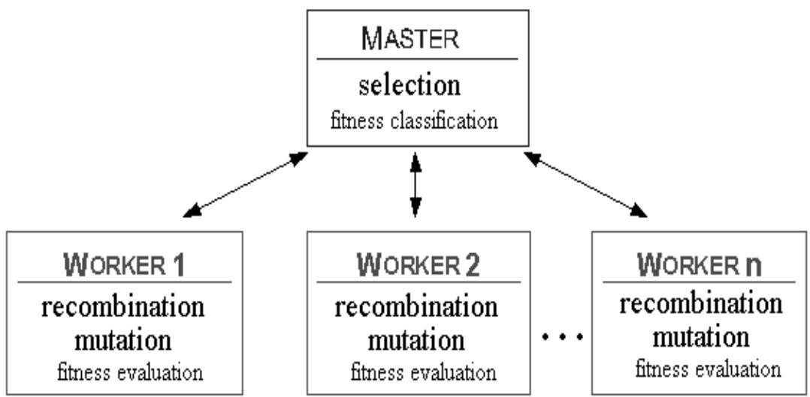

# PARALLEL EVOLUTIONARY ALGORITHMS: A REVIEW

Panagiotis Adamidis   
Dept. of Applied Informatics,   
University of Macedonia,   
Egnatias 156, Thessaloniki, Greece GR-540 06   
Email: adamidis@uom.gr

# Abstract

During recent years the area of Evolutionary Algorithms (EAs) in general and the field of Parallel Evolutionary Algorithms (PEA) in particular has matured up to a point, where the application to a complex real-world problem in some applied science is now potentially feasible and to the benefit of both fields. The availability of faster and cheaper parallel computers makes it possible to apply EAs to large populations and very complex populations. This paper presents a review of current implementation techniques for EAs on parallel hardware.

# 1. Introduction

Evolutionary Algorithms (EAs) are stochastic search and optimization techniques which were inspired by the analogy of evolution and population genetics. They have been demonstrated to be effective and robust in searching very large, varied, spaces in a wide range of applications [14].

During recent years the area of Evolutionary Algorithms in general and the field of Parallel Evolutionary Algorithms (PEAs) in particular has matured up to a point, where the application to a complex real-world problem in some applied science is now potentially feasible and to the benefit of both fields.

The effectiveness of EAs, is limited by their ability to balance the need for a diverse set of sampling points with the desire to quickly focus search upon potential solutions. Due to increasing demands such as searching large search spaces with costly evaluation functions and using large population sizes, there is an ever growing need for fast implementations to allow quick and flexible experimentation. Most EAs work with one large panmictic population. Those EAs suffer from the problem that natural selection relies on the fitness distribution over the whole population. Parallel processing is the natural route to explore. Furthermore, some of the difficulties that face standard EAs (such as premature convergence, and searching multimodal spaces) may be less of a problem for parallel variants.

This paper presents a classification of current PEAs implementation techniques. It is important to distinguish between two approaches to PEAs. The standard parallel approach, using the PEA as a means of implementing a sequential or parallel EA, and the decomposition approach with the PEA as a particular model of an EA [21, 36].

# 2. Evolutionary Algorithms

Evolutionary Algorithms is an interdisciplinary research field with a relationship to biology, Artificial Intelligence, numerical optimization and decision support in almoast any engineering discipline. EAs are based on models of organic evolution. They maintain a population of individuals that evolves over time and ultimately converges to a unique solution. Each individual represents not only a search point in the space of potential solutions to a given problem, but also may be a temporal container of current knowledge about the “laws” of the environment [5].

The starting population is encoded and initialised by an algorithm-dependent method. Each individual has a numeric fitness value that measures how well the parameters encoded in it solve the problem. The population evolves towards successively better regions of the search space by means of recombination, mutation and selection. The selection algorithm ensures that better individuals have a higher probability to survive and reproduce more often than other individuals. The recombination mechanism allows for mixing of parental information while passing it to their descendants, and mutation introduces innovation into the population. This process is currently used by the following basic variants of EAs:

Genetic Algorithms (Holland, 1975).The individuals of the population in a GA are usually represented as fixed length binary strings but there are GAs that use strings from higher cardinality alphabetsand with variable length. Recombination (crossover) is the primary operator and mutation is considered as a secondary search operator.

Evolution Strategies (Rechenberg and Schwefel, 1973). Initially ES used selection and mutation on one individual only. Recombination and larger populations were introduced later. Real value representation is usually used. Mutation is the primary operator.

Evolutionary Programming (Fogel, 1966). EP uses problem oriented representation. Mutation is the primary operator and depends on the representation used. It is usually adaptive. Recombination is rarely used.

# 3. Categorization of Parallel Evolutionary Algorithms

In this section, a categorization of PEAs is presented based on the two basic approaches mentioned before, namely the standard parallel approach, and the decomposition approach. The classification presented is similar to other classifications [3, 8, 15, 22].

In the first approach, the sequential EA model is implemented on a parallel computer. This is usually done by dividing the task of evaluating the population among several processors.

In a PEA model, the full population exists in distributed form. Either multiple independent or interacting subpopulations exist (coarse-grained or distributed EA), or there is only one population with each population member interacting only with a limited set of neighbors (fine-grained EA). The interaction between populations, or members of a population, take place with respect to a spatial structure of the population. The PEAs are classified according to this spatial structure, the granularity of the distributed population, and the manner in which the EA operators are applied.

In a coarse-grained PEA, the population is divided into several (usually equal) subpopulations, each of which runs an EA independently and in parallel on its own subpopulation. Occasionally, fit individuals migrate randomly from one subpopulation to another (island model). In some implementations migrant individuals may move only to geographically nearby subpopulations (islands), rather than to any arbitrary subpopulation (stepping-stone model).

In a fine-grained PEA, the population is divided so that each individual is assigned to one processor. Individuals select from, crossover with, and replace only individuals in a bounded region (neighborhood/deme). Since neighborhoods overlap, fit individuals will propagate through the whole population (Diffusion or isolation-by-distance or neighborhood model).

The final method to parallelize EAs uses some combination of the previous methods, with some added complexity in some cases.

These models maintain more diverse subpopulations mitigating the problem of premature convergence. They also naturally fit the model of the way evolution is viewed as occurring, with a large degree of independence in the global population. Parallel EAs based on Subpopulation Modelling can even be considered as creating new paradigms within this area and thus establishing a new and promising field of research.

# 4. Standard Parallel Approach

Also refered to as global parallelization. This method maintains a single population and the evaluation of the individuals and/or the application of genetic operators are done in parallel. A simple way to do this is to parallelize the loop that creates the next generation from the previous one. Most of the steps in this loop (evaluation, crossover, mutation, and, if used, local search) can be executed in parallel. The selection step, depending on the selection algorithm and the problem solved, usually requires a global ranking that can be a parallel bottleneck.

A single master processor supervises the total population and does the selection. Slave-processors receive individuals that are recombined to create offsprings (Fig. 1). These offsprings have to be evaluated before they are returned to the master [1, 2, 13].

  
Figure 1. Schematic representation of standard parallel approach

The algorithm is synchronous, when the master waits to receive the fitness values for all the population before proceeding to next generation. Eventhough most global parallel EA implementations are synchronous, it is possible to implement asynchronous global PEAs, where the master does not stop to wait for any slow processors.

Using a distributed memory computer, the communication overhead associated with distributing data structures to processors, and synchronising and collecting the results, grows as the square of population's size. This can minimise any performance improvements due to multiple processors, unless function evaluation (or local search) is a time-consuming process. This type of parallelism is more efficiently implemented on shared-memory machines.

# 5. The Decomposition Approach

The main characteristic of this approach is that the full population exists in distributed form

# 5.1. Coarse-Grained Parallel Genetic Algorithms (Migration model)

It is the most popular method and many papers have been written describing many aspects of their implementation. In a coarse-grained or distributed PEA, the population is divided into several subpopulations. Each subpopulation is assigned to a different processor (island). Each processor runs a sequential EA on its population. Individuals in a subpopulation are relatively isolated from individuals on another subpopulation. Isolated populations help maintain genetic diversity. Therefore the population of each island can explore a different part of the search space. Occasionally, fit individuals migrate from one population to another [7, 9, 10, 19, 20, 21, 24, 27, 28, 30, 31, 33, 35, 37, 38, 39].

Most implementations run the same EA on each island. Few exceptions are:

- the different encodings with different size of individuals on separate islands [22] - the different mutation rates used on three populations of the GAMA system [32] - the co-operating populations, where populations are allowed to evolve using a number of different operators and parameters [4]

Despite the attempts to provide some theoretical foundations, the setting of the parameters is still implemented using intuition rather than analysis. Some important choices are:

- which other processors a processor exchanges individuals with   
- how often processors exchange individuals (epoch or migration interval or frequency) - the number of individuals that processors exchange with each other (migration rate) - what strategy is used in selecting individuals to migrate

# 5.2. Coarse-Grained Parallel Genetic Algorithms (Migration model)

In a fine-grained PGA usually one individual is assigned to each processor. The individuals are allowed to mate only within a neighborhood, called a deme. Eventhough most implementations propose a relatively small deme size, the critical parameter is the ratio of the radius of the deme to the size of the underlying grid. Shape of deme may be a cross, square, line etc. Demes overlap by an amount that depends on their shape and size. Thus fit individuals are allowed to propagate through the whole population. Some important choices are the size of the neighborhood/deme size, the processor connection topology, and the individual replacement scheme [6, 11, 12, 17, 25, 26, 29, 34, 36]

# 6. Hybrid Parallel Algorithms

Some researchers have tried to combine two or more methods to parallelize EAs, and this results in hybrid PEAs. Some of these new hybrid PEAs add a new degree of complexity, but other manage to keep the same complexity as one of their components.

Some hybrids have a coarse-grained EA at the upper level and a fine-grained EA at the lower. [16, 17, 18, 23]. Another way to hybridize a PEA is to use a form of global parallelization on each of the islands of a coarse-grained PEA [7] or vice-versa combine "maste-slave EA with coarse-grained Eas at the lower level [33].

# 7. Conclusions

This paper reviewed some representative publications on PEAs and presented a categorization into three categories: standard or global parallelization, decomposition model (coarse- and fine-grained algorithms), and hybrid EAs.

The research on PEAs is dominated by studies on coarse-grained algorithms. The review suggests that there are several fundamental issues remain to be addressed (migration rates, communication topology, deme size etc.) questions that remain unanswered. Hybridization of PEAs seems to be usefull, resulting in faster and more robust algorithms.

Generally, PEAs improve the performance of EAs not only in terms of speedup but also in terms of the quality of the solution found. PEAs maintain more diverse subpopulations mitigating the problem of premature convergence. They also naturally fit the model of the way evolution is viewed as occurring, with a large degree of independence in the global population.

# Список литературы

[1] Abramson D., A Parallel Genetic Algorithm for Solving the School Timetabling Problem. Proceedings of the 15th Australian Computer Science Conference (ACSC-15), 14, 1-11,Feb 1992 [2] Abramson D., Mills G., Perkins S., Parallelisation of a Genetic Algorithm for the Computation of Efficient Train Schedules. Proceedings of 1993 Parallel Computing and Transputers Conference,   
139-149, Nov. 1993 [3] Adamidis P., Review of Parallel Genetic Algorithms Bibliography. Technical report, Automation & Robotics Lab., Dept. of Electrical and Computer Eng., Aristotle Univ. of Thessaloniki, Greece, 1994 [4] Adamidis P., Petridis V., Co-operating Populations with Different Evolution Behavior. Proceedings of the 1996 IEEE Conference on Evolutionary Computation (ICEC-96), 188-191, May 1996 [5] Bäck T., Evolutionary Algorithms in Theory and Practice. Oxford University Press, 1996 [6] Baluja Shumeet, A Massively Distributed Parallel Genetic Algorithm (mdpGA), Tech. Report CMUCS-92-196, Carnegie Mellon University, School of Computer Science, Oct.13, 1992 [7] Bianchini R., Brown C., Parallel Genetic Algorithms on Distributed-Memory Architectures, Tech. Report 436, University of Rochester, Computer Science Dept., May 1993 [8] Cantú-Paz E., A Survey of Parallel Genetic Algorithms. IlliGAL Report No. 97003, Illinois Genetic Algorithms Lab., University of Illinois at Urbana-Champaign, May 1997 [9] Cohoon J.P., Martin W.N., Richards D.S., Genetic Algorithms and Punctuated Equilibria in VLSI. In H.-P.Schwefel, R.Manner (Eds.), Proceedings of Parallel Problem Solving from Nature (PPSN 1),   
1st Workshop, 1-3 Oct. 1990, p.134-144, Springer-Verlag, Berlin, Germany, 1990 [10] Cohoon J.P., Martin W.N., Richards D.S., A Multi-population Genetic Algorithm for Solving the KPartition Problem on Hyper-cubes. In R-K. Belew, L.B. Booker (Eds.), Proceedings of the Fourth International Conference on Genetic Algorithms (ICGA-91), p.244-248, San Diego, CA., July 1991 [11] Collins R.J., Jefferson D.R., Selection in massively parallel genetic algorithms. In R-K. Belew, L.B. Booker (Eds.), Proceedings of the Fourth International Conference on Genetic Algorithms (ICGA  
91), p.249-256, San Diego, CA., July 1991 [12] Davidor Y., A Naturally Occuring Niche & Species Phenomenon: The Model and First Results. In R-K. Belew, L.B. Booker (Eds.), Proceedings of the Fourth International Conference on Genetic Algorithms (ICGA-91), p.257-263, San Diego, CA., July 1991 [14] Goldberg, D.E. (1994). Genetic and evolutionary algorithms come of age. Communications of the ACM, 37(3), 113-119 [15] Gordon V.S., Whitley D., Serial and Parallel Genetic Algorithms as Function Optimizers. In Forrest S. (Ed.), Proceedings of the Fifth International Conference on Genetic Algorithms (ICGA-93), pp.   
177-183, 1993 [16] Gorges-Schleuter M., ASPARAGOS An Asynchronous Parallel Genetic Optimization Strategy. In J.D. Schaffer (Ed.), Proceedings of the Third International Conference on Genetic Algorithms (ICGA-89), p.422-427, George Mason Univ., June 1889, Morgan Kaufmann Publishers [17] Gorges-Schleuter M., Explicit Parallelism of Genetic Algorithms Through Population Structures. In H.-P.Schwefel, R.Manner (Eds.), Proceedings of Parallel Problem Solving from Nature (PPSN 1),   
1st Workshop, p.150-159, Springer-Verlag, Berlin, Germany, 1990 [18] Gruau F., Neural Network Synthesis Using Cellular Encoding and the Genetic Algorithm, PhD. Thesis, Ecole Normale Superieure de Lyon, Laboratoire de l'Informatique du Parallelisme (LIPIMAG), Jan. 1994 [19] Kroger B., Schwenderling P., Vornberger O., Parallel Genetic Packing of Rectangles, in H.- P.Schwefel, R.Manner (Eds.), PPSN 1: Proceedings of Parallel Problem Solving from Nature, 1st Workshop, 1-3 Oct. 1990, p.160-164, Springer-Verlag, Berlin, Germany, 1990 [20] Kroger B., Schwenderling P., Vornberger O., Parallel Genetic Packing on Transputers, in J. Stender (Ed.), Parallel Genetic Algorithms: Theory and Applications, p.151-186, Brainware GmbH, Berlin,   
1993 [21] Levine D., A Parallel Genetic Algorithm for the Set Partitioning Problem, Ph.D. Thesis, Argonne National Laboratory, Mathematics and Computer Science Division, May 1994 [22] Lin S.-C., Punch W., Goodman E., Coarse-grain parallel genetic algorithms: Categorization and New Approach. In Sixth IEEE Symposium on Parallel and Distributed Processing, IEEE Computer Society Press [23] Lin S.-C., Goodman E., Punch W., Investigating Parallel Genetic Algorithms on Job Shop Scheduling Problems. In Angeline P., Reynolds R.J., Eberhart R., (Eds.), Sixth International Conference on Evolutionary Programming, 383-393 [24] Manderick B., Spiessens P., Fine-Grained Parallel Genetic Algorithms. In J.D. Schaffer (Ed.), Proceedings of the Third International Conference on Genetic Algorithms (ICGA-89), p.428-433, George Mason Univ., June 1989, Morgan Kaufmann Publishers [25] Muhlenbein H., Parallel Genetic Algorithms, Population Genetics and Combinatorial Optimization. In J.D. Schaffer (Ed.), Proceedings of the Third International Conf. on Genetic Algorithms (ICGA  
89), p.416-421, George Mason Univ., June 1889, Morgan Kaufmann. [26] Muhlenbein H., Parallel Genetic Algorithms and Combinatorial Optimization. In Balchi O., Sharda, S. Zenios (Eds.), Computer Science and Operations Research, p.441-456, 1992, Pergamon Press   
[27] Muhlenbein H., Schomisch M., Born J., The parallel genetic algorithm as function optimizer. In RK. Belew, L.B. Booker (Eds.), Proceedings of the Fourth International Conference on Genetic Algorithms (ICGA-91), p.271-278, San Diego, CA., July 1991   
[28] Muhlenbein H., Schomisch M., Born J., The parallel genetic algorithm as function optimizer, Parallel Computing, 17, p.619-632, Sept. 1991   
[29] Muntean T., Talbi E.G., A parallel genetic algorithm for process-processors maping. In M.Durand, F. EL Dabaghi (Eds.), High Performance Computing II, Proceedings of the Second Symposium, p.71- 82, North-holland, Amsterdam, Netherlands, 1991   
[30] Pettey C.C., Leuze M.R, A Theoretical Investigation of a Parallel Genetic Algorithm. In J.D. Schaffer (Ed.), Proceedings of the Third International Conference on Genetic Algorithms (ICGA89), p.398-405, George Mason Univ., June 1989, Morgan Kaufmann Publishers   
[31] Pettey C.C., Leuze M.R., Grefenstette J., A Parallel Genetic Algorithm. In J. Grefenstette (Ed.), ICGA-87: Proceedings of the Second International Conference on Genetic Algorithms (ICGA-87), p.155-161, MIT, July 1987, Lawrence Erlbaum Associates   
[32] Potts J.C., Giddens T.D., Yadav S.B., The Development and Evaluation of an Improved Genetic Algorithm Based on Migration and Artificial Selection, IEEE Transactions on Systems, Man, and Cubernetics, 24 (1), January 1994, p.73-86   
[33] Sepehri N., Wan F.L.K., Lawrence P.D., Dumont G.A., Hydraulic Compliance Identification using a Parallel Genetic Algorithm, Mechatronics, 4(6), p.617-633, 1994   
[34] Spiesens P., Manderick B., A Massively Parallel Genetic Algorithm. Implementation and First Analysis. In R-K. Belew, L.B. Booker (Eds.), Proceedings of the Fourth International Conference on Genetic Algorithms (ICGA-91), p.264-270, San Diego, CA., July 1991   
[35] Starkweather T., Whitley D., Mathias K., Optimization Using Distributed Genetic Algorithms In H.-P.Schwefel, R.Manner (Eds.), Proceedings of Parallel Problem Solving from Nature (PPSN 1), 1st Workshop, 1-3 Oct. 1990, p.176-185, Springer-Verlag, 1990   
[36] Talbi E-G., Bessiere P., A Parallel Genetic Algorithm for the Graph Partitioning Problem. Proceedings of the 1991 International Conference on Supercomputing, p.312-320, Cologne, Germany, 17-21 June 1991, ACM Press   
[37] Tanese R., Parallel Genetic Algorithms for a hypercube. In J.J. Grefenstette (Ed.), Proceedings of the Third International Conference on Genetic Algorithms and Their Applications (ICGA-87), p.177- 183, MIT, Cambridge, MA, July 1987, Lawrence Erlbaum Associates   
[38] Tanese R., Distributed Genetic Algorithms. In J.D. Schaffer (Ed.), Proceedings of the Third International Conference on Genetic Algorithms (ICGA-89), p.434-439, George Mason Univ., June 1989, Morgan Kaufmann Publishers   
[39] Whitley D., Starkweather T., Bogart C., Genetic Algorithms and Neural Networks: Optimizing Connections and Connectivity, Parallel Computing, 14 (3), p.347, Aug. '90