Genetic Algorithms, Noise and the Sizing of Populations

David E. Goldberg, Kalyanmoy Deb, and James H. Clark Department of General Engineering University of Illinois at Urbana-Champaign Urbana IL 61801

IlliGAL Report No. 91010 December 1991

# Genetic Algorithms, Noise, and the Sizing of Populations

David E. Goldberg Kalyanmoy Deb & James H. Clark

Department of General Engineering University of Illinois at Urbana-Champaign Urbana IL 61801

# Abstract

This paper considers the eect of stochasticity on the quality of convergence of genetic algorithms (GAs). In many problems, the variance of building-block tness or so-called col lateral noise is the major source of variance, and a population-sizing equation is derived to ensure that average signalto-collateral-noise ratios are favorable to the discrimination of the best building blocks required to solve a problem of bounded deception. The sizing relation is modied to permit the inclusion of other sources of stochasticity, such as the noise of selection, the noise of genetic operators, and the explicit noise or nondeterminism of the objective function. In a test suite of ve functions, the sizing relation proves to be a conservative predictor of average correct convergence, as long as all major sources of noise are considered in the sizing calculation. These results suggest how the sizing equation may be viewed as a coarse delineation of a boundary between what a physicist might call two distinct phases of GA behavior. At low population sizes the GA makes many errors of decision, and the quality of convergence is largely left to the vagaries of chance or the serial xup of 
awed results through mutation or other serial injection of diversity. At large population sizes, GAs can reliably discriminate between good and bad building blocks, and parallel processing and recombination of building blocks lead to quick solution of even dicult deceptive problems. Additionally, the paper outlines a number of extensions to this work, including the development of more rened models of the relation between generational average error and ultimate convergence quality, the development of online methods for sizing populations via the estimation of population-sizing parameters, and the investigation of population sizing in the context of niching and other schemes designed for use in problems with high-cardinality solution sets. The paper also discusses how these results may one day lead to rigorous proofs of convergence for recombinative GAs operating on problems of bounded deception.

# 1 Introduction

The education of a genetic algorithmist starts o tamely enough with the usual initiation to the rites of strings, schemata, selection, genetic operators, and other genetic algorithm (GA) paraphernalia. The rst applications to some problem of interest follow in short order with enough success to justify further experimentation, but in the back of the user's mind many detailed doubts and questions linger. How long does it take for GAs to converge to what quality answer? What classes of problems can GAs be expected to solve to global optimality? What mix of operators and parameter settings is required to permit such a desirable happenstance? When viewed together like this, the questions facing the GA community appear dauntingly interrelated and dicult, but starting with Holland's eorts of almost two decades past and continuing with renewed interest in GA theory over the last ve years, the questions are being divided and conquered through that combination of theory and experimentation appropriate to tackling the complex systems that are genetic algorithms.

In this paper, we carry on in this spirit of optimistic reductionism and consider a single question that has puzzled both novice and experienced GA users alike: how can populations be sized to promote the selection of correct (global) building blocks? The answer comes from statistical decision theory and requires us to examine building-block signal dierences in relation to population noise. That noise must be considered even when GAs tackle deterministic decision problems is somewhat surprising, until one recognizes that building-block or collateral noise is the cost of parallel subproblem solution within a selective-recombinative GA.

In the remainder, we consider population sizing in the presence of noise by rst reviewing six essential elements to GA success. This leads to a brief historical review of past eorts connected with building-block decision making and population sizing. A simple population-sizing equation is then derived and is used to calculate population sizes for a sequence of test functions displaying varying degrees of nonlinearity, nondeterminism, and nonuniform scaling. The simple sizing equation is shown to be a conservative yet rational means of estimating population size. Extension of these calculations are also suggested, with the possibility that these methods may be used to develop fully rigorous convergence proofs for recombinative GAs operating on problems of bounded deception.

# 2 irdseye iew of ssentials

When one is mired in the mud and muck of this GA run or that, it is dicult to discern why things work or not. Since Holland's (1968, 1970) identication of schemata as the unit of selection and specication of a bound on their expected growth (Holland, 1975), a much clearer picture has emerged regarding the conditions necessary for successful discovery. Despite supposed challenges to GA theory that \turn Holland on his head," all known GA results can be explained in purely mechanistic terms using variations or extensions of Holland's argument and elsewhere (Goldberg 1991) the six conditions for GA success have been itemized:

1. Know what the GA is processing: building blocks.   
2. Ensure an adequate supply of building blocks either initially or temporally.   
3. Ensure the growth of necessary building blocks.   
4. Ensure the mixing of necessary building blocks.   
5. Solve problems that are building-block tractable or recode them so they are.   
6. Decide well among competing building blocks.

In the remainder of this section, we brie
y review the rst ve of these building-block conditions and more comprehensively consider the last.

# 2.1 Building blocks and the rst ve essentials

The rst three of these are well familiar to most readers of this paper and are not considered further except to note that the attempts to dress schemata in more elegant mathematical vestment (Radclie 1991; Vose, in press) may be considered as special cases of Holland's original and largely ignored formulation of schemata as similarity subsets of interacting and hierarchically interconnected nite-state machines (Holland, 1968, 1970).

The issue of mixing has gone largely unnoticed, and even in Holland's original monograph it only gets passing mention, but it is certainly here where the recent challenges (Davis, 1991; Spears & De Jong, 1991a, 1991b; Eshelman, 1991) to Holland's call for low-disruption crossover operators will ultimately fall or stand. In this paper, we continue to ignore this important issue, except to say that our choice of low-disruption crossover operators and utilization of tight linkage (when necessary) was guided by the recognition that mixing behavior is important to GA success. While these other authors have shown that disruption can be reduced suciently to permit building-block growth, no convincing evidence of high-order mixing success|empirical or otherwise|has yet been oered. The Second Law of Genetic Algorithms (if one exists) is most certainly a mixing law, but its form has only been hinted at (Goldberg, Deb, & Korb, 1990; Holland, 1975). Further theoretical and empirical study of mixing is underway at

Illinois and results from that study will be reported at a later date, but whatever the answers they will most certainly come from proper application of schema thinking.

Thought along building-block lines has led to the discovery of problems that in an average sense are maximally misleading (Deb & Goldberg, 1991; Goldberg, 1987, 1989b, 1989c, 1990a; Liepins & Vose, 1990; Whitley, 1991). Mitchell and Forrest (1991) have pointed out that these ideas are not yet fully mature, but their exploration has led to more challenging test function design and their fuller exploration is likely to lead us to better mental models of what makes a problem easy or hard for a GA. That some of these stick-gure models are not full predictive should not deter those of us who understand the progress and process of science from \looking under the wrong light." The give and take of hypothesis formation, experiment, and hypothesis renement that is science will lead to a better, more mechanical understanding of GA dynamics. The most probable alternative|whistling the wrong or no tune under little or no light|has yet to lead to a single testable hypothesis, let alone any advancement in GA art. In a more practical vein, it is still an open question whether problems of bounded deception can be overcome by obtaining tight linkage on the 
y (Goldberg & Bridges, 1990) or whether other more sophisticated and eective re-representation operators can be developed to make deceptive problems more amenable to selecto-recombination (Liepins & Vose, 1990).

# 2.2 Deciding well

As we better understand the workings of GAs|as we better understand the existence, growth, mixing, and assembly of partial solutions|we are at some point led to consider the accuracy of the decision making of selection as partial solutions are forced to compete with one another. When viewed in this way, the problem of choosing between competing building blocks becomes a fairly well posed problem in statistical decision theory, as was rst recognized by Holland (1973, 1975). His key insight was that implicit parallelism breaks the combinatorially insuerable search for strings into many smaller and more tractable searches for building blocks, but this division, although advantageous in terms of search-set cardinality, is not purchased without cost. This cost can be demonstrated most dramatically if we consider the discrimination between better strings versus the discrimination between better building blocks in the case of a deterministic search problem. At the string level, the problem of determining the better of two strings can be done with complete condence through a single pairwise test. At the level of building blocks, despite the determinism of the problem, discriminating between building blocks becomes an exercise in statistical decision making, because the variation of other building blocks (the simultaneous experimentation with many combinations) is a source of noise to any particular building block of interest. It is important, therefore, to control the error in each of the relevant building-block problems that are being played out in GAs if we are ever to have hope of obtaining good solutions at the end of a run with high probability. If this can be done|and if the other essential conditions of building block processing can be made favorable|then there is hope that convergence guarantees can be determined for simple GAs when operator probabilities are properly chosen and populations are properly sized.

As his vehicle for making his point about statistical decision making, Holland chose to idealize the process within a GA as a cluster of parallel and interconnected $2 ^ { k }$ -armed bandit problems (Holland, 1973, 1975). In trying to allocate trials to competing alternatives in a sensible manner, Holland viewed the sequential decision process that is played out in real GAs in stylized block form assuming perfect foresight, and he calculated an equation relating minimal-expected-loss block size and total number of trials. Of course, one can object that real GAs are population-wise sequential|not block|algorithms and that no real GA can know outcomes before they happen, but Holland was aware that his calculation was no more than an optimistic bound on the mathematical form of trial allocation in real GAs. Holland was also aware that in real GAs many partitions are sampled simultaneously and that the sampling becomes nonuniform after selective reallocation; his awareness has not prevented recent criticism of the bandit idealization (Grefenstette & Baker, 1989) on these grounds. Holland's model has been bolstered by recent work (Rudnick & Goldberg, 1991) that suggests that GAs play the highest-order partitions that are well sampled in a given population, because they have higher root-mean-squared (RMS) signal-to-noise ratio values than the lower partitions they subsume.

Building on Holland's work, De Jong (1975) presented equations for the two-armed-bandit blockallocation process that removed Holland's assumption of foresight, and these equations have been solved in closed form fairly recently (Goldberg, 1989a). De Jong also explicitly recognized the role of signal-tonoise ratio by suggesting that population sizes of order

$$
n \geq \frac { \sqrt { \sigma _ { 1 } ^ { 2 } + \sigma _ { 2 } ^ { 2 } } } { \vert f _ { 1 } - f _ { 2 } \vert } ,
$$

where $f _ { 1 }$ and $f _ { 2 }$ are the mean tness values, and $\sigma _ { 1 } ^ { 2 }$ and $\sigma _ { 2 } ^ { 2 }$ are the variance values of the two arm payos respectively might be useful to reduce statistical decision error. Unfortunately these calculations were not used to guide the sizing of populations in the largely empirical remainder of the dissertation.

Elsewhere (Grefenstette & Fitzpatrick, 1985; Fitzpatrick & Grefenstette, 1988) the performance of genetic algorithms on noisy functions was studied in the context of image registration. This work, though largely empirical in nature, did recognize the importance of noise in the decision process, but because the focus of the study was problems with inherently noisy objective functions, the role of collateral or building-block noise was not considered, and this prevented a more basic understanding of the noise, resampling, convergence, and population sizing. Nonetheless, the work is important because it is one of the few studies since 1975 that has explicitly recognized the role of noise in GA convergence.

One of the motivations for introducing so-called essy ge e ic a gori s or mGAs (Goldberg, Deb, & Korb, 1990; Goldberg, Korb, & Deb, 1989) was to reduce the building-block noise faced initially during selection and recombination within a simple GA. The earlier of the mGA papers calculated some estimates of tness variance in typical test functions, and the authors were surprised by the large population sizes that would be required to overcome the collateral noise faced in the typically randomly generated population. More recent work has delved into the relationship between tness functions and tness variance using Walsh functions (Goldberg & Rudnick, 1991; Rudnick & Goldberg, 1991), and this thinking has led to the development of a population-sizing relation based on signal-to-noise ratio, as well as a suggestion for calculating a variance-adjusted schema theorem. The present study may be viewed as a continuation of this work.

Although not directly related to the present work, several other studies deserve brief mention. Holland's $O ( n ^ { 3 } )$ estimate of useful building-block processing is sometimes misconstrued to suggest that uniformly more building blocks are better processed in bigger populations. This notion was debunked elsewhere (Goldberg, 1985), and an alternative calculation of the estimate is available in Fitzpatrick and Grefenstette (1988). Elsewhere (Goldberg, 1989d) population sizing performed in the context of comparing serial and parallel computations on the basis of schema turnover rate is usually applied too literally. Assuming easy problems and all other things being equal (recognizing that all other things are never equal), that paper coarsely suggests that high schema turnover is promoted with small populations in serial computations and large populations in parallel computations. That result does not contradict the present study, but instead presents an alternative view of the population-sizing question under a dierent set of assumptions. Here, we are concerned primarily with controlling errors in building-block decision making through use of a large-enough population size regardless of the type of processor used and regardless of the real-time rate of schema processing.

# o ulation i in in t e resence of oise

Holland (1973) set the GA community's sails on a voyage of stochastic decision making among competing building blocks. We continue along this journey, ironically making progress by tacking back to a simpler point of departure. Instead of worrying about the form of the optimal allocation of trials over all function evaluations as Holland (1973) and De Jong (1975) did originally, we simply require that the error in building-block decision making be below some specied amount in the rst and all subsequent generations. In this way, we expect the GA to make accurate progress with high probability through the normal mechanics of selection and recombination.

# .1 Some basics of statistical decision theory

We start by considering two competing building blocks, call them $H _ { 1 }$ (with mean tness $f _ { H _ { 1 } }$ and tness variance $\sigma _ { H _ { 1 } } ^ { 2 }$ ) and $H _ { 2 }$ (with mean tness $f _ { H _ { 2 } }$ and tness variance $\sigma _ { H _ { 2 } } ^ { 2 }$ ). We care little how the tness values are distributed, because given enough samples, the mean tness approaches a normal distribution as guaranteed by the central limit theorem. ictorially, the situation we face with a single sample of each of two normally distributed schemata is displayed in gure 1. Clearly schema $H _ { 1 }$ is the better of the two and assuming that the problem is not deceptive or that we are considering a suciently high-order schema that deception is no longer an issue, we hope to choose strings that represent $H _ { 1 }$ more often than those that represent $H _ { 2 }$ . With a single sample in the pictured event, this is not a highly probable situation as indicated by the overlap in the distributions. In fact, in a single head-tohead comparison of normally distributed $H _ { 1 }$ and $H _ { 2 }$ , we can calculate the probability that the worse schema is better than a particular tness value $f ^ { \prime }$ by nding the area of the shaded region. The overall probability that the sample tness of the second-best schemata is higher than the sample tness of the best schemata may be calculated by accumulating the above probability for all possible values of $f ^ { \prime }$ . This computation is called the co o io of the two distributions, and conveniently the convolution of two normal distributions is itself normal: the mean of the convolution is calculated as the dierence in the means of the two individual distributions and the variance of the convolution is simply the sum of the individual variances. Thus, dening the signal dierence $d = f _ { H _ { 1 } } - f _ { H _ { 2 } }$ and calculating the mean variance of the two building blocks as $\sigma _ { M } ^ { 2 } = ( \sigma _ { H _ { 1 } } ^ { 2 } + \sigma _ { H _ { 2 } } ^ { 2 } ) / 2$ , the probability of making an error on a single trial of each schema may be calculated by nding the probability $\alpha$ such that $z ^ { 2 } ( \alpha ) = d ^ { 2 } / ( 2 \sigma _ { M } ^ { 2 } )$ , where $z ( \alpha )$ is the ordinate of a unit, one-sided, normal deviate. Henceforth, we will drop the $\alpha$ and simply recognize $z$ as the tail deviate value at a specied error probability.

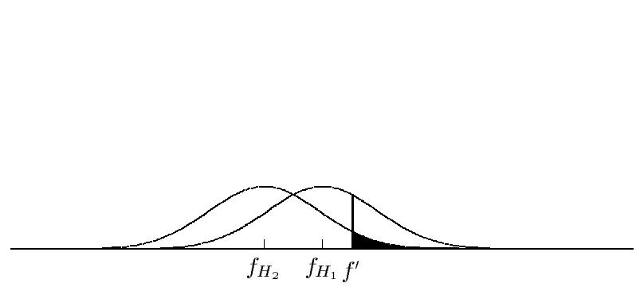  
Figure 1: Overlapping distributions of competing schemata permit the possibility of making errors in decisions, especially when only one sample of each schema is taken.

If one sample of each building block were all we were permitted, it would be dicult to discriminate between all but the most widely disparate building blocks. Fortunately, in populations approaches such as genetic algorithms, we are able simultaneously to sample multiple representatives of building blocks of interest. In this case, as we take more samples, the standard deviation of the mean dierence becomes tighter and tighter, meaning that we can become more condent in our ability to choose better building blocks as the population size increases. This is shown in gure 2, where 25 trials have been assumed for each schema, and the vefold reduction in standard deviation results in much less overlap between the two distributions than before.

# .2 Deriving a population sizing e uation

To put this into practice for particular competitors in a partition of given cardinality, we recognize that the variance of the population mean goes as the variance of a single trial divided by the number of samples, and since the likely number of samples in a uniformly random population of size $n$ is simply the population size divided by the number of competing schemata $\kappa$ in the partition to which the two schemata belong, then the corresponding relationship to obtain discrimination with an error rate $\alpha$ may be written as

$$
z ^ { 2 } = \frac { d ^ { 2 } } { \frac { 2 \sigma _ { M } ^ { 2 } } { n ^ { \prime } } } ,
$$

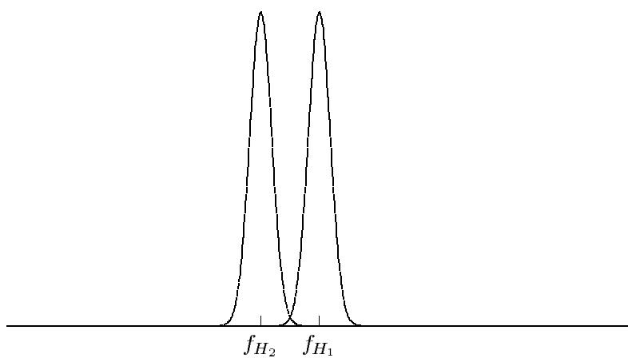  
Figure 2: With 25 trials for each schema, the overlap of the distributions of the schema averages is greatly diminished, thereby drastically decreasing the probability of making an error.

where $n ^ { \prime } = n / \kappa$ . Calling $z ^ { 2 }$ the coecient $c$ (also a function of $\alpha$ ) and rearranging, we obtain a fairly general population-sizing relation as follows:

$$
n = 2 c \kappa \frac { \sigma _ { M } ^ { 2 } } { d ^ { 2 } } .
$$

Thus, for a given pairwise competition of schemata, the population size varies inversely with the square of the signal that must be detected and proportionally to the product of the number of competitors in the competition partition, the total building-block error, and a constant that increases with decreasing permissible error. Thus, to use this equation conservatively, we must size the population for those schemata that may be deceptive and have the highest value of $\kappa \frac { \sigma _ { M } ^ { 2 } } { d ^ { 2 } }$ .

Shortly, we will generalize this equation to include sources of stochastic variation other than buildingblock or collateral noise and will specialize the equation somewhat to get a rough idea how the population size must change as the deception increases or the problem size grows. Right now we are somewhat curious how the coecient $c$ increases with decreasing error tolerance. Of course $c$ is nothing more than the square of a one-sided normal deviate. Figure 3 graphs $c$ as a function of error on a logarithmic axis, and at low error values, the graph becomes almost linear as should be expected after straightforward computations involving the usual approximation for the tail of a normal distribution: $\alpha = \exp ( - z ^ { 2 } / 2 ) / ( z \sqrt { 2 \pi } )$ .

# . ther sources of noise

The equation derived above is fairly general; however, we have assumed that all the noise faced by the schemata comes from the variance of tness within the population. Although this is largely true in many problems, GAs may face noise from a variety of sources, including inherently noisy problems, noisy selection algorithms, and the variance of other genetic operators. The sizing equation remains valid even in cases where these sources are signicant with respect to the collateral noise if we adjust the variance by including a multiplier for each of the additional sources of stochasticity. For the th source of noise (call it $n _ { i }$ ) with magnitude $\sigma _ { n _ { i } } ^ { 2 }$ , we can dene the relative noise coecient

$$
\rho _ { n _ { i } } ^ { 2 } = \frac { \sigma _ { n _ { i } } ^ { 2 } } { \sigma _ { M } ^ { 2 } } .
$$

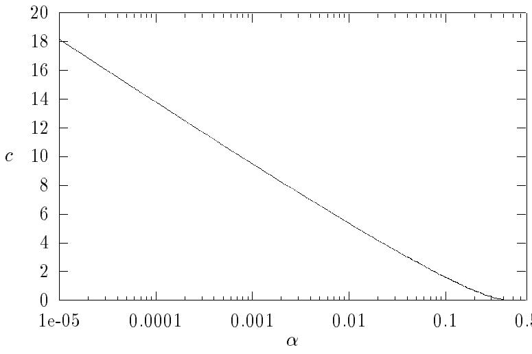  
Figure 3: A graph of $c$ as a logarithmic function of error $\alpha$ becomes almost linear at low error rates as expected.

Thereafter the total additional relative noise coecient may be calculated

$$
\rho _ { T } ^ { 2 } = \sum _ { i } \rho _ { n _ { i } } ^ { 2 } ,
$$

assuming statistical independence of all sources of stochasticity, and the modied population-sizing relation may be obtained:

$$
n = 2 c ( 1 + \rho _ { T } ^ { 2 } ) \kappa \gamma ^ { 2 } ,
$$

where $\begin{array} { r } { \gamma ^ { 2 } = \frac { \sigma _ { M } ^ { 2 } } { d ^ { 2 } } } \end{array}$ , the mean squared inverse overall signal-to-noise ratio. When we examine our initial simulation results, we will demonstrate an appropriate adjustment of the population-sizing equation for Monte-Carlo selection to account for the noise of the roulette wheel. Next, we specialize the general population-sizing equation to functions over $\chi$ -ary strings.

# . Specializing the sizing e uation

The general relationship derived above is widely applicable, perhaps too widely applicable if one of our aims is to see how the error-limiting population size varies as the diculty or length of the problem. To understand these factors better we specialize the equation somewhat. Consider strings of length $\ell$ over alphabets of cardinality $\chi$ and assume that the function is of bounded deception in that building blocks of some order $k \ll \ell$ containing the global optimum are superior to their competitors. Focusing on the highest order partitions is conservative, and each one contains $\kappa = \chi ^ { k }$ competitors. It is convenient (but not necessary) to view the function as the sum of $m$ independent subfunctions $f _ { i }$ each of the same order, $k$ , of the most deceptive partition, thus giving $m = \ell / k$ . The overall variance of the function $\sigma _ { f } ^ { 2 }$ (or the variance of the most general schema) may be calculated then as the sum of the $m$ variance values:

$$
\sigma _ { f } ^ { 2 } = \sum _ { i = 1 } ^ { m } \sigma _ { f _ { i } } ^ { 2 } .
$$

and we can calculate the root-mean-squared (RMS) subfunction variance as follows:

$$
\sigma _ { r m s } ^ { 2 } = \sigma _ { f } ^ { 2 } / m .
$$

Then we estimate the variance of the average order- $k$ schema by multiplying the RMS value by $m - 1$ :

$$
\sigma _ { M } ^ { 2 } = ( m - 1 ) \sigma _ { r m s } ^ { 2 } .
$$

Using $m - 1$ recognizes that the xed positions of a schema do not contribute to variance, although the conservative nature of the bound would not be upset by using $m$ . Substituting this value together with the cardinality of the partition into the sizing equation yields

$$
n = 2 c \beta ^ { 2 } ( 1 + \rho _ { T } ^ { 2 } ) m ^ { \prime } \chi ^ { k } ,
$$

where $m ^ { \prime } = m - 1$ and $\begin{array} { r } { \beta ^ { 2 } = \frac { \sigma _ { r m s } ^ { 2 } } { d ^ { 2 } } } \end{array}$ , the squared RMS subfunction inverse signal-to-noise ratio.

Assuming xed $c , \beta$ , and $\rho _ { T }$ , we note that the sizing equation is $O ( m \chi ^ { k } )$ . If the problems we wish to solve are of bounded and xed deception (xed $k$ for given alphabet cardinality regardless of string length), we note that population sizes are $O ( m )$ , and recalling that $m = \ell / k$ , we concluded that $n = O ( \ell )$ . Elsewhere (Goldberg & Deb, 1991) it has been shown that the typical scaled or ranked selection schemes used in GAs converge in $O ( \log n )$ generations, and unscaled proportionate schemes converge in $O ( n \log n )$ time. For the faster of the schemes this suggests that GAs can converge in $O ( \ell \log \ell )$ function evaluations even when populations are sized to control error. Moreover, even if we use the slower of the schemes, imagine that the $m$ building blocks converge one after another in a serial fashion, and require $\alpha$ to decrease as $m ^ { - 1 }$ , GA convergence should be no worse than an $O ( \ell ^ { 3 } \log ^ { 2 } \ell )$ aair. We will examine the rapid and accurate convergence that results from appropriate population sizing in a moment. First, we need to get a feel for the size of the tness variance in a typical subproblem.

# . Bounds on subfunction variance

Variance of tness can be calculated directly or through appeal to orthogonal functions (Goldberg & Rudnick, 1991), but it is useful to have some feeling for the range of tness variance values we should expect to see in real problems. In a function $f$ of bounded range with specied maximum $f _ { m a x }$ and minimum $f _ { m i n }$ , we can calculate the maximum variance of tness by recognizing that this occurs when half of the strings have the minimum tness value, $f _ { m i n }$ , and the other half have the maximum tness value, $f _ { m a x }$ . Straightforward computation yields

$$
\sigma _ { f } ^ { 2 } = \frac { ( f _ { m a x } - f _ { m i n } ) ^ { 2 } } { 4 } .
$$

With no better idea of the actual variance, using this value as a conservative bound on $\sigma _ { r m s } ^ { 2 }$ in equation 10 is a sensible way to proceed.

If on the other hand, the function values are nearly uniformly distributed between specied minimum and maximum, a continuous uniform distribution is a good model, yielding a variance of tness as follows:

$$
\sigma _ { f } ^ { 2 } = \frac { ( f _ { m a x } - f _ { m i n } ) ^ { 2 } } { 1 2 } .
$$

Note that the variance of the worst case is only three times greater than that of the uniformly distributed model.

Taking the argument to the other extreme, suppose we have a function of bounded range, and want to know what the minimum variance can be. This situation in an order- $k$ problem occurs when one of the values is at $f _ { m i n }$ , one of the values is at $f _ { m a x }$ , and the other $\chi ^ { k } - 2$ values are at the mean. Straightforward computation yields

$$
\sigma _ { f } ^ { 2 } = \frac { ( f _ { m a x } - f _ { m i n } ) ^ { 2 } } { 2 \chi ^ { k } } .
$$

Of course, this approaches zero as $\chi$ or $k$ increases. It is interesting to note that a pure needle-in-ahaystack function with one point at $f _ { m a x }$ and the remainder at $f _ { m i n }$ only has a variance of

$$
\chi ^ { - k } ( 1 - \chi ^ { - k } ) ( f _ { m a x } - f _ { m i n } ) ^ { 2 } \approx \chi ^ { - k } ( f _ { m a x } - f _ { m i n } ) ^ { 2 } ,
$$

which is only a factor of two greater than the minimum variance at high $k$ or $\chi$ .

We will use these bounds in the next section, where we apply a simple GA to a sequence of test functions designed to test the ecacy of the population sizing in linear and nonlinear problems, with uniform and nonuniform subfunction scaling, and the presence or absence of explicit function noise.

# estin t e o ulation si in uation

In this section, we test the hypothesis that the population-sizing equation derived in the previous section is a conservative aid to reducing errors in building-block selection. We do this by rst drawing a somewhat tighter connection between average generational decision error and building-block convergence. We then discuss the design of a suite of problems that test the population-sizing relation across a range of problems that are linear or nonlinear, deterministic or nondeterministic, or uniformly or nonuniformly scaled and outline some methodological decisions that were made to both broaden the applicability of our results and simplify the testing. Expermental results on each of the ve test functions are then presented, and these support the immediate adoption of the population-sizing relation to control convergence error.

# .1 Connection between generational error and ultimate convergence

Earlier we took a generational viewpoint of decision making and calculated a population size to control the error of decision for a pair of competing building blocks. We have to get from this generational perspective to the viewpoint at the end of a run. Calling $S$ the event that we succeed in converging to the right competing building block at the end of a run, $M$ the event that we make a mistake during the initial generation, and $C$ the event that we choose correctly during the initial generation, we can calculate the success probability as follows:

$$
P ( S ) = P ( S | M ) P ( M ) + P ( S | C ) P ( C )
$$

By choosing correctly (or incorrectly), we mean that we give more (or fewer) copies to schemata that are actually better (or worse) than some other schema of interest. The interaction between ultimate success and initially correct or incorrect decision making is fairly complex, but we can reason simply as follows. If we choose correctly initially, the probability that we converge correctly is nearly one, because when we make a step in the right direction it is usually a sizable one, and subsequent errors tend to be less frequent than the initial ones and are of smaller magnitude than the correct step taken initially. On the other hand, the greatest chance for making a mistake comes after an initial error, because we have stepped in the wrong direction. Although it is possible (and sometimes even fairly probable) to recover from such initial mistakes, we conservatively ignore such recovery, and get a straightforward bound on ultimate success probability. Setting $P ( S | M ) = 0$ and $P ( S | C ) = 1$ , and recognizing that $P ( C )$ is at least as large as $1 - \alpha$ , we obtain

$$
P ( S ) = 1 - \alpha .
$$

We dene the condence factor $\zeta = 1 - \alpha$ and plot various convergence measures (usually proportion of building blocks correct) against $\zeta$ . Since the chances of getting better than $P ( S ) = \zeta$ convergence is substantial, the measure of whether the population sizing is conservative will simply be that empirical data fall somewhere above the 45 degree line. In what follows, we call the $P ( S ) = \zeta$ line the expected lower bound (or expected LB), but we recognize here that it is fairly coarse.

# .2 est suite design and methodological considerations

To test the population-sizing equation, we consider a simple GA run using various population sizes on a test suite of ve real-valued functions (F1 to F5) over bit strings with various levels of stochasticity, nonlinearity, and tness scaling. F1 is a linear function $\ell = 2 0 , 5 0 , 2 0 0$ ) with uniform scaling. F2 is a linear function $( \ell = 5 0 )$ ) with nonuniform tness scaling. F3 is a uniformly scaled, linear function $( \ell = 5 0$ ) with the addition of zero-mean Gaussian noise. F4 is an order-four deceptive problem $\ell = 4 0$ ) with uniform scaling of the deceptive building blocks, and F5 is an order-four deceptive problem $\ell = 4 0$ ) with nonuniform scaling of the building blocks. More detailed denitions of each function are given in subsequent subsections.

The test suite considers a range of diculties, and we choose our simple GA carefully to bound the results expected in a range of GAs used in practice. To examine whether the type of selection signicantly aects the quality of convergence, we try a number of schemes to start, including many of those in wide use. In subsequent tests we restrict our experiments to tournament selection as a good compromise between quick answers and quality convergence. In all runs, simple, one-point crossover has been adopted. In linear problems this choice makes life more dicult for the GA because of wellknown problems with hitchhiking (Schaer, Eshelman, & Outt, 1991). In nonlinear problems, we have assumed the existence of suciently tight linkage to permit building-block growth. As we've mentioned, it is an open question how to obtain this without prior knowledge, but we did not want to open that pandora's box, nor did we want to open the one associated with the adoption of uniform or other highly disruptive crosses. In any event, we are not advocating the use of this or that crossover operator here. We simply want to show the eect of choosing well in the presence of collateral or other noise. In all runs no mutation $\begin{array} { r } { p _ { m } = 0 , } \end{array}$ ) was used to ensure that initial diversity provided the only means of solving a problem. All runs are terminated when the population converges completely, and to obtain a statistically valid result, all simulations have been performed ten times, each starting with dierent random-number-generator seeding.

In the remainder of the section, we consider the results of experiments using the population-sizing equation in each of the problems.

# . est function 1 A uniformly scaled, linear problem

Linear problems are supposed to be easy for GAs but most genetic algorithmists have obtained poor convergence in supposedly easy problems at one time or another when the amount of collateral noise has overwhelmed the signal available. Of course, mutation usually can x earlier convergence errors in a linear or bitwise optimizable problem but here we have denied that possibility in an eort to isolate and identify the early decision errors. The initial function chosen to test the population-sizing relation is the uniform linear problem:

$$
f _ { 1 } ( \mathbf { x } ) = \sum _ { x = 1 } ^ { \ell } x _ { i }
$$

where $x _ { i } \in \{ 0 , 1 \}$ . This is of course the so-called one-max function and its solution is the string with all ones.

Since the problem is linear, the critical building block is of order one $( k = 1 )$ ); the signal we wish to detect has magnitude $1 - 0 = 1$ , and the variance of the order-1 building block is simply $( 1 - 0 ) ^ { 2 } / 4 = 0 . 2 5$ , using the variance estimates of the previous section. Thus $\beta ^ { 2 } = 0 . 2 5 / 1 = 0 . 2 5$ , and the overall sizing relation becomes $n = c ( \ell - 1 )$ .

To give the GA a good workout, we have tested F1 with a range of string-length values, $\ell = 2 0 , 5 0$ , 200, and a variety of selection operators:

1. roulette-wheel selection (roulette);   
2. roulette-wheel selection with ranking (ranking);   
3. stochastic universal selection (SUS);   
4. binary tournament selection without replacement (tournament).

Roulette-wheel selection is the usual Monte-Carlo scheme with replacement where the selection probability $\underline { { p } } _ { i } = f _ { i } / \sum _ { j } f _ { j }$ . Scaled selection scheme uses linear (zero to two) ranking (Baker, 1985) and Monte-Carlo selection and the SUS scheme uses the low-noise scheme described elsewhere (Baker 1987). Tournament selection is performed without replacement as described elsewhere (Goldberg & Deb, 1991) in an eort to keep the selection noise as low as possible.

Figures 4, 5, and 6 show convergence versus condence factor (and population size) for $\ell = 2 0 , 5 0$ ; and 200, respectively. Over the range of values, the roulette results are nonconservative (below the expected lower bound), and we will say more about this in a moment. For the other schemes, the results are barely above the expected lower bound at low condence values, a not unexpected result because all sources of stochasticity beside collateral noise have been ignored. For the quiet schemes (SUS and tournament), the results become increasingly conservative with increasing $n$ . This increasing conservatism of the sizing relation with increased $n$ is not unexpected. The lower bound relating condence and ultimate convergence ignores all possibility of correcting for an initial error. As $n$ increases, drift time for poorly discriminated building blocks increases (Goldberg & Segrest, 1987), thereby increasing the probability that a correction can be obtained. A more detailed computation for that mechanism should be sought but it is beyond the scope of this study. The ranked roulette results stay about even with the expected lower bound for $\ell = 2 0$ and 50, but have improved margin above the expected lower bound at $\ell = 2 0 0$ . The previous drift-time mechanism can explain this, with the poor results at lower $\ell$ values explained by the high inherent noise of roulette-wheel selection itself.

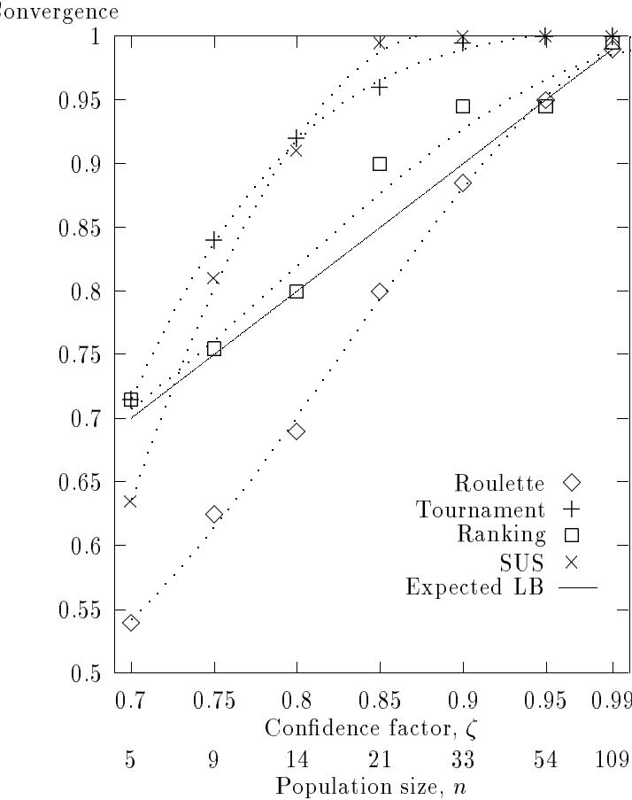  
Figure 4: Simulation results for F1 with $\ell = 2 0$ are presented on a graph of convergence as measured by the average number of correct alleles versus condence and population size. For $\zeta$ values greater than 0.7, in all but unranked roulette wheel selection, the graph shows that the sizing equation is conservative even when no additional sources of stochasticity are considered.

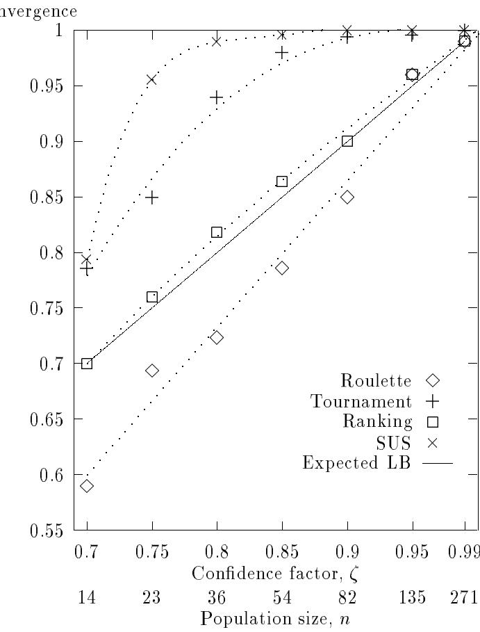  
Figure 5: Simulation results for F1 with $\ell = 5 0$ are presented on a graph of convergence as measured by the average number of correct alleles versus condence and population size. The SUS results at $\ell = 5 0$ display increasing margin above the expected lower bound as compared to the results at $\ell = 2 0$ .

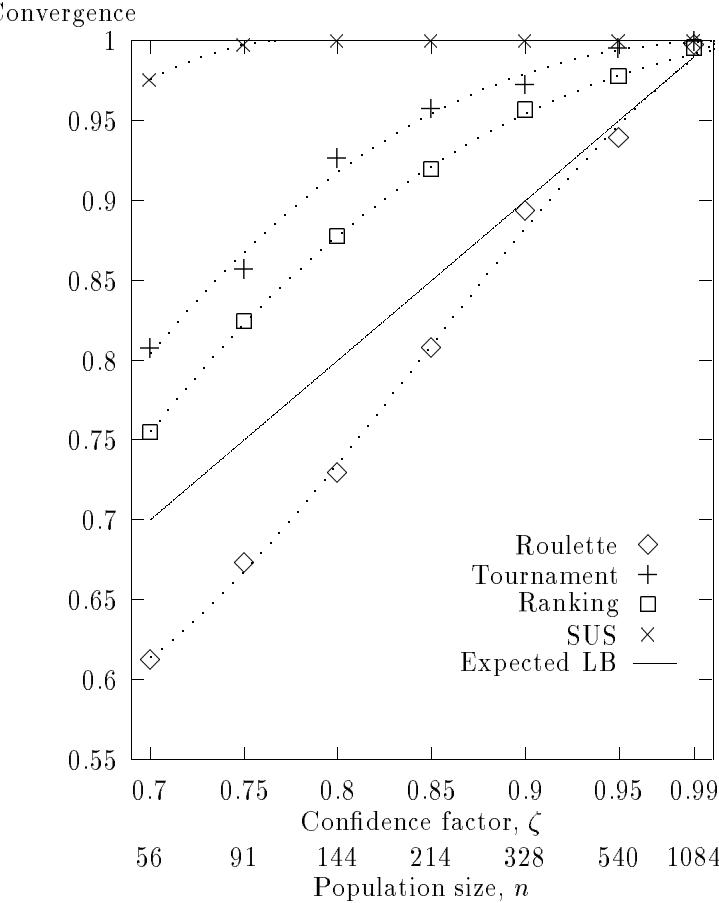  
Figure 6: Simulation results for F1 with $\ell = 2 0 0$ are presented on a graph of convergence as measured by the average number of correct alleles versus condence (population size). The results are consistent with the $\ell = 2 0$ and 50 simulations, and the SUS and ranking results show more pronounced margins above the expected lower bound than the runs at lower $\ell$ values.

Among the most striking features of these results is that the roulette-wheel (unranked) traces fall below the expected lower bound. This can be explained, because the sizing relation without $\rho _ { T }$ adjustment makes no additional allowance for the noise of selection, and Monte-Carlo selection with replacement most certainly is a noisy scheme. To quantify this somewhat, recognize that $n$ repeated Bernoulli trials are binomially distributed. Thus, for the th string, we calculate a mean and variance in the er o ria s as $n p _ { i }$ and $n p _ { i } ( 1 - p _ { i } )$ , respectively. Recognizing that $p _ { i } \ll 1$ and summing over all strings we get a variance $\sum n p _ { i } / n = 1$ . Thus, the variance in number of trials due to the noise of the wheel is simply one in units of squared individuals. To put this in tness terms we recognize that an individual must change by an amount equal to the population average tness to increase or decrease his numbers by one. Thus, the variance due to the roulette wheel intimes the square of the average tness or simply ${ \bar { f } } ^ { 2 }$ ness te. Thus $\rho _ { T } ^ { 2 } = \bar { f } ^ { 2 } / \sigma _ { M } ^ { 2 }$ oduct of . Letting $\bar { f } = 0 . 5 ( f _ { m i n } + f _ { m a x } ) \ell$ r, and taking the appropriate variance estimate, $\ell ( f _ { m a x } - f _ { m i n } ) ^ { 2 } / 4$ , we conclude that

$$
\rho _ { T } ^ { 2 } = \ell \left( \frac { f _ { m a x } + f _ { m i n } } { f _ { m a x } - f _ { m i n } } \right) ^ { 2 } ,
$$

and in the present case $f _ { m a x } = 1$ , $f _ { m i n } = 0$ , and thus $\rho _ { T } ^ { 2 } = \ell$ . Using this adjustment, we replot the F1 results for the roulette in gure 7, where the existing results have been graphed again using an adjusted $\alpha ^ { \prime }$ from the relation $c ( \alpha ^ { \prime } ) = c ( \alpha ) / ( 1 + \ell )$ . The sizing relation is restored to conservatism.

The second most striking feature of the F1 results is the high performance of the two quiet selection schemes, SUS and tournament. This is not unexpected, but the reason for superiority of SUS in most of the cases is unclear without further investigation. Figure 8 shows the total number of function evaluations versus condence for all schemes and all $\ell$ values. Clearly, the superiority of SUS is bought at high computational cost. It is well known (Goldberg & Deb, 1991) that purely proportionate schemes tend to slow as average tness rises, but this has a benecial eect on the quality of convergence, because less pressure is applied to force bad decisions. On the other hand, this increases substantially the total number of function evaluations, and in the remainder of the study we will concentrate on tournament selection as a good compromise between quality and speed of convergence. Looking at these results more closely, for the two pushy schemes (ranking and tournament), the number of function evaluations grows as $\ell ^ { 1 . 7 }$ , and for the two purely proportionate schemes (SUS and roulette), the number of function evaluations grows roughly as $l ^ { 2 . 3 }$ . Recall (Goldberg & Deb, 1991) that ranked and tournament schemes tend to converge in something like $O ( \log n )$ generations and that purely proportionate schemes tend to converge in $O ( n \log n )$ time; overall, we should expect a total number of function evaluations of $O ( \ell \log \ell ) { - } O ( \ell ^ { 2 } \log \ell )$ for the pushy schemes, which is consistent with the observed $\ell ^ { 1 . 7 }$ , and we should expect convergence of $O ( \ell ^ { 2 } \log \ell ) { - } O ( \ell ^ { 3 } \log \ell )$ for the pushy schemes, which is consistent with the observed $\ell ^ { 2 . 3 }$ . The consistency of these results gives us some hope that these suggestions about convergence and its time complexity can be taken to theoremhood, a matter to be discussed somewhat later. At this juncture, we consider another linear function, where not all bits are created equal.

# . est function 2 A nonuniformly scaled, linear problem

The second test function is also a linear function:

$$
f _ { 2 } ( { \bf x } ) = \sum _ { i = 1 } ^ { 5 0 } c _ { i } x _ { i } ,
$$

where $x _ { i } \in \{ 0 , 1 \}$ $c _ { i } = \delta$ for $i \in I$ and $c _ { i } = 1$ otherwise. The idea here is to scale some of the bits badly and see if the sizing equation can pick up the small signal amidst a large collateral noise. Among the fty bits of the problem only ve bad bits were chosen to keep the collateral noise relatively high and choice

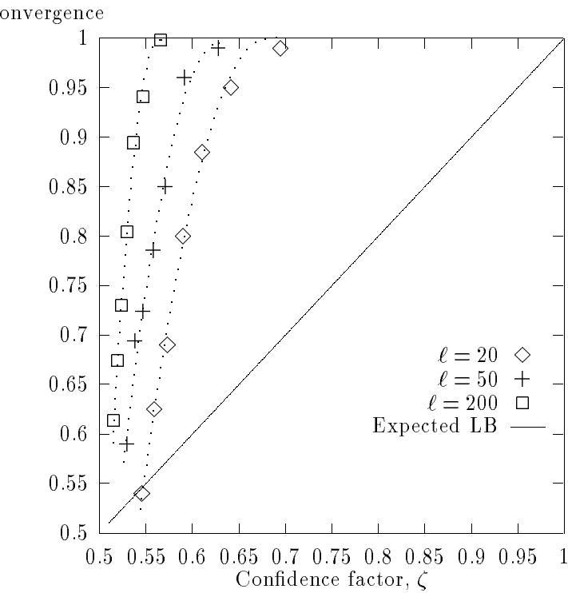  
Figure 7: The previous F1 roulette-wheel results have been replotted using a condence factor calculated after appropriate adjustment for the noise of the roulette wheel. The results are now at or above the expected lower bound.

Function evaluations

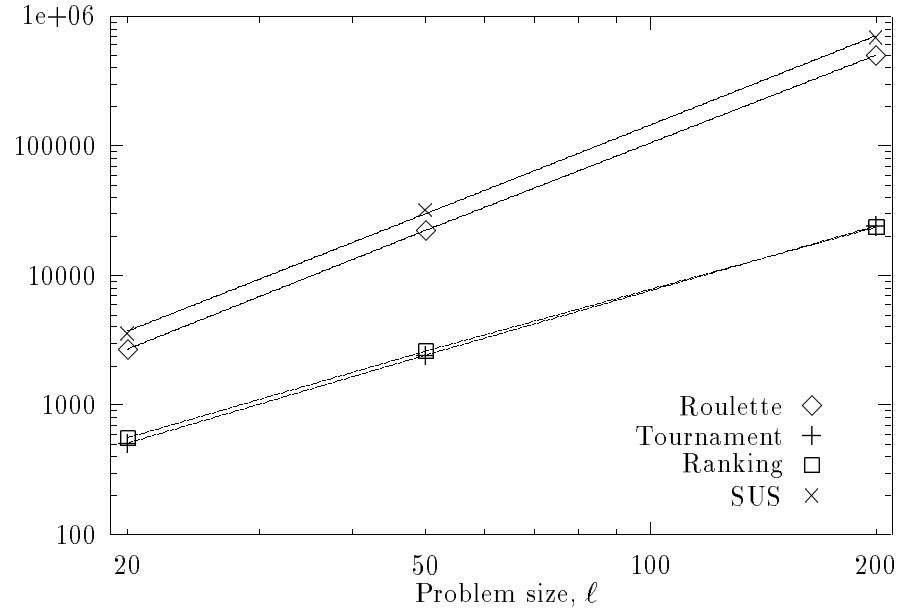  
Figure 8: The total number of function evaluations for each selection scheme is graphed versus $\ell$ value on log-log axes at $\zeta = 0 . 9$ for function F1. The total number of function evaluations varies approximately as $\ell ^ { 1 . 7 }$ in the pushy (ranking and tournament) selection schemes and $\ell ^ { 2 . 3 }$ in the purely proportionate (SUS and roulette) schemes.

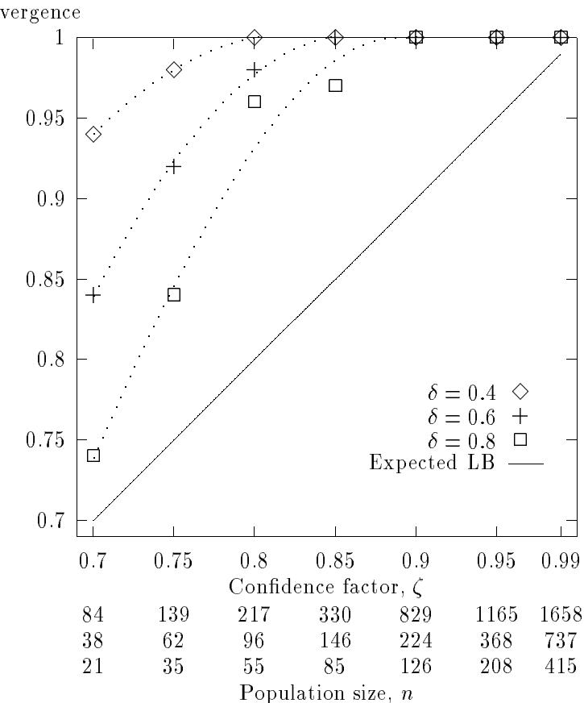  
Figure 9: F2 results with $\ell = 5 0$ show the convergence as measured by the percentage of poorly scaled alleles correct versus condence at dierent levels of scaling $\delta$ . The sizing relation proves to be a conservative tool in all cases

of the set $I = \{ 5 , 1 5 , 2 5 , 3 5 , 4 5 \}$ maximizes the possibility of undesired hitchhiking under single-point crossover.

The sizing of the population goes as before except that the signal we wish to detect is $d = \delta$ . Thus, the population-sizing equation becomes $n = c ( \ell - 1 ) / \delta ^ { 2 }$ . As was mentioned, the general success of the sizing formula has encouraged us to only continue examination of a single selection scheme, tournament selection. Using tournament selection with all other GA parameters and operators as discussed earlier, blocks of simulations have been run for $\delta = 0 . 4$ ; 0.6, and 0.8, and the convergence is shown versus condence factor in gure 9. Here the convergence measure has been changed to the average proportion of correct alleles among only the poorly scaled bits; the good bits are well above the noise level, and are extremely unlikely to have any mistakes, and including them in the convergence measure gives too rosy a picture. Looking at the gure, the equation proves to be a conservative population-sizing tool in this case as well. In fact, the F2 results are increasingly conservative with decreased $\delta$ , a fact that is not surprising because of the extremely conservative nature of the bounding relation we have assumed between generational condence and ultimate convergence. As $n$ increases, the drift time to incorrect convergence increases linearly, thereby signicantly increasing the probability of recovering from initial decision-making errors.

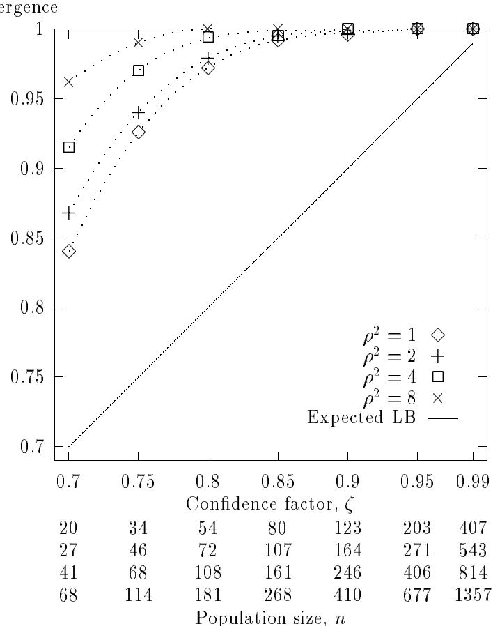  
Figure 10: F3 convergence as measured by the average number of ones versus condence factor shows that the population-sizing equation adequately handles noisy problems when adjustment is made for the additional stochasticity.

# . est function A uniformly scaled linear function with noise added

For the third test function, we consider another linear function, except this time we add zero-mean Gaussian noise:

$$
f _ { 3 } ( { \bf x } ) = \sum _ { i = 1 } ^ { 5 0 } x _ { i } + g ( \sigma _ { n } ^ { 2 } ) ,
$$

where $x _ { i } \in \{ 0 , 1 \}$ and $g ( \ u )$ is a generator of zero-mean Gaussian noise of specied variance $\boldsymbol { \sigma } _ { n } ^ { 2 }$

The sizing relation is the same as in F1, except that a factor $\rho _ { T } ^ { 2 }$ must be used to account for the noise. Four dierent levels of noise $\sigma _ { n } ^ { 2 } = 1 2 . 2 5$ ; 24.5, 49.0, and 98.0 were added, and these correspond to $\rho _ { T } ^ { 2 }$ values of 1, 2, 4, and 8.

Convergence (over all bits) versus condence $\zeta$ is shown in in gure 10, for blocks of ten simulations on each $\sigma _ { n } ^ { 2 } \mathrm { - } \rho _ { T } ^ { 2 }$ case. The sizing relation is conservative in all four cases; as before, increasing conservatism is observed with increasing $n$ .

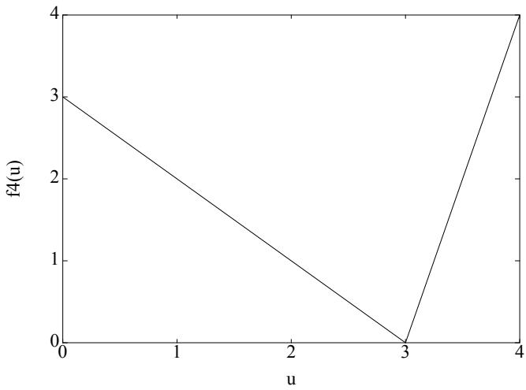  
Figure 11: The copies of this subfunction are used in functions $\mathrm { F 4 }$ and F5. Here $u$ is the i a io or the number of ones in the subfunction's substring.

# . est function A uniformly scaled, nonlinear function

In order to study variance-based population sizing in nonlinear problems, a 40-bit, order-four deceptive problem has been designed.

$$
f _ { 4 } ( { \bf x } ) = \sum _ { i = 1 } ^ { 1 0 } f _ { 4 _ { i } } ( x _ { I _ { i } } ) ,
$$

where each of the subfunctions $f _ { 4 _ { i } }$ is a separate copy of the function shown in gure 11, and the sequence of index sets is the ten sets containing four consecutive integers each: $I _ { 1 } = \{ 1 , 2 , 3 , 4 \}$ , and $I _ { i + 1 } = I _ { i } + 4$ . The function is a function of unitation (a function of the number of ones in the substring argument), and elsewhere (Deb & Goldberg, 1991) it has been shown that this function is fully deceptive in the usual average sense. The variance of the subfunction may be calculated directly and is found to be 1.215. Recognizing that there are ten subfunctions $( m = 1 0$ ), each binary subfunction is of order four $\chi = 2$ , $k = 4$ ), and the tness dierence between the best and the second best substring is one $\left. d = 1 \right.$ ), the population-sizing equation reduces to $n = 2 c ( 1 . 2 1 5 ) ( 1 0 - 1 ) 2 ^ { 4 } / ( 1 ^ { 2 } ) = 3 5 0 c$ .

To eliminate building-block disruption as a concern, each subfunction is coded tightly, and tournament selection is used with all other GA operators and parameters set as in previous runs. Figure 12 shows convergence measured by the average number of correct building blocks versus the condence. Once again the sizing equation conservatively bounds nal convergence.

# . est function A nonuniformly scaled, nonlinear problem

To test whether the sizing equation bounds the convergence of a poorly scaled deceptive problem, function F5 has been dened as follows:

$$
f _ { 5 } ( { \bf x } ) = \sum _ { i = 1 } ^ { 1 0 } c _ { i } f _ { 4 _ { i } } ( x _ { I _ { i } } ) ,
$$

where each of the subfunctions and index sets are dened as in $\mathrm { F 4 }$ , but the weighting coecients are no longer uniform. In particular, all the $c _ { i } = 1$ except $c _ { 5 } = 0 . 2 5$ .

Ignoring the minor change in RMS subfunction noise, the sizing of the previous problem may be used as long as it is modied to include the smallest signal. Since the smallest signal that needs to be detected is a quarter of the one of the previous problem the population size increases by a factor of 16 yielding $n = 5 6 0 0 c$ from the sizing relation.

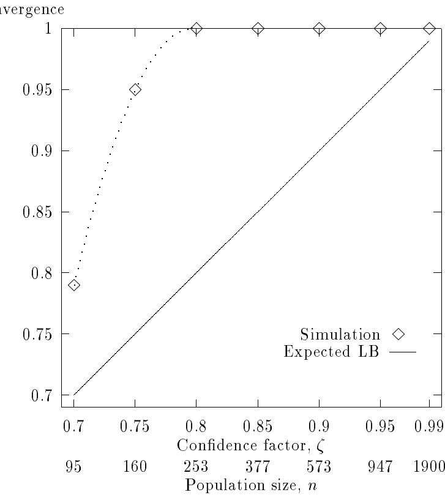  
Figure 12: F4 convergence as measured by the average number of correct building blocks versus the condence factor shows that the sizing equation conservatively bounds the actual convergence in a fairly dicult, albeit uniformly scaled, deceptive problem.

Binary tournament selection is used as before and convergence is measured by the average number of correct building blocks, only considering the poorly scaled building block. Starting with $\zeta = 0 . 7$ , in all runs at each value of $\zeta$ , the GA converges to the correct (all-ones) string.

# . Summary of results

A population-sizing equation constructed from straightforward statistical decision theory has been used in a number of test problems from linear to nonlinear from deterministic to inherently stochastic and with uniform or nonuniform scaling among subfunctions. When additional sources of stochasticity are properly accounted, the equation appears to be a conservative tool for sizing populations in simple GAs. In a physicist's terms, the population-sizing equation roughly describes the boundary of a phase transition, where GAs exhibit a stark change in behavior from noisy and unpredictable convergence to repeatable and reliable results. Moreover, the experimental and theoretical results suggest that if GA convergence can be proved, it is likely to exhibit time complexity that is no worse than quadratic or cubic, depending on the selection scheme used.

These results are useful, and encourage us to seek straightforward proofs of recombinative-GA convergence. Some may object that the theory is too simple, perhaps meaning to suggest that GAs don't work exactly as the theory idealizes, but no model can be placed in one-to-one correspondence in all respects and in all details with its modeled object, and once this is recognized, the act of modeling becomes the process of focusing on those aspects of the modeled object relevant to the model's application. Viewed in this way, the sizing relation suggested here captures much of what interests us with no more than a back-of-an-envelope computation. As engineers interested in the design of better GAs, we think this is exactly the kind of modeling that more of the community should be doing and using. Having said this, we do not recommend resting on these laurels, and in the next section we suggest extensions and continuations of this work that will lead us to an even deeper understanding of the complex interactions that remain locked away in the population trajectories of even the simplest of GAs.

# tensions

The simple population-sizing equation presented in this paper has proven to be a usefully conservative estimate of the population size required to make a controllably small number of building-block errors at the end of a run, and a number applications and extensions suggest themselves almost immediately:

1. Investigate the use of the population-sizing equation on non-binary alphabets, permutation problems, and other codings.   
2. Consider the construction of online population-sizing techniques based on these principles.   
3. Develop a more fundamental relationship between generational error and ultimate convergence.   
4. Investigate the noise generated by nondeterministic objective functions, selection operators, and other genetic operators in more detail.   
5. Investigate the interaction of niching and variance-based population sizing in objective functions with multiple global solutions.   
6. Investigate other means of forestalling convergence in low-tness partitions.   
7. Construct computational-learning-theory-like proofs of recombinative GA convergence in problems of bounded deception using these ideas.

In this section we brie
y examine each of these in somewhat more detail.

The sizing equation deserves immediate testing on other-than-binary codings, although the assumptions used in its derivation are so straightforward that the success demonstrated in this paper should carry over to other structures without modication. At Illinois we have started to use the sizing relation in problems with permutation operators; our initial experience has been positive.

The sizing relation requires some (albeit minimal) knowledge about the problem being solved, and it may be possible to get online estimates of the necessary values through online population measurements. Specically, the sizing relation requires information about the problem size, population variance, minimum signal, and order of deception. Variance may be measured directly and used straightaway. Minimum desired signal can be established beforehand, or keeping track of the change of tness after a sequence of one-position mutations can give an adequate estimate of minimum signal. Order of deception is more dicult to measure. Again, a prior limit on the order of maximum deception to be uncovered can be established, or it may be possible to get some estimate of deception by doing recursive updates of schema averages or Walsh coecients as more samples are taken. The schema averages or Walsh coecients may then be used to see whether there is any evidence of deception in past populations. Once these data are available, the population size may be adjusted in an attempt to control the error of decision, yet keep no more copies than is necessary.

The relation between specied error and ultimate convergence adopted herein is conservative, but it should be possible to develop a more fundamental relation between the two. One thing that aids convergence is that variance in the rst generation is something of a worst case. As positions converge, less tness variance is felt by the remaining competitors, and the environment of decision is much less noisy. Also, as population sizes are increased, convergence is aided, because drift times increase linearly with size (Goldberg & Segrest, 1987), and those building blocks in the noise soup|those with relatively unfavorable signal-to-noise ratios|have a longer time to drift around before converging to one value or another at random. It should be possible to construct asymptotic models that more closely relate these eects without resorting to full Markov equations.

This paper has scratched no more than the surface in its investigation of sources of noise other than collateral or building block noise. Beyond the additive Gaussian noise considered herein lie other noisy objective functions, and representatives of these should be examined to see if the simple variance adjustment is sucient. The prior expectation is that the adjustment should work because the central limit theorem works, but the question deserves less 
ippancy and closer inquiry. Also, the noise generated by various selection schemes should be investigated, as should the noise generated by other genetic operators. Here, we found that the noise of the roulette wheel easily exceeded that of the tness variance, and this alone accounts for much of the advantage of stochastic remainder selection, stochastic universal selection, and other quieter selection schemes. The variance in operation of the other genetic operators does not come into the sizing as directly as does selection, but it, too, should be investigated. A crossover operator that disrupts a short schema more than expected can be deleterious to convergence and cause errors of decision as well. Similarly, a mutation operator that hits a low-order schema more often than average can be a problem. These eects should be studied more carefully, and ultimately they can be incorporated into a variance-adjusted schema theorem, a matter discussed as part of the last item.

Here we have used test functions with singleton solution sets to keep things simple. In many problems of interest, the solution has cardinality much greater than one, and in these problems care should be taken to use ic i g methods (Deb, 1989; Deb & Goldberg, 1989; Goldberg & Richardson, 1987) or other techniques (Goldberg, 1990b) that permit the stable coexistence of multiple solutions in a population. These techniques should be used more often than they are, because unbridled competition between species (or corporations) results ultimately in monopoly, but even when these methods are used, this paper suggests that the same kinds of population-sizing considerations adopted herein should be used for subpopulation sizing within the various niches. Determination of the number of niches is related to the cardinality of the solution set and the ability of the niching criterion or criteria to discriminate between dierent members of a niche, and depending on the niching scheme used, some care should be exercised to calculate the xed-point proportion of members of a given niche properly. If these concerns are addressed, it should be possible to size populations rationally for problems with multiple solutions in a manner not much more dicult than was done here.

Niching stably preserves diversity across a population but one of the ways to promote better decisionmaking in a time-varying environment is through dominance (Goldberg & Smith 1987; Smith 1988) or other a eya ce schemes. This is particularly useful in the present context for building blocks that fall below the initial signal dierence $d$ . Without other protection, selection at these positions is likely to be a willy-nilly aair because of drift; however, if there is some means of protecting currently outof-favor building blocks against cyclical or random runs of bad luck, there is greater hope that when convergence is achieved at a high proportion of positions, that these smaller signals can be detected accurately. The use of dominance-diploidy should be tried to see if low-tness building blocks can be protected for subsequent competition when the signal-to-noise ratio is favorable. Another possibility to aid convergence of low-tness building blocks is through the addition of tness noise of a scheduled level. This counterintuitive suggestion ties in with the observation above that large population sizes prolong drift time for those building blocks that are currently in the noise soup. The injection of noise into a population would insure that low-tness building blocks would drift and not undergo selective pressure, and large-enough population sizes would insure that they did not drift to absorption. After the rst phase of convergence of the highly t building blocks the noise level could be lowered, thereby exposing the second tier to competitive selection.

Finally, by getting the decision making in GAs right, we feel we have opened the door to straightforward, yet rigorous, convergence proofs of recombinative GAs. Elsewhere (Goldberg & Rudnick, 1991) it was pointed out that the schema theorem could be made a rigorous lower bound on schema growth if only the various terms were adjusted conservatively for variance eects. We stand by that claim here and suggest that the result can be pushed further to obtain proofs of polynomial convergence within an epsilon of probability one in problems of bounded deception. The actual proofs will resemble those of computational learning theory, and there are a number of technical details that appear fairly tricky, but getting the decision making correct in a probabilistic sense is a critical piece of this important puzzle.

# onclusions

This paper has developed and tested a population-sizing equation to permit accurate statistical decision making among competing building blocks in population-oriented search schemes such as genetic algorithms. In a suite of ve test functions from linear to nonlinear, from deterministic to stochastic, and from uniformly scaled to poorly scaled, the population-sizing relation conservatively has bounded the actual accuracy of GA convergence when necessary sources of stochasticity are properly considered and the worst-case signal-to-noise ratio is used in sizing. Although more work is necessary, these results recommend the immediate adoption of variance-based population sizing in practical applications of genetic algorithms as well as more foundational investigations.

The paper has also examined the total number of function evaluations required to solve problems accurately. Depending whether purely proportionate selection or more pushy schemes such as ranking and tournament selection have been used, convergence appears to be no worse than a quadratic or cubic function of the number of building blocks in the problem. These results are consistent with previous theoretical predictions of GA time complexity and open the door to formal proofs of polynomial GA convergence in problems of bounded deception, using the basic approach of this paper together with methods not much dierent from those established in computational learning theory.

ut in somewhat dierent terms, this paper rmly establishes the role of population size in delineating what a physicist might call a phase boundary between two vastly dierent types of simple genetic algorithm behavior. At low population sizes we see GAs bueted by the vagaries of chance, converging only through the good graces of random changes that are lucky enough to survive to a time when they may be properly judged. At high population sizes we see GAs that promote only the best among competing building blocks, and when and if these are global, with high probability we can expect convergence to global solutions after sucient recombination. To understand these two regimes is useful, to quantitatively have a yardstick to distinguish high from low population size is important, and to lead these ideas to their logical conclusion is the task ahead.

# c nowled ents

The authors acknowledge the support provided by the US Army under Contract DASG60-90-C-0153 and by the National Science Foundation under Grant ECS-9022007.

eferences   
Baker, J. E. (1985). Adaptive selection methods for genetic algorithms. rocee i gs o a er a io a o ere ce o e e ic gori s a eir ica io s, 101 111.   
Baker, J. E. (1987). Reducing bias and ineciency in the selection algorithm. rocee i gs o e eco er a io a o ere ce o e e ic gori s, 14-21.   
Davis, L. (1991). a oo o ge e ic a gori s. New ork: Van Nostrand Reinhold.   
De Jong, K. A. (1975). An analysis of the behavior of a class of genetic adaptive systems. (Doctoral dissertation, University of Michigan). isser a io s rac s er a io a 10), 5140B. (University Microlms No. 76-9381)   
Deb, K. (1989) e e ic a gori s i i o a c io o i i a io (MS Thesis and TCGA Report No. 89002). Tuscaloosa: University of Alabama, The Clearinghouse for Genetic Algorithms.   
Deb, K., & Goldberg, D. E. (1989). An investigation of niche and species formation in genetic function optimization. rocee i gs o e ir er a io a o ere ce o e e ic gori s, 42 50.   
Deb, K., & Goldberg, D. E. (1991). a y i g ece io i ra c io s (IlliGAL Report No. 91009). Urbana: University of Illinois at Urbana-Champaign, Illinois Genetic Algorithms Laboratory.   
Eshelman, L. J. (1991). The CHC adaptive search algorithm: How to have safe search when engaging in nontraditional genetic recombination. o a io s o e e ic gori s, 265 283.   
Fitzpatrick, J. M., & Grefenstette, J. J. (1988). Genetic algorithms in noisy environments. ac i e ear i g , 101 120.   
Goldberg, D. E. (1985). i a i i ia o a io si e or i ary co e ge e ic a gori s (TCGA Report No. 85001). Tuscaloosa: University of Alabama, The Clearinghouse for Genetic Algorithms.   
Goldberg, D. E. (1987). Simple genetic algorithms and the minimal deceptive problem. In L. Davis (Ed.), e e ic a gori s a si a e a ea i g (pp. 74 88). London: itman.   
Goldberg, D. E. (1989a). e e ic a gori s i searc o i i a io a ac i e ear i g Reading, MA: Addison-Wesley.   
Goldberg, D. E. (1989b). Genetic algorithms and Walsh functions: art I, a gentle introduction. o e ys e s , 129 152.   
Goldberg, D. E. (1989c). Genetic algorithms and Walsh functions: art II, deception and its analysis. o e ys e s , 153 171.   
Goldberg, D. E. (1989d). Sizing populations for serial and parallel genetic algorithms. rocee i gs o e ir er a io a o ere ce o e e ic gori s, 70 79.   
Goldberg, D. E. (1990a). o s r c io o ig or er ece i e c io s si g o or er a s coe cie s, (IlliGAL Report No. 90002). Urbana: University of Illinois, Illinois Genetic Algorithms Laboratory.   
Goldberg, D. E. (1990b). A note on Boltzmann tournament selection for genetic algorithms and population-oriented simulated annealing. o e ys e s , 445 460.   
Goldberg, D. E. (1991). i s e s o a i ess. A paper presented at the Oregon Graduate Institute, Beaverton, OR.   
Goldberg, D. E., & Bridges, C. L. (1990). An analysis of a reordering operator on a GA-hard problem. io ogica y er e ics , 397 405.   
Goldberg, D. E., & Deb, K. (1991). A comparative analysis of selection schemes used in genetic algorithms. o a io s o e e ic gori s, 69 93.   
Goldberg, D. E., Deb, K., & Korb, B. (1990). Messy genetic algorithms revisited: Studies in mixed size and scale. o e ys e s , 415 444.   
Goldberg, D. E., Korb, B., & Deb, K. (1989). Messy genetic algorithms: Motivation, analysis, and rst results. o e ys e s , 493 530.   
Goldberg, D. E., & Richardson, J. (1987). Genetic algorithms with sharing for multimodal function optimization. rocee i gs o e eco er a io a o ere ce o e e ic gori s, 41 49.   
Goldberg, D. E., & Rudnick, M. (1991). Genetic algorithms and the variance of tness. o e ys e s , 265 278.   
Goldberg, D. E., & Segrest, . (1987). Finite Markov chain analysis of genetic algorithms. rocee i gs o e eco er a io a o ere ce o e e ic gori s, 1 8.   
Goldberg, D. E., & Smith, R. E. (1987). Nonstationary function optimization using genetic algorithms with dominance and diploidy. rocee i gs o e eco er a io a o ere ce o e e ic gori s, 59 68.   
Grefenstette, J. J., & Baker, J. E. (1989). How genetic algorithms work: A critical look at implicit parallelism. rocee i gs o e ir er a io a o ere ce o e e ic gori s, 20 27   
Grefenstette, J. J., & Fitzpatrick, J. M. (1985). Genetic search with approximate function evaluations. rocee i gs o a er a io a o ere ce o e e ic gori s a eir ica io s, 160 168.   
Holland, J. H. (1968). ierarc ica escri io s o i ersa s ace a a a i e sys e s (Technical Report ORA rojects 01252 and 08226). Ann Arbor: University of Michigan, Department of Computer and Communication Sciences.   
Holland, J. H. (1970). Hierarchical descriptions of universal spaces and adaptive systems. In A. W. Burks (Ed.), ssays o ce ar a o a a (pp. 320 353). Urbana: University of Illinois ress.   
Holland, J. H. (1973). Genetic algorithms and the optimal allocations of trials. o r a o o i g (2), 88 105.   
Holland, J. H. (1975). a a io i a ra a ar i cia sys e s Ann Arbor, MI: University of Michigan ress.   
Liepins, G. E., & Vose, M. D. (1990). Representational issues in genetic optimization. o r a o eri e a a eore ica r i cia e ige ce (2), 4 30.   
Mitchell, M., & Forrest, S. (1991). a is ece io a y ay a oes i a e o o i s o e co cer s i s ire y e a ese c io s Unpublished manuscript.   
Radclie, N. J. (1991). Forma analysis and random respectful recombination. rocee i gs o e o r er a io a o ere ce o e e ic gori s, 222 229.   
Rudnick, M., & Goldberg, D. E. (1991). ig a oise a ge e ic a gori s (IlliGAL Report No. 91005). Urbana: University of Illinois at Urbana-Champaign, Illinois Genetic Algorithms Laboratory.   
Schaer, J. D., Eshelman, L. J., & Outt, D. (1991). Spurious correlations and premature convergence in genetic algorithms. o a io s o e e ic gori s, 102 112.   
Smith, R. E. (1988). i es iga io o i oi ge e ic a gori s or a a i e searc o o s a io ary c io s (MS thesis and TCGA Report No. 88001). Tuscaloosa: University of Alabama, The Clearinghouse for Genetic Algorithms.   
Spears, W. M., & De Jong, K. A. (1991a). An analysis of multi-point crossover. o a io s o e e ic gori s, 301 315.   
Spears, W. M, & De Jong, K. A. (1991b). On the virtues of parameterized uniform crossover. rocee i gs o e o r er a io a o ere ce o e e ic gori s, 230 236.   
Vose, M. D. (in press). Generalizing the notion of schema in genetic algorithms. r i cia e ige ce.   
Whitley, L. D. (1991). Fundamental principles of deception in genetic search. o a io s o e e ic gori s, 221 241.