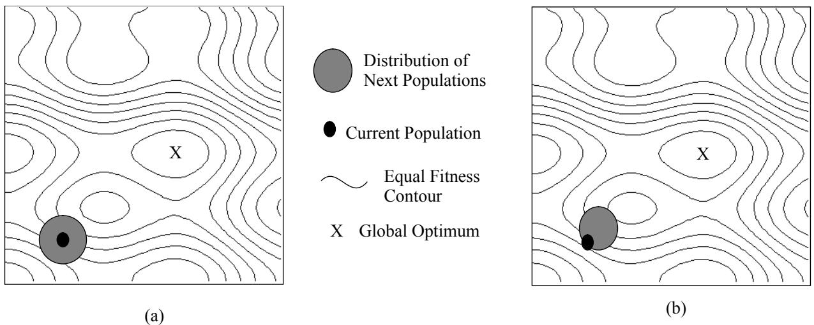
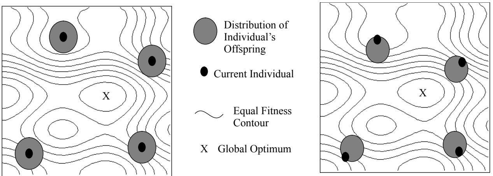

# Adaptive and Self-adaptive Evolutionary Computations

Peter J. Angeline

MD 0210 1801 State Route 17C Loral Federal Systems Owego, New York 13850 USA

Voice: (607)751-4109 Fax:(607)751-6025 pja@lfs.loral.com

This paper reviews the various studies that have introduced adaptive and selfadaptive parameters into Evolutionary Computations. A formal definition of an adaptive evolutionary computation is provided with an analysis of the types of adaptive and self-adaptive parameter update rules currently in use. Previous studies are reviewed and placed into a categorization that helps to illustrate their similarities and differences.

# Adaptive and Self-Adaptive Evolutionary Computations

Peter J. Angeline Loral Federal Systems - Owego pja@lfs.loral.com

# Introduction

Evolutionary Computations (ECs), which include genetic algorithms ([1], [2]), evolutionary programming ([3], [4]) and evolution strategies ([5], [6]), have proven themselves to be powerful yet general methods for search and optimization. Their generality stems from the unbiased nature of the standard operators used which perform well for problems where little or no domain knowledge is available. If knowledge about a problem is available, then a bias can be introduced directly into the representation or operators in order to remove undesirable candidates from the search and more quickly reach problem solutions (e.g. [7], [8] and others). Unfortunately, in many realistic situations where an evolutionary computation is required, a priori knowledge about the intricacies of the problem or the qualities of the evolving population is inaccessible.

Fortunately, having little a priori information about a problem does not necessarily prevent introducing an appropriate problem-specific bias into an evolutionary computation. For many tasks, it is possible to dynamically adapt aspects of an EC’s processing to anticipate the regularities of the environment and improve solution optimization or acquisition speed. Adaptive evolutionary computations are distinguished by their dynamic manipulation of selected parameters or operators during the course of evolving a problem solution. Adaptive ECs have an advantage over standard ECs in that they are more reactive to the unanticipated particulars of the problem and, in some formulations, can dynamically acquire information about regularities in the problem and exploit them.

Adaptive evolutionary computations can be separated largely by the level at which the adaptive parameters operate. Population-level techniques dynamically adjust parameters that are global to the entire population, such as global crossover frequency. Individual-level adaptive methods modify how a particular individual within the population is affected by the mutation operators.1 Component-level adaptive ECs dynamically alter how the individual components of each individual will be manipulated independently from each other.

This article begins with a formal definition of adaptive evolutionary computations and continues with terminology required to distinguish the variety of adaptive methods that appear in the literature. Next a survey of adaptive evolutionary computations is placed into the above categorization. Finally, a discussion that takes an overhead view of the field and makes a suggestion for future work is presented.

# Definitions and Terminology

# A Formal Definition of Adaptive Evolutionary Computations

The standardized problem for an evolutionary computation is given a function $\Gamma \colon \upsilon  \Re$ to find a structure, $\mathfrak { v } ^ { \circ }$ , such that $\Gamma$ returns a value at or near a desired extrema in its range. $\Gamma$ is called the fitness function for the problem and represents the metric for evaluation and often the only specific information about the problem. Without loss of generality, define the function, $\overline { { \Gamma } } { : } \overline { { \upsilon } }  \overline { { \mathfrak { R } } }$ which is the vector version of $\Gamma$ that simply applies $\Gamma$ to each member of a vector of structures and returns the a vector of fitness values. The vector of structures, $\upsilon$ , represents the evolving population for the problem. With these definitions, an evolutionary computation can be defined as an iteration of the following equation:

$$
\bar { \mathfrak { v } } _ { i + 1 } = \beta ( \bar { \mathfrak { v } } _ { i } , \Gamma ( \bar { \mathfrak { v } } _ { i } ) )
$$

where $\beta$ : $\overline { { \mathfrak { v } } } { \times } \overline { { \mathfrak { R } } } \to \overline { { \mathfrak { v } } }$ is the function that creates a new vector of structures, i.e. a new population, from the old. The particulars of $\beta$ are determined by the style of evolutionary computation being used and include components that select population members to be parents for the next population and the operators that manipulate them. A single iteration of Eq. (1) corresponds to a single generation in an evolutionary computation and is typically iterated until some predefined stopping criteria is met. Under this definition, related techniques such as simulated annealing [9] are also considered an evolutionary computation with a population size of one.

An adaptive evolutionary computation can then be defined as follows:

$$
\bar { \mathfrak { D } } _ { i + 1 } = \mathsf { \beta } \mathsf { \beta } \mathsf { \beta } _ { \delta } ( \bar { \mathfrak { v } } _ { i } , \bar { \Gamma } ( \bar { \mathfrak { v } } _ { i } ) , \bar { \bar { \delta } } _ { i } )
$$

where $\beta _ { \delta }$ : $\overline { { { \upsilon } } } \times \overline { { { \Re } } } \times \overline { { { \delta } } }  \overline { { { \upsilon } } }$ is the adaptive evolutionary computation that takes an additional vector argument, δ, often called the adaptive parameters or the strategy parameters. Strategy parameters are often numerical values or symbolic structures used by the reproduction operators, (e.g. the frequency of crossover or severity of mutation). Ideally, the strategy parameters are intended to take on values that supply a bias in the creation of offspring towards more fit solutions in the space. A second equation associated with an adaptive evolutionary computation defines the progression of values for the strategy parameters:

$$
\bar { \delta } _ { i + 1 } = \Delta ( \bar { \delta } _ { i } , \bar { \upsilon } _ { i } , \bar { \Gamma } ( \bar { \upsilon } _ { i } ) )
$$

where $\Delta : \overline { { { \delta } } } { \times } \overline { { { \upsilon } } } { \times } \overline { { { \mathfrak { R } } } }  \overline { { { \delta } } }$ maps the current vector of strategy parameters into the parameters to be used during the next reproduction using the current population and the fitness of each member as additional inputs. $\Delta$ is typically called the adaptive heuristic or the parameter update rule. The ultimate efficiency of an adaptive evolutionary computation follows directly from the choice of parameters to adapt and the method used for parameter update.

# Absolute and Empirical Update Rules

There are two distinct types of update rules for strategy parameters in an adaptive evolutionary computation. Absolute update rules compute a statistic over a set of generations or populations and use the changes in the statistic to determine when and/or how to modify the adaptive parameters. These update rules are termed “absolute” because they are predetermined and definitively specify how modifications should be made. Ideally, absolute update rules capture some lawful operation of the dynamics of the evolutionary computation over a broad range of problems. Absolute update rules are very much like heuristics of traditional artificial intelligence (AI) in that they are borne directly out of an understanding of the algorithm’s operation or the problem solving environment. And like the heuristics of AI, they are useful only as long as they reflect a fundamental truth about the dynamics required to solve the problem. For instance, the empirically determined 1/5 success rule of evolution strategies uses the following heuristic for determining how severely to mutate fixed-length real-valued vector representations with Gaussian noise:

From time to time during the ... search obtain the frequency of success, i.e., the ratio of the number of successes (successful mutations) to the total number of trials (mutations). If the ratio is greater than 1/5, increase the variance, if it is less than 1/ 5, decrease the variance. ([6] pp. 110).

Essentially, this heuristic codifies the valid association that if the ratio of successful mutations is larger than 1/5 then the distribution of offspring is too focussed and should be broadened. Likewise, if the ratio of successful mutations is less than 1/5 then the distribution of offspring is spread over too large of an area and should be more focussed. This heuristic is especially useful in smooth multimodal environments of the type well studied by the ES community but would be less applicable in discontinuous or extremely rough environments.

An alternative method for updating strategy parameters uses the variation and selection process evolving the population to also determine the appropriate values for the strategy parameters. Empirical update rules specify a separate mutation function for the strategy parameters and allow the competitive process inherent in the evolutionary computation to determine if the changes in the parameters are advantageous. When an evolutionary computation evolves the values for its adaptive parameters, then it is said to be self-adaptive.

The benefit of a particular modification when using an empirical update rule is determined by its persistence in the face of the natural dynamics of the evolutionary method rather than its agreement with any empirically determined absolute heuristic. The natural dynamics of an evolutionary computation encourages the promotion of those structures that more quickly lead to more fit individuals. If a modification is made to a strategy parameter in a particular individual using an empirical update rule, then if that modification is comparatively beneficial (or neutral) to offspring development, it will be persistent in the population along with the lineage of the individual. If it is detrimental then the individual’s offspring will eventually be supplanted by those with strategy parameters more beneficial to creating increasingly fit offspring. Thus, in an empirical update rule, no explicit form of credit assignment or evaluation is required since the natural dynamics of the evolutionary computation performs an empirical form of credit assignment ([10], [11]). Additional discussion and clarification of this point will be provided below in the section on individual-level adaptive parameters.

# Three Distinct Adaptive Levels

Adaptive evolutionary computations can be separated into three classes depending on what representational level of the evolutionary computation the adaptive parameters operate. Populationlevel adaptive parameters dynamically adjust parameters that are global to the population, such as the frequency of crossover. Individual-level adaptive techniques associate separate strategy parameters with each individual that determine which of an individual’s representational components to manipulate. Component-level adaptive parameters also associate strategy parameters with each population member that instead affect how each representational component of the individual is modified. At all levels the goal is the same: to dynamically adjust the values of the strategy parameters to bias the production of offspring toward more appropriate solutions more quickly. This section gives additional explanation and examples from the literature of each of these types of adaptive evolutionary computations.

# Population-level Adaptive Parameters

In basic evolutionary computations, the operational parameters of the algorithm are all global parameters for the population. Ideally, the operators that use these parameters are relatively unbiased with respect to the problem being solved. The effect of adaptively manipulating the global parameters on the production of new populations is illustrated in Figure 1. The figure shows the distribution of offspring populations that are generated from the current population both with and without population-level parameters on a fitness landscape where each distinct population is a single point in the space.1 Assuming unbiased mutation operators, the distribution of offspring will be reasonably undirected giving a relatively unbiased distribution of next populations. This places the brunt of the improvement process squarely on the culling of the population by the selection operator. Adaptive parameters can act to bias the production of offspring toward more likely beneficial portions of the search space, as shown in Figure 1b.

One method for introducing population-level adaptations is to adjust the global values for operator frequency and severity during the run. For instance, as described above, the $I / 5$ success rule of evolution strategies modifies the global mutation variance based on the ratio of successful mutations to unsuccessful mutations. Likewise, [13] presents a genetic algorithm that adapts the probability of applying its various reproductive operators based on offspring performance over an “adaptation window.”

  
Figure 1: Effect of introducing a population-level adaptive parameter into an evolutionary computation. (a) Population without adaptive parameters is unbiased in its manipulation of the population contents and must rely on selection alone to advance the state of the system. (b) Adding population-level parameters biases the production of offspring in a particular manner dictated by the update rule.

Another population-level adaptive method evolves the global interpretation of the representation of the population members. Several genetic algorithms have dynamically adjusted the global interpretation of their representation using population-level statistics. The ARGOT system described in [14] adaptively manipulates the interpretation of the representation of a genetic algorithm based on levels of allele convergence and variance. [15]’s dynamic parameter encoding (DPE) adaptively adds precision to the representation as their genetic algorithm converges on a single value for any $l$ -bit gene. Similarly, the delta-encoding method of [16] uses the Hamming distance between the best and worst strings in the population to determine when to adjust the interpretation of a genetic algorithm’s representation. When this value falls below one, the representation is modified to search an appropriately smaller region of the search space.

All the population-level adaptive methods reviewed above employ absolute update rules for the adaptive parameters. Each associates a particular statistic, such as population convergence or ratio of success, to the specification of how the adaptive parameters should be manipulated. In the global adaptation method described in [17], a single bit is added to each individual in that genetic algorithm. The percentage of these bits having a value of 1, taken over the entire population, determines the relative probability of applying uniform crossover ([18]) over single point crossover during the current reproduction cycle. As the number of these bits in the population with a value of 1 changes, so does the relative probability of applying uniform crossover over single point crossover. [19] describes a genetic program ([20]) with population-level adaptation that also uses an empirical update rule. Along with the evolving population of genetic programs, [19] coevolves a population of crossover operations whose fitness is given by their ability to construct more fit individuals from the current population. The crossover operators are passed through a selection and reproduction phase after creating the new population of genetic programs.

  
Figure 2: Effect of introducing individual-level adaptive parameters into an evolutionary computation. (a) Individuals without adaptive parameters are unbiased in their reproduction. (b) Adding individual-level parameters biases the production of offspring in particular manner dictated by the update rule.

# Individual-level Adaptive Parameters

Evolutionary computations are not like other search and optimization techniques in that they manipulate a population of potential solutions in parallel. Consequently, there is no need to assume that adaptive parameters associated with the technique are required to be necessarily global to the population. It is easy to envision that the optimal values for certain parameters may be distinct for each individual. For instance, a population member currently residing in a relatively flat region of the search space can be manipulated more severely than a population member in a more complex portion of the search space.

Individual-level adaptive methods associate strategy parameters with each member of the population that generally determine where to manipulate the individual. Figure 2 shows the advantage of applying an individual-level adaptation over non-adaptive individuals. Like population-level adaptive parameters, individual-level adaptive parameters can also guide the reproduction of offspring to more fruitful portions of the search space. Individual-level adaptive parameters have been introduced in a number of fashions in the evolutionary computation literature, encompassing various aspects of the algorithms and many forms of strategy parameter update rules.

In genetic algorithms, [21] associates strategy parameters with each allele of the fixed-length binary representation that determine where crossover occurs in the individual. Each strategy parameter can take on an integer value between 0 and 7. The probability, $p _ { i } ,$ that crossover occurs at the ith allele is given by:

$$
p _ { i } = \frac { x _ { i } } { \sum _ { j } x _ { j } }
$$

where $x _ { i }$ is the associated strategy parameter for ith allele. Strategy parameters are carried along with their associated allele during each crossover operation and are modified by mutation. Similarly, [22] offered a method for adapting crossover points in a GA. Each binary string encodes an additional $n$ -bit binary mask that determines which alleles are valid crossover points on the solution vector and which are not valid. Again, the strategy parameters are themselves subject to mutation and crossover. In a technique called local adaptation, [17] adds a single bit to each individual that determines whether single point or uniform crossover is used on that individual during reproduction. The bit is updated through the standard mutation and crossover operations applied to the population.

Note that the above strategy parameter update rules define these ECs to be self-adaptive. If the set of strategy parameters associated with an individual makes it more probable that important portions of the bit string are kept together after crossover, then the progeny of the individual will have an advantage over other population members. Likewise, if a set of parameters associated with an individual provides a disadvantage, then the offspring of the individual will be less likely to compete effectively with the other evolving population members. Eventually, offspring with deficient strategy parameters fall behind the progression of the population and are automatically removed. Thus the most suitable values for the self-adaptive parameters are determined empirically during the course of the run through what advantage they provide to the developing population members.

Some genetic programming studies have investigated adaptive parameters with absolute update rules, although not under this guise. The adaptive representation genetic program ([23], [24]) is an adaptive genetic program that employs a user provided “subtree fitness function” to measure the “fitness” of each subtree in each individual in the population. The method used in [23] preserves the subtrees identified as having better “fitness” by allowing crossover to occur only at their boundaries. Likewise, [25] describes a similar adaptive genetic program where the “worth” of each subtree is determined by any of several heuristics to provide “recombinative guidance”. The crossover operation used in [25] is interesting in that it replaces the subtree identified by the heuristics as being the “least fit” in each tree with the subtree identified as being “most fit” from the other.

Empirical update rules have also been used to evolve modular genetic programs. [26] describes an individual-level self-adaptive genetic program where each individual adapts its own definitions for a predetermined set of subroutines. When evolving genetic programs with automatically defined functions, the standard subtree crossover for GP is used to manipulate both the main body and the developing functions in the individual. When two evolving programs are crossed, either the main programs are crossed or the corresponding function definitions are crossed between the parents. [27] extends this method to also allow the number and interface of an individual’s subroutines to also adapt. The Genetic Library Builder (GLiB) ([28], [29]) uses an empirical update rule to allow the emergence of hierarchical representations for each individual in the population. A mutation operator, compress, is added to the genetic program that randomly selects a portion of a program and uses it to define a new subroutine, also called a module. The subtree is then removed from the individual and replaced by a call to the newly defined module. Because the code for a module is literally removed from the evolving program, crossover cannot separate its subtrees. The worth of a created subroutine emerges through its usage, much as argued above for other empirical update rules. [30] describes another self-adaptive method for crossover of genetic programs similar to the method of [21] for GAs. In selective self-adaptive crossover, the strategy parameters are organized as a tree, called the parameter tree, with the same shape as the program tree. Each strategy parameter, $\boldsymbol { x } _ { i } ,$ is a real value with the probability of crossover occurring at the ith subtree given by Eq. (4) above. Strategy parameters are passed on to offspring through subtree crossover between the parameter trees of the parents and then mutated by adding Gaussian noise to each value in the parameter tree. [30] showed that this method consistently performed better than non-adaptive crossover of genetic programs.

Individual-level adaptive parameters with empirical update rules have also been successfully employed in evolutionary programming. [31] investigated a method of individual-level self-adaptation for an evolutionary program evolving finite state machines. In selective self-adaptation, strategy parameters are associated with each state, transition and output symbol of an evolving finite state machine. These values were used as in Eq. (4) to determine which component of the representation would be manipulated for each individual mutation operation performed. [31] showed that this self-adaptive mutation scheme performed significantly better than the standard EP non-adaptive mutation.

# Component-level Adaptive Parameters

Component-level adaptations associate adaptive parameters with each distinct component of an evolving individual that determine how that component will be modified during reproduction. Their effect on the evolutionary method is much like the effect of individual-level adaptive methods described in Figure 2. Component-level adaptive methods are distinguished by the fact that they specify how to manipulate a single component independent from the other components in an evolving individual.

Component-level self-adaptive methods have been studied most extensively in ES and EP. [6] associates a self-adaptive variance parameter to each element of the real valued vector representation evolved in evolution strategies. Offspring are created from each parent by the following rules:

$$
x _ { i } ^ { \prime } = x _ { i } + \mathrm { N } ( 0 , \sigma _ { i } )
$$

$$
\boldsymbol { \mathfrak { o } } _ { i } ^ { \prime } = \boldsymbol { \mathfrak { o } } _ { i } \cdot \exp ( \tau \cdot \mathrm { N } ( 0 , 1 ) + \tau \cdot \mathrm { N } _ { i } ( 0 , 1 ) )
$$

where $x _ { i }$ is the ith component of the fixed-length real-valued vector representation, $\sigma _ { \imath }$ is the strategy parameter for the ith component, $\tau$ and $\tau ^ { \ ' }$ are operator-set parameters, $\mathrm { { N } } ( \mu , \sigma )$ is a normally distributed random variable with mean $\mu$ and standard deviation $\sigma$ , and $\mathrm { N } _ { i } ( 0 , 1 )$ is a standard normally random variable resampled anew for the ith component of $\boldsymbol { \sigma }$ . Note that Eq. (6) applies noise to the strategy parameters with a Log-Normal distribution. This technique distributes solutions in directions that have provided improvements for the individual’s ancestors. [6] extended this method to allow for arbitrary correlations between the adaptive parameters.

[32] independently offered a similar self-adaptive procedure for evolutionary programming in which the standard deviations of mutation for real-valued solution vectors are altered using a Gaussian random variable rather than Log-Normal. Specifically, the method is:

$$
x _ { i } ^ { \prime } = x _ { i } + \mathrm { N } ( 0 , \sigma _ { i } )
$$

$$
\bar { \mathbf { o } } _ { i } ^ { \prime } = \bar { \mathbf { o } } _ { i } + \bar { \mathbf { \alpha } } \cdot \bar { \mathbf { o } } _ { i } \cdot \mathrm { N } \left( 0 , 1 \right)
$$

where $x _ { i }$ is the ith component of the fixed-length real-valued vector representation, $\sigma _ { \imath }$ is the strategy parameter for the ith component and $\alpha$ is a scaling parameter. If any ${ \boldsymbol { \sigma } } _ { i } ^ { \prime }$ becomes non-positive, it is reset to a small arbitrary value ε. [33] incorporated an additional procedure to allow for arbitrary correlations between the strategy parameters. Comparisons in both [34] and [35] indicated that the Log-Normal method of [6] (Eq. 6) generally outperforms the method of [33] when limited to uncorrelated perturbations of the strategy parameters. No comparisons have been made between the methods incorporating complete covariance matrices.

[31] applied a similar self-adaptive method to the evolution of finite state machines. Their multimutational self-adaptation method associated strategy parameters with each state, transition and output symbol of a finite state machine. Each strategy parameter designated the absolute probability of modification for that particular component by its associated mode of mutation. Strategy parameters for offspring were mutated by adding Gaussian noise to each strategy parameter of the parent, as in Eq. (8). The Gaussian update rule was the only self-adaptation update rule investigated in that study.

Component-level self-adaptation has been applied to other discrete representations. [36] added “freezing/unfreezing” mutations to an evolutionary program evolving finite state machines. Binary strategy parameters were associated with each component of the finite state machine representation such that any “frozen” component was protected from manipulation until “unfrozen.” [37] and [38] investigates the self-adaptation of component-level strategy parameters for mutating fixed-length binary strings in a genetic algorithm.

Similar to [31], [30] describes a component-level self-adaptive technique for crossover in a genetic program. As in selective self-adaptive crossover described above, in self-adaptive multicrossover a parameter tree is associated with each individual in the population. However, rather than interpret the strategy parameters relatively, each value in the parameter tree is the absolute probability that a crossover will occur at that position of the individual on this reproduction cycle. Consequently, the parameter tree often designates that multiple crossovers are performed between two parents to create offspring. Positions that are designated for crossover are iteratively paired and swapped between the parents.

# Discussion

The ultimate effectiveness of any evolutionary computation is determined by the relationship between the shape of the response surface (landscape) being searched and the operations that are used to generate new individuals. The rate of optimization or acquisition may be improved if the offspring distribution can be dynamically tuned to follow the contours of the landscape. This is the broad goal of all adaptive techniques, to dynamically acquire information about the response surface being traversed and adjust the evolutionary computation appropriately.

There is very little information about which of the adaptive levels, if any, is most effective in certain circumstances. While the number of parameters for a population-level adaptive technique is smallest, and consequently easiest to adapt, they may not provide enough control over the evolutionary computation to permit the most efficient processing. This is because the best way to manipulate an individual may be significantly different than how to manipulate the population on average. In contrast, component-level adaptation affords the most adaptive control but the number of parameters may be prohibitive in certain circumstances to adapt efficiently. Component-level methods have certainly performed exceptionally when optimizing fixed-length, real-valued vectors with ES or EP. Comparisons in [30] and [31] suggest that some component-level adaptive techniques used in variable-length discrete representations are competitive with individual-level methods in performance but tend to develop more slowly. Comparative experiments across all adaptive levels and parameter update rules seem like a logical next step in the progression of these algorithms.

There is no reason to believe that having only one level of adaptation in an evolutionary computation is optimal. On the contrary, combining methods at different levels may actually provide significant advantages in some environments. Some effort is required to determine effect methods for combining adaptive methods at different levels and determine when they are useful.

# Acknowledgments

Thanks to Justinian Rosca for providing an in-depth review of a preliminary version of this work.

# Список литературы

[1] J.H. Holland, Adaptation in Natural and Artificial Systems, Ann Arbor, MI: University of Michigan Press, 1975.   
[2] Goldberg, D. E. Genetic Algorithms in Search, Optimization and Machine Learning, Reading, MA: Addison-Wesley, 1989.   
[3] L.J. Fogel, A.J. Owens and M.J. Walsh, Artificial Intelligence through Simulated Evolution, New York: John Wiley, 1966.   
[4] D.B. Fogel, Evolutionary Computation: Toward a New Philosophy of Machine Intelligence, Piscataway, NJ: IEEE Press, 1995.   
[5] I. Rechenberg, Evolutionsstrategie: Optimierung Technischer Systeme nach Prinzipien der Biologischen Evolution, Stuttgart: Frommann-Holzberg Verlag, 1973.   
[6] H.-P. Schwefel, Evolution and Optimum Seeking, Chichester, UK: John Wiley, 1995.   
[7] J. J. Grefenstette, “Incorporating problem specific knowledge into genetic algorithms,” In Genetic Algorithms and Simulated Annealing, L. Davis ed., Los Altos, CA: Morgan Kaufmann, pp. 42-60, 1987.   
[8] Z. Michalewicz, Genetic Algorithms $^ +$ Data Structures $=$ Evolution Programs, New York: Springer-Verlag, 1992.   
[9] S. Kirkpatrick, C. D. Gelatt, and M. P. Vecchi, “Optimization by simulated annealing,” Science, 220, pp. 671-680, 1983.   
[10] P. J. Angeline, Evolutionary Algorithms and Emergent Intelligence, Doctoral Dissertation, The Ohio State University, Computer and Information Sciences Department, 1993.   
[11] P. J. Angeline (1994) “Genetic Programming and Emergent Intelligence”, in Advances in Genetic Programming, K. Kinnear (ed.), Cambridge, MA: MIT Press, pp. 75-98, 1994.   
[12] T. Jones, Evolutionary Algorithms, Fitness Landscapes and Search, Doctoral Dissertation, Computer Science Department, University of New Mexico, 1995.   
[13] L. Davis, “Adapting Probabilities In Genetic Algorithms”, Proc. of the Second International Conference on Genetic Algorithms, J.J. Grefenstette (ed.), Hillsdale, NJ: Lawrence Erlbaum, pp 61 - 69, 1989   
[14] C. G. Shaefer, “The ARGOT System: Adaptive Representation Genetic Optimizing Technique”, Proc. of the Second International Conference on Genetic Algorithms, J.J. Grefenstette (ed.), Hillsdale, NJ: Lawrence Erlbaum, 1987.   
[15] N. N. Schaudolph, and R. K. Belew, “Dynamic parameter encoding for genetic algorithms,” Machine Learning, 9 (1), pp. 9-22, 1992.   
[16] D. Whitley, K. Mathias, and P. Fitzhorn, “Delta coding: an iterative search strategy for genetic algorithms”, Proc. of the Fourth International Conference on Genetic Algorithms, R. K. Belew and L. B. Booker (eds.), San Mateo, CA: Morgan Kaufmann, pp 77-84, 1991.   
[17] W. M. Spears, “Adapting crossover in evolutionary algorithms,” in Evolutionary Programming IV: Proceedings of the Fourth Annual Conference on Evolutionary Programming, J. McDonnell, R. Reynolds and D. Fogel (eds.), Cambridge, MA: MIT Press, pp. 367-384, 1995.   
[18] G. Syswerda, “Uniform crossover in genetic algorithms,” in Proc. of the Third international Conference on Genetic Algorithms, J. D. Shaffer (ed.), San Mateo, CA: Morgan Kaufmann, pp. 2-8, 1989.   
[19] E. Teller, “Evolving programmers: The co-evolution of intelligent recombination operators,” in Advances in Genetic Programming II, P. Angeline and K. Kinnear (eds.), Cambridge, MA: MIT Press, In Press.   
[20] J. R. Koza, Genetic Programming: On the Programming of Computers by Means of Natural Selection, Cambridge, MA: MIT Press, 1992.   
[21] R. S. Rosenberg, Simulation of genetic populations with biochemical properties. Doctoral dissertation, University of Michigan, Dissertation Abstracts International, 28 (7) 2732B. (University Microfilms No. 67-17,836), 1967.   
[22] J. D. Schaffer and A. Morishima, “An Adaptive Crossover Distribution Mechanism for Genetic Algorithms,” in Proc. of the Second International Conference on Genetic Algorithms, J.J. Grefenstette (ed.), Hillsdale, NJ: Lawrence Erlbaum, pp. 36-40, 1987.   
[23] J. P. Rosca, “Hierarchical self-organization in genetic programming,” in Proc. of the Eleventh International Conference on Machine Learning, 1994.   
[24] J. P. Rosca, “Genetic programming exploratory power and the discovery of functions,” in Evolutionary Programming IV: Proceedings of the Fourth Annual Conference on Evolutionary Programming, J. McDonnell, R. Reynolds and D. Fogel (eds.), Cambridge, MA: MIT Press, pp. 719-736, 1995.   
[25] H. Iba and H. de Garis, “Extending genetic programming with recombinative guidance,” in Advances in Genetic Programming II, P. Angeline and K. Kinnear (eds.), Cambridge, MA: MIT Press, In Press.   
[26] J. R. Koza, Genetic Programming II: Automatic Discovery of Reusable Subprograms, Cambridge, MA: MIT Press, 1994.   
[27] J. R. Koza and D. Andre, “Evolution of both architecture and the sequence of workperforming steps of a computer program using genetic programming with architecturealtering operations,” in Advances in Genetic Programming II, P. Angeline and K. Kinnear (eds.), Cambridge, MA: MIT Press, In Press.   
[28] P. J. Angeline and J. B. Pollack, “The Evolutionary Induction of Subroutines,” Proceedings of the 14th Annual Conference of the Cognitive Science Society, Hillsdale, NJ: Lawrence Erlbaum Associates, pp. 236-241, 1992.   
[29] P. J. Angeline and J. B. Pollack, “Coevolving High-Level Representations,” Artificial Life III, C.G. Langton (ed.), Reading, MA: Addison-Wesley, pp. 55-71, 1994.   
[30] P. J. Angeline, “Two Self-Adaptive Crossover Operators for Genetic Programming”, in Advances in Genetic Programming II, P. Angeline and K. Kinnear (eds.), Cambridge, MA: MIT Press, In Press.   
[31] L. J. Fogel, D.B. Fogel and P. J. Angeline, “A preliminary investigation on extending evolutionary programming to include self-adaptation on finite state machines”, Informatica, 18 (4), pp. 387-398, 1994.   
[32] D. B. Fogel, L. J. Fogel and J. W. Atmar, “Meta-Evolutionary Programming,” Proc. of the 25th Asilomar Conference on Signals, Systems and Computers, R. Chen (ed.), San Jose, CA: Maple Press, pp. 540-545, 1991.   
[33] D. B. Fogel, L. J. Fogel, W. Atmar and G. B. Fogel (1992) “Hierarchic Methods of Evolutionary Programming,” Proceedings of the First Annual Conference on Evolutionary Programming, D. B. Fogel and W. Atmar (eds.), La Jolla, CA: Evolutionary Programming Society, pp. 175-182, 1992.   
[34] T. Bäck and H.-P. Schwefel, “An Overview of Evolutionary Algorithms for Parameter Optimization,” Evolutionary Computation, 1 (1), pp. 1-24, 1993.   
[35] N. Saravanan and D. B. Fogel, “Learning Strategy Parameters in Evolutionary Programming: An Empirical Study,” Proceedings of the Third Annual Conference on Evolutionary Programming, A.V. Sebald and L. J. Fogel (eds.), River Edge, NJ: World Scientific Publishing, pp. 269-280, 1994.   
[36] P. J. Angeline and J. B. Pollack (1993) “Evolutionary Module Acquisition,” Proceedings of the Second Annual Conference on Evolutionary Programming, D.B. Fogel and W. Atmar (eds.), La Jolla, CA: Evolutionary Programming Society, pp. 154-163.   
[37] T. Bäck, “Self-adaptation in genetic algorithms,” in Proc. of the First European Conference on Artificial Life, Cambridge, MA: MIT Press, 1991.   
[38] T. Bäck, “The interaction of mutation rate, selection, and self-adaptation within a genetic algorithm,” in Parallel Problem Solving from Nature 2, 1992.