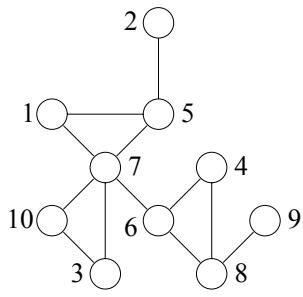
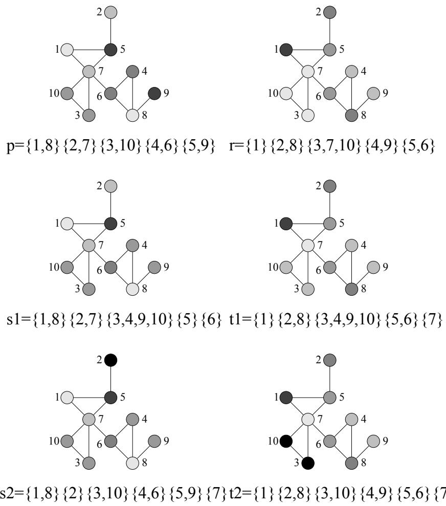
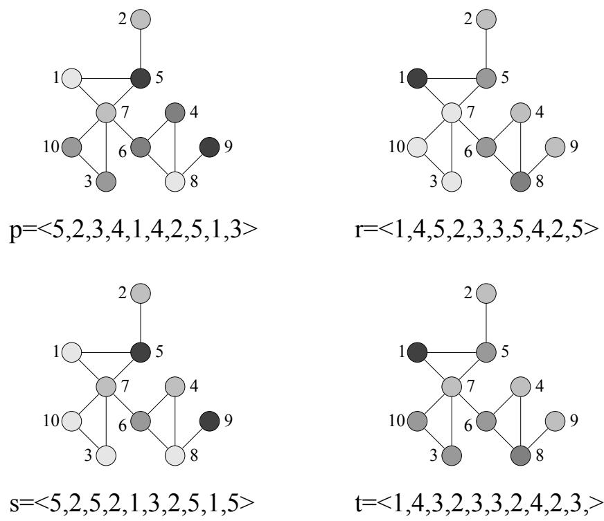
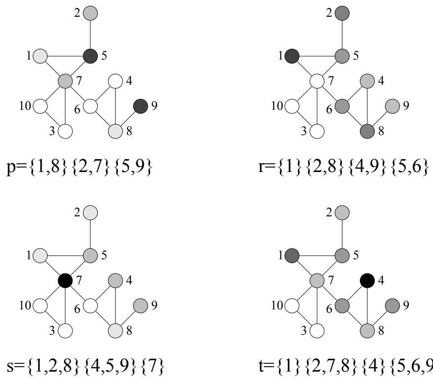
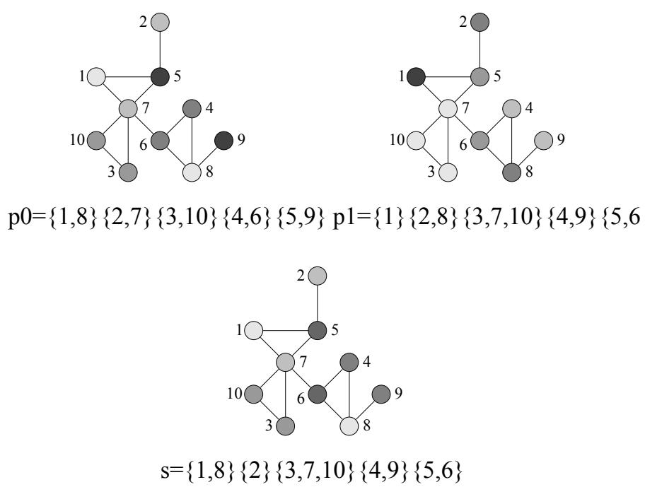
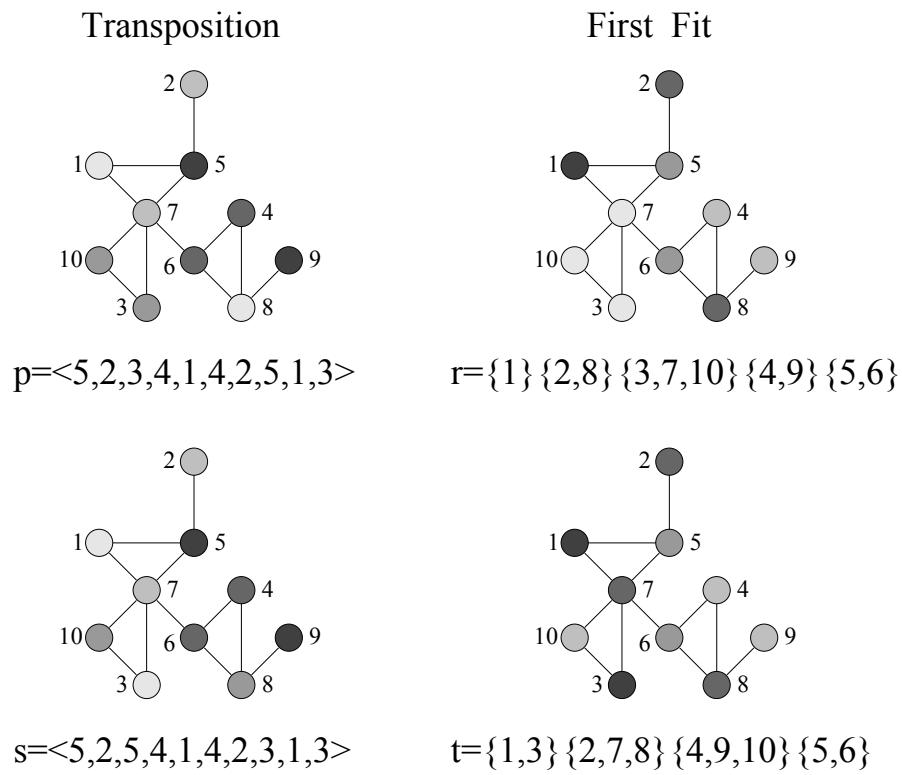

# EFFICIENT GRAPH COLORING WITH PARALLEL GENETIC ALGORITHMS

Zbigniew Kokosinski  , Krzysztof Kwarciany, Marcin Kolodziej

Faculty of Electrical and Computer Eng. Cracow University of Technology   
ul. Warszawska 24   
31{155 Krakow, Poland   
e-mail: zk@pk.edu.pl

Abstract. In this paper a new parallel genetic algorithm for coloring graph vertices is presented. In the algorithm we apply a migration model of parallelism and dene two new recombination operators SPPX and CEX. For comparison two problem{ oriented crossover operators UISX and GPX are selected. The performance of the algorithm is veried by computer experiments on a set of standard graph coloring instances.

Keywords: graph coloring, parallel genetic algorithm, migration model, CEX crossover, SPPX crossover

# 1 INTRODUCTION

Graph $k$ {colorability problem ("chromatic number problem") belongs to the class of NP{hard combinatorial problems [13, 19]. This decision problem is dened for an undirected graph $G = ( V , E )$ and positive integer $k \leq | V |$ : is there an assignment of available $k$ colors to graph vertices, providing that adjacent vertices receive different colors ? With additional assumptions many variants of the coloring problem can be dened such as equitable coloring, sum coloring, contrast coloring, harmonious coloring, circular coloring, consecutive coloring, list coloring etc. [17, 25]. In optimization version of the basic problem called GCP, a con
ict{free coloring with minimum number of colors is searched. Intensive research conducted in this area resulted in a large number of exact and approximate algorithms, heuristics and metaheuristics [24, 33, 34]. However, the reported results are often dicult to compare due to specic assumptions, dierent algorithms and their implementation details, tuning of parameters, computing platforms, test data sets etc. GCP was the sub ject of Second DIMACS Implementation Challenge held in 1993 [18] and Computational Symposium on Graph Coloring and Generalizations in 2002. A collection of graph coloring instances in DIMACS format and summary of results are available at [35, 36, 37].

Genetic algorithm (GA) is a metaheuristic often used for GCP [8, 9, 10, 11, 12, 20, 29, 32]. Recently a number of parallel versions of genetic algorithms (PGA) were studied. One popular model is master{slave in which a part of computations is assigned by master processor to slave processors [4]. Another approach is based on co{evolution of a number of populations that exchange genetic informations during the evolutionary process according to a communication pattern [1, 2, 7]. PGA were applied to many hard optimization problems (e.g. [27]) but, to our best knowledge, they were not used so far to GCP.

In this paper some results of experiments with parallel genetic algorithms for graph coloring problem are described. Some earlier results obtained by the authors were published in [22, 26].

After several initial experiments with alternative parallel models the migration model of parallelism was chosen. The main purpose of the master{slave model is speeding up processing of one global population by parallelization of computations. In the migration model of PGA we can expect that interaction between co{evolving populations can aect also the quality of the solution. If speedup is not essential one can simulate and test migration{based PGA with the help of a sequential program.

In the paper two new recombination operators for coloring chromosomes are proposed: SPPX (Sum{Product Partition Crossover) in which simple set operations and random mechanisms are implemented, and CEX (Con
ict Elimination Crossover) that reduces the number of color con
icts with the help of selective copy operations. For reference we use two well known operators UISX (Uniform Independent Set Crossover) [9] and GPX (Greedy Partition Crossover) [12]. They both are problem{specic crossovers designed particularly for GCP and passed a series of experimental verication in GA environment [14, 21, 23].

In experimental part of the paper widely accepted DIMACS benchmark graphs were used. The obtained results are very promissing and encourage future research focused on PGA and new genetic operators for a large class of graph coloring problems.

# 2 GRAPH COLORING PROBLEM - DEFINITION AND NOTATIONS

Let us dene formally the optimization problem GCP.

For given graph $G ( V , E )$ , where : $V$ | set of graph vertices, $| V | = n$ , and $E -$ set of graph edges, $| E | = m$ , the optimization problem GCP is formulated as follows: nd the minimum positive integer $k$ , $k \leq n$ , and a function $c : V \longrightarrow \{ 1 , . . . , k \}$ , such that $c ( u ) \neq c ( v )$ whenever $( u , v ) \in E$ . The obtained value of $k$ is refered to as graph chromatic number $\chi ( G )$ .

  
Fig. 1. Exemplary graph G(V,E)

Similarly, graph edge coloring problem for given graph $G ( V , E )$ can be dened. One can nd solution to mimimum edge coloring by solving vertex coloring problem for edge graph $G _ { e } ( V _ { e } , E _ { e } )$ associated with the given graph $G ( V , E )$ [24, 17]. An exemplary graph $G ( V , E )$ with ten vertices is shown in Fig.1.

In graph coloring problem $k$ {colorings of graph vertices are encoded in chromosomes representing set partitions with exactly $k$ blocks. There are two equivalent notations for vertex colorings that are commonly used in algorithm design.

In assignment representation available colors are assigned to an ordered sequence of graph vertices. Thus, the vector $\mathrm { c } = < \mathrm { c } [ 1 ] , \mathrm { c } [ 2 ]$ , $\ldots , \operatorname { c } [ \mathrm { n } ] >$ . represents a vertex coloring. For the graph in Fig.1, an optimal 3{coloring is denoted by vector $\mathrm { c } { = } { < } 1 , 2 , 3 , 2 , 3 , 1 , 2 , 3 , 2 , 1 >$ .

In partition representation a vertex coloring is a unique sequence of partition blocks in Hutchinson representation [15]. Each block of partition p does correspond to a single color. Elements inside each block are ordered in increasing lexicographic order, and all blocks are ordered increasingly according to the value of their rst element. For our graph the same optimal 3{coloring is denoted by partition $\mathrm { p } { = } \{ 1 , 6 , 1 0 \} \{ 2 , 4 , 7 , 9 \} \{ 3 , 5 , 8 \}$ .

# 3 MODELS OF PARALLEL GENETIC ALGORITHMS

There are many models of parallelism in evolutionary algorithms: master{slave PGA, migration based PGA, diusion based PGA, PGA with overlaping subpopulations, population learning algorithm, hybrid models etc. [3, 4, 5, 6, 16, 28, 30, 31].

The above models are characterized by the following criteria:

 number of populations : one, many;   
 population types : disjoint, overlaping;   
 population topologies : various graph models;   
 interaction model : isolation, migration, diusion;   
 recombination, evaluation of individuals, selection : distributed/local, centralized/global;   
 synchronization on iteration level: synchronous/asynchronous algorithm. The most common models of PGA are:   
 master-slave : one global population, global genetic operations, tness functions computed by slave processors);   
 massively parallel (cellular): static overlapping subpopulations with a local structure, local genetic operations and evaluation;   
 migration (with island as a submodel): static disjoint subpopulations/islands, local genetic operations and migration;   
 hybrid : combination of one model on the upper level and other model on the lower level (the speedup achieved in hybrid models is equal to product of level speedups).

# 4 MIGRATION MODEL OF PARALLEL GENETIC ALGORITHM

Migration models of PGAs consist of a nite number of disjoint subpopulations that evolve in parallel on their "islands" and only occasionally exchange genetic informations under control of a migration operator. Co{evolving subpopulations are built of individuals of the same type and are ruled by one adaptation function. The selection process is decentralized.

procedure: genetic algorithm for a subpopulation   
begin iteration counter $\texttt { t } = \texttt { 0 }$ ; initialization of subpopulation $P _ { t }$ ; evaluation of $P _ { t }$ ; while (not termination condition) do begin parental population $T _ { t } \ =$ selection from $P _ { t }$ ; offspring population $O _ { t } \ =$ crossover and mutation on $T _ { t }$ ; evaluation of $\{ P _ { t } \cup O _ { t } \}$ ; $P _ { t + 1 } =$ selection from $\{ P _ { t } \cup O _ { t } \}$ ; if (migration condition) then migration of representatives of $P _ { t + 1 }$ to all other subpopulations $\mathrm { ~ \bf ~ t ~ } = \mathrm { ~ \bf ~ t ~ } + \mathrm { ~ \bf ~ 1 ~ }$ ; end;   
end;

In our model the migration is performed on a regular basis. During the migration phase every island sends its representatives (emigrants) to all other islands and receives the representatives (immigrants) from all co{evolving subpopulations. This topology of migration re
ects so called "pure" island model. The migration process is fully characterized by migration size, distance betweeen populations and migration scheme. Migration size determines the emigrant fraction of each population. This parameter is limited by capacity of islands to accept immigrants. The distance between migrations determines how often the migration phase of the algorithm occurs. Three migration schemes are applied: no migration, migration of randomly selected individuals and migration of best individuals of the subpopulation. Genetic algorithm performed in parallel for each subpopulation is shown in Fig.2. In our algorithm a specic model of migration is applied in which islands use two copies of genetic information: migrating individuals still remain members of their original subpopulation. In other words they receive new "membership" without losing the former one. Incoming individuals replace the chromosomes of host subpopulation at random. Then, a selection process is performed. The rationale behind such a model is as follows. Even if the best chromosomes of host subpopulation are eliminated they shall survive on other islands where their copies were sent. On the other hand any eliticist scheme or preselection applied to the replacement phase leads to premature elimination of worse individuals and lowers the overall diversity of subpopulation.

# 5 GENETIC OPERATORS FOR GCP

In this section a collection of genetic crossover, mutation and selection operators is introduced that is used in our PGA. Three recombination operators: CEX, UISX, GPX and the mutation operator First Fit were designed especially for GCP. The operator SPPX and the mutation Transposition are more versatile. The cost function and selection operator is adapted for this version of GCP.

All examples in this section refer to the graph instance shown in Fig.1.

# 5.1 Sum{Product Partition Crossover

The rst recombination operator called Sum{Product Partition Crossover (SPPX) employs for ospring generation simple set sum and set product operations on block of partitions and a random mechanism of operand selection from randomly determined 2 parental chromosomes. As a result 0, 2 or 4 children are obtained. The procedure SPPX(p,r,s1,t1,s2,t2,sum,product) contains two procedures SUM(p,r,s,t) and PRODUCT(p,r,s,t), which are applied to the pair of chromosomes $\mathrm { p } { = } \{ V _ { 1 } ^ { p } , \ldots , V _ { k } ^ { p } \}$ $\boldsymbol { \mathrm { r } } { = } \{ V _ { 1 } ^ { r } , \ldots , V _ { l } ^ { r } \}$ . Each one may produce a pair of chromosomes $s = \{ V _ { 1 } ^ { s } , \ldots , V _ { m } ^ { s } \}$ and $\mathrm { t } = \{ V _ { 1 } ^ { t } , \ldots , V _ { n } ^ { t } \}$ with probabilities of elementary operations satisfying

procedure: SPPX (p,r,s1,t1,s2,t2,sum,product)   
begin $\mathbf { s } \ 1 = \mathtt { t } \ 1 = \mathtt { s } 2 = \mathtt { t } 2 = \varnothing$ ; generate random numbers rand1, rand2 : 0 rand1, rand2 $\leq 1$ ; if rand1 $\leq$ sum then begin SUM(p,r,s1,t1); sum $= 1$ ; end else $\mathtt { s u m = 0 }$ ; if rand2 $\leq$ product then begin PRODUCT(p,r,s2,t2); product $= 1$ ; end else produc $\mathtt { t } = 0$ ;   
end SPPX;   
procedure: SUM $( \mathtt { p } , \mathtt { r } , \mathtt { s } , \mathtt { t } )$   
begin select at random h $\mathbf { \leq h } \mathbf { \leq k } )$ and $\begin{array} { r l } { | } & { { } ( 1 { \le } \mathrm { j } { \le } 1 ) } \end{array}$ ; $V _ { 1 } ^ { s } = V _ { 1 } ^ { t } = ( V _ { h } ^ { p } \cup V _ { j } ^ { r } )$ ; for $\mathrm { ~ i ~ } = \mathrm { ~ 1 ~ }$ to k do if $\mathrm { ~ i ~ } \neq \mathrm { ~ h ~ }$ do if $( V _ { i } ^ { p } \setminus V _ { j } ^ { r } )$ nonempty then add next block $V _ { i } ^ { p } \setminus \dot { V } _ { j } ^ { r }$ to s; for $\mathrm { ~ i ~ } = \mathrm { ~ 1 ~ }$ to l do if $\mathrm { ~ i ~ } \neq \mathrm { ~ j ~ }$ do if $( V _ { i } ^ { r } \setminus V _ { h } ^ { p } )$ nonempty then add next block $V _ { i } ^ { r } \setminus V _ { h } ^ { p }$ to t;   
end SUM;   
procedure: PRODUCT $( { \mathfrak { p } } , { \mathfrak { r } } , { \mathfrak { s } } , { \mathfrak { t } } )$   
begin select at random h $\mathbf { \leq h } { \leq } \mathbf { k } )$ and $\mathrm { j } ( 1 { \leq } \mathrm { j } { \leq } 1 )$ ; $V _ { 1 } ^ { s } = V _ { 1 } ^ { t } = ( V _ { h } ^ { p } \cap V _ { j } ^ { r } )$ ; for $\mathrm { ~ i ~ } = \mathrm { ~ 1 ~ }$ to k do if $\mathrm { ~ i ~ } \neq \mathrm { ~ h ~ }$ do if $( V _ { i } ^ { p } \setminus V _ { 1 } ^ { s } )$ nonempty then add next block $V _ { i } ^ { p } \setminus V _ { 1 } ^ { s }$ to s; for $\mathrm { ~ i ~ } = \mathrm { ~ 1 ~ }$ to l do if $\mathrm { ~ i ~ } \neq \mathrm { ~ j ~ }$ do if $( V _ { i } ^ { r } \setminus V _ { 1 } ^ { t } )$ nonempty then add next block $V _ { i } ^ { r } \setminus V _ { 1 } ^ { t }$ to t;   
end PRODUCT;

$0 <$ product $=$ Prob(PRODUCT) $\leq \mathrm { s u m } { = } \mathrm { P r o b } ( \mathrm { S U M } ) \leq 1$ . If new ospring is generated by the procedures SUM or PRODUCT the variables sum or product are set to 1, respectively. Otherwise, they are set to 0.

A pseudocode of the procedure SPPX is presented in Fig.3.

An application of the operator SPPX is shown in Example 1.

# Example 1

Two parents represent dierent 5{colorings of a graph with 10 vertices $\mathrm { p } { = } \{ 1 { , } 8 \} \{ 2 { , } 7 \} \{ 3 { , } 1 0 \} \{ 4 { , } 6 \} \{ 5 { , } 9 \}$ and $\mathrm { r = \{ 1 \} \{ 2 , 8 \} \{ 3 , 7 , 1 0 \} \{ 4 , 9 \} \{ 5 , 6 \} }$ . Let us assume $\scriptstyle \mathrm { s u m = P r o b ( S U M ) = 0 . 8 }$ , produc $=$ Prob(PRODUCT) $= 0 . 7$ .

  
Fig. 4. An illustration of SPPX crossover (see Example 1)

The procedure SPPX(p,r,s1,t1,s2,t2,sum,product) is called.

Let rand $1 { = } 0 . 3$ and the procedure $\operatorname { S U M } ( { \mathrm { p } } , { \mathrm { r } } , { \mathrm { s } } 1 , \operatorname { t } 1 )$ is called, where p,r are parents and s1,t1 are ospring chromosomes. Let us assume $\mathrm { h } { = } 3$ , $\mathrm { j } { = } 4$ , where h,j | randomly selected block indices of parental chromosomes p and r, respectively. Thus, the corresponding partition blocks are $V _ { 3 } ^ { p } = \{ 3 , 1 0 \}$ and $V _ { 4 } ^ { r } = \{ 4 , 9 \}$ .

Their sum gives one common block $V _ { 1 } ^ { s } = V _ { 1 } ^ { t } = \{ 3 , 4 , 9 , 1 0 \}$ in ospring chromosomes. Then the elements of the common block are removed from p and r and their remaining blocks are copied to ospring chromosomes s1 and $\mathrm { t } 1$ , respectively. After lexicographic reordering of blocks the partitions $\mathrm { { s 1 = \{ 1 , 8 \} \{ 2 , 7 \} \{ 3 , 4 , 9 , 1 0 \} \{ 5 \} \{ 6 \} } }$ and $\scriptstyle \mathrm { t } 1 = \{ 1 \} \{ 2 , 8 \} \{ 3 , 4 , 9 , 1 0 \} \{ 5 , 6 \} \{ 7 \}$ are obtained, respectively. Next, the variable sum is set to 1.

Let rand2=0.4 and the procedure PRODUCT(p,r,s2,t2) is called, where p,r are parents and s2,t2 are ospring chromosomes. Let us assume $\mathrm { h } { = } 2$ , $\mathrm { j } = \mathrm { 3 }$ , where h,j | randomly selected block indices of parental chromosomes p and r, respectively. Thus, the corresponding partition blocks are $V _ { 2 } ^ { p } = \{ 2 , 7 \}$ and $V _ { 3 } ^ { r } = \{ 3 , 7 , 1 0 \}$ . Their product gives one common block $V _ { 1 } ^ { s } = V _ { 1 } ^ { t } = \{ 7 \}$ in ospring chromosomes. Then the elements of the common block are removed from p and r and their remaining blocks are copied to ospring chromosomes s2 and $\mathrm { t 2 }$ , respectively. After lexicographic reordering of blocks the resulting partitions are $\mathrm { s 2 } = \{ 1 , 8 \} \{ 2 \} \{ 3 , 1 0 \} \{ 4 , 6 \} \{ 5 , 9 \} \{ 7 \}$ and $\mathrm { t 2 } { = } \{ 1 \} \{ 2 , 8 \} \{ 3 , 1 0 \} \{ 4 , 9 \} \{ 5 , 6 \} \{ 7 \}$ , respectively. Finally, the variable product is set to 1.

As a result of the SPPX crossover we obtain four children: s1, t1, s2 and t2 representing 5{colorings and 6{colorings of the given graph (see Fig.4).

It is observed that operation PRODUCT may increase the initial number of colors while the operation SUM may reduce this number. The probability of PRODUCT should be lower then or equal to the probability of SUM. Since the recombination operator SPPX is oriented not only for coloring problems it can be used as a versatile operator in evolutionary algorithms for many other partition problems. 2

# 5.2 Con
ict Elimination Crossover

In con
ict{based crossovers for GCP the assignement representation of colorings is used and the ospring tries to copy con
ict{free colors from the parents. The next recombination operator called Con
ict Elimination Crossover (CEX) reveals some similarity to the classical crossover. Each parental chromosome p and $\mathrm { r }$ is partitioned into two blocks. The rst block consists of con
ict{free nodes while the second block is built of the remaining nodes that break the coloring rules.

The last block in both chromosomes is then replaced by corresponding colors taken from the other parent. This recombination scheme provides inheritance of all good properties of one parent and gives the second parent a chance to reduce the number of existing con
icts. However, if a chomosome represents a feasible coloring the recombination mechanism will not work properly. Therefore, the recombination must be combined with an ecient mutation mechanism. As a result two

procedure: CEX (p,r,s,t)   
begin $\begin{array} { r } { \textbf { s } = \textbf { r } ; } \\ { \ t = \textbf { p } ; } \end{array}$ copy block of conflict-free vertices $V _ { c f } ^ { p }$ from p to s; copy block of conflict-free vertices Vrcf from r to t;   
end

chromosomes s and t are produced. The operator CEX is almost as simple and easy to implement as the classical crossover (see Fig.5).

An application of the operator CEX is shown in Example 2.

# Example 2

Two parents represent dierent 5{colorings of a graph with 10 vertices i.e. sequences $\mathrm { p } { = } { < } 5 , 2 , 3 , 4 , 1 , 4 , 2 , 5 , 1 , 3 >$ , and $\mathrm { r } { = } { < } 1 , 4 , 5 , 2 , 3 , 3 , 5 , 4 , 2 , 5 { > }$ . Vertices with color concts are marked by bold fonts. Thus, the chomosome p has 6 vertices with feasible colors and 4 vertices with color con
icts while the chomosome r has 7 vertices with feasible colors and 3 vertices with color con
icts.

Replacing the vertices with color con
icts by vertices taken from the other parent we obtain the following two chromosomes: s=<5,2,5,2,1,3,2,5,1,5> and $\mathrm { t } { = } { < } 1 , 4 , { \mathbf { 3 } } , 2 , 3 , 3 , 2 , 4 , 2 , { \mathbf { 3 } } >$ . (see Fig.6)

It is observed that obtained chromosomes represent now two dierent 4{colorings of the given graph (reduction by 1 with respect to initial colorings) and the number of color con
icts is now reduced to 2 in each chromosome. 2

  
Fig. 6. An illustration of CEX crossover (see Example 2)

# 5.3 Union Independent Set Crossover

The greedy operator proposed by Dorne and Hao [9] and called Union Independent Sets (UISX) works on pairs of independent sets taken from two parent colorings. In any feasible graph coloring all graph vertices are partitioned into blocks that are disjoint independent sets (ISs). A coloring is not feasible if it contains at least one block which is a non{independent set. Each block of a partition is assigned one color. The authors mentioned that "if we try to maximize the size of each IS by a combination mechanism, we will reduce the sizes of non{independent sets, which in turn helps to push these sets into independent sets" [9].

In the initial step disjoint ISs in both parents are determined. Let us compute coloring for the rst child. At rst, the maximum IS is selected from the rst parent and computed set intersections with ISs from the second parent. The union of a pair of ISs with maximum intersection is colored in the ospring with the IS color from the rst parent. In the case of a tie a random IS is always chosen. Then the colored vertices are removed from the both parents and the coloring procedure is repeated as long as posible. The vertices without any color are assigned the original color from the rst parent. The coloring for the second child is computed with reversed roles of both parents.

Application of the operator UISX is shown in Example 3.

# Example 3

For the given graph with 10 vertices two parents: $\mathrm { p = \{ 1 , 8 \} \{ 2 , 7 \} \{ 5 , 9 \} }$ and $\mathrm { r = \{ 1 \} \{ 2 , 8 \} \{ 4 , 9 \} \{ 5 , 6 \} }$ represent a partial 3{coloring and a partial 4{coloring, respectively, .

The rst child is computed as follows. Maximum ISs in p are $\{ 1 , 8 \}$ , f2,7g and $\{ 5 , 9 \}$ . Let $\{ 1 , 8 \}$ be selected. There are two maximum intersections of $\{ 1 , 8 \}$ and ISs in r, and let $\{ 2 , 8 \}$ be selected for the union. Thus, $\{ 1 , 2 , 8 \}$ is obtained as the rst block of s and now $\mathrm { p } { = } \{ 7 \} \{ 5 , 9 \}$ , while $\mathrm { r } = \{ 4 , 9 \} \{ 5 , 6 \}$ . The single maximum IS in p is $\{ 5 , 9 \}$ and it is selected. There are two maximum intersection of $\{ 5 , 9 \}$ and ISs in r and let $\{ 4 , 9 \}$ be selected for the union. Thus, $\{ 4 , 5 , 9 \}$ is obtained as the second block of s and now $\mathrm { p } { = } \{ 7 \}$ and $\mathrm { r } = \{ 6 \}$ . Repeating the procedure $\mathrm { s } { = } \{ 1 , 2 , 8 \} \{ 4 , 5 , 9 \} \{ 7 \}$ is received, which is a partial 3{coloring of the given graph.

Similarly the second child is constructed. Maximum ISs in r are $\{ 2 , 8 \}$ , $\{ 4 , 9 \}$ and $\{ 5 , 6 \}$ . Let $\{ 2 , 8 \}$ be selected. There exist two maximum intersections of $\{ 2 , 8 \}$ and ISs in p and let $\{ 2 , 7 \}$ be selected for the union. Thus, $\{ 2 , 7 , 8 \}$ is obtained as the rst block of t and now $\mathrm { p } { = } \{ 1 \} \{ 5 , 9 \}$ and $\mathrm { r = \{ 1 \} \{ 4 , 9 \} \{ 5 , 6 \} }$ . There are two maximum ISs in r: $\{ 4 , 9 \}$ and $\{ 5 , 6 \}$ and let $\{ 5 , 6 \}$ be selected. There is one maximum intersection of $\{ 5 , 6 \}$ and ISs in r and let $\{ 5 , 9 \}$ be selected for the union. Thus, $\{ 5 , 6 , 9 \}$ is obtained as the second block of t and now $\mathrm { p } { = } \{ 1 \}$ and $\mathrm { r } { = } \{ 1 \} \{ 4 \}$ . Repeating the procedure $\scriptstyle \mathrm { t = \{ 1 \} } \{ 2 , 7 , 8 \} \{ 4 \} \{ 5 , 6 , 9 \}$ is received, which is a partial 4{coloring of the given graph.

The UISX crossover is depicted in Fig.7. It is observed that obtained partial colorings cover more vertices of the given graph then initial partial colorings and the union operation can lead to bigger ISs. 2

  
Fig. 7. An illustration of UISX crossover (see Example 3)

# 5.4 Greedy Partition Crossover

The method called Greedy Partition Crossover (GPX) was designed by Galinier and Hao for recombination of colorings or partial colorings in partition representation [12]. It is assumed that both parents are randomly selected partitions with exactly $k$ blocks that are independent sets. The result is a single ospring (a coloring or partial coloring) that is built successively in a greedy way. In each odd step select the maximum block from the rst parent is selected. Then the block is added to the result and all its nodes from the both parents are removed. In each even step the maximum block is selected from the second parent. Then the block is added to the result and all its nodes from the both parents are removed. The procedure is repeated at most $k$ times since in some cases the ospring has less blocks then the parents. This possibility is not considered in the original paper [12]. Finally, unassigned vertices (if they exist) are assigned at random to existing blocks of partition. A corrected version of GPX is shown in Fig.8.

procedure: GPX $( { \tt p } 0 , { \tt p } 1 , { \tt s } , { \tt k } )$   
begin $\textsf { s } = \emptyset$ ; $\mathrm { ~ i ~ } = \mathrm { ~ 1 ~ }$ ; repeat select block $V$ with maximum cardinality from the partition p(i mod2); $\textbf { s } = \textbf { s } \cup \textbf { } V \mathrm { ~ -- ~ }$ add the block $V$ to partition s; remove all vertices of $V$ from $\mathtt { p 0 }$ and p1; $\mathrm { ~ i ~ } = \mathrm { ~ i ~ } + \mathrm { ~ 1 ~ }$ ; until $( { \\textbf { i } } > { \textbf { k } } )$ or (all blocks of p1 and p2 empty); assign randomly all unassigned vertices to existing blocks of s;   
end

The rst parent is replaced by the ospring while the second parent is returned to population and can be recombined again in the same generation. GPX crossover is performed with a constant probability.

  
Fig. 8. The modied crossover operator GPX   
Fig. 9. An illustration of GPX crossover (see Example 4)

An application of the operator GPX to partition chromosomes is shown in Example 4.

Example 4

Two parents represent dierent 5{colorings of a graph with 10 vertices, i.e. partitions p0=f1,8gf2,7gf3,10gf4,6gf5,9g, $\mathrm { p 1 = \{ 1 \} \{ 2 , 8 \} \{ 3 , 7 , 1 0 \} \{ 4 , 9 \} \{ 5 , 6 \} }$ .

For i=1 the maximum block $\{ 3 , 7 , 1 0 \}$ is selected from p1 and is added to s. After removing the block vertices from the parents we obtain $\mathrm { p 0 } { = } \{ 1 , 8 \} \{ 2 \} \{ 4 , 6 \} \{ 5 , 9 \}$ , $\mathrm { p 1 = \{ 1 \} \{ 2 , 8 \} \{ 4 , 9 \} \{ 5 , 6 \} }$ . For i=2 the maximum block $\{ 1 , 8 \}$ is selected from p0 and added to s. After removing the block vertices from the parents we obtain $\mathrm { p 0 { = } \{ 2 \} \{ 4 , 6 \} \{ 5 , 9 \} }$ , $\mathrm { p 1 } { = } \{ 2 \} \{ 4 { , } 9 \} \{ 5 { , } 6 \}$ . For $\mathrm { i } = 3$ the maximum block $\{ 4 , 9 \}$ is selected from p1 and added to s. After removing the block vertices from the parents we obtain $\mathrm { p 0 = \{ 2 \} \{ 6 \} \{ 5 \} }$ , $\mathrm { p 1 } = \{ 2 \} \{ 5 , 6 \}$ . Repeating this procedure subsequent block partitions are added to the result. When termination condition is satised the partition $\mathrm { s } = \{ 1 , 8 \} \{ 2 \} \{ 3 , 7 , 1 0 \} \{ 4 , 9 \} \{ 5 , 6 \}$ is the resulting 5{coloring (see Fig.9). 2

# 5.5 Mutation Operators

Two types of mutation operators described in literature are used. Transposition (T) is a classical type of mutation that exchanges colors of two randomly selected vertices in the assignment representation. The second mutation operation called First Fit (FF) is designed for colorings in partition representation and is well suited for GCP. In First Fit mutation one block of the partition is selected at random and we try to make a con
ict{free assignment of its vertices to other blocks using the heuristic First Fit. Vertices with no con
ict{free assignment remain in the original block. Thus, as a result of the mutation First Fit the color assignment is partially rearranged and the number of partition blocks is often reduced by one.

# Example 5

In chromosome $\mathrm { p } { = } { < } 5 , 2 , \mathbf { 3 } , 4 , 1 , 4 , 2 , \mathbf { 5 } , 1 , 3 >$ that represents a 5{coloring of a graph with 10 vertices, Transposition mutation exchanges colors of 2 randomly selected vertices 3 and 8. The resulting chromosome is s=<5,2,5,4,1,4,2,3,1,3> which is another 5{coloring of the given graph in assignment representation. The number of color con
icts has changed from 2 to 1.

In chromosome $\mathrm { r = \{ 1 \} \{ 2 , 8 \} \{ 3 , 7 , 1 0 \} \{ 4 , 9 \} \{ 5 , 6 \} }$ that represents a 5{coloring of a graph with 10 vertices, the mutation First Fit performs a con
ict{free assignment of vertices from the maximum partition block, i.e. $\{ 3 , 7 , 1 0 \}$ to all remaining blocks. The resulting chromosome is $\mathrm { t = \{ 1 , 3 \} \{ 2 , 7 , 8 \} \{ 4 , 9 , 1 0 \} \{ 5 , 6 \} }$ which is a con
ict{free 4{coloring of the given graph in partition representation. The number of color con
icts has been reduced by 3.

Both mutations operators are shown in Fig.10. 2

  
Fig. 10. An illustration of mutation Transposition and First Fit (see Example 5)

# 5.6 Selection Operator

Selection process maintains constant size of population selected by means of a tness function.

The quality of a solution is measured by the following cost function:

$$
\begin{array} { r } { f ( p ) = \sum _ { ( u , v ) \in E } q ( u , v ) + d + k \mathrm { ~ , ~ w h e r e . ~ } } \end{array}
$$

p { is a graph coloring,

$q \mathrm { ~ - ~ }$ is a penalty function for pairs of vertices connected by an edge $( \mathrm { u } , \mathrm { v } ) \in \mathrm { E }$ :

$$
q ( u , v ) = { \left\{ \begin{array} { l l } { 2 , } & { w h e n } \\ { 0 , } & { o t h e r w i s e } \end{array} \right. } c ( u ) = c ( v )
$$

$d -$ is a general penalty function applied to graph colorings:

$$
d = { \left\{ \begin{array} { l l } { 1 , \quad w h e n } & { \sum _ { ( u , v ) \in E } q { \mathrm { ( } } u , v { \mathrm { ) } } > 0 } \\ { 0 , \quad w h e n } & { \sum _ { ( u , v ) \in E } q { \mathrm { ( } } u , v { \mathrm { ) } } = 0 } \end{array} \right. }
$$

$k$ { is the number of colors used.

In many cases less colors cause more con
icts. Modeling the cost function we can favour con
ict{free colorings by setting values of $q ( u , v )$ and $d$ . On the other hand con
ict colorings with less colors can also be useful. Therefore, we decided to set relatively low values of $q ( u , v )$ and $d$ . Thus, with the cost function given above, all $k ^ { \prime }$ {colorings with $i$ con
icts, $k ^ { \prime } \leq ( k - 2 i - 2 )$ , are better then con
ict{free $k$ {colorings.

The proportional (roulette) selection is performed in two phases of the algorithm (see Fig.2) with the tness function $1 / f ( \boldsymbol { p } )$ .

# 6 EXPERIMENTAL VERIFICATION

For computer experiments nine graph instances were used that are available in the web archives [35, 36]. They are collections of graphs in DIMACS format with known parameters $m , ~ n$ and usually $\chi ( G )$ . One random graph $r . 5 0$ with density $5 0 \%$ was used from authors' test set.

In our program $P G A$ for GCP two basic models of PGA: migration and master{ slave can be simulated. It is possible to set up most parameters of evolution, monitor evolution process on each island and measure both the number of generations and time of computations. In order to avoid misunderstanding we always report throughout the paper the total execution time of the sequential simulation of the PGA.

In the preprocessing phase we converted list of edges representation into adjacency matrix representation. The program generates detailed reports and basic statistics [22]. All computer experiments were performed on a computer with Pentium 4 processor (3GHz, 1GB RAM).

The research was focused on the migration model of PGA. In the experiments the following aspects of this model were taken under consideration:

1. comparison of PGA versus GA,   
2. cost of best individuals in concurrent evolutions on isolated islands,   
3. cost of optimal solution versus distance between migrations,   
4. in
uence of migration scheme on PGA eciency, measured by number of itera  
tions required for nding the rst con
ict{free and optimal solution,   
5. comparison of four selected crossover operators.

In all experiments and for all crossover operators we used constant crossover probability $= ~ 0 . 8$ and mutation probability $= ~ 0 . 1$ . In SPPX crossover $\mathrm { p r o b } ( \mathrm { P R O D U C T } ) { = } \mathrm { p r o b } ( \mathrm { S U M } ) { = } ~ 0 . 8 $ .

In the rst experiment the migration PGA was tested against traditional GA. GA was obtained as a special case in the program PGA for GCP with parameters number of islands = 1, migration size ${ \mathrm { : } } = 0$ and population $s i z e = 1 0 0$ . In migration{ based PGA three islands with subpopulation $s i z e = 3 3$ and migration of best individuals with migration distance $\mathit { \Theta } = \ 1 0$ and migration $s i z e = 5$ were selected. Both algorithms terminated after constant number of iterati $) n s = 5 0 0 0$ or after nding an optimum coloring. Initial population was generated at random. Very ecient operators GPX crossover and First Fit mutation were applied for recombination. For testing a popular graph queen8.8 $\dot { n } = 6 4$ , $m = 7 2 8$ , $\chi ( G ) = 9$ ) was used. All tests were repeated 30 times. The results of comparison are presented in Table 1.

Both algorithms produced only con
ict{free colorings but the number of optimal solutions was 3 times greater with PGA (6 out of 30). Although the total population size and the number of iterations $i t$ were equivalent in the algorithms, the sequential simulation of PGA consumed in average $2 0 \%$ of execution time more then GA. With respect to other data, GA and PGA revealed similar features. Therefore, the main adventage of PGA is better quality of the solution.

Table 1. Comparison of GA and PGA   

<table><tr><td rowspan=2 colspan=1>graphG(V, E)</td><td rowspan=2 colspan=1>algo-rithm</td><td rowspan=2 colspan=1>colo-rings</td><td rowspan=2 colspan=1></td><td rowspan=1 colspan=4>cost numberof iterations time</td></tr><tr><td rowspan=1 colspan=1>min</td><td rowspan=1 colspan=1>max</td><td rowspan=1 colspan=1>av g.</td><td rowspan=1 colspan=1>std.dev.</td></tr><tr><td rowspan=4 colspan=1>queen8.8|V | =64|E| =728χ(G) =9</td><td rowspan=2 colspan=1>GA</td><td rowspan=1 colspan=1>30/30conflict-free</td><td rowspan=1 colspan=1>costitt[s]</td><td rowspan=1 colspan=1>9219044</td><td rowspan=1 colspan=1>115000102</td><td rowspan=1 colspan=1>10.3483890.4</td><td rowspan=1 colspan=1>0.662611.7</td></tr><tr><td rowspan=1 colspan=1>2/30optimal(7%)</td><td rowspan=1 colspan=1>costitt[s]</td><td rowspan=1 colspan=1>9219044</td><td rowspan=1 colspan=1>9293657</td><td rowspan=1 colspan=1>9256350.5</td><td rowspan=1 colspan=1>05289.2</td></tr><tr><td rowspan=2 colspan=1>PGA</td><td rowspan=1 colspan=1>30/30conflict-free</td><td rowspan=1 colspan=1>costitt[s]</td><td rowspan=1 colspan=1>93409</td><td rowspan=1 colspan=1>115000132</td><td rowspan=1 colspan=1>10.14516108.5</td><td rowspan=1 colspan=1>0.7117828.3</td></tr><tr><td rowspan=1 colspan=1>6/30optimal(20%)</td><td rowspan=1 colspan=1>costitt[s]</td><td rowspan=1 colspan=1>93409</td><td rowspan=1 colspan=1>94290103</td><td rowspan=1 colspan=1>9258061.3</td><td rowspan=1 colspan=1>0155935.1</td></tr></table>

The second experiment concluded with observation that best individuals on isolated islands reveal signicant dierences of their cost functions. Experiments were conducted on two graphs: randomly generated graph $r . 5 0$ with density $5 0 \%$ ( $n = 1 0 0$ , $m = 2 4 7 4$ , $\chi ( G ) \leq 1 7 .$ ) and graph $l e 4 5 0 . 1 5 b$ ( $n = 4 5 0$ , $m = 8 1 6 9$ , $\chi ( G ) =$ 15). Cost of best solutions was measured after constant number of iterations $=$ 150 on each island with the following PGA parameters: number of islands $= ~ 3$ , subpopulation size = 60 , migration of best individuals with migration distance $=$ 10 and migration $s i z e = 5$ , crossover = GPX, CEX, mutation = FF, random initial populations with initial number of colors = 4.

The obtained results are shown in Table 2. " $+ ^ { , , }$ denotes the rst con
ict{free coloring received on the given island.

Evolutions on isolated islands do not in
uence each other and run with dierent speed. It is observed, that for the two test graphs equivelent optimization results are obtained faster with CEX crossover that with GPX, both in terms of the required number of iterations and the computation time. One run of PGA with GPX crossover takes approximately as much time as 10 runs of PGA with CEX.

Table 2. Concurrent evolution on isolated islands   

<table><tr><td rowspan=2 colspan=1>graphG(V, E)</td><td rowspan=2 colspan=1>cross-over</td><td rowspan=2 colspan=1>itera-tions</td><td rowspan=1 colspan=3>Best cost on island</td><td rowspan=1 colspan=1>itera-</td><td rowspan=1 colspan=3>Best cost on island</td></tr><tr><td rowspan=1 colspan=1>1</td><td rowspan=1 colspan=1>2</td><td rowspan=1 colspan=1>3</td><td rowspan=1 colspan=1>tions</td><td rowspan=1 colspan=1>1</td><td rowspan=1 colspan=1>2</td><td rowspan=1 colspan=1>3</td></tr><tr><td rowspan=16 colspan=1>r.50|V |=100|E| =2474χ(G) ≤ 17</td><td rowspan=2 colspan=1>GPX</td><td rowspan=1 colspan=1>0</td><td rowspan=1 colspan=1>1171</td><td rowspan=1 colspan=1>1169</td><td rowspan=1 colspan=1>1161</td><td rowspan=1 colspan=1>80</td><td rowspan=1 colspan=1>31</td><td rowspan=1 colspan=1>20+</td><td rowspan=1 colspan=1>25</td></tr><tr><td rowspan=1 colspan=1>10</td><td rowspan=1 colspan=1>79</td><td rowspan=1 colspan=1>69</td><td rowspan=1 colspan=1>96</td><td rowspan=1 colspan=1>90</td><td rowspan=1 colspan=1>31</td><td rowspan=1 colspan=1>20</td><td rowspan=1 colspan=1>25</td></tr><tr><td rowspan=1 colspan=1></td><td rowspan=1 colspan=1>20</td><td rowspan=1 colspan=1>57</td><td rowspan=1 colspan=1>45</td><td rowspan=1 colspan=1>79</td><td rowspan=1 colspan=1>100</td><td rowspan=1 colspan=1>31</td><td rowspan=1 colspan=1>20</td><td rowspan=1 colspan=1>25</td></tr><tr><td rowspan=5 colspan=1>time=31s</td><td rowspan=1 colspan=1>30</td><td rowspan=1 colspan=1>43</td><td rowspan=1 colspan=1>35</td><td rowspan=1 colspan=1>48</td><td rowspan=1 colspan=1>110</td><td rowspan=1 colspan=1>29</td><td rowspan=1 colspan=1>20</td><td rowspan=1 colspan=1>25</td></tr><tr><td rowspan=1 colspan=1>40</td><td rowspan=1 colspan=1>31</td><td rowspan=1 colspan=1>34</td><td rowspan=1 colspan=1>28</td><td rowspan=1 colspan=1>120</td><td rowspan=1 colspan=1>25</td><td rowspan=1 colspan=1>20</td><td rowspan=1 colspan=1>20+</td></tr><tr><td rowspan=1 colspan=1>50</td><td rowspan=1 colspan=1>31</td><td rowspan=1 colspan=1>34</td><td rowspan=1 colspan=1>25</td><td rowspan=1 colspan=1>130</td><td rowspan=1 colspan=1>23</td><td rowspan=1 colspan=1>20</td><td rowspan=1 colspan=1>20</td></tr><tr><td rowspan=1 colspan=1>60</td><td rowspan=1 colspan=1>31</td><td rowspan=1 colspan=1>32</td><td rowspan=1 colspan=1>25</td><td rowspan=1 colspan=1>140</td><td rowspan=1 colspan=1>23</td><td rowspan=1 colspan=1>20</td><td rowspan=1 colspan=1>20</td></tr><tr><td rowspan=1 colspan=1>70</td><td rowspan=1 colspan=1>31</td><td rowspan=1 colspan=1>32</td><td rowspan=1 colspan=1>25</td><td rowspan=1 colspan=1>150</td><td rowspan=1 colspan=1>23</td><td rowspan=1 colspan=1>19</td><td rowspan=1 colspan=1>20</td></tr><tr><td rowspan=8 colspan=1>CEXtime=3.2s</td><td rowspan=1 colspan=1>0</td><td rowspan=1 colspan=1>1171</td><td rowspan=1 colspan=1>1145</td><td rowspan=1 colspan=1>1175</td><td rowspan=1 colspan=1>80</td><td rowspan=1 colspan=1>21</td><td rowspan=1 colspan=1>19</td><td rowspan=1 colspan=1>20</td></tr><tr><td rowspan=1 colspan=1>10</td><td rowspan=1 colspan=1>195</td><td rowspan=1 colspan=1>20+</td><td rowspan=1 colspan=1>21+</td><td rowspan=1 colspan=1>90</td><td rowspan=1 colspan=1>21</td><td rowspan=1 colspan=1>19</td><td rowspan=1 colspan=1>20</td></tr><tr><td rowspan=1 colspan=1>20</td><td rowspan=1 colspan=1>195</td><td rowspan=1 colspan=1>20</td><td rowspan=1 colspan=1>21</td><td rowspan=1 colspan=1>100</td><td rowspan=1 colspan=1>20</td><td rowspan=1 colspan=1>19</td><td rowspan=1 colspan=1>20</td></tr><tr><td rowspan=1 colspan=1>30</td><td rowspan=1 colspan=1>21+</td><td rowspan=1 colspan=1>19</td><td rowspan=1 colspan=1>21</td><td rowspan=1 colspan=1>110</td><td rowspan=1 colspan=1>20</td><td rowspan=1 colspan=1>19</td><td rowspan=1 colspan=1>20</td></tr><tr><td rowspan=1 colspan=1>40</td><td rowspan=1 colspan=1>21</td><td rowspan=1 colspan=1>19</td><td rowspan=1 colspan=1>20</td><td rowspan=1 colspan=1>120</td><td rowspan=1 colspan=1>20</td><td rowspan=1 colspan=1>19</td><td rowspan=1 colspan=1>20</td></tr><tr><td rowspan=3 colspan=1>506070</td><td rowspan=1 colspan=1>21</td><td rowspan=1 colspan=1>19</td><td rowspan=1 colspan=1>20</td><td rowspan=1 colspan=1>130</td><td rowspan=1 colspan=1>20</td><td rowspan=1 colspan=1>19</td><td rowspan=1 colspan=1>20</td></tr><tr><td rowspan=1 colspan=1>21</td><td rowspan=1 colspan=1>19</td><td rowspan=1 colspan=1>20</td><td rowspan=1 colspan=1>140</td><td rowspan=1 colspan=1>20</td><td rowspan=1 colspan=1>19</td><td rowspan=1 colspan=1>20</td></tr><tr><td rowspan=1 colspan=1>21</td><td rowspan=1 colspan=1>19</td><td rowspan=1 colspan=1>20</td><td rowspan=1 colspan=1>150</td><td rowspan=1 colspan=1>20</td><td rowspan=1 colspan=1>19</td><td rowspan=1 colspan=1>20</td></tr><tr><td rowspan=16 colspan=1>le450.15b|V | =450|E|=8169χ(G) =15</td><td rowspan=8 colspan=1>GPXtime=325s</td><td rowspan=1 colspan=1>0</td><td rowspan=1 colspan=1>3939</td><td rowspan=1 colspan=1>3911</td><td rowspan=1 colspan=1>3901</td><td rowspan=1 colspan=1>80</td><td rowspan=1 colspan=1>25</td><td rowspan=1 colspan=1>20+</td><td rowspan=1 colspan=1>23</td></tr><tr><td rowspan=1 colspan=1>10</td><td rowspan=1 colspan=1>645</td><td rowspan=1 colspan=1>512</td><td rowspan=1 colspan=1>297</td><td rowspan=1 colspan=1>90</td><td rowspan=1 colspan=1>25</td><td rowspan=1 colspan=1>19</td><td rowspan=1 colspan=1>22</td></tr><tr><td rowspan=1 colspan=1>20</td><td rowspan=1 colspan=1>408</td><td rowspan=1 colspan=1>332</td><td rowspan=1 colspan=1>159</td><td rowspan=1 colspan=1>100</td><td rowspan=1 colspan=1>25</td><td rowspan=1 colspan=1>19</td><td rowspan=1 colspan=1>22</td></tr><tr><td rowspan=1 colspan=1>30</td><td rowspan=1 colspan=1>230</td><td rowspan=1 colspan=1>218</td><td rowspan=1 colspan=1>37</td><td rowspan=1 colspan=1>110</td><td rowspan=1 colspan=1>25</td><td rowspan=1 colspan=1>19</td><td rowspan=1 colspan=1>22</td></tr><tr><td rowspan=1 colspan=1>40</td><td rowspan=1 colspan=1>128</td><td rowspan=1 colspan=1>158</td><td rowspan=1 colspan=1>26</td><td rowspan=1 colspan=1>120</td><td rowspan=1 colspan=1>25</td><td rowspan=1 colspan=1>19</td><td rowspan=1 colspan=1>22</td></tr><tr><td rowspan=1 colspan=1>50</td><td rowspan=1 colspan=1>84</td><td rowspan=1 colspan=1>105</td><td rowspan=1 colspan=1>23</td><td rowspan=1 colspan=1>130</td><td rowspan=1 colspan=1>25</td><td rowspan=1 colspan=1>19</td><td rowspan=1 colspan=1>22</td></tr><tr><td rowspan=1 colspan=1>60</td><td rowspan=1 colspan=1>58</td><td rowspan=1 colspan=1>74</td><td rowspan=1 colspan=1>23</td><td rowspan=1 colspan=1>140</td><td rowspan=1 colspan=1>25</td><td rowspan=1 colspan=1>19</td><td rowspan=1 colspan=1>22</td></tr><tr><td rowspan=1 colspan=1>70</td><td rowspan=1 colspan=1>32</td><td rowspan=1 colspan=1>51</td><td rowspan=1 colspan=1>23</td><td rowspan=1 colspan=1>150</td><td rowspan=1 colspan=1>25</td><td rowspan=1 colspan=1>19</td><td rowspan=1 colspan=1>19+</td></tr><tr><td rowspan=5 colspan=1>CEX</td><td rowspan=2 colspan=1>010</td><td rowspan=1 colspan=1>3885</td><td rowspan=1 colspan=1>3949</td><td rowspan=1 colspan=1>3917</td><td rowspan=1 colspan=1>80</td><td rowspan=1 colspan=1>19</td><td rowspan=1 colspan=1>19</td><td rowspan=1 colspan=1>19</td></tr><tr><td rowspan=1 colspan=1>799</td><td rowspan=1 colspan=1>1013</td><td rowspan=1 colspan=1>880</td><td rowspan=1 colspan=1>90</td><td rowspan=1 colspan=1>19</td><td rowspan=1 colspan=1>19</td><td rowspan=1 colspan=1>19</td></tr><tr><td rowspan=2 colspan=1>2030</td><td rowspan=1 colspan=1>20+</td><td rowspan=1 colspan=1>20+</td><td rowspan=1 colspan=1>20+</td><td rowspan=1 colspan=1>100</td><td rowspan=1 colspan=1>19</td><td rowspan=1 colspan=1>19</td><td rowspan=1 colspan=1>19</td></tr><tr><td rowspan=1 colspan=1>20</td><td rowspan=1 colspan=1>20</td><td rowspan=1 colspan=1>20</td><td rowspan=1 colspan=1>110</td><td rowspan=1 colspan=1>19</td><td rowspan=1 colspan=1>19</td><td rowspan=1 colspan=1>19</td></tr><tr><td rowspan=1 colspan=1>40</td><td rowspan=1 colspan=1>20</td><td rowspan=1 colspan=1>19</td><td rowspan=1 colspan=1>20</td><td rowspan=1 colspan=1>120</td><td rowspan=1 colspan=1>19</td><td rowspan=1 colspan=1>19</td><td rowspan=1 colspan=1>19</td></tr><tr><td rowspan=1 colspan=1></td><td rowspan=1 colspan=1>50</td><td rowspan=1 colspan=1>19</td><td rowspan=1 colspan=1>19</td><td rowspan=1 colspan=1>20</td><td rowspan=1 colspan=1>130</td><td rowspan=1 colspan=1>19</td><td rowspan=1 colspan=1>19</td><td rowspan=1 colspan=1>19</td></tr><tr><td rowspan=1 colspan=1></td><td rowspan=1 colspan=1>60</td><td rowspan=1 colspan=1>19</td><td rowspan=1 colspan=1>19</td><td rowspan=1 colspan=1>20</td><td rowspan=1 colspan=1>140</td><td rowspan=1 colspan=1>19</td><td rowspan=1 colspan=1>19</td><td rowspan=1 colspan=1>19</td></tr><tr><td rowspan=1 colspan=1>time=32s</td><td rowspan=1 colspan=1>70</td><td rowspan=1 colspan=1>19</td><td rowspan=1 colspan=1>19</td><td rowspan=1 colspan=1>20</td><td rowspan=1 colspan=1>150</td><td rowspan=1 colspan=1>19</td><td rowspan=1 colspan=1>19</td><td rowspan=1 colspan=1>19</td></tr></table>

By introducing migration between islands the subpopulations become more homogenous, since more "advanced" islands pass their representatives to "backward" islands. On a later stage, with similar results on all islands, sucient diversity for further improvement can be provided by rare migrations.

The distance between migrations is an important factor in PGA. Experiments were conducted on the same test graphs, i.e. $r . 5 0$ and $l e 4 5 0 . 1 5 b$ . Cost of optimal solutions was measured on each island after constant number of iterations $= ~ 2 0 0$ . All combinations of four crossover and two mutation operators were tested with the following parameters: number of islands = 3, subpopulation $s i z e = 6 0$ , migrations of best individuals migration $s i z e = 5$ , $\it { m u t a t i o n } = \mathrm { F F }$ , initial number of colors $= 5$ . All experiments were repeated 10 times. The obtained results are shown in Table 3.

Table 3. Average cost of best solution versus distance between migrations   

<table><tr><td rowspan=2 colspan=1>graphG(V, E)</td><td rowspan=2 colspan=1>cross-over</td><td rowspan=2 colspan=1>muta-tion</td><td rowspan=1 colspan=6>distance between migrations</td></tr><tr><td rowspan=1 colspan=1>2</td><td rowspan=1 colspan=1>5</td><td rowspan=1 colspan=1>10</td><td rowspan=1 colspan=1>20</td><td rowspan=1 colspan=1>50</td><td rowspan=1 colspan=1>100</td></tr><tr><td rowspan=4 colspan=1>r.50|V | =100|E| =2474χ(G) ≤17</td><td rowspan=1 colspan=1>UISX</td><td rowspan=1 colspan=1>TFF</td><td rowspan=1 colspan=1>73118.5</td><td rowspan=1 colspan=1>74418.7</td><td rowspan=1 colspan=1>75318.4</td><td rowspan=1 colspan=1>75918.7</td><td rowspan=1 colspan=1>77819.0</td><td rowspan=1 colspan=1>79118.8</td></tr><tr><td rowspan=1 colspan=1>GPX</td><td rowspan=1 colspan=1>TFF</td><td rowspan=1 colspan=1>80419.1</td><td rowspan=1 colspan=1>79919.0</td><td rowspan=1 colspan=1>79718.4</td><td rowspan=1 colspan=1>80319.0</td><td rowspan=1 colspan=1>81119.0</td><td rowspan=1 colspan=1>81218.8</td></tr><tr><td rowspan=1 colspan=1>SPPX</td><td rowspan=1 colspan=1>TFF</td><td rowspan=1 colspan=1>14823.2</td><td rowspan=1 colspan=1>14926.6</td><td rowspan=1 colspan=1>15828.3</td><td rowspan=1 colspan=1>14532.5</td><td rowspan=1 colspan=1>15128.1</td><td rowspan=1 colspan=1>14324.6</td></tr><tr><td rowspan=1 colspan=1>CEX</td><td rowspan=1 colspan=1>TFF</td><td rowspan=1 colspan=1>85618.9</td><td rowspan=1 colspan=1>85418.9</td><td rowspan=1 colspan=1>85619.0</td><td rowspan=1 colspan=1>85619.0</td><td rowspan=1 colspan=1>86618.6</td><td rowspan=1 colspan=1>86319.0</td></tr><tr><td rowspan=4 colspan=1>le450.15b|V | =450|E| =8169χ(G) =15</td><td rowspan=1 colspan=1>UISX</td><td rowspan=1 colspan=1>TFF</td><td rowspan=1 colspan=1>270518.8</td><td rowspan=1 colspan=1>267819.6</td><td rowspan=1 colspan=1>277519.2</td><td rowspan=1 colspan=1>276019.0</td><td rowspan=1 colspan=1>281319.0</td><td rowspan=1 colspan=1>279818.8</td></tr><tr><td rowspan=1 colspan=1>GPX</td><td rowspan=1 colspan=1>TFF</td><td rowspan=1 colspan=1>255719.1</td><td rowspan=1 colspan=1>259519.0</td><td rowspan=1 colspan=1>263918.8</td><td rowspan=1 colspan=1>263119.2</td><td rowspan=1 colspan=1>262219.0</td><td rowspan=1 colspan=1>260618.8</td></tr><tr><td rowspan=1 colspan=1>SPPX</td><td rowspan=1 colspan=1>TFF</td><td rowspan=1 colspan=1>63236.5</td><td rowspan=1 colspan=1>57441.6</td><td rowspan=1 colspan=1>55137.4</td><td rowspan=1 colspan=1>56037.0</td><td rowspan=1 colspan=1>56541.2</td><td rowspan=1 colspan=1>58434.6</td></tr><tr><td rowspan=1 colspan=1>CEX</td><td rowspan=1 colspan=1>TFF</td><td rowspan=1 colspan=1>276118.8</td><td rowspan=1 colspan=1>279619.0</td><td rowspan=1 colspan=1>283418.9</td><td rowspan=1 colspan=1>285719.1</td><td rowspan=1 colspan=1>288718.9</td><td rowspan=1 colspan=1>290718.9</td></tr></table>

One can expect that too frequent migrations reduce diversity of populations while too rare migration in
uence the convergence of PGA. It is observed that is some cases for the given graph instance and some combinations of operators there exists a single optimal value of the distance between migrations. Below and above this optimum the same number of iterations $i t$ gives worse results. The examples are as follows: $\mathrm { \ p t { \{ } r . 5 0 , U I S X , T \} = 2 }$ , $\mathrm { o p t } \{ r . 5 0 , \mathrm { G P X } , \mathrm { T } \} { = } 1 0$ , $\mathrm { o p t } \{ r . 5 0 , \mathrm { G P X } , \mathrm { F F } \}$ $= 1 0$ , $\mathrm { o p t } \{ r . 5 0 , \mathrm { C E X } , \mathrm { T } \} { = } 5$ , $\ L _ { 0 } \mathrm { p t } \{ l e 4 5 0 . 1 5 b , \mathrm { U I S X } , \mathrm { T } \} { = }$ 2, $\mathrm { o p t } \{ l e 4 5 0 . 1 5 b , \mathrm { S P P X } , \mathrm { T } \} { = } 1 0$ , o $\mathrm { p t } \{ l e 4 5 0 . 1 5 b , \mathrm { C E X , T } \} { = } 2$ . More such cases appear for Transposition mutation. For the mutation First Fit such regularities are very rare. In conclusion, Table 2 provides a strong evidence that mutation First Fit is always better then Transposition but no direct hint about the optimum distance of migrations can be derived.

The in
uence of migration scheme on the PGA eciency was tested and measured by the number of iterations $i t$ needed to obtain an optimal coloring (graph chromatic numbers $\chi ( G )$ are known). Since we must not expect that the optimum coloring could always be obtained, even if extremally long time of computations is allowed, the termination condition was either 500 iterations (5000 iterations for SPPX) or con
ict{free coloring. Only the optimal colorings were selected.

The experiments were performed on graphs games120, myciel7 and mulsol:i:4 for all four crossover operators with the following parameters: number of islands = 5, subpopulation $s i z e = 6 0$ , migration rate $= 5$ , mutation = FF. All experiments were repeated 30 times and average number of iterations was computed.

Table 4. In
uence of migration schemes on performance of migration based PGAs   

<table><tr><td rowspan=2 colspan=1>graphG(V, E)</td><td rowspan=2 colspan=1>cross-over</td><td rowspan=2 colspan=1>migra-tion</td><td rowspan=1 colspan=5>number of iterations</td></tr><tr><td rowspan=1 colspan=1>min</td><td rowspan=1 colspan=1>max</td><td rowspan=1 colspan=2>avg.</td><td rowspan=1 colspan=1>std. dev.</td></tr><tr><td rowspan=3 colspan=1>games120|V | =120|E| =638</td><td rowspan=3 colspan=1>UISX</td><td rowspan=3 colspan=1>bestrandomnone</td><td rowspan=1 colspan=1>1</td><td rowspan=1 colspan=1>10</td><td rowspan=1 colspan=2>4.2</td><td rowspan=1 colspan=1>2.0</td></tr><tr><td rowspan=2 colspan=1>11</td><td rowspan=2 colspan=1>1037</td><td rowspan=2 colspan=2>4.26.2</td><td rowspan=1 colspan=1>4.2</td><td rowspan=1 colspan=1>2.3</td></tr><tr><td rowspan=1 colspan=1>7.9</td></tr><tr><td rowspan=4 colspan=1>χ(G) =9</td><td rowspan=1 colspan=1>GPX</td><td rowspan=1 colspan=1>bestrandomnone</td><td rowspan=1 colspan=1>555</td><td rowspan=1 colspan=1>101568</td><td rowspan=1 colspan=2>6.210.227.9</td><td rowspan=1 colspan=1>1.93.916.0</td></tr><tr><td rowspan=2 colspan=1>SPPX</td><td rowspan=2 colspan=1>bestrandomnone</td><td rowspan=2 colspan=1>559</td><td rowspan=2 colspan=1>5065274</td><td rowspan=2 colspan=2>20.134.7111</td><td rowspan=1 colspan=1>13.2</td></tr><tr><td rowspan=1 colspan=1>22.572.8</td></tr><tr><td rowspan=1 colspan=1>CEX</td><td rowspan=1 colspan=1>bestrandomnone</td><td rowspan=1 colspan=1>455</td><td rowspan=1 colspan=1>165135501</td><td rowspan=1 colspan=2>25.117.281.4</td><td rowspan=1 colspan=1>39.325.4138.1</td></tr><tr><td rowspan=5 colspan=1>myciel7|V |=191|E| =2360χ(G) =8</td><td rowspan=2 colspan=1>UISX</td><td rowspan=2 colspan=1>bestrandomnone</td><td rowspan=1 colspan=1>22</td><td rowspan=1 colspan=1>510</td><td rowspan=2 colspan=2>4.44.96.2</td><td rowspan=1 colspan=1>0.92.0</td></tr><tr><td rowspan=1 colspan=1>2</td><td rowspan=1 colspan=1>28</td><td rowspan=1 colspan=1>6.0</td></tr><tr><td rowspan=1 colspan=1>GPX</td><td rowspan=1 colspan=1>bestrandomnone</td><td rowspan=1 colspan=1>455</td><td rowspan=1 colspan=1>1135119</td><td rowspan=1 colspan=2>6.68.829.8</td><td rowspan=1 colspan=1>2.35.723.6</td></tr><tr><td rowspan=1 colspan=1>SPPX</td><td rowspan=1 colspan=1>bestrandomnone</td><td rowspan=1 colspan=1>51027</td><td rowspan=1 colspan=1>80115371</td><td rowspan=1 colspan=2>39.861.0158</td><td rowspan=1 colspan=1>21.037.679.2</td></tr><tr><td rowspan=1 colspan=1>CEX</td><td rowspan=1 colspan=1>bestrandomnone</td><td rowspan=1 colspan=1>545</td><td rowspan=1 colspan=1>4546101</td><td rowspan=1 colspan=2>10.210.720.3</td><td rowspan=1 colspan=1>10.011.826.0</td></tr><tr><td rowspan=7 colspan=1>mulsol.i.4|V | =185|E| =3946χ(G) =31</td><td rowspan=1 colspan=1>UISX</td><td rowspan=1 colspan=1>bestrandomnone</td><td rowspan=1 colspan=1>222</td><td rowspan=1 colspan=1>177196500</td><td rowspan=1 colspan=2>26.028.6105.4</td><td rowspan=1 colspan=1>38.041.5146.9</td></tr><tr><td rowspan=1 colspan=1>GPX</td><td rowspan=1 colspan=1>bestrandomnone</td><td rowspan=1 colspan=1>15583</td><td rowspan=1 colspan=1>180285440</td><td rowspan=1 colspan=2>68.8121.4232.3</td><td rowspan=1 colspan=1>45.066.989.3</td></tr><tr><td rowspan=2 colspan=1>SPPX</td><td rowspan=2 colspan=1>bestrandomnone</td><td rowspan=2 colspan=1>73280171</td><td rowspan=2 colspan=1>153217705000</td><td rowspan=2 colspan=2>533.1817.12591.5</td><td rowspan=1 colspan=1>330.1382.9</td></tr><tr><td rowspan=1 colspan=1>1433.6</td></tr><tr><td rowspan=3 colspan=1>CEX</td><td rowspan=3 colspan=1>bestrandomnone</td><td rowspan=3 colspan=1>556</td><td rowspan=3 colspan=1>210195498</td><td rowspan=3 colspan=2>59.138.6134.7</td><td rowspan=1 colspan=1>58.9</td></tr><tr><td rowspan=1 colspan=1>61.6</td></tr><tr><td rowspan=1 colspan=1>162.0</td></tr></table>

The obtained results are shown in Table 4.

For most crossover operators migration of best individuals usually gives the best results. One exception is CEX crossover. Migration of random individuals is often a very good choice for CEX operator. No migration gives the worst results.

In the main experiment the eciency of all four crossover operators was tested. The number of iterations $i t$ and the computation time were measured $\mathrm { { t } = 0 }$ denotes the computation time less then 1[s]). The termination condition was the rst con

# Список литературы
Simulations were performed on ve graphs anna, david, miles500, myciel7 and mulsol:i:1 with the following parameters: number of islands $; = 3$ , subpopulation size $= ~ 6 0$ , migration of best individuals with migration $\mathit { r a t e } = \mathrm { ~ 5 ~ }$ , migration size $= 5$ , mutation $=$ First Fit, initial number of colors $= ~ 4$ . All experiments were repeated 30 times. The results are presented in Table 5.

It is observed that the proposed crossover operators dier in terms of computation time and eciency. Under the rst criterion we receive ordering CEX, GPX, SPPX and UIXX. Under the second criterion we receive another ordering $\{ \mathrm { G P X , C E X } \}$ , UISX and SPPX. The only operator that wins both classications for two graphs is CEX. For the remaining three graphs CEX takes the second place in eciency and the rst one in speed. GPX two times takes the rst place in eciency and the second in speed. UISX shows such result in one case.

For the selected graphs simple SPPX crossover requires more then 500 iterations. Hence, the number of optimal colorings is $0 \%$ for this operator. SPPX never wins any of the above classications.

The most ecient operator in the experiment is CEX which dominates all others operators under the time criterion and is approximately as good as GPX in terms of eciency. Generalization of this statement requires further research with much more graphs.

# 7 CONCLUSIONS

Simulation experiments reported in the paper provide an evidence that parallel genetic algorithms can be eciently used for a class of graph coloring problems. In island model of PGA the migration between co{evolving subpopulations can improve the overall convergence of the algorithm.

The presented results justify several conclusions:

1. In island model migration is always better then isolation. In some cases, mostly for Transposition mutation, there exists an optimal migration rate with best algorithm eciency measured in iterations required for nding an optimal solution. In most cases, in particular for First Fit mutation, no optimal migration rate was found.   
2. For almost all tested graphs migration of best individuals is always the most ecient. Migration of random individuals is ecient in some cases with CEX crossover.   
3. Mutation First Fit in coloring problems always outperforms Transposition and it is best combined with CEX or GPX operator. The Transposition mutation works relatively well with SPPX crossover.   
4. The best crossover operators under eciency criterion are CEX and GPX with the mutation First Fit. The third place is occupied by UISX. SPPX is very fast but requires much more iterations to be ecient. It is the worst crossover in our experiments.   
5. For all tested graphs the fastest crossover operator under the time criterion is CEX with the mutation First Fit. In most cases the slowest operator is UISX. GPX and SPPX occupy places in the middle.   
6. In migration model the solution space is searched eciently due to co{evolution in subpopulations and periodic migration. Theoretical basis for this model is given in [6].   
7. In migration model ecient convergence towards optimal solution is observed and PGA better escapes local maxima then GA.   
8. The role of migration during algorithm execution is changing from a mechanism for fast improvement of "late" islands in the initial phase, to intensive exploration of the most attractive regions of the search space on a later stage of the co{evolutionary process.   
9. Advantages of the migration model are present also in simulated co{evolution performed by a sequential algorithm.

Table 5. Performance of the migration based PGAs with various crossover operators   

<table><tr><td rowspan=2 colspan=2>graphG(V, E)</td><td rowspan=2 colspan=1>cross-over</td><td rowspan=1 colspan=2>opt. colorings</td><td rowspan=1 colspan=2></td><td rowspan=1 colspan=5>time number of iterations</td><td rowspan=1 colspan=1>terations</td><td rowspan=1 colspan=1>time</td></tr><tr><td rowspan=1 colspan=1>%</td><td rowspan=1 colspan=1>rank</td><td rowspan=1 colspan=2></td><td rowspan=1 colspan=1>min</td><td rowspan=1 colspan=1>max</td><td rowspan=1 colspan=3>avg.</td><td rowspan=1 colspan=1>std. dev.</td><td rowspan=1 colspan=1>rank</td></tr><tr><td rowspan=3 colspan=2>anna|V | =138</td><td rowspan=3 colspan=1>UISX</td><td rowspan=3 colspan=1>60</td><td rowspan=3 colspan=1>3</td><td rowspan=3 colspan=2>t[s]it</td><td rowspan=3 colspan=1>02</td><td rowspan=3 colspan=1>3459</td><td rowspan=1 colspan=3>4.3</td><td rowspan=1 colspan=1>7.2</td><td rowspan=3 colspan=1>4</td></tr><tr><td rowspan=2 colspan=1></td><td rowspan=2 colspan=3>9.9</td><td></td></tr><tr><td rowspan=1 colspan=1></td><td rowspan=1 colspan=1>11.8</td></tr><tr><td rowspan=5 colspan=2>|E| =494χ(G) =11</td><td rowspan=2 colspan=1>GPX</td><td rowspan=2 colspan=1>80</td><td rowspan=2 colspan=1>2</td><td rowspan=2 colspan=2>t[s]it</td><td rowspan=2 colspan=1>05</td><td rowspan=2 colspan=1>737</td><td rowspan=2 colspan=2>1.811.1</td><td rowspan=1 colspan=1>.8</td><td rowspan=1 colspan=1>1.8</td><td rowspan=2 colspan=1>3</td></tr><tr><td rowspan=1 colspan=2>11.1</td><td rowspan=1 colspan=1>7.4</td></tr><tr><td rowspan=2 colspan=1>SPPX</td><td rowspan=2 colspan=1>20</td><td rowspan=2 colspan=1>4</td><td rowspan=2 colspan=2>t[s]it</td><td rowspan=2 colspan=1>05</td><td rowspan=2 colspan=1>499</td><td rowspan=1 colspan=3>1.2</td><td rowspan=1 colspan=1>1.0</td><td rowspan=2 colspan=1>2</td></tr><tr><td rowspan=1 colspan=3>35.4</td><td rowspan=1 colspan=1>24.4</td></tr><tr><td rowspan=1 colspan=1>CEX</td><td rowspan=1 colspan=1>100</td><td rowspan=1 colspan=1>1</td><td rowspan=1 colspan=2>t[s]it</td><td rowspan=1 colspan=1>04</td><td rowspan=1 colspan=1>4190</td><td rowspan=1 colspan=3>0.627.8</td><td rowspan=1 colspan=1>1.151.1</td><td rowspan=1 colspan=1>1</td></tr><tr><td rowspan=5 colspan=2>david|V |=87|E|=406χ(G) =11</td><td rowspan=2 colspan=1>UISX</td><td rowspan=2 colspan=1>35</td><td rowspan=2 colspan=1>3</td><td rowspan=2 colspan=2>t[s]it</td><td rowspan=2 colspan=1>01</td><td rowspan=2 colspan=1>1035</td><td rowspan=2 colspan=3>2.811.3</td><td rowspan=2 colspan=1>2.89.0</td><td rowspan=1 colspan=1>4</td></tr><tr><td rowspan=1 colspan=1></td></tr><tr><td rowspan=1 colspan=1>GPX</td><td rowspan=1 colspan=1>75</td><td rowspan=1 colspan=1>1</td><td rowspan=1 colspan=2>t[s]it</td><td rowspan=1 colspan=1></td><td rowspan=1 colspan=1>245</td><td rowspan=1 colspan=3>0.811.6</td><td rowspan=1 colspan=1>0.78.1</td><td rowspan=1 colspan=1>2</td></tr><tr><td rowspan=1 colspan=1>SPPX</td><td rowspan=1 colspan=1>5</td><td rowspan=1 colspan=1>4</td><td rowspan=1 colspan=1>t[s]it</td><td rowspan=1 colspan=1></td><td rowspan=1 colspan=1></td><td rowspan=1 colspan=1>10115</td><td rowspan=1 colspan=3>1.138.7</td><td rowspan=1 colspan=1>1.824.1</td><td rowspan=1 colspan=1>3</td></tr><tr><td rowspan=1 colspan=1>CEX</td><td rowspan=1 colspan=1>63</td><td rowspan=1 colspan=1>2</td><td rowspan=1 colspan=1>t[s]it</td><td rowspan=1 colspan=1></td><td rowspan=1 colspan=1>04</td><td rowspan=1 colspan=1>3205</td><td rowspan=1 colspan=3>0.529.9</td><td rowspan=1 colspan=1>0.851.1</td><td rowspan=1 colspan=1>1</td></tr><tr><td rowspan=4 colspan=2>miles500|V |=128|E|=1170χ(G) =20</td><td rowspan=1 colspan=1>UISX</td><td rowspan=1 colspan=1>4.4</td><td rowspan=1 colspan=1>4</td><td rowspan=1 colspan=1>t[s]it</td><td rowspan=1 colspan=1></td><td rowspan=1 colspan=1>2</td><td rowspan=1 colspan=1>4231</td><td rowspan=1 colspan=3>15.312.7</td><td rowspan=1 colspan=1>23.116.0</td><td rowspan=1 colspan=1>4</td></tr><tr><td rowspan=1 colspan=1>GPX</td><td rowspan=1 colspan=1>15</td><td rowspan=1 colspan=1>1</td><td rowspan=1 colspan=1>$0 </td><td rowspan=1 colspan=1></td><td rowspan=1 colspan=1>2</td><td rowspan=1 colspan=1>1250</td><td rowspan=1 colspan=3>6.325.8</td><td rowspan=1 colspan=1>3.814.5</td><td rowspan=1 colspan=1>2</td></tr><tr><td rowspan=1 colspan=1>SPPX</td><td rowspan=1 colspan=1>10</td><td rowspan=1 colspan=1>3</td><td rowspan=1 colspan=2>t[s]it</td><td rowspan=1 colspan=1>5110</td><td rowspan=1 colspan=1>19405</td><td rowspan=1 colspan=3>13.2279</td><td rowspan=1 colspan=1>5.3109</td><td rowspan=1 colspan=1>3</td></tr><tr><td rowspan=1 colspan=1>CEX</td><td rowspan=1 colspan=1>11</td><td rowspan=1 colspan=1>2</td><td rowspan=1 colspan=2>t[s]it</td><td rowspan=1 colspan=1>05</td><td rowspan=1 colspan=1>19376</td><td rowspan=1 colspan=3>2.8100</td><td rowspan=1 colspan=1>3.8106</td><td rowspan=1 colspan=1>1</td></tr><tr><td rowspan=4 colspan=2>myciel7|V |=191|E|=2360χ(G)=8</td><td rowspan=1 colspan=1>UISX</td><td rowspan=1 colspan=1>93</td><td rowspan=1 colspan=1>1</td><td rowspan=1 colspan=1>t[s]it</td><td rowspan=1 colspan=1></td><td rowspan=1 colspan=1>02</td><td rowspan=1 colspan=1>46</td><td rowspan=1 colspan=3>1.64.0</td><td rowspan=1 colspan=1>1.21.2</td><td rowspan=1 colspan=1>2</td></tr><tr><td rowspan=1 colspan=1>GPX</td><td rowspan=1 colspan=1>67</td><td rowspan=1 colspan=1>3</td><td rowspan=1 colspan=1>t[s]it</td><td rowspan=1 colspan=1></td><td rowspan=1 colspan=1>04</td><td rowspan=1 colspan=1>825</td><td rowspan=1 colspan=3>2.48.8</td><td rowspan=1 colspan=1>1.42.8</td><td rowspan=1 colspan=1>3</td></tr><tr><td rowspan=1 colspan=1>SPPX</td><td rowspan=1 colspan=1>17</td><td rowspan=1 colspan=1>4</td><td rowspan=1 colspan=1>tif </td><td rowspan=1 colspan=1></td><td rowspan=1 colspan=1>05</td><td rowspan=1 colspan=1>7100</td><td rowspan=1 colspan=3>3.555.7</td><td rowspan=1 colspan=1>1.927.0</td><td rowspan=1 colspan=1>4</td></tr><tr><td rowspan=1 colspan=1>CEX</td><td rowspan=1 colspan=1>80</td><td rowspan=1 colspan=1>2</td><td rowspan=1 colspan=1>$if </td><td rowspan=1 colspan=1></td><td rowspan=1 colspan=1>4</td><td rowspan=1 colspan=1>258</td><td rowspan=1 colspan=3>0.510.6</td><td rowspan=1 colspan=1>0.815.0</td><td rowspan=1 colspan=1>1</td></tr><tr><td rowspan=4 colspan=2>mulsol.1|V |=197|E|=3925χ(G) =49</td><td rowspan=1 colspan=1>UISX</td><td rowspan=1 colspan=1>57</td><td rowspan=1 colspan=1>3</td><td rowspan=1 colspan=1>t[s]it</td><td rowspan=1 colspan=1></td><td rowspan=1 colspan=1>1</td><td rowspan=1 colspan=1>5310</td><td rowspan=1 colspan=3>18.86.0</td><td rowspan=1 colspan=1>18.93.5</td><td rowspan=1 colspan=1>2</td></tr><tr><td rowspan=1 colspan=1>GPX</td><td rowspan=1 colspan=1>100</td><td rowspan=1 colspan=1>1</td><td rowspan=1 colspan=1>t[s]it</td><td rowspan=1 colspan=1></td><td rowspan=1 colspan=1>520</td><td rowspan=1 colspan=1>354302</td><td rowspan=1 colspan=3>95.6142</td><td rowspan=1 colspan=1>19.723.0</td><td rowspan=1 colspan=1>4</td></tr><tr><td rowspan=1 colspan=1>SPPX</td><td rowspan=1 colspan=1>0</td><td rowspan=1 colspan=1>4</td><td rowspan=1 colspan=2>t[s]it</td><td rowspan=1 colspan=1>46500</td><td rowspan=1 colspan=1>52500</td><td rowspan=1 colspan=3>48.9500</td><td rowspan=1 colspan=1>1.80.0</td><td rowspan=1 colspan=1>3</td></tr><tr><td rowspan=1 colspan=1>CEX</td><td rowspan=1 colspan=1>100</td><td rowspan=1 colspan=1>1</td><td rowspan=1 colspan=2>t[s]it</td><td rowspan=1 colspan=1>rac}$</td><td rowspan=1 colspan=1>21490</td><td rowspan=1 colspan=3>3.680.7</td><td rowspan=1 colspan=1>5.2120.8</td><td rowspan=1 colspan=1>1</td></tr></table>

Migration model of PGA is shown to be ecient for hard problems like GCP. The results presented in this paper encourage further research in this area. One obvious direction is to extend the experiments on other DIMACS benchmarks including a class of random graphs. It is also worth to consider some variants of SPPX operator that will make it more "intensive" and problem{oriented. The search for new ecient genetic operators and development of better evolutionary techniques for solving GCP still remain open questions.

# 8 ACKNOWLEDGEMENTS

The authors are grateful anonymous referees for their constructive criticism and valuable comments that were useful in reworking the experimental part and preparing the nal version of the paper.

# REFERENCES

[1] Alba, E.|Tomasini, M.: Parallelism and evolutionary algorithms, IEEE Trans. Evol. Comput. Vol. 6, No. 5, 2002, pp. 443{462.   
[2] Back, T.  : Evolutionary algorithms in theory and practice, Oxford University Press, 1996.   
[3] Barbucha, D.|Jedrzejowicz, P.|Ratajczak, E.|Forkiewicz, M.: Population learning algorithm versus evolutionary computation, 15th International Parallel and Distributed Processing Symposium, IPDPS'2001, Workshop on Biologically Inspired Solutions to Parallel Processing Problems, Proceedings, IEEE Comput. Society, 2001, pp. 1-8 (CD-ROM edition)   
[4] Cantu-P  az, E.: A survey of parallel genetic algorithms. Calculateurs Paralleles, Reseaux et Systems Repartis Vol. 10, No. 2, Paris, Hermes, 1998, pp. 141{171.   
[5] Cantu-P  az, E.: Topologies, migration rates, and multi{population parallel genetic algorithms, Proceedings of the Genetic and Evolutionary Computation Conference, GECCO'99, Morgan Kaufmann, 1999, pp. 91{98. [6] Cantu-P  az, E.: Ecient and accurate parallel genetic algorithms, Kluwer, 2000. [7] Cantu-P  az, E.|Goldberg, D. E.: Parallel genetic algorithms: theory and practice. Computer Methods in Applied Mechanics and Engineering, Elsevier, 2000. [8] Croitoriu, C.|Luchian, H.|Gheorghies, O.|Apetrei A.: A new genetic graph coloring heuristic, Computational Symposium on Graph Coloring and Generalizations COLOR'02. In: Constraint Programming, Proceedings of the International Conference, CP'02, 2002. [9] Dorne, R.|Hao, J-K.: A new genetic local search for graph coloring, Parallel Problem Solving from Nature, Proceedings of the International Conference, PPSN'98, LNCS Vol. 1498, 1998, pp. 745{754.   
[10] Filho, G. R.,|Lorena, L. A. N.: Constructive genetic algorithm and column generation: an application to graph coloring, Proc. Asia Pacic Operarions Research Symposium, APORS'2000, 2000.   
[11] Fleurent, C.|Ferland, J. A.: Genetic algorithms and hybrids for graph coloring, Annals of Operations Research Vol. 63, 1996, pp. 437{461.   
[12] Galinier, P.|Hao, J-K.: Hybrid evolutionary algorithms for graph coloring, J. Combinatorial Optimization, 1999, pp. 374{397.   
[13] Garey, R.|Johnson, D. S.: Computers and intractability. A guide to the theory of NP-completeness, Freeman, 1979.   
[14] Glass, C. A.|Prugel-Bennett, A.  : Genetic algorithm for graph coloring: Exploration of Galinier and Hao's algorithm, J. Combinatorial Optimization, 2003, pp. 229{236.   
[15] Hutchinson, G.: Partitioning algorithms for nite sets, Comm. ACM No. 6, 1963, pp. 613{614.   
[16] Iorio, A.|Li, X.: Parameter control with a co-operative, co-evolutionary genetic algorithm, Parallel Problem Solving from Nature, Proceedings of the International Conference, PPSN'2002, LNCS Vol. 2439, 2002, pp. 247{256.   
[17] Jensen, T. R.|Toft, B.: Graph coloring problems, Wiley Interscience, 1995.   
[18] Johnson, D. S.,|Trick, M. A.: Cliques, coloring and satisability: Second DIMACS Implementation Challenge, DIMACS Series in Discr. Math. and Theor. Comp. Sc. Vol. 26, 1996.   
[19] Karp, R. M.: Reducibility among combinatorial problems, In: Miller R. E. and Thatcher J. W. (Eds.), Complexity of Computer Computations, Plenum Press, 1972, pp. 85{103.   
[20] Khuri, S.|Walters, T.|Sugono, Y.: Grouping genetic algorithm for coloring edges of graph, Proc. 2000 ACM Symposium on Applied Computing, 2000, pp. 422{ 427.   
[21] Kokosinski, Z.  : Eects of versatile crossover and mutation operators on evolutionary search in partitions and permutation problems, Intelligent Information Processing and Web Mining, Proceedings of the International IIS:IIPWM'2005 Conference, Advances in Soft Computing, Springer, 2005, pp. 299{308.   
[22] Kokosinski,  Z.|Kolodziej, M.|Kwarciany, K.: Parallel genetic algorithm for graph coloring problem, Computational Science, Proceedings of the International Conference, ICCS'2004, LNCS Vol. 3036, 2004, pp. 215{222.   
[23] Kolodziej, M.: Genetic algorithms for edge coloring problem, M.S. Thesis, Cracow University of Technology, Krakow, 2003 (in Polish).   
[24] Kubale, M.: Introduction to computational complexity and algorithmic graph coloring, GTN, Gdansk, 1998.   
[25] Kubale, M. (Ed.): Graph colorings, American Mathematical Society, 2004.   
[26] Kwarciany, K.|Kokosinski,  Z.: Parallel genetic algorithms in application to coloring of graph vertices, Technologie Informacyjne, Proceedings of the 2nd National Conference, TI'2004, Scientic Papers of ETI Faculty, Gdansk University of Technology No. 5, 2004, pp. 747{754 (in Polish).   
[27] Levine, D.: A parallel genetic algorithm for the set partitioning problem, Argonne Nat. Lab., Argonne, IL, 1996.   
[28] Lis J.: Parallel genetic algorithm with the dynamic control parameter, Evolutionary Computation, ICEC'1996, Proceedings of the International Conference, IEEE Computer Society, 1996, pp.324{329.   
[29] Lorena, L. A. N.|Filho, G. R.: Constructive genetic algorithm for graph coloring, Proc. Asia Pacic Operarions Research Symposium APORS'97, 1997.   
[30] Nowostawski, M.|Poli, R.: Parallel genetic algorithm taxonomy, Knowledge{ based Intelligent Information Engineering Systems, KES'99, Proceedings of International Conference, IEEE, 1999, pp. 88{92.   
[31] Nowostawski, M.|Poli, R.: Dynamic demes parallel genetic algorithm, Knowledge{based Intelligent Information Engineering Systems, KES'99, Proceedings of International Conference, IEEE, 1999, pp. 93{98.   
[32] Szyfelbein, D.: Genetic algorithms for graph coloring. Neural Networks and Their Applications, Proceedings of the Conference, Polish Neural Network Society, 1999, pp. 605{610.   
[33] Szyfelbein, D.: Metaheuristics in graph coloring. In: Kubale M. (Ed.): Discrete optimization. Models and methods for graph coloring, WNT, Warszawa, 2002, pp. 26{ 52 (in Polish).   
[34] de Werra, D.: Heuristics for graph coloring, In: Tinhofer, G. et all. (Eds.) Computational graph theory, Springer{Verlag, 1990, pp. 191{208.   
[35] COLOR web site. Availaible on: http://mat.gsia.cmu.edu/COLOR/instances.html.   
[36] DIMACS ftp site. Availaible on: ftp://dimacs.rutgers.edu/pub/challenge/graph/benchmarks/.   
[37] COLORING3 web site. Availaible on: http://mat.gsia.cmu.edu/COLORING03/.