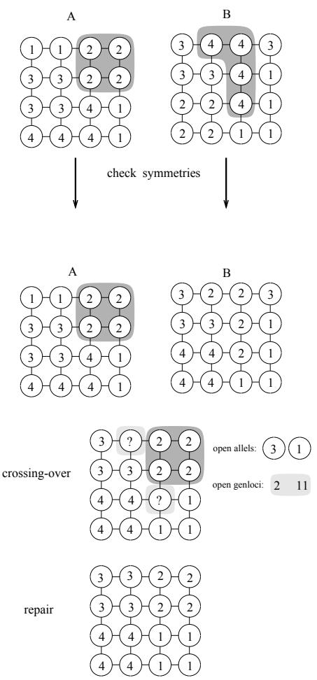

# he parallel genetic algorithm (PGA) is a proto- can be extended far beyond optimization proble

of which ful degr The informa- search is run one by simu- [ ]

# Abstract

n o assive individuals. We will show the ower o the PGA with two combinatorial roblems - the ra h artitionin roblem and the autocorrelation roblem. In these exam les the PGA has ound solutions o ver lar e roblems which are com arable or even better than an other solution ound b other heuristics. totally asynchronous, running with maximal efficiency on MIMD parallel computers. The search strategy of the PGA is based on a small number of intelligent and active individuals, whereas a GA uses a large population of passive individuals. We will show the power of the PGA with two combinatorial problems - the graph partitioning problem and the autocorrelat ion problem. In these examples, the PGA has found solutions of very large problems, which are comparable or even better than any other solution found by other heuristics.

# 1 Introduction

pendent searches. Thus the PGA is a truly parallel al orithm which combines the hardware s eed of $6 0 \mathrm { { ^ { \circ } s } }$ - allel rocessors and the software s eed of intelli ent parallel searching. We have successfull a lied the PGA to a number of roblems includin function o timization 21 and combinatorial o timization. In this a er we summaficient on parallel computers. Secondly, our research the low autocorrelation roblem. The uadratic assinment roblem has been ublished elsewhere 1 . dependent searches. Thus the PGA is a truly parallel algorithm which combines the hardware speed of parallel processors and the software speed of intelligent parallel searching.

We have successfully applied the PGA to a number of problems, including function optimization [21] and combinatorial optimization. In this paper we summarize the results for the graph partitioning problem and the low autocorrelation problem. The quadratic assignment problem has been published elsewhere [17].

2 Parallel search and o timization

We believe that the idea on which the PGA is based In this a er we consider the followin roblem: The PGA is totally asynchronous. It runs with graceOPT 1 P: Given a function F : X 7! R , where X search is running. On the other hand, we have shown seek a point x in S which optimizes F on S or at least yields an acceptable approximation of the supre

# Many optimization methods have been propose

optimization methods. A parallel optimization m

OPT 1 $P$ : Given a function $F : X \mapsto R$ , where $X$ is some metric space. Let $S$ be a subspace of $X$ . W e seek a point x in $S$ which optimizes $F$ o n $S$ or at least yields an acceptable approximation of the suprenum of $F$ xt+ $S$ =

Many optimization methods have been proposed for the solution of this problem. We will investigate parallel optimization methods. A parallel optimization method of parallelism $N$ is characterized by $N$ different search trajectories, which are performed in parallel. It can be described as follows

$$
\boldsymbol { x } _ { i } ^ { t + 1 } = G _ { i } \bigl ( \boldsymbol { x } _ { 1 } ^ { t } , . . . , \boldsymbol { x } _ { N } ^ { t } , \boldsymbol { F } \bigl ( \boldsymbol { x } _ { 1 } ^ { t } \bigr ) , . . . \boldsymbol { F } \bigl ( \boldsymbol { x } _ { N } ^ { t } \bigr ) \bigr ) { \dot { \boldsymbol { i } } } = 1 , . . . , N
$$

xt+1 = Gi(xt $G = ( G _ { 1 } , . . . G _ { N } )$ (xt))i = 1; :::; N (3) or information exchange between the parallel searches. Th $N$ basic questions of parallel search methods can now

$$
\boldsymbol { x } _ { i } ^ { t + 1 } = G ( \boldsymbol { x } _ { i } ^ { t } , \boldsymbol { F } ( \boldsymbol { x } _ { i } ^ { t } ) )
$$

A parallel search method which combines the information of two searches can be described as follows

$$
\boldsymbol { x } _ { i } ^ { t + 1 } = G _ { i } \bigl ( x _ { i - 1 } ^ { t } , x _ { i } ^ { t } , F \bigl ( x _ { i - 1 } ^ { t } \bigr ) , F \bigl ( x _ { i } ^ { t } \bigr ) \bigr ) \boldsymbol { i } = 1 , . . . , N
$$

The basic questions of parallel search methods can now be stated

e leave $N$ e abstract mathematical description and efficient as a single search of time complexity $N * t$ g   
In this paper, we will investigate search algorithms ch mimic evolution   
arches for food and produces ospr

al i xt+1 is an os rin of xt and G is called the we leave the abstract mathematical description and tionar al orithms is the enetic al orithm invented b Holland 12 . derstanding of the problem and the algorithm.

In this paper, we will investigate search algorithms which mimic evolutionary adaptation found in nature. Each individual is identified with an animal, which searches for food and produces offspring. In evolutionary algorithms, $F ( x _ { i } )$ is called the fitness of indiviin [11] $\bar { \boldsymbol { x } } _ { i } ^ { t + 1 }$ [?]. The basic ge $\boldsymbol { x } _ { i } ^ { t }$ tic alg $G$ rithm can be selection schedule. One of the most successful evolutionary algorithms is the genetic algorithm invented by Holland [12].

# 3 Genetic algorithms

Recent surveys of genetic algorithms can be found STEP2: Compute the average tness F = i

# Genetic Algorithm

portional to its normalized tness. Using this d   
STEP1: C $P ( 0 ) = x _ { 1 } ^ { 0 } , . . x _ { N } ^ { 0 }$   
ming N=2 rs. A crossov th pro$\begin{array} { r } { \overline { { F } } = \dot { \sum } _ { i } ^ { N } F ( x _ { i } ) / N } \end{array}$ ch pair and other genetic operators such as mutation, $F ( x _ { i } ^ { t } ) / \overline { { F } }$   
STEP3: Assign each $x _ { i }$ a probability $p ( x _ { i } , t )$ proSet t = t + 1, return to STEP2 this distribution, select $N$ vectors from $P ( t )$ This gives the set $S ( t )$   
STEP4: Pair all of the vectors in $S ( t )$ at random forming $N / 2$ pairs. Apply crossover with probability $p _ { \it c r o s s }$ to each pair and other genetic operators such as mutation, forming a new population $P _ { { t + 1 } }$

STEP5: Set $t = t + 1$ , return to STEP2

ll later show with exam les wh and when crossover uides the search. A enetic al orithm is a arallel random search with centralized control. The centralized part is the selection schedule. For the selection the avera e tness of the population is needed. The result is a highly synchronized al orithm which is dicult to im lement links two searches. Part of the chromosome of one indiIn our arallel enetic al orithm we use a distributed selection scheme. This is achieved as follows. Each individual does the selection b itself. It looks for a ver guides the search.

A genetic algorithm is a parallel random search Our second ma or chan e can now easil be understood. Each individual is active and not acted on. It ma im rove its tness durin its lifetime b erformin a local search. A generic parallel genetic algorit

In our parallel genetic algorithm, we use a distributed selection scheme. This is achieved as follows. Each Parallel genetic algorithm partner in its neighborhood only. The set of neigborSTEP0: Dene a genetic representation of

Our second major change can now easily be understood. Each individual is active and not acted on. It may improve its fitness during its lifetime by perfortion struc

A generic parallel genetic algorithm can be described as follows

# n its neighborhood

STEP4: An ospring is created with genetic crossover o   
STEP5: The ospring does local hill-climbing. It replaces the pa   
STEP2: Each individual does local hill-climbing   
STEP3: Each individual selects a partner for mating to be noted, that ea   
STEP4: An offspring is created with genetic crossover of the parents   
STEP5: The offspring does local hill-climbing. It replaces the parent, if it is better than some criterion (acceptance)

STEP6: If not finished, return to STEP3.

It has to be noted, that each individual may use a different local hill-climbing method. This feature will be important for problems, where the efficiency of a particular hill-climbing method depends on the problem instance.

In the terminology of section 2, we can describe the tion arameters: the mi ration interval the number of enerations between each mi ration and the mirationrate the ercenta e of individuals selected for mi ration. The sub o ulations are con ured as a binar n-cube. A similar a roach is done b Pette

22 . In the implementation of Cohoon et al. 2 it is assumed that each subpopulation is connected to each other. $k$ he al orithm from Manderick et al. 15 has been derived from our PGA. All but Manderick's al orithm use sub o ulations that are densel connected. We have shown in 18 wh restricted connections like a rin are better for grationrate, the percentage of individuals selected for migration. The subpopulations are configured as a binary n-cube. A similar approach is done by Pettey et al. [22]. In the implementation of Cohoon et al. [2] it is assumed that each subpopulation is connected to each other. The algorithm from Manderick et al. [15] has been derived from our PGA.

All but Manderick's algorithm use subpopulations mathematical methods. why restricted connections like a ring are better for the parallel genetic algorithm. All the above parallel algorithms do not use hill-climbing, which is one of the most important parts of our PGA.

An extension of the PGA, where subpopulations The search strategy of the PGA is governed by three components - the crossover operator, the spatial population structure and the hill-climbing strategies. We will brie
y discuss the eects of these components. The crossover operat

# 4 The search strategy of the PGA

ove claim is onl valid for ver sim le o timization roblems. The search strate of a enetic al orithm can be explained in simpler terms. The crossover opeWe will briefly discuss the effects of these components.

The crossover operator is the fundamental part of any genetic algorithm. There have been attempts to "prove" that genetic algorithms make a nearly optimal allocation of trials because of crossing-over. This result is called the "Fundamental Theorem of Genetic Algorithms" [11]. We have shown in [18] that the above claim is only valid for very simple optimization problems. The search strategy of a genetic algorithm can be explained in simpler terms. The crossover operator defines a scatter search [6] where new points are drawn out of the area which is defined by the old or "parent" points. The more similar the old points are, the smaller will be the sampling area. Thus crossingover implements an adaptive step-size control. Why and when does this search strategy make sense?

Let us assume that the combinatorial problem has the building block feature. We speak of a building block feature if the substrings of the optimal solutions are contained in other good solutions. In this case it seems next section. together substrings of the old solutions. This is simply what the crossover operator does. Unfortunately the crossover operator does not know which substrings are part of the optimal solution. So it combines randomly the two strings ("chromosomes") of the parents.

The major difficulty is to defi ne a crossover operator which creates valid solutions i.e. solutions which fulfill the constraints of the problem. We will explain this problem with the graph partitioning problem in the next section.

n which is contained in the local co ies. There is no com lex handshakin rotocol between individuals to et the latest information. Therefore the PGA is extremely fault-tolerant. It works with a few number of individuals but the results are better if a lar er number of individuals is used. The PGA also continues to work if a rocessor fails or an individual sto s durin Each processor sends its latest results to the neighboring processors. If an individual on a specific processor looks for a partner for mating, it uses the information which is contained in the local copies. There is no complex handshaking protocol between individuals to get the latest information. Therefore the PGA is extremely fault-tolerant. It works with a few number of individuals, but the results are better if a larger number of individuals is used. The PGA also continues to work, if a processor fails or an individual stops during a run.

m ared to the amount of communication. Therefore the PGA can be tailored to the roblem and the comoff. Our research indicates that a PGA with a good hill-climbing strategy performs better than a PGA with a simpler strategy or a PGA without any hillclimbing strategy. This has been shown for function optimization [21], the travelling salesman problem and a difficult 30-bit function [18].

Local hill-climbing of the individuals has an additional benefit. It increases the amount of computation compared to the amount of communication. Therefore the PGA can be tailored to the problem and the communication throughput of the parallel processor.

In summary, the PGA is a distributed algorithm with new features which make it very attractive for massively parallel systems. The parallelism is introdua number of artitions in order to o timize some criterion e. . to minimize the number of ed es between artitions. More formall :

# the set of edges and w : E 7! IN denes the w

The GPP is to divide the graph into m disjunct parts, such that some optimization criteria will be fullled. In this paper we will consider the following optimization criteria: terion e.g. to minimize the number of edges between OPT 2 (GPP) Let P =

t G = (g1g2:::g $\begin{array} { r c l } { G } & { = } & { \left( V , E , w \right) } \end{array}$ tition to whi ${ \cal V }  { \mathrm { ~ \textrm ~ { ~ ~ } ~ } } = $ $\left\{ v _ { 1 } , v _ { 2 } , . . . , v _ { n } \right\}$ (1  gi  m). Then w $E \subseteq V \times V$ is the set of edges and $w : E \mapsto N$ defines the weights of the edges.

1i<j n $m$ disjunct parts, such that some optimization criteria will be fulsuch that (P) is minimal. timization criteria:

OPT 2 (GPP) Let $\mathcal { P } = \{ P _ { 1 } , . . . , P _ { m } \}$ be a partition. Let $\mathcal { G } = \left( g _ { 1 } g _ { 2 } . . . g _ { n } \right)$ 1 2 1 2 nodes belong $1 \leq g _ { i } \leq m$ ij ( m j i)

$$
\operatorname* { m i n } _ { \mathcal { P } } \sum _ { { 1 \leq i < j \leq n } \atop { g _ { i } \neq g _ { j } } } w _ { i j }
$$

i on the $\sigma ( P )$ osome gives

$\sigma ( P )$ y degenerate.

$$
\sigma ^ { 2 } ( P ) = \frac { 1 } { m } \sum _ { i = 1 } ^ { m } | P _ { i } | ^ { 2 } - ( \frac { 1 } { m } \sum _ { i = 1 } ^ { m } | P _ { i } ) ^ { 2 }
$$

gether m! chromosomes give the same solution with the same tness value simplest representation, the value (allele) $g _ { i }$ on locus $i$ F(G) = X wij tion to which node $v _ { i }$ 1i<jn is highly degenerate. The number of a partition does not have any meaning for the partitioning problem. An exchange of two partition numbers will still give the same graph partition. In fact, any permutation of the m partition numbers gives the same solution. Alltogether $\mathrm { m } !$ chromosomes give the same solution with the same fitness value

$$
F ( \mathcal { G } ) = \sum _ { \tiny { 1 \leq i < j \leq n } \atop g _ { i } \neq g _ { j } } w _ { i j }
$$

equivalence classes of chromosomes. Figure 1 shows an example. The problem is to partition the 4-4 rid into four artitions. We did not find a better genetic representation, so we decided that the crossover operator has to be "intelligent". Our crossover operator inserts complete partitions from one chromosome into the other, not individual nodes. It computes which partitions are the most similar to each other and exchanges these partitions. Mathematically spoken, the crossover operator works on equivalence classes of chromosomes.

Figure 1 shows an example. The problem is to partition the $4 \times 4$ grid into four partitions.

  
Figure 1: The crossover operator

The crossover operator works as follows. The PGA has randomly decided that partition 2 has to be inserted into $\boldsymbol { B }$ . The crossover operator finds, that partition 4 of $\boldsymbol { B }$ is the most similar to partition 2 in $A$ . It identifies partition 2 of $A$ with partition 4 of $\boldsymbol { B }$ . Then it exchanges the alleles 2 and 4 in chromosome $\boldsymbol { B }$ to avoid the problems arising from symmetrical solutions. In the crossover step it implants partition 2 of

chromosome $A$ into $\boldsymbol { B }$

After identifying all genloci and alleles which lead to a nonvalid partition a repair operator is used to the al orithm we reduce the size of the ra h b combinin u to r nodes into one h ernode. Then 2-o t is a lied to the reduced ra h. In later enerations we a l 2-o t onl to nodes which have

outside artitions see 25 for details . quential heuristic. It should be fast, so that the PGA can produce many generations. In order to solve very large problems, it should be of order $O ( n )$ where $n$ is the problem size. Our hill-climbing algorithm is of order $O ( n ^ { 2 } )$ , but with a small constant. At the start of A detailed study of the graph bipartitioning problem can be found in [13]. In that paper random graphs and random geometric graphs up to 1000 nodes are used to compare dierent heuristics. We decided to make a performance analysis with real

# 6 Performance evaluation for the GPP

he roblems are called EVER918 and EVER1005 4 . EVER918 is a 3-D ra h which consists of 918 nodes and 3233 ed es. It has to be artitioned into 18 arare used to compare different heuristics. We decided to make a performance analysis with real life graphs. have been obtained on a TRANSPUTER based 64- rocessor s stem 20 . Table 1 ives a com arison to ot

ve been com uted recentl . Mult t and MultLk are multi le runs of the local search methods 2-o t and the more eneral Lin-K $E V E R 9 1 \delta$ xchan e 14 . It has to be noticed that the heuristics of Gilbert et al. 5 and of Moore 16 do not use the constraint of e ual titions. EVER1005 has 1005 nodes and 3808 edges. furthermore the solutions should have a smaller cost. have been obtained on a TRANSPUTER based 64- lution EVER918 . In

und the best solution with minimal  P How can the ood results of the P A be ex lained? e claim that PP has the buildin block eature in the more general Lin-Kernighan exchange [14]. It has to be noticed, that the heuristics of Gilbert et al. [5] and of Moore [16] do not use the constraint of equal partition size. This partitioning problem is simpler, furthermore the solutions should have a smaller cost. Nevertheless, the PGA found in one case the best solution (EVER918). In the second problem, the PGA found the best solution with minimal $\sigma ( | P | )$

How can the good results of the PGA be explained? We claim that GPP has the building block feature in constraints. Here the enetic re resentation and the crossover o erator are strai htforward. It is based on a configuration space analysis of local mimima. This analysis is much more difficult for the GPP than for the TSP problem, because of the symmetry or degeneration mentioned earlier. The analysis has to be done in the space of all equivalence classes of local minima. The equivalence classes are defined by the crossover operator.

Table 1: Comparison of GPP solutions for problem beam   

<table><tr><td rowspan=1 colspan=1>prob.</td><td rowspan=1 colspan=1>alg.</td><td rowspan=1 colspan=1>costs</td><td rowspan=1 colspan=1>σ(P |)</td></tr><tr><td rowspan=3 colspan=1>EVER918</td><td rowspan=3 colspan=1>MultOptMultLKGZ87Moore</td><td rowspan=1 colspan=1>1020</td><td rowspan=1 colspan=1>0.00</td></tr><tr><td rowspan=1 colspan=1>625</td><td rowspan=1 colspan=1>0.00</td></tr><tr><td rowspan=1 colspan=1>587453</td><td rowspan=1 colspan=1>0.990.99</td></tr><tr><td rowspan=1 colspan=1></td><td rowspan=1 colspan=1>PGA</td><td rowspan=1 colspan=1>431</td><td rowspan=1 colspan=1>0.00</td></tr><tr><td rowspan=3 colspan=1>EVER1005</td><td rowspan=3 colspan=1>MultOptMultLkGZ87Moore</td><td rowspan=1 colspan=1>1023</td><td rowspan=1 colspan=1>0.40</td></tr><tr><td rowspan=2 colspan=1>725696608</td><td rowspan=1 colspan=1>0.40</td></tr><tr><td rowspan=1 colspan=1>1.291.29</td></tr><tr><td rowspan=1 colspan=1></td><td rowspan=1 colspan=1>PGA</td><td rowspan=1 colspan=1>631</td><td rowspan=1 colspan=1>0.40</td></tr></table>

The next combinatorial problem does not have any constraints. Here the genetic representation and the crossover operator are straightforward.

# 7 Low autocorrelation the cost uration e landscape w

n hypercube of size n. The elements are binary s uences S = s ::: s where s can have the value +1 or -1. To measure the quality of such a sequence, the followin standard criterion called merit actor F was introduced by Golay [8]. ons [1]. From the theoretical point of view it seems to be a very difficult optimization problem and the cost F = N =(2  Ri ) (4) space landscape with an irregular structure.

The autocorrelation function is defined on a Boolean hypercube of size $n$ . The elements are binary squences $S = ( s _ { 1 } , . . . , s _ { n } )$ , where $s$ can have the value $+ 1$ or $- 1$ . To measure the quality of such a sequence, the following standard criterion, called merit factor $F$ was introduced by Golay [8].

$$
F = N ^ { 2 } / ( 2 * \sum _ { i = 1 } ^ { n - 1 } R _ { i } ^ { 2 } )
$$

$$
R _ { i } = \sum _ { k = 1 } ^ { n - k } s _ { k } * s _ { k + i } ; 1 \leq k \leq n - 1
$$

sider skew-symmetric sequences. The conguration space can then b $F ^ { * } = \operatorname* { m a x } _ { S } F ( S )$

This problem has been investigated recentl $\mathrm { n } { = } 2 \mathrm { m } { - } 1$ enker [1] , Gol

$$
s _ { m + l } = ( - 1 ) ^ { l } s _ { m - l } , 1 \leq l \leq n - 1
$$

The genetic representation of this problem seems to be straightforword. Just take the binary string of len th m as chromosome. The henot e is then the skew-s mmetric chain of len th $2 ^ { n }$ 2m  1. Th $2 ^ { m }$ are no co

at a lain PGA can solve this roblem easil . But notice that ever con uration is 4-fold de enerated: inversion and se uence reversal ive the same merit factor. The following four sequences give the same tness val

The genetic representation of this problem seems to be straightforword. Just take the binary string of length $m$ s 1 -1 1 1 -1 s' -1 1 -1 $n = 2 m - 1$ . There sinv -1 1 1 -1 1 s \` 1 -1 -1 1 -1 notice, that every configuration is 4-fold degenerated: inversion and sequence reversal give the same merit With this representation, no structure of the sequences shows up. We $n = 5 , m = 3$

<table><tr><td rowspan=1 colspan=1>s</td><td rowspan=1 colspan=1>1</td><td rowspan=1 colspan=1>-1</td><td rowspan=1 colspan=1>1</td><td rowspan=1 colspan=1>1</td><td rowspan=1 colspan=1>-1</td></tr><tr><td rowspan=1 colspan=1>s&#x27;</td><td rowspan=1 colspan=1>-1</td><td rowspan=1 colspan=1>1</td><td rowspan=1 colspan=1>-1</td><td rowspan=1 colspan=1>-1</td><td rowspan=1 colspan=1>1</td></tr><tr><td rowspan=1 colspan=1>Sinv</td><td rowspan=1 colspan=1>-1</td><td rowspan=1 colspan=1>1</td><td rowspan=1 colspan=1>1</td><td rowspan=1 colspan=1>-1</td><td rowspan=1 colspan=1>1</td></tr><tr><td rowspan=1 colspan=1>sinv6</td><td rowspan=1 colspan=1>1</td><td rowspan=1 colspan=1>-1</td><td rowspan=1 colspan=1>-1</td><td rowspan=1 colspan=1>1</td><td rowspan=1 colspan=1>-1</td></tr></table>

With this representation, no structure of the seween nearb individuals. Thus the individuals in a nei hborhood et more and more similar. So it becomes unlikel that individuals in a nei hborhood are thing to make a crossing-over between e.g. s and $\mathrm { s } ^ { \prime }$ These sequences are opposite to each other located on a m-dimensional hypercube. Crossover tries to combine these searches which are phenotypically equal but genetically opposite to each other.

The above situation does only seldom occur with the PGA. In a PGA, crossing-over is only done between nearby individuals. Thus the individuals in a neighborhood get more and more similar. So it becomes unlikely that individuals in a neighborhood are genetically very different. The breeders call this effect inbreeding.

mmetric solutions of order n=2. We show fo   

<table><tr><td rowspan=1 colspan=1>n</td><td rowspan=1 colspan=1>Beenker</td><td rowspan=1 colspan=1>Golay</td><td rowspan=1 colspan=2>Wang</td><td rowspan=1 colspan=1>Groot</td><td rowspan=1 colspan=1>PGA</td></tr><tr><td rowspan=1 colspan=1>81</td><td rowspan=1 colspan=1>7.323</td><td rowspan=1 colspan=1>8.20</td><td rowspan=1 colspan=2></td><td rowspan=1 colspan=1>8.04</td><td rowspan=1 colspan=1>8.20</td></tr><tr><td rowspan=1 colspan=1>101</td><td rowspan=1 colspan=1>6.058</td><td rowspan=1 colspan=1>8.36</td><td rowspan=1 colspan=2>6.911</td><td rowspan=1 colspan=1>8.36</td><td rowspan=1 colspan=1>8.36</td></tr><tr><td rowspan=1 colspan=1>103</td><td rowspan=1 colspan=1>5.900</td><td rowspan=1 colspan=1>9.56</td><td rowspan=1 colspan=2>7.766</td><td rowspan=1 colspan=1></td><td rowspan=1 colspan=1>9.56</td></tr><tr><td rowspan=1 colspan=1>109</td><td rowspan=1 colspan=1></td><td rowspan=1 colspan=1>8.97</td><td rowspan=1 colspan=2></td><td rowspan=1 colspan=1></td><td rowspan=1 colspan=1>8.97</td></tr><tr><td rowspan=1 colspan=1>113</td><td rowspan=1 colspan=1></td><td rowspan=1 colspan=1>8.49</td><td rowspan=1 colspan=2></td><td rowspan=1 colspan=1></td><td rowspan=1 colspan=1>8.49</td></tr><tr><td rowspan=1 colspan=1>141</td><td rowspan=1 colspan=1>6.01</td><td rowspan=1 colspan=1></td><td rowspan=1 colspan=2></td><td rowspan=1 colspan=1>6.48</td><td rowspan=2 colspan=1>7.456.89</td></tr><tr><td rowspan=1 colspan=1>161</td><td rowspan=1 colspan=1>6.02</td><td rowspan=1 colspan=1></td><td rowspan=1 colspan=2></td><td rowspan=1 colspan=1></td><td rowspan=1 colspan=1></td></tr><tr><td rowspan=1 colspan=1>181</td><td rowspan=1 colspan=1>5.70</td><td rowspan=2 colspan=1></td><td rowspan=2 colspan=2></td><td rowspan=1 colspan=1></td><td rowspan=1 colspan=1>6.02</td></tr><tr><td rowspan=1 colspan=1>201</td><td rowspan=1 colspan=1></td><td rowspan=1 colspan=1>5.92</td><td rowspan=1 colspan=1>6.29</td></tr></table>

1 1 1 1 -1 -1 1 1 -1 1 -1 1 1 1 1 -1 1 1 1 1 1 -1 1 -1 -1 that good skew-symmetric solutions of order $n$ can be found by an interleaving of good symmetric and anSo we tested the idea, to us $n / 2$ o chromosomes as gene $n = 1 3 , m = 7$ ion. In the above e

<table><tr><td rowspan=1 colspan=1>1</td><td rowspan=1 colspan=1>1</td><td rowspan=1 colspan=1>1</td><td rowspan=1 colspan=1>1</td><td rowspan=1 colspan=1>1</td><td rowspan=1 colspan=1>-1</td><td rowspan=1 colspan=1>-1</td><td rowspan=1 colspan=1>1</td><td rowspan=1 colspan=1>1</td><td rowspan=1 colspan=1>-1</td><td rowspan=1 colspan=1>1</td><td rowspan=1 colspan=1>-1</td><td rowspan=1 colspan=1>1</td></tr><tr><td rowspan=1 colspan=1>1</td><td rowspan=1 colspan=1></td><td rowspan=1 colspan=1>1</td><td rowspan=1 colspan=1></td><td rowspan=1 colspan=1>1</td><td rowspan=1 colspan=1></td><td rowspan=1 colspan=1>-1</td><td rowspan=1 colspan=1></td><td rowspan=1 colspan=1>1</td><td rowspan=1 colspan=1></td><td rowspan=1 colspan=1>1</td><td rowspan=1 colspan=1></td><td rowspan=1 colspan=1>1</td></tr><tr><td rowspan=1 colspan=1></td><td rowspan=1 colspan=1></td><td rowspan=1 colspan=1>1</td><td rowspan=1 colspan=1></td><td rowspan=1 colspan=1>1</td><td rowspan=1 colspan=1></td><td rowspan=1 colspan=1>-1</td><td rowspan=1 colspan=1></td><td rowspan=1 colspan=1>1</td><td rowspan=1 colspan=1></td><td rowspan=1 colspan=1>-1</td><td rowspan=1 colspan=1></td><td rowspan=1 colspan=1>-1</td></tr></table>

an e is accepted, if the tness value increases. Then the next bit is 
i ed and so on. In table 2 the computational r $c _ { s y m } ~ = ~ ( 1 , 1 , 1 , - 1 )$ PG ${ c _ { a s y m } = \left( 1 , 1 , - 1 \right) }$ ns from Golay [10], who used an enumeration technique tailored to the autocorrel $c _ { \mathit { s y m } }$ prob $c _ { a s y m }$ De Groot used an evolutionary algorithm without crossin -over. He ke t the sam le oints far a art b acce tin

ammin distance to all other oints. Wh did the PGA erform so ood? Our enetic reresentation does not lead to a buildin block feature. the next bit is flipped and so on.

In table 2 the computational results are given. The PGA found all solutions from Golay [10], who used an enumeration technique tailored to the autocorrelation problem. De Groot used an evolutionary algorithm without crossing-over. He kept the sample points far apart by accepting only points which had a minimum Hamming distance to all other points.

Why did the PGA perform so good? Our genetic representation does not lead to a building block feature.

am le. In the followin table the arent chromosomes and the os rin c

a es of the al orithm. seems to be our local hill-climbing. We will demonstate s s $n = 3 1$ F $n =$ arent1 10000011 11000101 $F = 6 . 0 8 2 2 8$ and four suboptimal solutions with $F = 5 . 5 2 2 9 9$ . After only three generations the PGA always found the best solution and three of the suboptimal solutions. We will hill-cl. 00100111 11010111 6.082 ample. In the following table the parent chromosomes and the offspring chromosome are shown in various In the table we use 0 i

<table><tr><td rowspan=1 colspan=1>state</td><td rowspan=1 colspan=1>Ssym</td><td rowspan=1 colspan=1>Sasym</td><td rowspan=1 colspan=1>F</td></tr><tr><td rowspan=3 colspan=1>parent1parent2crossmutat.hill-cl.</td><td rowspan=2 colspan=1>10000011010110111101001111000011</td><td rowspan=1 colspan=1>110001011101111011001111</td><td rowspan=1 colspan=1>3.5993.5992.235</td></tr><tr><td rowspan=1 colspan=1>11011111</td><td rowspan=1 colspan=1>1.115</td></tr><tr><td rowspan=1 colspan=1>00100111</td><td rowspan=1 colspan=1>11010111</td><td rowspan=1 colspan=1>6.082</td></tr></table>

better results. If this is not the case we have to anal ze what kind of structure crossin -over is ex lorin in the autocorrelation problem. low fitness value. Nevertheless climbs the local search from $1 . 1 1 5 \mathrm { ~ u p ~ }$ to the global optimum. This behavior is different to other combinatorial problems like the GPP, where crossing-over explored the building blocks of the solution.

We are now evaluating, if random insertion of a large string instead of crossingover will give the same or better results. If this is not the case, we have to anao erators described in this a er are not the onl ones in the autocorrelation problem.

# for the quadratic a

endend crossover o erator is in man a lications the ke to the success of the PGA. The clean PGA described in this a er is a ver sim le but robust distributed al orithm. The ma or operators described in this paper are not the only ones possible. Glover [7] has suggested adaptive structured combinations for the TSP and the graph bipartitioning problem. We have used a voting crossover operator for the quadratic assignment problem, which combines five solutions instead of two [17]. A good problem dependend crossover operator is in many applications the key to the success of the PGA.

The clean PGA described in this paper is a very simple, but robust distributed algorithm. The major so histicated hill-climbin method. These individuals will be su lied with the best solutions obtained so far and tr to im rove it. Another extension is to chan e the size of the population. If a nei hborhood ets to similar then it should shrink. We will im lement these extensions in the course als could make hypotheses about which areas should not be searched and which areas should be explored.

an PGA was able to obtain such ood results for classical optimization problems. sophisticated hill-climbing method. These individuals will be supplied with the best solutions obtained so far ket of economy as a parallel search method? This could the size of the population. If a neighborhood gets to similar, then it should shrink.

We will implement these extensions in the course same set of articial roblems would also ive further insi ht into econom and biolo . clean PGA was able to obtain such good results for classical optimization problems.

The success of the PGA suggest exploring other problem solving metaphors also. Why not use the market of economy as a parallel search method? This could [1] G.F.M. Beenker, T.A.C.M. Claasen, and P.W.C rithms. Moreover a comparison of problem solving by a market framework and by biological evolution on the same set of artificial problems would also give further insight into economy and biology.

# ceedings o

Erlbaum, 1987. Hermens. Binary sequences with a maximally C. de Groot, D. Wurtz, and K.H. Homann. Low autocorrelati   
Technical report, ETH Zurich IPS 89-09, 1989. D. Richards. Punctuated equilibria: A parallel geG.C. Everstine. A comparison of three resquencing algorithms for the reduction of matrix prole and wavefront. Int. J. Numer. Meth. in Engin., 14:837{853, 197   
[3] C. de Groot, D. Würtz, and K.H. Hoffmann. Low autocorrelation binary sequences: exact enumeration and optimization by evolutionary strategies. Technical report, ETH Zürich IPS 89-09, 1989.   
[4] G.C. Everstine. A comparison of three resquencing algorithms for the reduction of matrix profile and wavefront. Int. J. Numer. Meth. in Engin., 14:837853, 1979.   
[5] J.R. Gilbert and E. Zmijewski. A parallel graph partitioning algorithm for message- passing mulM.J.E. Golay. Sieves for low autocorrelation binary seque   
[6] F. Glover. Heuristics for integer programming M.J.E. Golay. The merit factor of long low autocorrelation bin   
f Sy , 8 5 3, 98 M.J.E. Golay and D. Harris. A new search for skewsymmetric b   
[8] M.J.E. Golay. Sieves for low autocorrelation biD.E. Goldberg. Genetic Algorithms in Search, Optimization   
[9] M.J.E. Golay. The merit factor of long low auJ.H. Holland. Adaptation in Natural and Arti- cial Systems. Univ. of Mich   
[10] M.J.E. Golay and D. Harris. A new search for D.S. Johnson, C.R. Aragon, L.A. McGeoch, and C. Schevon. Optimization by simu   
g p ; p , g p partitioning. Operations Research, 37:865{892, Wesley, Reading, 1989.   
[12] J.H. Holland. Adaptation in Natural and Artificial Systems. Univ. of Michigan Press, Ann Arbor, 1975.   
[15] B. Manderick and P. Spiessens. Fine-grained parC. Schevon. Optimization by simulated annef g , p g partitioning. Operations Research, 37:865892, D. Mo   
[14] S. Lin and B. W. Kernighan. An efficient heuristic for the traveling salesman problem. Operations H. Muhlenbein. Parallel gen   
[15] B. Manderick and P. Spiessens. Fine-grained parallel genetic algorithm. In H. Schaffer, editor, 3rd Int. Conf. on Genetic Algorithms, pages 428-433. Morgan-Kaufmann, 1989.   
[16] D. Moore. A round-robin parallel partitioning algorithm. Technical Report 88-916, Cornell University, 1988.   
[17] H. Mühlenbein. Parallel genetic algorithm, population dynamics and combinatorial optimization. In H. Schaffer, editor, 3rd Int. Conf. on Genetic Algorithms, pages 416421, San Mateo, 1989. Morgan Kaufmann.   
[ ] , , , parallel genetic algorithm. In G. Rawlins, editor, Foundations of Genetic Algorithms, pages 316 Sy G W , , 90   
[19] H. Mühlenbein, M. Gorges-Schleuter, H. Muhlenbein, M. Schomisch, and J. Born. The parallel genetic algorithm as function optimizer.Parallel Com utin 17:619{632 1991. proach. Parallel Computing, 6:269279, 1987.   
[22] Ch. C. Pettey and M. R. Leuze. A theoretical R. Rinn. The MEGAFRAME Hypercluster - a Reconfigurable Architecture for Massively ParalAlgorithms, pages 398{405. Morgan-Kaufmann, 143156. Akademie-Verlag, 1990.   
[23] R. Tanese. Distributed genetic algorithm. In parallel genetic algorithm as function optimizer. g , p g g   
[22] Ch. C. Pettey and M. R. Leuze. A theoretical investigation of a parallel genetic algorithm. In Algorithmus fur das Graph Partitionierungsproblem. Master's thesis, Universitat Bonn, 1990. G. vo   
g g g p p g H. Schaffer, editor, 3rd Int. Conf. on Genetic Algorithms, pages 434-440. Morgan-Kaufmann, ture   
[24] G. von Laszewski. Ein paralleler genetischer Q. Wang. Optimization by simulating molecular blem. Master's thesis, Universität Bonn, 1990.   
[25] G. von Laszewski and H. Mühlenbein. A parallel genetic algorithm for the graph partitioning problem. In R. Maenner and H.-P. Schwefel, editors, Parallel Problem Solving from Nature, Lecture Notes in Computer Science 496, pages 165- 169. Springer-Verlag, 1991.   
[26] Q. Wang. Optimization by simulating molecular evolution. Biol. Cybern., 57:95, 1987.