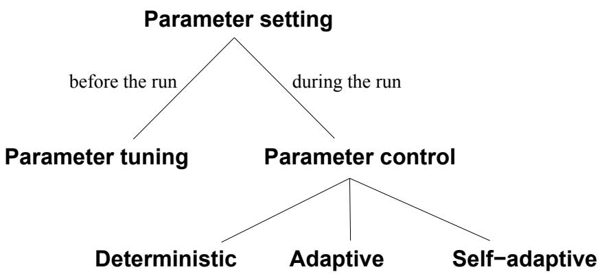
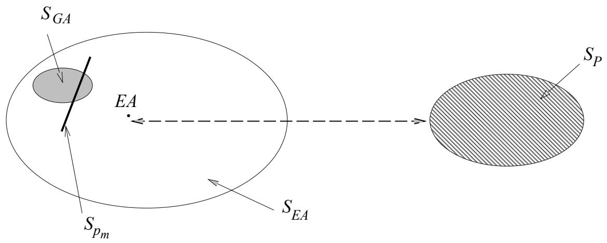

# Parameter Control in Evolutionary Algorithms

Ágoston E. Eiben\* Robert Hinterding† and Zbigniew Michalewicz‡

# putation: I

The issue of controlling values of various parameters of an evolutionary algorithm is one of the most important and promising areas of research in evolutionary computation: It has a potential of adjusting the algorithm to the problem while solving the problem. In this paper we (1) revise the terminology, which is unclear and confusing, thereby providing a classification of such control mechanisms and (2) survey various forms of control which have been studied by the evolutionary computation community in recent years. Our classification covers the major forms of parameter control in evolutionary computation and suggests some directions for further research.

# 1 Introduction

context and the problem-solving framework. When dening an evolutionary Leiden Institute of Advanced Computer Science, Leiden University, Niels Bohrweg 1, 2333 CA Leiden, The Netherlands, e-mail: gusz@wi.leidenuniv.nl. and CWI Amsterdam, context and the problem-solving framework. When defining an evolutionary

Each of these components may have parameters, for instance: the probability of mutation, the tournament size of selection, or the population size. The values of these parameters greatly determine whether the algorithm will nd a near-optimum solution, and whether it will nd such a solution eciently. Choosing the right parameter values, however, is a time-consuming task and considerable eort has gone into developing good heuristics for it. Globally, we distinguish two major forms of setting parameter values: parameter tuning and parameter control. By parameter tuning we mean the commonly practised approach that amounts to nding good valu

ameters before the run of the algorithm and then running the algorithm using these values, which remain xed during the run. In Section 2 we give arguments that any static set of parameters, having the values xed during an EA run, seems to be inappropriate. Parameter control forms an alternative, as it amounts to starting a run with initial parameter values which are changed during the run. This paper has a two-fold objective. First, we provide a comprehensive discussion of parameter control and categorize dierent ways of performing it. The proposed classication is b

change works, and what component of the EA is eected by the mechanism. Such a classication can be useful to the evolutionary computation community, since many researchers interpret terms like \adaptation" or \selfadaptation" dierently, which can be confusing. The framework we propose here is intended to eliminate ambiguities in the terminology. Second, we provide a survey of control techniques which can be found in the literature. This is intended as a guide to locate relevant work in the area, and as a collection of options one can use when applying an EA with changing parameters. We are aware of other classication schemes, e.g., [2, 65, 119], that use other division criteria, resulting in dierent classication schemes. The classication of Angeline [2] is based on levels of adaptation and type of upd

es. In particular, three levels of adaptation: population-level, individualother division criteria, resulting in different classification schemes. The classification of Angeline [2] is based on levels of adaptation and type of update rules. In particular, three levels of adaptation: population-level, individualpirical update rules modify parameter values by competition among them (self-adaptation). Angeline's framework considers an EA as a whole, without dividing attention to its dierent components (e.g., mutation, recombination, selection, etc). The classication proposed by Hinterding, Michalewicz, and Eiben [65] extends that of [2] by considering an additional level of adaptation (environment-level), and makes a more detailed division of types of update mechanisms, dividing them into deterministic, adaptive, and selfadaptive categories. Here again, no attention is payed to what parts of an EA are adapted. The classication of Smith and Fogarty [119, 116] is probably the most comprehensive. It is based on three division criteria: what is being adapted, the scope of the adaptation, and the basis for change. The last criterion is further divided into two categories: the evidence the change is based upon and the rule/algorithm that executes the change. Moreover, there are two types of rule/algorithm: uncoupled/absolute and tightly-coupled/empirical, the latter one coinciding with self-adaptation. The classication scheme proposed in this paper is based on the type of update mechanisms and the EA component that is adapted, as basic division criteria. This classication addresses the key issues of parameter con

hout getting lost in details (this aspect is discussed in more detail in update mechanisms and the EA component that is adapted, as basic division The paper is organized as follows. The next section discusses parameter tuning and parameter control. Section 3 presents an example which provides some basic

control techniques in evolutionary algorithms, whereas Section 5 surveys the techniques proposed so far. Section 6 discusses some combinations of various techniques and Section 7 concludes the paper. 1Notice, that we use the term \`component' dierently from [2] where Angeline denotes subindividual structures with it, while we refer to parts of an EA, such as operators ( , ), , ,

# one-point crossover, bit-
ip mutation and roulette wheel selection (with

choosing the so-called control parameters, or strategy parameters , such as mutation rate, crossover rate, and population size. Many researchers based their choices on tuning the control parameters \by hand", that is experimenting with dierent values and selecting the ones that gave the best results. Later, they reported their results of applying a particular EA to a particular problem, paraphrasing here: ing with different values and selecting the ones that gave the best results. Later, they reported their results of applying a particular EA to a particular problem, paraphrasing here:

...for these experiments, we have used the following parameters: population size of 100, probability of crossover equal to 0.85, etc.

traditional GA), which were good for a numb

determined (experimentally) recommended values for the probabilities of single-point crossover and bit mutation. His conclusions were that the following parameters give reasonable performance for his test functions (for new problems these values may not be very good): of single-point crossover and bit mutation. His conclusions were that the following parameters give reasonable performance for his test functions (for new problems these values may not be very good):

generation gap of 10   
scaling window: n = 1 probability of mutation equal to 0.001 generation gap of $1 0 0 \%$   
scaling window: $n = \infty$   
selection strategy: elitist.

not those of the problem. optimize values for the same parameters for both on-line and off-line performance3 of the algorithm. The best set of parameters to optimize the on-line (off-line) performance of the GA were (the values to optimize the off-line performance are given in parenthesis):

generation gap of 100% ( scaling window: n = 1 (n = 1) selection strategy: elitist (non-elitist). generation gap of $1 0 0 \%$ $( 9 0 \% )$ scaling window: $n = 1 ~ ( n = 1 )$ selection strategy: elitist (non-elitist).

zation problems. Formerly, genetic algorithms were seen as robust problem solvers that exhibit approximately the same performance over a wide range of problems [50], pp. 6. The contemporary view on EAs, however, acknowledges that specic problems (problem types) require specic EA setups for satisfactory performance [13]. Thus, the scope of \`optimal' parameter settings is necessarily narrow. Any quest for generally (near-)optimal parameter settings is lost a priori [140]. This stresses the need for ecient techniques that help nding good parameter settings for a given problem, in other words, the need for good parameter tuning methods. As an alternative to tuning parameters before running the algorithm, controlling them during a run was realised quite early (e.g., mutation step sizes in the evolution strategy (ES) community).

d sphere problems in large dimensions led to Rechenberg's 1/5 success rule (see section 3.1), where feedback was used to control the mutation step size [100]. Later, self-adaptation of mutation was used, where the mutation step size and the preferred direction of mutation were controlled $1 / 5$ hout any direct feedback. For certain types of problems, self-adaptive mutation was very successful and its use spread to other branches of evolutionary computation 3These measures were dened originally by De Jong [29]; the intuition is that on-line performance is based on monitoring the best solution in each generation, while o-line successful and its use spread to other branches of evolutionary computation

which

omplex way. Simultaneous tuning of more parameters, however, leads to an enormous amount of experiments. The technical drawbacks to parameter tuning based on experimentation can be summarized as follows:  Parameters are not independent, but trying all dierent combinations systematically is practically impossible. tuning based on experimentation can be summarized as follows:

are o timized one b one re ardless to their interactions. systematically is practically impossible. o timal even if the eort made for settin them was si nicant. are optimized one by one, regardless to their interactions. nary method to solve a particular problem include \parameter setting by gy" and the use of theoretical analysis. Parameter setting by an

ounts to the use of parameter settings that have been proved successful for \similar" problems. However, it is not clear whether similarity between problems as perceived by the user implies that the optimal set of EA parameters is also similar. As for the theoretical approach, the complexities of evolutionary processes and characteristics of interesting problems allow theoretical analysis only after signicant simplications in either the algorithm or the problem model. Therefore, the practical value of the current theoretical results on parameter settings is unclear. There are some theoretical investigations on the optimal population size [50, 132, 60, 52] or optimal operator probabilities [54, 131, 10, 108], however, these results were based on simple function optimization problems and their applicability for other types of problems is limited. 4During the Workshop on Evolutionary Algorithms, organized by Institute for Mathematics and Its Applications, University of Minnesota, Minneapolis, Minnesota, October of problems is limited.

not change their values is thus in contrast to this spirit. Additionally, it is intuitively obvious that dierent values of parameters might be optimal at dierent stages of the evolutionary process [27, 127, 8, 9, 10, 62, 122]. For instance, large mutation steps can be good in the early generations helping the exploration of the search space and small mutation steps might be needed in the late generations to help ne tuning the sub-optimal chromosomes. This implies that the use of static parameters itself can lead to inferior algorithm performance. The straightforward way to treat this problem is by using paa ete s t at ay c a ge ove t e, t at s, by ep ac g a pa a ete p by a function p(t), where t is the generation counter. However, as indicated earlier, the problem of nding optimal static parameters for a particular problem can be quite dicult, and the optimal values may depend on many oth $p$ factors (like t $p ( t )$ pplied $t$ combination operator, the selection mechanism, etc). Hence designing an optimal function p(t) may be even more dicult. Another possible drawback to this approach is that the parameter value p(t) changes are caused by a deterministic rule triggered by the progress of time t, without taking any notion of the actual pro $p ( t )$ s in solving the problem, i.e., without taking into account the current state of the search. Yet researc $p ( t )$ (see Section 5) have improved their evolutionary algorithms, i.e., they i $t$ - proved the quality of results returned by their algorithms while working on particular problems, by using such simple deterministic rules. This can be explained simply by superiority of changing parameter values: suboptimal choice of p(t) often leads to better results than a suboptimal choice of p. To this end, recall that nding good parameter values for an evolutionary algorithm is a poorly structured, ill-dened, complex problem. But on this kind $p ( t )$ roblem, EAs are often considered to perform better than $p$ t

thods! It is thus seemingly natural to use an evolutionary algorithm not only for nding solutions to a problem, but also for tuning the (same) algorithm to the particular problem. Technically speaking, this amounts to modifying the values of parameters during the run of the algorithm by taking the actual search process into account. Basically, there are two ways to gorithm to the particular problem. Technically speaking, this amounts to modifying the values of parameters during the run of the algorithm by taking the actual search process into account. Basically, there are two ways to to evolution. The rst option, using a heuristic feedback mechanism, allows one to base changes on triggers dierent from elapsing time, such as population diversity measures, relative improvements, absolute solution quality, etc. The second option, incorporating parameters into the chromosomes, leaves one to base changes on triggers different from elapsing time, such as populaselection acting on solutions (chromosomes) will drive changes in parameter values associated with these solutions. In the following we discuss these options illustrated by an example. selection acting on solutions (chromosomes) will drive changes in parameter values associated with these solutions. In the following we discuss these options illustrated by an example.

# optimize f(\~x) = f(x

subject to some inequality and equality constraints:

gi(\~x)  0 $f ( { \vec { x } } ) = f ( x _ { 1 } , \dots , x _ { n } )$

and bounds li  xi  ui for 1  i  n, dening the

$$
g _ { i } ( \vec { x } ) \leq 0 \ ( i = 1 , \ldots , q ) \ \mathrm { a n d } \ h _ { j } ( \vec { x } ) = 0 \ ( j = q + 1 , \ldots , m ) ,
$$

\~x in the po $l _ { i } \le x _ { i } \le u _ { i }$ epres $1 \leq i \leq n$ vector of 
oating-point numbers

For such a numerical optimization problem we may consider an evolutionary algorithm based on a floating-point representation, where each individual $\vec { x }$ in the population is represented as a vector of floating-point numbers

$$
{ \vec { x } } = \langle x _ { 1 } , \ldots , x _ { n } \rangle .
$$

# opera or requires two parameters: the mean, which

the standard deviation , which can be interpreted as the mutation step size. Mutations then are realized by replacing components of the vector \~x by operator requires two parameters: the mean, which is often set to zero, and the standard deviation $\sigma$ , which can be interpreted as the mutation step size. Mutations then are realized by replacing components of the vector $\vec { x }$ by

$$
x _ { i } ^ { \prime } = x _ { i } + N ( 0 , \sigma ) ,
$$

vector, $N ( 0 , \sigma )$ the whole evolutionary process, for instance, xi = xi +N(0; 1). As indicat $\sigma$ d in Section 2, it might be benecial to vary the mutation step size. We shall d $\sigma$ cuss several possibilities in turn. First, we can replace the static parameter  by a dynam $x _ { i } ^ { \prime } = x _ { i } + N ( 0 , 1 )$ , a function (t). This function can be dened by some heuristic rule assigning dierent values depending on the number of gener

tation step size may be dened as: $\sigma$ by a dynamic parameter, i.e., a function $\sigma ( t )$ . This function can be defined by some heuristic rule assigning different values depending on the number of generations. For example, the where t is the current generation num

$$
\begin{array} { r } { \sigma ( t ) = 1 - 0 . 9 \cdot \frac { t } { T } , } \end{array}
$$

decrea $t$ e slowly from 1 at the beginning of the run (t = 0 $T$ to 0:1 as the number of generations t approaches T. Such decreases may $\sigma ( t )$ t the netuning capabilities of the algorithm. In this approach, the value of the given parameter changes according to a fully deterministic s $( t = 0 )$ The user thus has full control of the p $t$ rameter and $T$ s value at a given time t is completely determined and predictable. Second, it is possible to incorporate feedback from the search process, still using the same  for all for vectors in the population and for $t$ ll variables of each vector. A well-known

chenberg's \`1=5 success rule' in (1+1)-evolution strategies [100]. This rule states that the $\sigma$ tio of successful mutations to all mutations should be 1=5, hence if the ratio is greater than 1=5 then the step size should be increased, and if the rat $^ { \circ } 1 / 5$ less than 1=5, the step size should be decreased: 5There are even formal arguments supporting this view in specic cases, e.g., [8, $1 / 5$ , hence if the ratio is greater than $1 / 5$ then the step size should be increased, and if the ratio is less than $1 / 5$ , the step size should be decreased:

if $t$ mod $n = 0$ (t  n

$$
\sigma ( t ) : = \left\{ \begin{array} { l l } { \sigma ( t - n ) / c , } & { \quad \mathrm { i f ~ } p _ { s } > 1 / 5 } \\ { \sigma ( t - n ) \cdot c , } & { \quad \mathrm { i f ~ } p _ { s } < 1 / 5 } \\ { \sigma ( t - n ) , } & { \quad \mathrm { i f ~ } p _ { s } = 1 / 5 } \end{array} \right.
$$

else

$$
\sigma ( t ) : = \sigma ( t - 1 ) ;
$$

fi

and - $p _ { s }$ aptation happens every n generations. The in
uence of the user on the parameter values is much $0 . 8 1 7 \leq c \leq 1$ ere than in the deterministic scheme above. Of course, the mechanism that embodies the link between the sear $\sigma$ process and parameter val $n$ s is still a heuristic rule indicating how the changes should be made, but the values of (t) are not deterministic. Third, it is possible to assign an \`individual' mutation step size to each solution: extend the representation to individuals of length n + 1 as the changes should be made, but the values of $\sigma ( t )$ are not deterministic.

Third, it is possible to assign an 'individual' mutation step size to each and apply some variation operators (e.g., Gaussian mutation $n + 1$ rith

$$
\langle x _ { 1 } , \ldots , x _ { n } , \sigma \rangle ,
$$

individual undergoes evolution. A typical variation would be: crossover) to $x _ { i }$ N(0;0) $\sigma$ value of an individual. In this way, not only the solution vector values $( x _ { i } ^ { \prime } \mathrm { s } )$ , but also the mutation step size of an individual undergoes evolution. A typical variation would be:

$$
\begin{array} { l } { { \sigma ^ { \prime } = \sigma \cdot e ^ { N ( 0 , \tau _ { 0 } ) } \ \mathrm { a n d } } } \\ { { \displaystyle x _ { i } ^ { \prime } = x _ { i } + N ( 0 , \sigma ^ { \prime } ) , } } \end{array}
$$

values $\tau _ { 0 }$ is a parameter of the method. This mechanism is commonly called It can be argued that the heuristic character of the mechanism resetting the parameter values is not eliminated, but rather replaced by a metaheuristic of evolution itself. values is eliminated.7

plications and use a separate mutation step size to each xi. If an individual is $\sigma$ was restricted to a single individual. However, it can be applied to all variables of the individual: it is possible to change the granularity of such applications and use a separate mutation step size to each $x _ { i }$ . If an individual then mutations c

$$
\langle x _ { 1 } , \ldots , x _ { n } , \sigma _ { 1 } , \ldots , \sigma _ { n } \rangle ,
$$

then mutations can be realized by replacing the above vector according to a similar formula as discussed above:

$$
\begin{array} { l } { \sigma _ { i } ^ { \prime } = \sigma _ { i } \cdot e ^ { N ( 0 , \tau _ { 0 } ) } , \mathrm { a n d } } \\ { x _ { i } ^ { \prime } = x _ { i } + N ( 0 , \sigma _ { i } ^ { \prime } ) , } \end{array}
$$

the se $\tau _ { 0 }$ h strategy to the topology of the tness landscape. case, each component $x _ { i }$ has its own mutation step size $\sigma _ { i }$ , which is being 3.2 Changing the penalty coecients the search strategy to the topology of the fitness landscape.

# parameters, and these parameters are traditionally t

way. Here we show that other components, such as the evaluation function (and consequently the tness function) can also be parameterized and thus tuned. While this is a less common option than tuning mutation (although it is practicized in the evolution of variable-length stuctures for parsimony pressure [144]), it may provide a useful mechanism for increasing the performance of an evolutionary algorithm. When dealing with constrained optimization problems, penalty functions are often used. A common technique is the method of static penalties [92], which requires xed user-sup

its wide spread use is that it is the simplest technique to implement: It requires only the straightforward modication of the evaluation function eval which requires fixed user-supplied penalty parameters. The main reason for its wide spread use is that it is the simplest technique to implement: It requires only the straightforward modification of the evaluation function eval as follows:

$$
e v a l ( \vec { x } ) = f ( \vec { x } ) + W \cdot p e n a l t y ( \vec { x } ) ,
$$

the so $f$ tion, i.e., to force it into the fe $p e n a l t y ( \vec { x } )$ n. In many methods a set of functions fj (1  j  m) is used to construct the penalty, where the function fj measures the violation of the j-th constraint in the following way: the solution, i.e., to force it into the feasible region. In many methods a set of functions $f _ { j }$ $\left( 1 \leq j \leq m \right)$ is used to construct the penalty, where the function $f _ { j }$ measures the violation of the $j .$ -th constraint in the following way:

$$
f _ { j } ( \vec { x } ) = \left\{ \begin{array} { l l } { \operatorname* { m a x } \{ 0 , g _ { j } ( \vec { x } ) \} , } & { i f 1 \leq j \leq q } \\ { | h _ { j } ( \vec { x } ) | , } & { i f q + 1 \leq j \leq m . } \end{array} \right.
$$

$W$ anging the value of W. First, we can replace the static parameter W by a dynamic $W$ arameter, e.g., a function W(t). Just as for the mutation parameter , we can develop a heuristic which mo $W$

thod proposed by Joines and Houck [76], the $W$ dividuals are evaluated (at the iteration t) $W ( t )$ formula, where $\sigma$ , we can develop a heuristic which modifies the weight $W$ over time. For example, in the method proposed by Joines and Houck [76], the individuals are evaluated (at where C and $t$ are constants. Clear

$$
e v a l ( \vec { x } ) = f ( \vec { x } ) + ( C \cdot t ) ^ { \alpha } \cdot p e n a l t y ( \vec { x } ) ,
$$

the pe $C$ lty p $\alpha$ ssure grows with the ev

$$
W ( t ) = ( C \cdot t ) ^ { \alpha } ,
$$

8For minimization problems.

Of course, instead of W it is possible to consider a vector of weights w\~ = (w1; : : : ; wm) search process. One example of such an approach was developed by Bean and

W(t + 1) = <   W t ; if \~bi 2 S  F for all t  k + 1  i  t as before, but $W ( t )$ W(t); otherwise: $t$ in the following way:

$$
W ( t + 1 ) = \left\{ \begin{array} { l l } { ( 1 / \beta _ { 1 } ) \cdot W ( t ) , } & { \mathrm { i f ~ } \vec { b } ^ { i } \in \mathcal { F } \mathrm { ~ f o r ~ a l l ~ } t - k + 1 \le i \le t } \\ { \beta _ { 2 } \cdot W ( t ) , } & { \mathrm { i f ~ } \vec { b } ^ { i } \in \mathcal { S } - \mathcal { F } \mathrm { ~ f o r ~ a l l ~ } t - k + 1 \le i \le t } \\ { W ( t ) , } & { \mathrm { o t h e r w i s e } . } \end{array} \right.
$$

In other words, $\mathcal { S }$ e method decreases the penalty component ${ \mathcal { F } } \subseteq { \mathcal { S } }$ ) for the generation t + 1 if all $\vec { b ^ { i } }$ st individuals in the last k generations were feasible (i.e., in F), and in $i$ re $\beta _ { 1 } , \beta _ { 2 } \ > \ 1$ ties i $\beta _ { 1 } ~ \neq ~ \beta _ { 2 }$ t individuals in the last k generations were infeasible. If there are some feasible a $W ( t + 1 )$ ible individuals as $t + 1$ ndividuals in the last k generations $k$ W(t + 1) remains without change. $\mathcal { F }$ ), and increases penalties if all best individuals in the last $k$ ird, we could allow self-adaptation of the weight parameter, similarly to the mutation step sizes in the previous s $k$ tion. For exa $W ( t + 1 )$ possible to extend the re

x ; : : : ; x ; W , to the mutation step sizes in the previous section. For example, it is possible to extend the representation of individuals into

$$
\langle x _ { 1 } , \ldots , x _ { n } , W \rangle ,
$$

self-ad $W$ ation. Clearly, the smaller weight W, t $W$ better an (infeasible) individual is, so it is unfair t $x _ { i }$ pply dierent weights to dierent individuals within the same generation. It might be that a new weight can be dened (e.g., arithmetical average of all weights prese $W$ in the population) and used for evaluation purpose; however, to our best knowledge, no one has experimented with such self-adaptive weights. To this end, it is important to note the crucial dierence between selfadapting mutation step sizes and constraint weights. Even if the mutation step sizes are encoded in the chromosom

ndependent from the actual value of 's. That is, adapting mutation step sizes and constraint weights. Even if the mutation step sizes are encoded in the chromosomes, the evaluation of a chromosome is independent from the actual value of $\sigma ^ { \prime } \mathrm { s }$ . That is,

$$
e v a l ( \langle \vec { x } , \vec { \sigma } \rangle ) = f ( \vec { x } )
$$

for any chromosome $\langle \vec { x } , \vec { \sigma } \rangle$ . In contrast, if constraint weights are encoded in for any chromosome h\~x; Wi. Thi

$$
e v a l ( \langle \vec { x } , W \rangle ) = f _ { W } ( \vec { x } )
$$

for any chromosome $\langle \vec { x } , W \rangle$ . This enables the evolution to 'cheat' in the sense 3.3 Summary $W$ instead of optimizing $f$ and satisfying the constraints.

# ary process. The la

adjusted components, such as mutation, recombination, selection, etc., can be controlled by parameters, but so can other components of an evolutionary algorithm. Obviously, there are many components and parameters that can be changed and tuned for optimal algorithm performance. In general, the three options we sketched for the mutation operator and the evaluation function are valid for any parameter of an evolutionary algorithm, whether it is population size, mutation step, the penalty coecient, selection pressure, and so forth . The mutation example of Section 3.1 also illustrates the phenomenon of the scope of a parameter. Namely, the mutation step size parameter can have di

; : : : ; xn; 1; : : : ; ni model, a particular mutation step size applies only to one variable of a single individual. Thus, the parameter i acts on a subindividual level. In the hx1; : : : ; xn; i representation the scope of  is $\langle x _ { 1 } , \ldots , x _ { n } , \sigma _ { 1 } , \ldots , \sigma _ { n } \rangle$ s the dynamic parameter (t) was dened to aect all individuals and thus has the whole population as its scope. $\sigma _ { i }$ acts on a These remarks conclude $\langle x _ { 1 } , \ldots , x _ { n } , \sigma \rangle$ ory examples of this section; $\sigma$ we are now ready to attempt a classication of par $\sigma ( t )$ er control techniques for parameters of an evolutionary algorithm.

These remarks conclude the introductory examples of this section; we are now ready to attempt a classification of parameter control techniques for parameters of an evolutionary algorithm.

# many aspects can be taken into account. For example:

In classifying parameter control techniques of an evolutionary algorithm, many aspects can be taken into account. For example:

1. What is changed? (e.g., representation, evaluation function, operators, selection process, mutation rate, etc.).   
2. How the change is made? (i.e., deterministic heuristic, feedback-based The evidence upon which   
3. The scope/level of change (e.g., population-level, individual-level, etc.).   
4. The evidence upon which the change is carried out (e.g., monitoring performance of operators, diversity of the population, etc.).

evolutionary algorithm (which is a dicult task in itse

ume the following components of an EA: changed, it is necessary to agree on a list of all major components of an evolutionary algorithm (which is a difficult task in itself). For that purpose,  Evaluation function.

 Variation operators and their   
 Selection operator (p   
 Replacement operator (survival selection or   
 Population (size, topology, etc.).   
te that each component can be parameterized, and the number of pa Population (size, topology, etc.).

Note that each component can be parameterized, and the number of parameters is not clearly defined. For example, an offspring produced by an arithmetical crossover of $k$ parents $\vec { x } _ { 1 } , \dots , \vec { x } _ { k }$ can be defined by the following formula

$$
{ \vec { v } } = a _ { 1 } { \vec { x } } _ { 1 } + \ldots + a _ { k } { \vec { x } } _ { k } ,
$$

popula $a _ { 1 } , \ldots , a _ { k }$ volved $k$ Despite the somewhat arbitrary character of this list of components and of the list of parameters of each component, we will maintain the \what-aspect" as one of the main classication features. The reason for this is that it allows us to locate where a specic mechanism has its eect. Also, this is way we would expect people to search through a survey, e.g., \I want to apply changing mutation rates, let me see how others did it". As discussed and illustrated in Section 3, methods for changing the value of a parameter (i.e., the \how-aspect") can be classied into one of three e.g., "I want to apply changing mutation rates, let me see how others did it".

 Deterministic parameter control. This takes place when the value of a strategy parameter is altered by some

deterministically without using a

a time-varying schedule is used, i.e., the rule will be used when a set number of generations have elapsed since the last time the rule was deterministically without using any feedback from the search. Usually, a time-varying schedule is used, i.e., the rule will be used when a set This takes lace when there is some form of feedback from the search activated.

to the strategy parameter. T

parameter may involve credit assignment, and the action of the EA may determine whether or not the new value persists or propagates throughout the population. parameter may involve credit assignment, and the action of the EA The idea of the evolution of evolution can be used to im lement the self-ada tation of aramete

encoded into the chromosomes

tion. The better values of these encoded parameters lead to better individuals, which in turn are more likely to survive and produce o- spring and hence propagate these better parameter values. tion. The better values of these encoded parameters lead to better individuals, which in turn are more likely to survive and produce offspring and hence propagate these better parameter values.

Some authors have introduced a dierent terminology. Angeline [

# INSERT FIGURE 1 HERE

egory encompasses deterministic and adaptive control, whereas the tightlycoupled/empirical category corresponds to self-adaptation. We feel that the distinction between deterministic and adaptive parameter control is essential, as the rst one does not use any feedback from the search process. However, we acknowledge that the terminology proposed here is not perfect either. The term \deterministic" control might not be the most appropriate, as it is not determinism that matters, but the fact that the parameter-altering transformations take no input variables related to the progress of the search process. For example, one might randomly change the mutation probability after every 100 generations, which is not a deterministic process. The name \xed" parameter control might form an alternative that also covers this latter example. Also, the terms \adaptive" and \self-adaptive" could be replaced by the equally meaningful \explicitly adaptive" and \implicitly adaptive" controls, respectively. We have chosen to use \adaptive" and \self-adaptive" for the widely accepted usage of the latter term. As discussed earlier, any change within any component of an EA may aect a gene (parameter), whole chromosomes (individuals), the entire population, another component (e.g., selection), o

is is the aspect of the scope or level of adaptation [2, 65, 119, 116]. Note, however, that the scope/level usually depends on the component of the EA where the change takes place. For example, a change of the mutation step size may aect a gene, a chromosome, or the entire population, depending on the particular implementation (i.e., scheme used), but a change in the penalty coecients always aects the whole population. So, the scope/level feature is a secondary one, usually depending on the given component and its actual implementation. The issue of the scope of the parameter might be more complicated than indicated in Section 3.3, however. First of all, the scope depends on the inits actual implementation.

The issue of the scope of the parameter might be more complicated than indicated in Section 3.3, however. First of all, the scope depends on the interpretation mechanism of the given parameters. For example, an individual where the vector \~ deno

$$
\langle x _ { 1 } , \ldots , x _ { n } , \sigma _ { 1 } , \ldots , \sigma _ { n } , \alpha _ { 1 } , \ldots , \alpha _ { n ( n - 1 ) / 2 } \rangle ,
$$

level. $\vec { \alpha }$ denotes the covariances between the variables $\sigma _ { 1 } , \ldots , \sigma _ { n }$ The next example illustrates that the same p $\vec { \alpha }$ ameter (encoded in the chromosomes) can be interpreted in dierent ways, leading to dierent algorithm

[46], experimented with individuals containing an extra bit to determine whether one-point crossover or uniform crossover is to be used (bit 1/0 standing for one-point/uniform crossover, respectively). Two interpretations were considered. The rst interpretation was based on a pairwise operator choice: If both parental bits are the same, the corresponding operator is $1 / 0$ d, otherwise, a random choice is made. Thus, this parameter in this interpretation acts at an individual level. The second interpretation was based on the bitdistribution over the whole population: If, for example 73% of the population ad b t , t e t e p obab ty o o e po t c ossove was 0 73 us t s parameter under this interpretation acts on the population level. Note, that these two interpretations can be easily combined. F $7 3 \%$ stance, similar to the rst interpretation, if both parental bits are the same, the corresponding operator is used. However, if they dier, the operator is selected according to the bit-distribution, just as in the second interpretation. The scope/level of this parameter in this interpretation is neither individual, nor population, but rather both. This example shows that the notion of scope can be ill-dened and very complex. These examples, and the arguments that the scope/level e t ty s p a y a eatu e o t e g ve pa a ete a d o y seco da y a feature of adaptation itself, motivate our decision to exclude it as a major classication criterion. entity is primarily a feature of the given parameter and only secondarily a termining the change of parameter value [119, 116]. Most commonly, the progress of the search

Another possible criterion for classification is the evidence used for determining the change of parameter value [119, 116]. Most commonly, the progress of the search is monitored, e.g., the performance of operators. It is appears only in adaptive parameter control. A similar distinction could be made in deterministic control, which might be based on any counter not related to search progress. One option is the number of tness evaluations (as the description of deterministic control above indicates). There are, however, other possibilities, for instance, changing the probability of mutation on the basis of the number of executed mutations. We feel, however, that these distinctions are of a more specic level than other criteria and for that reason we have not included it as a major classication criterion. So the main criteria for classifying methods that change the values of the strategy parameters of an algorithm during its execution are: we have not included it as a major classification criterion.

So the main criteria for classifying methods that change the values of the 2. How is the change made?

ur classication is thu

2. How is the change made?

parameter control within EAs. The type of parameters' change consists of three categories: deterministic, adaptive, and self-adaptive mechanisms. The component of parameters' change consists of six categories: representation, evaluation function, variation operators (mutation and recombination), selection, replacement, and population. component of parameters' change consists of six categories: representation, urve of related work lection, replacement, and population.

# the parameters of their evolutionary algorith

the following subsections correspond to the earlier list of six components of an EA with one exception, and we just brie
y indicate what the scope of the change is. Purely by the amount of work concerning the control of mutation the following subsections correspond to the earlier list of six components of an EA with one exception, and we just briefly indicate what the scope of the change is. Purely by the amount of work concerning the control of mutation

5.1 Representation separate subsections.

# binary or some nite alphabe

based on real valued vectors, just as modern evolutionary programming (EP) [11, 45]. Tradtional EP was based on nite state machines as chromosomes and in genetic programming (GP) individuals are trees or graphs [18, 79]. It is interesting to note that for the latter two branches of evolutionary algorithms it is an inherent feature that the shape and size of individuals is changing during the evolutionary search process. It could be argued th

s implies an intrinsically adaptive representation in tradtional EP and GP. On the other hand, the main structure of the nite state machines is not changing during the search in tradtional EP, nor do the function and terminal sets in GP (without automatically dened functions, ADFs). If one identies \representation" with the basic syntax (plus the encoding mechanism), then the dierently sized and shaped nite state machines, respectively trees or graphs are only dierent expressions in this unchanging syntax. This view implies that the representations in tradtional EP and GP are not intrinsically the differently sized and shaped finite state machines, respectively trees or Most on the work into adaptation of representation has been done by researchers from the genetic algorithms area. This is probably due to premature conv

re rst applied to numeric optimization. The most comprehensive was the adaptive representation used by Shaefer [114] in his ARGOT strategy. Simpler schemes where later used by Mathias and Whitley [139] (delta coding), and by Schraudolph and Belew [111] (Dynamic Parameter Encoding). All the techniques described in this section use adaptive parameter control. The ARGOT strategy used a 
exible mapping of the function variables to the genes (one gene per function variable), which allows not only the number of bits used to represent the gene (resolution) to be adapted,

The ARGOT strategy used a flexible mapping of the function variables to the genes (one gene per function variable), which allows not only the number of bits used to represent the gene (resolution) to be adapted, but the genes, the variance of the gene values, and how closely the gene values approach the current range boundaries. Delta coding also modies the representation of the function parameters, but in a dierent way. It uses a GA with multiple restarts, the rst run is used to nd an interim solution, su

tances (delta values) from the last interim solution. This way each restart forms a new hypercube with the interim solution at its origin, the resolution of the delta values can also be altered at the restarts to expand or contract the search space. The restarts are triggered when the Hamming distance forms a new hypercube with the interim solution at its origin, the resolution greater than one. This technique was further rened in [87] to cope with deceptive problems. The dynamic parameter encoding technique is not based on modifying the actual number of bits used to represent a function parameter, but rather, it alters the mapping o

ulation counts of the gene values for three overlapping target intervals for the current search interval for that gene are taken. If the largest count is greater than a given trigger threshold, the search interval is halved, and all values for that gene in the population are adjusted. Note that in this technique the resolutions of genes can be increased but not decreased. Messy GAs (mGAs) [53] use a very dierent approach. This technique is targeted to xed-length binary representations but allows the representation to be under or over specied. Each gene in the chromosome contains its

bit) and its position. The chromosomes are of variable length and may contain too few or too many bits for the representation. If more than one gene species a bit position the rst one encountered is used, if bit positions are not specied by the chromosome, they are lled in from so-called competitive templates. Messy GAs do not use mutation and use cut and splice operators in place of crossover. A run of an mGA is in two phases: (1) a primordial phase which enriches the proportion of good building blocks and reduces the population size using only selection, and (2) a juxtapositional phase which in place of crossover. A run of an mGA is in two phases: (1) a primordial phase which enriches the proportion of good building blocks and reduces the population size using only selection, and (2) a juxtapositional phase which

The earliest use of self-adaptive control is for the dominance mechanism of diploid chromosomes. Here there are two copies of each chromosome. The extra chromosomes encode alternate solutions a

he solutions will be expressed. Bagley [17] added an evolvable dominance value to each gene, and the gene with the highest dominance value was dominant, while Rosenberg [102] used a biologically-oriented model and the dominance eect was due to particular enzymes being expressed. Other early work (on stationary optimization problems and mixed results) was by Hollstein [67] and Brindle [23]. Goldberg and Smith [55] used diploid representation with Hollsteins triallelic dominance map for a nonstationary problem, and showed that it was better than using a haploid representation. Greene [56, 57] used a dierent approach that evaluates both the chromosomes and uses the chromosome with the highest tness as the dominant one. In each of the cases above, the method of dominance control is self-adaptive as there is no explicit feedback to control dominance, and dominance is only altered by the normal reproduction operators. Additional issue connected with adaptive representations concerns noncoding segments of a genotype. Wu and Lindsay [141] experimented with a method which explicitly dene introns

Additional issue connected with adaptive representations concerns non5.2 Evaluation function method which explicitly define introns in the genotypes.

# mechanism presented in [76]. The

lowing idea. The evaluation function eval has an additional parameter : deterministic schedule are reported. In Section 3.2 we discussed briefly the mechanism presented in [76]. The mechanism of [90] was based on the folwhich is decreased every time the evolutionary algorithm converges (us $\tau$ l

$$
\begin{array} { r } { e v a l { ( \vec { x } , \tau ) } = f ( \vec { x } ) + \frac { 1 } { 2 \tau } \sum _ { J } f _ { j } ^ { 2 } ( \vec { x } ) , } \end{array}
$$

which is decreased every time the evolutionary algorithm converges (usually, $\tau : = \tau / 1 0 $ ). Copies of the best solution found are taken as the initial population of the next iteration with the new (decreased) value of $\tau$ . Thus there the evaluation function) only when we switch from one cycle to another. The method of Eiben and Ruttka $( J \subseteq \{ 1 , \dots , m \}$ where between tuning and adaptive control of the tness function. They apply a method for solving constraint satisfaction problems that changes the evaluation function ba

the performance of an EA run: the penalties (weights) of those constraints which are violated by the best individual after termination are raised, and the new weights are used in the next run. A technical report [19] from 1992 forms an early example on adaptive tness functions for constraint satisfaction, where penalties of constraints in a constrained optimization problem are ada

aptive penalties were further investigated by Smith and Tate [115], where the penalty measure depends on the number of violated constraints, the best feasible objective function found, and the best objective function value found. The breakout mechanism of [93] is applied in [31, 32], by re-evaluating the weights of constraints when the algorithm gets stuck in a local optimum. This amounts to adaptively changing the penalties during the evolution. Eiben and van der Hauw [39, 38] introduced the so-called SAW-ing (stepwise adaptation of weights) mechanism for solving constraint satisfaction problems with EAs. SAW-ing changes the evaluation function adaptively in an EA by periodically checking the best individual in the population and raising the penalties (weights) of those constraints this individual violates. Then the run continues with the new evaluation function. This mechanism has been applied in EAs with very good results for graph coloring, satisability, and random CSPs [40, 16, 41]. A recent paper [82] describes a decoder-based approach for solving constrained numerical optimization problems (the method denes a homomorphous mapping between n

s possible to enhance the performance of the system by introducing additional concepts, one of them being adaptive location of the reference point of the mapping [81], where $n$ he best individual in the current population serves as the next reference point. A change in a reference point results in changes tional concepts, one of them being adaptive location of the reference point of the mapping [81], where the best individual in the current population serves as the next reference point. A change in a reference point results in changes tation in light of parsimony, for instance

he evaluation function contains a penalty term. For constrained problems this term is to suppress constraint violations [91, 89, 92], in case of GP it represents a bias against growing tree size and depth [101, 122, 123, 144]. Obviously, the amount of penalty can be dierent for dierent individuals, but if the penalty term itself is not varied along the evolution then we do not see these cases as examples of controlling the evaluation function. Nevertheless, the mechanisms for controlling the evaluation function for constrained problems could be imported into GP. So far, we are only aware of only one paper in this direction [33]. One real case of controlling the evaluation function in GP is the so-called rational allocation of trials (RAT) mechanism, where the number of tness cases that determine the quality of an individual is determined adaptively [130]. Also, co-evolution can be seen as adapting the evaluation function [97, 98, 99, 96]. The adaptive mechanism here lies in the interaction of the two subpopulations, each subpopu

mbers of the other subpopulation. This technique has been applied to constraint satisfaction, data mining, and many other tasks. subpopulations, each subpopulation mutually influences the fitness of the 5.3 Mutation operators and their probabilities constraint satisfaction, data mining, and many other tasks.

# discussing attempts for control them.

There have been several eorts to tune the probability of mutation in GAs. Unfortunately, the results (and hence the recommended values) vary, leaving practitioners in dark. De Jong recom

used by Grefenstette [58] indicated pm = 0:01, while Schaer et al. came up with pm 2 [0:005; 0:01] [106]. Following earlier work of Bremermann [22], Muhlenbein derived a formula for pm which $p _ { m } = 0 . 0 0 1$ n the length of the bitstring (L), namely pm = 1=L should $p _ { m } = 0 . 0 1$ rally \`optimal' static value up with $p _ { m } \in \left[ 0 . 0 0 5 , 0 . 0 1 \right]$ [106]. Following earlier work of Bremermann [22], Mühlenbein derived a formula for $p _ { m }$ which depends on the length of the bitstring $( L )$ , namely $p _ { m } = 1 / L$ should be a generally 'optimal' static value wit $p _ { m }$ ray coding [11], p.229. Fogarty [44] used de $p _ { m } = 1 / L$ c control schemes decreasing pm $p _ { m }$ ver time and over the loci. Although the e $1 / L$ formulas cannot be re $p _ { m }$ ved from the paper, they can be found

eme makes it an important contribution, as it was rst tim $p _ { m }$ o our best knowledge) where the mutation rate was changed during the run of a GA (however, the improvement was achieved for an initial population of all zero bits). Hesser and Manner [62] derived theoretically optimal schedules for deterministically changing pm for the counting-ones function. They suggest: (however, the improvement was achieved for an initial population of all zero pm (t) = s - p deterministically changing $p _ { m }$ for the counting-ones function. They suggest:

$$
p _ { m } ( t ) = { \sqrt { \frac { \alpha } { \beta } } } \times { \frac { \exp \left( { \frac { - \gamma t } { 2 } } \right) } { \lambda { \sqrt { L } } } }
$$

functi $\alpha , \beta , \gamma$ he distance to t $\lambda$ e optimum (as opposed to a $t$ function of time), being

p m (f (\~x))  function of the distance to the optimum (as opposed to a function of time), being

$$
p _ { m } ( f ( \vec { x } ) ) \approx \frac { 1 } { 2 ( f ( \vec { x } ) + 1 ) - L }
$$

The function to control the decrease of $p _ { m }$ by Bäck and Schütz [14] constrains $p _ { m } ( t )$ so that $p _ { m } ( 0 ) = 0 . 5$ T $\begin{array} { r } { p _ { m } ( T ) = \frac { 1 } { L } } \end{array}$ if a maximum of $T$ evaluations are used:

$$
p _ { m } ( t ) = \left( 2 + \frac { L - 2 } { T } \cdot t \right) ^ { - 1 } \mathrm { i f } \ 0 \leq t \leq T .
$$

xk = xt  4 t x  l k if a random binar di it is 1 where

$$
x _ { k } ^ { t + 1 } = \left\{ \begin{array} { l l } { x _ { k } ^ { t } + \triangle ( t , r ( k ) - x _ { k } ) } & { \mathrm { ~ i f ~ a ~ r a n d o m ~ b i n a r y ~ d i g i t ~ i s ~ 0 ~ } } \\ { x _ { k } ^ { t } - \triangle ( t , x _ { k } - l ( k ) ) } & { \mathrm { ~ i f ~ a ~ r a n d o m ~ b i n a r y ~ d i g i t ~ i s ~ 1 ~ } } \end{array} \right.
$$

for $k = 1 , \dots , n$ . The function $\triangle ( t , y )$ returns a value in the range $[ 0 , y ]$ such that the probability of $\triangle ( t , y )$ being close to 0 increases as $t$ increases $t$ is

the generation number). This property causes this operator to search the space uniformly initially (when $t$ is small), and very locally at later stages. where r is a random number from [0::1], T is the maximal generati

$$
\triangle ( t , y ) = y \cdot r \cdot ( 1 - \frac { t } { T } ) ^ { b } ,
$$

a clas $r$ cal example adaptive method f $T$ setting the mutation step size in ES [ $b$ 00]. The standard deviation  is increased, decreased, or left wit

nge and the decision is made on the b $1 / 5$ of the current (i.e., most recent) frequency of successful mutations. Julstrom's adaptive mechanism regulates the ratio between crossovers and m $\sigma$ tations based on their performance [77]. Both operators are used separately to create an ospring, the algorithm keeps a tree of their recent contributions to new ospring and rewards them accordingly. Lis [83] adapts mutation rates in a parallel GA with a farming model, while Lis and Lis [84] adapt pm, pc and the population size in an algorithm of a parallel farming model. They use parallel populations and each of them has one value, out of a possible three dierent values, for pm, pc and the population size. After a $p _ { m }$ a $p _ { c }$ period of time the populations are compared. Then the values for pm, pc and the population size are shifted one level towards the values of the most successful population. $p _ { m }$ $p _ { c }$ Self-adaptive control of mutation step sizes is traditional in ES [11, 112]. Mutating a 
oating-point object v $p _ { m } , p _ { c }$ xi happens by one level towards the values of the most successful population.

Self-adaptive control of mutation step sizes is traditional in ES [11, 112]. and the mean step sizes are modied log $x _ { i }$ mally:

$$
{ x _ { i } } ^ { \prime } = x _ { i } + \sigma _ { i } \cdot N ( 0 , 1 )
$$

where  and 0 are the so-called learning rates. In

$$
\begin{array} { r } { \sigma _ { i } { ' } = \sigma _ { i } \cdot e x p ( \tau ^ { \prime } \cdot N ( 0 , 1 ) + \tau \cdot N _ { i } ( 0 , 1 ) ) , } \end{array}
$$

where $\tau$ and $\tau ^ { \prime }$  0 =     N 1 point representation is used too, and the so-called meta-EP scheme works by modifying $\sigma$ 's normally:

$$
{ \boldsymbol { \sigma _ { i } } } ^ { \prime } = { \boldsymbol { \sigma _ { i } } } + \zeta \cdot { \boldsymbol { \sigma _ { i } } } \cdot N ( 0 , 1 )
$$

meanw $\zeta$ ile, [5] suggest a slight advantage of Gaussian perturbations over lognormal updates when self-adaptively evolving nite state machines. Hinterding et al. [63] apply self-adaptation of the mutation step size for optimizing numeric functions in a real valued GA. Srinivas and Patnaik [125] replace an individual by its child. Each chromosome has its own probabi

and pc, added to their bitstring. Both are adapted in proportion to the population maximum and mean tness. Back [9, 8] self-adapts the mutation rate of a GA by adding a rate for the pm, coded in bits, to every individual. $p _ { m }$ is va $p _ { c }$ is the rate, which is used to mutate the pm itself. Then this new pm is used to mutate the individuals' object variables. The idea is that better pm rates will produce better ospring $p _ { m }$ d then hitchhike on their improved children to new generations, while bad rates will di $p _ { m }$ t. Fogarty and Smith $p _ { m }$ 7] used Back's idea, implemented it on a steady-state GA, and added an $p _ { m }$ plementation of the 1/5 success rule for mutation. Self-adaptation of mutation has also been used for non-numeric problems. Fogel et al. [47] used self-adaptation to control the relative probabilities of the ve mutation opera $1 / 5$ for the components of a n

ding [64] used a multi-chromosome GA to implement the self-adaptation in the cutting stock problem with contiguity. One chromosome is used to represent the problem solution using a grouping representation, while the other represents the adaptive parameters using xed point real nrepresentation. Here self-adaptation is used to adapt the probability of using one of the two available mutation operators, and the strength of the group mutation other represents the adaptive parameters using fixed point real nrepresentaIn [128] an new adaptive operator (so-called inver-over) was proposed for permutation problems. The operator applies a variable number of inversions to a singl

another (randomly selected) individual. permutation problems. The operator applies a variable number of inversions to a single individual. Moreover, the segment to be inverted is determined by another (randomly selected) individual.

# As opposed to the mutation rate p that is interpreted per

crossover rate pc acts on a pair of chromosomes, giving the probability that the selected pair undergoes crossover. Some common settings for pc obtain

tuning traditional GAs are pc = 0:6 [ $p _ { m }$ pc = 0:95 [58] and pc 2 [0:75; 0:95] [106] [11], p.11 $p _ { c }$ Currently, it is commonly accepted that the crossover rate should not be too low and values below 0.6 are rarely used. $p _ { c }$ obtained In the following we will s $p _ { c } = 0 . 6$ y trea $p _ { c } = 0 . 9 5$ isms reg $p _ { c } \in [ 0 . 7 5 , 0 . 9$ ntrol of crossover probabilities and mechanisms for controlling the crossover mechanism itself. Let us start with an overview of controllin

In the following we will separately treat mechanisms regarding the conDavis's \`adaptive operator tness' adapts the rate of operators by rewarding those that are successful in creating better ospring. This reward is diminishin

o helped setting it all up; the reward is a shift up in probability at the cost of other operators [28]. This, actually, is very close in spirit to the credit assignement principle used in classier systems [50]. Julstrom's adaptive mechanism [77] regulates the ratio between crossovers and mutations based on their performance, as already mentioned in Section 5.3. An extensive study of cost based operator rate adaptation (COBRA) on adaptive crossover rates is done by Tuson and Ross [133]. Lis and Lis [84] adapt pm, pc and the population size in an algorithm of a parallel farming model. They use parallel populations and each of them has one value, out of a possible three dierent values, for pm, pc and the population size. After a cer $p _ { m }$ n $p _ { c }$ riod of time the populations are compared. Then the values for pm, pc and the population size are shifted one level towards the values of the most successful population. $p _ { m } , ~ p _ { c }$ and the population size. After a certain Adapting probabilities for allele exchange of uniform crossover $p _ { m } , ~ p _ { c }$ vestigated by White and Oppacher in [138]. In particular, they assigned a discrete pc 2 [0; N ; N

s by crossover at position i if vestigated by White and Oppacher in [138]. In particular, they assigned a discrete $p _ { c } \in [ 0 , \frac { 1 } { N } , \frac { 2 } { N } \dots , 1 ]$ bits by crossover at position $i$ if

$\sqrt { p ( p a r e n t _ { 1 } ) _ { c } { } ^ { i } \cdot p ( p a r e n t _ { 2 } ) _ { c } { } ^ { i } } \ge r n d ( 0 , 1 )$ . Besides, the offspring inherits bit $x _ { i }$ and ${ p _ { c } } ^ { i }$ from its parents. The finite state automata they used amounts to updating these probabilities ${ p _ { c } } ^ { i }$ in the offspring as follows:

if $f ( c h i l d ) > f ( p a r e n t )$ then raise ${ { p } _ { c } } ^ { i }$ in child for i's from parent if $f ( c h i l d ) < f ( p a r e n t )$ then lower ${ p _ { c } } ^ { i }$ in child for i's from parent else modify randomly

bit to $p a r e n t \in \{ p a r e n t _ { 1 } , p a r e n t _ { 2 } \} .$

ssover is used for that individual. Ospring will inherit the choice for its type of crossover from its parents. Srinivas and Patnaik [125] replace an individual by its ospring. Each chromosome has its own probabilities, pm and pc, added to their bitstring. Both are adapted in proportion to the population maximum and mean tness. In Schaer and Morishima [108] the number and locations of crossover points was self-adapted. This was done by $p _ { m }$ rodu $p _ { c }$ g special marks into string representation; these marks keep track of the sites in the string where crossover occurred. Experiments indicated [108] that adaptive crossover performed as well or better than a classical GA for a set of test problems. When using multi-parent operators [34] a new parameter is introduced: the number of parents applied in recombination. In [37] an adaptive mechanism to adjust the arity o

ulations [110]. In particular, the population is divided into disjoint subpopulations, each using a dierent crossover (arity). Subpopulations develop independently for a certain period of time and exchange information by allowing migration after each period. Quite naturally, migration is arranged in such a way that populations showing greater progress in the given period grow in size, while populations with small progress become smaller. Additionally, there is a mechanism keeping subpopulations (and thus crossover operators) from complete extinction. This method yielded a GA showing comparable performance with the traditional (one population, one crossover) version using a high quality six-parent crossover variant. In the meanwhile, operators) from complete extinction. This method yielded a GA showing comparable performance with the traditional (one population, one crossover) version using a high quality six-parent crossover variant. In the meanwhile,

In GP a few methods were proposed which allow adaptation of crossover operators by adapting the probability that a particular position is chosen as a crossing point [3, 68, 69]. Note also, that in GP the

ion of all variation operators because of variation of the genotype: e.g., introns, which appear in genotypes during the evolutionary process, change the probability that a variation operator is applied to particular regions. A meta-evolution approach in the context of genetic programming is considered in [78]. The proposed system consists of several levels; each level consists of a population of graph programs. Programs on the rst level (

led base level) solve the desired problem, whereas programs on higher levels are considered as recombination operators. consists of a population of graph programs. Programs on the first level (so5.5 Parent selection levels are considered as recombination operators.

# according to a pre-dened \`co

the Boltzmann trial from condensed matter physics, where a minimal energy level is sought by state transitions. Being in a state i the chance of accepting according to a pre-defined 'cooling schedule' [85]. The name originates from P[accept j] = exp   ; level is sought by state transitions. Being in a state $i$ the chance of accepting state $j$ is

$$
P [ { \mathrm { a c c e p t ~ } } j ] = \exp \left( { \frac { E _ { i } - E _ { j } } { K _ { b } \cdot T } } \right) ,
$$

applie $E _ { i } , E _ { j }$ etropolis criterion for $K _ { b }$ ning the evaluation of a chromosome. The grand delu $\mathrm { T }$ EA of Rudolph and Sprave [103] changes the selection pressure by changing the acceptation threshold over time in a multi-population applies the Metropolis criterion for defining the evaluation of a chromosome. It is interesting to note that the parent selection component of an EA has not been commonly used in an adaptive manner. However, there are selection metho

It is interesting to note that the parent selection component of an EA has not been commonly used in an adaptive manner. However, there are selection methods whose parameters can be easily adapted. For example, linear ranking, which assigns a selection probability to each individual that where the parameter b represents the exp

$$
p ( i ) = \frac { 2 - b + 2 i ( b - 1 ) / ( p o p \_ s i z e \mathrm { ~ - ~ } 1 ) } { p o p \_ s i z e } ,
$$

possibilities exist for $b$ ther ranking and scaling methods and tournament allocated to the best individual. By changing this parameter within the range of [1..2] we can vary the selective pressure of the algorithm. Similar 5.6 Replacement operator: survivor selection selection.

# as an evolutionary process with population size of 1, undene

dependent) representation and mutation mechanism, and a specic survivor selection mechanism. The selective pressure increases during the course of the algorithm in the Boltzmann-style. The main cycle in SA is as follows. dependent) representation and mutation mechanism, and a specific survivor selection mechanism. The selective pressure increases during the course of the algorithm in the Boltzmann-style. The main cycle in SA is as follows.

begin $g e n e r a t e ( j \in S _ { i } ) ;$ if $f ( j ) < f ( i )$ then $i : = j$ else cha $\begin{array} { r } { \exp \left( \frac { f ( i ) - f ( j ) } { c _ { k } } \right) > r a n d o m [ 0 , 1 ) \mathrm { ~ t h e n ~ } i : = j ; } \end{array}$   
prob

om an evolutionary point of view, $c _ { k }$ e have here a (1+1) EA with increasing selection pressure. Similarly to parent selection mechanisms, survivor selection is not commonly used in an adaptive fashio $f$ is being minimized). 10Rank of the worst individual is zero, whereas the ran $( 1 + 1 )$ e best individual is pop siz e  1. selection is not commonly used in an adaptive fashion.

# of the optimal populat

was made to nd \`the optimal' population size empirically. As mentioned in the Introduction, De Jong [29] experimented with population sizes from 50 to 100, whereas Grefenstette [58] applied a meta-GA to control parameters of another GA (including populations size); the population size range was [30::80]. Additional empirical eort was made by Schaer et al. [106]; the recommended range for population size was [20::30]. Additional experiments with population size were reported in [75] and [24]. Recently Smith [120] proposed an algorithm which adjusts the population size with respect to the probability of selection e

erimented with an adaptive GAs which consisted of three subpopulations, and at regular intervals the sizes of these populations were adjusted on the basis of the current state of the search; see Section 6 for a further discussion of this method. Schlierkamp-Voosen and Muhlenbein [109] use a competition scheme that changes the sizes of subpopulations, while keeping the total number of individuals xed {

ompetition scheme is used on subpopulations that also changes the total population size [110]. The genetic algorithm with varying population size (GAVaPS) [7] does not use any variation of selection mechanism considered earlier but rather introduces the concep

number of generations the chromosome stays \alive". Thus the age of the chromosome replaces the concept of selection and, since it depends on the tness of the individual, in
uences the size of the population at every stage of the process. the chromosome replaces the concept of selection and, since it depends on the fitness of the individual, influences the size of the population at every stage of the process.

# 6 Combining forms of control

adaptive mechanism. Also, as has been shown in the previous sections of this paper, it is possible to control the various parameters of an evolutionary algorithm during its run. However, most studies considered control of one parameter only (or a few parameters which relate to a single component of EA). This is probably because (1) the exploration of capabilities of adaptation was done experimentally, and (2) it is easier to report positive results in such simpler cases. Combining forms of control is much more dicult as the interactions of even static parameter settings for dierent components of EA's are not well understood, as they often depend on the objective function [61] and representation used [129]. Several empirical studies have been performed to investigate the interactions between various parameters of an EA [43, 106, 142]. Some stochastic models based on Markov chains were developed and analysed to understand these interactions [25, 95, 126, 137]. In combining forms of control, the most common method is related to mutation. With Gaussian mutation we can have a number of parameters that control its operation. We can distinguish the setting of the standar

iation of the mutations (mutation step size) at a global level, for each individual, or for genes (parameters) within an individual. We can also control the preferred direction of mutation. In evolution strategies [112], the self-adaptation of the combination of the mutation step-size with the direction of mutation is quite common. Also the adaptation of the mutation step-size oc

gene level. This combination has been used in EP as well [104]. Other examples of combining the adaptation of the dierent mutation parameters are given in Yao et al. [143] and Ghozeil and Fogel [49]. Yao et al. combine the adaptation of the step size with the mixing of Cauchy and Gaussian mutation in EP. Here the mutation step size is self-adapted, and the step size is used to generate two new individuals from one parent: one using Cauchy 11Note that in many papers, the term \`control' is referred to as \`adaptation'. mutation in EP. Here the mutation step size is self-adapted, and the step size is used to generate two new individuals from one parent: one using Cauchy even though the population size was halved to compensate for generating two individuals from each parent. Ghozeil and Fogel compare the use of polar coordinates for the mutation step size and direction over the generally used cartesian representation. While their results are preliminary, they indicate that superior results can be obtained when a lognormal distribution is used to mutate the self-adaptive polar parameters on some problems. Combining forms of control where the adapted parameters are taken from dierent components of the EA are much rarer. Hinterding et al. [66] combined self-adaptation of the mutation step size with the feedback

ion of the population size. Here feedback from a cluster of three EAs with dierent population sizes was used to adjust the population size of one or more of the EAs at 1,000 evaluation epochs, and self-adaptive Gaussian mutation was used in each of the EAs. The EA adapted dierent strategies for dierent type of test functions: for unimodal functions it adapted to small population sizes for all the EAs; while for multimodal functions, it adapted one of the EAs to a large but oscillating population size to help it escape from local optima. Smith and Fogarty [118] self-adapt both the mutation step size and preferred crossover points in a EA. Each gene in the chromosome includes: the problem encoding component; a mutation rate for the gene; and two linkage 
ags, one at each end of the gene which are used to link genes into larger blocks when two adjacent genes have their adjacent linkage 
ags set. Crossover is a multiparent crossover and occurs at block boundaries, whereas the mutation can aect all the components of a block and the rate is the average of the mutation rates in a block. Their method was tested against a similar EA on a variety of NK problems and produced better results on the more complex problems. The most comprehensive combination of forms of control is by Lis and Lis [84], as they combine the adaptation of mutation probability, crossover rate and population size, using adaptive control.

umber of epochs; in each epoch the parameter settings for the individual GAs was determined by using the Latin Squares experiment design. This and population size, using adaptive control. A parallel GA was used, over a number of epochs; in each epoch the parameter settings for the individual GAs was determined by using the Latin Squares experiment design. This set to be the best best values from the last epoch. It is interesting to note that all but one of the EAs which combine various forms of control use self-adaptation. In Hinterding et al. [66] the reason that feedback-based rather than self-adaptation was us

n size, was to minimize the number of separate populations. This leads us to believe that while the interactions of static parameters setting for the various components of an EA are complex, the interactions of the dynamics of adapting parameters using either deterministic or feedback-based adaptation will be even more complex and hence much more dicult to work out. Hence it is likely that using self-adaptation is the most promising way of combining forms of control, as we leave it to evolution itself to determine the benecial interactions among various components (while nding a near-optimal solution to the problem). However, it should be pointed out that any combination of various forms of control may trigger additional problems related to \transitory" behavior of EAs. Assume, for eax

oint subpopulations, each using a dierent crossover (e.g., as described in Section 5.4). If the current size of subpopulation depends on the merit of its crossover, the operator which performs poorly (at some stage of the process) would have diculties \to recover" as the size of its subpopulation shrinked in the meantime (and smaller populations usually perform worse than larger ones). This would reduce the chances for utilizing \good" operators at later stages of the process. in the meantime (and smaller populations usually perform worse than larger ones). This would reduce the chances for utilizing "good" operators at later stages of the process.

# nents, e.g., representati

choices (e.g., to change or not to change?), and the complexity of the interactions between various components and parameters make the selection of The variety of parameters included in these components, the many possible choices (e.g., to change or not to change?), and the complexity of the interactions between various components and parameters make the selection of earlier in the paper, we can perform some amount of parameter tuning, trying to nd

wever, even if we assume for a moment that there is a perfect conguration, nding it is an almost hopeless task. Figure 2 illustrates this point: the search space SEA of all possible evolutionary algorithms is huge, much larger than the search space SP of the given problem P, so our chances of guessing the right conguration (if one exists!) for an EA are rather slim (e.g., much smaller than $S _ { E A }$ chances of guessing the optimum permutation of cities for a large instance of the t $S _ { P }$ eling salesman proble $P$ . Even if we restrict our attention to a relatively narrow subclass, say SGA of classical GAs, the number of possibilities is still prohibitive. Note, that within this (relatively small) class there are many possible algorithms with dierent population sizes, different frequencies of the two basic operat $S _ { G A }$ (whether static or dynamic), etc. Besides, guessing the right values of parameters might be of limited value anyway: in this paper we have argued that any set of static parameters seems to be inappropriate, as any run of an EA is an intrinsically dynamic, adaptive process. So the use of rigid parameters that do not change their values may not be optimal, since dierent values of parameters may work better/worse at dierent stages of the evolutionary process. adaptive process. So the use of rigid parameters that do not change their values may not be optimal, since different values of parameters may work On the other hand ada tation rovides the o ortunit

# INSERT FIGURE 2 HERE

lity enables us not only to incorporate domain information and multiple reproduction operators into the EA more easily, but, as indicated earlier, allows the algorithm itself to select those values and operators which provide 12A subspace of classical genetic algorithms, SGA  SEA, consists of evolutionary algorithms where individuals are represented by binary coded xed-length strings, which allows the algorithm itself to select those values and operators which provide ent searches which take place simultaneously: while the problem P is being solved (i.e., the search space SP is being searched), a part of SEA is searched as well for the best evolutionary algorithm EA for some stage of the search of SP. However, in all experiments reported by various researchers ( $P$ e section 5) only a tiny part of the sea $S _ { P }$ space SEA was considered. $S _ { E A }$ xample, by adapting the mutation rate pm we conside $E A$ ly a subspace Spm (see Figure $S _ { P }$ which consists of all evolutionary algorithms with all parameters xed except the mutation rate. Similarly, e $S _ { E A }$ experiments of Grefenstette [58] were restricted to the subsp $p _ { m }$ SGA only. $S _ { p _ { m } }$ (see Figure An important objective of this paper is to draw attention to the potentials of EAs adjusting their own parameters on-line. Given the present state of the art in evolutionary computa $S _ { G A }$ , wha

d the limitations of this approach? One of the main obstacles of optimizing parameter settings of EAs is formed by the epistasic interactions between these parameters. The mutual in
uence of dierent parameters on

parameters together on EA behaviour is very complex. A pessimistic conclusion would be that such an approach is not appropriate, since the ability of EAs to cope with epistasis is limited. On the other hand, parameter optimization falls in the category of ill-dened, not well-structured (at least not well understood) problems preventing an analytical approach | a problem class for which EAs usually provide a reasonable alternative to other methods. Roughly speaking, we might not have a better way to do it than letting the EA guring it out. To this end, note that the self-adaptive approach represents the highest level of reliance on the EA itself in setting the parameters. With a high condence in the capability of EAs to solve the problem of parameter setting this is the best option. A more sceptical approach would provide some assistance in the form of heuristics on how to adjust parameters, amounting to adaptive parameter control. At this moment there are not enough experimental or theoretical results available to make any reasonable conclusions on the (dis)advantages of dierent options. ters, amounting to adaptive parameter control. At this moment there are not enough experimental or theoretical results available to make any reasonable conclusions on the (dis)advantages of different options.

nce of the self-adjusting features in optimizing parameters compared to other algorithms for the same task. Therefore, the theorem is not relevant in the practical sense, because these other algorithms hardly exist in practice. Furthermore, the comparison should be drawn between the self-adjusting features and the human \oracles" setting the parameters, this latter being the common practice. It could be argued that relying on human intelligence and expertise is the best way of drawing an EA design, including the parameter settings. After common practice.

the predened problem space it encounters during the search, while human designers (may) have global insight of the problem to be solved. This, however, does not imply that the human insight leads to better paremeter settings (see our discussion of the approaches called parameter tuning and p g y gy ) , p costly and might not be easily available for the given problem at hand, so relying on computer power is often the most practicable option. The domain of applicability of the evolutionary problem solving technology as a whole could be signicantly extended by EAs that are able to congurate themselves, at least partially. At this stage of research it is unclear just \how much parameter control" might be useful. Is it feasible to consider the whole search space SEA of evolutionary a

resentation of individuals together with operators? At the same time should the algorithm control probabilities of the operators used togeth $S _ { E A }$ ith population size and selection method? It seems that more research on the combination of the types and levels of parameter control needs to be done. Clearly, this could lead to signicant improvements to nding good solutions and to the speed of nding them. Another aspect of the same issue is \how much parameter control is worthwhile"? In other words, what computational costs are acceptable? Some researchers have oered that

Another aspect of the same issue is "how much parameter control is worthwhile"? In other words, what computational costs are acceptable? Some researchers have offered that adaptive control substantially complicates during the run, or additional operations are performed on extended individuals. Comparing the eciency of algorithms with and without (self-)adaptive mechanisms might be misleading, since it disregards the time needed for the tuning process. A more fair comparison could be based on a model which includes the time needed to set up (to tune) and to run the algorithm. We are not aware of any such comparisons at the moment. On-line parameter control mechanisms may have a particular signicance in nonstationary environments. In such environments often it is necessary to modify the current solution due to various changes

., machine breakdowns, sickness of employees, etc). The capabilities of evolutionary algorithm to consider such changes and to track the optimum eciently have been studied [4, 15, 134, 135]. A few mechanisms were considered, including (self-)adaptation of various parameters of the algorithm, while other mechanisms were based on maintenance of genetic diversity and on redundancy of genetic material. These mechanisms often involved their own adaptive schemes, e.g., adaptive dominance function. It seems that there are several exciting research issues connected with parameter control of EAs. These include: own adaptive schemes, e.g., adaptive dominance function.

It seems that there are several exciting research issues connected with parameter control of EAs. These include:

Developing models for comparison of algorithms with and without (self)adaptive mechanisms. These models should include stationary and dynamic environments.   
population-size decreases, or increases, at a predened rate such that the total number of function evaluations in both algorithms remain the same (it is relatively easy to nd heuristic justications for both population-size decreases, or increases, at a predefined rate such that the total number of function evaluations in both algorithms remain the same (it is relatively easy to find heuristic justifications for both scenarios).   
Justifying popular heuristics for adaptive control. For instance, why

and how to modify mutation rates when the allele distribution of the population changes?

do not know of any results regarding adaptation. works. For self-adative mutation step sizes there are some universal guidelines (e.g., surplus of offspring, extinctive selection), but so far we do not know of any results regarding adaptation.   
to change the values of other parameters. The parameters can also directly in
uence each other. parameters of the algorithm. However, the same trigger can be used to change the values of other parameters. The parameters can also directly influence each other.   
Investigating the merits and drawbacks of self-adaptation of several (possibly all) parameters of an EA.   
Developing a formal mathematical basis for the proposed taxonomy for parameter control in evolutionary algorithms in terms of functionals which transform the operators and variables they require.

In the next few years we expect new results in these areas.

# Acknowledgments

Research in Information Technology (CRIT-2): \Evolutionary Real-time Optimisation System for Ecological Power Control". rial was partially supported by the the ESPRIT Project 20288 Cooperation Research in Information Technology (CRIT-2): "Evolutionary Real-time Optimisation System for Ecological Power Control".

# References

[1] E. Aarts and J. Korst. Simulated Annealing and Boltzmann Machines. Wiley and Sons, 1989.

pages 152{161. IEEE Press, 1995. Palaniswami M., Attikiouzel Y., Marks R.J., Fogel D., and Fukuda T., rammin . In P.J. An eline and K.E. Kinnear editors Advances in pages 152161. IEEE Press, 1995.   
4 P.J. An eline. Trackin extrema in d namic environments. In An eline gramming. In P.J. Angeline and K.E. Kinnear, editors, Advances in Genetic Programming 2. MIT Press, 1996.   
[4] P.J. Angeline. Tracking extrema in dynamic environments. In Angeline et al. [6], pages 335345.   
Annual Conference on Evolutionary Programming. MIT Press, 1996. P. . An lin . . n l . . M D nn l n . E rh r - In L.J. Fogel, P.J. Angeline, and T. Bäck, editors, Proceedings of the 5th Annual Conference on Evolutionary Programming. MIT Press, 1996.   
Springer, Berlin, 1997. J. Arabas, Z. Michalewicz, and J. Mulawka. GAVaPS | a enetic Programming, number 1213 in Lecture Notes in Computer Science. Springer, Berlin, 1997.   
[7] J. Arabas, Z. Michalewicz, and J. Mulawka. GAVaPS — a genetic algorithm with varying population size. In IEEE [70], pages 73-78.   
[8] T. Bäck. The interaction of mutation rate, selection, and selfadaptation within a genetic algorithm. In Männer and Manderick [86], pages 8594.   
271. MIT Press, 1992. P. Bourgine, editors, Toward a Practice of Autonomous Systems: Proceedings of the 1st European Conference on Artificial Life, pages 263- 271. MIT Press, 1992.   
[10] T. Bäck. Optimal mutation rates in genetic search. In Forrest [48], pages 28.   
[11] T. Bäck. Evolutionary Algorithms in Theory and Practice. Oxford ac , oge , a d c a   
Oxford University Press, New York, 1997.   
[14] T. Back and M. Schutz. Intelligent mutation rate control in canonical enetic al orithms. In Z. Ras and M. Michalewicz editors Foundations o Intelli ent S stems number 1079 i   
Intelligence, pages 158{167. Springer-Verlag, 1996. Th. Back. On the behavior of evolutionar al orithms in d namic environments. In Proceedings of the 5th IEEE Conference on Evolutionary Computation, pages 446{451. IEEE Press, 1998.   
16 Th. Back, A.E. Eiben, and M.E. Vink. A superior evolutionary algorithm for 3-SAT. In V. William Porto, N. Saravanan, Don Waagen, and A.E. Eiben, editors, Proceedings of the 7t   
on Evolutionary Programming, number 1477 in LNCS, pages 125{136. Springer, Berlin, 1998. J.D. Bagley. The behavior of adaptive systems which employ genetic and correlation algorithms. PhD thesis, University of Michigan, 1967. Dissertation Abstracts   
crolms No. 68-7556). W. Banzhaf, P. Nordin, R.E. Keller, and F.D. Francone. Genetic Porgramming: An Introduction. Morgan Kaufmann, 1998. crofilms No. 68-7556).   
bounded integer programs. Tr 92-53, Department of Industrial and Operations En ineerin , The Universit of Michi an, 1   
[20] D. Beasley, D.R. Bull, and R.R. Martin. An overview of genetic algorithms: Part 2, research topics. University Computing, 15(4):170{181, Operations Engineering, The University of Michigan, 1992.   
[20] D. Beasley, D.R. Bull, and R.R. Martin. An overview of genetic algorithms: Part 2, research topics. University Computing, 15(4):170-181, 1993.   
evolution rocesses. In H.H. Pattee E.A. Edlsack L. Fein and A.B. tional Conference on Genetic Algorithms. Morgan Kaufmann, 1991.   
41. Spartan Books, Washington DC, 1966. evolution processes. In H.H. Pattee, E.A. Edlsack, L. Fein, and A.B. Callahan, editors, Natural Automata and Useful Simulations, pages 3- 41. Spartan Books, Washington DC, 1966.   
[23] A. Brindle. Genetic algorithms for function optimization. Unpublished doctoral dissertation, University of Alberta, Edmonton, 1981.   
25 U. Chakrabort K. Deb and M. Chakrabort . Anal sis of selection al orithms: A markov chain a roach. Evolutionar Com utation 4 2 :132{167 1996.   
26 Y. Davidor H.-P. Schwefel and R. Manner editors. Proceedin s o the 3rd Con erence on Parallel Problem Solvin rom Nature number 866 in Lecture Notes in   
27 L. Davis. Ada tin o erator robabilities in enetic al orithms. In J.J. 3rd Conference on Parallel Problem Solving from Nature, number 866 on Genetic Al orithms and Their A lications a es 61{69. L   
Erlbaum Associates, 1989. L. Davis. Handbook o Genetic Al orithms. Van Nostrand Reinhold on Genetic Algorithms and Their Applications, pages 61-69. Lawrence Erlbaum Associates, 1989.   
[28] L. Davis. Handbook of Genetic Algorithms. Van Nostrand Reinhold, of Mi   
30 M. de la Maza and B. Tidor. An analysis of selection procedures with articular attention a ed to Boltzmann selection. In Forrest 48 of Michigan, Ann Arbor, Michigan, 1975.   
[30] M. de la Maza and B. Tidor. An analysis of selection procedures with particular attention payed to Boltzmann selection. In Forrest [48], pages 124131.   
2 . Dozier . Bowen and D. Bahler. olvin randoml enerated constraint satisfaction problems using a micro-evolutionary hybrid that evolves a population of hill-cl   
33 J. Eggermont, A.E. Eiben, and J.I. van Hemert. Adapting the tness straint satisfaction problems using a micro-evolutionary hybrid that Proceedin s o Second Euro ean Worksho on Genetic Pro ramm   
LNCS. Springer, Berlin, 1999. in press. A.E. Eiben. Multi-parent recombination. In T. Back, D. Fo el, and M. Michalewicz, editors, Handbook of Evolutionary Computation, pages C3.3.7:1{C3.3.7:8. IOP Publishing Ltd.   
1999. Appearing in the 1st supplement. A.E. Eiben, Th. Back, M. Schoenauer, and H.-P. Schwefel, editors. Proceedings of the 5th Conference on Parallel Problem Solving from Nature, number 1498 in Lecture Notes i   
Berlin, 1998. A.E. Eiben and Zs. Ruttka . Self-adaptivit for constraint satisfaction: Learning penalty functions. In IEEE [72], pages 258{261. Berlin, 1998.   
crossovers in an ada tive GA framework. In Proceedin s o the 5th IEEE Con erence on Evolutionar Com utation a es 78   
Press, 1998. A.E. Eiben and J.K. van der Hauw. Ada tive enalties for evolutionar ra h-colorin . In J.-K. Hao E. Lutton E. Ronald M. Schoenauer and D. n e   
pages 95{106. Springer, Berlin, 1997. A.E. Eiben and J.K. van der Hauw. Solving 3-SAT with adaptive Genetic Algorithms. In IEEE 73 , pages 81{86. pages 95-106. Springer, Berlin, 1997.   
[39] A.E. Eiben and J.K. van der Hauw. Solving 3-SAT with adaptive Genetic Algorithms. In IEEE [73], pages 8186.   
[41] A.E. Eiben, J.I. van Hemert, E. Marchiori, and A.G. Steenbeek. Solving binar constraint satisfaction roblems usin evolutionar al orithms with an a   
[42] L. Eshelman, editor. Proceedings of the 6th International Conference on Genetic Al orithms. Mor an Kaufmann 1995. with an adaptive fitness function. In Eiben et al. [35], pages 196-205.   
[42] L. Eshelman, editor. Proceedings of the 6th International Conference on Genetic Algorithms. Morgan Kaufmann, 1995.   
rithm. In Schaer [107], pages 104{109. 9-14.   
[44] T. Fogarty. Varying the probability of mutation in the genetic algoD.B. Fogel and J.W. Atmar. Comparin   
tems. Biolo ical C bernetics 63:111{114 1990.   
[47] L.J. Fogel, P.J. Angeline, and D.B. Fogel. An evolutionary programming approach to self-adaption on nite state machines. In McDonnell et al. 88 a es 355{365.   
[48] S. Forrest, editor. Proceedings of the 5th International Conference on Genetic Al orithms. Mor an Kaufmann 1993. et al. [88], pages 355365.   
mutations in evolutionary algorithms. In Voigt et al. [136], pages 329{ Genetic Algorithms. Morgan Kaufmann, 1993.   
[50] D.E. Goldberg. Genetic Algorithms in Search, Optimization and Machine Learnin . Addison-Wesle , 1989. 335.   
sizin of o ulations. In L.D. Whitle editor Foundations o Genetic Al orithms 2 a es 127{140. Mor an   
[51] D.E. Goldberg, K. Deb, and J.H. Clark. Accounting for noise in the sizing of populations. In L.D. Whitley, editor, Foundations of Genetic Algorithms 2, pages 127-140. Morgan Kaufmann, 1992.   
[52] D.E. Goldberg, K. Deb, and J.H. Clark. Genetic algorithms, noise, and the sizing of populations. Complex Systems, 6:333-362, 1992.   
in of mixin in enetic al orithms. In Belew and Booker 21 a es 190{195.   
[54] D.E. Goldberg, K. Deb, and D. Theirens. Toward a better understandusin enetic al orithms with dominance and di loid . In J.J. Grefen190195.   
netic Algorithms. Lawrence Erlbaum Associates, 1987. pp. 59{68. F. Greene. A method for utilizin di loid and dominance in enetic search. In Proceedin s o the First IEEE Con erence on Evolutionar netic Algorithms. Lawrence Erlbaum Associates, 1987. pp. 5968.   
57 F. Greene. Performance of di loid dominance with eneticall s nthesized signal processing networks. In T. Back, editor, Proceedings of the Seventh International Con erence on Gen   
Kaufmann, 1997. pp. 615{622. sized signal processing networks. In T. Bäck, editor, Proceedings of orithms. IEEE Transactions on S stems Man and C bernetics Kaufmann, 1997. pp. 615622.   
[58] J.J. Grefenstette. Optimization of control parameters for genetic alence on Genetic Algorithms and Their Applications. Lawrence Erlbaum Associates 1987.   
60 G. Harik E. Cantu-Paz D.E. Goldber and B.L. Miller. The ambler's ence on Genetic Algorithms and Their Applications. Lawrence Erlbaum IEEE   
[60] G. Harik, E. Cantu-Paz, D.E. Goldberg, and B.L. Miller. The gambler's for the enetic al orithms. In Belew and Booker 21 a es 190{195. IEEE [73], pages 7-12.   
[61] W.E. Hart and R.K. Belew. Optimizing an arbitrary function is hard for the genetic algorithms. In Belew and Booker [21], pages 190-195.   
ture, number 496 in Lecture Notes in Computer Science, pages 23{32. Springer-Verlag, 1991. ceedings of the 1st Conference on Parallel Problem Solving from Naal orithms. In IEEE 71 a es 384{389. Springer-Verlag, 1991.   
[63] R. Hinterding. Gaussian mutation and self-adaption in numeric genetic algorithms. In IEEE [71], pages 384-389.   
tionar com utation: A surve . In IEEE 73 a es 65{69. pages 87-91.   
[65] R. Hinterding, Z. Michalewicz, and A.E. Eiben. Adaptation in evolutionary computation: A survey. In IEEE [73], pages 65-69.   
[66] R. Hinterding, Z. Michalewicz, and T.C. Peachey. Self-adaptive genetic algorithm for numeric functions. In Voigt et al. [136], pages 420-429.   
68 H. Iba and H. de Garis. Extended enetic ro rammin with recombitems. PhD thesis, Department of Computer and Communication Sciences, University of Michigan, Ann Arbor, Michigan, 1971.   
69 H. Iba H. de Garis and T. Sato. Recombination uidance for numerical n i r r mmin . In IEEE 1 . in Genetic Programming 2. MIT Press, 1996.   
IEEE Press 1994. genetic programming. In IEEE [71].   
IEEE Press 1995. IEEE Press, 1994.   
IEEE Press, 1996. IEEE Press, 1995.   
[72] Proceedings of the 3rd IEEE Conference on Evolutionary Computation. IEEE Press, 1996.   
and 
oatin oint re resentations in enetic al orithms. In Belew and IEEE Press, 1997.   
75 P. Jo J.Y. Suh and D.V. Gucht. The eects of o ulation size heuristic crossover and local im rovement on a enetic al orithm for the travelin salesman robl   
[76] J.A. Joines and C.R. Houck. On the use of non-stationary penalty functions to solve nonlinear constrained optimization problems with GAs. In IEEE 70 a es 579{584.   
77 B.A. Julstrom. What have you done for me lately? Adapting operator robabilities in a stead -state enetic al orithm. In Eshelman 42 a es 81{87.   
78 W. Kantschik, P.D.M. Brameier, and W. Banzhaf. Empirical analysis of dierent levels of meta-evolution. Technical report, Department of om uter c   
79 J.R. Koza. Genetic Pro rammin . MIT Press 1992. of different levels of meta-evolution. Technical report, Department of J.R. Koza, K. Deb, M. Dorigo, D.B. Fogel, M. G   
Programming. MIT Press, 1997.   
81 S. Kozie l and Z. Michalewicz. A decoder-based evolutionar al orithm for constrained arameter o timization roblems. In Eiben et al. 35 Programming. MIT Press, 1997.   
82 S. Kozie l and Z. Michalewicz. Evolutionar al orithms homomorfor constrained parameter optimization problems. In Eiben et al. [35], ar Com utati   
83 J. Lis. Parallel enetic al orithm with d namic control arameter. In IEEE 72 a es 324{329. ary Computation, 7(1):1944, 1999.   
[83] J. Lis. Parallel genetic algorithm with dynamic control parameter. In IEEE [72], pages 324-329.   
on Evolutionary Computation, pages 324{329. Ocina Wydawnica Politechniki Warszawskiej, 1996. J. Arabas, editor, Proceedings of the 1st Polish National Conference on Evolutionary Computation, pages 324-329. Oficina Wydawnica Politechniki Warszawskiej, 1996.   
[85] S.W. Mahfoud. Boltzmann selection. In Bäck et al. [13], pages C2.5:1 4.   
search: Canonical delta foldin . In L.D. Whitle editor Foundations ence on Parallel Problem Solving from Nature. North-Holland, 1992.   
[87] K. Mathias and D. Whitley. Remapping hyperspace during genetic . . M D nn ll . . n l n D.B. F l i r . P of Genetic Algorithms, volume 2. Morgan Kauffmann, 1993. pp. 167- 186.   
89 Z. Michalewicz. Genetic al orithms numerical o timization and constraints. In Eshelman 42 a es 151{158. 1995.   
roblems. In ebald and Fo el 11 a es {1 . straints. In Eshelman [42], pages 151-158.   
[90] Z. Michalewicz and N. Attia. Evolutionary optimization of constrained problems. In Sebald and Fogel [113], pages 98-108.   
tational Intelligence: A Dynamic System Perspective, pages 137{151. IEEE Press, 1995. Z. Michalewicz and M. Schoenauer. Evolutionar al orithms for conr in r m r imiz i n r l m . E IEEE Press, 1995.   
[92] Z. Michalewicz and M. Schoenauer. Evolutionary algorithms for constrained parameter optimization problems. Evolutionary Computation, 4:132, 1996.   
[93] P. Morris. The breakout method for escaping from local minima. In hillclimbin . In Manner and Manderick 86 , pa es 15{25. AAAI-93, pages 40-45. AAAI Press/The MIT Press, 1993.   
chains. Annals o Mathematics and Arti cial Intelli ence 5:79{88 hillclimbing. In Männer and Manderick [86], pages 1525.   
[95] A.E. Nix and M.D. Vose. Modelling genetic algorithms with markov tar ets. Evolutionar Com utation 5 4 :401{418 1997. 1992.   
26 , pa es 46{56. targets. Evolutionary Computation, 5(4):401418, 1997.   
[97] J. Paredis. Co-evolutionary constraint satisfaction. In Davidor et al. [26], pages 4656.   
tions. In Eshelman 42 a es 359{365. 1995.   
[99] J. Paredis. The symbiotic evolution of solutions and their representations. In Eshelman [42], pages 359-365.   
101 J.P. Rosca. Anal sis of com lexit drift in enetic ro rammin . In Koza et al. 80 a es 286{294. Stuttgart, 1973.   
ro erties. PhD thesis Universit of Michi an 1967. Dissertation A r In rn i n l 2   
[102] R.S. Rosenberg. Simulation of genetic populations with biochemical G. Rudol h and J. S rave. A cellular enetic al orithm with self{ Abstracts International, 28(7), 2732B. (University Microfilms No. 67- 17, 836).   
[103] G. Rudolph and J. Sprave. A cellular genetic algorithm with self adjusting acceptance threshold. In Proceedings of the First IEE/IEEE

N. Saravanan and D.B. Fo el. Learnin strate arameters in evolu

tems: Innovations and Applications, pages 365-372. IEE, London, 1995.   
for self-ada tation in evolutionar al orithms. BioS stems 36:157{166 tionary programming: An empirical study. In Sebald and Fogel [113].   
106 J. Schaer R. Caruana L. Eshelman and R. Das. A stud of control arameters aectin online erformance of enetic al orithms for 1995.   
[106] J. Schaffer, R. Caruana, L. Eshelman, and R. Das. A study of conon Genetic Al orithms. Mor an Kaufmann 1989. function optimization. In Schaffer [107], pages 5160.   
mechanism for genetic algorithms. In Grefenstette 59 , pages 36{40. on Genetic Algorithms. Morgan Kaufmann, 1989.   
com etin sub o ulations. In Davidor et al. 26 a es 199{208. mechanism for genetic algorithms. In Grefenstette [59], pages 3640.   
sizes b com etin sub o ulations. In IEEE 72 a es 330{335. competing subpopulations. In Davidor et al. [26], pages 199-208.   
al orithms. Machine Learnin vol. 9 1 :9{21 1992. sizes by competing subpopulations. In IEEE [72], pages 330-335.   
[111] N. Schraudolph and R. Belew. Dynamic parameter encoding for genetic algorithms. Machine Learning, vol. 9(1):9-21, 1992.   
Conference on Evolutionary Programming. World Scientic, 1994. 995.   
o timizer techni ue. In Grefenstette 59 a es 50{55. Conference on Evolutionary Programming. World Scientific, 1994.   
[114] C.G. Shaefer. The ARGOT strategy: Adaptive representation genetic optimizer technique. In Grefenstette [59], pages 5055.   
Universit of the West of En land Bristol 1997. tion. In Forrest [48], pages 499-503.   
state enetic al orithm. In IEEE 72 a es 318{323. University of the West of England, Bristol, 1997.   
s stems: Self adative recombination and mutation in a enetic al ostate genetic algorithm. In IEEE [72], pages 318-323.   
119 J.E. Smith and T.C Fo arty. Operator and parameter adaptation in enetic al orithms. So t Com utin 1 2 :81{87 June 1997. rithm. In Voigt et al. [136], pages 441-450.   
In Forrest 48 a e 653. genetic algorithms. Soft Computing, 1(2):81-87, June 1997.   
[120] R. Smith. Adaptively resizing populations: An algorithm and analysis. T. Soule and J.A. Foster.   
[121] R. Smith. Population size. In Bäck et al. [13], pages E1.1:1-5.   
a roximate maximum cli ue. In J.R. Koza D.E. Goldber D.B. Fogramming. In Koza et al. [80], pages 313-320.   
on Genetic Programming, pages 400{405. MIT Press, 1996. .M. ears. Ada tin crossover in evolutionar al orithms. In McDonnell et al. 88 . 367{384. on Genetic Programming, pages 400-405. MIT Press, 1996.   
m i n in n i l ri hm . IEEE T M and C bernetics vol. 24 4 :1   
126 J. Suzuki. A markov chain anal sis on a enetic al orithm. In Forrest 48 a es 146{153. and Cybernetics, vol. 24(4):1726, 1994.   
[126] J. Suzuki. A markov chain analysis on a genetic algorithm. In Forrest [48], pages 146153.   
et al. 35 a es 803{812. book of Genetic Algorithms [28], pages 332349.   
mutation in enetic al orithms. In Forrest 48 a es 31{37. et al. [35], pages 803812.   
cases: The rational allocation of trials. In Koza et al. 80 a es 321{ mutation in genetic algorithms. In Forrest [48], pages 3137.   
[130] A. Teller and D. Andre. Automatically changing the number of fitness cases: The rational allocation of trials. In Koza et al. [80], pages 321- 328.   
Voi t et al. 136 a es 255{265. and Booker [21], pages 3137.   
ti ation. In Voi t et al. 136 a es 461{469. Voigt et al. [136], pages 255265.   
able ran e of local search for trackin chan in environments. In Voi t tigation. In Voigt et al. [136], pages 461-469.   
135 F. Vavak K. Jukes and T.C. Fo art . Learnin the local search ran e for enetic o timisation in nonstationar environments. In IEEE 73 a es 355{360.   
136 H.-M. Voi t W. Ebelin I. Rechenber and H.-P. Schwefel editors. Proceedin s o the th Con erence on Parallel Problem Solvin rom pages 355360.   
Berlin, 1996. Proceedings of the 4th Conference on Parallel Problem Solving from 63{74. pp. 167{186. Berlin, 1996.   
[137] M.D. Vose. Modeling simple genetic algorithms. In Whitley [87], pages 6374. pp. 167-186.   
[138] T. White and F. Oppacher. Adaptive crossover using automata. In Davidor et al. [26], pages 229-238.   
[139] L.D. Whitley, K. Mathias, and P. Fitzhorn. Delta coding: An iterative strategy for genetic algorithms. In Belew and Booker [21]. pp. 77-84.   
[140] D.H. Wolpert and W.G. Macready. No free luch theorems for optimization. IEEE Transactions on Evolutionary Computation, 1(1):67-82, 1997.   
[141] A. Wu and R.K. Lindsay. Empirical studies of the genetic algorithm with non-coding segments. Evolutionary Computation, 3(2), 1995.   
Morgan Kaufmann, 1997. roles of crossover and mutation. In T. Bäck, editor, Proceedings of the 7th International Conference on Genetic Algorithms, pages 362369. Morgan Kaufmann, 1997.   
[143] X. Yao, G. Lin, and Y. Liu. An analysis of evolutionary algorithms based on neighbourhood and step sizes. In Angeline et al. [6], pages 297307.   
[144] B. Zhang and H. Mühlenbein. Balancing accuracy and parsimony in genetic programming. Evolutionary Computation, 3(3):17-38, 1995.

  
Figure 1: Gobal taxonomy of paremeter setting in EAs

  
subspace of classical GAs, whereas S $E A$ a subspace $P$ hich consists of evolutionary algorith $S _ { E A }$ which are identical except their mutation $E A$ pm. (broken line) the solution space $S _ { P }$ of the problem $P$ $S _ { G A }$ represents a subspace of classical GAs, whereas $S _ { p _ { m } } - \mathrm { a }$ subspace which consists of evolutionary algorithms which are identical except their mutation rate $p _ { m }$