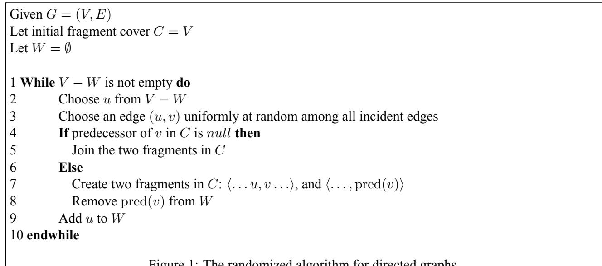
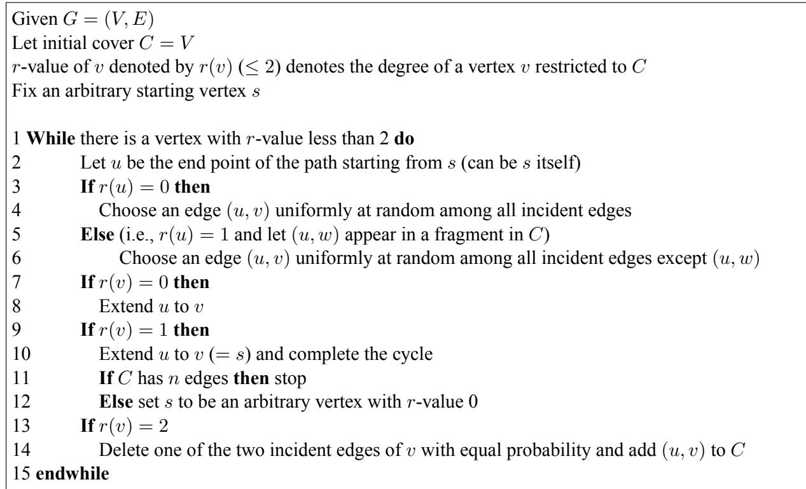

# On a Simple Randomized Algorithm for Finding Long Cycles in Sparse Graphs

Gopal Pandurangan ∗

# Abstract

We analyze the performance of a simple randomized algorithm for finding long cycles and 2-factors in directed Hamiltonian graphs of out-degree at most two and in undirected Hamiltonian graphs of degree at most three. For the directed case, the algorithm finds a 2-factor in $O ( n ^ { 2 } )$ expected time. The analysis of our algorithm is based on random walks on a line and interestingly resembles the analysis of a randomized algorithm for the 2-SAT problem given by Papadimitriou [15]. For the undirected case, the algorithm finds a 2-factor in $O ( n ^ { 3 } )$ expected time. We also analyze random versions of these graphs and show that cycles of length $\Omega ( n / \log n )$ can be found with high probability in polynomial time. This partially answers an open question of Broder et al. [4] on finding hidden Hamiltonian cycles in sparse random graphs and improves on a result of Karger et al. [13].

Keywords: Graph Algorithms, Randomized Algorithms, Random Walks, Sparse Graphs, 2-Factor, Hamiltonian Cycle, Long Cycle.

# 1 Introduction

Finding Hamiltonian cycles in graphs is a difficult NP-hard problem and remains NP-hard even when restricted to sparse Hamiltonian graphs, e.g., directed Hamiltonian graphs with maximum out-degree two [16] or undirected Hamiltonian graphs with degree at most three [10]. The problem has been shown hard to approximate in directed graphs: Bjorklund et al. [3] show that it is not possible to find paths or cycles of superpolylogarithmic length even in constant out-degree Hamiltonian graphs unless Satisfiability can be solved in subexponential time. For undirected Hamiltonian graphs, for a long time, the best known results yielded only paths of polylogarithmic length (e.g., [2]), even when restricted to bounded-degree graphs. Gabow [9], recently, gave a polynomial algorithm that finds paths and cycles of superpolylogarithmic length: he showed that if a graph has a cycle of length $\ell _ { : }$ , then one can find in polynomial time a cycle of length $e x p ( \Omega ( \sqrt { \log \ell / \log \log \ell } ) )$ . This is the best bound known at the present time, and is improved for graphs of degree bounded by $d$ to $\ell ^ { \Omega ( 1 / \log d ) }$ by Feder and Motwani [8]. In particular, they show that a cycle of length $n ^ { \Omega ( 1 / \log \log n ) }$ can be found in Hamiltonian graphs in polynomial time. For the special case of undirected Hamiltonian graphs with degree at most three Feder et al. [7] give a polynomial time algorithm to find a cycle of length at least n(log3 2)/2.

In this paper, we analyze the performance of a simple randomized algorithm in directed Hamiltonian graphs of out-degree at most two and in undirected Hamiltonian graphs of degree at most three. For the directed case, the algorithm finds a Hamiltonian cycle or terminates with some 2-factor in $O ( n ^ { 2 } )$ expected time (cf. Theorem 1). The analysis of our randomized algorithm is based on analyzing the expected time of a random walk on a line to hit one end of the barrier (also called the “gambler’s ruin” problem, see e.g., [12]). Papadimitriou [15] used a similar random walk based approach to analyze a simple randomized algorithm for the 2-SAT problem. The randomized algorithm was surprisingly simple and yielded a new $O ( n ^ { 2 } )$ expected time algorithm for 2-SAT.1 This raised a curious question whether a similar approach can be used for other problems. For the undirected case, the algorithm terminates with a 2-factor in $O ( n ^ { 3 } )$ expected time, (cf. Theorem 2). The proof interestingly involves studying a random walk on a graph with changing edges — thus “standard” results on random walks don’t directly apply, however, by appealing to special structure of the walk (in particular, its reversibility) we are able to show the desired bound. One may consider using a “gambler’s ruin” type of random walk to “discover” the Hamiltonian edges (as in proof of Theorem 1); unfortunately, this yields only an exponential time algorithm to find a 2-factor.2 Although somewhat more efficient deterministic algorithms exist for finding 2-factors in graphs (e.g., an $O ( { \sqrt { n } } | E | )$ time algorithm [11]), our randomized algorithm is extremely simple and naturally reuses already found paths (i.e., makes only local changes in each step). Reusing already found paths is intuitive and has been a feature of the rotation based algorithms for the $G _ { n , p }$ random graphs (see e.g., [1]). We mention that our randomized algorithm finds application in finding long paths in certain random graphs used to model NMR data of proteins [5].

We also consider sparse random versions of these graphs, i.e., directed 2-regular random Hamiltonian graphs and undirected 3-regular random Hamiltonian graphs. We show that cycles of length $\Omega ( n / \log n )$ can be found with high probability (w.h.p.)3 in polynomial time (cf. Theorem 3). Our results partially answer an open question of Broder et al. [4] who showed that for random Hamiltonian graphs with average degree much larger than three, there is a polynomial time algorithm that actually finds an Hamiltonian cycle. However, they left open the question of whether an Hamiltonian path/cycle or even a long path/cycle can be found in sparse random graphs, e.g., graphs of degree 3. Our result on 3-regular random Hamiltonian graphs improves on a result of Karger et al. [13] who give a polynomial algorithm which finds a path of length only $\Omega ( { \sqrt { n } } / \log n )$ with high probability. It will be interesting to give a polynomial algorithm that will actually find an Hamiltonian cycle in the above types of random graphs.

# 2 The Randomized Algorithm and its Analysis

For a graph $G = ( V , E )$ , define a fragment cover $C$ to be a set of simple paths or cycles (each path or cycle is called a fragment and can be of length zero) such that each vertex $v \in V$ appears in exactly one fragment. We say that an edge belongs to $C$ if it appears in any of the fragments in $C$ . A fragment cover will be an Hamiltonian cycle if there is only one fragment which forms a cycle. We discuss a simple randomized algorithm for directed graphs; later we will modify the algorithm to handle undirected graphs. Refer Figure 1. Let $C$ denote a fragment cover. Initially $C = V$ , i.e., each vertex is a fragment by itself. Let succ $( u , C )$ and pred $( u , C )$ denote the successor and predecessor of $u$ in a cover $C$ (these can be null). In every step of the while loop, we extend a vertex (say $u$ ) which do not have a successor (i.e., an outgoing edge), by choosing an outgoing edge with uniform probability (i.e., with probability $1 / d ( u )$ if $d ( u )$ is the out-degree of $u$ ), and potentially swapping a chosen edge for a previously chosen edge. In the algorithm, the set $V - W$ maintains the vertices with no successors. We repeat the while loop till every vertex has a successor. Thus when the algorithm terminates $C$ will consist of either an Hamiltonian cycle or a bunch of vertex-disjoint cycles covering $V$ (i.e., every vertex will belong to a non-trivial cycle) — a 2-factor of $G$ .

  
Figure 1: The randomized algorithm for directed graphs.

We analyze the algorithm on sparse directed Hamiltonian graphs, in particular those with out-degree bound of two. (As mentioned before, it is still NP-hard to find a Hamiltonian cycle.)

Theorem 1 Let $G$ be a directed Hamiltonian graph on n vertices such that each vertex has at most two outgoing edges. Then the randomized algorithm will terminate with a 2-factor of G in expected $O ( n ^ { 2 } )$ steps

or in $O ( n ^ { 2 } \log { n } )$ steps w.h.p.

Proof: Let $H$ be a Hamiltonian cycle in $G$ . We focus on the algorithm finding $H$ . We view the algorithm as a random walk on a line numbered $0 , \ldots n$ as follows. In some step (one execution of the while loop), say $t$ , the algorithm is stationed at number $k$ where $k$ is the number of “correct” edges, i.e., those belonging to $H$ ; in the beginning $k = 0$ . We claim that in step $t + 1$ , the algorithm can move to $k + 1$ with probability at least $1 / 2$ . The reasoning is as follows. Let $u$ be the vertex (does not have a successor yet) considered this step, then the probability that the correct edge, say, $( u , v )$ is chosen is at least $1 / 2$ . Now, does this affect the probability of some other edge? The only other edge which is affected is $( \mathrm { p r e d } ( v , C ) , v )$ . There are two cases: (a) pred $( v , C )$ is null, in which case we have $k + 1$ correct edges; (b) otherwise, we lose the edge $( \mathrm { p r e d } ( v , C ) , v )$ ; but the probability that that edge is correct conditioned on the fact that $( u , v )$ is correct is 0. Thus with probability at least 1/2 we add one correct edge. With probability at most $1 / 2$ , the algorithm can move to $k - 1$ or stay at $k$ . We are interested in the expected number of steps needed to reach $n$ . By setting up a difference equation (for example, see [12, pp. 73–74]), we can show that the expected number of steps needed to reach $n$ is at most $n ^ { 2 }$ . The high probability result follows from repeating the algorithm if it does not terminate in $2 n ^ { 2 }$ steps.

The above analysis assumes that in every step there is a vertex that does not have a successor. If not, this implies that $C$ will consist of a set of disjoint (non-trivial) cycles covering every vertex, i.e., a 2-factor. 

A few simple modifications of the randomized algorithm of Figure 1 are needed to apply it for undirected graphs. See Figure 2. $C$ is a fragment cover as before and initially $C$ consists of $| V |$ zero length fragments. Let $r ( v )$ denote the degree of $v$ restricted to the edges in $C$ . Note that $r ( v ) \leq 2$ . We start with an arbitrary vertex $s$ . In each step, we try to extend the end vertex of $P$ (call it $u$ ), by choosing an edge uniformly at random among the incident edges (if $r ( u ) = 1$ , we don’t choose the edge that is already in $C$ ). Let the chosen edge be $( u , v )$ . There are three possibilities. If $r ( v ) = 0$ or $r ( v ) = 1$ we extend $u$ to $v$ (step 8 or 10); if $r ( v ) = 1$ , this will complete a cycle at $s$ and we start extending from a new vertex with $r$ -value 0, if one exists. If $r ( v ) = 2$ , then there are two possible scenarios: $v$ is in $P$ or $v$ is in a simple cycle. In either case, we randomly delete one of the incident edges of $v$ and add $( u , v )$ to $C$ (step 14). Note that if $v$ is in $P$ , this can create a new cycle or a path which is a rotation (see e.g., [1]) of $P$ and if $v$ is in a cycle it creates a (longer) path starting from $s$ .

We now analyze the algorithm on Hamiltonian graphs with degree at most 3 (as noted before, finding an Hamiltonian cycle is still NP-hard).

Theorem 2 Let $G = ( V , E )$ be an undirected Hamiltonian graph on n vertices where each vertex has degree at most three. Then the randomized algorithm of Figure 2 will terminate with a 2-factor of $G$ in expected $O ( n ^ { 3 } )$ steps or in $O ( n ^ { 3 } \log { n } )$ steps w.h.p.

Proof: It is clear that the algorithm will terminate with a 2-factor since every vertex in $C$ will have a degree of two. We bound the expected time needed for termination. For the analysis, we divide the algorithm into phases as follows. In a phase, we always try to extend a path starting from a fixed vertex, say $u$ , till $u$ becomes part of a cycle. In the next phase, we pick an arbitrary vertex (say $w$ ) such that $r ( w ) = 0$ (if no such vertex exists then the algorithm is finished — step 11) and try to extend a path starting at $w$ and so on.

  
Figure 2: The basic randomized algorithm for undirected graphs.

In some step (i.e., one execution of the while loop) of the randomized algorithm of Figure 2, let $k < n { - } 1$ be the number of edges in the fragment cover $C$ . We note that the number of edges in $C$ in any subsequent step can never decrease: we either add a new edge to $C$ (in the case when $r ( v ) = 0 ,$ ) or keep the same number of edges (in the case when $r ( v ) = 2$ we add and delete an edge). What is the expected number of steps before we increase the number of edges in $C$ to $k + 1 2$ Let $C ^ { \prime }$ be the subgraph of $C$ induced by the vertices with $r$ -value at least 1. Let the algorithm be currently stationed at vertex $x$ and let the start vertex at the beginning of this phase be $s$ ( $s$ could be $x$ itself). Note that if we reach (i.e., make as end vertex) any vertex which has a neighbor in $V - C ^ { \prime }$ (we will call such vertices as bridge vertices), then with probability at least $1 / 2$ we will add one more edge to $C$ . There are at least two bridge vertices in $C ^ { \prime }$ since $G$ is Hamiltonian and we have less than $n$ vertices in $C ^ { \prime }$ . It is clear that the algorithm will eventually visit some bridge vertex in $C ^ { \prime }$ (starting from $x$ ) unless we reach and complete a cycle with $s$ before reaching $y$ . This is easy to see, because, if we just keep extending a path starting from $s$ , since $G$ is Hamiltonian, we will eventually visit some vertex in $V - C ^ { \prime }$ (unless of course, we complete the cycle at $s$ and end this phase).

Assume that in the current phase the algorithm is trying to extend a path (call it $P$ ) starting from some fixed vertex $s$ and, without loss of generality, let $r ( s ) = 1$ . Let $x$ be the current endpoint of the path starting from $s$ . In each step of the algorithm in this phase, the end vertex of $P$ changes as follows: if $v _ { 1 }$ is the current end vertex, there is a transition from $v _ { 1 }$ to $v _ { 2 }$ (i.e., we can “reach” $v _ { 2 }$ ) if there is a $v _ { 3 } \in C ^ { \prime }$ such that $( v _ { 1 } , v _ { 3 } ) \in E ( G )$ and $( v _ { 3 } , v _ { 2 } ) \in E ( C ^ { \prime } )$ — this captures how the end vertex of $P$ can change in step 14. (Note that, if there is a transition from $( v _ { 1 } , v _ { 2 } )$ then there can also be a transition from $( v _ { 2 } , v _ { 1 } )$ , and hence the walk is reversible. However, note that the edges of $C ^ { \prime }$ are changing as the random walk proceeds, thus we cannot directly apply the standard results from random walks on graphs.)

We show by induction on $l$ — the number of vertices in $C ^ { \prime }$ (we also include the start vertex in $C ^ { \prime }$ , even though its $r$ -value may become zero during the phase) — that we will add one more edge in at most $l ^ { 2 }$ expected steps (either by adding a new vertex to $C ^ { \prime }$ or by completing the cycle to the start vertex $s$ ). The induction hypothesis consists of two assumptions: (1) starting from any vertex $x$ (as end vertex), the algorithm will add a new edge in at most $l ^ { 2 }$ expected steps on sets $C ^ { \prime }$ of size $\leq l$ and (2) starting from any bridge vertex $u$ , the algorithm will add a new edge in at most $l$ expected steps on sets $C ^ { \prime }$ of size $\leq l$ .

The base case $( l = 1 )$ ) is trivial. We will show that the hypothesis is true for sets of size $l + 1$ . Let $x$ be the current end vertex and let $| C ^ { \prime } | = l + 1$ . We know that, since $G$ is Hamiltonian, there are at least two bridge vertices in $C ^ { \prime }$ (say $v _ { 1 }$ and $v _ { 2 }$ ) and at least one of them (say $v _ { 1 }$ ) is reachable from $x$ (note that $v _ { 1 }$ can be $x$ itself, and assume that $v _ { 2 } \neq x \mathrm { ~ }$ ). If only one of them is reachable, then we remove the unreachable vertex and merge the edges (in $C ^ { \prime }$ ) incident on it and apply the induction hypothesis. Otherwise, we proceed by assuming that both $v _ { 1 }$ and $v _ { 2 }$ are reachable. For the sake of argument pretend that the random walk is made by the algorithm on a graph $H$ obtained from $C ^ { \prime }$ by removing $v _ { 2 }$ and merging its two4 incident edges (in $C ^ { \prime }$ ) into a new edge — call it $f$ . Using part (1) of the induction hypothesis on $H$ , the algorithm will add a new edge in expected $l ^ { 2 }$ steps unless it uses (removes) edge $f$ before that. That is, we reach $v _ { 2 }$ 5 and with probability at least $1 / 2$ we add a new edge. Otherwise, consider the random walk on the graph obtained by merging $v _ { 1 }$ and its incident edges (in $C ^ { \prime }$ ). Now starting from $v _ { 2 }$ and using part (2) of the hypothesis, we will either add a new edge in $l$ steps or reach ${ v _ { 1 } } ^ { 6 }$ ; if we reach $v _ { 1 }$ , we repeat the argument with $v _ { 1 }$ as the starting bridge vertex. Thus, overall, the expected number of steps needed to add an edge starting from a bridge vertex is at most $( 1 / 2 ) 1 + ( 1 / 2 ) ( 2 l + 1 ) = l + 1$ ; thus induction step for part (2) is proved.7 To show for part (1), we see that the expected number of steps needed to add an edge starting from any vertex is at most $l ^ { 2 } + l + 1 \le ( l + 1 ) ^ { 2 }$ .

If $l = n$ (i.e., the number of edges in $C ^ { \prime }$ is $k = n - 1$ and the algorithm will be in the last phase), then we only need to close the cycle with the start vertex of this phase. In this case, we compute the expected time to reach a neighbor of $s$ . The above argument does not directly extend since there are no bridge vertices. However, there are at least two vertices that we can use to complete the cycle with $s$ : the two neighbors of $s$ in the Hamiltonian cycle of $G$ — these two vertices serve the same role as $v _ { 1 }$ and $v _ { 2 }$ in the above argument as follows. Again, let the end vertex at the beginning of this phase be $x$ . We will assume, for now, that $r ( s )$ never becomes zero in this phase. Let $v$ $( \neq v _ { 1 }$ , say) be the vertex adjacent to $s$ in the path $P$ . If one of $v _ { 1 }$ or $v _ { 2 }$ is unreachable from $x$ , then we merge the two incident edges on that vertex and use induction hypothesis. Hence we will assume that all vertices are reachable. As before, we merge the two incident edges on $v _ { 2 }$ (into a single edge $f$ ) and argue that within $l = ( n - 1 ) ^ { 2 }$ steps we either close a cycle with $s$ or we reach $s$ or we reach $v _ { 2 }$ before we remove edge $f$ . This is because there are only two ways of removing $f$ , either reaching $v _ { 2 }$ (in which case with probability at least $1 / 2$ we close the cycle) or reaching $s$ and adding the edge $( s , v _ { 2 } )$ . In the former case, it follows that in $n ^ { 2 }$ steps we will either reach $s$ or complete a cycle with $s$ . On the other hand, if we reach $s$ , then $r ( s ) = 0$ which implies that all the rest of vertices are part of some cycle. An easy fix to include $s$ also in a 2-factor is to add a dummy start vertex $s ^ { \prime }$ by subdividing an Hamiltonian edge containing $s$ which is not in $P$ . That is, if $( s , v _ { 2 } )$ is an Hamiltonian edge not in $P$ at the beginning of the (last) phase, then we remove the edge $( s , v _ { 2 } )$ and add the edges $( s ^ { \prime } , s )$ and $( s ^ { \prime } , v _ { 2 } )$ to $G$ , with $s ^ { \prime }$ being the new start vertex (and $( s ^ { \prime } , s )$ is added to $P$ ). Since we don’t know which of the (possibly) three incident edges of $s$ belongs to the Hamiltonian cycle, we try all three possibilities in parallel.

Summing up the number of steps needed to add each edge, $C$ will have $n$ edges in expected $\textstyle \sum _ { l = 1 } ^ { n } l ^ { 2 } =$ $O ( n ^ { 3 } )$ steps. 

# 3 Random Hamiltonian Graphs

A directed 2-regular random Hamiltonian graph can be viewed as a directed Hamiltonian cycle plus a random permutation. An undirected 3-regular random Hamiltonian graph can be viewed as a Hamiltonian cycle with a random perfect matching added. We refer to the edges on the Hamiltonian cycle as Hamiltonian edges, and refer to the other edges as random edges. We show that finding a 2-factor is enough to find a cycle of length at least $\Omega ( n / \log n )$ in these random graphs. Thus our randomized algorithm will find a long cycle in these graphs in polynomial time.

Lemma 1 A directed 2-regular random Hamiltonian graph or an undirected 3-regular random Hamiltonian graph of n vertices can be partitioned into at most $O ( \log n )$ vertex-disjoint cycles w.h.p. Thus any 2-factor will consist of a cycle of length $\Omega ( n / \log n ) \ w . h . p$ .

Proof: Consider a 2-factor in a directed 2-regular random Hamiltonian graph. Let the 2-factor consist of $b$ random edges $b \geq 0$ ) and $n - b$ Hamiltonian edges. We show that the number of vertex-disjoint cycles in a 2-factor is $O ( \log n )$ w.h.p. This is trivially true when $b = 0$ (the 2-factor is simply the Hamiltonian cycle). If $b = n$ , then the 2-factor is the graph of a random permutation of $n$ numbers and thus the number of disjoint cycles is $O ( \log n )$ in expectation and w.h.p. We claim that this is still true if we add any Hamiltonian edges for the following reason. Pick an arbitrary set of $n - b$ Hamiltonian edges and consider the $b ( > 0 )$ random edges emanating from the $b$ vertices that do not have successors — call this collection of $b$ vertices as $V ^ { \prime }$ . These Hamiltonian and random edges will form a 2-factor only if the $b$ random edges terminate in $V ^ { \prime }$ as well. Conditioned on this, note that each vertex in $V ^ { \prime }$ is equally likely to be the endpoint for a random edge. Thus, the number of vertex-disjoint cycles is number of disjoint cycles in a random permutation with $b$ nodes and the $b$ random edges. Hence, the expected number of cycles is $O ( \log b )$ and a Chernoff bound [14] shows that the number of cycles is at most $c \log n$ with probability at least $1 - 1 / n ^ { 3 }$ , for a suitably large constant $c$ . The above argument shows that if we pick a 2-factor then the number of vertex-disjoint cycles is $O ( \log n )$ w.h.p. But there can be many different 2-factors possible and there are dependencies between them. To handle this, we bound the number of different 2-factors.

There can be at most $O ( n ^ { 2 } )$ (i.e., polynomial in $n$ ) different 2-factors in a directed 2-regular random Hamiltonian graph w.h.p. This is because the expected number of different 2-factors is at most $\textstyle \sum _ { b = 1 } ^ { n } { \binom { n } { b } } b ! ( 1 / ( n ( n - 1 ) \dots ( n - b + 1 ) ) ) = n$ , since $b$ random edges can be inserted in place of $b$ Hamiltonian edges chosen in $\binom { n } { b }$ ways and there can be at most $b !$ different 2-factors each occurring with probability at most $1 / ( n ( n - 1 ) \dots ( n - b + 1 ) )$ . By Markov’s inequality, with probability at least $1 - 1 / n$ there are at most $n ^ { 2 }$ different 2-factors. The proof is finished by using the union bound since, with probability $1 - 1 / n ^ { 3 }$ , a 2-factor has $O ( \log n )$ disjoint cycles and there are only at most $O ( n ^ { 2 } )$ 2-factors w.h.p. The same argument works for a undirected 3-regular random Hamiltonian graph. 

Theorem 3 Given a directed 2-regular random Hamiltonian graph, the randomized algorithm of Figure 1 will find an Hamiltonian cycle of length $\Omega ( n / \log n )$ in $O ( n ^ { 2 } \log { n } )$ time w.h.p. (with respect to both path length and time). Given a undirected 3-regular random Hamiltonian graph, the randomized algorithm of Figure 2 will find an Hamiltonian cycle of length $\Omega ( n / \log n )$ in $O ( n ^ { 3 } \log { n } )$ time w.h.p.

Acknowledgments. We thank the anonymous referees for their comments and pointers to references. We are also grateful to one of the referees for pointing out an error in an earlier version of the paper.

# Список литературы

[1] D. Angluin and L. Valiant. Fast Probabilistic Algorithms for Hamiltonian Circuits and Matchings, Journal of Computer and System Sciences, 18, 1979, 155-193.   
[2] A. Bjorklund and T. Husfeldt. Finding a Path of Superlogarithmic Length, SIAM J. on Comput., 32(6), 2003, 1395-1402.   
[3] A. Bjorklund, T. Husfeldt, and S. Khanna. Approximating Longest Directed Path, Electronic Colloquium on Computational Complexity, Report No. 32, 2003.   
[4] A. Broder, A. Frieze, and E. Shamir. Finding Hidden Hamilton Cycles, Random Structures and Algorithms, 5, 1994, 395-410.   
[5] C. Bailey-Kellog, S. Chainraj, and G. Pandurangan. A Random Graph Approach for NMR Sequential Assignment, In Proceedings of the 8th Annual International Conference on Research in Computational Molecular Biology (RECOMB), 2004.   
[6] T. Feder. Stable Networks and Product Graphs, Memoirs Amer. Math. Society 116 (555), 1995.   
[7] T. Feder, R. Motwani, and C. Subi. Approximating the Longest Cycle Problem in Sparse Graphs, SIAM J. Comput., 31, 2002, 1596-1607.   
[8] T. Feder and R. Motwani. Finding Large Cycles in Hamiltonian Graphs, to appear in Proceedings of the ACM-SIAM Symposium on Discrete Algorithms (SODA), 2005.   
[9] H.N. Gabow. Finding Paths and Cycles of Superpolylogarithmic Length, In Proceedings of the 36th ACM Symposium on the Theory of Computing (STOC), 2004, 407-416.   
[10] M.R. Garey, D.S. Johnson, and R.E. Tarjan. The Planar Hamiltonian Circuit Problem is NP-complete, SIAM J. Comput., 5, 1976, 704-714.   
[11] A. Gibbons. Algorithmic Graph Theory, Cambridge University Press, 1985.   
[12] G. Grimmett and D. Stirzaker. Probability and Random Processes, second edition, Oxford University Press, 1992.   
[13] D. Karger, R. Motwani, and G.D.S. Ramkumar. On Approximating the Longest Path in a Graph, Algorithmica, 18, 1997, 82-98.   
[14] R. Motwani and P. Raghavan. Randomized Algorithms, Cambridge University Press, 1995.   
[15] C.H. Papadimitriou. On Selecting a Satisfying Truth Assignment, In Proceedings of the 32nd Annual IEEE Symposium on the Foundations of Computer Science (FOCS), 1991, 163-169.   
[16] J. Plesnik. The NP-completeness of the Hamiltonian cycle Problem in Planar Digraphs with Degree Bound Two. Information Processing Letters, 8(4), 1979, 199-201.