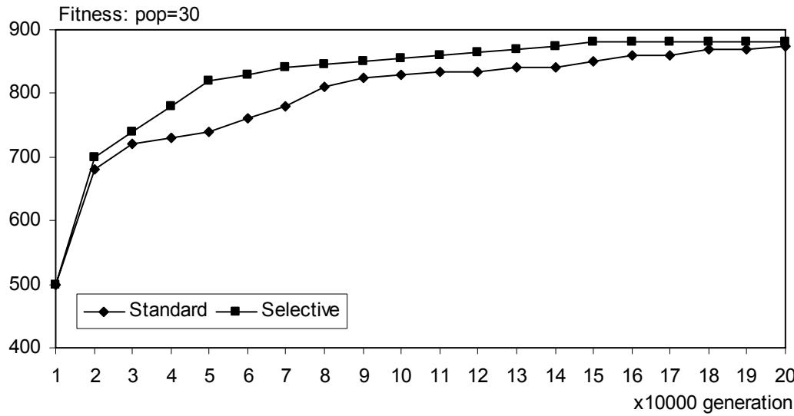
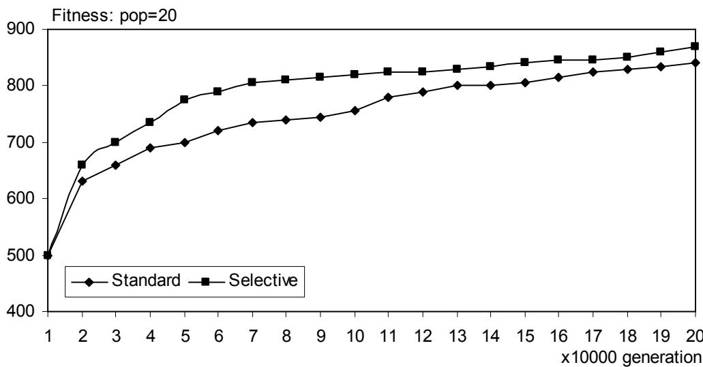
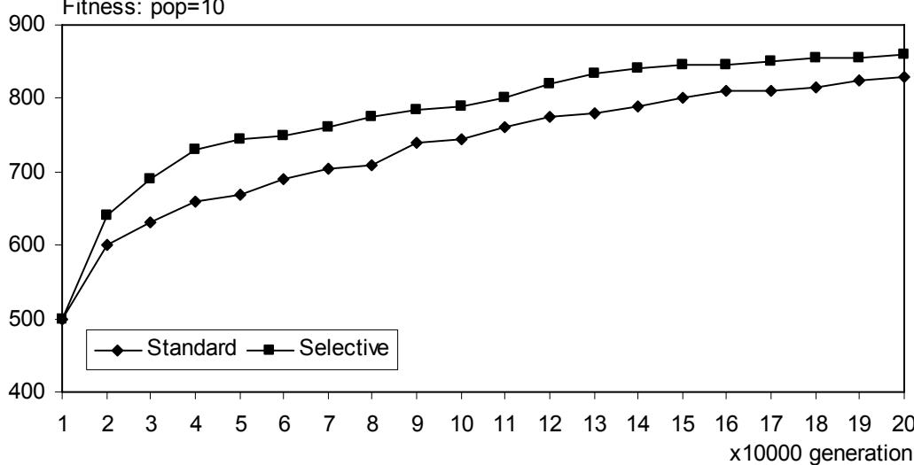

# A New Migration Model For Distributed Genetic Algorithms

Taisir Eldos Department of Computer Engineering Faculty of Computer and Information Technology Jordan University of Science and Technology Irbid 22110-3030 Jordan

Email: eldos@just.edu.jo , Tel: +962-2-7201000 ext 22500, Fax: +962-2-7095046

The 2005 International Conference On Scientific Computing (CSC'05) June 20-23

# Abstract

Genetic algorithms are heuristic search algorithm used in science, engineering and many other areas. They are powerful but slow because of their evolutionary nature that mimics the natural selection process. The quality of the solutions delivered depends on the population size, causing larger demand on processing power. Parallel and distributed processing techniques resolve this issue by allocating subpopulations to a number of processors that interact by exchanging parts of their populations through a migration process. Two schemes of migration are in use today; the island and the step-stone models. This paper presents a new topology independent scheme called the selective migration model. This scheme allows migration among demes only if the individuals meet certain criteria at both the source and the destination. Experiments show that this model improves the performance by offering faster convergence in large population setups and better solutions in time-constrained small population setups.

Keywords: Distributed, Genetic, Multiple-deme, Population, Selective, Migration

# 1. Introduction

Genetic algorithms are considered a paradigm of algorithms as they are parameterized and applicable to a variety of problems by instantiating. These powerful search methods are based on the natural principle “survival of the fittest”. In these methods, a set of randomized operators are applied to a population of solutions to produce generations. This iterative process produces better and better generations, hoping for an optimal solution, although “good enough” solutions are practically what we hope for in most cases. Those algorithms have been employed, along with other evolutionary algorithms, to deliver efficient solutions to many complex problems in science, engineering and many other fields.

Genetic algorithms do not necessarily converge to an optimal solution, and they are normally compute-intensive. Researchers have tried to set values and ranges for the parameters used like crossover and mutation frequencies, but the values seem to depend on the nature and size of the problem. However, the major design issues in genetic algorithms are:

1. Mapping, a problem to algorithm coding scheme amenable to genetic processing.   
2. Objective function, which provides a measure of fitness to promote the good solutions and demote the bad ones.   
3. Operators, to carry out the evolution process.   
4. Parameters, including population size and structure, mutation rate, crossover type and rates, recombination policies, termination condition

The algorithm starts with a set of solutions selected at random as an initial population, and an iterative process of selecting a solution or two, to apply one of the operations to generate the offspring. Combination and replacement rules are then applied to insert and kick out solutions towards a new generation.

Overcoming the major drawback of these algorithms has two avenues; the first is to enhance the algorithm itself by fine tuning the settings; configuration and parameters. The second is to employ more processing power, which adds new operators and factors to worry about.

# 2. Related Work

Enhancements using the two methods stated earlier are reported in the literature. Considerable improvements were reported through the algorithm behavioral enhancements, although the optimal setting of the parameters depends on the application and search stage [1]. Nowstawski provided a review of the parallelization methods and proposed a new taxonomy in [2]. Eric and Goldberg [3] provided guidelines to choose the parallel genetic algorithms rationally. Adamidis [4] allowed the populations to behave differently to enrich the evolution process. Back [5] used self-adaptive cross-over and mutation rate and a variable population size model. Cantu-Paz [6] reported that careful selection of migration may cause the algorithm to converge faster. Chen [7] reported improved performance by using domain dependent settings like random respectful recombination and greedy cross-over.

# 3. The New Migration Model

Coarse-grained genetic algorithms, or multiple-deme genetic algorithms as they are called in the literature sometimes, is a way to speed up the evolution process by parallel processing. This implies having subpopulations distributed among many processors, which requires a new migration operator to be added to the configuration. It has become clear that migration policy is quite significant, in providing diversified population, and hence in providing higher quality solutions, and possibly faster converges.

The migration of individuals from one deme to another during the evolution is controlled by several parameters, mainly:

1. Migration Topology, which defines the connections between the demes, hypercube, mesh, torus, etc. that impose restrictions on some destinations for individuals. 2. Migration Rate, which defines how many individuals migrate and how often it occurs.

3. Migration rules, which decide which individuals migrate, the destination, and the accommodation policy.

The question here is whether the two existing models for migration, the island and the stepstone models, are the only ways to carry out the migration operation, and whether there are conditions for granting individuals an immigration visa. This paper presents a new approach for migration, in which the individuals are screened at both the source and the destination, offering a selective application of the migration operation, and hence the name.

The selective migration model is implemented by imposing restrictions on the island model, through applying two checks, a source check and a destination check. In this model, only individuals who meet those conditions will be allowed to migrate. This mimics the real world migration phenomena, in which countries allow people who meet certain qualifications to get in, and typically people with low and high qualifications do not leave their countries.

While previous migration schemes concentrated only on the individuals to be migrated and those to be replaced with in the destination, the proposed migration scheme concentrates on the qualifications that provide selectivity. Typically, each deme will maintain a figure of merit for its population, like the average fitness or individual ranks.

# 3.1. Processing Model

The new approach is focused on the effect of controlling the migration process by relating it to the fitness, and hence the topology is not considered a major factor, although it has been reported as a factor that affects the solution quality in the standards migration models [8]. This model assumes that individuals can migrate freely among demes, if they satisfy certain conditions at both the source and destination. The full connectivity network seems to be the choice for this implementation, but any other topology can be used with at the price of increased communication overhead due to hoping.

# 3.2. Parallel Genetic Algorithms

Parallelization of the genetic algorithms take different forms; from the computational responsibility point of view, the algorithm can be symmetrical where nodes have their own populations and perform the similar tasks, and they communicate periodically to exchange information and parts of their populations. The other form of parallelization is the master-slave form, in which a master node assumes the administrative responsibility and the other nodes perform computations only, mainly fitness evaluation. From the information exchange point of view, the algorithm can follow the island model which allows exchange between any two nodes or the step-stone model which restricts exchange to neighbors, either the direct ones or the ones within a cell, which is why it is sometimes called the cellular model. The quality of solutions achieved through the second model is topology dependent as reported in the literature.

# 3.3. Migration Scheme

Current migration schemes are variations of topology (destination is either a neighboring demes or any other deme), and the assignment and replacement policies (best, worst or random). In the proposed model, individuals are screened; examined at both the source and the destination to qualify for migration. The source gives or denies a visa based on local qualification criteria and the destination grants or denies a residency based on local qualification criteria. The simplest form of qualification criteria is through the individual’s relative fitness. Every individual in a very deme is ranked locally; an individual qualifies for a visa at the source deme if its rank is within a range, typically the middle class. On the destination deme, an immigrant is accepted as a new member of the population if its rank is better than a threshold set by that receiving deme.

Each node invokes the migration process at a fixed rate, to nominate an individual for migration. The nominated individual is checked against source criteria to get a visa, and then sent to a randomly selected destination deme. In the destination node, this individual is checked against the local criteria, to get accepted or denied. The accommodation is achieved through a random selection of a victim, while the deme of origin marks the immigrant “dead” to be victimized upon the next recombination process.

# 3.4.The Algorithm

Each node in the systems executes the same procedure repeatedly until the stopping criteria are met. Often times the stopping criteria is expressed in terms of number of generations, or when a time budget is consumed. In some cases the stopping criteria is expressed in terms of the relative improvement in solution quality in a generation compared to the previous one.

1. Generate N-individual subpopulation at random   
2. Pick a random number (0-1)   
3. If random number $<$ cross-over rate then a. Perform cross-over b. Recombine c. Update Fitness and Ranking

4. Pick a random number (0-1)

5. If random number $<$ mutation rate then a. Perform cross-over b. Update Fitness and Ranking

6. Pick a random number (0-1) Migration Process

7. If random number $<$ migration rate then

a. Pick a random number (1-N) to nominate an immigrant X   
b. If the rank of X is within limits then i. Pick a random number (1-M) as a destination deme D ii. Send X to the destination deme D iii. Mark X as “dead” to be killed in step 3.b

8. If an immigrant Y is received then a. If the rank of Y exceeds threshold

i. Add to the population   
ii. Update Fitness and Ranking   
iii. Pick a random number (1-M) to nominate a victim V   
iv. Discard the victim V

9. If stopping criteria is not satisfied the repeat 2 through 7

# 4. Model Evaluation

The problem used to test the proposed model, the computing environment and the algorithm settings are discussed in the following sections.

# 4.1. The problem

The $0 / 1$ knapsack problem is used as a test for two reasons; it is easy to predict the solution quality using greedy algorithms (or even by enumeration for moderately sized problems), and more importantly because of its nature, that assumes no position significance of the objects in the string. This allows examining only the effect of the new migration policy aside from the other factors.

# 4.2. The settings

The 0/1 knapsack problem was chosen to have capacity of 200 and a set of 36 objects, with weights in the range 1 to 20 and values in the range 1 to 100. The objects were selected at random at the beginning for all the runs.

To focus on the effect of introducing the selective migration model, we implement the algorithm with standard operators and rates, stated in the related literature. We assume a single point cross-over with a fixed rate, and a fixed rate mutation and standard replacement policies. Three population sizes were used; small with 10, moderate with 20 and large with 30.

The exhaustive search took several hours on a powerful workstation and the optimal solution was shown to have the weight 198 and the values 880. The same workstation was used to simulate the fully connected network of 16 nodes, and this caused the number of runs to be limited to 4 for per model per population size, 200,000 iterations each.

# 4.3. The Results

Clearly, the selective migration enhances the solution quality as the graphs show. While this improvement is limited for large population size is large, i.e. 30, as shown in figure 1. The improvement is considerable with small population size, i.e. 10 as shown figure 3. The threshold values used to qualify the individual for immigration were arbitrary; at the source deme if an individual ranks middle class, i.e. the middle third of the population, it gets a visa. At the destination, an immigrant is accepted if it is not among the worst one third of the population.

From the three populations used in the experiment, at no time had the standard model outperformed the new model. This is expected because the only overhead this model has is the random numbers, and the sorted ranks. The ranking system requires the ranks sorted every time an individual is inserted into or deleted from the population. By using link list structure to hold the ranks, this overhead is kept minimal; i.e. a single pass only.

With a population size of 30, both the standard and the selective model arrived at the optimal solution after 150,000 iterations for the selective model and 200,000 iterations for the standard model. For the other population sizes, neither the standard model nor the selective model could reach the optimal solution within 200,000 iterations but the selective model was always a head of the standard.

  
Figure 1

  
Figure 2   
Figure 3

# 5. Conclusion

The new conditions imposed on the migration process result in a selective migration model, which enhances the performance parallel genetic algorithms, particularly when the population size is relatively small. The results indicate that using the selective migration model lessens the quality dependence on the population size. This can be viewed as a way to maintain the quality while reducing the population size to cope with the normally limited processing power. Future work may focus on finding the optimal settings for this model, like rates thresholds.

# 6. References

[1] Dirk Schlierkamp-Voosen and Heinz Muhlenbein, "Adaptation of population sizes by competing subpopulations," Proceeding of the IEEE international conference on evolutionary computation, pp. 330-335. May 20-22, 1996.

[2] M. Nowostawski and R. Poli, “Parallel Genetic Algorithm Taxonomy,” Proceedings of the IEEE international conference on knowledge-based intelligent information engineering systems (KES'99), pages 88-92, Adelaide, August 1999.

[3] E. Cantú-Paz and D.E. Goldberg, “Efficient Parallel Genetic Algorithms: Theory and Practice,” Computer Methods in Applied Mechanics and Engineering. 186, 221-238., 2000.

[4] P. Adamidis, S. Kazarlis, V. Petridis, “Advanced Methods for Evolutionary Optimization,” LSS'98, 8th IFAC/IFORS/IMACS/IFIP Symposium on Large Scale Systems: Theory and Applications, , University of Patras, Greece, July 15 -17, 1998.

[5] Thomas Bäck, Agoston E. Eiben, and Nikolai A. L. van der Vaart. “An Empirical Study on GAs Without Parameters.” In M. Schoenauer, K. Deb, G. Rudolph, X. Yao, E. Lutton, J. J. Merelo, und H.-P. Schwefel, Hrsg., Proceedings of the parallel problem solving from Nature - PPSN VI, Paris, Seiten 315-324, Springer, Berlin, 2000.

[6] E. Cantú-Paz, “Migration Policies, Selection Pressure, and Parallel Evolutionary Algorithms”, Journal of Heuristics. 7(4), 311-334, 2001.

[7] S. Chen and S. Smith, "Putting the Genetics back into Genetic Algorithms: Reconsidering the Role of Crossover in Hybrid Operators," Foundations of Genetic Algorithms 5, Morgan Kaufmann, 1999.

[8] T. Matsumura, M. Nakamura, D. Miyazato, J. Okech, and K. Onaga, “Effects of Chromosome Migration on Parallel and Distributed Genetic Algorithms,” Proceedings of the International Symposium on Parallel Architectures, Algorithms and Networks, pp. 357-361, 1997.