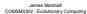

# Markov Processes

Markoy Processes are state-transition processes that satisfy the Markov Property

I Definition: the Markov property is the property that the probability distribution over the next possible states of a system depends only on the current state

Ccllular Automata I Cellular Automata I Finite State AutomaI Genetic Algorithms

A GA satisfies the Markov Property if we specify each possible

I Then the probability of generating any population is a function only of the current population, and the operators used

# Markov Processes

A Markov Process can be defined by a transition matrix   
I The transition matrix defines the probability of reaching each possible state, from each possible state   
So for a transition matrix

$$
Q = { \left( \begin{array} { l l l } { { \frac { 1 } { 4 } } } & { 1 } & { 0 } \\ { { \frac { 1 } { 2 } } } & { 0 } & { 1 } \\ { { \frac { 1 } { 4 } } } & { 0 } & { 0 } \end{array} \right) }
$$

the entry Q is the probability that row state i is reached from column state j

I E.g. Q1,0 = 12 I Each column is a probability distribution over states The transition matrix is a stochastic matrix The entries must all be non-negative, and columns must sum to one

# Markov Chains

# Limiting Distributions

I A sequence of states in a Markov Process is referred to as a Markov Chain   
I For any state at time t, the probability distribution over states at time $t + \tau$ will be given by the transition matrix   
I In general we can calculate the probability distribution at time t from any probability distribution over states at time t 1, through simple matrix multiplication $p ( t ) = Q p ( t - 1 )$ p t is the column vector giving the probability distribution over states I Knowing which state we are in is just a special kind of vector p t in which one entry is 1 and all others are 0

I In fact we can calculate the probability distribution over states for any t in the future, given some initial probability distribution $p ( 0 )$

$$
p ( t ) = Q ^ { t } p ( 0 )
$$

I If the transition matrix for a Markov Process is primitive, we can calculate the limiting probability distribution over the different states

I Definition: A transition matrix is primitive (or regular) if Qt has all non-zero entries for some t ≥ 0 ≥  I I.e. there is a non-zero probability of reaching every possible state at some arbitrary point far enough into the future

I $Q ^ { \infty } = \operatorname* { l i m } _ { t \to \infty } Q ^ { t }$ rron-Frobenius): For any prim t exists, where each column of $Q ^ { \infty }$ stochastic matrix Q, is the unique t→∞ probability vector q s.t. $Q q = q$ (i.e. q is an eigenvector of Q with eigenvalue 1). $q =$ lim Qtp(0) for any p(0), and all entries of q are non-negative.

l.e, in the limit of infinite time we can calculate the expected distribution over the different possible states the process can be in

I If a transition matrix is not primitive it may have absorbing states

I An absorbing state is one which, once entered by the process, will never be left They are identified by a 1 on the diagonal of the transition matrix

If an absorbing state can ultimately be reached from any state in the process, the Markov Chain will eventually reach an absorbing state and stay in it

In such a case we can calculate the limiting transition matrix Q

# Absorbing States - Limiting Transition Matrix

# Time to Absorption

Definition: a transition matrix is reducible if its states can be reordered to give a transition matrix of the form

$$
{ \boldsymbol { \mathcal { Q } } } = \left[ { \begin{array} { l l } { I } & { R } \\ { 0 } & { S } \end{array} } \right]
$$

where I is the identity matrix, and 0 is the zeroes matrix

Theorem (Matrix Reducibility): for a reducible transition matrix Q

$$
\operatorname* { l i m } _ { t  \infty } \mathsf { Q } ^ { t } = [ \begin{array} { l l } { I } & { R ( I - \mathbb { S } ) ^ { - 1 } } \\ { 0 } & { 0 } \end{array} ]
$$

I So for a reducibile matrix we can calculate the limiting transition matrix

I The matrix $( I - S ) ^ { - 1 }$ is called the fundamental matrix and is very useful

N.B. the order of the identity matrix I used in calculating the fundamental matrix may differ from that in the decomposition of Q above

I Using the fundamental matrix we can also calculate the expected time to reach an absorbing state from any non-absorbing state I Theorem (Time to Absorption): Given a reducible transition matrix Q, the times to absorption from each of the states $k$ are the entries $a _ { * }$ in the vector

$$
\bar { a } = 1 ( I - S ) ^ { - 1 }
$$

I where 1 is the ones matrix

I To apply the techniques of Markov Chain analysis to a GA, we need to

I Identify the states of the process Calculate the transition matrix

I The first of these is quite straightforward

I The states of the process are all the possible populations

I Given that a population can contain duplicates, for population size N and search space C the number of possible states is

$$
\binom { | c | + N - 1 } { N }
$$

# Calculating the Transition Matrix

I With all possible populations as states, we have a Markov Process I The next state (population) depends (stochastically) only on the current population   
I We shall assume that the transition matrix does not change over time I Hence we have a homogenous Markov Process   
I With the states identified, we can now calculate the transition probabilities between states, i.e. the transition matrix

I We begin by representing a population as a vector

$$
\pmb { v } = ( \pmb { v } _ { 0 } , \pmb { v } _ { 1 } , . . . , \pmb { v } _ { | | \pmb { c } | - 1 } )
$$

I where each $v _ { k }$ is the number of copies of poin $k$ in the search space, and

$$
\sum _ { k = 0 } ^ { n - 1 } v _ { k } = N
$$

I The for fitness proportional selection, the probability of an individual representing point i in the search space being selected in a particular population v is

$$
P ( i | v ) _ { 1 } = \frac { v _ { i } f ( i ) } { \displaystyle \sum _ { j \in c } v _ { j } f ( j ) }
$$

# Analysing the Simple GA - Selection

Given the probability of selection $P ( i | v )$ we can calculate the |    probability of generating a population u from population v, by using the multinomial distribution

$$
P ( u | v ) = N ! \prod _ { i \in \mathcal { C } } \frac { P ( i | v ) _ { \uparrow } ^ { \omega _ { \uparrow } } } { u _ { i } ! }
$$

I Next we extend the probability expression $P ( i | v ) _ { 1 }$ to take account of

the mutation and crossover operators

To do this we shall first need to construct mixing matrices for these operators...

# Mixing Matrices

A mixing matrix gives the probability of producing each possible offspring chromosome for every possible parent chromosome(s)

A mixing matrix is thus an n + 1-dimensional matrix, where n is the number of parents involved in producing an offspring

Hence the mixing matrix for the mutation operator is 2-dimensional

I M gives the probability that the operator applied to chromosome j produces chromosome i

I E.g. for standard mutation on binary strings of length $\ell = 2$ we can calculate

$$
{ \cal M } = \left( \begin{array} { c c c c } { { ( 1 - \mu ) ^ { 2 } } } & { { \mu ( 1 - \mu ) } } & { { \mu ( 1 - \mu ) } } & { { \mu ^ { 2 } } } \\ { { \mu ( 1 - \mu ) } } & { { ( 1 - \mu ) ^ { 2 } } } & { { \mu ^ { 2 } } } & { { \mu ( 1 - \mu ) } } \\ { { \mu ( 1 - \mu ) } } & { { \mu ^ { 2 } } } & { { ( 1 - \mu ) ^ { 2 } } } & { { \mu ( 1 - \mu ) } } \\ { { \mu ^ { 2 } } } & { { \mu ( 1 - \mu ) } } & { { \mu ( 1 - \mu ) } } & { { ( 1 - \mu ) ^ { 2 } } } \end{array} \right)
$$

# Mixing Matrices

For crossover, the number of parents involved is 2   
Assuming 1 offspring is produced, we thus need a 3-dimensional matrix M where $M _ { i , j , k }$ is the probability that parents i and j produce i,j,k   offspring k through crossover   
I However we can simplify by calculating the probability that an arbitrary chromosome is produced

$$
M ( 0 ) = \left( \begin{array} { c c } { { \ddots } } & { { \dots } } \\ { { \vdots } } & { { \ddots } } \end{array} \right)
$$

where $M _ { i , j } ( 0 )$ is the probability that chromosomes i and / produce the all-zeroes chromosome through application of the crossover operator I Now we can calculate any point in the full 3-dimensional matrix through a permutation

$$
M _ { i , i } ( k ) = M _ { i \in \star , i \in \star } ( 0 )
$$

where i, j and k are the binary representations of the corresponding matrix indices, and is XOR

# Analysing the Simple GA - Mutation

Given our mixing matrix, which we label U, the probability of generating individual i through selection then mutation is

$$
P ( i | v ) _ { 2 } = \sum _ { i \in \mathcal { C } } U _ { i , i } P ( j | v ) _ { i }
$$

I So the two-operator transition matrix is defined by

$$
P ( u | v ) = N ! \prod _ { i \in \mathcal { C } } \frac { P ( i | v ) _ { 2 } ^ { \omega } } { u _ { i } ! }
$$

I Suppose that U contains only non-zero entries, as it would for $\mu > 0$

If there are no zero entries in U, the matrix is primitive and there can be no absorbing states I The GA does not converge, and we can calculate the limiting probability distribution over the states with the Perron-Frobenius theorem

# Analysing the Simple GA - Crossover

I If we have the crossover mixing matrix $M ( 0 )$ and permutations on it as previously described, we can calculate the probability of producing chromosome k from chromosomes i and j using mutation, selection and crossover

$$
P ( k | v ) _ { 3 } = \sum _ { i , j \in { \mathcal C } } M _ { i , j } ( k ) P ( j | v ) _ { 2 } P ( j | v ) _ { 2 }
$$

I As any reasonable crossover operator should be able to produce any chromosome k given suitable parents i and i. the sum in the above expression will be greater than zero

I Also we have already shown $P ( i | v ) _ { 2 } > 0$ for all i

So the transition matrix is now

$$
P ( u | v ) = N ! \prod _ { i \in c } \frac { P ( i | v ) _ { 3 } ^ { \omega } } { u _ { i } ! }
$$

I and is primitive

# Analysing the Simple GA

We have shown that a GA with or without crossover is primitive I It has no absorbing states, hence does not converge It's limiting distribution is calculable

Theorem (Davis-Principe): If Q is the primitive transition-matrix for a GA with non-zero mutation rate, the limiting distribution is given by

$$
q _ { v } = \frac { | \mathsf { Q } _ { v } - I | } { \displaystyle \sum _ { u } | \mathsf { Q } _ { u } - I | }
$$

where $q _ { v }$ , is the probability of population v, and the matrio $Q _ { \psi }$ is the matrix O with the uth column replaced by zeroes

I This formalises the intuition that mutation acts to prevent population convergence

# GA Non-Convergence

I Consider the example of a search space $\{ 0 0 , 0 1 , 1 0 , 1 1 \}$ denoted = 0, 1, 2, 3

C  {   } I The fitness function is $f ( x ) = x + 1$ I I.e. f(0) = 1, f(3) = 4, etc.

I The mixing matrix for standard mutation with $\mu = 0 . 1$ is

I For population size $N = 4$ there are $( { \bar { \mathbf { \Gamma } } } _ { 4 } ^ { 7 } ) = 3 5$ possible populations

4    We can calculate the 35 35 transition matrix for fitness proportional selection and mutation

# GA Non-Convergence

I Applying the Davis-Principe theorem gives us the limiting distribution over all possible populations I The highest probability populations in this limiting distribution are

<table><tr><td>Population</td><td></td></tr><tr><td>(0.0.0.4)</td><td>0.143</td></tr><tr><td>(0,0,1,3)</td><td>0.124</td></tr><tr><td></td><td>0.102</td></tr></table>

I I.e. the most probable population is that containing only copies of the optimal solution   
I But, 15 possible populations contain no copies of the optimal solution, and the cumulative probability of these populations is approximately 17%   
I The GA will not converge, regardless of how long it is run for I This can be demonstrated empirically I Exercise: Run multiple replicates of a simple GA without crossover on the above fitness function, and compare the proportion of optimal and suboptimal populations with the theoretical limits

I We have proved that a GA with mutation does not converge I Convergence non-proofs are less compelling arguments for using a search heuristic than convergence proofs! I How can we modify the GA so that we can prove convergence?

I We might anneal the mutation rate   
I As in simulated annealing, we progressively reduce the mutation rate to restrict the search   
I However there is no guarantee the GA will converge to the optimal population

# GA Convergence - Elitism

I Elitism can also give us provable convergence   
I Elitism guarantees that for the best individual k in the population at time t. then at time t + 1 I k remains in the population, or I A better solution than k is in the population   
I Now the fitness of the best individual in the population is a monotonically increasing sequence with an upper-bound given by the optimal fitness value in the search space

# GA Convergence - Elitism

# Calculating with Markov Chains - State Aggregation

Convergence can be proved by showing that the sequence is a supermartingale

I Definition: For a stochastic sequence X , X , X , ... and function D 0 1 2   mapping members of this sequence to the real numbers, a new stochastic sequence D , D , D , ... can be generated by D = D(X ). If the function D is bounded and $\begin{array} { r } { E ( D _ { t + 1 } | X _ { t } ) \leq D _ { t } , } \end{array}$ then the sequence D is a supermartingale

Non-negative supermartingales converge almost certainly to some limit, so we can prove

I Theorem (Rudolph): If X is a population at time t and f(X ) is the o the ft dividal n XTen or an aia l A th sequence $D _ { t } = f ^ { * } - f ( X _ { t } ) ,$ t        , where f∗ is the fitness of the best possible t =  ∗ − ( t)        solution, forms a non-negative supermartingale which converges almost certainly to zero

I This is an intuitive idea, but it is nice to have a proof I We can also approximate the expected time to convergence using the absorbing states theorem on a simplified Markov process

# Calculating with Markov Chains

Markov Chain analysis can be used to analyse GA behaviour without explicitly manipulating transition matrices for realistics GAs   
I However, the number of possible populations ${ \binom { N + | C | - 1 } { N } }$ rapidly  N  becomes unmanageable even for comparitively small N and   
I To make the resulting transition matrices manageable we can apply a state aggregation technique I Identify states sufficiently similar to be aggregated states I Recalculate the probability of entering the aggregated states from all other states Recalculate the probability of reaching all other states from the aggregated states I Calculate the probability of staying within the aggregated states

We seek states that have an identical probability distribution over the next state to be visited in the chain

Once in one of these states, it is irrelevant which of the states we are actually in   
I These states can be aggregated into a single state without changing the hehaviour of the Markov Chain   
I They can be identified by having identical columns in the transition matrix

Finding states with identical distributions is unlikely, so we can aggregate other states that are in some way similar

We can compare the sum of squares difference between two matrix columns and aggregate if it is under some thereshold , i.e. if for two matrix columns u and v

$$
\| u - v \| ^ { 2 } = \sum _ { k } ( P ( k | u ) - P ( k | v ) ) ^ { 2 }
$$

James Marshall

# Calculating with Markov Chains - Matrix Recalculation

# Calculating with Markov Chains - Matrix Recalculation

# Calculating with Markov Chains - Matrix Recalculation

I As we aggregate states, we must recalculate the transition probabilities they are involved in   
I The probability of entering the newly aggregated state is simply calculated as

$$
P ( \{ u , v \} | k ) = P ( u | k ) + P ( v | k )
$$

I The probability of going to another state from the newly aggregated state is calculated as the weighted mean probability of the transitions from each of the original states

I The weights are estimates of the probabilities of entering each of the original states, obtained by summing the probabilities in the rows of the sitn i  o sts

I So the the column in the transition matrix for the newly aggregated state is given by

$$
P ( k | \{ u , v \} ) = \frac { w _ { u } P ( k | u ) + w _ { v } P ( k | v ) } { w _ { u } + w _ { v } }
$$

I Finally, we calculate the probability of staying within the newly aggregated state   
I As for the probability of leaving the aggregated state, we must estimate the probability we are in each of the original states   
I The probability of staying within the new state is again a weighted mean

$$
P ( \{ u , v \} | \{ u , v \} ) = \frac { w _ { u } ( P ( u | u ) + P ( v | u ) ) + w _ { v } ( P ( u | v ) + P ( v | v ) ) } { w _ { u } + w _ { v } }
$$

# Calculating with Markov Chains

With these approximation tools we can simplify our transition matrix in two main way I One pass, in which we only aggregate original states I Multipass, in which we aggregate aggregated states

I By varying  we have a speed-accuracy trade-off

I High epsilon aggregates more states, hence increases calculation speed with the transition matrix..   
..but at the expense of accuracy of the approximation   
I And vice-versa