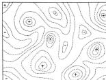

# Fitness Functions

I So far we have examined most of the components of a GA in quite some detal   
I One component we haven’t paid much attention to so far is the fitness function   
I We may be able to learn something about GA behaviour by analysing fitness functions, and the fitness landscapes they give rise to

# Fitness Functions - Analysis

I An early attempt to analyse fitness functions and hence predict GA performance was via epistasis variance

Definition: Epistasis is the nonlinear interaction of two or more loci on some trait such as fitness   
Epistasis is the multiple locus eguivalent of dominance, which is defined for single loci

Epistasis will be significant in most GA problems ther is no epistass, then the problem s basicaly lnear and is best If there is no epistasis, then the p

I If we can quantify the degree of epistasis in a problem we might gain

some advantage

Identity the most appropriate technique for the problem entify the most appropriate technique for the problem I GAs are assumed to be best suited to problems with ‘intermediate’ epistasis   
I Identify suitable encodings and operators I E.g. change in encoding might turn a linear fitness function into a non-linear one, and vice-versa

# Fitness Functions - Analysis

Analysis of the entire space of possible solutions is clearly impossible for any realistic optimisation problem we face

I Hence we analyse epistasis variance in terms of a sample population

I Mean fitness of the population $P$ is simply

$$
7 = \sum _ { x \in P } { \frac { t ( x ) } { N } }
$$

Then the excess fitness value of a chromosome can be calculated as

$$
\delta ( x ) = f ( x ) - { \overline { { F } } }
$$

# Fitness Functions - Analysis

I If allele a occur at locus i with frequency N (a), then the average value of that allele is

$$
A _ { i } ( a ) = \sum _ { x \in X = a } { \frac { t ( x ) } { N _ { i } ( a ) } }
$$

T xs feval avi lle  lcs s

$$
\delta _ { i } ( a ) = A _ { i } ( a ) - \bar { t }
$$

I Summing these gives the excess genic value of chromosome x

$$
\delta _ { G } ( \boldsymbol { x } ) = \sum _ { i = 0 } ^ { i - 1 } \delta _ { i } ( \boldsymbol { a } )
$$

I So the epistasis value is the difference between the fitness predicted by linear combination of the alleles of the chromosome, and the actual fitness of the chromosome

$$
{ \mathfrak { e } } ( x ) = \delta ( x ) - \delta { \mathfrak { e } } ( x )
$$

# Fitness Functions - Analysis

Under this epistasis variance analysis it is seen that

$$
\sum _ { x } \delta ( x ) ^ { 2 } = \sum _ { i = 0 } ^ { t - 1 } \sum _ { a } \delta _ { i } ( a ) ^ { 2 } + \sum _ { x } e ( x ) ^ { 2 }
$$

Total 'variance' - Genic variance" + Epistasis variance'

I This is directly analogous to the result we get in statistics on partitioning Sum of Squares Error (SS) from Analysis of Variance (ANOVA) Total SS = Main effects SS + Interaction Ss I In fact the theory of epistastis variance was previously developed in the field of statistics called experimental design

# Fitness Functions - Analysis

James Marshall

Fitness Functions - Analysis

# Fitness Functions - Walsh Analysis

I Is epistasis variance useful for predicting GA performance on a fitness function?

There are two main problems with this approach

I Sampling

I Signs of the interaction effects

I As already observed the search space will be too large to fully analyse for epistasis variance So a random subset sample must be used instead I However this sample is likely to be far too small in comparison to the search space to guarantee meaningful results from the analysis

Signs of the interaction effects

I ANOVA is only concerned with the absolute magnitude of the interaction effects I Squaring the errors gives them all the same sign   
Eor enistasis variance however the sign of the interaction effects is highly relevant I If the signs of the interaction effects on a locus match the sign of the genic effects at that locus, interaction simply reinforces the selective advantage of particular alleles if the signs of the interaction effects on a locus differ from the sign of the genc effecs at that locus, iteraction interfers with the selective advantage of particular alleles   
I We can also analyse a fitness function with a useful tool known as the Walsh transform   
I The Walsh transform decomposes any boolean function into a superposition of boolean functions known as the Walsh functions The Walsh transform is the boolean equivalent of the Fourier transform I The Walsh transform is the boolean equivalent of the Fourier tranI Like the Fourier transform, the Walsh transform is useful in signal processing, image processing, etc.

I The Walsh transform is also useful in many area of GA analysis

# Fitness Functions - Walsh Analysis

# Walsh Analysis - Epistasis Variance

The Walsh-transform of a function is

$$
f ( x ) = \sum _ { j = 0 } ^ { 2 ^ { i } - 1 } w _ { j } \psi _ { j } ( x )
$$

The j-th Walsh function of $x$ is defined as

$$
\psi _ { I } ( x ) = \prod _ { i = 1 } ^ { \varepsilon } ( 1 - 2 x _ { i } ) ^ { i }
$$

wher $j _ { i }$ is the i-th bit of the binary vector representing the integer j, i  and similarly for $\varkappa$

I The j-th Walsh coefficient of $f ( x )$ is defined as

$$
w _ { j } = { \frac { 1 } { 2 ^ { c } } } \sum _ { x = 0 } ^ { 2 ^ { c } - 1 } f ( x ) \psi _ { j } ( x ) .
$$

I Walsh-decomposition can only be done on small enough function, but is useful for general theory

Epistasis variance I Epistasis varianI Schema theory

I For all binary chromosomes we can write the decomposition of effects on the fitness of string $( 0 , 0 , 0 )$ as

$$
t _ { 0 \thinspace 0 0 } = \mu + \alpha _ { 0 } + \beta _ { 0 } + ( \alpha \beta ) _ { 0 \thinspace 0 } + \gamma _ { 0 } + ( \alpha \gamma ) _ { 0 \thinspace 0 } + ( \beta \gamma ) _ { 0 \thinspace 0 } + ( \alpha \beta \gamma ) _ { 0 \thinspace 0 0 }
$$

Then the fitness effects above are given by the Walsh coefficients arising from the Walsh-transform of the fitness function

$$
\begin{array} { c } { { \mu = w _ { 0 } } } \\ { { \alpha _ { 0 } = w _ { 1 } } } \\ { { \beta _ { 0 } = w _ { 2 } } } \\ { { ( \alpha \beta ) _ { 0 0 } = w _ { 3 } } } \\ { { \gamma _ { 0 } = w _ { 4 } } } \\ { { ( \alpha \gamma ) _ { 0 0 } = w _ { 5 } } } \\ { { ( \beta \gamma ) _ { 0 0 } = w _ { 8 } } } \\ { { ( \alpha \beta \gamma ) _ { 0 0 } = w _ { 7 } } } \end{array}
$$

James Marshall COMSM0302 : Evolutionary Computing

Slide 20

# Walsh Analysis - Epistasis Variance

# Walsh Analysis - Schema Theorem

# Deception

I The relationship between the Walsh coefficients and the variation terms can be understood as follows

I The number of 1s in the binary version of the Walsh function’s subscript gives the number of interaction effects represented by that coefficient The position of those 1s represents which interaction effects are represented by that coefficient, by indexing from least significant bit to most significant bit the gene-level effect variables we have from the previous enuation

I E.g. w0 = w000 = µ (no interaction effects)I E.g. w w

I Recall that schemata can be thought of as periodic binary functions

I Walsh functions are also periodic binary functions

I Hence we can also get schema fitness averages, by choosing the appropriate Walsh coefficients to combine

I E.g. population mean fitness= w   
I f( 0) = w0 + w1   
∗ ∗     I f( 1) = w w   
∗ ∗

I This can be used to construct deceptive fitness functions, by imposing appropriate conditions on the Walsh coefficients

Deception is a historically important concept in the development of GA theory, and is based on the schema theory   
I The idea is that a fitness function will be hard for a GA if the schema fitnesses lead the GA away from the global optimum I Such a function is described as deceptive   
I Goldberg proposed the following simple deceptive fitness function

<table><tr><td>String</td><td>Fitness</td></tr><tr><td>000</td><td></td></tr><tr><td>001</td><td>5</td></tr><tr><td>00</td><td>5</td></tr><tr><td>011</td><td>0</td></tr><tr><td>100</td><td>3</td></tr><tr><td>101</td><td>0</td></tr><tr><td>110</td><td>0</td></tr><tr><td>111</td><td>8</td></tr></table>

I Fitness is increased by removing ones from the string, but the global optimum contains only ones

James Marshall

# Fitness Landscapes - History

Fitness Landscapes - Definition

I Sewall Wright’s idea of a fitness landscape for evolution through natural selection (below, from Wright (1932)) is also appealing for EC

I The analysis of fitness landscapes, and the behaviour of Evolutionary Algorithms on them, is an interesting area

I To perform such analysis, we must first define what a fitness landscape is

I Definition: A fitness landscape for a fitness function f is a triple = ( , f, d), where d : R+ is the distance measure, L C C × C → ∪ {∞}such that for all s, t and u in the search space

I Populations under selection seek to occupy fitness peaks separated by fitness valleys

If the measure is also symmetric, then we have a distance metric on points in our search space

# Fitness Landscapes - Neighbourhoods

James Marshall

I Once we have a distance measure on the search space, we can define the concept of a neighbourhood

Definition: The neighbourhood N(S) of a point s in the search space is ( )         the set of points that can be reached from s by a single application of an operator . d to be the distance measure under the operator where

$$
t \in N ( s ) \Leftrightarrow d _ { - } ( s , t ) - 1
$$

The distance between non-neighbours is the length of the shortest path between them

The important thing to note is that for discrete optimisation problems neighbourhoods, and fitness landscapes, must be defined in terms of an operator

It contrasts with optimisation of functions such as f where the : R → Rreal number line gives a well defined neighbourhood structure independent of 'operator   
I It is important for any analysis of a fitness landscape in terms of optima, etc.

# Fitness Landscapes - Isomorphism

I Fitness landscapes may be isomorphic

Definition: Two fitness landscapes are isomorphic if they are equivalent to each other under an appropriate change of representation and operator

I E.g. consider the Bit-Flip (BF) and Complementary Crossover (CX) operators

I BF neighbourhood

N([00000]) = (10000), (01000), (00100), (00010), (00001)

I CX neighbourhood (1X with a complementary string)

N([00000]) = (00001), (00011), (00111), (01111), (11111)

# Fitness Landscapes - Isomorphism

The fitness landscape with standard binary encoding and the CX operator, and the fitness landscape with Gray-encoding and the BF operator, are isomorphic I E.g. consider the neighbours of (00000) in both landscapes

<table><tr><td></td><td>BF-Neighbours</td><td>Gray-Integer</td></tr><tr><td rowspan="6">00000</td><td>00001</td><td>1</td></tr><tr><td>00010</td><td>3</td></tr><tr><td>00100</td><td>7</td></tr><tr><td>01000</td><td>15</td></tr><tr><td>10000</td><td>31</td></tr><tr><td>CX-Neighbours</td><td>binary-Integer</td></tr><tr><td rowspan="6">00000</td><td>00001</td><td>1</td></tr><tr><td>00011</td><td>3</td></tr><tr><td>00111</td><td></td></tr><tr><td>01111</td><td>15</td></tr><tr><td>11111</td><td>31</td></tr><tr><td></td><td></td></tr></table>

I This recalls the isomorphism results from Radcliffe & Surry’s NFL nrnn

James Marshall COMSM0302 : Evolutionary Computing

Slide-42

# Fitness Landscapes - Local Optima

I Definition: A poin $s \in \mathcal { C }$ on a fitness landscape ${ \mathcal { L } } = ( { \mathcal { C } } , t , d )$ is a local optimum if for al $t \in N ( s )$ $f ( s ) \geq f ( t )$

I N.B. one (or more) of the local optima in the landscape will also be the global optimum/optima of the search space

factor in performance of a search algorithm

I Even more important are the relative basins of attraction of the different optima

I Definition: The basin of attraction of a local optimum is the set of points in the search space from which that local optimum will be attained under somesearch strategy

N.B. while the fitness landscape depends on the operator used but not on the search strategy, the basins of attraction also depend on the search strategy used

# Fitness Landscapes - Basins of Attraction

Compare the basins of attraction under the BF operator of two different neighbourhood search strategies

I Steepest ascent

<table><tr><td>Local optimum</td><td>01010</td><td>01100</td><td>0111</td><td>10000</td></tr><tr><td>Fitness</td><td>4100</td><td></td><td></td><td></td></tr><tr><td>Basin size</td><td>20</td><td></td><td></td><td></td></tr></table>

I First ascent

<table><tr><td>Local optimum</td><td>01010</td><td>01100</td><td>00111</td><td>10000</td></tr><tr><td>Fitness</td><td>4100</td><td>3988</td><td>3803</td><td>3236</td></tr><tr><td>Basin size</td><td>14</td><td>6</td><td></td><td>8</td></tr></table>

While the local optima are unchanged, the basins of attraction under the two different search algorithms are different

# Fitness Landscapes - Analysis

I It is also possible to analyse specific problems (objective functions) under specific search neighbourhoods   
Definition: Under objective function f, for some neighbourhood $\mathcal { N }$ the   
graph Laplacian is

$$
\nabla ^ { 2 } f = \left( \sum _ { i = 1 } ^ { | W | } \delta _ { i } \right) / | W | .
$$

where δ is the difference in objective value between the current search point and its i-th neighbour

I So the graph Laplacian is the mean difference in objective value between a point in the search space and its neighbours

I This is analagous to the continuous-space Laplacian operator from physics, of interest when modelling wave propagation and other physical phenomena

# Fitness Landscapes - Analysis

Fitness Landscapes - Analysis

I Some objective functions and neighbourhoods induce a graph Laplacian for the search space $s$ of the form

$$
\nabla ^ { 2 } f + \frac { K } { | S | } f = 0
$$

for constant K

Consider the Symmetric Travelling Salesman Problem with objective function

$$
h = \sum _ { i = 1 } ^ { | \mathcal { S } | } l _ { i , ( i + 1 ) m o d | \mathcal { S } | }
$$

where $I _ { i , j }$ is the length of the edge between vertices i and j

# Fitness Landscapes - Analysis

I So we want to minimise h during our search

I Theorem (Grover1): The Travelling Salesman Problem with city pair swap neighbourhood and with ‘normalised’ objective function $\overline { { h } } = h - \langle h \rangle$ satisfies

$$
\nabla ^ { 2 } \overline { { h } } = - \frac { 4 } { | S | } \overline { { h } }
$$

I I.e. the mean difference in neighbours’ values is always a constant

I This is already interesting, because it tells us that uniformly at random swapping two cities in a tou is expected to resul in an iproved solution swapping two cities in a tour is expected to rewhen that solution is below average quality... ...and a worse solution when that solution is above average quality I I.e. random search converges on average quality solutions

I Graph Laplacians like those in the Symmetric TSP example can tell us further interesting things

I Theorem (Grover2): for objective functions whose graph Laplacian has the form $\nabla ^ { 2 } f + K f / | S | = 0$ , all local minima have $f \leq 0$ and all ∇  |Slocal maxima have f 0

≥I So all local minima are below average value and all local maxima are above average value   
I Greedy local search until a local optimum is hit will definitely yield an above average solution

Fitness Landscapes - Analysis

I How long will it take local search to find a local optimum?   
I Theorem (Grover3): a greedy local search algorithm starting from an arbitrarily poor configuration will reach a local optimum in at most O L iterations, where the best solution is at most 2L better than the |S|    average over the search space I N.B. how L relates to the problem is not addressed here... if it is a constant this is good news!   
I Symmetric TSP with pair-swap neighbourhood is not unique in satisfying this requirement on the Graph Laplacian   
I It can also hold for other well known NP-complete problems I Min-cut graph partitioning I Graph colouring I Minimum weight partition