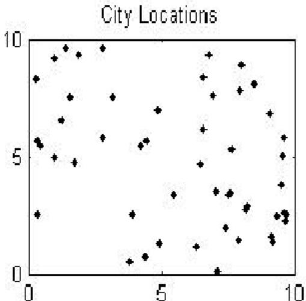
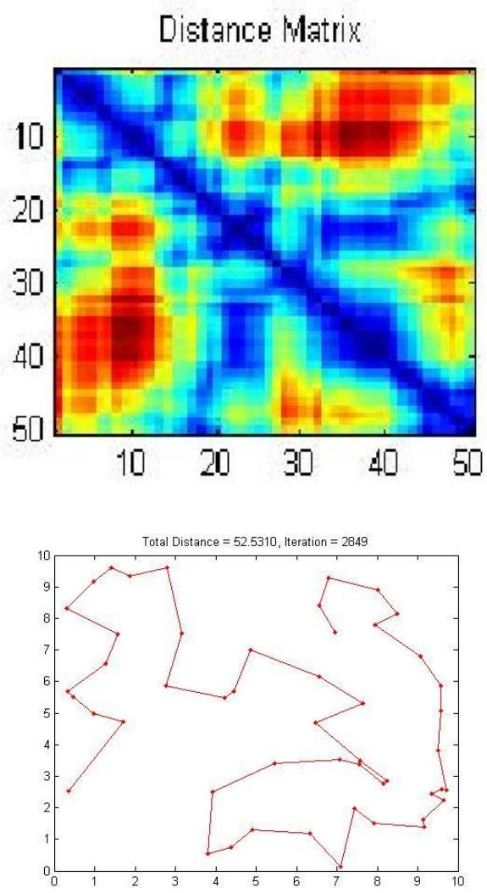
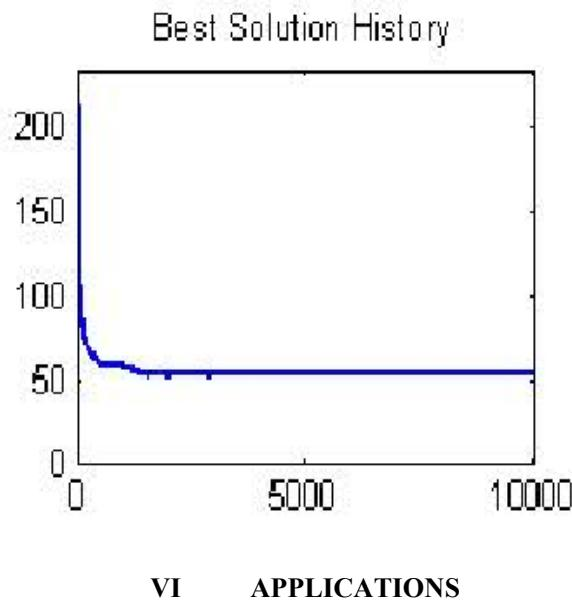

# Open Loop Travelling Salesman Problem using Genetic Algorithm

AKSHATHA .P.S1, VASUDHA VASHISHT2, TANUPRIYA CHOUDHURY3

Student, Department of Computer Science, Lingaya’s University, Faridabad, India1 Assistant Professor, Department of Computer Science, Lingaya’s University, Faridabad, India2 Assistant Professor, Department of Computer Science, Lingaya’s University, Faridabad, India3

ABSTRACT: Genetic algorithm is an optimization technique based on crossover and mutation operators using a survival of the fittest idea. They have been used successfully in a variety of different problems. Travelling salesman problem is one of the commonly studied optimization problem. In the travelling salesman problem we wish to find a tour of all nodes in a weighted graph so that the total weight is minimized. In this paper a single salesman travels to each of the cities but does not close the loop by returning to the city he started from and each city is visited by the salesman exactly once.

Keywords: Genetic Algorithm; Open Travelling Salesman Problem

# I. INTRODUCTION

Genetic algorithms are a relatively new optimization technique which can be applied to various problems, including those that are NP-hard. The technique does not ensure an optimal solution, however it usually gives good approximations in a reasonable amount of time. This, therefore, would be a good algorithm to try on the travelling salesman problem, one of the most famous NP-hard problems.

Genetic algorithms are loosely based on natural evolution and use a “survival of the fittest” technique, where the best solutions survive and are varied until we get a good result. We will explain genetic algorithms in detail, including the various methods of encoding, crossover, mutation and evaluation in chapter 2. In chapters 3 and 6 we will explore the travelling salesman problem and real world applications of TSP; in chapter 4 we will discuss how genetic algorithms used to solve the travelling salesman problem. In chapter 5 Results of OTSP and in chapter 7 we are concluding our paper.

# II. GENETIC ALGORITHM: AN OVERVIEW

Genetic algorithms are an optimization technique based on natural evolution. They include the survival of the fittest idea into a search algorithm which provides a method of searching which does not need to explore every possible solution in the feasible region to obtain a good result. Genetic algorithms are based on the natural process of evolution. In nature, the fittest individuals are most likely to survive and mate; therefore the next generation should be fitter and healthier because they were bred from healthy parents. This same idea is applied to a problem by first ’guessing’ solutions and then combining the fittest solutions to create a new generation of solutions which should be better than the previous generation. We also include a random mutation element to account for the occasional ’mishap’ in nature.

Genetic algorithm starts working on a randomly generated set of solutions, known as initial population.

Fitness is associated with each solution. The fitness evaluation is based on the objective function. In this each string representing the solution is called chromosome, each bit of the string is called the gene. The set of strings is called population [1].

# Outline of the Basic Genetic Algorithm

1. [Start] Generate random population of n chromosomes (suitable solutions for the problem)   
2. [Fitness] Evaluate the fitness $f ( x )$ of each chromosome $x$ in the population   
3. [New population] Create a new population by repeating following steps until the new population is complete I. [Selection] Select two parent chromosomes from a population according to their fitness (the better fitness, the bigger chance to be selected) II. [Crossover] with a crossover probability cross over the parents to form a new offspring (children). If no crossover was performed, offspring is an exact copy of parents. III. [Mutation] with a mutation probability mutate new offspring at each locus (position in chromosome). IV. [Accepting] Place new offspring in a new population

4. [Replace] Use new generated population for a further run of algorithm

5. [Test] If the end condition is satisfied, stop, and return the best solution in current population   
6. [Loop] Go to step 2

# International Journal of Innovative Research in Computer and Communication Engineering Vol. 1, Issue 1, March 2013

Genetic Algorithm generates new population of chromosomes by selecting the better fit solutions from existing population and applying genetic operators to produce new offspring of the solutions [2][3]. The process is repeated successively to generate new population iteratively. In this way every successive population is better fit then the previous population. This process is repeated until some criterion is met or a reasonably acceptable solution is found.

# III. OPEN TRAVELLING SALEMAN PROBLEM

The idea of the travelling salesman problem (TSP) is to find a tour of a given number of cities, visiting each city exactly once and returning to the starting city where the length of this tour is minimized. But in this paper a single salesman travels to each of the cities but does not close the loop by returning to the city he started from and each city is visited by the salesman exactly once.

The TSP can be represented by a complete weighted graph $\mathrm { G } { = } \left( \mathrm { V } , \mathrm { E } \right)$ with $\mathrm { V }$ being the set of vertices (cities) and E being the set of edges fully connecting the nodes. Each edge $( \mathrm { I } , \mathrm { j } ) \in \mathrm { E }$ is assigned a weight ${ \mathrm { d } } _ { \mathrm { i j } }$ which represents the distance between cities i and j, formally the goal is to find a Hamiltonian tour of minimal length on the fully connected graph. In symmetric TSP the distances between the cities are independent of the direction of traversing the edges, that is ${ \mathrm { d } } _ { \mathrm { i j } } { = } { \mathrm { d } } _ { \mathrm { j i } }$ for every pair of nodes. A solution can be represented by a permutation of the cities. This permutation is acyclic, that is only the relative order of the cities is important, not their absolute position in a tour. Therefore there are n permutations that map the same solution.

# IV. GENETIC ALGORITHMS AS A METHOD OF SOLVING THE OPEN TRAVELLING SALESMAN PROBLEM

A genetic algorithm [4] can be used to find a solution in much less time. Although it might not find the best solution, it can find a near perfect solution for a 100 city tour in less than a minute.

To solve the traveling salesman problem, we need a list of city locations and distances, or cost, between each of them.   
The following basic steps are used to solve the traveling salesman problem using a GA. First, create a group of many random tours in what is called a population. This algorithm uses a greedy initial population that gives preference to linking cities that are close to each other.   
Second, pick 2 of the better (shorter) tours parents in the population and combine them to make 2 new child tours. Hopefully, these children tour will be better than either parent.   
A small percentage of the time, the child tours is mutated. This is done to prevent all tours in the population from looking identical.   
The new child tours are inserted into the population replacing two of the longer tours. The size of the population remains the same.   
New children tours are repeatedly created until the desired goal is reached.

# V. RESULTS

The following figures show the results of open travelling salesman problem (oTsp). The first figure shows randomly chosen cities location, 2nd fig sows the distance matrix, 3rd fig shows near optimal solution for the oTsp for randomly chosen 50 cities and the last fig. shows the best solution history from all the set of iterations and distance covered by the travelling salesman.

  
Fig1: 50 random city locations.

# International Journal of Innovative Research in Computer and Communication Engineering Vol. 1, Issue 1, March 2013

  
Fig 3: Total Distance travelled by Travelling Salesman

Much of the work on the TSP is motivated by its use as a platform for the study of general methods that can be applied to a wide range of discrete optimization problems. This is not to say, however, that the TSP does not find applications

# International Journal of Innovative Research in Computer and Communication Engineering Vol. 1, Issue 1, March 2013

in many fields. Indeed, the numerous direct applications of the TSP bring life to the research area and help to direct future work.

# 1. Genome Sequencing

Researchers at the National Institute of Health have used Concorde's TSP solver to construct radiation hybrid maps as part of their ongoing work in genome sequencing. The TSP provides a way to integrate local maps into a single radiation hybrid map for a genome; the cities are the local maps and the cost of travel is a measure of the likelihood that one local map immediately follows another.

# 2. Starlight Interferometer Program

A team of engineers at Hernandez Engineering in Houston and at Brigham Young University have experimented with using Chained Lin-Kerninghan to optimize the sequence of celestial objects to be imaged in a proposed NASA Starlight space interferometer program. The goal of the study it to minimize the use of fuel in targeting and imaging maneuvers for the pair of satellites involved in the mission (the cities in the TSP are the celestial objects to be imaged, and the cost of travel is the amount of fuel needed to reposition the two satellites from one image to the next).

3. Scan Chain Optimization

A semi-conductor manufacturer has used Concorde's implementation of the Chained Lin-Kernighan heuristic in experiments to optimize scan chains in integrated circuits. Scan chains are routes included on a chip for testing purposes and it is useful to minimize their length for both timing and power reasons.

# 4. DNA Universal Strings

A group at AT&T used Concorde to compute DNA sequences in a genetic engineering research project. In the application, a collection of DNA strings, each of length $k ,$ , were embedded in one universal string (that is, each of the target strings is contained as a substring in the universal string), with the goal of minimizing the length of the universal string. The cities of the TSP are the target strings, and the cost of travel is $k$ minus the maximum overlap of the corresponding strings.

# 5. Whizzkids '96 Vehicle Routing

A modified version of Concorde was used to solve the Whizzkids'96 vehicle routing problem, demonstrating that the winning solution in the 1996 competition was in fact optimal. The problem consists of finding the best collection of routes for 4 newsboys to deliver papers to their 120 customers. The team of David Applegate, William Cook, Sanjeeb Dash, and Andre Rohe received a 5,000 Gulden prize for their solution in February 2001 from the information technology firm CMG.

# 6. Touring Airports

Concorde is currently being incorporated into the Worldwide Airport Path Finder web site to find shortest routes through selections of airports in the world. The author of the site writes that users of the path-finding tools are equally split between real pilots and those using flight simulators.

# 7. Designing Sonet Rings

An early version of Concorde's tour finding procedures was used in a tool for designing fiber optical networks at Bell Communications Research (now Telcordia). The TSP aspect of the problem arises in the routing of sonet rings, Which provide communications links through a set of sites organized in a ring. The ring structure provides a backup mechanism in case of a link failure, since traffic can be rerouted in the opposite direction on the ring.

# VII CONCLUSION

Genetic algorithms appear to search good solutions for the traveling salesman problem, however it depends very much on the way the problem is encoded and which crossover and mutation methods are used. It seems that the methods that use heuristic information or encode the edges of the tour (such as the matrix representation and crossover) perform the best and give good indications for future work in this area.

Overall, it seems that genetic algorithms have proved suitable for solving the traveling salesman problem. As yet, genetic algorithms have not found a better solution to the traveling salesman problem than is already known, but many of the already known best solutions have been found by some genetic algorithm method also. It seems that the biggest problem with the genetic algorithms devised for the traveling salesman problem is that it is difficult to maintain structure from the parent chromosomes and still end up with a legal tour in the child chromosomes. Perhaps a better

# International Journal of Innovative Research in Computer and Communication Engineering Vol. 1, Issue 1, March 2013

crossover or mutation routine that retains structure from the parent chromosomes would give a better solution than we have already found for some traveling salesman problems.

# Список литературы

[1] D.E.Goldberg, (1989) “Genetic Algorithms in search,Optimization and Machine Learning”, AddisonWesley Publishing Company, Ind. U.S.A. [2] Melanie Mitche,(1998) ”An introduction to genetic Algorithm”, MIT press.   
[3] Namita Khurana, Anju Rathi,Akshatha P S,( 2011) “Genetic Algorithm: A search of Complex, IJCA.   
[4]http://en.wikipedia.org/wiki/Genetic_algorihm.   
[5] Emanuel Falkenauer(1998) Genetic Algorithms and Grouping Problems. JohnWiley andSons.   
[6] Kangshun Li,, Lanlan Kang, Wensheng Zhang, Bing Li, Comparative Analysis of Genetic Algorithm and Ant Colony Algorithm on Solving Traveling Salesman Problem, IEEE International Workshop on Semantic Computing and Systems   
[7] "Yasuhiro TSUJIMURA and Mitsuo GEN”,( 21-23 April 1998) Entropy-based Genetic Algorithm for Solving TSP, 1998 Second International Conference on Knowledge-Based Intelligent Electronic Systems, Adelaide, Australia. Editors, L.C. Jain and R.K.Jain   
[8] “D. KAUR, M. M. MURUGAPPAN” Performance Enhancement in solving Traveling Salesman Problem using Hybrid Genetic Algorithm, [9] Vijendra Singh and Simran Choudhary (2009) , Genetic Algorithm for Traveling Salesman Problem: Using Modified Partially-Mapped Crossover Operator, IMPACT.   
[10] Gen, 31. and R. Cheng(1997) Genetic Algorithms and Engineering Design. John Wiely & Sons.   
[11] http://www.darwins-theory-of-evolution .com/   
[12]http://www.obitko.com/tutorials/genetic-algorithms/encoding.php   
[13] S. Rajasekaran and G.A. Vijyalakshmi Pai:(2003) Neural Networks, Fuzzy Logic, and Genetic Algorithm. PHI.   
[14] Zbigniew Michalewicz(1994) Genetic Algorithms $^ +$ Data Structures $=$ Evolution Programs. Springer-Verlag, 2nd edition.   
[15] E.L. Lawler, J.K. Lenstra, A.H.G. Rinnooy Kan, and D.B. Shmoys.( 1986) The Traveling Salesman. John Wiley and Sons.   
[16] Gerard Reinelt.( 1994) The Traveling Salesman: Computational Solutions for TSP Applications. Springer-Verlag.   
[17] Abdollah Homaifar, Shanguchuan Guan, and Gunar E. Liepins. (1992)Schema analysis of the traveling salesman problem using genetic algorithms. Complex Systems, 6(2):183–217.   
[18] Gen, 31. and R. Cheng(1997): Genetic Algorithms and Engineering Design. John Wiely & Sons.   
[19] Goldberg, D.E. Genetic Algorithms in Search, Optimization, and Machine Learning. Reading, MA: Addison-Wesley.   
[20] A Genetic Algorithm Tutorial: Darrel Whitley, Computer Science Department, Colorado State University, USA.   
[21] John Holland, 1975, Genetic Algorithm, Artificial Survival of the Fittest.

# BIOGRAPHY

Akshatha P S received her Bachelor’s degree in Computer Science from VTU, Karnataka, India. Currently she is pursuing her Master’s degree from Lingaya’s University. She has around 5 years of teaching experience. She has authored 10 papers and her areas of interests include Genetic Algorithm, Data Mining, Artificial Intelligence, Mobile Ad-hoc networks etc. She is a student member of Computer Society of India.

Vasudha Vashisht received her Bachelor’s and Master’s degree in Computer Science from M.D. University, Haryana, India. Currently she is pursuing her doctoral degree in Computer Science & Engg. She has 7 years of experience in teaching. Currently, she is working as an Assistant Professor in the School of Computer Science at Lingaya’s University, Faridabad, Haryana, India. She has authored 15 papers and her areas of interests include Artificial Intelligence, Cognitive Science, Brain Computer Interface, and Image & Signal Processing. She is a member of reputed bodies like IEEE, International Association of Engineers, International Neural Network Society, etc.

Tanupriya Choudhury received his Bachelor’s degree in CSE from West Bengal University of Technology, Kolkata, India, and Master’s Degree in CSE from Dr. M.G.R University, Chennai, India. Currently he is pursuing his doctoral degree in Computer Science & Engg. He has 3 years experience in teaching. Currently he is working as an Assistant Professor in School of Computer Science at Lingaya’s University, Faridabad, Haryana, India. He is the author of $^ { 1 0 + }$ Nat’l/Int’l publications. His areas of interests include Cloud Computing, Network Security, Data mining and Warehousing, Image processing etc.