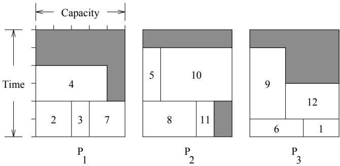
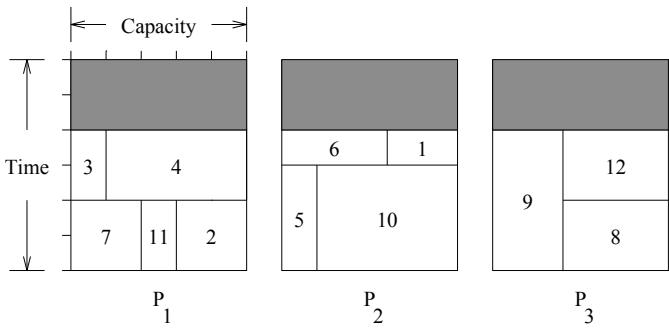
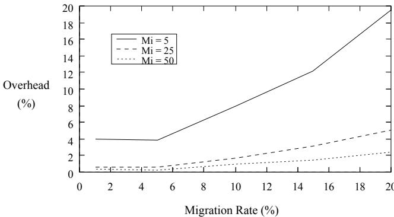

# ic Algorithms, Parallel Island Model. The multiprocessor scheduling problem [4] is de

lem. We show results using

obs are executed. Each job J is

edup through its running t

Keywords: Parallel Processing, Multiprocessor Scheduling, Genetic A lgorithms, Parallel Island Mode l.

# Abstract

eorts to maximize the use of processor resources through the use of concurrent and parallel processing. Simultaneous and concurrent execution of tasks meant that CPU utilization could be greatly increased and higher throughput could be obtained. However, multitasking and multiprocessing systems have introduced a new problem with respect to scheduling these tasks. While simple to express, this

# The quest for ec

other combinatorial problems has led to the development of Genetic Algorithms (GAs). GAs borrow ideas from natural evolution to eciently search a problem domain and eectively nd near optimal solutions in a short amount of time. Parallel GAs have been developed to speed up this process as well as obtain higher quality solutions. cessing systems have introduced a new problem with respect to scheduling these tasks. While simple to express, this scheduling problem has proven intractable.

provides an introduction to Genetic Algorithms, illustrating how they work and including an overview of the basic concepts. Section 4 gives a brief overview of the dierent forms of parallelism used in GAs and of the island model in particular. References to recent work in parallel GAs are provided. Section 5 summarizes our experimental results comparing serial and parallel island model GAs on t

This paper is organized as follows: Section 2 introduces the Multiprocessor Scheduling Problem, including examples, related problems, and summarizing recent work. Section 3 provides an introduction to Genetic Algorithms, illustrating how they work and including an overview of the basic concepts. Section 4 gives a brief overview of the different forms of parallelism used in GAs and of the island model in particular. References to recent work in parallel GAs are provided. Section 5 summarizes our experimental results comparing serial and parallel island model GAs on the Multiprocessor Scheduling Problem. Finally, Section 6 provides an analysis

additional time to run multi

# on the machines so as to minimize t

The multiprocessor scheduling problem [4] is defined as follows: a set of $n$ jobs is to be scheduled on a set of $m$ identical processors. A schedule is simply the sequence in which the jobs are executed. Each job $J$ is specified as $\boldsymbol { J } = \left( t , c \right)$ , where $c$ Jo b 1 2 3 4 5 6 $t$ is (1,2) (2,2) (2,1) (2,4) (3,1) (1,3) ing is considered. That is, once a job is started it remains Job 7 8 9 10 11 12 (2,2) (2,3) (4,2) (3,4) (2,1) (2,3) negligible. The objective is to determine a schedule of jobs on the machines so as to minimize the total processing time. For example, consider the case where $m = 3$ , each processor has memory capacity $c = 5$ , and there are $n = 1 2$ jobs to be scheduled:

<table><tr><td>Job 1 (1,2)</td><td>2 (2,2)</td><td>3 (2,1)</td><td>4 (2,4)</td><td>5 (3,1)</td><td>6 (1,3)</td></tr><tr><td>Job 7</td><td>8</td><td>9</td><td>10</td><td>11</td><td>12</td></tr><tr><td>(2,2)</td><td>(2,3)</td><td>(4,2)</td><td>(3,4)</td><td>(2,1)</td><td>(2,3)</td></tr><tr><td></td><td></td><td></td><td></td><td></td><td></td></tr></table>

An example schedule is shown in Figure 1 requiring 5 time units. An optimal schedule requiring 4 time units is shown in Figure 2.

  
Figure 1: An Example Schedule

Note the Job Shop Scheduling problem is a variation of the multiprocessor scheduling problem. In the job shop scheduling problem each job, $J _ { i }$ requires the completion of several tasks, $T _ { j , 1 }$ $T _ { j , 2 }$ $T _ { j , n }$ . The tasks for any job $J _ { i }$ are to be carried out in the order 1, 2, 3, .., etc., where each task $j$ cannot begin until task $j - 1 \ ( j > 1 )$ has been completed [8]. In the job shop scheduling problem, the processor capacity is not considered. It is assumed every task in every job uses the entire memory capacity of a given processor.

The multiprocessor scheduling problem is also similar to the bin packing problem, where each processor is a bin, and each rithm. However in this a er we consider onl the eneral roblem where m is not xed. of goods received by each customer corresponds to a job. The multiprocessor scheduling problem and its variations of other scheduling problems are economically very important problems, especially in industrial applications. However there is no known solution to any of these problems that can be done in polynomial time. Consequently, researchers have concentrated on developing algorithms that search through the vast state-space of the problem in an ecient manner $m$ oking for near optimal solutions. rithm. However, in this paper we consider only the general problem where $m$ [ ]

  
of problems called the partition p

investigated GAs as a technique for solving the job shop scheduling problem. Kidwell [9] developed a GA to schedule distributed tasks on a bus-based system. Li and Cheng [11] developed a job shop scheduling algorithm to partition a mesh connected system, where jobs require square meshes and the system itself is a square mesh with size a power of two. This problem is similar to a two-dimensional bin packing problem. Corcoran and

Yamada and Nakano [15] developed a GA implementation 3 Genetic Algorithms A genetic algorithm is an iterative procedure which borrows the ideas of natural selection and \`survival of the ttest' from natural evolution. By simulating natural evolution, in this way, a GA can easily solve complex problems. Furthermore, by emulating biological selection and reproduction techniques, a GA can eectively search the problem domain in a general, representation-independent manner. packing problem. Corcoran and Wainwright [1] present a GA for solving the two dimensional bin packing problem.

# date solutions represent an

form that is analogous to the chromosomes of biological systhe ideas of natural selection and 'survival of the fittest' from natural evolution. By simulating natural evolution, in this way, a GA can easily solve complex problems. Furthermore, by emulating biological selection and reproduction techniques, a GA can effectively search the problem domain in a general, representation-independent manner.

The genetic algorithm maintains a population or pool of candidate solutions for a given objective function. The candidate solutions represent an encoding of the problem into a form that is analogous to the chromosomes of biological sysemulation of the life cycle. The pool size remains constant throughout the GA. At each step in the iteration, chromosomes are probabilistically selected from the population for reproduction according to the principle of the \`survival of the ttest'. Ospring are generated through a process called crossover, which can be augmented by mutation. The o- spring are then placed back in the pool, perhaps replacing other members of the pool. This proce

Once an initial pool has been generated and all of its mema tem orar location until the end of a eneration. At that time the os rin re lace the entire current o ulathroughout the GA. At each step in the iteration, chromosomes are probabilistically selected from the population for reproduction according to the principle of the 'survival of 4 Parallel GAs Parallel GAs (PGAs) can be classied according to three dierent models: global, island, and cellular. See Gordon and Whitley [6], and Knight and Wainwright [10] for more using either a 'generational' [5, 7] or a 'steady-state' [14] genetic algorithm. The generational GA saves offspring in a temporary location until the end of a generation. At that time the offspring replace the entire current population. Conversely, the steady-state GA immediately places offspring back into the current population.

# used where mating

This model requires global synchronization and control of the GA. Ironically, the global models have not received as much attention as the others because of machine dependency consid

Island models arose out of the desire to exploit coarse grained parallel architectures. While global models use a panmictic mating strategy, island models use a strategy usually found in a polytypic species, which evolve in isolated subgroups with more interaction within subgroups than between them. The island model typically runs a serial GA on each of several loosely connected processors. Each GA is identical to but independent of the others. Each GA is usually started with a dierent random seed. Periodically, individuals are transm

s nchronization that is re uired in the anmictic a roach. parallel architectures. While global models use a panmictic mating strategy, island models use a strategy usually found in a polytypic species, which evolve in isolated subCellular models (a term used by Whitley [13]) arose from the desire to exploit the ne grained, massively parallel architectures. These machines consist of a huge number of simple processors typically connected in a ring or torus topology. In general, the cellular model assigns one chromosome per processor and limits selection and mating to local neighbormigration. The island model strategy eliminates the global synchronization that is required in the panmictic approach. However, some synchronization is usually required for migration.

Cellular models (a term used by Whitley [13]) arose from the desire to exploit the fine grained, massively parallel architectures. These machines consist of a huge number of simple processors typically connected in a ring or torus topology. In general, the cellular model assigns one chromosome per processor and limits selection and mating to local neighborhoods or demes. While the island model has fixed bound5 Experimental Results We developed all of our genetic algorithms using LibGA [1]. We implemented a typical serial GA for the multiprocessor scheduling problem, as well as a parallel GA using the island model. Since we used the same library to implement both GAs, the GA used on each processor in the island model was identical to the one used in the serial GA. The parallel GA was implemented using Intel's iPSC/2 simulator. Note, the serial GA was implemented without the simulator, however, it is identical to the parallel GA

# Solaris 2.2. Processing time

which is inde endent of rocessor load. The arameters used We implemented a typical serial GA for the multiprocessor roulette selection asexual crossover with robabilit 1.0 and model. Since we used the same library to implement both GAs, the GA used on each processor in the island model was identical to the one used in the serial GA. The parallel GA was implemented using Intel's iPSC/2 simulator. Note, the LibGA. The remainder of the o erators and arameters are those t icall used in enetic al orithms 5 . tests were run on a Sun SparcStation 10 Model 30 under We used four data sets in our tests: L25, R25, R50, and R75. The L25 data set is a contrived set composed of 25 tasks with a known optimal schedule time of 20. The R25, R50, and R75 data sets were generated at random and are composed of 25, 50, and 75 tasks, respectively. The optimal solutions for the R25, R50, and R75 data sets are unknown, however, they cannot be less than 23, 44, and 69, respectively. The crossover probability used was the default value used in LibGA. The remainder of the operators and parameters are those typically used in genetic algorithms [5].

tion obtained. In order to be fair to both techniques, as well as to be thorough in our research, we compared the results for the serial GA to those for the parallel GA using both xed and scaled problems. These results are summarized of 25, 50, and 75 tasks, respectively. The optimal solutions for the R25, R50, and R75 data sets are unknown, however, 5.1 Serial GA

run sixteen times using dierent initial seeds. Each run was limited to 500 generations and the pool size was 400. The columns in the table report the best result obtained for each set (xmin), as well as the average (x), variance ( ), and standard deviation () for the set of 16 runs. The rows in the table report statistics for each set, which are the tness' obtained for each run (fr), and the number of generations (m) an

# 5.1 Serial GA

The time required to reach 500 generations is not included as run sixteen times using different initial seeds. Each run was limited to 500 generations and the pool size was 400. The columns in the table report the best result obtained for each set $\left( x _ { m i n } \right)$ , as well as the average (x), variance $\left( \sigma ^ { 2 } \right)$ , and standard deviation $\left( \sigma \right)$ for the set of 16 runs. The rows in the table report statistics for each set, which are the fitness' obtained for each run $\left( f _ { r } \right)$ , and the number of generations $( m )$ and CPU time in seconds $\left( T _ { 1 } \right)$ when $f _ { r }$ first appeared in the population1. For example, results for the L25 set

indicate the best performing run obtained a fitness of 20   
(the optimum) in 29 generations or 27.66 seconds of CPU   
R50 m 161 287.44 8.977e+03 9.475e+01   
T1 179.89 323.18 1.156e+04 1.075e+02   
fr 73

wever, the xed problem ensures   

<table><tr><td>Set</td><td></td><td>xmin</td><td>x</td><td>$σ{}$</td><td>σ</td></tr><tr><td rowspan="3">L25</td><td>$fr</td><td>20</td><td>20.44</td><td>3.958e-01</td><td>6.292e-01</td></tr><tr><td>m</td><td>29</td><td>77.88</td><td>8.224e+02</td><td>2.868e+01</td></tr><tr><td>T1</td><td>27.66</td><td>75.27</td><td>7.848e+02</td><td>2.801e+01</td></tr><tr><td rowspan="3">R25</td><td>$fr</td><td>24</td><td>24.69</td><td>3.625e-01</td><td>6.021e-01</td></tr><tr><td>m</td><td>25</td><td>120.94</td><td>2.289e+04</td><td>1.513e+02</td></tr><tr><td>T1</td><td>23.60</td><td>118.60</td><td>2.257e+04</td><td>1.502e+02</td></tr><tr><td rowspan="3">R50</td><td>$fr</td><td>46</td><td>46.44</td><td>5.292e-01</td><td>7.274e-01</td></tr><tr><td>m</td><td>161</td><td>287.44</td><td>8.977e+03</td><td>9.475e+01</td></tr><tr><td>T1</td><td>179.89</td><td>323.18</td><td>1.156e+04</td><td>1.075e+02</td></tr><tr><td rowspan="3">R75</td><td>$fr</td><td>73</td><td>74.06</td><td>7.292e-01</td><td>8.539e-01</td></tr><tr><td>m</td><td>289</td><td>361.56</td><td>8.892e+03</td><td>9.430e+01</td></tr><tr><td>T1</td><td>344.71</td><td>434.57</td><td>1.301e+04</td><td>1.140e+02</td></tr></table>

# serial and parallel

Our fixed PGA maintained a total population size of 400, as Table 2 shows our xed results without migration. Each data set was tested $n$ ith 2, 4, 8, and 16 processors. For each set and number $N$ processors (p), the table lists the n $p$ l tness $n \ : = \ : N / p$ ), the generation (m) and time (Tp) when fr rst appeared, and the percentage of processors containing fr (%r). The table clearly indicates that the addition of more processors led to faster CPU times. However, this was at the expense of solution quality. In general, the sequential GA performed better in the quality of the solution than the xed PGA without mig

Table 2 shows our fixed results without migration. Each Table 3 shows our xed results with migration. The table lists fr, m, Tp, and %r, $\left( p \right)$ ch are dened above. In addition, th $\left( f _ { r } \right)$ re two new par $( m )$ ers: migr $\left( T _ { p } \right)$ inter $f _ { r }$ (Mi) and migration rate (Mr ). The migration interval is $f _ { r } \left( \% _ { r } \right)$ ber of iterations between migrations. We used Mi values of 5, 25, 50, 75, and 100 iterations which respectively represent 1%, 5%, 10%, 15%, and 20% of the total number of iterations allowed. The migration rate is the percentage of the pool which will migrate. We used Mr $f _ { r }$ lues of 1%, 5%, 10%, 15%, a $x _ { m i n }$ 0%. Migrant $f _ { r }$ were selected wit

rin to olo . Mi rants acce ted from the other nei hbor ble lists $f _ { r } , \ m , \ T _ { p }$ , and $\% _ { r }$ , which are defined above. In addition, there are two new parameters: migration interval $( M _ { i } )$ e 3 clearly has except $( M _ { r } )$ performance in the L25 and R25 data sets. The addition of more processors reduces $M _ { i }$ ecution time without sacricing solution quality. The R50 represent $1 \%$ $5 \%$ $1 0 \%$ $1 5 \%$ , and $2 0 \%$ of the total number of iterations allowed. The migration rate is the percentage of the pool which will migrate. We used $M _ { r }$ values of $1 \%$ $5 \%$ $1 0 \%$ $1 5 \%$ , and $2 0 \%$ . Migrants were selected with the GAs selection function and passed to one neighbor using a ring topology. Migrants accepted from the other neighbor replaced the worst $M _ { r }$ percent of the population.

Table 3 clearly has exceptional performance in the L25 and R25 data sets. The addition of more processors reduces execution time without sacrificing solution quality. The R50 data set has similar results, yet the percentage of islands containing the best solution is beginning to dwindle. This is Figure 3 shows the migration overhead using 16 processors. These are actual experimental results obtained for a typical run. The gure shows percentage overhead as a function of migration rate for three dierent migration intervals: 5, 25, and 50. When Mi is 5, migration occurs the most frequently. As the solid line $\mathrm { \bar { 1 0 } ^ { 1 0 9 } }$ igure 3 shows, when Mr is increased from 1% to 20%, the migration overhead quickly grows from 4% to nearly 20%. Larger migration intervals cause migration to occur less frequently. Migration intervals of 25 and 50 are illustrated in the gure with dashed

R50 4 46 160 16.65 25 1 100   

<table><tr><td rowspan=1 colspan=1>Set</td><td rowspan=1 colspan=1>p</td><td rowspan=1 colspan=1>$fr</td><td rowspan=1 colspan=1>m</td><td rowspan=1 colspan=1>Tp</td><td rowspan=1 colspan=1>%r</td></tr><tr><td rowspan=4 colspan=1>L25</td><td rowspan=4 colspan=1>24816</td><td rowspan=4 colspan=1>20202122</td><td rowspan=2 colspan=1>7094</td><td rowspan=1 colspan=1>17.07</td><td rowspan=1 colspan=1>50</td></tr><tr><td rowspan=1 colspan=1>6.80</td><td rowspan=1 colspan=1>50</td></tr><tr><td rowspan=2 colspan=1>5128</td><td rowspan=1 colspan=1>1.27</td><td rowspan=1 colspan=1>25</td></tr><tr><td rowspan=1 colspan=1>0.30</td><td rowspan=1 colspan=1>19</td></tr><tr><td rowspan=4 colspan=1>R25</td><td rowspan=4 colspan=1>24816</td><td rowspan=2 colspan=1>2525</td><td rowspan=1 colspan=1>33</td><td rowspan=1 colspan=1>7.95</td><td rowspan=1 colspan=1>100</td></tr><tr><td rowspan=1 colspan=1>109</td><td rowspan=1 colspan=1>7.89</td><td rowspan=1 colspan=1>25</td></tr><tr><td rowspan=2 colspan=1>2425</td><td rowspan=1 colspan=1>144</td><td rowspan=1 colspan=1>3.58</td><td rowspan=1 colspan=1>13</td></tr><tr><td rowspan=1 colspan=1>52</td><td rowspan=1 colspan=1>0.56</td><td rowspan=1 colspan=1>13</td></tr><tr><td rowspan=4 colspan=1>R50</td><td rowspan=4 colspan=1>24816</td><td rowspan=1 colspan=1>48</td><td rowspan=1 colspan=1>96</td><td rowspan=1 colspan=1>30.73</td><td rowspan=1 colspan=1>100</td></tr><tr><td rowspan=1 colspan=1>48</td><td rowspan=1 colspan=1>326</td><td rowspan=1 colspan=1>34.72</td><td rowspan=1 colspan=1>25</td></tr><tr><td rowspan=2 colspan=1>4850</td><td rowspan=1 colspan=1>120</td><td rowspan=1 colspan=1>4.33</td><td rowspan=1 colspan=1>13</td></tr><tr><td rowspan=1 colspan=1>74</td><td rowspan=1 colspan=1>1.16</td><td rowspan=1 colspan=1>19</td></tr><tr><td rowspan=4 colspan=1>R75</td><td rowspan=2 colspan=1>24</td><td rowspan=2 colspan=1>7676</td><td rowspan=1 colspan=1>201</td><td rowspan=1 colspan=1>71.34</td><td rowspan=1 colspan=1>100</td></tr><tr><td rowspan=1 colspan=1>282</td><td rowspan=1 colspan=1>34.40</td><td rowspan=1 colspan=1>25</td></tr><tr><td rowspan=1 colspan=1>8</td><td rowspan=1 colspan=1>80</td><td rowspan=1 colspan=1>83</td><td rowspan=1 colspan=1>3.89</td><td rowspan=1 colspan=1>25</td></tr><tr><td rowspan=1 colspan=1>16</td><td rowspan=1 colspan=1>83</td><td rowspan=1 colspan=1>67</td><td rowspan=1 colspan=1>1.39</td><td rowspan=1 colspan=1>6</td></tr></table>

cessors there are only 25 chromosomes in each proces   

<table><tr><td rowspan=1 colspan=1>Set</td><td rowspan=1 colspan=1>p</td><td rowspan=1 colspan=1>fr</td><td rowspan=1 colspan=1>m</td><td rowspan=1 colspan=1>Tp</td><td rowspan=1 colspan=1>Mi</td><td rowspan=1 colspan=3>Mr</td><td rowspan=1 colspan=1>%r</td></tr><tr><td rowspan=1 colspan=1>L25</td><td rowspan=1 colspan=1>24816</td><td rowspan=1 colspan=1>20202020</td><td rowspan=1 colspan=1>551245470</td><td rowspan=1 colspan=1>13.368.831.360.65</td><td rowspan=1 colspan=1>525575</td><td rowspan=1 colspan=3>5151510</td><td rowspan=1 colspan=1>10010010044</td></tr><tr><td rowspan=3 colspan=1>R25</td><td rowspan=3 colspan=1>24816</td><td rowspan=3 colspan=1>24242424</td><td rowspan=3 colspan=1>453673481</td><td rowspan=3 colspan=1>112.034.770.850.78</td><td rowspan=2 colspan=1>252525</td><td rowspan=2 colspan=3>1101</td><td rowspan=2 colspan=1>100100100</td></tr><tr><td rowspan=1 colspan=3>1</td></tr><tr><td rowspan=1 colspan=1>25</td><td rowspan=1 colspan=2>15</td><td rowspan=1 colspan=2>15</td><td rowspan=1 colspan=1>100</td></tr><tr><td rowspan=4 colspan=1>R50</td><td rowspan=4 colspan=1>24816</td><td rowspan=4 colspan=1>46464646</td><td rowspan=4 colspan=1>307160267403</td><td rowspan=4 colspan=1>97.9816.659.125.77</td><td rowspan=1 colspan=1>25</td><td rowspan=1 colspan=3>10</td><td rowspan=1 colspan=1>100</td></tr><tr><td rowspan=1 colspan=1>25</td><td rowspan=1 colspan=3>1</td><td rowspan=1 colspan=1>15</td><td rowspan=2 colspan=1>10050</td></tr><tr><td rowspan=1 colspan=1>100</td><td rowspan=1 colspan=2></td><td></td></tr><tr><td rowspan=1 colspan=1>75</td><td rowspan=1 colspan=3>10</td><td rowspan=1 colspan=1>13</td></tr><tr><td rowspan=4 colspan=1>R75</td><td rowspan=4 colspan=1>24816</td><td rowspan=4 colspan=1>73737475</td><td rowspan=4 colspan=1>471338311198</td><td rowspan=1 colspan=1>164.24</td><td rowspan=1 colspan=1>75</td><td rowspan=1 colspan=3>20</td><td rowspan=1 colspan=1>50</td></tr><tr><td rowspan=1 colspan=1>40.19</td><td rowspan=1 colspan=1>50</td><td rowspan=2 colspan=3>515</td><td rowspan=2 colspan=1>100100</td></tr><tr><td rowspan=2 colspan=1>13.843.87</td><td rowspan=1 colspan=1>25</td></tr><tr><td rowspan=1 colspan=1>50</td><td rowspan=1 colspan=3>15</td><td rowspan=1 colspan=1>44</td></tr></table>

Figure 3 shows the migration overhead using 16 processors. These are actual experimental results obtained for a typical run. The figure shows percentage overhead as a function of migration rate for three different migration intervals: 5, 25, and 50. When $M _ { i }$ is 5, migration occurs the most frequently. As the solid line in Figure 3 shows, when $M _ { r }$ is increased from $1 \%$ to $2 0 \%$ , the migration overhead quickly grows from $4 \%$ to nearly $2 0 \%$ . Larger migration intervals cause migration to occur less frequently. Migration intervals of 25 and 50 are illustrated in the figure with dashed and dotted lines, respectively. These larger intervals lead to slower growth in migration overhead. In most of our runs, the migration overhead never exceeded $5 \%$ , and was well

worth the effort.

  
d that the time to nd the fr is longer compared to

# eort considering th

addition of more processors had no eect on the solution quality, but in some cases reduced the time needed to nd the solution. Note that the solutions found by the scaled PGA without migration were the same as the best obtained by the serial GA.

Set p fr m T %r columns $p , f _ { r } , m , T _ { p }$ 2 2 $\% _ { r }$ 95 91.68 50 L25 4 20 $f _ { r }$ 91.58 25 8 20 95 91.52 13 16 20 59 56.58 6 2 24 83 80.11 50 quality, but in some cases reduced the time needed to find the solution. Note that the solutions found by the scaled 2 46 205 197.86 50 by the serial GA.

Table 4: Results for Scaled PGA without Migration   

<table><tr><td rowspan=1 colspan=1>Set</td><td rowspan=1 colspan=1>p</td><td rowspan=1 colspan=1>fr</td><td rowspan=1 colspan=1>m</td><td rowspan=1 colspan=1>Tp</td><td rowspan=1 colspan=1>%r</td></tr><tr><td rowspan=3 colspan=1>L25</td><td rowspan=3 colspan=1>24816</td><td rowspan=2 colspan=1>2020</td><td rowspan=2 colspan=1>9595</td><td rowspan=1 colspan=1>91.68</td><td rowspan=2 colspan=1>5025</td></tr><tr><td rowspan=1 colspan=1>91.58</td></tr><tr><td rowspan=1 colspan=1>2020</td><td rowspan=1 colspan=1>9559</td><td rowspan=1 colspan=1>91.5256.58</td><td rowspan=1 colspan=1>136</td></tr><tr><td rowspan=4 colspan=1>R25</td><td rowspan=4 colspan=1>24816</td><td rowspan=2 colspan=1>2424</td><td rowspan=1 colspan=1>83</td><td rowspan=1 colspan=1>80.11</td><td rowspan=1 colspan=1>50</td></tr><tr><td rowspan=1 colspan=1>83</td><td rowspan=1 colspan=1>80.02</td><td rowspan=1 colspan=1>75</td></tr><tr><td rowspan=2 colspan=1>2424</td><td rowspan=1 colspan=1>83</td><td rowspan=1 colspan=1>79.96</td><td rowspan=1 colspan=1>38</td></tr><tr><td rowspan=1 colspan=1>29</td><td rowspan=1 colspan=1>27.81</td><td rowspan=1 colspan=1>50</td></tr><tr><td rowspan=4 colspan=1>R50</td><td rowspan=4 colspan=1>24816</td><td rowspan=2 colspan=1>4646</td><td rowspan=1 colspan=1>205</td><td rowspan=1 colspan=1>197.86</td><td rowspan=1 colspan=1>50</td></tr><tr><td rowspan=1 colspan=1>205</td><td rowspan=1 colspan=1>197.63</td><td rowspan=1 colspan=1>50</td></tr><tr><td rowspan=2 colspan=1>4646</td><td rowspan=1 colspan=1>205</td><td rowspan=1 colspan=1>197.49</td><td rowspan=1 colspan=1>38</td></tr><tr><td rowspan=1 colspan=1>199</td><td rowspan=1 colspan=1>190.83</td><td rowspan=1 colspan=1>44</td></tr><tr><td rowspan=4 colspan=1>R75</td><td rowspan=4 colspan=1>24816</td><td rowspan=1 colspan=1>73</td><td rowspan=1 colspan=1>414</td><td rowspan=1 colspan=1>399.58</td><td rowspan=1 colspan=1>50</td></tr><tr><td rowspan=1 colspan=1>73</td><td rowspan=1 colspan=1>351</td><td rowspan=1 colspan=1>338.38</td><td rowspan=1 colspan=1>50</td></tr><tr><td rowspan=1 colspan=1>73</td><td rowspan=1 colspan=1>351</td><td rowspan=1 colspan=1>338.14</td><td rowspan=1 colspan=1>25</td></tr><tr><td rowspan=1 colspan=1>73</td><td rowspan=1 colspan=1>351</td><td rowspan=1 colspan=1>336.59</td><td rowspan=1 colspan=1>25</td></tr></table>

Table 5 shows our scaled results with migration. Column values are defined as before. For the first three data sets, we see that solution quality is the same as the fixed problem with migration. However, the times required to find the solution are greatly reduced. The solutions for these three sets match the best results from the serial GA. The times to obtain the solutions were somewhat higher than the best of the serial GA's, but were much better than the average serial GA time. The most impressive results are for the R75 data set. Here the scaled PGA with migration outperformed any other method. It was able to obtain 71 while the best the other methods could obtain was 73. This is especially remarkable considering these results are extremely close to 8 20 26 25.36 5 20 100 16 20 27 25.53 25 20 100 2 24 38 37.76 5 5 100 R25 4 24 46 44.78 5 5 100 quality as more processors were added. This is caused by reduced sampling efficiency from the use of smaller pool sizes R50 4 46 115 111.95 25 10 100

Table 5: Results for Scaled PGA with Migration   

<table><tr><td>Set</td><td>p</td><td>$\f\fr</td><td>m</td><td>Tp</td><td>Mi</td><td>Mr</td><td>%r</td></tr><tr><td rowspan="3">L25</td><td rowspan="3">2 4</td><td>20 20</td><td>43 35</td><td>41.62</td><td>25</td><td>15</td><td>100</td></tr><tr><td></td><td></td><td>34.14</td><td>5</td><td>1</td><td>100</td></tr><tr><td>8 16</td><td>20 26</td><td>25.36</td><td>5 25</td><td>20 20</td><td>100 100</td></tr><tr><td rowspan="3">R25</td><td>2 4</td><td>20 24</td><td>27 38</td><td>25.53 37.76</td><td>5</td><td>5</td><td>100</td></tr><tr><td rowspan="2">8</td><td>24 24</td><td>46</td><td>44.78</td><td>5</td><td>5</td><td>100</td></tr><tr><td>16 24</td><td>32 30</td><td>31.21 28.37</td><td>5 5</td><td>15 10</td><td>100 100</td></tr><tr><td rowspan="3">R50</td><td>2</td><td>46</td><td>254</td><td>252.40</td><td>100</td><td>20</td><td>100</td></tr><tr><td>4</td><td>46</td><td>115</td><td>111.95</td><td>25</td><td>10</td><td>100</td></tr><tr><td>8</td><td>46</td><td>120</td><td>117.04</td><td>5</td><td>5</td><td>100</td></tr><tr><td rowspan="3">R75</td><td>16</td><td>46</td><td>105</td><td>116.79</td><td>25</td><td>15</td><td>100</td></tr><tr><td>2</td><td>72</td><td>295</td><td>370.37</td><td>75</td><td>5</td><td>100</td></tr><tr><td>4</td><td>72</td><td></td><td></td><td></td><td></td><td></td></tr><tr><td rowspan="3"></td><td></td><td></td><td>311</td><td>376.10</td><td>100</td><td>5</td><td>100</td></tr><tr><td>8</td><td>72</td><td>283</td><td>342.95</td><td>5</td><td>5</td><td>100</td></tr><tr><td>16</td><td>71</td><td>496</td><td>591.50</td><td>25</td><td>1</td><td>6</td></tr></table>

# migration we obta

serial GA, except that performance tended to degrade in the xed problem as more processors were added. This was caused by a reduction in sampling eciency from the use of smaller pool sizes for larger processor sets. The inclusion of migration in the xed PGA improved the performance for three of the four data sets. Performance started to decline in the fourth data set when the sample size per processor was sm

We found that in both the fixed and scaled PGAs without migration we obtained roughly the same performance as the serial GA, except that performance tended to degrade in s ondin increase in sam lin ecienc . In the scaled PGA with mi ration the increased sam lin ecienc of a lar er of smaller pool sizes for larger processor sets. The inclusion of migration in the fixed PGA improved the performance for three of the four data sets. Performance started to decline in the fourth data set when the sample size per procesOur results show the scaled PGA with migration oers both improved solution quality and speedup due to parallel processing. However, we found the xed PGA oers speedup at the expense of solution quality. Because of this, we feel expected, considering the increased sample size and corresponding increase in sampling efficiency. In the scaled PGA with migration, the increased sampling efficiency of a larger sample size combined with the collaborative like effects of migration resulted in a relatively large improvement in the solution quality.

Our results show the scaled PGA with migration offers both improved solution quality and speedup due to parallel processing. However, we found the fixed PGA offers speedup at the expense of solution quality. Because of this, we feel received time on a Paragon and plan to run larger cases of our island PGA on that machine. larger problems than R75, as the search space size increases combinatorially.

AR2-004. The authors also wish to acknowledge the support of Sun Microsystems, Inc. The cellular PGA is especially interesting because it more closely models the natural evolutionary process. It will also [1] A. L. Corcoran and R. L. Wainwright. LibGA: A userfriendly workbench for order-based genetic algorithm research. In E. Deaton, K. M. George, H. Berghel, and our island PGA on that machine.

# York, 1993. ACM

[2] Y. Davidor, T. Yamada, and R. Nakano. The ECOlogical framework II: Improving GA performance at virtually zero cost. In Forrest [3].

# Conferen

[1] A. L. Corcoran and R. L. Wainwright. LibGA: A userfriendly workbench for order-based genetic algorithm research. In E. Deaton, K. M. George, H. Berghel, and G. Hedrick, editors, Proceedings of the 1993 ACM/SIGAPP D. E. Goldberg. Genetic Algorithms in Search, Optimization, and Machine Learni   
[2] Y. Davidor, T. Yamada, and R. Nakano. The ECOlogical V. S. Gordon and D. Whitley. Serial and parallel genetic algorithms as funct   
[7] J. H. Holland. Adaptation in Natural and Articial Systems. The University of Michigan Press, Ann Arbor, Michigan, 1975.   
[8] E. Horowitz and S. Sahni. Fundamentals of Computer Algorithms. Computer Science Press, 1984. M. D. Kidwell. Using genetic algorithms t   
tributed tasks on a bus-based system. In Forrest [3]. L. Knight and R. Wainwright. HYPERGEN { a distributed genetic algorithm   
able High Performance Computing Conference, Williamsburg, Virginia, Apr. 1992.   
[11] K. Li and K.-H. Cheng. Job scheduling in a partitionable mesh using a two-dimensional buddy system partitioning scheme. I   
[8] E. Horowitz and S. Sahni. Fun damentals of Computer AlgoR. Manner and B. Manderick, editors. P   
[9] M. D. Kidwell. Using genetic algorithms to schedule disD. Whitley. Cellular genetic algorithms. In Forrest [   
[14] D. Whitley and J. Kauth. GENITOR: A dierent genetic algorithm. In Proceedings of the Rocky Mountain Conference on Articial Intelligence, pages 118{130, Denver, Colorado, 1988.   
[15] T. Yamada and R. Nakano. A genetic algorithm applicable to large-scale job-shop problems. In Manner and Manderick scheme. IEEE Transaactions on Parallel and Distributed Syst ems, 2(4):413422, Oc t. 1991.   
[12] R. Männer and B. Manderick, editors. Parallel Problem Solving from Nature, 2. North-Holland, Amsterdam, 1992.   
[13] D. Whitley. Cellular genetic algorithms. In Forrest [3].   
[14] D. Whitley and J. Kauth. GENITOR: A different genetic algorithm. In Proceedings of the Rocky Mountain Conference on Artificial Intelligence, pages 118130, Denver, Colorado, 1988.   
[15] T. Yamada and R. Nakano. A genetic algorithm applicable to large-scale job-shop problems. In Männer and Manderick [12].