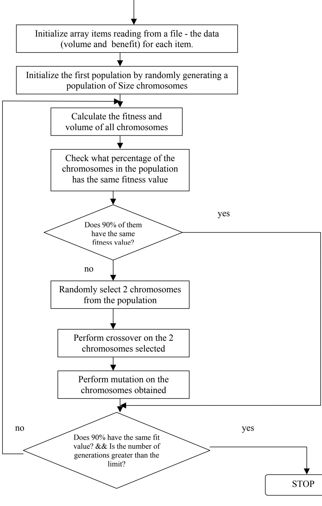
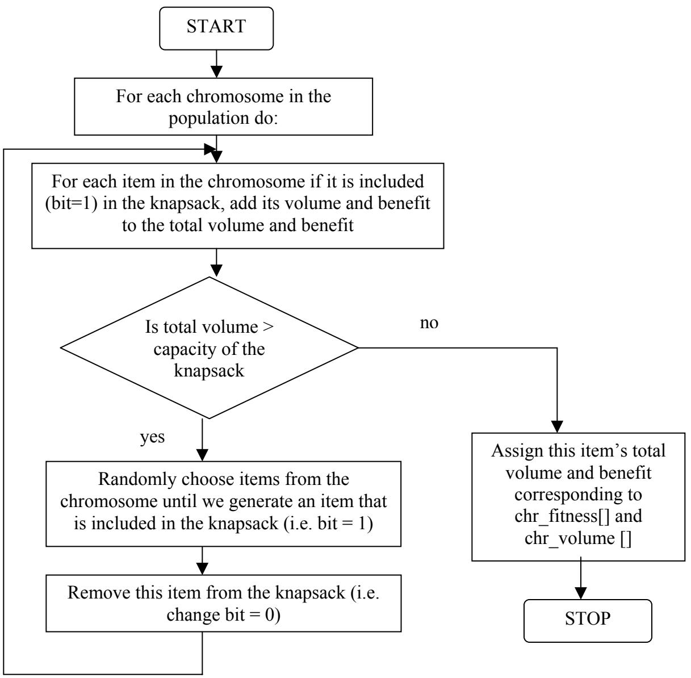
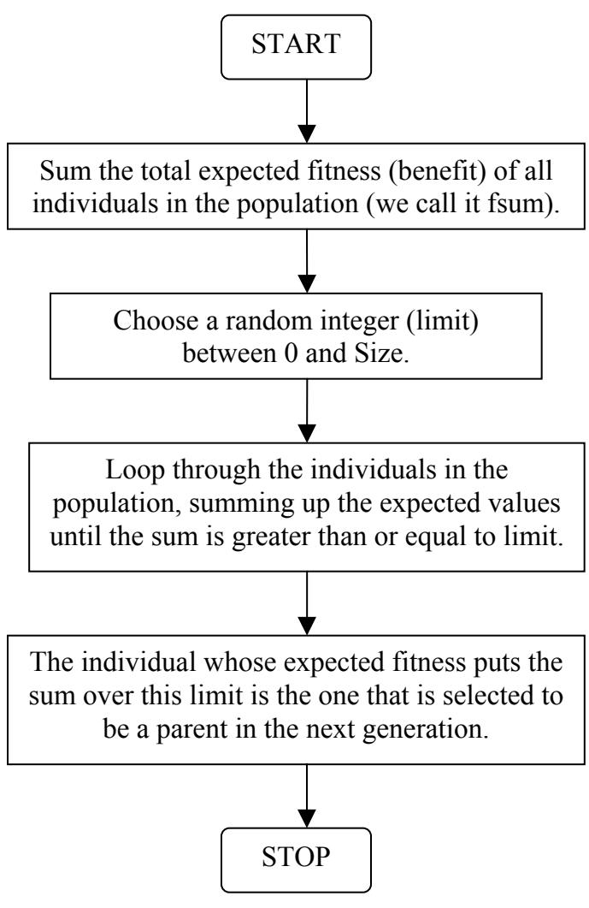
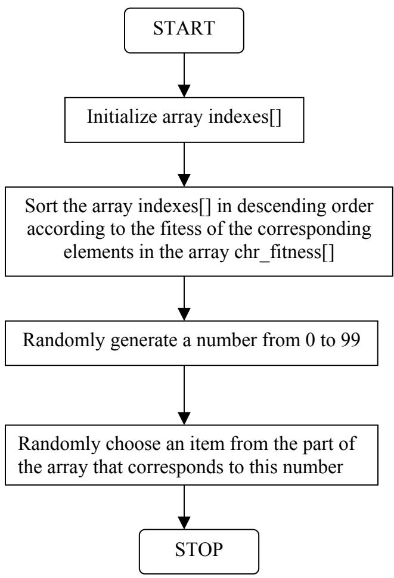

# Solving the 0-1 Knapsack Problem with Genetic Algorithms

Dipti Shrestha Computer Science Department Simpson College shresthd@simpson.edu

# Abstract

This paper describes a research project on using Genetic Algorithms (GAs) to solve the 0-1 Knapsack Problem (KP). The Knapsack Problem is an example of a combinatorial optimization problem, which seeks to maximize the benefit of objects in a knapsack without exceeding its capacity.

The paper contains three sections: brief description of the basic idea and elements of the GAs, definition of the Knapsack Problem, and implementation of the 0-1 Knapsack Problem using GAs. The main focus of the paper is on the implementation of the algorithm for solving the problem. In the program, we implemented two selection functions, roulette-wheel and group selection. The results from both of them differed depending on whether we used elitism or not. Elitism significantly improved the performance of the roulette-wheel function. Moreover, we tested the program with different crossover ratios and single and double crossover points but the results given were not that different.

# Introduction

In this project we use Genetic Algorithms to solve the 0-1Knapsack problem where one has to maximize the benefit of objects in a knapsack without exceeding its capacity. Since the Knapsack problem is a NP problem, approaches such as dynamic programming, backtracking, branch and bound, etc. are not very useful for solving it. Genetic Algorithms definitely rule them all and prove to be the best approach in obtaining solutions to problems traditionally thought of as computationally infeasible such as the Knapsack problem.

# Genetic Algorithms (GAs)

Genetic Algorithms are computer algorithms that search for good solutions to a problem from among a large number of possible solutions. They were proposed and developed in the 1960s by John Holland, his students, and his colleagues at the University of Michigan. These computational paradigms were inspired by the mechanics of natural evolution, including survival of the fittest, reproduction, and mutation. These mechanics are well suited to resolve a variety of practical problems, including computational problems, in many fields. Some applications of GAs are optimization, automatic programming, machine learning, economics, immune systems, population genetic, and social system.

# Basic idea behind GAs

GAs begin with a set of candidate solutions (chromosomes) called population. A new population is created from solutions of an old population in hope of getting a better population. Solutions which are chosen to form new solutions (offspring) are selected according to their fitness. The more suitable the solutions are the bigger chances they have to reproduce. This process is repeated until some condition is satisfied [1].

# Basic elements of GAs

Most GAs methods are based on the following elements, populations of chromosomes, selection according to fitness, crossover to produce new offspring, and random mutation of new offspring [2].

# Chromosomes

The chromosomes in GAs represent the space of candidate solutions. Possible chromosomes encodings are binary, permutation, value, and tree encodings. For the Knapsack problem, we use binary encoding, where every chromosome is a string of bits, 0 or 1.

# Fitness function

GAs require a fitness function which allocates a score to each chromosome in the current population. Thus, it can calculate how well the solutions are coded and how well they solve the problem [2].

# Selection

The selection process is based on fitness. Chromosomes that are evaluated with higher values (fitter) will most likely be selected to reproduce, whereas, those with low values will be discarded. The fittest chromosomes may be selected several times, however, the number of chromosomes selected to reproduce is equal to the population size, therefore, keeping the size constant for every generation. This phase has an element of randomness just like the survival of organisms in nature. The most used selection methods, are roulette-wheel, rank selection, steady-state selection, and some others. Moreover, to increase the performance of GAs, the selection methods are enhanced by eiltism. Elitism is a method, which first copies a few of the top scored chromosomes to the new population and then continues generating the rest of the population. Thus, it prevents loosing the few best found solutions.

# Crossover

Crossover is the process of combining the bits of one chromosome with those of another. This is to create an offspring for the next generation that inherits traits of both parents. Crossover randomly chooses a locus and exchanges the subsequences before and after that locus between two chromosomes to create two offspring [2]. For example, consider the following parents and a crossover point at position 3:

Parent 1 1 0 0 | 0 1 1 1   
Parent 2 1 1 1 | 1 0 0 0   
Offspring 1 1 0 0 1 0 0 0   
Offspring 2 1 1 1 0 1 1 1

In this example, Offspring 1 inherits bits in position 1, 2, and 3 from the left side of the crossover point from Parent 1 and the rest from the right side of the crossover point from Parent 2. Similarly, Offspring 2 inherits bits in position 1, 2, and 3 from the left side of Parent 2 and the rest from the right side of Parent 1.

# Mutation

Mutation is performed after crossover to prevent falling all solutions in the population into a local optimum of solved problem. Mutation changes the new offspring by flipping bits from 1 to 0 or from 0 to 1. Mutation can occur at each bit position in the string with

some probability, usually very small (e.g. 0.001). For example, consider the following chromosome with mutation point at position 2:

Not mutated chromosome: 1 0 0 0 1 1 1   
Mutated: 1 1 0 0 1 1 1

The 0 at position 2 flips to 1 after mutation.

# Outline of basic GA s

1. Start: Randomly generate a population of N chromosomes.

2. Fitness: Calculate the fitness of all chromosomes.

3. Create a new population:

a. Selection: According to the selection method select 2 chromosomes from the population. b. Crossover: Perform crossover on the 2 chromosomes selected. c. Mutation: Perform mutation on the chromosomes obtained.

4. Replace: Replace the current population with the new population.

5. Test: Test whether the end condition is satisfied. If so, stop. If not, return the best solution in current population and go to Step 2.

Each iteration of this process is called generation.

# The Knapsack Problem (KP)

# Definition

The KP problem is an example of a combinatorial optimization problem, which seeks for a best solution from among many other solutions. It is concerned with a knapsack that has positive integer volume (or capacity) $V .$ . There are $n$ distinct items that may potentially be placed in the knapsack. Item $i$ has a positive integer volume $V _ { i }$ and positive integer benefit $B _ { i }$ . In addition, there are $\mathcal { Q } _ { i }$ copies of item $i$ available, where quantity $\mathcal { Q } _ { i }$ is a positive integer satisfying $1 \leq Q _ { i } \leq \infty$ .

Let $X _ { i }$ determines how many copies of item $i$ are to be placed into the knapsack. The goal is to:

Maximize

$$
\sum _ { \mathrm { i } = 1 } ^ { \mathrm { N } } B _ { i } X _ { i }
$$

Subject to the constraints

$$
\sum _ { \mathrm { i } = 1 } ^ { \mathrm { N } } V _ { i } X _ { i } \leq V
$$

And

$$
0 \leq X _ { i } \leq Q _ { i } .
$$

If one or more of the $\mathcal { Q } _ { i }$ is infinite, the KP is unbounded; otherwise, the KP is bounded [3]. The bounded KP can be either $\theta { - } I { \ K P }$ or Multiconstraint $K P$ . If $Q _ { i } = 1$ for $i = 1 , 2$ , $\ldots , N ,$ the problem is a $\jmath _ { - I }$ knapsack problem In the current paper, we have worked on the bounded $\theta { - } I { \ K P }$ , where we cannot have more than one copy of an item in the knapsack.

# Example of a 0-1 KP

Suppose we have a knapsack that has a capacity of 13 cubic inches and several items of different sizes and different benefits. We want to include in the knapsack only these items that will have the greatest total benefit within the constraint of the knapsack’s capacity. There are three potential items (labeled ‘A,’ ‘B,’ ‘C’). Their volumes and benefits are as follows:

$$
{ \begin{array} { r l r l r l r l } & { \operatorname { I t e m } \# } & & { \quad \mathrm { ~ A ~ } \quad } & { \mathrm { ~ B ~ } } & & { \mathrm { ~ C ~ } } \\ & { \operatorname { B e n e f i t } } & & { \quad 4 } & & { \quad 3 } & & { \mathrm { ~ 5 ~ } } \\ & { \operatorname { V o l u m e } } & & { \quad 6 } & & { \quad 7 } & & { 8 } \end{array} }
$$

We seek to maximize the total benefit:

$$
\sum _ { \mathrm { i } = 1 } ^ { 3 } B _ { i } X _ { i } = 4 X I + 3 X _ { 2 } + 5 X _ { 3 }
$$

Subject to the constraints:

$$
\sum _ { \mathrm { i } = 1 } ^ { 3 } V _ { i } X _ { i } = 6 X _ { I } + 7 X _ { 2 } + 8 X _ { 3 } \leq 1 3
$$

And

$$
X _ { i } \in \{ 0 , 1 \} , \mathrm { f o r } i = 1 , 2 , . . . , n .
$$

For this problem there are $2 ^ { 3 }$ possible subsets of items:

<table><tr><td>A</td><td>B</td><td>C</td><td>Volume of the set</td><td>Benefit of the set</td></tr><tr><td>0</td><td>0</td><td>0</td><td>0</td><td>0</td></tr><tr><td>0</td><td>0</td><td>1</td><td>8</td><td>5</td></tr><tr><td>0</td><td>1</td><td>0</td><td>7</td><td>3</td></tr><tr><td>0</td><td>1</td><td>1</td><td>15</td><td>-</td></tr><tr><td>1</td><td>0</td><td>0</td><td>6</td><td>4</td></tr><tr><td>1</td><td>0</td><td>1</td><td>14</td><td>-</td></tr><tr><td>1</td><td>1</td><td>0</td><td>13</td><td>7</td></tr><tr><td>1</td><td>1</td><td>1</td><td>21</td><td></td></tr></table>

In order to find the best solution we have to identify a subset that meets the constraint and has the maximum total benefit. In our case, only rows given in italics satisfy the

constraint. Hence, the optimal benefit for the given constraint $V = 1 3$ ) can only be obtained with one quantity of A, one quantity of B, and zero quantity of C, and it is 7.

# NP problems and the 0-1 KP

NP (non-deterministic polynomial) problems are ones for which there are no known algorithms that would guarantee to run in a polynomial time. However, it is possible to “guess” a solution and check it, both in polynomial time. Some of the most well-known NP problems are the traveling salesman, Hamilton circuit, bin packing, knapsack, and clique [4].

GAs have shown to be well suited for high-quality solutions to larger NP problems and currently they are the most efficient ways for finding an approximately optimal solution for optimization problems. They do not involve extensive search algorithms and do not try to find the best solution, but they simply generate a candidate for a solution, check in polynomial time whether it is a solution or not and how good a solution it is. GAs do not always give the optimal solution, but a solution that is close enough to the optimal one.

# Implementation of the 0-1 KP Using GAs

# Representation of the items

We use a data structure, called cell, with two fields (benefit and volume) to represent every item. Then we use an array of type cell to store all items in it, which looks as follows:

<table><tr><td>0</td><td>1</td><td>2</td><td>3</td></tr><tr><td>20 | 30</td><td>5 | 10</td><td>10 | 20</td><td>40 | 50</td></tr></table>

# Encoding of the chromosomes

A chromosome can be represented in an array having size equal to the number of the items (in our example of size 4). Each element from this array denotes whether an item is included in the knapsack (‘1’) or not $( ^ { \circ } 0 ^ { \circ } )$ . For example, the following chromosome:

<table><tr><td>0</td><td>1</td><td>2</td><td>3</td></tr><tr><td>1</td><td>0</td><td>0</td><td>1</td></tr></table>

indicates that the $1 ^ { \mathrm { s t } }$ and the $4 ^ { \mathrm { t h } }$ item are included in the knapsack. To represent the whole population of chromosomes we use a tri-dimensional array (chromosomes [Size][number of items][2]). Size stands for the number of chromosomes in a population. The second dimension represents the number of items that may potentially be included in the knapsack. The third dimension is used to form the new generation of chromosomes.

Flowchart of the main program

# Termination conditions

The population converges when either $90 \%$ of the chromosomes in the population have the same fitness value or the number of generations is greater than a fixed number.

# Fitness function

We calculate the fitness of each chromosome by summing up the benefits of the items that are included in the knapsack, while making sure that the capacity of the knapsack is not exceeded. If the volume of the chromosome is greater than the capacity of the knapsack then one of the bits in the chromosome whose value is $^ { \mathfrak { c } } 1 ^ { \mathfrak { d } }$ is inverted and the chromosome is checked again. Here is a flowchart of the fitness function algorithm:

# Selection functions

In the implementation of the program, we tried two selection methods: roulette-wheel and group selection, combined with elitism, where two of the fittest chromosomes are copied without changes to the new population, so the best solutions found will not be lost.

# Roulette-wheel selection

Roulette-wheel is a simple method of implementing fitness-proportionate selection. It is conceptually equal to giving each individual a slice of a circular roulette wheel equal in area to the individual’s fitness [2]. The wheel is spun N times, where $_ \mathrm { N }$ is the number of the individuals in the population (in our case $\mathrm { N } = S i z e$ ). On each spin, the individual under wheel’s marker is selected to be in the pool of parents for the next generation [2]. This method can be implemented in the following way:

# Group selection

We implemented this selection method in order to increase the probability of choosing fitter chromosomes to reproduce more often than chromosomes with lower fitness values. Since we could not find any selection method like this one in the literature, we decided to call it group selection.

For the implementation of the group selection method, we use another array indexes[Size], where we put the indexes of the elements in the array chr_fitness[Size]. chr_fitness

<table><tr><td>0</td><td>1</td><td>2</td><td>3</td><td>4</td><td>5</td><td>6</td><td>7</td><td>8</td><td>9</td><td>10</td><td>11</td></tr><tr><td>40</td><td>20</td><td>5</td><td>1</td><td>9</td><td>7</td><td>38</td><td>27</td><td>16</td><td>19</td><td>11</td><td>3</td></tr></table>

indexes   

<table><tr><td rowspan=1 colspan=12>01 2 3 4 5 6 7 8 910  11</td></tr><tr><td rowspan=1 colspan=1>0 1</td><td rowspan=1 colspan=1></td><td rowspan=1 colspan=1>2</td><td rowspan=1 colspan=1></td><td rowspan=1 colspan=1>4</td><td rowspan=1 colspan=1>5</td><td rowspan=1 colspan=1>6</td><td rowspan=1 colspan=1></td><td rowspan=1 colspan=1>8</td><td rowspan=1 colspan=1>9</td><td rowspan=1 colspan=1>10</td><td rowspan=1 colspan=1>11</td></tr></table>

We sort the array indexes in descending order according to the fitness of the   
corresponding elements in the array chr_fitness. Thus, the indexes of the chromosomes with higher fitness values will be at the beginning of the array indexes, and the ones with lower fitness will be towards the end of the array.   
indexes:

<table><tr><td>0</td><td></td><td></td><td></td><td></td><td>1 2 3 4 5</td><td>6</td><td></td><td>7 8</td><td>9</td><td>−10</td><td>−11</td></tr><tr><td>0 6</td><td></td><td>7</td><td>1</td><td>9</td><td>8</td><td>10</td><td></td><td>5</td><td>2</td><td>11</td><td>3</td></tr></table>

We divide the array into four groups:

0 … 2 (0 … Size/4)   
3 … 5 (Size/4 … Size/2)   
6 … 8 (Size/2 … 3\*Size/4)   
9 … 11 (3\*Size/4 … Size)

Then, we randomly choose an item from the first group with $50 \%$ probability, from the second group with $30 \%$ probability, from the third group with $1 5 \%$ probability, and from the last group with $5 \%$ probability. Thus, the fitter a chromosome is the more chance it has to be chosen for a parent in the next generation. Here is a flowchart of the group selection algorithm:

# Comparison between the results from roulette-wheel and group selection methods

Crossover Ratio $= 8 5 \%$ Mutation Ratio $= 0 . 1 \%$ No Elitism

<table><tr><td rowspan=2 colspan=1>PopulationSize</td><td rowspan=1 colspan=3>Roulette-wheel selection</td><td rowspan=1 colspan=3>Group selection method</td></tr><tr><td rowspan=1 colspan=1>№^f$Gen</td><td rowspan=1 colspan=1>Max.Fit.found</td><td rowspan=1 colspan=1>Items chosen</td><td rowspan=1 colspan=1>№oo$Gen</td><td rowspan=1 colspan=1>Max.Fit.found</td><td rowspan=1 colspan=1>Items chosen</td></tr><tr><td rowspan=1 colspan=1>100</td><td rowspan=1 colspan=1>62</td><td rowspan=1 colspan=1>2310</td><td rowspan=1 colspan=1>2, 5, 8, 13, 15</td><td rowspan=1 colspan=1>39</td><td rowspan=1 colspan=1>3825</td><td rowspan=1 colspan=1>1, 2, 3, 4, 5, 7, 9, 12</td></tr><tr><td rowspan=1 colspan=1>200</td><td rowspan=1 colspan=1>75</td><td rowspan=1 colspan=1>2825</td><td rowspan=1 colspan=1>1, 2, 6, 7, 8, 17</td><td rowspan=1 colspan=1>51</td><td rowspan=1 colspan=1>4310</td><td rowspan=1 colspan=1>1, 2, 3, 4, 5, 6, 7, 8, 11</td></tr><tr><td rowspan=1 colspan=1>300</td><td rowspan=1 colspan=1>91</td><td rowspan=1 colspan=1>2825</td><td rowspan=1 colspan=1>2, 3, 5, 7, 8, 16</td><td rowspan=1 colspan=1>53</td><td rowspan=1 colspan=1>4315</td><td rowspan=1 colspan=1>1, 2, 3, 4, 5, 6, 7, 8, 10</td></tr><tr><td rowspan=1 colspan=1>400</td><td rowspan=1 colspan=1>59</td><td rowspan=1 colspan=1>2825</td><td rowspan=1 colspan=1>1, 2, 3, 4, 15, 16</td><td rowspan=1 colspan=1>49</td><td rowspan=1 colspan=1>4320</td><td rowspan=1 colspan=1>1, 2, 3, 4, 5, 6, 7, 8, 9</td></tr><tr><td rowspan=1 colspan=1>500</td><td rowspan=1 colspan=1>64</td><td rowspan=1 colspan=1>2835</td><td rowspan=1 colspan=1>1, 3, 6, 8, 10, 11</td><td rowspan=1 colspan=1>65</td><td rowspan=1 colspan=1>4320</td><td rowspan=1 colspan=1>1, 2, 3, 4, 5, 6, 7, 8, 9</td></tr><tr><td rowspan=1 colspan=1>750</td><td rowspan=1 colspan=1>97</td><td rowspan=1 colspan=1>2840</td><td rowspan=1 colspan=1>3,4, 5, 7, 9, 10</td><td rowspan=1 colspan=1>45</td><td rowspan=1 colspan=1>4320</td><td rowspan=1 colspan=1>1, 2, 3, 4, 5, 6, 7, 8, 9</td></tr><tr><td rowspan=1 colspan=1>1000</td><td rowspan=1 colspan=1>139</td><td rowspan=1 colspan=1>2860</td><td rowspan=1 colspan=1>1, 3, 4, 6, 8, 12</td><td rowspan=1 colspan=1>53</td><td rowspan=1 colspan=1>4320</td><td rowspan=1 colspan=1>1, 2, 3, 4, 5, 6, 7, 8, 9</td></tr></table>

Crossover Ratio $= 8 5 \%$   
Mutation Ratio $= 0 . 1 \%$   
Elitism - two of the fittest chromosomes are copied without changes to a new population   
Crossover Ratio $= 7 5 \%$   
Mutation Ratio $= 0 . 1 \%$   
Elitism - two of the fittest chromosomes are copied without changes to a new population   
Crossover Ratio $= 9 5 \%$   
Mutation Ratio $= 0 . 1 \%$   
Elitism - two of the fittest chromosomes are copied without changes to a new population

<table><tr><td rowspan=2 colspan=1>PopulationSize</td><td rowspan=1 colspan=3>Roulette-wheel selection</td><td rowspan=1 colspan=3>Group selection method</td></tr><tr><td rowspan=1 colspan=1>№ o$Gen</td><td rowspan=1 colspan=1>Max.Fit.found</td><td rowspan=1 colspan=1>Items chosen</td><td rowspan=1 colspan=1>№of o$Gen</td><td rowspan=1 colspan=1>Max.Fit.found</td><td rowspan=1 colspan=1>Items chosen</td></tr><tr><td rowspan=1 colspan=1>100</td><td rowspan=1 colspan=1>60</td><td rowspan=1 colspan=1>3845</td><td rowspan=1 colspan=1>1, 2, 3, 4, 5, 7, 8, 9</td><td rowspan=1 colspan=1>42</td><td rowspan=1 colspan=1>3840</td><td rowspan=1 colspan=1>1, 2, 3, 4, 5, 6, 7, 12</td></tr><tr><td rowspan=1 colspan=1>200</td><td rowspan=1 colspan=1>36</td><td rowspan=1 colspan=1>3830</td><td rowspan=1 colspan=1>1, 2, 3, 5, 6, 7, 8, 10</td><td rowspan=1 colspan=1>45</td><td rowspan=1 colspan=1>4320</td><td rowspan=1 colspan=1>1, 2, 3, 4, 5, 6, 7, 8, 9</td></tr><tr><td rowspan=1 colspan=1>250</td><td rowspan=1 colspan=1>45</td><td rowspan=1 colspan=1>4315</td><td rowspan=1 colspan=1>1, 2, 3, 4, 5, 6, 7, 8, 10</td><td rowspan=1 colspan=1>45</td><td rowspan=1 colspan=1>4315</td><td rowspan=1 colspan=1>1, 2, 3, 4, 5, 6, 7, 8, 10</td></tr><tr><td rowspan=1 colspan=1>300</td><td rowspan=1 colspan=1>46</td><td rowspan=1 colspan=1>4320</td><td rowspan=1 colspan=1>1, 2, 3, 4, 5, 6, 7, 8, 9</td><td rowspan=1 colspan=1>27</td><td rowspan=1 colspan=1>4320</td><td rowspan=1 colspan=1>1, 2, 3, 4, 5, 6, 7, 8, 9</td></tr><tr><td rowspan=1 colspan=1>400</td><td rowspan=1 colspan=1>43</td><td rowspan=1 colspan=1>4320</td><td rowspan=1 colspan=1>1, 2, 3, 4, 5, 6, 7, 8, 9</td><td rowspan=1 colspan=1>47</td><td rowspan=1 colspan=1>4320</td><td rowspan=1 colspan=1>1, 2, 3, 4, 5, 6, 7, 8, 9</td></tr><tr><td rowspan=1 colspan=1>500</td><td rowspan=1 colspan=1>25</td><td rowspan=1 colspan=1>4310</td><td rowspan=1 colspan=1>1, 2, 3, 4, 5, 6, 7, 9, 10</td><td rowspan=1 colspan=1>54</td><td rowspan=1 colspan=1>4320</td><td rowspan=1 colspan=1>1, 2, 3, 4, 5, 6, 7, 8, 9</td></tr><tr><td rowspan=1 colspan=1>750</td><td rowspan=1 colspan=1>34</td><td rowspan=1 colspan=1>4315</td><td rowspan=1 colspan=1>1, 2, 3, 4, 5, 6, 7, 8, 10</td><td rowspan=1 colspan=1>49</td><td rowspan=1 colspan=1>4320</td><td rowspan=1 colspan=1>1, 2, 3, 4, 5, 6, 7, 8, 9</td></tr></table>

<table><tr><td rowspan=2 colspan=1>PopulationSize</td><td rowspan=1 colspan=3>Roulette-wheel selection</td><td rowspan=1 colspan=3>Group selection method</td></tr><tr><td rowspan=1 colspan=1>№^ fGen</td><td rowspan=1 colspan=1>Max.Fit.found</td><td rowspan=1 colspan=1>Items chosen</td><td rowspan=1 colspan=1>№ofo$Gen</td><td rowspan=1 colspan=1>Max.Fit.found</td><td rowspan=1 colspan=1>Items chosen</td></tr><tr><td rowspan=1 colspan=1>100</td><td rowspan=1 colspan=1>49</td><td rowspan=1 colspan=1>3840</td><td rowspan=1 colspan=1>1, 2, 3, 4, 6, 7, 8, 9</td><td rowspan=1 colspan=1>46</td><td rowspan=1 colspan=1>3840</td><td rowspan=1 colspan=1>1, 2, 3, 4, 5, 7, 8, 10</td></tr><tr><td rowspan=1 colspan=1>200</td><td rowspan=1 colspan=1>42</td><td rowspan=1 colspan=1>4320</td><td rowspan=1 colspan=1>1, 2, 3, 4, 5, 6, 7, 8, 9</td><td rowspan=1 colspan=1>43</td><td rowspan=1 colspan=1>4315</td><td rowspan=1 colspan=1>1, 2, 3, 4, 5, 6, 7, 8, 10</td></tr><tr><td rowspan=1 colspan=1>250</td><td rowspan=1 colspan=1>39</td><td rowspan=1 colspan=1>3820</td><td rowspan=1 colspan=1>1, 2, 3, 4, 6, 8, 9, 11</td><td rowspan=1 colspan=1>41</td><td rowspan=1 colspan=1>4320</td><td rowspan=1 colspan=1>1, 2, 3, 4, 5, 6, 7, 8, 9</td></tr><tr><td rowspan=1 colspan=1>300</td><td rowspan=1 colspan=1>52</td><td rowspan=1 colspan=1>4320</td><td rowspan=1 colspan=1>1, 2, 3, 4, 5, 6, 7, 8, 9</td><td rowspan=1 colspan=1>57</td><td rowspan=1 colspan=1>4320</td><td rowspan=1 colspan=1>1, 2, 3, 4, 5, 6, 7, 8, 9</td></tr><tr><td rowspan=1 colspan=1>400</td><td rowspan=1 colspan=1>42</td><td rowspan=1 colspan=1>4315</td><td rowspan=1 colspan=1>1, 2, 3, 4, 5, 6, 7, 8, 10</td><td rowspan=1 colspan=1>45</td><td rowspan=1 colspan=1>4320</td><td rowspan=1 colspan=1>1, 2, 3, 4, 5, 6, 7, 8, 9</td></tr><tr><td rowspan=1 colspan=1>500</td><td rowspan=1 colspan=1>44</td><td rowspan=1 colspan=1>4320</td><td rowspan=1 colspan=1>1, 2, 3, 4, 5, 6, 7, 8, 9</td><td rowspan=1 colspan=1>61</td><td rowspan=1 colspan=1>4320</td><td rowspan=1 colspan=1>1, 2, 3, 4, 5, 6, 7, 8, 9</td></tr><tr><td rowspan=1 colspan=1>750</td><td rowspan=1 colspan=1>29</td><td rowspan=1 colspan=1>4320</td><td rowspan=1 colspan=1>1, 2, 3, 4, 5, 6, 7, 8, 9</td><td rowspan=1 colspan=1>50</td><td rowspan=1 colspan=1>4320</td><td rowspan=1 colspan=1>1, 2, 3, 4, 5, 6, 7, 8, 9</td></tr></table>

<table><tr><td colspan="1" rowspan="2">PopulationSize</td><td colspan="3" rowspan="1">Roulette-wheel selection</td><td colspan="3" rowspan="1">Group selection method</td></tr><tr><td colspan="1" rowspan="1">№o o$Gen</td><td colspan="1" rowspan="1">Max.Fit.found</td><td colspan="1" rowspan="1">Items chosen</td><td colspan="1" rowspan="1">№oo$Gen</td><td colspan="1" rowspan="1">Max.Fit.found</td><td colspan="1" rowspan="1">Items chosen</td></tr><tr><td colspan="1" rowspan="1">100</td><td colspan="1" rowspan="1">27</td><td colspan="1" rowspan="1">3320</td><td colspan="1" rowspan="1">1, 2, 3, 5, 9, 10, 13</td><td colspan="1" rowspan="1">37</td><td colspan="1" rowspan="1">3825</td><td colspan="1" rowspan="1">1, 2, 3, 4, 5, 6, 9, 13</td></tr><tr><td colspan="1" rowspan="1">200</td><td colspan="1" rowspan="1">49</td><td colspan="1" rowspan="1">4320</td><td colspan="1" rowspan="1">1, 2, 3, 4, 5, 6, 7, 8, 9</td><td colspan="1" rowspan="1">50</td><td colspan="1" rowspan="1">4320</td><td colspan="1" rowspan="1">1, 2, 3, 4, 5, 6, 7, 8, 9</td></tr><tr><td colspan="1" rowspan="1">250</td><td colspan="1" rowspan="1">62</td><td colspan="1" rowspan="1">4320</td><td colspan="1" rowspan="1">1, 2, 3, 4, 5, 6, 7, 8, 9</td><td colspan="1" rowspan="1">40</td><td colspan="1" rowspan="1">4310</td><td colspan="1" rowspan="1">1, 2, 3, 4, 5, 6, 7, 9, 10</td></tr><tr><td colspan="1" rowspan="1">300</td><td colspan="1" rowspan="1">31</td><td colspan="1" rowspan="1">4320</td><td colspan="1" rowspan="1">1, 2, 3, 4, 5, 6, 7, 8, 9</td><td colspan="1" rowspan="1">60</td><td colspan="1" rowspan="1">4320</td><td colspan="1" rowspan="1">1, 2, 3, 4, 5, 6, 7, 8, 9</td></tr><tr><td colspan="1" rowspan="1">400</td><td colspan="1" rowspan="1">38</td><td colspan="1" rowspan="1">4315</td><td colspan="1" rowspan="1">1, 2, 3, 4, 5, 6, 7, 8, 10</td><td colspan="1" rowspan="1">50</td><td colspan="1" rowspan="1">4320</td><td colspan="1" rowspan="1">1, 2, 3, 4, 5, 6, 7, 8, 9</td></tr><tr><td colspan="1" rowspan="1">500</td><td colspan="1" rowspan="1">25</td><td colspan="1" rowspan="1">4315</td><td colspan="1" rowspan="1">1, 2, 3, 4, 5, 6, 7, 8, 10</td><td colspan="1" rowspan="1">56</td><td colspan="1" rowspan="1">4320</td><td colspan="1" rowspan="1">1, 2, 3, 4, 5, 6, 7, 8, 9</td></tr><tr><td colspan="1" rowspan="1">750</td><td colspan="1" rowspan="1">34</td><td colspan="1" rowspan="1">4315</td><td colspan="1" rowspan="1">1, 2, 3, 4, 5, 6, 7, 8, 10</td><td colspan="1" rowspan="1">54</td><td colspan="1" rowspan="1">4320</td><td colspan="1" rowspan="1">1, 2, 3, 4, 5, 6, 7, 8, 9</td></tr></table>

The results from the two selection functions, roulette-wheel and group selection, differ a lot depending on whether we used elitism to enhance their performance or not.

When we do not use elitism the group selection method is better than the roulette-wheel selection method, because with group selection the probability of choosing the best chromosome over the worst one is higher than it is with roulette-wheel selection method. Thus, the new generation will be formed by fitter chromosomes and have a bigger chance to approximate the optimal solution.

When we use elitism than the results from roulette-wheel and group selection method are similar because with elitism the two best solutions found throughout the run of the program will not be lost.

# Crossover

We tried both single and double point crossover. Since there was not a big difference in the results we got from both methods, we decided to use single point crossover. The crossover point is determined randomly by generating a random number between 0 and num_items - 1. We perform crossover with a certain probability. If crossover probability is $100 \%$ then whole new generation is made by crossover. If it is $0 \%$ then whole new generation is made by exact copies of chromosomes from old population. We decided upon crossover rate of $8 5 \%$ by testing the program with different values. This means that $8 5 \%$ of the new generation will be formed with crossover and $1 5 \%$ will be copied to the new generation.

# Mutation

Mutation is made to prevent GAs from falling into a local extreme. We perform mutation on each bit position of the chromosome with $0 . 1 \%$ probability.

# Complexity of the program

Since the number of chromosomes in each generation $( S i z e )$ and the number of generations (Gen_number) are fixed, the complexity of the program depends only on the number of items that may potentially be placed in the knapsack. We will use the following abbreviations, N for the number of items, S for the size of the population, and G for the number of possible generations.

The function that initializes the array chromosomes has a complexity of O(N). The fitness, crossover function, and mutation functions have also complexities of O(N). The complexities of the two selection functions and the function that checks for the terminating condition do not depend on N (but on the size of the population) and they have constant times of running O(1).

The selection, crossover, and mutation operations are performed in a for loop, which runs S times. Since, S is a constant, the complexity of the whole loop is O(N). Finally, all these genetic operations are performed in a do while loop, which runs at most G times. Since G is a constant, it will not affect the overall asymptotic complexity of the program. Thus, the total complexity of the program is O(N).

# Conclusion

We have shown how Genetic Algorithms can be used to find good solutions for the 0-1 Knapsack Problem. GAs reduce the complexity of the KP from exponential to linear, which makes it possible to find approximately optimal solutions for an NP problem. The results from the program show that the implementation of a good selection method and elitism are very important for the good performance of a genetic algorithm.

# Список литературы

1. Obitko, M. Czech Technical University (CTU). IV. Genetic Algorithm. Retrieved October 10, 2003 from the World Wide Web: http://cs.felk.cvut.cz/\~xobitko/ga/gaintro.html   
2. Mitchell, M. (1998). An Introduction to Genetic Algorithms. Massachusettss: The MIT Press.   
3. Gossett, E. (2003). Discreet Mathematics with Proof. New Jersey: Pearson Education Inc..   
4. Weiss, M. A. (1999). Data Structures & Algorithm Analysis in $C + +$ . USA: Addison Wesley Longman Inc..   
5. LeBlanc, T. Computer Science at the University of Rochester. Genetic Algorithms. Retrieved October 10, 2003 from the World Wide Web: http://www.cs.rochester.edu/users/faculty/leblanc/csc173/genetic-algs/

# Acknowledgements

I would like to acknowledge the assistance of Professor Lydia Sinapova in the preparation of this paper.

For the implementation of the fitness function we used the outline of flowchart on following website http://www.evolutionary-algorithms.com/kproblem.html.