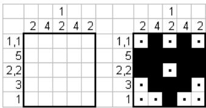
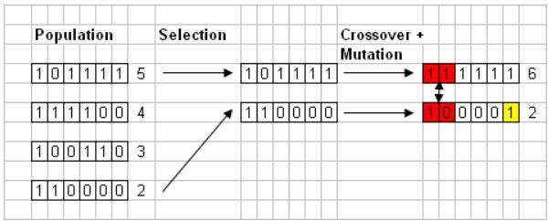
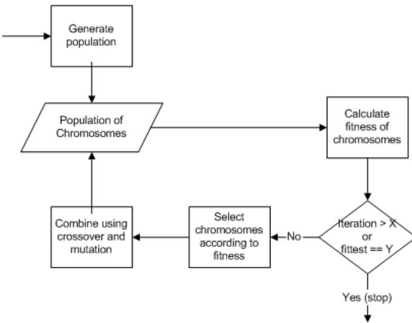
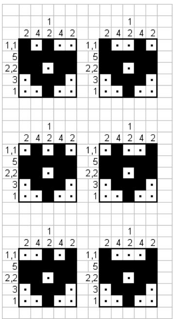
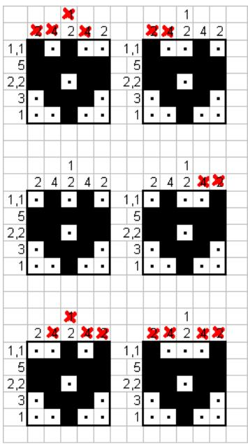
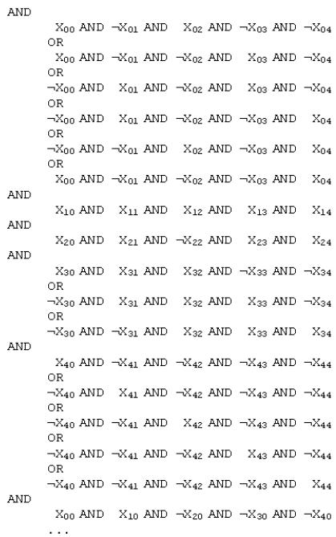
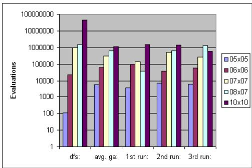
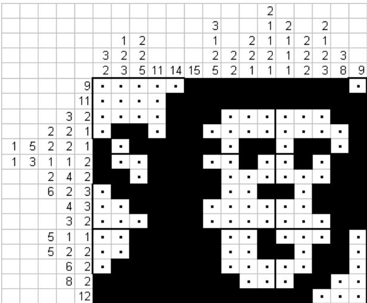

# Сравнение генетического алгоритма и алгоритма поиска в глубину, применяемых к японским нонограммам

Ваутер Виггерс (Wouter Wiggers)
Факультет EECMS, Университет Твенте
w.a.wiggers@student.utwente.nl

# АННОТАЦИЯ

В данной статье сравнивается производительность генетического алгоритма и алгоритма поиска в глубину путем их реализации и решения японских нонограмм. Оба алгоритма популярны благодаря своей универсальной структуре, что позволяет легко применять их к широкому кругу задач. Рассматриваются такие проблемы, как создание правильного представления японской нонограммы, чтобы ее можно было использовать в генетическом алгоритме. В последнем разделе результаты экспериментов показывают, что генетический алгоритм может превзойти алгоритм поиска в глубину.

# 1. ВВЕДЕНИЕ

Генетический алгоритм [RN95] — это алгоритм, который можно легко применить для решения сложных задач благодаря его универсальной структуре. Часто не бывает полного понимания задачи, либо реализация алгоритма оказывается слишком сложной. Эта сложность делает использование генетических алгоритмов таким привлекательным. В этой статье я подробнее рассмотрю производительность этого алгоритма.

В ходе своего исследования я буду сравнивать производительность двух различных алгоритмов, применяемых к задаче японской нонограммы. Два алгоритма, которые я хочу сравнить, — это алгоритм поиска в глубину и генетический алгоритм. Я выбрал алгоритм поиска в глубину, поскольку он является типичным примером алгоритма полного перебора (brute force), который прост в реализации. Я хочу сравнить его с генетическим алгоритмом, поскольку оба алгоритма могут использоваться почти для любой задачи, и интересно узнать, какой из них быстрее в общем случае. Поскольку исследование общего случая практически невозможно, я сузил свое исследование до конкретной интересной задачи — японской нонограммы.

Я начну эту статью с точного определения японской нонограммы и того, как ее можно решить. После этого раздела я поясню общие принципы работы генетических алгоритмов. Это объяснение является введением в генетические алгоритмы, и люди, которые уже знакомы с ними, могут пропустить эту часть. Далее следуют разделы о реализации различных алгоритмов. Сначала реализуется алгоритм поиска в глубину, а затем — генетический алгоритм. В заключение статья предоставит результаты измерения производительности обоих алгоритмов.

  
Рисунок 1: Японская нонограмма

# 2. ЯПОНСКАЯ НОНОГРАММА

Японская нонограмма — это тип задачи, которую лучше всего объяснить с помощью рисунка. На рисунке 1 показана простая нонограмма. Цель головоломки — закрасить правильные ячейки. Числа вдоль строк и столбцов дают информацию о том, сколько ячеек нужно заполнить в соответствующей строке или столбце. Возьмем, например, первую строку головоломки на рисунке 1. Здесь 1, 1 означает, что в этой строке нужно закрасить две ячейки с одной или несколькими пустыми ячейками между ними. К сожалению, существует шесть различных вариантов расположения для этой строки, эти перестановки также показаны на рисунке 4, поэтому неясно, какие именно ячейки нужно закрасить. Ко второй строке головоломки прикреплено число 5, поэтому эту строку можно полностью закрасить черными ячейками. По мере того как заполняется все больше ячеек, становится доступной больше информации о том, какие ячейки должны быть заполнены, а какие оставлены пустыми. Когда все строки и столбцы закрашены в соответствии с их числами, головоломка решена. Дополнительную информацию о японских нонограммах можно найти в [EL04].

Японские нонограммы, которые можно найти в популярных журналах с головоломками, всегда решаемы с помощью простой логики. Это означает, что решение головоломки можно найти с помощью элементарных рассуждений без сложных выводов. Хотя понятно, почему такие головоломки популярны, мое исследование охватит более широкое надмножество японских нонограмм. Эти головоломки иногда не решаются с помощью простой логики и требуют выдвижения предположений, которые позже могут оказаться ошибочными.

Тот факт, что эта головоломка трудна для решения людьми, является не только эмпирическим результатом, но и доказан математически. Статья Н. Уэды и Т. Нагао [UN96] показывает, что задача распознавания, которую необходимо решить в японской нонограмме, является NP-полной и, следовательно, не решаема за полиномиальное время. Это дает представление о том, насколько сложна задача, которую я пытаюсь решить.

  
Рисунок 2: Генетический алгоритм

Японская нонограмма — это NP-полная задача, и следствием этого является то, что данное исследование покажет не только то, как генетические алгоритмы работают на японских нонограммах, но и как они справляются с другими NP-полными задачами. Такой эффект вызван тем, что все NP-полные задачи сводимы друг к другу [SB00] [JS89].

# 3. ГЕНЕТИЧЕСКИЕ АЛГОРИТМЫ

В этом разделе объясняется, что такое генетические алгоритмы. Сначала я покажу связь между биологической эволюцией и генетическими алгоритмами. Затем я использую пример генетического алгоритма, чтобы объяснить различные используемые операторы, и, наконец, я приведу общую схему генетического алгоритма с помощью блок-схемы.

Генетический алгоритм использует многие методы, заимствованные из биологии, такие как наследственность, естественный отбор, рекомбинация и мутация. Все эти функции являются необходимыми частями процесса эволюции в природе. Поскольку этот процесс эволюции так важен в природе, люди пытались понять его и смоделировать. Генетический алгоритм — это просто абстракция процесса эволюции природы, который также использует те же функции, но под немного другими названиями.

Генетический алгоритм, который я объясню и использую для решения японской нонограммы, работает с тремя операторами: отбор, кроссовер и мутация [Gol94]. Принцип работы этих трех операторов показан на рисунке 2. Эти операторы работают с наборами данных алгоритма, которые также называются хромосомами. Другой важной частью алгоритма является функция приспособленности. Эта функция вычисляет приспособленность хромосомы с использованием ее генов. Цель генетического алгоритма — оптимизировать эту функцию и найти особь, имеющую «лучшее» значение приспособленности.

На рисунке 2 показан пример генетического алгоритма. Процесс начинается с популяции из 4 хромосом или особей. Гены хромосом закодированы в двоичном виде и, следовательно, могут содержать значения 0 и 1. Значения после хромосом соответствуют их приспособленности. В этом примере функция приспособленности просто подсчитывает количество единиц в хромосоме.

После вычисления приспособленности всех хромосом в популяции из пула должны быть выбраны 2 хромосомы для размножения. Этот процесс отбора часто носит случайный характер, но со смещением в сторону хромосом с более высокой приспособленностью. Следуя за процессом отбора, операторы кроссовера и мутации будут применены к двум хромосомам. Операция кроссовера обменивает некоторое количество генов одной хромосомы на гены другой. Оператор мутации просто изменяет значение одного гена в хромосоме. В правой части рисунка 2 левые два гена хромосом обмениваются местами, а мутация происходит в правой части нижней хромосомы. Однако кроссовер и мутация происходят не всегда; в [JS89] используется вероятность кроссовера 60% и вероятность мутации 0,1%. Это означает, что 60% выбранных хромосом рекомбинируют друг с другом, и только 0,1% выбранных хромосом мутируют.

  
Рисунок 3: Блок-схема генетического алгоритма

Общая схема генетического алгоритма представлена на рисунке 3. Сначала алгоритм начинается с уже имеющейся популяции или генерирует ее. Затем вычисляется приспособленность хромосом. После этого проверяется, достаточно ли высока приспособленность или было выполнено слишком много итераций, и решение не было найдено. После этой проверки операторы отбора, кроссовера и мутации используются для создания новой популяции. Когда генерация новой популяции завершена, процесс на рисунке 3 начинается заново. Цель этой процедуры — найти хромосому с приспособленностью, которая является «достаточно хорошей». Дополнительную информацию о генетических алгоритмах можно найти в [Gol89].

Детали относительно функции приспособленности, типа отбора, вероятностей кроссовера и мутации, которые использовались в генетическом алгоритме для решения японской нонограммы, будут объяснены в следующей главе.

# 4. РАЗРАБОТКА АЛГОРИТМА ПОИСКА В ГЛУБИНУ (DFS)

Решение японской нонограммы с использованием алгоритма поиска в глубину очень простое. Берется первая строка головоломки и генерируются все различные варианты расположения для этой строки. На рисунке 4 это сделано для первой строки этой головоломки. Когда все возможные варианты для первой строки сгенерированы, вторая строка генерирует новый вариант, и процесс начинается заново до тех пор, пока не будут сгенерированы все возможные решения японской нонограммы. Это называется поиском в глубину, потому что сначала генерируются все возможные варианты для первой строки.

  
Рисунок 4: Результат работы DFS

Различные строки в головоломке вместе образуют решение. Каждое отдельное решение затем проверяется на правильность с использованием столбцов головоломки в качестве эталона. Когда каждый столбец японской головоломки правильный, головоломка решена. Это связано с тем, что каждая сгенерированная позиция строки уже является правильной. На рисунке 5 этот процесс показан для различных вариантов первой строки. Третье решение на рисунке 5 является правильным. Решение головоломки на рисунке 5 находится быстро, потому что позиции других строк уже были правильными.

Алгоритм поиска в глубину ищет правильное решение головоломки и возвращает правильное, если оно существует, а также количество проверок, которые были необходимы для его нахождения. Проверка определяется как процесс оценки предложенного решения головоломки. Поскольку шаги, которые делает алгоритм поиска в глубину, необратимы, а пространство состояний конечно (существует только конечное число перестановок строк), решение будет найдено, если оно существует.

Хотя метод генерации пространства состояний во время поиска в глубину и функция оценки оба работают очень быстро, общая производительность этого алгоритма очень низкая. Это связано с тем, что существует слишком много возможных состояний, которые нужно проверить. Фактическая производительность этого алгоритма представлена позже в этой статье. Алгоритм поиска в глубину реализован в прототипе решателя японских нонограмм, который доступен по адресу [Wig04].

# 5. РАЗРАБОТКА ГЕНЕТИЧЕСКОГО АЛГОРИТМА (GA)

В этом разделе разрабатывается генетический алгоритм, подходящий для решения японских нонограмм. На рисунке 3 приведена схема алгоритма, и в этом разделе я определяю точные реализации для функции приспособленности, а также операторов кроссовера, мутации и отбора.

  
Рисунок 5: Проверка   
Рисунок 6: Вычисление приспособленности

<table><tr><td rowspan=1 colspan=4>Задача SAT: (X И Y) ИЛИ (Z И X)</td></tr><tr><td rowspan=1 colspan=1>X</td><td rowspan=1 colspan=1>Y</td><td rowspan=1 colspan=1>Z</td><td rowspan=1 colspan=1>приспособленность:</td></tr><tr><td rowspan=1 colspan=1>0</td><td rowspan=1 colspan=1>0</td><td rowspan=1 colspan=1>0</td><td rowspan=1 colspan=1>0</td></tr><tr><td rowspan=1 colspan=1>0</td><td rowspan=1 colspan=1>0</td><td rowspan=1 colspan=1>1</td><td rowspan=1 colspan=1>0.5</td></tr><tr><td rowspan=1 colspan=1>0</td><td rowspan=1 colspan=1>1</td><td rowspan=1 colspan=1>0</td><td rowspan=1 colspan=1>0.5</td></tr><tr><td rowspan=1 colspan=1>0</td><td rowspan=1 colspan=1>1</td><td rowspan=1 colspan=1>1</td><td rowspan=1 colspan=1>0.5</td></tr><tr><td rowspan=1 colspan=1>1</td><td rowspan=1 colspan=1>0</td><td rowspan=1 colspan=1>0</td><td rowspan=1 colspan=1>0.5</td></tr><tr><td rowspan=1 colspan=1>1</td><td rowspan=1 colspan=1>0</td><td rowspan=1 colspan=1>1</td><td rowspan=1 colspan=1>1</td></tr><tr><td rowspan=1 colspan=1>1</td><td rowspan=1 colspan=1>1</td><td rowspan=1 colspan=1>0</td><td rowspan=1 colspan=1>1</td></tr><tr><td rowspan=1 colspan=1>1</td><td rowspan=1 colspan=1>1</td><td rowspan=1 colspan=1>1</td><td rowspan=1 colspan=1>1</td></tr></table>

Самая важная часть генетического алгоритма — это функция приспособленности, которая в конечном итоге определит, какая хромосома является лучшей. В статье Де Йонга и Спирса [JS89] приведена техника создания функции приспособленности для задачи выполнимости (SAT). Я использовал эту технику для генерации функции приспособленности для любой возможной японской нонограммы путем предварительного преобразования японской нонограммы в задачу SAT.

Метод вычисления приспособленности решения задачи SAT, приведенный в [JS89], на самом деле очень прост. Вместо того чтобы присваивать решению приспособленность 1 или 0, приспособленность усредняется. Приспособленность, которая может принимать больше значений, чем только 1 или 0, необходима, поскольку она дает больше информации о пригодности решения; эта информация требуется для правильного выбора хромосом позже в алгоритме. Такое усреднение приспособленности достигается за счет переопределения оператора И (AND) на оператор среднего значения (AVG), который берет среднее значение операндов. Оператор ИЛИ (OR) переопределяется как оператор максимума (MAX), который возвращает максимальное значение из операндов. Пример показан на рисунке 6.

Это приводит нас к проблеме преобразования японской нонограммы в задачу выполнимости, чтобы получить подходящую функцию приспособленности. Для головоломки, показанной на рисунке 1, соответствующая задача выполнимости приведена на рисунке 7. Каждая переменная X задачи выполнимости принадлежит определенной позиции матрицы головоломки на рисунке 1; в этом примере X00 — это самая левая верхняя клетка, а X44 — самая правая нижняя клетка нонограммы. Если можно найти решение для задачи SAT, показанной на рисунке 7, то решение для японской нонограммы на рисунке 1 можно получить, закрасив правильные клетки головоломки. Если, например, для получения решения SAT переменная X00 должна быть истинной, то соответствующая клетка японской нонограммы также должна быть заполнена. Задача SAT на рисунке 7 составлена путем вычисления различных перестановок строк и столбцов японской нонограммы. Затем задача формируется путем объединения всех различных перестановок с помощью конъюнкции (∧) или дизъюнкции (∨).

<table><tr><td rowspan=1 colspan=1>мутация: 5%</td><td rowspan=1 colspan=1></td><td rowspan=1 colspan=1></td><td rowspan=1 colspan=1></td><td rowspan=1 colspan=1></td><td rowspan=1 colspan=1></td></tr><tr><td rowspan=1 colspan=1>кроссовер: 60%</td><td rowspan=1 colspan=1></td><td rowspan=1 colspan=1></td><td rowspan=1 colspan=1></td><td rowspan=1 colspan=1></td><td rowspan=1 colspan=1></td></tr><tr><td rowspan=1 colspan=1></td><td rowspan=1 colspan=1></td><td rowspan=1 colspan=1></td><td rowspan=1 colspan=1></td><td rowspan=1 colspan=1></td><td rowspan=1 colspan=1></td></tr><tr><td rowspan=1 colspan=1>размер нонограммы:</td><td rowspan=1 colspan=1>dfs:</td><td rowspan=1 colspan=1>среднее ga:</td><td rowspan=1 colspan=1>1-й запуск:</td><td rowspan=1 colspan=1>2-й запуск:</td><td rowspan=1 colspan=1>3-й запуск:</td></tr><tr><td rowspan=1 colspan=1>05x05</td><td rowspan=1 colspan=1>113</td><td rowspan=1 colspan=1>5800</td><td rowspan=1 colspan=1>3900</td><td rowspan=1 colspan=1>7400</td><td rowspan=1 colspan=1>6100</td></tr><tr><td rowspan=1 colspan=1>06x06</td><td rowspan=1 colspan=1>22140</td><td rowspan=1 colspan=1>65000</td><td rowspan=1 colspan=1>98200</td><td rowspan=1 colspan=1>36800</td><td rowspan=1 colspan=1>60100</td></tr><tr><td rowspan=1 colspan=1>07x07</td><td rowspan=1 colspan=1>961818</td><td rowspan=1 colspan=1>308100</td><td rowspan=1 colspan=1>141000</td><td rowspan=1 colspan=1>520900</td><td rowspan=1 colspan=1>262400</td></tr><tr><td rowspan=1 colspan=1>08x07</td><td rowspan=1 colspan=1>1555379</td><td rowspan=1 colspan=1>655066</td><td rowspan=1 colspan=1>37700</td><td rowspan=1 colspan=1>626000</td><td rowspan=1 colspan=1>1301500</td></tr><tr><td rowspan=1 colspan=1>10x10</td><td rowspan=1 colspan=1>46417433</td><td rowspan=1 colspan=1>1148533</td><td rowspan=1 colspan=1>1474700</td><td rowspan=1 colspan=1>1359600</td><td rowspan=1 colspan=1>611300</td></tr></table>

  
Рисунок 7: Задача SAT для нонограммы

  
Рисунок 8: Количество оценок   
Рисунок 9: Графическое сравнение

Поскольку функция приспособленности определена, следует, что хромосома генетического алгоритма должна состоять из нулей и единиц. Гены хромосомы соответствуют клеткам японской нонограммы и указывают, заполнены они или нет.

Теперь нам нужно только спроектировать операторы мутации, кроссовера и отбора генетического алгоритма. Поскольку функция приспособленности основана на задаче SAT из [JS89], я также попытался сделать другие операторы алгоритма такими же, как в [JS89]. Оператор мутации прост и просто меняет бит хромосомы в случайной позиции. Оператор кроссовера такой же, как в [JS89], и использует двухточечный кроссовер вместо одноточечного, при котором хромосома разрезается на две части. Оператор отбора использует правило рулетки (roulette wheel selection), где сегменты хромосом на колесе настолько велики, насколько велика их соответствующая приспособленность; это обеспечивает случайный выбор со смещением в пользу наиболее приспособленных особей. Генетический алгоритм реализован в прототипе решателя японских нонограмм, который доступен по адресу [Wig04].

# 6. РЕЗУЛЬТАТЫ РАБОТЫ ОБЕИХ АЛГОРИТМОВ

В этом разделе будут приведены результаты производительности двух алгоритмов. Производительность алгоритма определяется как количество оценок, необходимых ему для решения японской нонограммы. Оценка алгоритма поиска в глубину происходит, когда он проверяет, образуют ли различные строки возможного решения вместе правильное решение. Генетический алгоритм делает оценку каждый раз, когда функция приспособленности вычисляет приспособленность хромосомы. Из-за стохастической природы генетического алгоритма производительность будет усреднена по первым 3 успешным запускам. Хотя это вносит определенное искажение в измерения, я не смог разработать другой способ измерения производительности. Это было вызвано тем, что генетический алгоритм часто застревал в процессе решения. Подробнее об этой проблеме будет объяснено позже в этой статье.

Я исследовал различные настройки вероятности кроссовера и мутации генетического алгоритма и получил лучшие результаты при вероятности кроссовера 60% и вероятности мутации 5%. Значение вероятности мутации на самом деле очень высоко для генетического алгоритма, но это было необходимо, чтобы избежать застревания в локальных оптимумах нонограммы. Размер популяции не давал очевидных различий в производительности, если он был установлен на 100 хромосом или большее значение. Но если размер популяции был установлен, например, на 10 хромосом, алгоритм начал работать очень плохо. Из-за этих результатов я выбрал использование размера популяции в 100 хромосом в своем генетическом алгоритме; такой размер также используется в других исследованиях, таких как [JS89].

Два различных алгоритма сравнивались с использованием пяти нонограмм разного размера. Эти нонограммы были, конечно, выбраны без особого смещения в пользу какого-либо алгоритма. Можно доказать, что сложность нонограммы зависит от общего количества перестановок строк и столбцов.

Кроме того, количество перестановок нонограммы зависит от размера головоломки, поэтому я выбрал пять нонограмм последовательно увеличивающихся размеров.

Результаты обоих алгоритмов приведены на рисунках 8 и 9. У меня возникли некоторые проблемы с измерением производительности для больших нонограмм с использованием генетического алгоритма: часто генетический алгоритм не мог найти решение, и мне приходилось перезапускать алгоритм вручную. Это вызвано тем, что генетический алгоритм сходится к локальным оптимумам вместо правильного решения. Однако, когда генетический алгоритм находит решение для больших нонограмм, количество требуемых оценок меньше, чем количество оценок, требуемых при поиске в глубину. С другой стороны, алгоритм поиска в глубину явно превосходит генетический алгоритм при решении маленьких нонограмм. Это связано с тем, что генетический алгоритм начинается с популяции из 100 хромосом, и алгоритм сначала обрабатывает всех особей популяции, прежде чем проверить, найдено ли решение.

В качестве примера большой нонограммы я попытался решить головоломку 15x15 с помощью обоих алгоритмов. На рисунке 10 показано решение нонограммы 15x15. Эта нонограмма была решена с использованием генетического алгоритма и потребовала для завершения более 2 миллионов оценок; а поскольку на обработку потребовалось 20 минут времени на обычном персональном компьютере, я попытался решить головоломку с помощью генетического алгоритма только один раз. Я не решал эту нонограмму с помощью алгоритма поиска в глубину, потому что на ее решение уходило не менее часа. Этот пример большой нонограммы представляет собой эмпирический результат, который также свидетельствует в пользу генетического алгоритма при решении японских нонограмм.

Также примечательно, что генетический алгоритм очень быстро сходится к решению, которое почти правильное, но не является таковым. К сожалению, последние шаги генетического алгоритма занимают много времени. Это вероятно связано с тем, что алгоритм больше не может полагаться на оператор кроссовера для нахождения правильного решения, а нуждается в операторе мутации для поиска нового вида.

  
Рисунок 10: Нонограмма 15x15

# 7. ВЫВОДЫ

В этой статье показано, как генетический алгоритм работает с японской нонограммой по сравнению с алгоритмом поиска в глубину, решающим ту же задачу. Чтобы создать подходящий генетический алгоритм для решения задачи, я использовал преобразование японской нонограммы в задачу выполнимости.

Фактические результаты тестов производительности свидетельствуют в пользу генетического алгоритма. Если посмотреть на большие нонограммы, например, размером 10x10, алгоритм поиска в глубину использует более чем в 10 раз больше оценок по сравнению с генетическим алгоритмом. Однако алгоритм поиска в глубину превосходит генетический алгоритм при решении маленьких нонограмм.

Иногда генетический алгоритм застревал из-за локальных оптимумов в японской нонограмме; эта проблема решалась путем ручного сброса алгоритма. Возможно избежать этой проблемы путем какого-либо обнаружения того, что популяция генетического алгоритма больше не эволюционирует.

Эта статья показывает, что генетический алгоритм может работать очень хорошо по сравнению с более надежным и предсказуемым алгоритмом. Также примечательно видеть, как быстро генетические алгоритмы могут найти решение, которое почти правильное.

# 8. ОБСУЖДЕНИЕ

Производительность генетического алгоритма измерялась путем усреднения количества оценок первых трех успешных запусков. Однако это создает возможное искажение в пользу генетического алгоритма. Я мог бы, например, инициализировать головоломку случайным образом и проверить, правильно ли решение; это заставило бы алгоритм нуждаться всего в 1 оценке для нонограммы. Я не смог разработать другой способ измерения производительности, потому что генетический алгоритм часто застревал в локальных оптимумах, как было сказано ранее в этой статье. Для решения этой проблемы требуются будущие исследования.

Размер популяции, который использовался в генетическом алгоритме, слишком велик для маленьких нонограмм. Решением было бы динамически изменять размер популяции в зависимости от размера нонограммы. Но я выбрал не реализовывать это улучшение, а оставить генетический алгоритм максимально универсальным. Я сделал то же самое рассмотрение и для алгоритма поиска в глубину. Возможно улучшить некоторые аспекты и в этом алгоритме; например, можно использовать информацию о столбцах нонограммы, чтобы уменьшить пространство поиска алгоритма. Однако я считаю, что влияние этих улучшений незначительно, поскольку задача японской нонограммы является NP-полной, но это должно быть исследовано в будущих работах.

# 9. СПИСОК ЛИТЕРАТУРЫ

[EL04] Ханс Эндебак и Ян Лам. Японские головоломки. Mat Heffels, 2004.   
[Gol89] Дэвид Э. Голдберг. Генетические алгоритмы в поиске, оптимизации и машинном обучении. Addison-Wesley, 1989.   
[Gol94] Дэвид Э. Голдберг. Генетические и эволюционные алгоритмы приходят возраста. Communications of the ACM, 37:113–119, 1994.   
[JS89] Кеннет А. Де Йонг и Уильям М. Спирс. Использование генетического алгоритма для решения NP-полных задач. В Proc. of the Third Int. Conf. on Genetic Algorithms, страницы 24–132, 1989.   
[RN95] Стюарт Рассел и Питер Норвиг. Искусственный интеллект: современный подход. Алан Апт, 1995.   
[SB00] Сара Баас, Аллен Ван Гелдер. Компьютерные алгоритмы. Addison Wesley Longman, 2000.  
[UN96] Н. Уэда и Т. Нагао. Результаты NP-полноты для нонограмм с помощью экономных сведений. Технический отчет TR96-0008, Токийский технологический институт, 1996.  
[Wig04] Ваутер Виггерс. Прототип японской нонограммы. http://home.student.utwente.nl/w.a.wiggers/prot.zip, 2004.

