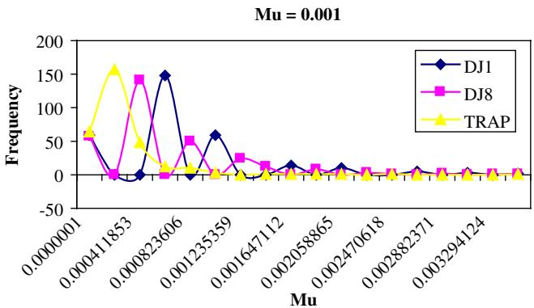
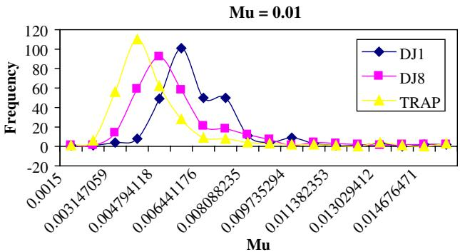
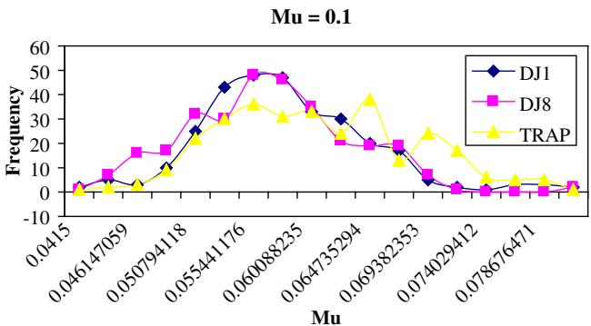
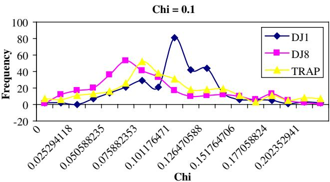
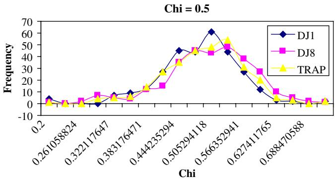
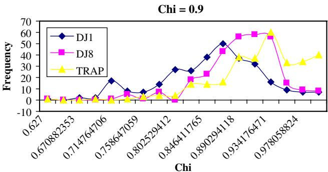

# CERIAS Tech Report 2005-151 Learning Genetic Algorithm Parameters Using Hidden Markov Models

by J Rees, G Koehler Center for Education and Research Information Assurance and Security Purdue University, West Lafayette, IN 47907-2086

# Computing, Artificial Intelligence and Information Management

# Learning genetic algorithm parameters using hidden Markov models

Jackie Rees a,\*, Gary J. Koehler b,1

a Krannert Graduate School of Management, 403 West State Street, Purdue University, West Lafayette, IN 47907-2056, USA b Department of Decision and Information Sciences, Warrington College of Business, University of Florida, P.O. Box 117169, Gainesville FL 32611-7169, USA

Received 7 October 2003; accepted 14 April 2005 Available online 15 August 2005

# Abstract

Genetic algorithms (GAs) are routinely used to search problem spaces of interest. A lesser known but growing group of applications of GAs is the modeling of so-called ‘‘evolutionary processes’’, for example, organizational learning and group decision-making. Given such an application, we show it is possible to compute the likely GA parameter settings given observed populations of such an evolutionary process. We examine the parameter estimation process using estimation procedures for learning hidden Markov models, with mathematical models that exactly capture expected GA behavior. We then explore the sampling distributions relevant to this estimation problem using an experimental approach.

$\circledcirc$ 2005 Elsevier B.V. All rights reserved.

Keywords: Artificial intelligence; Evolutionary computations; Evolutionary process; Adaptive agents; Genetic algorithms; Heuristics; Markov processes

# 1. Introduction

The area of experimental economics (e.g., Kagel and Roth, 1995) studies complex, multi-agent systems within a computer-simulated environment. Often it is desirable to have the artificial agents adapt to various events and pressures within their environment. One popular type of adaptive behavior is modeled after natural evolutionary processes. A simple, yet powerful, form of this behavior is captured in genetic algorithms (GAs) (see Goldberg, 1989).

Several authors have studied the evolutionary characteristics of systems by creating a simulation environment where a GA is used to mimic the adaptive behavior of some agent or group of agents. For example, Marks et al. (1995) examined oligopoly behavior in an adaptive framework and used a GA to simulate market-pricing movements in the coffee industry. An evolutionary model for electronic commerce was presented in Oliver (1996). Using a GA for learning, automated agents learned strategies for business negotiations within an electronic commerce framework. This investigation focused on a series of simulations of automated negotiation tasks using a genetic algorithm on automated agents. In Sikora and Shaw (1996), a GA was used to simulate group interaction leading to a solution among groups of agents. Genetic programming, (see Koza, 1992), another evolutionary computing technique, was used by Dworman et al. (1996) to automate the discovery of game theory models. A computational model of the organization based on the simple genetic algorithm was created by Bruderer and Singh (1996). Their research is unique in that it specifically uses a genetic algorithm as the model for organizational evolution, as opposed to simply simulating behavior using a genetic algorithm. In the above examples using evolutionary techniques to simulate or model particular processes, the authors have had to provide very rough estimates of parameters for the evolutionary technique used, for example, crossover or mutation rates, typically without much guidance of which values might be appropriate. Clearly, these simulations and models could progress further if more were known about the appropriate settings for the evolutionary parameters.

In Rees and Koehler (2000, 2002) the process is reversed. Rather than simulate behavior, the authors started with experimental data from an actual adaptive process (in this case a group decision-making case) and used the data to find a best-fit GA to mimic the evolutionary path. This fitting process was used to determine parameters required by the GA. They formulated and tested various hypotheses for these parameters (Rees and Koehler, 2000).

In traditional GA simulation, the GA parameters, v, the crossover rate, and $\mu$ , the mutation rate, are either determined experimentally by running a series of preliminary simulations or are chosen based on previous results or standard values used in the GA community. As discussed above, there are many real-world phenomena that appear to possess evolutionary characteristics, not unlike a GA. Following the lead given in Rees and Koehler (2000, 2002), we seek to investigate further whether there is a way to characterize these processes in terms of GA instances? In other words, can we reliably learn GA parameters, such as crossover and mutation rates, from real-world processes?

The expected behavior of a GA process can be modeled exactly using a Markov chain (Nix and Vose, 1992). If we know or assume a real-world process is a GA process, then we have a hidden Markov model (HMM)—we know it can be modeled by a Markov chain, we just do not know the specific mutation and crossover rates that generate the transition probabilities. The objective of this research is to use HMM methods to compute the likely GA parameter settings given observed populations of such an evolutionary process. In this paper we study the process of learning or ‘‘fitting’’ GA parameters to such evolutionary processes in more detail than done in Rees and Koehler (2000, 2002). We examine this issue by using mathematical models that exactly capture expected GA behavior and explore the sampling distributions relevant to this estimation problem using an experimental approach.

The value of this research is to provide researchers with a tool to more accurately simulate real-world evolutionary behavior. Such simulations are becoming commonplace, especially in applications such as information security, artificial markets and retail management. In such simulations, there is no theoretical guidance on how to set GA parameters such as crossover and mutation rates. The technique described in this paper allows researchers to determine these parameter values from existing real-world data. This ability should lead to more accurate and useful simulation studies.

The remainder of this paper is organized as follows: Section 2 presents relevant background on genetic algorithms, on the applications of hidden Markov models to this problem, and specifically on the use of maximum likelihood estimates for computing best-fit genetic algorithm parameters, namely crossover and mutation rates, from experimental data. Section 3 describes the experimental study comparing known

GA parameters to estimated parameters using the techniques described in Section 2. Section 4 presents the results of this study and Section 5 provides a discussion of those results. Finally, Section 6 provides conclusions and future research directions.

# 2. Background

In the following sections we present the relevant background information on genetic algorithms for this study. The Markov model of GAs is then provided in Section 2.2. We then discuss the hidden Markov model approach used in the study for learning specific parameter settings in Section 2.3.

# 2.1. Genetic algorithms

Genetic algorithms are derived from the principles of Darwinian natural selection and evolution. A population of agents evolves over time under survival of the fittest pressures. These agents, also called strings or chromosomes, evolve using three basic operations. These three operations are selection, crossover and mutation. Selection, or reproduction, stochastically collects the ‘‘fittest’’ members of the population according to a pre-defined fitness function for use in the next population or generation. Crossover pairs off the members of the new generation and exchanges genetic material between member pairs. Finally, mutation randomly alters information contained in the population members, adding diversity back into the population.

We can think of an evolving population as a search for better strings. Crossover and mutation operations play a guiding role in this search. The crossover rate, v, is a ‘‘focusing’’ factor in the search process. Two selected strings are ‘‘crossed’’ with probability v. In proportional selection, every pair of strings that are crossed has been randomly selected according to their ‘‘fitness’’. On average, the crossover operator combines two good solutions into potentially better solutions. The crossover operation attempts to focus search and move even closer to an optimal point. For this reason, the crossover parameter is often termed the ‘‘exploitation’’ operator.

The mutation operator using a mutation rate, $\mu$ , plays a ‘‘diversifying’’ role in genetic search. In uniform mutation, mutation operates on each bit in the string. Each bit is mutated with probability, $\mu$ . The mutation rate is usually set to be very low, for example, $0 . 1 \%$ of all bits in all of the strings might be subject to mutation in a given stage of evolution. If a particular bit is mutated the value of the bit would be altered, from a zero to a one or vice versa. The purpose of the mutation operation is to add either strings that were ‘‘selected out’’ of the population back in or to introduce new strings. Mutation serves to direct the search away from local minima or maxima. For this reason, the mutation operator is often termed the ‘‘exploration’’ operator (Goldberg, 1989). Table 1 summarizes a typical GA implementation.

# 2.2. Markov model for GAs

The first exact expected value model of a simple GA was provided in Vose (1990) and Vose and Liepins (1991). This has been subsequently extended to include many variants (Vose, 1999). Let $\Omega$ be a collection of binary strings of length $\ell$ and let $\dot { r } = | \varOmega | = 2 ^ { \ell }$ be the number of possible strings. These strings are equivalently represented as their integer equivalents $0 , 1 , \ldots , r - 1$ . Let $M _ { g , k }$ be the probability that the string of all zeros is the child of the mating process between parent strings $g$ and $k$ (where $g$ and $k$ are the integer representations of the strings). A general form of the mixing matrix, $M .$ , was given by Vose and Wright (1995) as

$$
M _ { x , y } = \sum _ { j , k } \mu _ { j } \frac { \chi _ { k } + \chi _ { \bar { k } } } { 2 } \delta \bigl ( x \otimes k \oplus \bar { k } \otimes y = j \bigr ) .
$$

Table 1 The simple genetic algorithm   

<table><tr><td colspan="2">Algorithm: (Genetic Algorithm)</td></tr><tr><td>Given: Sti nh s nco , uan a  [0,0.5]cver a   [0, 1] an poulatn   ≥1</td><td>Iliza ua aty n</td></tr><tr><td colspan="2">Ω = {0, 1, . . . , 2 − 1} with replacement Se 1:Form a new population as follows. Repeat the following steps until the new population has n members</td></tr><tr><td colspan="2">(A) Randomly choose two (or more) members from the old population according to a selection process. These are called parent strings (B) Form a child string through a mixing process consisting of crossover and mutation operations</td></tr></table>

Here $\mu _ { j }$ and $\chi _ { k }$ are called mutation and crossover masks and $\delta ( x )$ is 1 when $x$ is true and 0 otherwise. Here $\oplus$ and $\otimes$ are the bitwise ‘‘OR’’ and ‘‘AND’’ operators. The various mutation and crossover schemes can be captured using appropriate choices for these masks (see Vose (1999)). In particular, if the model uses simple one-point crossover and uniform mutation

$$
\chi _ { i } = { \left\{ \begin{array} { l l } { \chi c _ { i } } & { { \mathrm { i f ~ } } i > 0 , } \\ { 1 - \chi + \chi c _ { 0 } } & { { \mathrm { i f ~ } } i = 0 , } \end{array} \right. }
$$

where

$$
c _ { i } = { \left\{ \begin{array} { l l } { { \frac { 1 } { ( \ell - 1 ) } } } & { { \mathrm { i f ~ } } \exists k \in ( 0 , \ell ) { \mathrm { ~ a n d ~ } } i = 2 ^ { k } - 1 , } \\ { 0 } & { { \mathrm { o t h e r w i s e } } } \end{array} \right. }
$$

and

$$
\mu _ { i } = ( \mu ) ^ { | i | } ( 1 - \mu ) ^ { \ell - | i | } ,
$$

where $| i |$ is the number of non-zero bits of $i .$ . Let $P$ be a population of elements from $\Omega$ where $n = | P |$ is the population size and $N$ is the number of possible populations. $N$ is given by

$$
N = { \binom { n + r - 1 } { r - 1 } } .
$$

A population is a multiset meaning it may contain multiple copies of the same string. Consider the Markov Chain where the possible populations of size $n$ are the states. Express a state by the vector of length $r$ , $\phi _ { i } ,$ having as its kth component the number of copies of string $k$ in the population. Let $e$ be a vector of 1-s and $e ^ { \prime }$ its transpose. Each $\phi _ { i }$ is defined by

$$
\begin{array} { l } { { e ^ { \prime } \phi _ { i } = n , } } \\ { { ( \phi _ { i } ) _ { j } \in \{ 0 , 1 , \ldots , n \} , \quad j = 0 , 1 , \ldots , r - 1 . } } \end{array}
$$

The transition probabilities from state (population) $i$ to $j$ are computed by

$$
P _ { i , j } = n ! \prod _ { g = 0 } ^ { r - 1 } \frac { q _ { i , g } ^ { ( \phi _ { j } ) _ { g } } } { ( \phi _ { j } ) _ { g } ! } ,
$$

where

$$
q _ { i , g } = \mathsf { M } ( \mathsf { F } ( \phi _ { i } ) ) _ { g } ,
$$

F is used to capture the selection process and $\mathsf { M }$ the mixing operators (mutation and crossover) by Vose (1999). In particular

$$
\mathsf { M } ( x ) _ { i } = ( \sigma _ { i } x ) M \sigma _ { i } x ,
$$

where the permutation of $x , \sigma _ { k } x$ , is defined by

$$
\sigma _ { k } x = \left( \begin{array} { c } { x _ { k \oplus 0 } } \\ { \vdots } \\ { x _ { k \oplus ( r - 1 ) } } \end{array} \right) .
$$

The selection process is captured through F. Many representations of $\digamma$ capturing commonly employed selection processes were shown in Vose (1999). For example, for roulette-wheel selection

$$
\mathsf { F } ( \phi ) = \frac { F \phi } { e ^ { \prime } F \phi } ,
$$

where $F$ is a diagonal matrix and $F _ { i , i } = f ( i )$ is the fitness of string i.

The previous models were developed specifically for binary strings. The model in Nix and Vose (1992) was extended by Bhattacharyya and Koehler (1994) for strings with digits selected from $2 ^ { v }$ cardinality alphabets. Later Koehler et al. (1997) generalized the model in Vose and Liepins (1991) for strings composed of digits having alphabets of arbitrary cardinality $z$ , where $z$ is an integer greater than 1. This model can now be used to learn GA parameter settings from real-world evolutionary processes by utilizing hidden Markov models.

# 2.3. Hidden Markov models and maximum likelihood estimation of GA parameters

An approximate Maximum Likelihood Estimation (MLE) procedure was used in Rees and Koehler (2000, 2002) to estimate the crossover rate $\chi$ and mutation rate $\mu$ of group decision processes. Data was available from groups using a decision support tool to address a Pareto-optimal, production-planning problem, under various incentives and group configurations. Every possible production schedule input into the system was characterized as strings in a genetic algorithm. To compute the MLEs, Rees and Koehler (2000, 2002) used a Markov chain model of GAs developed by Nix and Vose (1992) and generalized by Vose (1999) and Koehler et al. (1997). This model gives exact expected transition probabilities for the simple GA. The transition probabilities were used to determine the likelihood of the observed transitions. Crossover and mutation rates were then estimated by maximizing these likelihoods.

Hidden Markov models have been applied to application areas such as speech recognition (Rabiner, 1989), broadcast news topic detection and tracking for news on demand (Boykin and Merlino, 2000), and intrusion detection for network security (Cho and Park, 2003) among others. In HMMs, there is the observation sequence, the observed outcomes or visible observations of a process, the invisible or hidden states that one cannot directly view or observe and the set of probabilities governing the model-s behavior. There are three fundamental problems for HMMs (Dugad and Desai, 1996): (1) how to compute the probability of occurrence of a particular observation sequence; (2) given a specific model, how to chose the state sequence so that the joint probability of the observation sequence and the state sequence given the model is maximized; and finally (3) how to determine the model parameters (for example v and $\mu$ ) so that the probability of the observation sequence given those parameters is maximized. This final problem is considered the model identification or training problem (Dugad and Desai, 1996) and is the main focus of this paper.

Given an observed trajectory of a GA process (i.e., the observed sequence of states—here meaning the observed sequence of populations), we wish to estimate the underlying parameters used by the GA. That is, we wish to estimate rates $\chi$ and $\mu$ . The likelihood of an observed trajectory is proportional to the product of the transition probabilities along the path. Hence, the likelihood of a given chain going from $j _ { 1 }$ to $j _ { 2 }$ to $j _ { 2 } . . .$ is

$$
P _ { j _ { 1 } , j _ { 2 } } P _ { j _ { 2 } , j _ { 3 } } \cdot \cdot \cdot P _ { j _ { T - 1 } , j _ { T } } .
$$

A simple maximum likelihood estimation (MLE) procedure can be used to determine model parameters. For example, one might use the Baum–Welch re-estimation method (Rabiner and Juang, 1986) for this purpose. Given there are just two parameters to estimate, the crossover, $\chi .$ , and mutation, $\mu$ , rates, we maximize the likelihood function:

$$
\operatorname* { m a x } _ { \boldsymbol { \chi } , \mu } \prod _ { i = 1 } ^ { T - 1 } P _ { j _ { i } , j _ { i + 1 } } ,
$$

where $T$ is the number of observed populations using a simple enumeration over a grid of values. The grid of values of $\mu$ from 0.0 to 0.5 (where 0.5 represents a random search in the binary case) and the values of $\chi$ from 0.0 to 1.0, inclusive, in steps of size 0.001 was employed. This MLE approach is a brute-force approximation of the Baum–Welch re-estimation formulas (Rabiner and Juang, 1986) and was adopted due to its relative computational simplicity.

Disappointing results in using this MLE technique were reported in Rees and Koehler (2000). The MLEs of the GA parameters often gave counterintuitive values; however, the problem structure studied turned out to be that of a highly-constrained optimization problem for which GAs often perform poorly. This study focuses on the MLE problem. Specifically, this study seeks to measure the robustness of using MLEs to estimate GA parameters on population data generated using known test functions and parameter settings. We generate these populations using various combinations of the crossover and mutation rates. These data sets are then used to estimate the known parameters using the above MLE procedure. Therefore, we will have the ability to compare the known parameters to the estimated ones and investigate how well the MLE procedure performs. We also provide some useful guidelines for estimating these parameters.

# 3. Experimental study

We wish to study the results of learning or ‘‘fitting’’ GA parameters using the above-described MLE procedures. We do this by generating a large number of controlled cases where we fix the fitness function and GA parameters. In other words, we run a GA with known parameter values for several scenarios. We then use MLE on these generated cases to estimate the GA parameters and study the fit of these versus the known, true values.

We study a collection of problems having string lengths of 10 bits and control the following factors:

• fitness function (see Table 2), • mutation rate $\mu \in \{ 0 . 0 0 1 , 0 . 0 1 , 0 . 1 \}$ , • crossover rate $\chi \in \{ 0 . 1 , 0 . 5 , 0 . 9 \}$ , • population size $n \in \{ 2 0 , 5 0 \}$ , • number of populations $t \in \{ 2 0 , 5 0 \}$ .

Three prototypical fitness functions for generating experimental data were selected. These functions are summarized in Table 2. The first two are restricted version of De Jong-s F1 and F8 functions (De Jong, 1975) and the third is a fully deceptive trap function (Mason, 1991).

Table 2 Functions   

<table><tr><td>De Jong F1</td><td>() = 1−s2+rs</td><td></td></tr><tr><td>De Jong F8</td><td>10,000 $4-01$ () = 1 −</td><td> + cos( − r/2)</td></tr><tr><td></td><td></td><td>{ z ( − m(s)), (s) ≤ z</td></tr><tr><td>Trap Function</td><td>f (s) = 1 + </td><td>Z−z (m(s) − z), otherwise</td></tr></table>

The first function is a modified version of De Jong-s F1. The original F1 was simplified to one variable and converted to a maximization form having all positive values. The original function is

$$
f ( x _ { 1 } , x _ { 2 } , x _ { 3 } ) = x _ { 1 } ^ { 2 } + x _ { 2 } ^ { 2 } + x _ { 3 } ^ { 2 } , \quad - 5 . 1 2 \leqslant x _ { i } \leqslant 5 . 1 2 .
$$

This function was restricted to one variable $( x )$ with the range of $1 0 0 x \in \left[ - \frac { r } { 2 } , \frac { r } { 2 } \right)$ where $r = 2 ^ { \ell }$ . The range  constraint is used simply to restrict the search of the GA. In order to convert the function to a maximization function, the function was subtracted from its maximum and a small number was added to keep it positive. This process yields

$$
f ( x ) = { \frac { 4 + r ^ { 2 } } { 4 0 , 0 0 0 } } - { \frac { x ^ { 2 } } { 1 0 , 0 0 0 } } .
$$

Next, this function had to be converted to a string value, requiring the shifting of $s$ from a range of $s \in [ 0 , r )$ to $x$ -s range. Therefore, our modified F1 becomes

$$
f ( x ) = \frac { 4 + r ^ { 2 } } { 4 0 , 0 0 0 } - \frac { \left( s - \frac { r } { 2 } \right) ^ { 2 } } { 1 0 , 0 0 0 } = \frac { 1 - s ^ { 2 } + r s } { 1 0 , 0 0 0 } .
$$

This function has a unique maximum at $s = r / 2$ and has no local maxima.

Similarly, the De Jong F8 is simplified to one variable and is converted to a maximization form having all positive values. The original function is

$$
f ( x _ { 1 } , \dots , x _ { k } ) = 1 + \sum _ { i = 1 } ^ { k } { \frac { x _ { i } ^ { 2 } } { 4 0 0 0 } } - \prod _ { i = 1 } ^ { k } \cos ( X _ { i } / { \sqrt { i } } ) , \quad - 5 1 2 \leqslant x _ { i } \leqslant 5 1 1 .
$$

Performing the various modification steps yields

$$
f ( s ) = 1 - { \frac { s ^ { 2 } - r x } { 4 0 0 0 } } + \cos ( s - r / 2 ) .
$$

This fitness function has a unique maximum at $s = r / 2$ and has many local maxima.

The third function is a trap function (Ackley, 1987). A trap function is a type of function known to be $G A$ -deceptive, that is, a problem or function that should make the GA move away from finding the global optimum. A trap function is a deceptive function that ‘‘traps’’ the search at local optima. These functions are defined for binary problems (for higher cardinality problems see Mason (1991) and Rees and Koehler (1999)) are given by

$$
f ( s ) = 1 + \left\{ { \begin{array} { l l } { { \frac { a } { z } } { \big ( } z - m ( s ) { \big ) } , } & { m ( s ) \leqslant z , } \\ { { \frac { b } { \ell - z } } { \big ( } m ( s ) - z { \big ) } , } & { { \mathrm { o t h e r w i s e } } , } \end{array} } \right.
$$

where $a$ and $b$ are positive and $z$ is chosen under various criteria. We use $z = \ell - 1$ , $a = 1 0$ and $b = 1 2$ These choices make $f ( s )$ fully deceptive (Mason, 1991).

Under each case studied, $N = 2 5$ replications were generated. Each run started with a randomly generated population. This population and the subsequent populations were recorded for later MLE processing.

The MLE process determined best-fit mutation and crossover rates for these population transitions. These, in turn, were compared to the true mutation and crossover rates. The comparisons were made by performing goodness-of-fit tests on the generated values assuming the sampling distribution was a lognormal distribution. The lognormal distribution was used as it was identified during preliminary testing against a number of distributions, as the best fitting distribution. We hypothesized that the distribution functions of both the crossover and mutation parameters are lognormal distribution functions with (positive) means $\ln ( \chi )$ and $\ln ( \mu )$ , respectively, where $\chi$ and $\mu$ are the true crossover and mutation rates after some preliminary work to narrow the range of possible distributions. This hypothesis can be formally stated as

$$
\begin{array} { r l } { \mathbf { H } _ { 0 } { : } } & { \ F ( x ) = F ^ { * } ( x ) \quad \mathrm { f o r ~ a l l ~ } x \in ( 0 , 1 ) } \\ { \mathbf { H } _ { 1 } { : } } & { \ F ( x ) \neq F ^ { * } ( x ) \quad \mathrm { f o r ~ a t ~ l e a s t ~ o n e ~ v a l u e ~ o f ~ } x } \end{array}
$$

where $F ( x )$ is the estimated distribution of the GA parameter examined and $F ^ { * } ( x )$ is the lognormal distribution of the true GA parameter. We also consider the descriptive statistics for each case, including the estimated parameter means, standard deviations, skewness and kurtosis. The results are discussed in the next section.

# 4. Results

Figs. 1–6 show the frequencies of the mutation and crossover rates determined by MLE for the three functions. Each figure provides the distribution of the learned parameters for each given crossover or mutation rate. For example, Fig. 1 shows the distributions of the mutation estimates for each of the three functions tested. The given or fixed value of $\mu$ was set at 0.001.

We examined the distribution of the estimates around their true values. For this we use the Kolmogorov–Smirnov goodness of fit test against the lognormal distribution (Conover, 1999). The results of this test at the $\alpha = 0 . 1$ level $\mathbf { \mathit { D } } = 0 . 1 0 9 1 2$ ) against various values of true $\chi$ and $\mu$ are provided in Tables 3–5.

While these results are somewhat mixed, there does appear to be evidence that the MLE technique provides a good approximation for the true GA parameters in the three functions tested. Descriptive statistics of the estimated values are provided in Tables 6–8.

These results indicate that the MLE-s of the true $\mu$ and $\chi$ values are generally robust. However, there is a tendency to underestimate the parameters, mostly affecting mutation. The crossover parameter is underestimated only at the 0.9 level, particular in the F1 and F8 functions. The skewness and kurtosis are also much more positive for the $\mu$ estimates than for the $\chi$ estimates, indicating right-side asymmetry and peaking of the estimated distribution. Therefore, the MLE procedure used appears to be biased regarding mutation, especially for the F1 and F8 functions. Using this information to make adjustments to the estimated parameters might be helpful in future research. Specifically, one might adjust the estimated best-fit mutation parameter slightly upward, to accommodate the underestimation in the current technique. Interestingly, the estimates do vary as the population size $( n )$ and number of generations (t) increase, but do not generally improve significantly.

  
Fig. 1. Mutation estimates for $\mu = 0 . 0 0 1$ .

  
Fig. 2. Mutation estimates for $\mu = 0 . 0 1$ .

  
Fig. 3. Mutation estimates for $\mu = 0 . 1$ .

  
Fig. 4. Crossover estimates for $\chi = 0 . 1$

  
Fig. 5. Crossover estimates for $\chi = 0 . 5$

  
Fig. 6. Crossover estimates for $\chi = 0 . 9$ .

# 5. Discussion

For a majority of the datasets tested, evidence supports the hypothesis that the MLEs distributions are lognormal. This indicates that this HMM technique performs as anticipated and gives results that reasonably approximate the true values of the GA parameters examined.

Overall, the MLEs of both crossover and mutation were good approximations of their fixed values. However, there appears to be an underestimation in both the crossover and mutation rate estimates. This is more pronounced in the smaller $\mathbf { \chi } _ { \mu } = 0 . 0 0 1$ ) values of $\mu$ and in the larger values of v $( \chi = 0 . 9 )$ ). However, the underestimation was fairly small and overall the technique used provides a good estimate of the GA parameters. One possible insight on this might be the use of the maximum likelihood technique itself. MLE is known to produce biased results in many settings (e.g., in estimates of linear regression coefficients). Using a more sophisticated, but computationally challenging technique, such as a more direct implementation of the Baum–Welch re-estimation formulas, might overcome this problem. Another possible explanation would be the need to test the estimation behavior at larger values of $n$ and $t$ . However, using larger $n$ and $t$ values again is computationally problematic in terms of run-time of the simulations.

Another interesting observation is the good performance of the technique on the trap or deceptive function. The estimates found by the MLE technique on the trap datasets were often superior for the crossover parameter than for the De Jong F1 and F8 datasets. This finding was somewhat unexpected but reaffirms the usefulness of the approach.

Table 3 Results of Kolmogorov–Smirnov Goodness-of-Fit Tests for Lognormal Distribution $( F ^ { * } ( x ) )$ on De Jong F1   

<table><tr><td>Data set</td><td>True µ</td><td>True X</td><td>D Statistic</td><td>p Value</td><td>Conclusion</td></tr><tr><td>DJ1_n20t20</td><td>0.001</td><td></td><td>0.24</td><td>&lt;0.01</td><td>Reject H0</td></tr><tr><td>DJ1_n20t20</td><td>0.01</td><td></td><td>0.18</td><td>&lt;0.001</td><td>Reject Ho</td></tr><tr><td>DJ1_n20t20</td><td>0.1</td><td></td><td>0.07</td><td>&gt;0.25</td><td>Do not reject H0</td></tr><tr><td>DJ1_n20t20</td><td></td><td>0.1</td><td>0.08</td><td>0.227</td><td>Do not reject Ho</td></tr><tr><td>DJ1_n20t20</td><td></td><td>0.5</td><td>0.07</td><td>&gt;0.25</td><td>Do not reject Ho</td></tr><tr><td>DJ1_n20t20</td><td></td><td>0.9</td><td>0.08</td><td>0.144</td><td>Do not reject Ho</td></tr><tr><td>DJ1_n20t50</td><td>0.001</td><td></td><td>0.17</td><td>&lt;0.01</td><td>Reject H0</td></tr><tr><td>DJ1_n20t50</td><td>0.01</td><td></td><td>0.15</td><td>&lt;0.001</td><td>Reject H0</td></tr><tr><td>DJ1_n20t50</td><td>0.1</td><td></td><td>0.10</td><td>0.025</td><td>Do not reject Ho</td></tr><tr><td>DJ1_n20t50</td><td></td><td>0.1</td><td>0.13</td><td>&lt;0.001</td><td>Reject H0</td></tr><tr><td>DJ1_n20t50</td><td></td><td>0.5</td><td>0.09</td><td>0.04</td><td>Do not reject H0</td></tr><tr><td>DJ1_n20t50</td><td></td><td>0.9</td><td>0.09</td><td>0.091</td><td>Do not reject Ho</td></tr><tr><td>DJ1_n50t20</td><td>0.001</td><td></td><td>0.23</td><td>&lt;0.01</td><td>Reject H0</td></tr><tr><td>DJ1_n50t20</td><td>0.01</td><td></td><td>0.17</td><td>&lt;0.001</td><td>Reject H0</td></tr><tr><td>DJ1_n50t20</td><td>0.1</td><td></td><td>0.05</td><td>&gt;0.5</td><td>Do not reject Ho</td></tr><tr><td>DJ1_n50t20</td><td></td><td>0.1</td><td>0.16</td><td>&lt;0.001</td><td>Reject H0</td></tr><tr><td>DJ1_n50t20</td><td></td><td>0.5</td><td>0.16</td><td>&lt;0.001</td><td>Reject H0</td></tr><tr><td>DJ1_n50t20</td><td></td><td>0.9</td><td>0.10</td><td>0.008</td><td>Do not reject Ho</td></tr><tr><td>DJ1_n50t50</td><td>0.001</td><td></td><td>0.15</td><td>&lt;0.01</td><td>Reject H0</td></tr><tr><td>DJ1_n50t50</td><td>0.01</td><td></td><td>0.16</td><td>&lt;0.001</td><td>Reject H0</td></tr><tr><td>DJ1_n50t50</td><td>0.1</td><td></td><td>0.06</td><td>&gt;0.5</td><td>Do not reject Ho</td></tr><tr><td>DJ1_n50t50</td><td></td><td>0.1</td><td>0.09</td><td>0.095</td><td>Do not reject H0</td></tr><tr><td>DJ1_n50t50</td><td></td><td>0.5</td><td>0.18</td><td>&lt;0.001</td><td>Reject H0</td></tr><tr><td>DJ1_n50t50</td><td></td><td>0.9</td><td>0.09</td><td>0.042</td><td>Do not reject Ho</td></tr></table>

Table 4 Results of Kolmogorov–Smirnov Goodness-of-Fit Tests for Lognormal Distribution $( F ^ { * } ( x ) )$ on De Jong F8   

<table><tr><td>Data set</td><td>True µ</td><td>True X</td><td>D Statistic</td><td>p Value</td><td>Conclusion</td></tr><tr><td>DJ8_n20t20</td><td>0.001</td><td></td><td>0.22</td><td>&lt;0.01</td><td>Reject H0</td></tr><tr><td>DJ8_n20t20</td><td>0.01</td><td></td><td>0.11</td><td>0.009</td><td>Reject Ho</td></tr><tr><td>DJ8_n20t20</td><td>0.1</td><td></td><td>0.09</td><td>0.077</td><td>Do not reject Ho</td></tr><tr><td>DJ8_n20t20</td><td></td><td>0.1</td><td>0.07</td><td>&gt;0.25</td><td>Do not reject H0</td></tr><tr><td>DJ8_n20t20</td><td></td><td>0.5</td><td>0.07</td><td>&gt;0.25</td><td>Do not reject H0</td></tr><tr><td>DJ8_n20t20</td><td></td><td>0.9</td><td>0.12</td><td>0.001</td><td>Reject Ho</td></tr><tr><td>DJ8_n20t50</td><td>0.001</td><td></td><td>0.37</td><td>&lt;0.001</td><td>Reject H0</td></tr><tr><td>DJ8_n20t50</td><td>0.01</td><td></td><td>0.14</td><td>&lt;0.001</td><td>Reject H0</td></tr><tr><td>DJ8_n20t50</td><td>0.1</td><td></td><td>0.08</td><td>0.18</td><td>Do not reject Ho</td></tr><tr><td>DJ8_n20t50</td><td></td><td>0.1</td><td>0.05</td><td>&gt;0.5</td><td>Do not reject H0</td></tr><tr><td>DJ8_n20t50</td><td></td><td>0.5</td><td>0.13</td><td>&lt;0.001</td><td>Reject H0</td></tr><tr><td>DJ8_n20t50</td><td></td><td>0.9</td><td>0.10</td><td>0.039</td><td>Do not reject Ho</td></tr><tr><td>DJ8_n50t20</td><td>0.001</td><td></td><td>0.15</td><td>&lt;0.001</td><td>Reject Ho</td></tr><tr><td>DJ8_n50t20</td><td>0.01</td><td></td><td>0.11</td><td>0.004</td><td>Reject H0</td></tr><tr><td>DJ8_n50t20</td><td>0.1</td><td></td><td>0.09</td><td>0.04</td><td>Do not reject Ho</td></tr><tr><td>DJ8_n50t20</td><td></td><td>0.1</td><td>0.07</td><td>&gt;0.25</td><td>Do not reject Ho</td></tr><tr><td>DJ8_n50t20</td><td></td><td>0.5</td><td>0.08</td><td>0.178</td><td>Do not reject H0</td></tr><tr><td>DJ8_n50t20</td><td></td><td>0.9</td><td>0.10</td><td>0.034</td><td>Do not reject H0</td></tr><tr><td>DJ8_n50t50</td><td>0.001</td><td></td><td>0.38</td><td>&lt;0.001</td><td>Reject H0</td></tr><tr><td>DJ8_n50t50</td><td>0.01</td><td></td><td>0.14</td><td>&lt;0.001</td><td>Reject H0</td></tr><tr><td>DJ8_n50t50</td><td>0.1</td><td></td><td>0.08</td><td>0.116</td><td>Do not reject Ho</td></tr><tr><td>DJ8_n50t50</td><td></td><td>0.1</td><td>0.15</td><td>&lt;0.001</td><td>Reject Ho</td></tr><tr><td>DJ8_n50t50</td><td></td><td>0.5</td><td>0.09</td><td>0.048</td><td>Do not reject H0</td></tr><tr><td>DJ8_n50t50</td><td></td><td>0.9</td><td>0.08</td><td>0.174</td><td>Do not reject H0</td></tr></table>

Table 5 Results of Kolmogorov–Smirnov Goodness-of-Fit Tests for Lognormal Distribution $\left( F ^ { * } ( x ) \right)$ on the Trap Function   

<table><tr><td>Data set</td><td>True µ</td><td>True </td><td>D Statistic</td><td>p Value</td><td>Conclusion</td></tr><tr><td>TRAP_n20t20</td><td>0.001</td><td></td><td>0.22</td><td>&lt;0.01</td><td>Reject H0</td></tr><tr><td>TRAP_n20t20</td><td>0.01</td><td></td><td>0.10</td><td>0.024</td><td>Do not reject Ho</td></tr><tr><td>TRAP_n20t20</td><td>0.1</td><td></td><td>0.09</td><td>0.073</td><td>Do not reject H0</td></tr><tr><td>TRAP_n20t20</td><td></td><td>0.1</td><td>0.06</td><td>&gt;0.25</td><td>Do not reject H0</td></tr><tr><td>TRAP_n20t20</td><td></td><td>0.5</td><td>0.08</td><td>0.221</td><td>Do not reject Ho</td></tr><tr><td>TRAP_n20t20</td><td></td><td>0.9</td><td>0.06</td><td>&gt;0.25</td><td>Do not reject Ho</td></tr><tr><td>TRAP_n20t50</td><td>0.001</td><td></td><td>0.37</td><td>&lt;0.001</td><td>Reject H0</td></tr><tr><td>TRAP_n20t50</td><td>0.01</td><td></td><td>0.13</td><td>&lt;0.001</td><td>Reject H0</td></tr><tr><td>TRAP_n20t50</td><td>0.1</td><td></td><td>0.08</td><td>0.232</td><td>Do not reject H0</td></tr><tr><td>TRAP_n20t50</td><td></td><td>0.1</td><td>0.09</td><td>0.065</td><td>Do not reject H0</td></tr><tr><td>TRAP_n20t50</td><td></td><td>0.5</td><td>0.10</td><td>0.30</td><td>Do not reject H0</td></tr><tr><td>TRAP_n20t50</td><td></td><td>0.9</td><td>0.10</td><td>0.23</td><td>Do not reject H0</td></tr><tr><td>TRAP_n50t20</td><td>0.001</td><td></td><td>0.22</td><td>&lt;0.01</td><td>Reject H0</td></tr><tr><td>TRAP_n50t20</td><td>0.01</td><td></td><td>0.13</td><td>&lt;0.001</td><td>Reject H0</td></tr><tr><td>TRAP_n50t20</td><td>0.1</td><td></td><td>0.07</td><td>&gt;0.25</td><td>Do not reject Ho</td></tr><tr><td>TRAP_n50t20 TRAP_n50t20</td><td></td><td>0.1</td><td>0.07</td><td>&gt;0.25</td><td>Do not reject H0</td></tr><tr><td></td><td></td><td>0.5</td><td>0.06</td><td>&gt;0.5</td><td>Do not reject H0</td></tr><tr><td>TRAP_n50t20</td><td></td><td>0.9</td><td>0.11</td><td>0.004</td><td>Reject Ho</td></tr><tr><td>TRAP_n50t50</td><td>0.001</td><td></td><td>0.37</td><td>&lt;0.001</td><td>Reject H0</td></tr><tr><td>TRAP_n50t50</td><td>0.01</td><td></td><td>0.25</td><td>&lt;0.001</td><td>Reject H0</td></tr><tr><td>TRAP_n50t50</td><td>0.1</td><td></td><td>0.09</td><td>0.107</td><td>Do not reject Ho</td></tr><tr><td>TRAP_n50t50</td><td></td><td>0.1</td><td>0.12</td><td>0.003</td><td>Reject H0</td></tr><tr><td>TRAP_n50t50 TRAP_n50t50</td><td></td><td>0.5 0.9</td><td>0.07 0.09</td><td>&gt;0.25 0.05</td><td>Do not reject H0 Do not reject Ho</td></tr></table>

Table 6 Descriptive statistics for De Jong F1   

<table><tr><td>Data set</td><td>True μ</td><td>True X</td><td>Mean</td><td>Std. deviation</td><td>Skewness</td><td>Kurtosis</td></tr><tr><td>DJ1_n20t20</td><td>0.001</td><td></td><td>0.0005</td><td>0.0007</td><td>1.2371</td><td>0.8630</td></tr><tr><td>DJ1_n20t20</td><td>0.01</td><td></td><td>0.0061</td><td>0.0024</td><td>1.6245</td><td>4.2031</td></tr><tr><td>DJ1_n20t20</td><td>0.1</td><td></td><td>0.0556</td><td>0.0077</td><td>0.2449</td><td>−0.2277</td></tr><tr><td>DJ1_n20t20</td><td></td><td>0.1</td><td>0.0973</td><td>0.0458</td><td>0.0202</td><td>-0.1710</td></tr><tr><td>DJ1_n20t20</td><td></td><td>0.5</td><td>0.4562</td><td>0.0942</td><td>-0.1156</td><td>0.1660</td></tr><tr><td>DJ1_n20t20</td><td></td><td>0.9</td><td>0.8372</td><td>0.0929</td><td>−0.2269</td><td>−0.8414</td></tr><tr><td>DJ1_n20t50</td><td>0.001</td><td></td><td>0.0007</td><td>0.0003</td><td>2.2209</td><td>5.2000</td></tr><tr><td>DJ1_n20t50</td><td>0.01</td><td></td><td>0.0055</td><td>0.0015</td><td>2.6397</td><td>12.4318</td></tr><tr><td>DJ1_n20t50</td><td>0.1</td><td></td><td>0.0549</td><td>0.0049</td><td>0.8630</td><td>2.4303</td></tr><tr><td>DJ1_n20t50</td><td></td><td>0.1</td><td>0.0925</td><td>0.0341</td><td>0.6228</td><td>1.1836</td></tr><tr><td>DJ1_n20t50</td><td></td><td>0.5</td><td>0.4713</td><td>0.0785</td><td>-0.1519</td><td>1.7436</td></tr><tr><td>DJ1_n20t50</td><td></td><td>0.9</td><td>0.8494</td><td>0.0754</td><td>0.3345</td><td>-0.2099</td></tr><tr><td>DJ1_n50t20</td><td>0.001</td><td></td><td>0.0009</td><td>0.0009</td><td>1.2385</td><td>0.9093</td></tr><tr><td>DJ1_n50t20</td><td>0.01</td><td></td><td>0.0063</td><td>0.0022</td><td>1.8005</td><td>4.2137</td></tr><tr><td>DJ1_n50t20</td><td>0.1</td><td></td><td>0.0600</td><td>0.0077</td><td>0.7916</td><td>0.5916</td></tr><tr><td>DJ1_n50t20 DJ1_n50t20</td><td></td><td>0.1</td><td>0.0976</td><td>0.0280</td><td>0.4293</td><td>2.4528</td></tr><tr><td></td><td></td><td>0.5</td><td>0.4569</td><td>0.0741</td><td>-1.4096</td><td>2.5355</td></tr><tr><td>DJ1_n50t20</td><td></td><td>0.9</td><td>0.8350</td><td>0.0589</td><td>0.5242</td><td>0.6387</td></tr><tr><td>DJ1_n50t50</td><td>0.001</td><td></td><td>0.0006</td><td>0.0003</td><td>2.3797</td><td>7.1043</td></tr><tr><td>DJ1_n50t50</td><td>0.01</td><td></td><td>0.0056</td><td>0.0011</td><td>1.4066</td><td>5.7322</td></tr><tr><td>DJ1_n50t50</td><td>0.1</td><td></td><td>0.0566</td><td>0.0047</td><td>0.4021</td><td>0.3461</td></tr><tr><td>DJ1_n50t50</td><td></td><td>0.1</td><td>0.0975</td><td>0.0208</td><td>0.1570</td><td>1.2909</td></tr><tr><td>DJ1_n50t50</td><td></td><td>0.5</td><td>0.4735</td><td>0.0487</td><td>0.7448</td><td>0.0344</td></tr><tr><td>DJ1_n50t50</td><td></td><td>0.9</td><td>0.8479</td><td>0.0474</td><td>−0.5497</td><td>0.6425</td></tr></table>

Table 7 Descriptive statistics for De Jong F8   

<table><tr><td>Data set</td><td>True µ</td><td>True X</td><td>Mean</td><td>Std. deviation</td><td>Skewness</td><td>Kurtosis</td></tr><tr><td>DJ8_n20t20</td><td>0.001</td><td></td><td>0.0007</td><td>0.0010</td><td>1.6552</td><td>2.4108</td></tr><tr><td>DJ8_n20t20</td><td>0.01</td><td></td><td>0.0075</td><td>0.0036</td><td>1.3676</td><td>1.3046</td></tr><tr><td>DJ8_n20t20</td><td>0.1</td><td></td><td>0.0561</td><td>0.0069</td><td>0.8399</td><td>1.9582</td></tr><tr><td>DJ8_n20t20</td><td></td><td>0.1</td><td>0.0961</td><td>0.0617</td><td>0.2670</td><td>−0.5609</td></tr><tr><td>DJ8_n20t20</td><td></td><td>0.5</td><td>0.3934</td><td>0.1110</td><td>−0.0297</td><td>-0.0151</td></tr><tr><td>DJ8_n20t20</td><td></td><td>0.9</td><td>0.7103</td><td>0.1494</td><td>0.5583</td><td>1.2185</td></tr><tr><td>DJ8_n20t50</td><td>0.001</td><td></td><td>0.0006</td><td>0.0003</td><td>0.9309</td><td>1.7551</td></tr><tr><td>DJ8_n20t50</td><td>0.01</td><td></td><td>0.0059</td><td>0.0016</td><td>1.5529</td><td>3.3269</td></tr><tr><td>DJ8_n20t50</td><td>0.1</td><td></td><td>0.0569</td><td>0.0051</td><td>0.3012</td><td>0.5216</td></tr><tr><td>DJ8_n20t50</td><td></td><td>0.1</td><td>0.1065</td><td>0.0552</td><td>0.1723</td><td>-0.5879</td></tr><tr><td>DJ8_n20t50</td><td></td><td>0.5</td><td>0.4118</td><td>0.0964</td><td>-0.2893</td><td>0.7468</td></tr><tr><td>DJ8_n20t50</td><td></td><td>0.9</td><td>0.7170</td><td>0.1154</td><td>-0.0767</td><td>1.1750</td></tr><tr><td>DJ8_n50t20</td><td>0.001</td><td></td><td>0.0011</td><td>0.0010</td><td>1.5000</td><td>3.0840</td></tr><tr><td>DJ8_n50t20</td><td>0.01</td><td></td><td>0.0065</td><td>0.0028</td><td>2.0787</td><td>5.7829</td></tr><tr><td>DJ8_n50t20</td><td>0.1</td><td></td><td>0.0540</td><td>0.0069</td><td>0.1589</td><td>0.7633</td></tr><tr><td>DJ8_n50t20</td><td></td><td>0.1</td><td>0.1402</td><td>0.0730</td><td>0.8729</td><td>-0.0166</td></tr><tr><td>DJ8_n50t20</td><td></td><td>0.5</td><td>0.4645</td><td>0.0635</td><td>0.0350</td><td>0.3373</td></tr><tr><td>DJ8_n50t20</td><td></td><td>0.9</td><td>0.7842</td><td>0.0707</td><td>-1.3744</td><td>3.0446</td></tr><tr><td>DJ8_n50t50</td><td>0.001</td><td></td><td>0.0007</td><td>0.0004</td><td>2.0669</td><td>6.5032</td></tr><tr><td>DJ8_n50t50</td><td>0.01</td><td></td><td>0.0051</td><td>0.0010</td><td>0.2894</td><td>0.1495</td></tr><tr><td>DJ8_n50t50</td><td>0.1</td><td></td><td>0.0515</td><td>0.0057</td><td>0.1923</td><td>-0.4397</td></tr><tr><td>DJ8_n50t50</td><td></td><td>0.1</td><td>0.1653</td><td>0.0883</td><td>0.5379</td><td>-1.2997</td></tr><tr><td>DJ8_n50t50</td><td></td><td>0.5</td><td>0.4954</td><td>0.0635</td><td>0.2503</td><td>0.7326</td></tr><tr><td>DJ8_n50t50</td><td></td><td>0.9</td><td>0.7993</td><td>0.0636</td><td>0.0481</td><td>0.1540</td></tr></table>

Table 8 Descriptive statistics for the trap function   

<table><tr><td>Data set</td><td>True µ</td><td>True X</td><td>Mean</td><td>Std. deviation</td><td>Skewness</td><td>Kurtosis</td></tr><tr><td>TRAP_n20t20</td><td>0.001</td><td></td><td>0.0007</td><td>0.0011</td><td>3.6996</td><td>17.3209</td></tr><tr><td>TRAP_n20t20</td><td>0.01</td><td></td><td>0.0063</td><td>0.0028</td><td>1.7412</td><td>3.0330</td></tr><tr><td>TRAP_n20t20</td><td>0.1</td><td></td><td>0.0487</td><td>0.0048</td><td>-0.2415</td><td>0.3940</td></tr><tr><td>TRAP_n20t20</td><td></td><td>0.1</td><td>0.1039</td><td>0.0695</td><td>0.5366</td><td>0.0749</td></tr><tr><td>TRAP_n20t20</td><td></td><td>0.5</td><td>0.4566</td><td>0.1182</td><td>0.0604</td><td>0.7742</td></tr><tr><td>TRAP_n20t20</td><td></td><td>0.9</td><td>0.8044</td><td>0.1222</td><td>0.5652</td><td>0.7612</td></tr><tr><td>TRAP_n20t50</td><td>0.001</td><td></td><td>0.0007</td><td>0.0006</td><td>4.2848</td><td>23.7368</td></tr><tr><td>TRAP_n20t50</td><td>0.01</td><td></td><td>0.0055</td><td>0.0018</td><td>2.4877</td><td>7.1230</td></tr><tr><td>TRAP_n20t50</td><td>0.1</td><td></td><td>0.0489</td><td>0.0033</td><td>0.1166</td><td>−0.4269</td></tr><tr><td>TRAP_n20t50</td><td></td><td>0.1</td><td>0.1118</td><td>0.0623</td><td>0.6775</td><td>0.7907</td></tr><tr><td>TRAP_n20t50</td><td></td><td>0.5</td><td>0.4724</td><td>0.1119</td><td>-0.1340</td><td>1.1727</td></tr><tr><td>TRAP_n20t50</td><td></td><td>0.9</td><td>0.8395</td><td>0.0969</td><td>−0.1827</td><td>-0.3169</td></tr><tr><td>TRAP_n50t20</td><td>0.001</td><td></td><td>0.0008</td><td>0.0012</td><td>5.9099</td><td>43.4197</td></tr><tr><td>TRAP_n50t20</td><td>0.01</td><td></td><td>0.0054</td><td>0.0025</td><td>3.4284</td><td>15.6305</td></tr><tr><td>TRAP_n50t20</td><td>0.1</td><td></td><td>0.0451</td><td>0.0041</td><td>0.4790</td><td>0.0033</td></tr><tr><td>TRAP_n50t20</td><td></td><td>0.1</td><td>0.1318</td><td>0.0613</td><td>0.8701</td><td>0.0865</td></tr><tr><td>TRAP_n50t20</td><td></td><td>0.5</td><td>0.5121</td><td>0.0804</td><td>0.0285</td><td>0.0876</td></tr><tr><td>TRAP_n50t20</td><td></td><td>0.9</td><td>0.8766</td><td>0.0657</td><td>0.6884</td><td>1.3404</td></tr><tr><td>TRAP_n50t50</td><td>0.001</td><td></td><td>0.0007</td><td>0.0007</td><td>4.6204</td><td>24.3889</td></tr><tr><td>TRAP_n50t50</td><td>0.01</td><td></td><td>0.0056</td><td>0.0028</td><td>3.7665</td><td>15.2859</td></tr><tr><td>TRAP_n50t50</td><td>0.1</td><td></td><td>0.0433</td><td>0.0026</td><td>0.4974</td><td>0.7143</td></tr><tr><td>TRAP_n50t50</td><td></td><td>0.1</td><td>0.1539</td><td>0.0664</td><td>0.5816</td><td>0.7534</td></tr><tr><td>TRAP_n50t50</td><td></td><td>0.5</td><td>0.5602</td><td>0.0765</td><td>0.0855</td><td>−0.3557</td></tr><tr><td>TRAP_n50t50</td><td></td><td>0.9</td><td>0.9071</td><td>0.0649</td><td>0.4654</td><td>−0.7052</td></tr></table>

# 6. Conclusions and future research

This paper presents a study of a maximum likelihood estimate technique for estimating the crossover and mutation parameters from a hidden Markov model in the form of data generated by a GA. The approach shows reasonable promise for use in many simulation settings where it is desirable to accurately depict evolutionary behaviors of the underlying system. The technique was shown to be relatively accurate over three test functions for various combinations of parameters (mutation rate, crossover rate, population size and number of populations). It performed less well when mutation rates are very small or crossover rates very large.

The implications of this research are important for those researchers using evolutionary techniques for simulation and modeling activities as discussed in Section 1. Researchers now have a technique that can be applied to data sets generated from experiments and/or real world processes to learn more appropriate parameter estimates for their simulations, rather than the educated guesswork and repeated simulation runs with various settings that are currently used. These parameter estimates should in turn provide for more realistic and hopefully insightful simulation studies, especially for adaptive agent experiments using GAs as their learning mechanism. Such simulation studies are currently of great importance in information security and supply chain management, just to name a few examples.

There are many future research avenues to explore for this estimation technique. Certainly, many other estimation approaches should be studied, such as an improved implementation of the Baum–Welch method (Rabiner and Juang, 1986). More sophisticated estimation techniques will probably enhance the accuracy of the estimates. Additionally, research into more computationally efficient approaches should be attempted. Larger values of the population size and number of populations were not examined due to the unreasonably high level of computational effort required.

Also, the GA employed in this research is one of the simplest forms (one point crossover and uniform mutation). More sophisticated versions exist (Vose, 1999) and many other types of selection, crossover and mutation operators can be examined. Crossover and mutation masks may be implemented (Vose, 1999) in order to address the question of which specific implementation of the mixing operators should be used, however, this implementation requires far greater computing power than is currently available. Finally, other operators can be incorporated into the Markov chain GA model, which would better capture more complex evolutionary behaviors in systems.

# Список литературы

Ackley, D.H., 1987. A Connectionist Machine for Genetic Hill Climbing. Kluwer Academic, Dordrecht, The Netherlands.   
Bhattacharyya, S., Koehler, G.J., 1994. An analysis of genetic algorithms of cardinality $2 ^ { V }$ . Complex Systems 8, 227–256.   
Boykin, S., Merlino, A., 2000. Machine learning of event segmentation for news on demand. Communications of the ACM 43 (2), 35– 41.   
Bruderer, E., Singh, J.V., 1996. Organizational evolution, learning, and selection: A genetic-algorithm-based model. Academy of Management Journal 39 (5), 1322–1349.   
Cho, S.-B., Park, H.-J., 2003. Efficient anomaly detection by modeling privilege flows using hidden Markov model. Computers & Security 22 (1), 45–55.   
Conover, W.J., 1999. Practical Nonparametric Statistics. John Wiley & Sons, New York.   
De Jong, K., 1975. An analysis of the behavior of a class of genetic adaptive systems, Ph.D. Thesis, University of Michigan, Department of Computer and Communications Sciences, Ann Arbor, MI.   
Dugad, R., Desai, U.B., 1996. A tutorial on hidden Markov models, Signal Processing and Artificial Neural Networks Laboratory Technical Report: SPANN-96.1. Indian Institute of Technology, Bombay.   
Dworman, G., Kimbrough, S.O., Laing, J.D., 1996. On automated discovery of models using genetic programming: Bargaining in a three-agent coalitions game. Journal of Management Information Systems 12 (3), 97–125.   
Goldberg, D.E., 1989. Genetic Algorithms in Search, Optimization, and Machine Learning. Addison Wesley, Reading, MA.   
Kagel, J.H., Roth, A.E., 1995. The Handbook of Experimental Economics. Princeton University Press, Princeton, NJ.   
Koehler, G.J., Bhattacharyya, S., Vose, M.D., 1997. General cardinality genetic algorithms. Evolutionary Computing 5 (4), 439–459.   
Koza, J.R., 1992. Genetic Programming: On the Programming of Computers by Means of Natural Selection. The MIT Press, Cambridge, MA.   
Marks, R.E., Midgley, D.F., Cooper, L.G., 1995. Adaptive behaviour in an oligopoly. In: Biethahn, J., Nissen, V. (Eds.), Evolutionary Algorithms in Management Applications. Springer-Verlag, New York, pp. 225–239.   
Mason, A.J., 1991. Partition coefficients, static deception and deceptive problems for non-binary alphabets. In: Belew, R.K., Booker, L.B. (Eds.), Proceedings of the Fourth International Conference on Genetic Algorithms. Morgan Kaufmann, San Francisco, pp. 210–214.   
Nix, N., Vose, M.D., 1992. Modeling genetic algorithms with Markov chains. Annals of Mathematics and Artificial Intelligence 5, 79– 88.   
Oliver, J.R., 1996. A machine-learning approach to automated negotiation and prospects for electronic commerce. Journal of Management Information Systems 13 (3), 83–112.   
Rabiner, L.R., 1989. A tutorial on hidden Markov models and selected applications in speech recognition. Proceedings of the IEEE 77 (2), 257–286.   
Rabiner, L.R., Juang, B.H., 1986. An introduction to hidden Markov models. IEEE ASSP Magazine (June), 4–16.   
Rees, J., Koehler, G.J., 1999. An investigation of GA performance results for different cardinality alphabets. In: Davis, D., De Jong, M., Vose, M., Whitley, D. (Eds.), IMA Volumes in Mathematics and its Applications, Proceedings from the IMA Workshop on Evolutionary Algorithms. Springer, New York, pp. 191–206.   
Rees, J., Koehler, G.J., 2000. Leadership and group search in group decision support systems. Decision Support Systems 30 (1), 73–82.   
Rees, J., Koehler, G.J., 2002. An evolutionary approach to group decision making. INFORMS Journal of Computing 14 (3), 278–292.   
Sikora, R., Shaw, M.J., 1996. A computational study of distributed rule learning. Information Systems Research 7 (2), 189–197.   
Vose, M.D., 1990. Formalizing genetic algorithms, In: Proceedings of the IEEE Workshop on Genetic Algorithms, Neural Networks, and Simulated Annealing Applied to Signal and Image Processing, Glasgow, Scotland.   
Vose, M.D., 1999. The Simple Genetic Algorithm: Foundations and Theory. The MIT Press, Cambridge, MA.   
Vose, M.D., Liepins, G.E., 1991. Punctuated equilibria in genetic search. Complex Systems 5, 31–44.   
Vose, M.D., Wright, A.H., 1995. Simple genetic algorithms with linear fitness. Evolutionary Computing 2 (4), 347–368.