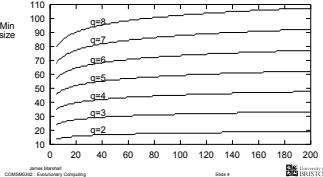

Population Size

I The number of chromosomes in the population is a very important bparameter for GA performance Too small a population Emits variability for the GA to act on I Too large a population is inefficient due to extra computation   
I Normally the population size is constant during a GA run   
I So how to choose an optimal population size a priori?   
I Alternatively, what is the minimum population size for meaningful search?

# Minimum Population Size

I Basic idea is to ensure every point in search space should be reachable from initial population using crossover only I Repeated application of crossover can achieve this.. y  all pnt   l  t ouation

I Assuming an initial binary chromosome population uniformly randomly sampled with replacement we can

I calculate the probability at least one allele of every locus is present in the initial population

$$
P _ { 2 } ^ { * } - \left( 1 - \left( { \frac { 1 } { 2 } } \right) ^ { N - 1 } \right) ^ { \ell }
$$

I approximate the minimum population size needed to achieve an arbitrarily large such probability P∗ < 1

$$
N \approx \left\lceil 1 + \log _ { 2 } \left( \frac { - \ell } { \ln P _ { z } ^ { * } } \right) \right\rceil
$$

Exercise: Prove the approximation of N given above

I For higher cardinality alphabets we can perform numerical approximations of minimum population size...

# Minimum Population Size

Compare minimum population size for P  99 9 with minimum ∗2population size for P∗  99 9 , for q 2

I Binary encoded chromosome will be 3-times longer than corresponding 8-ary encoded chromosome I However the minimal population size for an 8-ary chromosome of length is approximately 6 times that for a binary chromosome of length 3

I Other things being equal, it seems that binary encoding is computationally cheaper, due to the reduced population size requir

I This will be interesting when we look at one of Holland’s claims arising from schema theory, later in the course

# Population Initialisation

I The calculations just examined explain why relatively small randomly initialised populations can be sufficient and give guidelines when selecting population size

I Are there any better ways to generate an initial population?

I One proposal is to seed the initial population with good quality solutions (possibly found using other optimisation approaches)

This is termed inoculation   
I Surveys have shown it can lead to premature convergence and is often outperformed by random initialisation

I Or, we could engineer a random initialisation algorithm that guarantees each allele appears at each locus at least once...

# Population Initialisation

I By generalising Latin hypercube sampling we can ensure each of the q alleles appears at each locus a desired number of times A Latin square is a square grid of sample positions in which each row and each column only contains one sample I A hypercube is a high-dimensional geometric cube We will make use of these later in the course, particularly when looking at schema theory

Data: k — number of copies of each allele required per locus

population size $N = q * k ;$ ;   
for $I = 0$ to \` 1 do −  generate random permutation on integer sequence [0, . . . , N 1]; for $j = 0$ to N - 1 do −  t position i of permutation; ←   locus l of chromosome i t mod k; end   
end

# Selection

I A fitness proportional selection operator comprises two phases

I Calculation of population members’ expected (fractional) numbers of offspring Copversion of expected numbers of offspring into discrete numbers

I Roulette wheel selection (RWS) achieves this by

I Allocating share of roulette wheel to individuals based on fitness relative to total population fitness I Allocating reproductive opportunities by repeated ‘spins’ of the wheel

# Selection

It is important to analyse the actual behaviour of selection operators

I Three measures of ‘performance’ are

I The absolute difference between expected number of offspring per selection and actual sampling probability   
I I.e. the accuracy of the selection process

I The range of numbers of actual offspring an individual may receive in ageneration I I.e. the precision of the selection process

I The time complexity of the selection process (ideally linear or better) I Also, optionally, the scope for parallelisation of the selection operator

#

I The absolute difference between expected number of offspring per selection and actual sampling probability   
The theoretical minimum is zero bias, i.e. no difference whatsoever   
I Definition: the expected number of offspring individual i receives in a generation (or expected value) is $E ( s _ { i } )$   
A selection operator has zero bias if. selecting n individuals for reproduction per generation and for all individuals i having sampling probability $P ( i ) , E ( s _ { i } ) = n P ( i )$   
I RWS with replacement, as described in the Simple GA, has zero bias

# Spread

I The range of numbers of actual offspring an individual may receive in a generation

Definition: A selection operator has minimum spread if, for all individuals i and for each generation, the number of offspring allocated to that individual is always $\mathfrak { s } _ { i } \in \{ | E ( \mathfrak { s } _ { i } ) | , | E ( \mathfrak { s } _ { i } ) | \}$ i ∈ {bI RWS with replacement has unlimited spread

It is possible that one individual is allocated all the reproductive opportunities in any generation   
I Matters can be improved by sampling with replacement, and other strategies, but with an impact on bias

# Efficiency

I Computational efficiency is crucial for any algorithm   
I Selection constitutes a large proportion of the computation in a genetic algorithm   
I Ideally we would like the selection operator to be $O ( N )$ or better   
RwS works by searching an array of values (the 'spokes' on the wheel) for an adjacent pair that another value (the ‘pointer’ of the wheel) falls between I Using binary search we can do this in O(log N) time I In a generational GA the number of selections we must perform will vary as a function of N I Hence the overall complexity of RWS in a generational GA is O N log N   
I Parallel GAs are infrequently used, but an interesting idea, so parallelisation potential of an algorithm is also worth examining I RWS with replacement can be executed in full parallel, as separate 'spins' are independent

# Roulette Wheel Selection Summarised

# Stochastic Universal Sampling

I Has zero bias   
I Has unlimited spread   
I Has O(N log N) complexity   
I Can be fully parallelised (after computation of individuals’ expected values)

I Is RWS the best selection operator possible?

A simple and elegant modification of RwS gives Stochastic Universal Sampling (SUS) I Instead of a single pointer spun multiple times.. I ... we have multiple, equally spaced pointers on a wheel that we spin once To avoid positional bias we must shuffle the population before each spin, which can he done in O(N) time ( )  I We then traverse the array of expected values performing the selections, again in O N time

( ) I SUS has some nice properties

Zero bias (as does RWS) I Zero bias (as does RWS) I O(N) time complexity (c.f. O(N log N) for RWS)

SUS cannot be parallelised, unlike RWS, but note that its time complexity is better   
I Theoretically SUS is superior, corresponding to systematic random sampling   
I SUS has also been empirically demonstrated to give better results

# Fitness Scaling

I Clearly relative fitness is crucial for fitness proportional selection

I Absolute fitness difference has little meaning   
Consider the difference between fitnesses of 2 and 4, and between 12 and 14   
An individual of fitness 4 wl be twice as likely to be selected unde SUS/RwS than an individual of fitness 2   
An individual of fitness 14 is only 1.167 time more likely to be selected than an individual of fitness 12

I Hence taking fitness directly from the objective value of an individual is problematic

I As the genetic search progresses, the objective values of individuals in the population will tend to increase and to become closer to each other

James Marshall

# Fitness Scaling

# Rank Based Selection

# Linear Rank Selection

I Goldberg proposed a simple linear transformation to scale fitness f from objective value g as

$$
\begin{array} { r } { f = a g + b , } \end{array}
$$

where a and b are such that

$$
\overline { { f } } = \overline { { g } }
$$

and maximum fitness

$$
\scriptstyle f _ { m a x } = \phi ^ { \bar { \epsilon } }
$$

for constant φ

I Note that constant rescaling is needed as the search progresses

I Instead of fitness proportional selection we can base selection on relative fitness

I Selection probablities are based on individuals’ fitness-based ranking

For linear ranking, the th ranked individual in the population has selection probability

$$
P ( i ) = \alpha + \beta i
$$

where and $\beta$ are positive constants

N.B, we assume that the fittest individual is rank N and the least fit rank 1

I Note tha $P ( i )$ is part of a probability distribution, hence

$$
\sum _ { i = 1 } ^ { n } ( \alpha + \beta i ) = 1 \implies N \left( \alpha + \beta \frac { N + 1 } { 2 } \right) = 1
$$

I This constrains the values that α and β may take

In general, we define the selection pressure exerted by a selection operator to be

$$
\phi = \frac { P ( \mathit { t t t e s t } ) } { P ( \mathit { a v e r a g e } ) }
$$

I N.B. this formalises the φ in fitness scaling

I For linear ranking, interpreting average fitness as median fitness (or equivalently as average probability of selection)

$$
\phi = \frac { \alpha + \beta N } { \alpha + \beta \frac { ( N + 1 ) } { 2 } }
$$

I So for given $\phi$

$$
\alpha = \frac { 2 N - \phi ( N + 1 ) } { N ( N - 1 ) } , \beta = \frac { 2 ( \phi - 1 ) } { N ( N - 1 ) }
$$

I Hence 1 φ 2

# Efficiency of Linear Rank Selection

I Selection under rank-based selection can be done very efficiently   
We simply need to solve αi + β i(i + 1) = for i, where r is a uniform random variable in [0, 1)   
I This can be done in constant time $( O ( 1 )$ vs. ${ \cal O } ( \log N )$ for fitness-proportional selection)   
I However fitness ranking clearly requires the population to be sorted, which is O(N log N) for each new generation

# Tournament Selection

I Another rank-based selection operator is tournament selection   
I A set of τ randomly selected individuals is compared and the fittest selected for reproduction   
I In a generational GA, a complete selection cycle generates N new individuals, hence the expected number of times an individual is compared is   
I The best individual will be selected every time it is compared, so P(fittest) $= \uparrow$   
I The median individual is selected if every other individual in the set is worse, so P(average) $\mathbf { \Sigma } _ { 1 } = \left( \frac { 1 } { 2 } \right) ^ { \tau - 1 }$   
2 I Hence the selection pressure is ${ \phi } = 2 ^ { \tau - 1 }$   
I Tournament selection is approximately the same as geometric ranking $P ( i ) = \alpha \beta ^ { i }$

$$
\beta = \left( \frac { N } { N - 1 } \right) ^ { \tau }
$$

# Tournament Selection

I One interesting feature of tournament selection is we no longer require an objective function   
I As tournaments are settled based on comparisons we can have a subjective function   
We can also implement soft tournament selection I The best individual only wins the tournament with probability 0 5 p 1, otherwise the other individual wins (for 2)   
Soft tournament selection with $\tau = 2$ gives the same selection probabilities and pressure as linear ranking   
Exercise: Given the selection probability formula for soft tournament selection with $\tau = 2$ , demonstrate that this selection method is equivalent to linear ranking selection by deriving expressions for α and in terms of p. Confirm that these expressions are correct by deriving φ in terms of p in both.

# Variance in Tournament Selection

There is no guarantee in tournament selection that every individual will be selected for a tournament in a selection cycle.. ...similarly the maximum number of times an individual might be selected for a tournament in a selection cycle is only bounded by the number of tournaments   
I This can be solved very simply using the following approach I Generate random permutations of the numbers 1 N and concatenate into one string Chop concatenated string up into N strings of length , each of which indicates the individuals to compete in a single tournament I N.B. N should be an exact multiple of τ for this approach to work most simply