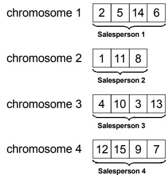
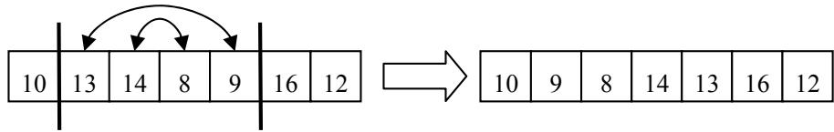
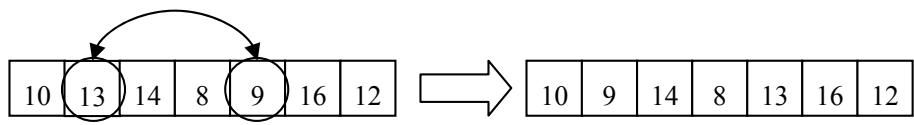
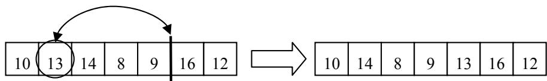
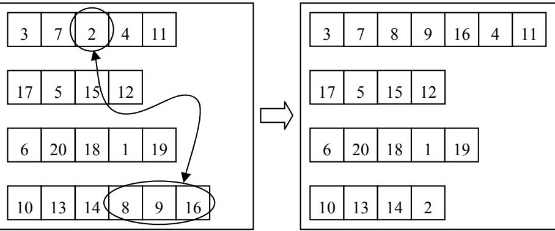
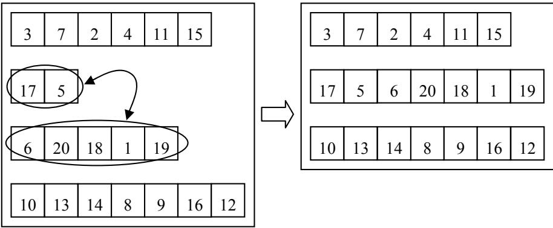
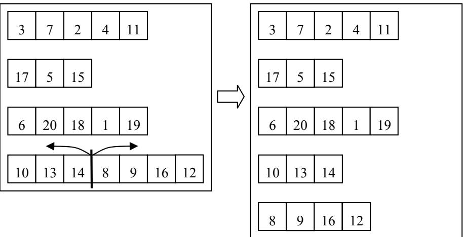
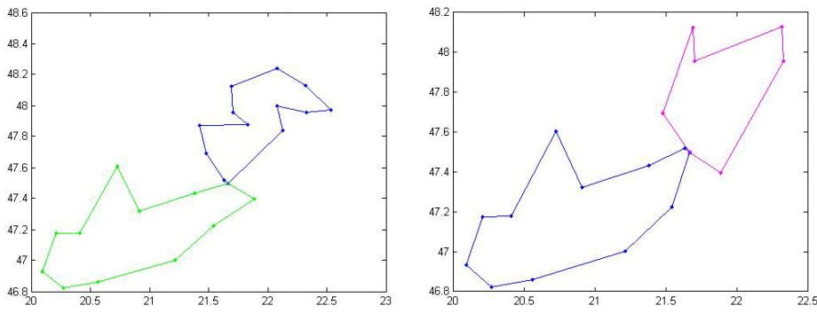
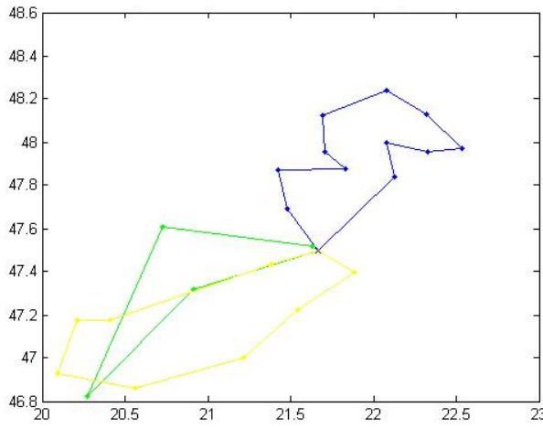

# Optimization of Multiple Traveling Salesmen Problem by a Novel Representation based Genetic Algorithm

András Király, János Abonyi

Department of Process Engineering, University of Pannonia, P.O. Box 158. H8200 Veszprém, Hungary, e-mail: kandras85@gmail.com

Abstract: The Vehicle Routing Problem (VRP) is a complex combinatorial optimization problem that can be described as follows: given a fleet of vehicles with uniform capacity, a common depot, and several costumer demands; find the set of routes with overall minimum route cost which service all the demands. The multiple traveling salesman problem (mTSP) is a generalization of the well-known traveling salesman problem (TSP), where more than one salesman is allowed to be used in the solution. It is well-known that mTSP-based algorithms can also be utilized in several VRPs by incorporating some additional site constraints. The aim of this chapter is to review how genetic algorithms can be applied to solve these problems and to propose a novel, interpretable representation based algorithm. The elaborated heuristic algorithm is demonstrated by examples considering different round tour types determination of further tasks for optimal operation of the distribution system for instance the modification of the vehicle capacity, and the effects of change of cost elements and data structure.

Keywords: mTSP, VRP, genetic algorithm, multi-chromosome, optimization

# 1 Introduction

The aim of logistics is to get the right materials to the right place at the right time, while optimizing a given performance measure (e.g. minimizing total operating costs) and satisfying a given set of constraints (e.g. time and capacity constraints). In most distribution systems goods are transported from various origins to various destinations. For example, many retail chains manage distribution systems in which goods are transported from a number of suppliers to a number of retail stores. It is often economical to consolidate the shipments of various origindestination pairs and transport such consolidated shipments in the same truck at the same time. There are many ways in which such consolidation can be accomplished. In this paper tools developed for Vehicle Routing Problem (VRP)

A. Király et al.

Optimization of Multiple Traveling Salesmen Problem by a Novel Representation based Genetic Algorithm

related to the optimization of one to many distribution systems will be studied, and a novel genetic algorithm based solution will be proposed.

The multiple traveling salesman problem (mTSP) [4] is a generalization of the well-known traveling salesman problem (TSP) [13], where one or more salesman can be used in the solution. Because of the fact that TSP belongs to the class of NP-complete problems, it is obvious that mTSP is an NP-hard problem thus it's solution require heuristic approach.

In the case of mTSP, ambiguous number of cities exist and all of the cities must be visited exactly once by the salesmen who all start and end at the depot. The number of cities is denoted by $n$ and the number of salesman by m . In this paper the single depot case is studied, where all salesman start from and end their tours at a single point. The number of salesmen is assumed to be known a priori, but it is bounded based on the maximal size of the fleet of vehicles. Since the number of salesmen is not fixed, each salesman has an associated fixed cost incurring whenever is used in the solution. This results in the minimization of the number of salesman to be activated in the solution. Time windows are often incorporated to the mTSP (referred as mTSPTSW), where it is also defined that certain nodes need to be visited in specific time periods. In the studied case only the time-length of the tours are constrained, which is almost identical constraint defined on the maximum distance a salesman can travel.

The main goal is to minimize the total traveling cost of the above problem that is often formulated as assignment based integer linear programming [4]:

$$
\operatorname* { m i n } \sum _ { i } ^ { n } \sum _ { j } ^ { n } c _ { i j } x _ { i j } + m c _ { m }
$$

so that

$$
\begin{array} { l } { \displaystyle \sum _ { j = 2 } ^ { n } x _ { 1 j } = m } \\ { \displaystyle \sum _ { j = 2 } ^ { n } x _ { 1 i } = m } \\ { \displaystyle \sum _ { j = 2 } ^ { n } x _ { \beta i } = \sum _ { \ell = 1 } ^ { n } x _ { \ell i } = \sum _ { \ell = 1 } ^ { n } x _ { \ell i } = \sum _ { \ell = 1 } ^ { n } x _ { \ell i } = \sum _ { \ell = 1 } ^ { n } x _ { \ell i } = \sum _ { \ell = 2 } ^ { n } x _ { \ell i } = \sum _ { \ell = 1 } ^ { n } x _ { \ell i } = \sum _ { \ell = 1 } ^ { n } x _ { \ell i } = \sum _ { \ell = 1 } ^ { n } x _ { \ell i } = \sum _ { \ell = 1 } ^ { n } x _ { \ell i } = \sum _ { \ell = 1 } ^ { n } x _ { \ell i } = \sum _ { \ell = 2 } ^ { n } x _ { \ell i } = \sum _ { \ell = 1 } ^ { n } x _ { \ell i } = \sum _ { \ell = 1 } ^ { n } x _ { \ell i } = 0 } \\ { \displaystyle \sum _ { j = 1 } ^ { n } x _ { \ell i } = \sum _ { \ell i } x _ { \ell i } = \sum _ { \ell i } x _ { \ell i } = \sum _ { \ell i } x _ { \ell i } = \sum _ { \ell i } x _ { \ell i } = \sum _ { \ell i } x _ { \ell i } = 0 . } \end{array}
$$

+subtour elimination constraints

where $x _ { i j } \in \{ 0 , 1 \}$ is a binary variable used to represent that an arch is used on the tour, $c _ { i j }$ is the cost associated to the distances between the $i$ th and $j$ th nodes, and $c _ { m }$ represents the cost of the involvement of one salesmen.

# 2 Literature Review

In the last two decades the traveling salesman problem received quite big attention, and various approaches have proposed to solve the problem, e.g. branchand-bound [9], cutting planes [18], neural network [5] or tabu search [12]. Some of these methods are exact algorithms, while others are near-optimal or approximate algorithms. The exact algorithms use integer linear programming approaches with additional constraints.

The mTSP is much less studied like TSP. [4] gives a comprehensive review of the known approaches. There are several exact algorithms of the mTSP with relaxation of some constraints of the problem, like [10], and the solution in [2] is based on Branch-and-Bound algorithm.

Due to the combinatorial complexity of mTSP, it is necessary to apply some heuristic in the solution, especially in real-sized applications. One of the first heuristic approach were published by Russell [22] and an other procedure is given by Potvin et al. [15]. The algorithm of Hsu et al. [6] presented a Neural Networkbased solution.

More recently, genetic algorithms (GAs) are successfully implemented to solve TSP [11]. Potvin presents a survey of GA approaches for the general TSP [21].

# 2.1 Genetic Algorithms for mTSP

Lately GAs are used for the solution of mTSP too. The first result can be bound to Zhag et al. [25]. Most of the work on solving mTSPs using GAs has focused on the vehicle scheduling problem (VSP) ([17], [19]). VSP typically includes additional constraints like the capacity of a vehicle (it also determines the number of cities each vehicle can visit), or time windows for the duration of loadings. Recent application can be found in [16], where GAs were developed for hot rolling scheduling. It converts the mTSP into a single TSP and apply a modified GA to solve the problem. You et al. [26] use GAs to solve the mTSP in path planning.

A new approach of chromosome representation, the so-called two-part chromosome technique can be found in [7] which reduces the size of the search space by the elimination of redundant solutions. In the literature there can be found several examples that a good problem-specific representation can

A. Király et al.

Optimization of Multiple Traveling Salesmen Problem by a Novel Representation based Genetic Algorithm

dramatically improve the efficiency of genetic algorithms. A problem-specific individual design can reduce the search-space, and with special representation it is needed to implement special operators which can simulate the nature of the problem. These properties can make the problem-specific genetic algorithm more effective for the given task and it becomes more easily interpretable. The representation discussed here is very similar to the characteristic of mTSP.

# 3 The Proposed GA-based Algorithm to Solve the mTSP

GAs are relatively new global stochastic search algorithms which based on evolutionary biology- and computer science principles [14]. Due to the effective optimization capabilities of GAs [3], it makes these technique suitable solving TSP and mTSP problems.

# 3.1 Problem Representation

There are several representations of mTSP, like one chromosome technique [25], the two chromosome technique [17, 19] and the latest two-part chromosome technique [7]. The new approach presented here is a so-called multi-chromosome technique which will be discussed below. This approach is used in notoriously difficult problems to decompose complex solution into simpler components. It was used in mixed integer problem [20] or in order problems [1]. A usage of routing problem optimization can be seen in [23] and a lately solution of a symbolic regression problem in [8]. This paper discusses the usage of multichromosomal genetic programming in the optimization of mTSP.

  
Figure 1 illustrates the new chromosome representation for mTSP with 15 locations ( $n = 1 5$ ) and with 4 salesmen ( $m = 4$ ).   
Figure 1 Example of multi-chromosome representation for ${ \mathfrak { n } } = 1 5$ and $\mathrm { m } = 4$

The figure above illustrates an individual of the population. Each individual represents a solution of the problem. The first chromosome represents the first salesman itself so each gene denotes a city (depot is not presented here, it is the first and the last station of each salesman). This encoding is so-called permutation encoding. It can be seen in the example that salesperson 1 visits 4 cities: city 2,5,14 and 6, respectively. In the same way, chromosome 2 represents salesperson 2 and so on.

# 3.2 Operators

Because of our new representation, implementation of new genetic operators became necessary, like mutation operators. Only an overview of the operators are given in this subchapter.

There are two sets of mutation operators, the so-called In-route mutations and the Cross-route mutations. In-route mutation operators work inside one chromosome. The first operator chooses a random subsection of a chromosome and inverts the order of the genes inside it (Figure 2). The second operator reverses two randomly chosen genes in the given chromosome (Figure 3) and the third put a randomly chosen gene into a given place as it can be seen in Figure 4.

  
Figure 2

In-route mutation – gene sequence inversion

  
Figure 3

In-route mutation – gene transposition

  
Figure 4

A. Király et al.

Optimization of Multiple Traveling Salesmen Problem by a Novel Representation based Genetic Algorithm

Cross-route mutation operates on multiple chromosomes. If we think about the distinct chromosomes as individuals, this method could be similar to the regular crossover operator. Figure 5 illustrates the method when randomly chosen subparts of two chromosomes are transposed. If the length of one of the chosen subsections is equal to zero, the operator could transform into an interpolation.

  
Figure 5 Cross-route mutation – gene sequence transposition

On Figure 6 it can be seen a contraction of two chromosomes. In this situation the number of routes in the newly created individual is decreased by one.

  
Figure 6

Cross-route mutation – chromosome contraction

Figure 7 illustrates the inverse operation of chromosome contraction. In this case a single chromosome is partitioned into two new chromosomes in the newly created individual, thus the number of salesmen is incremented by one.

  
Figure 7 Cross-route mutation – chromosome partition

# 3.3 Genetic Algorithm

Every genetic algorithm starts with an initial solution set consists of randomly created chromosomes. This is called population. The individuals in the new population are generated from the previous population’s individuals by the predetermined genetic operators. The algorithm finishes if the stop criteria is satisfied.

Obviously for a specific problem it is a much more complex task, we need to define the encoding, the specific operators (see also in previous chapter) and selection method.

# 3.3.1 Fitness Function

The fitness function assigns a numeric value to each individual in the population. This value define some kind of goodness, thus it determines the ranking of the individuals. The fitness function is always problem dependent.

In this case the fitness value is the total cost of the transportation, i.e. the total length of each round trip. The fitness function calculates the total length for each chromosome, and summarizes these values for each individual. This sum is the fitness value of a solution. Obviously it is a minimization problem, thus the smallest value is the best.

A. Király et al.

Optimization of Multiple Traveling Salesmen Problem by a Novel Representation based Genetic Algorithm

# 3.3.2 Selection

Individuals are selected according to their fitness. The better the chromosomes are, the more chances to be selected they have. The selected individuals can be presented in the new population without any changes (usually with the best fitness), or can be selected to be a parent for a crossover. We use the so-called tournament selection because of its efficiency.

In the course of tournament selection, a few (tournament size, min. 2) individuals are selected from the population randomly. The winner of the tournament is the individual with the best fitness value. Some of the first participants in the ranking are selected into the new population (directly or as a parent).

# 3.4 Complexity Analysis

Using the multi-chromosome technique for the mTSP reduces the size of the overall search space of the problem. Let the length of the first chromosome be $k _ { 1 }$ , let the length of the second be $k _ { 2 }$ and so on. Of course $\sum _ { i = 1 } ^ { m } k _ { i } = n$ . Determining the genes of the first chromosome is equal to the problem of obtaining an ordered subset of $k _ { 1 }$ element from a set of $n$ elements. There are $\frac { n ! } { ( n - k _ { 1 } ) ! }$ distinct assignment. For the second chromosome this number is $\frac { ( n - k _ { 1 } ) ! } { ( n - k _ { 1 } - k _ { 2 } ) ! }$ and so on. So the total search space of the problem can be formulated as equation (7).

$$
{ \frac { n ! } { ( n - k _ { 1 } ) ! } } * { \frac { ( n - k _ { 1 } ) ! } { ( n - k _ { 1 } - k _ { 2 } ) ! } } * \ldots * { \frac { ( n - k _ { 1 } - \ldots - k _ { m - 1 } ) ! } { ( n - k _ { 1 } - \ldots - k _ { m } ) ! } } = { \frac { n ! } { ( n - n ) ! } } = n !
$$

It is necessary to determine the length of each chromosome too. It can be represented as a positive vector of the lengths $( k _ { 1 } , k _ { 2 } , . . . , k _ { m } )$ that must sum to $n$ . There are $\begin{array} { r } { \left( { n - 1 } \atop { m - 1 } \right) } \end{array}$ distinct positive integer-valued vectors that satisfy this requirement [24]. Thus, the solution space of the new representation is $n ! { \binom { n - 1 } { m - 1 } } .$ It is equal with the solution space in [7], but this approach is more similar to the characteristic of the mTSP, so it can be more problem-specific therefore more effective.

# 4 Illustrative Example

Although the algorithm was tested with a big number of problems, only two illustrative results is given in this article. The algorithm has implemented in MATLAB, tiny refinements in constraints are in progress.

Figure 8 below illustrates the result of the optimization with 19 (right) and 25 (left) cities. It results that 2 salesmen is the optimal for this problem in both cases. In this test issue, the maximal route length was 500 kilometers and the maximal traveling duration was 9 hours. The resulted 2 tour with 19 cities were $4 2 5 \mathrm { k m }$ and $2 9 8 ~ \mathrm { k m }$ long, the durations were 501 minutes and 366 minutes, respectively. These values were $3 4 6 ~ \mathrm { k m }$ , $4 5 6 ~ \mathrm { k m }$ and 430 minutes, 539 minutes with 25 cities respectively.

  
Figure 8   
Illustrative result of the optimization $^ { - 2 5 }$ and 19 cities

The second example on Figure 9 illustrates the result of the optimization with 25 cities and with $4 5 0 \mathrm { k m }$ maximal route length constraint. It results that 3 salesmen is the optimal for this problem. The resulted 3 tour were 360, 357 and 390 kilometers long, respectively. It can be seen that the approach is more sensitive for the length of the tours than the number of cities.

In every case, the running time was between 1 and 2 minutes. The genetic algorithm has made 100 iterations, because experiences have shown that this number is sufficient for the optimization.

A. Király et al.

Optimization of Multiple Traveling Salesmen Problem by a Novel Representation based Genetic Algorithm

  
Figure 8

Illustrative result of the optimization $- 4 5 0 \mathrm { k m }$ maximal route length

Obviously the algorithm is highly sensitive for the number of iterations. The running time is directly proportional to the iteration number, but the resulted best solution can’t get better after a specific time. If the constraints become tighter, the duration time will increase slightly. With 500 maximal tour lengths, it is about 90 seconds, and with 450 it is about 110 seconds. The maximal tour length (or equivalently the maximal duration per tour) has a big effect of the number of salesman needed. The tighter the constraints are, the bigger the number of salesman we need. However narrower restrictions forth more square round trips.

# Conclusions

In this paper a detailed overview was given about the application of genetic algorithms in vehicle routing problems. It has been shown that the problem is closely related to the multiple Traveling Salesman Problem. A novel representation based Genetic algorithm has been developed to the specific one depot version of mTSP. The main benefit is the transparency of the representation that allows the effective incorporation of heuristics and constrains and allows easy implementation. After some final touches, the supporting MATLAB code will be also available at the website of the authors.

# Acknowledgement

The financial support from the TAMOP-4.2.2-08/1/2008-0018 (Élhetőbb környezet, egészségesebb ember - Bioinnováció és zöldtechnológiák kutatása a Pannon Egyetemen, MK/2) project is gratefully acknowledged.

# Список литературы

[1] Applying the genetic algorithm with multi-chromosomes to order problems. Proceedings of the Annual Conference of JSAI, 13:468–471, 2001   
[2] Ali AI and Kennington JL. Exact solution of multiple traveling salesman problems. Discrete Applied Mathematics, 13:259–276, 1986   
[3] T. Back. Evolutionary algorithms in theory and practice: evolution strategies, evolutionary programming, genetic algorithms. Oxford University Press, 1996   
[4] Tolga Bektas. The multiple traveling salesman problem: an overview of formulations and solution procedures. Omega, 34:209–219, 2006   
[5] S. Bhide, N. John, and MR Kabuka. A Boolean Neural Network Approach for the lIaveling Salesman Problem. IEEE Transactions on Computers, 42(10):1271, 1993   
[6] Hsu C, Tsai M, and Chen W. A study of feature-mapped approach to the multiple travelling salesmen problem. IEEE International Symposium on Circuits and Systems, 3:1589–1592, 1991   
[7] Arthur E. Carter and Cliff T. Ragsdale. A new approach to solving the multiple traveling salesperson problem using genetic algorithms. European Journal of Operational Research, 175:246–257, 2006   
[8] R. Cavill, S. Smith, and A. Tyrrell. Multi-chromosomal genetic programming. In Proceedings of the 2005 conference on Genetic and evolutionary computation, pages 1753–1759. ACM New York, NY, USA, 2005   
[9] G. Finke, A. Claus, and E. Gunn. A two-commodity network flow approach to the traveling salesman problem. Congressus Numerantium, 41:167–178, 1984   
[10] Laporte G and Nobert Y. A cutting planes algorithm for the m-salesmen problem. Journal of the Operational Research Society, 31:1017–1023, 1980   
[11] M. Gen and R. Cheng. Genetic algorithms and engineering design. WileyInterscience, 1997   
[12] F. Glover. Artificial intelligence, heuristic frameworks and tabu search. Managerial and Decision Economics, 11(5), 1990.   
[13] Gregory Gutin and Abraham P. Punnen. The Traeling Salesman Problem and Its Variations. Combinatorial Optimization. Kluwer Academic Publishers, Dordrecht, The Nederlands, 2002   
[14] J. H. Holland. Adaptation in natural and artificial systems. The University of Michigan Press, 1975

A. Király et al.

Optimization of Multiple Traveling Salesmen Problem by a Novel Representation based Genetic Algorithm

[15] Potvin J, Lapalme G, and Rousseau J. A generalized k-opt exchange procedure for the mtsp. INFOR, 21:474–481, 1989 [16] Tang L, Liu J, Rong A, and Yang Z. A multiple traveling salesman problem model for hot rolling scheduling in shangai baoshan iron & steel complex. European Journal of Operational Research, 124:267–282, 2000 [17] C. Malmborg. A genetic algorithm for service level based vehicle scheduling. European Journal of Operational Research, 93(1):121–134,   
1996 [18] P. Miliotis. Using cutting planes to solve the symmetric travelling salesman problem. Mathematical Programming, 15(1):177–188, 1978 [19] Y.B. Park. A hybrid genetic algorithm for the vehicle scheduling problem with due times and time deadlines. International Journal of Productions Economics, 73(2):175–188, 2001 [20] Hans J. Pierrot and Robert Hinterding. Multi-chromosomal genetic programming, volume 1342/1997 of Lecture Notes in Computer Science, chapter Using multi-chromosomes to solve a simple mixed integer problem, pages 137–146. Springer Berlin / Heidelberg, 1997 [21] J.Y. Potvin. Genetic algorithms for the traveling salesman problem. Annals of Operations Research, 63(3):337–370, 1996 [22] Russell RA. An effective heuristic for the m-tour traveling salesman problem with some side conditions. Operations Research, 25(3):517–524,   
1977 [23] S. Ronald and S. Kirkby. Compound optimization. solving transport and routing problems with a multi-chromosome genetic algorithm. In The 1998 IEEE International Conference on Evolutionary Computation, ICEC’98, pages 365–370, 1998 [24] S. Ross. Introduction to Probability Models. Macmillian, New York, 1984 [25] Zhang T, GruverWA, and Smith MH. Team scheduling by genetic search. Proceedings of the second international conference on intelligent processing and manufacturing of materials, 2:839–844, 1999 [26] Yu Z, Jinhai L, Guochang G, Rubo Z, and Haiyan Y. An implementation of evolutionary computation for path planning of cooperative mobile robots. Proceedings of the fourth world congress on intelligent control and automation, 3:2002, 1798-1802