# hristian-Albrechts-Universitat zu Kiel, D-24098 Ki E-mail: haase@bwl.uni-kiel.de

Udo Kohlmorgen $^ 1$ , Hartmut Schmeck $^ 1$ , and Knut HaasE2 $^ 1$ Institut für Angewandte Informatik und Formale Beschreibungsverfahren resent some results of our systematic studies of sions of the island model of genetic algorithms and of variants of th

$2$ Institut fur Betriebswirtschaftslehre Christian-Albrechts-Universität zu Kiel, D-24098 Kiel ressource constrained ro ect sched

In this paper we present some results of our systematic studies of fine-grained parallel versions of the island model of genetic algorithms and of variants of the neighborhood model (also called diffusion model) on the massively parallel computer MasPar MP1 with 16k processing elements. These parallel genetic algorithms have been applied to a range of different problems (e.g. traveling salesperson, c and { more general { evolutionary algorithms are heuristic optimization m on the principle of natural evolution. Their universal applicability and thei mance on a variety of diere

type of algorithm (see e.g. [13] and [21]). If the evolution of a large pop ential solutions is to be investig

# be eas to achieve

31 . While usuall the arallel execution should reserve the functional behaviour of the sequential algorithm, the standard approaches to the parallelization of genetic algorithms lead to new al orithmic structures: In the island model genetic algorithms are executed concurrently on several independent (sub-) populations with the added possibility of exchanging regularly good individuals between neighboring islands cf. 19 , 27 and 31 . to obtain satisfying results in a reasonable amount of time.

Fortunately, genetic algorithms are known to be inherently parallel, i.e. it should be easy to achieve a significant speedup by parallel execution. Nevertheless, there are many different ways of parallelizing genetic algorithms (cf. [9], [12], [14], [23], [26], and [31]). While usually, the parallel execution should preserve the functional behaviour of the sequential algorithm, the standard approaches to the parallelization of genetic algorithms lead to new algorithmic structures:

In the island model genetic algorithms are executed concurrently on several independent (sub-) populations with the added possibility of exchanging regularly good individuals between neighboring islands (cf. [19], [27] and [31]).

everal applications these new algorithmic structures have shown good optimization grained parallel variant: The population is distributed over the processors of a large mesh In this a er we resent some results of our intensive studies of several variants of these arallel enetic al orithms. In articular we im lemented the island model on a massively parallel MasPar MP1

their neighborhoods are obtained naturally by distributing the population over the array (as in the neighborhood model) and by dividing the array into subarrays. In every island, the processing elements of the associated subarray can then be used for the e- cient parallel execution of the genetic operators ([2], [11]). The same machine is used to implement the neighborhood model and to test the suitability of dierent neighborhoods obtained b considerin nei hbors at dierent distances in the ei ht ossible directions of the Mas

The performance of these al orithms has been investi ated with respect to several dierent optimization problems like traveling salesperson, capacitated lot sizing, ressource constrained project schedulin , 
ow shop, and w $1 6 \mathrm { k }$ ouse location problems. We were especially interested, how the number and size of sub populations and the migration rate, intervall, and strategy (for the island model) and the selection strategy and neighborhoods for the neighborhood model in
uence the course of evolution and the quality of the generated solutions. implement the neighborhood model and to test the suitability of different neighborhoods obtained by considering neighbors at different distances in the eight possible directions of the MasPar's X-net.

The Classical Genetic Algorithm different optimization problems like traveling salesperson, capacitated lot sizing, ressource The classical genetic algorithm (cf. [13], [21]) operates on a set of N individuals, also called population. Every individial is a xed length binary sequence (also called chromosome) representing a potential solution of the optimization problem. The quality of the individual is determined by the quality of this solution with respect to the problem's objective function.

# selection method corresponds to the use

other selection methods e.g. based on rank instead of quality or selec $N$ g only the k best individuals for some k (also called elitist strategy). Selected parents are mated randomly and produce one or two children by crossover, the individual is determined by the quality of this solution with respect to the problem's objective function. Quite often this quality is also called fitness, although  genetically the fitness of an individual is a measure of its reproductive strength which can only be determined relative to a population. Based on their relative quality individuals are selected as potential parents to produce offspring for the next generation. The classical selection method corresponds to the use of a roulette wheel where the size of a sector depends on the relative quality of the corresponding individual. There is a variety of other selection methods e.g. based on rank instead of quality or selecting only the $k$ best individuals for some $k$ (also called elitist strategy).

Selected parents are mated randomly and produce one or two children by crossover,

GENERATE initial population EVALUATE individuals the genetic information with some very low probability. A new population is formed by either replacing all the parents with their offspring or by replacing only those having a lower quality.

RECOMBINE parents (by CROSSOVER) MUTATE os

EVALUATE ospring and form new population

thms have been generalized in   
ations (e.g. using integr   
bination SELECT parents RECOMBINE parents (by CROSSOVER) MUTATE offspring EVALUATE offspring and form new population   
UNTIL termination condition satisfied

Obviously, major components of genetic algorithms are inherently parallel: Evaluation, recombination, and mutation may be executed independently on the individuals of a population. If enough processors are available, these operations can be done in constant time, i.e. independent of the size of the population. But this is not true with respect to selection, since a global exchange of information is necessary to determine the relative quality

# quality.

only the variants that we implemented and investigated on the massively parallel MasPar MP1 machine, having 16k processors arranged as a 2-dimensional 128 - 128 torus with additional diagonal interconnections, i.e. every processor has 8 direct neighbors. This interconnection structure is also called X-net. In all our variants of parallel genetic algorithms we consider the comparatively large population of 16,384 individuals, i.e. every individual is associated with a dierent progenetic algorithms by localizing selection. These algorithms differ principally from the classical sequential genetic algorithm, but they seem to have even better optimization quality.

In this paper we shall not give a survey of these different approaches, but present only the variants that we implemented and investigated on the massively parallel MasPar MP1 machine, having $1 6 \mathrm { k }$ processors arranged as a 2-dimensional $1 2 8 \times 1 2 8$ torus with additional diagonal interconnections, i.e. every processor has 8 direct neighbors. This interconnection structure is also called X-net.

In all our variants of parallel genetic algorithms we consider the comparatively large population of 16,384 individuals, i.e. every individual is associated with a different processor.

# The migration str

the size of the islands by activating at migration time only 10% of the processors on the border to the nei hborin islands. parallel MasPar MP1. In our implementation , the population is divided into 1, 4, 16, 64, 256, or 1024 subpopulations by appropriately dividing the grid into subarrays. Therefore, we can easily measure the effect of the number of islands, while the total population size remains constant. In Fig. 1 four islands are sketched having 4096 individuals each. The division into subarrays naturally defines a neighborhood between islands, i.e. every island has four direct neighbors (diagonal interconnections are not considered for migration). The migration strategy varies between sending in one, two, three, or all four directions and between sending every 15, 30, or 50 generations. The migration rate is adjusted to the size of the islands by activating at migration time only $1 0 \%$ of the processors on the border to the neighboring islands.

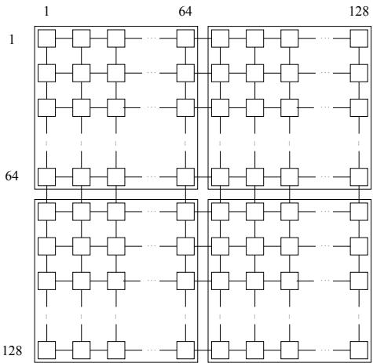  
Figure 1: Four islands with 4096 individuals each

mes, the children compete with their parents to be selected for the new population. The diallel matin scheme is well known in lant breedin but has rarel been used before in genetic algorithms. It has the advantage of explo $n \times n$ the selected gene $O ( n )$ aterial is asymptotially optimal for this interconnection structure.

Two different mating schemes are used for generating a new population on each $n \times n$ subarray. In the classical scheme, $2 \ n ^ { 2 }$ parents are selected and mated randomly to produce $2 \ n ^ { 2 }$ children. Motivated by the array structure we also use a diallel mating scheme: In each $n \times n$ subarray only $n$ parents are selected, either by quality based roulette wheel selection (with an appropriate scaling factor) or just the $n$ best individuals. Afterwards, all possible pairwise crossings are used to produce 2 $n ^ { 2 }$ children. In both schemes, the children compete with their parents to be selected for the new population. The diallel mating scheme is well known in plant breeding but has rarely been used before in genetic algorithms. It has the advantage of exploiting the selected genetic material subpopulations) we use. Some more details of our investigation of this variant of the island m

Obviously, this fine-grained parallel implementation of the island model has several advantages over the standard coarse-grained implementations. Specifically, it is more flexible in adjusting the island structure and it leads to a much larger speedup by parallel In our implementation of the neighborhood model of genetic algorithms, every processor selects a partner for recombination from some local neighborhood by considering neighbors at dierent distances in the eight possible directions of the MasPar's X-net. Specically, the following neighborhoods have been used and tested: islands. Therefore, this problem gets less severe the more islands (and hence the smaller subpopulations) we use. Some more details of our investigation of this variant of the 4-n : Horizontal an

# 3.2 Neighborhood Model

16-n : In all 8 directions neighbors within distance 2.   
17-n : In all 8 directions neighbors within distance 2 plus center.   
24-n : In all 8 directions neighbors within distance 3.   
25-n : In all 8 directions neighbors within

4-n latter are called \missionaries" . m 17- All nei hbors at distance 1 lus center lus 8-n All neighbors at distance 1. 9-n All neighbors at distance 1 plus center. 16-n In all 8 directions neighbors within distance 2. 17-n In all 8 directions neighbors within distance 2 plus center. 24-n In all 8 directions neighbors within distance 3. 25-n In all 8 directions neighbors within distance 3 plus center.   
$( \mathrm { m } ) 1 6 \mathrm { - n }$ All neighbors at distance 1 plus horizontal and vertical neighbors at distance 3 plus diagonal neighbors at distance 8 (the latter are called "missionaries").   
(m)17-n : All neighbors at distance 1 plus center plus horizontal and vertical neighbors at distance 3 plus diagonal neighbors at distance 8 (the latter are called "missionaries").

Figures 2 and 3 show the potential mating partners for neighborhoods 8-n and $1 6 \mathrm { - n }$ respectively. For reproduction, every processor selects one individual from its neighborhood using one of the standard selection strategies (random, quality or rank based roulette wheel, or the best). In addition, a mixed strategy allows an arbitrary choice of the selection strategy at every processor. A detailed description of our investigation of this variant of the neighborhood model is given in [28].

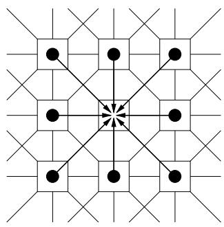  
Figure 2: Mating partner selected out of 8 neighbors

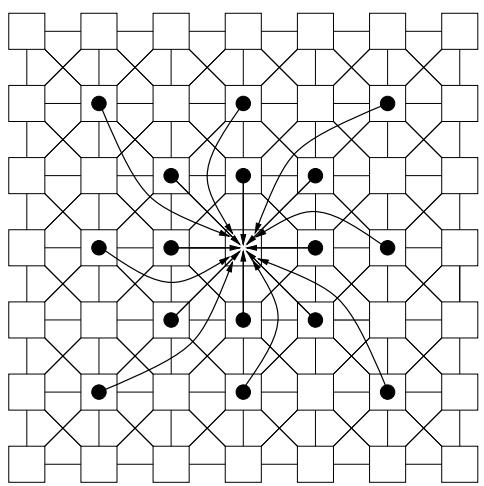  
a ainst the results computed by other approaches.

# netic represent

Our implementations of parallel genetic algorithms have been applied to the optimization problems described below. We chose those problems, since for most of them benchmark instances are available. So we were able to check the results of our implementation of the genetic algorithm against the results computed by other approaches.

• The Traveling Salesperson Problem (TSP): This is probably one of the most thoroughly investigated optimization problems and therefore suggests itself as a benchmark problem for testing the optimization quality of genetic algorithms. As genetic representation we used permutations of cities, i.e. a sequence of numbers.

complex problem havin many dierent practical applications see e. . 8 : A project consistin of n tasks with precedence constraints has to be executed on k machines each with capacity constraints. Every task needs concurrently some capacity and some time o

schedule observing both types of constraints. Instead of a direct genetic representation as a sequence of tasks we used a representation consistin of a set of parameters real values between 0 and 1 for a heuristic scheduling method. These p

• The Resource Constrained Project Scheduling Problem (RCPSP): This is another complex problem having many different practical applications (see e.g. [8]): A project consisting of $n$ p yp ( ) y g $k$ machines each with capacity constraints. Every task needs concurrently some capacity and some time on every machine. The goal is to find a minimum time schedule observing both types of constraints.

Instead of a direct genetic representation as a sequence of tasks we used a representation consisting of a set of parameters (real values between 0 and 1) for a heuristic scheduling method. These parameters (one for each task to be scheduled) alter the values generated by a priority rule (like "latest starting time" or "latest finishing time"). This new approach introduces problem specific knowledge (the heuristic method) into the construction of the phenotype (the schedule). Since every string of real values between 0 and 1 is a valid genotype, we can use the standard genetic The Unca acitated Warehouse Location Problem: The roblem consists of selectin an optimal subset from a given list of warehouses such that the costs of building and maintainin the warehouses and the tran

and customers are minimized. We used a binary representation to indicate the selected locations. The recombination operator was a standard two-point crossover. From a set of benchmark problems given by Beasley [1] we chose the following instances: 50 locations / 50 customers, 100 locations / 500 customers, and 200 locations / 200 customers. known only for the smaller problem instances.

ered in operations research: n jobs have to be scheduled on a xed sequence of m machines. The execution of job i on machine j takes time pij and the goal is to minimize the maximal total execution time of any job. Potential solutions are represented as sequences of job numbers. As for the TSP several recombination operators were tested. In the presented results we use the order crossover (cf. [21]). From a set of benchmark problems given by Beasley [1] we chose the following instances: 50 locations $/ ~ 5 0$ customers, 100 locations $/ ~ 5 0 0$ customers, and 200 locations / 200 customers.

• The Flow Shop Problem: This is another classical optimization problem considered in operations research: n jobs have to be scheduled on a fixed sequence of $m$ machines. The execution of job $i$ on machine $j$ takes time $p _ { i j }$ and the goal is to minimize the maximal total execution time of any job. Potential solutions are represented as sequences of job numbers. As for the TSP several recombination operators were tested. In the presented results we use the order crossover (cf. [21]).

setup cost sj > 0. Setup costs occur for each lot produced in a period (basic assumption). Holding cost hj  0 is incurred for the inventory of item j at the end of a period. The objective is to minimize the cost

eneticall re resented b a strin of real valued arameters $J$ ontrollin a heuristic method for eneratin a feasible roduction schedule. The heuristic is an extension of an approach used by Haase [15]. For recombination we u $T$ standard two-point $t \in \{ 1 , . . . , T \}$ utation slightly changes the $C _ { t }$ etic values. We employed the well known 1 $j$ 0 benchm $p _ { j } ~ > ~ 0$ ances described in [4], where T as well a $j$ J range fro $t$ $d _ { j t } \geq 0$ , has to be satisfied without delay. Setting up the machine for item $j$ causes setup cost $s _ { j } ~ > ~ 0$ . Setup costs occur for each lot produced in a period (basic assumption). Holding cost $h _ { j } ~ \geq ~ 0$ is incurred for the inventory of item $j$ at the end of a period. The objective is to minimize the costs for setups and holding. As for the Resource Constrained Project Scheduling Problem potential solutions are genetically represented by a string of real valued parameters controlling a heuristic is section we present some of our results of testing the dierent variants of parallel ic algorithms on the problems described above. Specically, so far, the island model een tested systematically on the TSP and the RCPSP and the neighborhood model e Warehouse Location Problem and the Flow Shop Prob $T$ m. $J$ range from Furtherm

# 5 Results

In this section we present some of our results of testing the different variants of parallel Figures 4 to 7 show some typical results of our investigation of the island model. In all of the test runs corresponding to these gures we used the diallel mating scheme. Fig. 4 and 5 refer to a TSP with 51 cities and Fig. 6 and 7 to an RCPSP with 6

values are averaged over 4 independent runs of the genetic algorithm. Best results have been obtained whenever all 4 directions have been used for migration (see Fig. 4). Furthermore, Fig. 5 shows that a small migration intervall had positive in
uence on the optimization behaviour

# The use of only o

1024 subpopulations the genetic algorithm was stopped after 600 generations, whereas in the other cases the algorithm terminated before due to convergence. 5 refer to a TSP with 51 cities and Fig. 6 and 7 to an RCPSP with 60 tasks on 4 machines. The values are averaged over 4 independent runs of the genetic algorithm. Best results have been obtained whenever all 4 directions have been used for migration (see Fig. 4). Furthermore, Fig. 5 shows that a small migration intervall had positive influence on the optimization behaviour.

Both figures indicate that it seems to be advantageous to use 64 or 256 subpopulations. The use of only one large population always led to inferior results. The decrease in optimization quality for the largest numbers of islands is due to the fact that for 256 and 1024 subpopulations the genetic algorithm was stopped after 600 generations, whereas in the other cases the algorithm terminated before due to convergence.

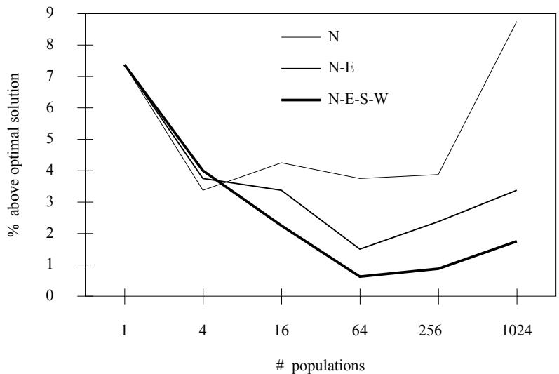  
Figure 4: Influence of the direction of migration on optimization quality (for a TSP with 51 cities)

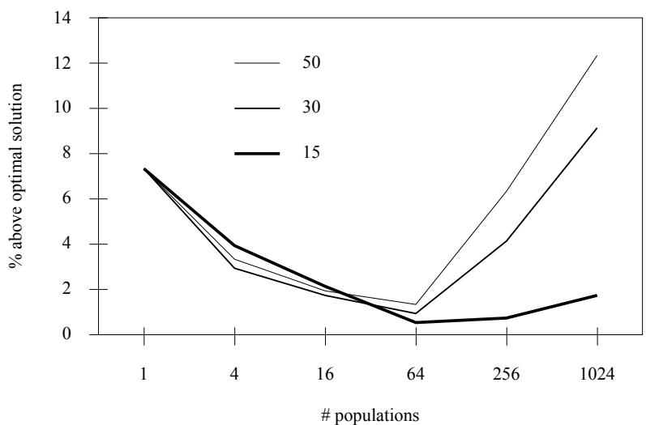  
Figure 5: Influence of the migration intervall on optimization quality (for a TSP with 51 cities)

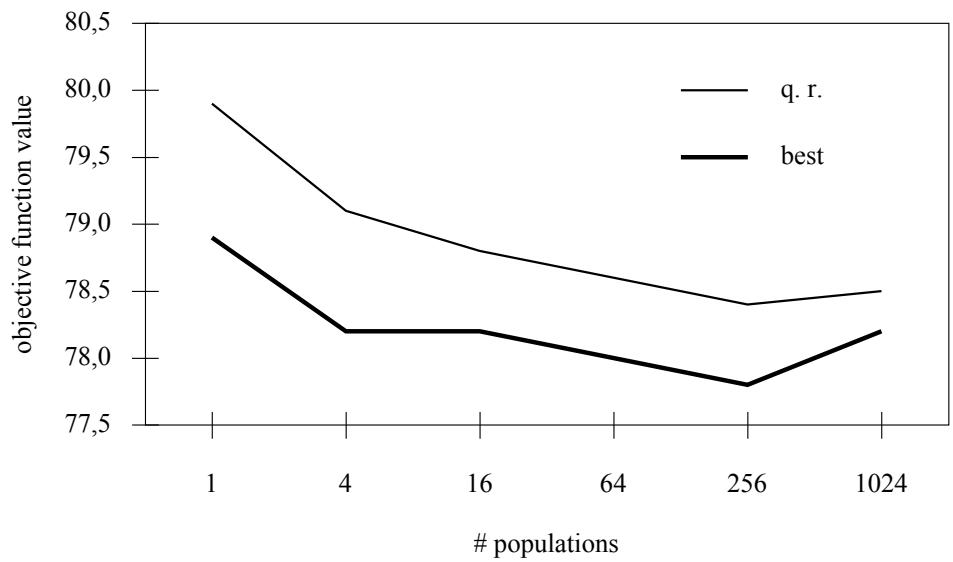  
Figure 6: Comparison of selection strategies: Best versus quality based roulette wheel (for an RCPSP with 60 tasks on 4 machines)

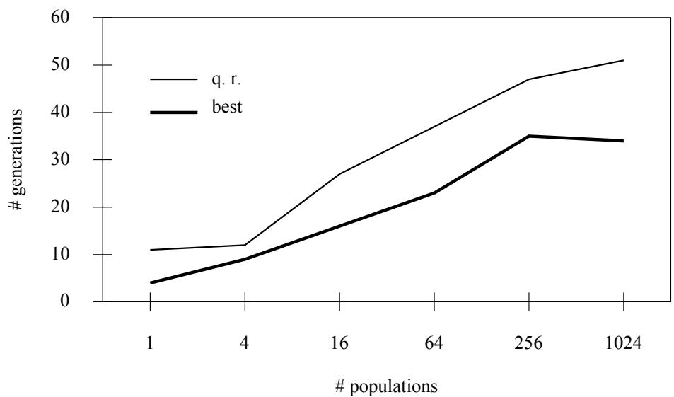  
Figure 7: Influence of selection strategies on the number of generations (for an RCPSP with 60 tasks on 4 machines)

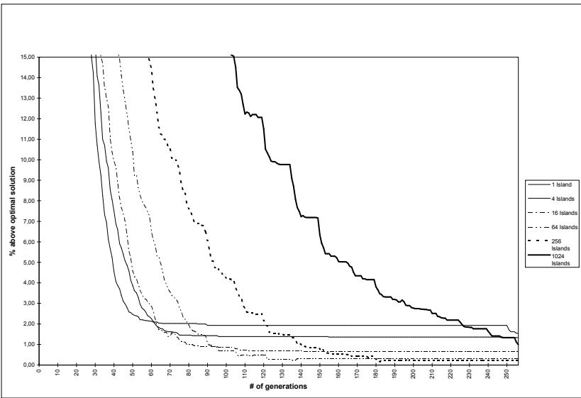  
Figure 8: Evolution of fitness of the best individuals for variants of the island model (for a TSP with 51 cities)

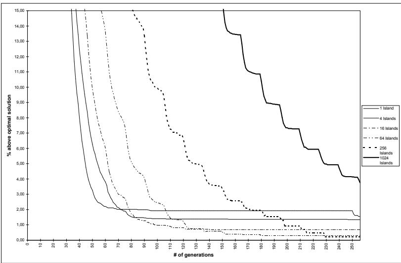  
Figure 9: Evolution of average fitness for variants of the island model (for a TSP with 51 cities)

ce leading to high quality nal solutions. For 1024 islands the rate of convergence is much slower than in all other cases. A comparison of the two gures shows for this case a lar e dierence between the best and the avera e tness in the o ulation. This indicates a high remaining potential for further quality improvement. The gures also before good results are obtained.

The influence of the number of islands on the optimization behaviour is illustrated Overall one ma conclude that the island model is well suited to observe the role of diversication and intensication in the evolutionar o timization rocess: For instance each island mi ht be seen as an intensication in a articular re ion and hence a reat number of islands rovides some diversication in the lobal rocess. That's robabl wh 64 and 256 islands tend to give the best results; here, intensication and diversication seem to be well balanced. For 1024 islands the population in each island might be too small. Furthermore, the elitist selection is a form of intensication while the roulette wheel selection allows more diversity. So, since the diversication is already provided by a large number of islands, the roulette wheel selection looses its main advantage and the elitist strategy

Since the main ur ose of our ex eriments was a com arative evaluation of dierent parallel variants of genetic algorithms, we did not put too much eort in optimizing our algorithms for the particular test problems. Nevertheless, we got remarkably good results. In particular, for the 480 tested instances of the RCPSP with 60 tasks on 4 machines our best solution matched the previously best known result in 342 cases, and for 136 instances the previous upper bound was even improved. small. Furthermore, the elitist selection is a form of intensification while the roulette wheel selection allows more diversity. So, since the diversification is already provided by a large number of islands, the roulette wheel selection looses its main advantage and the For the neighborhood model we

strategy for selecting the partner for reproduction on the optimization performance and on the number of generations. For the Warehouse Location Problem all test runs produced the same optimal solution. Therefore, in Fig. 11 we only give the number of generations needed to nd this solution whereas for the Flow Shop Problem, the best objective function value is given (cf. Fig. 10). Obviously, at least for our variants of ge

# Problem the genetic algo

of the best solution whereas the elitist selection strate called "best" in the  ure was clearly the best, especially for small neighborhoods. and on the number of generations. For the Warehouse Location Problem all test runs produced the same optimal solution. Therefore, in Fig. 11 we only give the number of generations needed to find this solution whereas for the Flow Shop Problem, the best objective function value is given (cf. Fig. 10).

Obviously, at least for our variants of genetic algorithms, the Flow Shop Problem turned out to be much harder than the Warehouse Location Problem. For the Flow Shop Problem the genetic algorithm improved slightly on the upper bound given by Taillard. For this complex problem the neighborhood had only moderate influence on the quality of the best solution, whereas the elitist selection strategy (called "best" in the figure) was clearly the best, especially for small neighborhoods.

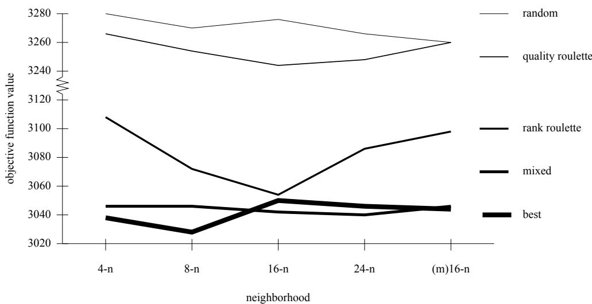  
Figure 10: Influence of selection strategies and neighborhoods on optimization performance (for the Flow Shop Problem with 50 jobs on 10 machines)

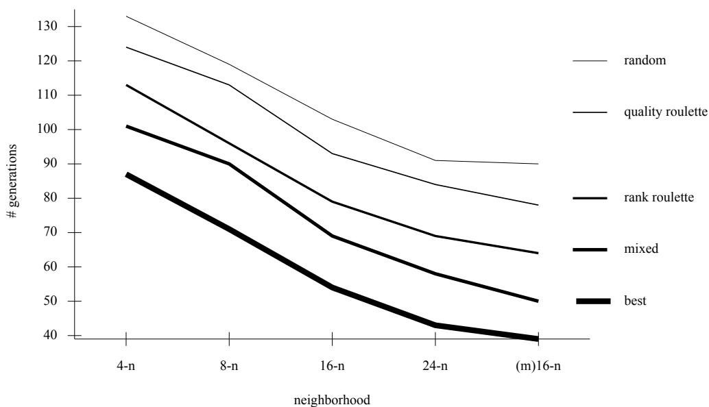  
Figure 11: Influence of selection strategies and neighborhoods on the number of generations (for the Warehouse Location Problem with 200 locations and 200 customers)

problems with 50 items, 8 periods and slightly better for problems with 8 items, 50 periods. For problems with 20 items, 20 periods Kirca and Kokten get better results. But on the average, our results in this category are only 1.44% behind

Table 2 shows the number of problem instances for which each algorithm found the best result of all three algorithms. As shown in [3], our massively parallel genetic algorithm is easily adapted to a slightly dierent CLSP with linked lot-sizes of adjacent periods where it outperformed all other known o timization methods b 5 to 20 ercent. Some of these results are shown in Table 1. $Z ^ { * }$ denotes the best result obtained by the three algorithms. The results indicate that our parallel genetic algorithm is superior for problems with 50 items, 8 periods and slightly better for problems with 8 items, 50 Table 1: Computational results for the CLSP (% deviation from the best solution Z fo $1 . 4 4 \%$ y DS, K

averaged over 40 instances per problem type) best result of all three algorithms.

50 items, 8 periods 1.29 0.65 0.17 20 items, 20 periods 7.55 0.06 1.50 8 items, 50 periods 9.57

Table 1: Computational results for the CLSP $\%$ deviation from the best solution $Z ^ { * }$ found by DS, KK or PGA, averaged over 40 instances per problem type)   

<table><tr><td></td><td>Dixon-Silver</td><td>Kirca-Kökten</td><td>parallel GA</td></tr><tr><td>50 items, 8 periods</td><td>1.29</td><td>0.65</td><td>0.17</td></tr><tr><td>20 items, 20 periods</td><td>7.55</td><td>0.06</td><td>1.50</td></tr><tr><td>8 items, 50 periods</td><td>9.57</td><td>0.99</td><td>0.76</td></tr><tr><td>total average</td><td>6.14</td><td>0.57</td><td>0.81</td></tr></table>

Table 2: Number of best results for the CLSP   

<table><tr><td></td><td>Dixon-Silver</td><td>Kirca-Kökten</td><td>parallel GA</td></tr><tr><td>50 items, 8 periods</td><td>4</td><td>12</td><td>24</td></tr><tr><td>20 items, 20 periods</td><td>0</td><td>37</td><td>3</td></tr><tr><td>8 items, 50 periods</td><td>0</td><td>19</td><td>21</td></tr><tr><td>total number</td><td>4</td><td>68</td><td>48</td></tr></table>

# indicate that the

o timization otential of the variant havin 1024 islands which is relativel close to the nei hborhood model. In order to get more general statements on the quality of parallel genetic algorithms one should apply the dierent parallel models to other problem sizes and other types of problems. It is especially interesting to further compare the performan

lementations of the island and the nei hborhood model. We believe that the ood o timization erformance of our enetic al orithms for the RCPSP and the CLSP is partially due to the genetic representation of potential solutions by a set of parameters controlling a heuristic method to produce feasible solutions. In this way the search process seems to be directed towards more promising regions of the search space. This eect will be subject of further studies. Althou h all our

restricted to this type of architecture. In particular, the island model could as well be implemented on a coarse- rained parallel machine, but with the disadvanta e of a much smaller speedup. The types of neighborhood we used are clearly in
uenced by the X-net interconnection structure of the MasPar MP1, but they coul

er types of architectures. Our results clearly show that a large number of islands is advantageous as long as the size of the subpopulations is not too small. Therefore, in a coarse-grained implementation with only a few processors the number of islands should be higher than the number of processors, i.e. several islands should be simulated on one search space. This effect will be subject of further studies.

It might be advantageous to design new variants of the island model by either dividing the o ulation into islands of dierent sizes or b ad ustin the number and size of the islands d namicall in order to combine the advanta es of hi h enetic diversit and ra id quality improvement. interconnection structure of the MasPar MP1, but they could be implemented as well on other types of architectures. Our results clearly show that a large number of islands is advantageous as long as the size of the subpopulations is not too small. Therefore, in a coarse-grained implementation with only a few processors the number of islands should be higher than the number of processors, i.e. several islands should be simulated on one processor.

It might be advantageous to design new variants of the island model by either dividing the population into islands of different sizes or by adjusting the number and size of the islands dynamically in order to combine the advantages of high genetic diversity and rapid quality improvement.

# Список литературы

We gratefully acknowledge valuable remarks and suggestions of anonymous referees.

# References

[1] J.E. Beasley, An algorithm for solving large capacitated warehouse location problems, EuJ. P. Cohoon S. U. Hed e W. N. Martin and D. Richa   
[2] parallel enetic al orithm, in Proceedings of the Second International Conference on Genetic Algorithms, J. J. Grefenstette ed., Lawrence Erlbaum Associates, 1987, pp.148{154. R. J. Collins and D. R. Jeerson, Selection in massively parallel genetic algorithms, in   
[3] Proceedings of the Fourth International Conference on Genetic Algorithms, R. K. Belew and L. B. Booker eds., Morgan Kaufmann, San Diego CA, 1991, pp.244{248. P.S. Dixon and E.A. Silver, A heuristic solution procedure for multi-item single-level, limited ca acit lot-sizin roblem Journal of O erations Mana ement   
[8] W. Domschke and A. Drexl, Einfuhrung in Operations Research, Springer-Verlag, Berlin, Heidelberg, 1991. D. Du   
[5] and application to NP-complete problem solving in Int. Workshop on Combinatorics and Computer Science, Brest, France, 1995 D. Eichberg, Untersuchung des Insel-Modells Genetischer Algorithmen auf einem   
[6] parallelen Rechner, Diplomarbeit, Institut AIFB, Universitat Karlsruhe, 1996. D. Eichber U. Kohlmor en and H. Schmeck Feinkorni arallele Varianten des InselModells Genetischer Algorithmen, in Mitteilungen - Gesellschaft fur Inf   
[7] Parallel-Algorithmen und Rechnerstrukturen, PARS-Workshop, Stuttgart, Oct. 9-11, 1995, capacity, lot-sizing problem, Journal of Operations Management, (1981) 2339.   
12] T. Fogarty, Implementing the genetic algorithm on transputer based parallel processing systems, in H.P.   
[9] PPSN I, volume 496 of Lecture Notes in Computer Science, Springer-Verlag, Berlin, 1991, and application to NP-complete problem solving in Int. Workshop on Combinatorics and D.E. Goldberg, Genetic Algorithms   
[10] Addison-Wesley, Reading MA, 1989. M. Gor es-Schleuter Ex licit arallelism of enetic al orithms throu h o u   
[11] tures, in Parallel Problem Solving from Nature Schwefel and Manner eds., Springer-Verlag, Berlin, 1991, pp.150{159. K. Haase, Capacitated lot-sizing with linked production quantities of adjacent peroids, Technical   
[16] K. Haase and U. Kohlmorgen, Parallel genetic algorithm for the capacitated lot-sizing problem, in Operations Research Proceedings 1995, P. Kleinschmidt et al. eds., Springer-Verlag, Berlin, 1996, pp.370{375. O. Kirca and   
[13] problem, European Journal of Operational Research, 75 (1994) 332{341. R. Kolisch, A. Sprecher, and A. Dre   
[14] of ressource constrained project scheduling problems, Management Science, Vol. 41, No. 11 tures, in Parallel Problem Solving from Nature Schwefel and Männer eds., Springer-Verlag, Berlin, 1991, pp.150159.   
[15] K. Haase, Capacitated lot-sizing with linked production quantities of adjacent peroids, Technical Report No. 334, Institut für Betriebswirtschaftslehre, Universität Kiel, 1994.   
[16] K. Haase and U. Kohlmorgen, Parallel genetic algorithm for the capacitated lot-sizing problem, in Operations Research Proceedings 1995, P. Kleinschmidt et al. eds., Springer-Verlag, Berlin, 1996, pp.370375.   
[17] Ö. Kirca and M. Kökten, A new heuristic approach for the mult-item dynamic lot sizing problem, European Journal of Operational Research, 75 (1994) 332341.   
[18] R. Kolisch, A. Sprecher, and A. Drexl, Characterization and generation of a general class of ressource constrained project scheduling problems, Management Science, Vol. 41, No. 11 M. Sch   
[19] in Proceedings of the International Conference PACTA, M. Valero et al. eds., IOS Press CIMNE 1992 .195{203. M. Schwehm T   
[20] genetische Algorithmen auf verteilten und massiv parallelen Rechnern, in Mitteilungen - Gesellschaft fur Informatik e.V., Parallel-Algorithmen und Rechnerstrukturen, Workshop Kaufmann, San Mateo CA, 1989, pp.428-433.   
[25] E. Taillard Benchmarks for the basic $+$ hedulin roblems $=$ uro ean Journal of O erational Research, 64 (1993)   
[26] E. G. Talbi and P. Bessire and J. M. Ahuactzin and E. Mazer, Parallel cooperating genetic al orithms in Practical Hand   
[23] CRC Press, 1995, pp.93-109. R. Tanese, Distributed genetic algorithms, in Proceedings of the Third International Conference on Genetic Algorithms, J. D.   
[24] M. Schwehm, Th. Oparterny, and K.-H. Kirsch, Plazierung von Makrozellen durch U. Tempel, Vergleich lokaler Selektionsstratgien fur feinkornig parallele genetische Algorithmen zur Losung von schweren Optimierungsproblemen, Diplomarbeit, Institut AIFB, Universitat Karlsruhe,   
[29] J.M. Thizy and L.N. Van Wassenhove, Lagrangean relaxation for the multi-item capacitated lot-sizin roblem: a heuristi   
[30] L.D. Whitley and T. Starkweather and D'Ann Fuquay, Scheduling problems and traveling salesman: the enetic ed e recombination in Proceedin s o the Third International Conerence on Genetic Al orithm   
[27] R. Tanese, Distributed genetic algorithms, in Proceedings of the Third International ConferL. D. Whitle and T. Starkweather Genitor II: a distributed enetic al orithm Ex t. Theor. Artif   
[28] U. Tempel, Vergleich lokaler Selektionsstratgien für feinkörnig parallele genetische Algorithmen zur Lösung von schweren Optimierungsproblemen, Diplomarbeit, Institut AIFB, Universität Karlsruhe, 1995.   
[29] J.M. Thizy and L.N. Van Wassenhove, Lagrangean relaxation for the multi-item capacitated lot-sizing problem: a heuristic implementation, IIE Transactions, 17 (1985) 308313.   
[30] L.D. Whitley and T. Starkweather and D'Ann Fuquay, Scheduling problems and traveling salesman: the genetic edge recombination, in Proceedings of the Third International Conference on Genetic Algorithms, J.D. Schaffer ed., Morgan Kaufmann, San Mateo CA, 1989, pp.133140.   
[31] L. D. Whitley and T. Starkweather, Genitor II: a distributed genetic algorithm, Expt. Theor. Artif. Intell., 2 (1990) 189214.