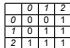

# Inversion

I We have seen variations on the basic operators so far Crossover Mutation   
I Holland’s earliest work included a proposal for a further operator I Inversion   
I Holland implicitly recognised the positional bias of 1X   
I Inversion was his solution, intended to bring co-adapted alleles at distant loci closer together on the chromosome   
I The biological interpretation of the inversion operator is that it maintains linkage disequilibrium due to selection in the face of disruption by crossover I Definition: two loci in a population are in linkage equilibrium if the frequency distribution of alleles at one locus is independent of the frequency distribution of alleles at the other locus

# Inversion

Data $\ell$ — length of chromosome

random integer between 0 and inclusive;   
←       i random integer = i between 0 and \` inclusive;   
2 ←  i i swap i1 and i2;   
end   
enfor $I = j _ { \uparrow }$ to (i + i 1)/2 do 1  b 1  2 − c swap allele and index at locus l with allele and index at locus i + i 1 l;   
end

# Population Selection Schemes

James Marshall COMSM0302 : Evolutionary Computing

# Overlapping Generations and Steady State Selection

I An index is needed for each locus to preserve the meaning of the locus independent of its position on the chromosome   
I Prior to crossover, both parents must be reordered if their ordering is different I Some ordering must then be assigned to the offspring, perhaps randomly selected from one of the parents   
Of course, inversion is redundant with operators such as UX, which do not have any positional bias

We have previously looked at different selection operators Roulette Wheel Selection (RWS) I Stochastic Univeral Sampling (SUS)

These operators all used Holland's original generationa/ selection scheme

I Each iteration of the GA completely replaces the population with the offspring of those selected to reproduce

Other selection schemes exist

I Overlapping Steady state I (λ, µ) and (λ + µ) I Elitism

Under selection let 1 < G < N individuals be selected for replacement   
I These are replaced by G offspring from the reproduction phase   
If 1 < G < N we have overlapping generations   
I G is sometimes referred to as the generation gap   
I Clearly generational selection is a special case of overlapping selection her   
I At the other extreme $G = \uparrow$ I This is sometimes referred to as the steady state GA

$( \lambda , \mu )$ and $( \lambda + \mu )$

# Elitism

# Further Measures of Selection

I Selection schemes from Evolutionary Strategies are also applicable   
I (λ, µ) I λ parents are selected for reproduction I They produce $\mu \geq \lambda$ offspring ≥   I The best λ offspring are selected for the next generation   
I $( \lambda + \mu )$ I As for (λ, µ), except the best individuals for the next generation are selected from the combined set of parents and offspring   
I N.B. $\mu$ here is not the same a $\mu$ for mutation rate

Typical selection and genetic operators do not guarantee that the best individual in the population will be in the next generation

I Fitness proportional, rank and tournament selection may not select the best individual   
I Even if selected, crossover and mutation are likely to destroy the best individual

I Thus the best solution found so far is frequently discarded by the GA

Elitism avoids this by always preserving it in the next generation

I Remaining N 1 individuals are replaced by new strings (assuming a − generational GA)

In the last lecture we saw how to calculate selection probabilities and selection pressure for certain selection schemes

I Linear rank selection Soft tournament selection

I Additional measures of selection for comparison of selection schemes exist

I Selection intensity I Takeover time

Selection Intensity

Selection Intensity

# Takeover Time

I Selection pressure can be directly calculated from the selection probabilities under a particular selection scheme I Selection intensity is a measure taken on the behaviour of a selection scheme

$$
I ( t ) = \frac { \overline { { f } } _ { s e i } ( t ) - \overline { { f } } ( t ) } { \sigma _ { f ( t ) } }
$$

Selection intensity is a post hoc measure of the difference in mean fitness of individuals selected for reproduction, and mean fitness of all individuals in the population

Scaled by population standard deviation to allow meaningful comparison across cases   
Applies only to generational GAs in this form, but elitist and steady state versions have heen derived

I Theoretical results have also been achieved, under the assumption of a normal fitness distribution

Selection can also be measured in terms of the time needed for the best individual to take over the entire population Assuming no crossover and mutation, only selection   
Empirical results can be obtained to compare various selection schemes   
I Theoretical results have been derived that agree well with empirical values I Takeover time for most selection strategies is O(log N) I Takeover time for fitness proportional selection is O(N log N)   
I Takeover time is related to the rate at which diversity is lost through selection

# Diversity Preserving Operators

I Diversity is crucial for any kind of evolution (as we will see in detail later in the course)

I Natural   
Artificial   
Evolutionary computation

I Diversity can be maintained by various strategies

Modified selection / genetic operators I Modified representations I Fitness sharing schemes

I Loss of diversity can be a signal to terminate an evolutionary algorithm

I We can use ‘incest prevention’ to maintain diversity

Prevent crossover between individuals whose similarity les above a threshold   
I Similarity can be measured as the reciprocal of Hamming distance   
I The threshold must be increased as selection results in population convergence

I Individuals are not inserted into the population if they match an individual already in the population I This requires comparing each new individual against every individual already in the population I The naïve approach to this for a generational GA has O(N) time complexity

I We can also force operators to produce novel offspring (i.e. not clones of either parent)   
I E.g. 1X applied to 1101001 and 1100010 will always generate a clone if the crossover point is any of the first three positions   
I We can identify suitable crossover points before applying the crossover operator I For binary chromosomes compute the XOR of the two parents I 0001011 for the example above I Select a crossover point lying between the outermost 1s in the XOR string

# Fitness Sharing

# Fitness Sharing

# Diploidy and Dominance

I We can also maintain diversity through modifying the selection mechanism   
I Fitness sharing, as its name suggests, shares fitness between individuals occupying the same niche Niche is a term from biology denoting a particular set of environmental conditions, to which an organism or organisms may become adapted E.g. herbivores and carnivores are adapted, or specialised, to eat plants and other animals respectively

I A simple linear sharing function such as

$$
h ( d _ { i j } ) = { \left\{ \begin{array} { l l } { 2 - { \frac { d _ { i } } { D } } } & { { \mathrm { i f ~ } } d _ { i j } < D } \\ { 1 } & { { \mathrm { o t b e r w i s e } } } \end{array} \right. }
$$

I is evaluated for all pairs of individuals in the population

I $d _ { \parallel }$ is the distance between individuals i and j ij     I D is a tunable distance threshold

I For every individual j we then compute the sum

$$
{ \mathfrak { g } } = \sum _ { i \neq j } h ( d _ { i j } )
$$

I then divide its raw fitness by to give the adjusted fitness that will be used during selection

I Hence very similar chromosomes (under some distance metric) will have their fitnesses reduced more than unique chromosomes

Care must be taken in choosing the distance metric

I In particular, should it be based on genotypic or phenotypic distance? I E.g. if d were Hamming distance then as we have seen genetically similar individuals can have very different phenotypes, and vice versa

All the representations we have seen in our examples so far allow one allele to occupy each locus

I In biological terminology, this is haploidy

I Haploidy is not typical in nature, diploidy is far more common

I Each locus carries two alleles, which encode for some trait   
Often one allele is dominant over another Eg imagine that for eye colour in humans there are two alleles The brown eye allele is dominant (B), the blue eye allele is recessive (b) I Then the homozygote bb encodes for blue eyes, the homozygote BB and the heterozygotes bB and Bb all encode for brown eyes

I Alleles can also be partially dominant, or additive

# Diploidy and Dominance

I Diploidy and dominance explain the ratio of offspring phenotypes that Mendel discovered

I Intriguingly, for any distribution of phenotypes where the underlying allele frequencies are m and $n = 1 - m$ one generation of random mating without selection results in a stable equilbrium

$$
E ( A A ) = m ^ { 2 } , E ( A a ) = 2 m n , E ( a a ) = n ^ { 2 }
$$

I This is the Hardy-Weinberg equilibrium, from population genetics Exercise: for the genotype frequency ratio p : 2q : r, derive the genotype frequency ratio after one generation of random mating wthout selection

I The equilbrium demonstrates that, in the absence of selection, Mendelian genetics will not result in the spread or disappearance of dominant or recessive alleles

l.e. diploidy is diversity preserving in the absence of selection It was originally thought that dominance would lead to elimination of a recessive allele even in the absence of selection

# Diploidy and Dominance

I Diploidy and dominance are also a diversity preserving technique

I If a dominant trait is fitter that its recessive counterpart(s), alleles for those recessive traits will still be preserved in the population despite negative selection   
I Dominance itself may evolve, so that the fitter trait is necessarily the dominant one   
This could allow an improved evolutionary response to environmental change, where relative fitnesses of traits are reversed

I Hence diploidy and dominance could be useful in GAs

I Particularly in GAs with non-static objective functions

# Diploidy and Dominance

I Dominance and diploidy can be simply implemented in a GA

Assume 3 alleles

I 0: encodes for trait 0   
1; recessively encodes for trait 1   
dominantly encodes for trait 1

I This gives the following dominance map

I The phenotypic ratio for dominants of 3 to 1 is achieved for allele pairings of 0 with 1, and 0 with 2   
I Dominance can evolve through allele substitution of 1 for 2 and vice versa

# Termination

So far we have not considered when to stop the GA

I We are probably applying the GA to a problem for which we do not know the global optimum   
Hence we may not be able to specify a termination criterion in terms of quality of solution discovered   
I On the other hand we may be able to specify a termination criterion in terms of a solution that is ‘good enough’ I We can term this satisficing

Given that evolution requires variability to act on, we could terminate the GA when population variability has fallen

I E.g. when some statistical measure of population diversity falls below a threshold I E.g. when an attempt is made to cross an individual with a clone of itself

I Other common termination criteria are fixed number of generations, or fixed processing time, etc.

Adjust the fitness function to favour non-dominated individuals   
I Rank-based selection assigning joint ranks to individuals I Assign rank 1 to all non-dominated individuals in the population, and remove I Assign rank 2 to all remaining non-dominated individuals, and remove “   
Select only dominated individuals for deletion from the population (in overlapping selection)

# Multiobjective Optimisation

I Many optimisation algorithms, including EC, seek to optimise a single objective function   
I Many optimisation problems, however, have multiple conflicting objectives l.e. multiple obiective functions   
I The simple approach to solving this is to assign fitness as a weighted sum of the value of each of the separate objective functions I This requires us a priori to decide on the relative importance of the different objectives   
I As GAs (and most EC algorithms) are population based, we can take a different approach...

# Pareto Optimality

I By using the concept of Pareto-optimality we can find a set of solutions that are all optimal compromises between the conflicting objectives

I We can then examine this set and select one solution from it according to oor needs   
I This approach is much more flexible

I Definition: Solution A is dominated by solution B if solution B is better according to at least one obiective, and no worse according to the other objectives I Definition: A Pareto-optimal solution is one that is not dominated by any other solution, i.e. it is one in which no objective can be improved without a deterioration in one or more of the other objectives

I N.B. do not confuse the definitions of dominates and dominance!