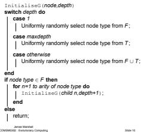

# The Program Induction Paradigm

Genetic Programming (GP) is the field of EC pioneered by John Koza Koza, J. Genetic Programming: On the Programming of Computers by Means of Natural Selection. 1992.   
GP is based on the following proposals • Many problems from various fields can be interpreted as the problem of discovering an appropriate computer program that maps some input to some output 1.e. program induction GP is a general way to do program induction

Optimal control   
Planning   
Sequence induction   
Symbolic regression   
Empirical discovery   
Decision tree induction   
Evolution of emergent behaviour

# Trees as Programs

# Characteristics of Program Trees

# Closure of the Function and Terminal Set

Programs can be represented with a commonly used data structure - Trees

E.g. Reverse Polish Notation expressions

53+7\*4/

E.g. LISP S-expressions (+12 (IF (> TIME 10) 34))

Genetic Programming is GA with trees • The use of trees as chromosomes leads to some interesting differences with GAs

riable length

Program trees are built from a set of functions F and a set of terminals

• Functions in F have specific arities E.g. binary functions such as + have arity 2 Tenay functions such as I conditin THE action ELSE action hav arity 3"   
Terminals in T are functions having arity 0

infinite variety The number of possible recursive compositions of functions and terminals is infinite if we do not limit the tree's depth • In contrast the standard fxed chromosome-length encoding of most GAs give a finite (but possibly very large) number of posible chromosomes For GP it is important that the function and terminal sets have the closure property

Closure is the property that the functions in F accept any possible val that may be output from any composition f functions in F and terminals in T'

• This is easy to achieve for some function and terminal sets, such as   
boolean functions   
More care is needed in most domains • E.g. with arithmetic functions care is needed to prevent division by zero

I te closure property does not hold over FT then we are faced with a constrained optimisation problem

We can apply various techniques such as those we have seen in the GA lectures previously

# Closure of the Function and Terminal Set

# Sufficiency of the Function and Terminal Set

# Population Initialisation

Various strategies for ensuring closure are possibl..

• Implement protected versions of vulnerable operators • E.g. protected version of division that returns 1 or 'undefined for division by arguments

Ecbcal nboo valn l gi (FALSE=0, TRUE÷0)

E.q ILTZ (f Less Than Zer)

Implement conditional branching operatc

E.eval vl uncs b ssta ne t value

If GP is to make any progress in tackling a problem, the function and teinal st must be sufficient o fnd an appropriate prom E.g. in boolean logic the sets $F = \{ \land , \forall , \lnot \}$ and $F = \lbrace \wedge , \lnot \rbrace$ are sufficient to represent any boolean function, but the set $F = \left\{ \Lambda \right\}$ is not This is a universal problem in machine learning, sometimes called attribute selection Typically it is hard to select the minimal sufficient set in advance and it essay ncue oe nons than stricy ee

As in a GA, in GP we need to initialise a population of individuals   
There are three basic ways of doing this 'Grow method 'Fullr method 'Ramped half-and-half" method   
For the 'grow' and full methods an individual is initialised recursively

Initialise(root,1);

As in GAs a 'no duplicates' policy may be implemented to avoid wasted computational effort

# 'Grow' Method

InitialiseF (node,depth)   
if depth<maxdepth then Uniformly randomly select node type from F; for n=1 to anity of node type do InitialiseF (child n,depth+1); end   
else Uniformly randomly select node type from T; return;   
end

# 'Ramped Half-and-Half' Method

'Ramped half-and-half' combines the 'full' and 'grow' methods Generates equal numbers of full and grown trees with ll possible depths between 2 and maxdepth Hence a great variation of tree sizes and shapes are construced Evolution needs variability to work with

Data: maxdepth — maximum depth of any individual in population, ≥ 2 atio lip

for i=2 to maxdepth do

for 1 to N/(2\*(maxdepth-1)) do Add InitialiseF (root,i) to population; Add InitialiseG(root) to population; end nd

# Fitness

Slide 12

# Fitness

# Fitness

# 'Full' Method

Depending on the problem we are applying GP to, there are two main ways of calculating raw fitness Absolute performance (for control, optimisation problems, etc.) Error (for regression-type problems)

Absolute performance is familiar from GAs

Error is interesting

For problems such as symbolic regression we can compare the output ial  i

$$
r _ { i } = \sum _ { j = 1 } ^ { i = n } | S ( i , j ) - C _ { i } | ,
$$

where n is the number of fitness cases, r; is the fitness of individual i, output for input j

N.B. The error-based definition of fitness

$$
r _ { i } = \sum _ { j = 1 } ^ { j = n } | S ( i , j ) - C _ { j } | ,
$$

is similar but slightly different to the traditional sum of squares that we usually minimise in regression

$$
\sum _ { i = 1 } ^ { j = n } ( { \mathsf Y } _ { i } - \hat { \mathsf Y } _ { j } ) ^ { 2 } ,
$$

where Y is the value of sample pointj, and $\hat { \mathsf { Y } } _ { j }$ is the value predicted for sample by our regression estimator

The symbolic regression (i.e. function approximation) problem for GP sequivalent to statistical egression   
We cn e ths be elabelling he regression lin s the predcion the ground-truth for that input • E.g. if we were trying to use GP to approximate a set of points on a quadratic line, only allowing linear functions, the compromise function achieving the best ft would be the one that minimises the sum of squares   
So perhaps sum of squares is a better fitness measure for GP • One nice feature is that it penalises large errors more than small errors

# GP Operators

# Crossover

The main GP operators are

Clonal reproduction Crossover

Why no mutation?

• Loss of functions and terminals from the population is rare •Functions and terminals are not limited to particular loci There are typically far fewer functions and terminals than there are combined loci in the oulation Also, as we shall see, convergence is not so accute in GP

Clonal Reproduction

sts name ggess, thisresultin the inetion  cond off   
into the population   
• Why? We wanted to avoid duplicated individuals in the initial population.   
•But this is more useful than it sounds, as selection for reproduction is fitness-proportional.

Crossover in GP is performed by exchange of subtrees between two parents

A node (crosspoint) in each parent is randomly selected, often with a 9:1 bias in favour of choosing a function node over a terminal node The entire subtree that has its root as the selected node in one of the parents is swapped with the corresponding subtree in the other parent This always produces legal offspring as long as the closure property holds over F U T   
•Selection of root crosspoints in both parents simply clones both parents.. but incest produces non-clonal offspring, as long as the crosspoints are not the same This counteracts the convergence pressure exerted by the clonal reproduction operator It also tends to render mutation unnecessary for the same reason   
Typically a maximum depth for offspring is enforced, to prevent unmanageable individuals being created A clone of one of the parents is inserted into the population in the place of the over-sized offspring