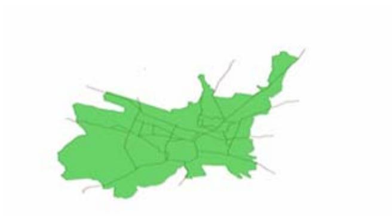
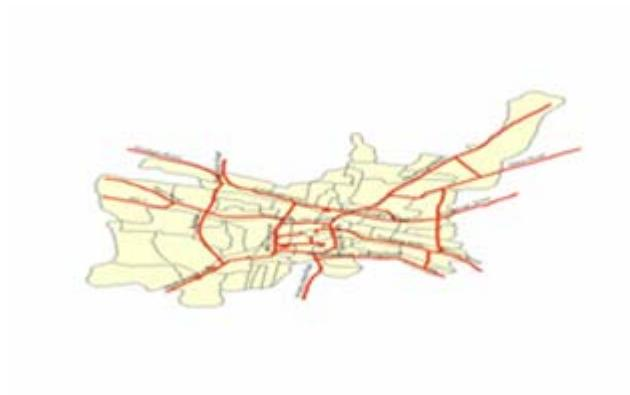
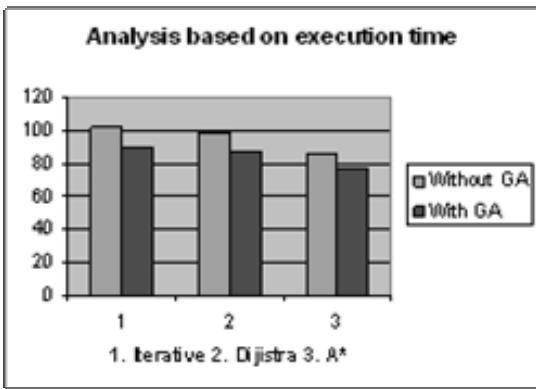

# Intelligent Transport Route Planning Using Genetic Algorithms in Path Computation Algorithms

A.John Sanjeev Kumar Senior Lecturer, Department. of MCA, Thiagarajar College of Engineering Madurai, TamilNadu, India E-mail: ajscse@tce.edu

J.Arunadevi Lecturer, Department. of MCA, Thiagarajar School of Management Madurai, TamilNadu, India E-mail: arunasethupathy@gmail.com

V.Mohan Professor and Head,Department of Mathematics,Thiagarajar College of Engineering, Madurai, TamilNadu, India

# Abstract

Network analysis in geospatial information system (GIS) provides strong decision support for users in searching optimal route, finding the nearest facility and determining the service area. Searching optimal path is an important advanced analysis function in GIS. In present GIS route finding modules, heuristic algorithms have been used to carry out its search strategy. Due to the lack of global sampling in the feasible solution space, these algorithms have considerable possibility of being trapped into local optima. This paper addresses the problem of selecting route to a given destination on an actual map under a static environment. The proposed solution uses a genetic algorithm (GA). A customized method based on a genetic algorithm has been proposed in this paper. In single pair path algorithms we have tested for Iterative algorithm, Dijkstra algorithm, Best First $\mathbf { A } ^ { * }$ Algorithms and the results were shown.

Keywords: GIS, SDSS, Genetic Algorithm, Route Finding, Vehicle Routing Problem.

# 1. Introduction

Decisions are often evaluated on the basis of quality of the processes behind. It is in this context that geospatial information system (GIS) and spatial decision support system (SDSS) increasingly are being used to generate alternatives to aid decision-makers in their deliberations. The intelligent transport system (ITS) can carry and gather very useful information for delivery to users and perform other useful functions to deal with the travel. The introduction of subsystems that support the decision making to suit changing conditions is a logical important step in providing systems with improved functionalities.

Unfortunately, GIS and SDSS typically lack formal mechanisms to help decision-makers explore the solution space of their problem and thereby challenge their assumptions about the number and range of options available. We describe the use of a genetic algorithm to generate a range of options available. The ability of genetic algorithms to search a solution space and selectively focus on promising combinations of criteria makes them ideally suited to such complex spatial decision problems. Routing problems in car navigation systems are search problems for finding an optimal route from an origin to a destination on a road map within a time limit. In a practical system, when traffic congestion changes during driving, the route should be re-evaluated before the car reaches the next intersection. A representative solution to these search problems is the Dijkstra algorithm (DA) [1]. As the DA is an exact algorithm it always determines the optimal route but cannot guarantee that realistic deadlines will be met. In contrast, as genetic algorithms always have solutions in a population during a search, they can provide alternative routes using other solutions in the shortest time. A method has been proposed in this paper for using a genetic algorithm to find the easiest-to-drive and quasi-shortest route to reach a destination within a given time. It can be used to produce and choose candidate routes that guarantee the meeting of deadlines and satisfy constraints regarding ease of driving.

# 2. Solving constraint satisfaction problems using GA

Genetic algorithm is a computational model simulating the process of genetic selection and natural elimination in biologic evolution. Pioneering work in this field was conducted by Holland in the 1960s [2], [3].As a high efficient search strategy for global optimization, genetic algorithm demonstrates favorable performance on solving the combinatorial optimization problems. With comparing to traditional search algorithms, genetic algorithm is able to automatically acquire and accumulate the necessary knowledge about the search space during its search process, and self-adaptively control the entire search process through random optimization technique. Therefore, it is more likely to obtain the global optimal solution without encountering the trouble of combinatorial explosion caused by disregarding the inherent knowledge within the search space. It has been used to solve combinatorial optimization problems and non-linear problems with complicated constraints or non-differentiable objective functions. It necessitates the application of genetic algorithm into GIS route finding algorithms.

The computation of usual genetic algorithm is an iterative process that simulates the process of genetic selection and natural elimination in biologic evolution. For each iteration, candidate solutions are retained and ranked according to their quality. A fitness value is used to screen out unqualified solutions. Genetic operators, such as crossover, mutation, translocation and inversion, are then performed on those qualified solutions to estimate new candidate solutions of the next generation. The above process is carried out repeatedly until certain convergent condition is met. And finally, GA is a general search method [4]. It uses analogs of genetic operators on a population of states in a search space to find those states that have high fitness values.

In optimization problems, genetic operators and coding methods are designed in advance so that the individuals may satisfy the constraints. In contrast, the objective of constraint satisfaction problems (CSPs) is to find an individual that satisfied constraints as the fitness value. Search in usual GA, based on neo-Darwinian evolutionary theory is conducted by crossover and mutation. Crossover is generally considered a robust search means. Offspring may inherit partial solutions without conflict from their parents, but no information to decide which genes are partial solutions is available. From a search strategic point of view this means that variables are randomly selected and then values which will be assigned to them are also randomly selected from genes contained within a population. Therefore search by crossover in GA can not be considered efficient. Furthermore, mutation is a random search method itself. When we think about efficiency of global search that is the most important characteristic of GA; we must admit that the rate of search is low, because GA stresses random search rather than directional search. It can be considered that the above problem is directly inherited from problems of the neo-Darwinian evolutionary theory. In the following sections, we first explain our basic strategies. Next, we describe the fitness function, genetic operators.

# 3. Strategies

A (directed) graph $\mathrm { G } = \left( \mathrm { N } , \mathrm { E } , \mathrm { C } \right)$ consists of a node set $\mathrm { N } .$ , a cost set C and an edge set E. The edge set E is a subset of the cross product $\Nu * \Nu$ . Each element $( \mu , \nu )$ in E is an edge joining node u to node v. Each edge (u,v) is associated with a cost C(u, v). Cost $\mathrm { C } ( \mathrm { u } , \mathrm { \ v } )$ takes values from the set of real numbers. A node v is a neighbor of node u if edge (u, v) is in E. Degree of a node is the number of neighboring nodes. A path in a graph from a source node s to a destination node d is a sequence of nodes $( \nu 0 , \nu 1 , \nu 2 , . . . , \nu k )$ where $\mathsf { s } = \nu 0$ , $\mathrm { d } = \nu k ,$ , and the edges $( \nu 0 , \nu 1 ) , ( \nu 1 , \nu 2 ) , . . . , ( \nu \tilde { k } 1 , \mathrm { d } )$ are present in E. The number of edges in a path is called the cardinality of the path. The cost of the path is the sum of the cost of edges, i.e.

$$
\sum _ { i = 1 } ^ { k } C ( \boldsymbol { v } _ { i - 1 } , \boldsymbol { v } _ { i } ) .
$$

An optimal path from node u to node v is the path with smallest cost. The set of path from node u to node v is denoted by paths(u,v). A suffix of a path is obtained by removing nodes and edge from the beginning of path. For example a path via $( \nu 1 , \nu 2 , . . . , \nu k )$ is a suffix of path via $( \nu 0 , \nu 1 , \nu 2 , . . . , \nu k )$ . A shortest_path_tree(s) is a collection of shortest paths from source node s to all nodes in the graph, with s being the root node. Diameter of a graph is the largest cardinality of the shortest path between any pair of nodes. If there exists a path from all nodes to all other nodes in the graph, then the graph is called connected. We will focus our attention to connected graphs. A path cost estimator in a graph is a function f(u, v) which computes estimated cost of an optimal path between the two nodes u and v in the graph. A path cost estimator is a perfect estimator if computes the exact cost of an optimal path between two given nodes. A path cost estimator is admissible if it always under estimates the cost of the path, i.e. $\mathrm { f ( u , v ) } { < } = p a t h ( \mathrm { u , v ) ) }$ for all path in paths(u,v). A path cost estimator is called monotonic if $\mathrm { f ( s u f f i x ( p a t h ) ) < = f ( p a t h ) }$ for all paths and all suffixes. Single pair path problems can be divided into shortest path and any path problems. Shortest path problems can be defined as follows: Given a graph $\mathrm { G } = \left( \mathrm { N } , \mathrm { E } \right)$ and nodes u and v in N, find the shortest path between u and v. The shortest path is the path with smallest cost. Any path problems can be defined by removing the shortest path constraint from shortest path problem.

# 3.1. Iterative Algorithm using GA

This is one of oldest algorithm for transitive closure, all pair path computation, and graph traversal[5] and is also known as breadth first search.We introduce GA

Iterative( N, E, s, d);   
{foreach u in $_ \mathrm { N }$ do $\{ { \mathrm { ~ C ( s , u ) } } = \infty ; { \mathrm { ~ C ( u , u ) } } = 0 ; { \mathrm { p a t h } } ( { \mathrm { u , v } } ) \colon = { \mathrm { n u l l } } ; \}$ frontierSet: $\mathbf { \mu } = [ \mathbf { \nabla } \mathbf { s } ]$ ;   
while not_empty(frontierSet) do   
{ foreach u in frontierSet do   
{ frontierSet: $=$ frontierSet - [u];   
fetch( u.adjacencyList);   
foreach ${ \bf { < v . } }$ , ${ \mathrm { C } } ( { \mathrm { u } } , { \mathrm { v } } ) ^ { > }$ in u.adjacencyList   
$\{$ if $\mathrm { C } ( \mathrm { s , v } ) > \mathrm { C } ( \mathrm { s , u } ) + \mathrm { C } ( \mathrm { u , v } )$ then   
$\{ \mathrm { C } ( \mathrm { s } , \mathrm { v } ) \mathrm { : = } \mathrm { C } ( \mathrm { s } , \mathrm { u } ) + \mathrm { C } ( \mathrm { u } , \mathrm { v } ) \mathrm { : }$ ; pat $\begin{array} { r } { \gimel ( { \mathrm { s } } , { \mathrm { v } } ) \colon = { \mathrm { p a t h } } ( { \mathrm { s } } , { \mathrm { u } } ) + { \mathrm { e d g e } } ( { \mathrm { u } } , { \mathrm { v } } ) ; } \end{array}$ if not_in(v, frontierSet) then frontierSet: $=$ frontierSet + [v]; $\} \} \}$   
Fetch(u,adjacencyList)   
{ calculate fitness values of individuals   
select two individuals at random   
single-point crossover   
return highfitness individual}

# 3.2. Dijkstra’s Algorithm

Dijkstra’s algorithm has been influential in path computation research[6].

Dijkstra( N, E, s, d);   
foreach u in $_ \mathrm { N }$ do $\{ \mathrm { C } ( { \mathrm { s } } , { \mathrm { u } } ) = \infty$ ; $\mathrm { C } ( \mathrm { u } , \mathrm { u } ) = 0$ ; $\mathrm { p a t h } ( \mathrm { u } , \mathrm { v } ) { : = } \mathrm { n u l l } { } ; \mathrm  \}$ frontierSet: $\mathbf { \tau } = [ \mathbf { \ s } ] .$ ; exploredSet: $=$ emptySet;   
while not_empty(frontierSet) do   
{ select u from frontierSet with minimum $\mathrm { C } ( { \mathrm { s } } , { \mathrm { u } } )$ ;   
frontierSet: $=$ frontierSet - [u]; exploredSet: $=$ exploredSet $^ +$ [u]; if $( \mathrm { u } = \mathrm { d } )$ then terminate   
else $\{$ { fetch( u.adjacencyList);   
foreach ${ \bf < v }$ , ${ \mathrm { C } } ( { \mathrm { u } } , { \mathrm { v } } ) ^ { > }$ in u.adjacencyList   
if $\mathrm { C ( s , v ) > C ( s , u ) + C ( u , v ) }$ then   
$\{ \mathrm { C } ( \mathrm { s } , \mathrm { v } ) \colon = \mathrm { C } ( \mathrm { s } , \mathrm { u } ) + \mathrm { C } ( \mathrm { u } , \mathrm { v } )$ ; $) \mathrm { a t h } ( \mathrm { s } , \mathrm { v } ) { : = } \mathrm { p a t h } ( \mathrm { s } , \mathrm { u } ) + ( \mathrm { u } , \mathrm { v } ) { : }$   
if not_in(v, frontierSet U exploredSet) then   
frontierSet: $=$ frontierSet + [v];   
}}}   
Fetch(u,adjacencyList)   
{ calculate fitness values of individuals   
select two individuals at random   
single-point crossover   
return highfitness individual}

# 3.3. Best First $\mathbf { A } ^ { * }$ Algorithms

Best first search has been a framework for heuristics which speed up algorithms by using semantic information about a domain. It has been explored in database context for single pair path computation[23]. $\mathbf { A } ^ { * }$ is a special case of best first search algorithm. It uses an estimator function f(u,d) to estimate the cost of shortest path between node u and d. $\mathbf { A } ^ { * }$ has been quite influential due to its optimality properties[7]. The basic steps of these algorithms are described in figure 3. Best first search without estimator functions is not very different than Dijkstra’s algorithm.

$\mathrm { A ^ { * } ( N , E , s , d , f ) }$   
foreach u in $_ \mathrm { N }$ do $\{ \mathrm { C } ( { \mathrm { s } } , { \mathrm { u } } ) = \infty$ ; $\mathrm { C } ( \mathrm { u } , \mathrm { u } ) = 0$ ; pa $\mathrm { { t h } } ( \mathrm { { u , v } } ) \mathrm { { : } } = \mathrm { { n u l l ; } } \}$ frontierSet: $\mathbf { \mu } = [ \mathbf { \nabla } \mathbf { s } ]$ ; exploredSet: $=$ emptySet;   
while not_empty(frontierSet) do   
{ select u from frontierSet with minimum ( $\mathbf { C } ( { \mathrm { s } } , \mathrm { u } ) + \mathbf { f } ( \mathrm { u } , \mathrm { d } ) \ )$ ; \*\* frontierSet: $=$ frontierSet - [u]; exploredSet: $=$ exploredSet + [u]; if $( \mathrm { u } = \mathrm { d } )$ then terminate   
else $\{$ { fetch (u.adjacencyList);   
foreach ${ \bf < v }$ , ${ \mathrm { C } } ( { \mathrm { u } } , { \mathrm { v } } ) ^ { > }$ in u.adjacencyList   
{ if $\mathrm { C } ( \mathrm { s , v } ) > \mathrm { C } ( \mathrm { s , u } ) + \mathrm { C } ( \mathrm { u , v } )$ then   
$\{ \mathrm { C } ( \mathrm { s } , \mathrm { v } ) \colon = \mathrm { C } ( \mathrm { s } , \mathrm { u } ) + \mathrm { C } ( \mathrm { u } , \mathrm { v } )$ ; path $( \mathrm s , \mathrm v ) \mathrm { : = p a t h } ( \mathrm s , \mathrm u ) + ( \mathrm u , \mathrm v ) .$ ;   
if not_in(v, frontierSet) then frontierSet: $=$ frontierSet + [v]; $\} \} \}$   
Fetch(u,adjacencyList)   
{ calculate fitness values of individuals   
select two individuals at random   
single-point crossover   
return highfitness individual}

# 4. Performance results on map

The Madurai road map data consisted of 678 nodes and 1200 edges that represented highway and freeway segments for a 16 square mile section of the Madurai area.

  
Figure 4.1: Graph of Madurai with Routes connected

  
Figure 4.2: Graph of Madurai after the algorithms applied.

The experiment has been carried to find the shortest route between a source and the destination on a given route. Three algorithms were executed without the implementation of the GA to fetch the adjacency list and three algorithms were implemented with the GA. The results have been tabulated.The table has compared the execution time in milliseconds.

Table 4.1: Execution time for various algorithms   

<table><tr><td>Algorithm</td><td>Without GA</td><td>With GA</td></tr><tr><td>Iterative</td><td>102</td><td>89</td></tr><tr><td>Dijistra</td><td>98</td><td>87</td></tr><tr><td>A*</td><td>85</td><td>76</td></tr></table>

  
Figure 4.3: Graph based on execution time for three algorithms

$\mathbf { A } ^ { * }$ algorithm performs better in the scenario of without using the GA approach. With the GA introduced to the three algorithms $\mathbf { A } ^ { * }$ again give the good results compared to other two algorithms.

# 5. Conclusion

As a high efficient search strategy for global optimization, genetic algorithm demonstrates favorable performance on solving the combinatorial optimization problems. The best route selection problem in network analysis can be solved with genetic algorithm through efficient encoding, selection of fitness function and various genetic operations. Crossover is identified as the most significant operation to the final solution. The experience shows that the designed implementation method is effective in terms of computation time and complexity . Further efforts can be made on the following items:

• Enhancing the adaptability of the algorithm under dynamic constraints. Expanding the applications of the algorithm into broader GIS topics.

# Список литературы

[1] Golden B., Shortest-Path Algorithms – A comparison, Operations Research, 1976, Vol.24, No. 9, pp. 1164-1168.   
[2] Holland J. H. Adaptation in Nature and Artificial Systems.., 1975 The University of Michigan Press, Reprinted by MIT Press, 1992.   
[3] Coley, D.A., An Introduction to Genetic Algorithms for Scientists and Engineers, 1992. World Scientific.   
[4] Goldberg, D.E. Genetic Algorithms in Search, Optimization and Machine Learning. .,1989 Addison Welsey Publishing Company.   
[5] T. H. Cormen, C. E. Leiserson, and R.Rivest, Single source shortest paths (Ch#25), Introduction to Algorithms, The MIT Press, 1990.   
[6] B. Jiang, I/O Efficiency of Shortest Path Algorithms: An Analysis, Proc. Intl. Conf. on Data Eng., IEEE, (1992).   
[7] R. Detcher and J. Pearl, Generalized best-first strategies and theoptimality of ${ \cdot \mathbf { \nabla } } A ^ { * } .$ , UCLA-ENG8219, University of California, Los Angeles.