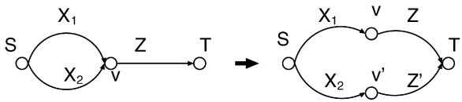
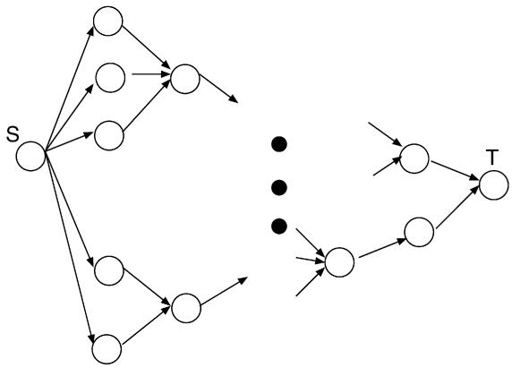
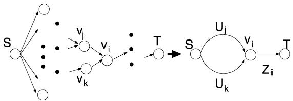
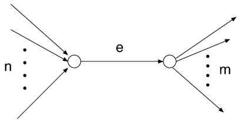
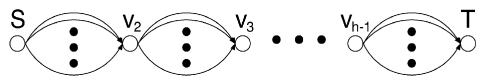
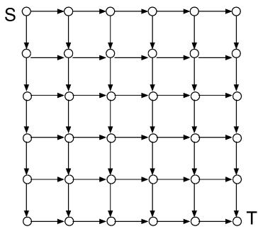
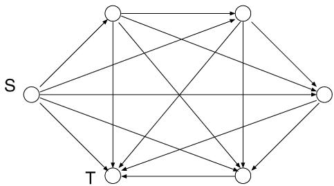

# Approximating the longest path length of a stochastic DAG by a normal distribution in linear time

Ei Ando a,∗, Toshio Nakata b, Masafumi Yamashita a,c

a Dept. Computer Sci. and Communication Eng., Kyushu University, 744 Motooka, Nishi-ku, Fukuoka, 819-0395, Japan   
b Dept. of Mathematics, Fukuoka University of Education, Akama-Bunkyomachi, Munakata, Fukuoka, 811-4192, Japan   
c Institute of Systems, Information Technologies and Nanotechnologies, Fukuoka SRP Center Building 7F 2-1-22, Momochihama, Sawara-ku, Fukuoka, 814-0001, Japan

# a r t i c l e i n f o

# a b s t r a c t

Article history:   
Received 3 September 2007   
Received in revised form 7 January 2009   
Accepted 12 January 2009   
Available online 21 January 2009

Keywords: Directed acyclic graph Longest path problem Stochastic edge weight Normal distribution Approximation

This paper presents a linear time algorithm for approximating, in the sense below, the longest path length of a given directed acyclic graph (DAG), where each edge length is given as a normally distributed random variable. Let $F ( x )$ be the distribution function of the longest path length of the DAG. Our algorithm computes the mean and the variance of a normal distribution whose distribution function $\tilde { F } ( x )$ satisfies $\tilde { F } ( x ) \leqslant F ( x )$ as long as $\boldsymbol { F } ( \boldsymbol { x } ) \geqslant \boldsymbol { a }$ , given a constant a $( 1 / 2 \leqslant a < 1 )$ ). In other words, it computes an upper bound $1 - { \tilde { F } } ( x )$ on the tail probability $1 - F ( x )$ , provided $x \geqslant F ^ { - 1 } ( a )$ . To evaluate the accuracy of the approximation of $F ( x )$ by $\tilde { F } ( x )$ , we first conduct two experiments using a standard benchmark set ITC’99 of logical circuits, since a typical application of the algorithm is the delay analysis of logical circuits. We also perform a worst case analysis to derive an upper bound on the difference $\tilde { F } ^ { - 1 } ( a ) - F ^ { - 1 } ( a )$ .

$\circledcirc$ 2009 Elsevier B.V. All rights reserved.

# 1. Introduction

# 1.1. The longest path problem for stochastic DAGs

Many practical problems are formulated as optimization problems on directed acyclic graphs (DAGs) with edge weights (lengths).1 Typically the edges represent tasks, each of whose length represents the time necessary to complete it. The DAG represents the precedence relation among the tasks. Assuming that independent tasks can be executed simultaneously, the problem of computing the makespan of a task schedule minimizing the completion time is then reducible to the longest path problem for the DAG, which is solvable in linear time [10], although it is NP-complete for general directed graphs [5].

In cases where problems in real world are too complicated to know the lengths with certainty, we sometimes assign to the edge lengths random variables following suitable distributions, and try to obtain some quantities, e.g., the average of the longest path length, for this stochastic DAG.

PERT [11] and Critical Path Planning [9] are two classical approaches to the stochastic longest path problem. Critical Path Planning simply transforms the stochastic problem into the deterministic problem by taking some constant values as the lengths. PERT on the other hand tries to approximate the expected longest path length, whose accuracy is studied e.g., in [4].

Martin [12] presented an algorithm for symbolically computing the distribution of the longest path length, assuming that the density functions of the random variables are polynomials. Two key ingredients of his algorithm are a series and a parallel reductions. He symbolically computes the distribution of series edges or parallel edges and repeats to replace these edges in a network with an equivalent single edge, until the network is reduced to a single edge. For a series-parallel graph, he can successfully compute the distribution, although the distribution may be a piecewise polynomial function whose number of pieces is huge. In order to apply this approach to a DAG, he unfolds the DAG to a tree in such a way that each of distinct paths of the DAG from the source to the sink corresponds to an independent path in the tree. Since the number of distinct paths can be as large as an exponential in the order of DAG, his algorithm is inefficient.

Another approach is to consider a discrete version of the problem. We ask each of the random variables to take a discrete value and try to apply a combinatorial optimization technique. However, according to Ball et al. [1], treating arbitrary series of convolutions or max operations is known to be #P -hard, and hence this approach seems to be applicable only to small instances.

In spite of this difficult situation, there are many applications to which linear time algorithms are inevitably required, even at the expense of accuracy, because their instances are huge. A typical of such applications is the delay analysis of logical circuits, whose ultimate (and usually unreachable) goal is to compute the distribution of circuit delay. The uncertainty of gate delay comes from manufacturing fluctuation, and a normal distribution is used to model it (see e.g., [2]). Given a success rate $a$ (slightly less than 1.0), their practical goal is hence to estimate a value $d$ such that the probability that the circuit delay is less than $d$ is at least a. We of course want to take $d$ as small as possible.

Difficulty in the calculation of the distribution of the delay mainly arises from parallel gates (which correspond to parallel edges in a DAG); the distribution of the delay of a circuit consisting of two parallel gates is, in general, not a normal distribution any more, even if the delay of each of the gates is independently normally distributed. To avoid this difficulty, Berkelaar [2] proposed a method to approximate the distribution of the delay of two parallel gates by a normal distribution with the same mean and variance as the delay of the two gates. Since his method tends to under-estimate the mean $+ 3 \sigma$ point of delay, Hashimoto and Onodera [7] proposed a method to adjust the mean and the variance in order for the approximation to have the same mean $+ 3 \sigma$ point as the delay. Tsukiyama [14] proposed a method to obtain the approximate mean and variance of the delay using Clark’s method [3], taking into account the correlation among paths. We however note that all of these methods cannot remove the risk of under-estimation.

# 1.2. Our contributions

Let $F ( x )$ be the distribution function of the longest path length of a DAG, where the length of each edge is given as a random variable following a normal distribution. We assume that the edge lengths are mutually independent. In this paper, we present an algorithm A-DAG that computes a normal distribution $N ( \tilde { \mu } , \tilde { \sigma } ^ { 2 } )$ whose distribution function $\tilde { F } ( x )$ satisfies that $\tilde { F } ( x ) \leqslant F ( x )$ if $\boldsymbol { F } ( \boldsymbol { x } ) \geqslant \boldsymbol { a }$ , given a $1 / 2 \leqslant a < 1 )$ . In the context of circuit delay analysis, since $F ( x )$ is the probability that the circuit delay is less than or equal to $x .$ , the solution $x = d$ of equation $\widetilde { F } ( x ) = a$ guarantees that the delay of a product is less than or equal to $d$ with the probability at least $a$ , where $d$ can be easily calculated by referring to the table of standard normal distribution, since $\tilde { F } ( x )$ is a normal distribution function.

We can restate our result as follows: The tail probability is the probability that a random variable deviates at least a given amount from the expectation. Many studies have been done to obtain upper bounds on it. The Chernoff bound on the sum of independent Poisson trials is an example (see, e.g., [13, Section 4.1]). In our setting, the Chernoff bound is an upper bound on the tail probability of the length of (a longest path of) a path graph, although the distribution of the length of each edge is Poisson. For any DAG and constant a $( 1 / 2 \leqslant a < 1 )$ , our algorithm computes a normal distribution function $\tilde { F } ( x )$ such that $1 - { \tilde { F } } ( x )$ is an upper bound on the tail probability $1 - F ( x )$ as long as $x \geqslant a$ .

Let $F _ { i } ( x ) ~ ( i = 1 , \ldots , k )$ be the normal distribution function given by a pair of a mean $\mu _ { i }$ and a variance $\sigma _ { i } ^ { 2 }$ . Then our algorithm uses, as a primitive operator, a function $\operatorname { I n v } ( F _ { 1 } , F _ { 2 } , \ldots , F _ { k } ; y )$ that returns a (unique) real number $x _ { 0 }$ such that $F _ { 1 } ( x _ { 0 } ) F _ { 2 } ( x _ { 0 } ) \dots F _ { k } ( x _ { 0 } ) = y$ holds for any given real number $y$ $\begin{array} { r } { 0 < y < 1 } \end{array}$ ). $\mathrm { I n v } ( F _ { 1 } , F _ { 2 } , \ldots , F _ { k } ; y )$ can be calculated by adopting a numerical method like the Newton’s method or the binary search method referring to the table of the standard normal distribution. Provided that Inv returns a correct value in $O ( k )$ time,2 the time complexity of our algorithm is $O ( | V | + | E | )$ , where $G = ( V , E )$ is the given DAG.

From the view of practice, a small upper bound on ${ \cal F } ^ { - 1 } ( a )$ is looked for. Since the circuit delay analysis is a main application, we conduct experiments to observe the accuracy measured by $\operatorname { E r r } ( G , a ) = { \tilde { F } } ^ { - 1 } ( a ) - F ^ { - 1 } { \overset { \cdot } { ( } } a )$ of $\tilde { F } ^ { - 1 } ( a )$ for the large circuits in ITC’99 benchmark set. A-DAG shows sufficiently good performance except for a couple of instances. We formally derive an upper bound on Err, too.

# 1.3. Road map

To explain the ideas behind our liner time algorithm A-DAG, we start with a well-known algorithm D-DAG for computing the longest path length of a DAG $G = ( V , E )$ , in which a constant non-negative value $c _ { j i }$ is associated with each edge $( \boldsymbol { \nu } _ { j } , \boldsymbol { \nu } _ { i } ) \in E$ . D-DAG is based on the dynamic programming method, and computes, for each vertex $\boldsymbol { v } _ { i } \in V$ in a topologically sorted order, the longest path length $l _ { i }$ from the source to $\nu _ { i }$ .

Algorithm D-DAG(G)   
Topologically sort $V = \{ \nu _ { 1 } , \nu _ { 2 } , \ldots , \nu _ { n } \}$ ;   
(Assume that $\nu _ { i } < \nu _ { i + 1 }$ .)   
$l _ { 1 } : = 0$ ;   
for $i = 2 , \ldots , n$ do;   
$l _ { i } : = \mathrm { m a x } _ { \nu _ { j } \in V _ { i } } \{ l _ { j } + c _ { j i } \}$ , where $V _ { i }$ is the set of parent vertices of $\nu _ { i }$ ; return $l _ { n }$ .

A-DAG tries to maintain “an approximate distribution $C _ { i }$ of the longest path length” from the source to vertex $\boldsymbol { v } _ { i } \in V _ { i }$ , instead of “the definite longest path length $l _ { i } "$ in D-DAG. For this, we re-define the operations plus and max in D-DAG for normal distributions in such a way that $C _ { n }$ becomes an approximation of the distribution of $l _ { n }$ . Since the sum of two normally distributed random variables also obey a normal distribution, the mean and the variance of which are the sums of the means and the variances of the two normal distributions, we can immediately replace operation plus with two pluss, one for mean and the other for variance.

Technical details of A-DAG arise from how to implement max operation. To this end, we introduce three subclasses of DAG called quasi-tree graphs (QTREE), racket graphs (RACKET) and parallel graphs (PARA), and transform the problem of computing $C _ { i }$ for a DAG finally into the problem of approximating, by a normal distribution, the distribution of the longest path length of a PARA, using first QTREE and then RACKET.

We however describe this transformation in the reverse direction. We explain 1) how to approximate the distribution of the longest path length of a PARA by a normal distribution (Section 3.1), 2) how to transform a RACKET into a PARA (Section 3.2), 3) how to transform a QTREE into a RACKET (Section 3.3), and finally 4) how to transform a DAG into a QTREE (Section 4), in this order.

The paper is organized as follows: After preparing basic notions in Section 2, Section 3 introduces three subclasses PARA, RACKET and QTREE, and describes the above transformations. Then we in Section 4 present our algorithm A-DAG. Section 5 is devoted to performance analysis of A-DAG. We first explain about experimental results using ITC’99 as instances, and then formally bound error Err. Finally we conclude the paper by giving some open problems in Section 6.

# 2. Preliminaries

Consider a DAG $G = ( V , E )$ with a pair of a source and a sink. For each edge $e _ { i } \in E$ of $G$ , we associate a random variable $X _ { i }$ that represents the length of $e _ { i }$ , and assume that $X _ { i } \sim N ( \mu _ { i } , \sigma _ { i } ^ { 2 } )$ , where $N ( \mu , \sigma ^ { 2 } )$ is the normal distribution with mean $\mu$ and variance $\sigma ^ { 2 }$ . We assume that the random variables are mutually independent. The (probability) density function of $X _ { i }$ is

$$
f _ { i } ( x ) = \frac { 1 } { \sigma _ { i } \sqrt { 2 \pi } } \exp \biggl ( - \frac { 1 } { 2 } \biggl ( \frac { x - \mu _ { i } } { \sigma _ { i } } \biggr ) ^ { 2 } \biggr ) ,
$$

and its distribution function is

$$
F _ { i } ( x ) = \intop _ { - \infty } ^ { x } f _ { i } ( t ) d t .
$$

$N ( 0 , 1 )$ is called the standard normal distribution. Let $\varPhi ( x )$ and $\phi ( x )$ be the distribution function and the density function of $N ( 0 , 1 )$ . Then we have

$$
F _ { i } ( x ) = \varPhi \left( \frac { x - \mu _ { i } } { \sigma _ { i } } \right) .
$$

Since each edge length is given as a random variable, the length of a longest path from the source to the sink is also a random variable. Before starting the introduction of our approximation algorithm, we would like to explain how to calculate in theory the distribution of the longest path length of a series-parallel graph, to give readers an intuition about the difficulty of the problem.

Let $e _ { 1 }$ and $e _ { 2 }$ be two edges with edge lengths $X _ { 1 }$ and $X _ { 2 }$ , respectively. We assume that $X _ { 1 }$ and $X _ { 2 }$ are mutually independent. Suppose that two edges $e _ { 1 }$ and $e _ { 2 }$ are connected in series. The length $X$ of the longest path is then $X = X _ { 1 } + X _ { 2 }$ and its distribution function $F ( x )$ is

$$
F ( x ) = P ( X _ { 1 } + X _ { 2 } \leqslant x ) = \intop _ { - \infty } ^ { \infty } f _ { 1 } ( x - t ) F _ { 2 } ( t ) d t .
$$

$X _ { i } \sim N ( \mu _ { i } , \sigma _ { i } ^ { 2 } )$ for $i = 1 , 2$ , then $X \sim N ( \mu _ { 1 } + \mu _ { 2 } , \sigma _ { 1 } ^ { 2 } + \sigma _ { 2 } ^ { 2 } )$ , and we can easily calculate $F ( x )$ .

Suppose that $e _ { 1 }$ and $e _ { 2 }$ are connected in parallel. The length $X$ of a longest path is $X = \operatorname* { m a x } \{ X _ { 1 } , X _ { 2 } \}$ , whose distribution function $F ( x )$ is given by

$$
F ( x ) = P { \big ( } \operatorname* { m a x } \{ X _ { 1 } , X _ { 2 } \} \leqslant x { \big ) } = F _ { 1 } ( x ) F _ { 2 } ( x ) .
$$

Note that $X$ is not normally distributed, even if both $X _ { 1 }$ and $X _ { 2 }$ follow normal distributions. Hence we cannot identify $F ( x )$ in terms of a mean and a variance, unlike the case of series edges.

The distribution function of the longest path length of a series-parallel graph can be numerically calculated by repeatedly calculating the above two formulae (after generalizing them to more than 2 random variable cases), but it is by no means easy, since the longest path length of a sub-graph is not normally distributed. If the longest path length of parallel edges were to be normally distributed, the calculation for series-parallel graphs would be quite simple. This motivates our Theorem 3, which approximates the distribution of the longest path length of parallel edges by an appropriate normal distribution. However, as will be seen, Theorem 3 alone is not strong enough even for very simple series-parallel graphs. In the next section, we give key ideas behind our algorithm by developing approximation algorithms for three restricted classes, the parallel graphs, the racket graphs, and the quasi-tree graphs, of DAGs.

# 3. Key ideas

# 3.1. Parallel graphs

Let $F ( x )$ and $\tilde { F } ( x )$ be functions and let $x _ { 0 }$ be a fixed value. If $F ( x ) \geqslant \tilde { F } ( x )$ for any $x \geqslant x _ { 0 }$ , we say that $\tilde { F } ( x )$ approximates $F ( x )$ with respect to $x _ { 0 }$ . Our goal is to find a $\tilde { F } ( x )$ that approximates $F ( x )$ with respect to ${ \cal F } ^ { - 1 } ( a )$ , for a given $a$ $( 1 / 2 \leqslant a < 1 )$ ).

We first consider a DAG $G = ( V , E )$ consisting only of two parallel edges, i.e., $V = \{ u , v \}$ and $E = \{ e _ { 1 } , e _ { 2 } \}$ where $e _ { i } =$ $( u , v )$ , $i = 1 , 2$ . As in Section 2, let $X _ { 1 }$ and $X _ { 2 }$ be random variables assigned to $e _ { 1 }$ and $e _ { 2 }$ , respectively, where $X _ { i } \sim N ( \mu _ { i } , \sigma _ { i } ^ { 2 } )$ for $i = 1 , 2$ . We assume without loss of generality that $\sigma _ { 1 } \geqslant \sigma _ { 2 }$ . Let $f _ { i } ( x )$ and $F _ { i } ( x )$ be the density and the distribution functions of $X _ { i }$ $( i = 1 , 2 )$ , respectively; then $F ( x ) = F _ { 1 } ( x ) F _ { 2 } ( x )$ is the distribution function of $X = \operatorname* { m a x } \{ X _ { 1 } , X _ { 2 } \}$ . Let $\tilde { \boldsymbol { f } } ( \boldsymbol { x } )$ and $\tilde { F } ( x )$ respectively be the density function and the distribution function of $N ( \tilde { \mu } , \tilde { \sigma } ^ { 2 } )$ .

Suppose that a real number $x _ { 0 }$ is given. For $\tilde { \sigma } = \sigma _ { 1 }$ and $\tilde { \mu } = x _ { 0 } - \sigma _ { 1 } \phi ^ { - 1 } ( F ( x _ { 0 } ) ) , \tilde { F } ( x )$ approximates $F ( x )$ with respect to $x _ { 0 }$ . We show this fact in the following by investigating $H ( x ) = F ( x ) - \tilde { F } ( x )$ .

Lemma 1. For any $N ( \mu _ { 2 } , \sigma _ { 2 } ^ { 2 } )$ , $\sigma _ { 1 }$ that satisfies $\sigma _ { 1 } \geqslant \sigma _ { 2 }$ and any real number $x _ { 0 }$ , there is a ${ \tilde { \mu } } _ { 2 }$ such that the distribution function $\tilde { F } _ { 2 } ( x )$ of $N ( \tilde { \mu } _ { 2 } , \sigma _ { 1 } ^ { 2 } )$ approximates $F _ { 2 } ( x )$ with respect to $x _ { 0 }$ .

Proof. First observe that equation $F _ { 2 } ( x ) - \tilde { F } _ { 2 } ( x ) = 0$ has a unique root $x _ { 0 }$ if $\tilde { \mu } _ { 2 } = x _ { 0 } - \sigma _ { 1 } \phi ^ { - 1 } ( F _ { 2 } ( x _ { 0 } ) )$ . Then it is obvious to show that $\tilde { F } _ { 2 } ( x ) \leqslant F _ { 2 } ( x )$ holds for $x \geqslant x _ { 0 }$ , since $\sigma _ { 2 } \leqslant \sigma _ { 1 }$ by assumption.

Since $\tilde { F } _ { 2 } ( x )$ approximates $F _ { 2 } ( x )$ with respect to $x _ { 0 }$ by Lemma 1, $F _ { 1 } ( x ) \tilde { F } _ { 2 } ( x )$ approximates $F _ { 1 } ( x ) F _ { 2 } ( x )$ with respect to $x _ { 0 }$ . It is thus sufficient to show that $\tilde { F } ( x )$ approximates $F _ { 1 } ( x ) F _ { 2 } ( x )$ with respect to $x _ { 0 }$ , provided that $\sigma _ { 2 } = \sigma _ { 1 } = \sigma$ . Let $\tilde { \mu } = x _ { 0 } - \sigma \phi ^ { - 1 } ( F ( x _ { 0 } ) )$ and $\tilde { \sigma } = \sigma$ .

Lemma 2. $H ( x _ { 0 } ) = 0$ .

Proof. Since $\tilde { \mu } = x _ { 0 } - \sigma \phi ^ { - 1 } ( F ( x _ { 0 } ) ) , \tilde { F } ( x _ { 0 } ) = \varPhi ( ( x _ { 0 } - \tilde { \mu } ) / \sigma )$ , which implies that $\begin{array} { r } { H ( x _ { 0 } ) = 0 } \end{array}$ .

Lemma 3. $\tilde { \mu } > \operatorname* { m a x } \{ \mu _ { 1 } , \mu _ { 2 } \}$ .

Proof. We assume $\mu _ { 1 } \geqslant \mu _ { 2 }$ without loss of generality and show $\tilde { \mu } > \mu _ { 1 }$ . Since $F _ { 2 } ( x ) < 1$ , $F ( x ) < F _ { 1 } ( x )$ . Suppose $\tilde { \mu } \leqslant \mu _ { 1 }$ . Since $F _ { 1 } ( x )$ and $\tilde { F } ( x )$ are normal distribution functions sharing variance $\sigma ^ { 2 }$ , $F ( x ) < F _ { 1 } ( x ) \leqslant \tilde { F } ( x )$ holds, a contradiction by Lemma 2.

In the following, we concentrate on showing that equation $\boldsymbol { H } ( \boldsymbol { x } ) = \boldsymbol { 0 }$ has no roots greater than $x _ { 0 }$ . Consider the derivative $h ( x )$ of $H ( x )$ and let

$$
h ( x ) = H ^ { \prime } ( x ) = f _ { 1 } ( x ) F _ { 2 } ( x ) + F _ { 1 } ( x ) f _ { 2 } ( x ) - \tilde { f } ( x ) .
$$

Lemma 4. There exists a constant $x ^ { + }$ such that $h ( x ) < 0$ holdsfor all $x > x ^ { + }$ .

Proof. By definition,

$$
h ( x ) = \tilde { f } ( x ) \Bigg ( \underbrace { \frac { f _ { 1 } ( x ) } { \tilde { f } ( x ) } F _ { 2 } ( x ) } _ { A ( x ) } + \underbrace { \frac { f _ { 2 } ( x ) } { \tilde { f } ( x ) } F _ { 1 } ( x ) } _ { B ( x ) } - 1 \Bigg ) .
$$

As for $A ( x )$ , since $\tilde { \sigma } = \sigma _ { 1 } = \sigma$ ,

$$
A ( x ) = \frac { f _ { 1 } ( x ) } { \tilde { f } ( x ) } F _ { 2 } ( x ) = \exp \bigl ( - ( c _ { 1 } x - c _ { 2 } ) \bigr ) F _ { 2 } ( x ) ,
$$

where $c _ { 1 } = ( \tilde { \mu } - \mu _ { 1 } ) / \sigma ^ { 2 }$ and $c _ { 2 } = ( \tilde { \mu } ^ { 2 } - { \mu _ { 1 } } ^ { 2 } ) / 2 \sigma ^ { 2 }$ . Since $F _ { 2 } ( x ) < 1$ and $\tilde { \mu } > \mu _ { 1 }$ by Lemma 3, $\begin{array} { r } { \operatorname* { l i m } _ { x  + \infty } A ( x ) = 0 . } \end{array}$

Since $\begin{array} { r } { \operatorname* { l i m } _ { x  + \infty } B ( x ) = 0 } \end{array}$ holds by a similar argument, there exists a constant $x ^ { + }$ such that $A ( x ) + B ( x ) < 1$ for all $x > x ^ { + }$ , which completes the proof, since $\tilde { \boldsymbol { f } } ( \boldsymbol { x } )$ is positive.

Corollary 1. There is a constant $w ^ { + }$ such that $H ( x ) > 0$ holds for all $x > w ^ { + }$ .

Proof. Observe that $\begin{array} { r } { \operatorname* { l i m } _ { x  + \infty } H ( x ) = 0 } \end{array}$ . Thus the corollary holds by Lemma 4.

We now start counting the number of roots of equation $h ( x ) = 0$ by using the following technical lemma.

Lemma 5. Let $g ( x )$ and $G ( x )$ be the probabilistic density and the distribution functions of a normal distribution $N ( \mu , \sigma ^ { 2 } )$ . Then $K ( x ) = G ( x ) / g ( x )$ is positive strictly monotonically increasing.

Proof. Clearly, $K ( x )$ is positive. Consider the derivative $k ( x )$ of $K ( x )$ . Then

$$
k ( x ) = K ^ { \prime } ( x ) = \frac { 1 } { g ( x ) } \underbrace { \bigg ( g ( x ) + \bigg ( \frac { x - \mu } { \sigma ^ { 2 } } \bigg ) G ( x ) \bigg ) } _ { A ( x ) } .
$$

Since

$$
{ \frac { d } { d x } } A ( x ) = { \frac { d } { d x } } \Biggl ( g ( x ) + \Biggl ( { \frac { x - \mu } { \sigma ^ { 2 } } } \Biggr ) G ( x ) \Biggr ) = { \frac { 1 } { \sigma ^ { 2 } } } G ( x ) > 0 ,
$$

$A ( x )$ is monotonically increasing. Since

$$
\operatorname* { l i m } _ { x  - \infty } x G ( x ) = \operatorname* { l i m } _ { x  - \infty } \frac { g ( x ) } { x ^ { - 2 } } = 0
$$

by l’Hôpital’s rule, we have

$$
\operatorname* { l i m } _ { x  - \infty } \biggl ( g ( x ) + \biggl ( \frac { x - \mu } { \sigma ^ { 2 } } \biggr ) G ( x ) \biggr ) = 0 ,
$$

which implies that $A ( x )$ and hence $k ( x )$ are positive. Thus $K ( x )$ is strictly monotonically increasing.

Next lemma is used to bound the number of extremal points of $H ( x )$ .

Lemma 6. Equation $h ( x ) = 0$ has at most two roots.

Proof. Instead of $h ( x )$ , we analyze $L ( x )$ , where

$$
L ( x ) = \ln \bigl ( f _ { 1 } ( x ) F _ { 2 } ( x ) + F _ { 1 } ( x ) f _ { 2 } ( x ) \bigr ) - \ln \tilde { f } ( x ) .
$$

Consider the derivative $L ^ { \prime } ( x )$ of $L ( x )$ and equation $L ^ { \prime } ( x ) = 0$ , which leads to

$$
2 - \frac { 1 } { \sigma ^ { 2 } } ( \tilde { \mu } - \mu _ { 2 } ) \frac { F _ { 1 } ( x ) } { f _ { 1 } ( x ) } - \frac { 1 } { \sigma ^ { 2 } } ( \tilde { \mu } - \mu _ { 1 } ) \frac { F _ { 2 } ( x ) } { f _ { 2 } ( x ) } = 0 .
$$

Since $F _ { 1 } ( x ) / f _ { 1 } ( x )$ and $F _ { 2 } ( x ) / f _ { 2 } ( x )$ are positive monotonically increasing functions by Lemma 5 and $\tilde { \mu } > \operatorname* { m a x } \{ \mu _ { 1 } , \mu _ { 2 } \}$ (otherwise $\tilde { F } ( x )$ does not intersect with $F _ { 1 } ( x ) F _ { 2 } ( x ) )$ , the left-hand side of (1) is strictly monotonically decreasing, and hence equation $L ^ { \prime } ( x ) = 0$ has at most one root for $x \geqslant x _ { 0 }$ . Thus $L ( x ) = 0$ has at most two roots, and so does the equation $h ( x ) = 0$ .

We are ready to show the following theorem.

Theorem 1. Let $x _ { 0 }$ be any real number. For $\tilde { \sigma } = \sigma _ { 1 }$ and $\tilde { \mu } = x _ { 0 } - \sigma _ { 1 } \phi ^ { - 1 } ( F ( x _ { 0 } ) ) , \tilde { F }$ $\tilde { F } ( x )$ approximates $F ( x )$ with respect to $x _ { 0 }$ .

Proof. Equation $h ( x ) = 0$ has at most two roots by Lemma 6. Since $\begin{array} { r } { \operatorname* { l i m } _ { x  - \infty } H ( x ) = 0 } \end{array}$ , $H ( x _ { 0 } ) = 0$ , and $\begin{array} { r } { \operatorname* { l i m } _ { x  + \infty } H ( x ) = 0 , } \end{array}$ , if $\boldsymbol { H } ( \boldsymbol { x } ) = \boldsymbol { 0 }$ had a root greater than $x _ { 0 }$ , equation $h ( x ) = 0$ would have at least three roots. Hence $H ( x ) \geqslant 0$ for all $x \geqslant x _ { 0 }$ .

Given a real number $y$ $( 0 < y < 1$ ), we introduce a function $\operatorname { I n v } ( F _ { 1 } , F _ { 2 } , \ldots , F _ { k } ; y )$ that returns a (unique) real number $x _ { 0 }$ such that $F _ { 1 } ( x _ { 0 } ) F _ { 2 } ( x _ { 0 } ) \dots F _ { k } ( x _ { 0 } ) = y$ holds. We also use Inv to denote the inverse of a function and let $\operatorname { I n v } ( F _ { 1 } ; y ) =$ $F _ { 1 } ^ { - 1 } ( y ) = x _ { 0 }$ . In this paper, we assume that $\mathrm { I n v } ( F _ { 1 } , F _ { 2 } , \ldots , F _ { k } ; y )$ returns $x _ { 0 }$ in $O ( k )$ time. (See Appendix A for justification.) Now we describe an algorithm 2-PARA that calculates $\tilde { F } ( x )$ in terms of its mean $\tilde { \mu }$ and variance $\tilde { \sigma } ^ { 2 }$ , given $F _ { 1 } , F _ { 2 }$ and a real number $a$ $( 0 < a < 1$ ).

Algorithm 2-PARA $( F _ { 1 } , F _ { 2 } , a )$ : $x _ { 0 } : = \operatorname { I n v } ( F _ { 1 } , F _ { 2 } ; a )$ ;   
$\tilde { \sigma } : = \operatorname* { m a x } \{ \sigma _ { 1 } , \sigma _ { 2 } \}$ ;   
${ \tilde { \mu } } : = x _ { 0 } - { \tilde { \sigma } } \mathrm { I n v } ( \phi ; a )$ ;   
return $( \tilde { \mu } , \tilde { \sigma } ^ { 2 } )$ .

Theorem 2. Algorithm 2-PARA correctly computes $\tilde { F } ( x )$ that approximates $F ( x ) = F _ { 1 } ( x ) F _ { 2 } ( x )$ with respect to ${ \cal F } ^ { - 1 } ( a )$ , in $O ( 1 )$ time.

Proof. Since $x _ { 0 } = F ^ { - 1 } ( a )$ , it is sufficient to check that $\tilde { \mu }$ and $\tilde { \sigma }$ satisfy the conditions of Theorem 1. Clearly $\tilde { \sigma }$ is correctly chosen. Since $\mathrm { I n v } ( \phi ; a ) = \phi ^ { - 1 } ( F ( x _ { 0 } ) ) , \tilde { \mu }$ is correctly chosen as well. The time complexity O (1) of 2-PARA is trivial by assumption on Inv.

We next generalize 2-PARA to propose an Algorithm A-PARA that can treat a general parallel graph $G$ with $k$ parallel edges $e _ { i }$ $1 \leqslant i \leqslant k )$ , whose lengths are given by mutually independent random variables $X _ { i }$ $( 1 \leqslant i \leqslant k )$ ) that obey normal distributions $N ( \mu _ { i } , \sigma _ { i } ^ { 2 } )$ $( 1 \leqslant i \leqslant k )$ . Let $F _ { i } ( x )$ be the distribution function of $N ( \mu _ { i } , \sigma _ { i } ^ { 2 } )$ . Then $F ( x ) = \varPi _ { 1 \leqslant i \leqslant k } F _ { i } ( x )$ is the distribution function of the longest path length of $G$ . We now present Algorithm A-PARA, which calculates a normal distribution $N ( \tilde { \mu } , \tilde { \sigma } ^ { 2 } )$ whose distribution function $\tilde { F } ( x )$ approximates $F ( x )$ with respect to ${ \cal F } ^ { - 1 } ( a )$ .

Algorithm A-PARA $( G , a )$ : $x _ { 0 } : = \operatorname { I n v } ( F ; a )$ ;   
$\tilde { \sigma } : = \mathrm { m a x } _ { 1 \leqslant i \leqslant k } \{ \sigma _ { i } \}$ ;   
$\tilde { \mu } : = x _ { 0 } - \tilde { \sigma } \mathrm { I n v } ( \phi ; a ) ;$   
return $( \tilde { \mu } , \tilde { \sigma } ^ { 2 } )$ .

Theorem 3. For a given real number $a$ $\textstyle 0 < a < 1$ ), A-PARA returns a normal distribution function $\tilde { F } ( x )$ that approximates $F ( x )$ with respect to ${ \cal F } ^ { - 1 } ( a )$ . A-PARA runs in $O \left( k \right)$ time.

Proof. We first show that the time complexity of A-PARA is $O ( k )$ . Since $F ( x ) = \varPi _ { 1 \leqslant i \leqslant k } F _ { i } ( x ) , x _ { 0 }$ is calculated in $O ( k )$ time by the assumption on Inv. The calculation of $\tilde { \sigma }$ needs $O ( k )$ time, and that of $\tilde { \mu }$ needs O (1) time.

In order to show the theorem, we show a slightly stronger claim by induction on $k$ : $\tilde { F } ( x )$ approximates $F ( x )$ with respect to ${ \cal F } ^ { - 1 } ( a )$ and $\tilde { F } ( x _ { 0 } ) = F ( x _ { 0 } ) = a$ holds. When $k = 1$ , $\tilde { \mu } = \mu$ and $\tilde { \sigma } = \sigma$ hold, and thus $\tilde { \boldsymbol { F } } ( \boldsymbol { x } ) = \boldsymbol { F } ( \boldsymbol { x } )$ . When $k = 2$ , Theorem 2 guarantees the first part of the claim. To observe that $\tilde { F } ( x _ { 0 } ) = F ( x _ { 0 } ) = a$ , we calculate

$$
\begin{array} { r l } & { \tilde { F } ( x _ { 0 } ) = \phi \left( \frac { x _ { 0 } - \tilde { \mu } } { \tilde { \sigma } } \right) } \\ & { \qquad = \phi \left( \frac { x _ { 0 } - ( x _ { 0 } - \tilde { \sigma } \phi ^ { - 1 } ( F ( x _ { 0 } ) ) ) } { \tilde { \sigma } } \right) } \\ & { \qquad = F ( x _ { 0 } ) . } \end{array}
$$

We thus concentrate on the induction step.

Let $G ^ { - }$ be the parallel graph constructed from G by removing the $k$ -th edge. Then the distribution function of the longest path length of $G ^ { - }$ is given by $\begin{array} { r } { H ( x ) = \prod _ { 1 \leqslant i \leqslant k - 1 } F _ { i } ( x ) } \end{array}$ . By induction hypothesis, for $x _ { 0 } = F ^ { - 1 } ( a )$ , the output $\tilde { H } ( x )$ of $\mathsf { A } { \mathsf { - P A R A } } ( G ^ { - } , H ( x _ { 0 } ) )$ approximates $H ( x )$ with respect to $x _ { 0 }$ $( = H ^ { - 1 } ( H ( x _ { 0 } ) ) )$ and $\tilde { H } ( x _ { 0 } ) = H ( x _ { 0 } )$ holds, since $0 < H ( x _ { 0 } ) < 1$ .

Let $K ( x )$ be the output of $2 \mathrm { - P A R A } ( \tilde { H } , F _ { k } , \tilde { H } ( x _ { 0 } ) F _ { k } ( x _ { 0 } ) ) .$ Then $K ( x )$ is an approximation of $F ( x ) = \varPi _ { 1 \leqslant i \leqslant k } F _ { i } ( x ) = H ( x ) F _ { k } ( x )$ with respect to ${ \cal F } ^ { - 1 } ( a )$ since $\tilde { H } ( x _ { 0 } ) F _ { k } ( x _ { 0 } ) = H ( x _ { 0 } ) F _ { k } ( x _ { 0 } ) = F ( x _ { 0 } ) = a$ and $K ( x ) \leqslant \tilde { H } ( x ) F _ { k } ( x ) \leqslant H ( x ) F _ { k } ( x ) = F ( x )$ for all $x \geqslant x _ { 0 }$ For 2-PARA (or the case of $k = 2$ ), we know that $K ( x _ { 0 } ) = { \tilde { H } } ( x _ { 0 } ) F _ { k } ( x _ { 0 } ) = F ( x _ { 0 } )$ . Thus all what we need is to show $\tilde { F } ( x ) = K ( x )$

First, $\tilde { F } ( x )$ and $K ( x )$ share variance $\tilde { \sigma } = \mathrm { m a x } _ { 1 \leqslant i \leqslant k } \{ \sigma _ { i } \}$ . Since $\tilde { F } ( x _ { 0 } ) = F ( x _ { 0 } )$ by the same argument as in case $k = 2$ , we have $\tilde { F } ( x _ { 0 } ) = K ( x _ { 0 } )$ . Thus $\tilde { F } ( x ) = K ( x )$ holds.

  
Fig. 1. A racket graph and its transformation to a parallel graph.

# 3.2. Racket graphs

Since the longest path length of a parallel graph can be approximated by A-PARA, we proceed to a slightly more complex class of DAGs, which will be referred to as racket graphs. A simple racket graph consists only of three vertices and three edges (see Fig. 1 (left)). In the figure, $X _ { i }$ ’s and $Z$ are mutually independent random variables associated with the edges. Let $Z \sim N ( \mu _ { Z } , \sigma _ { Z } ^ { 2 } )$ . By Theorem 1, we calculate a normal distribution $N ( \tilde { \mu } , \tilde { \sigma } ^ { 2 } )$ that approximates $\boldsymbol { \operatorname* { m a x } } \{ X _ { 1 } , X _ { 2 } \}$ with respect to some given $x _ { 0 }$ . Then we optimistically hope that $N ( \tilde { \mu } + \mu z , \tilde { \sigma } ^ { 2 } + \sigma _ { Z } ^ { 2 } )$ would correctly approximate the distribution of $\mathfrak { m a x } \{ X _ { 1 } , X _ { 2 } \} + Z$ with respect to $x _ { 0 }$ , which is not always correct. For example, consider a case where $X _ { 1 } \sim N ( 0 , 1 )$ , $X _ { 2 } \sim N ( 0 , 0 )$ and $Z \sim N ( 0 , 1 )$ ; A-PARA returns $\tilde { \mu } = 0$ and $\tilde { \sigma } = 1$ in this example, if parameter $a$ is greater than 1/2. Now the distribution function of $N ( \tilde { \mu } + \mu _ { Z } , \tilde { \sigma } ^ { 2 } + \sigma _ { Z } ^ { 2 } ) = N ( 0 , 2 )$ is greater than the distribution function of $\mathfrak { m a x } \{ X _ { 1 } , X _ { 2 } \} + Z$ for any $x$ , which does not meet our definition of approximation. Theorem 3 alone is not sufficient to process even such a simple DAG.

To avoid this problem, we consider a graph shown in Fig. 1 (right), which is obtained from Fig. 1 (left) by duplicating vertex $\nu$ and the outgoing edge. Random variables $X _ { 1 } , X _ { 2 }$ and $Z$ follow the same normal distributions as those in Fig. 1 (left), and are assumed to be mutually independent. New random variable $Z ^ { \prime }$ follows the same distribution as Z, and is assumed to be mutually independent with $X _ { 1 }$ , $X _ { 2 }$ and $Z$ .

Let $F _ { a } ( x )$ (resp. $F _ { b } ( x ) )$ be the distribution function of the longest path length of graph in Fig. 1 (left) (resp. Fig. 1 (right)). As Property 1 below claims in a general form, $F _ { a } ( x ) \geqslant F _ { b } ( x )$ holds for any $x .$ , since $Z$ and $Z ^ { \prime }$ follow the same distribution. Then $\tilde { F } ( x )$ approximates $F _ { a } ( x )$ if $\tilde { F } ( x )$ approximates $F _ { b } ( x )$ with respect to a given $x _ { 0 }$ . A good news is that Theorem 3 guarantees that A-PARA can compute such $\tilde { F } ( x )$ , since the lengths of two paths of graph in Fig. 1 (right) follow normal distributions $N ( \mu _ { 1 } + \mu _ { Z } , \sigma _ { 1 } ^ { 2 } + \sigma _ { Z } ^ { 2 } )$ and $N ( \mu _ { 2 } + \mu _ { Z } , \sigma _ { 2 } ^ { 2 } + \sigma _ { Z } ^ { 2 } )$ , respectively.

Consider a generalization of the graph in Fig. 1 (left) such that there are $k$ edges between S and $\nu$ . Those graphs are referred to as racket graphs. Let us call the parallel edges between S and $\nu$ head and the edge between $\nu$ and $T$ shaft. As explained in above, we make use of a transformation from a racket graph to a parallel graphs. We introduce it in a more general form.

Let $G = ( V , E )$ be a DAG; $X _ { e }$ , a random variable associated with each edge $e \in E$ ; and $N ( \mu _ { e } , \sigma _ { e } ^ { 2 } )$ , a normal distribution that $X _ { e }$ follows. By $P = { \mathrm { P a r } } ( G )$ , we denote the parallel graph with $\lvert \boldsymbol { \pi } \rvert$ multiple edges, where $\boldsymbol { \pi }$ is the set of paths $\pi$ in $G$ that connect source S and sink $T$ . For each of edges $e _ { \pi }$ , a random variable $Y _ { \pi }$ is associated with, which follows a normal distribution $N ( \mu _ { \pi } , \sigma _ { \pi } ^ { 2 } )$ , where $\begin{array} { r } { \mu _ { \pi } = \sum _ { e \in \pi } \mu _ { e } } \end{array}$ and $\begin{array} { r } { \sigma _ { \pi } ^ { 2 } = \sum _ { e \in \pi } \sigma _ { e } ^ { 2 } } \end{array}$ . The following property seems to be well-known,3 but we provide a proof for the convenience of readers.

Property 1. Let $F ( x )$ (resp. $F _ { P } ( x ) .$ ) be the distribution function of the longest path length of $G$ (resp. $P = { \mathrm { P a r } } ( G )$ ). Then $F _ { P } ( x ) \leqslant F ( x )$ for all $x$ .

Proof. We only show the simplest case in which $G$ is given in Fig. 1 (left). A general case can be shown by using a structural induction, with this simplest case as the base case. $P = { \mathsf { P a r } } ( G )$ is hence the parallel graph in Fig. 1 (right). We show

$$
P \big ( \operatorname* { m a x } \{ X _ { 1 } + Z , X _ { 2 } + Z ^ { \prime } \} > x \big ) \geqslant P \big ( \operatorname* { m a x } \{ X _ { 1 } + Z , X _ { 2 } + Z \} > x \big ) .
$$

Let $F _ { X _ { 1 } }$ and $F _ { X _ { 2 } }$ be the distribution functions of $X _ { 1 }$ and $X _ { 2 }$ , respectively. By definition, the left-hand side is

$$
L = \underset { \{ ( x _ { 1 } , x _ { 2 } ) \in { \mathbb R } ^ { 2 } \} } { \iint } P \left( \operatorname* { m a x } \{ x _ { 1 } + Z , x _ { 2 } + Z ^ { \prime } \} > x \mid X _ { 1 } = x _ { 1 } , \ X _ { 2 } = x _ { 2 } \right) d F _ { X _ { 1 } } ( x _ { 1 } ) d F _ { X _ { 2 } } ( x _ { 2 } ) ,
$$

which is reducible to

$$
\underset { \{ ( x _ { 1 } , x _ { 2 } ) \in { \bf R } ^ { 2 } \} } { \iint } P \left( \operatorname* { m a x } \{ x _ { 1 } + Z , x _ { 2 } + Z ^ { \prime } \} > x \right) d F _ { X _ { 1 } } ( x _ { 1 } ) d F _ { X _ { 2 } } ( x _ { 2 } ) ,
$$

since $X _ { 1 } , X _ { 2 } , Z$ and $Z ^ { \prime }$ are mutually independent.

By the same reason, the right-hand side is

$$
R = \int _ { \{ ( x _ { 1 } , x _ { 2 } ) \in { \bf R } ^ { 2 } \} } P \left( \operatorname* { m a x } \{ x _ { 1 } + Z , x _ { 2 } + Z \} > x \right) d F _ { X _ { 1 } } ( x _ { 1 } ) d F _ { X _ { 2 } } ( x _ { 2 } ) .
$$

Let $E _ { 1 } = \{ ( x _ { 1 } , x _ { 2 } ) \in \mathbf { R } ^ { 2 } \colon x _ { 1 } > x _ { 2 } \}$ and $E _ { 2 } = \{ ( x _ { 1 } , x _ { 2 } ) \in \mathbf { R } ^ { 2 } \colon x _ { 1 } \leqslant x _ { 2 } \}$ . Then $L = L _ { 1 } + L _ { 2 }$ and $R = R _ { 1 } + R _ { 2 }$ , where

$$
\begin{array} { l } { { \displaystyle { \cal L } _ { 1 } = \int \int P \left( \operatorname* { m a x } \{ x _ { 1 } + Z , x _ { 2 } + Z ^ { \prime } \} > x \right) d F _ { X _ { 1 } } ( x _ { 1 } ) d F _ { X _ { 2 } } ( x _ { 2 } ) } , }  \\ { { \displaystyle { \cal L } _ { 2 } = \int \int P \left( \operatorname* { m a x } \{ x _ { 1 } + Z , x _ { 2 } + Z ^ { \prime } \} > x \right) d F _ { X _ { 1 } } ( x _ { 1 } ) d F _ { X _ { 2 } } ( x _ { 2 } ) } , }  \\ { { \displaystyle { \cal R } _ { 1 } = \int \int P \left( \operatorname* { m a x } \{ x _ { 1 } + Z , x _ { 2 } + Z \} > x \right) d F _ { X _ { 1 } } ( x _ { 1 } ) d F _ { X _ { 2 } } ( x _ { 2 } ) } , }  \end{array}
$$

and

$$
R _ { 2 } = \int _ { E _ { 2 } } \int P \left( \operatorname* { m a x } \{ x _ { 1 } + Z , x _ { 2 } + Z \} > x \right) d F _ { X _ { 1 } } ( x _ { 1 } ) d F _ { X _ { 2 } } ( x _ { 2 } ) .
$$

We have $L _ { 1 } \geqslant R _ { 1 }$ , since

$$
R _ { 1 } = \intop _ { E _ { 1 } } \intop _ { } P ( x _ { 1 } + Z > x ) d F _ { X _ { 1 } } ( x _ { 1 } ) d F _ { X _ { 2 } } ( x _ { 2 } )
$$

and $P ( x _ { 1 } + Z > x ) \leqslant P ( \operatorname* { m a x } \{ x _ { 1 } + Z , x _ { 2 } + Z ^ { \prime } \} > x )$ . Then we have $L _ { 2 } \geqslant R _ { 2 }$ , since

$$
R _ { 2 } = \int _ { \stackrel { E _ { 2 } } { E _ { 2 } } } P ( x _ { 2 } + Z > x ) d F _ { X _ { 1 } } ( x _ { 1 } ) d F _ { X _ { 2 } } ( x _ { 2 } )
$$

and $P ( x _ { 2 } + Z > x ) = P ( x _ { 2 } + Z ^ { \prime } > x )$ .

Suppose that a racket graph $R$ and a real number a ( $0 < a < 1$ ) are given. We first construct a parallel graph $P =$ $\operatorname { P a r } ( R )$ and next compute a normal distribution function $\tilde { F } ( x )$ that approximates $F _ { P } ( x )$ by Algorithm A-PARA. Then $\tilde { F } ( x )$ approximates $F _ { R } ( x )$ by Property 1. Let us call this algorithm A-RACKET.

Algorithm A-RACKET $( R , a )$ :   
$P : = { \mathrm { P a r } } ( R )$ ;   
Call A-PARA $( P , a )$ , which returns $( \tilde { \mu } , \tilde { \sigma } ^ { 2 } )$ ; return $( \tilde { \mu } , \tilde { \sigma } ^ { 2 } )$ .

Theorem 4. Let $R$ and $F _ { R } ( x )$ be a racket graph and the distribution function of the longest path length of $R$ , respectively. For any given real number a $\quad 0 < a < 1$ ), A-RACKET returns a normal distribution function $\tilde { F } ( x )$ that approximates $F _ { R } ( x )$ with respect to $\dot { F } _ { R } ^ { - 1 } ( a )$ . A-RACKET runs in $O ( m )$ time, where $m$ is the size (i.e., the number of edges) of $R$ .

Proof. By Theorem 3, $\tilde { F } ( x )$ approximates $F _ { P } ( x )$ with respect to $F _ { P } ^ { - 1 } ( a )$ , where $F _ { P } ( x )$ is the distribution function of the longest path length of $P ( = \operatorname { P a r } ( R ) )$ . For all $x$ such that $F _ { P } ( x ) \geqslant a$ , $\tilde { F } ( x ) \leqslant F _ { P } ( x ) \leqslant F _ { R } ( x )$ by Property 1, which implies that $\tilde { F } ( x ) \leqslant \bar { F } _ { R } ( x )$ for all $x$ such that $F _ { R } ( x ) \geqslant a$ .

As for the time complexity, we can construct $P$ in $O ( m )$ time, and A-PARA $( P , a )$ requires $O ( m )$ time.

Note that, by Property 1, the distribution function $F ( x )$ of the longest path length of a DAG $G$ can be approximated by applying A-PARA to $\operatorname { P a r } ( G )$ . However the time complexity $O ( k )$ of A-PARA in this case is as large as $\Omega ( 2 ^ { n } )$ in the worst case, where $n$ is the order of $G$ , since $k$ is the number of paths in $G$ (and hence the number of edges of ${ \mathrm { P a r } } ( G ) .$ ). Our Algorithm A-DAG proposed in Section 4 implements this idea in linear time using a dynamic programming technique.

# 3.3. Quasi-tree graphs

We discuss quasi-tree graphs in this subsection. Fig. 2 illustrates a quasi-tree graph. A quasi-tree graph consists of an in-tree with the root (hence sink) $T$ and the source S, from which there is an edge to each of the leaves of the in-tree. Let $V = \{ \nu _ { 1 } , \nu _ { 2 } , \ldots , \nu _ { n } \}$ be the vertex set of a quasi-tree graph $G = ( V , E )$ , where $\boldsymbol { v } _ { 1 } = \boldsymbol { S }$ and $\nu _ { n } = T$ . A vertex $\nu _ { i }$ (resp. $\nu _ { j }$ ) is called $a$ parent (resp. a child) of vertex $\nu _ { j }$ (resp. $\nu _ { i }$ ) if there is an edge $( \nu _ { i } , \nu _ { j } )$ in E. We denote the set of all parents of a vertex $\nu _ { i }$ by $V _ { i }$ .

  
Fig. 2. A quasi-tree graph.

  
Fig. 3. Transformation of a general quasi-tree graph.

For a vertex $\nu _ { i }$ $( \neq S )$ , let $G _ { i }$ be the subgraph of $G$ induced by the set of paths in $G$ connecting S and $T$ through $\nu _ { i }$ , and we denote by $Y _ { i }$ the length of a longest path of $G _ { i }$ . Let $F _ { Y _ { i } }$ be the distribution function of $Y _ { i }$ . Since $G _ { n } = G$ , we are approximating $F _ { Y _ { n } }$ . By $W _ { i j }$ we denote the longest path length between $\nu _ { i }$ and $\nu _ { j }$ in G. The path $\pi _ { i }$ from $\nu _ { i }$ to $T$ in $G _ { i }$ is unique. We denote the length of $\pi _ { i }$ by $Z _ { i }$ . Then $Z _ { i }$ follows a normal distribution $N ( \mu _ { Z _ { i } } , \sigma _ { Z _ { i } } ^ { 2 } )$ ; i.e., $\begin{array} { r } { \mu _ { Z _ { i } } = \sum _ { e \in \pi _ { i } } \mu _ { e } } \end{array}$ and $\sigma _ { Z _ { i } } ^ { 2 } =$ $\textstyle \sum _ { e \in \pi _ { i } } \sigma _ { e } ^ { 2 }$ , where $X _ { e } \sim N ( \mu _ { e } , \sigma _ { e } ^ { 2 } )$ . By definition, we have $Y _ { i } = W _ { 1 i } + Z _ { i }$ . Algorithm A-QTREE computes for each $i$ a normal  ∈ distribution $D _ { i } = N ( \tilde { \mu } _ { i } , \tilde { \sigma } _ { i } ^ { 2 } )$ that approximates $F _ { Y _ { i } }$ . To compute $D _ { i }$ , we use normal distribution $C _ { j } = N ( \tilde { \mu } _ { j } - \mu _ { Z _ { j } } , \tilde { \sigma } _ { j } ^ { 2 } - \sigma _ { Z _ { j } } ^ { 2 } )$ $= N ( \nu _ { j } , \tau _ { j } ^ { 2 } )$ for $\boldsymbol { v } _ { j } \in V _ { i }$ .

We explain how to calculate $C _ { i }$ and $D _ { i }$ . First topologically sort $V = \{ \nu _ { 1 } , \nu _ { 2 } , \ldots , \nu _ { n } \}$ and assume without loss of generality that $\boldsymbol { v } _ { 1 } = \boldsymbol { S }$ , $\nu _ { n } = T$ and $\nu _ { i } < \nu _ { i + 1 }$ for all $1 \leqslant i \leqslant n - 1$ . Hence $j < i$ if $\boldsymbol { v } _ { j } \in V _ { i }$ . We calculate $C _ { i }$ and $D _ { i }$ in the increasing order of i. For the base case, we define $C _ { 1 } = N ( 0 , 0 )$ , i.e., $\nu _ { 1 } = \tau _ { 1 } ^ { 2 } = 0 .$ . (Note that the definition of $C _ { 1 }$ is just for initializing $\nu _ { 1 } = \tau _ { 1 } ^ { 2 } = 0 .$ )

Let $\nu _ { i }$ $( i \geqslant 2 )$ be a vertex. We assume that $C _ { j }$ have already calculated for all $j < i$ . The key of the algorithm is a transformation from $G _ { i }$ to a racket graph $R _ { i }$ (Fig. 3). As the head of $R _ { i }$ , we put $\vert V _ { i } \vert$ parallel edges $a _ { j }$ $( v _ { j } \in V _ { i } )$ between S and $\nu$ . Let $e _ { j } = ( \nu _ { j } , \nu _ { i } )$ and assume that its length obeys $N ( \mu _ { e _ { j } } , \sigma _ { e _ { j } } ^ { 2 } )$ . We assign to each edge $a _ { j }$ a random variable $U _ { j }$ that follows a normal distribution $N ( \nu _ { j } + \mu _ { e _ { j } } , \tau _ { j } ^ { 2 } + \sigma _ { e _ { j } } ^ { 2 } )$ , and to the shaft a random variable $Z _ { i }$ that follows $N ( \mu _ { Z _ { i } } , \sigma _ { Z _ { i } } ^ { 2 } )$ .

A-QTREE then calculates a normal distribution $D _ { i } = N ( \tilde { \mu } _ { i } , \tilde { \sigma } _ { i } ^ { 2 } )$ , that approximates the distribution of the longest path length of $R _ { i }$ by executing A-RACKET, and put $C _ { i } = N ( \tilde { \mu } _ { i } - \mu _ { Z _ { i } } , \tilde { \sigma } _ { i } ^ { 2 } - \sigma _ { Z _ { i } } ^ { 2 } )$ . We give a description of A-QTREE in the following.

Algorithm A-QTREE $( G , a )$ :   
Topologically sort $V = \{ \nu _ { 1 } , \nu _ { 2 } , \ldots , \nu _ { n } \}$ ;   
(Assume that $\boldsymbol { v } _ { 1 } = \boldsymbol { S }$ , $\nu _ { n } = T$ and $\nu _ { i } < \nu _ { i + 1 }$ .)   
Compute $\mu _ { Z _ { i } }$ and $\sigma _ { Z _ { i } } ^ { 2 }$ for all $\boldsymbol { v } _ { i } \in V$ ;   
$C _ { 1 } : = ( 0 , 0 )$ ;   
for $i = 2 , 3 , \ldots , n$ do Construct $R _ { i }$ ; Call A-RACKET $( R _ { i } , a )$ , which returns $( \tilde { \mu } , \tilde { \sigma } ^ { 2 } )$ ; $C _ { i } : = ( \tilde { \mu } - \mu _ { Z _ { i } } , \tilde { \sigma } ^ { 2 } - \sigma _ { Z _ { i } } ^ { 2 } )$ ;   
return $C _ { n } = ( \tilde { \mu } , \tilde { \sigma } ^ { 2 } )$ .

Note that in A-QTREE we adopt a convention that $\mu _ { Z _ { n } } = \sigma _ { Z _ { n } } ^ { 2 } = 0$ , since $\pi _ { n }$ is an empty path of length 0. That is, $D _ { n } = C _ { n }$ .

Theorem 5. Let G and $F ( x )$ be a quasi-tree graph and the distribution function of its longest path length, respectively. For any given real number a $\textstyle 0 < a < 1$ ), A-QTREE returns a normal distribution function $\tilde { F } ( x )$ that approximates $F ( x )$ with respect to ${ \cal F } ^ { - 1 } ( a )$ in $O ( n )$ time, where n and $m$ are respectively the order and the size of $G$ .

Proof. Let $\tilde { F } _ { Y _ { i } } ( \boldsymbol { x } )$ be the distribution function of $D _ { i } = N ( \tilde { \mu } _ { i } , \tilde { \sigma } _ { i } ^ { 2 } )$ , where $D _ { i }$ is the output of A-RACKET $[ R _ { i } , a )$ in A-QTREE. $( { \tilde { F } } _ { Y _ { i } } ( x )$ approximates the distribution function $F _ { Y _ { i } } ( x )$ the longest path length $Y _ { i }$ of $G _ { i }$ ). By Theorem 4, $\tilde { F } _ { Y _ { i } } ( \boldsymbol { x } )$ approximates the distribution function of the longest path length of $R i$ . In the following, by induction on i, we show that $\tilde { F } _ { Y _ { i } } ( \boldsymbol { x } )$ also approximates $F _ { Y _ { i } } ( x )$ , which is the distribution function of the longest path length of $G _ { i }$ .

Consider $\nu _ { 2 }$ as the base case (since $\nu _ { 1 } = S$ ). Since $G$ is a quasi-tree, $\nu _ { 2 }$ is a child of S and $| V _ { 2 } | = 1$ . Let $e = ( \nu _ { 1 } , \nu _ { 2 } )$ Then A-RACKET returns $N ( \mu _ { e } + \mu _ { Z _ { 2 } } , \sigma _ { e } ^ { 2 } + \sigma _ { Z _ { 2 } } ^ { 2 } )$ as $D _ { 2 }$ , which is clearly the distribution that $Y _ { 2 }$ follows.

Then we go on the induction step. By induction hypothesis, $\tilde { F } _ { Y _ { j } } ( \boldsymbol { x } )$ approximates $F _ { Y _ { j } } ( { \boldsymbol { x } } )$ with respect to $F _ { Y _ { j } } ^ { - 1 } ( a )$ for each $\boldsymbol { v } _ { j } \in V _ { i }$ (since $\boldsymbol { v } _ { j } \in V _ { i }$ implies $j < i$ ). Since $G _ { j }$ is a subgraph of $G _ { i }$ , $F _ { Y _ { j } } ( x ) \geqslant F _ { Y _ { i } } ( x )$ for any $j ,$ , which implies that $F _ { Y _ { j } } ^ { - 1 } ( a ) \leqslant F _ { Y _ { i } } ^ { - 1 } ( a )$ . That is, $\tilde { F } _ { Y _ { j } } ( \boldsymbol { x } )$ approximates $F _ { Y _ { j } } ( x )$ with respect to $F _ { Y _ { i } } ^ { - 1 } ( a )$ . By Property 1, $\begin{array} { r } { F _ { Y _ { i } } ( x ) \geqslant \prod _ { \nu _ { j } \in V _ { i } } F _ { Y _ { j } } ( x ) } \end{array}$ . By the definition of A-RACKET, we have $\begin{array} { r } { F _ { Y _ { i } } ( x ) \geqslant \prod _ { \nu _ { j } \in V _ { i } } \tilde { F } _ { Y _ { j } } ( x ) \geqslant \tilde { F } _ { Y _ { i } } ( x ) } \end{array}$ for all $x \geqslant F _ { Y _ { i } } ^ { - 1 } ( a )$ , since $\textstyle \prod _ { v _ { j } \in V _ { i } } { \tilde { F } } _ { Y _ { j } } ( x )$ is the distribution function of $\mathrm { P a r } ( R _ { i } )$ .

As for the time complexity, topological sort of $V$ and calculations of $\mu _ { Z _ { i } }$ and $\sigma _ { Z _ { i } } ^ { 2 }$ for all $\boldsymbol { v } _ { i } \in V$ require $O \left( m + n \right)$ time. Construction of $R _ { i }$ and A-RACKET $( R _ { i } , a )$ requires $O ( | V _ { i } | )$ time. Hence the whole computation time of A-QTREE is $O \left( m + n \right)$ .

# 4. The algorithm

# 4.1. Algorithm A-DAG

This subsection introduces our algorithm A-DAG. We would like to explain the idea behind A-DAG first of all. For any DAG G, $F ( x )$ can be approximated by applying A-PARA to Par(G). The time complexity $O \left( k \right)$ of A-PARA $( \mathrm { P a r } ( G ) , a )$ however can be as large as $\Omega ( 2 ^ { n } )$ , where $n$ is the order of $G$ , since $k$ is the number of paths in $G$ , as pointed out in Section 3. Let $N ( \tilde { \mu } _ { \mathrm { P a r } } , \tilde { \sigma } _ { \mathrm { P a r } } ^ { 2 } )$ be the output of A-PARA $( \mathrm { P a r } ( G ) , a )$ . A-DAG approximates $N ( \tilde { \mu } _ { \mathrm { P a r } } , \tilde { \sigma } _ { \mathrm { P a r } } ^ { 2 } )$ in linear time using a dynamic programming technique. We denote the normal distribution that the length of edge $e _ { \pi }$ follows by $N ( \mu _ { \pi } , \sigma _ { \pi } ^ { 2 } )$ , for any edge $e _ { \pi }$ in $\operatorname { P a r } ( G )$ . Let $\sigma _ { \mathrm { m a x } } ^ { 2 } = \mathrm { m a x } _ { \pi } \sigma _ { \pi } ^ { 2 }$ . Then $\tilde { \sigma } _ { \mathrm { P a r } } ^ { 2 } = \sigma _ { \mathrm { m a x } } ^ { 2 }$ by the definition of A-PARA, and we can easily calculate $\sigma _ { \mathrm { m a x } } ^ { 2 }$ by applying a linear time longest path algorithm to a DAG (with deterministic edge lengths). What A-DAG essentially needs to do is to estimate an upper bound $\tilde { \mu }$ on $\tilde { \mu } _ { \mathrm { P a r } }$ . Then the distribution function of $N ( \tilde { \mu } , \sigma _ { \mathrm { m a x } } ^ { 2 } )$ approximates that of $N ( \tilde { \mu } _ { \mathrm { P a r } } , \tilde { \sigma } _ { \mathrm { P a r } } ^ { 2 } )$ and hence $F ( x )$ .

A-QTREE realizes the same idea, and indeed the descriptions of A-QTREE and A-DAG are identical. A-DAG first topologically sorts $V = \{ \nu _ { 1 } , \nu _ { 2 } , \ldots , \nu _ { n } \}$ like A-QTREE. We assume without loss of generality that $\boldsymbol { v } _ { 1 } = \boldsymbol { S }$ , $\nu _ { n } = T$ and $\boldsymbol { \nu } _ { i } < \boldsymbol { \nu } _ { i + 1 }$ for any $1 \leqslant i \leqslant n - 1$ . As before, we denote the subgraph of $G$ induced by the set of paths connecting $\nu _ { 1 }$ $( = S )$ and $\nu _ { n }$ $( = T )$ ) through $\nu _ { i }$ by $G _ { i }$ , and let $Y _ { i }$ denote the longest path length of $G _ { i }$ . Like A-QTREE, A-DAG calculates a normal distribution $D _ { i }$ that approximates the distribution function of $Y _ { i }$ in the increasing order of i.

For any two vertices $\nu _ { i }$ and $\nu _ { j }$ in $G$ such that $\nu _ { i }$ is reachable from $\nu _ { j }$ , we denote the subgraph of $G$ induced by the set of paths in $G$ connecting $\nu _ { j }$ and $\nu _ { i }$ by $G _ { j i }$ . We have seen that A-QTREE approximates the distribution function of $Y _ { i } = W _ { 1 i } + W _ { i n }$ for each $\boldsymbol { v } _ { i } \in V$ when $G$ is a quasi-tree. (We used symbol $Z _ { i }$ instead of $W _ { i n }$ in the last subsection.) Recall that in A-QTREE, we calculate a normal distribution $C _ { i }$ for all i. The essence of the correctness proof of A-Q-TREE is to show that $C _ { i } = N ( \tilde { \mu } _ { i } - \mu z _ { i } , \tilde { \sigma } _ { i } ^ { 2 } - \sigma _ { Z _ { i } } ^ { 2 } )$ gives a normal distribution function that can be used as an approximation of the distribution function of $W _ { 1 i }$ , although it is of course not the case in general. A-QTREE is not directly applicable for our purpose here however, since first, $G _ { i n }$ is not a quasi-tree and second, $W _ { i n }$ is not the length of a path, when $G$ is a DAG. Nevertheless, we pursue this idea optimistically believing that the above claim on $C _ { i }$ holds even for a DAG, if we choose an appropriate path $\pi _ { i }$ in $G _ { i n }$ . A-DAG chooses, as $\pi _ { i }$ , a path that has the maximum variance among the paths in $G _ { i n }$ . We shall then show that this choice makes the claim true.

We denote the length of $\pi _ { i }$ by $Z _ { i }$ , and let $N ( \mu _ { Z _ { i } } , \sigma _ { Z _ { i } } ^ { 2 } )$ be its distribution. That is, $\sigma _ { Z _ { i } } \geqslant \sigma _ { \pi }$ for any path $\pi$ in $G _ { i n }$ , where $N ( \mu _ { \pi } , \sigma _ { \pi } ^ { 2 } )$ is the distribution of the length of $\pi$ . The description of A-DAG is exactly the same as A-QTREE, except for the difference of the definition of $\pi _ { i } , \pi _ { i }$ is defined to be a path with the maximum variance in $G _ { i n }$ in A-DAG, while in A-QTREE it is the unique path connecting $\nu _ { i }$ and $T$ . Then $C _ { n }$ $( = D _ { n } )$ is the approximation which we are looking for; that is, the distribution function of $C _ { n }$ approximates that of the longest path length of $G$ with respect to $F ^ { - 1 } ( a )$ . Now we are ready to present our algorithm, which however is exactly the same as A-QTREE, since the computations of $\mu _ { Z _ { i } }$ and $\sigma _ { Z _ { i } } ^ { 2 }$ are implicit in this description.

Algorithm $\mathsf { A - D A G } ( G , a )$ :   
Topologically sort $V = \{ \nu _ { 1 } , \nu _ { 2 } , \ldots , \nu _ { n } \}$ ;   
(Assume that $\nu _ { 1 } = S$ , $\nu _ { n } = T$ and $\nu _ { i } < \nu _ { i + 1 }$ .)   
Compute $\mu _ { Z _ { i } }$ and $\sigma _ { Z _ { i } } ^ { 2 }$ for all $\boldsymbol { v } _ { i } \in V$ ;   
$C _ { 1 } : = ( 0 , 0 )$ ;   
for $i = 2 , 3 , \ldots , n$ do Construct $R _ { i }$ ; Call A-RACKET $( R _ { i } , a )$ , which returns $( \tilde { \mu } , \tilde { \sigma } ^ { 2 } )$ ; $C _ { i } : = ( \tilde { \mu } - \mu _ { Z _ { i } } , \tilde { \sigma } ^ { 2 } - \sigma _ { Z _ { i } } ^ { 2 } )$ ;   
return $C _ { n } = ( \tilde { \mu } , \tilde { \sigma } ^ { 2 } )$ .

Note that in A-DAG we adopt a convention that $\mu _ { Z _ { n } } = \sigma _ { Z _ { n } } ^ { 2 } = 0$ , since $\pi _ { n }$ for $\nu _ { n }$ is an empty path. That is, $D _ { n } = C _ { n } =$ $N ( \tilde { \mu } - \mu _ { Z _ { n } } , \tilde { \sigma } ^ { 2 } - \sigma _ { Z _ { n } } ^ { 2 } )$ .

# 4.2. Correctness of A-DAG

Algorithm A-DAG sorts $V = \{ \nu _ { 1 } , \nu _ { 2 } , \ldots , \nu _ { n } \}$ topologically and assumes that $\nu _ { 1 } = S$ , $\nu _ { n } = T$ , and $\boldsymbol { \nu } _ { i } < \boldsymbol { \nu } _ { i + 1 }$ for all $1 \leqslant i \leqslant$ $n - 1$ . We show that the distribution function $\tilde { F } ( x )$ of $C _ { n }$ approximates the distribution function $F ( x )$ of the longest path length of $G$ with respect to ${ \cal F } ^ { - 1 } ( a )$ $( 1 / 2 \leqslant a < 1$ ).

First of all, let us confirm that $\tilde { \sigma } ^ { 2 } = \sigma _ { \mathrm { m a x } } ^ { 2 }$ , where $\sigma _ { \mathrm { m a x } } ^ { 2 }$ is the maximum variance appeared as a variance of a normal distribution attached to an edge in $\operatorname { P a r } ( G )$ . We show this fact in a more general form. For a vertex , let be the path connecting $\nu _ { i }$ and $T$ that A-DAG chooses. Consider a graph $B _ { i }$ that is $G _ { 1 i }$ with a tail $\pi _ { i }$ . More formally, $B _ { i }$ is the subgraph of $G$ induced by all paths $\pi$ connecting S and $T$ that share $\pi _ { i }$ as a suffix, i.e., $\pi$ can be rewritten as $\pi ^ { \prime } \pi _ { i }$ , where $\pi ^ { \prime }$ is a path connecting S and $\nu _ { i }$ . Let $P _ { i } = { \mathrm { P a r } } ( B _ { i } )$ , and by $\sigma _ { \mathrm { m a x } _ { i } } ^ { 2 }$ we denote the maximum variance appeared as a variance of a normal distribution attached to an edge in $P _ { i }$ . Let $D _ { i } = N ( \dot { \tilde { \mu } } _ { i } , \tilde { \sigma } _ { i } ^ { 2 } ) = N ( \nu _ { i } + \mu _ { Z _ { i } } , \tau _ { i } ^ { 2 } + \sigma _ { Z _ { i } } ^ { 2 } )$ be the output of ${ \mathsf { A } } { \mathrm { - R A C K E T } } ( R _ { i } , a )$ , where $C _ { i } = N ( \nu _ { i } , \tau _ { i } ^ { 2 } )$ and $Z _ { i } \sim N ( \mu _ { Z _ { i } } , \sigma _ { Z _ { i } } ^ { 2 } )$ . Considering the consistency, let us define $D _ { 1 } = N ( \mu _ { Z _ { 1 } } , \sigma _ { Z _ { 1 } } ^ { 2 } )$ . We denote the set of all parents of $\nu _ { i }$ by $V _ { i }$ as before.

Lemma 7. $\tilde { \sigma } _ { i } ^ { 2 } = \sigma _ { \mathrm { m a x } _ { i } } ^ { 2 }$

Proof. The proof is by induction on i. The base case is trivial, since $P _ { 1 }$ is a path $\pi _ { 1 }$ $\tilde { \sigma } _ { 1 } ^ { 2 } = \sigma _ { Z _ { 1 } } ^ { 2 }$ .

Consider the induction step. By dedistribution that the length of path $\begin{array} { r } { \sigma _ { \operatorname* { m a x } _ { i } } ^ { 2 } = \operatorname* { m a x } _ { \nu _ { j } \in V _ { i } } \{ \sigma _ { \operatorname* { m a x } _ { j } } ^ { 2 } - \sigma _ { Z _ { j } } ^ { 2 } + \sigma _ { Z _ { j i } } ^ { 2 } \} } \end{array}$ , where  we hav $\sigma _ { Z _ { j i } } ^ { 2 }$ riancesince e normal. That is, $( \nu _ { j } , \nu _ { i } ) \pi _ { i }$ $\tilde { \sigma } _ { j } ^ { 2 } = \sigma _ { \operatorname* { m a x } _ { j } } ^ { 2 }$ $j < i .$ $\tau _ { j } ^ { 2 } = \sigma _ { \mathrm { m a x } _ { j } } ^ { 2 } - \sigma _ { Z _ { j } } ^ { 2 }$ . By the definition of $R i$ , the variance of the normal distribution assigned to the $j { \cdot }$ -th edge $a _ { j }$ of the head is $\tau _ { j } ^ { 2 } + \sigma _ { e _ { j i } } ^ { 2 }$ , where $e _ { j i } = ( \nu _ { j } , \nu _ { i } )$ , and since $\sigma _ { Z _ { i } } ^ { 2 }$ is assigned as the variance of its shaft, $\begin{array} { r } { \tilde { \sigma } _ { i } ^ { 2 } = \operatorname* { m a x } _ { \nu _ { j } \in V _ { i } } \{ \tau _ { j } ^ { 2 } + \sigma _ { Z _ { j i } } ^ { 2 } \} = \sigma _ { \operatorname* { m a x } _ { i } } ^ { 2 } } \end{array}$ , by the definitions of Par and A-PARA.

By Property 1, the distribution function of the longest path length of $P _ { i }$ is smaller than or equal to that of $B _ { i }$ . Let $F _ { i } ( x )$ be the distribution function of the longest path length of $P _ { i }$ , and $\tilde { F } _ { i } ( x )$ the distribution function of $D _ { i }$ . Since $B _ { n } = G$ , it is sufficient to show that $\tilde { F } _ { i } ( x )$ approximates $F _ { i } ( x )$ for all $1 \leqslant i \leqslant n$ with respect to $F _ { i } ^ { - 1 } ( a )$ for any $1 / 2 \leqslant a < 1$ . We show this by an induction on i.

First consider the base case where $i = 1$ . Since $B _ { 1 }$ is actually a path $\pi _ { 1 }$ , $B _ { 1 } = P _ { 1 }$ and hence clearly $D _ { 1 }$ is the exact normal distribution that the length of $\pi _ { 1 }$ obeys.

Let us proceed to the induction step. By induction hypothesis, $\tilde { F } _ { j } ( \boldsymbol { x } )$ approximates $F _ { j } ( x )$ for all $1 \leqslant j \leqslant i - 1$ with respect to $F _ { j } ^ { - 1 } ( a )$ . For each of $\boldsymbol { v } _ { j } \in V _ { i }$ , let $P _ { j i }$ be the subgraph of $P _ { i }$ induced by the set of paths through $\nu _ { j }$ . Observe that $P _ { j i } = \mathsf { P a r } ( B _ { j i } )$ , where $B _ { j i }$ is the graph constructed from $B _ { j }$ by replacing $\pi _ { j }$ with $( \nu _ { j } , \nu _ { i } ) \pi _ { i }$ .

As in the proof of Lemma 7, let $Z _ { j i }$ denote the length of path $( \nu _ { j } , \nu _ { i } ) \pi _ { i }$ and assume that $Z _ { j i } \sim N ( \mu _ { Z _ { j i } } , \sigma _ { Z _ { j i } } ^ { 2 } )$ . By the construction of $R _ { i }$ in A-DAG, $\mathrm { P a r } ( R _ { i } )$ is a parallel graph with $\vert V _ { i } \vert$ edges, where the length $U _ { j }$ of edge corresponding to $\nu _ { j }$ obeys $N ( \nu _ { j } + \mu _ { Z _ { j i } } , \tau _ { j } ^ { 2 } + \sigma _ { Z _ { j i } } ^ { 2 } )$ , where $C _ { j } = N ( \nu _ { j } , \tau _ { j } ^ { 2 } )$ . Let $A _ { i } ( x )$ be the distribution function of the longest path length of $\mathrm { P a r } ( R _ { i } )$ . Then by Theorem 3 $\tilde { F } _ { i } ( x )$ approximates $A _ { i } ( x )$ with respect to $A _ { i } ^ { - 1 } ( a )$ .

Let $F _ { j i } ( x )$ be the distribution function of the longest path length of $P _ { j i }$ , and let $\tilde { F } _ { j i } ( x )$ be the distribution function that $U _ { j }$ follows. Consider the following Claim C.

# Claim C. $\tilde { F } _ { j i } ( x )$ approximates $F _ { j i } ( x )$ with respect to $F _ { j i } ^ { - 1 } ( a )$

Suppose that Claim C is correct. Since $\begin{array} { r } { F _ { i } ( x ) = \prod _ { 1 \leqslant j \leqslant | V _ { i } | } F _ { j i } ( x ) } \end{array}$ , we have $F _ { i } ( x ) \leqslant F _ { j i } ( x )$ for all $x .$ , which implies that $F _ { i } ^ { - 1 } ( a ) \geqslant F _ { j i } ^ { - 1 } ( a )$ . Thus $\tilde { F } _ { j i } ( x )$ approximates $F _ { j i } ( x )$ with respect to $F _ { i } ^ { - 1 } ( a )$ . By Claim C, with respect to $F _ { i } ^ { - 1 } ( a )$ , we have $\begin{array} { r } { F _ { i } ( x ) \geqslant \prod _ { 1 \leqslant j \leqslant | V _ { i } | } \tilde { F } _ { j i } ( x ) = A _ { i } ( x ) } \end{array}$ . Hence $\tilde { F } _ { i } ( x )$ , which is an approximation of $A _ { i } ( x )$ , approximates $F _ { i } ( x )$ with respect to $F _ { i } ^ { - 1 } ( a )$ , which concludes the correctness of A-DAG. The rest of this subsection is devoted to proving Claim C.

Let $N ( \lambda _ { j i } , \rho _ { j i } ^ { 2 } )$ be the output of A-PARA $( P _ { j i } , a )$ and let $J _ { j i } ( x )$ be its distribution function. Since $J _ { j i } ( x )$ approximates $F _ { j i } ( x )$ with respect to $F _ { j i } ^ { - 1 } ( a )$ , the proof completes if $J _ { j i } ( x ) \geqslant \tilde { F } _ { j i } ( x )$ for all $x .$ . In the following, we show 1) $\lambda _ { j i } \leqslant \nu _ { j } + \mu _ { Z _ { j i } }$ and 2) $\rho _ { j i } ^ { 2 } = \tau _ { j } ^ { 2 } + \sigma _ { Z _ { j i } } ^ { 2 }$ , which are sufficient to conclude .

ji =  j Since $\rho _ { j i } ^ { 2 } = \tau _ { j } ^ { 2 } + \sigma _ { Z _ { j i } } ^ { 2 }$ holds by Lemma 7, we concentrate on the proof of $\lambda _ { j i } \leqslant \nu _ { j } + \mu _ { Z _ { j i } }$ . We would like to emphasize that the mean $\nu _ { j }$ of $P _ { j }$ is not determined only from $G _ { 1 j }$ ; it also depends on the distribution of $Z _ { j }$ , i.e., $\mu _ { Z _ { j } }$ and $\sigma _ { Z _ { j } } ^ { 2 }$ , unlike the case of the variance. To investigate the effect of the distribution of $Z _ { j }$ on the mean, by $\nu ( \mu , \sigma ^ { 2 } )$ let us denote the mean when the distribution of $Z _ { j }$ is $N ( \mu , \sigma ^ { 2 } )$ . More formally, let $P ( \mu , \sigma ^ { 2 } )$ be the graph constructed from $P _ { j }$ by assigning normal distribution $N ( \mu , \sigma ^ { 2 } )$ (instead of $N ( \mu _ { Z _ { j } } , \sigma _ { Z _ { j } } ^ { 2 } ) )$ to path $\pi _ { j }$ as the distribution of the length of $\pi _ { j }$ , and let ${ \cal N } ( \lambda ( \mu , \sigma ^ { 2 } ) , \rho ^ { 2 } ( \mu , \sigma ^ { 2 } ) )$ be the output of A-PARA $( P ( \mu , \sigma ^ { 2 } ) , a )$ . Then $\nu ( \mu , \sigma ^ { 2 } )$ is defined to be $\lambda ( \mu , \sigma ^ { 2 } ) - \mu$ . By definition, $P ( \mu _ { Z _ { j } } , \sigma _ { Z _ { j } } ^ { 2 } ) = P _ { j }$ , $P ( \mu _ { Z _ { j i } } , \sigma _ { Z _ { j i } } ^ { 2 } ) = \bar { P } _ { j i }$ , $\nu ( \mu _ { Z _ { j } } , \sigma _ { Z _ { j } } ^ { 2 } ) = \nu _ { j }$ , and $\nu ( \mu _ { Z _ { j i } } , \sigma _ { Z _ { j i } } ^ { 2 } ) = \lambda _ { j i } - \mu _ { Z _ { j i } }$ . Now our goal is thus to derive $\nu ( \mu _ { Z _ { j } } , \sigma _ { Z _ { j } } ^ { 2 } ) \geqslant \nu ( \mu _ { Z _ { j i } } , \sigma _ { Z _ { j i } } ^ { 2 } )$ .

To this end, we show that 1) function $\nu$ is a constant function with respect to $\mu$ , i.e., $\nu ( \mu , \sigma ^ { 2 } ) = \nu ( 0 , \sigma ^ { 2 } )$ , and that 2) $\nu$ is monotonically increasing with respect to $\sigma ^ { 2 }$ . It is obvious to observe that these two properties are sufficient for our purpose since $\sigma _ { Z _ { j } } ^ { 2 } \geqslant \sigma _ { Z _ { j i } } ^ { 2 }$ . The following three lemmas show these facts.

We define some symbols concerning $P ( \mu , \sigma ^ { 2 } )$ . The length of the $\ell$ -th edge $e _ { \ell }$ of $P ( \mu , \sigma ^ { 2 } )$ is denoted by $U _ { \ell }$ and assume that $U _ { \ell } \sim N ( \xi _ { \ell } + \mu , \chi _ { \ell } ^ { 2 } + \sigma ^ { 2 } )$ . Let max be an $\ell$ that maximizes $\chi _ { \ell } ^ { 2 }$ . Let $L _ { \ell } ^ { ( \mu , \sigma ^ { 2 } ) } ( x )$ (resp. $H _ { \ell } ( x ) )$ be the distribution function of $N ( \xi _ { \ell } + \mu , \chi _ { \ell } ^ { 2 } + \sigma ^ { 2 } )$ (resp. $N ( \xi _ { \ell } , \chi _ { \ell } ^ { 2 } ) .$ ). By definition $H _ { \ell } ( x ) = L _ { \ell } ^ { ( 0 , 0 ) } ( x )$ . In the following, we may omit $( \mu , \sigma ^ { 2 } )$ from $L _ { \ell } ^ { ( \mu , \sigma ^ { 2 } ) } ( x )$ if it is clear from the context. Finally, let $J _ { ( \mu , \sigma ^ { 2 } ) } ( x )$ be the distribution function of the longest path length in graph $P ( \mu , \sigma ^ { 2 } )$ .

Lemma 8. For any $\mu$ and $\sigma ^ { 2 }$ , $\nu ( \mu , \sigma ^ { 2 } ) = \nu ( 0 , \sigma ^ { 2 } )$ .

Proof. By definition

$$
J _ { ( \mu , \sigma ^ { 2 } ) } ( x ) = \prod _ { \ell } L _ { \ell } ^ { ( \mu , \sigma ^ { 2 } ) } ( x ) = \prod _ { \ell } \phi \left( \frac { x - ( \xi _ { \ell } + \mu ) } { \sqrt { \chi _ { \ell } ^ { 2 } + \sigma ^ { 2 } } } \right) .
$$

Thus $J _ { ( \mu , \sigma ^ { 2 } ) } ( x ) = J _ { ( 0 , \sigma ^ { 2 } ) } ( x - \mu )$ , and hence $J _ { ( \mu , \sigma ^ { 2 } ) } ^ { - 1 } ( a ) = J _ { ( 0 , \sigma ^ { 2 } ) } ^ { - 1 } ( a ) + \mu$ . By the definition of A-PARA

$$
\nu \bigl ( \mu , \sigma ^ { 2 } \bigr ) + \mu = J _ { ( \mu , \sigma ^ { 2 } ) } ^ { - 1 } ( a ) - \sqrt { \chi _ { \mathrm { m a x } } ^ { 2 } + \sigma ^ { 2 } } \phi ^ { - 1 } ( a ) ,
$$

and hence

$$
\begin{array} { r } { \nu \big ( \mu , \sigma ^ { 2 } \big ) + \mu = J _ { ( 0 , \sigma ^ { 2 } ) } ^ { - 1 } ( a ) + \mu - \sqrt { \chi _ { \mathrm { m a x } } ^ { 2 } + \sigma ^ { 2 } } \varPhi ^ { - 1 } ( a ) = \nu \big ( 0 , \sigma ^ { 2 } \big ) + \mu . \qquad \Sigma } \end{array}
$$

Lemma 9. For $1 / 2 \leqslant a < 1$ , $\nu ( 0 , \sigma ^ { 2 } ) \geqslant \nu ( 0 , 0 )$ .

Proof. Assume with/out loss of generality that $\sigma ^ { 2 } > 0$ . Consider a function

$$
K \big ( \chi _ { \ell } ^ { 2 } , \sigma ^ { 2 } \big ) = \big ( L _ { \ell } ^ { ( 0 , \sigma ^ { 2 } ) } \big ) ^ { - 1 } ( a ) - H _ { \ell } ^ { - 1 } ( a ) = \big ( \sqrt { \chi _ { \ell } ^ { 2 } + \sigma ^ { 2 } } - \chi _ { \ell } \big ) \varPhi ^ { - 1 } ( a )
$$

for any $\ell$ . It is easy to see that $K ( \mathbb { \chi } _ { \ell } ^ { 2 } , \sigma ^ { 2 } )$ is monotonically decreasing with respect to $\chi _ { \ell } ^ { 2 }$ , since $\phi ^ { - 1 } ( a ) \geqslant 0$ for $1 / 2 \leqslant a < 1$ Hence for all $\ell$

$$
K \big ( \chi _ { \mathrm { m a x } } ^ { 2 } , \sigma ^ { 2 } \big ) \leqslant K \big ( \chi _ { \ell } ^ { 2 } , \sigma ^ { 2 } \big ) .
$$

Observe next that equation $L _ { \ell } ^ { ( 0 , \sigma ^ { 2 } ) } ( x + K ( \chi _ { \ell } ^ { 2 } , \sigma ^ { 2 } ) ) = H _ { \ell } ( x )$ has a root $x _ { 0 } = H _ { \ell } ^ { - 1 } ( a )$ . Since two normal distribution functions with different variances intersect each other at a single point, $x _ { 0 }$ is the unique one. Hence for all $x > H _ { \ell } ^ { - 1 } ( a )$ ,

$$
L _ { \ell } ^ { ( 0 , \sigma ^ { 2 } ) } \big ( x + K \big ( \chi _ { \ell } ^ { 2 } , \sigma ^ { 2 } \big ) \big ) < H _ { \ell } ( x ) ,
$$

since the variance of $L _ { \ell } ^ { ( 0 , \sigma ^ { 2 } ) } ( x )$ is greater than that of $H _ { \ell } ( x )$ . We thus have for all $x > \operatorname* { m a x } _ { \ell } H _ { \ell } ^ { - 1 } ( a )$

$$
\begin{array} { r l } { \displaystyle J _ { ( 0 , \sigma ^ { 2 } ) } \big ( x + K \big ( \chi _ { \mathrm { m a x } } ^ { 2 } , \sigma ^ { 2 } \big ) \big ) = \prod _ { \ell } L _ { \ell } ^ { ( 0 , \sigma ^ { 2 } ) } \big ( x + K \big ( \chi _ { \mathrm { m a x } } ^ { 2 } , \sigma ^ { 2 } \big ) \big ) } & { } \\ { \leqslant \prod _ { \ell } L _ { \ell } ^ { ( 0 , \sigma ^ { 2 } ) } \big ( x + K \big ( \chi _ { \ell } ^ { 2 } , \sigma ^ { 2 } \big ) \big ) } & { } \\ { \displaystyle } & { < \prod _ { \ell } H _ { \ell } ( x ) = J _ { ( 0 , 0 ) } ( x ) . } \end{array}
$$

Since $J _ { ( 0 , 0 ) } ( x ) \leqslant H _ { \ell } ( x )$ for all $x$ and $\ell$ , $J _ { ( 0 , 0 ) } ^ { - 1 } ( a ) \geqslant \operatorname* { m a x } _ { \ell } H _ { \ell } ^ { - 1 } ( a )$ . By putting $x = J _ { ( 0 , 0 ) } ^ { - 1 } ( a )$

$$
\begin{array} { r } { J _ { ( 0 , \sigma ^ { 2 } ) } \bigl ( J _ { ( 0 , 0 ) } ^ { - 1 } ( a ) + K \bigl ( \chi _ { \mathrm { m a x } } ^ { 2 } , \sigma ^ { 2 } \bigr ) \bigr ) < J _ { ( 0 , 0 ) } \bigl ( J _ { ( 0 , 0 ) } ^ { - 1 } ( a ) \bigr ) = a , } \end{array}
$$

which implies that

$$
J _ { ( 0 , 0 ) } ^ { - 1 } ( a ) + K \big ( \chi _ { \mathrm { m a x } } ^ { 2 } , \sigma ^ { 2 } \big ) < J _ { ( 0 , \sigma ^ { 2 } ) } ^ { - 1 } ( a ) ,
$$

since function $J _ { ( 0 , \sigma ^ { 2 } ) } ^ { - 1 } ( x )$ is strictly monotonically increasing. Since $K ( \chi _ { \mathrm { m a x } } ^ { 2 } , \sigma ^ { 2 } ) = ( L _ { \mathrm { m a x } } ^ { ( 0 , \sigma ^ { 2 } ) } ) ^ { - 1 } ( a ) - H _ { \mathrm { m a x } } ^ { - 1 } ( a ) .$ , we have $J _ { ( 0 , 0 ) } ^ { - 1 } ( a ) - H _ { \mathrm { m a x } } ^ { - 1 } ( a ) < J _ { ( 0 , \sigma ^ { 2 } ) } ^ { - 1 } ( a ) - ( L _ { \mathrm { m a x } } ^ { ( 0 , \sigma ^ { 2 } ) } ) ^ { - 1 } ( a ) .$ . By the definitions of $L _ { \mathrm { m a x } } ^ { ( 0 , \sigma ^ { 2 } ) } ( x )$ and $H _ { \mathrm { { m a x } } } ( x )$ , for any $\sigma ^ { 2 } > 0$ ,

$$
\begin{array} { r } { \nu ( 0 , 0 ) = J _ { ( 0 , 0 ) } ^ { - 1 } ( a ) - \bigl ( H _ { \mathrm { m a x } } ^ { - 1 } ( a ) - \xi _ { \mathrm { m a x } } \bigr ) \prec J _ { ( 0 , \sigma ^ { 2 } ) } ^ { - 1 } ( a ) - \bigl ( \bigl ( L _ { \mathrm { m a x } } ^ { ( 0 , \sigma ^ { 2 } ) } \bigr ) ^ { - 1 } ( a ) - \xi _ { \mathrm { m a x } } \bigr ) = \nu \bigl ( 0 , \sigma ^ { 2 } \bigr ) . \qquad \Omega } \end{array}
$$

Lemma 10. For any $1 / 2 \leqslant a < 1 , \nu ( 0 , \sigma ^ { 2 } )$ is monotonically increasing with respect to $\sigma ^ { 2 }$ .

Proof. We show that $\nu ( 0 , \sigma _ { a } ^ { 2 } ) > \nu ( 0 , \sigma _ { b } ^ { 2 } )$ holds if $\sigma _ { a } > \sigma _ { b } ^ { 2 } \geqslant 0$ . Consider $P ( \mu , \sigma ^ { 2 } )$ . Recall that $U _ { \ell } \sim N ( \xi _ { \ell } + \mu , \chi _ { \ell } ^ { 2 } + \sigma ^ { 2 } )$ . We modify $P ( \mu , \sigma ^ { 2 } )$ and construct a new graph $P ^ { \prime } ( \mu , \sigma ^ { 2 } )$ by changing the distribution that $U _ { \ell }$ follows to $N ( \xi _ { \ell } + \mu , ( \chi _ { \ell } ^ { 2 } +$ $\sigma _ { b } ^ { 2 } ) + \sigma ^ { 2 } )$ , and let us write the mean of the output of A-PARA $P ^ { \prime } ( \mu , \sigma ^ { 2 } ) )$ as $\nu ^ { \prime } ( \mu , \sigma ^ { 2 } ) + \mu$ . By definition, $P ^ { \prime } ( 0 , 0 ) = P ( 0 , \sigma _ { b } ^ { 2 } )$ and $P ^ { \prime } ( 0 , \sigma _ { a } ^ { 2 } - \sigma _ { b } ^ { 2 } ) = P ( 0 , \sigma _ { a } ^ { 2 } )$ . By Lemma 9, $\nu ( 0 , \sigma _ { b } ^ { 2 } ) = \nu ^ { \prime } ( 0 , 0 ) < \nu ^ { \prime } ( 0 , \sigma _ { a } ^ { 2 } - \sigma _ { b } ^ { 2 } ) = \nu ( 0 , \sigma _ { a } ^ { 2 } )$ .

Since the difference between A-DAG and A-QTREE from the view of the time complexity is that in A-DAG the calculation   
of $N ( \mu _ { Z _ { i } } , \sigma _ { Z _ { i } } ^ { 2 } )$ becomes necessary. We now describe the way how to calculate $\mu _ { Z _ { i } }$ and $\sigma _ { Z _ { i } } ^ { 2 }$ . Let $G _ { \sigma }$ be a graph (with edge   
lengths) having the same vertex and the edge sets as G. The graph $G _ { \sigma }$ however is not a stochastic network but a network   
with deterministic edge lengths: Recall that $N ( \mu _ { e } , \sigma _ { e } ^ { 2 } )$ is the normal distribution that the edge length of $e$ follows in $G$ .   
The edge lconnecting th o and $e$ in tha $G _ { \sigma }$ is ns $\sigma _ { e } ^ { 2 }$ ere is an algorithm to calculates for each vertex time [10]. By modifying the algorithm slightly o $\nu _ { i }$ the longest pcan calculate length as we $\sigma _ { Z _ { i } } ^ { 2 }$ $\nu _ { i }$ $T$ $O \left( n + m \right)$ $\mu _ { Z _ { i } }$   
the same time complexity. Thus the overall time complexity of A-DAG is $O \left( n + m \right)$ . Now let us summarize as a theorem.

Theorem 6. Let $G$ and $F ( x )$ be a DAG and the distribution function of the longest path length of G, respectively. For any given real number a such that $1 / 2 \leqslant a < 1$ , A-DAG returns a normal distribution function $\overrightharpoon { F } ( x )$ that approximates the distribution function $F ( x )$ with respect to $F ^ { - 1 } ( a )$ in $O \left( n + m \right)$ time, where n and m are respectively the order and the size of $G$ .

# 5. Performance analysis

This section studies the performance of A-DAG. We first demonstrate, for some values of $a$ , the performance of A-DAG by using as instances logical circuits registered in a standard benchmark set ITC’99. The performance measures are the execution time and the error $\operatorname { E r r } ( G , a ) = { \tilde { F } } ^ { - 1 } ( a ) - F ^ { - 1 } ( a )$ . In order to evaluate ${ \cal F } ^ { - 1 } ( a )$ , we used Monte Carlo simulations. We next perform a worst case analysis to derive an upper bound on Err.

# 5.1. Performance of A-DAG for ITC’99 benchmark set

Since we expect that A-DAG is typically used in circuit delay analysis, we conducted experiments by using, as instances, logical circuits registered in a standard benchmark set ITC’99 (see its home page [8] for details).

An $n$ -input $m$ -output gate is modeled by a directed edge e, whose length follows a normal distribution (see Fig. 4). In this experiment, for the ease of understanding, we assume that all gates follow the same delay distribution. We further neglect the wire delay, but it is easy to develop a DAG representation such that the wire delay is taken into account.

In order to estimate Err, we needed ${ \cal F } ^ { - 1 } ( a )$ . We conducted Monte Carlo simulation to this end. We repeated the simulation 10 000 times for each of the instances to obtain the circuit delay and drew $F ( x )$ . We then estimated ${ \cal F } ^ { - 1 } ( a )$ by interpolation. Although the accuracy of the result depends on the number of repetitions, we assumed that correct ${ \cal F } ^ { - 1 } ( a )$ is obtained by the simulations. Finally we used $3 . 4 ~ \mathrm { G H z }$ processor.

Table 1 summarizes the results for $a = 0 . 9 9$ , which is a value frequently used in applications. The columns correspond to, from left to right, the circuit name, the circuit size (i.e., the number of gates), the circuit height (i.e., the maximum number of gates in a path from the source to the sink), ${ \cal F } ^ { - 1 } ( a )$ of the circuit, the total execution time for the 10 000 times Monte Carlo simulations, an approximation $\tilde { F } ^ { - 1 } ( a )$ of ${ \cal F } ^ { - 1 } ( a )$ (calculated from the output of A-DAG), the relative error Err $( \% )$ defined by $1 0 0 \times ( \tilde { F } ^ { - 1 } ( a ) - \bar { F } ^ { - 1 } ( a ) ) / F ^ { - 1 } ( a )$ , and the execution time of A-DAG. We assumed that the edge lengths follow a normal distribution ${ \cal N } ( 1 . 0 , 0 . 0 4 )$ .

  
Fig. 4. Model of a gate.

Table 1 Performance of A-DAG for benchmark set ITC’99 (1/2).   

<table><tr><td rowspan="2">Name</td><td rowspan="2"># of gates</td><td rowspan="2">Height h</td><td colspan="2">Monte Carlo</td><td colspan="4">A-DAG</td></tr><tr><td>F-1(a)</td><td>CPU time (sec)</td><td>$F1(a)</td><td>Err (% )</td><td></td><td>CPU time (sec)</td></tr><tr><td>b09</td><td>140</td><td>9</td><td>11.25</td><td>2.50</td><td></td><td>11.61</td><td>3.20</td><td>0.02</td></tr><tr><td>b09_opt</td><td>130</td><td>9</td><td>11.23</td><td>2.52</td><td></td><td>11.62</td><td>3.46</td><td>0.02</td></tr><tr><td>b10</td><td>172</td><td>12</td><td>13.84</td><td>2.83</td><td></td><td>13.88</td><td>0.31</td><td>0.02</td></tr><tr><td>b10_opt</td><td>146</td><td>12</td><td>13.77</td><td>3.06</td><td></td><td>13.89</td><td>0.87</td><td>0.02</td></tr><tr><td>b11</td><td>726</td><td>34</td><td>36.82</td><td>11.75</td><td></td><td>37.14</td><td>0.85</td><td>0.07</td></tr><tr><td>b11_opt</td><td>504</td><td>37</td><td>40.07</td><td>8.66</td><td></td><td>40.53</td><td>1.15</td><td>0.06</td></tr><tr><td>b12</td><td>944</td><td>19</td><td>21.49</td><td>18.61</td><td></td><td>21.89</td><td>1.85</td><td>0.12</td></tr><tr><td>b12_opt</td><td>874</td><td>19</td><td>21.52</td><td>15.74</td><td></td><td>21.81</td><td>1.31</td><td>0.11</td></tr><tr><td>b13</td><td>289</td><td>20</td><td>22.03</td><td>4.94</td><td></td><td>22.09</td><td>0.29</td><td>0.03</td></tr><tr><td>b13_opt</td><td>244</td><td>11</td><td>12.72</td><td>4.44</td><td></td><td>12.80</td><td>0.63</td><td>0.03</td></tr><tr><td>b14</td><td>9767</td><td>60</td><td>64.34</td><td>372.38</td><td></td><td>65.88</td><td>2.39</td><td>0.98</td></tr><tr><td>b14_opt</td><td>5347</td><td>41</td><td>44.73</td><td>210.86</td><td></td><td>45.90</td><td>2.61</td><td>0.65</td></tr><tr><td>b15</td><td>8367</td><td>63</td><td>67.43</td><td>322.50</td><td></td><td>69.16</td><td>2.55</td><td>0.96</td></tr><tr><td>b15_opt</td><td>7022</td><td>45</td><td>48.51</td><td>284.24</td><td></td><td>51.78</td><td>6.74</td><td>0.88</td></tr><tr><td>b17</td><td>30777</td><td>92</td><td>97.14</td><td>1172.01</td><td></td><td>100.87</td><td>3.84</td><td>3.34</td></tr><tr><td>b17_opt</td><td>22757</td><td>44</td><td>48.98</td><td>939.89</td><td></td><td>52.37</td><td>6.92</td><td>2.90</td></tr><tr><td>b18</td><td>111241</td><td>164</td><td>170.75</td><td>4226.41</td><td></td><td>185.77</td><td>8.80</td><td>11.72</td></tr><tr><td>b18_opt</td><td>69913</td><td>90</td><td>100.47</td><td>2850.47</td><td></td><td>116.23</td><td>15.68</td><td>8.96</td></tr><tr><td>b19</td><td>224624</td><td>168</td><td>175.52</td><td>8469.62</td><td></td><td>191.87</td><td>9.32</td><td>23.29</td></tr><tr><td>b20</td><td>19682</td><td>67</td><td>72.55</td><td>727.68</td><td></td><td>75.52</td><td>4.09</td><td>1.96</td></tr><tr><td>b20_opt</td><td>11957</td><td>73</td><td>77.03</td><td>480.73</td><td></td><td>78.05</td><td>1.33</td><td>1.41</td></tr><tr><td>b21</td><td>20027</td><td>68</td><td>72.77</td><td>743.31</td><td></td><td>75.32</td><td>3.50</td><td>1.98</td></tr><tr><td>b21_opt</td><td>12134</td><td>73</td><td>77.12</td><td>492.18</td><td></td><td>78.05</td><td>1.21</td><td>1.45</td></tr><tr><td>b22</td><td>29162</td><td>68</td><td>72.54</td><td>1083.96</td><td></td><td>74.81 84.27</td><td>3.13</td><td>2.92</td></tr><tr><td>b22_opt</td><td>17329</td><td>78</td><td>82.61</td><td>711.37</td><td></td><td></td><td>2.00</td><td>2.03</td></tr></table>

Table 2 Performance of A-DAG for several values of a.   

<table><tr><td>a</td><td>Monte Carlo</td><td>A-DAG</td><td>Err (%)</td></tr><tr><td>0.99</td><td>64.34</td><td>65.88</td><td>2.39</td></tr><tr><td>0.90</td><td>63.03</td><td>66.09</td><td>4.85</td></tr><tr><td>0.80</td><td>62.53</td><td>66.56</td><td>6.45</td></tr><tr><td>0.70</td><td>62.15</td><td>67.06</td><td>7.89</td></tr><tr><td>0.60</td><td>61.85</td><td>67.59</td><td>9.28</td></tr><tr><td>0.50</td><td>61.57</td><td>68.17</td><td>10.72</td></tr></table>

From the table, we make the following observations. First, A-DAG shows a good performance on average. The execution time is extremely small and A-DAG finishes in a few seconds for all except for circuits b18, b18_opt, and b19. The relative error is less than $5 \%$ for all except for circuits b15_opt, b17_opt, b18, b18_opt, and b19. From the execution times for b18 and b19, we can expect that the execution time of A-DAG is linear in the size, as Theorem 6 states. We can also observe that the relative error increases as the size increases. Since A-DAG approximates the longest path length for the whole DAG by repeatedly taking upper bounds on approximations for sub-DAGs, one can expect that the larger the circuit height, the larger the relative error would be, and indeed this guess will be formally shown to be correct, as long as the worst case analysis is concerned, in the next subsection. Fortunately however, this expected correlation is not apparent from the table; circuits b17, b20, b20_opt, b21, b21_opt, b22, b22_opt have heights larger than 60 but have relative errors less than b15_opt and b17_opt, whose heights are smaller than 50.

Table 3 Performance of A-DAG for several variances.   

<table><tr><td>Name</td><td></td><td>0.02</td><td>0.04</td><td>0.06</td><td>0.08</td><td>0.10</td><td>0.12</td><td>0.14</td><td>0.16</td></tr><tr><td>b09</td><td>F-1(a)</td><td>10.59</td><td>11.25</td><td>11.74</td><td>12.16</td><td>12.54</td><td>12.91</td><td>13.25</td><td>13.54</td></tr><tr><td></td><td>F-1)</td><td>10.85</td><td>11.61</td><td>12.20</td><td>12.70</td><td>13.14</td><td>13.54</td><td>13.90</td><td>14.25</td></tr><tr><td></td><td>Err(%)</td><td>2.44</td><td>3.20</td><td>3.90</td><td>4.39</td><td>4.76</td><td>4.82</td><td>4.95</td><td>5.20</td></tr><tr><td>b09_opt</td><td>F-1(a)</td><td>10.57</td><td>11.23</td><td>11.70</td><td>12.19</td><td>12.56</td><td>12.97</td><td>13.29</td><td>13.45</td></tr><tr><td></td><td>F-1a)</td><td>10.85</td><td>11.62</td><td>12.21</td><td>12.71</td><td>13.15</td><td>13.55</td><td>13.91</td><td>14.26</td></tr><tr><td></td><td>Err(%)</td><td>2.62</td><td>3.46</td><td>4.32</td><td>4.26</td><td>4.70</td><td>4.45</td><td>4.73</td><td>6.03</td></tr><tr><td>b18</td><td>F-1(a)</td><td>168.59</td><td>170.75</td><td>172.56</td><td>174.05</td><td>175.65</td><td>177.05</td><td>178.51</td><td>179.88</td></tr><tr><td></td><td>F-1(a)</td><td>175.92</td><td>185.77</td><td>194.44</td><td>202.23</td><td>209.36</td><td>215.96</td><td>222.14</td><td>227.97</td></tr><tr><td></td><td>Err(%)</td><td>4.35</td><td>8.80</td><td>12.68</td><td>16.19</td><td>19.19</td><td>21.98</td><td>24.44</td><td>26.74</td></tr><tr><td>b18_opt</td><td>F-1(a)</td><td></td><td></td><td></td><td></td><td></td><td></td><td></td><td></td></tr><tr><td></td><td>F-1)</td><td>97.14</td><td>100.47</td><td>103.22</td><td>105.53</td><td>107.66</td><td>109.65</td><td>111.52</td><td>113.48</td></tr><tr><td></td><td></td><td>106.74</td><td>116.23</td><td>124.05</td><td>130.88</td><td>137.01</td><td>142.62</td><td>147.83</td><td>152.71</td></tr><tr><td></td><td>Err(%)</td><td>9.87</td><td>15.68</td><td>20.18</td><td>24.02</td><td>27.26</td><td>30.07</td><td>32.56</td><td>34.57</td></tr><tr><td>b19</td><td>F-1(a)</td><td>173.10</td><td>175.52</td><td>177.28</td><td>179.09</td><td>180.59</td><td>182.31</td><td>183.61</td><td>185.53</td></tr><tr><td></td><td>F-1(a)</td><td>181.36</td><td>191.87</td><td>201.02</td><td>209.21</td><td>216.68</td><td>223.60</td><td>230.08</td><td>236.19</td></tr><tr><td></td><td>Err(%)</td><td>4.77</td><td>9.32</td><td>13.39</td><td>16.82</td><td>19.98</td><td>22.65</td><td>25.31</td><td>27.31</td></tr></table>

The performance of A-DAG would depend on the value of $a$ . Table 2 shows ${ \cal F } ^ { - 1 } ( a )$ and $\tilde { F } ^ { - 1 } ( a )$ of circuit $\mathtt { b \_ 1 4 }$ for several values of $a$ , assuming that the edge lengths follow ${ \cal N } ( 1 . 0 , 0 . 0 4 )$ . Since ${ \cal F } ^ { - 1 } ( a )$ decreases as a decreases, A-DAG is suggested to use for a large a.

Table 3 shows the relation between the variance of edge lengths and the performance of A-DAG. The leftmost column corresponds to the circuit name, and rest columns to the estimated values of the functions on the right side of the circuit name assuming that all edge lengths follow $N ( 1 . 0 , \sigma ^ { 2 } )$ , where $\sigma ^ { 2 }$ is the value on the top of each column. The edge length variance varies from 0.02 to 0.16. The relative error increases as the variance increase.

Since we used Monte Carlo simulation to draw $F ( x )$ , one might consider that Monte Carlo simulation would be superior to A-DAG. Although we agree that Monte Carlo simulation is a powerful technique, A-DAG has several advantages that Monte Carlo simulation does not have. Firstly, A-DAG approximates $F ( x )$ by a normal distribution function $\tilde { F } ( x )$ in terms of its mean and variance; it is easy to apply the result to further formal analysis. Secondly, we formally guarantee that $\tilde { F } ( x )$ is an approximation of $F ( x )$ with respect to $a$ . Thirdly, A-DAG is very fast. Table 1 shows that A-DAG is more than 300 times faster than Monte Carlo simulation. However, it could be argued that Monte Carlo simulation could be speeded up simply by reducing the number of repetitions. This may seriously sacrifice the accuracy, though.

# 5.2. An upper bound on Err

Let $N ( \tilde { \mu } , \tilde { \sigma } ^ { 2 } )$ and $\tilde { F } ( x )$ be the output of A-DAG (for G and $a$ ) and its distribution function, respectively. We derive an upper bound on $\operatorname { E r r } ( G , a ) = { \tilde { F } } ^ { - 1 } ( a ) - { \dot { F } } ^ { - 1 } ( a )$ . Let us start with estimates of the standard normal distribution function.

Lemma 11. $\phi ^ { - 1 } ( a ^ { 1 / d } ) = \theta ( { \sqrt { \ln d } } )$ .

Proof. By Mills’ ratio (see e.g. [6, p. 98]), we have

$$
\biggl ( \frac { 1 } { x } - \frac { 1 } { x ^ { 3 } } \biggr ) \phi ( x ) < 1 - \phi ( x ) < \frac { 1 } { x } \phi ( x ) , \quad \mathrm { f o r ~ } x > 0 .
$$

It is then easy to see that there exists $\epsilon > 0$ such that

$$
1 - e ^ { ( - \frac { 1 } { 2 } + \epsilon ) x ^ { 2 } } < 1 - \frac { \phi ( x ) } { x } < \varPhi ( x ) < 1 - \left( \frac { 1 } { x } - \frac { 1 } { x ^ { 3 } } \right) \phi ( x ) < 1 - e ^ { ( - \frac { 1 } { 2 } - \epsilon ) x ^ { 2 } }
$$

for $x$ sufficiently large. The positive solution of the equation $1 - e ^ { ( - \frac { 1 } { 2 } \pm \epsilon ) x ^ { 2 } } = a ^ { 1 / d }$ is $\begin{array} { r } { x = \sqrt { \frac { - \ln ( 1 - a ^ { 1 / d } ) } { 1 / 2 \pm \epsilon } } } \end{array}$ . On the other hand, we have $1 - a ^ { 1 / d } \sim \frac { - \ln a } { d }$ , since $\begin{array} { r } { \operatorname* { l i m } _ { d \to \infty } ( 1 + \frac { \ln a } { d } ) ^ { d } = a . } \end{array}$ . Hence $\phi ^ { - 1 } ( a ^ { 1 / d } ) = \theta ( { \sqrt { \ln d } } )$ .

We next construct a path $A$ connecting S and $T$ starting from $T$ backward. Initially, $A$ is an empty path. Suppose that i       ˜ 1 j        j      length of a path (v j , v i )πi is denoted by Z ji . Put Y˜ ji = W˜ 1 j + Z ji . Then Y˜ ji follows a normal distribution N(μY˜ ji , σ 2Y˜ ji ). Now choose an edge $( \nu _ { j } , \nu _ { i } )$ that maximizes the mean $\mu _ { \tilde { Y } _ { j i } }$ and extend $A$ to $( \nu _ { j } , \nu _ { i } ) A$ . 4 Repeating this procedure finishes

at S and outputs a path A connecting S and $T$ . Let $N ( \mu _ { A } , \sigma _ { A } ^ { 2 } )$ be the distribution of the length of $A$ and let $F _ { A } ( x )$ be its distribution function. Obviously, $F ^ { - 1 } ( a ) \geqslant F _ { A } ^ { - 1 } ( a )$ , since $F ( x ) \leqslant F _ { A } ( x )$ (because $A$ is a single path connecting S and $T$ ).

Let Each edge $N ( \mu _ { \mathrm { m a x } } , \sigma _ { \mathrm { m a x } } ^ { 2 } )$ $e _ { \pi }$ in be the distribution of the maximum variance path. Hence $\operatorname { P a r } ( G )$ corresponds to a path $\pi$ in $G$ , the length of $e _ { \pi }$ follows a normal distribution $\sigma _ { \mathrm { m a x } } ^ { 2 } = \mathrm { m a x } _ { \pi } \sigma _ { \pi } ^ { 2 }$ , but $\mu _ { \mathrm { m a x } } \neq \mathrm { m a x } _ { \pi } \mu _ { \pi }$ $N ( \mu _ { \pi } , \sigma _ { \pi } ^ { 2 } )$ π in . general. Let $\mu ^ { * } = \mu _ { A } + ( \sigma _ { A } - \sigma _ { \operatorname* { m a x } } ) \phi ^ { - 1 } ( a )$ , and we denote the distribution function of $N ( \mu ^ { * } , \sigma _ { \mathrm { m a x } } ^ { 2 } )$ by $H ( x )$ . Obviously $H ^ { - 1 } ( a ) = F _ { A } ^ { - 1 } ( a )$ holds. By definition,

$$
\begin{array} { r l r } & { } & { \mathrm { E r r } ( G , a ) = \tilde { F } ^ { - 1 } ( a ) - F ^ { - 1 } ( a ) } \\ & { } & { \qquad \leqslant \tilde { F } ^ { - 1 } ( a ) - F _ { A } ^ { - 1 } ( a ) } \\ & { } & { \qquad = \tilde { F } ^ { - 1 } ( a ) - H ^ { - 1 } ( a ) . } \end{array}
$$

Since $\tilde { \sigma } ^ { 2 } = \sigma _ { \mathrm { m a x } } ^ { 2 }$ by Lemma 7, $\operatorname { E r r } ( G , a ) \leqslant \tilde { F } ^ { - 1 } ( a ) - H ^ { - 1 } ( a ) = \tilde { \mu } - \mu ^ { * }$ . The following theorem is obtained by estimating $\tilde { \mu } - \mu ^ { * }$ .

Theorem 7. Let h and d be the height and the maximum in-degree of $G$ , respectively.

$$
\operatorname { E r r } ( G , a ) = O { \big ( } h \sigma _ { \operatorname* { m a x } } { \sqrt { \ln d } } { \big ) } .
$$

Proof. A very rough idea behind the proof is the following: We first derive an upper bound $\delta _ { i }$ on the contribution of the iteration of A-DAG for vertex $\nu _ { i }$ to $\operatorname { E r r } ( G , a )$ , and then derive an upper bound on $\operatorname { E r r } ( G , a )$ by calculating $\textstyle \sum _ { { \boldsymbol { v } } _ { i } \in A } \delta _ { i }$ .

We use the symbols defined in the paragraphs after Lemma 11. Recall that $D _ { i }$ is a normal distribution that ARACKET(Ri, a)function of N(μY˜ ji , σ 2Y˜ ji ). returns in A-DAG and the distribution function of $D _ { i }$ is denoted by $\tilde { F } _ { i } ( x )$ . Let $H _ { j i } ( x )$ be the distribution Then

$$
H _ { j i } ( x ) \geqslant \phi \left( \frac { x - \mu _ { \operatorname* { m a x } _ { i } } } { \sigma _ { \operatorname* { m a x } } } \right) ,
$$

where $\mu _ { \mathrm { m a x } _ { i } } = \operatorname* { m a x } _ { \nu _ { j } \in V _ { i } } \{ \mu _ { \tilde { Y } _ { j i } } \}$ . Hence for $x \geqslant \mu _ { \mathrm { m a x } _ { i } }$

$$
\tilde { F } _ { i } ( x ) \geqslant \left\{ \phi \left( \frac { x - \mu _ { \mathrm { m a x } _ { i } } } { \sigma _ { \mathrm { m a x } } } \right) \right\} ^ { d _ { i } } \geqslant \left\{ \phi \left( \frac { x - \mu _ { \mathrm { m a x } _ { i } } } { \sigma _ { \mathrm { m a x } } } \right) \right\} ^ { d } ,
$$

which implies that

$$
\tilde { F } _ { i } ^ { - 1 } ( a ) \leqslant \mu _ { \operatorname* { m a x } _ { i } } + \sigma _ { \operatorname* { m a x } } \phi ^ { - 1 } \big ( a ^ { 1 / d } \big ) ,
$$

where $d _ { i } = | V _ { i } |$ and $d = \operatorname* { m a x } _ { 1 \leqslant i \leqslant n } d _ { i }$ is the maximum in-degree of $G$ . By $^ g$ we denote a $j$ that satisfies $\mu _ { \mathrm { m a x } _ { i } } = \mu _ { \tilde { Y } _ { j i } }$ . We thus have

$$
\begin{array} { r l } & { \widetilde { F } _ { i } ^ { - 1 } ( a ) - H _ { g i } ^ { - 1 } ( a ) \leqslant \big ( \mu _ { \widetilde { Y } _ { g i } } + \sigma _ { \operatorname* { m a x } } \phi ^ { - 1 } \big ( a ^ { ( 1 / d ) } \big ) \big ) - \big ( \mu _ { \widetilde { Y } _ { g i } } + \sigma _ { \widetilde { Y } _ { g i } } \phi ^ { - 1 } ( a ) \big ) } \\ & { \qquad = \sigma _ { \operatorname* { m a x } } \phi ^ { - 1 } \big ( a ^ { ( 1 / d ) } \big ) - \sigma _ { \widetilde { Y } _ { g i } } \phi ^ { - 1 } ( a ) . } \end{array}
$$

Define $\delta _ { i }$ by

$$
\delta _ { i } = \sigma _ { \operatorname* { m a x } } \phi ^ { - 1 } \big ( a ^ { ( 1 / d ) } \big ) - \sigma _ { \tilde { Y } _ { g i } } \phi ^ { - 1 } ( a ) .
$$

Since $\tilde { \sigma } _ { i } = \operatorname* { m a x } _ { \nu _ { j } \in V _ { i } } \{ \sigma _ { \tilde { Y } _ { j i } } \}$ by Lemma 7 and two normal distribution functions intersect at a single point, $\tilde { F } _ { i } ( x ) \geqslant H _ { g i } ( x -$ $\delta _ { i }$ ) for all $x < \tilde { F } _ { i } ^ { - 1 } ( a )$ . Since $1 / 2 \leqslant a < 1$ , $\tilde { F } _ { i } ( x _ { 0 } ) \geqslant H _ { g i } ( x _ { 0 } - \delta _ { i } )$ , where $x _ { 0 } = \tilde { F } _ { i } ^ { - 1 } ( 1 / 2 )$ is the mean of $D _ { i }$ . Hence the mean of $\tilde { F } _ { i } ( x )$ is not larger than the mean of $H _ { g i } ( x - \delta _ { i } )$ . Since $\nu _ { i }$ and $\mu _ { \pi _ { i } }$ are the mean of $C _ { i }$ and the mean of the distribution of the length of $\pi _ { i }$ , we have $\nu _ { i } + \mu _ { \pi _ { i } } \leqslant \nu _ { g } + \mu _ { g i } + \mu _ { \pi _ { i } } + \delta _ { i }$ or $\nu _ { i } \leqslant \nu _ { g } + \mu _ { g i } + \delta _ { i }$ , where $\mu _ { g i }$ is the mean of the normal distribution that edge $( \nu _ { g } , \nu _ { i } )$ follows. By the definition of path $A$ , when $A$ has been constructed between $T$ and $\nu _ { i }$ , the procedure always extends $A$ to $\nu _ { g }$ . Thus we have

$$
\nu _ { n } \leqslant \nu _ { 1 } + \mu _ { A } + \sum _ { \nu _ { i } \in A } \delta _ { i } .
$$

Let us estimate $\tilde { \mu } - \mu ^ { * }$ . By definition, $\nu _ { 1 } = 0$ and $\nu _ { n } = \tilde { \mu }$ . By using $\mu ^ { * } = \mu _ { A } + ( \sigma _ { A } - \sigma _ { \operatorname* { m a x } } ) \phi ^ { - 1 } ( a )$ , we have

$$
\tilde { \mu } - \mu ^ { * } = ( \sigma _ { \operatorname* { m a x } } - \sigma _ { A } ) \phi ^ { - 1 } ( a ) + \sum _ { \nu _ { i } \in A } \delta _ { i } .
$$

Since $\delta _ { i } \leqslant \sigma _ { \operatorname* { m a x } } \phi ^ { - 1 } ( a ^ { ( 1 / d ) } )$ by definition, we finally have

$$
\begin{array} { r l } & { \tilde { \mu } - \mu ^ { * } \leqslant \sigma _ { \operatorname* { m a x } } \phi ^ { - 1 } ( a ) + \displaystyle \sum _ { \nu _ { i } \in A } \delta _ { i } } \\ & { \qquad \leqslant \sigma _ { \operatorname* { m a x } } \phi ^ { - 1 } ( a ) + h \sigma _ { \operatorname* { m a x } } \phi ^ { - 1 } \big ( a ^ { ( 1 / d ) } \big ) , } \end{array}
$$

since $| A | \leqslant h$ . Since $\phi ^ { - 1 } ( a ) \leqslant \phi ^ { - 1 } ( a ^ { \frac { 1 } { d } } )$ , by Lemma 11, we conclude

$$
\tilde { \mu } - \mu ^ { * } = O \left( h \sigma _ { \operatorname* { m a x } } \sqrt { \ln d } \right) . \qquad \sqsubset
$$

If the variances $\sigma _ { e } ^ { 2 }$ for edges $e$ are bounded from above by a constant, then $\sigma _ { \operatorname* { m a x } } = O \left( { \sqrt { h } } \right)$ . Thus we have the following corollary.

Corollary 2. Provided that the variances $\sigma _ { e } ^ { 2 }$ for edges e are bounded from above by a constant,

$$
\operatorname { E r r } ( G , a ) = O \left( { \sqrt { h ^ { 3 } \ln d } } \right) .
$$

Example 1. Consider a DAG $G$ with height $h$ in Fig. 5. The in-degree of every vertex except S is $d$ ; there are $d$ parallel edges between two consecutive vertices. Let $e _ { i j }$ be the $j \cdot$ -th outgoing edge of $\nu _ { i }$ . The length of edge $e _ { i j }$ , represented by a random variable $X _ { i j }$ , follows a normal distribution $N ( \mu , \sigma ^ { 2 } )$ . Following the execution of A-DAG for $G$ , we can observe that $D _ { i } = N ( h \mu + ( i - 1 ) \alpha , h \sigma ^ { 2 } )$ for any $1 \leqslant i \leqslant h + 1$ , where $\alpha = \sigma ( \sqrt { h } \phi ^ { - 1 } ( a ^ { ( 1 / d ) } ) - \phi ^ { - 1 } ( a ) )$ . For this example, by the central limit theorem, an asymptotically exact distribution of the longest path length is $N ( h \mu _ { * } , h \sigma _ { * } ^ { 2 } )$ , where $\mu _ { * }$ and $\sigma _ { * } ^ { 2 }$ are the mean and the variance of $\mathrm { m a x } _ { 1 \leqslant j \leqslant d } \{ X _ { i j } \}$ . Thus $F ^ { - 1 } ( a ) = O \left( h \right)$ and hence $\operatorname { E r r } ( G , a ) = { \tilde { F } } ^ { - 1 } ( a ) - F ^ { - 1 } ( a ) = h \mu + ( h - 1 ) \alpha +$ $\sqrt { h } \sigma \phi ^ { - 1 } ( a ) - O \left( h \right) = \Omega ( \sqrt { h ^ { 3 } \ln d } )$ by Lemma 11.

Example 2. We next show an example of $k \times k$ square grid (Fig. 6). In this square grid, it is convenient to write $v ( i , j )$ to refer to the vertex in the ith row from the top and in the $j$ -th column from the left; hence $v ( 1 , 1 )$ is the source and $v ( k , k )$ is the terminal. Similarly, instead of $C _ { i }$ and $D _ { i }$ for $\nu _ { i }$ , we have the notation of $C ( i , j )$ and $D ( i , j )$ for vertex $v ( i , j )$ . If $i \geqslant 2$ (resp. $j \geqslant 2$ ), each vertex $v ( i , j )$ has an edge $( \nu ( i - 1 , j ) , \nu ( i , j ) )$ (resp. $( \nu ( i , j - 1 ) , \nu ( i , j ) ) )$ . The edge lengths are given as mutually independent random variables that obey the same distribution $N ( \mu , \sigma ^ { 2 } )$ .

For each vertex $\nu ( i , 1 ) \in V$ or $v ( 1 , i )$ , A-DAG computes $N ( i \mu , i \sigma ^ { 2 } )$ for $C ( i , 1 )$ or $C ( 1 , i )$ . As for the other vertices, a path from $v ( i , j )$ to the terminal is chosen as $\pi ( i , j )$ ; since all paths have the same distribution, any single path is sufficient. For a vertex $v ( i , j )$ , A-DAG creates a racket graph that ends up with a parallel graph with two edges with length distributions $D ( i - 1 , j )$ and $D ( i , j - 1 )$ . Then $D ( i , j )$ is computed from $D ( i - 1 , j )$ and $D ( i , j - 1 )$ by calling A-PARA with a given parameter $a$ .

One may wonder if there is any point to compute $C ( i , j )$ in this example. Actually, we do not have to compute $C ( i , j )$ if all paths between $v ( i , j )$ and the terminal have the same mean and variance. $C ( i , j )$ is computed to deal with paths with various means and variances.

After computing $D ( k , k ) = N ( \tilde { \mu } , \tilde { \sigma } ^ { 2 } )$ , we have the approximate distribution function $\tilde { F } ( x ) = \varPhi ( ( x - \tilde { \mu } ) / \tilde { \sigma } )$ . Since the height $h$ of the graph is given as $h = 2 k = O ( { \sqrt { n } } )$ , the error $\tilde { F } ^ { - 1 } ( a ) - F ^ { - 1 } ( a )$ is $O ( n ^ { 3 / 4 } )$ by Corollary 2.

  
Fig. 5. A candidate for the worst case instance of A-DAG.

  
Fig. 6. An example of $6 \times 6$ square grid with acyclic orientation.

  
Fig. 7. An example of 6 vertex complete graph with acyclic orientation.

Example 3. Let $G = ( V , E )$ be a complete graph with acyclic orientation (Fig. 7). That is, $E = \{ ( \nu _ { i } , \nu _ { j } ) \mid 1 \leqslant i < j \leqslant n \}$ . The edge lengths are mutually independent random variables and each of them obeys $N ( \mu , \sigma )$ .

In this example, $\pi _ { i }$ is always chosen as a path that passes all vertices with subscription numbers larger than i. Hence the distribution of the length of $\pi _ { i }$ is $N ( ( n - i + 1 ) \mu$ , $( n - i + 1 ) \sigma ^ { 2 } \}$ ).

As for computation of $C _ { i }$ , A-DAG creates a racket graph $R _ { i }$ with its shaft $\pi _ { i }$ and its head, a parallel graph of $i - 1$ edges. Let $( \nu _ { j } , \nu _ { i } ) ( j < i )$ be one of the head edges of $R _ { i }$ . The length distribution of $( \nu _ { j } , \nu _ { i } )$ is given as $N ( \nu _ { j } + \mu , \rho _ { j } ^ { 2 } + \sigma ^ { 2 } )$ , where $\nu _ { j }$ and $\rho _ { j }$ are the mean and the variance of $C _ { j }$ . Then A-DAG calls A-RACKET for $R _ { i }$ , which creates a parallel graph $\mathrm { P a r } ( R _ { i } )$ of $i - 1$ edges and the $j$ -th edge of $\mathrm { P a r } ( R _ { i } )$ has its length that obeys $N ( \nu _ { j } - ( n - j ) \mu , \rho _ { j } ^ { 2 } - ( n - j ) \sigma ^ { 2 } )$ .

Since both of the height and the maximum in-degree are given as $n - 1$ , the error $\tilde { F } ^ { - 1 } ( a ) - F ^ { - 1 } ( a )$ is $O ( { \sqrt { n ^ { 3 } \log n } } )$ by Corollary 2.

# 6. Concluding remarks

Many applications need linear time algorithms as they need process huge instances. Motivated by this, this paper has presented a linear time algorithm for approximating, in the sense below, the length of a longest path of a given DAG, where the length of each edge is given as a random variable following a normal distribution. Let $F ( x )$ be the distribution function of the length of a longest path of the DAG. Our algorithm computes a normal distribution function $\tilde { F } ( x )$ that satisfies $\tilde { F } ( x ) \leqslant F ( x )$ as long as $\boldsymbol { F } ( \boldsymbol { x } ) \geqslant \boldsymbol { a }$ , given a constant a $( 1 / 2 \leqslant a < 1 )$ ). In other words, it computes an upper bound $1 - { \tilde { F } } ( x )$ on the tail probability $1 - F ( x )$ , provided $x \geqslant \tilde { F } ^ { - 1 } ( a )$ .

Next we have demonstrated the performance of A-DAG by using as instances a standard benchmark set ITC’99 of logical circuits, and observed that A-DAG exhibits sufficiently good performance. We have also conducted a worst case analysis to bound the error $\tilde { F } ^ { - 1 } ( a ) - F ^ { - 1 } ( a )$ ; assuming that the variance of an edge length is bounded by a constant, we showed that the error is $O ( { \sqrt { h ^ { 3 } \ln d } } )$ , where $h$ and $d$ are the height and the maximum in-degree of $G$ . This worst case result is by no means a welcomed one, but there are some good news. Firstly, the experimental results using ITC’99 do show the correlation between the height and the error. Secondly, as long as the circuits in ITC’99 are concerned, the height $h$ is around $n ^ { 1 / 4 }$ , where $n$ is the number of gates when $n$ is large. Thus the error can be bounded from above by $n ^ { 1 / 2 }$ practically.

We used Monte Carlo simulations to draw $F ( x )$ . Since A-DAG does not obtain the correct value ${ \cal F } ^ { - 1 } ( a )$ , one might argue that Monte Carlo simulation would be superior to A-DAG. As argued earlier, we would like to emphasize two points. Firstly, A-DAG returns a normal distribution in terms of its mean and variance, which is more useful for further investigation than just knowing ${ \cal F } ^ { - 1 } ( a )$ . Secondly, we need to repeat Monte Carlo simulation many times to calculate $F ( x )$ accurately. If we impose the same linear time constraint on Monte Carlo simulation, we can repeat it only a constant number of times, and hence we cannot guarantee the accuracy.

Before closing, let us list some open problems. An open question is to design an algorithm for the case $0 < a < 1 / 2$ . As readers might have noticed, all algorithms shown before A-DAG correctly work for any $0 < a < 1$ . Thus there is a good chance to extend A-DAG to handle the case $0 < a < 1 / 2$ .

From standpoints of applications, obvious requests are other linear time algorithms to solve other important stochastic problems possibly under more realistic models. In the paper we mentioned that our model for a gate can be extended to treat wire delay. However, in reality assuming that the distribution of delay follows a normal distribution may be too strong, because the normal distribution gives some probability of negative values which might not be appropriate, for example, in the context of calculating delays in logical circuits. Other important problems include the flow, the minimum cut, the minimum spanning tree problems.

Recent works on approximation algorithms usually provide approximation ratio guarantees with the time and/or the space complexity as parameters. Although we can construct a linear time algorithm by appropriately tune the parameters, those algorithms may not be able to fully use ideas that are applicable particularly to linear time algorithms. It may be interesting to consider a bound on approximation ratio assuming a linear time approximation algorithm.

# Acknowledgements

The authors would like to thank the anonymous reviewers for their helpful suggestions. The authors are grateful to Yusuke Matsunaga for introducing us the ITC’99 benchmark set. This work was supported in part by a Scientific Research Grant-in-Aid from the Ministry of Education, Science and Culture of Japan. This work was supported in part by Research Fellowships of the Japan Society for the Promotion of Science for Young Scientists.

# Appendix A. Approximation of $\mathbf { I n v } ( F _ { 1 } , F _ { 2 } , \ldots , F _ { k } ; y )$

For $i = 1 , 2 , \ldots , k$ , let $F _ { i } ( x )$ be a normal distribution function with mean $\mu _ { i }$ and variance $\sigma _ { i } ^ { 2 }$ . In this paper, $\operatorname { I n v } ( F _ { 1 } , F _ { 2 } , \ldots , F _ { k } ; y )$ is assumed to return the correct value of $x _ { 0 }$ in $O ( k )$ time, where $x _ { 0 }$ is a (unique) real number such that $F _ { 1 } ( x _ { 0 } ) F _ { 2 } ( x _ { 0 } ) \dots F _ { k } ( x _ { 0 } ) = y$ holds. We justify this assumption.

When $k = 1$ , we can calculate $\mathrm { I n v } ( F _ { 1 } ; \dot { y } ) = \dot { F } _ { 1 } ^ { - 1 } ( y ) = x _ { 0 }$ by referring to the table of the standard normal distribution $\varPhi$ , since $x _ { 0 } = F _ { 1 } ^ { - 1 } ( y ) = \mu _ { 1 } + \sigma _ { 1 } \phi ^ { - 1 } ( y )$ . When $k \geqslant 2$ , we may apply e.g., the Newton’s method or the binary search method referring to the table of the standard normal distribution, to calculate $x _ { 0 }$ . Our assumption essentially assumes that the Newton’s method or the binary search method terminates in a constant number of repetitions and produces the correct root up to the required level of accuracy. We have used this method in the experiments in Section 5.1 and confirmed that its performance is good. We hence suggest to use it in real applications. However, its time complexity has not been formally discussed. For the completeness, in the following, we describe another method that approximates $x _ { 0 }$ in $O ( k )$ time with the level of accuracy required by our algorithm A-DAG.

Let $\mu _ { \mathrm { m a x } } = \mathrm { m } \mathbf { a } \mathbf { x } _ { 1 \leqslant i \leqslant k } \mu _ { i }$ and $\sigma _ { \mathrm { m a x } } = \mathrm { m a x } _ { 1 \leqslant i \leqslant k } \sigma _ { i }$ . We can have that $\mu _ { \mathrm { m a x } } = \mu _ { 1 }$ without loss of generality. Let $F _ { M } ( \boldsymbol { x } )$ be the distribution function of a normal distribution $N ( \mu _ { \mathrm { m a x } } , \sigma _ { \mathrm { m a x } } ^ { 2 } )$ . It is easy to see that $F _ { M } ( x ) \leqslant F _ { i } ( x )$ for any $1 \leqslant i \leqslant$ $k$ and $\mu _ { \mathrm { m a x } } \leqslant x ,$ , which implies that $\mathrm { I n v } ( F _ { 1 } , F _ { 2 } , \ldots , F _ { k } ; y ) < F _ { M } ^ { - 1 } ( y ^ { ( 1 / k ) } )$ if $1 / 2 \leqslant y ^ { ( 1 / k ) } < 1$ . We use $F _ { M } ^ { - 1 } ( y ^ { ( 1 / k ) } )$ as the approximation of $\mathrm { I n v } ( F _ { 1 } , F _ { 2 } , \ldots , F _ { k } ; y )$ , which takes $O ( k )$ time to compute. Note that we do not have to consider the case $0 < y ^ { ( 1 / k ) } < 1 / 2$ .

Let us bound the error. Since $\begin{array} { r } { F _ { 1 } ( x ) \geqslant \prod _ { 1 \leqslant i \leqslant k } F _ { i } ( x ) } \end{array}$ for all $x$ , we have $F _ { 1 } ^ { - 1 } ( y ) \leqslant \mathrm { I n v } ( F _ { 1 } , F _ { 2 } , \ldots , F _ { k } ; y )$ for all $0 < y < 1$ . Since $\phi ^ { - 1 } ( y ^ { ( 1 / k ) } ) = \Theta ( \sqrt { \log k } )$ by Lemma 11, $F _ { M } ^ { - 1 } ( y ^ { ( 1 / k ) } ) - F _ { 1 } ^ { - 1 } ( y ) = O ( \sigma \sqrt { \log k } )$ . The fact that $O ( \sigma { \sqrt { \log k } } )$ -error does not  affect the analysis of A-DAG is easy to see, and its proof is left to readers.

# Список литературы

[1] M.O. Ball, C.J. Colbourn, J.S. Proban, Network reliability, in: M.O. Ball, T.L. Magnanti, C.L. Monma, G.L. Nemhauser (Eds.), Handbooks in Operations Research and Management Science, vol. 7: Network Models, Elsevier Science B.V., 1995, pp. 673–762.   
[2] M. Berkelaar, Statistical delay calculation, a linear time method, in: Proc. the International Workshop on Timing Analysis (TAU ’97), 1997, pp. 15–24.   
[3] C.E. Clark, The greatest of a finite set of random variables, Operations Research 9 (1961) 145–152.   
[4] C.E. Clark, The PERT model for the distribution of an activity time, Operations Research 10 (1962) 405–406.   
[5] M.R. Garey, D.S. Johnson, Computers and Intractability: A Guide to the Theory of NP-Completeness, W.H. Freeman and Company, San Francisco, 1979.   
[6] G. Grimmett, D. Stirzaker, Probability and Random Processes, third ed., Oxford U.P., 2001.   
[7] M. Hashimoto, H. Onodera, A performance optimization method by gate sizing using statistical static timing analysis, IEICE Trans. Fundamentals E83- A (12) (2000) 2558–2568.   
[8] ITC99 benchmark home page, http://www.cerc.utexas.edu/itc99-benchmarks/bench.html.   
[9] J.E. Kelley Jr., Critical-path planning and scheduling: Mathematical basis, Operations Research 10 (1962) 912–915.   
[10] E.L. Lawler, Combinatorial Optimization: Networks and Matroids, third ed., Holt, Rinehart and Winston, USA, 1976.   
[11] D.G. Malcolm, J.H. Roseboom, C.E. Clark, W. Fazar, Application of a technique for research and development program evaluation, Operations Research 7 (1959) 646–669.   
[12] J.J. Martin, Distribution of the time through a directed, acyclic network, Operations Research 13 (1965) 46–66.   
[13] R. Motwani, P. Raghavan, Randomized Algorithms, Cambridge University Press, 1995.   
[14] S. Tsukiyama, M. Tanaka, M. Fukui, Estimation method for probabilistic delay of critical path on combinational logical circuits, in: IEICE Proc. 13th Workshop on Circuits and Systems, 2000, pp. 131–135 (in Japanese).